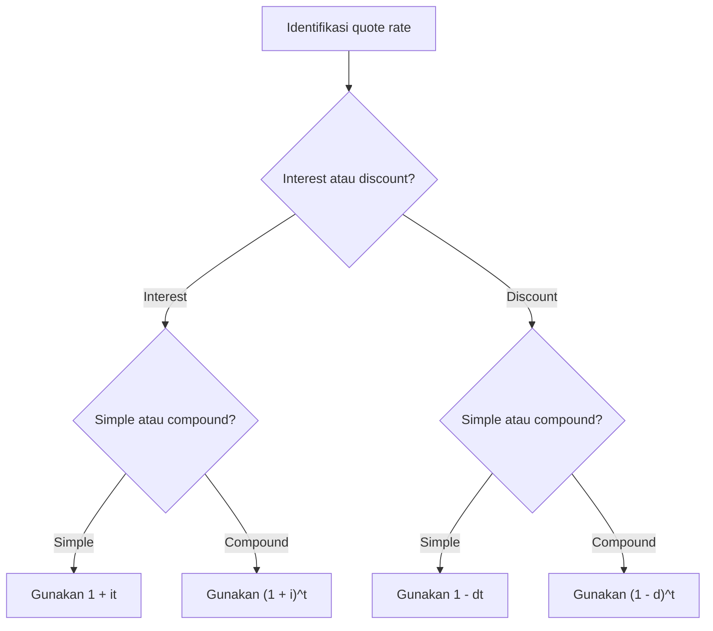

# 📘 1.1 — Interest Rates and Discount Rates

> [!ABSTRACT] Ringkasan Cepat
> **Topik:** Interest Rates and Discount Rates  
> **Bobot Parent Topic:** 10–20%  
> **Exam Priority:** High  
> **Difficulty:** Medium  
> **Primary Skill:** Mixed  
> **Ref:** Vaaler Bab 1–2; Kellison Bab 1–2

## Section 0 — Pemetaan Silabus & Exam Scope

| Field | Isi |
|---|---|
| Topik CF1 | Topik 1 — Nilai Waktu dari Uang |
| Subtopik | 1.1 Interest Rates and Discount Rates |
| Learning Outcome | Menjelaskan hubungan antara suku bunga dan tingkat diskonto pada periode tertentu |
| Skill Diuji | Mendefinisikan dan membedakan interest rate, discount rate, dan discount factor; menghitung nilai dengan simple/compound interest dan simple/compound discount; mengonversi effective interest rate dan effective discount rate yang ekuivalen |
| Bobot Parent Topic | 10–20% |
| Exam Priority | High |
| Prerequisite | Persentase, eksponen, aljabar sederhana, dan pembacaan timeline |
| Connected Topics | [[1.2 Effective, Nominal, and Force of Interest]], [[1.3 Cash Flow Equations and Inflation]], [[1.4 Accumulation and Present Value]], [[2.1 Annuity-Immediate and Annuity-Due]] |
| Referensi | Vaaler Bab 1–2; Kellison Bab 1–2 |

> [!IMPORTANT] Scope Boundary
> [CORE CF1] Note ini mencakup definisi interest, principal, accumulated value, accumulation function, effective interest rate $i$, effective discount rate $d$, discount factor $v$, serta simple dan compound interest/discount. Konversi nominal rate $i^{(m)}$, nominal discount $d^{(m)}$, dan force of interest $\delta$ dibahas di [[1.2 Effective, Nominal, and Force of Interest]]. Equation of value dengan banyak cash flow, inflasi, NPV, IRR, DWRR, dan TWRR berada di subtopik 1.3–1.5. Detail day-count convention tidak dijadikan materi inti kecuali dinyatakan dalam soal.

## Section 1 — Intuisi & Big Picture

Uang Rp10.000.000 hari ini dan Rp10.000.000 satu tahun lagi tidak setara. Jika uang tersedia hari ini, uang itu dapat diinvestasikan dan menghasilkan tambahan nilai. **Interest** adalah kompensasi atas penggunaan modal selama suatu interval waktu; dari sisi pemberi dana, interest adalah hasil investasi, sedangkan dari sisi peminjam, interest adalah biaya penggunaan dana.

Ada dua cara melihat kompensasi tersebut. Dengan **interest rate**, interest diukur relatif terhadap saldo pada **awal periode** dan biasanya dibayar atau dikreditkan pada akhir periode. Dengan **discount rate**, interest diukur relatif terhadap saldo pada **akhir periode** dan dipotong di muka. Karena denominator-nya berbeda, angka $8\%$ interest rate tidak ekuivalen dengan $8\%$ discount rate.

Timing menentukan denominator, pangkat, dan arah perpindahan nilai. Bergerak maju pada compound interest berarti mengalikan dengan accumulation factor; bergerak mundur berarti mengalikan dengan discount factor. Kesalahan intuitif yang paling umum adalah membandingkan $i$ dan $d$ hanya dari angka persentasenya, tanpa menyamakan basis nilai dan periode.

## Section 2 — Definisi & Core Concepts

### Definisi Formal

> [!NOTE] Definisi Formal
> Misalkan principal $K$ diinvestasikan pada waktu $0$, lalu bernilai $A_K(t)$ pada waktu $t$. Selisih
> 
> $$
> I= A_K(t)-K
> $$
> 
> adalah interest selama interval tersebut. **Accumulation function** $a(t)$ adalah nilai pada waktu $t$ dari investasi sebesar 1 pada waktu 0. Jika pertumbuhan proporsional terhadap principal, maka
> 
> $$
> A_K(t)=K a(t), \qquad a(0)=1.
> $$

### Terminologi Penting

| Istilah / Simbol | Definisi | Intuisi | Exam Note |
|---|---|---|---|
| Principal $K$ | Modal awal yang diinvestasikan atau dipinjam | Saldo pada awal transaksi | Jangan tertukar dengan accumulated value |
| Interest $I$ | Kenaikan nilai akibat investasi | “Sewa” atas penggunaan modal | $I=A_K(t)-K$ |
| Accumulated value $A_K(t)$ | Nilai principal $K$ pada waktu $t$ | Nilai setelah pertumbuhan | Pastikan unit waktu $t$ sama dengan basis rate |
| Accumulation function $a(t)$ | Nilai pada $t$ dari 1 unit pada waktu 0 | Faktor pertumbuhan dari 0 ke $t$ | Umumnya $A_K(t)=K a(t)$ |
| Effective interest rate $i$ | Interest satu periode dibagi saldo awal periode | Interest dihitung atas uang yang benar-benar tersedia di awal | Untuk satu periode, $1\mapsto 1+i$ |
| Effective discount rate $d$ | Interest satu periode dibagi saldo akhir periode | Interest dipotong di muka dari nilai jatuh tempo | Untuk satu periode, proceeds $1-d\mapsto$ repayment 1 |
| Accumulation factor | $1+i$ | Menggeser nilai satu periode ke depan | Bukan $i$ saja |
| Discount factor $v$ | Nilai kini dari 1 yang jatuh tempo satu periode lagi | Menggeser nilai satu periode ke belakang | $v=(1+i)^{-1}=1-d$ |
| Equivalent rates | Rates yang menghasilkan accumulated value sama untuk principal dan interval waktu yang sama | Basis berbeda, hasil ekonomi sama | Bandingkan lewat accumulation factor |

### Effective Interest Rate

Untuk satu periode, 1 unit pada awal periode tumbuh menjadi $1+i$ pada akhir periode:

$$
a(1)=1+i.
$$

Jika saldo awal adalah $B_0$ dan saldo akhir adalah $B_1$, maka

$$
i=\frac{B_1-B_0}{B_0}.
$$

Denominator $B_0$ adalah ciri utama $i$. Interest sebesar $B_1-B_0$ dibandingkan dengan dana yang tersedia pada awal periode.

### Effective Discount Rate

Jika nilai jatuh tempo pada akhir periode adalah $B_1$, sedangkan proceeds atau nilai pada awal periode adalah $B_0$, maka

$$
d=\frac{B_1-B_0}{B_1}.
$$

Denominator $B_1$ adalah ciri utama $d$. Untuk repayment 1 pada akhir periode, borrower menerima $1-d$ pada awal periode.

### Core Relationships: $i$, $d$, dan $v$

Untuk rates yang ekuivalen selama satu periode:

$$
1+i=\frac{1}{1-d}.
$$

Akibatnya,

$$
v=\frac{1}{1+i}=1-d,
$$

$$
d=\frac{i}{1+i}=iv,
$$

dan

$$
i=\frac{d}{1-d}.
$$

Hubungan lain yang kadang mempercepat manipulasi aljabar adalah

$$
i-d=id.
$$

> [!TIP] Makna Ekonomi
> $i$ dan $d$ mengukur nominal interest yang sama, tetapi terhadap basis berbeda. Karena saldo akhir lebih besar daripada saldo awal ketika rate positif, untuk pasangan rate ekuivalen berlaku
> 
> $$
> i>d>0.
> $$

### Simple Interest

Dengan simple interest rate $s$ per periode, interest selalu dihitung dari principal awal:

$$
a(t)=1+st,
$$

sehingga

$$
A_K(t)=K(1+st).
$$

Formula ini berlaku bila soal secara eksplisit menyatakan **simple interest**. Rate efektif aktual pada periode ke-$n$ bukan $s$, melainkan

$$
i_n=\frac{s}{1+s(n-1)},
$$

karena tambahan interest per periode tetap sebesar $Ks$, tetapi saldo awal periode terus membesar. Jadi $i_n$ menurun seiring waktu.

### Compound Interest

Dengan compound interest pada effective rate konstan $i$ per periode:

$$
a(t)=(1+i)^t,
$$

sehingga

$$
A_K(t)=K(1+i)^t.
$$

Setiap periode, interest sebelumnya ikut menghasilkan interest. Formula ini berlaku ketika $i$ efektif untuk unit waktu yang sama dengan $t$. Jika $i$ tahunan efektif, maka $t$ diukur dalam tahun.

### Simple Discount

Dengan simple discount rate $d_s$, discount function linear:

$$
v(t)=1-d_s t.
$$

Untuk nilai jatuh tempo $S$ pada waktu $t$, proceeds pada waktu 0 adalah

$$
P=S(1-d_s t),
$$

dengan syarat $0\le t<1/d_s$. Accumulation function yang bersesuaian adalah

$$
a(t)=\frac{1}{1-d_s t}.
$$

Simple discount bukan reciprocal langsung dari simple interest dengan rate numerik yang sama. Keduanya hanya menghasilkan faktor satu-periode yang sama bila rates-nya dikonversi secara ekuivalen.

### Compound Discount

Dengan effective discount rate konstan $d$, setiap periode mendiskontokan nilai sebesar faktor $1-d$:

$$
v(t)=(1-d)^t.
$$

Nilai kini dari $S$ yang jatuh tempo $t$ periode lagi adalah

$$
P=S(1-d)^t.
$$

Karena $1-d=v=(1+i)^{-1}$, compound discount dan compound interest yang ekuivalen menghasilkan nilai ekonomi yang sama:

$$
(1-d)^t=(1+i)^{-t}.
$$

## Section 3 — How It Works

### Jembatan Logika

```text
Narasi transaksi
↓
Tentukan saldo awal dan saldo akhir
↓
Identifikasi apakah rate berbasis saldo awal $i$ atau saldo akhir $d$
↓
Identifikasi simple atau compound
↓
Samakan unit waktu dengan periode rate
↓
Pilih focal date dan faktor perpindahan nilai
↓
Hitung, interpretasikan, lalu verifikasi arah hasil
```

### Mengapa Formula Konversi $i\leftrightarrow d$ Benar?

Ambil repayment 1 pada akhir periode.

- Dengan effective discount rate $d$, proceeds pada awal periode adalah $1-d$.
- Dengan effective interest rate ekuivalen $i$, proceeds tersebut tumbuh menjadi 1:

$$
(1-d)(1+i)=1.
$$

Maka

$$
1+i=\frac{1}{1-d},
$$

yang langsung menghasilkan seluruh relasi $i$, $d$, dan $v$.

### Timeline Satu Periode

| Waktu | Interest-basis view | Discount-basis view |
|---:|---:|---:|
| $t=0$ | $1$ | $1-d=v$ |
| $t=1$ | $1+i$ | $1$ |

Kedua kolom menggambarkan skala transaksi yang berbeda. Agar dibandingkan secara ekuivalen, normalisasikan salah satu ujung timeline. Misalnya, jika nilai akhir dinormalisasi menjadi 1, nilai awal interest-basis juga harus ditulis sebagai $v=1/(1+i)$.

> [!TIP] Cara Berpikir
> Jangan mulai dari hafalan pecahan. Tanyakan: **“Rate ini membagi interest dengan saldo yang mana?”** Jika saldo awal, gunakan $i$; jika saldo akhir, gunakan $d$. Untuk konversi, pakai identitas paling aman:
> 
> $$
> (1+i)(1-d)=1.
> $$

> [!DANGER] Jangan Salah Pikir
> 1. $i=8\%$ tidak ekuivalen dengan $d=8\%$.
> 2. Simple interest $a(t)=1+it$ tidak sama dengan compound interest $a(t)=(1+i)^t$ untuk $t>1$.
> 3. Discount factor $v$ bukan discount rate $d$; hubungannya adalah $v=1-d$, bukan $v=d$.
> 4. Kata “discounting” dapat berarti proses mencari present value, sedangkan “discount rate” adalah jenis rate tertentu. Present value dapat dihitung menggunakan interest rate melalui $v=(1+i)^{-1}$.

## Section 4 — Worked Examples & Exam Cases

### Case A — Fundamental

**Soal**

Seorang borrower membutuhkan proceeds bersih Rp10.000.000 hari ini. Pinjaman satu tahun mengenakan annual effective discount rate $8\%$. Tentukan:

1. repayment pada akhir tahun;
2. amount of interest yang dipotong di muka;
3. annual effective interest rate yang ekuivalen.

> [!SUCCESS] Pembahasan
>
> **1. Identifikasi informasi & unknown**
>
> Diketahui proceeds awal $B_0=\text{Rp}10.000.000$, $d=0{,}08$, dan term satu tahun. Repayment $B_1$, discount amount $I$, serta $i$ belum diketahui.
>
> **2. Timeline / Structure**
>
> - $t=0$: borrower menerima $B_0=B_1(1-d)$.
> - $t=1$: borrower membayar $B_1$.
>
> **3. Rate conversion**
>
> Rate sudah annual effective dan interval satu tahun, sehingga tidak ada frequency conversion.
>
> **4. Equation / Formula Selection**
>
> $$
> B_0=B_1(1-d).
> $$
>
> **5. Calculation**
>
> $$
> B_1=\frac{10.000.000}{1-0{,}08}
> =\text{Rp}10.869.565{,}22.
> $$
>
> Discount yang dipotong di muka:
>
> $$
> I=B_1-B_0
> =\text{Rp}869.565{,}22.
> $$
>
> Effective interest rate ekuivalen:
>
> $$
> i=\frac{d}{1-d}
> =\frac{0{,}08}{0{,}92}
> =0{,}0869565.
> $$
>
> Jadi $i\approx 8{,}6957\%$ per tahun efektif.
>
> **6. Interpretation**
>
> Walaupun quote discount rate hanya $8\%$, borrower membayar interest Rp869.565,22 atas dana yang benar-benar diterima sebesar Rp10.000.000. Karena itu biaya efektif terhadap proceeds adalah $8{,}6957\%$, bukan $8\%$.
>
> **7. Verification**
>
> $$
> \text{Rp}10.000.000(1+0{,}0869565)
> \approx \text{Rp}10.869.565{,}22.
> $$
>
> Karena rate positif dan ekuivalen, hasil juga memenuhi $i>d$.

> [!WARNING] Exam Trap — Case A
> - **Trap:** Menghitung repayment sebagai $\text{Rp}10.000.000(1+0{,}08)$.
> - **Mengapa distractor terlihat benar:** Bentuknya menyerupai formula pinjaman berbasis interest rate.
> - **Cara menghindari:** Kenali bahwa Rp10.000.000 adalah proceeds setelah discount, bukan face amount pada maturity.
> - **Shortcut aman:** Untuk proceeds $P$ dan one-period discount $d$, repayment $=P/(1-d)$.
> - **Target waktu:** 1–2 menit.

### Case B — Exam-Typical

**Soal**

Rp25.000.000 diinvestasikan selama 2,5 tahun. Bandingkan accumulated value jika investasi menghasilkan:

1. simple interest $8\%$ per tahun;
2. annual effective compound interest $8\%$.

Tentukan metode yang memberikan nilai lebih besar dan jelaskan alasannya.

> [!SUCCESS] Pembahasan
>
> **1. Identifikasi informasi & unknown**
>
> $K=\text{Rp}25.000.000$, $t=2{,}5$ tahun, dan rate $8\%$ per tahun. Unknown adalah dua accumulated values.
>
> **2. Timeline / Structure**
>
> - $t=0$: investasi Rp25.000.000.
> - $t=2{,}5$: nilai dibandingkan pada focal date yang sama.
>
> **3. Rate conversion**
>
> Kedua rate berbasis tahunan dan $t$ dinyatakan dalam tahun. Tidak diperlukan konversi.
>
> **4. Equation / Formula Selection**
>
> Simple interest:
>
> $$
> A_s(t)=K(1+st).
> $$
>
> Compound interest:
>
> $$
> A_c(t)=K(1+i)^t.
> $$
>
> **5. Calculation**
>
> Simple interest:
>
> $$
> A_s(2{,}5)
> =25.000.000[1+0{,}08(2{,}5)]
> =\text{Rp}30.000.000.
> $$
>
> Compound interest:
>
> $$
> A_c(2{,}5)
> =25.000.000(1{,}08)^{2{,}5}
> \approx\text{Rp}30.303.960{,}93.
> $$
>
> Selisih:
>
> $$
> A_c-A_s
> \approx\text{Rp}303.960{,}93.
> $$
>
> **6. Interpretation**
>
> Compound interest memberikan nilai lebih besar pada horizon 2,5 tahun karena interest yang telah terbentuk ikut menghasilkan interest. Simple interest selalu menambahkan $Ks$ per tahun berdasarkan principal awal.
>
> **7. Verification**
>
> Pada $t=1$, kedua metode menghasilkan $K(1{,}08)$. Untuk horizon lebih panjang dari satu tahun dan $i>0$, compound interest umumnya melampaui simple interest. Hasil numerik konsisten dengan arah tersebut.

> [!WARNING] Exam Trap — Case B
> - **Trap:** Menggunakan $25.000.000(1+0{,}08)\times 2{,}5$.
> - **Mengapa distractor terlihat benar:** Rate dan waktu sudah terlihat “dikalikan”, tetapi faktor pokoknya salah.
> - **Cara menghindari:** Simple: $1+it$. Compound: $(1+i)^t$.
> - **Shortcut aman:** Pada $t=1$, keduanya sama; untuk $t>1$ dan rate positif, compound biasanya lebih besar.
> - **Target waktu:** 2 menit.

### Case C — Challenging / Integrated

**Soal**

Sebuah kewajiban sebesar Rp15.000.000 jatuh tempo empat tahun lagi. Nilainya didiskontokan dengan annual effective discount rate $d=4\%$ secara compound. Tentukan:

1. present value kewajiban;
2. annual effective interest rate yang ekuivalen;
3. total interest selama empat tahun jika present value tersebut dianggap sebagai principal awal.

> [!SUCCESS] Pembahasan
>
> **1. Identifikasi informasi & unknown**
>
> Future value $S=\text{Rp}15.000.000$, $t=4$, dan $d=0{,}04$. Unknown: $P$, $i$, dan total interest.
>
> **2. Timeline / Structure**
>
> - $t=0$: present value $P$.
> - $t=4$: kewajiban Rp15.000.000.
>
> Focal date dipilih pada $t=0$.
>
> **3. Rate conversion**
>
> Annual effective discount rate sudah sejalan dengan periode tahunan. Discount factor per tahun:
>
> $$
> v=1-d=0{,}96.
> $$
>
> **4. Equation / Formula Selection**
>
> $$
> P=S(1-d)^t.
> $$
>
> **5. Calculation**
>
> $$
> P=15.000.000(0{,}96)^4
> =\text{Rp}12.740.198{,}40.
> $$
>
> Rate $i$ yang ekuivalen:
>
> $$
> i=\frac{d}{1-d}
> =\frac{0{,}04}{0{,}96}
> =0{,}0416667.
> $$
>
> Jadi $i\approx4{,}1667\%$ per tahun efektif.
>
> Total interest selama empat tahun:
>
> $$
> I=S-P
> =15.000.000-12.740.198{,}40
> =\text{Rp}2.259.801{,}60.
> $$
>
> **6. Interpretation**
>
> Rp12.740.198,40 hari ini, bila tumbuh pada effective interest rate ekuivalen $4{,}1667\%$, akan memenuhi kewajiban Rp15.000.000 empat tahun lagi.
>
> **7. Verification**
>
> Karena
>
> $$
> 1+i=\frac{1}{0{,}96},
> $$
>
> maka
>
> $$
> 12.740.198{,}40(1+i)^4
> =12.740.198{,}40\left(\frac{1}{0{,}96}\right)^4
> =\text{Rp}15.000.000.
> $$

> [!WARNING] Exam Trap — Case C
> - **Trap:** Menghitung $P=15.000.000/(1-0{,}04\times4)$, yang merupakan simple discount reversal dan bukan compound discount.
> - **Mengapa distractor terlihat benar:** Sama-sama memakai kata “discount”, tetapi pola akumulasinya berbeda.
> - **Cara menghindari:** Cari keyword simple atau compound. Effective discount rate konstan per periode menghasilkan faktor $(1-d)^t$.
> - **Shortcut aman:** Ubah langsung $v=1-d$, lalu $P=S v^t$.
> - **Target waktu:** 2–3 menit.

## Section 5 — Verification & Sanity Check

> [!CHECK] Sanity Check
> 1. Untuk $i>0$, accumulated value masa depan harus lebih besar daripada principal awal.
> 2. Untuk $d>0$, present value harus lebih kecil daripada future value.
> 3. Untuk rates positif yang ekuivalen, harus berlaku $i>d$, $0<v<1$, dan $v=1-d=1/(1+i)$.
> 4. Pada tepat satu periode, simple dan compound interest dengan angka rate yang sama menghasilkan nilai yang sama.
> 5. Jika horizon bertambah dengan compound interest positif, accumulated value harus meningkat; present value dari fixed future payment harus menurun.

### Metode Alternatif

| Tujuan | Metode Langsung | Metode Alternatif | Mana Lebih Cepat? |
|---|---|---|---|
| Konversi $i\to d$ | $d=i/(1+i)$ | Hitung $v=1/(1+i)$, lalu $d=1-v$ | Gunakan bentuk yang paling dekat dengan data |
| Konversi $d\to i$ | $i=d/(1-d)$ | Hitung $v=1-d$, lalu $i=1/v-1$ | $i=d/(1-d)$ biasanya tercepat |
| PV dengan compound discount | $P=S(1-d)^t$ | Konversi ke $i$, lalu $P=S(1+i)^{-t}$ | Metode $v=1-d$ mengurangi langkah |
| AV dengan compound interest | $A=K(1+i)^t$ | Gunakan $d=i/(1+i)$, lalu $A=K(1-d)^{-t}$ | Formula berbasis $i$ biasanya lebih langsung |

> [!NOTE] Pemeriksaan Identitas
> Jika ragu pada konversi, uji:
> 
> $$
> $(1+i)(1-d)=1$.
> $$
> 
> Jika hasil tidak sama dengan 1, rate yang digunakan belum ekuivalen atau terjadi kesalahan aritmetika.

## Section 6 — Connections & Mental Model

### Mental Model Utama

Satu garis waktu dapat dibaca dalam dua arah:

| Arah | Operasi compound | Faktor per periode |
|---|---|---|
| Maju ke masa depan | Accumulate | $1+i=(1-d)^{-1}$ |
| Mundur ke masa kini | Discount | $v=(1+i)^{-1}=1-d$ |

Posisi cash flow menentukan exponent. Dari $t=0$ ke $t=n$, kalikan dengan $(1+i)^n$. Dari $t=n$ kembali ke $t=0$, kalikan dengan $v^n$. Pergeseran satu periode yang salah berarti exponent juga salah satu unit.

### Connections

- [[1.2 Effective, Nominal, and Force of Interest]] memperluas rate ekuivalen ketika compounding/discounting terjadi lebih dari sekali setahun atau secara kontinu.
- [[1.3 Cash Flow Equations and Inflation]] memakai accumulation dan discount factors untuk memindahkan banyak cash flow ke satu focal date.
- [[1.4 Accumulation and Present Value]] memperluas nilai tunggal ke accumulation/discount functions yang mungkin berubah terhadap waktu.
- [[2.1 Annuity-Immediate and Annuity-Due]] menjumlahkan present value atau accumulated value dari serangkaian pembayaran.
- [[4.2 Amortization Method]] memakai $i$ untuk memisahkan interest dan principal setiap periode.
- [[5.1 Bond Pricing]] memakai discount factor untuk menilai coupon dan redemption value.

### Hubungan Visual ↔ Rumus

Jika cash flow digeser satu periode ke kanan, kalikan dengan $1+i$. Jika digeser satu periode ke kiri, kalikan dengan $v$. Karena kedua operasi harus saling membatalkan:

$$
(1+i)v=1.
$$

Karena $v=1-d$, hubungan tersebut juga menjelaskan mengapa $(1+i)(1-d)=1$.

## Section 7 — Exam Traps & Misconceptions

### Timing Trap

> [!BUG] Timing Trap
> **Salah:** Menganggap proceeds dan repayment berada pada waktu yang sama.  
> **Benar:** Untuk discount loan satu periode, proceeds $S(1-d)$ diterima pada awal periode dan repayment $S$ dibayar pada akhir periode.

### Rate / Frequency Trap

> [!BUG] Rate & Frequency Trap
> Annual effective rate berlaku untuk satu tahun penuh. Jangan langsung membagi annual effective rate dengan 12 untuk memperoleh monthly effective rate. Konversi tersebut termasuk scope [[1.2 Effective, Nominal, and Force of Interest]]. Pada 1.1, pastikan unit $t$ sama dengan periode effective rate.

### Formula / Notation Trap

> [!BUG] Formula Trap
> - $d\neq v$; yang benar adalah $v=1-d$.
> - $d\neq i/(1-i)$; yang benar adalah $d=i/(1+i)$.
> - Simple interest memakai $1+it$, sedangkan compound interest memakai $(1+i)^t$.
> - Simple discount memakai $1-dt$, sedangkan compound discount memakai $(1-d)^t$.

### Calculation Trap

> [!BUG] Calculation Trap
> Jika $i=10\%$, effective discount rate ekuivalen bukan $10\%$.
>
> **Salah**
>
> $$
> d=i=0{,}10.
> $$
>
> **Benar**
>
> $$
> d=\frac{i}{1+i}
> =\frac{0{,}10}{1{,}10}
> =0{,}090909.
> $$
>
> Jadi $d\approx9{,}0909\%$.

### Interpretation Trap

> [!BUG] Interpretation Trap
> Angka discount rate yang lebih kecil belum tentu lebih murah daripada interest rate yang lebih besar. Keduanya harus dikonversi ke basis ekuivalen. Misalnya, $d=4{,}9\%$ ekuivalen dengan
> 
> $$
> i=\frac{0{,}049}{0{,}951}\approx5{,}1525\%,
> $$
> 
> sehingga lebih mahal daripada pinjaman pada $i=5{,}1\%$.

### Red Flags

> [!CAUTION] Red Flags

| Keyword / Condition | Apa yang Harus Dipikirkan |
|---|---|
| “effective interest rate” | Interest dibagi saldo awal; faktor $1+i$ |
| “effective discount rate” | Interest dibagi saldo akhir; faktor $1-d$ |
| “interest paid in advance” | Discount-rate structure |
| “proceeds” | Dana bersih yang diterima pada awal periode |
| “amount due” / “maturity value” | Nilai pada akhir periode |
| “simple interest” | (a(t)=1+it) |
| “compound interest” | $a(t)=(1+i)^t$ |
| “simple discount” | (v(t)=1-dt) |
| “compound discount” | $v(t)=(1-d)^t$ |
| “equivalent rates” | Samakan accumulation over the same interval |
| “discount factor” | $v=(1+i)^{-1}=1-d$, bukan $d$ |
| “per annum effective” | Satu periode adalah satu tahun |

## Section 8 — Executive Summary

### Must Remember

> [!SUMMARY] Must Remember
> 1. [CORE CF1] $i$ membagi interest dengan saldo awal; $d$ membagi interest dengan saldo akhir.
> 2. Untuk satu periode, accumulation factor adalah $1+i$, sedangkan discount factor adalah $v=1-d$.
> 3. Hubungan induk: $(1+i)(1-d)=1$.
> 4. $v=(1+i)^{-1}=1-d$.
> 5. $d=i/(1+i)$ dan $i=d/(1-d)$.
> 6. Untuk rates positif yang ekuivalen, $i>d$.
> 7. Simple interest: $A_K(t)=K(1+it)$.
> 8. Compound interest: $A_K(t)=K(1+i)^t$.
> 9. Simple discount: $P=S(1-dt)$; compound discount: $P=S(1-d)^t$.
> 10. Sebelum menghitung, samakan unit waktu dan identifikasi apakah rate simple/compound serta interest/discount.

### Formula Map / Comparison Table

| Kondisi | Formula / Rule | Timing | Common Trap |
|---|---|---|---|
| Effective interest satu periode | $B_1=B_0(1+i)$ | Interest relatif terhadap $B_0$ | Memakai $d$ langsung sebagai $i$ |
| Effective discount satu periode | $B_0=B_1(1-d)$ | Discount relatif terhadap $B_1$ | Mengalikan proceeds dengan $1+d$ |
| Interest ke discount | $d=i/(1+i)$ | Periode harus sama | Salah denominator $1-i$ |
| Discount ke interest | $i=d/(1-d)$ | Periode harus sama | Menyamakan $i=d$ |
| Discount factor | $v=(1+i)^{-1}=1-d$ | Memindahkan satu periode mundur | Menyamakan $v=d$ |
| Simple interest | $A=K(1+it)$ | Interest hanya atas principal awal | Memakai exponent |
| Compound interest | $A=K(1+i)^t$ | Interest atas saldo berjalan | Memakai $1+it$ |
| Simple discount | $P=S(1-dt)$ | Discount total dipotong di muka | Memakai $(1-d)^t$ |
| Compound discount | $P=S(1-d)^t$ | Discount diaplikasikan per periode | Memakai $1-dt$ |

### Trigger Keywords

| Jika soal mengatakan... | Pikirkan... |
|---|---|
| “borrower receives” / “net proceeds” | Nilai awal setelah discount |
| “repays” / “amount due at maturity” | Nilai akhir |
| “interest based on beginning balance” | Effective interest rate $i$ |
| “interest deducted in advance” | Effective discount rate $d$ |
| “rates are equivalent” | $(1+i)(1-d)=1$ pada periode yang sama |
| “constant amount of interest each year” | Simple interest |
| “interest earns interest” | Compound interest |

### Kapan Digunakan

- Gunakan $A=K(1+it)$ hanya jika simple interest dinyatakan.
- Gunakan $A=K(1+i)^t$ untuk compound interest dengan effective rate konstan per unit waktu.
- Gunakan $P=S(1-d)^t$ untuk compound discount dengan effective discount rate konstan.
- Gunakan relasi $i\leftrightarrow d$ hanya untuk rates ekuivalen pada periode yang sama.

### Kapan TIDAK Boleh Digunakan

- Jangan memakai $i/12$ sebagai monthly effective rate jika $i$ adalah annual effective rate.
- Jangan memakai satu faktor konstan jika rate berubah antarperiode.
- Jangan memakai simple-interest formula jika soal menyatakan compounding.
- Jangan memakai $v=1-d$ jika $d$ bukan effective discount rate satu periode yang sejalan dengan $v$.
- Jangan menerapkan relasi effective-rate pada simple rates untuk horizon multi-periode tanpa membentuk faktor ekuivalen untuk interval yang dimaksud.

### Quick Decision Tree



## Section 9 — Active Recall Check

1. Jelaskan perbedaan denominator pada definisi effective interest rate $i$ dan effective discount rate $d$.
2. Mengapa $i>d$ untuk pasangan rate positif yang ekuivalen?
3. Turunkan hubungan $i=d/(1-d)$ dari timeline pinjaman satu periode.
4. Jika $i=12\%$ annual effective, susun formula untuk menemukan $d$ yang ekuivalen tanpa menghitung hasil akhirnya.
5. Jika borrower menerima $P$ sekarang dan membayar $S$ satu tahun lagi pada effective discount rate $d$, susun equation yang menghubungkan $P$, $S$, dan $d$.
6. Tuliskan accumulation function untuk simple interest dan compound interest, lalu jelaskan perbedaan pola pertumbuhannya.
7. Sebuah pembayaran $S$ jatuh tempo lima tahun lagi pada compound discount rate $d$. Susun formula present value-nya.
8. Mengapa discount factor $v$ tidak sama dengan discount rate $d$?
9. Apa kesalahan konsep ketika annual effective interest rate langsung dibagi 12 untuk memperoleh monthly effective rate?
10. Tanpa menghitung rinci, mana yang lebih besar untuk $i>0$ dan $t>1$: $K(1+it)$ atau $K(1+i)^t$? Jelaskan syarat dan alasannya.

## Section 10 — Exam Pattern Map

| Narasi Soal | Keyword | Konsep | Formula/Rule | Langkah | Trap | Shortcut |
|---|---|---|---|---|---|---|
| [TEXTBOOK-BASED EXPECTATION] Diberikan $i$, cari $d$ ekuivalen | “effective”, “equivalent” | Rate conversion | $d=i/(1+i)$ | Pastikan periode sama, substitusi, cek $d<i$ | Memakai $d=i$ | Gunakan $d=1-v$ jika $v$ sudah diketahui |
| [TEXTBOOK-BASED EXPECTATION] Diberikan $d$, cari biaya efektif terhadap proceeds | “discount deducted in advance”, “net proceeds” | Discount-to-interest | $i=d/(1-d)$ | Tentukan face amount dan proceeds, konversi | Membagi interest dengan face amount lagi | Denominator $1-d$ |
| [TEXTBOOK-BASED EXPECTATION] Bandingkan simple dan compound interest | “simple” vs “compounded” | Accumulation functions | $1+it$ vs $(1+i)^t$ | Samakan focal date dan unit waktu | Menukar kedua formula | Cek keduanya sama pada $t=1$ |
| [TEXTBOOK-BASED EXPECTATION] Cari proceeds dari maturity value | “amount due”, “discount rate”, “in advance” | Compound discount | $P=S(1-d)^t$ | Ubah $d$ menjadi $v=1-d$, pangkatkan | Memakai $S/(1-d)^t$ | Mundur waktu berarti faktor kurang dari 1 |
| [TEXTBOOK-BASED EXPECTATION] Tentukan rate dari dua saldo berurutan | “beginning balance”, “ending balance” | Definisi $i$ atau $d$ | $i=(B_1-B_0)/B_0$; $d=(B_1-B_0)/B_1$ | Identifikasi denominator dari wording | Denominator tertukar | $i$: initial; $d$: destination/end |

## Source Traceability

| Materi | Sumber |
|---|---|
| Interest, principal, amount function, dan accumulation function | Vaaler Bab 1, Sections 1.2–1.3; Kellison Bab 1, Sections 1.1–1.2 |
| Effective interest rate | Vaaler Bab 1, Section 1.3; Kellison Bab 1, Section 1.3 |
| Simple interest dan pola effective rate yang menurun | Vaaler Bab 1, Section 1.4; Kellison Bab 1, Section 1.4 |
| Compound interest dan accumulation function | Vaaler Bab 1, Section 1.5; Kellison Bab 1, Section 1.5 |
| Present value dan discount factor | Vaaler Bab 1, Section 1.7; Kellison Bab 1, Section 1.6 |
| Effective discount rate dan hubungan $i,d,v$ | Vaaler Bab 1, Sections 1.6 dan 1.9; Kellison Bab 1, Section 1.7 |
| Simple discount | Vaaler Bab 1, Section 1.8; Kellison Bab 1, Section 1.7 |
| Compound discount | Vaaler Bab 1, Section 1.9; Kellison Bab 1, Section 1.7 |
| Konsep equivalent rates | Vaaler Bab 1, Sections 1.6 dan 1.9; Kellison Bab 1, Section 1.7 |

---

> [!QUOTE] Follow-up Options
> 1. *"Uji saya dengan soal Active Recall dari topik ini"*
> 2. *"Buat 10 soal exam-style calculation untuk topik ini"*
> 3. *"Jelaskan hubungan topik ini dengan topik CF1 terkait"*

*📖 Ref: Vaaler Bab 1–2; Kellison Bab 1–2 | 🗓️ 2026-08-25 | #CF1 #MatematikaKeuangan*
