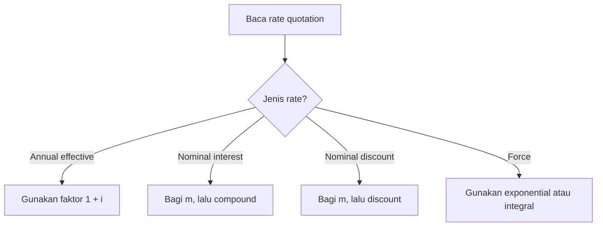

# 📘 1.2 — Effective, Nominal, and Force of Interest

> [!ABSTRACT] Ringkasan Cepat
> **Topik:** Effective, Nominal, and Force of Interest  
> **Bobot Parent Topic:** 10–20%  
> **Exam Priority:** High  
> **Difficulty:** Calculation-Intensive  
> **Primary Skill:** Calculation  
> **Ref:** Vaaler Bab 1–2; Kellison Bab 1–2

## Section 0 — Pemetaan Silabus & Exam Scope

| Field | Isi |
|---|---|
| Topik CF1 | Topik 1 — Nilai Waktu dari Uang |
| Subtopik | 1.2 Effective, Nominal, and Force of Interest |
| Learning Outcome | Menjelaskan hubungan antara suku bunga efektif, suku bunga nominal, dan *force of interest* |
| Skill Diuji | Mengidentifikasi rate quotation dan conversion frequency; mengonversi effective interest, nominal interest, nominal discount, dan force of interest; menghitung accumulation dengan discrete atau continuous compounding |
| Bobot Parent Topic | 10–20% |
| Exam Priority | High |
| Prerequisite | [[1.1 Interest Rates and Discount Rates]], eksponen, akar, logaritma natural, dan aljabar dasar |
| Connected Topics | [[1.1 Interest Rates and Discount Rates]], [[1.3 Cash Flow Equations and Inflation]], [[1.4 Accumulation and Present Value]], [[2.6 Varying Interest Rates]] |
| Referensi | Vaaler Bab 1–2; Kellison Bab 1–2 |

> [!IMPORTANT] Scope Boundary
> [CORE CF1] Note ini mencakup annual effective interest rate $i$, annual effective discount rate $d$, nominal interest rate $i^{(m)}$, nominal discount rate $d^{(m)}$, periodic rates, constant force of interest $\delta$, serta force yang berubah terhadap waktu $\delta_t$ sejauh diperlukan untuk accumulation. Simple interest/discount dan relasi dasar $i,d,v$ berada di [[1.1 Interest Rates and Discount Rates]]. Equation of value untuk banyak cash flow, inflasi, serta ukuran return berada di subtopik 1.3–1.5. Day-count convention dan calculator keystrokes tidak dijadikan materi inti.

## Section 1 — Intuisi & Big Picture

Quote “bunga 12% per tahun” belum cukup untuk menentukan pertumbuhan uang. Apakah 12% tersebut annual effective, nominal compounded monthly, atau continuously compounded? Ketiganya dapat menghasilkan nilai akhir yang berbeda. Karena itu, sebelum menghitung, rate harus dibaca bersama **jenis rate**, **conversion frequency**, dan **unit waktu**.

Nominal rate adalah label tahunan yang dibagi ke beberapa conversion periods. Jika $i^{(12)}=12\%$, periodic rate-nya adalah $1\%$ per bulan, bukan $12\%$ per bulan. Karena saldo bertumbuh setiap bulan, annual effective rate menjadi lebih besar daripada 12%. Angka nominal bukan faktor pertumbuhan satu tahun secara langsung.

Force of interest melihat pertumbuhan pada tingkat yang sangat kecil atau sesaat. Dengan force konstan $\delta$, uang tumbuh secara eksponensial dengan faktor $e^{\delta t}$. Semua quotation dapat dibandingkan secara adil hanya setelah menghasilkan accumulation factor yang sama pada interval waktu yang sama.

## Section 2 — Definisi & Core Concepts

### Definisi Formal

> [!NOTE] Definisi Formal
> Dua rate disebut **ekuivalen** apabila investasi dengan principal dan interval waktu yang sama menghasilkan accumulated value yang sama. Untuk satu tahun, seluruh rate ekuivalen harus menghasilkan annual accumulation factor yang sama.

### Terminologi Penting

| Istilah / Simbol | Definisi | Intuisi | Exam Note |
|---|---|---|---|
| $i$ | Annual effective interest rate | Pertumbuhan aktual selama satu tahun | Annual factor $=1+i$ |
| $d$ | Annual effective discount rate | Discount aktual selama satu tahun | Annual discount factor $=1-d$ |
| $i^{(m)}$ | Nominal annual interest rate convertible $m$ times per year | Label tahunan untuk $m$ periodic interest rates | Periodic rate $=i^{(m)}/m$ |
| $d^{(m)}$ | Nominal annual discount rate convertible $m$ times per year | Label tahunan untuk $m$ periodic discount rates | Periodic discount $=d^{(m)}/m$ |
| $m$ | Number of conversion periods per year | Frekuensi compounding/discounting | Monthly $m=12$, quarterly $m=4$, semiannual $m=2$ |
| $\delta_t$ | Force of interest pada waktu $t$ | Intensitas pertumbuhan sesaat per unit saldo | $\delta_t=a'(t)/a(t)$ |
| $\delta$ | Constant force of interest | Continuous compounding rate konstan | Annual factor $=e^\delta$ |
| $a(t)$ | Accumulation function | Nilai pada $t$ dari 1 pada waktu 0 | Untuk force berubah, $a(t)=e^{\int_0^t \delta_r\,dr}$ |

### Effective Interest Rate

Annual effective interest rate $i$ langsung menyatakan pertumbuhan selama satu tahun:

$$
a(1)=1+i.
$$

Untuk $t$ tahun dengan compound interest konstan:

$$
a(t)=(1+i)^t.
$$

### Nominal Interest Rate Convertible $m$ Times

Jika nominal annual interest rate adalah $i^{(m)}$, maka setiap conversion period sepanjang $1/m$ tahun menggunakan effective periodic rate

$$
j=\frac{i^{(m)}}{m}.
$$

Dalam satu tahun terdapat $m$ periods, sehingga

$$
1+i
=
\left(1+\frac{i^{(m)}}{m}\right)^m.
$$

Konversi dari nominal ke annual effective:

$$
i
=
\left(1+\frac{i^{(m)}}{m}\right)^m-1.
$$

Konversi dari annual effective ke nominal:

$$
i^{(m)}
=
m\left[(1+i)^{1/m}-1\right].
$$

Untuk investasi selama $t$ tahun, dengan $mt$ conversion periods:

$$
a(t)
=
\left(1+\frac{i^{(m)}}{m}\right)^{mt}.
$$

Formula ini memerlukan unit $t$ dalam tahun. Jika yang diberikan adalah jumlah conversion periods $n$, gunakan exponent $n$, bukan $mt$ lagi.

### Nominal Discount Rate Convertible $m$ Times

Jika nominal annual discount rate adalah $d^{(m)}$, effective discount rate per conversion period adalah

$$
q=\frac{d^{(m)}}{m}.
$$

Setiap subperiod memiliki discount factor $1-q$. Karena itu,

$$
1-d
=
\left(1-\frac{d^{(m)}}{m}\right)^m.
$$

Konversi dari nominal discount ke annual effective discount:

$$
d
=
1-\left(1-\frac{d^{(m)}}{m}\right)^m.
$$

Konversi dari annual effective discount ke nominal discount:

$$
d^{(m)}
=
m\left[1-(1-d)^{1/m}\right].
$$

Accumulation factor selama $t$ tahun adalah reciprocal dari discount factor:

$$
a(t)
=
\left(1-\frac{d^{(m)}}{m}\right)^{-mt}.
$$

### Direct Conversion: Nominal Interest dan Nominal Discount

Jika $i^{(m)}$ dan $d^{(p)}$ ekuivalen, mungkin dengan frekuensi berbeda, samakan annual accumulation factors:

$$
\left(1+\frac{i^{(m)}}{m}\right)^m
=
\left(1-\frac{d^{(p)}}{p}\right)^{-p}.
$$

Jika frekuensinya sama, yaitu $m=p$, cukup samakan faktor satu subperiod:

$$
\left(1+\frac{i^{(m)}}{m}\right)
\left(1-\frac{d^{(m)}}{m}\right)
=1.
$$

### Force of Interest

Untuk accumulation function yang dapat didiferensiasikan, force of interest pada waktu $t$ adalah

$$
\delta_t
=
\frac{a'(t)}{a(t)}
=
\frac{d}{dt}\ln a(t).
$$

Force membagi laju perubahan saldo dengan saldo saat itu, sehingga tidak bergantung pada besar principal. Dari definisi ini:

$$
a(t)
=
\exp\left(\int_0^t\delta_r\,dr\right).
$$

Jika force konstan, $\delta_t=\delta$, maka

$$
a(t)=e^{\delta t}.
$$

Relasi dengan annual effective rates:

$$
1+i=e^\delta,
$$

$$
\delta=\ln(1+i),
$$

$$
i=e^\delta-1,
$$

dan karena $1-d=(1+i)^{-1}$,

$$
\delta=-\ln(1-d).
$$

### Master Equivalence Chain

Untuk rate positif yang semuanya ekuivalen selama satu tahun:

$$
1+i
=
\left(1+\frac{i^{(m)}}{m}\right)^m
=
e^\delta
=
\left(1-\frac{d^{(p)}}{p}\right)^{-p}
=
\frac{1}{1-d}.
$$

Untuk frekuensi sama $m>1$, urutan rate positif adalah

$$
i>i^{(m)}>\delta>d^{(m)}>d.
$$

Urutan ini adalah **sanity check**, bukan pengganti perhitungan ekuivalensi.

## Section 3 — How It Works

### Jembatan Logika Rate Conversion

```text
Rate quotation
↓
Interest atau discount?
↓
Effective, nominal, atau force?
↓
Identifikasi conversion frequency
↓
Bangun accumulation factor pada interval yang sama
↓
Samakan faktor dan solve unknown
↓
Verify arah dan besar rate
```

### Langkah Universal

1. Pilih comparison interval, biasanya satu tahun.
2. Ubah quote menjadi faktor per conversion period.
3. Pangkatkan sebanyak jumlah conversion periods dalam comparison interval.
4. Jika force digunakan, pakai $e^{\int \delta_t\,dt}$.
5. Samakan accumulation factors.
6. Baru solve rate yang diminta.

### Mengapa Nominal Rate Dibagi $m$?

Definisi nominal rate menyatakan bahwa $i^{(m)}/m$ adalah effective interest rate per $1/m$ tahun. Jadi pembagian oleh $m$ bukan approximation, melainkan bagian dari definisi quotation. Namun annual effective rate tidak dibagi $m$; annual effective rate harus di-root untuk mencari rate ekuivalen per subperiod:

$$
j=(1+i)^{1/m}-1.
$$

> [!TIP] Cara Berpikir
> Gunakan **faktor**, bukan menghafal banyak formula terpisah. Interest menambah faktor: $1+i^{(m)}/m$. Discount mengurangi faktor: $1-d^{(m)}/m$. Force memakai exponential: $e^\delta$. Semua dibuat ekuivalen pada interval yang sama.

> [!DANGER] Jangan Salah Pikir
> 1. $i^{(12)}=12\%$ berarti $1\%$ per bulan, bukan $12\%$ per bulan.
> 2. Annual effective $i=12\%$ tidak berarti monthly effective $=1\%$.
> 3. $d^{(m)}/m$ adalah periodic **discount rate**, bukan periodic interest rate.
> 4. $\delta=5\%$ tidak sama dengan $i=5\%$; yang benar $i=e^{0.05}-1$.

## Section 4 — Worked Examples & Exam Cases

### Case A — Fundamental

**Soal**

Sebuah deposito menawarkan nominal annual interest rate $i^{(12)}=9{,}6\%$ compounded monthly. Tentukan:

1. monthly effective interest rate;
2. annual effective interest rate;
3. accumulated value Rp10.000.000 setelah dua tahun.

> [!SUCCESS] Pembahasan
>
> **1. Identifikasi informasi & unknown**
>
> Diketahui $i^{(12)}=0{,}096$, $m=12$, principal Rp10.000.000, dan $t=2$ tahun.
>
> **2. Timeline / Structure**
>
> Dua tahun terdiri dari $12\times2=24$ monthly conversion periods.
>
> **3. Rate conversion**
>
> Monthly effective rate:
>
> $$
> j=\frac{i^{(12)}}{12}
> =\frac{0{,}096}{12}
> =0{,}008.
> $$
>
> Jadi $j=0{,}8\%$ per bulan efektif.
>
> **4. Equation / Formula Selection**
>
> Annual effective rate:
>
> $$
> i=(1+j)^{12}-1.
> $$
>
> Accumulated value:
>
> $$
> A=K(1+j)^{24}.
> $$
>
> **5. Calculation**
>
> $$
> i=(1{,}008)^{12}-1
> \approx0{,}1003387.
> $$
>
> Jadi $i\approx10{,}0339\%$ per tahun efektif.
>
> $$
> A=10.000.000(1{,}008)^{24}
> \approx\text{Rp}12.107.452{,}41.
> $$
>
> **6. Interpretation**
>
> Annual effective rate lebih besar daripada nominal rate $9{,}6\%$ karena interest dikreditkan dan mulai menghasilkan interest setiap bulan.
>
> **7. Verification**
>
> $$
> 10.000.000(1+i)^2
> =10.000.000(1{,}1003387)^2
> \approx\text{Rp}12.107.452{,}41.
> $$

> [!WARNING] Exam Trap — Case A
> - **Trap:** Memakai $9{,}6\%/12=0{,}8\%$, lalu menyebut $0{,}8\%\times12=9{,}6\%$ sebagai annual effective rate.
> - **Mengapa distractor terlihat benar:** Penjumlahan 12 periodic rates mengabaikan interest-on-interest.
> - **Cara menghindari:** Annual factor adalah $(1{,}008)^{12}$, bukan $1+12(0{,}008)$.
> - **Shortcut aman:** Untuk positive nominal interest dan $m>1$, cek $i>i^{(m)}$.
> - **Target waktu:** 2 menit.

### Case B — Exam-Typical

**Soal**

Nominal annual discount rate $d^{(12)}=6\%$ convertible monthly ekuivalen dengan nominal annual interest rate $i^{(4)}$ convertible quarterly. Tentukan $i^{(4)}$.

> [!SUCCESS] Pembahasan
>
> **1. Identifikasi informasi & unknown**
>
> Diketahui $d^{(12)}=0{,}06$, discount frequency $p=12$, dan interest frequency $m=4$. Unknown adalah $i^{(4)}$.
>
> **2. Timeline / Structure**
>
> Gunakan satu tahun sebagai comparison interval: 12 monthly discount periods harus ekuivalen dengan 4 quarterly interest periods.
>
> **3. Rate conversion**
>
> Monthly effective discount rate:
>
> $$
> q=\frac{0{,}06}{12}=0{,}005.
> $$
>
> **4. Equation / Formula Selection**
>
> Samakan annual accumulation factors:
>
> $$
> \left(1+\frac{i^{(4)}}{4}\right)^4
> =
> (1-0{,}005)^{-12}.
> $$
>
> Ambil akar pangkat empat:
>
> $$
> 1+\frac{i^{(4)}}{4}
> =
> (0{,}995)^{-3}.
> $$
>
> **5. Calculation**
>
> $$
> i^{(4)}
> =4\left[(0{,}995)^{-3}-1\right]
> \approx0{,}0606050.
> $$
>
> Jadi
>
> $$
> i^{(4)}\approx6{,}0605\%.
> $$
>
> **6. Interpretation**
>
> Quote nominal interest quarterly sedikit lebih besar daripada quote nominal discount monthly karena interest dan discount menggunakan basis berbeda serta frekuensinya tidak sama.
>
> **7. Verification**
>
> Annual accumulation factor dari discount quote:
>
> $$
> (0{,}995)^{-12}\approx1{,}0619964.
> $$
>
> Annual accumulation factor dari hasil:
>
> $$
> \left(1+\frac{0{,}0606050}{4}\right)^4
> \approx1{,}0619964.
> $$

> [!WARNING] Exam Trap — Case B
> - **Trap:** Menyamakan langsung $i^{(4)}=d^{(12)}=6\%$.
> - **Mengapa distractor terlihat benar:** Kedua quote sama-sama dinyatakan “per annum”.
> - **Cara menghindari:** Samakan annual factors, bukan angka rate.
> - **Shortcut aman:** Untuk frequencies berbeda, jangan memakai relasi satu-subperiod; gunakan master equivalence chain.
> - **Target waktu:** 2–3 menit.

### Case C — Challenging / Integrated

**Soal**

Rp20.000.000 diinvestasikan selama tiga tahun. Selama 1,5 tahun pertama, fund menghasilkan nominal annual interest rate $i^{(4)}=8\%$ compounded quarterly. Selama 1,5 tahun berikutnya, fund menghasilkan constant force of interest $\delta=5\%$ per tahun. Tentukan:

1. accumulated value pada akhir tahun ketiga;
2. level annual effective interest rate ekuivalen selama tiga tahun;
3. level constant force ekuivalen selama tiga tahun.

> [!SUCCESS] Pembahasan
>
> **1. Identifikasi informasi & unknown**
>
> Principal $K=\text{Rp}20.000.000$. Tahap pertama menggunakan $i^{(4)}=0{,}08$ selama 1,5 tahun; tahap kedua menggunakan $\delta=0{,}05$ selama 1,5 tahun.
>
> **2. Timeline / Structure**
>
> - $t=0$ hingga $t=1{,}5$: $4(1{,}5)=6$ quarterly periods.
> - $t=1{,}5$ hingga $t=3$: continuous compounding selama 1,5 tahun.
>
> **3. Rate conversion**
>
> Quarterly effective rate:
>
> $$
> j=\frac{0{,}08}{4}=0{,}02.
> $$
>
> **4. Equation / Formula Selection**
>
> Total accumulation factor adalah product dari dua tahap:
>
> $$
> a(3)
> =(1{,}02)^6e^{0{,}05(1{,}5)}.
> $$
>
> **5. Calculation**
>
> Faktor tahap pertama:
>
> $$
> (1{,}02)^6\approx1{,}1261624.
> $$
>
> Faktor tahap kedua:
>
> $$
> e^{0{,}075}\approx1{,}0778842.
> $$
>
> Total factor:
>
> $$
> a(3)\approx1{,}1261624(1{,}0778842)
> \approx1{,}2138726.
> $$
>
> Accumulated value:
>
> $$
> A=20.000.000(1{,}2138726)
> \approx\text{Rp}24.277.452{,}46.
> $$
>
> Level annual effective rate $i_\ast$ memenuhi
>
> $$
> (1+i_\ast)^3=1{,}2138726.
> $$
>
> Maka
>
> $$
> i_\ast=(1{,}2138726)^{1/3}-1
> \approx0{,}0667379.
> $$
>
> Jadi $i_\ast\approx6{,}6738\%$ per tahun efektif.
>
> Level constant force $\delta_\ast$ memenuhi
>
> $$
> e^{3\delta_\ast}=1{,}2138726.
> $$
>
> Maka
>
> $$
> \delta_\ast
> =\frac{\ln(1{,}2138726)}{3}
> \approx0{,}0646053.
> $$
>
> Jadi $\delta_\ast\approx6{,}4605\%$ per tahun.
>
> **6. Interpretation**
>
> Rate regimes tidak boleh dirata-ratakan secara aritmetika. Yang dapat dikalikan adalah accumulation factors; equivalent rate baru diambil dari total factor tersebut.
>
> **7. Verification**
>
> $$
> (1+0{,}0667379)^3
> \approx e^{3(0{,}0646053)}
> \approx1{,}2138726.
> $$
>
> Selain itu, untuk rate positif ekuivalen, hasil memenuhi $i_\ast>\delta_\ast$.

> [!WARNING] Exam Trap — Case C
> - **Trap:** Merata-ratakan $8\%$ dan $5\%$ menjadi $6{,}5\%$.
> - **Mengapa distractor terlihat benar:** Kedua regimes berlangsung selama durasi yang sama, tetapi jenis quotation berbeda.
> - **Cara menghindari:** Bentuk dan kalikan factors terlebih dahulu.
> - **Shortcut aman:** Dalam log-space, total log-accumulation bersifat additive.
> - **Target waktu:** 3–4 menit.

## Section 5 — Verification & Sanity Check

> [!CHECK] Sanity Check
> 1. Untuk $i^{(m)}>0$ dan $m>1$, annual effective interest rate harus memenuhi $i>i^{(m)}$.
> 2. Untuk $d^{(m)}>0$ dan $m>1$, nominal discount rate memenuhi $d^{(m)}>d$.
> 3. Untuk rates positif ekuivalen dengan frekuensi sama, cek $i>i^{(m)}>\delta>d^{(m)}>d$.
> 4. Accumulation factor dari semua quotation ekuivalen harus sama pada interval yang sama.
> 5. Periodic interest factor harus lebih besar dari 1; periodic discount factor harus berada di antara 0 dan 1.
> 6. Jika $\delta>0$, maka $e^{\delta t}>1$ untuk $t>0$.

### Metode Alternatif

| Tujuan | Metode Langsung | Metode Alternatif | Exam Choice |
|---|---|---|---|
| $i^{(m)}\to i$ | $i=(1+i^{(m)}/m)^m-1$ | Hitung periodic factor, lalu pangkatkan | Langsung |
| $i\to i^{(m)}$ | $i^{(m)}=m[(1+i)^{1/m}-1]$ | Cari periodic effective rate dulu | Sama |
| $d^{(m)}\to i$ | $i=(1-d^{(m)}/m)^{-m}-1$ | Cari $d$, lalu konversi $d\to i$ | Direct factor lebih cepat |
| $i^{(m)}\leftrightarrow d^{(p)}$ | Samakan annual factors | Transit melalui annual effective $i$ | Direct jika algebra mudah; transit jika membantu struktur |
| $\delta\leftrightarrow i$ | $i=e^\delta-1$, $\delta=\ln(1+i)$ | Samakan $e^\delta=1+i$ | Gunakan identity langsung |
| Varying force | $a(t)=e^{\int_0^t \delta_r\,dr}$ | Piecewise factors jika force bertahap | Pilih sesuai bentuk data |

## Section 6 — Connections & Mental Model

### Mental Model: Semua Jalan Menuju Faktor yang Sama

| Quotation | Faktor satu tahun |
|---|---|
| Annual effective interest $i$ | $1+i$ |
| Nominal interest $i^{(m)}$ | $(1+i^{(m)}/m)^m$ |
| Constant force $\delta$ | $e^\delta$ |
| Nominal discount $d^{(p)}$ | $(1-d^{(p)}/p)^{-p}$ |
| Annual effective discount $d$ | $(1-d)^{-1}$ |

Anggap setiap quotation sebagai “bahasa” berbeda untuk menyatakan faktor pertumbuhan yang sama. Konversi rate berarti menerjemahkan quotation, bukan mengubah ekonomi transaksi.

### Connections

- [[1.1 Interest Rates and Discount Rates]] memberi relasi dasar $v=(1+i)^{-1}=1-d$.
- [[1.3 Cash Flow Equations and Inflation]] memakai rate yang telah dikonversi ke periode cash flow sebelum menyusun equation of value.
- [[1.4 Accumulation and Present Value]] memperluas penggunaan accumulation function dan present value.
- [[2.1 Annuity-Immediate and Annuity-Due]] membutuhkan periodic rate yang sama dengan payment frequency.
- [[2.4 Continuous Annuities]] menggunakan force of interest dan continuous discounting.
- [[2.6 Varying Interest Rates]] memakai product factors atau integral force ketika rate berubah.

### Hubungan Visual ↔ Rumus

Semakin sering conversion dilakukan, semakin kecil periodic interval. Pada limit continuous compounding:

$$
\lim_{m\to\infty}i^{(m)}=\delta,
$$

dan

$$
\lim_{m\to\infty}d^{(m)}=\delta.
$$

Nominal interest rates mendekati $\delta$ dari atas, sedangkan nominal discount rates mendekati $\delta$ dari bawah untuk positive equivalent rates.

## Section 7 — Exam Traps & Misconceptions

### Timing Trap

> [!BUG] Timing Trap
> Untuk nominal rate convertible monthly selama 18 bulan, jumlah periods adalah 18, bukan $12\times18$. Formula $mt$ hanya digunakan jika $t$ dinyatakan dalam tahun.

### Rate / Frequency Trap

> [!BUG] Rate & Frequency Trap
> **Nominal rate:** bagi dengan $m$ untuk memperoleh periodic rate.  
> **Annual effective rate:** ambil akar pangkat $m$, lalu kurangi 1.  
> Jangan memperlakukan kedua quotation dengan prosedur yang sama.

### Formula / Notation Trap

> [!BUG] Formula Trap
> - Interest: periodic factor $1+i^{(m)}/m$.
> - Discount: periodic discount factor $1-d^{(m)}/m$.
> - Continuous: factor $e^{\delta t}$.
> - $i^{(m)}$ adalah seluruh nominal annual rate, bukan periodic rate.

### Calculation Trap

> [!BUG] Calculation Trap
> Jika $i=12\%$ annual effective, monthly effective rate bukan $1\%$.
>
> **Salah**
>
> $$
> j=\frac{0{,}12}{12}=0{,}01.
> $$
>
> **Benar**
>
> $$
> j=(1{,}12)^{1/12}-1
> \approx0{,}0094888.
> $$
>
> Jadi $j\approx0{,}9489\%$ per bulan efektif.

### Interpretation Trap

> [!BUG] Interpretation Trap
> Rate dengan angka terbesar belum tentu menawarkan hasil terbesar jika jenis dan frequency-nya berbeda. Bandingkan annual accumulation factor atau effective rate yang ekuivalen, bukan raw quotation.

### Red Flags

> [!CAUTION] Red Flags

| Keyword / Condition | Apa yang Harus Dipikirkan |
|---|---|
| “annual effective” | Faktor satu tahun $1+i$; jangan langsung dibagi $m$ |
| “nominal” | Cari superscript $m$ dan conversion frequency |
| “convertible monthly” | $m=12$ dan periodic rate $i^{(12)}/12$ |
| “payable in advance” | Discount-rate structure |
| “nominal discount” | Periodic factor $1-d^{(m)}/m$ |
| “continuous compounding” | Force of interest dan $e^{\delta t}$ |
| “equivalent” | Samakan accumulation factors pada interval sama |
| “18 months” | Ubah ke 1,5 tahun atau langsung 18 monthly periods |
| “rate changes after...” | Product accumulation factors, jangan rata-rata raw rates |
| “varying force” | Integrasikan $\delta_t$ terhadap waktu |

## Section 8 — Executive Summary

### Must Remember

> [!SUMMARY] Must Remember
> 1. Nominal interest rate per conversion period adalah $i^{(m)}/m$.
> 2. Nominal discount rate per conversion period adalah $d^{(m)}/m$.
> 3. Annual effective rate tidak boleh langsung dibagi $m$.
> 4. $1+i=(1+i^{(m)}/m)^m$.
> 5. $1-d=(1-d^{(m)}/m)^m$.
> 6. $1+i=e^\delta$, sehingga $\delta=\ln(1+i)$.
> 7. Jika frequency berbeda, samakan annual accumulation factors.
> 8. Selama $t$ tahun, exponent discrete adalah $mt$, sedangkan continuous factor adalah $e^{\delta t}$.
> 9. Untuk varying force, $a(t)=e^{\int_0^t \delta_r\,dr}$.
> 10. Verifikasi dengan arah $i>i^{(m)}>\delta>d^{(m)}>d$ untuk positive equivalent rates dan $m>1$.

### Formula Map / Comparison Table

| Diketahui | Ditanya | Formula | Common Trap |
|---|---|---|---|
| $i^{(m)}$ | Periodic interest | $j=i^{(m)}/m$ | Menganggap $i^{(m)}$ sebagai periodic rate |
| $i^{(m)}$ | $i$ | $i=(1+i^{(m)}/m)^m-1$ | Menjumlahkan periodic rates |
| $i$ | $i^{(m)}$ | $i^{(m)}=m[(1+i)^{1/m}-1]$ | Memakai $i/m$ |
| $d^{(m)}$ | $d$ | $d=1-(1-d^{(m)}/m)^m$ | Salah tanda plus/minus |
| $d^{(m)}$ | $i$ | $i=(1-d^{(m)}/m)^{-m}-1$ | Lupa reciprocal |
| $i$ | $\delta$ | $\delta=\ln(1+i)$ | Menyamakan $\delta=i$ |
| $\delta$ | $i$ | $i=e^\delta-1$ | Memakai $e^i-1$ |
| $\delta_t$ | $a(t)$ | $a(t)=e^{\int_0^t \delta_r\,dr}$ | Tidak mengintegrasikan |

### Trigger Keywords

| Jika soal mengatakan... | Pikirkan... |
|---|---|
| “compounded quarterly” | $m=4$, periodic rate $i^{(4)}/4$ |
| “convertible monthly” | $m=12$ |
| “payable semiannually in advance” | Nominal discount dengan $m=2$ |
| “annual percentage yield” | Annual effective rate |
| “continuously compounded” | Constant force $\delta$ |
| “instantaneous rate” | $\delta_t=a'(t)/a(t)$ |
| “equivalent nominal rate” | Samakan factors sebelum solve |

### Kapan Digunakan

- Gunakan nominal formulas hanya ketika quote menyebut convertible, compounded, atau payable $m$ times per year.
- Gunakan force formula ketika rate dinyatakan continuously compounded atau sebagai $\delta_t$.
- Gunakan integral force ketika force berubah secara kontinu terhadap waktu.
- Gunakan product factors jika rate berubah secara piecewise.

### Kapan TIDAK Boleh Digunakan

- Jangan membagi annual effective rate dengan $m$ untuk periodic equivalent rate.
- Jangan memakai $e^{\delta t}$ jika $\delta$ berubah terhadap waktu tanpa integrasi.
- Jangan memakai exponent $mt$ jika $t$ sudah berupa jumlah conversion periods.
- Jangan menyamakan nominal interest dan nominal discount hanya karena angka quote sama.
- Jangan merata-ratakan raw rates dari quotation yang berbeda.

### Quick Decision Tree



## Section 9 — Active Recall Check

1. Apa perbedaan annual effective rate dan nominal annual rate convertible $m$ times?
2. Mengapa $i^{(12)}=12\%$ berarti monthly effective rate $1\%$, tetapi annual effective $i=12\%$ tidak?
3. Susun equation untuk mengonversi $i^{(4)}$ menjadi annual effective $i$.
4. Susun equation untuk mencari $d^{(12)}$ yang ekuivalen dengan $i^{(4)}$.
5. Jika $d^{(6)}$ diberikan, tuliskan annual accumulation factor tanpa melalui $d$.
6. Turunkan hubungan $\delta=\ln(1+i)$ dari $1+i=e^\delta$.
7. Sebuah fund menggunakan force $\delta_t=0{,}03+0{,}01t$. Susun accumulation factor dari $t=0$ sampai $t=4$ tanpa menghitung hasil akhirnya.
8. Mengapa product accumulation factors lebih tepat daripada arithmetic average ketika rate berubah?
9. Urutkan $i,i^{(m)},\delta,d^{(m)},d$ untuk positive equivalent rates dan $m>1$.
10. Apa sanity check utama setelah mengonversi dua rate quotation yang frekuensinya berbeda?

## Section 10 — Exam Pattern Map

| Narasi Soal | Keyword | Konsep | Formula/Rule | Langkah | Trap | Shortcut |
|---|---|---|---|---|---|---|
| [TEXTBOOK-BASED EXPECTATION] Nominal interest ke annual effective | “compounded monthly/quarterly” | Nominal rate | $i=(1+i^{(m)}/m)^m-1$ | Cari periodic rate, bentuk annual factor | Menganggap nominal sebagai effective | Cek $i>i^{(m)}$ |
| [TEXTBOOK-BASED EXPECTATION] Annual effective ke nominal | “equivalent nominal rate” | Root conversion | $i^{(m)}=m[(1+i)^{1/m}-1]$ | Root annual factor | Membagi $i/m$ | Cari periodic factor dulu |
| [TEXTBOOK-BASED EXPECTATION] Nominal discount ke nominal interest dengan frequency berbeda | “payable in advance”, “equivalent”, dua frequencies | Cross-basis conversion | $(1+i^{(m)}/m)^m=(1-d^{(p)}/p)^{-p}$ | Samakan annual factors | Menyamakan raw rates | Kerjakan langsung dalam factors |
| [TEXTBOOK-BASED EXPECTATION] Force ke effective interest | “continuously compounded” | Constant force | $i=e^\delta-1$ | Bentuk $e^\delta$, kurangi 1 | Menyamakan $i=\delta$ | Untuk positive rate, cek $i>\delta$ |
| [TEXTBOOK-BASED EXPECTATION] Varying force | “force at time $t$” | Instantaneous rate | $a(t)=e^{\int_0^t \delta_r\,dr}$ | Integrasikan, lalu exponentiate | Memakai $e^{\delta_t t}$ langsung | Integrasikan log-growth |
| [TEXTBOOK-BASED EXPECTATION] Piecewise rates | “first ... years, thereafter ...” | Product accumulation | Kalikan factor tiap segment | Hitung durasi/frequency setiap segment | Merata-ratakan rates | Work in accumulation factors |

## Source Traceability

| Materi | Sumber |
|---|---|
| Definisi nominal interest dan periodic rate $i^{(m)}/m$ | Vaaler Bab 1, Section 1.10; Kellison Bab 1, Section 1.8 |
| Konversi $i^{(m)}\leftrightarrow i$ | Vaaler Bab 1, Section 1.10; Kellison Bab 1, Section 1.8 |
| Nominal discount dan konversi $d^{(m)}\leftrightarrow d$ | Vaaler Bab 1, Section 1.10; Kellison Bab 1, Section 1.8 |
| Cross-frequency nominal interest/discount equivalence | Vaaler Bab 1, Section 1.10; Kellison Bab 1, Section 1.8 |
| Constant force of interest dan hubungan $1+i=e^\delta$ | Vaaler Bab 1, Sections 1.11–1.12; Kellison Bab 1, Section 1.9 |
| Instantaneous force $\delta_t=a'(t)/a(t)$ | Vaaler Bab 1, Section 1.12; Kellison Bab 1, Section 1.9 |
| Accumulation dengan varying force | Vaaler Bab 1, Section 1.12; Kellison Bab 1, Section 1.9 |
| Limit nominal rates menuju force | Vaaler Bab 1, Sections 1.11–1.12; Kellison Bab 1, Section 1.9 |

---

> [!QUOTE] Follow-up Options
> 1. *"Uji saya dengan soal Active Recall dari topik ini"*
> 2. *"Buat 10 soal exam-style calculation untuk topik ini"*
> 3. *"Jelaskan hubungan topik ini dengan topik CF1 terkait"*

*📖 Ref: Vaaler Bab 1–2; Kellison Bab 1–2 | 🗓️ 2026-08-25 | #CF1 #MatematikaKeuangan*
