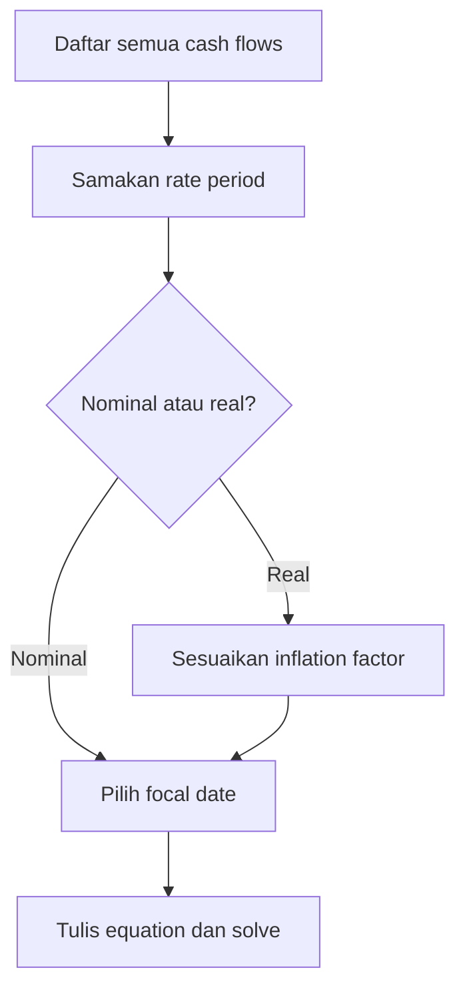

# 📘 1.3 — Cash Flow Equations and Inflation

> [!ABSTRACT] Ringkasan Cepat
> **Topik:** Cash Flow Equations and Inflation  
> **Bobot Parent Topic:** 10–20%  
> **Exam Priority:** High  
> **Difficulty:** Calculation-Intensive  
> **Primary Skill:** Mixed  
> **Ref:** Vaaler Bab 1–2; Kellison Bab 1–2

## Section 0 — Pemetaan Silabus & Exam Scope

| Field | Isi |
|---|---|
| Topik CF1 | Topik 1 — Nilai Waktu dari Uang |
| Subtopik | 1.3 Cash Flow Equations and Inflation |
| Learning Outcome | Menyelesaikan persamaan nilai arus kas dan menjelaskan nilai arus kas yang berkaitan dengan inflasi |
| Skill Diuji | Membuat timeline; menentukan cash-flow direction dan focal date; menyamakan rate period; menyusun dan menyelesaikan equation of value; mengonversi nominal monetary value menjadi real purchasing power dan sebaliknya |
| Bobot Parent Topic | 10–20% |
| Exam Priority | High |
| Prerequisite | [[1.1 Interest Rates and Discount Rates]], [[1.2 Effective, Nominal, and Force of Interest]], timeline, dan aljabar dasar |
| Connected Topics | [[1.4 Accumulation and Present Value]], [[1.5 NPV, IRR, DWRR, TWRR]], [[2.1 Annuity-Immediate and Annuity-Due]], [[4.2 Amortization Method]] |
| Referensi | Vaaler Bab 1 Sections 1.14 dan Bab 2 Sections 2.1–2.3; Kellison Bab 2 Sections 2.2–2.3 |

> [!IMPORTANT] Scope Boundary
> [CORE CF1] Note ini mencakup equation of value untuk single maupun multiple cash flows, pemilihan focal date, signed cash flows, unknown payment/time/rate pada bentuk dasar, price level, inflation rate, purchasing power, serta hubungan nominal monetary rate dan real rate. NPV, IRR, multiple roots, DWRR, dan TWRR dibahas di [[1.5 NPV, IRR, DWRR, TWRR]]. Anuitas dibahas mulai Topik 2. Day-count convention dan calculator keystrokes tidak dijadikan materi inti.

## Section 1 — Intuisi & Big Picture

Rp10.000.000 sekarang tidak dapat langsung dijumlahkan atau dibandingkan dengan Rp10.000.000 tiga tahun lagi. Masing-masing berada pada waktu berbeda dan memiliki opportunity cost berbeda. **Equation of value** menyelesaikan masalah ini dengan memindahkan seluruh cash flow ke satu tanggal pembanding, kemudian menyamakan nilai kedua sisi transaksi pada tanggal tersebut.

Focal date tidak harus waktu 0. Untuk loan yang dibayar pada tahun ketiga, sering kali focal date pada tahun ketiga menghasilkan equation lebih sederhana karena unknown payment tidak perlu didiskontokan lagi. Selama compound accumulation yang konsisten digunakan, focal date berbeda menghasilkan answer yang sama.

Inflasi menambahkan lapisan kedua: pertumbuhan jumlah rupiah belum tentu berarti pertumbuhan purchasing power. Jika investasi tumbuh 7% tetapi harga-harga naik 3%, real growth bukan tepat 4%; exact real rate diperoleh dengan membagi growth factors. Kesalahan intuitif yang umum adalah mencampurkan cash flow dalam rupiah nominal dengan cash flow dalam purchasing power tahun dasar.

## Section 2 — Definisi & Core Concepts

### Definisi Formal

> [!NOTE] Definisi Formal
> **Equation of value** adalah persamaan yang menyatakan bahwa nilai dua kumpulan cash flows adalah sama setelah seluruh cash flow dinilai pada **focal date** yang sama menggunakan accumulation/discount basis yang konsisten.

### Terminologi Penting

| Istilah / Simbol | Definisi | Intuisi | Exam Note |
|---|---|---|---|
| Cash flow $C_k$ | Pembayaran pada waktu $t_k$ | Uang masuk atau keluar | Tetapkan sign convention dari satu perspektif |
| Timeline | Representasi posisi cash flow terhadap waktu | Mencegah salah exponent | Tulis semua cash flow sebelum memilih formula |
| Focal date $\tau$ | Tanggal ketika seluruh nilai dibandingkan | “Satu meja” untuk membandingkan cash flows | Tidak harus $t=0$ |
| Equation of value | Kesetaraan nilai cash flows pada focal date | Nilai inflows = nilai outflows | Semua terms harus memakai focal date sama |
| $a(t)$ | Accumulation function dari waktu 0 ke $t$ | Faktor pertumbuhan | Untuk compound constant, $a(t)=(1+i)^t$ |
| $v$ | Discount factor satu periode | Memindahkan nilai satu periode ke belakang | $v=(1+i)^{-1}$ |
| $p(t)$ | Price-level function pada waktu $t$ | Harga suatu basket of goods | Purchasing power bergerak berlawanan dengan price level |
| $r$ | Effective inflation rate per periode | Pertumbuhan price level | $1+r=p(1)/p(0)$ untuk satu periode |
| $i_N$ | Nominal monetary interest rate | Pertumbuhan jumlah uang, belum disesuaikan inflasi | Bukan nominal convertible rate $i^{(m)}$ |
| $j$ | Real atau inflation-adjusted interest rate | Pertumbuhan purchasing power | $1+j=(1+i_N)/(1+r)$ |

> [!WARNING] Notation Collision
> Pada konteks inflasi, istilah **nominal interest rate** berarti rate sebelum penyesuaian inflasi dan ditulis $i_N$ di note ini. Ini berbeda dari **nominal rate convertible $m$ times**, $i^{(m)}$, pada [[1.2 Effective, Nominal, and Force of Interest]]. Simbol $j$ di sini berarti real rate, bukan periodic interest rate.

### Single Cash Flow Equation

Jika principal $C$ pada waktu 0 tumbuh dengan annual effective interest rate $i$ selama $T$ tahun menjadi $B$, equation pada waktu $T$ adalah

$$
B=C(1+i)^T.
$$

Dari empat quantities $B,C,i,T$, tiga quantities menentukan quantity keempat:

$$
C=B(1+i)^{-T},
$$

$$
i=\left(\frac{B}{C}\right)^{1/T}-1,
$$

dan

$$
T=\frac{\ln(B/C)}{\ln(1+i)}.
$$

### Multiple Cash Flows: General Equation

Dengan accumulation function $a(t)$, nilai pada focal date $\tau$ dari cash flow $C_k$ pada $t_k$ adalah

$$
C_k\frac{a(\tau)}{a(t_k)}.
$$

Jika kumpulan inflows ekuivalen dengan kumpulan outflows:

$$
\sum_{k\in\mathcal I}
C_k\frac{a(\tau)}{a(t_k)}
=
\sum_{k\in\mathcal O}
C_k\frac{a(\tau)}{a(t_k)}.
$$

Untuk compound interest konstan:

$$
\sum_{k\in\mathcal I}C_k(1+i)^{\tau-t_k}
=
\sum_{k\in\mathcal O}C_k(1+i)^{\tau-t_k}.
$$

Exponent positif berarti cash flow diakumulasikan maju; exponent negatif berarti didiskontokan mundur.

### Signed Cash-Flow Form

Jika inflow diberi sign positif dan outflow sign negatif dari perspektif yang sama:

$$
\sum_k C_k(1+i)^{\tau-t_k}=0.
$$

Sign convention boleh dibalik, asalkan konsisten untuk seluruh cash flows.

### Common Focal Dates

Pada waktu 0:

$$
\sum_{k\in\mathcal I}C_kv^{t_k}
=
\sum_{k\in\mathcal O}C_kv^{t_k}.
$$

Pada waktu $T$:

$$
\sum_{k\in\mathcal I}C_k(1+i)^{T-t_k}
=
\sum_{k\in\mathcal O}C_k(1+i)^{T-t_k}.
$$

Pilih focal date yang menghilangkan sebanyak mungkin discount/accumulation steps, terutama jika unknown cash flow berada tepat pada suatu tanggal.

### Mengapa Focal Date Tidak Mengubah Answer?

Di bawah compound accumulation konsisten, equation pada $\tau_2$ diperoleh dengan mengalikan seluruh equation pada $\tau_1$ dengan faktor

$$
\frac{a(\tau_2)}{a(\tau_1)}.
$$

Karena kedua sisi dikalikan faktor yang sama, solusi unknown tidak berubah. Pernyataan ini tidak boleh diterapkan secara sembarang pada simple interest/discount yang tidak memiliki multiplicative accumulation consistency antarinterval.

### Inflation Rate dan Price Level

Jika $p(t)$ adalah price level, effective inflation rate dari $t_1$ ke $t_2$ adalah

$$
r_{[t_1,t_2]}
=
\frac{p(t_2)-p(t_1)}{p(t_1)}.
$$

Maka

$$
1+r_{[t_1,t_2]}
=
\frac{p(t_2)}{p(t_1)}.
$$

Jika inflation rate konstan sebesar $r$ per tahun:

$$
p(t)=p(0)(1+r)^t.
$$

### Nominal Value dan Real Purchasing Power

Nominal amount $X_t$ pada waktu $t$, dinyatakan dalam purchasing power waktu 0, adalah

$$
X_t^{\text{real at }0}
=
\frac{X_t}{(1+r)^t}.
$$

Sebaliknya, nominal amount pada waktu $t$ yang diperlukan agar setara dengan real amount $X_0$ saat ini adalah

$$
X_t=X_0(1+r)^t.
$$

Jika inflation rate berubah per tahun:

$$
X_t
=
X_0\prod_{k=1}^{t}(1+r_k).
$$

### Exact Fisher Relationship

Jika nominal monetary rate adalah $i_N$, inflation rate adalah $r$, dan real rate adalah $j$:

$$
1+j
=
\frac{1+i_N}{1+r}.
$$

Sehingga

$$
j
=
\frac{i_N-r}{1+r},
$$

dan

$$
i_N=j+r+jr.
$$

Approximation

$$
j\approx i_N-r
$$

hanya layak untuk rates kecil dan jika approximation memang dapat diterima. Untuk exam calculation, gunakan exact relationship kecuali soal meminta pendekatan.

## Section 3 — How It Works

### Jembatan Logika Equation of Value

```text
Narasi transaksi
↓
Pilih perspektif dan sign convention
↓
Gambar timeline
↓
Samakan unit rate dan cash-flow timing
↓
Pilih focal date
↓
Pindahkan setiap cash flow ke focal date
↓
Tulis equation of value
↓
Solve unknown dan verify
```

### Jembatan Logika Inflation-Adjusted Cash Flow

```text
Nominal cash flow atau real target?
↓
Identifikasi base-date purchasing power
↓
Bangun cumulative inflation factor
↓
Ubah seluruh values ke basis nominal atau real yang sama
↓
Gunakan equation of value
↓
Interpretasikan nominal amount dan real purchasing power
```

### Langkah Universal

1. Tentukan unit waktu: tahun, semester, kuartal, atau bulan.
2. Konversi rate ke unit tersebut.
3. Tulis setiap cash flow tepat pada waktunya.
4. Tentukan perspektif: borrower, lender, investor, atau fund.
5. Pilih satu focal date.
6. Untuk setiap cash flow, hitung jarak ke focal date dan tentukan arah perpindahan.
7. Susun inflows (=) outflows atau signed sum $=0$.
8. Solve unknown dan lakukan sanity check.

> [!TIP] Cara Berpikir
> Tulis exponent sebagai **focal time minus cash-flow time**:
> 
> $$
> \text{exponent}=\tau-t_k.
> $$
> 
> Rule ini otomatis menghasilkan exponent positif untuk accumulation dan negatif untuk discounting.

> [!DANGER] Jangan Salah Pikir
> 1. Jangan menjumlahkan cash flows pada tanggal berbeda sebelum dipindahkan ke focal date.
> 2. Jangan memakai rate tahunan dengan exponent bulan tanpa konversi.
> 3. Jangan memindahkan sebagian cash flow ke waktu 0 dan sebagian ke waktu $T$ dalam equation yang sama.
> 4. Jangan mengurangkan inflation rate dari investment rate jika exact answer diminta.

## Section 4 — Worked Examples & Exam Cases

### Case A — Fundamental

**Soal**

Seorang borrower menerima pinjaman Rp12.000.000 pada waktu 0. Ia membayar Rp5.000.000 pada akhir tahun pertama dan melunasi sisanya dengan pembayaran $X$ pada akhir tahun ketiga. Pinjaman menggunakan annual effective interest rate $8\%$. Tentukan $X$.

> [!SUCCESS] Pembahasan
>
> **1. Identifikasi informasi & unknown**
>
> Dari perspektif borrower: inflow Rp12.000.000 pada $t=0$, outflows Rp5.000.000 pada $t=1$ dan $X$ pada $t=3$. Rate $i=0{,}08$.
>
> **2. Timeline / Structure**
>
> | Waktu | Cash flow borrower |
> |---:|---:|
> | 0 | $+\text{Rp}12.000.000$ |
> | 1 | $-\text{Rp}5.000.000$ |
> | 3 | $-X$ |
>
> **3. Rate conversion**
>
> Rate sudah annual effective dan timeline dalam tahun. Tidak ada conversion.
>
> **4. Equation / Formula Selection**
>
> Pilih focal date $t=3$, sehingga $X$ tidak perlu dipindahkan:
>
> $$
> 12.000.000(1{,}08)^3
> =5.000.000(1{,}08)^2+X.
> $$
>
> **5. Calculation**
>
> $$
> X
> =12.000.000(1{,}08)^3
> -5.000.000(1{,}08)^2
> =\text{Rp}9.284.544.
> $$
>
> **6. Interpretation**
>
> Pembayaran akhir Rp9.284.544 menutup accumulated value dari original debt setelah memperhitungkan pembayaran tahun pertama.
>
> **7. Verification**
>
> Dengan focal date 0:
>
> $$
> 12.000.000
> =5.000.000v+9.284.544v^3,
> \qquad v=\frac{1}{1{,}08}.
> $$
>
> Kedua focal dates menghasilkan equality yang sama.

> [!WARNING] Exam Trap — Case A
> - **Trap:** Menulis $12.000.000=5.000.000+X$ dan mengabaikan timing.
> - **Mengapa distractor terlihat benar:** Secara nominal, transaksi terlihat seperti pembagian repayment.
> - **Cara menghindari:** Accumulate atau discount seluruh cash flows ke satu tanggal.
> - **Shortcut aman:** Pilih focal date pada tanggal unknown payment.
> - **Target waktu:** 1–2 menit.

### Case B — Exam-Typical

**Soal**

Sebuah kewajiban Rp20.000.000 pada waktu 0 akan diganti dengan pembayaran Rp8.000.000 enam bulan lagi dan pembayaran $X$ delapan belas bulan lagi. Rate yang berlaku adalah nominal annual interest rate $i^{(12)}=9{,}6\%$ compounded monthly. Tentukan $X$.

> [!SUCCESS] Pembahasan
>
> **1. Identifikasi informasi & unknown**
>
> Original obligation Rp20.000.000 pada bulan 0; replacement payments Rp8.000.000 pada bulan 6 dan $X$ pada bulan 18.
>
> **2. Timeline / Structure**
>
> | Bulan | Original obligation | Replacement payments |
> |---:|---:|---:|
> | 0 | Rp20.000.000 | — |
> | 6 | — | Rp8.000.000 |
> | 18 | — | $X$ |
>
> **3. Rate conversion**
>
> Monthly effective rate:
>
> $$
> j_m=\frac{i^{(12)}}{12}
> =\frac{0{,}096}{12}
> =0{,}008.
> $$
>
> **4. Equation / Formula Selection**
>
> Pilih focal date bulan 18:
>
> $$
> 20.000.000(1{,}008)^{18}
> =8.000.000(1{,}008)^{12}+X.
> $$
>
> **5. Calculation**
>
> $$
> X
> =20.000.000(1{,}008)^{18}
> -8.000.000(1{,}008)^{12}
> \approx\text{Rp}14.281.742{,}68.
> $$
>
> **6. Interpretation**
>
> Pembayaran bulan ke-6 mengurangi kewajiban, tetapi nilainya masih harus diakumulasikan 12 bulan agar dapat dibandingkan dengan $X$ pada bulan ke-18.
>
> **7. Verification**
>
> Nilai pada waktu 0 memenuhi
>
> $$
> 20.000.000
> =8.000.000(1{,}008)^{-6}
> +14.281.742{,}68(1{,}008)^{-18}.
> $$

> [!WARNING] Exam Trap — Case B
> - **Trap:** Menggunakan annual exponent $1{,}5$ pada periodic factor $1{,}008$.
> - **Mengapa distractor terlihat benar:** Delapan belas bulan sama dengan 1,5 tahun, tetapi factor $1{,}008$ adalah monthly factor.
> - **Cara menghindari:** Monthly factor harus memakai jumlah bulan sebagai exponent.
> - **Shortcut aman:** Gunakan unit bulan untuk seluruh timeline setelah periodic rate ditemukan.
> - **Target waktu:** 2–3 menit.

### Case C — Challenging / Integrated

**Soal**

Seorang investor ingin memiliki purchasing power empat tahun lagi yang setara dengan Rp100.000.000 hari ini. Inflation rate diperkirakan konstan $3\%$ per tahun, sedangkan investasinya menghasilkan annual effective monetary interest rate $7\%$. Berapa dana yang harus diinvestasikan hari ini?

> [!SUCCESS] Pembahasan
>
> **1. Identifikasi informasi & unknown**
>
> Real target pada base date: Rp100.000.000. Inflation $r=0{,}03$, monetary rate $i_N=0{,}07$, horizon $t=4$, dan initial investment $P$ belum diketahui.
>
> **2. Timeline / Structure**
>
> - $t=0$: invest $P$.
> - $t=4$: accumulated money harus membeli basket yang hari ini berharga Rp100.000.000.
>
> **3. Inflation conversion**
>
> Nominal amount yang dibutuhkan pada tahun keempat:
>
> $$
> X_4
> =100.000.000(1{,}03)^4
> =\text{Rp}112.550.881.
> $$
>
> **4. Equation / Formula Selection**
>
> Equation pada $t=4$:
>
> $$
> P(1{,}07)^4
> =100.000.000(1{,}03)^4.
> $$
>
> **5. Calculation**
>
> $$
> P
> =100.000.000\left(\frac{1{,}03}{1{,}07}\right)^4
> \approx\text{Rp}85.864.528{,}23.
> $$
>
> Metode real rate memberikan hasil sama. Exact real rate:
>
> $$
> j
> =\frac{1{,}07}{1{,}03}-1
> \approx0{,}038835.
> $$
>
> Maka
>
> $$
> P
> =\frac{100.000.000}{(1+j)^4}
> \approx\text{Rp}85.864.528{,}23.
> $$
>
> **6. Interpretation**
>
> Investor tidak perlu menginvestasikan Rp100.000.000 saat ini karena real investment return masih positif sekitar $3{,}8835\%$ per tahun. Namun target nominal empat tahun lagi harus lebih besar dari Rp100.000.000 akibat inflasi.
>
> **7. Verification**
>
> $$
> 85.864.528{,}23(1{,}07)^4
> \approx\text{Rp}112.550.881,
> $$
>
> dan real purchasing power-nya
>
> $$
> \frac{112.550.881}{(1{,}03)^4}
> =\text{Rp}100.000.000.
> $$

> [!WARNING] Exam Trap — Case C
> - **Trap:** Memakai real rate $7\%-3\%=4\%$ sebagai exact rate.
> - **Mengapa distractor terlihat benar:** Selisih rates adalah approximation yang dekat.
> - **Cara menghindari:** Gunakan ratio of factors $(1+i_N)/(1+r)$.
> - **Shortcut aman:** Untuk real target, discount dengan exact real rate atau inflate target lalu discount dengan monetary rate.
> - **Target waktu:** 2–3 menit.

## Section 5 — Verification & Sanity Check

> [!CHECK] Sanity Check
> 1. Semua terms dalam equation harus berada pada focal date yang sama.
> 2. Cash flow sebelum focal date memakai accumulation factor; cash flow sesudah focal date memakai discount factor.
> 3. Mengganti focal date harus menghasilkan unknown yang sama di bawah compound accumulation konsisten.
> 4. Jika $i_N>r>0$, real rate harus positif tetapi lebih kecil daripada $i_N-r$.
> 5. Jika $i_N=r$, real rate adalah 0 dan purchasing power tetap.
> 6. Untuk $r>0$, nominal amount yang mempertahankan fixed purchasing power harus meningkat terhadap waktu.

### Metode Alternatif

| Problem | Metode 1 | Metode 2 | Exam Choice |
|---|---|---|---|
| Unknown payment | Focal date pada unknown payment | Focal date 0 | Pilih focal date pada unknown untuk mengurangi terms |
| Multiple cash flows | Inflows = outflows | Signed sum $=0$ | Gunakan yang mengurangi sign error |
| Inflation-adjusted target | Inflate real target, lalu discount nominally | Discount real target dengan real rate | Keduanya setara; pilih yang lebih intuitif |
| Unknown time single cash flow | Logarithm equation | Trial and error | Logarithm lebih exact |
| Unknown rate simple polynomial | Algebraic root | Numerical solving | Algebra jika degree rendah; detail IRR di 1.5 |

### Focal-Date Equivalence Check

Jika equation waktu 0 adalah

$$
\sum C_kv^{t_k}=0,
$$

kalikan seluruh equation dengan $(1+i)^T$ untuk memperoleh equation pada waktu $T$:

$$
\sum C_k(1+i)^{T-t_k}=0.
$$

Ini adalah cara cepat memeriksa konsistensi exponent.

## Section 6 — Connections & Mental Model

### Mental Model: Dua Lapisan Nilai

| Lapisan | Pertanyaan | Faktor |
|---|---|---|
| Time value of money | Berapa nilai cash flow pada focal date? | Accumulation/discount factor |
| Inflation | Berapa purchasing power cash flow tersebut? | Price-level/inflation factor |

Jangan mencampur dua lapisan. Pertama, pastikan seluruh amount berada pada monetary basis yang sama—nominal atau real. Setelah itu, lakukan equation of value pada focal date yang sama.

### Connections

- [[1.1 Interest Rates and Discount Rates]] menyediakan $v=(1+i)^{-1}$.
- [[1.2 Effective, Nominal, and Force of Interest]] memastikan rate period sama dengan timeline.
- [[1.4 Accumulation and Present Value]] memperluas penggunaan accumulation function dan discount function.
- [[1.5 NPV, IRR, DWRR, TWRR]] memakai signed discounted cash flows untuk mengukur return.
- [[2.1 Annuity-Immediate and Annuity-Due]] adalah equation of value untuk series of level payments.
- [[4.2 Amortization Method]] menggunakan equation of value untuk loan payments dan outstanding balance.

### Hubungan Visual ↔ Rumus

Posisi cash flow pada timeline menentukan exponent:

$$
\tau-t_k.
$$

- Cash flow di kiri focal date: $\tau-t_k>0$, accumulate.
- Cash flow di kanan focal date: $\tau-t_k<0$, discount.
- Cash flow tepat pada focal date: exponent 0, factor 1.

Untuk inflation adjustment, nominal amount dibagi cumulative price-level factor agar dinyatakan dalam purchasing power base date.

## Section 7 — Exam Traps & Misconceptions

### Timing Trap

> [!BUG] Timing Trap
> Pembayaran “at the end of year 3” berada pada $t=3$, bukan setelah tiga full periods dari cash flow terakhir. Exponent selalu dihitung dari posisi aktual cash flow menuju focal date.

### Rate / Frequency Trap

> [!BUG] Rate & Frequency Trap
> Jika quote adalah nominal convertible monthly, gunakan periodic monthly rate dan hitung jarak dalam bulan. Jangan memakai monthly factor dengan exponent tahun.

### Formula / Notation Trap

> [!BUG] Formula Trap
> - Focal date (0): future cash flow memakai $v^t$.
> - Focal date $T$: earlier cash flow memakai $(1+i)^{T-t}$.
> - Real rate: $1+j=(1+i_N)/(1+r)$, bukan $j=i_N-r$ secara exact.
> - Nominal monetary $i_N$ berbeda dari nominal convertible $i^{(m)}$.

### Calculation Trap

> [!BUG] Calculation Trap
> Jika $i_N=8\%$ dan $r=5\%$:
>
> **Approximation**
>
> $$
> j\approx8\%-5\%=3\%.
> $$
>
> **Exact**
>
> $$
> j=\frac{1{,}08}{1{,}05}-1
> \approx2{,}8571\%.
> $$

### Interpretation Trap

> [!BUG] Interpretation Trap
> Positive monetary return tidak menjamin positive real return. Jika inflation rate melebihi monetary return, jumlah rupiah bertambah tetapi purchasing power menurun.

### Red Flags

> [!CAUTION] Red Flags

| Keyword / Condition | Apa yang Harus Dipikirkan |
|---|---|
| “equivalent payments” | Equation of value pada common focal date |
| “replace the obligation” | Nilai payment schedules harus sama |
| “at once” | Cash flow pada $t=0$ |
| “end of year $k$” | Cash flow pada $t=k$ |
| “compounded monthly” | Ubah timeline ke bulan atau conversion periods |
| “purchasing power” | Real value dan inflation factor |
| “today’s money” / “base-year money” | Deflate nominal future amount |
| “maintain purchasing power” | Inflate target dengan cumulative inflation |
| “real return” | Ratio $(1+i_N)/(1+r)-1$ |
| “inflation varies” | Product $\prod_k(1+r_k)$ |

## Section 8 — Executive Summary

### Must Remember

> [!SUMMARY] Must Remember
> 1. Cash flows pada waktu berbeda tidak boleh langsung dijumlahkan.
> 2. Gambar timeline sebelum memilih formula.
> 3. Seluruh terms dalam satu equation harus berada pada focal date sama.
> 4. Untuk compound constant rate, value at $\tau$ dari $C_k$ pada $t_k$ adalah $C_k(1+i)^{\tau-t_k}$.
> 5. Pilih focal date yang menyederhanakan unknown.
> 6. Inflation factor mengubah purchasing power: $1+r=p(t+1)/p(t)$.
> 7. Real rate exact: $1+j=(1+i_N)/(1+r)$.
> 8. $j\approx i_N-r$ hanyalah approximation.
> 9. Untuk varying inflation, kalikan $(1+r_k)$, jangan menjumlahkan rates.
> 10. Pisahkan nominal monetary values dari real purchasing-power values.

### Formula Map / Comparison Table

| Kondisi | Formula / Rule | Timing/Basis | Common Trap |
|---|---|---|---|
| Single investment | $B=C(1+i)^T$ | $C$ di 0, $B$ di $T$ | Salah arah discount |
| Value at focal date | $C_k(1+i)^{\tau-t_k}$ | Focal date $\tau$ | Salah sign exponent |
| Time-0 equation | $\sum C_kv^{t_k}=0$ | Signed cash flows | Sign convention berubah |
| Time-$T$ equation | $\sum C_k(1+i)^{T-t_k}=0$ | Signed cash flows | Sebagian terms masih di waktu 0 |
| Future nominal target | $X_t=X_0(1+r)^t$ | Constant inflation | Menggunakan simple inflation |
| Base-date real value | $X_t/(1+r)^t$ | Purchasing power waktu 0 | Membagi hanya dengan $r$ |
| Exact real rate | $j=(i_N-r)/(1+r)$ | Same period rates | Menggunakan $i_N-r$ sebagai exact |
| Varying inflation | $\prod_k(1+r_k)$ | Rate per interval | Menjumlahkan rates |

### Trigger Keywords

| Jika soal mengatakan... | Pikirkan... |
|---|---|
| “same value on date...” | Tanggal itu adalah focal date |
| “equivalent at $i$” | Samakan values setelah accumulation/discounting |
| “payment $X$ at time $T$” | Pertimbangkan focal date $T$ |
| “real terms” | Deflate dengan price-level factor |
| “nominal amount required” | Inflate real target |
| “inflation-adjusted return” | Exact Fisher relationship |

### Kapan Digunakan

- Gunakan equation of value ketika dua atau lebih cash flows berada pada waktu berbeda.
- Gunakan general accumulation ratio jika accumulation function tidak berbentuk compound constant rate.
- Gunakan inflation factor ketika soal menyebut purchasing power, real value, price index, atau base-year money.
- Gunakan exact Fisher relationship untuk menyamakan monetary dan real growth factors.

### Kapan TIDAK Boleh Digunakan

- Jangan memakai satu $v^t$ konstan jika rate berubah dan accumulation function berbeda.
- Jangan membandingkan nominal future cash flow dengan real present cash flow tanpa inflation adjustment.
- Jangan menganggap focal date selalu 0.
- Jangan menggunakan $j=i_N-r$ sebagai exact identity.
- Jangan mengasumsikan unknown-rate equation selalu memiliki satu solution; detailnya ada di 1.5.

### Quick Decision Tree



## Section 9 — Active Recall Check

1. Apa yang dimaksud focal date dan mengapa seluruh cash flow harus dinilai pada tanggal tersebut?
2. Susun equation waktu 4 untuk cash flows $C_0$ pada waktu 0, $C_2$ pada waktu 2, dan target $B$ pada waktu 4.
3. Susun equation waktu 0 untuk loan $L$ yang dibayar dengan $P_1,P_2,P_3$ pada akhir tahun 1–3.
4. Mengapa pemilihan focal date tidak mengubah answer pada compound accumulation yang konsisten?
5. Jika annual effective rate diberikan tetapi timeline bulanan, apa yang harus dilakukan sebelum menulis equation?
6. Tuliskan exact real rate jika monetary rate $i_N$ dan inflation rate $r$ diketahui.
7. Sebuah target dinyatakan “Rp50 juta dalam purchasing power hari ini” dan dibutuhkan lima tahun lagi. Susun nominal target jika inflation rates tahunan adalah $r_1,\ldots,r_5$.
8. Jelaskan perbedaan nominal monetary rate $i_N$ dan nominal convertible rate $i^{(m)}$.
9. Kapan approximation $j\approx i_N-r$ dapat digunakan dan apa risikonya?
10. Bagaimana memverifikasi equation waktu 0 dengan mengubahnya menjadi equation waktu $T$?

## Section 10 — Exam Pattern Map

| Narasi Soal | Keyword | Konsep | Formula/Rule | Langkah | Trap | Shortcut |
|---|---|---|---|---|---|---|
| [TEXTBOOK-BASED EXPECTATION] Satu obligation diganti beberapa payments | “replace”, “equivalent payments” | Equation of value | Nilai original = nilai replacements | Timeline, rate conversion, focal date, solve | Menjumlahkan nominal amounts | Focal date pada unknown |
| [TEXTBOOK-BASED EXPECTATION] Payment frequency berbeda dari rate quote | “convertible monthly”, cash flows dalam bulan | Frequency matching | Periodic rate $=i^{(m)}/m$ | Gunakan conversion periods | Exponent tahun pada monthly factor | Ubah seluruh timeline ke bulan |
| [TEXTBOOK-BASED EXPECTATION] Unknown time single cash flow | “how long” | Logarithm | $T=\ln(B/C)/\ln(1+i)$ | Form equation, ambil log | Log hanya salah satu sisi | Isolasi factor sebelum log |
| [TEXTBOOK-BASED EXPECTATION] Target purchasing power | “today’s money”, “real terms” | Inflation adjustment | $X_t=X_0(1+r)^t$ | Inflate target lalu discount | Menganggap target sudah nominal | Gunakan real rate sebagai alternatif |
| [TEXTBOOK-BASED EXPECTATION] Nominal dan real return | “inflation-adjusted rate” | Fisher relationship | $1+j=(1+i_N)/(1+r)$ | Samakan period, ratio factors | Mengurangkan rates secara exact | Check $j<i_N-r$ jika $r>0$ |
| [TEXTBOOK-BASED EXPECTATION] Varying inflation | “inflation is ... first year, ... second year” | Cumulative price level | $\prod_k(1+r_k)$ | Kalikan annual factors | Menjumlahkan inflation rates | Work in factors |

## Source Traceability

| Materi | Sumber |
|---|---|
| Time value dan four basic quantities | Vaaler Bab 2, Sections 2.1–2.2; Kellison Bab 2, Section 2.2 |
| Definition of equation of value, comparison date, dan timeline | Vaaler Bab 2, Section 2.3; Kellison Bab 2, Section 2.3 |
| General equation pada focal date $\tau$ | Vaaler Bab 2, Section 2.3 |
| Focal-date equivalence pada compound interest | Vaaler Bab 2, Section 2.3; Kellison Bab 2, Section 2.3 |
| Unknown payment dan unknown rate setup | Vaaler Bab 2, Sections 2.2–2.3; Kellison Bab 2, Sections 2.4–2.5 |
| Price level dan definition of inflation rate | Vaaler Bab 1, Section 1.14 |
| Purchasing power dan inflation-adjusted interest rate | Vaaler Bab 1, Section 1.14 |
| Exact relationship $1+j=(1+i_N)/(1+r)$ | Vaaler Bab 1, Section 1.14 |

---

> [!QUOTE] Follow-up Options
> 1. *"Uji saya dengan soal Active Recall dari topik ini"*
> 2. *"Buat 10 soal exam-style calculation untuk topik ini"*
> 3. *"Jelaskan hubungan topik ini dengan topik CF1 terkait"*

*📖 Ref: Vaaler Bab 1–2; Kellison Bab 1–2 | 🗓️ 2026-08-25 | #CF1 #MatematikaKeuangan*
