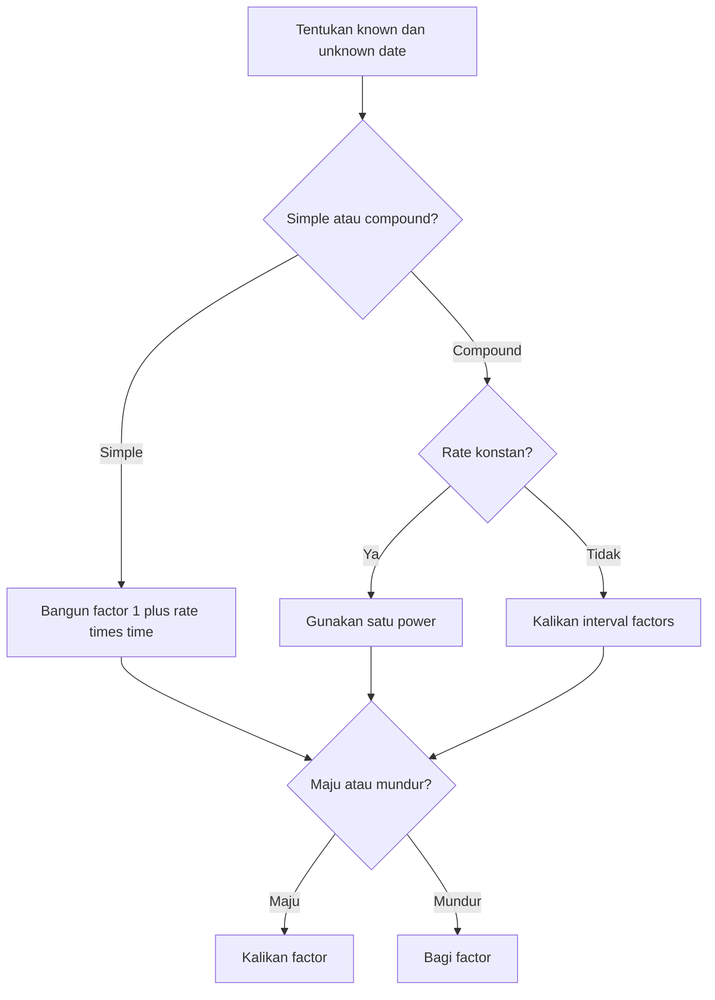

# 📘 1.4 — Accumulation and Present Value

> [!ABSTRACT] Ringkasan Cepat
> **Topik:** Accumulation and Present Value  
> **Bobot Parent Topic:** 10–20%  
> **Exam Priority:** High  
> **Difficulty:** Calculation-Intensive  
> **Primary Skill:** Calculation  
> **Ref:** Vaaler Bab 1–2; Kellison Bab 1–2

## Section 0 — Pemetaan Silabus & Exam Scope

| Field | Isi |
|---|---|
| Topik CF1 | Topik 1 — Nilai Waktu dari Uang |
| Subtopik | 1.4 Accumulation and Present Value |
| Learning Outcome | Menghitung nilai akumulasi dan nilai kini investasi tunggal berdasarkan suku bunga konstan dengan asumsi bunga sederhana atau majemuk |
| Skill Diuji | Mengidentifikasi principal dan target value; menentukan simple atau compound basis; menyamakan rate period dengan waktu; menghitung FV/PV; menggunakan product factors ketika rate berubah; memverifikasi arah dan besar hasil |
| Bobot Parent Topic | 10–20% |
| Exam Priority | High |
| Prerequisite | [[1.1 Interest Rates and Discount Rates]], [[1.2 Effective, Nominal, and Force of Interest]], [[1.3 Cash Flow Equations and Inflation]] |
| Connected Topics | [[1.5 NPV, IRR, DWRR, TWRR]], [[2.1 Annuity-Immediate and Annuity-Due]], [[2.6 Varying Interest Rates]], [[4.2 Amortization Method]] |
| Referensi | Vaaler Bab 1 Sections 1.3–1.7 dan 1.10; Kellison Bab 1 Sections 1.2, 1.4–1.6 dan Bab 2 |

> [!IMPORTANT] Scope Boundary
> [CORE CF1] Note ini membahas amount/accumulation function, discount function, accumulated value atau future value (FV), present value (PV), bunga sederhana, bunga majemuk, fractional periods, serta investasi tunggal pada rate yang berubah. Multiple cash-flow equation telah dibahas pada [[1.3 Cash Flow Equations and Inflation]]. NPV, IRR, DWRR, dan TWRR dibahas pada [[1.5 NPV, IRR, DWRR, TWRR]]. Formula anuitas dan varying annuities tidak termasuk subtopik ini.

## Section 1 — Intuisi & Big Picture

Sebuah deposito Rp50 juta hari ini dan janji pembayaran Rp50 juta lima tahun lagi bukan nilai ekonomi yang sama. Uang hari ini dapat diinvestasikan sehingga tumbuh. **Accumulation** menjawab pertanyaan “uang hari ini menjadi berapa pada waktu mendatang?”, sedangkan **present value** menjawab pertanyaan kebalikannya: “berapa yang harus tersedia hari ini untuk menghasilkan target pada waktu mendatang?”

Cara pertumbuhan menentukan jawabannya. Pada **simple interest**, interest hanya dihitung atas principal awal sehingga pertumbuhannya linear. Pada **compound interest**, interest yang sudah terbentuk ikut menghasilkan interest sehingga pertumbuhannya eksponensial. Dua metode ini sama setelah tepat satu measurement period, tetapi umumnya berbeda untuk horizon lain.

Jika rate berubah, tidak ada satu rate konstan yang boleh dipaksakan ke seluruh horizon. Dana harus melewati setiap interval secara berurutan: ending balance suatu interval menjadi beginning balance interval berikutnya. Kesalahan intuitif terbesar adalah menjumlahkan rates atau menggunakan satu exponent tanpa memastikan rate basis dan unit waktunya konsisten.

## Section 2 — Definisi & Core Concepts

### Definisi Formal

> [!NOTE] Definisi Formal
> **Accumulation function** $a(t)$ adalah nilai pada waktu $t$ dari satu unit yang diinvestasikan pada waktu 0, dengan $a(0)=1$. Jika pertumbuhan proporsional terhadap principal, **amount function** untuk principal $P$ adalah $A_P(t)=P a(t)$. **Discount function** adalah $v(t)=1/a(t)$, yaitu jumlah pada waktu 0 yang akan tumbuh menjadi satu unit pada waktu $t$.

### Terminologi Penting

| Istilah / Simbol | Definisi | Intuisi | Exam Note |
|---|---|---|---|
| $P$ | Principal atau present amount pada waktu 0 | Modal awal | Pastikan benar-benar berada pada base date |
| $F$ atau $A_P(t)$ | Accumulated/future value pada waktu $t$ | Nilai akhir investasi | Unit mata uang harus dinyatakan |
| $a(t)$ | Accumulation factor dari waktu 0 ke $t$ | Pengali maju | $a(0)=1$ |
| $v(t)$ | Discount factor dari waktu $t$ ke waktu 0 | Pengali mundur | $v(t)=1/a(t)$ |
| $s$ | Simple interest rate per measurement period | Interest dihitung atas principal awal | Dibedakan dari effective compound rate $i$ |
| $i$ | Effective compound interest rate per period | Balance dikali $1+i$ tiap periode | Period rate harus sama dengan unit $t$ |
| $i_k$ | Effective rate pada interval ke-$k$ | Rate dapat berubah antarinterval | Gunakan product, bukan sum |
| $t$ | Lama investasi dalam measurement periods | Jarak waktu dari base date | Tahun dan bulan tidak boleh dicampur tanpa conversion |

### Accumulation dan Amount Function

Untuk principal $P$ yang diinvestasikan pada waktu 0:

$$
F=A_P(t)=P a(t).
$$

Hubungan ini mengasumsikan pertumbuhan proporsional terhadap jumlah yang diinvestasikan. Jika kontrak memiliki tiered rates atau biaya yang bergantung pada balance, $A_P(t)=P a(t)$ belum tentu berlaku dan aturan kontrak harus digunakan.

Untuk memindahkan amount $C$ dari waktu $t_1$ ke waktu $t_2$ di bawah general accumulation function:

$$
V_{t_2}(C\text{ at }t_1)
=C\frac{a(t_2)}{a(t_1)}.
$$

Formula ratio ini penting ketika growth environment bergantung pada posisi kalender. Secara umum, faktor dari waktu 2 ke 5 tidak harus sama dengan $a(3)$.

### Discount Function dan Present Value

Karena $v(t)=1/a(t)$, present value dari $F$ yang jatuh tempo pada waktu $t$ adalah

$$
P=Fv(t)=\frac{F}{a(t)}.
$$

Economic meaning-nya: $P$ adalah jumlah pada waktu 0 yang, jika tumbuh mengikuti $a(t)$, tepat menghasilkan $F$ pada waktu $t$.

### Simple Interest

Pada simple interest rate $s$ per measurement period:

$$
a(t)=1+st.
$$

Maka

$$
F=P(1+st)
$$

dan

$$
P=\frac{F}{1+st}.
$$

Interest amount selama $t$ periods adalah

$$
I=F-P=Pst.
$$

Interest per period dalam rupiah tetap sebesar $Ps$. Namun effective rate pada period ke-$n$ menurun karena denominator balance bertambah:

$$
i_n=\frac{s}{1+s(n-1)}.
$$

### Compound Interest

Pada annual atau periodic effective compound rate $i$ yang konstan:

$$
a(t)=(1+i)^t.
$$

Maka

$$
F=P(1+i)^t
$$

dan

$$
P=F(1+i)^{-t}=Fv^t,
\qquad
v=\frac{1}{1+i}.
$$

Interest amount adalah

$$
I=P\left[(1+i)^t-1\right].
$$

Formula ini berlaku jika $i$ adalah effective rate per unit waktu yang digunakan oleh $t$. Jika quote adalah nominal convertible $m$ times, periodic rate terlebih dahulu menjadi $i^{(m)}/m$ dan jumlah periods menjadi $mt$.

### Fractional Periods

Jika compound interest diterapkan untuk seluruh fractional period:

$$
F=P(1+i)^t
$$

tetap berlaku untuk noninteger $t$.

Namun kontrak dapat menggunakan compound interest untuk completed periods dan simple interest untuk fractional remainder. Jika $t=n+f$, dengan integer $n\ge 0$ dan $0\le f<1$:

$$
F=P(1+i)^n(1+fi).
$$

Jangan memilih convention ini tanpa wording yang mendukungnya.

### Varying Effective Rates

Jika effective rates per period adalah $i_1,i_2,\ldots,i_n$, maka

$$
F=P\prod_{k=1}^{n}(1+i_k)
$$

dan

$$
P=F\prod_{k=1}^{n}(1+i_k)^{-1}.
$$

Jika rate $i_1$ berlaku selama $n_1$ periods, rate $i_2$ selama $n_2$ periods, dan seterusnya:

$$
F=P(1+i_1)^{n_1}(1+i_2)^{n_2}\cdots(1+i_q)^{n_q}.
$$

Urutan factors tidak mengubah product secara algebra, tetapi timeline tetap penting untuk menentukan berapa lama setiap rate berlaku dan untuk menilai cash flow yang masuk di tengah horizon.

### Simple versus Compound Interest

Untuk numerical rate yang sama $i=s>0$:

| Horizon | Relationship | Intuisi |
|---|---|---|
| $t=0$ atau $t=1$ | Simple = compound | Kedua curves bertemu pada base date dan akhir period pertama |
| $0<t<1$ | Simple > compound | Linear interpolation berada di atas exponential curve |
| $t>1$ | Compound > simple | Interest-on-interest mulai mendominasi |

### Solving the Four Basic Quantities

Pada compound interest, tiga dari $P,F,i,t$ menentukan quantity keempat:

$$
P=F(1+i)^{-t},
$$

$$
F=P(1+i)^t,
$$

$$
i=\left(\frac{F}{P}\right)^{1/t}-1,
$$

$$
t=\frac{\ln(F/P)}{\ln(1+i)}.
$$

Untuk simple interest:

$$
s=\frac{F/P-1}{t},
\qquad
t=\frac{F/P-1}{s}.
$$

## Section 3 — How It Works

### Jembatan Logika

```text
Narasi investasi tunggal
↓
Tentukan base date, principal, dan target date
↓
Identifikasi simple, compound, atau changing-rate basis
↓
Samakan rate period dengan unit waktu
↓
Bangun accumulation factor sepanjang timeline
↓
FV: kalikan factor | PV: bagi factor
↓
Hitung tanpa early rounding
↓
Verify arah, unit, dan besar hasil
```

### Langkah Universal

1. Tulis apa yang diketahui: $P$, $F$, rate, dan $t$.
2. Tentukan apakah unknown berada lebih awal atau lebih akhir.
3. Identifikasi interest convention: simple atau compound.
4. Ubah rate ke rate per timeline period bila diperlukan.
5. Jika rate berubah, pecah timeline menjadi intervals dan tulis factor setiap interval.
6. Bentuk total accumulation factor $G$.
7. Gunakan $F=PG$ untuk accumulation atau $P=F/G$ untuk discounting.
8. Bulatkan hanya pada hasil akhir dan sertakan unit.

> [!TIP] One-Factor Mental Model
> Semua soal investasi tunggal dapat diringkas menjadi
>
> $$
> F=P\times G.
> $$
>
> Untuk simple interest, $G=1+st$. Untuk compound constant rate, $G=(1+i)^t$. Untuk varying rates, $G=\prod_k(1+i_k)$. Jika mencari PV, balik operasinya: $P=F/G$.

> [!DANGER] Jangan Salah Pikir
> - Jangan menganggap kata “per annum” otomatis berarti compound interest; lihat wording kontrak.
> - Jangan memakai annual exponent pada monthly periodic factor.
> - Jangan menjumlahkan varying rates untuk membentuk growth factor.
> - Jangan menggunakan $a(t_2-t_1)$ menggantikan $a(t_2)/a(t_1)$ pada general nonstationary accumulation function.

## Section 4 — Worked Examples & Exam Cases

### Case A — Fundamental

**Soal**

Rp25.000.000 diinvestasikan selama 3,5 tahun pada rate 6% per tahun. Hitung accumulated value jika digunakan: (a) simple interest dan (b) compound interest untuk seluruh fractional period.

> [!SUCCESS] Pembahasan
>
> **1. Identifikasi informasi & unknown**
>
> $P=\text{Rp}25.000.000$, $t=3{,}5$ tahun, dan numerical rate 0,06 per tahun. Unknown adalah $F$ untuk dua interest conventions.
>
> **2. Timeline / Structure**
>
> | Waktu | Cash flow / value |
> |---:|---:|
> | 0 | Investasi Rp25.000.000 |
> | 3,5 | Accumulated value $F$ |
>
> **3. Rate conversion**
>
> Rate dan waktu sama-sama berbasis tahun; tidak diperlukan conversion.
>
> **4. Equation / Formula Selection**
>
> Simple interest menggunakan $F=P(1+st)$, sedangkan compound interest menggunakan $F=P(1+i)^t$.
>
> **5. Calculation**
>
> Simple interest:
>
> $$
> F_s
> =25.000.000\left[1+0{,}06(3{,}5)\right]
> =\text{Rp}30.250.000.
> $$
>
> Compound interest:
>
> $$
> F_c
> =25.000.000(1{,}06)^{3{,}5}
> \approx\text{Rp}30.655.650{,}57.
> $$
>
> **6. Interpretation**
>
> Karena $t>1$, compound value lebih besar. Selisih sekitar Rp405.650,57 berasal dari interest-on-interest.
>
> **7. Verification**
>
> Kedua metode harus menghasilkan Rp26.500.000 jika $t=1$. Untuk $t=3{,}5>1$, relationship $F_c>F_s>P$ terpenuhi.

> [!WARNING] Exam Trap — Case A
> - **Trap:** Menggunakan $P(1+it)$ ketika soal menyatakan compound interest.
> - **Mengapa distractor terlihat benar:** Formula tersebut memakai data yang sama dan tepat untuk simple interest.
> - **Cara menghindari:** Cari wording “simple” versus “effective/compounded”.
> - **Shortcut aman:** Jika $t>1$ dan rate positif sama, compound result harus lebih besar.
> - **Target waktu:** 1–2 menit.

### Case B — Exam-Typical

**Soal**

Rp40.000.000 diinvestasikan selama lima tahun. Dana memperoleh annual effective rate 5% untuk dua tahun pertama dan 7% untuk tiga tahun berikutnya. Tentukan accumulated value pada akhir tahun kelima.

> [!SUCCESS] Pembahasan
>
> **1. Identifikasi informasi & unknown**
>
> $P=\text{Rp}40.000.000$. Rate berubah pada akhir tahun kedua. Unknown adalah $F_5$.
>
> **2. Timeline / Structure**
>
> | Interval | Rate | Jumlah periods | Factor |
> |---|---:|---:|---:|
> | Tahun 0–2 | 5% effective annual | 2 | $(1{,}05)^2$ |
> | Tahun 2–5 | 7% effective annual | 3 | $(1{,}07)^3$ |
>
> **3. Rate conversion**
>
> Semua rates adalah annual effective dan intervals dihitung dalam tahun.
>
> **4. Equation / Formula Selection**
>
> Ending balance tahun kedua menjadi principal untuk interval berikutnya:
>
> $$
> F_5=40.000.000(1{,}05)^2(1{,}07)^3.
> $$
>
> **5. Calculation**
>
> $$
> F_2=40.000.000(1{,}05)^2
> =\text{Rp}44.100.000,
> $$
>
> lalu
>
> $$
> F_5=44.100.000(1{,}07)^3
> =\text{Rp}54.024.396{,}30.
> $$
>
> **6. Interpretation**
>
> Total growth factor adalah $(1{,}05)^2(1{,}07)^3$, bukan $1+2(0{,}05)+3(0{,}07)$.
>
> **7. Verification**
>
> Karena seluruh rates positif, $F_5>P$. Hasil juga berada di antara nilai jika seluruh lima tahun memakai 5% dan jika seluruhnya memakai 7%.

> [!WARNING] Exam Trap — Case B
> - **Trap:** Menjumlahkan interest menjadi $2(5\%)+3(7\%)=31\%$ lalu mengalikan principal dengan 1,31.
> - **Mengapa distractor terlihat benar:** Penjumlahan rate-times-time mirip formula simple interest.
> - **Cara menghindari:** Pada compound varying rates, kalikan growth factors.
> - **Shortcut aman:** Kelompokkan consecutive periods dengan rate sama menjadi satu power.
> - **Target waktu:** 1–2 menit.

### Case C — Challenging / Integrated

**Soal**

Seorang investor membutuhkan Rp150.000.000 enam tahun lagi. Selama dua tahun pertama, account menghasilkan nominal annual interest rate 6% convertible monthly. Selama empat tahun berikutnya, account menghasilkan annual effective rate 7,5%. Berapa dana yang harus diinvestasikan sekarang?

> [!SUCCESS] Pembahasan
>
> **1. Identifikasi informasi & unknown**
>
> $F_6=\text{Rp}150.000.000$. Unknown adalah $P$ pada waktu 0. Rate basis berubah setelah dua tahun.
>
> **2. Timeline / Structure**
>
> | Interval | Quote | Periodic rate | Periods |
> |---|---|---:|---:|
> | Tahun 0–2 | $i^{(12)}=6\%$ | $0{,}06/12=0{,}005$ per bulan | 24 bulan |
> | Tahun 2–6 | $i=7{,}5\%$ annual effective | 0,075 per tahun | 4 tahun |
>
> **3. Rate conversion**
>
> Monthly factor untuk interval pertama adalah $1{,}005$. Interval kedua langsung memakai annual factor $1{,}075$.
>
> **4. Equation / Formula Selection**
>
> $$
> 150.000.000
> =P(1{,}005)^{24}(1{,}075)^4.
> $$
>
> **5. Calculation**
>
> Total accumulation factor:
>
> $$
> G=(1{,}005)^{24}(1{,}075)^4
> \approx1{,}5052870977.
> $$
>
> Maka
>
> $$
> P
> =\frac{150.000.000}{1{,}5052870977}
> \approx\text{Rp}99.648.764{,}83.
> $$
>
> **6. Interpretation**
>
> Dana sekitar Rp99,65 juta sekarang akan melewati dua accumulation regimes dan tumbuh menjadi Rp150 juta pada tahun keenam.
>
> **7. Verification**
>
> $$
> 99.648.764{,}83(1{,}005)^{24}(1{,}075)^4
> \approx\text{Rp}150.000.000.
> $$
>
> Karena $G>1$, present value harus lebih kecil daripada target future value.

> [!WARNING] Exam Trap — Case C
> - **Trap:** Membagi nominal rate 6% dengan 12 tetapi tetap menggunakan exponent 2.
> - **Mengapa distractor terlihat benar:** Dua tahun adalah horizon kalender interval pertama, tetapi 0,5% adalah monthly rate.
> - **Cara menghindari:** Rate per bulan harus dipasangkan dengan jumlah bulan.
> - **Shortcut aman:** Tulis setiap factor beserta unitnya sebelum mengalikan.
> - **Target waktu:** 2–3 menit.

## Section 5 — Verification & Sanity Check

> [!CHECK] Sanity Check
> 1. Jika rates positif dan $t>0$, maka $F>P$ dan $P<F$ untuk target yang sama.
> 2. PV harus turun ketika discount rate naik, ceteris paribus.
> 3. FV harus naik ketika rate atau horizon naik, ceteris paribus.
> 4. Untuk rate positif yang sama, compound FV melebihi simple FV ketika $t>1$.
> 5. Accumulating lalu discounting dengan factor yang sama harus mengembalikan nilai awal.
> 6. Pada varying rates, total factor harus merupakan product seluruh interval factors.

### Metode Alternatif

| Problem | Metode 1 | Metode 2 | Pilihan Ujian |
|---|---|---|---|
| Constant compound rate | Direct power $(1+i)^t$ | Repeated period-by-period multiplication | Direct power lebih cepat |
| Varying rates | Satu product expression | Recurrence balance per interval | Product untuk single deposit; recurrence membantu tracking |
| Present value | Divide future target by $G$ | Multiply by discount factors | Pilih bentuk yang mengurangi sign/exponent error |
| Unknown time | Logarithm | Trial-and-error | Logarithm memberi exact setup |
| Fractional period | Full compound convention | Compound completed periods + simple remainder | Ikuti wording, bukan preferensi |

### Reciprocal Check

Untuk accumulation factor $G$:

$$
F=PG
\quad\Longleftrightarrow\quad
P=F\frac{1}{G}.
$$

Jika hasil forward calculation tidak kembali ke target setelah dikalikan atau dibagi dengan factor yang sama, terdapat kesalahan rate, exponent, atau rounding.

## Section 6 — Connections & Mental Model

### Mental Model: Satu Timeline, Dua Arah

| Arah | Pertanyaan | Operasi |
|---|---|---|
| Maju | “Nilai nanti berapa?” | Kalikan accumulation factor |
| Mundur | “Nilai sekarang berapa?” | Bagi accumulation factor atau kalikan discount factor |

### Connections

- [[1.1 Interest Rates and Discount Rates]] menjelaskan hubungan $i$, $d$, dan $v$ yang membentuk discount factor.
- [[1.2 Effective, Nominal, and Force of Interest]] menyediakan conversion rate sebelum accumulation dilakukan.
- [[1.3 Cash Flow Equations and Inflation]] memperluas accumulation/PV ke multiple cash flows dan real purchasing power.
- [[1.5 NPV, IRR, DWRR, TWRR]] menjumlahkan present values dari signed cash flows dan mengukur return.
- [[2.1 Annuity-Immediate and Annuity-Due]] menerapkan prinsip yang sama pada serangkaian payments.
- [[2.6 Varying Interest Rates]] memperluas product factors ke cash-flow streams.

### Hubungan Visual ↔ Rumus

Bayangkan timeline horizontal dengan base date di kiri dan target date di kanan:

- bergerak ke kanan: kalikan factor yang dilewati;
- bergerak ke kiri: bagi factor yang dilewati;
- rate berubah: factor timeline dipotong menjadi beberapa segments;
- cash flow mulai pada waktu nonzero: gunakan factor antarwaktu, bukan otomatis factor dari 0.

Untuk general $a(t)$, factor dari $t_1$ ke $t_2$ adalah

$$
\frac{a(t_2)}{a(t_1)}.
$$

## Section 7 — Exam Traps & Misconceptions

### Timing Trap

> [!BUG] Timing Trap
> “Selama empat tahun” menentukan jumlah growth periods, bukan selalu calendar time label akhir. Deposit pada $t=2$ yang ditarik pada $t=6$ tumbuh selama empat tahun.

### Rate / Frequency Trap

> [!BUG] Rate & Frequency Trap
> Untuk $i^{(12)}=12\%$, periodic monthly rate adalah 1%. Factor selama 18 bulan adalah $(1{,}01)^{18}$, bukan $(1{,}12)^{1{,}5}$ dan bukan $(1{,}01)^{1{,}5}$.

### Formula / Notation Trap

> [!BUG] Formula Trap
> - Simple interest: $a(t)=1+st$.
> - Compound interest: $a(t)=(1+i)^t$.
> - General discount function: $v(t)=1/a(t)$.
> - Compound constant-rate notation: $v^t=(1+i)^{-t}$.
> - Simple interest PV is $F/(1+st)$; ini bukan simple discount $F(1-dt)$.

### Calculation Trap

> [!BUG] Calculation Trap
> Jika rates adalah 4% lalu 6% untuk dua successive years:
>
> **Salah**
>
> $$
> G=1+0{,}04+0{,}06=1{,}10.
> $$
>
> **Benar**
>
> $$
> G=(1{,}04)(1{,}06)=1{,}1024.
> $$

### Interpretation Trap

> [!BUG] Interpretation Trap
> Nilai akhir yang lebih besar belum membuktikan satu investasi menawarkan rate lebih tinggi jika principals atau horizons berbeda. Bandingkan accumulation factors pada basis waktu yang sama.

### Red Flags

> [!CAUTION] Red Flags

| Keyword / Condition | Apa yang Harus Dipikirkan |
|---|---|
| “simple interest” | Gunakan $1+st$ |
| “annual effective” | Gunakan annual factor $1+i$ |
| “nominal convertible monthly” | Periodic rate $i^{(12)}/12$ dan exponent bulan |
| “present value” / “today” | Discount mundur |
| “accumulated value” / “maturity value” | Accumulate maju |
| “rate changes after year...” | Pecah timeline dan kalikan factors |
| “fractional period” | Periksa interest convention |
| “invested at time $t_1$” | General factor dapat berupa $a(t_2)/a(t_1)$ |
| “no deposits or withdrawals” | Single-investment amount function berlaku |

## Section 8 — Executive Summary

### Must Remember

> [!SUMMARY] Must Remember
> 1. $a(t)$ adalah nilai waktu $t$ dari satu unit pada waktu 0; $a(0)=1$.
> 2. $A_P(t)=P a(t)$ jika growth proporsional terhadap principal.
> 3. $v(t)=1/a(t)$ dan $P=Fv(t)$.
> 4. Simple interest: $F=P(1+st)$.
> 5. Compound interest: $F=P(1+i)^t$.
> 6. FV bergerak maju dengan multiplication; PV bergerak mundur dengan division.
> 7. Rate basis dan exponent harus memakai measurement period yang sama.
> 8. Varying compound rates menggunakan $\prod_k(1+i_k)$.
> 9. Untuk general accumulation function, factor dari $t_1$ ke $t_2$ adalah $a(t_2)/a(t_1)$.
> 10. Jangan membulatkan intermediate accumulation factors terlalu dini.

### Formula Map / Comparison Table

| Kondisi | Formula / Rule | Timing/Basis | Common Trap |
|---|---|---|---|
| General FV | $F=P a(t)$ | Dari 0 ke $t$ | Menganggap semua $a(t)$ compound |
| General PV | $P=F/a(t)=Fv(t)$ | Dari $t$ ke 0 | Mengalikan accumulation factor |
| General interval | $C\,a(t_2)/a(t_1)$ | Dari $t_1$ ke $t_2$ | Menggunakan $a(t_2-t_1)$ tanpa justification |
| Simple FV | $P(1+st)$ | $s$ per unit $t$ | Memakai power $t$ |
| Simple PV | $F/(1+st)$ | $s$ per unit $t$ | Tertukar dengan simple discount |
| Compound FV | $P(1+i)^t$ | $i$ effective per unit $t$ | Mengalikan $i$ dengan $t$ |
| Compound PV | $F(1+i)^{-t}$ | $i$ effective per unit $t$ | Salah sign exponent |
| Varying rates | $P\prod_k(1+i_k)$ | Satu rate per interval | Menjumlahkan rates |

### Trigger Keywords

| Jika soal mengatakan... | Pikirkan... |
|---|---|
| “amount at the end” | Future/accumulated value |
| “amount to invest now” | Present value |
| “simple interest” | Linear accumulation |
| “interest is reinvested” | Compound accumulation |
| “for the first... then...” | Piecewise/product factors |
| “convertible $m$ times” | Periodic rate dan total conversion periods |
| “same interest environment” | Ratio of accumulation-function values |

### Kapan Digunakan

- Gunakan general $a(t)$ ketika accumulation rule diberikan sebagai function atau balance table.
- Gunakan simple interest hanya jika dinyatakan atau jelas dari contract rule.
- Gunakan compound interest sebagai basis ketika effective/convertible compounding diberikan.
- Gunakan product factors ketika rate berubah antarinterval.
- Gunakan PV saat unknown berada sebelum known future target.

### Kapan TIDAK Boleh Digunakan

- Jangan gunakan single-deposit formula jika ada intermediate deposits/withdrawals tanpa memasukkan cash flows tersebut.
- Jangan gunakan $(1+i)^t$ ketika interest dinyatakan simple.
- Jangan gunakan $1+it$ untuk compound multi-period growth.
- Jangan gunakan satu constant rate jika source memberikan changing rates.
- Jangan gunakan $a(t_2-t_1)$ untuk general accumulation rule kecuali time-homogeneity didukung.

### Quick Decision Tree



## Section 9 — Active Recall Check

1. Definisikan $a(t)$, $A_P(t)$, dan $v(t)$ serta jelaskan hubungan ketiganya.
2. Susun formula FV dan PV investasi tunggal pada simple interest rate $s$ selama $t$ periods.
3. Susun formula FV dan PV pada constant effective compound rate $i$.
4. Mengapa compound FV lebih besar daripada simple FV untuk numerical rate positif yang sama ketika $t>1$?
5. Sebuah nominal rate $i^{(4)}$ berlaku selama 2,5 tahun. Berapa periodic rate dan jumlah periods dalam accumulation factor?
6. Susun accumulation factor jika rates efektif tahunan selama empat tahun berturut-turut adalah $i_1,i_2,i_3,i_4$.
7. Jelaskan perbedaan $a(t_2)/a(t_1)$ dan $a(t_2-t_1)$ pada general accumulation function.
8. Jika PV target meningkat ketika rate meningkat, sanity check apa yang gagal?
9. Tuliskan dua possible conventions untuk final fractional period dan jelaskan mengapa wording soal menentukan pilihan.
10. Mengapa simple interest PV $F/(1+st)$ tidak sama dengan simple discount value $F(1-dt)$?

## Section 10 — Exam Pattern Map

| Narasi Soal | Keyword | Konsep | Formula/Rule | Langkah | Trap | Shortcut |
|---|---|---|---|---|---|---|
| [TEXTBOOK-BASED EXPECTATION] Investasi tunggal dengan bunga sederhana | “simple interest”, “principal” | Linear accumulation | $F=P(1+st)$ | Samakan unit, substitute, verify | Memakai compound power | Interest amount langsung $Pst$ |
| [TEXTBOOK-BASED EXPECTATION] FV/PV pada bunga majemuk | “annual effective”, “present value” | Compound accumulation/discount | $F=P(1+i)^t$ | Tentukan arah, factor, solve | Salah sign exponent | FV kali; PV bagi |
| [TEXTBOOK-BASED EXPECTATION] Nominal rate dan fractional horizon | “convertible monthly”, “2.5 years” | Frequency matching | $F=P(1+i^{(m)}/m)^{mt}$ | Periodic rate, periods, factor | Membagi annual effective rate | Tulis unit di bawah rate/exponent |
| [TEXTBOOK-BASED EXPECTATION] Rate berubah beberapa kali | “first... then...” | Piecewise accumulation | $F=P\prod_k(1+i_k)^{n_k}$ | Segment timeline, multiply | Menjumlahkan rates | Group intervals dengan rate sama |
| [TEXTBOOK-BASED EXPECTATION] Investasi dimulai setelah waktu 0 | “invest at time $t_1$” | General interval factor | $C\,a(t_2)/a(t_1)$ | Identify both dates, ratio | Memakai $a(t_2-t_1)$ otomatis | Later $a$ over earlier $a$ |
| [TEXTBOOK-BASED EXPECTATION] Unknown time/rate | “how long”, “what rate” | Inverse accumulation | Log/root formula | Isolate factor, solve | Early rounding | Keep factor exact until final |

## Source Traceability

| Materi | Sumber |
|---|---|
| Accumulation function dan amount function | Vaaler Bab 1, Section 1.3; Kellison Bab 1, Section 1.2 |
| Simple interest dan linear accumulation | Vaaler Bab 1, Section 1.4; Kellison Bab 1, Section 1.4 |
| Compound interest dan exponential accumulation | Vaaler Bab 1, Section 1.5; Kellison Bab 1, Section 1.5 |
| Discount function dan present value | Vaaler Bab 1, Section 1.7; Kellison Bab 1, Section 1.6 |
| General value between two nonzero dates | Vaaler Bab 1, Section 1.7; Kellison Bab 1, Sections 1.2 dan 1.6 |
| Fractional-period conventions | Vaaler Bab 1, Section 1.5; Kellison Bab 1, Section 1.5 |
| Varying-rate accumulation | Vaaler Bab 1, Section 1.10; Kellison Bab 2 |
| Four basic quantities dan inverse problems | Vaaler Bab 2, Section 2.2; Kellison Bab 2, Section 2.2 |

---

> [!QUOTE] Follow-up Options
> 1. *"Uji saya dengan soal Active Recall dari topik ini"*
> 2. *"Buat 10 soal exam-style calculation untuk topik ini"*
> 3. *"Jelaskan hubungan topik ini dengan topik CF1 terkait"*

*📖 Ref: Vaaler Bab 1–2; Kellison Bab 1–2 | 🗓️ 2026-08-25 | #CF1 #MatematikaKeuangan*
