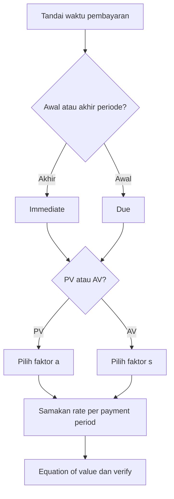

# 📘 2.1 — Annuity-Immediate and Annuity-Due

> [!ABSTRACT] Ringkasan Cepat
> **Topik:** Annuity-Immediate and Annuity-Due  
> **Bobot Parent Topic:** 20–30%  
> **Exam Priority:** Very High  
> **Difficulty:** Calculation-Intensive  
> **Primary Skill:** Calculation  
> **Ref:** Kellison Bab 3; Vaaler Bab 3–4 sesuai silabus CF1

## Section 0 — Pemetaan Silabus & Exam Scope

| Field | Isi |
|---|---|
| Topik CF1 | Topik 2 — Anuitas dan Nilai Arus Kas |
| Subtopik | 2.1 Annuity-Immediate and Annuity-Due |
| Learning Outcome | Menghitung nilai kini dan nilai akumulasi arus kas level dengan rate konstan, baik pembayaran pada akhir maupun awal periode. |
| Skill Diuji | Membaca timing, menyamakan periode rate dan pembayaran, memilih faktor anuitas, menyusun equation of value, serta memverifikasi hasil. |
| Bobot Parent Topic | 20–30% |
| Exam Priority | Very High |
| Prerequisite | Discount factor, compound interest, equation of value, konversi nominal/effective rate |
| Connected Topics | [[2.2 Perpetuity]], [[2.3 Varying Annuities]], [[2.5 Deferred Annuities]], [[4.2 Amortization Method]], [[5.1 Bond Pricing]] |
| Referensi | Silabus CF1 Topik 2; Kellison Bab 3, terutama §3.1–§3.4; Vaaler Bab 3–4 sesuai daftar referensi silabus |

> [!IMPORTANT] Scope Boundary
> [CORE CF1] Note ini berfokus pada anuitas dengan **pembayaran level**, **rate konstan**, dan periode pembayaran yang sama dengan periode rate setelah konversi. Perpetuitas, varying annuities, pembayaran kontinu, deferred annuities, dan varying interest dibahas pada subtopik tersendiri. Unknown term/rate hanya disentuh sejauh membantu penggunaan faktor anuitas; balloon/drop payment dan amortization schedule merupakan fokus Topik 4.

## Section 1 — Intuisi & Big Picture

Anuitas adalah serangkaian pembayaran dengan pola waktu teratur. Contohnya adalah menabung Rp2 juta setiap bulan, menerima cicilan pada setiap akhir tahun, atau membayar sewa pada setiap awal bulan. Pertanyaan utamanya bukan hanya “berapa total pembayaran?”, melainkan **berapa nilai ekuivalen seluruh pembayaran pada satu tanggal tertentu?**

Timing menentukan jawabannya. Sepuluh pembayaran yang masing-masing dilakukan pada awal tahun mempunyai nilai lebih besar daripada sepuluh pembayaran yang sama pada akhir tahun jika $i>0$. Setiap pembayaran pada anuitas awal memperoleh satu periode tambahan untuk berbunga, atau didiskontokan satu periode lebih sedikit.

Kesalahan intuitif yang paling umum adalah langsung memilih formula dari kata “anuitas” tanpa menandai posisi pembayaran. Cara aman adalah menggambar timeline, menetapkan periode rate yang sama dengan periode pembayaran, lalu memilih focal date. Formula anuitas hanyalah bentuk ringkas dari equation of value atas seluruh cash flow.

## Section 2 — Definisi & Core Concepts

> [!NOTE] Definisi Formal
> **Annuity-certain** adalah serangkaian pembayaran yang tanggal dan jumlah pembayarannya telah ditentukan. Dalam subtopik ini, setiap pembayaran bernilai sama dan dilakukan sekali setiap periode.  
> **Annuity-immediate** membayar pada **akhir** setiap periode.  
> **Annuity-due** membayar pada **awal** setiap periode.

### Terminologi Penting

| Istilah / Simbol          | Definisi                                   | Intuisi                                             | Exam Note                                                                      |
| ------------------------- | ------------------------------------------ | --------------------------------------------------- | ------------------------------------------------------------------------------ |
| $i$                       | Effective interest rate per payment period | Pertumbuhan satu unit uang selama satu periode      | Rate harus sesuai dengan payment period.                                       |
| $v=(1+i)^{-1}$            | Discount factor per period                 | Nilai kini dari 1 yang dibayar satu periode lagi    | Pangkat menunjukkan jarak dari cash flow ke focal date.                        |
| $n$                       | Jumlah pembayaran/periode anuitas          | Banyaknya cash flow level                           | Jangan tertukar dengan jumlah tahun jika pembayaran lebih sering dari tahunan. |
| $R$                       | Besar setiap pembayaran level              | Skala cash flow                                     | Faktor anuitas unit dikalikan $R$.                                             |
| $a_{\overline{n}}$        | PV anuitas-immediate unit                  | Pembayaran pada $t=1,2,\ldots,n$ dinilai di $t=0$   | First payment satu periode setelah focal date.                                 |
| $\ddot{a}_{\overline{n}}$ | PV anuitas-due unit                        | Pembayaran pada $t=0,1,\ldots,n-1$ dinilai di $t=0$ | First payment tepat pada focal date.                                           |
| $s_{\overline{n}}$        | AV anuitas-immediate unit                  | Pembayaran pada $t=1,2,\ldots,n$ dinilai di $t=n$   | Last payment tidak memperoleh bunga.                                           |
| $\ddot{s}_{\overline{n}}$ | AV anuitas-due unit                        | Pembayaran pada $t=0,1,\ldots,n-1$ dinilai di $t=n$ | Last payment memperoleh satu periode bunga.                                    |


### Cash-Flow Timeline

**Annuity-immediate, $n$ pembayaran unit:**

|         Waktu |                $0$ | $1$ | $2$ | $\cdots$ | $n-1$ | $n$ |                    |
| ------------: | -----------------: | --: | --: | -------: | ----: | --: | ------------------ |
|    Pembayaran |                  — | $1$ | $1$ | $\cdots$ |   $1$ | $1$ |                    |
| Nilai standar | $a_{\overline{n}}$ |     |     |          |       |     | $s_{\overline{n}}$ |

**Annuity-due, $n$ pembayaran unit:**

|         Waktu |                       $0$ | $1$ | $2$ | $\cdots$ | $n-1$ | $n$ |                           |
| ------------: | ------------------------: | --: | --: | -------: | ----: | --: | ------------------------- |
|    Pembayaran |                       $1$ | $1$ | $1$ | $\cdots$ |   $1$ |   — |                           |
| Nilai standar | $\ddot{a}_{\overline{n}}$ |     |     |          |       |     | $\ddot{s}_{\overline{n}}$ |

### Rumus Utama: Annuity-Immediate

PV pada satu periode sebelum pembayaran pertama:

$$
a_{\overline{n}|}
=v+v^2+\cdots+v^n
=\frac{1-v^n}{i}.
$$

Untuk pembayaran level sebesar $R$:

$$
PV_0=R a_{\overline{n}|}.
$$

AV tepat setelah pembayaran terakhir:

$$
s_{\overline{n}|}
=1+(1+i)+\cdots+(1+i)^{n-1}
=\frac{(1+i)^n-1}{i}.
$$

Untuk pembayaran level sebesar $R$:

$$
AV_n=R s_{\overline{n}|}.
$$

Kedua nilai merepresentasikan seri cash flow yang sama pada tanggal berbeda:

$$
s_{\overline{n}|}=(1+i)^n a_{\overline{n}|}.
$$

### Rumus Utama: Annuity-Due

PV tepat pada tanggal pembayaran pertama:

$$
\ddot{a}_{\overline{n}|}
=1+v+\cdots+v^{n-1}
=\frac{1-v^n}{d},
$$

dengan

$$
d=\frac{i}{1+i}.
$$

AV satu periode setelah pembayaran terakhir:

$$
\ddot{s}_{\overline{n}|}
=(1+i)+(1+i)^2+\cdots+(1+i)^n
=\frac{(1+i)^n-1}{d}.
$$

Untuk pembayaran level $R$:

$$
PV_0=R\ddot{a}_{\overline{n}|},
\qquad
AV_n=R\ddot{s}_{\overline{n}|}.
$$

### Core Relationships

Karena setiap pembayaran annuity-due terjadi satu periode lebih awal daripada pembayaran annuity-immediate yang bersesuaian:

$$
\boxed{\ddot{a}_{\overline{n}|}=(1+i)a_{\overline{n}|}}
$$

$$
\boxed{\ddot{s}_{\overline{n}|}=(1+i)s_{\overline{n}|}}
$$

Hubungan lain yang berguna:

$$
\ddot{a}_{\overline{n}|}=1+a_{\overline{n-1}|},
$$

karena pembayaran pertama annuity-due berada pada $t=0$, sedangkan sisanya membentuk annuity-immediate sebanyak $n-1$ pembayaran.

Demikian pula,

$$
\ddot{s}_{\overline{n}|}=s_{\overline{n+1}|}-1.
$$

Jika $i=0$, formula berbentuk pembagian oleh $i$ atau $d$ tidak dapat digunakan, tetapi secara langsung:

$$
a_{\overline{n}|}
=\ddot{a}_{\overline{n}|}
=s_{\overline{n}|}
=\ddot{s}_{\overline{n}|}
=n.
$$

## Section 3 — How It Works

### Jembatan Logika

```text
Narasi soal
↓
Tentukan unit waktu dan jumlah pembayaran
↓
Tandai first payment dan last payment pada timeline
↓
Konversi rate ke effective rate per payment period
↓
Pilih focal date
↓
Kenali immediate atau due
↓
Tulis equation of value
↓
Solve unknown dan sanity-check
```

### Derivasi Ringkas dari Geometric Series

Untuk annuity-immediate:

$$
a_{\overline{n}|}=v+v^2+\cdots+v^n.
$$

Kalikan dengan $(1+i)=v^{-1}$:

$$
(1+i)a_{\overline{n}|}=1+v+\cdots+v^{n-1}.
$$

Kurangkan persamaan pertama dari persamaan kedua:

$$
i a_{\overline{n}|}=1-v^n,
$$

sehingga

$$
a_{\overline{n}|}=\frac{1-v^n}{i}.
$$

Untuk annuity-due, semua pembayaran digeser satu periode lebih awal. Karena itu nilai pada focal date meningkat dengan faktor $(1+i)$, bukan sekadar ditambah $i$:

$$
\ddot{a}_{\overline{n}|}=(1+i)a_{\overline{n}|}.
$$

> [!TIP] Cara Berpikir
> Jangan menghafal empat rumus secara terpisah. Hafalkan satu anchor, yaitu
> $$
> a_{\overline{n}|}=\frac{1-v^n}{i},
> $$
> lalu gunakan **geser waktu** dan **akumulasi**:
> - immediate $\rightarrow$ due: kali $(1+i)$;
> - PV $\rightarrow$ AV pada $t=n$: kali $(1+i)^n$.

> [!DANGER] Jangan Salah Pikir
> 1. Kata “pembayaran pertama segera” berarti cash flow pada $t=0$, bukan $t=1$.
> 2. Annual effective rate tidak boleh langsung dibagi 12 untuk memperoleh monthly effective rate.
> 3. $s_{\overline{n}|}$ dinilai tepat pada waktu pembayaran terakhir, sedangkan $\ddot{s}_{\overline{n}|}$ dinilai satu periode setelah pembayaran terakhir.
> 4. Jumlah pembayaran bukan otomatis sama dengan jumlah tahun.

### Rate Basis sebelum Formula

Jika pembayaran dilakukan $m$ kali per tahun:

- nominal interest rate $i^{(m)}$ convertible $m$ times per year memberi periodic rate

$$
j=\frac{i^{(m)}}{m};
$$

- annual effective rate $i$ memberi periodic effective rate

$$
j=(1+i)^{1/m}-1.
$$

Jika compounding frequency dan payment frequency berbeda, cari dahulu rate ekuivalen selama **satu payment period**.

## Section 4 — Worked Examples & Exam Cases

### Case A — Fundamental: PV Annuity-Immediate

**Soal**

Sebuah anuitas membayar Rp500.000 pada akhir setiap semester selama 20 tahun. Suku bunga nominal 9% per tahun convertible semiannually. Hitung nilai kini anuitas.

> [!SUCCESS] Pembahasan
>
> **1. Identifikasi informasi & unknown**  
> $R=500{,}000$, terdapat $n=20\times2=40$ pembayaran. Ditanyakan $PV_0$.
>
> **2. Timeline / Structure**  
> Pembayaran terjadi pada akhir semester: $t=1,2,\ldots,40$. Ini annuity-immediate.
>
> **3. Rate conversion**  
> Karena 9% adalah nominal convertible semiannually:
> $$
> i=\frac{0.09}{2}=0.045
> $$
> per semester.
>
> **4. Equation / Formula Selection**
> $$
> PV_0=R a_{\overline{40}|}.
> $$
>
> **5. Calculation**
> $$
> a_{\overline{40}|}
> =\frac{1-(1.045)^{-40}}{0.045}
> =18.401584.
> $$
> $$
> PV_0
> =500{,}000(18.401584)
> =\boxed{\text{Rp}9{,}200{,}792}.
> $$
>
> **6. Interpretation**  
> Dana Rp9,20 juta saat ini ekuivalen dengan 40 pembayaran semesteran Rp500 ribu pada rate 4,5% per semester.
>
> **7. Verification**  
> Tanpa bunga, total pembayaran Rp20 juta. Karena seluruh pembayaran berada di masa depan dan $i>0$, PV harus kurang dari Rp20 juta; hasil memenuhi.

> [!WARNING] Exam Trap — Case A
> - **Trap:** memakai $n=20$ dan $i=9\%$.
> - **Mengapa distractor terlihat benar:** angka tersebut sama dengan tahun dan quoted annual rate dalam narasi.
> - **Cara menghindari:** ubah keduanya ke unit semester.
> - **Shortcut aman:** nominal convertible semiannually $\Rightarrow i=9\%/2$ dan $n=20\times2$.
> - **Target waktu:** 1–2 menit.

### Case B — Exam-Typical: AV Annuity-Due

**Soal**

Seorang peserta menabung Rp5.000.000 pada awal setiap tahun selama 10 tahun. Dana memperoleh annual effective rate 6%. Berapa saldo tepat pada akhir tahun ke-10?

> [!SUCCESS] Pembahasan
>
> **1. Identifikasi informasi & unknown**  
> $R=5{,}000{,}000$, $n=10$, $i=0.06$. Ditanyakan nilai di $t=10$.
>
> **2. Timeline / Structure**  
> Pembayaran berada pada $t=0,1,\ldots,9$, sedangkan nilai diminta pada $t=10$. Ini AV annuity-due.
>
> **3. Rate conversion**  
> Rate sudah annual effective dan payment period tahunan; tidak perlu konversi.
>
> **4. Equation / Formula Selection**
> $$
> AV_{10}=R\ddot{s}_{\overline{10}|}
> =R(1+i)s_{\overline{10}|}.
> $$
>
> **5. Calculation**
> $$
> \ddot{s}_{\overline{10}|}
> =(1.06)\frac{(1.06)^{10}-1}{0.06}
> =13.971643.
> $$
> $$
> AV_{10}
> =5{,}000{,}000(13.971643)
> =\boxed{\text{Rp}69{,}858{,}213}.
> $$
>
> **6. Interpretation**  
> Setoran pertama tumbuh selama 10 tahun dan setoran terakhir tumbuh selama 1 tahun.
>
> **7. Verification**  
> Total setoran Rp50 juta. Karena $i>0$, AV harus melebihi Rp50 juta. Nilai due juga harus sama dengan AV immediate yang bersesuaian dikali $1.06$.

> [!WARNING] Exam Trap — Case B
> - **Trap:** menggunakan $s_{\overline{10}|}$ karena nilai diminta “akhir tahun ke-10”.
> - **Mengapa distractor terlihat benar:** focal date berada di akhir tahun, tetapi klasifikasi anuitas ditentukan oleh tanggal pembayaran.
> - **Cara menghindari:** tandai pembayaran pertama pada $t=0$.
> - **Shortcut aman:** semua pembayaran digeser satu periode lebih awal $\Rightarrow$ kali $(1+i)$.
> - **Target waktu:** 1–2 menit.

### Case C — Challenging / Integrated: Frequency Mismatch + Due

**Soal**

Sebuah dana harus mencapai Rp100.000.000 tepat lima tahun lagi. Setoran sama besar dilakukan pada awal setiap kuartal, dimulai hari ini, sebanyak 20 kali. Dana memperoleh suku bunga nominal 8% per tahun convertible monthly. Tentukan besar setiap setoran.

> [!SUCCESS] Pembahasan
>
> **1. Identifikasi informasi & unknown**  
> Target $AV_5=100{,}000{,}000$, $n=20$, dan unknown $R$.
>
> **2. Timeline / Structure**  
> Setoran dilakukan pada awal kuartal: $t=0,1,\ldots,19$ dalam unit kuartal. Nilai diminta pada $t=20$. Ini annuity-due.
>
> **3. Rate conversion**  
> Monthly effective rate:
> $$
> i_m=\frac{0.08}{12}.
> $$
> Satu kuartal terdiri dari tiga bulan, sehingga quarterly effective rate:
> $$
> i_q=\left(1+\frac{0.08}{12}\right)^3-1
> =0.02013363.
> $$
>
> **4. Equation / Formula Selection**
> $$
> 100{,}000{,}000=R\ddot{s}_{\overline{20}|\,i_q}.
> $$
>
> **5. Calculation**
> $$
> \ddot{s}_{\overline{20}|\,i_q}
> =(1+i_q)\frac{(1+i_q)^{20}-1}{i_q}
> =24.819573.
> $$
> $$
> R
> =\frac{100{,}000{,}000}{24.819573}
> =\boxed{\text{Rp}4{,}029{,}078}.
> $$
>
> **6. Interpretation**  
> Setiap setoran awal kuartal sekitar Rp4,029 juta. Setoran terakhir tetap memperoleh bunga selama satu kuartal.
>
> **7. Verification**  
> Tanpa bunga, kebutuhan per setoran adalah Rp5 juta. Karena dana berbunga positif, setoran yang diperlukan harus lebih kecil; hasil memenuhi. Substitusi kembali memberi $R(24.819573)\approx\text{Rp}100$ juta.

> [!WARNING] Exam Trap — Case C
> - **Trap:** memakai $8\%/4=2\%$ per kuartal.
> - **Mengapa distractor terlihat benar:** terdapat empat kuartal setahun, tetapi quoted rate convertible monthly.
> - **Cara menghindari:** bentuk akumulasi tiga bulan, bukan membagi quoted nominal rate dengan payment frequency.
> - **Shortcut aman:** $1+i_q=(1+0.08/12)^3$.
> - **Target waktu:** 2–3 menit.

## Section 5 — Verification & Sanity Check

> [!CHECK] Sanity Check
> 1. Untuk $i>0$ dan cash flow yang sama, $\ddot{a}_{\overline{n}|}>a_{\overline{n}|}$ dan $\ddot{s}_{\overline{n}|}>s_{\overline{n}|}$.
> 2. PV cash flow positif di masa depan harus lebih kecil daripada jumlah nominal pembayarannya jika $i>0$.
> 3. AV cash flow positif harus lebih besar daripada jumlah nominal pembayarannya jika $i>0$.
> 4. Jika $i\to0$, seluruh faktor anuitas harus mendekati $n$.
> 5. Jika $i$ naik, PV anuitas turun; untuk target AV tetap, required periodic deposit turun.
> 6. Pastikan ada tepat $n$ cash flow pada timeline dan cek berapa periode bunga yang diterima cash flow pertama serta terakhir.

### Metode Alternatif

| Kebutuhan | Metode 1 | Metode 2 | Pilihan Exam |
|---|---|---|---|
| PV level annuity | Jumlahkan $Rv^k$ satu per satu | Gunakan $Ra_{\overline{n}|}$ | Faktor anuitas lebih cepat; direct sum berguna untuk verifikasi. |
| Nilai due | Gunakan formula dengan $d$ | Hitung immediate lalu kali $(1+i)$ | Relasi timing biasanya paling aman dan cepat. |
| AV | Jumlahkan akumulasi setiap cash flow | Hitung PV lalu kali $(1+i)^n$ | Pilih bentuk yang paling dekat dengan data/unknown. |
| Unknown payment | Susun equation of value lalu bagi faktor anuitas | Gunakan fungsi TVM calculator | Equation of value mencegah sign/timing error. |

Untuk satu seri cash flow yang sama:

$$
R a_{\overline{n}|}(1+i)^n
=R s_{\overline{n}|},
$$

sehingga hasil PV dan AV dapat saling memverifikasi.

## Section 6 — Connections & Mental Model

### Hubungan dengan Topik Lain

- [[1.2 Effective, Nominal, and Force of Interest]] menyediakan periodic rate yang benar sebelum faktor anuitas digunakan.
- [[1.3 Cash Flow Equations and Inflation]] menyediakan prinsip focal date dan equation of value.
- [[2.2 Perpetuity]] diperoleh dengan membiarkan $n\to\infty$ pada PV anuitas ketika $i>0$.
- [[2.3 Varying Annuities]] mengganti pembayaran level dengan pola aritmetika atau geometri.
- [[2.5 Deferred Annuities]] memindahkan seluruh seri pembayaran lebih jauh dari focal date.
- [[4.2 Amortization Method]] menggunakan $L=Ra_{\overline{n}|}$ untuk menentukan level loan payment.
- [[5.1 Bond Pricing]] memandang kupon sebagai annuity-immediate ditambah redemption payment.

### Mental Model: Empat Faktor dari Satu Cash Flow Pattern

| Faktor | Payment times | Valuation time | Cara memperoleh |
|---|---|---:|---|
| $a_{\overline{n}|}$ | $1$ sampai $n$ | $0$ | Anchor PV immediate |
| $\ddot{a}_{\overline{n}|}$ | $0$ sampai $n-1$ | $0$ | $(1+i)a_{\overline{n}|}$ |
| $s_{\overline{n}|}$ | $1$ sampai $n$ | $n$ | $(1+i)^n a_{\overline{n}|}$ |
| $\ddot{s}_{\overline{n}|}$ | $0$ sampai $n-1$ | $n$ | $(1+i)s_{\overline{n}|}$ |

Posisi cash flow menentukan pangkat. Sebuah pembayaran unit pada waktu $k$ bernilai $v^k$ di waktu 0 dan $(1+i)^{n-k}$ di waktu $n$.

## Section 7 — Exam Traps & Misconceptions

### Timing Trap

> [!BUG] Timing Trap
> **Salah:** “Nilai diminta di akhir tahun, jadi gunakan annuity-immediate.”  
> **Benar:** immediate/due ditentukan oleh **waktu pembayaran dalam setiap periode**, bukan oleh lokasi focal date. Setelah klasifikasi, pindahkan nilainya ke focal date yang diminta.

### Rate / Frequency Trap

> [!BUG] Rate & Frequency Trap
> Annual effective 12% dengan pembayaran bulanan **bukan** berarti monthly effective rate 1%.
> $$
> i_m=(1.12)^{1/12}-1,
> $$
> bukan $0.12/12$. Pembagian langsung hanya berlaku untuk nominal rate convertible monthly.

### Formula / Notation Trap

> [!BUG] Formula Trap
> Jangan tertukar:
> $$
> a_{\overline{n}|}=\frac{1-v^n}{i}
> \qquad\text{dan}\qquad
> \ddot{a}_{\overline{n}|}=\frac{1-v^n}{d}.
> $$
> Denominator berbeda karena timing berbeda. Relasi paling aman adalah $\ddot{a}_{\overline{n}|}=(1+i)a_{\overline{n}|}$.

### Calculation Trap

> [!BUG] Calculation Trap
> Untuk 12 pembayaran awal bulan dengan nominal rate $i^{(12)}$:
>
> **Salah**
> $$
> PV=R a_{\overline{12}|\,i^{(12)}}.
> $$
>
> **Benar**
> $$
> PV=R\ddot{a}_{\overline{12}|\,i^{(12)}/12}.
> $$

### Interpretation Trap

> [!BUG] Interpretation Trap
> Nilai due yang lebih besar tidak berarti terdapat pembayaran tambahan. Jumlah pembayaran tetap $n$; perbedaannya berasal dari setiap pembayaran yang terjadi satu periode lebih awal.

### Red Flags

> [!CAUTION] Red Flags

| Keyword / Condition | Apa yang Harus Dipikirkan |
|---|---|
| “end of each period”, “in arrears” | Annuity-immediate |
| “beginning of each period”, “in advance” | Annuity-due |
| “first payment today/immediately” | Cash flow pertama pada $t=0$ |
| “final payment at the valuation date” | Kandidat AV immediate |
| “valuation one period after final payment” | Kandidat AV due |
| “nominal rate convertible $m$ times” | Periodic rate $=i^{(m)}/m$ untuk conversion period yang sama |
| “annual effective” | Ambil akar untuk periodic effective rate; jangan langsung dibagi |
| Payment dan compounding frequency berbeda | Bentuk equivalent effective rate per payment period |
| “$n$ years, paid monthly” | Jumlah pembayaran biasanya $12n$, lalu cek first/last payment |
| Calculator mode BGN/BEG | Annuity-due |
| Calculator mode END | Annuity-immediate |

## Section 8 — Executive Summary

> [!SUMMARY] Must Remember
> 1. Immediate membayar pada $t=1,\ldots,n$; due membayar pada $t=0,\ldots,n-1$.
> 2. Selalu gunakan effective rate per payment period.
> 3. $a_{\overline{n}|}=(1-v^n)/i$ dan $s_{\overline{n}|}=((1+i)^n-1)/i$.
> 4. Due adalah immediate yang digeser satu periode lebih awal: $\ddot{a}_{\overline{n}|}=(1+i)a_{\overline{n}|}$ dan $\ddot{s}_{\overline{n}|}=(1+i)s_{\overline{n}|}$.
> 5. PV dan AV untuk seri yang sama berhubungan melalui faktor $(1+i)^n$.
> 6. $R$ hanya menskalakan faktor anuitas unit: $PV=R\times$ faktor PV dan $AV=R\times$ faktor AV.
> 7. Untuk $i>0$, due bernilai lebih besar daripada immediate yang bersesuaian.
> 8. Jika $i=0$, semua faktor anuitas level bernilai $n$.
> 9. Gambar timeline sebelum memilih formula—terutama jika kata “awal/akhir” tidak eksplisit.

### Formula Map / Comparison Table

| Kondisi | Formula / Rule | Timing | Common Trap |
|---|---|---|---|
| PV immediate | $Ra_{\overline{n}|}=R(1-v^n)/i$ | Value di $t=0$; payments $t=1,\ldots,n$ | Menganggap first payment pada $t=0$ |
| AV immediate | $Rs_{\overline{n}|}=R((1+i)^n-1)/i$ | Value di $t=n$ tepat setelah last payment | Mengakumulasi last payment satu periode |
| PV due | $R\ddot{a}_{\overline{n}|}=R(1+i)a_{\overline{n}|}$ | Value di $t=0$ tepat saat first payment | Lupa faktor $(1+i)$ |
| AV due | $R\ddot{s}_{\overline{n}|}=R(1+i)s_{\overline{n}|}$ | Value di $t=n$, satu periode setelah last payment | Menggunakan $s_{\overline{n}|}$ |
| Rate nol | Semua faktor $=n$ | Tidak ada discount/accumulation | Memasukkan $i=0$ ke formula pecahan |

### Trigger Keywords

| Jika soal mengatakan... | Pikirkan... |
|---|---|
| “setiap akhir bulan” | $a_{\overline{n}|}$ atau $s_{\overline{n}|}$ |
| “setiap awal bulan” | $\ddot{a}_{\overline{n}|}$ atau $\ddot{s}_{\overline{n}|}$ |
| “nilai sekarang” | Tentukan lokasi PV relatif terhadap first payment |
| “saldo tepat setelah pembayaran terakhir” | Kandidat $s_{\overline{n}|}$ |
| “saldo satu periode setelah pembayaran terakhir” | Kandidat $\ddot{s}_{\overline{n}|}$ |
| “mencapai target dana” | Target AV $=$ payment $\times$ accumulation factor |
| “harga tunai ekuivalen” | PV seluruh pembayaran |

### Kapan Digunakan

Gunakan faktor anuitas level jika pembayaran:

1. sama besar;
2. berjarak teratur;
3. berjumlah terbatas sebanyak $n$;
4. dinilai menggunakan rate konstan per payment period; dan
5. timing first/last payment sesuai dengan definisi immediate atau due.

### Kapan TIDAK Boleh Digunakan Langsung

Jangan langsung memakai satu faktor standar jika:

- pembayaran berubah menurut deret aritmetika/geometri;
- terdapat masa penangguhan sebelum seri dimulai;
- rate berubah antarperiode;
- pembayaran berlangsung kontinu;
- pembayaran tidak berjarak teratur; atau
- focal date bukan tanggal standar dan nilainya belum dipindahkan ke tanggal tersebut.

Dalam kondisi tersebut, gunakan subtopik terkait atau pindahkan dahulu nilai faktor standar ke focal date yang benar.

### Quick Decision Tree



## Section 9 — Active Recall Check

1. Apa perbedaan posisi pembayaran annuity-immediate dan annuity-due pada timeline?
2. Tuliskan direct cash-flow sum untuk $a_{\overline{5}|}$ dan $\ddot{a}_{\overline{5}|}$.
3. Mengapa $\ddot{a}_{\overline{n}|}=(1+i)a_{\overline{n}|}$?
4. Sebuah pembayaran Rp1 juta dilakukan pada awal setiap bulan selama dua tahun. Susun equation of value untuk PV-nya jika rate dinyatakan nominal convertible monthly.
5. Sebuah dana menerima setoran pada akhir setiap kuartal selama enam tahun. Susun equation of value untuk saldo tepat setelah setoran terakhir.
6. Bagaimana mengubah annual effective rate 10% menjadi quarterly effective rate?
7. Bagaimana mengubah nominal rate 12% convertible monthly menjadi effective rate per kuartal?
8. Jika $i>0$, urutkan $a_{\overline{n}|}$ dan $\ddot{a}_{\overline{n}|}$ serta jelaskan alasannya tanpa formula.
9. Mengapa $s_{\overline{n}|}$ dan $\ddot{s}_{\overline{n}|}$ mempunyai focal date standar yang berbeda relatif terhadap last payment?
10. Apa sanity check untuk required periodic deposit ketika rate investasi dinaikkan tetapi target AV dan term tetap?

## Section 10 — Exam Pattern Map

Semua pola berikut berlabel **[TEXTBOOK-BASED EXPECTATION]** karena note ini tidak menggunakan kumpulan past exam sebagai evidence.

| Narasi Soal | Keyword | Konsep | Formula/Rule | Langkah | Trap | Shortcut |
|---|---|---|---|---|---|---|
| Harga tunai ekuivalen dari cicilan akhir bulan | “end of each month”, “present value” | PV immediate | $PV=Ra_{\overline{n}|}$ | Ubah rate ke bulanan, hitung $n$, kalikan faktor | Annual rate langsung digunakan | Timeline first payment di $t=1$ |
| Target tabungan dengan setoran awal periode | “beginning”, “starting today”, “target fund” | AV due | $F=R\ddot{s}_{\overline{n}|}$ | Samakan rate, gambar $t=0$ sampai $n$, solve $R$ | Menggunakan $s_{\overline{n}|}$ | Hitung immediate lalu kali $(1+i)$ |
| Nilai due dari nilai immediate | Cash flow sama, digeser satu periode | Timing shift | $\ddot{a}_{\overline{n}|}=(1+i)a_{\overline{n}|}$ | Identifikasi arah pergeseran | Membagi saat seharusnya mengalikan | Earlier cash flow $\Rightarrow$ larger value |
| Payment frequency berbeda dari compounding | “quarterly payments”, “convertible monthly” | Equivalent periodic rate | $1+i_q=(1+i_m)^3$ | Bentuk accumulation satu payment period | Membagi nominal rate dengan 4 | Hitung berdasarkan jumlah conversion periods per payment period |
| Unknown level payment | “how much each payment” | Equation of value | $R=\text{target}/\text{annuity factor}$ | Tentukan PV/AV dan immediate/due | Salah memilih faktor | Unknown payment selalu keluar sebagai common multiplier |

## Source Traceability

| Materi | Sumber |
|---|---|
| Scope, learning outcome, dan bobot Topik 2 | Silabus CF1 — Topik 2 |
| Definisi annuity-certain, payment period, dan level annuity | Kellison, Bab 3, §3.1 |
| Annuity-immediate; $a_{\overline{n}|}$ dan $s_{\overline{n}|}$ | Kellison, Bab 3, §3.2 |
| Annuity-due; $\ddot{a}_{\overline{n}|}$ dan $\ddot{s}_{\overline{n}|}$ | Kellison, Bab 3, §3.3 |
| Relasi immediate–due dan interpretasi pergeseran satu periode | Kellison, Bab 3, §3.3 |
| Penilaian anuitas pada focal date lain | Kellison, Bab 3, §3.4 |
| Kerangka referensi tambahan untuk Topik 2 | Vaaler et al., Bab 3–4 sebagaimana ditetapkan dalam Silabus CF1; isi bab tersebut tidak teridentifikasi pada berkas Vaaler berlabel Topik 1 & 2 yang tersedia, sehingga tidak digunakan untuk klaim formula spesifik dalam note ini |

