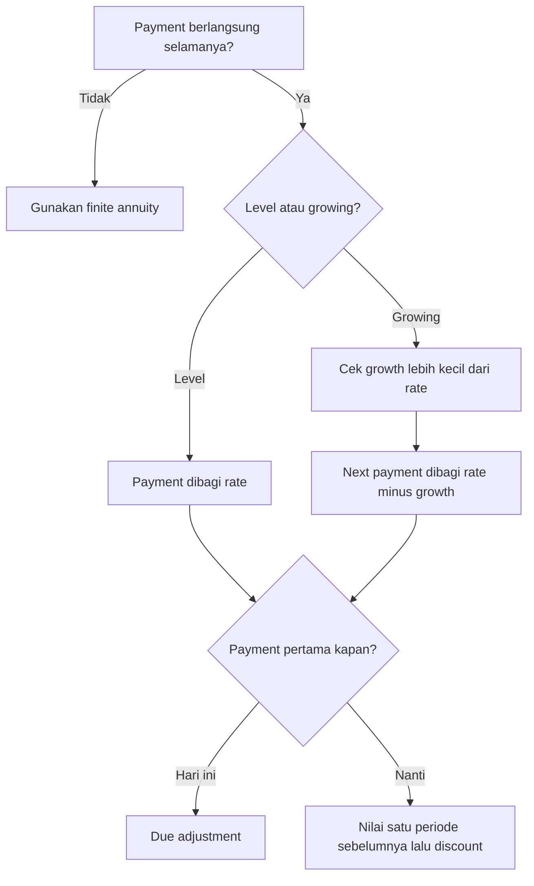

# 📘 2.2 — Perpetuity

> [!ABSTRACT] Ringkasan Cepat
> **Topik:** Perpetuity  
> **Bobot Parent Topic:** 20–30%  
> **Exam Priority:** Very High  
> **Difficulty:** Calculation-Intensive  
> **Primary Skill:** Calculation  
> **Ref:** Kellison Bab 3 §3.5; Vaaler Bab 3–4 sesuai silabus CF1

## Section 0 — Pemetaan Silabus & Exam Scope

| Field | Isi |
|---|---|
| Topik CF1 | Topik 2 — Anuitas dan Nilai Arus Kas |
| Subtopik | 2.2 Perpetuity |
| Learning Outcome | Menghitung nilai kini arus kas level atau bertumbuh yang berlangsung tanpa batas, termasuk pembayaran akhir periode dan awal periode. |
| Skill Diuji | Mengidentifikasi timing pembayaran pertama, rate basis, growth rate, convergence condition, deferral, dan focal date. |
| Bobot Parent Topic | 20–30% |
| Exam Priority | Very High |
| Prerequisite | Geometric series, discount factor, annuity-immediate, annuity-due, equivalent periodic rate |
| Connected Topics | [[2.1 Annuity-Immediate and Annuity-Due]], [[2.3 Varying Annuities]], [[2.5 Deferred Annuities]], [[5.1 Bond Pricing]] |
| Referensi | Silabus CF1 Topik 2; Kellison Bab 3 §3.5; Vaaler Bab 3–4 sesuai daftar referensi silabus |

> [!IMPORTANT] Scope Boundary
> [CORE CF1] Note ini mencakup level perpetuity-immediate, level perpetuity-due, growing perpetuity, dan perpetuitas yang dimulai setelah suatu masa penangguhan. Fokusnya adalah PV dan valuation date. Perpetuitas tidak mempunyai terminal accumulated value atas **seluruh** infinite payment stream karena tidak ada pembayaran terakhir. Varying annuity dengan term terbatas dibahas di [[2.3 Varying Annuities]], sedangkan teknik deferred annuity yang lebih umum dibahas di [[2.5 Deferred Annuities]].

## Section 1 — Intuisi & Big Picture

Perpetuitas adalah anuitas yang pembayarannya berlanjut tanpa batas. Contoh klasiknya adalah instrumen yang membayar pendapatan periodik tanpa tanggal redemption, atau dana abadi yang hanya membagikan hasil investasi dan mempertahankan modal pokoknya.

Gagasan intinya sederhana. Jika sebuah dana sebesar Rp100 juta menghasilkan 8% per tahun, dana tersebut menghasilkan Rp8 juta per tahun. Apabila hanya hasil Rp8 juta yang dibayarkan setiap akhir tahun dan modal Rp100 juta tidak disentuh, pembayaran dapat dipertahankan selamanya. Karena itu, PV perpetuitas level adalah **payment dibagi periodic effective rate**.

Walaupun jumlah pembayarannya tak terhingga, PV-nya dapat terbatas. Pembayaran yang semakin jauh didiskontokan semakin berat sehingga kontribusinya ke PV mendekati nol. Namun, formula hanya valid jika infinite geometric series tersebut konvergen. Kesalahan paling umum adalah salah menentukan pembayaran pertama, memakai annual rate untuk monthly cash flow, atau menggunakan growing perpetuity ketika $g\ge i$.

## Section 2 — Definisi & Core Concepts

> [!NOTE] Definisi Formal
> **Perpetuity** adalah anuitas dengan pembayaran yang berlanjut selamanya, sehingga term anuitas tidak terbatas.  
> **Perpetuity-immediate** membayar pada akhir setiap periode, dimulai pada $t=1$.  
> **Perpetuity-due** membayar pada awal setiap periode, dimulai pada $t=0$.  
> **Growing perpetuity** mempunyai pembayaran yang berubah dengan tingkat pertumbuhan konstan $g$ per periode.

### Terminologi Penting

| Istilah / Simbol | Definisi | Intuisi | Exam Note |
|---|---|---|---|
| $R$ | Pembayaran level per periode | Income periodik yang dipertahankan selamanya | Harus satu unit periode dengan $i$. |
| $C_1$ | Pembayaran growing perpetuity pada $t=1$ | Pembayaran pertama satu periode setelah valuation date | Formula menggunakan next payment, bukan pembayaran terakhir yang baru saja dibayar. |
| $C_0$ | Pembayaran pada $t=0$ atau base payment, sesuai konteks | Cash flow hari ini | Definisikan timing sebelum memakai formula. |
| $i$ | Effective interest/discount rate per payment period | Required return yang mendiskontokan cash flow | Annual effective tidak langsung dipakai untuk cash flow bulanan. |
| $d=i/(1+i)$ | Effective discount rate per period | Interest measured in advance | Muncul alami pada perpetuity-due. |
| $g$ | Effective growth rate pembayaran per period | Pertumbuhan payment, bukan pertumbuhan account balance | Untuk standard growing perpetuity diperlukan $g<i$. |
| $v=(1+i)^{-1}$ | Discount factor per period | Nilai kini dari 1 satu periode mendatang | Untuk deferral, pangkat $v$ ditentukan oleh jarak focal date. |

### Level Perpetuity-Immediate

Pembayaran sebesar 1 terjadi pada $t=1,2,3,\ldots$. Nilai kini pada $t=0$ adalah

$$
a_{\overline{\infty}|}
=v+v^2+v^3+\cdots.
$$

Karena ini geometric series dengan common ratio $v$ dan $0<v<1$ ketika $i>0$:

$$
\boxed{a_{\overline{\infty}|}=\frac{1}{i}}.
$$

Untuk pembayaran level sebesar $R$:

$$
\boxed{PV_0=\frac{R}{i}}.
$$

**Timing:** pembayaran pertama berada satu periode setelah valuation date.

**Economic meaning:** modal $R/i$ menghasilkan bunga periodik

$$
i\left(\frac{R}{i}\right)=R,
$$

sehingga payment $R$ dapat dibayar tanpa mengurangi modal.

### Level Perpetuity-Due

Pembayaran sebesar 1 terjadi pada $t=0,1,2,\ldots$. Dibandingkan perpetuity-immediate, seluruh payment stream digeser satu periode lebih awal:

$$
\ddot{a}_{\overline{\infty}|}
=(1+i)a_{\overline{\infty}|}.
$$

Maka

$$
\boxed{\ddot{a}_{\overline{\infty}|}=\frac{1+i}{i}=\frac{1}{d}}.
$$

Untuk pembayaran level $R$:

$$
\boxed{PV_0=\frac{R}{d}=R\frac{1+i}{i}}.
$$

Hubungan lain yang intuitif:

$$
\ddot{a}_{\overline{\infty}|}
=1+a_{\overline{\infty}|},
$$

karena pembayaran pada $t=0$ bernilai 1 dan seluruh pembayaran sisanya membentuk perpetuity-immediate.

### Growing Perpetuity-Immediate

Misalkan pembayaran pertama adalah $C_1$ pada $t=1$, lalu tumbuh sebesar $g$ per periode:

| Waktu | $1$ | $2$ | $3$ | $\cdots$ |
|---:|---:|---:|---:|---:|
| Pembayaran | $C_1$ | $C_1(1+g)$ | $C_1(1+g)^2$ | $\cdots$ |

PV pada $t=0$:

$$
PV_0
=\frac{C_1}{1+i}
+\frac{C_1(1+g)}{(1+i)^2}
+\frac{C_1(1+g)^2}{(1+i)^3}
+\cdots.
$$

Common ratio dari discounted payments adalah

$$
q=\frac{1+g}{1+i}.
$$

Jika $|q|<1$, dan untuk kasus standar nonnegative rates berarti $g<i$, maka

$$
\boxed{PV_0=\frac{C_1}{i-g}}.
$$

> [!WARNING] Convergence Condition
> Formula growing perpetuity memerlukan $g<i$ untuk kasus standar. Jika $g\ge i$, discounted payment tidak menyusut cukup cepat dan PV infinite stream tidak finite. Jangan sekadar memasukkan angka ke $C_1/(i-g)$.

### Growing Perpetuity-Due

Jika pembayaran pertama $C_0$ dilakukan pada $t=0$, lalu pembayaran berikutnya tumbuh dengan $g$:

$$
C_0,\ C_0(1+g),\ C_0(1+g)^2,\ldots
$$

maka

$$
PV_0
=C_0+\frac{C_0(1+g)}{1+i}+\cdots
=\boxed{C_0\frac{1+i}{i-g}},
$$

dengan syarat $g<i$.

### Deferred Perpetuity

Mental rule:

> Nilai perpetuitas level dihitung **satu periode sebelum pembayaran pertama**, lalu dipindahkan ke focal date.

Jika pembayaran level $R$ pertama kali dilakukan pada $t=m+1$, nilai di $t=m$ adalah

$$
V_m=\frac{R}{i}.
$$

Maka PV di $t=0$:

$$
\boxed{PV_0=v^m\frac{R}{i}}.
$$

Untuk growing perpetuity dengan pembayaran pertama $C_{m+1}$ pada $t=m+1$:

$$
\boxed{PV_0=v^m\frac{C_{m+1}}{i-g}},
$$

dengan $g<i$.

### Mengapa Tidak Ada Terminal AV?

Perpetuitas tidak mempunyai pembayaran terakhir, sehingga tidak ada terminal date alami untuk mengakumulasi **seluruh** payment stream. Karena itu, simbol accumulated value atas keseluruhan perpetuitas tidak didefinisikan.

Namun, pada waktu finite $t=n$ kita tetap dapat:

1. mengakumulasi pembayaran yang sudah terjadi sampai $t=n$ sebagai finite annuity; dan
2. menilai pembayaran yang masih tersisa setelah $t=n$ sebagai perpetuity pada tanggal tersebut.

Jangan menyebut salah satunya sebagai accumulated value dari seluruh infinite stream.

## Section 3 — How It Works

### Jembatan Logika

```text
Narasi soal
↓
Tentukan payment pertama dan pola level/growing
↓
Samakan rate dan growth dengan payment period
↓
Cek convergence condition
↓
Nilai stream satu periode sebelum payment pertama
↓
Pindahkan ke focal date
↓
Interpretasi dan sanity-check
```

### Derivasi Ringkas: Level Perpetuity

Mulai dari finite annuity-immediate:

$$
a_{\overline{n}|}=\frac{1-v^n}{i}.
$$

Jika $i>0$, maka $0<v<1$ dan

$$
\lim_{n\to\infty}v^n=0.
$$

Karena itu,

$$
a_{\overline{\infty}|}
=\lim_{n\to\infty}a_{\overline{n}|}
=\frac{1}{i}.
$$

### Derivasi Ringkas: Growing Perpetuity

Faktorkan discounted payment pertama:

$$
PV_0
=\frac{C_1}{1+i}
\left[
1+\frac{1+g}{1+i}
+\left(\frac{1+g}{1+i}\right)^2+\cdots
\right].
$$

Dengan $q=(1+g)/(1+i)$ dan $|q|<1$:

$$
PV_0
=\frac{C_1}{1+i}\frac{1}{1-q}
=\frac{C_1}{i-g}.
$$

> [!TIP] Cara Berpikir
> - **Level perpetuity:** next payment dibagi periodic rate.
> - **Growing perpetuity:** next payment dibagi spread $i-g$.
> - **Due:** tambahkan payment hari ini atau geser entire stream satu periode lebih awal.
> - **Deferred:** hitung nilai satu periode sebelum pembayaran pertama, lalu discount ke focal date.

> [!DANGER] Jangan Salah Pikir
> 1. “Pembayaran selamanya” tidak otomatis berarti PV tak terhingga; cek discounted common ratio.
> 2. Formula $C_1/(i-g)$ memakai pembayaran pada $t=1$, bukan payment pada $t=0$.
> 3. $g$ adalah pertumbuhan cash flow per payment period, bukan interest rate investasi.
> 4. Deferred selama $m$ periode berarti pembayaran pertama pada $t=m+1$ untuk perpetuity-immediate.
> 5. Tidak ada terminal AV dari seluruh perpetuitas.

## Section 4 — Worked Examples & Exam Cases

### Case A — Fundamental: Level Perpetuity-Immediate

**Soal**

Sebuah dana abadi akan membayar Rp12.000.000 pada akhir setiap tahun selamanya. Jika annual effective rate adalah 8%, tentukan dana yang harus tersedia sekarang.

> [!SUCCESS] Pembahasan
>
> **1. Identifikasi informasi & unknown**  
> $R=12{,}000{,}000$ per tahun dan $i=0.08$ per tahun. Ditanyakan $PV_0$.
>
> **2. Timeline / Structure**  
> Pembayaran pertama pada $t=1$, lalu $t=2,3,\ldots$. Ini level perpetuity-immediate.
>
> **3. Rate conversion**  
> Rate dan payment period sama-sama tahunan; tidak perlu konversi.
>
> **4. Equation / Formula Selection**
> $$
> PV_0=\frac{R}{i}.
> $$
>
> **5. Calculation**
> $$
> PV_0
> =\frac{12{,}000{,}000}{0.08}
> =\boxed{\text{Rp}150{,}000{,}000}.
> $$
>
> **6. Interpretation**  
> Bunga 8% atas Rp150 juta adalah Rp12 juta. Jika bunga tersebut dibayarkan dan principal dipertahankan, pembayaran dapat berlangsung selamanya.
>
> **7. Verification**
> $$
> 0.08(150{,}000{,}000)=12{,}000{,}000.
> $$

> [!WARNING] Exam Trap — Case A
> - **Trap:** mengalikan payment dengan suatu jumlah tahun arbitrer.
> - **Mengapa distractor terlihat benar:** perpetuity terasa seperti annuity yang “sangat panjang”.
> - **Cara menghindari:** gunakan infinite geometric series atau capital-preservation interpretation.
> - **Shortcut aman:** annual payment / annual effective rate.
> - **Target waktu:** kurang dari 1 menit.

### Case B — Exam-Typical: Monthly Perpetuity-Due

**Soal**

Sebuah benefit membayar Rp2.000.000 pada awal setiap bulan selamanya, dengan pembayaran pertama hari ini. Annual effective rate adalah 12%. Hitung nilai kini benefit.

> [!SUCCESS] Pembahasan
>
> **1. Identifikasi informasi & unknown**  
> $R=2{,}000{,}000$ per bulan. Pembayaran pertama berada pada $t=0$. Ditanyakan $PV_0$.
>
> **2. Timeline / Structure**  
> Cash flow pada awal bulan: $t=0,1,2,\ldots$ dalam unit bulan. Ini perpetuity-due.
>
> **3. Rate conversion**  
> Annual effective 12% harus dikonversi menjadi monthly effective:
> $$
> i_m=(1.12)^{1/12}-1
> =0.009488793.
> $$
> Monthly effective discount rate:
> $$
> d_m=\frac{i_m}{1+i_m}
> =0.009399602.
> $$
>
> **4. Equation / Formula Selection**
> $$
> PV_0=\frac{R}{d_m}.
> $$
>
> **5. Calculation**
> $$
> PV_0
> =\frac{2{,}000{,}000}{0.009399602}
> =\boxed{\text{Rp}212{,}774{,}965}.
> $$
>
> **6. Interpretation**  
> Nilai ini sudah mencakup pembayaran Rp2 juta hari ini dan PV seluruh pembayaran berikutnya.
>
> **7. Verification**  
> Metode alternatif:
> $$
> PV_0
> =2{,}000{,}000
> +\frac{2{,}000{,}000}{i_m},
> $$
> yang menghasilkan nilai sama.

> [!WARNING] Exam Trap — Case B
> - **Trap:** memakai $i_m=12\%/12=1\%$.
> - **Mengapa distractor terlihat benar:** pembagian langsung berlaku untuk nominal rate convertible monthly, bukan annual effective rate.
> - **Cara menghindari:** gunakan $(1+i_m)^{12}=1.12$.
> - **Shortcut aman:** due $=$ payment hari ini $+$ immediate mulai satu bulan lagi.
> - **Target waktu:** 1–2 menit.

### Case C — Challenging / Integrated: Deferred Growing Perpetuity

**Soal**

Sebuah proyek akan menghasilkan cash flow pertama Rp10.000.000 pada akhir tahun ke-6. Cash flow tersebut tumbuh 3% per tahun selamanya. Jika annual effective discount rate adalah 9%, tentukan nilai proyek pada $t=0$.

> [!SUCCESS] Pembahasan
>
> **1. Identifikasi informasi & unknown**  
> $C_6=10{,}000{,}000$, $g=0.03$, $i=0.09$. Ditanyakan $PV_0$.
>
> **2. Timeline / Structure**  
> Pembayaran pertama pada $t=6$. Nilai growing perpetuity harus dihitung satu periode sebelumnya, yaitu pada $t=5$.
>
> **3. Rate conversion dan convergence**  
> Rate dan growth sudah tahunan. Karena $g=3\%<i=9\%$, series konvergen.
>
> **4. Equation / Formula Selection**
> $$
> V_5=\frac{C_6}{i-g},
> \qquad
> PV_0=v^5V_5.
> $$
>
> **5. Calculation**
> $$
> V_5
> =\frac{10{,}000{,}000}{0.09-0.03}
> =166{,}666{,}666.67.
> $$
> $$
> PV_0
> =\frac{166{,}666{,}666.67}{(1.09)^5}
> =\boxed{\text{Rp}108{,}321{,}898}.
> $$
>
> **6. Interpretation**  
> Rp166,67 juta adalah nilai pada akhir tahun ke-5, bukan nilai hari ini. Nilai tersebut kemudian didiskontokan lima tahun ke $t=0$.
>
> **7. Verification**  
> PV harus lebih kecil daripada $V_5$ karena $i>0$ dan focal date lebih awal. Hasil memenuhi.

> [!WARNING] Exam Trap — Case C
> - **Trap:** mendiskontokan enam periode setelah menggunakan $C_6/(i-g)$.
> - **Mengapa distractor terlihat benar:** payment pertama memang berada pada $t=6$.
> - **Cara menghindari:** formula growing perpetuity menilai stream **satu periode sebelum next payment**.
> - **Shortcut aman:** tandai kotak nilai $C_6/(i-g)$ tepat di $t=5$ pada timeline.
> - **Target waktu:** 2 menit.

## Section 5 — Verification & Sanity Check

> [!CHECK] Sanity Check
> 1. Jika $i$ naik dan payment tetap, PV perpetuity harus turun.
> 2. Level perpetuity-due harus lebih besar daripada immediate sebesar satu payment hari ini:
> $$
> \frac{R}{d}=R+\frac{R}{i}.
> $$
> 3. Growing perpetuity dengan $g>0$ harus bernilai lebih besar daripada level perpetuity dengan first payment dan $i$ yang sama, selama $g<i$.
> 4. Deferred perpetuity harus bernilai lebih kecil di $t=0$ daripada nilainya satu periode sebelum pembayaran pertama.
> 5. Untuk $g\to0$, formula growing perpetuity harus kembali menjadi $C_1/i$.
> 6. Jika $g$ mendekati $i$ dari bawah, PV meningkat sangat besar.
> 7. Payment/rate/growth harus menggunakan periode yang sama.

### Metode Alternatif

| Kasus | Metode Utama | Metode Alternatif | Kapan Berguna |
|---|---|---|---|
| Level immediate | Capital preservation: $PV\times i=R$ | Infinite geometric series | Metode pertama paling cepat; series memperjelas timing. |
| Level due | Geser immediate satu periode lebih awal | Payment hari ini + immediate | Metode kedua sangat aman untuk menghindari timing error. |
| Deferred level | Nilai satu periode sebelum first payment, lalu discount | Selisih dua perpetuitas | Focal-date method biasanya tercepat. |
| Growing | Next payment dibagi spread $i-g$ | Direct geometric series | Direct series membantu mengecek definisi $C_1$. |

Hubungan finite annuity dan dua perpetuitas:

$$
a_{\overline{n}|}
=\frac{1}{i}-\frac{v^n}{i}.
$$

Interpretasinya: finite annuity adalah perpetuity-immediate mulai $t=1$ dikurangi perpetuity yang ditangguhkan sampai setelah $t=n$.

## Section 6 — Connections & Mental Model

### Hubungan dengan Topik Lain

- [[2.1 Annuity-Immediate and Annuity-Due]]: perpetuity adalah limit finite annuity ketika $n\to\infty$.
- [[2.3 Varying Annuities]]: growing perpetuity memakai geometric payment pattern dengan term tak terbatas.
- [[2.5 Deferred Annuities]]: valuation dilakukan satu periode sebelum first payment, lalu dipindahkan ke focal date.
- [[5.1 Bond Pricing]]: nonredeemable bond dengan level coupon dapat dimodelkan sebagai perpetuity.
- Valuasi saham dengan dividend growth memakai struktur matematis growing perpetuity, tetapi interpretasi corporate finance yang lebih luas tidak otomatis menjadi materi inti CF1 Topik 2.

### Mental Model Ringkas

```text
Apa payment berikutnya?
÷
Apa effective spread yang membuat discounted cash flow menyusut?
=
Nilai satu periode sebelum payment berikutnya
```

Untuk level payment, spread tersebut adalah $i$. Untuk payment yang tumbuh dengan $g$, spread tersebut adalah $i-g$.

### Hubungan Timing dengan Formula

- First payment pada $t=1$: nilai di $t=0$ adalah immediate.
- First payment pada $t=0$: tambahkan payment hari ini atau gunakan due.
- First payment pada $t=m+1$: nilai formula berada di $t=m$, lalu discount $m$ periode ke $t=0$.

## Section 7 — Exam Traps & Misconceptions

### Timing Trap

> [!BUG] Timing Trap
> **Salah:** first payment di $t=6$, maka $C_6/(i-g)$ berada di $t=6$.  
> **Benar:** formula tersebut memberi nilai satu periode sebelum first payment, yaitu pada $t=5$.

### Rate / Frequency Trap

> [!BUG] Rate & Frequency Trap
> Monthly payment harus dinilai menggunakan monthly effective rate. Untuk annual effective $i_a$:
> $$
> i_m=(1+i_a)^{1/12}-1.
> $$
> Jangan gunakan $i_a/12$ kecuali $i_a$ sebenarnya nominal rate convertible monthly.

### Formula / Notation Trap

> [!BUG] Formula Trap
> $$
> \frac{C_1}{i-g}
> $$
> menggunakan **payment pada akhir periode berikutnya**. Jika soal memberi payment yang baru saja dibayar pada $t=0$ sebesar $C_0$ dan payment tumbuh, maka next payment adalah
> $$
> C_1=C_0(1+g).
> $$

### Calculation Trap

> [!BUG] Calculation Trap
> Sebuah growing perpetuity memiliki $C_1=100$, $i=8\%$, dan $g=10\%$.
>
> **Salah**
> $$
> PV=\frac{100}{0.08-0.10}=-5{,}000.
> $$
>
> **Benar**  
> Standard PV tidak finite karena $g\ge i$; formula tidak berlaku. Nilai negatif adalah red flag, bukan jawaban ekonomis.

### Interpretation Trap

> [!BUG] Interpretation Trap
> $PV=R/i$ bukan berarti investor “hanya menerima bunga” dalam semua kontrak perpetuitas. Itu adalah economic-equivalence interpretation: modal sebesar $R/i$ pada rate $i$ cukup untuk mendukung payment $R$ tanpa batas.

### Red Flags

> [!CAUTION] Red Flags

| Keyword / Condition | Apa yang Harus Dipikirkan |
|---|---|
| “forever”, “in perpetuity”, “indefinitely” | Infinite payment stream |
| “end of each period” | Perpetuity-immediate |
| “beginning of each period”, “first payment today” | Perpetuity-due |
| “first payment one period from now” | Formula standard berada pada valuation date sekarang |
| “first payment at end of year $m+1$” | Nilai perpetuity di $t=m$, lalu discount |
| “grows at $g$ forever” | Growing perpetuity; cek $g<i$ |
| “just paid dividend/payment” | Tumbuhkan dahulu untuk memperoleh next payment |
| “annual effective” + monthly payment | Ambil akar ke monthly effective rate |
| “accumulated value of perpetuity” | Tidak ada terminal AV untuk seluruh infinite stream; klarifikasi finite valuation date |

## Section 8 — Executive Summary

> [!SUMMARY] Must Remember
> 1. Level perpetuity-immediate: $PV_0=R/i$; first payment pada $t=1$.
> 2. Level perpetuity-due: $PV_0=R/d=R(1+i)/i$; first payment pada $t=0$.
> 3. Due sama dengan payment hari ini ditambah immediate: $R+R/i$.
> 4. Growing perpetuity-immediate: $PV_0=C_1/(i-g)$, dengan $C_1$ pada $t=1$.
> 5. Standard growing perpetuity memerlukan $g<i$.
> 6. Deferred perpetuity dinilai satu periode sebelum first payment, lalu didiskontokan ke focal date.
> 7. Rate dan growth harus berada pada payment-period basis yang sama.
> 8. Perpetuity tidak mempunyai terminal AV atas seluruh infinite stream.
> 9. Jika $g=0$, growing perpetuity kembali menjadi level perpetuity.

### Formula Map / Comparison Table

| Kondisi | Formula / Rule | Focal Date | Common Trap |
|---|---|---|---|
| Level immediate | Payment dibagi $i$ | Satu periode sebelum first payment | Salah memakai annual rate untuk monthly payment |
| Level due | Payment dibagi $d$ | Tepat saat first payment | Lupa payment pada $t=0$ |
| Growing immediate | Next payment dibagi $i-g$ | Satu periode sebelum next payment | Memakai current/last payment |
| Deferred level | Nilai immediate lalu kali $v^m$ | Dari $t=m$ ke $t=0$ | Off-by-one pada deferral |
| Deferred growing | Nilai growing lalu kali $v^m$ | Dari satu periode sebelum first payment | Discount satu periode terlalu banyak |

### Trigger Keywords

| Jika soal mengatakan... | Pikirkan... |
|---|---|
| “RpX setiap akhir tahun selamanya” | $X/i$ |
| “RpX hari ini dan setiap awal periode selamanya” | $X/d$ atau $X+X/i$ |
| “payment pertama tahun depan, tumbuh $g$” | $C_1/(i-g)$ |
| “payment pertama beberapa tahun lagi” | Value one period before first payment, lalu discount |
| “dividend baru saja dibayar” | Cari next dividend sebelum formula growing perpetuity |
| “growth melebihi discount rate” | Formula standard tidak konvergen |

### Kapan Digunakan

Gunakan perpetuity formula jika:

1. pembayaran benar-benar dimodelkan tanpa batas;
2. payment timing diketahui;
3. rate konstan dan telah disamakan dengan payment period;
4. level payment atau constant growth pattern berlaku; dan
5. convergence condition dipenuhi.

### Kapan TIDAK Boleh Digunakan

Jangan gunakan formula perpetuity standard jika:

- term pembayaran terbatas;
- growth berubah antarperiode;
- discount rate berubah tanpa struktur yang memungkinkan direct valuation;
- payment timing tidak teratur;
- $g\ge i$ pada standard growing perpetuity; atau
- yang diminta adalah terminal accumulated value seluruh infinite stream.

### Quick Decision Tree



## Section 9 — Active Recall Check

1. Mengapa infinite payment stream dapat mempunyai finite present value?
2. Tuliskan direct discounted cash-flow series untuk level perpetuity-immediate.
3. Jelaskan $PV=R/i$ menggunakan capital-preservation interpretation.
4. Apa perbedaan timeline perpetuity-immediate dan perpetuity-due?
5. Susun dua equation yang membuktikan $R/d=R+R/i$.
6. Sebuah pembayaran pertama $C_1$ terjadi setahun lagi dan tumbuh $g$ selamanya. Susun PV series sebelum menyederhanakannya.
7. Mengapa formula growing perpetuity memerlukan $g<i$?
8. Jika first payment terjadi pada akhir tahun ke-8, di tanggal mana nilai $R/i$ ditempatkan dan berapa periode harus didiskontokan ke $t=0$?
9. Bagaimana mengonversi annual effective rate ke monthly effective rate untuk monthly perpetuity?
10. Mengapa accumulated value seluruh perpetuity tidak didefinisikan?

## Section 10 — Exam Pattern Map

Semua pola berikut berlabel **[TEXTBOOK-BASED EXPECTATION]** karena note ini tidak menggunakan kumpulan past exam sebagai evidence.

| Narasi Soal | Keyword | Konsep | Formula/Rule | Langkah | Trap | Shortcut |
|---|---|---|---|---|---|---|
| Dana abadi membayar level income | “forever”, “end of year” | Level immediate | Next payment / periodic rate | Samakan periode, bagi payment dengan rate | Menganggap finite term | Cek payment = interest atas PV |
| Payment pertama hari ini | “beginning”, “today” | Level due | Payment / discount rate | Konversi rate, gunakan due | Menggunakan immediate | Payment hari ini + immediate |
| Cash flow tumbuh selamanya | “grows at $g$” | Growing perpetuity | Next payment / $(i-g)$ | Identifikasi $C_1$, cek convergence | Memakai $C_0$ | Cari next payment dahulu |
| Perpetuity dimulai tahun ke-$m+1$ | “first payment at end of year...” | Deferred perpetuity | Nilai di $t=m$, lalu discount | Tandai first payment dan valuation point | Off-by-one exponent | Formula selalu satu periode sebelum first payment |
| Annual rate, monthly payment | Frequency mismatch | Rate conversion | Equivalent monthly effective rate | Convert rate, baru gunakan perpetuity | Annual rate dibagi 12 | Bedakan annual effective vs nominal convertible |

## Source Traceability

| Materi | Sumber |
|---|---|
| Scope, learning outcome, dan bobot Topik 2 | Silabus CF1 — Topik 2 |
| Definisi perpetuity dan contoh economic setting | Kellison, Bab 3 §3.5 |
| PV level perpetuity-immediate dan convergence | Kellison, Bab 3 §3.5 |
| PV level perpetuity-due | Kellison, Bab 3 §3.5 |
| Tidak adanya terminal accumulated value seluruh perpetuity | Kellison, Bab 3 §3.5 |
| Deferred perpetuity dan relasi finite annuity sebagai selisih perpetuitas | Kellison, Bab 3 §3.5, dikombinasikan dengan focal-date reasoning §3.4 |
| Growing perpetuity | Derivasi geometric-series dalam scope “growing perpetuity” pada indeks Silabus CF1; formula diturunkan eksplisit dari equation of value dalam note ini |
| Kerangka referensi tambahan untuk Topik 2 | Vaaler et al., Bab 3–4 sebagaimana ditetapkan dalam Silabus CF1; isi bab tersebut tidak teridentifikasi pada berkas Vaaler berlabel Topik 1 & 2 yang tersedia, sehingga tidak digunakan untuk klaim formula spesifik dalam note ini |

