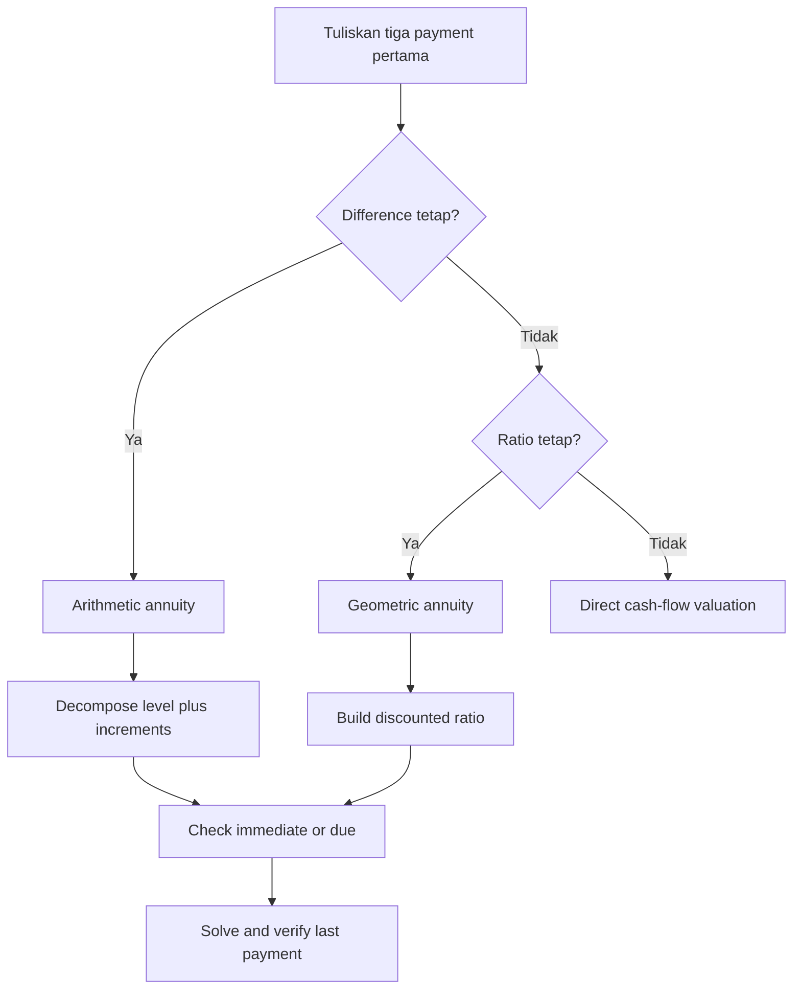

# 📘 2.3 — Varying Annuities

> [!ABSTRACT] Ringkasan Cepat
> **Topik:** Varying Annuities  
> **Bobot Parent Topic:** 20–30%  
> **Exam Priority:** Very High  
> **Difficulty:** Calculation-Intensive  
> **Primary Skill:** Calculation  
> **Ref:** Kellison Bab 4 §4.6–§4.7; Vaaler Bab 3–4 sesuai silabus CF1

## Section 0 — Pemetaan Silabus & Exam Scope

| Field | Isi |
|---|---|
| Topik CF1 | Topik 2 — Anuitas dan Nilai Arus Kas |
| Subtopik | 2.3 Varying Annuities |
| Learning Outcome | Menghitung PV dan AV arus kas yang pembayarannya berubah menurut deret aritmetika atau geometri. |
| Skill Diuji | Mengenali payment pattern, menentukan pembayaran pertama dan terakhir, memisahkan level dan varying components, menyamakan rate basis, serta menyusun equation of value. |
| Bobot Parent Topic | 20–30% |
| Exam Priority | Very High |
| Prerequisite | Geometric series, level annuity-immediate/due, focal date, equivalent periodic rate |
| Connected Topics | [[2.1 Annuity-Immediate and Annuity-Due]], [[2.2 Perpetuity]], [[2.4 Continuous Annuities]], [[2.5 Deferred Annuities]], [[2.6 Varying Interest Rates]] |
| Referensi | Silabus CF1 Topik 2; Kellison Bab 4 §4.6–§4.7; Vaaler Bab 3–4 sesuai daftar referensi silabus |

> [!IMPORTANT] Scope Boundary
> [CORE CF1] Note ini mencakup varying annuities diskret dengan pembayaran yang mengikuti **arithmetic progression** atau **geometric progression**, baik immediate maupun due, dengan rate konstan setelah disamakan ke payment period. Continuous varying annuity dibahas di [[2.4 Continuous Annuities]], deferred structure di [[2.5 Deferred Annuities]], dan changing interest rates di [[2.6 Varying Interest Rates]]. Jika pola pembayaran tidak mengikuti aritmetika atau geometri, gunakan direct cash-flow valuation dari first principles.

## Section 1 — Intuisi & Big Picture

Level annuity mengasumsikan semua pembayaran sama. Dalam kenyataan, kontribusi pensiun dapat naik mengikuti gaji, biaya pemeliharaan dapat naik dengan jumlah rupiah tetap, dan benefit dapat turun secara bertahap. Varying annuity adalah cara menilai cash flow seperti ini tanpa menjumlahkan setiap payment secara manual satu per satu.

Kunci seluruh topik ini adalah **mengenali bagaimana payment berubah**:

- **Arithmetic progression:** selisih antarpembayaran konstan, misalnya Rp1 juta, Rp1,5 juta, Rp2 juta, ...
- **Geometric progression:** rasio antarpembayaran konstan, misalnya Rp1 juta, Rp1,03 juta, Rp1,0609 juta, ...

Kesalahan terbesar biasanya terjadi sebelum perhitungan: keliru membaca first payment, menganggap “naik 5%” sebagai penambahan tetap, atau memakai simbol increasing annuity standar untuk pola yang sebenarnya memiliki base payment berbeda. Cara aman adalah menulis tiga payment pertama dan payment terakhir sebelum memilih formula.

## Section 2 — Definisi & Core Concepts

> [!NOTE] Definisi Formal
> **Varying annuity** adalah anuitas yang variasi pembayarannya telah ditentukan sebelumnya. Dalam arithmetic progression, setiap payment berubah sebesar jumlah tetap $Q$. Dalam geometric progression, setiap payment berubah dengan faktor tetap $1+g$.

### Terminologi Penting

| Istilah / Simbol | Definisi | Intuisi | Exam Note |
|---|---|---|---|
| $P$ | Pembayaran pertama | Base payment | Selalu tentukan timing $P$: $t=1$ untuk immediate atau $t=0$ untuk due. |
| $Q$ | Perubahan nominal tetap per periode | Arithmetic step | $Q>0$ increasing; $Q<0$ decreasing. |
| $g$ | Effective growth rate payment per periode | Geometric growth/decline | Rasio payment berikutnya terhadap sebelumnya adalah $1+g$. |
| $i$ | Effective interest rate per payment period | Rate untuk discount/accumulation | Harus satu periode dengan $Q$ atau $g$. |
| $n$ | Jumlah pembayaran | Panjang payment sequence | Payment terakhir arithmetic adalah $P+(n-1)Q$. |
| $(Ia)_{\overline{n}\vert}$ | PV increasing annuity-immediate dengan payments $1,2,\ldots,n$ | Unit arithmetic increasing pattern | Jangan gunakan langsung jika pattern dimulai dari selain 1 tanpa decomposition. |
| $(Da)_{\overline{n}\vert}$ | PV decreasing annuity-immediate dengan payments $n,n-1,\ldots,1$ | Unit arithmetic decreasing pattern | Huruf $D$ berarti decreasing, bukan discount factor. |
| $(Is)_{\overline{n}\vert}$ | AV increasing annuity-immediate pada $t=n$ | Accumulated form dari increasing pattern | Sama dengan PV dikali $(1+i)^n$. |
| $(Ds)_{\overline{n}\vert}$ | AV decreasing annuity-immediate pada $t=n$ | Accumulated form dari decreasing pattern | Periksa urutan payment sebelum memakai. |

### Pattern Recognition

#### Arithmetic Progression

Untuk annuity-immediate, payment pada waktu $k$ adalah

$$
C_k=P+(k-1)Q,
\qquad k=1,2,\ldots,n.
$$

Sequence:

$$
P,\ P+Q,\ P+2Q,\ldots,P+(n-1)Q.
$$

Selisihnya konstan:

$$
C_{k+1}-C_k=Q.
$$

#### Geometric Progression

Untuk annuity-immediate, payment pada waktu $k$ adalah

$$
C_k=P(1+g)^{k-1},
\qquad k=1,2,\ldots,n.
$$

Sequence:

$$
P,\ P(1+g),\ P(1+g)^2,\ldots,P(1+g)^{n-1}.
$$

Rasionya konstan:

$$
\frac{C_{k+1}}{C_k}=1+g.
$$

### General Arithmetic Annuity-Immediate

Direct equation of value:

$$
A
=Pv+(P+Q)v^2+\cdots+[P+(n-1)Q]v^n.
$$

Decompose payment menjadi level component $P$ dan arithmetic increments:

$$
A
=P a_{\overline{n}|}
+Q\left[(Ia)_{\overline{n}|}-a_{\overline{n}|}\right].
$$

Karena

$$
(Ia)_{\overline{n}|}
=\frac{\ddot{a}_{\overline{n}|}-nv^n}{i},
$$

general formula juga dapat ditulis:

$$
\boxed{
A
=P a_{\overline{n}|}
+\frac{Q}{i}\left(a_{\overline{n}|}-nv^n\right)
}.
$$

Formula berlaku selama payments tetap sesuai pattern dan tidak menghasilkan cash flow yang bertentangan dengan narasi. Jika cash flow harus positif, cek

$$
P+(n-1)Q>0.
$$

Accumulated value pada $t=n$:

$$
\boxed{S=A(1+i)^n}.
$$

### Standard Increasing Annuity-Immediate

Payments:

$$
1,2,3,\ldots,n
$$

pada $t=1,2,\ldots,n$. PV:

$$
\boxed{
(Ia)_{\overline{n}|}
=\frac{\ddot{a}_{\overline{n}|}-nv^n}{i}
}.
$$

AV:

$$
\boxed{
(Is)_{\overline{n}|}
=(Ia)_{\overline{n}|}(1+i)^n
=\frac{\ddot{s}_{\overline{n}|}-n}{i}
}.
$$

### Standard Decreasing Annuity-Immediate

Payments:

$$
n,n-1,n-2,\ldots,1
$$

pada $t=1,2,\ldots,n$. PV:

$$
\boxed{
(Da)_{\overline{n}|}
=\frac{n-a_{\overline{n}|}}{i}
}.
$$

AV:

$$
\boxed{
(Ds)_{\overline{n}|}
=(Da)_{\overline{n}|}(1+i)^n
=\frac{n(1+i)^n-s_{\overline{n}|}}{i}
}.
$$

### Useful Identity: Increasing + Decreasing

Pada setiap waktu $k$, payment increasing dan decreasing berjumlah $n+1$:

$$
k+(n+1-k)=n+1.
$$

Karena itu:

$$
\boxed{
(Ia)_{\overline{n}|}
+(Da)_{\overline{n}|}
=(n+1)a_{\overline{n}|}
}.
$$

Identity ini sangat berguna sebagai verification dan alternative method.

### Annuity-Due Adjustment

Jika sequence yang sama digeser satu periode lebih awal, seluruh PV meningkat dengan faktor $(1+i)$:

$$
PV_{\text{due}}=(1+i)PV_{\text{immediate}}.
$$

Misalnya:

$$
(I\ddot{a})_{\overline{n}|}
=(1+i)(Ia)_{\overline{n}|},
$$

dan

$$
(D\ddot{a})_{\overline{n}|}
=(1+i)(Da)_{\overline{n}|}.
$$

Jangan mengubah urutan payment ketika melakukan timing shift. Payment $1,2,\ldots,n$ tetap dalam urutan yang sama; hanya seluruh sequence berpindah dari $t=1,\ldots,n$ ke $t=0,\ldots,n-1$.

### General Geometric Annuity-Immediate

PV untuk payments $P,P(1+g),\ldots,P(1+g)^{n-1}$ pada $t=1,\ldots,n$:

$$
PV_0
=Pv+P(1+g)v^2+\cdots+P(1+g)^{n-1}v^n.
$$

Discounted common ratio:

$$
q=(1+g)v=\frac{1+g}{1+i}.
$$

Jika $i\ne g$:

$$
\boxed{
PV_0
=P\frac{1-q^n}{i-g}
=P\frac{1-\left(\frac{1+g}{1+i}\right)^n}{i-g}
}.
$$

AV pada $t=n$:

$$
\boxed{
AV_n
=PV_0(1+i)^n
=P\frac{(1+i)^n-(1+g)^n}{i-g}
}.
$$

### Special Case: $i=g$

Jika payment growth rate sama dengan interest rate, formula yang memiliki denominator $i-g$ menjadi $0/0$ dan tidak boleh digunakan langsung.

Setiap discounted payment mempunyai nilai sama:

$$
\frac{P(1+i)^{k-1}}{(1+i)^k}
=\frac{P}{1+i}=Pv.
$$

Dengan $n$ payments:

$$
\boxed{PV_0=nPv}.
$$

AV pada $t=n$:

$$
\boxed{AV_n=nP(1+i)^{n-1}}.
$$

### Geometric Annuity-Due

Untuk sequence yang sama tetapi dimulai pada $t=0$:

$$
\boxed{PV_{\text{due}}=(1+i)PV_{\text{immediate}}}.
$$

Equivalently,

$$
PV_{\text{due}}
=P\frac{1-q^n}{1-q},
\qquad
q=\frac{1+g}{1+i}.
$$

## Section 3 — How It Works

### Jembatan Logika

```text
Tuliskan tiga payment pertama dan payment terakhir
↓
Cek selisih konstan atau rasio konstan
↓
Tentukan immediate atau due
↓
Samakan interest rate dengan payment period
↓
Pilih decomposition atau geometric-series model
↓
Nilai pada focal date
↓
Verify first payment, last payment, dan direction
```

### Arithmetic: Decomposition Logic

Misalkan payments adalah

$$
P,\ P+Q,\ P+2Q,\ldots,P+(n-1)Q.
$$

Tuliskan sebagai dua layers:

$$
\underbrace{P,P,P,\ldots,P}_{\text{level component}}
+
\underbrace{0,Q,2Q,\ldots,(n-1)Q}_{\text{varying component}}.
$$

Layer kedua sama dengan $Q$ kali sequence $0,1,2,\ldots,n-1$, yaitu standard increasing annuity dikurangi satu level annuity:

$$
0,1,2,\ldots,n-1
=(1,2,\ldots,n)-(1,1,\ldots,1).
$$

Inilah alasan di balik

$$
A=P a_{\overline{n}|}
+Q\left[(Ia)_{\overline{n}|}-a_{\overline{n}|}\right].
$$

### Geometric: Combine Payment Growth and Discounting

Payment tumbuh dengan faktor $(1+g)$, sedangkan setiap langkah menjauh dari focal date menambah discount factor $v$. Karena itu, discounted cash flows berubah dengan satu combined ratio:

$$
q=(1+g)v.
$$

Setelah $q$ diidentifikasi, masalah berubah menjadi geometric-series biasa.

> [!TIP] Cara Berpikir
> - Kata “naik **sebesar** RpX” $\Rightarrow$ arithmetic, $Q=\text{RpX}$.
> - Kata “naik **sebesar** X%” $\Rightarrow$ geometric, $g=X\%$.
> - Arithmetic umum $\Rightarrow$ level base + incremental layer.
> - Geometric $\Rightarrow$ gabungkan growth dan discount menjadi $q=(1+g)/(1+i)$.
> - Due $\Rightarrow$ shift seluruh immediate pattern satu periode lebih awal.

> [!DANGER] Jangan Salah Pikir
> 1. Increasing annuity standar dimulai dari 1, bukan 0.
> 2. Untuk payments $P,P+Q,\ldots$, incremental layer adalah $0,Q,2Q,\ldots$, bukan $Q,2Q,3Q,\ldots$.
> 3. $Q$ dapat negatif, tetapi urutan dan payment terakhir harus dicek.
> 4. Geometric payment growth $g$ berbeda dari investment rate $i$.
> 5. Formula $i-g$ memerlukan special treatment ketika $i=g$.

## Section 4 — Worked Examples & Exam Cases

### Case A — Fundamental: General Arithmetic Increasing Annuity

**Soal**

Sebuah anuitas membayar Rp1.000.000 pada akhir tahun pertama. Setiap pembayaran berikutnya naik Rp500.000 dari pembayaran sebelumnya. Terdapat 10 pembayaran tahunan dan annual effective rate adalah 6%. Hitung PV anuitas.

> [!SUCCESS] Pembahasan
>
> **1. Identifikasi informasi & unknown**  
> $P=1{,}000{,}000$, $Q=500{,}000$, $n=10$, dan $i=0.06$.
>
> **2. Timeline / Structure**  
> Payments pada $t=1,2,\ldots,10$ adalah Rp1 juta, Rp1,5 juta, ..., Rp5,5 juta. Ini arithmetic increasing annuity-immediate.
>
> **3. Rate conversion**  
> Rate dan payment period sama-sama tahunan; tidak perlu konversi.
>
> **4. Equation / Formula Selection**
> $$
> PV_0
> =P a_{\overline{10}|}
> +Q\left[(Ia)_{\overline{10}|}-a_{\overline{10}|}\right].
> $$
>
> **5. Calculation**
> $$
> v=\frac{1}{1.06},
> \qquad
> a_{\overline{10}|}=7.360087.
> $$
> $$
> (Ia)_{\overline{10}|}
> =\frac{(1.06)a_{\overline{10}|}-10v^{10}}{0.06}
> =36.962408.
> $$
> $$
> \begin{aligned}
> PV_0
> &=1{,}000{,}000(7.360087)\\
> &\quad+500{,}000(36.962408-7.360087)\\
> &=\boxed{\text{Rp}22{,}161{,}248}.
> \end{aligned}
> $$
>
> **6. Interpretation**  
> PV terdiri dari level base Rp1 juta selama 10 tahun dan tambahan Rp500 ribu yang bertambah satu layer setiap tahun.
>
> **7. Verification**  
> Direct summation
> $$
> \sum_{k=1}^{10}[1{,}000{,}000+(k-1)500{,}000]v^k
> $$
> menghasilkan nilai yang sama.

> [!WARNING] Exam Trap — Case A
> - **Trap:** memakai $P a_{\overline{10}|}+Q(Ia)_{\overline{10}|}$.
> - **Mengapa distractor terlihat benar:** terlihat seperti base plus increasing layer.
> - **Cara menghindari:** incremental layer dimulai dari 0, sehingga gunakan $(Ia)-a$.
> - **Shortcut aman:** tulis sequence $P,P+Q,P+2Q$ sebelum decomposition.
> - **Target waktu:** 2–3 menit.

### Case B — Exam-Typical: Decreasing Annuity-Due

**Soal**

Sebuah program benefit membayar Rp10.000.000 hari ini, Rp9.000.000 satu tahun lagi, dan seterusnya turun Rp1.000.000 per tahun hingga pembayaran terakhir Rp1.000.000 pada awal tahun ke-10. Jika annual effective rate 5%, hitung PV program.

> [!SUCCESS] Pembahasan
>
> **1. Identifikasi informasi & unknown**  
> Unit payment Rp1 juta. Sequence adalah $10,9,\ldots,1$ dengan $n=10$.
>
> **2. Timeline / Structure**  
> Payments berada pada $t=0,1,\ldots,9$, sehingga ini decreasing annuity-due.
>
> **3. Rate conversion**  
> Rate tahunan sesuai payment period.
>
> **4. Equation / Formula Selection**  
> Hitung decreasing annuity-immediate lalu geser satu periode lebih awal:
> $$
> PV_0
> =1{,}000{,}000(1.05)(Da)_{\overline{10}|}.
> $$
>
> **5. Calculation**
> $$
> a_{\overline{10}|}=\frac{1-(1.05)^{-10}}{0.05}=7.721735.
> $$
> $$
> (Da)_{\overline{10}|}
> =\frac{10-a_{\overline{10}|}}{0.05}
> =45.565301.
> $$
> $$
> PV_0
> =1{,}000{,}000(1.05)(45.565301)
> =\boxed{\text{Rp}47{,}843{,}566}.
> $$
>
> **6. Interpretation**  
> Payment terbesar terjadi hari ini sehingga PV relatif dekat dengan total nominal Rp55 juta.
>
> **7. Verification**  
> Direct summation:
> $$
> PV_0
> =1{,}000{,}000\sum_{k=0}^{9}(10-k)v^k.
> $$
> Hasil sama dengan formula.

> [!WARNING] Exam Trap — Case B
> - **Trap:** menggunakan $(Da)_{\overline{10}|}$ tanpa due adjustment.
> - **Mengapa distractor terlihat benar:** sequence memang $10,9,\ldots,1$ yang cocok dengan standard decreasing notation.
> - **Cara menghindari:** standard $(Da)$ immediate berada pada $t=1,\ldots,n$; soal dimulai di $t=0$.
> - **Shortcut aman:** payment hari ini $\Rightarrow$ shift earlier $\Rightarrow$ kali $(1+i)$.
> - **Target waktu:** 2 menit.

### Case C — Challenging / Integrated: Geometric Growth + Frequency Conversion

**Soal**

Sebuah dana menerima 16 setoran pada akhir setiap kuartal. Setoran pertama adalah Rp2.000.000 dan setiap setoran berikutnya 1,5% lebih besar daripada sebelumnya. Dana memperoleh annual effective rate 10%. Hitung saldo tepat setelah setoran ke-16.

> [!SUCCESS] Pembahasan
>
> **1. Identifikasi informasi & unknown**  
> $P=2{,}000{,}000$, $g=0.015$ per kuartal, dan $n=16$. Ditanyakan $AV_{16}$.
>
> **2. Timeline / Structure**  
> Payments berada pada akhir kuartal $1$ sampai $16$. Ini geometric annuity-immediate.
>
> **3. Rate conversion**  
> Quarterly effective rate:
> $$
> i_q=(1.10)^{1/4}-1
> =0.024113689.
> $$
> Rate dan growth sekarang sama-sama per kuartal.
>
> **4. Equation / Formula Selection**
> $$
> AV_{16}
> =P\frac{(1+i_q)^{16}-(1+g)^{16}}{i_q-g}.
> $$
>
> **5. Calculation**
> $$
> \begin{aligned}
> AV_{16}
> &=2{,}000{,}000
> \frac{(1.024113689)^{16}-(1.015)^{16}}
> {0.024113689-0.015}\\
> &=\boxed{\text{Rp}42{,}817{,}886}.
> \end{aligned}
> $$
>
> **6. Interpretation**  
> Setoran terakhir bernilai sekitar Rp2,500 juta dan tidak memperoleh bunga karena saldo dinilai tepat setelah payment ke-16. Setoran lebih awal memperoleh waktu akumulasi lebih panjang.
>
> **7. Verification**  
> PV terlebih dahulu adalah sekitar Rp29.245.193. Mengakumulasikannya selama 16 kuartal:
> $$
> 29{,}245{,}193(1+i_q)^{16}
> \approx42{,}817{,}886.
> $$

> [!WARNING] Exam Trap — Case C
> - **Trap:** menggunakan quarterly rate $10\%/4=2.5\%$.
> - **Mengapa distractor terlihat benar:** payment frequency empat kali setahun.
> - **Cara menghindari:** 10% adalah annual effective, sehingga ambil akar keempat.
> - **Shortcut aman:** selalu samakan basis $i$ dan $g$ sebelum menghitung $i-g$.
> - **Target waktu:** 2–3 menit.

## Section 5 — Verification & Sanity Check

> [!CHECK] Sanity Check
> 1. Arithmetic payment terakhir harus sama dengan $P+(n-1)Q$.
> 2. Geometric payment terakhir harus sama dengan $P(1+g)^{n-1}$.
> 3. Increasing dan decreasing standard annuity memenuhi
> $$
> (Ia)_{\overline{n}|}+(Da)_{\overline{n}|}=(n+1)a_{\overline{n}|}.
> $$
> 4. Untuk sequence identik dan $i>0$, due PV harus $(1+i)$ kali immediate PV.
> 5. AV harus sama dengan PV dikali $(1+i)^n$ jika focal date berpindah dari $t=0$ ke $t=n$.
> 6. Jika $Q=0$ atau $g=0$, varying annuity harus kembali menjadi level annuity.
> 7. Jika $i=g$ pada geometric annuity, setiap discounted payment sama dengan $Pv$.
> 8. Direct summation atas 2–3 terms dapat memeriksa timing dan exponent meskipun formula ringkas digunakan.

### Metode Alternatif

| Pola | Metode Utama | Metode Alternatif | Kapan Dipilih |
|---|---|---|---|
| General arithmetic | Level + incremental decomposition | General arithmetic formula | Decomposition lebih intuitif; formula lebih ringkas. |
| Standard increasing | Direct $(Ia)$ identity | Sum of deferred level annuities | Identity cepat; layer view mencegah off-by-one. |
| Standard decreasing | Direct $(Da)$ identity | Level sequence minus increasing component | Pilih yang paling cocok dengan data. |
| Geometric | Combine ratio $q=(1+g)/(1+i)$ | Closed form with $i-g$ | Ratio form paling aman jika notation membingungkan. |
| Irregular pattern | Direct summation | Spreadsheet/calculator if permitted | Jangan memaksakan arithmetic/geometric formula. |

### Direct Summation as Universal Fallback

Untuk pola apa pun:

$$
PV_0=\sum_{k=1}^{n}C_kv^k
$$

untuk immediate, atau

$$
PV_0=\sum_{k=0}^{n-1}C_kv^k
$$

untuk due. Formula varying annuity hanyalah penyederhanaan dari sums ini.

## Section 6 — Connections & Mental Model

### Hubungan dengan Topik Lain

- [[2.1 Annuity-Immediate and Annuity-Due]] menyediakan level annuity building blocks dan timing shift.
- [[2.2 Perpetuity]] adalah limit geometric or arithmetic payment stream ketika convergence condition terpenuhi.
- [[2.4 Continuous Annuities]] mengganti payment diskret dengan payment rate kontinu.
- [[2.5 Deferred Annuities]] memindahkan seluruh varying sequence ke masa depan.
- [[2.6 Varying Interest Rates]] mengubah discount factors; payment pattern dan rate pattern harus dipisahkan.
- Kontribusi pensiun yang tumbuh bersama gaji adalah aplikasi natural geometric annuity.

### Mental Model: Pattern before Formula

| Tiga Payment Pertama | Pertanyaan Diagnosis | Model |
|---|---|---|
| $P,P+Q,P+2Q$ | Apakah difference tetap? | Arithmetic progression |
| $P,P(1+g),P(1+g)^2$ | Apakah ratio tetap? | Geometric progression |
| $P,P,P$ | Apakah semuanya sama? | Level annuity |
| Tidak cocok | Apakah pattern lain ditentukan? | First-principles summation |

### Hubungan Visual dengan Exponent

Untuk immediate, payment ke-$k$ berada pada $t=k$, sehingga PV term-nya adalah

$$
C_kv^k.
$$

Untuk due, payment ke-$k+1$ berada pada $t=k$, sehingga PV term-nya adalah

$$
C_{k+1}v^k.
$$

Perbedaan exponent ini adalah sumber utama timing trap.

## Section 7 — Exam Traps & Misconceptions

### Timing Trap

> [!BUG] Timing Trap
> Sequence $1,2,\ldots,n$ tidak otomatis berarti $(Ia)$ immediate. Jika payment 1 terjadi hari ini, pattern tersebut adalah due dan PV immediate harus digeser satu periode lebih awal.

### Rate / Frequency Trap

> [!BUG] Rate & Frequency Trap
> Jika payment tumbuh 2% per kuartal tetapi interest rate 12% annual effective, jangan menghitung $i-g=12\%-2\%$. Konversi dahulu:
> $$
> i_q=(1.12)^{1/4}-1,
> $$
> lalu gunakan $i_q-g_q$.

### Formula / Notation Trap

> [!BUG] Formula Trap
> Untuk payments $P,P+Q,\ldots$, formula yang benar adalah
> $$
> P a_{\overline{n}|}
> +Q\left[(Ia)_{\overline{n}|}-a_{\overline{n}|}\right],
> $$
> bukan $P a_{\overline{n}|}+Q(Ia)_{\overline{n}|}$.

### Calculation Trap

> [!BUG] Calculation Trap
> Jika $i=g$, maka
>
> **Salah**
> $$
> PV=P\frac{1-q^n}{i-g}
> $$
> karena menghasilkan $0/0$.
>
> **Benar**
> $$
> PV=nPv.
> $$

### Interpretation Trap

> [!BUG] Interpretation Trap
> “Payment meningkat” tidak selalu membuat AV lebih besar daripada level annuity dengan payment pertama yang sama dalam setiap comparison. Hasil juga bergantung pada jumlah payment, besar $Q/g$, rate, dan apakah comparison memakai total nominal cash flow yang sama. Jangan membuat klaim arah tanpa mendefinisikan benchmark.

### Red Flags

> [!CAUTION] Red Flags

| Keyword / Condition | Apa yang Harus Dipikirkan |
|---|---|
| “increases by RpX each period” | Arithmetic; $Q=\text{RpX}$ |
| “decreases by RpX each period” | Arithmetic dengan $Q<0$ |
| “X% greater than preceding payment” | Geometric; factor $1+g$ |
| “first payment is...” | Tetapkan $P$ dan waktunya |
| “beginning of each period” | Due adjustment |
| “end of each period” | Immediate timing |
| “increases from 1 to $n$” | Standard increasing annuity candidate |
| “decreases from $n$ to 1” | Standard decreasing annuity candidate |
| “annual effective” + quarterly/monthly payments | Convert ke effective rate per payment period |
| $i=g$ | Special case; jangan bagi dengan nol |
| Pattern berubah di tengah term | Pecah menjadi beberapa blocks |

## Section 8 — Executive Summary

> [!SUMMARY] Must Remember
> 1. Tulis tiga payment pertama dan payment terakhir sebelum memilih formula.
> 2. Arithmetic progression mempunyai constant difference $Q$.
> 3. Geometric progression mempunyai constant ratio $1+g$.
> 4. General arithmetic sequence $P,P+Q,\ldots$ dapat dipecah menjadi level $P$ plus $Q(0,1,\ldots,n-1)$.
> 5. $(Ia)$ standar membayar $1,2,\ldots,n$; $(Da)$ standar membayar $n,n-1,\ldots,1$.
> 6. Due adalah immediate pattern yang digeser satu periode lebih awal.
> 7. Geometric annuity memakai discounted ratio $q=(1+g)/(1+i)$.
> 8. Samakan basis periode $i$, $g$, dan payments sebelum menghitung.
> 9. Jika $i=g$, gunakan $PV=nPv$, bukan formula dengan denominator $i-g$.
> 10. Direct summation selalu menjadi fallback yang valid.

### Formula Map / Comparison Table

| Kondisi | Formula / Rule | Timing | Common Trap |
|---|---|---|---|
| Arithmetic umum | Level base + incremental layer | Immediate unless shifted | Increment dimulai dari 0, bukan $Q$ |
| Increasing standard | PV identity using due annuity and terminal correction | Payments $1$ sampai $n$ | Salah first payment |
| Decreasing standard | PV identity using $n$ and level annuity | Payments $n$ sampai $1$ | Huruf $D$ dianggap discount |
| Geometric, $i\ne g$ | Use ratio $q$ or $i-g$ closed form | Check immediate/due | Rate basis berbeda |
| Geometric, $i=g$ | $PV=nPv$ | Immediate | Membagi dengan nol |
| AV dari PV | Kali $(1+i)^n$ | From $t=0$ to $t=n$ | Exponent tidak sesuai focal dates |

### Trigger Keywords

| Jika soal mengatakan... | Pikirkan... |
|---|---|
| “naik Rp500 ribu setiap tahun” | Arithmetic $Q=500{,}000$ |
| “naik 3% setiap tahun” | Geometric $g=3\%$ |
| “dimulai dari RpX” | $P=\text{RpX}$; cek tanggal first payment |
| “hingga mencapai...” | Hitung jumlah payment dan last payment |
| “kemudian tetap level” | Pecah growing/increasing block + level block |
| “saldo pada akhir term” | AV atau PV lalu accumulate |
| “payment hari ini” | Due timing |

### Kapan Digunakan

Gunakan arithmetic or geometric annuity formula jika:

1. variasi payment telah ditentukan;
2. difference atau ratio benar-benar konstan;
3. jumlah payment dan timing diketahui;
4. rate konstan per payment period; dan
5. seluruh sequence mengikuti satu pattern atau dapat dipecah menjadi blocks yang jelas.

### Kapan TIDAK Boleh Digunakan

Jangan memaksakan formula jika:

- payment pattern irregular;
- variation bergantung pada external investment performance;
- rate berubah per periode;
- payment berlangsung kontinu;
- growth/difference berubah di tengah sequence tanpa decomposition; atau
- payment dan rate frequencies belum disamakan.

### Quick Decision Tree



## Section 9 — Active Recall Check

1. Apa perbedaan diagnostic antara arithmetic dan geometric payment pattern?
2. Tuliskan payment ke-$k$ untuk arithmetic annuity yang dimulai dari $P$ dan bertambah $Q$.
3. Mengapa general arithmetic annuity memakai $(Ia)-a$ untuk incremental layer?
4. Susun equation of value untuk payments $5,7,9,11$ pada akhir tahun 1–4.
5. Jelaskan identity $(Ia)+(Da)=(n+1)a$ menggunakan payment-by-payment reasoning.
6. Bagaimana mengubah standard increasing annuity-immediate menjadi due?
7. Tuliskan discounted common ratio untuk geometric annuity dan jelaskan asal dua komponennya.
8. Apa formula PV geometric annuity ketika $i=g$, dan mengapa?
9. Sebuah payment naik 2% per bulan tetapi rate adalah annual effective. Apa langkah yang harus dilakukan sebelum memakai formula?
10. Kapan direct summation lebih tepat daripada varying-annuity identity?

## Section 10 — Exam Pattern Map

Semua pola berikut berlabel **[TEXTBOOK-BASED EXPECTATION]** karena note ini tidak menggunakan kumpulan past exam sebagai evidence.

| Narasi Soal | Keyword | Konsep | Formula/Rule | Langkah | Trap | Shortcut |
|---|---|---|---|---|---|---|
| Payment naik jumlah tetap | “increase by RpX” | Arithmetic increasing | Level + incremental component | Tentukan $P,Q,n$, lalu decompose | Increment dimulai dari $Q$ | Tulis first three payments |
| Payment turun dari $n$ ke 1 | “decreases by 1” | Standard decreasing | Decreasing-annuity identity | Cek immediate/due, hitung factor | Salah urutan payment | Pair dengan increasing identity |
| Payment tumbuh persentase tetap | “X% more each year” | Geometric annuity | Discounted geometric ratio | Samakan $i,g$, sum series | Arithmetic vs geometric confusion | Ratio test |
| Payment frequency berbeda dari quoted rate | “quarterly”, “annual effective” | Rate conversion | Equivalent rate per payment period | Convert rate dahulu | Annual rate dibagi frequency | Use accumulation equivalence |
| Pattern berubah setelah beberapa payment | “increases until..., then level” | Block decomposition | Value each block at common focal date | Pisahkan blocks, shift values | Payment count overlap | Tandai transition payment |
| Growth sama dengan interest | $g=i$ | Special geometric case | $PV=nPv$ | Recognize $q=1$ | Formula $0/0$ | Every discounted payment equal |

## Source Traceability

| Materi | Sumber |
|---|---|
| Scope, learning outcome, dan bobot Topik 2 | Silabus CF1 — Topik 2 |
| Definisi varying annuity dan distinction dari variable annuity | Kellison, Bab 4 §4.6 |
| General arithmetic annuity $P+(k-1)Q$ | Kellison, Bab 4 §4.6 |
| Increasing and decreasing annuity identities | Kellison, Bab 4 §4.6 |
| Annuity-due adjustment untuk arithmetic patterns | Kellison, Bab 4 §4.6 |
| Geometric annuity PV/AV dan combined ratio | Kellison, Bab 4 §4.7 |
| Special case ketika growth rate sama dengan interest rate | Kellison, Bab 4 §4.7 |
| Decomposition dan worked-example structure | Sintesis equation-of-value dari Kellison §4.6–§4.7 |
| Kerangka referensi tambahan untuk Topik 2 | Vaaler et al., Bab 3–4 sebagaimana ditetapkan dalam Silabus CF1; isi bab tersebut tidak teridentifikasi pada berkas Vaaler berlabel Topik 1 & 2 yang tersedia, sehingga tidak digunakan untuk klaim formula spesifik dalam note ini |
