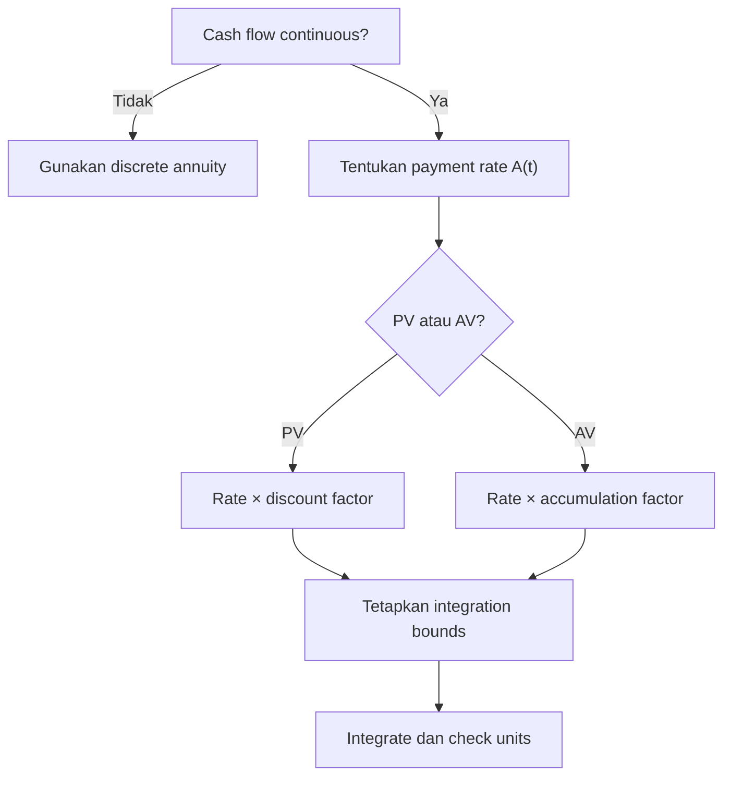

# 📘 2.4 — Continuous Annuities

> [!ABSTRACT] Ringkasan Cepat
> **Topik:** Continuous Annuities  
> **Bobot Parent Topic:** 20–30%  
> **Exam Priority:** Very High  
> **Difficulty:** Calculation-Intensive  
> **Primary Skill:** Calculation  
> **Ref:** Kellison Bab 4 §4.5 dan §4.9; Vaaler Bab 3–4 sesuai silabus CF1

## Section 0 — Pemetaan Silabus & Exam Scope

| Field | Isi |
|---|---|
| Topik CF1 | Topik 2 — Anuitas dan Nilai Arus Kas |
| Subtopik | 2.4 Continuous Annuities |
| Learning Outcome | Menghitung PV dan AV arus kas yang dibayarkan kontinu, baik dengan payment rate level maupun payment rate yang berubah terhadap waktu. |
| Skill Diuji | Menerjemahkan payment rate menjadi differential cash flow, menentukan batas integral, mengonversi rate ke force of interest, mengevaluasi integral, dan menginterpretasikan units. |
| Bobot Parent Topic | 20–30% |
| Exam Priority | Very High |
| Prerequisite | Force of interest, accumulation/discount functions, definite integral, level dan varying annuities |
| Connected Topics | [[1.2 Effective, Nominal, and Force of Interest]], [[2.1 Annuity-Immediate and Annuity-Due]], [[2.3 Varying Annuities]], [[2.5 Deferred Annuities]], [[2.6 Varying Interest Rates]] |
| Referensi | Silabus CF1 Topik 2; Kellison Bab 4 §4.5 dan §4.9; Vaaler Bab 3–4 sesuai daftar referensi silabus |

> [!IMPORTANT] Scope Boundary
> [CORE CF1] Note ini membahas continuous annuity dengan constant force of interest, termasuk level payment rate, general payment rate $A(t)$, dan continuous arithmetic-increasing payment rate. Deferred continuous annuity dibahas lebih sistematis di [[2.5 Deferred Annuities]], sedangkan varying force of interest berada di [[2.6 Varying Interest Rates]]. Stochastic cash flow dan life-contingent continuous annuity berada di luar scope note ini.

## Section 1 — Intuisi & Big Picture

Pada anuitas diskret, cash flow terjadi pada titik waktu tertentu: misalnya Rp1 juta setiap akhir bulan. Pada continuous annuity, pembayaran mengalir sepanjang waktu. Contoh praktis yang mendekati pola ini adalah pendapatan, biaya operasional, atau kontribusi yang terjadi sangat sering dan dimodelkan sebagai aliran kontinu.

Hal terpenting adalah membedakan **payment rate** dari **payment amount**. Jika dana dibayar secara kontinu pada rate Rp12 juta per tahun, maka selama interval sangat kecil sepanjang $dt$ tahun, cash flow yang terjadi adalah

$$
12{,}000{,}000\,dt,
$$

bukan Rp12 juta pada setiap instant. Selama satu tahun penuh, total nominal yang dibayar adalah Rp12 juta.

Integral hanyalah penjumlahan dari seluruh differential cash flows setelah masing-masing dipindahkan ke focal date. Untuk PV, cash flow pada waktu $t$ dikalikan discount factor menuju $t=0$. Untuk AV pada $t=n$, cash flow yang sama diakumulasikan dari $t$ ke $n$.

## Section 2 — Definisi & Core Concepts

> [!NOTE] Definisi Formal
> **Continuous annuity** adalah anuitas yang pembayarannya dilakukan secara kontinu. Jika payment rate pada waktu $t$ adalah $A(t)$ per unit waktu, cash flow selama interval $[t,t+dt]$ adalah $A(t)dt$.

### Terminologi Penting

| Istilah / Simbol | Definisi | Intuisi | Exam Note |
|---|---|---|---|
| $A(t)$ | Payment rate pada waktu $t$ | Kecepatan aliran uang | Units: currency per unit time. |
| $A(t)dt$ | Payment selama interval sangat kecil $dt$ | Differential cash flow | Inilah amount yang didiskontokan. |
| $delta$ | Constant force of interest per unit time | Continuous growth intensity | Jika $i$ effective per unit time, $delta=\ln(1+i)$. |
| $v^t=e^{-\delta t}$ | Discount factor dari $t$ ke 0 | Present value dari 1 pada waktu $t$ | Time unit harus konsisten dengan $delta$. |
| $\bar{a}_{\overline{n}\vert}$ | PV continuous level annuity rate 1 selama $0\le t\le n$ | Continuous counterpart dari PV annuity | Total nominal payment tanpa bunga adalah $n$. |
| $\bar{s}_{\overline{n}\vert}$ | AV continuous level annuity rate 1 pada $t=n$ | Akumulasi seluruh aliran sampai $n$ | PV dan AV berbeda faktor $e^{\delta n}$. |
| $(\bar{I}a)_{\overline{n}\vert}$ | PV continuous increasing annuity dengan rate $A(t)=t$ | Payment rate naik linear | Jangan tertukar dengan discrete payments $1,2,\ldots,n$. |

### General Present Value

Jika payment rate adalah $A(t)$ pada $0\le t\le n$, maka cash flow kecil di waktu $t$ adalah $A(t)dt$. Dengan constant force $delta$:

$$
\boxed{
PV_0
=\int_0^n A(t)e^{-\delta t}\,dt
=\int_0^n A(t)v^t\,dt
}.
$$

**Cash-flow meaning:** setiap $A(t)dt$ didiskontokan selama $t$ unit waktu.

**Rate basis:** $delta$ harus dinyatakan per unit waktu yang sama dengan $t$.

### General Accumulated Value

Nilai pada $t=n$ dari cash flow yang terjadi pada $t$ adalah

$$
A(t)dt\,e^{\delta(n-t)}.
$$

Karena itu:

$$
\boxed{
AV_n
=\int_0^n A(t)e^{\delta(n-t)}\,dt
}.
$$

Dengan constant force:

$$
\boxed{AV_n=e^{\delta n}PV_0=(1+i)^nPV_0}.
$$

### Level Continuous Annuity

Jika payment rate level sebesar 1 per unit time, maka $A(t)=1$:

$$
\bar{a}_{\overline{n}|}
=\int_0^n e^{-\delta t}\,dt.
$$

Evaluasi integral:

$$
\boxed{
\bar{a}_{\overline{n}|}
=\frac{1-e^{-\delta n}}{\delta}
=\frac{1-v^n}{\delta}
}.
$$

Untuk payment rate level $R$ per unit time:

$$
\boxed{PV_0=R\bar{a}_{\overline{n}|}}.
$$

Accumulated value pada $t=n$:

$$
\bar{s}_{\overline{n}|}
=\int_0^n e^{\delta(n-t)}\,dt,
$$

sehingga

$$
\boxed{
\bar{s}_{\overline{n}|}
=\frac{e^{\delta n}-1}{\delta}
=\frac{(1+i)^n-1}{\delta}
}.
$$

Untuk payment rate $R$:

$$
\boxed{AV_n=R\bar{s}_{\overline{n}|}}.
$$

Core relationship:

$$
\boxed{
\bar{s}_{\overline{n}|}
=e^{\delta n}\bar{a}_{\overline{n}|}
=(1+i)^n\bar{a}_{\overline{n}|}
}.
$$

### Relationship dengan Discrete Annuities

Karena

$$
a_{\overline{n}|}=\frac{1-v^n}{i},
\qquad
\ddot{a}_{\overline{n}|}=\frac{1-v^n}{d},
$$

maka

$$
\boxed{
\bar{a}_{\overline{n}|}
=\frac{i}{\delta}a_{\overline{n}|}
=\frac{d}{\delta}\ddot{a}_{\overline{n}|}
}.
$$

Demikian pula:

$$
\boxed{
\bar{s}_{\overline{n}|}
=\frac{i}{\delta}s_{\overline{n}|}
=\frac{d}{\delta}\ddot{s}_{\overline{n}|}
}.
$$

Untuk $i>0$ berlaku

$$
d<\delta<i.
$$

Karena payment kontinu tersebar di antara awal dan akhir periode:

$$
\boxed{
a_{\overline{n}|}
<\bar{a}_{\overline{n}|}
<\ddot{a}_{\overline{n}|}
}.
$$

Ordering serupa berlaku untuk accumulated values dengan cash-flow basis yang konsisten.

### Continuous Immediate vs Due?

Untuk continuous payment stream murni, memasukkan atau mengecualikan payment tepat di endpoint $t=0$ atau $t=n$ tidak mengubah integral karena satu titik mempunyai measure nol. Karena itu, distinction immediate/due tidak bekerja seperti pada discrete annuity.

Jika ada discrete lump sum pada $t=0$ atau $t=n$, lump sum tersebut harus ditambahkan secara terpisah.

### Continuous Perpetuity

Jika payment rate level 1 berlangsung selamanya dan $delta>0$:

$$
\bar{a}_{\overline{\infty}|}
=\int_0^\infty e^{-\delta t}\,dt
=\boxed{\frac{1}{\delta}}.
$$

Untuk payment rate $R$:

$$
PV_0=\frac{R}{\delta}.
$$

### Continuous Increasing Annuity

Jika payment rate pada waktu $t$ adalah

$$
A(t)=t,
$$

maka PV:

$$
(\bar{I}a)_{\overline{n}|}
=\int_0^n t e^{-\delta t}\,dt.
$$

Dengan integration by parts:

$$
\boxed{
(\bar{I}a)_{\overline{n}|}
=\frac{\bar{a}_{\overline{n}|}-nv^n}{\delta}
}.
$$

Untuk general linear payment rate

$$
A(t)=P+Qt,
$$

PV dapat di-decompose:

$$
\boxed{
PV_0
=P\bar{a}_{\overline{n}|}
+Q(\bar{I}a)_{\overline{n}|}
}.
$$

Jika payment rate menurun linear, misalnya $A(t)=n-t$:

$$
PV_0
=n\bar{a}_{\overline{n}|}
-(\bar{I}a)_{\overline{n}|}.
$$

### Differential Equation Interpretation

Misalkan $F(t)=\bar{s}_{\overline{t}|}$ adalah fund balance dari continuous deposits pada rate 1. Perubahannya berasal dari deposit baru dan interest atas saldo:

$$
\boxed{
F'(t)=1+\delta F(t),
\qquad F(0)=0
}.
$$

Ini memberikan economic interpretation: instantaneous increase in fund balance $=$ new contribution rate $+$ instantaneous interest earning.

## Section 3 — How It Works

### Jembatan Logika

```text
Narasi continuous payment
↓
Identifikasi payment rate A(t) dan units
↓
Tentukan interval pembayaran
↓
Konversi interest quotation menjadi force per unit time
↓
Pilih PV atau AV focal date
↓
Tulis differential cash flow A(t)dt
↓
Integrasikan dan lakukan sanity check
```

### Dari Narasi ke Integral

Jika soal mengatakan “dibayar kontinu pada rate $A(t)$ per tahun dari waktu 0 sampai $n$”, maka:

1. Cash flow pada interval $dt$ adalah $A(t)dt$.
2. PV factor untuk waktu $t$ adalah $e^{-\delta t}$.
3. Contribution ke PV adalah

$$
A(t)e^{-\delta t}dt.
$$

4. Jumlahkan seluruh contributions:

$$
PV_0=\int_0^n A(t)e^{-\delta t}dt.
$$

### Rate Conversion

Jika annual effective rate $i$ diberikan dan $t$ diukur dalam tahun:

$$
\boxed{\delta=\ln(1+i)}.
$$

Jika force $delta$ diberikan:

$$
\boxed{i=e^\delta-1}.
$$

Jangan mengganti $delta$ dengan $i$ dalam exponential discount factor kecuali approximation memang diminta.

> [!TIP] Cara Berpikir
> - **Amount** pada interval kecil $=$ payment rate $\times dt$.
> - PV integrand $=$ payment rate $\times$ discount factor.
> - AV integrand $=$ payment rate $\times$ accumulation factor menuju focal date.
> - Level continuous annuity adalah integral dari $e^{-\delta t}$.
> - Linear varying rate dapat dipecah menjadi level part + $t$ part.

> [!DANGER] Jangan Salah Pikir
> 1. Payment rate Rp12 juta per tahun bukan payment Rp12 juta pada setiap instant.
> 2. $delta$ tidak sama dengan annual effective rate $i$; $delta=\ln(1+i)$.
> 3. Batas integral menunjukkan kapan aliran dimulai dan berhenti.
> 4. Untuk AV pada $t=n$, accumulation exponent adalah $n-t$, bukan $t$.
> 5. Endpoint alone tidak menciptakan immediate/due difference pada continuous stream.

## Section 4 — Worked Examples & Exam Cases

### Case A — Fundamental: PV Level Continuous Annuity

**Soal**

Sebuah proyek membayar cash flow secara kontinu pada rate Rp12.000.000 per tahun selama 5 tahun. Force of interest konstan adalah 6% per tahun. Hitung PV cash flow pada $t=0$.

> [!SUCCESS] Pembahasan
>
> **1. Identifikasi informasi & unknown**  
> $R=12{,}000{,}000$ per tahun, $n=5$, dan $\delta=0.06$ per tahun.
>
> **2. Timeline / Structure**  
> Payment stream berlangsung kontinu dari $t=0$ sampai $t=5$.
>
> **3. Rate conversion**  
> Force sudah diberikan dalam unit tahunan; tidak perlu konversi.
>
> **4. Equation / Formula Selection**
> $$
> PV_0
> =R\int_0^5 e^{-0.06t}dt
> =R\bar{a}_{\overline{5}|}.
> $$
>
> **5. Calculation**
> $$
> \bar{a}_{\overline{5}|}
> =\frac{1-e^{-0.06(5)}}{0.06}
> =4.319696.
> $$
> $$
> PV_0
> =12{,}000{,}000(4.319696)
> =\boxed{\text{Rp}51{,}836{,}356}.
> $$
>
> **6. Interpretation**  
> Total nominal cash flow adalah Rp60 juta. Karena pembayaran tersebar selama lima tahun dan $\delta>0$, PV lebih kecil daripada Rp60 juta.
>
> **7. Verification**  
> $0<\bar{a}_{\overline{5}|}<5$, sehingga Rp0 $<PV<$ Rp60 juta; hasil memenuhi.

> [!WARNING] Exam Trap — Case A
> - **Trap:** memakai $12{,}000{,}000a_{\overline{5}|}$.
> - **Mengapa distractor terlihat benar:** total payment rate per tahun terlihat seperti annual discrete payment.
> - **Cara menghindari:** keyword “continuously” $\Rightarrow$ integral dan denominator $\delta$.
> - **Shortcut aman:** level continuous PV $=R(1-e^{-\delta n})/\delta$.
> - **Target waktu:** 1–2 menit.

### Case B — Exam-Typical: AV dengan Annual Effective Rate

**Soal**

Deposits dilakukan secara kontinu pada rate Rp2.400.000 per tahun selama 10 tahun. Rekening memperoleh annual effective rate 8%. Hitung saldo tepat pada akhir tahun ke-10.

> [!SUCCESS] Pembahasan
>
> **1. Identifikasi informasi & unknown**  
> $R=2{,}400{,}000$, $n=10$, dan $i=0.08$. Ditanyakan $AV_{10}$.
>
> **2. Timeline / Structure**  
> Deposits mengalir kontinu pada $0\le t\le10$, lalu seluruh cash flow dinilai pada $t=10$.
>
> **3. Rate conversion**
> $$
> \delta=\ln(1.08)=0.076961041.
> $$
>
> **4. Equation / Formula Selection**
> $$
> AV_{10}
> =R\bar{s}_{\overline{10}|}
> =R\frac{(1.08)^{10}-1}{\delta}.
> $$
>
> **5. Calculation**
> $$
> \bar{s}_{\overline{10}|}
> =\frac{(1.08)^{10}-1}{0.076961041}
> =15.058593.
> $$
> $$
> AV_{10}
> =2{,}400{,}000(15.058593)
> =\boxed{\text{Rp}36{,}140{,}623}.
> $$
>
> **6. Interpretation**  
> Total nominal deposits adalah Rp24 juta. Saldo lebih besar karena deposits memperoleh interest selama bagian term yang berbeda-beda.
>
> **7. Verification**  
> Hitung PV terlebih dahulu lalu akumulasikan:
> $$
> R\bar{a}_{\overline{10}|}(1.08)^{10}
> =R\bar{s}_{\overline{10}|}.
> $$

> [!WARNING] Exam Trap — Case B
> - **Trap:** menggunakan $delta=8\%$.
> - **Mengapa distractor terlihat benar:** force dan effective rate sama-sama annual rate quotation.
> - **Cara menghindari:** annual effective $\Rightarrow\delta=\ln(1+i)$.
> - **Shortcut aman:** simpan conversion sebelum menulis continuous annuity formula.
> - **Target waktu:** 2 menit.

### Case C — Challenging / Integrated: Linear Continuous Payment Rate

**Soal**

Selama enam tahun, sebuah proyek membayar secara kontinu pada rate

$$
A(t)=3{,}000{,}000+500{,}000t
$$

rupiah per tahun, dengan $t$ dalam tahun sejak proyek dimulai. Jika force of interest adalah 5% per tahun, hitung PV proyek.

> [!SUCCESS] Pembahasan
>
> **1. Identifikasi informasi & unknown**  
> $P=3{,}000{,}000$, $Q=500{,}000$, $n=6$, dan $\delta=0.05$.
>
> **2. Timeline / Structure**  
> Payment rate mulai Rp3 juta per tahun pada $t=0$ dan meningkat kontinu menjadi Rp6 juta per tahun pada $t=6$.
>
> **3. Rate conversion**  
> Force sudah sesuai unit tahun.
>
> **4. Equation / Formula Selection**
> $$
> \begin{aligned}
> PV_0
> &=\int_0^6(3{,}000{,}000+500{,}000t)e^{-0.05t}dt\\
> &=3{,}000{,}000\bar{a}_{\overline{6}|}
> +500{,}000(\bar{I}a)_{\overline{6}|}.
> \end{aligned}
> $$
>
> **5. Calculation**
> $$
> \bar{a}_{\overline{6}|}
> =\frac{1-e^{-0.30}}{0.05}
> =5.183636.
> $$
> $$
> (\bar{I}a)_{\overline{6}|}
> =\frac{5.183636-6e^{-0.30}}{0.05}
> =14.774525.
> $$
> $$
> \begin{aligned}
> PV_0
> &=3{,}000{,}000(5.183636)
> +500{,}000(14.774525)\\
> &=\boxed{\text{Rp}22{,}938{,}169}.
> \end{aligned}
> $$
>
> **6. Interpretation**  
> PV terdiri dari base payment rate Rp3 juta per tahun dan linear incremental rate Rp500 ribu $\times t$.
>
> **7. Verification**  
> Total nominal cash flow tanpa discount:
> $$
> \int_0^6(3{,}000{,}000+500{,}000t)dt
> =\text{Rp}27{,}000{,}000.
> $$
> Karena $\delta>0$, PV Rp22,94 juta harus lebih kecil; hasil memenuhi.

> [!WARNING] Exam Trap — Case C
> - **Trap:** memperlakukan $A(6)=\text{Rp}6$ juta sebagai discrete final payment.
> - **Mengapa distractor terlihat benar:** angka tersebut tampak seperti payment amount.
> - **Cara menghindari:** $A(t)$ adalah rate; amount pada interval $dt$ adalah $A(t)dt$.
> - **Shortcut aman:** linear rate $P+Qt$ $\Rightarrow$ level continuous + continuous increasing component.
> - **Target waktu:** 3–4 menit.

## Section 5 — Verification & Sanity Check

> [!CHECK] Sanity Check
> 1. Tanpa interest, total nominal continuous payment adalah $\int_0^n A(t)dt$.
> 2. Untuk positive payment rate dan $delta>0$, PV harus lebih kecil daripada total nominal payment.
> 3. AV pada akhir term harus lebih besar daripada total nominal payment jika deposits dan interest positif.
> 4. Level annuity factor memenuhi $\bar{s}_{\overline{n}|}=e^{\delta n}\bar{a}_{\overline{n}|}$.
> 5. Jika $delta\to0$, maka $\bar{a}_{\overline{n}|}\to n$ dan $\bar{s}_{\overline{n}|}\to n$.
> 6. Untuk $i>0$, $a_{\overline{n}|}<\bar{a}_{\overline{n}|}<\ddot{a}_{\overline{n}|}$.
> 7. Units check: $A(t)$ memiliki unit currency/time; setelah dikali $dt$, hasilnya currency.
> 8. Untuk increasing rate $A(t)=t$, factor $(\bar{I}a)$ harus positif dan kurang dari undiscounted integral $n^2/2$ jika $delta>0$.

### Metode Alternatif

| Kasus | Metode Utama | Metode Alternatif | Exam Use |
|---|---|---|---|
| Level continuous | Closed form dengan $delta$ | Direct integration | Closed form cepat; integral memverifikasi setup. |
| AV continuous | Direct AV integral | PV lalu kali $e^{\delta n}$ | PV-to-AV relation biasanya lebih cepat. |
| Linear payment rate | Decompose level + increasing | Integrate full $A(t)$ | Decomposition mengurangi algebra. |
| Very frequent discrete payments | Exact discrete annuity | Continuous approximation jika diizinkan | Jangan mengganti exact problem dengan approximation tanpa instruksi. |

### Riemann-Sum Interpretation

Continuous annuity dapat dipandang sebagai limit payment frequency yang semakin tinggi. Bagi $[0,n]$ menjadi interval kecil $\Delta t$. Approximate PV:

$$
PV_0\approx\sum_k A(t_k)e^{-\delta t_k}\Delta t.
$$

Ketika $\Delta t\to0$, sum tersebut menjadi

$$
PV_0=\int_0^n A(t)e^{-\delta t}dt.
$$

## Section 6 — Connections & Mental Model

### Hubungan dengan Topik Lain

- [[1.2 Effective, Nominal, and Force of Interest]] memberikan conversion $delta=\ln(1+i)$ dan discount factor $e^{-\delta t}$.
- [[2.1 Annuity-Immediate and Annuity-Due]] menjadi discrete endpoints yang mengapit nilai continuous level annuity.
- [[2.3 Varying Annuities]] memakai payment sequence diskret; 2.4 menggantinya dengan payment-rate function $A(t)$.
- [[2.5 Deferred Annuities]] mengubah lower dan upper bounds atau melakukan focal-date shift.
- [[2.6 Varying Interest Rates]] mengganti $e^{-\delta t}$ dengan discount factor berdasarkan accumulated force.

### Mental Model: Rate × Time Slice × Value Factor

$$
\underbrace{A(t)}_{\text{currency/time}}
\times
\underbrace{dt}_{\text{time}}
\times
\underbrace{e^{-\delta t}}_{\text{discount factor}}
=
\underbrace{\text{PV contribution}}_{\text{currency}}.
$$

### Continuous vs Discrete

| Feature | Discrete Annuity | Continuous Annuity |
|---|---|---|
| Cash flow | Payment amount pada dates tertentu | Payment rate sepanjang interval |
| Valuation | Sum | Integral |
| Timing issue | Immediate vs due sangat penting | Bounds dan focal date lebih penting |
| Rate form | Effective rate per payment period | Force of interest natural |
| Level PV denominator | $i$ atau $d$ | $delta$ |

## Section 7 — Exam Traps & Misconceptions

### Timing Trap

> [!BUG] Timing Trap
> Untuk AV pada $t=n$, cash flow pada waktu $t$ tumbuh selama $n-t$:
> $$
> A(t)e^{\delta(n-t)}dt,
> $$
> bukan $A(t)e^{\delta t}dt$.

### Rate / Frequency Trap

> [!BUG] Rate & Frequency Trap
> **Salah**
> $$
> v^t=e^{-it}
> $$
> jika $i$ adalah annual effective rate.  
> **Benar**
> $$
> v^t=(1+i)^{-t}=e^{-\ln(1+i)t}.
> $$

### Formula / Notation Trap

> [!BUG] Formula Trap
> Continuous PV menggunakan
> $$
> \frac{1-v^n}{\delta},
> $$
> bukan $(1-v^n)/i$ atau $(1-v^n)/d$. Ketiga denominator mencerminkan timing payment yang berbeda.

### Calculation Trap

> [!BUG] Calculation Trap
> Payment rate $A(t)=100t$ selama $0\le t\le5$.
>
> **Salah**
> $$
> PV=\sum_{t=1}^{5}100t\,v^t.
> $$
>
> **Benar**
> $$
> PV=\int_0^5 100t\,v^t dt.
> $$

### Interpretation Trap

> [!BUG] Interpretation Trap
> Payment rate pada endpoint bukan total payment di endpoint tersebut. Untuk continuous stream, payment pada single point memiliki zero contribution kecuali soal secara eksplisit menambahkan discrete lump sum.

### Red Flags

> [!CAUTION] Red Flags

| Keyword / Condition | Apa yang Harus Dipikirkan |
|---|---|
| “payable continuously” | Integral, bukan sum |
| “at a rate of RpX per annum” | Payment rate $R$, cash flow $Rdt$ |
| “payment rate at time $t$” | Function $A(t)$ |
| “force of interest” | Exponential factor $e^{\pm\delta t}$ |
| “annual effective rate” | Convert $delta=\ln(1+i)$ |
| “present value” | Discount factor $e^{-\delta t}$ |
| “accumulated value at $n$” | Accumulation factor $e^{\delta(n-t)}$ |
| “from year $m$ to year $n$” | Integral bounds $m$ and $n$ |
| “increasing continuously” | Payment rate function, often $A(t)=t$ or $P+Qt$ |
| Discrete lump sum plus continuous stream | Value separately, then add |

## Section 8 — Executive Summary

> [!SUMMARY] Must Remember
> 1. Payment rate $A(t)$ menghasilkan cash flow $A(t)dt$.
> 2. General PV: $\int_0^n A(t)e^{-\delta t}dt$.
> 3. General AV at $n$: $\int_0^n A(t)e^{\delta(n-t)}dt$.
> 4. Level continuous PV factor: $(1-v^n)/\delta$.
> 5. Level continuous AV factor: $((1+i)^n-1)/\delta$.
> 6. $delta=\ln(1+i)$ untuk annual effective rate $i$ dengan time unit tahun.
> 7. AV equals PV multiplied by $(1+i)^n$ under constant force.
> 8. Continuous increasing PV is $\int_0^n t v^t dt$.
> 9. Endpoint inclusion tidak menciptakan due/immediate difference bagi pure continuous stream.
> 10. Selalu periksa units dan integration bounds.

### Formula Map / Comparison Table

| Kondisi | Formula / Rule | Timing | Common Trap |
|---|---|---|---|
| General continuous PV | Integrate rate × discount factor | From stream time to $t=0$ | Lupa $dt$ |
| General continuous AV | Integrate rate × accumulation factor | From stream time to $t=n$ | Exponent memakai $t$ bukan $n-t$ |
| Level continuous | Denominator force of interest | Stream over full interval | Memakai $i$ atau $d$ |
| Linear increasing rate | Level part + continuous increasing part | Bounds determine term | Discrete $(Ia)$ dipakai |
| Annual effective given | Convert to force | Same time unit | Menganggap $delta=i$ |
| Continuous perpetuity | Payment rate divided by force | Infinite upper bound | Tidak cek $delta>0$ |

### Trigger Keywords

| Jika soal mengatakan... | Pikirkan... |
|---|---|
| “continuously at RpX per year” | $A(t)=X$ dan integrate |
| “rate at time $t$ is...” | Substitute $A(t)$ into general integral |
| “force of interest $delta$” | $v^t=e^{-\delta t}$ |
| “annual effective $i$” | $delta=\ln(1+i)$ |
| “value at end of term” | Use $e^{\delta(n-t)}$ or PV × $e^{\delta n}$ |
| “begins after $m$ years” | Change bounds or value at start of stream then discount |

### Kapan Digunakan

Gunakan continuous-annuity model jika:

1. soal secara eksplisit menyatakan continuous payment;
2. payment rate dan interval waktu dapat ditentukan;
3. interest basis dapat dinyatakan sebagai force atau accumulation function; dan
4. payment rate cukup terstruktur untuk diintegrasikan atau dinilai secara numerik.

### Kapan TIDAK Boleh Digunakan

Jangan menggunakan continuous formula jika:

- pembayaran sebenarnya diskret;
- continuous approximation tidak diminta atau dibenarkan;
- payment amount tertukar dengan payment rate;
- force bervariasi tetapi formula constant-force tetap dipakai;
- bounds tidak sesuai waktu pembayaran; atau
- terdapat lump sum yang belum dinilai terpisah.

### Quick Decision Tree



## Section 9 — Active Recall Check

1. Apa perbedaan payment rate dan payment amount dalam continuous annuity?
2. Mengapa differential cash flow ditulis $A(t)dt$?
3. Susun integral PV untuk payment rate $A(t)$ dari $t=0$ sampai $t=n$.
4. Susun integral AV pada $t=n$ dan jelaskan exponent $n-t$.
5. Derive $\bar{a}_{\overline{n}|}=(1-v^n)/\delta$ dari integral.
6. Bagaimana mengonversi annual effective rate 10% menjadi force of interest?
7. Mengapa continuous annuity factor berada di antara immediate dan due factors untuk $i>0$?
8. Susun PV untuk continuous payment rate $A(t)=P+Qt$.
9. Apa sanity check ketika $\delta\to0$?
10. Mengapa payment tepat pada satu endpoint tidak mengubah pure continuous integral?

## Section 10 — Exam Pattern Map

Semua pola berikut berlabel **[TEXTBOOK-BASED EXPECTATION]** karena note ini tidak menggunakan kumpulan past exam sebagai evidence.

| Narasi Soal | Keyword | Konsep | Formula/Rule | Langkah | Trap | Shortcut |
|---|---|---|---|---|---|---|
| Level income dibayar terus-menerus | “continuously at rate” | Level continuous annuity | Integrate constant payment rate | Identify $R,n,\delta$ | Discrete annuity dipakai | Use continuous factor |
| Annual effective rate diberikan | “annual effective” | Rate conversion | $delta=\ln(1+i)$ | Convert before integral | Set $delta=i$ | Write conversion first |
| Target fund pada akhir term | “accumulated value” | Continuous AV | PV × $e^{\delta n}$ or AV integral | Determine focal date | Wrong exponent | PV-to-AV relation |
| Payment rate linear | “rate is $P+Qt$” | Continuous varying annuity | Level + increasing components | Decompose, integrate | Treat $A(t)$ as lump sum | Units check |
| Stream dimulai/berakhir pada times tertentu | “from $m$ to $n$” | Integral bounds | Integrate over actual interval | Mark timeline | Use $0,n$ automatically | Bounds equal cash-flow interval |
| Continuous stream plus lump sum | “plus payment at time...” | Mixed cash flows | Value separately and add | Split components | Lump sum disappears in integral | Separate discrete term |

## Source Traceability

| Materi | Sumber |
|---|---|
| Scope, learning outcome, dan bobot Topik 2 | Silabus CF1 — Topik 2 |
| Definisi continuous annuity sebagai limit payment frequency | Kellison, Bab 4 §4.5 |
| Level continuous PV dan AV factors | Kellison, Bab 4 §4.5 |
| Hubungan continuous factors dengan force of interest | Kellison, Bab 4 §4.5 |
| Fund-balance differential equation interpretation | Kellison, Bab 4 §4.5 |
| Continuous increasing annuity | Kellison, Bab 4 §4.9 |
| General continuous varying payment rate integral | Kellison, Bab 4 §4.9 |
| Linear payment-rate decomposition dan examples | Sintesis equation-of-value dari Kellison §4.5 dan §4.9 |
| Kerangka referensi tambahan untuk Topik 2 | Vaaler et al., Bab 3–4 sebagaimana ditetapkan dalam Silabus CF1; isi bab tersebut tidak teridentifikasi pada berkas Vaaler berlabel Topik 1 & 2 yang tersedia, sehingga tidak digunakan untuk klaim formula spesifik dalam note ini |

