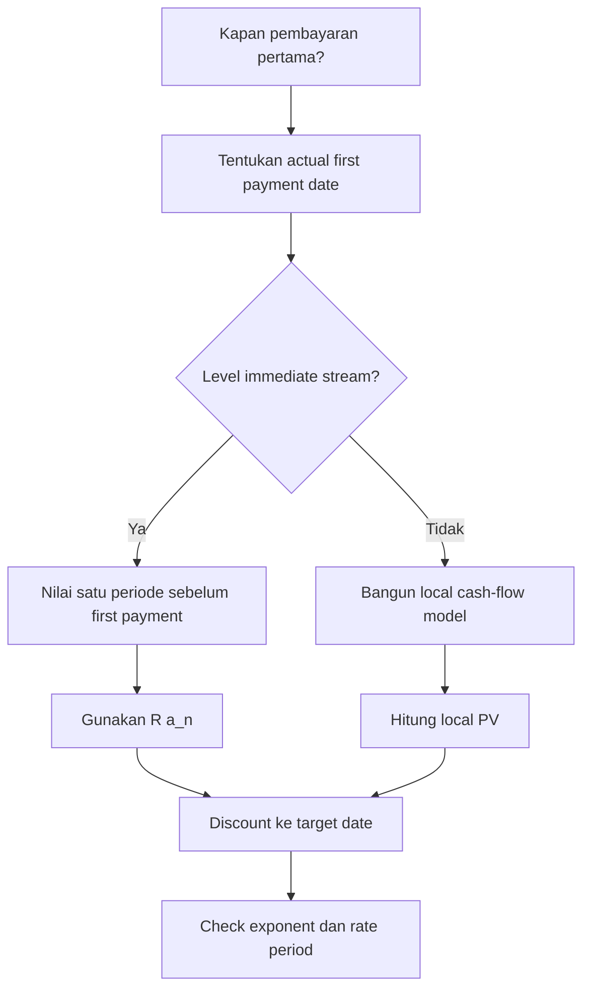

# 📘 2.5 — Deferred Annuities

> [!ABSTRACT] Ringkasan Cepat
> **Topik:** Deferred Annuities  
> **Bobot Parent Topic:** 20–30%  
> **Exam Priority:** Very High  
> **Difficulty:** Calculation-Intensive  
> **Primary Skill:** Calculation  
> **Ref:** Kellison Bab 3 §3.4; Vaaler Bab 3–4 sesuai silabus CF1

## Section 0 — Pemetaan Silabus & Exam Scope

| Field | Isi |
|---|---|
| Topik CF1 | Topik 2 — Anuitas dan Nilai Arus Kas |
| Subtopik | 2.5 Deferred Annuities |
| Learning Outcome | Menghitung nilai kini dan nilai akumulasi anuitas yang pembayarannya baru dimulai setelah masa penangguhan tertentu. |
| Skill Diuji | Membaca kapan pembayaran pertama terjadi, menentukan panjang deferral, memilih focal date lokal, menggunakan faktor anuitas, dan memindahkan nilai ke valuation date. |
| Bobot Parent Topic | 20–30% |
| Exam Priority | Very High |
| Prerequisite | Discount factor, equation of value, annuity-immediate/due, equivalent periodic rate |
| Connected Topics | [[2.1 Annuity-Immediate and Annuity-Due]], [[2.2 Perpetuity]], [[2.3 Varying Annuities]], [[2.4 Continuous Annuities]], [[2.6 Varying Interest Rates]] |
| Referensi | Silabus CF1 Topik 2; Kellison Bab 3 §3.4; Vaaler Bab 3–4 sesuai daftar referensi silabus |

> [!IMPORTANT] Scope Boundary
> [CORE CF1] Fokus note ini adalah **timing dan valuation** dari anuitas yang ditunda. Untuk level annuity-immediate, notasi utama adalah $_{m|}a_{\overline{n}|}$, yaitu anuitas $n$ pembayaran yang pembayaran pertamanya terjadi pada akhir periode $m+1$. Teknik yang sama dapat dipakai pada perpetuity, varying annuity, dan continuous annuity dengan terlebih dahulu menilai stream pada tanggal lokal yang sesuai, tetapi formula khusus masing-masing stream dibahas di subtopik terkait. Varying interest rates dibahas di [[2.6 Varying Interest Rates]].
>
> Sumber Kellison yang tersedia secara langsung mendukung valuation pada tanggal sebelum pembayaran pertama, metode discounting, dan metode selisih anuitas pada §3.4. Silabus menetapkan Vaaler Bab 3–4 sebagai referensi resmi Topik 2.

## Section 1 — Intuisi & Big Picture

Deferred annuity adalah anuitas yang **tidak langsung membayar**. Misalnya, seseorang membeli kontrak hari ini, tetapi benefit tahunan baru mulai dibayar lima tahun lagi. Secara finansial, tidak ada konsep baru selain time value of money: kita hanya memisahkan persoalan menjadi dua tahap.

Pertama, nilai seluruh anuitas pada **satu periode sebelum pembayaran pertama**. Pada titik itu, cash-flow stream terlihat seperti annuity-immediate biasa. Kedua, pindahkan nilai tersebut kembali ke valuation date dengan discount factor yang sesuai. Inilah alasan rumus deferred annuity terlihat seperti faktor anuitas biasa yang dikalikan $v^m$.

Timing adalah bagian tersulit. Jika soal menyatakan “pembayaran pertama pada akhir tahun ke-5”, maka valuation point yang natural untuk faktor $a_{\overline{n}|}$ adalah akhir tahun ke-4. Artinya deferral adalah $m=4$, bukan $5$. Banyak distractor lahir dari satu exponent yang salah.

Kellison §3.4 menekankan bahwa nilai anuitas dapat ditentukan pada tanggal mana pun yang berjarak integer number of periods dari payment dates. Untuk kasus valuation date lebih dari satu periode sebelum pembayaran pertama, nilainya dapat diperoleh dengan mendiskontokan ordinary annuity value atau dengan mengambil **selisih dua anuitas**.

## Section 2 — Definisi & Core Concepts

### Definisi Formal

> [!NOTE] Definisi Formal
> **Deferred annuity** adalah anuitas yang pembayaran pertamanya baru dimulai setelah suatu **deferred period**. Untuk annuity-immediate yang ditunda $m$ periode dan mempunyai $n$ pembayaran level sebesar 1, notasi yang digunakan adalah
>
> $$
> {}_{m|}a_{\overline{n}|}.
> $$
>
> Dengan convention ini, pembayaran terjadi pada
>
> $$
> t=m+1,m+2,\ldots,m+n.
> $$

### Terminologi Penting

| Istilah / Simbol | Definisi | Intuisi | Exam Note |
|---|---|---|---|
| $m$ | Jumlah periode deferral sebelum annuity-immediate mulai | Banyak periode tanpa payment setelah $t=0$ | First payment berada di $t=m+1$ |
| $n$ | Jumlah pembayaran setelah masa deferral | Panjang payment stream | Jangan campur dengan $m+n$ |
| $i$ | Effective interest rate per payment period | Rate untuk memindahkan cash flow satu period | Harus sefrekuensi dengan payment |
| $v=(1+i)^{-1}$ | Discount factor per period | Nilai hari ini dari 1 yang dibayar satu periode lagi | Deferral memberi faktor $v^m$ |
| $a_{\overline{n}|}$ | PV annuity-immediate $n$ payment pada satu periode sebelum payment pertama | Local value dari stream | Untuk deferred annuity, local focal date ada di $t=m$ |
| ${}_{m|}a_{\overline{n}|}$ | PV di $t=0$ dari deferred annuity-immediate | Ordinary annuity digeser $m$ periode ke kanan | Payment pertama di $m+1$ |

### Core Relationship 1 — Shift / Discount Method

Untuk unit payments pada $t=m+1,\ldots,m+n$, nilai pada $t=m$ adalah ordinary annuity-immediate:

$$
V_m=a_{\overline{n}|}.
$$

Discount kembali $m$ periode ke $t=0$:

$$
{}_{m|}a_{\overline{n}|}
=
 v^m a_{\overline{n}|}.
$$

Untuk payment level sebesar $R$:

$$
PV_0
=
R\,{}_{m|}a_{\overline{n}|}
=
R v^m a_{\overline{n}|}.
$$

**Timing:** first payment adalah $t=m+1$, bukan $t=m$.

**Rate basis:** $i$ harus merupakan effective rate per payment period. Jika rate dikutip nominal atau annual effective dengan payment frequency berbeda, lakukan konversi terlebih dahulu.

### Core Relationship 2 — Difference of Annuities

Kellison §3.4 menunjukkan cara alternatif: bayangkan ada annuity-immediate dari $t=1$ sampai $t=m+n$, lalu hilangkan $m$ payment pertama. Maka

$$
{}_{m|}a_{\overline{n}|}
=
a_{\overline{m+n}|}-a_{\overline{m}|}.
$$

Karena

$$
a_{\overline{m+n}|}
=
a_{\overline{m}|}+v^m a_{\overline{n}|},
$$

maka kedua metode identik:

$$
a_{\overline{m+n}|}-a_{\overline{m}|}
=
v^m a_{\overline{n}|}.
$$

> [!TIP] Kapan metode selisih berguna?
> Jika soal memberikan atau memungkinkan penggunaan langsung $a_{\overline{m+n}|}$ dan $a_{\overline{m}|}$, selisih anuitas dapat lebih cepat daripada menghitung faktor $v^m$ secara terpisah. Secara konseptual, metode ini juga sangat berguna untuk memahami bahwa deferred stream adalah bagian akhir dari annuity yang lebih panjang.

### Core Relationship 3 — Accumulated Value pada Payment Horizon

Untuk level payments $R$ yang terjadi pada $t=m+1$ sampai $t=m+n$, accumulated value **tepat pada waktu pembayaran terakhir**, yaitu $t=m+n$, adalah

$$
AV_{m+n}=R s_{\overline{n}|}.
$$

Deferral tidak muncul dalam formula terminal value karena accumulation dimulai dari masing-masing payment ke tanggal pembayaran terakhir. Jika nilai diminta pada tanggal sesudah $m+n$, barulah accumulate lagi dari terminal date tersebut.

### Deferred Perpetuity — Connection

Jika payment level $R$ berlanjut selamanya dan first payment berada di $t=m+1$, maka local PV pada $t=m$ adalah $R/i$, sehingga

$$
PV_0
=
R v^m\frac{1}{i}.
$$

Ini adalah aplikasi langsung dari prinsip yang sama, bukan formula terpisah yang perlu dihafal.

### Deferred Due-Like Stream

Jika sebuah stream mempunyai payment pertama tepat di $t=m$ dan kemudian membayar pada $t=m,m+1,\ldots,m+n-1$, maka nilai di $t=m$ adalah annuity-due:

$$
V_m=R\ddot{a}_{\overline{n}|},
$$

sehingga

$$
PV_0=R v^m\ddot{a}_{\overline{n}|}.
$$

> [!IMPORTANT] Notation Warning
> Jangan mengandalkan nama “deferred annuity-due” tanpa menggambar timeline. Convention tentang apa yang dihitung sebagai masa deferral dapat membingungkan. Yang aman adalah identifikasi **actual first payment date**, pilih local focal date, lalu discount.

## Section 3 — How It Works

### Framework Utama

```text
Narrative
↓
Tulis first payment date
↓
Tentukan local focal date
↓
Samakan rate dengan payment period
↓
Value stream secara lokal
↓
Discount/accumulate ke target date
↓
Verify timing dan exponent
```

### Langkah 1 — Temukan pembayaran pertama

Kalimat berikut tidak setara:

- “ditunda 4 tahun”;
- “pembayaran pertama pada akhir tahun ke-4”;
- “pembayaran pertama pada awal tahun ke-5”.

Untuk annuity-immediate dengan $m$ full periods of deferral, first payment berada pada $t=m+1$.

### Langkah 2 — Letakkan local focal date satu periode sebelum first payment

Jika first payment berada pada $t=7$, maka local focal date ordinary annuity-immediate adalah $t=6$.

Di $t=6$:

$$
V_6=R a_{\overline{n}|}.
$$

Jika target adalah $t=0$:

$$
V_0=v^6V_6.
$$

### Langkah 3 — Convert rate sebelum menggunakan annuity factor

Misalnya nominal rate $i^{(12)}=12\%$ dengan monthly payments. Periodic rate adalah

$$
j=\frac{0.12}{12}=0.01.
$$

Tetapi jika annual effective rate adalah 12%, monthly effective rate bukan 1%:

$$
1+j=(1.12)^{1/12}.
$$

### Langkah 4 — Gunakan equation of value

Untuk level payment $R$:

$$
PV_0=Rv^m a_{\overline{n}|}.
$$

Atau dengan difference method:

$$
PV_0=R\left(a_{\overline{m+n}|}-a_{\overline{m}|}\right).
$$

### Derivasi dari Direct Cash-Flow Sum

Payment terjadi pada $m+1$ hingga $m+n$:

$$
PV_0
=
R\sum_{k=1}^{n}v^{m+k}.
$$

Faktorkan $v^m$:

$$
PV_0
=
Rv^m\sum_{k=1}^{n}v^k
=
Rv^m a_{\overline{n}|}.
$$

Inilah alasan exponent deferral adalah $m$.

> [!TIP] Cara Berpikir
> Jangan bertanya “rumus deferred annuity apa?” terlebih dahulu. Tanyakan: **di tanggal mana cash flow ini menjadi ordinary annuity?** Nilai stream di sana, lalu pindahkan ke tanggal yang diminta.

> [!DANGER] Jangan Salah Pikir
> 1. Jika first payment di $t=m+1$, jangan discount $a_{\overline{n}|}$ dengan $v^{m+1}$.
> 2. Jangan menganggap kata “mulai tahun ke-5” otomatis berarti payment di $t=5$; tentukan apakah payment awal atau akhir periode.
> 3. Jangan memakai annual rate langsung pada monthly/quarterly cash flows.
> 4. Jangan menghitung $m+n$ sebagai jumlah payment; jumlah payment tetap $n$.

## Section 4 — Worked Examples & Exam Cases

### Case A — Fundamental

**Soal**

Sebuah kontrak akan membayar Rp10.000.000 pada akhir setiap tahun selama 6 tahun. Pembayaran pertama dilakukan pada akhir tahun ke-5. Suku bunga efektif tahunan adalah 8%. Hitung nilai kini kontrak pada $t=0$.

> [!SUCCESS] Pembahasan
>
> **1. Identifikasi informasi & unknown**
>
> - $R=10.000.000$
> - $n=6$
> - $i=8\%$
> - first payment di $t=5$
> - target: $PV_0$
>
> Karena ordinary annuity value berada satu periode sebelum first payment, local focal date adalah $t=4$. Jadi $m=4$.
>
> **2. Timeline / Structure**
>
> | Waktu | 0 | 1 | 2 | 3 | 4 | 5 | 6 | ... | 10 |
> |---:|---:|---:|---:|---:|---:|---:|---:|---:|---:|
> | Cash flow | 0 | 0 | 0 | 0 | 0 | 10 jt | 10 jt | ... | 10 jt |
>
> **3. Rate conversion**
>
> Rate sudah annual effective dan payment tahunan, jadi tidak perlu konversi.
>
> $$
> v=\frac{1}{1.08}.
> $$
>
> **4. Formula Selection**
>
> $$
> PV_0
> =
>10.000.000\,v^4a_{\overline{6}|0.08}.
> $$
>
> **5. Calculation**
>
> $$
> a_{\overline{6}|0.08}
> =
> \frac{1-(1.08)^{-6}}{0.08}
> \approx 4.622879664.
> $$
>
> $$
> PV_0
> =
>10.000.000(1.08)^{-4}(4.622879664)
> \approx 33.979.546.
> $$
>
> Jadi,
>
> $$
> \boxed{PV_0\approx \text{Rp}33{,}98\text{ juta}}
> $$
>
> **6. Interpretation**
>
> Nilai pada $t=4$ adalah ordinary annuity value. Karena kontrak dinilai empat tahun lebih awal, nilai tersebut harus didiskontokan empat periode.
>
> **7. Verification**
>
> Tanpa deferral, PV enam payment yang sama adalah sekitar Rp46,23 juta. Karena seluruh stream digeser empat tahun ke masa depan, PV harus lebih kecil. Hasil Rp33,98 juta konsisten.

> [!WARNING] Exam Trap — Case A
> - **Trap:** memakai $v^5a_{\overline{6}|}$ karena first payment di tahun 5.
> - **Mengapa terlihat benar:** angka 5 muncul eksplisit dalam narasi.
> - **Cara menghindari:** annuity-immediate factor dinilai **satu periode sebelum first payment**, yaitu $t=4$.
> - **Shortcut aman:** first payment time $T$ → local annuity value di $T-1$.
> - **Target waktu:** 1–2 menit.

### Case B — Exam-Typical: Frequency + Timing

**Soal**

Sebuah benefit membayar Rp2.000.000 setiap akhir bulan selama 24 bulan. Pembayaran pertama dilakukan pada akhir bulan ke-19. Tingkat bunga nominal tahunan adalah 12% convertible monthly. Tentukan nilai kini pada hari ini.

> [!SUCCESS] Pembahasan
>
> **1. Identifikasi informasi & unknown**
>
> - $R=2.000.000$
> - $n=24$
> - first payment di bulan 19
> - nominal annual rate $i^{(12)}=12\%$
>
> Local focal date adalah akhir bulan 18, sehingga $m=18$.
>
> **2. Timeline / Structure**
>
> Payment terjadi pada bulan
>
> $$
> 19,20,\ldots,42.
> $$
>
> **3. Rate conversion**
>
> Karena rate nominal convertible monthly,
>
> $$
> j=\frac{0.12}{12}=0.01.
> $$
>
> **4. Equation / Formula Selection**
>
> $$
> PV_0
> =
>2.000.000(1.01)^{-18}a_{\overline{24}|0.01}.
> $$
>
> **5. Calculation**
>
> $$
> a_{\overline{24}|0.01}
> =
> \frac{1-(1.01)^{-24}}{0.01}
> \approx 21.24338726.
> $$
>
> Maka
>
> $$
> PV_0
> \approx
>2.000.000(1.01)^{-18}(21.24338726)
> \approx 35.519.679.
> $$
>
> $$
> \boxed{PV_0\approx \text{Rp}35{,}52\text{ juta}}
> $$
>
> **6. Interpretation**
>
> Seluruh 24-payment annuity dinilai terlebih dahulu pada bulan 18, lalu nilai tersebut didiskontokan 18 bulan ke hari ini.
>
> **7. Verification**
>
> Total nominal cash flow adalah Rp48 juta. Karena seluruh payment terjadi di masa depan dan $i>0$, PV harus di bawah Rp48 juta. Hasil memenuhi check tersebut.

> [!WARNING] Exam Trap — Case B
> - **Trap 1:** menggunakan 12% sebagai monthly rate.
> - **Trap 2:** memakai $m=19$.
> - **Trap 3:** menganggap payment terakhir bulan 43; padahal 24 payment dari bulan 19 berakhir bulan 42.
> - **Shortcut aman:** last payment = first payment $+(n-1)$.
> - **Target waktu:** 2–3 menit.

### Case C — Challenging / Integrated: Deferred + Varying

**Soal**

Sebuah kontrak membayar 100 pada akhir tahun ke-4, kemudian payment meningkat 20 setiap tahun sampai lima payment telah dilakukan. Suku bunga efektif tahunan adalah 6%. Hitung PV di $t=0$.

Payment adalah

$$
100,120,140,160,180
$$

pada $t=4,5,6,7,8$.

> [!SUCCESS] Pembahasan
>
> **1. Identifikasi structure**
>
> First payment berada di $t=4$, sehingga local focal date adalah $t=3$. Deferred period untuk immediate structure adalah $m=3$.
>
> **2. Local varying annuity at $t=3$**
>
> Sequence dapat ditulis
>
> $$
> 100,120,140,160,180
> =
>80(1,1,1,1,1)+20(1,2,3,4,5).
> $$
>
> Maka
>
> $$
> V_3
> =
>80a_{\overline{5}|}+20(Ia)_{\overline{5}|}.
> $$
>
> Untuk arithmetic increasing annuity-immediate,
>
> $$
> (Ia)_{\overline{n}|}
> =
> \frac{\ddot{a}_{\overline{n}|}-nv^n}{i}.
> $$
>
> Dengan $i=0.06$,
>
> $$
> a_{\overline{5}|}\approx4.212363786,
> $$
>
> $$
> (Ia)_{\overline{5}|}\approx12.14691247.
> $$
>
> Sehingga
>
> $$
> V_3
> \approx
>80(4.212363786)+20(12.14691247)
> \approx579.719352.
> $$
>
> **3. Discount ke $t=0$**
>
> $$
> PV_0
> =
>v^3V_3
> \approx
>(1.06)^{-3}(579.719352)
> \approx486.918188.
> $$
>
> $$
> \boxed{PV_0\approx486.92}
> $$
>
> **4. Verification with direct summation**
>
> $$
> PV_0
> =
>100v^4+120v^5+140v^6+160v^7+180v^8,
> $$
>
> yang memberikan nilai yang sama, sekitar $486.92$.
>
> **5. Interpretation**
>
> Deferred annuity bukan selalu level. Prinsip deferral hanya memindahkan **seluruh local cash-flow model** dari tanggal lokal ke valuation date.

> [!WARNING] Exam Trap — Case C
> - **Trap:** menerapkan $v^4$ pada local annuity value karena first payment di $t=4$.
> - **Trap:** menggunakan increasing annuity tanpa menyesuaikan base payment 100.
> - **Cara menghindari:** pisahkan dua layer: **payment pattern** dan **timing shift**.
> - **Shortcut aman:** solve local stream first, then shift.
> - **Target waktu:** 3–5 menit.

## Section 5 — Verification & Sanity Check

> [!CHECK] Sanity Check
> 1. Dengan $i>0$, deferred annuity harus mempunyai PV lebih kecil daripada annuity identik yang mulai lebih cepat.
> 2. Jika deferral bertambah satu periode dan semua yang lain sama, PV dikalikan $v$.
> 3. Jika $m=0$, deferred annuity harus kembali menjadi ordinary annuity-immediate:
>
> $$
> {}_{0|}a_{\overline{n}|}=a_{\overline{n}|}.
> $$
>
> 4. Difference method harus sama dengan shift method:
>
> $$
> a_{\overline{m+n}|}-a_{\overline{m}|}
> =
v^m a_{\overline{n}|}.
> $$
>
> 5. Payment count dapat dicek dari first dan last payment:
>
> $$
> (m+n)-(m+1)+1=n.
> $$

### Metode Alternatif

| Metode | Formula | Kelebihan | Kapan Dipilih |
|---|---|---|---|
| Shift method | $v^m a_{\overline{n}|}$ | Paling intuitif dan timing-friendly | Default untuk sebagian besar soal |
| Difference method | $a_{\overline{m+n}|}-a_{\overline{m}|}$ | Cepat jika faktor anuitas terkait tersedia | Saat stream adalah tail dari annuity panjang |
| Direct summation | $\sum_{k=1}^{n}Rv^{m+k}$ | Universal, sangat baik untuk verification | Jika timing kompleks atau payment irregular |
| Local model + shift | $v^m\times(\text{local PV})$ | Berlaku untuk varying/perpetuity/complex stream | Integrated questions |

### Mengapa Difference Method Benar?

Bayangkan seluruh payments dari $t=1$ sampai $t=m+n$. Nilainya adalah

$$
a_{\overline{m+n}|}.
$$

Deferred annuity yang kita inginkan tidak mempunyai payment pada $t=1,\ldots,m$. Nilai bagian yang harus dihapus adalah

$$
a_{\overline{m}|}.
$$

Karena itu sisanya tepat merupakan deferred stream.

## Section 6 — Connections & Mental Model

### Hubungan dengan Topik Lain

- [[2.1 Annuity-Immediate and Annuity-Due]] → deferred annuity hanyalah ordinary annuity yang digeser di timeline.
- [[2.2 Perpetuity]] → deferred perpetuity dihitung sebagai local perpetuity value lalu didiskontokan.
- [[2.3 Varying Annuities]] → payment pattern dapat diselesaikan lokal, kemudian seluruh stream digeser.
- [[2.4 Continuous Annuities]] → continuous payment stream yang dimulai kemudian menggunakan ide valuation date yang sama.
- [[2.6 Varying Interest Rates]] → jika rate berubah, satu faktor $v^m$ konstan tidak lagi otomatis valid; gunakan product discount factors.
- [[4.2 Amortization Method]] → prospective outstanding balance secara konseptual adalah PV dari future payment stream pada valuation date tertentu.

### Mental Model — “Local Value, Then Shift”

| Pertanyaan | Jawaban |
|---|---|
| Kapan first payment? | Tentukan dari narasi |
| Di mana ordinary annuity factor hidup? | Satu periode sebelum first payment untuk immediate |
| Apa nilai stream di sana? | $Ra_{\overline{n}|}$ atau local model lain |
| Berapa jauh dari target date? | Itulah exponent discount/accumulation |
| Apa check akhirnya? | Geser lebih jauh → PV lebih kecil bila $i>0$ |

### Hubungan Visual ↔ Rumus

Jika payments berada di

$$
m+1,m+2,\ldots,m+n,
$$

maka direct PV adalah

$$
Rv^{m+1}+Rv^{m+2}+\cdots+Rv^{m+n}.
$$

Semua terms mempunyai faktor bersama $v^m$:

$$
Rv^m(v+v^2+\cdots+v^n)
=
Rv^m a_{\overline{n}|}.
$$

Jadi posisi cash flow pada timeline langsung menjelaskan exponent rumus.

## Section 7 — Exam Traps & Misconceptions

### Timing Trap

> [!BUG] Timing Trap
> **First payment di $t=5$** tidak berarti deferred factor $v^5$ untuk annuity-immediate. Ordinary annuity PV berada pada $t=4$, sehingga faktor shift ke $t=0$ adalah $v^4$.

**Salah**

$$
PV=Rv^5a_{\overline{n}|}.
$$

**Benar**

$$
PV=Rv^4a_{\overline{n}|}.
$$

untuk first payment di $t=5$.

### Rate / Frequency Trap

> [!BUG] Rate & Frequency Trap
> Payment monthly harus dinilai dengan effective monthly rate. Nominal annual rate convertible monthly dapat dibagi 12, tetapi annual effective rate harus dikonversi melalui growth-factor equivalence.

Nominal $i^{(12)}$:

$$
j=\frac{i^{(12)}}{12}.
$$

Annual effective $i$:

$$
1+j=(1+i)^{1/12}.
$$

### Formula / Notation Trap

> [!BUG] Formula Trap
> Dalam ${}_{m|}a_{\overline{n}|}$, $m$ adalah deferral periods dan $n$ adalah number of payments. Jangan membaca $m+n$ sebagai jumlah pembayaran.

### Calculation Trap

> [!BUG] Calculation Trap
> Jika first payment di $t=7$ dan terdapat 10 payments, payment terakhir adalah
>
> $$
> 7+(10-1)=16,
> $$
>
> bukan $17$.

### Interpretation Trap

> [!BUG] Interpretation Trap
> “Annuity ditunda 5 tahun” dapat ambigu tanpa payment convention. Exam-safe response adalah selalu menerjemahkan narasi menjadi actual payment dates sebelum memilih $m$.

### Red Flags

> [!CAUTION] Red Flags

| Keyword / Condition | Apa yang Harus Dipikirkan |
|---|---|
| “first payment at end of year $T$” | local annuity PV di $T-1$ |
| “deferred $m$ periods” | untuk immediate, first payment di $m+1$ |
| “beginning of year...” | cek apakah due-like timing |
| “nominal convertible monthly” | periodic rate = nominal / 12 |
| “annual effective” + monthly payment | ambil 12th root growth factor |
| “payments begin after...” | gambar timeline, jangan tebak exponent |
| “value at time $k$” | pilih local focal date paling dekat |
| “perpetuity begins later” | local $R/i$, lalu discount |
| “payments increase after deferral” | solve varying pattern locally, then shift |

## Section 8 — Executive Summary

### Must Remember

> [!SUMMARY] Must Remember
> - Deferred annuity adalah **ordinary annuity yang digeser ke masa depan**.
> - Untuk $_{m|}a_{\overline{n}|}$, payments berada pada $t=m+1$ sampai $t=m+n$.
> - Core identity:
>
> $$
> {}_{m|}a_{\overline{n}|}=v^m a_{\overline{n}|}.
> $$
>
> - Difference identity:
>
> $$
> {}_{m|}a_{\overline{n}|}=a_{\overline{m+n}|}-a_{\overline{m}|}.
> $$
>
> - Jika first payment di $t=T$, ordinary annuity-immediate value berada di $t=T-1$.
> - Rate harus sama periodenya dengan payment frequency.
> - Deferral mengubah PV, tetapi accumulated value pada payment terakhir tetap $Rs_{\overline{n}|}$ untuk stream level yang sama.
> - Untuk varying/perpetuity/continuous stream: **value locally first, then shift**.
> - Jika bingung, direct summation selalu menjadi fallback yang valid untuk constant rate.

### Formula Map / Comparison Table

| Kondisi | Formula / Rule | Timing | Common Trap |
|---|---|---|---|
| Level deferred immediate | $Rv^m a_{\overline{n}|}$ | first payment $m+1$ | memakai $v^{m+1}$ |
| Difference method | $R(a_{\overline{m+n}|}-a_{\overline{m}|})$ | hapus first $m$ payments | salah jumlah terms |
| Terminal AV | $Rs_{\overline{n}|}$ | pada $m+n$ | memasukkan $v^m$ ke terminal AV |
| Deferred perpetuity | $Rv^m/i$ | first payment $m+1$ | memakai $v^{m+1}/i$ |
| Due-like stream mulai $t=m$ | $Rv^m\ddot a_{\overline{n}|}$ | first payment $m$ | memaksakan immediate convention |
| Irregular stream | $\sum C_tv^t$ | sesuai actual dates | memaksakan annuity formula |

### Trigger Keywords

| Jika soal mengatakan... | Pikirkan... |
|---|---|
| “pembayaran pertama 6 tahun lagi” | tentukan exact payment date, lalu local focal date |
| “ditunda $m$ periode” | $_{m|}a_{\overline{n}|}$ jika convention immediate jelas |
| “mulai awal tahun...” | kemungkinan due timing |
| “mulai akhir tahun...” | immediate timing |
| “nilai kini hari ini” | discount local annuity value ke $t=0$ |
| “nilai pada saat pembayaran terakhir” | gunakan accumulated value dari actual payments |
| “perpetuity starts after...” | local $R/i$, lalu shift |

### Kapan Digunakan

Gunakan deferred annuity identity ketika:

- payment dates equally spaced;
- payment pattern dapat dinilai sebagai annuity pada local focal date;
- rate basis konsisten dengan payment period;
- masa deferral dapat dinyatakan dalam integer number of payment periods untuk notation standar.

### Kapan TIDAK Boleh Digunakan Langsung

Jangan langsung memakai $v^m a_{\overline{n}|}$ jika:

- interest rate berubah per periode;
- payment dates tidak equally spaced;
- deferral bukan integer number of periods dan source/soal membutuhkan fractional-period treatment;
- payment pattern bukan level tetapi belum dimodelkan secara lokal;
- first payment timing tidak jelas.

### Quick Decision Tree



## Section 9 — Active Recall Check

1. Apa arti $m$ dan $n$ dalam ${}_{m|}a_{\overline{n}|}$?
2. Jika first payment deferred annuity-immediate berada di $t=8$, pada waktu berapa $a_{\overline{n}|}$ harus dinilai?
3. Tulis dua formula ekuivalen untuk ${}_{m|}a_{\overline{n}|}$.
4. Mengapa exponent pada $v^m a_{\overline{n}|}$ adalah $m$, bukan $m+1$?
5. Sebuah annuity membayar 1 pada $t=6,7,\ldots,15$. Susun PV di $t=0$ menggunakan actuarial notation.
6. Susun equation of value untuk 36 monthly payments yang payment pertamanya pada akhir bulan ke-25 dengan nominal rate $i^{(12)}$.
7. Bagaimana cara menilai deferred perpetuity dengan first payment pada $t=m+1$?
8. Jika deferred annuity digeser satu periode lebih jauh dan $i>0$, bagaimana PV berubah?
9. Kapan difference method $a_{\overline{m+n}|}-a_{\overline{m}|}$ lebih convenient daripada shift method?
10. Mengapa accumulated value pada waktu payment terakhir tidak mengandung faktor deferral $v^m$?

## Section 10 — Exam Pattern Map

[TEXTBOOK-BASED EXPECTATION]

| Narasi Soal | Keyword | Konsep | Formula/Rule | Langkah | Trap | Shortcut |
|---|---|---|---|---|---|---|
| Payment level mulai beberapa periode lagi | “first payment at end...” | Deferred annuity-immediate | $Rv^m a_{\overline{n}|}$ | first payment → local date → discount | off-by-one exponent | first payment $T$ → local date $T-1$ |
| Stream adalah bagian akhir dari annuity panjang | “payments from year $m+1$ to...” | Difference of annuities | $R(a_{\overline{m+n}|}-a_{\overline{m}|})$ | full annuity − omitted prefix | salah $m+n$ | tail = whole − prefix |
| Payment frequency berbeda dari quoted rate | “nominal convertible...” | Rate conversion + deferral | convert rate, lalu deferred factor | convert → timeline → value | annual rate dipakai langsung | rate period = cash-flow period |
| Perpetuity dimulai kemudian | “forever beginning...” | Deferred perpetuity | $Rv^m/i$ | local perpetuity → shift | memakai first-payment exponent | value one period before first payment |
| Payment berubah setelah masa tunggu | “increases each year after...” | Deferred varying annuity | $v^m\times$ local varying PV | solve local pattern → shift | mencampur pattern dan timing | separate pattern from timing |

## Source Traceability

| Materi | Sumber |
|---|---|
| Scope Topik 2 dan learning outcome deferred annuity | Silabus CF1 — Topik 2 |
| Definisi deferred annuity dan notation ${}_{m|}a_{\overline{n}|}$ | Kellison, *The Theory of Interest*, 3rd ed., Bab 3 §3.4 |
| Valuation lebih dari satu periode sebelum first payment | Kellison, Bab 3 §3.4 |
| Shift method $v^m a_{\overline{n}|}$ | Kellison, Bab 3 §3.4; derived from ordinary annuity valuation |
| Difference method $a_{\overline{m+n}|}-a_{\overline{m}|}$ | Kellison, Bab 3 §3.4 |
| General annuity identities dan timing framework | Kellison Bab 3; Vaaler Bab 3–4 sebagaimana ditetapkan silabus |
| Deferred extensions to varying/perpetuity structures | Synthesis of Topik 2 annuity valuation principles within syllabus scope |
