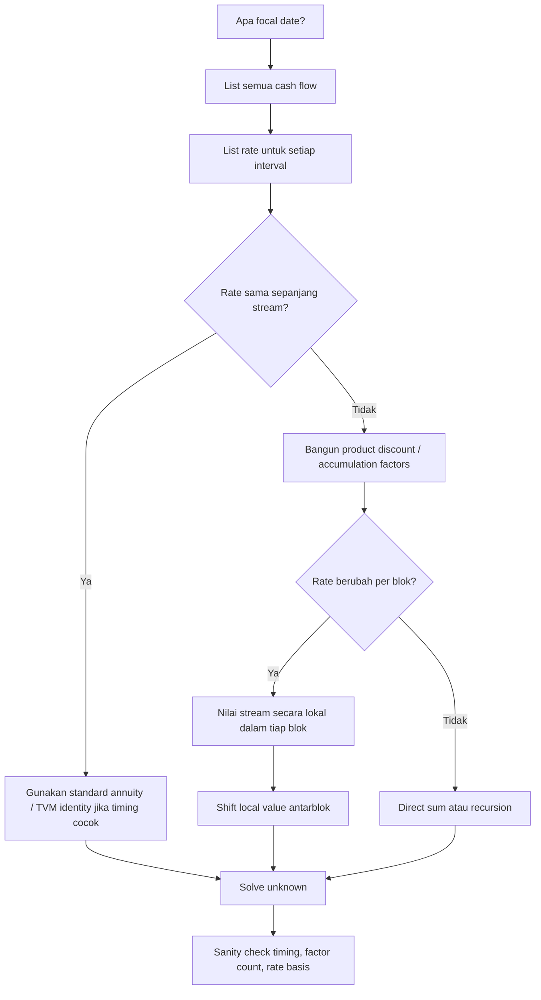

# 📘 2.6 — Varying Interest Rates

> [!ABSTRACT] Ringkasan Cepat
> **Topik:** Varying Interest Rates  
> **Bobot Parent Topic:** 20–30%  
> **Exam Priority:** Very High  
> **Difficulty:** Calculation-Intensive  
> **Primary Skill:** Calculation  
> **Inti:** Jika rate berubah antarperiode, jangan memakai satu faktor $v^t$ atau satu faktor anuitas konstan secara otomatis. Setiap cash flow harus dipindahkan menggunakan **produk accumulation/discount factors yang benar-benar dilalui cash flow tersebut**.

## Section 0 — Pemetaan Silabus & Exam Scope

| Field | Isi |
|---|---|
| Topik CF1 | Topik 2 — Anuitas dan Nilai Arus Kas |
| Subtopik | 2.6 Varying Interest Rates |
| Learning Outcome | Menghitung nilai kini dan nilai akumulasi arus kas dengan suku bunga atau tingkat diskonto yang bervariasi. |
| Skill Diuji | Membaca rate per periode, menyamakan basis rate, membangun discount/accumulation chain, menentukan focal date, dan menyusun equation of value. |
| Bobot Parent Topic | 20–30% |
| Exam Priority | Very High |
| Prerequisite | TVM, equation of value, rate conversion, annuity timing |
| Connected Topics | [[1.4 Accumulation and Present Value]], [[2.1 Annuity-Immediate and Annuity-Due]], [[2.3 Varying Annuities]], [[2.5 Deferred Annuities]], [[3.1 Spot Rates and Forward Rates]] |
| Referensi | Silabus CF1 Topik 2; Vaaler Bab 3–4; Kellison Bab 3–4 sesuai daftar referensi resmi |

> [!IMPORTANT] Scope Boundary
> [CORE CF1] Fokus note ini adalah **valuation arus kas ketika rate berbeda antarperiode**. Silabus secara eksplisit meminta kemampuan menghitung PV dan AV dengan rate yang bervariasi.
>
> Hubungan dengan [[3.1 Spot Rates and Forward Rates]] penting secara konseptual, tetapi term structure, spot rate, forward rate, dan no-arbitrage dibahas sebagai Topik 3. Di sini fokusnya tetap pada **mechanics of cash-flow valuation**.

---

## Section 1 — Intuisi & Big Picture

Pada interest rate konstan $i$, kita terbiasa menulis

$$
PV_0=C_t v^t,
$$

dengan

$$
v=\frac{1}{1+i}.
$$

Alasannya sederhana: setiap periode menggunakan faktor pertumbuhan yang sama, yaitu $1+i$, sehingga dari $t=0$ ke $t$ kita memperoleh

$$
(1+i)^t.
$$

Tetapi jika rate berubah, misalnya

- tahun 1: $i_1$,
- tahun 2: $i_2$,
- tahun 3: $i_3$,

maka uang tidak tumbuh dengan satu faktor yang sama berulang kali. Satu unit pada $t=0$ tumbuh menjadi

$$
(1+i_1)(1+i_2)(1+i_3)
$$

pada $t=3$.

Karena itu, nilai kini dari 1 pada $t=3$ adalah

$$
\frac{1}{(1+i_1)(1+i_2)(1+i_3)}.
$$

Ini adalah ide paling penting dari seluruh subtopik:

> **Setiap cash flow “melewati” serangkaian rate. Kalikan faktor untuk seluruh periode yang dilewatinya.**

Jika cash flow berada pada $t=2$, ia hanya melewati rate periode 1 dan 2. Jika cash flow berada pada $t=5$, ia melewati rate periode 1 sampai 5.

Dengan kata lain:

> **Rate path matters.**

---

## Section 2 — Definisi & Core Concepts

### 2.1 Effective Rate per Period

Misalkan $i_k$ adalah effective interest rate untuk periode

$$
[k-1,k].
$$

Maka satu unit uang pada awal periode $k$ tumbuh menjadi

$$
1+i_k
$$

pada akhir periode tersebut.

Definisikan periodic discount factor

$$
v_k=\frac{1}{1+i_k}.
$$

Perhatikan bahwa ketika rate bervariasi:

$$
v_1,\;v_2,\;\ldots,\;v_n
$$

umumnya **tidak sama**.

### 2.2 Accumulation Factor dari $s$ ke $t$

Untuk integer $0\le s<t$, accumulation factor dari waktu $s$ ke waktu $t$ adalah

$$
A(s,t)
=
\prod_{k=s+1}^{t}(1+i_k).
$$

Jadi cash flow sebesar $C$ pada $t=s$ mempunyai accumulated value pada $t$ sebesar

$$
C\,A(s,t).
$$

### 2.3 Discount Factor dari $t$ ke $s$

Discount factor kebalikannya:

$$
D(s,t)
=
\frac{1}{A(s,t)}
=
\prod_{k=s+1}^{t}v_k.
$$

Maka cash flow sebesar $C$ pada $t$ mempunyai value pada waktu $s$ sebesar

$$
C\,D(s,t).
$$

Khusus untuk nilai kini di $t=0$:

$$
D(0,t)
=
\prod_{k=1}^{t}v_k
=
\frac{1}{\prod_{k=1}^{t}(1+i_k)}.
$$

> [!IMPORTANT] Important Distinction
> Pada rate konstan,
>
> $$
> D(0,t)=v^t.
> $$
>
> Pada rate bervariasi,
>
> $$
> D(0,t)=v_1v_2\cdots v_t.
> $$
>
> Jadi $v^t$ hanyalah special case ketika semua periodic rates sama.

---

## Section 3 — Present Value dengan Varying Interest Rates

Misalkan cash flow $C_t$ dibayar pada akhir periode $t$, untuk $t=1,\ldots,n$.

Nilai kini pada $t=0$ adalah

$$
PV_0
=
\sum_{t=1}^{n}
C_t
\prod_{k=1}^{t}\frac{1}{1+i_k}.
$$

Atau, dengan $v_k=(1+i_k)^{-1}$,

$$
PV_0
=
C_1v_1
+
C_2v_1v_2
+
C_3v_1v_2v_3
+\cdots+
C_nv_1v_2\cdots v_n.
$$

### Timeline

| Waktu | 0 | 1 | 2 | 3 | $\cdots$ | $n$ |
|---:|---:|---:|---:|---:|---:|---:|
| Cash flow | — | $C_1$ | $C_2$ | $C_3$ | $\cdots$ | $C_n$ |
| Rate selama periode | $i_1$ | $i_2$ | $i_3$ | $i_4$ | $\cdots$ | — |

Interpretasi:

- $C_1$ didiskontokan hanya melalui periode 1;
- $C_2$ melalui periode 2 lalu periode 1;
- $C_3$ melalui periode 3, 2, dan 1;
- dan seterusnya.

### Mental Model

Untuk setiap payment:

> **Start at payment date → walk backward to focal date → multiply every discount factor crossed.**

---

## Section 4 — Accumulated Value dengan Varying Interest Rates

Jika cash flow $C_t$ dibayar pada waktu $t$, dan kita ingin accumulated value pada waktu $n$, maka cash flow tersebut bertumbuh melalui rate periode $t+1$ sampai $n$:

$$
AV_n
=
\sum_{t=0}^{n}
C_t
\prod_{k=t+1}^{n}(1+i_k).
$$

Jika payment hanya pada akhir periode $1,\ldots,n$, maka

$$
AV_n
=
C_1(1+i_2)(1+i_3)\cdots(1+i_n)
$$

$$
+
C_2(1+i_3)\cdots(1+i_n)
+\cdots+
C_{n-1}(1+i_n)
+
C_n.
$$

> [!NOTE] Timing Insight
> Payment pada $t=n$ tidak memperoleh interest lagi jika focal date juga $t=n$.
>
> Payment pada $t=n-1$ memperoleh tepat satu faktor, yaitu $(1+i_n)$.

---

## Section 5 — Level Annuity dengan Varying Rates

Misalkan terdapat level annuity-immediate sebesar $R$ pada

$$
t=1,2,\ldots,n,
$$

tetapi effective rates per period adalah

$$
i_1,i_2,\ldots,i_n.
$$

Nilai kini adalah

$$
PV_0
=
R\left[
v_1
+
v_1v_2
+
v_1v_2v_3
+\cdots+
v_1v_2\cdots v_n
\right].
$$

Tidak ada alasan umum untuk menggantinya dengan

$$
R a_{\overline{n}|}
$$

karena $a_{\overline{n}|}$ standar mengasumsikan satu periodic rate yang sama.

### Generalized Annuity Factor

Secara praktis, kita dapat memandang

$$
a^{(\text{var})}_n
=
\sum_{t=1}^{n}
\prod_{k=1}^{t}v_k.
$$

Sehingga

$$
PV_0
=
R\,a^{(\text{var})}_n.
$$

Namun notation ini hanya alat bantu. Untuk ujian, bentuk product discount factor biasanya lebih transparan karena menunjukkan rate mana yang dipakai.

> [!WARNING] Formula Recognition Trap
> Cash flow level **tidak berarti** kita otomatis boleh memakai standard annuity factor. Standard annuity factor memerlukan **cash flow level + periodic rate level**.

---

## Section 6 — Equation of Value dengan Rate yang Berubah

Prinsip equation of value tidak berubah:

$$
\text{Value of inflows at focal date}
=
\text{Value of outflows at focal date}.
$$

Yang berubah hanyalah cara memindahkan nilai antarwaktu.

### Focal Date = $t=0$

Jika terdapat cash inflows $I_t$ dan outflows $O_t$:

$$
\sum_t
I_tD(0,t)
=
\sum_t
O_tD(0,t).
$$

### Focal Date = $t=m$

Cash flow sebelum $m$ diakumulasikan ke $m$:

$$
C_tA(t,m), \qquad t<m.
$$

Cash flow setelah $m$ didiskontokan ke $m$:

$$
C_tD(m,t), \qquad t>m.
$$

> [!TIP] Exam Workflow
> 1. Pilih focal date.
> 2. Tulis rate per interval.
> 3. Untuk setiap cash flow, tandai interval yang dilewati.
> 4. Baru tulis accumulation/discount factor.
> 5. Susun equation of value.

---

## Section 7 — Worked Example A: PV Level Payments, Rate Berubah Tiap Tahun

> [!EXAMPLE] Example A — Direct Product Discounting
> Sebuah annuity membayar $1{,}000$ pada akhir masing-masing dari 4 tahun. Annual effective interest rates adalah:
>
> - tahun 1: $4\%$,
> - tahun 2: $5\%$,
> - tahun 3: $6\%$,
> - tahun 4: $7\%$.
>
> Hitung PV pada $t=0$.

### Step 1 — Timeline

| Waktu | 0 | 1 | 2 | 3 | 4 |
|---:|---:|---:|---:|---:|---:|
| Payment | — | 1,000 | 1,000 | 1,000 | 1,000 |
| Rate pada interval | 4% | 5% | 6% | 7% | — |

### Step 2 — Discount Factors

Payment pertama:

$$
\frac{1000}{1.04}.
$$

Payment kedua:

$$
\frac{1000}{(1.04)(1.05)}.
$$

Payment ketiga:

$$
\frac{1000}{(1.04)(1.05)(1.06)}.
$$

Payment keempat:

$$
\frac{1000}{(1.04)(1.05)(1.06)(1.07)}.
$$

### Step 3 — Equation

$$
PV_0
=
\frac{1000}{1.04}
+
\frac{1000}{(1.04)(1.05)}
+
\frac{1000}{(1.04)(1.05)(1.06)}
+
\frac{1000}{(1.04)(1.05)(1.06)(1.07)}.
$$

Secara numerik,

$$
PV_0
\approx
961.5385
+
915.7510
+
863.9161
+
807.3983
$$

$$
\boxed{PV_0\approx3{,}548.60}.
$$

### Interpretation

Walaupun payment level, PV bukan $1000a_{\overline{4}|i}$ untuk satu rate tertentu karena tiap payment mengalami discount path yang berbeda.

### Sanity Check

Karena semua rates positif:

$$
PV_0<4(1000)=4000.
$$

Hasil $3{,}548.60$ masuk akal.

---

## Section 8 — Worked Example B: Accumulated Value dengan Rate Berubah

> [!EXAMPLE] Example B — Accumulate Each Deposit Through Remaining Rates
> Deposit sebesar $2{,}000$ dilakukan pada akhir tahun 1, 2, dan 3. Effective rates:
>
> - tahun 1: $5\%$,
> - tahun 2: $6\%$,
> - tahun 3: $4\%$,
> - tahun 4: $7\%$.
>
> Hitung accumulated value pada akhir tahun 4.

Payment di $t=1$ mengalami rate tahun 2, 3, dan 4:

$$
2000(1.06)(1.04)(1.07).
$$

Payment di $t=2$ mengalami rate tahun 3 dan 4:

$$
2000(1.04)(1.07).
$$

Payment di $t=3$ mengalami rate tahun 4:

$$
2000(1.07).
$$

Sehingga

$$
AV_4
=
2000(1.06)(1.04)(1.07)
+
2000(1.04)(1.07)
+
2000(1.07).
$$

Numerically,

$$
AV_4
\approx
2358.304
+
2225.600
+
2140
$$

$$
\boxed{AV_4\approx6{,}723.90}.
$$

> [!WARNING] Timing Trap
> Rate tahun 1 tidak memengaruhi deposit yang baru dilakukan pada akhir tahun 1. Cash flow tersebut belum berada di fund selama tahun 1.

---

## Section 9 — Worked Example C: Rate Berubah dalam Blok

Kasus yang sangat umum adalah rate level untuk beberapa periode, lalu berubah.

> [!EXAMPLE] Example C — Block Rates
> Sebuah annuity-immediate membayar $500$ setiap akhir tahun selama 8 tahun.
>
> - untuk tahun 1–3, annual effective rate $=4\%$;
> - untuk tahun 4–8, annual effective rate $=6\%$.
>
> Hitung PV pada $t=0$.

Daripada mendiskontokan 8 cash flows satu per satu, pecah stream menjadi dua blok.

### Block 1 — Payments $t=1,2,3$

Rate 4% berlaku untuk ketiga periode:

$$
PV_0^{(1)}
=
500a_{\overline{3}|0.04}.
$$

### Block 2 — Payments $t=4,\ldots,8$

Nilai dulu pada $t=3$. Dari $t=3$ ke depan, rate 6% berlaku untuk 5 payments:

$$
V_3^{(2)}
=
500a_{\overline{5}|0.06}.
$$

Kemudian discount dari $t=3$ ke $t=0$ menggunakan rate yang berlaku pada tiga tahun pertama:

$$
PV_0^{(2)}
=
(1.04)^{-3}
\left(
500a_{\overline{5}|0.06}
\right).
$$

Total:

$$
\boxed{
PV_0
=
500a_{\overline{3}|0.04}
+
(1.04)^{-3}
500a_{\overline{5}|0.06}
}
$$

### Lesson

Jika rate berubah **per blok**, gunakan local annuity factor di dalam masing-masing block, lalu pindahkan local value ke focal date.

> **Local value → shift across earlier rate blocks.**

Ini adalah analogue dari mental model [[2.5 Deferred Annuities]], tetapi faktor shift sekarang dapat berupa produk beberapa rate yang berbeda.

---

## Section 10 — Rate Basis & Frequency Mismatch

Varying interest rate questions sering menjadi sulit bukan karena produknya, tetapi karena rate quotation berbeda.

Misalnya:

- tahun pertama: annual effective $6\%$;
- tahun kedua: nominal $i^{(12)}=7.2\%$ convertible monthly;
- tahun ketiga: effective discount rate $d=5\%$.

Jangan langsung menulis

$$
(1.06)(1.072)(1.05).
$$

Setiap rate harus diterjemahkan menjadi accumulation factor yang konsisten dengan intervalnya.

### Annual Effective Interest

Jika annual effective rate adalah $i$:

$$
\text{annual accumulation factor}=1+i.
$$

### Nominal Interest Convertible $m$ Times

Jika nominal rate adalah $i^{(m)}$:

$$
\text{periodic rate}
=
\frac{i^{(m)}}{m}.
$$

Accumulation selama satu tahun:

$$
\left(
1+\frac{i^{(m)}}{m}
\right)^m.
$$

### Effective Discount Rate

Jika effective discount rate adalah $d$:

$$
1+i=\frac{1}{1-d}.
$$

Jadi annual accumulation factor adalah

$$
\frac{1}{1-d}.
$$

### Force of Interest

Jika force of interest konstan selama interval satu tahun adalah $\delta$:

$$
\text{accumulation factor}=e^\delta.
$$

> [!IMPORTANT] Mental Rule
> Jangan mencoba “menyamakan angka rate” terlebih dahulu jika tidak perlu.
>
> Yang benar-benar dibutuhkan untuk valuation adalah:
>
> $$
> \boxed{\text{accumulation factor untuk setiap interval}}
> $$

---

## Section 11 — Worked Example D: Campuran Rate Quotations

> [!EXAMPLE] Example D — Convert Each Segment to an Accumulation Factor
> Sebuah pembayaran sebesar $10{,}000$ akan diterima 3 tahun lagi.
>
> - Tahun 1: annual effective interest $5\%$.
> - Tahun 2: nominal interest $6\%$ convertible monthly.
> - Tahun 3: annual effective discount $4\%$.
>
> Hitung PV sekarang.

Accumulation factor tahun 1:

$$
1.05.
$$

Tahun 2:

$$
\left(1+\frac{0.06}{12}\right)^{12}.
$$

Tahun 3, karena $d=0.04$:

$$
1+i
=
\frac{1}{1-0.04}
=
\frac{1}{0.96}.
$$

Maka total accumulation dari $0$ ke $3$:

$$
A(0,3)
=
1.05
\left(1+\frac{0.06}{12}\right)^{12}
\frac{1}{0.96}.
$$

Sehingga

$$
PV_0
=
\frac{10{,}000}
{
1.05
\left(1+\frac{0.06}{12}\right)^{12}
(1/0.96)
}.
$$

Equivalently,

$$
PV_0
=
10{,}000
\left(\frac{1}{1.05}\right)
\left(1+\frac{0.06}{12}\right)^{-12}
(0.96).
$$

### Exam Trap

Kesalahan umum adalah memperlakukan $d=4\%$ sebagai $i=4\%$. Padahal

$$
i=\frac{d}{1-d}.
$$

---

## Section 12 — Recursive Valuation

Untuk stream panjang, valuation dapat dilakukan secara rekursif.

Misalkan $V_t$ adalah value tepat setelah cash flow pada waktu $t$, dan payment berikutnya sebesar $C_{t+1}$ pada $t+1$.

Jika rate periode $t+1$ adalah $i_{t+1}$:

$$
V_t
=
\frac{C_{t+1}+V_{t+1}}{1+i_{t+1}}.
$$

Ini adalah backward recursion.

Sebaliknya, jika $B_t$ adalah account balance setelah payment pada $t$, lalu cash flow/deposit $C_{t+1}$ terjadi di akhir periode berikutnya:

$$
B_{t+1}
=
B_t(1+i_{t+1})+C_{t+1},
$$

dengan sign convention sesuai perspektif.

### Kapan Recursive Method Berguna?

- rate berubah setiap periode;
- payment stream panjang;
- lebih mudah bekerja period-by-period daripada menulis product besar;
- soal meminta intermediate balance pada suatu waktu.

---

## Section 13 — Varying Cash Flows + Varying Interest Rates

Jangan mencampur dua jenis “varying”:

1. **varying annuity** → payment berubah;
2. **varying interest rates** → rate berubah.

Jika keduanya berubah sekaligus, struktur umum tetap

$$
PV_0
=
\sum_{t=1}^{n}
C_t
\prod_{k=1}^{t}v_k.
$$

Bedanya, sekarang:

- $C_t$ sendiri mengikuti suatu pola;
- $v_k$ juga berbeda per periode.

Pada rate konstan, pola arithmetic/geometric dapat menghasilkan closed-form annuity identities. Pada rate yang berubah bebas, closed-form tersebut biasanya tidak dapat digunakan langsung.

> [!TIP] Safe Method
> **Build payment sequence → build discount sequence → pair each payment with its cumulative discount factor → sum.**

---

## Section 14 — Deferred Annuity + Varying Interest Rates

Pada [[2.5 Deferred Annuities]], rate konstan memberi

$$
{}_{m|}a_{\overline{n}|}
=
v^m a_{\overline{n}|}.
$$

Jika rate berubah, satu faktor $v^m$ konstan tidak berlaku.

Misalnya level payments $R$ pada

$$
t=m+1,\ldots,m+n.
$$

PV pada $t=0$ adalah

$$
PV_0
=
\sum_{t=m+1}^{m+n}
R
\prod_{k=1}^{t}v_k.
$$

Jika rate setelah $t=m$ konstan sebesar $j$, sementara rate sebelum $m$ bervariasi, kita masih dapat memakai local annuity value:

$$
V_m
=
R a_{\overline{n}|j}.
$$

Kemudian

$$
PV_0
=
\left(
\prod_{k=1}^{m}v_k
\right)
R a_{\overline{n}|j}.
$$

Ini adalah generalisasi yang aman dari “local value, then shift”.

---

## Section 15 — Equivalent Constant Rate

Kadang beberapa varying rates dapat diringkas menjadi satu equivalent rate **untuk satu horizon tertentu**.

Jika

$$
(1+i_1)(1+i_2)\cdots(1+i_n)
=
(1+i_{\text{eq}})^n,
$$

maka

$$
i_{\text{eq}}
=
\left[
\prod_{k=1}^{n}(1+i_k)
\right]^{1/n}
-1.
$$

Ini adalah geometric average dari accumulation factors.

Namun hati-hati:

> Satu equivalent rate untuk horizon $n$ **tidak berarti** rate tersebut dapat menggantikan seluruh varying-rate structure untuk setiap intermediate cash flow.

Mengapa? Karena payment pada $t=1$, $t=2$, dan seterusnya membutuhkan discount factor ke maturity masing-masing, bukan hanya total accumulation dari $0$ ke $n$.

### Example

Jika

$$
(1+i_1)(1+i_2)(1+i_3)
=
(1+i_{\text{eq}})^3,
$$

maka rate ekuivalen menjamin nilai yang sama untuk **single cash flow pada $t=3$**.

Tetapi untuk annuity dengan payments pada $t=1,2,3$, valuation dapat berbeda jika kita mengganti seluruh rate path dengan $i_{\text{eq}}$.

> [!WARNING] Exam Trap
> Equivalent total-horizon rate bukan automatically equivalent annuity discount rate.

---

## Section 16 — Verification & Sanity Checks

### Check 1 — Product Length

Cash flow pada $t=t^\*$ harus mempunyai tepat $t^\*$ periodic discount factors jika focal date $t=0$ dan periode adalah unit interval.

### Check 2 — Earlier Cash Flow Has Fewer Factors

Untuk positive rates:

- payment lebih awal → lebih sedikit discounting;
- payment lebih akhir → lebih banyak discounting.

### Check 3 — Positive Rates

Jika semua $i_k>0$, maka untuk positive future cash flows:

$$
PV_0
<
\sum C_t.
$$

### Check 4 — Constant-Rate Reduction

Jika semua

$$
i_1=i_2=\cdots=i_n=i,
$$

formula harus collapse menjadi standard result.

Contoh:

$$
\sum_{t=1}^{n}
R\prod_{k=1}^{t}\frac{1}{1+i}
=
R\sum_{t=1}^{n}v^t
=
Ra_{\overline{n}|}.
$$

### Check 5 — Forward vs Backward Movement

- dari earlier date ke later date → multiply accumulation factors;
- dari later date ke earlier date → multiply discount factors.

---

## Section 17 — Exam Traps & Misconceptions

### Trap 1 — Memakai Satu $v^t$

**Salah:**

$$
PV=C_tv^t
$$

dengan satu $v$ ketika rate berubah.

**Benar:**

$$
PV
=
C_t
\prod_{k=1}^{t}v_k.
$$

---

### Trap 2 — Arithmetic Average Rate

Menggunakan

$$
\frac{i_1+i_2+\cdots+i_n}{n}
$$

sebagai equivalent rate biasanya tidak valid untuk exact accumulation.

Exact total-horizon equivalent rate berasal dari geometric accumulation:

$$
(1+i_{\text{eq}})^n
=
\prod_{k=1}^{n}(1+i_k).
$$

---

### Trap 3 — Rate Applied to Wrong Period

Jika $i_3$ adalah rate selama periode $[2,3]$, maka ia memengaruhi uang yang sudah berada dalam fund sepanjang periode tersebut.

Deposit yang baru dilakukan pada $t=3$ tidak memperoleh $i_3$ sebelum valuation tepat di $t=3$.

---

### Trap 4 — Confusing Payment Pattern with Rate Pattern

Payment dapat level tetapi rate varying.

Rate dapat level tetapi payment varying.

Keduanya adalah dimensi berbeda.

---

### Trap 5 — Frequency Mismatch

Jangan mengalikan nominal annual rate langsung sebagai effective one-year rate.

Contoh:

$$
i^{(12)}=6\%
$$

memberi monthly rate

$$
0.06/12,
$$

dan annual factor

$$
(1+0.06/12)^{12}.
$$

---

### Trap 6 — Wrong Focal Date

Jika valuation diminta pada $t=4$, jangan mendiskontokan semuanya ke $t=0$ lalu lupa mengakumulasi kembali.

Pilih focal date yang membuat calculation paling pendek.

---

### Trap 7 — Equivalent Rate Misuse

Equivalent rate untuk keseluruhan horizon tidak otomatis boleh dipakai untuk intermediate annuity payments.

---

## Section 18 — Formula Map

| Tujuan | Formula |
|---|---|
| Period discount factor | $v_k=(1+i_k)^{-1}$ |
| Accumulate dari $s$ ke $t$ | $A(s,t)=\prod_{k=s+1}^{t}(1+i_k)$ |
| Discount dari $t$ ke $s$ | $D(s,t)=\prod_{k=s+1}^{t}v_k$ |
| PV single cash flow $C_t$ | $C_t\prod_{k=1}^{t}v_k$ |
| PV general stream | $\sum_{t=1}^{n}C_t\prod_{k=1}^{t}v_k$ |
| AV general stream pada $n$ | $\sum_t C_t\prod_{k=t+1}^{n}(1+i_k)$ |
| PV level annuity, varying rates | $R\sum_{t=1}^{n}\prod_{k=1}^{t}v_k$ |
| Equivalent constant rate over $n$ periods | $i_{\text{eq}}=\left[\prod_{k=1}^{n}(1+i_k)\right]^{1/n}-1$ |
| Backward recursion | $V_t=\dfrac{C_{t+1}+V_{t+1}}{1+i_{t+1}}$ |

---

## Section 19 — Quick Decision Tree

---

## Section 20 — Worked Example E: Unknown Payment

> [!EXAMPLE] Example E — Solve Level Payment from a Varying-Rate PV
> Sebuah fund membutuhkan PV sebesar $10{,}000$ untuk membayar level amount $R$ pada akhir tahun 1, 2, dan 3.
>
> Effective rates:
>
> $$
> i_1=4\%,\qquad i_2=5\%,\qquad i_3=6\%.
> $$
>
> Tentukan $R$.

Equation of value pada $t=0$:

$$
10{,}000
=
R\left[
\frac{1}{1.04}
+
\frac{1}{(1.04)(1.05)}
+
\frac{1}{(1.04)(1.05)(1.06)}
\right].
$$

Maka

$$
R
=
\frac{10{,}000}
{
(1.04)^{-1}
+
[(1.04)(1.05)]^{-1}
+
[(1.04)(1.05)(1.06)]^{-1}
}.
$$

Numerically,

$$
R
\approx
\boxed{3{,}675.42}.
$$

### Sanity Check

Jika rate sekitar 4–6%, payment harus lebih besar dari

$$
\frac{10{,}000}{3}\approx3{,}333.33
$$

karena payments terjadi di masa depan dan perlu menghasilkan PV $10{,}000$.

---

## Section 21 — Connections & Mental Model

### Connection to [[1.4 Accumulation and Present Value]]

Single cash flow dengan varying rates adalah building block dari semua formula di note ini.

### Connection to [[2.1 Annuity-Immediate and Annuity-Due]]

Standard annuity identities adalah special case ketika periodic rate konstan.

### Connection to [[2.3 Varying Annuities]]

- varying annuity → $C_t$ berubah;
- varying interest rates → discount factors berubah.

General expression menangani keduanya sekaligus:

$$
PV_0
=
\sum_t C_tD(0,t).
$$

### Connection to [[2.5 Deferred Annuities]]

Deferred stream tetap memakai prinsip “local value, then shift”, tetapi shift factor harus mengikuti actual rate path.

### Connection to [[3.1 Spot Rates and Forward Rates]]

[CF1 SUPPORTING CONTEXT]

Topik 3 akan mengembangkan ide discounting by maturity menggunakan spot/forward structure. Jangan mencampurkan terminology term structure ke soal Topik 2 jika soal hanya memberi periodic rates biasa.

---

## Section 22 — Active Recall Check

1. Jika $i_k$ adalah rate selama periode $[k-1,k]$, tulis discount factor satu periode.
2. Tulis accumulation factor dari $t=2$ ke $t=5$.
3. Tulis PV pada $t=0$ dari pembayaran $C$ pada $t=4$ jika rates adalah $i_1,i_2,i_3,i_4$.
4. Mengapa standard $a_{\overline{n}|}$ tidak dapat digunakan langsung jika rate berubah setiap tahun?
5. Tulis PV dari level payments $R$ pada $t=1,2,3$ dengan rates $i_1,i_2,i_3$.
6. Payment pada $t=2$ diakumulasikan ke $t=5$. Rate mana saja yang digunakan?
7. Apa perbedaan arithmetic average rate dan equivalent compound rate?
8. Mengapa equivalent rate sepanjang 5 tahun belum tentu memberikan PV annuity yang sama?
9. Jika nominal rate convertible monthly diberikan untuk satu tahun, bagaimana memperoleh accumulation factor tahun tersebut?
10. Jika effective discount rate $d$ diberikan, apa accumulation factor satu periode?
11. Bagaimana backward recursion digunakan untuk menilai future payment stream?
12. Jika rate kembali menjadi konstan, bagaimana formula varying-rate annuity harus simplify?
13. Pada deferred annuity dengan varying rates, mengapa $v^m$ tidak dapat digunakan secara otomatis?
14. Apa sanity check paling cepat untuk memastikan jumlah discount factors benar?
15. Jika focal date berada di tengah stream, bagaimana memperlakukan cash flow sebelum dan sesudah focal date?

---

## Section 23 — Exam Pattern Map

[TEXTBOOK-BASED EXPECTATION]

| Narasi Soal | Keyword | Konsep | Formula / Rule | Langkah | Trap | Shortcut Aman |
|---|---|---|---|---|---|---|
| Rate berbeda tiap tahun | “first year..., second year...” | Product accumulation | $\prod(1+i_k)$ | map interval → multiply | memakai average rate | build rate timeline |
| PV level annuity dengan rate berubah | “annual payments” + varying rates | Generalized annuity PV | $R\sum_t\prod_{k=1}^t v_k$ | discount each payment | memakai $a_{\overline{n}|}$ biasa | cumulative discount column |
| AV deposits | “deposits at end of each year” | Forward accumulation | $\sum C_t\prod_{k=t+1}^n(1+i_k)$ | start from each deposit date | rate sebelum deposit ikut dihitung | count periods after deposit |
| Rate berubah per blok | “first 3 years..., thereafter...” | Local valuation | local annuity factor + shift | split stream by blocks | one rate for whole stream | solve local, then shift |
| Mixed rate quotation | nominal/effective/discount/force | Rate basis | convert to interval accumulation factor | normalize each segment | divide effective rate by $m$ | think in accumulation factors |
| Unknown payment | “find level payment” | Equation of value | PV target = $R\times$ varying-rate factor | build factor, solve $R$ | wrong discount chain | factor $R$ after building terms |
| Deferred + varying rates | “first payment in year...” | Timing + rate path | product discount factors | local value if possible | $v^m$ constant assumption | product through deferral |
| Equivalent constant rate | “equivalent annual rate” | Geometric accumulation | $(1+i_{\rm eq})^n=\prod(1+i_k)$ | equate total growth | arithmetic average | geometric factor |

---

## Section 24 — Final Exam Checklist

Sebelum submit jawaban, cek:

- [ ] Saya sudah menulis rate untuk setiap interval waktu.
- [ ] Saya tahu apakah rate itu effective, nominal, discount, atau force.
- [ ] Saya sudah menyamakan basis/frequency bila diperlukan.
- [ ] Saya sudah menentukan focal date.
- [ ] Setiap cash flow mempunyai jumlah discount/accumulation factors yang benar.
- [ ] Saya tidak memakai $v^t$ dengan satu $v$ jika rate memang berubah.
- [ ] Saya tidak memakai standard annuity factor tanpa memastikan rate konstan pada local block.
- [ ] Saya tidak memakai arithmetic average rate untuk exact compound accumulation.
- [ ] Jika menggunakan equivalent rate, saya sudah memastikan equivalent horizon sesuai dengan cash flow yang dinilai.
- [ ] Hasil lolos sanity check arah waktu dan magnitude.

---

## Section 25 — One-Page Memory Core

### Core Idea

$$
\boxed{
\text{Varying rates}
\Rightarrow
\text{multiply the factors actually crossed by each cash flow}
}
$$

### Discount a Payment at $t$

$$
\boxed{
PV_0(C_t)
=
C_t
\prod_{k=1}^{t}\frac{1}{1+i_k}
}
$$

### General PV

$$
\boxed{
PV_0
=
\sum_{t=1}^{n}
C_t
\prod_{k=1}^{t}\frac{1}{1+i_k}
}
$$

### General AV at $n$

$$
\boxed{
AV_n
=
\sum_t
C_t
\prod_{k=t+1}^{n}(1+i_k)
}
$$

### Equivalent Rate over Full Horizon

$$
\boxed{
i_{\text{eq}}
=
\left[
\prod_{k=1}^{n}(1+i_k)
\right]^{1/n}-1
}
$$

but:

> **Equivalent over one horizon ≠ automatically equivalent for an entire annuity stream.**

### Exam Mantra

> **Timeline → rate per interval → focal date → product factors → equation of value → solve → check.**

---

## Source Traceability

| Materi | Sumber / Basis |
|---|---|
| Scope Topik 2.6 dan learning outcome PV/AV dengan rate bervariasi | Silabus CF1 — Topik 2 |
| Source hierarchy dan rule untuk rate berubah tiap periode | Prompt Summary Materi Exam CF1 v2 |
| Product accumulation/discount logic | Dasar accumulation/discount valuation pada referensi Vaaler; digunakan dalam scope Topik 2 sesuai silabus |
| Standard annuity identities sebagai constant-rate special case | Vaaler Bab 3–4 dan Kellison Bab 3–4 sesuai mapping silabus |
| Local-value / focal-date approach | Sintesis equation-of-value dan annuity valuation principles dalam referensi resmi Topik 2 |
| Rate conversion requirements | Prompt Summary Materi Exam CF1 v2; prerequisite CF1 Topik 1 |
| Worked examples dalam note ini | Contoh pedagogis yang dibangun dari formula/source-supported mechanics; bukan klaim sebagai contoh verbatim textbook |

> [!NOTE] Source Note
> Silabus CF1 secara eksplisit menetapkan Vaaler Bab 3–4 dan Kellison Bab 3–4 sebagai referensi resmi untuk Topik 2 dan secara eksplisit mencantumkan kemampuan menghitung PV/AV dengan rate yang bervariasi. Note ini menjaga pembahasan pada valuation mechanics tersebut dan tidak memperluasnya menjadi term-structure theory Topik 3.
