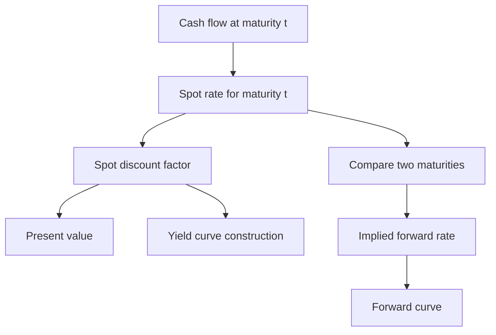
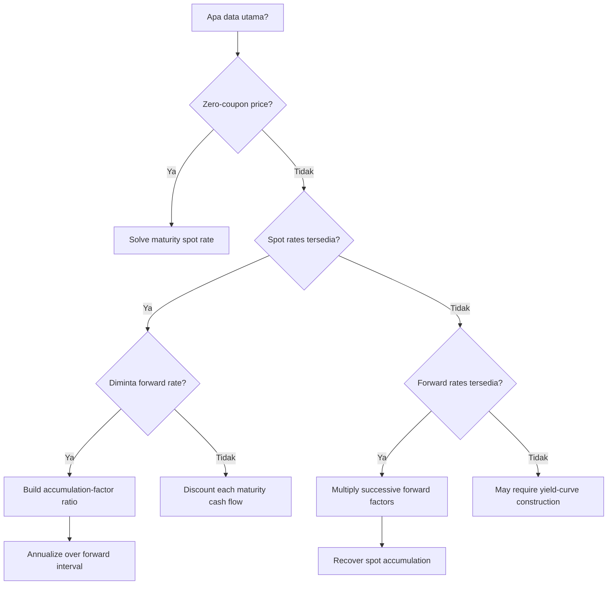

# 📘 3.1 — Spot Rates and Forward Rates

> [!ABSTRACT] Ringkasan Cepat
> **Topik:** Spot Rates and Forward Rates  
> **Bobot Parent Topic:** 20–30%  
> **Exam Priority:** Very High  
> **Difficulty:** Mixed  
> **Primary Skill:** Mixed — concept + calculation  
> **Ref:** Vaaler Bab 8.3 & 9; Kellison Bab 10–11

## Section 0 — Pemetaan Silabus & Exam Scope

| Field | Isi |
|---|---|
| Topik CF1 | Topik 3 — Struktur Jangka Waktu Suku Bunga |
| Subtopik | 3.1 Spot Rates and Forward Rates |
| Learning Outcome | Memahami penggunaan *spot rate* dan *forward rate* dalam struktur jangka waktu suku bunga. |
| Skill Diuji | Mendiskontokan cash flow dengan spot rate yang sesuai maturity; memperoleh spot rate dari zero-coupon price; menghitung implied forward rate dari spot rates; menghubungkan spot dan forward melalui konsistensi accumulation / no-arbitrage. |
| Bobot Parent Topic | 20–30% |
| Exam Priority | Very High |
| Prerequisite | Effective interest rate, discount factor, accumulation function, present value |
| Connected Topics | [[3.2 Yield Curve]], [[3.3 Duration (Macaulay and Modified)]], [[5.1 Bond Pricing]] |
| Referensi | Silabus CF1 Topik 3; Vaaler Bab 8.3 & 9; Kellison Bab 10–11 |

> [!IMPORTANT] Scope Boundary
> [CORE CF1] Note ini fokus pada **spot rate**, **spot discount factor**, **implied/theoretical forward rate**, serta hubungan matematis keduanya. Vaaler §8.3 secara eksplisit mendefinisikan spot rate dan implied forward rate, sedangkan Kellison Bab 10 mengembangkan spot rates dan forward rates dari term structure. Pembentukan kurva dari data pasar dan bootstrapping coupon bonds dibahas terutama di [[3.2 Yield Curve]]. Duration, convexity, dan immunization dibahas di subtopik 3.3–3.5.
>
> Vaaler membedakan **implied/theoretical forward rate** dari **market forward rate** yang benar-benar tersedia di masa depan. Karena itu, dalam note ini istilah *forward rate* tanpa kualifikasi berarti rate yang **diimplikasikan oleh spot rates saat ini**, kecuali konteks menyatakan lain.

## Section 1 — Intuisi & Big Picture

Jika seluruh maturity memakai satu interest rate yang sama, valuasi cash flow sederhana: semua pembayaran cukup didiskontokan dengan rate tersebut. Dalam term structure, model memperbolehkan rate berbeda menurut panjang investasi. Uang yang dibayar satu tahun lagi dinilai dengan rate 1-tahun, sedangkan uang yang dibayar lima tahun lagi dinilai dengan rate 5-tahun.

**Spot rate** menjawab pertanyaan: “Jika saya menanam uang sekarang sampai maturity tertentu tanpa intermediate cash flow, berapa annual effective rate untuk seluruh interval itu?” Karena titik awalnya selalu hari ini, spot rate maturity $t$ merangkum growth dari $0$ sampai $t$.

**Forward rate** menjawab pertanyaan berbeda: “Rate tahunan apa untuk interval masa depan $[t_1,t_2]$ yang harus konsisten dengan spot rates hari ini?” Rate ini muncul karena satu dollar yang dibawa langsung dari $0$ ke $t_2$ harus menghasilkan nilai yang sama dengan strategi ekuivalen: tumbuh dari $0$ ke $t_1$, lalu tumbuh lagi dari $t_1$ ke $t_2$ menggunakan implied forward rate.

Kesalahan intuitif utama adalah menganggap forward rate sebagai sekadar selisih dua spot rates atau sebagai future spot rate yang pasti terjadi. Keduanya salah. Forward rate adalah **rate implisit yang menyamakan accumulation factors**, bukan selisih aritmetika sederhana.

## Section 2 — Definisi & Core Concepts

### Definisi Formal

> [!NOTE] Definisi Formal
> Mengikuti Vaaler, untuk $t>0$, **spot rate** $r_t$ adalah annual effective interest rate untuk uang yang diinvestasikan selama interval $[0,t]$. Jika $K$ diinvestasikan pada $t=0$, nilainya pada waktu $t$ adalah
>
> $$
> K(1+r_t)^t.
> $$
>
> Untuk $0\le t<s$, **implied/theoretical forward rate** $f_{[t,s]}$ adalah annual effective rate untuk interval $[t,s]$ yang konsisten dengan spot rates $r_t$ dan $r_s$:
>
> $$
> (1+f_{[t,s]})^{s-t}
> =
> \frac{(1+r_s)^s}{(1+r_t)^t}.
> $$
>
> Vaaler menetapkan $f_{[0,s]}=r_s$.

### Mapping Notasi

Silabus menuliskan spot dan forward secara generik sebagai $s_t$ dan $f_{t_1,t_2}$, sementara Vaaler menggunakan $r_t$ dan $f_{[t,s]}$. Dalam note ini:

$$
s_t \equiv r_t,
$$

dan

$$
f_{t_1,t_2} \equiv f_{[t_1,t_2]}.
$$

### Terminologi Penting

| Istilah / Simbol | Definisi | Intuisi | Exam Note |
|---|---|---|---|
| $s_t$ | Annual effective spot rate untuk interval $[0,t]$ | Growth rata-rata efektif dari hari ini ke maturity $t$ | Exponent tetap $t$ |
| $P(0,t)$ | Discount factor / harga saat ini dari 1 unit yang dibayar pada $t$ | Berapa nilai hari ini dari 1 di maturity | $P(0,t)=(1+s_t)^{-t}$ |
| $f_{t_1,t_2}$ | Annual effective implied forward rate untuk interval $[t_1,t_2]$ | Rate “penghubung” agar dua jalur accumulation konsisten | Exponent $t_2-t_1$ |
| Implied/theoretical forward | Forward yang dihitung dari spot rates saat ini | Hasil matematis dari term structure | Bukan jaminan actual future market rate |
| Market forward rate | Rate yang benar-benar ditawarkan untuk future interval | Harga pasar aktual suatu future borrowing/lending arrangement | Dapat berbeda dari implied forward |
| Forward curve | Grafik forward rates untuk interval dengan panjang tertentu | Menunjukkan rate marginal antar future dates | Detail kurva → [[3.2 Yield Curve]] |

### Core Relationship 1 — Spot Discounting

Untuk cash flow $C_t$ yang dibayar tepat di waktu $t$:

$$
PV_0(C_t)
=
C_t(1+s_t)^{-t}.
$$

Untuk beberapa deterministic cash flows:

$$
PV_0
=
\sum_t C_t(1+s_t)^{-t}.
$$

**Timing:** setiap cash flow memakai spot rate yang sesuai **maturity-nya sendiri**.

**Rate basis:** formula di atas mengasumsikan $s_t$ adalah annual effective rate dan $t$ diukur dalam tahun.

### Core Relationship 2 — Spot Rate dari Zero-Coupon Price

Jika zero-coupon security membayar $F$ pada waktu $t$ dan harganya hari ini adalah $P$:

$$
P
=
F(1+s_t)^{-t}.
$$

Maka

$$
s_t
=
\left(\frac{F}{P}\right)^{1/t}-1.
$$

Economic meaning: hanya ada satu future payment, sehingga yield security tersebut langsung mengidentifikasi spot rate untuk maturity itu.

### Core Relationship 3 — Forward Rate dari Dua Spot Rates

No-arbitrage / accumulation consistency memberi

$$
(1+s_{t_2})^{t_2}
=
(1+s_{t_1})^{t_1}
(1+f_{t_1,t_2})^{t_2-t_1}.
$$

Sehingga

$$
\boxed{
f_{t_1,t_2}
=
\left[
\frac{(1+s_{t_2})^{t_2}}
{(1+s_{t_1})^{t_1}}
\right]^{1/(t_2-t_1)}-1
}
$$

Untuk one-year forward dari $n$ ke $n+1$:

$$
\boxed{
f_{n,n+1}
=
\frac{(1+s_{n+1})^{n+1}}{(1+s_n)^n}-1
}
$$

### Core Relationship 4 — Spot Accumulation dari Forward Rates

Vaaler juga menunjukkan arah sebaliknya. Jika

$$
0=t_0<t_1<\cdots<t_k=t,
$$

maka

$$
(1+s_t)^t
=
\prod_{j=1}^k
(1+f_{t_{j-1},t_j})^{t_j-t_{j-1}}.
$$

Artinya spot accumulation factor sampai maturity $t$ dapat dipecah menjadi product dari successive forward accumulation factors.

### Important Distinction — Forward Rate ≠ Selisih Spot Rate

> [!IMPORTANT] Jangan Mengurangi Spot Rates
> Secara umum,
>
> $$
> f_{t_1,t_2}\ne s_{t_2}-s_{t_1}.
> $$
>
> Yang harus dibandingkan adalah **accumulation factors**, bukan rate secara langsung.

## Section 3 — How It Works

```text
Cash flow by maturity
↓
Pilih spot rate yang sesuai maturity
↓
Bangun spot accumulation / discount factor
↓
Jika interval dimulai di masa depan:
pecah growth menjadi dua segmen
↓
Samakan total accumulation
↓
Solve implied forward rate
↓
Verify dengan product identity
```

### Mengapa Formula Forward Harus Berbentuk Rasio Accumulation Factor?

Ambil investasi 1 unit pada $t=0$. Ada dua deskripsi yang harus konsisten untuk nilainya di $t_2$.

**Jalur langsung**

$$
1
\longrightarrow
(1+s_{t_2})^{t_2}.
$$

**Jalur dua tahap**

$$
1
\longrightarrow
(1+s_{t_1})^{t_1}
\longrightarrow
(1+s_{t_1})^{t_1}
(1+f_{t_1,t_2})^{t_2-t_1}.
$$

Karena keduanya merepresentasikan growth dari investasi yang sama ke tanggal yang sama:

$$
(1+s_{t_2})^{t_2}
=
(1+s_{t_1})^{t_1}
(1+f_{t_1,t_2})^{t_2-t_1}.
$$

Jadi forward factor adalah **remaining growth factor** setelah growth hingga $t_1$ “dikeluarkan” dari growth total hingga $t_2$.

> [!TIP] Cara Berpikir
> Jangan mulai dari formula forward. Tulis dulu:
>
> **growth sampai akhir = growth sampai titik awal forward × growth selama forward interval.**
>
> Setelah itu exponent hampir selalu jatuh pada tempat yang benar.

> [!DANGER] Jangan Salah Pikir
> - Jangan menghitung $f=s_{t_2}-s_{t_1}$.
> - Jangan lupa exponent $t_1$, $t_2$, dan $t_2-t_1$.
> - Jangan mencampur annual effective spot rates dengan nominal/continuous rates tanpa conversion.
> - Jangan menyebut implied forward sebagai future market rate yang pasti terealisasi.

## Section 4 — Worked Examples & Exam Cases

### Case A — Fundamental: Spot Rate dari Zero-Coupon Price

**Soal**

Sebuah zero-coupon bond membayar $1{,}000$ pada akhir tahun ke-2 dan dijual hari ini seharga $860$. Hitung annual effective 2-year spot rate.

> [!SUCCESS] Pembahasan
>
> **1. Identifikasi informasi & unknown**
>
> - $F=1{,}000$
> - $P=860$
> - $t=2$
> - unknown: $s_2$
>
> **2. Timeline / Structure**
>
> | Waktu | 0 | 1 | 2 |
> |---:|---:|---:|---:|
> | Cash flow | $-860$ | $0$ | $+1{,}000$ |
>
> **3. Rate conversion**
>
> Tidak diperlukan. Target adalah annual effective spot rate.
>
> **4. Equation / Formula Selection**
>
> $$
> 860
> =
> 1000(1+s_2)^{-2}.
> $$
>
> **5. Calculation**
>
> $$
> 1+s_2
> =
> \left(\frac{1000}{860}\right)^{1/2}.
> $$
>
> $$
> s_2
> \approx
> 0.07832773
> =
> 7.8328\%.
> $$
>
> **6. Interpretation**
>
> Satu-satunya payment terjadi pada $t=2$, sehingga yield dari transaksi zero-coupon ini adalah spot rate maturity 2 tahun.
>
> **7. Verification**
>
> Karena $P<F$, spot rate harus positif. Substitusi kembali $s_2$ memberi PV sekitar $860$.

> [!WARNING] Exam Trap — Case A
> - **Trap:** memakai $1000/860-1$ dan lupa annualization.
> - **Mengapa distractor terlihat benar:** rasio tersebut memang total 2-year growth, tetapi bukan annual effective rate.
> - **Cara menghindari:** jika maturity $t$, ambil akar pangkat $1/t$.
> - **Shortcut aman:** zero coupon → price langsung menentukan spot maturity tersebut.
> - **Target waktu:** < 1 menit.

### Case B — Exam-Typical: One-Year Forward Rate

**Soal**

Annual effective spot rates adalah $s_1=7\%$ dan $s_2=8\%$. Hitung implied one-year forward rate dari akhir tahun 1 sampai akhir tahun 2.

> [!SUCCESS] Pembahasan
>
> **1. Identifikasi informasi & unknown**
>
> - $s_1=0.07$
> - $s_2=0.08$
> - interval forward: $[1,2]$
> - unknown: $f_{1,2}$
>
> **2. Timeline / Structure**
>
> | Waktu | 0 | 1 | 2 |
> |---:|---:|---:|---:|
> | Direct growth | $1$ |  | $(1.08)^2$ |
> | Two-stage growth | $1$ | $1.07$ | $1.07(1+f_{1,2})$ |
>
> **3. Rate conversion**
>
> Semua rates annual effective; tidak ada conversion.
>
> **4. Equation / Formula Selection**
>
> $$
> (1.08)^2
> =
> 1.07(1+f_{1,2}).
> $$
>
> **5. Calculation**
>
> $$
> f_{1,2}
> =
> \frac{(1.08)^2}{1.07}-1
> \approx
> 0.09009346.
> $$
>
> $$
> \boxed{f_{1,2}\approx 9.0093\%}
> $$
>
> **6. Interpretation**
>
> Walaupun 2-year spot rate hanya $8\%$, marginal rate yang diperlukan pada tahun kedua agar total 2-year growth mencapai $(1.08)^2$ adalah sekitar $9.01\%$.
>
> **7. Verification**
>
> $$
> 1.07(1+0.09009346)
> \approx
> (1.08)^2.
> $$

> [!WARNING] Exam Trap — Case B
> - **Trap:** $8\%-7\%=1\%$.
> - **Mengapa distractor terlihat benar:** terlihat seperti “rate tambahan” tahun kedua.
> - **Cara menghindari:** spot rates adalah compounded rates untuk horizon berbeda; gunakan growth factors.
> - **Shortcut aman:** one-year forward $n\to n+1$ tidak perlu akar karena interval length = 1.
> - **Target waktu:** 1 menit.

### Case C — Challenging / Integrated: Reconstruct Spot Growth dari Forward Rates

**Soal**

Diketahui annual effective spot rates:

$$
s_1=7\%,\qquad s_2=8\%,\qquad s_3=8.75\%.
$$

Hitung implied one-year forward rates $f_{1,2}$ dan $f_{2,3}$, lalu verifikasi bahwa successive forward growth menghasilkan accumulation factor 3-tahun yang sama dengan spot rate $s_3$.

> [!SUCCESS] Pembahasan
>
> **1. Identifikasi informasi & unknown**
>
> Target:
>
> $$
> f_{1,2},\qquad f_{2,3}.
> $$
>
> **2. Timeline / Structure**
>
> | Interval | $[0,1]$ | $[1,2]$ | $[2,3]$ |
> |---|---:|---:|---:|
> | Rate | $s_1$ | $f_{1,2}$ | $f_{2,3}$ |
>
> **3. Rate conversion**
>
> Semua annual effective.
>
> **4. Equation / Formula Selection**
>
> $$
> 1+f_{1,2}
> =
> \frac{(1+s_2)^2}{1+s_1},
> $$
>
> dan
>
> $$
> 1+f_{2,3}
> =
> \frac{(1+s_3)^3}{(1+s_2)^2}.
> $$
>
> **5. Calculation**
>
> Dari Case B:
>
> $$
> f_{1,2}
> \approx
> 9.0093\%.
> $$
>
> Selanjutnya:
>
> $$
> f_{2,3}
> =
> \frac{(1.0875)^3}{(1.08)^2}-1
> \approx
> 0.10265661
> =
> 10.2657\%.
> $$
>
> **6. Verification**
>
> Successive growth:
>
> $$
> (1.07)(1+f_{1,2})(1+f_{2,3})
> \approx
> 1.286138672.
> $$
>
> Direct 3-year spot growth:
>
> $$
> (1.0875)^3
> \approx
> 1.286138672.
> $$
>
> Nilai sama, sebagaimana harus terjadi.
>
> **7. Interpretation**
>
> Spot rate maturity 3 tahun “merangkum” seluruh growth dari 0 sampai 3. Forward rates memecah growth yang sama menjadi rate per future interval.

> [!WARNING] Exam Trap — Case C
> - **Trap:** memakai $s_3$ langsung sebagai rate tahun ketiga.
> - **Mengapa distractor terlihat benar:** $s_3$ memang berlabel “3-year rate”, tetapi berlaku untuk keseluruhan interval $[0,3]$.
> - **Cara menghindari:** spot = from today; forward = between future dates.
> - **Shortcut aman:** build accumulation-factor ladder.
> - **Target waktu:** 2–3 menit.

## Section 5 — Verification & Sanity Check

> [!CHECK] Sanity Check
> 1. **Reconstruction check:** forward factors harus merekonstruksi spot accumulation factor:
>
> $$
> (1+s_{t_2})^{t_2}
> =
> (1+s_{t_1})^{t_1}
> (1+f_{t_1,t_2})^{t_2-t_1}.
> $$
>
> 2. **Zero-coupon check:** untuk positive spot rate dan positive maturity, harga zero-coupon harus lebih kecil dari redemption amount.
> 3. **Timing check:** interval forward $[t_1,t_2]$ memiliki panjang $t_2-t_1$, sehingga exponent forward harus $t_2-t_1$.
> 4. **Rate-basis check:** annual effective rates tidak boleh langsung dicampur dengan nominal atau force of interest.
> 5. **Interpretation check:** implied forward rate tidak harus sama dengan market rate yang benar-benar berlaku ketika $t_1$ tiba.

### Metode Alternatif — Discount Factors

Definisikan

$$
P(0,t)
=
(1+s_t)^{-t}.
$$

Maka forward discount factor untuk interval $[t_1,t_2]$ adalah

$$
P(t_1,t_2)
=
\frac{P(0,t_2)}{P(0,t_1)}.
$$

Karena

$$
P(t_1,t_2)
=
(1+f_{t_1,t_2})^{-(t_2-t_1)},
$$

kita memperoleh forward rate yang sama. Metode ini sering lebih bersih jika soal sudah memberikan discount factors daripada spot rates.

## Section 6 — Connections & Mental Model



### Hubungan Konsep

- [[1.4 Accumulation and Present Value]] → spot discounting hanyalah present value dengan discount factor yang bergantung pada maturity.
- [[1.2 Effective, Nominal, and Force of Interest]] → seluruh formula spot/forward harus memakai rate basis yang konsisten.
- [[3.2 Yield Curve]] → sekumpulan spot rates menurut maturity membentuk spot rate curve; market data dapat digunakan untuk memperoleh kurva tersebut.
- [[5.1 Bond Pricing]] → bond dengan beberapa cash flows dapat dinilai dengan mendiskontokan setiap cash flow menggunakan spot rate maturity masing-masing.
- [[3.3 Duration (Macaulay and Modified)]] → sensitivity analysis datang setelah cash flow telah diberi valuation structure; jangan campurkan forward-rate mechanics dengan duration formula.

### Mental Model — “Total Growth = First Leg × Second Leg”

| Pertanyaan | Jawaban |
|---|---|
| Dari kapan spot rate dimulai? | Selalu dari $t=0$ |
| Dari kapan forward rate dimulai? | Dari future start date $t_1$ |
| Apa object utama? | Accumulation factor |
| Bagaimana forward diperoleh? | Total growth sampai $t_2$ dibagi growth sampai $t_1$ |
| Apa check terbaik? | Kalikan kembali semua legs dan cocokkan total spot growth |

## Section 7 — Exam Traps & Misconceptions

### Timing Trap

> [!BUG] Timing Trap
> Spot $s_5$ berlaku dari $t=0$ sampai $t=5$, bukan hanya selama “tahun ke-5”. Sebaliknya, one-year forward $f_{4,5}$ berlaku khusus dari $t=4$ sampai $t=5$.

### Rate / Frequency Trap

> [!BUG] Rate & Frequency Trap
> Formula
>
> $$
> (1+s_t)^t
> $$
>
> mengasumsikan $s_t$ annual effective ketika $t$ dalam tahun. Jika quotation menggunakan nominal rate atau force of interest, conversion harus dilakukan sebelum memakai formula effective-rate ini.

### Formula / Notation Trap

> [!BUG] Formula Trap
> Jangan tertukar numerator dan denominator.
>
> **Salah**
>
> $$
> (1+f_{t_1,t_2})^{t_2-t_1}
> =
> \frac{(1+s_{t_1})^{t_1}}{(1+s_{t_2})^{t_2}}.
> $$
>
> **Benar**
>
> $$
> (1+f_{t_1,t_2})^{t_2-t_1}
> =
> \frac{(1+s_{t_2})^{t_2}}{(1+s_{t_1})^{t_1}}.
> $$

### Calculation Trap

> [!BUG] Calculation Trap
> Untuk multi-year forward interval, jangan lupa annualize remaining growth.
>
> **Salah**
>
> $$
> f_{2,5}
> =
> \frac{(1+s_5)^5}{(1+s_2)^2}-1.
> $$
>
> **Benar**
>
> $$
> f_{2,5}
> =
> \left[
> \frac{(1+s_5)^5}{(1+s_2)^2}
> \right]^{1/3}-1.
> $$

### Interpretation Trap

> [!BUG] Interpretation Trap
> Forward rate yang dihitung dari spot rates adalah **implied/theoretical forward rate**. Vaaler menegaskan bahwa actual market rate pada future interval dapat lebih tinggi atau lebih rendah. Jadi hasil calculation tidak boleh diinterpretasikan sebagai rate masa depan yang pasti.

### Red Flags

> [!CAUTION] Red Flags

| Keyword / Condition | Apa yang Harus Dipikirkan |
|---|---|
| “spot rate for $t$ years” | growth dari $0$ sampai $t$ |
| “forward from year $a$ to year $b$” | interval length $b-a$ |
| “one-year forward” | exponent forward = 1 |
| “zero-coupon” | maturity yield langsung mengidentifikasi spot rate |
| “discount factor” | gunakan ratio discount factors |
| “annual effective” | gunakan $(1+i)^t$ |
| “nominal convertible...” | convert dahulu ke basis yang sesuai |
| “market forward” | bedakan dari implied forward |

## Section 8 — Executive Summary

### Must Remember

> [!SUMMARY] Must Remember
> - Spot rate $s_t$ adalah annual effective rate untuk **seluruh interval $[0,t]$**.
> - Spot discount factor adalah $P(0,t)=(1+s_t)^{-t}$.
> - Cash flow di maturity $t$ didiskontokan dengan spot rate maturity $t$.
> - Forward rate $f_{t_1,t_2}$ adalah rate implisit untuk interval $[t_1,t_2]$.
> - Formula inti:
>
> $$
> (1+s_{t_2})^{t_2}
> =
> (1+s_{t_1})^{t_1}
> (1+f_{t_1,t_2})^{t_2-t_1}.
> $$
>
> - Forward rate **bukan** selisih dua spot rates.
> - Untuk multi-year forward interval, annualize dengan pangkat $1/(t_2-t_1)$.
> - Successive forward factors harus merekonstruksi spot accumulation factor.
> - Implied forward rate tidak sama dengan guaranteed future market rate.
> - Detailed bootstrapping dan curve construction → [[3.2 Yield Curve]].

### Formula Map

| Kondisi | Formula / Rule | Timing | Common Trap |
|---|---|---|---|
| PV cash flow maturity $t$ | $C_t(1+s_t)^{-t}$ | dari $t$ ke 0 | memakai satu rate untuk semua maturities |
| Spot dari zero coupon | $s_t=(F/P)^{1/t}-1$ | $0\to t$ | lupa annualization |
| Forward umum | $\left[(1+s_{t_2})^{t_2}/(1+s_{t_1})^{t_1}\right]^{1/(t_2-t_1)}-1$ | $t_1\to t_2$ | exponent / ratio terbalik |
| One-year forward | $(1+s_{n+1})^{n+1}/(1+s_n)^n-1$ | $n\to n+1$ | mengurangi spot rates |
| From discount factors | $P(t_1,t_2)=P(0,t_2)/P(0,t_1)$ | future interval | ratio terbalik |
| Reconstruct spot | product successive forward factors | $0\to t$ | lupa interval length |

### Trigger Keywords

| Jika soal mengatakan... | Pikirkan... |
|---|---|
| “zero-coupon bond” | spot rate langsung dari price/redemption |
| “spot rates for 1, 2, 3 years” | maturity-specific accumulation factors |
| “forward rate from year 2 to 5” | ratio total growth, lalu cube root |
| “implied forward” | derive from current spot rates |
| “discount factor” | gunakan price ratios |
| “rate expected/available in future” | periksa apakah yang dimaksud implied atau actual market rate |

### Kapan Digunakan

Gunakan spot/forward relationships ketika:

- term structure tidak flat atau rate berbeda menurut maturity;
- cash flow maturity-specific perlu didiskontokan;
- soal memberikan spot rates dan meminta forward rate;
- soal memberikan forward rates dan meminta implied spot accumulation;
- zero-coupon price digunakan untuk memperoleh maturity-specific spot rate.

### Kapan TIDAK Boleh Digunakan Langsung

Jangan gunakan formula effective annual di atas tanpa modifikasi jika:

- rate quotation menggunakan basis lain dan belum dikonversi;
- maturities dinyatakan dalam period unit yang tidak cocok dengan rate basis;
- soal memberikan coupon-bearing bond dan spot rates belum tersedia — curve extraction/bootstrapping masuk [[3.2 Yield Curve]];
- yang ditanyakan adalah YTM tunggal sebuah coupon bond — jangan menyamakan YTM dengan spot rate.

### Quick Decision Tree



## Section 9 — Active Recall Check

1. Apa definisi spot rate $s_t$, dan kapan intervalnya dimulai?
2. Apa perbedaan conceptual antara $s_5$ dan $f_{4,5}$?
3. Turunkan formula $f_{t_1,t_2}$ dari equation of accumulation consistency.
4. Mengapa $f_{2,5}$ memerlukan pangkat $1/3$ setelah mengambil ratio accumulation factors?
5. Sebuah zero-coupon bond membayar 1 pada $t=4$ dan harganya $0.78$. Susun equation untuk memperoleh $s_4$ tanpa menghitung jawabannya.
6. Diberikan $s_2$ dan $s_6$. Susun formula implied forward rate untuk interval $[2,6]$.
7. Jika discount factors $P(0,3)$ dan $P(0,5)$ diketahui, bagaimana menyusun forward discount factor $P(3,5)$?
8. Mengapa forward rate tidak boleh dihitung sebagai $s_{t_2}-s_{t_1}$?
9. Bagaimana cara memverifikasi sekumpulan successive one-year forward rates terhadap spot rate maturity terakhir?
10. Mengapa implied forward rate tidak boleh diinterpretasikan sebagai future market rate yang pasti?

## Section 10 — Exam Pattern Map

[TEXTBOOK-BASED EXPECTATION]

| Narasi Soal | Keyword | Konsep | Formula/Rule | Langkah | Trap | Shortcut |
|---|---|---|---|---|---|---|
| Harga zero-coupon diketahui | “zero-coupon”, “maturity value” | Spot rate | $P=F(1+s_t)^{-t}$ | equation → isolate rate → annualize | lupa akar $t$ | single cash flow = spot maturity |
| Dua spot rates diketahui | “forward from $t_1$ to $t_2$” | Implied forward | accumulation ratio | total growth ÷ first-leg growth → annualize | subtract rates | think in growth factors |
| Multi-year future interval | “3-year loan beginning in year 4” | Forward interval length | exponent $1/(t_2-t_1)$ | identify start/end → ratio → root | memakai exponent 1 | write interval length first |
| Forward rates diketahui | “successive forward rates” | Recover spot | product forward factors | multiply growth legs → take $t$-year root if spot rate required | average rates arithmetically | build factor ladder |
| Discount factors diketahui | “discount factor”, “zero price” | Forward discount factor | $P(t_1,t_2)=P(0,t_2)/P(0,t_1)$ | ratio → invert/annualize | ratio terbalik | later DF ÷ earlier DF |

## Source Traceability

| Materi | Sumber |
|---|---|
| Scope Topik 3 dan learning outcome spot/forward | Silabus CF1 — Topik 3 |
| Definisi spot rate dan term structure | Vaaler, *Mathematical Interest Theory*, 2nd ed., §8.3 |
| Spot rate curve dan relation dengan maturity-specific discounting | Vaaler §8.3 |
| Implied/theoretical forward rate | Vaaler §8.3, Eq. 8.3.8 |
| Spot accumulation dari sequence of forward rates | Vaaler §8.3, Eq. 8.3.10 |
| Distinction implied forward vs market forward | Vaaler §8.3 |
| Spot-rate development dan bond cash-flow discounting | Kellison, *The Theory of Interest*, 3rd ed., Bab 10 §§10.3–10.4 |
| Forward rates dan successive one-year forward relations | Kellison Bab 10 §10.5 |
| Broader term-structure framework | Vaaler Bab 8.3 & 9; Kellison Bab 10–11 sesuai silabus |

---

> [!QUOTE] Follow-up Options
> 1. *"Uji saya dengan soal Active Recall dari topik ini"*
> 2. *"Buat 10 soal exam-style calculation untuk topik ini"*
> 3. *"Jelaskan hubungan topik ini dengan topik CF1 terkait"*

*📖 Ref: Vaaler Bab 8.3 & 9; Kellison Bab 10–11 | 🗓️ 2026-08-25 | #CF1 #MatematikaKeuangan*
