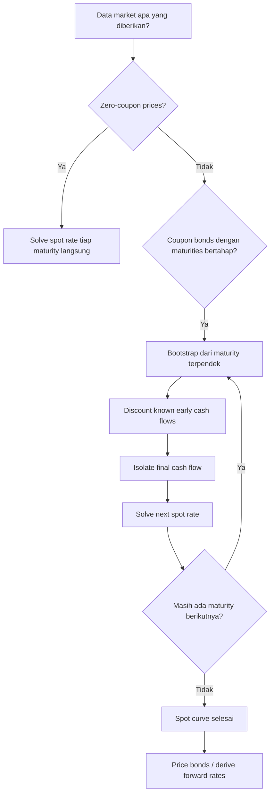

# 📘 3.2 — Yield Curve

> [!ABSTRACT] Ringkasan Cepat
> **Topik:** Yield Curve  
> **Bobot Parent Topic:** 20–30%  
> **Exam Priority:** Very High  
> **Difficulty:** Mixed  
> **Primary Skill:** Concept + Calculation  
> **Inti:** *Yield curve* menggambarkan hubungan antara yield dan maturity untuk sekuritas yang comparable. Untuk valuation yang arbitrage-consistent, cash flow yang berbeda maturity didiskontokan dengan **spot rate** masing-masing. Jika spot rates tidak tersedia langsung, spot curve dapat diperoleh secara bertahap dari harga obligasi melalui **bootstrapping**.

## Section 0 — Pemetaan Silabus & Exam Scope

| Field | Isi |
|---|---|
| Topik CF1 | Topik 3 — Struktur Jangka Waktu Suku Bunga |
| Subtopik | 3.2 Yield Curve |
| Learning Outcome | Mengidentifikasi faktor utama yang mempengaruhi struktur jangka waktu suku bunga dan memahami penggunaan data pasar untuk membentuk *yield curve*. |
| Skill Diuji | Mengenali bentuk yield curve; membedakan YTM curve dan spot curve; memahami teori term structure; menggunakan harga zero-coupon/coupon bonds untuk memperoleh spot rates; melakukan bootstrapping sederhana; menggunakan spot curve untuk pricing. |
| Bobot Parent Topic | 20–30% |
| Exam Priority | Very High |
| Prerequisite | Spot rate, forward rate, bond cash flow, equation of value |
| Connected Topics | [[3.1 Spot Rates and Forward Rates]], [[3.3 Duration (Macaulay and Modified)]], [[5.1 Bond Pricing]], [[5.3 Yield Rate and Coupon Calculations]] |
| Referensi | Silabus CF1 Topik 3; Vaaler §8.3 dan Bab 9; Kellison Bab 10–11 |

> [!IMPORTANT] Scope Boundary
> [CORE CF1] Silabus secara eksplisit mencantumkan **bentuk kurva, teori, bootstrapping, dan YTM** untuk subtopik ini. Fokus note adalah hubungan maturity–yield, teori term structure, perbedaan spot rate dengan YTM, serta konstruksi spot curve dari market prices.
>
> Duration, convexity, dan immunization adalah kelanjutan Topik 3 dan dibahas di [[3.3 Duration (Macaulay and Modified)]], [[3.4 Convexity]], dan [[3.5 Immunization]].

## Section 1 — Intuisi & Big Picture

Interest rate tidak harus sama untuk semua maturity. Sekuritas 1 tahun, 5 tahun, dan 20 tahun dapat menawarkan yield berbeda walaupun default risk-nya sebanding. Hubungan antara **rate** dan **term to maturity** inilah yang disebut **term structure of interest rates**.

*Yield curve* adalah cara visual untuk melihat term structure. Secara umum:

- sumbu horizontal: waktu sampai maturity;
- sumbu vertikal: suatu measure of yield/rate.

Namun istilah “yield curve” bisa merujuk pada curve yang berbeda tergantung rate yang diplot. Ini penting untuk CF1 karena **YTM curve** dan **spot curve** bukan hal yang sama.

### Mental Model

```text
Market prices of bonds
        ↓
Observed yields / YTM
        ↓
Yield curve
        ↓
Extract maturity-specific discount rates
        ↓
Spot curve
        ↓
Forward rates + arbitrage-consistent pricing
```

## Section 2 — Apa Itu Yield Curve?

Vaaler menjelaskan yield curve sebagai grafik annual yield rate terhadap time to maturity untuk sekuritas dengan karakteristik risiko yang comparable. Treasury securities sering digunakan karena dianggap memiliki default risk yang sangat rendah.

### Bentuk Yield Curve

| Bentuk | Ciri | Interpretasi Dasar |
|---|---|---|
| **Normal / upward-sloping** | Yield meningkat dengan maturity | Longer-term yields > shorter-term yields |
| **Inverted / downward-sloping** | Yield menurun dengan maturity | Shorter-term yields > longer-term yields |
| **Flat** | Yield relatif sama antar maturity | Maturity hampir tidak mengubah yield |
| **Humped** | Naik lalu turun, atau memiliki puncak | Term structure tidak monotonic |

> [!IMPORTANT] Important Distinction
> Bentuk kurva adalah **deskripsi data**, bukan sebab. Untuk menjelaskan *mengapa* kurva berbentuk tertentu, diperlukan teori term structure.

## Section 3 — Teori Term Structure

Vaaler membahas beberapa teori yang menjelaskan mengapa rates berbeda menurut maturity.

### 3.1 Pure Expectations Theory

Premis utama: investor menganggap sequence of short-term bonds sebagai perfect substitute untuk satu long-term bond jika expected total return sama.

Secara konseptual, untuk $n$ tahun:

$$
1+y_n
=
\left[
\prod_{k=1}^{n}(1+f_{k-1,k})
\right]^{1/n},
$$

dengan $y_n$ sebagai annual yield untuk horizon $n$ tahun dan $f_{k-1,k}$ sebagai one-period forward rate untuk periode ke-$k$.

Interpretasi:

- upward-sloping curve dapat konsisten dengan expectation bahwa future short rates meningkat;
- downward-sloping curve dapat konsisten dengan expectation bahwa future short rates menurun.

> [!WARNING] Jangan Salah Interpretasi
> Expectations theory menghubungkan long-term rates dengan expected future short rates. Ini **bukan** berarti setiap forward rate pasti menjadi spot rate aktual di masa depan.

### 3.2 Liquidity Preference Theory

Investor cenderung menyukai investasi jangka lebih pendek karena dana lebih cepat tersedia dan lebih fleksibel.

Agar investor mau memegang long-term securities, issuer harus menawarkan tambahan return berupa **liquidity premium**.

Implikasi:

- long-term yields dapat lebih tinggi bukan hanya karena expected future rates meningkat;
- ada compensation tambahan karena maturity lebih panjang / liquidity lebih rendah.

### 3.3 Preferred Habitat Theory

Investor memiliki maturity range atau **preferred habitat** tertentu. Mereka dapat berpindah ke maturity lain jika diberi yield premium yang cukup.

Term premium dalam teori ini merupakan kompensasi untuk keluar dari maturity yang disukai.

### 3.4 Market Segmentation Theory

Bond market dianggap tersegmentasi berdasarkan maturity. Supply dan demand pada setiap maturity segment menentukan yield di segmen tersebut.

Berbeda dari preferred habitat:

- preferred habitat masih memungkinkan investor berpindah maturity jika ada premium;
- market segmentation menganggap pengaruh antar-segmen jauh lebih terbatas.

### Comparison Table

| Theory | Core Idea | Why Long Rates May Differ |
|---|---|---|
| Pure expectations | Long investment ≈ sequence of short investments | Expectations of future short rates |
| Liquidity preference | Investor prefer shorter maturities | Liquidity premium |
| Preferred habitat | Investor punya maturity preference | Term premium diperlukan untuk berpindah maturity |
| Market segmentation | Tiap maturity adalah market segment | Supply–demand masing-masing segment |

## Section 4 — YTM Curve vs Spot Curve

### Yield to Maturity (YTM)

YTM adalah **satu discount rate** yang membuat PV seluruh cash flow bond sama dengan market price.

Untuk bond dengan cash flow $C_t$:

$$
P
=
\sum_{t=1}^{n}
\frac{C_t}{(1+y)^t},
$$

dengan $y$ = YTM per period yang sesuai.

YTM adalah summary rate untuk **seluruh cash-flow package**, bukan maturity-specific rate untuk setiap payment.

### Spot Rate

Spot rate $s_t$ adalah rate yang tepat untuk payment tunggal pada maturity $t$:

$$
P(0,t)
=
(1+s_t)^{-t}.
$$

Untuk bond dengan beberapa cash flows:

$$
P
=
\sum_{t=1}^{n}
\frac{C_t}{(1+s_t)^t}.
$$

> [!DANGER] YTM ≠ Spot Rate
> Untuk coupon bond, YTM umumnya bukan spot rate maturity terakhir karena bond membayar coupon pada beberapa tanggal.
>
> **Zero-coupon bond adalah special case:** karena hanya ada satu cash flow, YTM-nya sama dengan spot rate untuk maturity tersebut.

### Kurva yang Sering Ditemui

| Curve | Y-axis | Dibangun Dari | Kegunaan |
|---|---|---|---|
| YTM curve | Yield to maturity | Coupon bond market prices | Ringkasan market yields menurut maturity |
| Spot curve | Spot rate | Zero-coupon prices atau bootstrapping | Discounting maturity-specific cash flows |
| Forward curve | Forward rate | Derived dari spot curve | Implied rate antar future dates |

## Section 5 — Menggunakan Market Data untuk Membentuk Spot Curve

### Case 1 — Zero-Coupon Bonds Tersedia

Jika zero-coupon bond maturity $t$ dengan redemption $F$ memiliki price $P_t$:

$$
P_t
=
F(1+s_t)^{-t}.
$$

Sehingga

$$
s_t
=
\left(\frac{F}{P_t}\right)^{1/t}-1.
$$

Jika tersedia zero-coupon prices untuk banyak maturities, setiap spot rate dapat diperoleh langsung.

### Case 2 — Coupon Bonds: Bootstrapping

Dalam praktik textbook, spot rates sering harus diperoleh dari coupon-bearing bonds. Ide bootstrapping:

1. cari spot rate maturity paling pendek;
2. gunakan rate tersebut untuk mendiskontokan cash flow awal bond maturity berikutnya;
3. sisa harga hanya berasal dari cash flow maturity berikutnya;
4. solve spot rate maturity tersebut;
5. ulangi secara sequential.

> [!TIP] Mental Rule
> **Known early spot rates → discount known early cash flows → isolate final cash flow → solve next spot rate.**

## Section 6 — Bootstrapping: General Formula

Misalkan bond maturity $n$ mempunyai price $P$, cash flows $C_1,\dots,C_n$, dan spot rates $s_1,\dots,s_{n-1}$ sudah diketahui.

Maka:

$$
P
=
\sum_{t=1}^{n-1}
\frac{C_t}{(1+s_t)^t}
+
\frac{C_n}{(1+s_n)^n}.
$$

Isolasi terminal cash flow:

$$
\frac{C_n}{(1+s_n)^n}
=
P
-
\sum_{t=1}^{n-1}
\frac{C_t}{(1+s_t)^t}.
$$

Sehingga:

$$
\boxed{
s_n
=
\left[
\frac{C_n}
{
P-\displaystyle\sum_{t=1}^{n-1}\frac{C_t}{(1+s_t)^t}
}
\right]^{1/n}
-1
}
$$

[ASSUMPTION] Cash flows deterministic dan seluruh bonds yang dipakai untuk bootstrap harus comparable sehingga menggunakan discount structure yang sama.

## Section 7 — Worked Examples

### Case A — Fundamental: Membaca Bentuk Yield Curve

Diberikan YTM Treasury securities:

| Maturity | YTM |
|---:|---:|
| 1 year | 3.0% |
| 2 years | 3.4% |
| 5 years | 4.1% |
| 10 years | 4.5% |

Karena yield meningkat seiring maturity, curve bersifat **normal / upward-sloping**.

> [!WARNING] Exam Trap
> Jangan menyimpulkan bahwa future rates **pasti** naik hanya dari bentuk curve. Itu memerlukan teori/assumption tertentu.

### Case B — Spot Rate dari Zero-Coupon Market Price

Sebuah zero-coupon bond membayar $1{,}000$ dalam 2 tahun dan dijual $930$.

Equation:

$$
930
=
\frac{1000}{(1+s_2)^2}.
$$

Sehingga:

$$
s_2
=
\left(\frac{1000}{930}\right)^{1/2}-1.
$$

Pattern ini identik dengan [[3.1 Spot Rates and Forward Rates]].

### Case C — Exam-Typical: Bootstrapping 3-Year Spot Curve

Gunakan market data yang sejalan dengan exercise Vaaler §8.3:

- 1-year zero-coupon $1{,}000$ bond: price $974$;
- 2-year $1{,}000$, 3% annual coupon bond: price $988$;
- 3-year $1{,}000$, 4% annual coupon bond: price $990$.

Cari $s_1$, $s_2$, dan $s_3$.

#### Step 1 — Solve $s_1$

Zero-coupon bond:

$$
974
=
\frac{1000}{1+s_1}.
$$

Maka:

$$
s_1
=
\frac{1000}{974}-1
\approx
2.6694\%.
$$

#### Step 2 — Solve $s_2$

2-year bond membayar:

| Waktu | 1 | 2 |
|---:|---:|---:|
| Cash flow | $30$ | $1{,}030$ |

Price equation:

$$
988
=
\frac{30}{1+s_1}
+
\frac{1030}{(1+s_2)^2}.
$$

Substitusi $s_1$:

$$
\frac{1030}{(1+s_2)^2}
=
988
-
\frac{30}{1+s_1}.
$$

Maka:

$$
s_2
\approx
3.6476\%.
$$

#### Step 3 — Solve $s_3$

3-year 4% bond membayar:

| Waktu | 1 | 2 | 3 |
|---:|---:|---:|---:|
| Cash flow | $40$ | $40$ | $1{,}040$ |

Price equation:

$$
990
=
\frac{40}{1+s_1}
+
\frac{40}{(1+s_2)^2}
+
\frac{1040}{(1+s_3)^3}.
$$

Setelah $s_1$ dan $s_2$ diketahui:

$$
s_3
\approx
4.4062\%.
$$

Jadi spot curve yang di-bootstrap adalah kira-kira:

| Maturity | Spot Rate |
|---:|---:|
| 1 year | 2.6694% |
| 2 years | 3.6476% |
| 3 years | 4.4062% |

> [!SUCCESS] Lesson
> Bootstrapping bukan simultaneous guessing. Setiap step menggunakan spot rate maturity lebih pendek yang **sudah diketahui** untuk membuka rate maturity berikutnya.

> [!WARNING] Exam Trap — Bootstrapping
> - Jangan mendiskontokan semua coupon dengan YTM bond.
> - Jangan memakai $s_1$ untuk seluruh cash flows.
> - Jangan lupa redemption + final coupon pada maturity terakhir.
> - Jangan membulatkan spot rate terlalu dini karena error akan diteruskan ke step berikutnya.

## Section 8 — Pricing dengan Spot Curve

Setelah spot curve diketahui, fair price suatu bond adalah:

$$
P
=
\sum_{t=1}^{n}
C_t(1+s_t)^{-t}.
$$

Contoh struktur 3-year bond dengan annual coupon $C$ dan redemption $F$:

$$
P
=
\frac{C}{1+s_1}
+
\frac{C}{(1+s_2)^2}
+
\frac{C+F}{(1+s_3)^3}.
$$

Ini adalah arbitrage-consistent valuation bila spot rates berasal dari market instruments comparable.

### Mengapa Bukan Satu YTM?

YTM adalah rate internal yang merangkum price bond. Tetapi term structure memberi discount rate yang berbeda per maturity. Karena itu:

- **pricing from curve** → gunakan spot rates;
- **reporting a single yield for a bond** → gunakan YTM.

## Section 9 — Hubungan Yield Curve dengan Forward Rates

Setelah spot curve terbentuk, implied forward rates dapat dihitung dari:

$$
(1+s_{t_2})^{t_2}
=
(1+s_{t_1})^{t_1}
(1+f_{t_1,t_2})^{t_2-t_1}.
$$

Sehingga yield curve dan forward curve adalah dua representasi yang saling terkait dari term structure.

Lihat detail calculation di [[3.1 Spot Rates and Forward Rates]].

## Section 10 — Exam Traps & Misconceptions

### Trap 1 — YTM = Spot Rate

> [!BUG] Salah
> “Bond maturity 5 tahun memiliki YTM 6%, maka $s_5=6\%$.”

Untuk coupon bond, statement ini umumnya tidak valid.

### Trap 2 — Semua Cash Flow Pakai Rate yang Sama

> [!BUG] Salah
>
> $$
> P
> =
> \sum_t \frac{C_t}{(1+s_n)^t}.
> $$

Jika term structure tidak flat, tiap cash flow harus memakai $s_t$ masing-masing.

### Trap 3 — Bootstrapping Lompat Maturity

Jika $s_1$ belum diketahui, biasanya $s_2$ dari coupon bond belum dapat diisolasi. Sequence matters.

### Trap 4 — Bentuk Curve = Forecast Pasti

Normal curve tidak membuktikan future short rates pasti naik. Liquidity/term premium dan segmentation juga dapat mempengaruhi bentuk curve.

### Trap 5 — Membandingkan Bonds yang Tidak Comparable

Yield curve meaningful jika sekuritas memiliki risiko dan karakteristik yang cukup comparable. Vaaler menekankan bonds dengan similar default risk; Treasury curve sering digunakan karena default risk dianggap minimal.

### Trap 6 — Risk Premium vs Term Premium

- **Term/liquidity premium:** compensation terkait maturity / liquidity.
- **Risk premium:** perbedaan yield karena credit/default risk antara securities comparable maturity.

## Section 11 — Verification & Sanity Checks

> [!CHECK] Sanity Check
> - Jika zero-coupon price $<F$ dan rates positif, spot rate harus positif.
> - Setelah bootstrap, masukkan kembali seluruh $s_t$ ke equation bond price. Harus mereproduksi market price.
> - Final cash flow bond harus mencakup coupon + redemption.
> - Spot discount factor harus konsisten:
>
> $$
> P(0,t)=(1+s_t)^{-t}.
> $$
>
> - Jika term structure flat pada $s$, semua spot rates sama dan pricing kembali menjadi ordinary single-rate discounting.
> - Jika bond adalah zero-coupon, YTM = spot rate maturity bond.

## Section 12 — Executive Summary

> [!SUMMARY] Must Remember
> - **Term structure** = hubungan interest rates dengan maturity.
> - **Yield curve** = visualisasi rate/yield terhadap maturity.
> - Bentuk utama: normal, inverted, flat, humped.
> - Teori utama dalam source: pure expectations, liquidity preference, preferred habitat, market segmentation.
> - **YTM curve ≠ spot curve**.
> - YTM adalah satu rate untuk seluruh cash-flow package.
> - Spot rate adalah maturity-specific discount rate.
> - Zero-coupon bond memberi spot rate secara langsung.
> - Coupon bonds memerlukan **bootstrapping**.
> - Bootstrapping dilakukan sequentially dari maturity pendek ke panjang.
> - Setelah spot curve tersedia, harga bond dihitung dengan discounting setiap cash flow menggunakan spot rate maturity yang sesuai.
> - Spot curve juga dapat dikonversi menjadi forward curve melalui accumulation consistency.

### Formula Map

| Task | Formula |
|---|---|
| Zero-coupon spot | $s_t=(F/P_t)^{1/t}-1$ |
| Spot discount factor | $P(0,t)=(1+s_t)^{-t}$ |
| Bond price from spot curve | $P=\sum_t C_t(1+s_t)^{-t}$ |
| Bootstrap next spot | isolate terminal discounted cash flow, lalu solve $s_n$ |
| YTM | $P=\sum_t C_t(1+y)^{-t}$ |
| Forward from spots | $(1+s_{t_2})^{t_2}=(1+s_{t_1})^{t_1}(1+f_{t_1,t_2})^{t_2-t_1}$ |

### Quick Decision Tree



## Section 13 — Active Recall Check

1. Apa perbedaan antara term structure dan yield curve?
2. Sebutkan empat bentuk yield curve yang dibahas dalam source.
3. Apa core assumption pure expectations theory?
4. Mengapa liquidity preference dapat membuat long-term yields lebih tinggi?
5. Bedakan preferred habitat theory dengan market segmentation theory.
6. Mengapa YTM coupon bond umumnya tidak sama dengan spot rate maturity terakhir?
7. Kapan YTM sama dengan spot rate?
8. Jelaskan bootstrapping tanpa formula dalam tiga langkah.
9. Diberikan $s_1$ dan price 2-year coupon bond. Bagaimana menyusun equation untuk $s_2$?
10. Mengapa semua cash flow bond tidak boleh didiskontokan dengan $s_n$ bila yield curve tidak flat?
11. Setelah spot curve diperoleh, bagaimana menghitung fair price bond baru?
12. Apa hubungan spot curve dengan forward curve?
13. Mengapa normal yield curve tidak otomatis membuktikan future short rates akan naik?
14. Apa bedanya term premium dengan risk premium?
15. Bagaimana melakukan sanity check setelah bootstrapping?

## Section 14 — Exam Pattern Map

[TEXTBOOK-BASED EXPECTATION]

| Narasi Soal | Keyword | Konsep | Langkah Utama | Trap |
|---|---|---|---|---|
| Rates meningkat dengan maturity | “yield curve” | Normal curve | compare yields across terms | menganggap future rates pasti naik |
| Rates jangka pendek > panjang | “inverted” | Inverted curve | identify slope | salah label |
| Harga zero-coupon tersedia | “zero coupon” | Direct spot extraction | price → spot | lupa annualization |
| Coupon bonds dengan maturity 1,2,3 tahun | “construct spot curve” | Bootstrapping | shortest first → isolate next cash flow | pakai satu YTM |
| Harga bond + seluruh spot rates tersedia | “price/value” | Spot discounting | discount each cash flow separately | pakai $s_n$ ke semua cash flow |
| YTM bond diminta | “yield to maturity” | Single-equivalent yield | solve one rate for all cash flows | menyebutnya spot rate |
| Spot curve tersedia | “forward rate” | Forward curve | accumulation relation | subtract spot rates |
| Pertanyaan teori | expectations/liquidity/segmentation | Term structure theory | identify mechanism | mencampur term vs credit risk |

## Source Traceability

| Materi | Sumber |
|---|---|
| Scope Topik 3.2: bentuk kurva, teori, bootstrapping, YTM | Silabus CF1 Topik 3 |
| Yield curve definition dan bentuk normal/inverted/flat/humped | Vaaler §8.3 |
| Pure expectations theory | Vaaler §8.3 |
| Liquidity preference theory | Vaaler §8.3 |
| Preferred habitat theory | Vaaler §8.3 |
| Market segmentation theory | Vaaler §8.3 |
| Spot-rate extraction dari market securities | Vaaler §8.3 |
| Sequential spot calculation dari coupon bonds | Vaaler §8.3 exercises / term-structure mechanics |
| Spot rates, forward rates, and term structure | Kellison Bab 10 |
| Interest-rate sensitivity context after term-structure setup | Vaaler Bab 9; Kellison Bab 11 |

---

> [!QUOTE] Follow-up Options
> 1. *"Continue chapter 3.3"*
> 2. *"Uji saya dengan soal bootstrapping yield curve"*
> 3. *"Bandingkan YTM curve, spot curve, dan forward curve"*

*📖 Ref: Vaaler Bab 8.3 & 9; Kellison Bab 10–11 | 🗓️ 2026-08-25 | #CF1 #MatematikaKeuangan*
