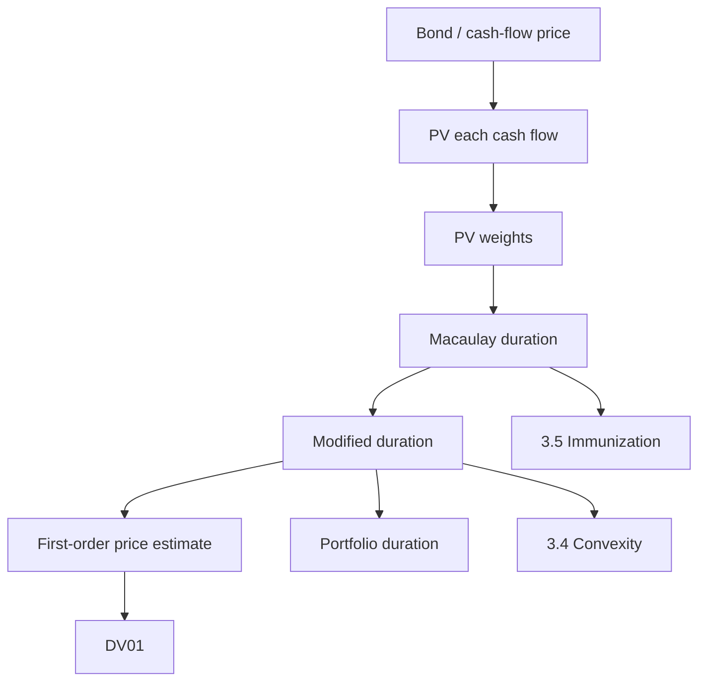

# 📘 3.3 — Duration (Macaulay and Modified)

> [!ABSTRACT] Ringkasan Cepat
> **Topik:** Duration (Macaulay and Modified)  
> **Bobot Parent Topic:** 20–30%  
> **Exam Priority:** Very High  
> **Difficulty:** Calculation-Intensive  
> **Primary Skill:** Calculation + Interpretation  
> **Inti:** **Macaulay duration** adalah weighted-average timing dari present-valued cash flows. **Modified duration** mengubah ukuran timing tersebut menjadi **first-order price sensitivity** terhadap perubahan yield. Untuk perubahan yield kecil,
>
> $$
> \frac{\Delta P}{P}
> \approx
> -D_{\mathrm{Mod}}\Delta i.
> $$
>
> Tanda minus wajib: yield naik → price turun.

## Section 0 — Pemetaan Silabus & Exam Scope

| Field | Isi |
|---|---|
| Topik CF1 | Topik 3 — Struktur Jangka Waktu Suku Bunga |
| Subtopik | 3.3 Duration (Macaulay and Modified) |
| Learning Outcome | Menentukan Macaulay duration dan modified duration serta menggunakannya untuk mengestimasi sensitivitas nilai arus kas terhadap perubahan suku bunga. |
| Skill Diuji | Menghitung PV cash flows; membentuk PV weights; menghitung Macaulay duration; mengubah ke modified duration; mengestimasi price change; menghitung DV01; menghitung duration portofolio. |
| Bobot Parent Topic | 20–30% |
| Exam Priority | Very High |
| Prerequisite | Present value, bond pricing, yield rate basis, time units |
| Connected Topics | [[3.2 Yield Curve]], [[3.4 Convexity]], [[3.5 Immunization]], [[5.1 Bond Pricing]] |
| Referensi | Silabus CF1 Topik 3; Vaaler Bab 9; Kellison Bab 10–11 sesuai silabus |

> [!IMPORTANT] Scope Boundary
> [CORE CF1] Silabus secara eksplisit mencantumkan $D_{Mac}$, $D_{Mod}$, DV01, dan portfolio duration. Fokus note ini adalah **fixed cash flows** dan price sensitivity orde pertama.
>
> **Convexity** sebagai koreksi orde kedua dibahas di [[3.4 Convexity]]. Duration matching untuk immunization dibahas di [[3.5 Immunization]].
>
> Vaaler juga membahas **effective duration** untuk interest-sensitive cash flows seperti callable bonds. Karena subtopik 3.3 silabus secara khusus menyebut Macaulay dan modified duration, effective duration diperlakukan sebagai `[CF1 SUPPORTING CONTEXT]`, bukan materi inti.

## Section 1 — Intuisi & Big Picture

Dua bond dapat memiliki maturity yang sama tetapi sensitivitas harga yang berbeda karena timing cash flow berbeda. Zero-coupon bond membayar semuanya di maturity, sedangkan coupon bond mengembalikan sebagian nilai lebih awal melalui coupons.

Macaulay duration menangkap ide ini sebagai **weighted average waktu pembayaran**, dengan bobot berupa proporsi present value masing-masing cash flow terhadap total price.

Modified duration menjawab pertanyaan yang lebih langsung:

> Jika yield berubah sedikit, kira-kira berapa persen harga berubah?

Vaaler menekankan bahwa untuk positive fixed cash flows, price adalah decreasing function of yield. Karena price curve tidak lurus, duration hanya memberi **linear / first-order approximation** di sekitar yield saat ini.

## Section 2 — Price Function dan Sensitivity

Untuk fixed cash flows $C_t$ pada waktu $t$ dan annual effective yield $i$:

$$
P(i)=\sum_t C_t(1+i)^{-t}.
$$

Derivative:

$$
P'(i)
=
-\sum_t tC_t(1+i)^{-t-1}.
$$

Untuk perubahan kecil $h$:

$$
P(i+h)
\approx
P(i)+P'(i)h.
$$

Maka:

$$
\frac{P(i+h)-P(i)}{P(i)}
\approx
\frac{P'(i)}{P(i)}h.
$$

Modified duration didefinisikan sebagai:

$$
\boxed{
D_{\mathrm{Mod}}
=
-\frac{P'(i)}{P(i)}
}
$$

sehingga:

$$
\boxed{
\frac{\Delta P}{P}
\approx
-D_{\mathrm{Mod}}\Delta i
}
$$

> [!NOTE] Approximation Status
> Formula ini adalah **first-order approximation**, bukan exact repricing. Curvature diperbaiki dengan [[3.4 Convexity]].

## Section 3 — Macaulay Duration

Untuk:

$$
P
=
\sum_t C_t(1+i)^{-t},
$$

definisikan:

$$
PV_t=C_t(1+i)^{-t},
$$

dan weight:

$$
w_t
=
\frac{PV_t}{P}.
$$

Karena:

$$
\sum_t w_t=1,
$$

Macaulay duration adalah:

$$
\boxed{
D_{\mathrm{Mac}}
=
\sum_t t w_t
=
\frac{\sum_t tC_t(1+i)^{-t}}{P}
}
$$

Interpretasi: **present-value-weighted average payment time**.

> [!DANGER] Unit Trap
> Jika cash flows semiannual tetapi payment times ditulis $0.5,1.0,1.5,\ldots$, hasil duration sudah dalam **tahun**. Jika memakai period index $1,2,\ldots$, konversi unit di akhir.

## Section 4 — Hubungan Macaulay dan Modified Duration

Dari derivative price:

$$
-P'(i)
=
\frac{1}{1+i}
\sum_t tC_t(1+i)^{-t}.
$$

Karena numerator Macaulay duration adalah:

$$
\sum_t tC_t(1+i)^{-t}
=
PD_{\mathrm{Mac}},
$$

maka:

$$
\boxed{
D_{\mathrm{Mod}}
=
\frac{D_{\mathrm{Mac}}}{1+i}
}
$$

untuk annual effective yield $i$.

Equivalently:

$$
D_{\mathrm{Mac}}
=
(1+i)D_{\mathrm{Mod}}.
$$

### Nominal Yield Convertible $m$ Times

Jika sensitivity diukur terhadap nominal yield $i^{(m)}$:

$$
1+i
=
\left(1+\frac{i^{(m)}}{m}\right)^m,
$$

maka hubungan Vaaler adalah:

$$
\boxed{
D_{\mathrm{Mod}}^{(m)}
=
\frac{D_{\mathrm{Mac}}}
{1+\frac{i^{(m)}}{m}}
}
$$

> [!IMPORTANT] Rate Basis
> Modified duration bergantung pada **yield variable yang berubah**. Jangan otomatis membagi $D_{Mac}$ dengan $1+i$ jika quotation basis-nya berbeda.

## Section 5 — Fundamental Special Cases

### Zero-Coupon Bond

Untuk zero-coupon maturity $N$ tahun:

$$
\boxed{
D_{\mathrm{Mac}}=N
}
$$

dan:

$$
\boxed{
D_{\mathrm{Mod}}=\frac{N}{1+i}
}
$$

### Coupon Bond

Karena coupons diterima sebelum maturity:

$$
D_{\mathrm{Mac}}
=
\frac{\sum_t tPV_t}{P},
$$

dan pada standard positive-cash-flow case:

$$
D_{\mathrm{Mac}}<\text{maturity}.
$$

Vaaler juga mencatat untuk par-value bond dalam setup khususnya: duration meningkat dengan term dan menurun ketika yield atau coupon frequency meningkat.

## Section 6 — Worked Example A: Zero-Coupon Bond

Sebuah 8-year zero-coupon bond memberikan annual effective yield $5\%$.

Macaulay duration:

$$
D_{\mathrm{Mac}}=8.
$$

Modified duration:

$$
D_{\mathrm{Mod}}
=
\frac{8}{1.05}
\approx
7.6190.
$$

Jika yield naik $0.10\%=0.001$:

$$
\frac{\Delta P}{P}
\approx
-(7.6190)(0.001)
=
-0.007619.
$$

Jadi price diperkirakan turun sekitar:

$$
0.7619\%.
$$

## Section 7 — Worked Example B: Coupon Bond dari Vaaler

Vaaler Example 9.2.23:

- maturity = 10 tahun;
- face value = $15{,}000$;
- coupon rate = 8% nominal, semiannual;
- coupon = $600$ per 6 bulan;
- redemption = $16{,}500$;
- semiannual yield = 3%.

Annual effective yield:

$$
i=(1.03)^2-1=0.0609.
$$

Price:

$$
P
=
600a_{\overline{20}|\,0.03}
+
16{,}500(1.03)^{-20}
\approx
18{,}062.13486.
$$

Vaaler memperoleh:

$$
\boxed{
D_{\mathrm{Mac}}
\approx
7.411047515\text{ years}
}
$$

Modified duration:

$$
D_{\mathrm{Mod}}
=
\frac{7.411047515}{1.0609}
\approx
6.985623070.
$$

Jadi:

$$
\boxed{
D_{\mathrm{Mod}}
\approx
6.985623070
}
$$

> [!CHECK] Sanity
> Karena bond membayar coupons sebelum maturity:
>
> $$
> D_{\mathrm{Mac}}<10.
> $$
>
> Karena yield positif:
>
> $$
> D_{\mathrm{Mod}}<D_{\mathrm{Mac}}.
> $$

## Section 8 — First-Order Price Approximation

Untuk current price $P_0$:

$$
\boxed{
P_1
\approx
P_0(1-D_{\mathrm{Mod}}\Delta i)
}
$$

Jika yield bond Example B naik 15 bps:

$$
\Delta i=0.0015.
$$

Relative price change:

$$
\frac{\Delta P}{P}
\approx
-(6.985623070)(0.0015)
\approx
-0.010478435.
$$

Price diperkirakan turun sekitar:

$$
1.0478\%.
$$

Approximate new price:

$$
P_1
\approx
18{,}062.13486(1+-0.010478435)
\approx
17,872.87.
$$

> [!NOTE] Approximation
> Ini **first-order estimate**. Exact repricing berbeda sedikit karena price-yield curve tidak linear.

## Section 9 — Basis Points dan DV01

Satu basis point:

$$
1\text{ bp}=0.01\%=0.0001.
$$

Dari:

$$
\Delta P
\approx
-PD_{\mathrm{Mod}}\Delta i,
$$

magnitude perubahan dollar untuk 1 bp adalah:

$$
\boxed{
DV01
\approx
PD_{\mathrm{Mod}}(0.0001)
}
$$

Untuk Example B:

$$
DV01
\approx
(18{,}062.13486)(6.985623070)(0.0001)
\approx
12.6175.
$$

Jadi kenaikan yield 1 bp menurunkan price kira-kira sebesar:

$$
\boxed{
\$12.6175
}
$$

> [!IMPORTANT] Source Boundary — DV01
> Istilah DV01 tercantum eksplisit dalam silabus CF1. Formula ini diturunkan langsung dari first-order modified-duration approximation yang didukung Vaaler. Bagian textbook yang tersedia tidak memakai label “DV01” secara eksplisit.

## Section 10 — Portfolio Duration

Vaaler Important Fact 9.2.28: duration portfolio adalah price-weighted average dari individual durations.

Jika:

$$
P=\sum_k P_k,
$$

dan:

$$
w_k=\frac{P_k}{P},
$$

maka:

$$
\boxed{
D_p
=
\sum_k w_kD_k
}
$$

Formula berlaku untuk Macaulay duration dan, dengan yield basis konsisten, modified duration.

> [!DANGER] Weight Trap
> Gunakan **market-value / price weights**, bukan face value atau redemption amount weights.

### Worked Example — Portfolio Dua Bond

Mengikuti ingredients Vaaler Example 9.2.29:

Two-year coupon bond:

$$
P_1\approx2{,}058.680315,
$$

$$
D_1\approx1.915703104.
$$

Five-year zero-coupon bond dengan redemption $10{,}000$ pada yield 4.5%:

$$
P_2
=
10{,}000(1.045)^{-5}
\approx
8,024.510465.
$$

$$
D_2=5.
$$

Total price:

$$
P
=
P_1+P_2
\approx
10,083.190780.
$$

Portfolio duration:

$$
D_p
=
\frac{P_1}{P}D_1
+
\frac{P_2}{P}D_2
\approx
4.370280555.
$$

Jadi:

$$
\boxed{
D_p\approx4.370280555\text{ years}
}
$$

## Section 11 — Duration dan Reinvestment Risk

Vaaler menghubungkan Macaulay dan modified duration dengan average investment length dan **reinvestment risk**.

Coupon bond memberikan intermediate cash flows yang harus direinvestasikan. Future reinvestment rate tidak pasti. Duration menjadi bridge menuju immunization, ketika timing/sensitivity assets dan liabilities dicocokkan untuk mengurangi exposure terhadap small interest-rate changes.

Lihat [[3.5 Immunization]].

## Section 12 — Assumptions di Balik Approximation

> [!IMPORTANT] Assumptions
> Modified-duration approximation standar mengasumsikan:
>
> 1. cash flows fixed;
> 2. perubahan yield kecil;
> 3. price dipandang sebagai function dari satu yield variable;
> 4. rate basis konsisten;
> 5. approximation bersifat local / first-order.

Jika setiap spot rate bergerak berbeda-beda, satu scalar duration tidak menangkap seluruh term-structure risk.

## Section 13 — [CF1 SUPPORTING CONTEXT] Effective Duration

Vaaler menggunakan effective duration untuk interest-sensitive cash flows seperti callable bond.

Centered slope:

$$
m_h(i_0)
=
\frac{P(i_0+h)-P(i_0-h)}{2h}.
$$

Effective duration:

$$
E_h(i_0)
=
-\frac{m_h(i_0)}{P(i_0)}.
$$

Ini membantu memahami mengapa modified duration tidak selalu cukup ketika cash flows sendiri berubah akibat interest rate.

## Section 14 — Verification & Sanity Check

> [!CHECK] Sanity Check
> 1. Zero-coupon: $D_{Mac}=$ maturity.
> 2. Coupon bond: Macaulay duration biasanya lebih kecil dari maturity.
> 3. Positive annual effective yield:
>
> $$
> D_{Mod}<D_{Mac}.
> $$
>
> 4. Yield naik → approximate price change negatif.
> 5. PV weights harus menjumlah menjadi 1.
> 6. Long-only portfolio duration harus berada di antara minimum dan maximum component durations.
> 7. $25$ bp $=0.0025$.
> 8. Perubahan yield lebih besar → convexity makin penting.

### Metode Alternatif — Direct Cash-Flow Table

| $t$ | Cash Flow | Discount Factor | PV | $t\times PV$ |
|---:|---:|---:|---:|---:|
| $t_1$ | $C_1$ | $(1+i)^{-t_1}$ | $PV_1$ | $t_1PV_1$ |
| $t_2$ | $C_2$ | $(1+i)^{-t_2}$ | $PV_2$ | $t_2PV_2$ |
| $\vdots$ | $\vdots$ | $\vdots$ | $\vdots$ | $\vdots$ |
| $t_n$ | $C_n$ | $(1+i)^{-t_n}$ | $PV_n$ | $t_nPV_n$ |
| **Total** |  |  | $P$ | $\sum tPV$ |

Lalu:

$$
D_{\mathrm{Mac}}
=
\frac{\sum tPV}{P}.
$$

## Section 15 — Connections & Mental Model

- [[5.1 Bond Pricing]] → duration menggunakan PV cash flows yang sama.
- [[3.2 Yield Curve]] → duration merangkum sensitivity terhadap yield/rate assumption.
- [[3.4 Convexity]] → duration = slope/first-order; convexity = curvature/second-order.
- [[3.5 Immunization]] → duration matching menjadi condition utama.
- [[1.2 Effective, Nominal, and Force of Interest]] → yield basis menentukan conversion Macaulay → modified.

## Section 16 — Exam Traps & Misconceptions

### Timing Trap

> [!BUG] Timing Trap
> Semiannual coupons 10 tahun dapat ditulis pada $t=0.5,1.0,\ldots,10$. Jika memakai $1,2,\ldots,20$, hasil awal berada dalam coupon periods.

### Rate / Frequency Trap

> [!BUG] Rate & Frequency Trap
> Annual effective rate tidak boleh dibagi langsung dengan $m$ untuk memperoleh periodic rate. Gunakan:
>
> $$
> 1+i=(1+j)^m.
> $$

### Formula Trap

> [!BUG] Macaulay vs Modified
>
> $$
> D_{Mac}
> =
> \frac{\sum tPV_t}{P}
> $$
>
> sedangkan:
>
> $$
> D_{Mod}
> =
> \frac{D_{Mac}}{1+i}
> $$
>
> pada annual effective basis.

### Sign Trap

> [!BUG] Sign Trap
>
> $$
> \frac{\Delta P}{P}
> \approx
> -D_{Mod}\Delta i.
> $$

### Basis-Point Trap

> [!BUG] Basis Point
>
> $$
> 50\text{ bp}=0.005,
> $$
>
> bukan $0.05$.

### Portfolio Weight Trap

> [!BUG] Portfolio Duration
>
> $$
> w_k=\frac{P_k}{\sum_jP_j}.
> $$

### Approximation Trap

> [!BUG] Duration Is Not Exact Repricing
> Duration hanya tangent-line approximation. Untuk rate move lebih besar, lihat [[3.4 Convexity]].

## Section 17 — Executive Summary

> [!SUMMARY] Must Remember
> - Macaulay duration = **PV-weighted average timing**.
> - Modified duration = **first-order relative price sensitivity**.
> - Annual effective basis:
>
> $$
> D_{Mod}=\frac{D_{Mac}}{1+i}.
> $$
>
> - Price approximation:
>
> $$
> \frac{\Delta P}{P}
> \approx
> -D_{Mod}\Delta i.
> $$
>
> - Zero coupon:
>
> $$
> D_{Mac}=N,
> \qquad
> D_{Mod}=\frac{N}{1+i}.
> $$
>
> - $1$ bp $=0.0001$.
> - DV01:
>
> $$
> DV01\approx PD_{Mod}(0.0001).
> $$
>
> - Portfolio duration memakai **market-value weights**.
> - Duration adalah first-order approximation; convexity adalah next correction.
> - Selalu cek **time unit** dan **yield basis**.

### Formula Map

| Task | Formula | Status |
|---|---|---|
| Price | $P=\sum_t C_t(1+i)^{-t}$ | Exact |
| PV weight | $w_t=C_t(1+i)^{-t}/P$ | Exact |
| Macaulay duration | $D_{Mac}=\sum_ttw_t$ | Exact |
| Modified duration | $D_{Mod}=-P'(i)/P(i)$ | Definition |
| Macaulay → modified | $D_{Mod}=D_{Mac}/(1+i)$ | Exact for annual effective yield variable |
| Price sensitivity | $\Delta P/P\approx-D_{Mod}\Delta i$ | First-order |
| Approximate price | $P_1\approx P_0(1-D_{Mod}\Delta i)$ | First-order |
| DV01 | $PD_{Mod}\times0.0001$ | First-order |
| Portfolio duration | $\sum_k(P_k/P)D_k$ | Exact weighted-average relation |

## Section 18 — Active Recall Check

1. Jelaskan Macaulay duration tanpa memakai kata “sensitivity”.
2. Mengapa zero-coupon duration sama dengan maturity?
3. Mengapa coupon bond duration biasanya lebih kecil dari maturity?
4. Turunkan $D_{Mod}=D_{Mac}/(1+i)$.
5. Mengapa ada tanda minus pada price approximation?
6. Berapa decimal change untuk kenaikan yield 20 bp?
7. Apa itu DV01?
8. Weight apa yang digunakan untuk portfolio duration?
9. Mengapa duration tidak exact untuk perubahan yield besar?
10. Apa hubungan duration dengan convexity?
11. Mengapa rate basis harus diketahui?
12. Apa masalah unit jika semiannual periods dihitung sebagai $1,2,\ldots$ tetapi hasil disebut tahun?

## Section 19 — Exam Pattern Map

[TEXTBOOK-BASED EXPECTATION]

| Narasi Soal | Keyword | Konsep | Formula / Setup | Trap | Shortcut |
|---|---|---|---|---|---|
| Single payment at maturity | zero coupon | Macaulay | $D_{Mac}=N$ | overcalculate | direct |
| Coupon cash flows | “duration” | PV-weighted timing | $\sum tPV/P$ | unit salah | cash-flow table |
| Macaulay diketahui | “modified” | sensitivity | adjust by yield basis | denominator salah | declare rate first |
| Yield changes by bps | “estimate price” | first-order | $-D_{Mod}\Delta i$ | sign + bp | convert bp first |
| Dollar impact 1 bp | “DV01” | dollar sensitivity | $PD_{Mod}10^{-4}$ | lupa price | derive from duration |
| Portfolio | “portfolio duration” | weighted average | $\sum(P_k/P)D_k$ | face weights | market value |
| Large yield move | “estimate” | approximation | duration + convexity | treating exact | check [[3.4 Convexity]] |

## Source Traceability

| Materi | Sumber |
|---|---|
| Scope $D_{Mac}$, $D_{Mod}$, DV01, portfolio duration | Silabus CF1 Topik 3 |
| Price sensitivity and price curve | Vaaler Bab 9 §9.1–9.2 |
| Modified duration definition | Vaaler §9.2 |
| Macaulay duration as PV-weighted average timing | Vaaler §9.2 |
| Zero-coupon duration | Vaaler Example 9.2.22 |
| Coupon-bond duration example | Vaaler Example 9.2.23 |
| Relation Macaulay / modified duration | Vaaler §9.2 |
| Par-value coupon-bond duration properties | Vaaler Example 9.2.24 & Important Fact 9.2.25 |
| Portfolio duration | Vaaler Important Fact 9.2.28 |
| Effective duration supporting context | Vaaler §9.5 |
| Kellison scope boundary | Kellison Bab 10–11 per silabus CF1 |

---

> [!QUOTE] Follow-up Options
> 1. *"Continue chapter 3.4"*
> 2. *"Uji saya dengan soal Macaulay & Modified Duration"*
> 3. *"Buat cheat sheet cara cepat duration untuk CF1"*

*📖 Ref: Vaaler Bab 9; Kellison Bab 10–11 | 🗓️ 2026-08-25 | #CF1 #MatematikaKeuangan*
