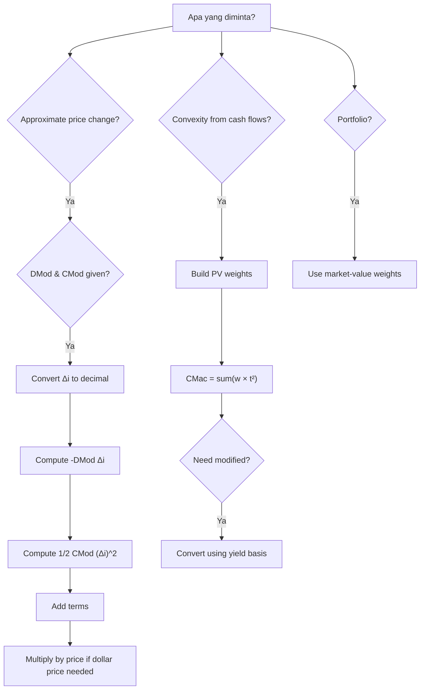

# 📘 3.4 — Convexity

> [!ABSTRACT] Ringkasan Cepat
> **Topik:** Convexity  
> **Bobot Parent Topic:** 20–30%  
> **Exam Priority:** Very High  
> **Difficulty:** Calculation-Intensive  
> **Primary Skill:** Calculation + Interpretation  
> **Inti:** Duration memberikan **first-order / linear approximation** perubahan harga akibat perubahan yield. Convexity menambahkan **second-order correction** karena hubungan price–yield berbentuk curved, bukan garis lurus:
>
> $$
> \frac{\Delta P}{P}
> \approx
> -D_{\mathrm{Mod}}\Delta i
> +
> \frac{1}{2}C_{\mathrm{Mod}}(\Delta i)^2.
> $$
>
> Untuk fixed positive cash flows, convexity positif. Karena $(\Delta i)^2$ selalu nonnegative, convexity correction biasanya **menambah** estimate relatif terhadap duration-only approximation.

## Section 0 — Pemetaan Silabus & Exam Scope

| Field | Isi |
|---|---|
| Topik CF1 | Topik 3 — Struktur Jangka Waktu Suku Bunga |
| Subtopik | 3.4 Convexity |
| Learning Outcome | Menentukan convexity dan menggunakannya bersama duration untuk mengestimasi sensitivitas nilai arus kas terhadap perubahan suku bunga. |
| Skill Diuji | Menghitung modified convexity; menghitung Macaulay convexity sebagai PV-weighted average $t^2$; mengubah Macaulay ke modified convexity; menggunakan second-order price approximation; membandingkan sensitivitas dua cash-flow streams; menghitung convexity portfolio. |
| Bobot Parent Topic | 20–30% |
| Exam Priority | Very High |
| Prerequisite | Price function, derivative, Macaulay duration, modified duration, basis points |
| Connected Topics | [[3.3 Duration (Macaulay and Modified)]], [[3.5 Immunization]], [[5.1 Bond Pricing]] |
| Referensi | Silabus CF1 Topik 3; Vaaler Bab 9 §9.3; Kellison Bab 10–11 sesuai silabus |

> [!IMPORTANT] Scope Boundary
> Silabus CF1 secara eksplisit mendefinisikan subtopik ini sebagai **“koreksi orde-2 estimasi perubahan harga”** dan menghubungkan convexity dengan immunization. Karena itu fokus utama adalah:
>
> 1. mengapa duration-only approximation tidak exact;
> 2. definisi modified convexity;
> 3. second-order approximation;
> 4. Macaulay convexity dan hubungannya dengan modified convexity;
> 5. portfolio convexity;
> 6. hubungan convexity dengan [[3.5 Immunization]].
>
> Vaaler §9.3 memberi treatment eksplisit mengenai convexity. File Kellison Topik 3–5 yang tersedia berupa scan tanpa parsed text yang memadai untuk mengekstrak detail convexity secara andal; karena itu formula dan numerical examples di note ini tidak diam-diam diisi dari luar sumber, tetapi terutama mengikuti Vaaler dan scope silabus.

## Section 1 — Intuisi: Mengapa Duration Belum Cukup?

Di [[3.3 Duration (Macaulay and Modified)]], kita menggunakan:

$$
\frac{\Delta P}{P}
\approx
-D_{\mathrm{Mod}}\Delta i.
$$

Ini adalah approximation menggunakan **tangent line** pada price function $P(i)$.

Masalahnya: bond price tidak berubah secara linear terhadap yield. Untuk positive fixed cash flows:

- yield naik → price turun;
- yield turun → price naik;
- kurva price–yield biasanya **convex / concave upward**.

Akibat curvature ini, tangent-line estimate menjadi kurang akurat ketika perubahan yield cukup besar.

Convexity mengukur curvature tersebut melalui **second derivative**.

### Mental Model

```text
Exact price curve
      ↓
first derivative = slope
      ↓
Modified Duration
      ↓
linear / first-order approximation
      ↓
second derivative = curvature
      ↓
Convexity
      ↓
quadratic / second-order approximation
```

> [!TIP] Feynman Version
> Duration berkata: “kalau yield bergerak sedikit, ikuti kemiringan garis.”
>
> Convexity berkata: “tetapi garis sebenarnya melengkung—tambahkan koreksi curvature.”

## Section 2 — Price Function dan Taylor Approximation

Untuk fixed cash flows:

$$
P(i)
=
\sum_t C_t(1+i)^{-t}.
$$

First-order Taylor approximation di sekitar current yield $i_0$:

$$
P(i)
\approx
P(i_0)
+
P'(i_0)(i-i_0).
$$

Second-order approximation menambahkan second derivative:

$$
P(i)
\approx
P(i_0)
+
P'(i_0)(i-i_0)
+
\frac{1}{2}P''(i_0)(i-i_0)^2.
$$

Bagi dengan $P(i_0)$:

$$
\frac{P(i)-P(i_0)}{P(i_0)}
\approx
\frac{P'(i_0)}{P(i_0)}(i-i_0)
+
\frac{P''(i_0)}{2P(i_0)}(i-i_0)^2.
$$

Karena:

$$
D_{\mathrm{Mod}}(i_0)
=
-\frac{P'(i_0)}{P(i_0)},
$$

convexity muncul secara natural sebagai normalized second derivative.

## Section 3 — Modified Convexity

Mengikuti Vaaler §9.3, untuk annual effective yield:

$$
\boxed{
C_{\mathrm{Mod}}(i)
=
\frac{P''(i)}{P(i)}
}
$$

Dengan notation Vaaler, modified convexity ini ditulis $C(i;1)$ ketika yield variable adalah annual effective rate.

Maka second-order relative price approximation menjadi:

$$
\boxed{
\frac{\Delta P}{P}
\approx
-D_{\mathrm{Mod}}\Delta i
+
\frac{1}{2}C_{\mathrm{Mod}}(\Delta i)^2
}
$$

dengan:

$$
\Delta i=i-i_0.
$$

### Status Formula

- $D_{\mathrm{Mod}}=-P'/P$ → **definition**;
- $C_{\mathrm{Mod}}=P''/P$ → **definition**;
- formula price change → **second-order approximation**, bukan exact.

> [!DANGER] Faktor $\frac{1}{2}$
> Convexity term dalam Taylor approximation adalah:
>
> $$
> \frac{1}{2}C_{\mathrm{Mod}}(\Delta i)^2.
> $$
>
> Salah satu distractor paling natural adalah lupa $\frac{1}{2}$.

## Section 4 — Mengapa Convexity Biasanya Positif?

Untuk:

$$
P(i)
=
\sum_t C_t(1+i)^{-t},
$$

first derivative:

$$
P'(i)
=
-\sum_t tC_t(1+i)^{-t-1},
$$

second derivative:

$$
P''(i)
=
\sum_t t(t+1)C_t(1+i)^{-t-2}.
$$

Jika semua $C_t\ge0$ dan setidaknya satu positif:

$$
P(i)>0
$$

dan:

$$
P''(i)>0.
$$

Jadi:

$$
\boxed{
C_{\mathrm{Mod}}>0
}
$$

untuk ordinary positive bondholder cash flows.

### Exam Interpretation

Karena:

$$
(\Delta i)^2\ge0,
$$

maka convexity correction:

$$
\frac{1}{2}C_{\mathrm{Mod}}(\Delta i)^2
$$

positif untuk positive convexity, baik yield naik maupun yield turun.

Ini menjelaskan pola penting:

- jika yield **naik**, duration-only estimate biasanya memprediksi penurunan yang terlalu besar dalam magnitude;
- jika yield **turun**, duration-only estimate biasanya memprediksi kenaikan yang terlalu kecil.

Secara singkat:

> **positive convexity membuat actual price berada di atas tangent-line duration approximation.**

## Section 5 — Worked Example A: Vaaler Zero-Coupon Bond

Vaaler Example 9.3.4:

Sebuah five-year zero-coupon bond redeemable at $C$ dibeli untuk menghasilkan annual effective yield:

$$
i_0=6\%.
$$

Price function:

$$
P(i)
=
C(1+i)^{-5}.
$$

First derivative:

$$
P'(i)
=
-5C(1+i)^{-6}.
$$

Second derivative:

$$
P''(i)
=
30C(1+i)^{-7}.
$$

### Step 1 — Modified Duration

$$
D_{\mathrm{Mod}}
=
-\frac{P'(i)}{P(i)}
=
\frac{5}{1+i}.
$$

Pada $i=0.06$:

$$
D_{\mathrm{Mod}}
=
\frac{5}{1.06}
\approx
4.716981132.
$$

### Step 2 — Modified Convexity

$$
C_{\mathrm{Mod}}
=
\frac{P''(i)}{P(i)}
=
\frac{30}{(1+i)^2}.
$$

Pada $6\%$:

$$
\boxed{
C_{\mathrm{Mod}}
=
\frac{30}{(1.06)^2}
\approx
26.699893200
}
$$

### Step 3 — Yield Naik 100 Basis Points

$$
\Delta i
=
0.01.
$$

Duration-only approximation:

$$
\frac{\Delta P}{P}
\approx
-\frac{5}{1.06}(0.01)
\approx
-0.047169811.
$$

Dengan convexity:

$$
\frac{\Delta P}{P}
\approx
-\frac{5}{1.06}(0.01)
+
\frac{1}{2}
\frac{30}{(1.06)^2}
(0.01)^2.
$$

Convexity correction:

$$
\frac{1}{2}C_{\mathrm{Mod}}(0.01)^2
\approx
0.001334995.
$$

Second-order estimate:

$$
\boxed{
\frac{\Delta P}{P}
\approx
-0.045834817
}
$$

atau sekitar:

$$
-4.583482\%.
$$

### Step 4 — Exact Check

Exact relative change:

$$
\frac{
C(1.07)^{-5}
-
C(1.06)^{-5}
}{
C(1.06)^{-5}
}
=
\left(\frac{1.06}{1.07}\right)^5-1.
$$

Hasil exact:

$$
\boxed{
-0.045863658
}
$$

atau:

$$
-4.586366\%.
$$

Comparison:

| Method | Relative Price Change |
|---|---:|
| Duration only | -0.047169811 |
| Duration + convexity | -0.045834817 |
| Exact repricing | -0.045863658 |

> [!SUCCESS] Lesson
> Convexity secara nyata memperbaiki approximation untuk rate move 100 bp. Second-order estimate jauh lebih dekat ke exact repricing dibanding duration-only estimate.

## Section 6 — Macaulay Convexity

Vaaler juga memperkenalkan **Macaulay convexity** sebagai analog alami dari Macaulay duration.

Jika PV weight pada cash flow waktu $t$ adalah:

$$
w_t
=
\frac{C_t(1+i)^{-t}}{P(i)},
$$

maka Macaulay duration:

$$
D_{\mathrm{Mac}}
=
\sum_t w_t t.
$$

Macaulay convexity:

$$
\boxed{
C_{\mathrm{Mac}}
=
\sum_t w_t t^2
}
$$

atau:

$$
\boxed{
C_{\mathrm{Mac}}
=
\frac{
\sum_t t^2 C_t(1+i)^{-t}
}{
P(i)
}
}
$$

### Interpretation

Macaulay convexity adalah **PV-weighted average dari squared payment times**.

Compare:

| Measure | Weighted Average |
|---|---|
| Macaulay duration | $t$ |
| Macaulay convexity | $t^2$ |

Karena memakai weight yang sama dengan duration, computation dapat dibuat dalam satu cash-flow table.

### Exam-Safe Table

| $t$ | Cash Flow | PV | $t\times PV$ | $t^2\times PV$ |
|---:|---:|---:|---:|---:|
| $t_1$ | $C_1$ | $PV_1$ | $t_1PV_1$ | $t_1^2PV_1$ |
| $t_2$ | $C_2$ | $PV_2$ | $t_2PV_2$ | $t_2^2PV_2$ |
| $\vdots$ | $\vdots$ | $\vdots$ | $\vdots$ | $\vdots$ |
| **Total** |  | $P$ | $\sum tPV$ | $\sum t^2PV$ |

Kemudian:

$$
D_{\mathrm{Mac}}
=
\frac{\sum tPV}{P},
$$

$$
C_{\mathrm{Mac}}
=
\frac{\sum t^2PV}{P}.
$$

## Section 7 — Zero-Coupon Special Case

Untuk zero-coupon bond maturity $N$:

seluruh PV weight berada di $t=N$.

Maka:

$$
\boxed{
D_{\mathrm{Mac}}=N
}
$$

dan:

$$
\boxed{
C_{\mathrm{Mac}}=N^2.
}
$$

Untuk 5-year zero-coupon:

$$
D_{\mathrm{Mac}}=5,
$$

$$
C_{\mathrm{Mac}}=25.
$$

Ini adalah sanity check paling cepat.

## Section 8 — Macaulay ke Modified Convexity

Vaaler memberikan hubungan umum untuk nominal yield convertible $m$ times.

Jika:

- $C_{\mathrm{Mac}}$ = Macaulay convexity;
- $D_{\mathrm{Mac}}$ = Macaulay duration;
- $i^{(m)}$ = nominal yield convertible $m$ times;

maka modified convexity terhadap quoted yield tersebut:

$$
\boxed{
C_{\mathrm{Mod}}^{(m)}
=
\frac{
C_{\mathrm{Mac}}
+
\frac{1}{m}D_{\mathrm{Mac}}
}{
\left(
1+\frac{i^{(m)}}{m}
\right)^2
}
}
$$

Untuk annual effective rate, $m=1$ dan $i^{(1)}=i$:

$$
\boxed{
C_{\mathrm{Mod}}
=
\frac{
C_{\mathrm{Mac}}+D_{\mathrm{Mac}}
}{
(1+i)^2
}
}
$$

### Zero-Coupon Verification

Untuk $N=5$:

$$
C_{\mathrm{Mac}}=25,
\qquad
D_{\mathrm{Mac}}=5.
$$

Maka:

$$
C_{\mathrm{Mod}}
=
\frac{25+5}{(1.06)^2}
=
\frac{30}{(1.06)^2},
$$

sama dengan hasil derivative langsung.

> [!WARNING] Formula Trap
> Modified convexity **bukan**:
>
> $$
> \frac{C_{\mathrm{Mac}}}{(1+i)^2}.
> $$
>
> Pada annual effective basis, numerator adalah:
>
> $$
> C_{\mathrm{Mac}}+D_{\mathrm{Mac}}.
> $$

## Section 9 — Worked Example B: Coupon Bond vs Zero-Coupon dengan Duration Sama

Vaaler Example 9.3.15 mempertimbangkan:

- 2-year 8% bond dengan annual coupons;
- current yield $5\%$;
- sebuah $N$-year zero-coupon bond yang memiliki Macaulay duration sama.

Untuk face value $F$, coupon bond cash flows:

| Waktu | Cash Flow |
|---:|---:|
| 1 | $0.08F$ |
| 2 | $1.08F$ |

Price:

$$
P
=
\frac{0.08F}{1.05}
+
\frac{1.08F}{(1.05)^2}
\approx
1.055782313F.
$$

Macaulay duration coupon bond:

$$
D_{\mathrm{Mac}}
=
\frac{
1\left(\frac{0.08F}{1.05}\right)
+
2\left(\frac{1.08F}{1.05^2}\right)
}{
P
}
\approx
1.927835052.
$$

Karena zero-coupon duration = maturity:

$$
N
=
D_{\mathrm{Mac}}
\approx
1.927835052.
$$

### Macaulay Convexity Coupon Bond

$$
C_{\mathrm{Mac,coupon}}
=
\frac{
1^2\left(\frac{0.08F}{1.05}\right)
+
2^2\left(\frac{1.08F}{1.05^2}\right)
}{
P
}
\approx
3.783505155.
$$

### Macaulay Convexity Duration-Matched Zero Coupon

$$
C_{\mathrm{Mac,zero}}
=
N^2
\approx
3.716547986.
$$

Vaaler menggunakan contoh ini untuk menunjukkan bahwa **dua investments dapat memiliki duration sama tetapi convexity berbeda**.

> [!IMPORTANT] Exam Meaning
> Duration matching menyamakan first-order sensitivity, tetapi convexity membedakan second-order sensitivity.

Ini menjadi jembatan langsung ke [[3.5 Immunization]].

## Section 10 — Portfolio Convexity

Vaaler Important Fact 9.3.16:

> Macaulay convexity portfolio adalah price-weighted average dari Macaulay convexities individual assets.

Jika:

$$
P
=
\sum_k P_k,
$$

dan:

$$
w_k
=
\frac{P_k}{P},
$$

maka:

$$
\boxed{
C_{\mathrm{Mac},p}
=
\sum_k w_k C_{\mathrm{Mac},k}.
}
$$

### Vaaler Example 9.3.17

Portfolio:

1. $2{,}000$ par-value two-year 6% bond dengan semiannual coupons;
2. $10{,}000$ five-year zero-coupon bond;
3. yield annual effective $4.5\%$.

Textbook values:

$$
P_{\mathrm{2yr}}
\approx
2{,}058.680315,
$$

$$
C_{\mathrm{Mac,2yr}}
\approx
3.761671472.
$$

Five-year zero coupon:

$$
P_{\mathrm{5yr}}
\approx
8{,}024.510465,
$$

$$
C_{\mathrm{Mac,5yr}}
=
25.
$$

Total portfolio price:

$$
P_p
\approx
10{,}083.190780.
$$

Portfolio Macaulay convexity:

$$
C_{\mathrm{Mac},p}
=
\frac{2{,}058.680315}{10{,}083.190780}
(3.761671472)
+
\frac{8{,}024.510465}{10{,}083.190780}
(25).
$$

Sehingga:

$$
\boxed{
C_{\mathrm{Mac},p}
\approx
20.66378046
}
$$

> [!DANGER] Weight Trap
> Sama seperti portfolio duration, gunakan **price / market-value weights**, bukan face amount weights.

## Section 11 — Duration + Convexity Approximation: Exam Workflow

Ketika soal memberi:

- current price $P_0$;
- modified duration $D_{\mathrm{Mod}}$;
- modified convexity $C_{\mathrm{Mod}}$;
- yield shift $\Delta i$;

gunakan workflow:

### Step 1 — Convert Yield Shift

Contoh:

$$
75\text{ bp}
=
0.0075.
$$

### Step 2 — Duration Term

$$
-D_{\mathrm{Mod}}\Delta i.
$$

### Step 3 — Convexity Term

$$
\frac{1}{2}
C_{\mathrm{Mod}}
(\Delta i)^2.
$$

### Step 4 — Add

$$
r_P
=
-D_{\mathrm{Mod}}\Delta i
+
\frac{1}{2}C_{\mathrm{Mod}}(\Delta i)^2.
$$

### Step 5 — Convert to Price if Needed

$$
P_1
\approx
P_0(1+r_P).
$$

### Step 6 — Sanity Check Direction

- yield naik → net price change harus biasanya negative;
- yield turun → net price change biasanya positive;
- positive convexity correction selalu menambah relative price change.

## Section 12 — Approximation Example

Misalkan:

$$
P_0=1{,}000,
$$

$$
D_{\mathrm{Mod}}=6,
$$

$$
C_{\mathrm{Mod}}=45,
$$

dan yield naik 50 bp:

$$
\Delta i=0.005.
$$

Duration contribution:

$$
-6(0.005)
=
-0.03.
$$

Convexity correction:

$$
\frac{1}{2}(45)(0.005)^2
=
0.0005625.
$$

Total:

$$
\frac{\Delta P}{P}
\approx
-0.0294375.
$$

Jadi price change sekitar:

$$
-2.94375\%.
$$

Approximate price:

$$
P_1
\approx
1{,}000(1-0.0294375)
=
970.5625.
$$

> [!CHECK] Compare
> Duration-only price = $970.00$.
>
> Convexity membuat estimate sedikit lebih tinggi, sesuai positive curvature.

## Section 13 — Common Interpretations of Higher Convexity

Jika dua investments memiliki:

- current price comparable;
- modified duration sama;

tetapi convexity berbeda, Vaaler menyatakan investment dengan absolute convexity lebih besar cenderung lebih price-sensitive terhadap interest-rate changes dalam second-order sense.

Untuk standard positive convexity bonds:

- higher convexity berarti price mendapat lebih banyak upward curvature;
- ketika yield naik, bond dengan convexity lebih tinggi kehilangan sedikit lebih kecil relatif terhadap duration-only prediction;
- ketika yield turun, bond dengan convexity lebih tinggi naik lebih besar relatif terhadap duration-only prediction.

> [!CAUTION] Jangan Lepas dari Duration
> “Higher convexity is better” bukan statement universal tanpa konteks. Perbandingan convexity paling meaningful ketika duration dan basis valuation sebanding.

## Section 14 — Dispersion Connection [CF1 SUPPORTING CONTEXT]

Vaaler mendefinisikan dispersion dari payment times:

$$
V(i)
=
\sum_t
w_t
\left(
t-D_{\mathrm{Mac}}
\right)^2.
$$

Karena:

$$
C_{\mathrm{Mac}}
=
\sum_t w_t t^2,
$$

maka:

$$
\boxed{
V(i)
=
C_{\mathrm{Mac}}
-
D_{\mathrm{Mac}}^2
}
$$

Ini identik secara struktur dengan hubungan:

$$
\operatorname{Var}(T)
=
E[T^2]-E[T]^2.
$$

Vaaler menggunakan hasil ini untuk menunjukkan bahwa bila positive cash flows terjadi pada lebih dari satu waktu, Macaulay duration menurun ketika yield meningkat.

Untuk CF1, connection ini terutama membantu memahami bahwa:

- duration = first moment dari timing;
- convexity = second moment dari timing;
- dispersion = spread timing di sekitar duration.

Jangan jadikan derivasi calculus dispersion sebagai prioritas utama dibanding calculation convexity dan price approximation.

## Section 15 — Convexity dan Immunization

Silabus secara eksplisit meminta penggunaan duration dan convexity dalam immunization.

Vaaler menunjukkan Redington immunization dapat dinyatakan sebagai:

1. PV assets = PV liabilities;
2. Macaulay duration assets = Macaulay duration liabilities;
3. Macaulay convexity assets **setidaknya sebesar** Macaulay convexity liabilities.

Secara simbolik:

$$
P_A=P_L,
$$

$$
D_A=D_L,
$$

$$
C_A\ge C_L.
$$

Intuisinya:

- equal PV → posisi match pada current rate;
- equal duration → first derivative / slope match;
- asset convexity lebih besar → surplus memiliki favorable second-order curvature.

Pembahasan lengkap → [[3.5 Immunization]].

## Section 16 — Rate Basis & Frequency Trap

Convexity bergantung pada yield variable yang digunakan.

Untuk annual effective rate:

$$
C_{\mathrm{Mod}}
=
\frac{P''(i)}{P(i)}.
$$

Untuk nominal yield convertible $m$ times, Vaaler memberikan:

$$
C_{\mathrm{Mod}}^{(m)}
=
\frac{
C_{\mathrm{Mac}}
+
\frac{1}{m}D_{\mathrm{Mac}}
}{
\left(
1+\frac{i^{(m)}}{m}
\right)^2
}.
$$

> [!WARNING] Frequency Trap
> Jangan:
>
> 1. menghitung Macaulay convexity dalam **coupon-period squared**;
> 2. lalu melaporkannya sebagai **year squared** tanpa conversion.
>
> Jika payment times ditulis dalam tahun, $t^2$ otomatis dalam year$^2$.

## Section 17 — Exam Traps & Misconceptions

### Trap 1 — Lupa $\frac{1}{2}$

> [!BUG]
>
> **Salah**
>
> $$
> \frac{\Delta P}{P}
> \approx
> -D\Delta i
> +
> C(\Delta i)^2.
> $$
>
> **Benar**
>
> $$
> \frac{\Delta P}{P}
> \approx
> -D\Delta i
> +
> \frac{1}{2}C(\Delta i)^2.
> $$

### Trap 2 — Tidak Mengkuadratkan Yield Change

> [!BUG]
> Convexity term menggunakan:
>
> $$
> (\Delta i)^2,
> $$
>
> bukan $\Delta i$.

### Trap 3 — Basis Points

$$
100\text{ bp}
=
0.01,
$$

$$
50\text{ bp}
=
0.005.
$$

### Trap 4 — Macaulay vs Modified Convexity

Macaulay convexity:

$$
C_{\mathrm{Mac}}
=
\sum_t w_tt^2.
$$

Modified convexity digunakan langsung dalam price approximation:

$$
\frac{\Delta P}{P}
\approx
-D_{\mathrm{Mod}}\Delta i
+
\frac12C_{\mathrm{Mod}}(\Delta i)^2.
$$

Jangan menukar keduanya.

### Trap 5 — Zero-Coupon Formula

Untuk zero coupon maturity $N$:

$$
C_{\mathrm{Mac}}=N^2,
$$

tetapi annual-effective modified convexity:

$$
C_{\mathrm{Mod}}
=
\frac{N(N+1)}{(1+i)^2}.
$$

Jangan memakai $N^2$ langsung pada Taylor approximation.

### Trap 6 — Sign Convexity Term

Untuk positive convexity:

$$
+\frac12C(\Delta i)^2
$$

tetap positif saat $\Delta i<0$ karena kuadrat.

### Trap 7 — Portfolio Weights

Portfolio convexity memakai:

$$
w_k=\frac{P_k}{P_p}.
$$

Bukan face value weights.

### Trap 8 — Treat Approximation as Exact

Second-order approximation lebih baik daripada duration-only, tetapi tetap approximation.

Exact repricing tetap:

$$
P(i_1)
=
\sum_t C_t(1+i_1)^{-t}
$$

jika cash flows dan new yield diketahui.

## Section 18 — Verification & Sanity Check

> [!CHECK] Sanity Check
> 1. Untuk ordinary positive bond cash flows:
>
> $$
> C_{\mathrm{Mod}}>0.
> $$
>
> 2. Zero coupon:
>
> $$
> C_{\mathrm{Mac}}=N^2.
> $$
>
> 3. Annual effective zero-coupon modified convexity:
>
> $$
> C_{\mathrm{Mod}}
> =
> \frac{N(N+1)}{(1+i)^2}.
> $$
>
> 4. Convexity correction harus memiliki order magnitude sekitar $(\Delta i)^2$, sehingga jauh lebih kecil dari duration term untuk very small rate changes.
> 5. Jika two bonds memiliki same duration tetapi different convexity, second-order price responses berbeda.
> 6. Portfolio convexity long-only harus berada di antara minimum dan maximum component convexities.
> 7. Setelah approximation, check sign arah price-yield.

## Section 19 — Formula Map

| Quantity | Formula | Meaning / Status |
|---|---|---|
| Price | $P(i)=\sum_tC_t(1+i)^{-t}$ | Exact |
| Modified duration | $D_{\mathrm{Mod}}=-P'(i)/P(i)$ | First derivative normalized |
| Modified convexity | $C_{\mathrm{Mod}}=P''(i)/P(i)$ | Second derivative normalized |
| Duration-only | $\Delta P/P\approx-D_{\mathrm{Mod}}\Delta i$ | First-order |
| Duration + convexity | $\Delta P/P\approx-D_{\mathrm{Mod}}\Delta i+\frac12C_{\mathrm{Mod}}(\Delta i)^2$ | Second-order |
| Macaulay convexity | $C_{\mathrm{Mac}}=\sum_tw_tt^2$ | PV-weighted square timing |
| Annual effective conversion | $C_{\mathrm{Mod}}=(C_{\mathrm{Mac}}+D_{\mathrm{Mac}})/(1+i)^2$ | Exact relationship |
| Zero coupon Macaulay | $C_{\mathrm{Mac}}=N^2$ | Exact |
| Zero coupon modified | $C_{\mathrm{Mod}}=N(N+1)/(1+i)^2$ | Exact |
| Portfolio Macaulay convexity | $C_p=\sum_k(P_k/P_p)C_k$ | Price-weighted average |

## Section 20 — Quick Decision Tree



## Section 21 — Active Recall Check

1. Mengapa duration-only approximation tidak exact?
2. Apa mathematical definition modified convexity?
3. Tulis second-order relative price approximation.
4. Mengapa convexity correction mempunyai faktor $\frac12$?
5. Mengapa convexity correction positif baik yield naik maupun turun untuk positive-convexity bond?
6. Apa interpretasi Macaulay convexity?
7. Apa hubungan antara Macaulay duration dan Macaulay convexity dalam terms of PV weights?
8. Untuk zero coupon maturity 7 tahun, berapa Macaulay convexity?
9. Bagaimana mengubah Macaulay convexity menjadi modified convexity pada annual effective basis?
10. Mengapa dua bonds dengan duration sama masih dapat mempunyai sensitivity berbeda?
11. Apa weight yang digunakan untuk portfolio convexity?
12. Bagaimana convexity digunakan dalam Redington immunization?
13. Apa perbedaan exact repricing dan duration+convexity approximation?
14. Jika yield turun 50 bp, apa nilai $\Delta i$ dan apakah convexity term positif atau negatif?
15. Mengapa $C_{\mathrm{Mac}}$ tidak boleh langsung dimasukkan ke price approximation?

## Section 22 — Exam Pattern Map

[TEXTBOOK-BASED EXPECTATION]

| Narasi Soal | Keyword | Konsep | Formula / Langkah | Trap | Shortcut |
|---|---|---|---|---|---|
| DMod, CMod, rate move diberikan | “estimate price” | second-order sensitivity | $-D\Delta i+\frac12C(\Delta i)^2$ | lupa $\frac12$ | duration term + correction |
| Cash flows diberikan | “Macaulay convexity” | second moment timing | $\sum t^2PV/P$ | memakai $t$ bukan $t^2$ | extend duration table |
| Zero coupon | “convexity” | special case | $C_{Mac}=N^2$ | memakai $N$ | direct |
| CMac + DMac diketahui | “modified convexity” | basis conversion | $(C_{Mac}+D_{Mac})/(1+i)^2$ | numerator hanya CMac | remember “C + D” |
| Dua bonds same duration | “more sensitive” | second-order comparison | compare convexity | duration dianggap sufficient | higher convexity differentiates |
| Portfolio | “portfolio convexity” | weighted average | $\sum(P_k/P)C_k$ | face weights | use same weights as duration |
| Immunization | “convexity condition” | Redington | $C_A\ge C_L$ after PV & duration match | duration match dianggap selesai | PV → D → C |

## Source Traceability

| Materi | Sumber |
|---|---|
| Scope convexity sebagai koreksi orde-2 | Silabus CF1 Topik 3 |
| Modified convexity definition | Vaaler §9.3, Eq. 9.3.2 |
| Second-order relative price approximation | Vaaler §9.3, Eq. 9.3.3 |
| Positive convexity untuk nonnegative cash flows | Vaaler §9.3 |
| Five-year zero-coupon example | Vaaler Example 9.3.4 |
| Macaulay convexity as weighted average of squared times | Vaaler Important Fact 9.3.8 |
| Macaulay-to-modified convexity relation | Vaaler Eq. 9.3.9 |
| Zero-coupon Macaulay convexity | Vaaler Example 9.3.10 |
| Dispersion relation | Vaaler §9.3, Eq. 9.3.13–9.3.14 |
| Coupon vs zero-coupon convexity | Vaaler Example 9.3.15 |
| Portfolio convexity | Vaaler Important Fact 9.3.16; Example 9.3.17 |
| Convexity condition in immunization | Vaaler §9.4; Silabus CF1 Topik 3 |
| Kellison reference boundary | Kellison Bab 10–11 according to Silabus CF1; detailed scan text was not reliably searchable in the supplied file |

---

> [!QUOTE] Follow-up Options
> 1. *"Continue chapter 3.5"*
> 2. *"Uji saya dengan soal duration + convexity"*
> 3. *"Buat ringkasan cara cepat duration vs convexity"*

*📖 Ref: Vaaler Bab 9 §9.3–9.4; Kellison Bab 10–11 sesuai silabus | 🗓️ 2026-08-25 | #CF1 #MatematikaKeuangan*
