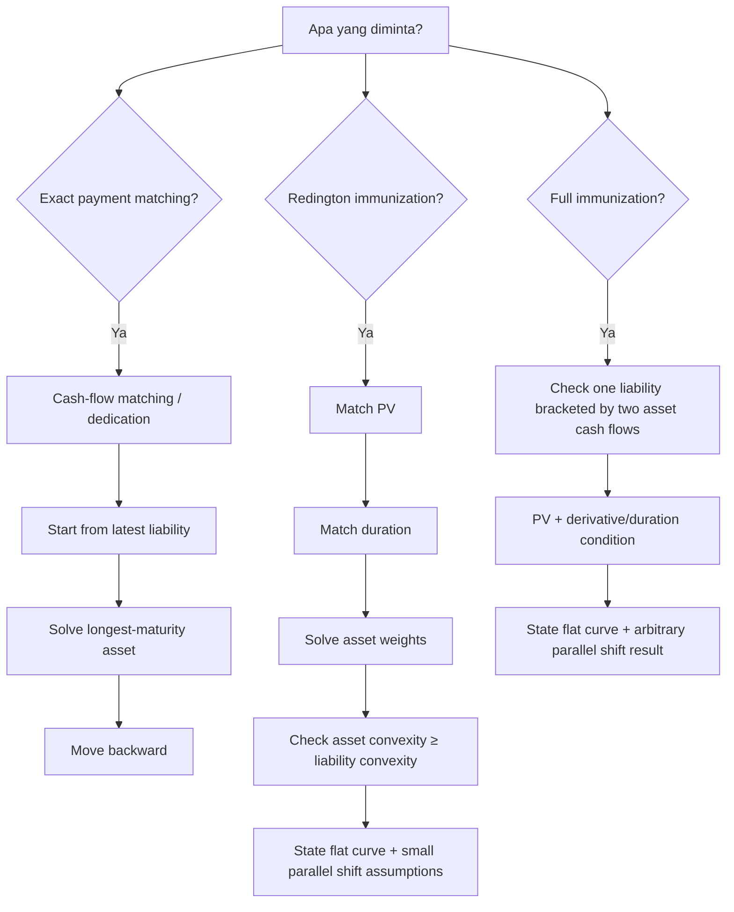

# 📘 3.5 — Immunization

> [!ABSTRACT] Ringkasan Cepat
> **Topik:** Immunization  
> **Bobot Parent Topic:** 20–30%  
> **Exam Priority:** Very High  
> **Difficulty:** Concept + Calculation  
> **Primary Skill:** Asset–Liability Management  
> **Inti:** Immunization adalah teknik untuk menyusun assets agar kewajiban tetap dapat dipenuhi ketika interest rates berubah. Dalam framework Vaaler:
>
> **Redington immunization**
>
> $$
> P_A=P_L,\qquad D_A=D_L,\qquad C_A\ge C_L,
> $$
>
> dengan asumsi **flat yield curve** dan **parallel shifts**; proteksi bersifat **local**, yaitu untuk perubahan rate yang sufficiently small.
>
> **Full immunization** lebih kuat pada struktur khusus: satu liability diapit oleh dua asset cash flows, dengan PV dan derivative/sensitivity matching.  
>
> **Cash-flow matching (dedication)** paling langsung: asset inflow pada setiap tanggal dibuat tepat sama dengan liability outflow pada tanggal tersebut.

## Section 0 — Pemetaan Silabus & Exam Scope

| Field | Isi |
|---|---|
| Topik CF1 | Topik 3 — Struktur Jangka Waktu Suku Bunga |
| Subtopik | 3.5 Immunization |
| Learning Outcome | Menjelaskan bagaimana duration dan convexity digunakan dalam immunization portofolio liabilities. |
| Skill Diuji | Membedakan cash-flow matching, Redington immunization, dan full immunization; menyusun PV matching; duration matching; convexity condition; menghitung asset allocation untuk single liability; memahami asumsi flat/parallel yield shifts dan kebutuhan rebalancing. |
| Bobot Parent Topic | 20–30% |
| Exam Priority | Very High |
| Prerequisite | PV, Macaulay duration, convexity, portfolio weighting, yield sensitivity |
| Connected Topics | [[3.3 Duration (Macaulay and Modified)]], [[3.4 Convexity]], [[3.2 Yield Curve]] |
| Referensi | Silabus CF1 Topik 3; Vaaler Bab 9 §9.1 & §9.4; Kellison Bab 10–11 sesuai silabus |

> [!IMPORTANT] Scope Boundary
> Prompt CF1 meminta agar **Redington immunization**, **full immunization**, dan **cash-flow matching** dibedakan bila didukung source. Vaaler mendukung ketiganya secara eksplisit. Karena scan Kellison yang tersedia tidak memberikan parsed text yang cukup andal untuk mengekstrak detail formulas tanpa risiko salah baca, note ini menggunakan Vaaler sebagai sumber formula dan worked examples utama, sambil tetap mempertahankan Kellison Bab 10–11 sebagai reference boundary sesuai silabus.

## Section 1 — Intuisi & Big Picture

Sebuah insurer atau pension fund memiliki:

- **assets** → future inflows;
- **liabilities** → future outflows.

Masalahnya bukan sekadar apakah nilai assets hari ini lebih besar dari liabilities. Ketika interest rates berubah:

- market value assets berubah;
- present value liabilities juga berubah;
- reinvestment opportunity berubah;
- surplus dapat membaik atau memburuk.

Tujuan immunization adalah membuat asset–liability position **tidak mudah berubah menjadi deficit** akibat perubahan interest rate dalam model yang digunakan.

### Surplus

Definisikan:

$$
S(i)
=
P_A(i)-P_L(i).
$$

Interpretasi:

- $S(i)>0$ → assets cukup untuk menutup liabilities;
- $S(i)=0$ → exact present-value balance;
- $S(i)<0$ → deficit.

Immunization berusaha membuat current point bukan sekadar titik dengan $S=0$, tetapi titik yang secara sensitivity tetap aman ketika rate bergeser.

### Mental Model

```text
Assets and liabilities
        ↓
Match present value
        ↓
Match first-order sensitivity
(duration)
        ↓
Control second-order sensitivity
(convexity)
        ↓
Protect surplus from rate changes
```

## Section 2 — Tiga Konsep yang Harus Dibedakan

| Method | Apa yang Dicocokkan? | Proteksi | Main Idea |
|---|---|---|---|
| **Cash-flow matching / dedication** | Cash flow amount dan timing secara langsung | Sangat langsung jika exact match tersedia | Setiap liability dibayar oleh asset inflow pada tanggal yang sama |
| **Redington immunization** | PV, duration, convexity condition | Small parallel shifts | Match value + slope, assets have enough curvature |
| **Full immunization** | Struktur khusus asset cash flows around liability + value/slope conditions | Arbitrary parallel shift dalam model Vaaler | Surplus nonnegative untuk semua rate selain current rate dalam setup khusus |

> [!DANGER] Jangan Samakan
> **Duration matching saja bukan Redington immunization.**  
> Redington membutuhkan:
>
> 1. PV assets = PV liabilities;
> 2. duration assets = duration liabilities;
> 3. convexity assets ≥ convexity liabilities.

## Section 3 — Cash-Flow Matching / Dedication

Vaaler menyebut asset-liability matching juga sebagai **dedication**.

Tujuan:

> asset inflows secara tepat meng-offset liability outflows pada setiap payment date.

Jika net cash flow di seluruh dates adalah nol, kebutuhan liability tidak bergantung pada menjual asset pada harga yang berubah akibat rate movements.

### General Structure

Untuk liability $L_t$ pada waktu $t$, pilih assets sehingga:

$$
A_t=L_t
$$

pada setiap liability date, setelah memperhitungkan coupons/redemptions asset yang jatuh pada tanggal yang sama.

### Strength

Cash-flow matching tidak bergantung pada approximation duration/convexity untuk cash flows yang sudah matched secara exact.

### Limitation

Exact matching dapat:

- sulit dilakukan;
- membutuhkan banyak securities;
- lebih mahal atau tidak tersedia untuk seluruh payment dates.

## Section 4 — Worked Example A: Cash-Flow Matching dari Vaaler

Sandy memiliki liabilities:

| Waktu | Liability |
|---:|---:|
| 0.5 tahun | $10,000 |
| 1.0 tahun | $15,000 |
| 1.5 tahun | $25,000 |

Available bonds:

1. 6-month zero-coupon bonds;
2. 12-month 6% par-value bonds dengan semiannual coupons;
3. 18-month 5% par-value bonds dengan semiannual coupons.

### Step 1 — Match Liability Terakhir

18-month bond coupon per half-year:

$$
\frac{5\%}{2}=2.5\%.
$$

Jika face amount-nya $F_{18}$, payment pada 18 bulan:

$$
1.025F_{18}.
$$

Set equal to $25,000:

$$
1.025F_{18}=25{,}000.
$$

Maka:

$$
F_{18}
\approx
24{,}390.24.
$$

Coupon setiap 6 bulan:

$$
0.025F_{18}
\approx
609.76.
$$

### Step 2 — Match Liability 12 Bulan

12-month 6% bond membayar 3% per half-year.

Pada 12 bulan, total inflow:

$$
1.03F_{12}+609.76.
$$

Set equal to $15,000:

$$
1.03F_{12}+609.76
=
15{,}000.
$$

Maka:

$$
F_{12}
\approx
13{,}971.11.
$$

Coupon 6 bulan:

$$
0.03F_{12}
\approx
419.13.
$$

### Step 3 — Match Liability 6 Bulan

Pada 6 bulan sudah ada coupons:

$$
609.76+419.13.
$$

Sisa liability harus dipenuhi 6-month zero coupon:

$$
F_{0.5}
+
609.76
+
419.13
=
10{,}000.
$$

Sehingga face amount zero coupon:

$$
\boxed{
F_{0.5}
\approx
8{,}971.11.
}
$$

### Key Lesson

Kerjakan **backward dari liability paling akhir**, karena maturity terpanjang biasanya hanya dapat dipenuhi oleh security dengan maturity yang cukup panjang. Coupons dari security tersebut kemudian menjadi known inflows untuk liability yang lebih awal.

> [!TIP] Shortcut
> Cash-flow matching:
>
> **latest liability first → solve longest asset → move backward.**

## Section 5 — Redington Immunization: Mathematical Conditions

Vaaler mendefinisikan net present value / surplus:

$$
S(i)=P_A(i)-P_L(i).
$$

Pada current yield $i_0$, Redington conditions adalah:

$$
\boxed{
S(i_0)=0
}
$$

$$
\boxed{
S'(i_0)=0
}
$$

$$
\boxed{
S''(i_0)\ge0
}
$$

Dengan Taylor expansion:

$$
S(i_0+h)
\approx
S(i_0)
+
S'(i_0)h
+
\frac{1}{2}S''(i_0)h^2.
$$

Karena dua term pertama nol:

$$
S(i_0+h)
\approx
\frac{1}{2}S''(i_0)h^2
\ge0.
$$

Untuk sufficiently small $h$, portfolio locally protected.

### Equivalent Financial Conditions

Vaaler Important Fact 9.4.3 menyatakan conditions di atas equivalent dengan:

$$
\boxed{
P_A=P_L
}
$$

$$
\boxed{
D_{\mathrm{Mac},A}=D_{\mathrm{Mac},L}
}
$$

$$
\boxed{
C_{\mathrm{Mac},A}\ge C_{\mathrm{Mac},L}
}
$$

dengan assumptions:

- yield curve flat;
- shifts yield curve parallel;
- cash flows fixed dalam framework yang digunakan.

## Section 6 — Mengapa Tiga Conditions Itu Masuk Akal?

### Condition 1 — Present Value Match

$$
P_A=P_L.
$$

Artinya current funding tepat balance.

Kalau condition ini gagal, sudah ada surplus/deficit pada current rate sebelum membahas sensitivity.

### Condition 2 — Duration Match

$$
D_A=D_L.
$$

Duration terkait first derivative / slope. Matching duration membuat first-order response assets dan liabilities sama.

Secara local:

$$
\Delta P_A
\approx
\Delta P_L.
$$

### Condition 3 — Asset Convexity Tidak Lebih Kecil

$$
C_A\ge C_L.
$$

Setelah price dan slope match, higher/equal asset convexity membuat asset value memiliki curvature yang cukup untuk menjaga surplus nonnegative secara second-order.

### Feynman Picture

Bayangkan dua curves bertemu di titik yang sama:

1. **same height** → PV match;
2. **same slope** → duration match;
3. **asset curve bends at least as much upward** → convexity condition.

## Section 7 — Worked Example B: Redington Immunization dari Vaaler

Alan and Peabody Insurance harus membayar:

$$
120{,}000
$$

tepat 4 tahun lagi.

Mereka membeli:

- 2-year zero-coupon bonds;
- 5-year zero-coupon bonds;

masing-masing priced to yield 4.5% annual effective.

Let:

- $a$ = amount spent on 2-year zero coupons;
- $b$ = amount spent on 5-year zero coupons.

### Step 1 — Present Value Match

PV liability:

$$
P_L
=
\frac{120{,}000}{(1.045)^4}
\approx
100{,}627.36.
$$

Maka:

$$
\boxed{
a+b=100{,}627.36.
}
$$

### Step 2 — Duration Match

Zero-coupon Macaulay durations:

$$
D_2=2,
\qquad
D_5=5.
$$

Liability tunggal di tahun 4:

$$
D_L=4.
$$

Portfolio asset duration:

$$
D_A
=
2\frac{a}{a+b}
+
5\frac{b}{a+b}.
$$

Set:

$$
D_A=4.
$$

Maka:

$$
2a+5b
=
4(a+b).
$$

Sehingga:

$$
b=2a.
$$

Gabungkan dengan:

$$
a+b=100{,}627.36.
$$

Maka:

$$
3a=100{,}627.36.
$$

Jadi:

$$
\boxed{
a\approx33{,}542.45
}
$$

dan:

$$
\boxed{
b\approx67{,}084.91.
}
$$

### Step 3 — Convexity Check

Zero-coupon Macaulay convexities:

$$
C_2=2^2=4,
$$

$$
C_5=5^2=25.
$$

Liability convexity:

$$
C_L=4^2=16.
$$

Asset convexity:

$$
C_A
=
\frac{a}{a+b}(4)
+
\frac{b}{a+b}(25).
$$

Dengan weights kira-kira $1/3$ dan $2/3$:

$$
C_A
\approx
\frac13(4)+\frac23(25)
=
18.
$$

Karena:

$$
18>16,
$$

portfolio memenuhi Redington immunization.

> [!SUCCESS] Core Exam Pattern
> Untuk single liability dan dua zero-coupon assets:
>
> 1. **PV equation**;
> 2. **duration equation**;
> 3. solve allocations;
> 4. **convexity check**.

## Section 8 — Bagaimana Redington Membantu?

Vaaler menguji portfolio di atas untuk small rate shifts.

2-year bond redemption pada tahun 2:

$$
33{,}542.45(1.045)^2
\approx
36{,}629.19.
$$

5-year bond redemption:

$$
67{,}084.91(1.045)^5
\approx
83{,}600.
$$

### Jika Rate Naik ke 5% pada Tahun 2

5-year bond masih punya 3 tahun sampai maturity, sehingga value pada tahun 2:

$$
\frac{83{,}600}{(1.05)^3}
\approx
72{,}216.82.
$$

Total available at year 2:

$$
36{,}629.19+72{,}216.82
=
108{,}846.01.
$$

Invest 2 years at 5%:

$$
108{,}846.01(1.05)^2
\approx
120{,}002.73.
$$

Masih cukup untuk liability $120,000$.

### Jika Rate Turun ke 4%

Value 5-year bond pada year 2:

$$
\frac{83{,}600}{(1.04)^3}
\approx
74{,}320.10.
$$

Total:

$$
36{,}629.19+74{,}320.10
=
110{,}949.29.
$$

Accumulate 2 years:

$$
110{,}949.29(1.04)^2
\approx
120{,}002.75.
$$

Juga cukup.

### Interpretation

Saat rates naik:

- long asset market value turun;
- tetapi reinvestment rate meningkat.

Saat rates turun:

- long asset market value naik;
- tetapi reinvestment rate menurun.

Duration matching menyeimbangkan dua effects ini secara local.

## Section 9 — Full Immunization

Vaaler kemudian mempertimbangkan struktur khusus:

- single liability $L$ pada waktu $T$;
- asset $U$ pada waktu $T-u$;
- asset $W$ pada waktu $T+w$;

dengan:

$$
0<u<T,
\qquad
w>0.
$$

Jadi liability berada **di antara** dua asset cash flows.

Dengan force of interest $\delta$, surplus:

$$
S(\delta)
=
Ue^{-\delta(T-u)}
-
Le^{-\delta T}
+
We^{-\delta(T+w)}.
$$

Jika pada current force $\delta_0$:

$$
S(\delta_0)=0
$$

dan:

$$
S'(\delta_0)=0,
$$

maka Vaaler Important Fact 9.4.6 menyatakan:

$$
\boxed{
S(\delta)>0
\quad
\text{untuk }
\delta\ne\delta_0.
}
$$

Ini disebut **full immunization** untuk struktur tersebut.

### Important Difference from Redington

Redington:

- local;
- sufficiently small parallel shifts;
- explicitly uses convexity condition.

Full immunization Vaaler:

- structure khusus single liability diapit dua assets;
- PV and first-derivative matching cukup untuk theorem tersebut;
- memberikan protection terhadap arbitrary parallel changes dalam flat-yield framework.

> [!WARNING] Jangan Generalisasi Berlebihan
> Full immunization theorem ini bergantung pada **specific cash-flow structure dan assumptions**. Jangan menganggap “PV + duration match” selalu menjamin full immunization untuk arbitrary portfolio.

## Section 10 — Worked Example C: Full Immunization

Portfolio Redington Example B ternyata juga memenuhi setup full immunization:

- liability pada year 4;
- asset pada year 2;
- asset pada year 5.

Current yield = 4.5%.

Vaaler menguji large rate changes.

### Rate Naik ke 10%

At year 2, 5-year bond dengan redemption $83,600$ dan 3 tahun tersisa bernilai:

$$
\frac{83{,}600}{(1.10)^3}
\approx
62{,}809.92.
$$

Add 2-year bond redemption:

$$
36{,}629.19+62{,}809.92
=
99{,}439.11.
$$

Accumulate 2 years at 10%:

$$
99{,}439.11(1.10)^2
\approx
120{,}321.32.
$$

Liability tetap dapat dibayar.

### Rate Turun ke 1%

At year 2:

$$
\frac{83{,}600}{(1.01)^3}
\approx
81{,}141.34.
$$

Add:

$$
36{,}629.19+81{,}141.34
=
117{,}770.53.
$$

Accumulate 2 years at 1%:

$$
117{,}770.53(1.01)^2
\approx
120{,}137.72.
$$

Liability juga tetap dapat dibayar.

> [!SUCCESS] Lesson
> Dalam struktur full immunization ini, protection tidak hanya untuk ±50 bp tetapi juga rate changes yang jauh lebih besar dalam model flat/parallel shift yang diasumsikan.

## Section 11 — Redington vs Full vs Cash-Flow Matching

| Feature | Cash-Flow Matching | Redington | Full Immunization |
|---|---|---|---|
| Match actual payment dates? | Ya, exact | Tidak wajib | Tidak wajib |
| PV match | Implied jika fully matched | Wajib | Wajib |
| Duration match | Tidak perlu sebagai separate condition | Wajib | Equivalent slope condition |
| Convexity condition | Tidak perlu | Asset convexity ≥ liability convexity | Tidak menjadi separate condition dalam theorem khusus Vaaler |
| Rate movement protected | Exact cash flows tidak bergantung pada repricing untuk matched dates | Small parallel shifts | Arbitrary parallel shifts dalam structure khusus |
| Yield curve assumption | Tidak perlu flat untuk exact contractual matching | Flat + parallel shifts | Flat + parallel shifts |
| Rebalancing | Bisa tetap diperlukan jika portfolio berubah/prepayments etc. | Ya | Ya, seiring waktu structure/sensitivity berubah |

## Section 12 — Rebalancing Risk

Vaaler menegaskan bahwa immunized status tidak permanen.

Dengan berjalannya waktu:

- durations assets turun;
- duration liability turun;
- weights berubah;
- asset prices berubah;
- derivative condition dapat tidak lagi terpenuhi.

Karena itu portfolio harus **frequently rebalanced** untuk mempertahankan immunization.

> [!IMPORTANT] Exam Interpretation
> Immunization adalah **dynamic asset-liability strategy**, bukan “set once and forget forever”.

## Section 13 — Model Assumptions & Limitations

Vaaler secara eksplisit memperingatkan bahwa Redington dan full immunization dibangun pada simplifying assumption:

> yield curve flat dan perubahan yield adalah parallel shift menuju flat curve baru.

Ini tidak realistis secara penuh.

Dalam real term structure:

- spot rates berbeda menurut maturity;
- curve dapat steepen/flatten;
- shifts dapat nonparallel;
- cash flows tertentu dapat interest-sensitive.

Vaaler mengaitkan risiko perubahan shape yield curve dengan **C3 risk / C-3 risk**.

### Exam Boundary

Untuk CF1:

- pahami assumptions;
- jangan mengklaim duration/convexity immunization melindungi dari semua bentuk yield-curve movement;
- jika soal memberikan spot curve dan nonparallel changes, simple one-yield Redington framework tidak boleh diterapkan diam-diam.

## Section 14 — Why Flat-Curve Assumption Matters

Dalam simplified model, seluruh cash flows didiskontokan dengan satu yield variable $i$.

Karena itu:

$$
S=S(i)
$$

adalah function satu variable.

Duration dan convexity dapat match first dan second derivative terhadap rate tersebut.

Jika setiap maturity memiliki spot rate sendiri:

$$
S=S(s_1,s_2,\ldots,s_n),
$$

risiko menjadi multidimensional. Satu duration number tidak menangkap seluruh movements.

Ini menjelaskan connection kuat dengan [[3.2 Yield Curve]].

## Section 15 — Exam-Safe Workflow: Redington Problem

Jika soal memberi liability stream dan candidate assets:

### Step 1 — Value Assets dan Liabilities pada Current Yield

$$
P_A
=
\sum PV(\text{asset cash flows}),
$$

$$
P_L
=
\sum PV(\text{liability cash flows}).
$$

Impose:

$$
P_A=P_L.
$$

### Step 2 — Compute Duration

$$
D_A
=
\sum_k
\frac{P_k}{P_A}D_k.
$$

$$
D_L
=
\sum_j
\frac{L_j^{PV}}{P_L}D_j.
$$

Impose:

$$
D_A=D_L.
$$

### Step 3 — Solve Asset Amounts / Weights

Biasanya dua equations:

- PV matching;
- duration matching.

### Step 4 — Check Convexity

$$
C_A
=
\sum_k
\frac{P_k}{P_A}C_k.
$$

Require:

$$
C_A\ge C_L.
$$

### Step 5 — State Assumptions

Mention:

- flat yield curve;
- parallel shift;
- small change for Redington;
- fixed cash flows.

## Section 16 — Shortcut untuk Single Liability + Two Zero-Coupon Assets

Suppose:

- liability maturity = $T$;
- early zero-coupon asset maturity = $t_1<T$;
- late zero-coupon asset maturity = $t_2>T$;
- current PV liability = $V_L$;
- amount invested today in assets = $a$ and $b$.

Equations:

$$
a+b=V_L,
$$

$$
t_1a+t_2b
=
TV_L.
$$

Dari dua equations:

$$
\boxed{
a
=
V_L\frac{t_2-T}{t_2-t_1}
}
$$

$$
\boxed{
b
=
V_L\frac{T-t_1}{t_2-t_1}
}
$$

Ini berasal langsung dari present-value weights yang membuat weighted-average duration = $T$.

### Convexity

Untuk zero coupons:

$$
C_A
=
\frac{a}{V_L}t_1^2
+
\frac{b}{V_L}t_2^2.
$$

Liability:

$$
C_L=T^2.
$$

Jika asset maturities **straddle** liability maturity:

$$
t_1<T<t_2,
$$

asset timing memiliki dispersion di sekitar $T$, sehingga convexity dapat melebihi liability convexity—seperti pada Vaaler Example 9.4.4.

> [!TIP] Exam Shortcut
> Single liability + two zeros:
>
> **PV → duration weighted average → convexity check.**

## Section 17 — Common Traps

### Trap 1 — Duration Matching = Immunized

> [!BUG]
> Salah:
>
> $$
> D_A=D_L
> \Rightarrow
> \text{Redington immunized}.
> $$
>
> Belum cukup. Harus ada:
>
> $$
> P_A=P_L
> $$
>
> dan:
>
> $$
> C_A\ge C_L.
> $$

### Trap 2 — Convexity Equality Wajib

Redington meminta:

$$
C_A\ge C_L,
$$

bukan harus selalu equality.

### Trap 3 — Modified vs Macaulay Mixing

Vaaler menyatakan equality first derivative dapat dinyatakan dengan same kind of duration. Jika menggunakan portfolio duration condition, jangan memakai Macaulay untuk assets dan modified untuk liabilities.

Gunakan jenis duration yang konsisten.

### Trap 4 — Face-Value Weights

Duration/convexity portfolio memakai **present-value / market-value weights**, bukan face amounts, kecuali securities adalah zero coupons dan variable yang didefinisikan memang amounts spent hari ini seperti pada Example 9.4.4.

### Trap 5 — Redington Menjamin Semua Rate Changes

Tidak. Redington hanya memberikan local protection untuk sufficiently small $h$ dalam assumptions model.

### Trap 6 — Full Immunization General Rule

Vaaler full immunization theorem memiliki cash-flow structure khusus. Jangan generalisasikan tanpa conditions.

### Trap 7 — Ignore Rebalancing

Portfolio yang immunized sekarang tidak otomatis tetap immunized satu tahun kemudian.

### Trap 8 — Ignore Curve Shape Risk

Parallel shift bukan satu-satunya possible yield-curve movement.

## Section 18 — Verification & Sanity Checks

> [!CHECK] Sanity Check
> - Present values match?
>
> $$
> P_A=P_L.
> $$
>
> - Durations match?
>
> $$
> D_A=D_L.
> $$
>
> - Convexity condition satisfied?
>
> $$
> C_A\ge C_L.
> $$
>
> - Portfolio asset weights sum to 1?
> - For a single liability at $T$, duration liability should equal $T$.
> - For a zero-coupon asset at maturity $t$, Macaulay duration = $t$ and convexity = $t^2$.
> - If two zero-coupon assets bracket $T$, duration weights should lie between 0 and 1.
> - Redington answer must mention small parallel shift assumption.
> - Full immunization answer must mention structural assumptions.
> - Cash-flow matching should reconcile every liability date exactly.

## Section 19 — Formula Map

| Concept | Formula / Condition | Meaning |
|---|---|---|
| Surplus | $S(i)=P_A(i)-P_L(i)$ | Funding position |
| Redington current value | $S(i_0)=0$ | PV match |
| Redington slope | $S'(i_0)=0$ | Duration match |
| Redington curvature | $S''(i_0)\ge0$ | Asset convexity ≥ liability convexity |
| Financial Redington | $P_A=P_L,\ D_A=D_L,\ C_A\ge C_L$ | Core exam conditions |
| Portfolio duration | $D_A=\sum w_kD_k$ | $w_k=$ market-value weights |
| Portfolio convexity | $C_A=\sum w_kC_k$ | Same value weights |
| Single zero liability | $D_L=T,\ C_L=T^2$ | Fast special case |
| Full immunization | $S(\delta_0)=0,\ S'(\delta_0)=0$ + structural conditions | Surplus positive for $\delta\ne\delta_0$ |
| Cash-flow matching | $A_t=L_t$ at each date | Exact dedication |

## Section 20 — Quick Decision Tree



## Section 21 — Active Recall Check

1. Apa objective utama immunization?
2. Definisikan surplus $S(i)$.
3. Sebutkan tiga financial conditions Redington immunization.
4. Mengapa PV matching saja tidak cukup?
5. Apa role duration matching?
6. Apa role convexity condition?
7. Mengapa Redington hanya local?
8. Apa assumptions utama Redington?
9. Bedakan cash-flow matching dan Redington.
10. Mengapa cash-flow matching dikerjakan backward dari liability terakhir?
11. Apa structural condition utama full immunization Vaaler?
12. Mengapa full immunization tidak boleh digeneralisasikan menjadi “PV + duration selalu cukup”?
13. Mengapa rebalancing diperlukan?
14. Untuk single liability pada $T$, berapa Macaulay duration dan convexity?
15. Jika assets adalah two zero coupons pada $t_1<T<t_2$, tulis dua equations untuk menentukan amounts invested.
16. Dalam Vaaler Example 9.4.4, mengapa $b=2a$?
17. Mengapa convexity asset Example 9.4.4 lebih besar dari liability?
18. Apa risiko yang tidak tertangkap oleh parallel-shift model?
19. Mengapa spot-rate framework membuat immunization lebih kompleks?
20. Apa perbedaan “small change protection” dan “arbitrary change protection”?

## Section 22 — Exam Pattern Map

[TEXTBOOK-BASED EXPECTATION]

| Narasi Soal | Keyword | Konsep | Langkah | Trap | Shortcut |
|---|---|---|---|---|---|
| Liability tunggal + 2 zero bonds | “immunize” | Redington | PV → duration → convexity | duration only | weighted-average maturity |
| Assets/liabilities cash flows | “Redington condition” | ALM sensitivity | compute $P,D,C$ each side | mix Mac/Mod | use one duration convention |
| Small parallel shift | “immunized” | Redington | check local conditions | claim global guarantee | state assumptions |
| Liability bracketed by two asset flows | “full immunization” | full immunization | value + slope match | overgeneralize | identify structure |
| Several liabilities + matching bonds | “exactly match” | dedication | work backward | start earliest | latest liability first |
| One liability at time $T$ | zero liability stream | duration/convexity | $D=T,\ C=T^2$ | recalculate unnecessarily | direct |
| Portfolio weights | “duration/convexity assets” | weighted average | price weights | face weights | value weights |
| Time passes after setup | “still immunized?” | rebalancing | recompute sensitivities | assume permanent | immunization is dynamic |

## Section 23 — Source Traceability

| Materi | Sumber |
|---|---|
| Scope immunization CF1 | Silabus CF1 Topik 3 |
| Asset-liability management and distinction Redington/full | Vaaler Bab 9 introduction |
| Cash-flow matching / dedication | Vaaler Example 9.1.2 |
| Surplus function and Redington derivative conditions | Vaaler §9.4 |
| $S(i_0)=0$, $S'(i_0)=0$, $S''(i_0)\ge0$ | Vaaler Condition 9.4.2 |
| Equivalent PV-duration-convexity conditions | Vaaler Important Fact 9.4.3 |
| Redington worked example, $120,000$ liability | Vaaler Example 9.4.4 |
| Coupon-bond variant | Vaaler Example 9.4.5 |
| Full immunization theorem | Vaaler Important Fact 9.4.6 |
| Large-shift illustration | Vaaler Example 9.4.7 |
| Need for rebalancing | Vaaler §9.4 |
| Limitations: flat curve, parallel shifts, C3 risk | Vaaler Bab 9 / §9.4 |
| Kellison reference boundary | Kellison Bab 10–11 sesuai silabus; detailed scan extraction tidak cukup reliable untuk menambahkan formula spesifik tanpa risiko keluar dari source |

---

> [!QUOTE] Follow-up Options
> 1. *"Uji saya dengan soal immunization"*
> 2. *"Buat cheat sheet Topik 3 lengkap"*
> 3. *"Lanjut ke Topik 4"*

*📖 Ref: Vaaler Bab 9 §9.1 & §9.4; Kellison Bab 10–11 sesuai silabus | 🗓️ 2026-08-25 | #CF1 #MatematikaKeuangan*
