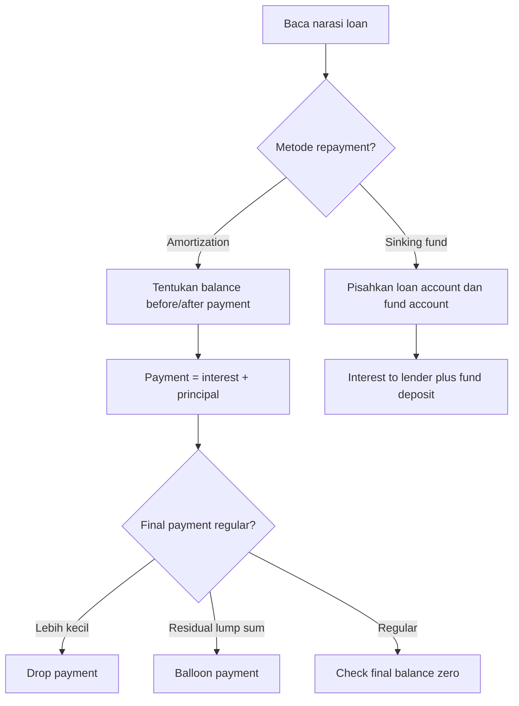

# 📘 4.1 — Loan Terminology

> [!ABSTRACT] Ringkasan Cepat
> **Topik:** Loan Terminology  
> **Bobot Parent Topic:** 5–15%  
> **Exam Priority:** Medium  
> **Difficulty:** Mixed  
> **Primary Skill:** Mixed  
> **Ref:** Vaaler Bab 5; Kellison Bab 5

## Section 0 — Pemetaan Silabus & Exam Scope

| Field | Isi |
|---|---|
| Topik CF1 | Topik 4 — Pengembalian Pinjaman |
| Subtopik | 4.1 Loan Terminology |
| Learning Outcome | Memahami dan membedakan pokok pinjaman, bunga, jangka waktu pinjaman, sisa pinjaman, pembayaran terakhir (*drop payment* dan *balloon payment*), amortisasi, dan *sinking fund*. |
| Skill Diuji | Menerjemahkan narasi pinjaman menjadi cash-flow structure, membedakan payment vs interest vs principal, membaca balance sebelum/sesudah payment, serta mengenali metode pelunasan yang digunakan. |
| Bobot Parent Topic | 5–15% |
| Exam Priority | Medium |
| Prerequisite | TVM, effective periodic rate, equation of value, annuity-immediate |
| Connected Topics | [[4.2 Amortization Method]], [[4.3 Sinking Fund Method]], [[2.1 Annuity-Immediate and Annuity-Due]], [[5.2 Book Value, Premium and Discount Amortization]] |
| Referensi | Silabus CF1 Topik 4; Vaaler Bab 5; Kellison Bab 5 |

> [!IMPORTANT] Scope Boundary
> [CORE CF1] Subtopik ini adalah **bahasa dasar loan repayment**. Yang harus dikuasai adalah arti dan hubungan antara **original principal, interest, payment, principal portion, outstanding loan balance, term, amortization, sinking fund, drop payment, dan balloon payment**.
>
> Formula rinci untuk membangun amortization schedule, metode prospektif/retrospektif secara penuh, serta pola principal-interest antar-payment dibahas di [[4.2 Amortization Method]]. Mechanics setoran dan akumulasi dana terpisah dibahas di [[4.3 Sinking Fund Method]]. Di sini formula digunakan hanya sejauh diperlukan untuk membuat terminologi menjadi operasional.

---

## Section 1 — Intuisi & Big Picture

Bayangkan seseorang meminjam uang untuk membeli rumah. Pada hari pinjaman diberikan, borrower menerima sejumlah uang dari lender. Setelah itu borrower melakukan pembayaran sesuai kontrak. Namun setiap pembayaran tidak otomatis berarti seluruh jumlah tersebut mengurangi utang pokok. Sebagian pembayaran biasanya merupakan **bunga atas penggunaan uang lender**, dan sisanya baru mengurangi jumlah yang masih terutang.

Karena itu, soal loan hampir selalu memiliki dua lapisan. Lapisan pertama adalah **cash flow**: berapa uang dipinjam, kapan pembayaran dilakukan, berapa rate, dan kapan pinjaman selesai. Lapisan kedua adalah **accounting of the loan balance**: dari setiap payment, berapa yang merupakan interest, berapa yang merupakan principal repayment, dan berapa outstanding balance setelah payment tersebut.

Ada dua struktur pelunasan utama dalam Bab 5. Pada **amortization method**, borrower secara bertahap mengurangi outstanding balance melalui pembayaran yang berisi interest dan principal. Pada **sinking fund method**, borrower biasanya tetap membayar interest atas loan, tetapi principal dipersiapkan melalui rekening terpisah yang diakumulasi sampai cukup untuk melunasi loan pada akhir term. Vaaler dan Kellison sama-sama menekankan distinction ini sebagai fondasi sebelum melakukan perhitungan lebih lanjut.

---

## Section 2 — Definisi & Core Concepts

### Definisi Formal

> [!NOTE] Definisi Formal
> Sebuah **loan** adalah transaksi ketika lender menyerahkan suatu amount pada awal kontrak dan borrower berkewajiban melakukan satu atau lebih pembayaran di masa depan sehingga, pada interest basis yang disepakati, nilai pembayaran tersebut equivalent dengan amount yang dipinjam.
>
> Untuk amortized loan, setiap payment dapat dipisahkan menjadi
>
> $$
> \boxed{R_t=I_t+P_t}
> $$
>
> dengan $R_t$ = total payment ke-$t$, $I_t$ = interest portion, dan $P_t$ = principal portion.

### Terminologi Penting

| Istilah / Simbol | Definisi | Intuisi | Exam Note |
|---|---|---|---|
| **Loan principal / original loan amount** $L$ | Amount yang dipinjam pada inception | Utang pokok awal | Jangan tertukar dengan *principal portion* suatu payment |
| **Interest** | Kompensasi kepada lender atas penggunaan outstanding capital | Biaya penggunaan uang | Pada amortized loan, dihitung atas balance yang masih terutang untuk interval terkait |
| **Payment / installment** $R_t$ | Total cash payment borrower pada tanggal pembayaran | Cash outflow borrower | Payment dapat terdiri dari interest + principal |
| **Principal portion** $P_t$ | Bagian payment yang benar-benar mengurangi loan balance | Pelunasan pokok | $P_t=R_t-I_t$ |
| **Term** | Lama waktu dari inception sampai contractual repayment selesai | Umur pinjaman | Harus dibedakan dari number of payments jika frequency bukan tahunan |
| **Outstanding loan balance** $B_t$ | Amount yang masih terutang pada suatu waktu tertentu | “Jika dilunasi secara actuarially fair saat ini, berapa nilai utangnya?” | Selalu tanyakan: sebelum atau sesudah payment? |
| **Amortization** | Proses membayar kembali loan melalui installments yang secara bertahap mengurangi principal | Pokok turun dari waktu ke waktu | Detail di [[4.2 Amortization Method]] |
| **Amortization schedule** | Tabel payment, interest, principal, dan balance menurut waktu | Peta evolusi loan | Kolom paling penting: payment, interest, principal, balance |
| **Drop payment** | Final payment yang **lebih kecil** daripada level payment reguler karena hanya amount tersisa yang perlu dilunasi | “Payment terakhir dipotong turun” | Umumnya muncul karena exact level payment tidak membagi payoff menjadi integer number of identical payments |
| **Balloon payment** | Final/additional payment yang **lebih besar** daripada regular scheduled payment untuk melunasi balance yang masih tersisa | “Sisa besar dibayar sekaligus di akhir” | Sering muncul jika regular payments terlalu kecil untuk fully amortize loan pada term |
| **Sinking fund** | Rekening terpisah tempat borrower mengakumulasi dana untuk membayar principal pada akhir term | Principal “dikumpulkan di samping” loan | Loan balance dan fund balance adalah dua account berbeda |

### Core Relationship 1 — Payment = Interest + Principal

Untuk amortized loan:

$$
R_t=I_t+P_t.
$$

Sehingga:

$$
P_t=R_t-I_t.
$$

Jika $B_{t-1}$ adalah outstanding balance **immediately after payment ke-$(t-1)$**, dan $i$ adalah effective rate per payment period, maka interest yang accrued menuju payment ke-$t$ adalah

$$
I_t=iB_{t-1}.
$$

Maka principal portion adalah

$$
P_t=R_t-iB_{t-1}.
$$

Setelah payment ke-$t$:

$$
B_t=B_{t-1}-P_t.
$$

Equivalently,

$$
\boxed{B_t=B_{t-1}(1+i)-R_t.}
$$

> [!IMPORTANT] Timing
> $B_{t-1}$ di atas adalah balance **setelah** payment sebelumnya. Selama satu period, balance itu accrue interest menjadi $B_{t-1}(1+i)$ tepat sebelum payment berikutnya. Setelah payment $R_t$, tersisa $B_t$.

### Core Relationship 2 — Outstanding Balance sebagai Nilai Future Payments

Kellison mendefinisikan outstanding loan balance melalui dua perspective yang equivalent:

- **Prospective:** present value pada waktu $t$ dari payments yang masih harus dilakukan.
- **Retrospective:** accumulated value pada waktu $t$ dari original loan dikurangi accumulated value dari payments yang sudah dilakukan.

Secara konseptual:

$$
\boxed{\text{Prospective Balance}=\text{Retrospective Balance}.}
$$

Untuk level-payment loan dengan $n$ total payments, jika $B_t$ berarti balance immediately after payment ke-$t$ dan masih ada $n-t$ payments sebesar $R$:

$$
B_t=R\,a_{\overline{n-t}|i}.
$$

Formula ini hanya menjadi preview untuk [[4.2 Amortization Method]]; poin terminologinya adalah bahwa **outstanding balance adalah nilai dari obligation yang masih tersisa**, bukan total nominal remaining payments.

### Core Relationship 3 — Total Interest

Jika loan fully repaid dan tidak ada fees atau cash flows lain, total principal repaid selama kontrak sama dengan original loan amount $L$. Karena setiap payment terdiri dari principal + interest:

$$
\boxed{\text{Total Interest}=\text{Total Payments}-L.}
$$

Formula ini berguna sebagai identity/check, tetapi hanya jika seluruh cash flows yang relevan memang hanya loan proceeds dan repayment payments.

### Core Relationship 4 — Drop Payment

Misalkan setelah beberapa regular payments masih ada balance $B_k$ immediately after payment ke-$k$. Jika loan dilunasi satu period kemudian, maka amount yang harus dibayar pada waktu $k+1$ adalah

$$
R_{\text{final}}=B_k(1+i).
$$

Jika amount ini lebih kecil daripada regular payment $R$, maka ia merupakan **drop payment**.

Vaaler menampilkan pola ini pada loan dengan level payments yang diikuti final payment sedikit lebih kecil karena rounding/exact payoff.

### Core Relationship 5 — Balloon Payment

Jika regular scheduled payments tidak cukup untuk mengurangi balance menjadi nol pada maturity, masih terdapat residual balance. Payment tambahan/final yang melunasi residual tersebut disebut **balloon payment**.

Jika $B_{n-1}$ adalah balance setelah penultimate scheduled payment dan maturity satu period kemudian, final amount yang melunasi seluruh loan adalah

$$
B_{n-1}(1+i).
$$

Jika kontrak juga memiliki regular scheduled payment $R_n$ pada maturity, **additional balloon** dapat dipandang sebagai selisih antara total payoff yang diperlukan dan regular payment tersebut, tergantung wording kontrak.

> [!IMPORTANT] Drop vs Balloon
> Keduanya adalah **irregular final cash flow**, tetapi arahnya berbeda terhadap payment reguler:
>
> - **drop payment:** final payment lebih kecil;
> - **balloon payment:** final payment lebih besar atau ada tambahan lump sum di akhir.

### Core Relationship 6 — Sinking Fund Structure

Dalam sinking fund method, dua cash-flow streams harus dipisahkan:

1. interest dibayar kepada lender atas principal loan;
2. deposit dibuat ke sinking fund yang terpisah.

Jika original loan $L$ tetap outstanding sampai maturity dan loan rate adalah $i$, periodic loan interest adalah

$$
iL.
$$

Jika deposit sinking fund adalah $D$ dan fund earns rate $j$, targetnya adalah mengakumulasi fund menjadi $L$ pada akhir term:

$$
D\,s_{\overline{n}|j}=L
$$

untuk level end-of-period deposits.

Detail calculation berada di [[4.3 Sinking Fund Method]]. Di 4.1, yang penting adalah **jangan menganggap sinking fund deposit sebagai principal payment langsung kepada lender**.

---

## Section 3 — How It Works

### Framework Utama untuk Membaca Narasi Loan

```text
Siapa borrower dan lender?
↓
Berapa original loan amount?
↓
Apa rate dan period basis-nya?
↓
Kapan payments terjadi?
↓
Metode repayment: amortization atau sinking fund?
↓
Jika amortization: payment = interest + principal
↓
Tentukan balance sebelum / sesudah payment
↓
Apakah final payment regular, drop, atau balloon?
↓
Verify loan berakhir dengan balance 0
```

### Langkah 1 — Tentukan Perspective

Dari borrower perspective:

- loan proceeds pada awal adalah cash inflow;
- repayments adalah cash outflows.

Dari lender perspective tanda cash flow terbalik. Nilai ekonomi transaksi sama; yang berubah hanya sign convention.

### Langkah 2 — Pisahkan Tiga Quantity yang Sering Tertukar

Pada satu payment date, ada tiga angka berbeda:

1. **payment amount** $R_t$;
2. **interest portion** $I_t$;
3. **principal portion** $P_t$.

Hubungannya:

$$
R_t=I_t+P_t.
$$

Jika soal mengatakan “bunga pada pembayaran ketiga”, yang diminta adalah $I_3$, bukan rate $i$, bukan total payment $R_3$, dan bukan principal $P_3$.

### Langkah 3 — Tentukan Status Balance terhadap Payment Date

Untuk payment ke-$t$:

| Titik waktu | Quantity |
|---|---|
| Immediately after payment $t-1$ | $B_{t-1}$ |
| Immediately before payment $t$ | $B_{t-1}(1+i)$ |
| Payment $t$ | $R_t$ |
| Immediately after payment $t$ | $B_t=B_{t-1}(1+i)-R_t$ |

Perbedaan “before” vs “after” adalah salah satu sumber terbesar off-by-one error pada loan problems.

### Langkah 4 — Kenali Struktur Repayment

**Amortization method:** balance lender turun karena principal portion setiap payment langsung mengurangi loan.

**Sinking fund method:** principal loan biasanya tetap outstanding, sementara account terpisah tumbuh untuk menyediakan repayment principal di maturity.

### Langkah 5 — Baca Final Payment dari Wording

- “level payments followed by a slightly reduced final payment” → **drop payment**.
- “regular payments plus a final lump sum to repay the remaining balance” → **balloon payment**.
- “loan fully amortized by equal payments” → secara ideal final balance nol setelah last payment; jika rounding currency membuat exact level amount impossible, final payment dapat sedikit disesuaikan.

> [!TIP] Cara Berpikir
> Jangan mulai dari formula. Tulis dulu empat label pada setiap payment: **balance before → interest → payment → balance after**. Hampir seluruh mechanics amortization tumbuh dari satu urutan ini.

> [!DANGER] Jangan Salah Pikir
> 1. **Principal loan** bukan **principal portion**. Yang pertama adalah amount awal/remaining debt; yang kedua adalah bagian satu payment yang mengurangi debt.
> 2. Outstanding balance bukan jumlah nominal semua payments tersisa; ia adalah **value pada valuation date** dari obligation tersisa.
> 3. Interest portion bukan payment dikali rate. Interest dihitung dari **outstanding balance yang relevan**.
> 4. Sinking fund balance bukan outstanding loan balance; keduanya berada pada account berbeda.
> 5. Drop dan balloon bukan sinonim. Arah irregularity terhadap regular payment berbeda.

---

## Section 4 — Worked Examples & Exam Cases

### Case A — Fundamental: Membagi Payment menjadi Interest dan Principal

**Soal**

Sebuah loan sebesar $20{,}000$ memiliki effective annual interest rate $5\%$. Pada akhir tahun pertama borrower membayar $8{,}000$. Tentukan interest portion, principal portion, dan outstanding balance immediately after payment.

> [!SUCCESS] Pembahasan
>
> **1. Struktur**
>
> Original loan:
>
> $$
> L=20{,}000.
> $$
>
> Rate sudah annual effective dan payment terjadi setahun kemudian, jadi basis rate sesuai.
>
> **2. Interest selama tahun pertama**
>
> $$
> I_1=0.05(20{,}000)=1{,}000.
> $$
>
> **3. Principal portion**
>
> $$
> P_1=8{,}000-1{,}000=7{,}000.
> $$
>
> **4. Outstanding balance setelah payment**
>
> $$
> B_1=20{,}000-7{,}000=13{,}000.
> $$
>
> Equivalently,
>
> $$
> B_1=20{,}000(1.05)-8{,}000=13{,}000.
> $$
>
> Jadi:
>
> $$
> \boxed{I_1=1{,}000,\quad P_1=7{,}000,\quad B_1=13{,}000.}
> $$
>
> **5. Meaning**
>
> Borrower membayar $8{,}000$, tetapi debt turun hanya $7{,}000$ karena $1{,}000$ terlebih dahulu memenuhi interest due.

> [!WARNING] Exam Trap — Case A
> - **Trap:** mengurangi balance langsung sebesar seluruh payment sehingga memperoleh $12{,}000$.
> - **Mengapa salah:** sebagian payment adalah interest, bukan principal repayment.
> - **Shortcut aman:** $B_{\text{after}}=B_{\text{before period}}(1+i)-R$.

### Case B — Drop Payment

**Soal**

Setelah suatu regular payment, outstanding balance loan adalah $4{,}500$. Effective interest rate per payment period adalah $6\%$. Loan akan dilunasi seluruhnya satu period kemudian. Regular payment biasanya $5{,}000$. Berapa final payment dan bagaimana klasifikasinya?

> [!SUCCESS] Pembahasan
>
> Balance $4{,}500$ accrue interest satu period:
>
> $$
> R_{\text{final}}
> =4{,}500(1.06)
> =4{,}770.
> $$
>
> Karena
>
> $$
> 4{,}770<5{,}000,
> $$
>
> final payment adalah **drop payment**.
>
> $$
> \boxed{R_{\text{final}}=4{,}770.}
> $$
>
> Sesudah payment ini, outstanding balance harus menjadi nol.

> [!WARNING] Exam Trap — Case B
> - **Trap:** membayar hanya balance $4{,}500$.
> - **Mengapa salah:** borrower masih owes interest untuk period antara balance date dan final payment date.
> - **Mental rule:** jika payoff terjadi satu period kemudian, **accrue balance dulu**, baru bayar.

### Case C — Balloon Payment

**Soal**

Sebuah loan memiliki scheduled payment $1{,}200$ pada akhir setiap tahun. Immediately after payment ke-9, outstanding balance adalah $3{,}000$. Rate efektif tahunan adalah $8\%$, dan maturity berada satu tahun kemudian. Pada maturity borrower tetap melakukan scheduled payment $1{,}200$ dan harus membayar tambahan lump sum agar loan lunas. Tentukan additional balloon payment.

> [!SUCCESS] Pembahasan
>
> **1. Total amount due immediately before maturity payment**
>
> $$
> 3{,}000(1.08)=3{,}240.
> $$
>
> **2. Scheduled payment already paid**
>
> $$
> 1{,}200.
> $$
>
> **3. Additional balloon**
>
> $$
> \text{Balloon}=3{,}240-1{,}200=2{,}040.
> $$
>
> Jadi total maturity cash payment adalah
>
> $$
> 1{,}200+2{,}040=3{,}240,
> $$
>
> dan additional balloon payment adalah
>
> $$
> \boxed{2{,}040}.
> $$

> [!WARNING] Exam Trap — Case C
> Wording menentukan apakah “balloon payment” berarti **seluruh final lump sum** atau **additional amount di atas scheduled payment**. Jangan menebak. Bentuk dulu total payoff yang diperlukan, lalu ikuti definisi cash flow dalam soal.

---

## Section 5 — Verification & Sanity Check

> [!CHECK] Sanity Check
> Gunakan checks berikut sebelum menerima jawaban loan:
>
> 1. **Payment decomposition:**
>    $$
>    R_t=I_t+P_t.
>    $$
> 2. **Balance roll-forward:**
>    $$
>    B_t=B_{t-1}(1+i)-R_t.
>    $$
> 3. **Fully repaid loan:** balance harus menjadi $0$ setelah final payoff.
> 4. **Positive-rate amortization:** jika regular payment cukup besar untuk amortize loan, interest portion biasanya turun seiring balance turun, sedangkan principal portion naik.
> 5. **Drop payment:** harus lebih kecil daripada regular level payment menurut definition yang digunakan.
> 6. **Balloon:** menunjukkan residual obligation masih ada pada maturity sebelum final lump sum.
> 7. **Sinking fund:** jangan mengurangi loan balance hanya karena sinking fund balance bertambah; fund dan loan adalah separate accounts.

### Metode Alternatif — Dua Cara Membaca Balance

Untuk loan yang cash flows-nya known, balance pada suatu waktu dapat dipahami dengan dua cara.

**Prospective:** lihat ke depan.

$$
B_t=PV_t(\text{future required payments}).
$$

**Retrospective:** lihat ke belakang.

$$
B_t=AV_t(\text{original loan})-AV_t(\text{past payments}).
$$

Keduanya harus sama pada interest basis yang sama. Dalam ujian, metode paling cepat bergantung pada informasi yang diberikan. Detail computational-nya ada di [[4.2 Amortization Method]].

---

## Section 6 — Connections & Mental Model

### Mental Model — Loan sebagai “Moving Balance”

```text
Original loan L
      ↓ accrue interest
Balance before payment 1
      ↓ subtract payment 1
Balance after payment 1
      ↓ accrue interest
Balance before payment 2
      ↓ subtract payment 2
Balance after payment 2
      ↓
     ...
      ↓
Final payoff
      ↓
Balance = 0
```

Setiap satu langkah dapat ditulis:

$$
\boxed{B_t=B_{t-1}(1+i)-R_t.}
$$

Equation ini menghubungkan langsung terminologi dengan mechanics.

### Connection ke [[2.1 Annuity-Immediate and Annuity-Due]]

Jika loan dilunasi dengan level end-of-period payments, payment stream adalah annuity-immediate dari perspective lender. Karena itu original loan amount dapat dinilai sebagai PV dari payments. Ini menjadi fondasi formula amortization di [[4.2 Amortization Method]].

### Connection ke [[1.2 Effective, Nominal, and Force of Interest]]

Loan rate harus dibawa ke period yang sama dengan payment interval. Monthly payment dengan nominal rate convertible monthly berbeda dari monthly payment dengan annual effective rate. Rate basis mismatch dapat mengubah seluruh interest/principal split.

### Connection ke [[4.2 Amortization Method]]

Terminologi di 4.1 menjadi columns pada amortization schedule:

| Time | Payment | Interest | Principal | Outstanding Balance |
|---|---:|---:|---:|---:|
| $t$ | $R_t$ | $I_t$ | $P_t$ | $B_t$ |

### Connection ke [[4.3 Sinking Fund Method]]

Amortization dan sinking fund sama-sama bertujuan melunasi loan, tetapi jalur principal berbeda:

| Aspek | Amortization | Sinking Fund |
|---|---|---|
| Principal loan | Berkurang melalui payments | Biasanya tetap outstanding sampai maturity |
| Interest to lender | Atas declining balance | Biasanya atas original loan balance yang tetap |
| Principal preparation | Langsung dalam setiap payment | Diakumulasi dalam separate fund |
| Final maturity | Balance secara bertahap menuju 0 | Sinking fund dipakai untuk repay principal |

### Connection ke [[5.2 Book Value, Premium and Discount Amortization]]

Bond book value recursion secara matematis mirip loan balance recursion: nilai awal berkembang dengan yield lalu dikurangi cash payment. Terminologi berbeda, tetapi underlying time-value mechanics sangat dekat.

---

## Section 7 — Exam Traps & Misconceptions

### Timing Trap

> [!BUG] Timing Trap
> **Salah:** menganggap $B_t$ tanpa membaca apakah balance diukur before atau after payment.  
> **Benar:** selalu tulis label lengkap, misalnya **balance immediately after payment ke-5**.
>
> Jika $B_{t-1}$ adalah after-payment balance, maka immediately before next payment nilainya
>
> $$
> B_{t-1}(1+i).
> $$

### Rate & Frequency Trap

> [!BUG] Rate & Frequency Trap
> Jika annual effective rate adalah $i$, monthly effective rate $j$ memenuhi
>
> $$
> (1+j)^{12}=1+i,
> $$
>
> bukan otomatis $j=i/12$.
>
> Sebaliknya, jika yang diberikan nominal rate $i^{(12)}$, periodic monthly rate adalah
>
> $$
> j=\frac{i^{(12)}}{12}.
> $$

### Formula / Notation Trap

> [!BUG] Formula Trap
> Simbol **principal** dapat berarti dua hal dalam wording umum:
>
> - original/remaining principal balance;
> - principal portion pada satu installment.
>
> Dalam note ini digunakan $L$ untuk original loan dan $P_t$ untuk principal portion agar tidak ambigu.

### Calculation Trap

> [!BUG] Calculation Trap
> Jangan menghitung
>
> $$
> P_t=R_t-iR_t.
> $$
>
> Interest tidak dihitung dari payment. Untuk amortized loan dengan one-period rate $i$:
>
> $$
> I_t=iB_{t-1}.
> $$

### Interpretation Trap

> [!BUG] Interpretation Trap
> **Outstanding balance** bukan “berapa rupiah total yang masih akan dibayar secara nominal.” Future payments mengandung future interest. Balance adalah **value pada saat ini dari remaining contractual payments** pada loan rate yang relevan.

### Drop vs Balloon Trap

> [!BUG] Final Payment Trap
> - final payment lebih kecil dari regular installment → **drop payment**;
> - final lump sum lebih besar / additional amount diperlukan untuk clear residual balance → **balloon payment**.
>
> Jangan menggunakan kedua istilah sebagai sinonim.

### Sinking Fund Trap

> [!BUG] Account Separation Trap
> Deposit ke sinking fund bukan payment of principal kepada lender. Selama fund belum digunakan untuk redeem loan, loan account dan sinking fund account harus dihitung terpisah.

### Red Flags

> [!CAUTION] Red Flags

| Keyword / Condition | Apa yang Harus Dipikirkan |
|---|---|
| “original loan”, “amount borrowed” | $L$, principal awal |
| “interest in the $k$th payment” | $I_k$, bukan rate $i$ |
| “principal in the $k$th payment” | $P_k=R_k-I_k$ |
| “outstanding balance immediately after payment” | balance sesudah cash payment dikurangkan |
| “immediately before payment” | balance sesudah accrual, sebelum installment |
| “slightly reduced final payment” | drop payment |
| “remaining balance paid at maturity” | balloon payment / final lump sum |
| “fully amortized” | final outstanding balance = 0 |
| “sinking fund” | separate accumulation account |
| “annual effective” dengan monthly payments | convert via equivalent accumulation |
| “nominal convertible monthly” | periodic rate = nominal rate / 12 |

---

## Section 8 — Executive Summary

### Must Remember

> [!SUMMARY] Must Remember
> 1. **Loan principal** adalah amount borrowed; **principal portion** adalah bagian installment yang mengurangi balance.
> 2. Pada amortized loan,
>    $$
>    R_t=I_t+P_t.
>    $$
> 3. Interest ke-$t$ dihitung dari outstanding balance sebelum period/payment yang relevan, bukan dari payment amount.
> 4. Balance recursion paling dasar adalah
>    $$
>    B_t=B_{t-1}(1+i)-R_t.
>    $$
> 5. Outstanding balance dapat dipandang prospectively sebagai PV future payments atau retrospectively sebagai accumulated loan minus accumulated past payments.
> 6. **Drop payment** = final payment lebih kecil daripada regular payment.
> 7. **Balloon payment** = final/additional lump sum untuk melunasi residual balance yang masih besar.
> 8. Fully amortized loan harus berakhir dengan outstanding balance $0$.
> 9. Dalam sinking fund method, **loan account dan sinking fund account terpisah**.
> 10. Sebelum menghitung apa pun, pastikan rate period sama dengan payment period dan tentukan apakah balance berada **before atau after payment**.

### Formula Map / Comparison Table

| Kondisi | Formula / Rule | Timing | Common Trap |
|---|---|---|---|
| Split installment | $R_t=I_t+P_t$ | pada payment date | principal dianggap sama dengan payment |
| Interest portion | $I_t=iB_{t-1}$ | $B_{t-1}$ after prior payment; interest accrue satu period | rate dikali payment |
| Balance roll-forward | $B_t=B_{t-1}(1+i)-R_t$ | after payment $t$ | lupa accrue interest |
| Principal portion | $P_t=R_t-I_t$ | pada payment date | tanda salah |
| Prospective balance | $B_t=PV_t(\text{future payments})$ | valuation immediately after payment jika demikian didefinisikan | jumlah nominal future payments |
| Final payoff satu period kemudian | $B_t(1+i)$ | accrue ke maturity | membayar hanya $B_t$ |
| Drop payment | final payoff $<$ regular payment | maturity | tertukar dengan balloon |
| Balloon | residual amount dibayar di maturity | maturity | mengira seluruh final payment selalu balloon |
| Sinking fund target | $D s_{\overline{n}|j}=L$ | deposits end-of-period | fund balance dianggap mengurangi loan balance langsung |

### Trigger Keywords

| Jika soal mengatakan... | Pikirkan... |
|---|---|
| “portion of interest” | cari balance yang dikenai interest |
| “portion of principal” | payment minus interest |
| “outstanding balance” | valuation date + prospective/retrospective |
| “immediately after” | payment sudah dikurangkan |
| “immediately before” | interest sudah accrued, payment belum dikurangkan |
| “slightly smaller last payment” | drop payment |
| “large final lump sum” | balloon payment |
| “interest plus sinking fund deposit” | dua komponen cash flow, dua account |

### Kapan Digunakan

Gunakan kerangka terminologi ini pada setiap loan problem sebelum memilih formula khusus. Ia sangat penting ketika soal menanyakan:

- interest atau principal dalam payment tertentu;
- balance sebelum/sesudah payment;
- total interest;
- final irregular payment;
- klasifikasi amortization vs sinking fund.

### Kapan TIDAK Boleh Digunakan Secara Mekanis

- Jangan gunakan $I_t=iB_{t-1}$ jika rate basis belum disamakan dengan payment period.
- Jangan gunakan level-payment annuity formulas jika payments tidak level tanpa menyesuaikan cash-flow pattern.
- Jangan menyamakan sinking fund deposit dengan principal portion amortization.
- Jangan mengasumsikan final irregular payment adalah drop atau balloon tanpa membaca apakah ia lebih kecil, lebih besar, atau tambahan terhadap scheduled payment.

### Quick Decision Tree



---

## Section 9 — Active Recall Check

1. Apa perbedaan **original loan principal** dan **principal portion** dari suatu payment?
2. Tuliskan hubungan antara total payment, interest portion, dan principal portion.
3. Jika $B_{t-1}$ adalah outstanding balance immediately after payment sebelumnya, susun formula untuk balance immediately after payment ke-$t$.
4. Mengapa outstanding balance tidak sama dengan jumlah nominal future payments?
5. Jelaskan perbedaan balance immediately **before** dan **after** suatu payment.
6. Sebuah loan memiliki balance $12{,}000$ immediately after suatu payment dan rate $1\%$ per bulan. Susun formula final payoff jika loan dilunasi satu bulan kemudian.
7. Apa perbedaan economic structure antara amortization method dan sinking fund method?
8. Dalam kondisi apa final payment disebut **drop payment**?
9. Dalam kondisi apa final payment disebut **balloon payment**?
10. Jika monthly payments diberikan tetapi rate adalah annual effective, langkah apa yang harus dilakukan sebelum menghitung interest portion?

---

## Section 10 — Exam Pattern Map

[TEXTBOOK-BASED EXPECTATION]

| Narasi Soal | Keyword | Konsep | Formula/Rule | Langkah | Trap | Shortcut |
|---|---|---|---|---|---|---|
| Diberi payment dan balance, diminta interest/principal portion | “interest in payment”, “principal repaid” | Payment decomposition | $I_t=iB_{t-1}$; $P_t=R_t-I_t$ | tentukan balance basis → interest → principal | interest = rate × payment | tulis `balance → interest → payment` |
| Diberi balance setelah payment dan diminta payoff satu period kemudian | “pay off completely next period” | Final payoff | $B_t(1+i)$ | accrue balance → payoff | memakai $B_t$ tanpa interest | one period later = multiply $(1+i)$ |
| Final payment sedikit lebih kecil dari regular installments | “slightly reduced final payment” | Drop payment | payoff residual exactly | compute balance before final date → accrue | tetap memakai regular payment | final cash flow closes balance to zero |
| Regular payments menyisakan residual di maturity | “remaining balance”, “additional final payment” | Balloon payment | residual payoff at maturity | calculate residual → add/identify balloon | drop dan balloon dianggap sama | balloon = amount needed to clear residual |
| Diminta outstanding balance di tengah loan | “balance after kth payment” | Prospective vs retrospective | PV future payments = AV loan − AV past payments | pilih arah dengan data paling sedikit | jumlah nominal payments | future known → prospective; past known → retrospective |
| Payment terdiri dari loan interest + deposit separate account | “sinking fund” | Two-account structure | interest on loan + fund deposit | separate loan and fund rates | deposit dianggap principal repayment | draw two accounts |

---

## Source Traceability

| Materi | Sumber |
|---|---|
| Scope Topik 4 dan terminology yang diwajibkan | Silabus CF1 — Topik 4 Pengembalian Pinjaman |
| Amortized loan: payment terdiri dari interest dan principal; amortization schedule | Vaaler, *Mathematical Interest Theory*, Bab 5 §5.2 |
| Outstanding balance dan perspective prospective/retrospective | Kellison, *The Theory of Interest*, Bab 5 §5.2 |
| Amortization schedule dan recurrence balance | Kellison, Bab 5 §5.3; Vaaler Bab 5 §5.2 |
| Final slightly reduced payment / exact payoff mechanics | Vaaler, Bab 5 §5.2 |
| Balloon payment sebagai residual final payment | Vaaler, Bab 5 exercises / adjustable-rate mortgage example within Chapter 5 |
| Sinking fund sebagai separate account yang mengakumulasi principal repayment | Vaaler, Bab 5 §5.3; Kellison, Bab 5 §5.4 |
| Perbandingan amortization vs sinking fund | Kellison, Bab 5 §§5.3–5.4 |

---

> [!QUOTE] Follow-up Options
> 1. *"Uji saya dengan soal Active Recall dari topik ini"*
> 2. *"Buat 10 soal exam-style calculation untuk topik ini"*
> 3. *"Jelaskan hubungan topik ini dengan topik CF1 terkait"*

*📖 Ref: Vaaler Bab 5; Kellison Bab 5 | 🗓️ 2026-08-25 | #CF1 #MatematikaKeuangan*
