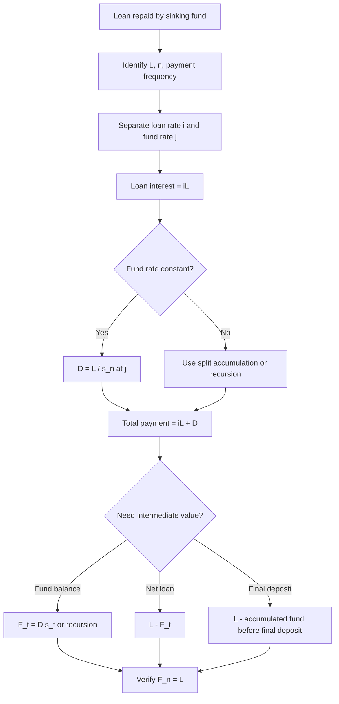

# 📘 4.3 — Sinking Fund Method

> [!ABSTRACT] Ringkasan Cepat
> **Topik:** Sinking Fund Method  
> **Bobot Parent Topic:** 5–15%  
> **Exam Priority:** Medium  
> **Difficulty:** Calculation-Intensive  
> **Primary Skill:** Calculation  
> **Ref:** Vaaler Bab 5 §5.3; Kellison Bab 5 §5.4  
>
> **Inti:** Dalam **sinking fund method**, principal loan umumnya **tidak dikurangi secara periodik**. Borrower:
>
> 1. membayar bunga pinjaman atas principal loan; dan
> 2. menyetor deposit ke rekening terpisah, yaitu **sinking fund**, agar dana tersebut tumbuh menjadi sebesar principal loan pada maturity.
>
> Untuk level sinking-fund deposit $D$ pada fund rate $j$:
>
> $$
> \boxed{
> D\,s_{\overline{n}|j}=L
> }
> $$
>
> sehingga
>
> $$
> \boxed{
> D=\frac{L}{s_{\overline{n}|j}}.
> }
> $$
>
> Jika loan rate adalah $i$, total periodic outflow borrower adalah:
>
> $$
> \boxed{
> iL+D.
> }
> $$

## Section 0 — Pemetaan Silabus & Exam Scope

| Field | Isi |
|---|---|
| Topik CF1 | Topik 4 — Pengembalian Pinjaman |
| Subtopik | 4.3 Sinking Fund Method |
| Learning Outcome | Menggunakan sinking fund method untuk menghitung jangka waktu, suku bunga, besar pembayaran, periode, pokok, atau besaran terkait repayment loan. |
| Skill Diuji | Memisahkan loan account dan sinking fund account, menghitung interest payment, sinking-fund deposit, fund balance, net amount of loan, serta menangani fund rate yang berbeda atau berubah. |
| Bobot Parent Topic | 5–15% |
| Exam Priority | Medium |
| Prerequisite | Interest conversion, annuity accumulated value, varying rates, loan terminology |
| Connected Topics | [[4.1 Loan Terminology]], [[4.2 Amortization Method]], [[2.1 Annuity-Immediate and Annuity-Due]], [[2.6 Varying Interest Rates]] |
| Referensi | Silabus CF1 Topik 4; Vaaler Bab 5 §5.3; Kellison Bab 5 §5.4 |

> [!IMPORTANT] Scope Boundary
> [CORE CF1] Fokus note ini adalah mechanics sinking fund yang secara langsung mendukung learning outcome Topik 4: payment structure, deposit, fund accumulation, maturity target, interest rate, term, dan balance-related quantities.
>
> Vaaler dan Kellison juga membahas equivalent yield / generalized sinking-fund notation. Bagian tersebut dimasukkan sebagai **supporting context** bila membantu soal rate comparison, tetapi bukan fokus utama.

---

## Section 1 — Intuisi & Big Picture

### 1.1 Apa Bedanya dengan Amortization?

Pada **amortization method**:

```text
Payment
  ↓
interest dibayar
  +
principal langsung mengurangi loan balance
```

Pada **sinking fund method**:

```text
Payment borrower
  ├─ interest kepada lender
  └─ deposit ke sinking fund account
                 ↓
          fund earn interest
                 ↓
      fund tumbuh sampai = loan principal
                 ↓
       principal dilunasi di maturity
```

Perbedaan terbesar:

> **Deposit sinking fund bukan principal payment langsung kepada lender.**

Selama masa loan, lender biasanya masih memiliki claim atas principal loan sebesar $L$. Yang berubah dari waktu ke waktu adalah **sinking fund balance**.

---

### 1.2 Dua Account Harus Dipisahkan

Gunakan dua “kotak” mental:

#### Loan Account

- original principal: $L$;
- loan rate: $i$;
- periodic interest due:

$$
\boxed{
iL
}
$$

jika principal tetap outstanding dan rate tetap.

#### Sinking Fund Account

- periodic deposit: $D$;
- fund earns rate: $j$;
- target pada maturity:

$$
\boxed{
\text{Fund Balance at }n = L.
}
$$

> [!TIP] Exam Mental Model
> Jika narasi menyebut “interest plus sinking fund deposit”, langsung gambar:
>
> **Loan rate $i$** untuk bunga kepada lender  
> **Fund rate $j$** untuk pertumbuhan sinking fund  
>
> Jangan mencampur dua rate ini.

---

## Section 2 — Core Concepts & Formula

### 2.1 Notation

Dalam note ini:

| Simbol | Makna |
|---|---|
| $L$ | original loan amount |
| $i$ | effective loan interest rate per loan-payment period |
| $j$ | effective sinking-fund earning rate per deposit period |
| $n$ | number of deposit/payment periods |
| $D$ | level sinking-fund deposit |
| $F_t$ | sinking-fund balance immediately after deposit ke-$t$ |
| $N_t$ | net amount of loan after accounting for sinking fund, $N_t=L-F_t$ |
| $R$ | total periodic borrower payment bila payment level |
| $s_{\overline{n}|j}$ | accumulated value of annuity-immediate at fund rate $j$ |

---

### 2.2 Periodic Interest Payment on the Loan

Jika principal loan tetap sebesar $L$ sampai maturity dan loan rate per period adalah $i$:

$$
\boxed{
\text{Loan interest each period}=iL.
}
$$

Jika interest rates vary by period, misalkan $i_t$:

$$
\boxed{
\text{Interest at time }t=i_tL.
}
$$

Kuncinya: bunga loan memakai **loan rate**, bukan sinking-fund rate.

---

### 2.3 Required Level Sinking-Fund Deposit

Jika deposit $D$ dilakukan pada **akhir setiap period** selama $n$ periods dan fund earns constant effective rate $j$:

| Waktu | 0 | 1 | 2 | $\cdots$ | $n$ |
|---:|---:|---:|---:|---:|---:|
| SF deposit | — | $D$ | $D$ | $\cdots$ | $D$ |

Accumulated value pada waktu $n$:

$$
D\,s_{\overline{n}|j}.
$$

Target sinking fund:

$$
D\,s_{\overline{n}|j}=L.
$$

Maka:

$$
\boxed{
D=\frac{L}{s_{\overline{n}|j}}.
}
$$

dengan

$$
s_{\overline{n}|j}
=
\frac{(1+j)^n-1}{j}.
$$

> [!IMPORTANT] Timing
> Formula $D s_{\overline{n}|j}$ berlaku untuk **end-of-period deposits**.
>
> Jika deposits dilakukan beginning-of-period, accumulated-value factor berubah menjadi annuity-due dan timing harus digeser.

---

### 2.4 Total Periodic Payment by Borrower

Jika loan interest dibayar setiap period dan sinking-fund deposit level:

$$
R=iL+D.
$$

Dengan substitusi deposit:

$$
\boxed{
R
=
iL
+
\frac{L}{s_{\overline{n}|j}}.
}
$$

atau:

$$
\boxed{
R
=
L\left(
i+\frac{1}{s_{\overline{n}|j}}
\right).
}
$$

Interpretasi:

- $iL$ menjaga borrower tetap current atas bunga loan;
- $L/s_{\overline{n}|j}$ adalah amount yang harus disisihkan untuk membangun principal repayment.

---

### 2.5 Fund Balance after $t$ Deposits

Jika deposit level $D$ dan fund rate constant $j$:

$$
\boxed{
F_t=D\,s_{\overline{t}|j}.
}
$$

Karena $D=L/s_{\overline{n}|j}$:

$$
\boxed{
F_t
=
L\frac{s_{\overline{t}|j}}{s_{\overline{n}|j}}.
}
$$

Pada $t=n$:

$$
F_n=L.
$$

Ini adalah maturity condition.

---

### 2.6 Sinking-Fund Recursion

Jika $F_{t-1}$ adalah fund balance immediately after deposit sebelumnya, maka sebelum deposit ke-$t$ dana tumbuh menjadi:

$$
F_{t-1}(1+j).
$$

Setelah deposit $D_t$:

$$
\boxed{
F_t=F_{t-1}(1+j)+D_t.
}
$$

Untuk level deposit:

$$
\boxed{
F_t=F_{t-1}(1+j)+D.
}
$$

Dengan:

$$
F_0=0.
$$

Ini adalah analog dari balance recursion pada amortization, tetapi arahnya berbeda:

- amortization balance **turun**;
- sinking fund balance **naik**.

---

### 2.7 Interest Earned by the Sinking Fund

Pada period ke-$t$, fund balance pada awal period adalah $F_{t-1}$.

Interest credited ke fund:

$$
\boxed{
J_t=jF_{t-1}.
}
$$

Maka increase dalam fund selama period ke-$t$ adalah:

$$
\boxed{
F_t-F_{t-1}=D+jF_{t-1}.
}
$$

Inilah jumlah “replacement of principal” yang terjadi secara ekonomi pada period tersebut.

---

### 2.8 Net Amount of Loan

Kellison memperkenalkan konsep bahwa walaupun contractual loan principal tetap $L$, borrower telah mengakumulasi asset di sinking fund.

Net amount of loan:

$$
\boxed{
N_t=L-F_t.
}
$$

Dengan level deposits:

$$
\boxed{
N_t
=
L-Ds_{\overline{t}|j}.
}
$$

Pada maturity:

$$
N_n=L-L=0.
$$

> [!IMPORTANT] Important Distinction
> **Contractual outstanding loan balance** dapat tetap $L$ sampai maturity.
>
> Tetapi **net amount of loan**, setelah memperhitungkan sinking fund, turun menjadi:
>
> $$
> L-F_t.
> $$
>
> Jangan menyamakan dua quantity ini tanpa membaca wording soal.

---

## Section 3 — Comparison with Amortization

### 3.1 Economic Comparison

#### Amortization Method

Payment:

$$
R_{\text{amort}}
=
\frac{L}{a_{\overline{n}|i}}.
$$

Principal reduction terjadi langsung pada loan account.

#### Sinking Fund Method

Payment:

$$
R_{\text{SF}}
=
iL
+
\frac{L}{s_{\overline{n}|j}}.
$$

Principal tidak dikurangi langsung; borrower membangun fund terpisah.

---

### 3.2 Special Case: $i=j$

Kellison dan Vaaler menunjukkan identity:

$$
\frac{1}{a_{\overline{n}|i}}
=
i+\frac{1}{s_{\overline{n}|i}}.
$$

Maka jika loan rate dan fund rate sama:

$$
i=j,
$$

total payment sinking fund menjadi:

$$
L\left(
i+\frac{1}{s_{\overline{n}|i}}
\right)
=
\frac{L}{a_{\overline{n}|i}}.
$$

Jadi:

$$
\boxed{
R_{\text{SF}}=R_{\text{amort}}
\quad\text{jika }i=j.
}
$$

Secara economic cash-flow cost, kedua metode equivalent.

---

### 3.3 Jika $i>j$

Kasus yang umum menurut textbook: fund earns less than loan costs.

Borrower:

- membayar bunga pada rate lebih tinggi $i$ atas $L$;
- sementara asset sinking fund hanya tumbuh pada rate lebih rendah $j$.

Maka total periodic payment biasanya lebih besar daripada amortized loan pada rate yang sama.

> [!CHECK] Intuition
> Jika $j$ turun sementara $L,n,i$ tetap:
>
> $$
> s_{\overline{n}|j}
> $$
>
> mengecil, sehingga
>
> $$
> D=\frac{L}{s_{\overline{n}|j}}
> $$
>
> naik.
>
> Jadi sinking fund menjadi lebih mahal per period.

---

### 3.4 Jika $i<j$

Jika fund earns lebih tinggi dari loan rate, fund membutuhkan deposit yang lebih kecil.

Secara intuition, ini membuat sinking-fund structure lebih favorable bagi borrower dibanding kondisi $i>j$.

---

## Section 4 — How It Works: Universal Exam Workflow

```text
1. Identifikasi loan amount L
        ↓
2. Pisahkan loan rate i dan fund rate j
        ↓
3. Samakan rate period dengan payment/deposit frequency
        ↓
4. Hitung periodic loan interest = iL
        ↓
5. Tentukan deposit D
   dari fund accumulation target
        ↓
6. Bentuk total payment:
   R = iL + D
        ↓
7. Jika diminta fund balance:
   F_t = D s_t
   atau recursion
        ↓
8. Jika rate fund berubah:
   split accumulation by rate regimes
        ↓
9. Verify maturity:
   F_n = L
```

---

### 4.1 Decision Table

| Wording Soal | Model Utama |
|---|---|
| “interest plus sinking fund deposit” | $R=iL+D$ |
| “fund must accumulate to loan amount” | $Ds_{\overline{n}|j}=L$ |
| “balance in sinking fund after $t$ years” | $F_t=Ds_{\overline{t}|j}$ |
| “fund earns changing rates” | recursion / split accumulation |
| “net amount of loan” | $L-F_t$ |
| “compare with amortization” | compare $iL+L/s_{\overline{n}|j}$ vs $L/a_{\overline{n}|i}$ |
| “interest portion is $k$ times deposit” | ratio → solve $iL$ and $D$ first |
| “final deposit” | maturity target minus accumulated fund before final deposit |

---

## Section 5 — Worked Examples

### Case A — Basic Level Sinking Fund

A borrower takes a loan:

$$
L=100{,}000
$$

for $n=10$ years.

Loan rate:

$$
i=6\%.
$$

Sinking fund earns:

$$
j=4\%.
$$

Deposits are annual at year-end.

#### Step 1 — Interest payment

$$
iL
=
0.06(100{,}000)
=
6{,}000.
$$

#### Step 2 — Sinking-fund deposit

$$
D
=
\frac{100{,}000}{s_{\overline{10}|0.04}}.
$$

#### Step 3 — Total annual borrower payment

$$
\boxed{
R
=
6{,}000
+
\frac{100{,}000}{s_{\overline{10}|0.04}}.
}
$$

> [!TIP] Structure First
> Jangan langsung present-value total payment. Pada sinking fund, pecah menjadi dua components terlebih dahulu:
>
> **interest on loan + deposit to fund**.

---

### Case B — Fund Balance after Several Years

Gunakan loan sebelumnya dengan deposit $D$.

Setelah 4 deposits:

$$
\boxed{
F_4
=
D s_{\overline{4}|0.04}.
}
$$

Net amount of loan:

$$
\boxed{
N_4
=
100{,}000-F_4.
}
$$

Tetapi contractual principal loan kepada lender masih dapat tetap sebesar:

$$
100{,}000.
$$

> [!BUG] Concept Trap
> Jangan menjawab “outstanding loan balance = $L-F_4$” kecuali soal memang menggunakan konsep **net amount of loan**.
>
> Sinking fund balance adalah asset terpisah.

---

### Case C — Vaaler Example: Varying Fund Rates

[TEXTBOOK EXAMPLE — Vaaler Example 5.3.1]

Loan:

$$
L=10{,}000.
$$

Term:

$$
n=10.
$$

Loan rate:

$$
i=6\%.
$$

Sinking fund earns:

- $3\%$ untuk 4 tahun pertama;
- $4\%$ untuk 6 tahun berikutnya.

Borrower deposits $800$ pada akhir tahun 1–9. Cari final deposit di akhir tahun 10.

#### Step 1 — Interest payment on loan

Karena principal loan tetap $10{,}000$:

$$
I=0.06(10{,}000)=600
$$

setiap tahun.

#### Step 2 — Accumulate existing deposits to time 10

Deposits tahun 1–4 berkembang pada $3\%$ sampai akhir tahun 4, lalu lanjut tumbuh 6 tahun pada $4\%$:

$$
800s_{\overline{4}|0.03}(1.04)^6.
$$

Deposits tahun 5–9 terdiri dari 5 deposits yang tumbuh pada $4\%$ sampai time 10 sebelum deposit terakhir:

$$
800s_{\overline{5}|0.04}(1.04).
$$

Jadi balance sebelum final deposit:

$$
F_{10^-}
=
800s_{\overline{4}|0.03}(1.04)^6
+
800s_{\overline{5}|0.04}(1.04).
$$

Vaaler memperoleh kira-kira:

$$
F_{10^-}\approx8{,}741.28.
$$

Final deposit:

$$
\boxed{
D_{10}
=
10{,}000-8{,}741.28
=
1{,}258.72.
}
$$

> [!IMPORTANT] Exam Lesson
> Untuk varying fund rates:
>
> 1. value each deposit stream at the rate applicable while it is invested;
> 2. choose one focal date;
> 3. carry every accumulated block to the same maturity date.

---

### Case D — Recursion with Changing Rates

Jika deposits tetap $D$ tetapi fund rate berubah per period menjadi $j_t$:

$$
\boxed{
F_t
=
F_{t-1}(1+j_t)+D.
}
$$

Dengan:

$$
F_0=0.
$$

Contoh:

- tahun 1–3: $j=5\%$;
- tahun 4–5: $j=4\%$.

Maka:

$$
F_1=D,
$$

$$
F_2=D(1.05)+D,
$$

$$
F_3=F_2(1.05)+D,
$$

$$
F_4=F_3(1.04)+D,
$$

$$
F_5=F_4(1.04)+D.
$$

Target:

$$
F_5=L.
$$

> [!TIP] Kapan Recursion Lebih Aman?
> Jika rate regime berubah beberapa kali dan jumlah periods tidak terlalu besar, recursion sering lebih aman daripada mencoba membangun satu formula tertutup.

---

## Section 6 — Past Exam Signal

### Past Exam CF1 Mei 2026 — Sinking Fund dengan Rate Berubah

[PAST EXAM EMPHASIS]

Soal No. 21 CF1 Mei 2026 memberikan pola yang sangat representative:

- loan $L=50{,}000{,}000$;
- term 15 years;
- total annual payment $6{,}000{,}000$;
- interest portion = 2 × sinking-fund deposit;
- sinking fund earns $7\%$ untuk 13 tahun pertama dan $y\%$ sesudahnya;
- diminta $|x-y|$, dengan $x$ sebagai loan rate.

#### Step 1 — Split total payment

Jika deposit adalah $D$:

$$
I=2D.
$$

Total payment:

$$
I+D=6{,}000{,}000.
$$

Maka:

$$
3D=6{,}000{,}000
$$

sehingga:

$$
\boxed{
D=2{,}000{,}000.
}
$$

Interest:

$$
I=4{,}000{,}000.
$$

Karena:

$$
I=Lx,
$$

maka:

$$
50{,}000{,}000x=4{,}000{,}000
$$

dan:

$$
\boxed{
x=8\%.
}
$$

#### Step 2 — Build maturity condition

Official solution uses:

$$
D\,s_{\overline{13}|0.07}(1+y)^2
+
D\,s_{\overline{2}|y}
=
L.
$$

Substitute:

$$
2{,}000{,}000
s_{\overline{13}|0.07}(1+y)^2
+
2{,}000{,}000
s_{\overline{2}|y}
=
50{,}000{,}000.
$$

Solution gives approximately:

$$
y\approx6.7067\%.
$$

Thus:

$$
|x-y|
\approx
|8-6.7067|
\approx1.2933
$$

percentage points, sehingga pilihan terdekat:

$$
\boxed{1.3}.
$$

> [!CAUTION] Exam Emphasis
> Past exam ini menunjukkan bahwa Topik 4.3 dapat menggabungkan:
>
> - payment decomposition;
> - loan rate;
> - sinking-fund accumulation;
> - **varying interest rates** dari [[2.6 Varying Interest Rates]];
> - focal-date discipline.
>
> Jadi 4.3 bukan hanya formula $D=L/s_{\overline{n}|j}$.

---

## Section 7 — Sinking Fund Schedule

Kellison menggunakan sinking fund schedule untuk menampilkan perkembangan fund.

Struktur umum:

| Period | Interest on Loan | SF Deposit | Interest Earned by SF | SF Balance | Net Amount of Loan |
|---:|---:|---:|---:|---:|---:|
| 0 | — | — | — | $0$ | $L$ |
| 1 | $iL$ | $D$ | $0$ | $D$ | $L-D$ |
| 2 | $iL$ | $D$ | $jF_1$ | $F_2$ | $L-F_2$ |
| $\vdots$ | $\vdots$ | $\vdots$ | $\vdots$ | $\vdots$ | $\vdots$ |
| $n$ | $iL$ | final deposit | $jF_{n-1}$ | $L$ | $0$ |

Core recursions:

$$
F_t=F_{t-1}(1+j)+D,
$$

$$
N_t=L-F_t.
$$

### Economic Net Interest

Kellison menunjukkan bahwa net interest cost dapat dipahami sebagai:

$$
\text{interest paid on loan}
-
\text{interest earned in sinking fund}.
$$

Pada period ke-$t$:

$$
\boxed{
\text{Net interest}
=
iL-jF_{t-1}.
}
$$

Ini menjelaskan mengapa fund interest secara ekonomi membantu “offset” cost of carrying the loan.

---

## Section 8 — Formula Relationships & Supporting Context

### 8.1 Equivalent Payment Notation

[CF1 SUPPORTING CONTEXT]

Vaaler mendefinisikan suatu generalized annuity factor untuk sinking fund dengan loan rate $i$ dan fund rate $j$ melalui:

$$
\boxed{
\frac{1}{a_{\overline{n}|i\&j}}
=
i+\frac{1}{s_{\overline{n}|j}}.
}
$$

Sehingga periodic payment:

$$
\boxed{
R
=
\frac{L}{a_{\overline{n}|i\&j}}.
}
$$

Hubungan lain:

$$
a_{\overline{n}|i\&j}
=
\frac{
a_{\overline{n}|j}
}{
1+(i-j)a_{\overline{n}|j}
}.
$$

Notation ini berguna untuk melihat sinking-fund payment seperti “annuity-style payment”, tetapi dalam exam calculation sering lebih transparan memakai:

$$
\boxed{
R=iL+\frac{L}{s_{\overline{n}|j}}.
}
$$

---

### 8.2 Approximate Equivalent Yield

[CF1 SUPPORTING CONTEXT]

Vaaler memberikan approximation:

$$
\boxed{
i'
\approx
i+\frac12(i-j)
}
$$

untuk equivalent amortization-style rate dalam context tertentu.

Interpretasi:

- jika $i>j$, equivalent cost rate cenderung lebih tinggi daripada $i$;
- jika $i<j$, dapat lebih rendah.

> [!WARNING]
> Ini adalah **approximation**, bukan identity utama untuk basic sinking-fund problems.
>
> Jangan gunakan kecuali soal secara eksplisit meminta equivalent yield atau context-nya cocok.

---

## Section 9 — Verification & Sanity Check

> [!CHECK] Sanity Check
> Untuk standard sinking fund:
>
> 1. **Loan interest tetap $iL$** jika principal loan tetap $L$ dan rate tetap.
>
> 2. **Fund balance harus meningkat**:
>
> $$
> F_0=0<F_1<\cdots<F_n=L
> $$
>
> untuk $D>0$ dan $j\ge0$.
>
> 3. **Maturity target harus tepat**:
>
> $$
> F_n=L.
> $$
>
> 4. **Net amount of loan harus menuju 0**:
>
> $$
> N_t=L-F_t.
> $$
>
> 5. Jika $j$ lebih tinggi, required deposit harus lebih rendah.
>
> 6. Jika $j$ lebih rendah, required deposit harus lebih tinggi.
>
> 7. Jika $i=j$, total payment harus match amortized-loan payment:
>
> $$
> iL+\frac{L}{s_{\overline{n}|i}}
> =
> \frac{L}{a_{\overline{n}|i}}.
> $$

---

## Section 10 — Exam Traps & Misconceptions

### Trap 1 — Deposit dianggap Mengurangi Loan Balance

> [!BUG] Concept Trap
> Sinking-fund deposit masuk ke **separate fund account**.
>
> Jangan menulis:
>
> $$
> B_t=B_{t-1}-D
> $$
>
> untuk contractual loan balance.
>
> Loan principal biasanya tetap $L$ sampai maturity.

---

### Trap 2 — Menggunakan Loan Rate untuk Fund Accumulation

> [!BUG] Rate Trap
> Loan rate $i$ dan fund rate $j$ punya fungsi berbeda:
>
> - $i$ → interest payable to lender;
> - $j$ → accumulation of fund deposits.
>
> Formula:
>
> $$
> D=\frac{L}{s_{\overline{n}|j}}
> $$
>
> memakai $j$, bukan $i$.

---

### Trap 3 — Menggunakan Fund Rate untuk Loan Interest

> [!BUG] Rate Trap
> Loan interest:
>
> $$
> iL.
> $$
>
> Bukan:
>
> $$
> jL.
> $$

---

### Trap 4 — Salah Timing Deposit

> [!BUG] Timing Trap
> End-of-period deposit:
>
> $$
> D s_{\overline{n}|j}.
> $$
>
> Jika deposit pertama terjadi hari ini, timing berubah menjadi annuity-due.

---

### Trap 5 — Varying Rate Diperlakukan sebagai Satu Average Rate

> [!BUG] Calculation Trap
> Jika fund earns $j_1$ lalu $j_2$, jangan sekadar ambil average.
>
> Accumulate setiap block dengan rate yang benar dan bawa ke focal date sama.

---

### Trap 6 — “Outstanding Balance” Ambiguity

> [!BUG] Interpretation Trap
> Pada sinking fund:
>
> - contractual loan principal dapat tetap $L$;
> - sinking fund balance = $F_t$;
> - net amount of loan = $L-F_t$.
>
> Baca definisi quantity yang diminta.

---

### Trap 7 — Total Payment dianggap Deposit Saja

> [!BUG] Decomposition Trap
> Jika borrower membayar interest + deposit:
>
> $$
> R=iL+D.
> $$
>
> Jangan menyetarakan:
>
> $$
> R=D.
> $$

---

### Trap 8 — Interest Earned by Fund Dikirim ke Lender

> [!BUG] Concept Trap
> Interest earned by fund:
>
> $$
> jF_{t-1}
> $$
>
> menambah sinking fund balance.
>
> Itu bukan loan interest payment kepada lender.

---

## Section 11 — Formula Sheet

### Core Formulas

| Quantity | Formula | Keterangan |
|---|---|---|
| Loan interest per period | $iL$ | principal tetap $L$ |
| Required level SF deposit | $D=L/s_{\overline{n}|j}$ | deposits end-of-period |
| Total periodic payment | $R=iL+D$ | interest + SF deposit |
| Total payment expanded | $R=L(i+1/s_{\overline{n}|j})$ | standard constant rates |
| Fund balance | $F_t=Ds_{\overline{t}|j}$ | constant $j$ |
| Fund recursion | $F_t=F_{t-1}(1+j)+D_t$ | general deposits |
| SF interest earned | $J_t=jF_{t-1}$ | constant $j$ |
| Net amount of loan | $N_t=L-F_t$ | economic net position |
| Maturity condition | $F_n=L$ | principal can be repaid |
| Varying rate recursion | $F_t=F_{t-1}(1+j_t)+D_t$ | changing fund rates |

### Constant-Rate Shortcut

$$
\boxed{
D=\frac{Lj}{(1+j)^n-1}
}
$$

karena:

$$
s_{\overline{n}|j}
=
\frac{(1+j)^n-1}{j}.
$$

### Amortization Equivalence when $i=j$

$$
\boxed{
i+\frac{1}{s_{\overline{n}|i}}
=
\frac{1}{a_{\overline{n}|i}}.
}
$$

---

## Section 12 — Quick Decision Tree



---

## Section 13 — Active Recall Check

1. Apa definisi sinking fund method?
2. Mengapa sinking-fund deposit bukan principal payment langsung kepada lender?
3. Dalam standard sinking fund, mengapa interest payment dapat tetap sebesar $iL$?
4. Apa perbedaan fungsi loan rate $i$ dan fund rate $j$?
5. Turunkan formula $D=L/s_{\overline{n}|j}$.
6. Apa formula total periodic borrower payment?
7. Apa formula fund balance setelah $t$ deposits?
8. Tulis recursion fund balance.
9. Apa interest earned by fund pada period ke-$t$?
10. Apa yang dimaksud net amount of loan?
11. Mengapa contractual balance dan net amount of loan dapat berbeda?
12. Apa maturity condition paling penting?
13. Jika $j$ naik, apa yang terjadi pada required deposit $D$?
14. Jika $j$ turun, apa yang terjadi pada $D$?
15. Apa special result ketika $i=j$?
16. Bagaimana menangani sinking-fund rate yang berubah di tengah term?
17. Mengapa average rate tidak boleh dipakai secara mekanis pada varying-rate problem?
18. Jika interest portion = 2 × deposit dan total payment diketahui, apa langkah tercepat?
19. Dalam past exam Mei 2026, bagaimana $x$ ditemukan sebelum $y$?
20. Apa sanity check akhir untuk semua sinking-fund calculations?

---

## Section 14 — Exam Pattern Map

| Narasi Soal | Keyword | Konsep | Formula / Rule | Langkah Cepat | Trap |
|---|---|---|---|---|---|
| Loan + interest + SF deposit | “sinking fund” | payment decomposition | $R=iL+D$ | pecah dua account | anggap $R$ hanya deposit |
| Cari deposit | “accumulate to repay principal” | AV annuity | $D=L/s_{\overline{n}|j}$ | samakan fund rate period | pakai loan rate |
| Cari fund balance | “amount in sinking fund after $t$” | fund accumulation | $F_t=Ds_{\overline{t}|j}$ | use deposits made so far | pakai $n$ |
| Cari net amount | “net loan” | loan less fund | $L-F_t$ | hitung fund lalu subtract | sebut sebagai contractual balance |
| Fund rate berubah | “earns 5% then 4%” | varying rates | split / recursion | focal date maturity | average rate |
| Final deposit berbeda | “what final deposit is required” | maturity shortfall | $L-F_{n^-}$ | accumulate prior deposits | treat as level deposit |
| Interest/deposit ratio | “interest twice deposit” | decomposition | ratio + $R=iL+D$ | solve component first | langsung solve annuity |
| Compare amortization | “equivalent payment” | identity | $1/a=i+1/s$ when same rate | compare components | assume always equivalent |
| Loan rate != fund rate | “loan earns/charges..., fund earns...” | two-rate structure | $R=iL+L/s_j$ | keep rates separate | swap $i,j$ |
| Past-exam varying SF | “13 years at 7%, then y%” | two-stage accumulation | block AV + carry forward | choose time 15 | use $s_{15}$ at one rate |

### Trigger Keywords

| Jika soal mengatakan... | Pikirkan... |
|---|---|
| “interest plus sinking fund deposit” | $iL+D$ |
| “fund accumulates to principal” | $Ds_{\overline{n}|j}=L$ |
| “loan interest rate” | rate untuk lender interest |
| “sinking fund earns” | rate untuk accumulation |
| “balance in fund” | $F_t$ |
| “net amount of loan” | $L-F_t$ |
| “rate changes after year $k$” | split cash flows / recursion |
| “final deposit” | maturity shortfall |
| “interest is twice deposit” | ratio decomposition first |

---

## Source Traceability

| Materi | Sumber |
|---|---|
| Scope Topik 4.3 & learning outcome | Silabus CF1 / Prompt Summary Materi Exam CF1 v2 |
| Definition sinking fund method | Vaaler Bab 5 §5.3; Kellison Bab 5 §5.4 |
| Loan principal remains outstanding while fund accumulates | Vaaler Bab 5 §5.3 |
| Separate loan rate $i$ and fund rate $j$ | Vaaler Bab 5 §5.3; Kellison Bab 5 §5.4 |
| Deposit target $Ds_{\overline{n}|j}=L$ | Kellison Bab 5 §5.4; Vaaler Bab 5 §5.3 |
| Total payment $iL+D$ | Vaaler Bab 5 §5.3; Kellison Bab 5 §5.4 |
| Fund schedule and net amount of loan | Kellison Bab 5 §5.4 |
| Equivalence when $i=j$ | Kellison Bab 5 §5.4; Vaaler Bab 5 §5.3 |
| Varying-rate fund accumulation | Vaaler Example 5.3.1 |
| Generalized $i\&j$ annuity notation | Vaaler Bab 5 §5.3 |
| Past Exam pattern with interest/deposit ratio and changing SF rates | CF1 Mei 2026 No. 21 |

> [!NOTE] Source Boundary
> Note ini menggunakan **silabus CF1 sebagai scope authority**, Vaaler Bab 5 dan Kellison Bab 5 sebagai textbook authority, serta CF1 Mei 2026 No. 21 hanya untuk **exam emphasis**. Materi calculator-specific dan applications yang tidak langsung mendukung learning outcome 4.3 tidak dijadikan materi inti.

---

> [!QUOTE] Follow-up Options
> 1. *"Uji saya dengan soal Active Recall Topik 4"*
> 2. *"Buat formula sheet Topik 4 dari 4.1–4.3"*
> 3. *"Continue ke Topik 5.1 Bond Pricing"*

*📖 Ref: Vaaler Bab 5 §5.3; Kellison Bab 5 §5.4 | 🗓️ 2026-08-25 | #CF1 #MatematikaKeuangan*
