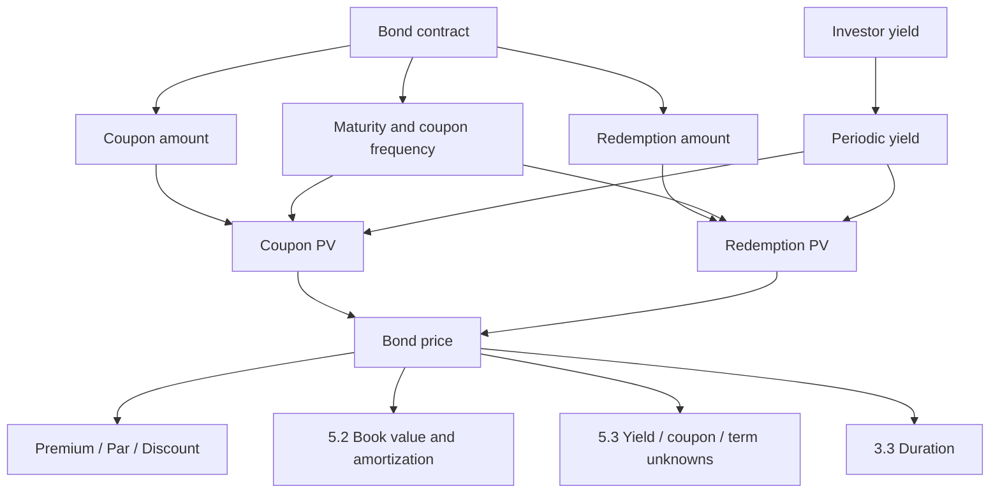
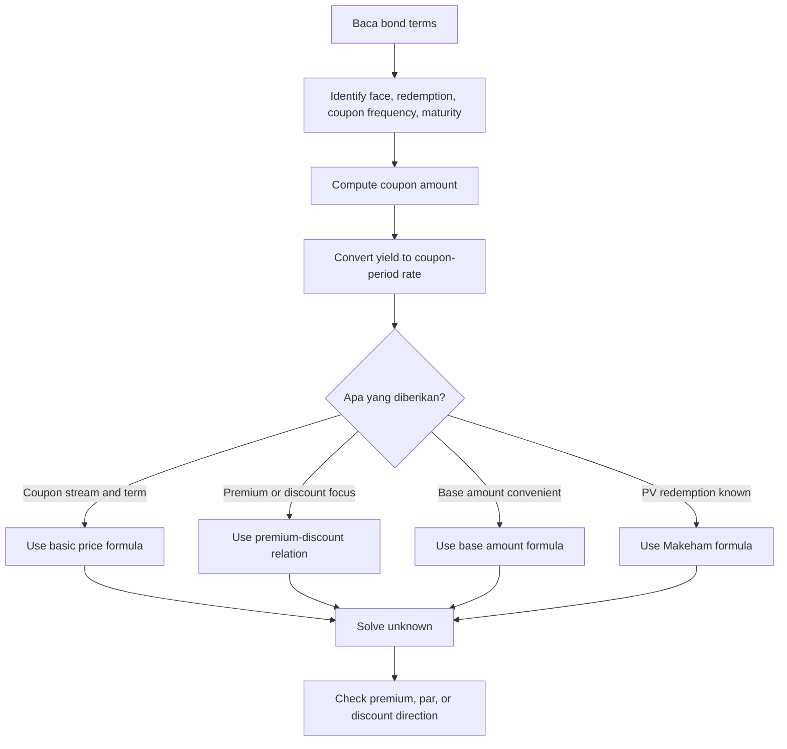

# 📘 5.1 — Bond Pricing

> [!ABSTRACT] Ringkasan Cepat
> **Topik:** Bond Pricing  
> **Bobot Parent Topic:** 10–20%  
> **Exam Priority:** High  
> **Difficulty:** Calculation-Intensive  
> **Primary Skill:** Calculation + Interpretation  
> **Ref:** Vaaler Bab 6 §§6.1–6.4; Kellison Bab 6 §§6.1–6.4  
>
> **Inti:** harga obligasi adalah **present value dari seluruh future cash flows** yang diterima investor: coupon stream ditambah redemption payment. Untuk level-coupon bond dengan periodic yield yang konstan:
>
> $$
> P
> =
> Fr\,a_{\overline{n}|j}
> +
> Cv_j^n.
> $$
>
> Seluruh soal pricing pada dasarnya adalah **equation of value**. Tantangan utamanya bukan menghafal formula, tetapi memastikan **coupon amount, number of coupon periods, periodic yield, redemption value, dan timing** berada pada basis yang konsisten.

## Section 0 — Pemetaan Silabus & Exam Scope

| Field | Isi |
|---|---|
| Topik CF1 | Topik 5 — Model Penentuan Harga Obligasi |
| Subtopik | 5.1 Bond Pricing |
| Learning Outcome | Menghitung harga obligasi serta redemption value dan face/par value yang terkait dengan model harga obligasi. |
| Skill Diuji | Menerjemahkan bond terms menjadi cash-flow timeline; menentukan coupon amount; menyamakan coupon frequency dan yield basis; menggunakan basic price formula; menentukan premium/par/discount; menggunakan premium-discount formula, base amount formula, dan Makeham formula ketika data cocok; menyelesaikan unknown price/redemption/face value dari equation of value. |
| Bobot Parent Topic | 10–20% |
| Exam Priority | High |
| Prerequisite | Present value, equation of value, annuity-immediate, equivalent periodic rate |
| Connected Topics | [[5.2 Book Value, Premium and Discount Amortization]], [[5.3 Yield Rate and Coupon Calculations]], [[3.2 Yield Curve]], [[3.3 Duration (Macaulay and Modified)]] |
| Referensi | Silabus CF1 Topik 5; Vaaler Bab 6 §§6.1–6.4; Kellison Bab 6 §§6.1–6.4 |

> [!IMPORTANT] Scope Boundary
> [CORE CF1] Fokus note ini adalah **pricing pada coupon dates** menggunakan future coupons dan redemption payment, termasuk hubungan **premium / par / discount**, serta formula equivalent seperti **premium-discount**, **base amount**, dan **Makeham formula**.
>
> Detail **book value, premium amortization, discount accumulation, dan bond amortization schedule** dibahas di [[5.2 Book Value, Premium and Discount Amortization]]. Menentukan **yield rate, coupon, coupon rate, dan term sebagai unknown utama** dibahas lebih lanjut di [[5.3 Yield Rate and Coupon Calculations]].
>
> Vaaler Bab 6 juga membahas valuation di antara coupon dates, sale setelah issue, callable bonds, floating-rate bonds, dan calculator worksheet. Bagian tersebut tidak dijadikan inti 5.1 kecuali diperlukan sebagai supporting context. Callable/floating-rate details tidak perlu menggantikan ordinary fixed-cash-flow bond pricing yang menjadi fondasi subtopik ini.

---

## Section 1 — Intuisi & Big Picture

Ketika membeli obligasi, investor membayar **harga sekarang** untuk memperoleh serangkaian pembayaran di masa depan. Untuk ordinary coupon bond, ada dua komponen cash flow:

1. coupon yang dibayar berkala;
2. redemption value pada maturity.

Jadi pertanyaan “berapa harga obligasi?” sebenarnya sama dengan pertanyaan TVM yang sudah dikenal:

> Berapa nilai sekarang dari seluruh pembayaran masa depan jika investor menginginkan yield tertentu?

Timing penting karena coupon pertama, coupon terakhir, dan redemption tidak diterima hari ini. Semakin jauh cash flow, semakin besar discounting-nya. Karena itu dua obligasi dengan total nominal pembayaran yang sama belum tentu mempunyai harga yang sama jika timing cash flow berbeda.

Kesalahan intuitif paling umum adalah menganggap **coupon rate = yield rate**. Coupon rate hanya menentukan **besar coupon contractual**, sedangkan yield menentukan **rate yang digunakan investor untuk mendiskontokan cash flows**. Keduanya hanya sama pada kondisi tertentu, misalnya bond redeemable at par yang dijual pada par dengan basis rate yang sama.

Mental model paling aman:

```text
Bond terms
↓
ubah menjadi cash flows
↓
samakan unit waktu dan periodic yield
↓
discount semua cash flows ke purchase date
↓
jumlahkan
↓
bond price
```

---

## Section 2 — Definisi & Core Concepts

### Definisi Formal

> [!NOTE] Definisi Formal
> **Bond** adalah security yang menjanjikan pembayaran tertentu pada future dates. Untuk ordinary coupon bond, investor menerima coupon payments secara periodik dan sebuah redemption payment pada maturity.
>
> **Bond price** adalah nilai pada purchase date dari cash flows yang dijanjikan, discounted menggunakan yield rate yang relevan bagi investor.

### Terminologi Penting

Notation utama mengikuti Vaaler karena membedakan annual quotation dan coupon-period quantities secara eksplisit.

| Istilah / Simbol | Definisi | Intuisi | Exam Note |
|---|---|---|---|
| $F$ | face/par value | basis untuk menghitung coupon | tidak otomatis sama dengan redemption |
| $\alpha$ | nominal annual coupon rate convertible $m$ times | annual coupon quotation | coupon per period bukan $\alpha$ |
| $m$ | coupons per year | frequency coupon | semiannual $\Rightarrow m=2$ |
| $r=\alpha/m$ | coupon rate per coupon period | rate untuk menghitung coupon dari $F$ | coupon amount $=Fr$ |
| $Fr$ | coupon payment | cash flow periodik | contractual, tidak bergantung pada yield |
| $N$ | term dalam tahun | calendar maturity | jika $m$ coupons/year, $n=Nm$ |
| $n$ | jumlah coupon periods | jumlah coupons | exponent dan annuity length memakai $n$ |
| $C$ | redemption value | principal-like payment di maturity | jika redeemable at par, $C=F$ |
| $g=Fr/C$ | modified coupon rate | coupon sebagai proporsi redemption | berguna untuk premium/discount |
| $I$ | nominal annual yield convertible $m$ times | quoted yield | periodic yield $j=I/m$ |
| $j$ | effective yield per coupon period | discount rate untuk bond formula | harus match coupon period |
| $i$ | annual effective yield dalam notation Vaaler | annual effective version of $j$ | $1+i=(1+j)^m$ |
| $v_j=(1+j)^{-1}$ | discount factor per coupon period | PV satu period | jangan pakai annual $v$ jika timeline dalam coupon periods |
| $P$ | bond price | amount paid at purchase | focal date biasanya $t=0$ |
| $K=Cv_j^n$ | PV redemption | discounted redemption component | dipakai dalam Makeham |
| $G=Fr/j$ | base amount | capital yang pada yield $j$ menghasilkan coupon $Fr$ sebagai interest | dipakai base amount formula |

> [!IMPORTANT] Face Value ≠ Redemption Value
> Vaaler dan Kellison sama-sama membedakan:
>
> $$
> F
> \neq
> C
> $$
>
> secara umum.
>
> **Face value** menentukan coupon.  
> **Redemption value** adalah amount yang dibayar saat maturity.
>
> Baru jika bond **redeemable at par**, kita boleh memakai:
>
> $$
> C=F.
> $$

### 2.1 Cash-Flow Structure

Untuk level coupon bond dengan $n$ coupon periods:

| Waktu | 0 | 1 | 2 | $\cdots$ | $n-1$ | $n$ |
|---:|---:|---:|---:|---:|---:|---:|
| Investor CF | $-P$ | $Fr$ | $Fr$ | $\cdots$ | $Fr$ | $Fr+C$ |

Focal date paling natural adalah purchase date $t=0$.

---

### 2.2 Basic Price Formula

Dengan periodic yield $j$:

$$
\boxed{
P
=
Fr\,a_{\overline{n}|j}
+
Cv_j^n
}
$$

dengan:

$$
a_{\overline{n}|j}
=
\frac{1-v_j^n}{j},
\qquad
v_j=\frac{1}{1+j}.
$$

**Cash-flow meaning:**

- $Fr\,a_{\overline{n}|j}$ = PV dari $n$ coupon payments;
- $Cv_j^n$ = PV redemption;
- jumlah keduanya = price.

Formula ini berlaku ketika:

- coupon amount level;
- coupon dibayar pada end of each coupon period;
- satu periodic yield $j$ digunakan untuk semua cash flows;
- valuation dilakukan pada coupon-date purchase point yang sesuai.

Jika cash flows atau discount rates tidak level, kembali ke general equation of value:

$$
P
=
\sum_t CF_t D(0,t).
$$

---

### 2.3 Rate Basis

#### Jika yield diberikan nominal convertible sama dengan coupon frequency

Jika yield quote adalah $I$ nominal convertible $m$ times:

$$
\boxed{
j=\frac{I}{m}
}
$$

karena $j$ adalah effective rate per conversion/coupon period.

#### Jika yield diberikan annual effective

Jika annual effective yield adalah $i$:

$$
\boxed{
j=(1+i)^{1/m}-1
}
$$

**Bukan**:

$$
j=\frac{i}{m}.
$$

#### Annual effective relationship

$$
\boxed{
1+i=(1+j)^m
}
$$

> [!DANGER] Frequency Trap
> Annuity factor dan exponent harus memakai **coupon periods**, sehingga yield juga harus effective per coupon period.

---

### 2.4 Modified Coupon Rate

Vaaler mendefinisikan:

$$
\boxed{
g=\frac{Fr}{C}
}
$$

sehingga:

$$
Fr=Cg.
$$

Jika $F=C$, maka:

$$
g=r.
$$

Tetapi jika $F\neq C$:

$$
g\neq r
$$

secara umum.

Ini penting karena premium/discount dibandingkan terhadap **redemption value** $C$, bukan semata terhadap face value.

---

### 2.5 Premium-Discount Formula

Mulai dari:

$$
P
=
Cg\,a_{\overline{n}|j}
+
Cv_j^n.
$$

Gunakan identity:

$$
v_j^n
=
1-ja_{\overline{n}|j}.
$$

Maka:

$$
P
=
Cg\,a_{\overline{n}|j}
+
C\left(1-ja_{\overline{n}|j}\right).
$$

Jadi:

$$
\boxed{
P
=
C
+
C(g-j)a_{\overline{n}|j}
}
$$

atau:

$$
\boxed{
P-C
=
C(g-j)a_{\overline{n}|j}.
}
$$

Formula ini langsung mengungkap kondisi harga.

#### Premium

Jika:

$$
g>j,
$$

maka:

$$
\boxed{
P>C
}
$$

dan:

$$
\boxed{
P-C
=
C(g-j)a_{\overline{n}|j}.
}
$$

#### Discount

Jika:

$$
g<j,
$$

maka:

$$
\boxed{
P<C
}
$$

dan:

$$
\boxed{
C-P
=
C(j-g)a_{\overline{n}|j}.
}
$$

#### Par relative to redemption

Jika:

$$
g=j,
$$

maka:

$$
\boxed{
P=C.
}
$$

> [!IMPORTANT] Special Case — Redeemable at Par
> Jika $F=C$, maka $g=r$. Dengan basis periodic yang sama:
>
> - $r>j \Rightarrow$ premium;
> - $r=j \Rightarrow$ par;
> - $r<j \Rightarrow$ discount.

---

### 2.6 Economic Interpretation of Premium / Discount

Untuk redemption amount $C$, required interest per coupon period pada yield $j$ adalah secara konseptual:

$$
Cj.
$$

Actual coupon adalah:

$$
Cg.
$$

Jika:

$$
Cg>Cj,
$$

coupon “lebih besar” daripada interest yang dibutuhkan pada redemption amount. Investor bersedia membayar tambahan di awal:

$$
P>C.
$$

Sebaliknya, jika:

$$
Cg<Cj,
$$

coupon terlalu kecil relatif terhadap required yield, sehingga investor hanya mau membeli jika harga awal didiskon:

$$
P<C.
$$

Ini memberi cara memahami premium/discount tanpa menghafal tanda.

---

### 2.7 Base Amount Formula

Define:

$$
\boxed{
G=\frac{Fr}{j}.
}
$$

Karena:

$$
Fr=Gj,
$$

substitusi ke basic price formula memberi:

$$
P
=
Gj\,a_{\overline{n}|j}
+
Cv_j^n.
$$

Karena:

$$
j a_{\overline{n}|j}=1-v_j^n,
$$

maka:

$$
\boxed{
P
=
G+(C-G)v_j^n.
}
$$

Equivalent:

$$
\boxed{
P
=
(C-G)v_j^n+G.
}
$$

Interpretasinya: $G$ adalah capital yang pada yield $j$ dapat menghasilkan coupon $Fr$ selamanya. Formula memisahkan price menjadi base amount dan maturity adjustment.

---

### 2.8 Makeham Formula

Define:

$$
\boxed{
K=Cv_j^n
}
$$

sebagai PV dari redemption amount.

Karena:

$$
v_j^n=\frac{K}{C},
$$

dan:

$$
a_{\overline{n}|j}
=
\frac{1-K/C}{j},
$$

basic price formula menjadi:

$$
P
=
Fr\frac{1-K/C}{j}
+
K.
$$

Dengan:

$$
g=\frac{Fr}{C},
$$

diperoleh:

$$
\boxed{
P
=
\frac{g}{j}(C-K)+K.
}
$$

Ini adalah **Makeham formula**.

Bentuk equivalent:

$$
\boxed{
P
=
\frac{g}{j}C
+
\left(1-\frac{g}{j}\right)K.
}
$$

**Kapan sangat berguna?**  
Ketika $K$, yaitu PV redemption, sudah diketahui tetapi $n$ tidak diberikan atau tidak nyaman dihitung.

---

### 2.9 Zero-Coupon Bond

Jika coupon amount nol:

$$
Fr=0,
$$

maka:

$$
\boxed{
P=Cv_j^n.
}
$$

Jika $P,C,n$ diketahui:

$$
\boxed{
j=
\left(\frac{C}{P}\right)^{1/n}-1.
}
$$

Zero-coupon adalah special case paling sederhana dari basic bond pricing.

---

## Section 3 — How It Works

### 3.1 Universal Workflow

```text
Narrative bond terms
↓
identify F, C, coupon quotation, maturity
↓
identify coupon frequency m
↓
compute coupon amount Fr
↓
convert yield to periodic j
↓
compute n = number of coupon periods
↓
draw cash-flow timeline
↓
choose purchase date as focal date
↓
PV coupons + PV redemption
↓
solve unknown
↓
check premium / discount direction
```

### 3.2 Step-by-Step Reasoning

#### Step 1 — Jangan mulai dari formula

Baca bond description dan pisahkan tiga hal:

1. **coupon amount**;
2. **redemption amount**;
3. **yield basis**.

Contoh wording:

> “$3{,}000$ 10% bond with semiannual coupons, redeemable for $2{,}800$.”

Maka:

$$
F=3{,}000,
\qquad
\alpha=10\%,
\qquad
m=2,
\qquad
C=2{,}800.
$$

Coupon:

$$
Fr
=
3{,}000\left(\frac{0.10}{2}\right)
=
150.
$$

#### Step 2 — Tentukan number of coupon periods

Jika term $N$ tahun:

$$
\boxed{
n=Nm.
}
$$

Bond 8 tahun dengan semiannual coupons:

$$
n=8(2)=16.
$$

#### Step 3 — Samakan yield period

Jika annual effective yield diberikan:

$$
j=(1+i)^{1/m}-1.
$$

Jika nominal yield convertible $m$thly diberikan:

$$
j=I/m.
$$

#### Step 4 — Equation of value

$$
P
=
Fr a_{\overline{n}|j}
+
Cv_j^n.
$$

#### Step 5 — Sanity check

Sebelum menerima angka, cek:

- apakah price dibandingkan dengan $C$ konsisten dengan $g$ vs $j$?
- jika rate positive, apakah $Cv_j^n<C$?
- jika coupon positive, apakah $P>Cv_j^n$?
- apakah coupon count dan exponent sama-sama memakai coupon periods?

---

> [!TIP] Cara Berpikir — “Coupon + Redemption”
> Jika kamu blank saat ujian, jangan mencoba mengingat nama formula. Tulis:
>
> $$
> P
> =
> PV(\text{coupons})
> +
> PV(\text{redemption}).
> $$
>
> Dari sini formula utama muncul otomatis.

> [!TIP] Cara Berpikir — Premium/Discount Tanpa Menghitung Price
> Jika hanya ditanya bond premium atau discount dan rates sudah comparable:
>
> 1. hitung $g=Fr/C$;
> 2. bandingkan dengan periodic yield $j$.
>
> $g>j$ berarti premium; $g<j$ berarti discount.

> [!DANGER] Jangan Salah Pikir
> 1. **Coupon rate bukan yield.**
> 2. **Face value bukan otomatis redemption value.**
> 3. **Annual effective yield tidak boleh dibagi langsung dengan coupon frequency.**
> 4. **Maturity dalam tahun bukan langsung $n$ jika coupons lebih dari sekali setahun.**
> 5. **Premium/discount pada formula Vaaler dibandingkan terhadap $C$, bukan otomatis terhadap $F$.**

---

## Section 4 — Worked Examples & Exam Cases

### Case A — Fundamental: Basic Price Formula

**Soal**

[TEXTBOOK EXAMPLE — Vaaler Example 6.2.3]

Sebuah obligasi 8 tahun dengan:

- face value $F=\$3{,}000$;
- nominal coupon rate $10\%$;
- semiannual coupons;
- redemption value $C=\$2{,}800$;
- annual effective yield $i=12\%$.

Hitung bond price.

> [!SUCCESS] Pembahasan
>
> **1. Identifikasi informasi & unknown**
>
> $$
> F=3{,}000,
> \qquad
> \alpha=10\%,
> \qquad
> m=2,
> \qquad
> N=8,
> \qquad
> C=2{,}800.
> $$
>
> Unknown:
>
> $$
> P.
> $$
>
> **2. Timeline / Structure**
>
> Karena semiannual:
>
> $$
> n=Nm=8(2)=16.
> $$
>
> Investor menerima coupon pada akhir setiap half-year dan $C$ pada payment ke-16.
>
> **3. Rate conversion**
>
> Annual effective yield $12\%$ harus diubah menjadi effective half-year yield:
>
> $$
> j
> =
> (1.12)^{1/2}-1
> \approx
> 0.058300524.
> $$
>
> **4. Coupon amount**
>
> $$
> r=\frac{0.10}{2}=0.05.
> $$
>
> Maka:
>
> $$
> Fr
> =
> 3{,}000(0.05)
> =
> 150.
> $$
>
> **5. Equation / Formula Selection**
>
> $$
> P
> =
> 150a_{\overline{16}|j}
> +
> 2{,}800v_j^{16}.
> $$
>
> **6. Calculation**
>
> Vaaler memperoleh:
>
> $$
> \boxed{
> P\approx\$2{,}664.61
> }.
> $$
>
> **7. Interpretation**
>
> Modified coupon rate:
>
> $$
> g=\frac{150}{2{,}800}\approx5.3571\%.
> $$
>
> Periodic yield:
>
> $$
> j\approx5.8301\%.
> $$
>
> Karena:
>
> $$
> g<j,
> $$
>
> maka bond harus berada pada discount relative to redemption:
>
> $$
> P<C.
> $$
>
> Dan benar:
>
> $$
> 2{,}664.61<2{,}800.
> $$
>
> **8. Verification**
>
> Rate basis sudah half-year, $n=16$ juga half-year periods, sehingga basis konsisten.

> [!WARNING] Exam Trap — Case A
> - **Trap:** memakai $12\%/2=6\%$ sebagai semiannual yield.
> - **Mengapa distractor terlihat benar:** pembagian dengan 2 memang benar untuk nominal rate convertible semiannually, tetapi data di sini adalah **annual effective**.
> - **Cara menghindari:** cek wording “annual effective”.
> - **Shortcut aman:** root accumulation factor: $j=\sqrt{1.12}-1$.
> - **Target waktu:** sekitar 2–3 menit setelah setup terbiasa.

---

### Case B — Exam-Typical: Unknown Redemption Value

**Soal**

[TEXTBOOK EXAMPLE — Vaaler Example 6.2.6]

Sebuah obligasi 9 tahun mempunyai:

- face value $F=\$5{,}000$;
- nominal coupon rate $7\%$;
- semiannual coupons;
- purchase price $P=\$4{,}986$;
- annual effective yield $6\%$.

Tentukan redemption value $C$.

> [!SUCCESS] Pembahasan
>
> **1. Identifikasi informasi & unknown**
>
> $$
> F=5{,}000,
> \quad
> \alpha=7\%,
> \quad
> m=2,
> \quad
> N=9,
> \quad
> P=4{,}986.
> $$
>
> Unknown:
>
> $$
> C.
> $$
>
> **2. Number of periods**
>
> $$
> n=9(2)=18.
> $$
>
> **3. Coupon amount**
>
> $$
> Fr
> =
> 5{,}000\left(\frac{0.07}{2}\right)
> =
> 175.
> $$
>
> **4. Rate conversion**
>
> $$
> j
> =
> (1.06)^{1/2}-1.
> $$
>
> **5. Equation of value**
>
> $$
> 4{,}986
> =
> 175a_{\overline{18}|j}
> +
> Cv_j^{18}.
> $$
>
> Karena:
>
> $$
> v_j^{18}
> =
> (1.06)^{-9},
> $$
>
> maka:
>
> $$
> C
> =
> \left(
> 4{,}986
> -
> 175a_{\overline{18}|j}
> \right)
> (1.06)^9.
> $$
>
> **6. Calculation**
>
> Vaaler memperoleh:
>
> $$
> C
> \approx
> 4{,}342.330857.
> $$
>
> Karena redemption adalah actual payment amount:
>
> $$
> \boxed{
> C=\$4{,}342.33
> }.
> $$
>
> **7. Interpretation**
>
> Jangan menganggap:
>
> $$
> C=F=5{,}000.
> $$
>
> Soal justru menggunakan bond yang redemption-nya berbeda dari face value.
>
> **8. Verification**
>
> Substitusi kembali $C$ ke basic price formula harus merekonstruksi price sekitar $\$4{,}986$.

> [!WARNING] Exam Trap — Case B
> - **Trap:** langsung menetapkan redemption sama dengan face value.
> - **Mengapa distractor terlihat benar:** banyak textbook examples memakai par redemption.
> - **Cara menghindari:** hanya set $C=F$ jika wording menyatakan “redeemable at par” atau redemption tidak dispesifikasikan dalam convention source yang relevan.
> - **Shortcut aman:** tulis dua separate labels di scratch: `F → coupon`, `C → maturity`.
> - **Target waktu:** sekitar 3 menit.

---

### Case C — Challenging / Integrated: Makeham Formula

**Soal**

[TEXTBOOK EXAMPLE — Vaaler Example 6.4.5]

Sebuah bond mempunyai:

- face value $F=\$2{,}000$;
- nominal coupon rate $10\%$ payable quarterly;
- redemption value $C=\$2{,}250$;
- nominal yield $8\%$ convertible quarterly;
- present value redemption:

  $$
  K=\$869.71;
  $$

- jumlah coupon periods tidak diberikan.

Tentukan purchase price $P$.

> [!SUCCESS] Pembahasan
>
> **1. Identifikasi**
>
> $$
> m=4.
> $$
>
> Coupon rate per quarter:
>
> $$
> r=\frac{0.10}{4}=0.025.
> $$
>
> Coupon amount:
>
> $$
> Fr
> =
> 2{,}000(0.025)
> =
> 50.
> $$
>
> Periodic yield:
>
> $$
> j=\frac{0.08}{4}=0.02.
> $$
>
> **2. Modified coupon rate**
>
> $$
> g
> =
> \frac{Fr}{C}
> =
> \frac{50}{2{,}250}
> =
> \frac{1}{45}.
> $$
>
> **3. Mengapa Makeham?**
>
> Data memberi:
>
> $$
> K=Cv_j^n
> $$
>
> langsung, sedangkan $n$ tidak diberikan.
>
> Gunakan:
>
> $$
> P
> =
> \frac{g}{j}(C-K)+K.
> $$
>
> **4. Calculation**
>
> $$
> P
> =
> \frac{1/45}{0.02}
> (2{,}250-869.71)
> +
> 869.71.
> $$
>
> Vaaler memperoleh:
>
> $$
> \boxed{
> P\approx\$2{,}403.37
> }.
> $$
>
> **5. Interpretation**
>
> Karena:
>
> $$
> g=\frac1{45}\approx2.2222\%
> >
> j=2\%,
> $$
>
> bond berada pada premium relative to redemption:
>
> $$
> P>C.
> $$
>
> Check:
>
> $$
> 2{,}403.37>2{,}250.
> $$
>
> **6. Alternative verification**
>
> Dari:
>
> $$
> K=Cv_j^n,
> $$
>
> diperoleh:
>
> $$
> \frac{C}{K}=(1+j)^n.
> $$
>
> Vaaler menunjukkan:
>
> $$
> n\approx48.
> $$
>
> Setelah itu basic formula:
>
> $$
> P
> =
> 50a_{\overline{48}|0.02}
> +
> 869.71
> \approx
> 2{,}403.37.
> $$
>
> Kedua metode reconcile.

> [!WARNING] Exam Trap — Case C
> - **Trap:** merasa tidak bisa menghitung price karena $n$ tidak diberikan.
> - **Mengapa distractor terlihat benar:** basic formula memang biasanya membutuhkan $n$.
> - **Cara menghindari:** jika $K=PV(\text{redemption})$ diketahui, pikirkan Makeham.
> - **Shortcut aman:** $P=K+(g/j)(C-K)$.
> - **Target waktu:** sekitar 2 menit jika formula dikenali.

---

### Case D — Base Amount Formula

**Soal**

[TEXTBOOK EXAMPLE — Vaaler Example 6.4.6]

Sebuah bond 8 tahun:

- annual coupons;
- redemption value $C=\$2{,}338$;
- yield $j=9\%$ per year;
- coupon amount $\$63$.

Gunakan base amount formula untuk menentukan price.

> [!SUCCESS] Pembahasan
>
> Base amount:
>
> $$
> G
> =
> \frac{Fr}{j}
> =
> \frac{63}{0.09}
> =
> 700.
> $$
>
> Karena:
>
> $$
> n=8,
> $$
>
> maka:
>
> $$
> P
> =
> G+(C-G)v^n.
> $$
>
> Jadi:
>
> $$
> P
> =
> 700
> +
> (2{,}338-700)(1.09)^{-8}.
> $$
>
> Vaaler memperoleh:
>
> $$
> \boxed{
> P\approx\$1{,}522.06
> }.
> $$
>
> Karena coupon amount relatif kecil terhadap yield on redemption, hasil price berada di bawah redemption value.

---

## Section 5 — Verification & Sanity Check

> [!CHECK] Sanity Check
> 1. **Cash-flow decomposition**
>
> $$
> P
> =
> PV(\text{coupons})
> +
> PV(\text{redemption}).
> $$
>
> Kedua components harus nonnegative untuk ordinary positive-cash-flow bond.
>
> 2. **Redemption PV**
>
> Untuk $j>0$ dan $n>0$:
>
> $$
> Cv_j^n<C.
> $$
>
> 3. **Premium/discount direction**
>
> $$
> g>j
> \Rightarrow
> P>C,
> $$
>
> $$
> g=j
> \Rightarrow
> P=C,
> $$
>
> $$
> g<j
> \Rightarrow
> P<C.
> $$
>
> 4. **Redeemable-at-par special case**
>
> Jika $F=C$:
>
> $$
> r>j
> \Rightarrow
> P>F,
> $$
>
> dan sebaliknya.
>
> 5. **Zero coupon**
>
> Jika coupon $=0$:
>
> $$
> P=Cv^n.
> $$
>
> Jika formula menghasilkan price lebih besar dari $C$ pada positive yield, ada kesalahan.
>
> 6. **Frequency**
>
> Semiannual bond selama 10 tahun harus mempunyai:
>
> $$
> n=20,
> $$
>
> bukan $10$.
>
> 7. **Annual effective conversion**
>
> Jika annual effective yield adalah $i$:
>
> $$
> (1+j)^m=1+i.
> $$
>
> 8. **Reconciliation**
>
> Basic price, premium-discount, base amount, dan Makeham formulas harus memberi price yang sama jika inputs consistent.

### Metode Alternatif

#### Basic Price Formula

Gunakan ketika coupon stream dan $n$ jelas:

$$
P
=
Fr a_{\overline{n}|j}
+
Cv_j^n.
$$

Ini metode paling universal untuk level coupon.

#### Premium-Discount Formula

Gunakan jika pertanyaan menekankan:

- premium;
- discount;
- comparison coupon vs yield;
- relationship price dengan redemption.

$$
P
=
C+C(g-j)a_{\overline{n}|j}.
$$

#### Base Amount Formula

Gunakan jika:

$$
G=\frac{Fr}{j}
$$

mudah diperoleh:

$$
P
=
G+(C-G)v_j^n.
$$

#### Makeham Formula

Gunakan jika:

$$
K=Cv_j^n
$$

sudah diberikan:

$$
P
=
K+\frac{g}{j}(C-K).
$$

> [!TIP] Pemilihan Metode
> Jangan memaksakan satu formula untuk semua soal. Pilih bentuk yang paling dekat dengan data yang diberikan.

---

## Section 6 — Connections & Mental Model



### Hubungan Konsep

- [[1.3 Cash Flow Equations and Inflation]] → bond pricing adalah equation of value dengan purchase date sebagai focal date.
- [[1.4 Accumulation and Present Value]] → setiap coupon dan redemption adalah future cash flow yang didiskontokan.
- [[2.1 Annuity-Immediate and Annuity-Due]] → level coupon stream adalah annuity-immediate.
- [[5.2 Book Value, Premium and Discount Amortization]] → book value pada coupon date adalah pricing formula yang sama untuk **remaining cash flows**.
- [[5.3 Yield Rate and Coupon Calculations]] → jika price diketahui tetapi yield/coupon/term unknown, equation yang sama dibalik untuk solve unknown.
- [[3.2 Yield Curve]] → jika satu flat yield tidak digunakan dan maturity-specific spot rates diberikan, setiap cash flow didiskontokan dengan rate maturity-nya sendiri.
- [[3.3 Duration (Macaulay and Modified)]] → duration mengukur timing/sensitivity dari present-valued bond cash flows yang berasal dari pricing model ini.

### Mental Model — “Two Buckets”

```text
Bond Price
├─ Coupon Bucket
│  └─ level annuity PV
└─ Redemption Bucket
   └─ single-payment PV
```

Jika soal terasa rumit, kembalikan semuanya ke dua bucket ini.

---

## Section 7 — Exam Traps & Misconceptions

### Rate / Frequency Trap

> [!BUG] Rate & Frequency Trap
> Annual effective yield:
>
> $$
> i=12\%
> $$
>
> dengan semiannual coupon **tidak** berarti:
>
> $$
> j=6\%.
> $$
>
> Yang benar:
>
> $$
> j=(1.12)^{1/2}-1.
> $$
>
> Tetapi jika quote adalah nominal yield $I^{(2)}=12\%$ convertible semiannually:
>
> $$
> j=6\%.
> $$

### Timing Trap

> [!BUG] Timing Trap
> Bond 8 tahun dengan semiannual coupons mempunyai:
>
> $$
> n=16.
> $$
>
> Jika kamu memakai $a_{\overline{8}|}$ sambil memakai half-year yield, rate dan cash-flow timeline mismatch.

### Definition Trap

> [!BUG] Face vs Redemption
> Salah:
>
> $$
> F=C
> $$
>
> secara otomatis.
>
> Benar: $F$ menghitung coupon, $C$ dibayar saat maturity. Set sama hanya jika terms menyatakan par redemption atau source convention memang mengizinkannya.

### Coupon Rate vs Yield Trap

> [!BUG] Coupon Rate vs Yield
> Coupon rate menentukan:
>
> $$
> Fr.
> $$
>
> Yield menentukan:
>
> $$
> v_j^t.
> $$
>
> Mengganti yield dengan coupon rate di discount factor membuat pricing equation salah.

### Premium / Discount Comparison Trap

> [!BUG] Comparison Trap
> Untuk general $F\neq C$, comparison yang benar adalah:
>
> $$
> g=\frac{Fr}{C}
> $$
>
> terhadap $j$.
>
> Membandingkan $r$ langsung dengan $j$ hanya aman jika:
>
> $$
> F=C.
> $$

### Formula Selection Trap

> [!BUG] Makeham Trap
> Jangan menggunakan Makeham hanya karena “bond pricing”.
>
> Makeham sangat natural ketika:
>
> $$
> K=Cv_j^n
> $$
>
> diketahui.
>
> Jika $n$ dan all cash flows sudah jelas, basic price formula sering lebih langsung.

### Interpretation Trap

> [!BUG] Interpretation Trap
> “Price lebih kecil dari face value” tidak otomatis berarti discount dalam sense premium-discount formula jika redemption value berbeda dari face value.
>
> Premium/discount didefinisikan relative to:
>
> $$
> C.
> $$

### Red Flags

> [!CAUTION] Red Flags

| Keyword / Condition | Apa yang Harus Dipikirkan |
|---|---|
| “redeemable at par” | set $C=F$ |
| “face value” | basis coupon, bukan otomatis maturity payment |
| “redemption value” | terminal payment $C$ |
| “semiannual coupons” | $m=2$, timeline dalam half-years |
| “quarterly coupons” | $m=4$ |
| “annual effective yield” | root accumulation factor untuk periodic yield |
| “nominal yield convertible semiannually” | periodic yield = nominal / 2 |
| “coupon rate 8% payable semiannually” | coupon per period = $F(0.08/2)$ |
| “premium” | $P>C$; periksa $g>j$ |
| “discount” | $P<C$; periksa $g<j$ |
| “present value of redemption” | pikirkan $K=Cv^n$, Makeham mungkin cepat |
| “unknown redemption value” | jangan assume par; solve basic equation |
| “zero-coupon” | hanya redemption PV |
| “price to yield…” | yield adalah valuation rate, bukan coupon rate |

---

## Section 8 — Executive Summary

### Must Remember

> [!SUMMARY] Must Remember
> 1. Bond price adalah:
>
> $$
> \boxed{
> P
> =
> Fr\,a_{\overline{n}|j}
> +
> Cv_j^n
> }
> $$
>
> 2. Coupon amount:
>
> $$
> \boxed{
> Fr
> =
> F\frac{\alpha}{m}
> }
> $$
>
> ketika $\alpha$ adalah nominal annual coupon rate convertible $m$ times.
>
> 3. Periodic yield:
>
> - nominal yield $I$ convertible $m$thly:
>
> $$
> \boxed{
> j=\frac{I}{m}
> }
> $$
>
> - annual effective yield $i$:
>
> $$
> \boxed{
> j=(1+i)^{1/m}-1
> }
> $$
>
> 4. Modified coupon rate:
>
> $$
> \boxed{
> g=\frac{Fr}{C}
> }
> $$
>
> dan:
>
> $$
> \boxed{
> P
> =
> C+C(g-j)a_{\overline{n}|j}
> }
> $$
>
> 5. Premium/par/discount:
>
> $$
> \boxed{
> g>j\Rightarrow P>C
> }
> $$
>
> $$
> \boxed{
> g=j\Rightarrow P=C
> }
> $$
>
> $$
> \boxed{
> g<j\Rightarrow P<C
> }
> $$
>
> 6. Base amount:
>
> $$
> \boxed{
> G=\frac{Fr}{j}
> }
> $$
>
> $$
> \boxed{
> P=G+(C-G)v_j^n
> }
> $$
>
> 7. Makeham:
>
> $$
> \boxed{
> K=Cv_j^n
> }
> $$
>
> $$
> \boxed{
> P
> =
> K+\frac{g}{j}(C-K)
> }
> $$
>
> 8. Jangan assume:
>
> $$
> F=C
> $$
>
> tanpa contract wording yang mendukung.

### Formula Map

| Kondisi | Formula / Rule | Timing / Basis | Common Trap |
|---|---|---|---|
| Ordinary level coupon bond | $P=Fr a_{\overline{n}|j}+Cv_j^n$ | $j$ per coupon period | annual rate langsung dipakai |
| Coupon amount | $Fr=F\alpha/m$ | per coupon period | memakai $F\alpha$ tiap coupon |
| Number of coupons | $n=Nm$ | coupon periods | memakai years |
| Annual effective → periodic | $j=(1+i)^{1/m}-1$ | equivalent accumulation | divide by $m$ |
| Nominal yield convertible $m$thly | $j=I/m$ | conversion period | mengambil root lagi |
| Modified coupon | $g=Fr/C$ | relative to redemption | memakai $Fr/F$ untuk premium test |
| Premium | $P-C=C(g-j)a_{\overline{n}|j}$ | compare to $C$ | compare to face |
| Discount | $C-P=C(j-g)a_{\overline{n}|j}$ | compare to $C$ | tanda terbalik |
| Base amount | $P=G+(C-G)v^n$ | $G=Fr/j$ | lupa yield periodic |
| Makeham | $P=K+(g/j)(C-K)$ | $K=PV$ redemption | pakai jika $K$ bukan PV redemption |
| Zero coupon | $P=Cv^n$ | one terminal CF | menambahkan annuity term |

### Trigger Keywords

| Jika soal mengatakan... | Pikirkan... |
|---|---|
| “price to yield” | PV future bond cash flows |
| “redeemable at par” | $C=F$ |
| “coupon payable semiannually” | convert coupon amount dan yield ke half-year |
| “annual effective yield” | root, bukan divide |
| “nominal yield convertible quarterly” | divide by 4 |
| “premium / discount” | compare $g$ vs $j$ |
| “PV of redemption is…” | Makeham |
| “face value differs from redemption” | separate $F$ and $C$ |
| “zero-coupon bond” | $P=Cv^n$ |
| “unknown redemption” | solve $C$ from basic equation |

### Kapan Digunakan

Gunakan standard bond pricing formulas ketika:

- future coupons diketahui;
- redemption date dan amount diketahui atau menjadi unknown solvable;
- yield valuation basis diketahui;
- coupon and yield periods dapat disamakan;
- cash flows fixed.

### Kapan TIDAK Boleh Digunakan Langsung

Jangan memakai satu standard $a_{\overline{n}|j}$ secara mekanis jika:

- coupon amounts berubah;
- yield/spot rates berbeda menurut maturity;
- valuation date berada di antara coupon dates tanpa treatment yang sesuai;
- callable feature membuat cash flows bergantung pada redemption choice;
- floating-rate cash flows tidak fixed.

Dalam kasus tersebut, kembali ke:

$$
\boxed{
P=\sum_t CF_t D(0,t)
}
$$

dan gunakan model yang sesuai dengan source/topik terkait.

### Quick Decision Tree



---

## Section 9 — Active Recall Check

1. Apa dua komponen utama bond price?
2. Apa perbedaan face value $F$ dan redemption value $C$?
3. Jika nominal coupon rate adalah $\alpha$ convertible $m$ times per year, bagaimana menghitung coupon payment?
4. Mengapa annual effective yield tidak boleh langsung dibagi $m$?
5. Tulis basic price formula dan jelaskan timing masing-masing term.
6. Apa definisi modified coupon rate $g$?
7. Turunkan premium-discount formula dari basic price formula.
8. Apa kondisi premium, par, dan discount dalam terms of $g$ dan $j$?
9. Kapan comparison coupon rate $r$ vs yield $j$ aman dipakai langsung?
10. Sebuah bond 12 tahun membayar quarterly coupons. Berapa $n$?
11. Jika yield nominal 8% convertible quarterly, berapa periodic yield yang masuk annuity factor?
12. Jika yield annual effective 8% dan coupons quarterly, tulis formula periodic yield tanpa menghitung angka.
13. Tulis base amount formula dan definisikan $G$.
14. Tulis Makeham formula dan definisikan $K$.
15. Mengapa Makeham berguna ketika $n$ tidak diberikan tetapi $K$ diketahui?
16. Bagaimana basic price formula berubah untuk zero-coupon bond?
17. Jika $F\neq C$, mengapa membandingkan $r$ langsung dengan $j$ dapat menyesatkan?
18. Jika hasil calculation memberi $g>j$ tetapi $P<C$, apa yang harus dicurigai?
19. Susun equation of value untuk bond dengan 20 semiannual coupons, coupon $40$, dan redemption $1{,}000$.
20. Jika coupon cash flows berubah antarperiode, apa principle yang harus digunakan ketika standard formula tidak lagi cocok?

---

## Section 10 — Exam Pattern Map

[TEXTBOOK-BASED EXPECTATION]

| Narasi Soal | Keyword | Konsep | Formula/Rule | Langkah | Trap | Shortcut |
|---|---|---|---|---|---|---|
| Diberi face, coupon, term, yield; cari price | “price to yield” | Basic pricing | $P=Fr a_n+Cv^n$ | coupon → periodic yield → $n$ → PV | frequency mismatch | two buckets: coupon + redemption |
| Annual effective yield + semiannual coupon | “annual effective” | Rate conversion | $j=(1+i)^{1/2}-1$ | root accumulation | divide by 2 | inspect wording before arithmetic |
| Nominal yield convertible quarterly | “convertible quarterly” | Periodic yield | $j=I/4$ | divide nominal | root unnecessarily | quotation tells method |
| Diberi price; redemption unknown | “redemption value” | Equation of value | solve $C$ from basic formula | keep $F$ separate | assume $C=F$ | isolate redemption PV |
| Diberi premium/discount | “premium”, “discount” | Premium-discount | $P-C=C(g-j)a_n$ | compute $g$, compare $j$ | compare to face | sign tells direction |
| Par-value bond, coupon vs yield | “redeemable at par” | Special premium rule | $F=C\Rightarrow g=r$ | compare periodic rates | annual vs periodic | no full price needed if only direction |
| PV redemption known | “present value of redemption” | Makeham | $P=K+(g/j)(C-K)$ | compute $g,j$ | trying to solve $n$ first | Makeham direct |
| Coupon amount and yield convenient | “base amount” | Base amount | $G=Fr/j$; $P=G+(C-G)v^n$ | compute $G$ | confuse $G$ with $C$ | use if $Fr/j$ simple |
| Zero-coupon | “no coupons” | Single PV | $P=Cv^n$ | discount redemption only | add coupon annuity | direct |
| $F\neq C$ | separate face/redemption | Notation discipline | coupon from $F$, premium test vs $C$ | write both explicitly | collapse to one value | scratch labels `F→coupon`, `C→maturity` |

---

## Source Traceability

| Materi | Sumber |
|---|---|
| Scope Topik 5 dan learning outcomes | Silabus CF1 — Topik 5 |
| Bond definition, coupon bond vs zero-coupon, maturity/redemption concepts | Vaaler Bab 6 §6.1; Kellison Bab 6 §§6.1–6.2 |
| Face value, redemption value, coupon amount, frequency notation | Vaaler §6.2; Kellison §6.3 |
| Vaaler notation $F,\alpha,m,r,C,g,I,j,i,G,P,K$ | Vaaler §6.2 |
| Basic bond price formula | Vaaler Eq. 6.2.2; Kellison §6.3 |
| Annual effective vs periodic yield conversion | Vaaler §6.2 |
| Premium-discount formula | Vaaler §6.3; Kellison §6.4 |
| Premium / par / discount condition | Vaaler §6.3; Kellison §6.4 |
| Base amount formula | Vaaler §6.4 |
| Makeham formula | Vaaler §6.4; Kellison §6.4 |
| Case A — 8-year $3,000 bond | Vaaler Example 6.2.3 |
| Case B — unknown redemption value | Vaaler Example 6.2.6 |
| Case C — Makeham formula | Vaaler Example 6.4.5 |
| Case D — base amount formula | Vaaler Example 6.4.6 |
| General equation-of-value fallback for nonstandard cash flows | Bond PV framework in Vaaler Bab 6; Kellison Bab 6 generalizations |
| Separation of book value/amortization from initial pricing | Vaaler §6.5 onward; Kellison later sections of Bab 6 |

> [!NOTE] Source Boundary
> Note ini menggunakan **silabus CF1 sebagai scope authority** dan hanya mengambil mathematical bond pricing dari **Vaaler Bab 6** serta **Kellison Bab 6**. Calculator keystrokes, callable-bond optimization, floating-rate bond mechanics, dan broader security valuation tidak dijadikan materi inti 5.1. Worked examples numerik di atas mempertahankan data dan hasil textbook Vaaler.

---

> [!QUOTE] Follow-up Options
> 1. *"Continue chapter 5.2"*
> 2. *"Uji saya dengan soal Active Recall dari Bond Pricing"*
> 3. *"Buat 10 soal exam-style bond pricing untuk CF1"*

*📖 Ref: Vaaler Bab 6 §§6.1–6.4; Kellison Bab 6 §§6.1–6.4 | 🗓️ 2026-08-25 | #CF1 #MatematikaKeuangan*
