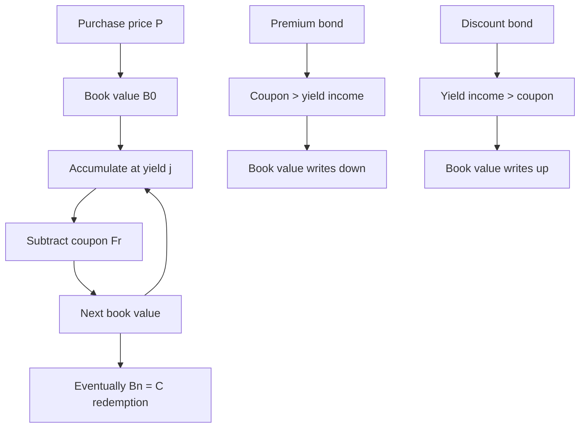
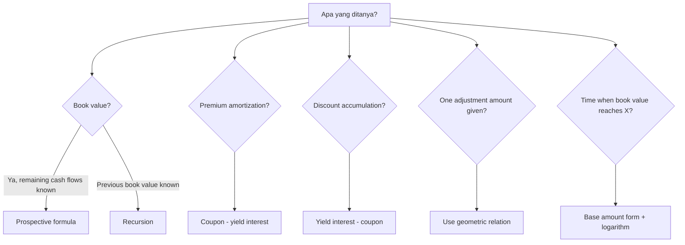

# 📘 5.2 — Book Value, Premium and Discount Amortization

> [!ABSTRACT] Ringkasan Cepat
> **Topik:** Book Value, Premium and Discount Amortization  
> **Bobot Parent Topic:** 10–20%  
> **Exam Priority:** High  
> **Difficulty:** Calculation-Intensive  
> **Primary Skill:** Calculation + Interpretation  
> **Ref:** Vaaler Bab 6 §6.5; Kellison Bab 6  
>
> **Inti:** *Book value* obligasi adalah nilai obligasi pada suatu coupon date berdasarkan **yield yang digunakan saat valuasi/pembelian**, bukan market price baru. Jika $B_t$ adalah book value segera setelah coupon ke-$t$, maka:
>
> $$
> B_t
> =
> Fr\,a_{\overline{n-t}|j}
> +
> Cv_j^{\,n-t},
> $$
>
> dan recursion paling penting adalah:
>
> $$
> \boxed{
> B_t=(1+j)B_{t-1}-Fr.
> }
> $$
>
> Untuk premium bond, coupon lebih besar daripada yield income sehingga book value **turun** menuju redemption value. Untuk discount bond, yield income lebih besar daripada coupon sehingga book value **naik** menuju redemption value.

---

## Section 0 — Pemetaan Silabus & Exam Scope

| Field | Isi |
|---|---|
| Topik CF1 | Topik 5 — Model Penentuan Harga Obligasi |
| Subtopik | 5.2 Book Value, Premium and Discount Amortization |
| Learning Outcome | Menghitung nilai buku, amortisasi premium, akumulasi discount, serta waktu ketika book value / amortization mencapai nilai tertentu. |
| Skill Diuji | Menghitung book value secara prospective atau recursion; membagi coupon menjadi yield-interest component dan principal adjustment; menentukan premium amortization / discount accumulation per coupon; menghitung total amortization selama beberapa periode; menyusun bond amortization schedule; menyelesaikan unknown time/book value dari hubungan book value. |
| Bobot Parent Topic | 10–20% |
| Exam Priority | High |
| Prerequisite | Bond pricing, premium-discount formula, periodic yield, annuity-immediate, loan amortization mechanics |
| Connected Topics | [[5.1 Bond Pricing]], [[5.3 Yield Rate and Coupon Calculations]], [[4.2 Amortization Method]], [[1.3 Cash Flow Equations and Inflation]] |
| Referensi | Silabus CF1 Topik 5; Vaaler Bab 6 §6.5; Kellison Bab 6 |

> [!IMPORTANT] Scope Boundary
> [CORE CF1] Note ini fokus pada **book value pada coupon dates**, **bond amortization schedule**, **premium amortization**, **discount accumulation**, dan calculation terhadap waktu/period yang secara eksplisit tercakup learning outcome.
>
> Valuation **di antara coupon dates** dan clean/dirty price adalah supporting context dan bukan fokus utama note ini. Menentukan yield, coupon rate, term, atau redemption sebagai unknown utama dibahas lebih lanjut di [[5.3 Yield Rate and Coupon Calculations]].
>
> Calculator worksheet dari textbook tidak digunakan sebagai metode utama.

---

## Section 1 — Intuisi & Big Picture

### 1.1 Bond Amortization = Loan Amortization dari Sudut yang Berbeda

Vaaler menekankan bahwa bond adalah **certificate of indebtedness**. Dari sisi issuer, bond adalah utang; dari sisi investor, bond adalah investasi yang memberi coupons dan redemption payment.

Karena itu struktur book value sangat dekat dengan amortized loan:

```text
Book value setelah coupon sebelumnya
        ↓ accrue pada investor's yield
Value tepat sebelum coupon berikutnya
        ↓ coupon diterima
Book value setelah coupon berikutnya
```

Jika book value setelah coupon ke-$(t-1)$ adalah $B_{t-1}$, maka satu coupon period kemudian nilainya tumbuh menjadi:

$$
B_{t-1}(1+j).
$$

Setelah investor menerima coupon $Fr$:

$$
\boxed{
B_t=B_{t-1}(1+j)-Fr.
}
$$

Ini adalah persamaan pusat seluruh subtopik.

---

### 1.2 Mengapa Book Value Harus Menuju Redemption Value?

Pada waktu pembelian:

$$
B_0=P.
$$

Pada maturity, segera setelah coupon terakhir tetapi sebelum redemption payment:

$$
B_n=C.
$$

Jadi book value membentuk transisi:

$$
\boxed{
B_0=P
\longrightarrow
B_n=C.
}
$$

Jika bond dibeli premium:

$$
P>C,
$$

maka book value harus turun menuju $C$.

Jika bond dibeli discount:

$$
P<C,
$$

maka book value harus naik menuju $C$.

Jika dibeli at par relative to redemption:

$$
P=C,
$$

book value tetap $C$ pada setiap coupon date jika coupon-yield relation juga konsisten.

---

### 1.3 Book Value Bukan Market Price

> [!IMPORTANT] Important Distinction
> **Book value** dihitung menggunakan investor's original yield basis.
>
> **Market price** pada waktu mendatang dapat memakai market yield yang sudah berubah.
>
> Karena itu secara umum:
>
> $$
> \boxed{
> B_t\neq \text{market price at time }t.
> }
> $$

Book value adalah accounting/valuation path yang “smoothly” menghubungkan purchase price ke redemption value berdasarkan original yield.

---

## Section 2 — Definisi & Core Concepts

### 2.1 Notation

Notation utama mengikuti Vaaler.

| Simbol | Makna |
|---|---|
| $F$ | Face/par value |
| $C$ | Redemption value |
| $Fr=Cg$ | Coupon payment |
| $g=Fr/C$ | Modified coupon rate per coupon period |
| $j$ | Investor's effective yield per coupon period |
| $n$ | Total number of coupon periods |
| $B_t$ | Book value immediately after coupon ke-$t$, sebelum redemption payment |
| $I_t$ | Yield-interest amount dalam coupon ke-$t$ |
| $P_t$ | Adjustment of principal pada coupon ke-$t$ menurut notation Vaaler |
| $v_j=(1+j)^{-1}$ | Periodic discount factor |

> [!WARNING] Symbol Collision
> Di Topik 5.1, $P$ berarti **bond purchase price**.
>
> Di Vaaler §6.5, $P_t$ berarti **adjustment of principal** dalam coupon ke-$t$.
>
> Jangan tertukar:
>
> $$
> B_0=P
> $$
>
> tetapi:
>
> $$
> P_t=B_{t-1}-B_t.
> $$

---

### 2.2 Book Value — Prospective Formula

Pada waktu $t$, setelah coupon ke-$t$ sudah dibayar, masih ada:

- $n-t$ coupons;
- redemption $C$ pada akhir period ke-$(n-t)$ dari waktu tersebut.

Maka:

$$
\boxed{
B_t
=
Fr\,a_{\overline{n-t}|j}
+
Cv_j^{\,n-t}.
}
$$

Dengan $Fr=Cg$:

$$
B_t
=
Cg\,a_{\overline{n-t}|j}
+
Cv_j^{\,n-t}.
$$

Gunakan premium-discount identity:

$$
\boxed{
B_t
=
C
+
C(g-j)a_{\overline{n-t}|j}.
}
$$

Ini sangat penting karena langsung menunjukkan posisi book value terhadap redemption value.

---

### 2.3 Boundary Conditions

Pada $t=0$:

$$
B_0=P.
$$

Pada $t=n$:

$$
a_{\overline{0}|j}=0,
\qquad
v_j^0=1,
$$

sehingga:

$$
\boxed{
B_n=C.
}
$$

---

### 2.4 Yield-Interest Amount

Vaaler mendefinisikan interest due/earned pada coupon ke-$t$ sebagai:

$$
\boxed{
I_t=jB_{t-1}.
}
$$

Interpretasinya:

> Investor harus memperoleh yield $j$ atas book value pada awal coupon period.

Jadi $I_t$ adalah **yield income**, bukan otomatis coupon cash received.

Coupon cash received adalah:

$$
Fr=Cg.
$$

---

### 2.5 Adjustment of Principal

Vaaler mendefinisikan:

$$
\boxed{
P_t=B_{t-1}-B_t.
}
$$

Karena:

$$
B_t=B_{t-1}(1+j)-Fr,
$$

maka:

$$
B_{t-1}-B_t
=
Fr-jB_{t-1}.
$$

Jadi:

$$
\boxed{
P_t
=
Fr-I_t.
}
$$

atau:

$$
\boxed{
Fr=I_t+P_t.
}
$$

Ini mirip decomposition payment pada amortized loan.

---

### 2.6 Closed Formula untuk Adjustment of Principal

Dari premium-discount form:

$$
B_t
=
C+C(g-j)a_{\overline{n-t}|j},
$$

dan:

$$
B_{t-1}
=
C+C(g-j)a_{\overline{n-t+1}|j}.
$$

Maka:

$$
P_t
=
B_{t-1}-B_t.
$$

Karena:

$$
a_{\overline{m+1}|j}
-
a_{\overline{m}|j}
=
v_j^{m+1},
$$

diperoleh:

$$
\boxed{
P_t
=
C(g-j)v_j^{\,n-t+1}.
}
$$

Formula ini sangat exam-useful.

---

### 2.7 Closed Formula untuk Yield Interest

Karena:

$$
Fr=I_t+P_t,
$$

maka:

$$
\boxed{
I_t
=
Cg-C(g-j)v_j^{\,n-t+1}.
}
$$

Equivalent dan sering lebih mudah:

$$
\boxed{
I_t=jB_{t-1}.
}
$$

Dalam soal numerik, recursion/book value biasanya lebih aman daripada menghafal formula panjang $I_t$.

---

## Section 3 — Premium Bond: Writing Down

### 3.1 Kondisi Premium

Bond premium jika:

$$
P>C.
$$

Dengan modified coupon rate:

$$
g>j.
$$

Jadi:

$$
C(g-j)>0.
$$

Akibatnya:

$$
P_t
=
C(g-j)v_j^{\,n-t+1}
>0.
$$

Karena:

$$
P_t=B_{t-1}-B_t,
$$

maka:

$$
\boxed{
B_t<B_{t-1}.
}
$$

Book value **turun** setiap coupon period.

---

### 3.2 Premium Amortization per Coupon

Coupon:

$$
Fr.
$$

Yield income:

$$
I_t=jB_{t-1}.
$$

Karena premium bond mempunyai coupon lebih besar daripada yield income:

$$
Fr>I_t.
$$

Selisihnya adalah premium amortized:

$$
\boxed{
\text{Premium amortization in coupon }t
=
Fr-jB_{t-1}.
}
$$

Dalam notation Vaaler:

$$
\boxed{
P_t>0.
}
$$

---

### 3.3 Remaining Premium

Premium yang masih tersisa setelah coupon ke-$t$ adalah:

$$
B_t-C.
$$

Dari book-value formula:

$$
\boxed{
B_t-C
=
C(g-j)a_{\overline{n-t}|j}.
}
$$

Saat $t=n$:

$$
B_n-C=0.
$$

---

### 3.4 Total Premium Amortized sampai Waktu $t$

Initial premium:

$$
P-C=B_0-C.
$$

Remaining premium:

$$
B_t-C.
$$

Jadi total premium yang sudah diamortisasi:

$$
\boxed{
(B_0-C)-(B_t-C)
=
B_0-B_t.
}
$$

Ini shortcut penting untuk soal yang meminta total amortization selama beberapa coupon periods.

---

## Section 4 — Discount Bond: Writing Up

### 4.1 Kondisi Discount

Bond discount jika:

$$
P<C,
$$

atau:

$$
g<j.
$$

Maka:

$$
g-j<0,
$$

sehingga:

$$
P_t
=
C(g-j)v_j^{\,n-t+1}
<0.
$$

Karena:

$$
P_t=B_{t-1}-B_t,
$$

negative $P_t$ berarti:

$$
\boxed{
B_t>B_{t-1}.
}
$$

Book value **naik** menuju redemption value.

---

### 4.2 Discount Accumulation per Coupon

Pada discount bond:

$$
I_t=jB_{t-1}>Fr.
$$

Coupon tidak cukup untuk membayar seluruh yield income. Selisihnya tidak dibayar cash, melainkan “ditambahkan” ke book value.

Amount for accumulation of discount:

$$
\boxed{
I_t-Fr
=
jB_{t-1}-Fr.
}
$$

Karena $P_t=Fr-I_t$:

$$
\boxed{
\text{Discount accumulation}
=
-P_t.
}
$$

---

### 4.3 Remaining Discount

Setelah coupon ke-$t$:

$$
\boxed{
C-B_t
=
C(j-g)a_{\overline{n-t}|j}.
}
$$

Saat maturity:

$$
C-B_n=0.
$$

---

### 4.4 Total Discount Accumulated

Initial discount:

$$
C-B_0.
$$

Remaining discount:

$$
C-B_t.
$$

Discount yang sudah diakumulasi hingga waktu $t$:

$$
\boxed{
(C-B_0)-(C-B_t)
=
B_t-B_0.
}
$$

---

## Section 5 — Unified Book-Value Mechanics

Premium dan discount dapat ditangani dengan satu recursion:

$$
\boxed{
B_t=(1+j)B_{t-1}-Fr.
}
$$

atau:

$$
\boxed{
B_t-B_{t-1}
=
jB_{t-1}-Fr.
}
$$

Interpretasi sign:

| Kondisi | $jB_{t-1}-Fr$ | Perubahan $B_t$ | Makna |
|---|---:|---:|---|
| Premium | negative | $B_t<B_{t-1}$ | premium amortized |
| Par | zero | unchanged | no adjustment |
| Discount | positive | $B_t>B_{t-1}$ | discount accumulated |

> [!TIP] Satu Formula untuk Semuanya
> Jika kamu lupa apakah harus “plus” atau “minus” premium/discount, jangan hafalkan dua recursion.
>
> Selalu gunakan:
>
> $$
> B_t=(1+j)B_{t-1}-Fr.
> $$
>
> Arah book value akan muncul otomatis.

---

## Section 6 — Geometric Pattern of Principal Adjustment

Karena:

$$
P_t
=
C(g-j)v_j^{\,n-t+1},
$$

maka:

$$
P_{t+1}
=
C(g-j)v_j^{\,n-t}.
$$

Jadi:

$$
\boxed{
P_{t+1}
=
(1+j)P_t.
}
$$

Untuk premium bond, positive premium amortization amounts meningkat dengan ratio:

$$
1+j.
$$

Untuk discount bond, $P_t$ negative, tetapi magnitude discount accumulation juga meningkat dengan ratio:

$$
1+j.
$$

> [!IMPORTANT] Exam Shortcut
> Jika diberikan amount of premium amortization / discount accumulation pada satu coupon dan ditanya coupon lain, geometric progression sering jauh lebih cepat daripada membangun seluruh schedule.

---

## Section 7 — Solving for Book Value or Time

### 7.1 Book Value setelah $t$ Coupons

Pilih salah satu:

**Prospective**

$$
\boxed{
B_t
=
Fr a_{\overline{n-t}|j}
+
Cv_j^{n-t}.
}
$$

**Premium-discount form**

$$
\boxed{
B_t
=
C+C(g-j)a_{\overline{n-t}|j}.
}
$$

**Recursion**

$$
\boxed{
B_t=(1+j)B_{t-1}-Fr.
}
$$

**Base-amount form**

Dari [[5.1 Bond Pricing]], jika:

$$
G=\frac{Fr}{j},
$$

maka book value dengan $n-t$ remaining periods adalah:

$$
\boxed{
B_t
=
G+(C-G)v_j^{n-t}.
}
$$

---

### 7.2 Menentukan Waktu Ketika Book Value Diketahui

Base-amount form sangat nyaman:

$$
B_t
=
G+(C-G)v_j^{n-t}.
$$

Isolate:

$$
v_j^{n-t}
=
\frac{B_t-G}{C-G}.
$$

Maka:

$$
n-t
=
\frac{
\ln\left(\frac{B_t-G}{C-G}\right)
}{
\ln v_j
}.
$$

Sehingga:

$$
\boxed{
t
=
n
-
\frac{
\ln\left(\frac{B_t-G}{C-G}\right)
}{
\ln v_j
}.
}
$$

> [!WARNING] Discrete-Time Check
> Jika $t$ harus coupon date, hasil harus sesuai integer coupon count. Jangan membulatkan sembarang tanpa melihat wording soal.

---

## Section 8 — Standard Bond Amortization Schedule

Untuk level coupon $Fr$:

| Time | Coupon | Yield Interest $I_t$ | Principal Adjustment $P_t$ | Book Value $B_t$ |
|---:|---:|---:|---:|---:|
| $0$ | — | — | — | $B_0=P$ |
| $1$ | $Fr$ | $jB_0$ | $Fr-jB_0$ | $B_1$ |
| $2$ | $Fr$ | $jB_1$ | $Fr-jB_1$ | $B_2$ |
| $\vdots$ | $\vdots$ | $\vdots$ | $\vdots$ | $\vdots$ |
| $t$ | $Fr$ | $jB_{t-1}$ | $Fr-jB_{t-1}$ | $B_t$ |
| $\vdots$ | $\vdots$ | $\vdots$ | $\vdots$ | $\vdots$ |
| $n$ | $Fr$ | $jB_{n-1}$ | $Fr-jB_{n-1}$ | $B_n=C$ |

Setiap row mengikuti:

$$
I_t=jB_{t-1},
$$

$$
P_t=Fr-I_t,
$$

$$
B_t=B_{t-1}-P_t.
$$

Equivalent:

$$
B_t=B_{t-1}(1+j)-Fr.
$$

---

## Section 9 — Worked Examples & Exam Cases

### Case A — Premium Bond: Full Writing-Down Schedule

[TEXTBOOK EXAMPLE — Vaaler Example 6.5.17]

Sebuah 8% par-value bond:

- face/redemption value:

  $$
  F=C=100{,}000;
  $$

- semiannual coupons;
- maturity 4 tahun;
- nominal yield 6% convertible semiannually.

Construct amortization schedule.

> [!SUCCESS] Pembahasan
>
> **1. Coupon amount**
>
> Nominal coupon rate:
>
> $$
> \alpha=8\%.
> $$
>
> Semiannual:
>
> $$
> r=\frac{0.08}{2}=0.04.
> $$
>
> Maka:
>
> $$
> Fr=100{,}000(0.04)=4{,}000.
> $$
>
> **2. Number of periods**
>
> $$
> n=4(2)=8.
> $$
>
> **3. Periodic yield**
>
> $$
> j=\frac{0.06}{2}=0.03.
> $$
>
> **4. Initial book value**
>
> $$
> B_0
> =
> 4{,}000a_{\overline{8}|0.03}
> +
> 100{,}000(1.03)^{-8}.
> $$
>
> Vaaler memperoleh:
>
> $$
> \boxed{
> B_0=P\approx107{,}019.69.
> }
> $$
>
> Karena:
>
> $$
> P>C,
> $$
>
> bond dibeli premium.
>
> **5. Schedule**
>
> | Time (half-year) | Coupon | $I_t$ | Premium Amortization $P_t$ | $B_t$ |
> |---:|---:|---:|---:|---:|
> | 0 | — | — | — | 107,019.69 |
> | 1 | 4,000.00 | 3,210.59 | 789.41 | 106,230.28 |
> | 2 | 4,000.00 | 3,186.91 | 813.09 | 105,417.19 |
> | 3 | 4,000.00 | 3,162.52 | 837.48 | 104,579.70 |
> | 4 | 4,000.00 | 3,137.39 | 862.61 | 103,717.10 |
> | 5 | 4,000.00 | 3,111.51 | 888.49 | 102,828.61 |
> | 6 | 4,000.00 | 3,084.86 | 915.14 | 101,913.47 |
> | 7 | 4,000.00 | 3,057.40 | 942.60 | 100,970.87 |
> | 8 | 4,000.00 | 3,029.13 | 970.87 | 100,000.00 |
>
> **6. Interpretation**
>
> Coupon tetap $4{,}000$, tetapi yield interest turun karena book value turun:
>
> $$
> I_t=0.03B_{t-1}.
> $$
>
> Karena coupon fixed:
>
> $$
> P_t=4{,}000-I_t
> $$
>
> meningkat dari period ke period.
>
> Book value akhirnya:
>
> $$
> B_8=C=100{,}000.
> $$

> [!WARNING] Exam Trap — Case A
> - **Trap:** menganggap coupon seluruhnya adalah interest income.
> - **Benar:** yield income adalah $jB_{t-1}$; sisanya mengurangi premium.
> - **Shortcut:** setelah $B_{t-1}$ diketahui, satu row hanya membutuhkan `interest → adjustment → new book value`.
> - **Sanity:** premium bond harus *write down* ke redemption value.

---

### Case B — Amount of Premium Amortization pada Specific Coupon

[TEXTBOOK EXAMPLE — Vaaler Example 6.5.14]

Sebuah 12-year bond dengan semiannual level coupons dibeli premium untuk yield nominal 7.5% convertible semiannually.

Diketahui premium amortization pada **fourth-to-last payment**, yaitu coupon ke-21:

$$
P_{21}=8.02.
$$

Cari:

1. initial premium;
2. total premium amortized dalam tiga tahun pertama.

> [!SUCCESS] Pembahasan
>
> **1. Periodic setup**
>
> $$
> n=12(2)=24.
> $$
>
> $$
> j=\frac{0.075}{2}=0.0375.
> $$
>
> Formula principal adjustment:
>
> $$
> P_t
> =
> C(g-j)v^{n-t+1}.
> $$
>
> Untuk $t=21$:
>
> $$
> P_{21}
> =
> C(g-j)v^4.
> $$
>
> Maka:
>
> $$
> C(g-j)
> =
> 8.02(1.0375)^4.
> $$
>
> **2. Initial premium**
>
> Initial premium:
>
> $$
> P-C
> =
> C(g-j)a_{\overline{24}|0.0375}.
> $$
>
> Jadi:
>
> $$
> P-C
> =
> 8.02(1.0375)^4
> a_{\overline{24}|0.0375}.
> $$
>
> Vaaler memperoleh:
>
> $$
> \boxed{
> \text{Initial premium}\approx145.38.
> }
> $$
>
> **3. Total premium amortized dalam 3 tahun**
>
> Semiannual berarti tiga tahun = enam coupons.
>
> Total amortized:
>
> $$
> B_0-B_6.
> $$
>
> Vaaler memperoleh:
>
> $$
> \boxed{
> B_0-B_6\approx25.32.
> }
> $$

> [!TIP] Exam Shortcut — Case B
> Diberi satu $P_t$ tidak berarti harus membangun schedule. Karena:
>
> $$
> P_{t+1}=(1+j)P_t,
> $$
>
> principal adjustments membentuk geometric progression.

---

### Case C — Discount Accumulation pada Coupon Tertentu

[TEXTBOOK EXAMPLE — Vaaler Example 6.5.15]

Sebuah:

- par-value bond $F=C=10{,}000$;
- maturity 20 tahun;
- annual coupon rate 14%;
- annual coupons;
- purchase price $9{,}562$.

Cari:

1. discount accumulation dalam coupon ke-3;
2. interest/yield income pada tahun ke-3.

> [!SUCCESS] Pembahasan
>
> **1. Coupon**
>
> $$
> Fr=10{,}000(0.14)=1{,}400.
> $$
>
> **2. Yield**
>
> Yield $j$ memenuhi:
>
> $$
> 9{,}562
> =
> 1{,}400a_{\overline{20}|j}
> +
> 10{,}000v_j^{20}.
> $$
>
> Vaaler memperoleh:
>
> $$
> j\approx14.68768719\%.
> $$
>
> Karena:
>
> $$
> j>14\%,
> $$
>
> bond adalah discount bond.
>
> **3. Third-period discount accumulation**
>
> Vaaler memperoleh:
>
> $$
> \boxed{
> \text{Discount accumulation in coupon 3}
> \approx5.83.
> }
> $$
>
> **4. Yield interest**
>
> Karena:
>
> $$
> \text{discount accumulation}
> =
> I_3-Fr,
> $$
>
> maka:
>
> $$
> I_3
> \approx
> 1{,}400+5.83
> \approx
> 1{,}405.83.
> $$
>
> Dengan unrounded calculation, textbook melaporkan sekitar:
>
> $$
> \boxed{
> I_3\approx1{,}405.84.
> }
> $$
>
> Perbedaan satu cent muncul dari rounding.

> [!WARNING] Exam Trap — Case C
> Pada discount bond:
>
> $$
> I_t>Fr.
> $$
>
> Jadi “principal adjustment” Vaaler $P_t$ menjadi negative. Lebih intuitif untuk menyebut magnitude positifnya sebagai **discount accumulation**:
>
> $$
> I_t-Fr.
> $$

---

### Case D — Book Values Diketahui, Cari Price

[TEXTBOOK EXAMPLE — Vaaler Example 6.5.16]

Sebuah $1{,}000$ par-value bond dengan annual coupon rate 8% memiliki annual coupons.

Diketahui:

$$
B_3=990.92,
$$

$$
B_5=995.26.
$$

Cari purchase price.

> [!SUCCESS] Pembahasan
>
> Coupon:
>
> $$
> Fr=1{,}000(0.08)=80.
> $$
>
> Dari time 3 ke time 5:
>
> $$
> B_5
> =
> B_3(1+i)^2
> -
> 80(1+i)
> -
> 80.
> $$
>
> Substitusi:
>
> $$
> 995.26
> =
> 990.92(1+i)^2
> -
> 80(1+i)
> -
> 80.
> $$
>
> Rearrangement:
>
> $$
> 990.92(1+i)^2
> -
> 80(1+i)
> -
> 1{,}075.26
> =
> 0.
> $$
>
> Vaaler memperoleh:
>
> $$
> 1+i\approx1.082835847.
> $$
>
> Jadi:
>
> $$
> i\approx8.2835847\%.
> $$
>
> Setelah yield ditemukan, hubungkan purchase date ke $B_3$:
>
> $$
> P
> =
> 80a_{\overline{3}|i}
> +
> 990.92v_i^3.
> $$
>
> Hasil:
>
> $$
> \boxed{
> P\approx985.58.
> }
> $$

> [!IMPORTANT] Exam Lesson — Case D
> Book values pada dua dates dapat diperlakukan sebagai nilai transaksi pada timeline yang sama. Tidak harus selalu kembali dulu ke redemption date.

---

## Section 10 — Verification & Sanity Checks

> [!CHECK] Sanity Check
>
> ### 1. Endpoint
>
> Selalu:
>
> $$
> B_0=P,
> \qquad
> B_n=C.
> $$
>
> ### 2. Premium Direction
>
> Jika:
>
> $$
> P>C,
> $$
>
> maka:
>
> $$
> B_0>B_1>\cdots>B_n=C.
> $$
>
> ### 3. Discount Direction
>
> Jika:
>
> $$
> P<C,
> $$
>
> maka:
>
> $$
> B_0<B_1<\cdots<B_n=C.
> $$
>
> ### 4. Coupon Decomposition
>
> Setiap period:
>
> $$
> \boxed{
> Fr=I_t+P_t.
> }
> $$
>
> ### 5. Recursion Reconciliation
>
> Dua forms harus sama:
>
> $$
> B_t=B_{t-1}-P_t
> $$
>
> dan:
>
> $$
> B_t=(1+j)B_{t-1}-Fr.
> $$
>
> ### 6. Total Premium
>
> Premium awal:
>
> $$
> P-C.
> $$
>
> Total positive $P_t$ sepanjang life bond harus menghabiskan premium tersebut.
>
> ### 7. Total Discount
>
> Untuk discount bond, total discount accumulation harus membawa:
>
> $$
> P\to C.
> $$
>
> ### 8. Rate Basis
>
> $j$ harus yield **per coupon period**.
>
> Semiannual nominal yield 6% convertible semiannually:
>
> $$
> j=3\%.
> $$
>
> Annual effective yield 6% dengan semiannual coupons:
>
> $$
> j=(1.06)^{1/2}-1.
> $$

---

## Section 11 — Connections & Mental Model



### Connection ke [[5.1 Bond Pricing]]

Initial price:

$$
P
=
Fr a_{\overline{n}|j}
+
Cv^n.
$$

Book value pada waktu $t$ adalah formula yang sama dengan **remaining term**:

$$
B_t
=
Fr a_{\overline{n-t}|j}
+
Cv^{n-t}.
$$

Jadi book value bukan konsep pricing baru; ia hanya **re-pricing remaining contractual cash flows pada original yield**.

---

### Connection ke [[4.2 Amortization Method]]

Loan recursion:

$$
B_t^{loan}
=
B_{t-1}^{loan}(1+i)-R_t.
$$

Bond recursion:

$$
B_t^{bond}
=
B_{t-1}^{bond}(1+j)-Fr.
$$

Struktur matematikanya identik.

Perbedaan penting: pada loan, balance biasanya menuju $0$ setelah final payment; pada bond book-value schedule, balance menuju redemption amount $C$ sebelum redemption dibayar.

---

### Mental Model — “Coupon = Yield Income ± Principal Adjustment”

Premium:

```text
Coupon
├─ yield income
└─ premium amortization
```

Discount:

```text
Yield income
├─ coupon received in cash
└─ discount accumulation added to book value
```

---

## Section 12 — Exam Traps & Misconceptions

### Book Value vs Market Price

> [!BUG] Book Value Trap
> **Salah:** “Book value pada tahun ke-5 = harga pasar pada tahun ke-5.”
>
> **Benar:** book value menggunakan original valuation yield. Market price dapat berbeda jika market yield berubah.

---

### Before vs After Coupon

> [!BUG] Timing Trap
> $B_t$ Vaaler diukur **immediately after coupon ke-$t$**, sebelum redemption payment jika $t=n$.
>
> Karena itu interest period berikutnya dimulai dari $B_t$.

---

### Yield Interest vs Coupon

> [!BUG] Income Trap
> Coupon cash:
>
> $$
> Fr.
> $$
>
> Yield income:
>
> $$
> jB_{t-1}.
> $$
>
> Keduanya hanya sama pada par/no-adjustment situation.

---

### Premium Sign

> [!BUG] Premium Sign Trap
> Premium bond:
>
> $$
> Fr-jB_{t-1}>0.
> $$
>
> Jadi:
>
> $$
> B_t=B_{t-1}-(\text{premium amortization}).
> $$

---

### Discount Sign

> [!BUG] Discount Sign Trap
> Discount bond:
>
> $$
> jB_{t-1}-Fr>0.
> $$
>
> Jadi book value **naik**, bukan turun.

---

### Face vs Redemption

> [!BUG] Definition Trap
> Premium dan discount secara formal dibandingkan terhadap:
>
> $$
> C,
> $$
>
> bukan otomatis $F$.
>
> Hanya jika:
>
> $$
> F=C
> $$
>
> kedua comparison sama.

---

### Frequency

> [!BUG] Frequency Trap
> Coupon semiannual → semua:
>
> - $t$,
> - $n$,
> - $j$,
> - annuity factor,
> - exponent
>
> harus berada pada half-year basis.

---

### Red Flags

| Keyword / Kondisi | Pikirkan |
|---|---|
| “book value after the $k$th coupon” | PV remaining cash flows atau recursion |
| “amortization of premium in coupon $t$” | $Fr-jB_{t-1}$ |
| “accumulation of discount in coupon $t$” | $jB_{t-1}-Fr$ |
| “total premium amortized first 3 years” | $B_0-B_6$ jika semiannual |
| “remaining premium” | $B_t-C$ |
| “remaining discount” | $C-B_t$ |
| “premium amortization at one coupon known” | geometric relation $P_{t+1}=(1+j)P_t$ |
| “book values at two dates known” | roll forward between dates |
| “when book value equals…” | base-amount formula + logs |
| “market value” | jangan otomatis gunakan original book yield |
| “immediately after coupon” | cocok dengan definition $B_t$ |

---

## Section 13 — Executive Summary

> [!SUMMARY] Must Remember
>
> **Book value**
>
> $$
> \boxed{
> B_t
> =
> Fr a_{\overline{n-t}|j}
> +
> Cv_j^{n-t}
> }
> $$
>
> atau:
>
> $$
> \boxed{
> B_t
> =
> C+C(g-j)a_{\overline{n-t}|j}.
> }
> $$
>
> **Endpoints**
>
> $$
> \boxed{
> B_0=P,\qquad B_n=C.
> }
> $$
>
> **Yield interest**
>
> $$
> \boxed{
> I_t=jB_{t-1}.
> }
> $$
>
> **Principal adjustment**
>
> $$
> \boxed{
> P_t=B_{t-1}-B_t=Fr-I_t.
> }
> $$
>
> **Closed form**
>
> $$
> \boxed{
> P_t=C(g-j)v_j^{n-t+1}.
> }
> $$
>
> **Recursion**
>
> $$
> \boxed{
> B_t=(1+j)B_{t-1}-Fr.
> }
> $$
>
> **Premium amortization**
>
> $$
> \boxed{
> Fr-jB_{t-1}.
> }
> $$
>
> **Discount accumulation**
>
> $$
> \boxed{
> jB_{t-1}-Fr.
> }
> $$
>
> **Geometric relation**
>
> $$
> \boxed{
> P_{t+1}=(1+j)P_t.
> }
> $$

### Formula Map

| Ditanya | Formula Cepat | Sanity Check |
|---|---|---|
| Book value after coupon $t$ | $Fr a_{\overline{n-t}|j}+Cv^{n-t}$ | harus menuju $C$ |
| Book value dari previous row | $(1+j)B_{t-1}-Fr$ | direction premium/discount |
| Yield interest | $jB_{t-1}$ | rate × beginning book value |
| Premium amortization | $Fr-jB_{t-1}$ | positive untuk premium |
| Discount accumulation | $jB_{t-1}-Fr$ | positive untuk discount |
| Principal adjustment | $B_{t-1}-B_t$ | positive premium, negative discount |
| Remaining premium | $B_t-C$ | → 0 |
| Remaining discount | $C-B_t$ | → 0 |
| Total premium amortized through $t$ | $B_0-B_t$ | positive premium |
| Total discount accumulated through $t$ | $B_t-B_0$ | positive discount |
| Adjustment at another coupon | $P_{t+k}=P_t(1+j)^k$ | geometric |
| Time from known $B_t$ | use $B_t=G+(C-G)v^{n-t}$ | check integer coupon date |

---

## Section 14 — Quick Decision Tree



---

## Section 15 — Active Recall Check

1. Definisikan book value $B_t$ secara tepat terhadap timing coupon.
2. Mengapa $B_0=P$ tetapi $B_n=C$?
3. Mengapa book value bukan market price?
4. Tulis prospective formula $B_t$.
5. Tulis premium-discount form untuk $B_t$.
6. Tulis recursion book value.
7. Apa yield-interest portion coupon ke-$t$?
8. Apa definisi Vaaler untuk adjustment of principal $P_t$?
9. Buktikan $Fr=I_t+P_t$.
10. Turunkan $P_t=C(g-j)v^{n-t+1}$.
11. Mengapa $P_t>0$ untuk premium bond?
12. Mengapa $P_t<0$ untuk discount bond?
13. Apa formula premium amortization?
14. Apa formula discount accumulation?
15. Jika premium bond, apakah $B_t$ naik atau turun?
16. Jika discount bond, apakah $B_t$ naik atau turun?
17. Apa hubungan $P_{t+1}$ dan $P_t$?
18. Bagaimana menghitung total premium amortized selama beberapa periods tanpa menjumlah satu per satu?
19. Bagaimana menghitung remaining discount setelah coupon ke-$t$?
20. Sebuah semiannual bond memiliki book value pada akhir tahun ke-3. Berapa coupon periods telah lewat?
21. Jika nominal yield 8% convertible semiannually, berapa $j$?
22. Jika annual effective yield 8% dan semiannual coupons, bagaimana menghitung $j$?
23. Mengapa coupon rate tidak boleh langsung dipakai sebagai $j$?
24. Jika $F\neq C$, premium/discount dibandingkan terhadap nilai apa?
25. Bagaimana mencari $t$ dari known book value menggunakan base-amount formula?
26. Jika $P>C$ tetapi schedule yang kamu hitung menunjukkan book value naik, error apa yang mungkin terjadi?
27. Apa hubungan subtopik ini dengan loan amortization?
28. Mengapa yield income pada discount bond lebih besar daripada coupon?
29. Apa yang terjadi jika $g=j$?
30. Mengapa final book value tepat sama dengan redemption value?

---

## Section 16 — Exam Pattern Map

[TEXTBOOK-BASED EXPECTATION]

| Narasi Soal | Keyword | Konsep | Formula / Rule | Langkah | Trap | Shortcut |
|---|---|---|---|---|---|---|
| Cari book value setelah coupon ke-$t$ | “book value” | Prospective valuation | $B_t=Fr a_{n-t}+Cv^{n-t}$ | remaining periods → PV | memakai original $n$ | replace $n$ dengan $n-t$ |
| Previous book value diketahui | “next book value” | Recursion | $B_t=(1+j)B_{t-1}-Fr$ | accrue → subtract coupon | subtract coupon before interest | roll-forward |
| Premium amortization coupon $t$ | “amortization of premium” | Coupon split | $Fr-jB_{t-1}$ | yield income → subtract | coupon = interest | one-row method |
| Discount accumulation coupon $t$ | “accumulation of discount” | Yield exceeds coupon | $jB_{t-1}-Fr$ | interest → coupon | sign reversal | positive magnitude |
| Adjustment coupon lain | known $P_s$ | Geometric progression | $P_t=P_s(1+j)^{t-s}$ | count coupon gaps | use annual periods | direct ratio |
| Total premium first $k$ coupons | “total amortized” | Book-value difference | $B_0-B_k$ | compute two book values | sum rounded rows | endpoint difference |
| Total discount first $k$ coupons | “total accumulated” | Book-value increase | $B_k-B_0$ | compute endpoints | wrong sign | endpoint difference |
| Book values two dates given | “$B_s$, $B_t$” | Equation of value | roll forward with coupons | connect dates | jump to redemption | local timeline |
| Time when $B_t=X$ | “when book value…” | Solve exponent | base amount form | isolate $v^{n-t}$ → log | premature rounding | $G$ form |
| Construct schedule | “amortization schedule” | Full mechanics | $I_t$, $P_t$, $B_t$ | row-by-row | round too early | carry unrounded values |
| Premium vs discount check | “premium/discount” | Direction | $P$ vs $C$ or $g$ vs $j$ | compare | compare with face | check $C$ |

---

## Source Traceability

| Materi | Sumber |
|---|---|
| Scope Topik 5.2 dan learning outcomes | Silabus CF1 — Topik 5 |
| Bond amortization as special case of loan amortization | Vaaler Bab 6 introduction & §6.5 |
| Definition of book value $B_t$ | Vaaler §6.5 |
| $B_0=P$, $B_n=C$ | Vaaler Eq. 6.5.1 |
| Yield-interest amount $I_t=jB_{t-1}$ | Vaaler Eq. 6.5.2 |
| Principal adjustment $P_t=B_{t-1}-B_t$ | Vaaler Eq. 6.5.3 |
| Prospective book value formula | Vaaler Eq. 6.5.4; Kellison Bab 6 |
| Premium-discount form of book value | Vaaler §6.5 |
| Recursion $B_t=(1+j)B_{t-1}-Cg$ | Vaaler Eq. 6.5.12 |
| Premium amortization / discount accumulation interpretation | Vaaler §6.5; Kellison Bab 6 |
| Geometric progression of principal adjustments | Vaaler §6.5 formula for $P_t$ |
| Example 6.5.14 premium amortization | Vaaler §6.5 |
| Example 6.5.15 discount accumulation | Vaaler §6.5 |
| Example 6.5.16 book values and bond price | Vaaler §6.5 |
| Example 6.5.17 full premium schedule | Vaaler §6.5 |
| Book value / premium / discount synthesis | Kellison Bab 6 |
| Time-from-book-value method | Direct algebra from source-supported base amount/book-value formula |

> [!NOTE] Source Boundary
> Note ini menyintesis material yang langsung didukung oleh **silabus CF1 Topik 5**, **Vaaler Bab 6 §6.5**, dan **Kellison Bab 6**. Detailed clean/dirty price mechanics, sale between coupon dates, callable bonds, floating-rate bonds, dan calculator keystrokes tidak dijadikan materi inti 5.2.

---

> [!QUOTE] Follow-up Options
> 1. *"Continue chapter 5.3"*
> 2. *"Uji saya dengan soal book value & bond amortization"*
> 3. *"Buat 10 soal exam-style premium/discount amortization"*

*📖 Ref: Vaaler Bab 6 §6.5; Kellison Bab 6 | 🗓️ 2026-08-25 | #CF1 #MatematikaKeuangan*
