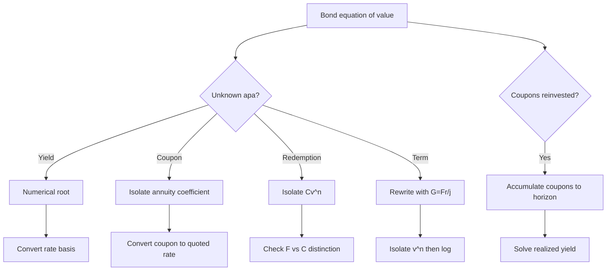

# 📘 5.3 — Yield Rate and Coupon Calculations

> [!ABSTRACT] Ringkasan Cepat
> **Topik:** Yield Rate and Coupon Calculations  
> **Bobot Parent Topic:** 10–20%  
> **Exam Priority:** High  
> **Difficulty:** Calculation-Intensive  
> **Primary Skill:** Equation of Value + Numerical Solving + Interpretation  
> **Ref:** Vaaler Bab 6; Kellison Bab 6  
>
> **Inti:** formula bond pricing yang sama dapat digunakan “secara terbalik” untuk mencari **yield**, **coupon amount**, **coupon rate**, **redemption value**, atau **term**. Untuk level-coupon bond:
>
> $$
> P
> =
> Fr\,a_{\overline{n}|j}
> +
> Cv_j^n.
> $$
>
> Jika $j$ unknown, persamaan biasanya menjadi **root-finding problem**. Jika coupon atau redemption unknown, equation dapat direarrange secara langsung. Jika term $n$ unknown, sering kali gunakan identitas annuity atau bentuk base amount untuk mengisolasi $v^n$ lalu logarithm/discrete search.
>
> Untuk soal conceptual premium bond, hubungan yang perlu dikenali adalah:
>
> $$
> \text{YTM}
> <
> \text{current yield}
> <
> \text{coupon rate},
> $$
>
> dengan semua rate dibandingkan pada basis annual yang konsisten dan pada par-value bond.

---

## Section 0 — Pemetaan Silabus & Exam Scope

| Field | Isi |
|---|---|
| Topik CF1 | Topik 5 — Model Penentuan Harga Obligasi |
| Subtopik | 5.3 Yield Rate and Coupon Calculations |
| Learning Outcome | Menghitung yield-related quantities, coupon dan coupon rate, redemption value / face value yang terkait, serta term atau waktu yang memenuhi kondisi bond tertentu. |
| Skill Diuji | Menyusun bond equation of value; menentukan yield dengan numerical root; mengonversi periodic ↔ nominal/effective annual yield; mencari coupon amount/rate; mencari term; memanfaatkan common $v^n$ pada beberapa bond; membedakan coupon rate, current yield, YTM, dan realized yield; menangani reinvestment of coupons ketika actual yield berbeda dari quoted YTM. |
| Bobot Parent Topic | 10–20% |
| Exam Priority | High |
| Prerequisite | Bond pricing, annuity notation, periodic rate conversion, equation of value, book value |
| Connected Topics | [[5.1 Bond Pricing]], [[5.2 Book Value, Premium and Discount Amortization]], [[1.2 Effective, Nominal, and Force of Interest]], [[2.1 Annuity-Immediate and Annuity-Due]] |
| Referensi | Silabus CF1 Topik 5; Vaaler Bab 6; Kellison Bab 6 |

> [!IMPORTANT] Scope Boundary
> [CORE CF1] Fokus note ini adalah **solving unknown quantities** dari model obligasi, terutama yield, coupon/coupon rate, redemption-related quantity, dan term.
>
> Detailed callable-bond optimization, serial bonds, floating-rate bonds, dan market quotation between coupon dates berada di luar inti subtopik ini kecuali digunakan sebagai supporting context.
>
> Soal **realized yield dengan reinvestment** dipertahankan sebagai bagian dari Vaaler §6.8 karena langsung menguji meaning of yield dan cash-flow realization.

---

## Section 1 — Big Picture: Satu Equation, Banyak Unknown

Bond pricing dari [[5.1 Bond Pricing]]:

$$
\boxed{
P
=
Fr\,a_{\overline{n}|j}
+
Cv_j^n
}
$$

mempunyai lima family of quantities:

1. price $P$;
2. coupon amount $Fr$;
3. redemption $C$;
4. term $n$;
5. yield $j$.

Di 5.1 kita biasanya diberi yield dan mencari price.

Di 5.3 arah problem dibalik:

```text
Price equation
├─ unknown yield
├─ unknown coupon
├─ unknown coupon rate
├─ unknown redemption
└─ unknown term
```

> [!TIP] Feynman Version
> Tidak ada “formula YTM baru”.
>
> YTM hanyalah rate yang membuat:
>
> $$
> \text{PV future bond cash flows}
> =
> \text{price paid}.
> $$

---

## Section 2 — Notation & Rate Declaration

Notation utama mengikuti Vaaler:

| Simbol | Makna |
|---|---|
| $F$ | face/par value |
| $\alpha$ | nominal annual coupon rate convertible $m$ times |
| $m$ | coupons per year |
| $r=\alpha/m$ | coupon rate per coupon period |
| $Fr$ | coupon amount per coupon period |
| $C$ | redemption value |
| $n$ | number of coupon periods |
| $P$ | purchase price |
| $j$ | effective yield per coupon period |
| $I$ | nominal annual yield convertible $m$ times |
| $i$ | annual effective yield |
| $v_j=(1+j)^{-1}$ | coupon-period discount factor |

### Rate Conversion

Jika nominal yield convertible $m$thly:

$$
\boxed{
j=\frac{I}{m}.
}
$$

Jika annual effective yield:

$$
\boxed{
j=(1+i)^{1/m}-1.
}
$$

Setelah periodic yield ditemukan:

$$
\boxed{
I=mj
}
$$

untuk nominal yield convertible $m$ times, dan:

$$
\boxed{
i=(1+j)^m-1
}
$$

untuk annual effective yield.

> [!DANGER] Rate Basis Trap
> Jangan melaporkan periodic root $j$ sebagai annual yield tanpa conversion.

---

## Section 3 — Yield to Maturity (YTM)

### 3.1 Definisi Operasional

Untuk ordinary bond yang dibeli pada $P$ dan dipegang hingga maturity, periodic YTM $j$ adalah rate yang memenuhi:

$$
\boxed{
P
=
Fr a_{\overline{n}|j}
+
Cv_j^n.
}
$$

Dengan semua contractual cash flows positif, bond price merupakan decreasing function dari yield:

$$
\boxed{
j\uparrow
\Rightarrow
P\downarrow.
}
$$

Ini memberi sanity check sangat kuat.

---

### 3.2 Mengapa YTM Biasanya Tidak Punya Closed Form?

Jika $j$ unknown:

$$
P
=
Fr\frac{1-(1+j)^{-n}}{j}
+
C(1+j)^{-n}.
$$

Unknown $j$ muncul:

- di denominator;
- di power $-n$;
- di annuity factor.

Karena itu secara umum:

$$
\boxed{
\text{YTM requires numerical root solving.}
}
$$

Define:

$$
f(j)
=
Fr a_{\overline{n}|j}
+
Cv_j^n
-
P.
$$

Cari:

$$
\boxed{
f(j)=0.
}
$$

---

### 3.3 Numerical Workflow

> [!TIP] Exam Workflow — Unknown Yield
> 1. Ubah coupon dan term ke coupon-period basis.
> 2. Tulis exact equation of value.
> 3. Gunakan premium/discount untuk memperkirakan arah root.
> 4. Trial dua yields jika perlu.
> 5. Gunakan interpolation / calculator / iteration.
> 6. Convert periodic yield ke quoted annual basis.
> 7. Substitusi kembali untuk sanity check.

Jika par-value bond $F=C$:

- premium:

  $$
  P>F
  \Rightarrow
  j<r;
  $$

- discount:

  $$
  P<F
  \Rightarrow
  j>r.
  $$

Ini memberi interval awal untuk root.

---

### 3.4 Linear Interpolation sebagai Approximation

Jika trial yields $j_1$ dan $j_2$ menghasilkan:

$$
P(j_1)>P_{\text{target}}>P(j_2),
$$

dengan:

$$
j_1<j_2,
$$

approximate root:

$$
\boxed{
j
\approx
j_1
+
\frac{
P(j_1)-P_{\text{target}}
}{
P(j_1)-P(j_2)
}
(j_2-j_1).
}
$$

> [!NOTE] Approximation
> Ini **numerical interpolation**, bukan exact algebraic solution. Karena price-yield relationship nonlinear, hasil harus dianggap approximation kecuali kemudian refined.

---

## Section 4 — Coupon Amount dan Coupon Rate sebagai Unknown

Jika $j$, $n$, $C$, dan $P$ diketahui:

$$
P
=
Fr a_{\overline{n}|j}
+
Cv_j^n.
$$

Isolate coupon amount:

$$
\boxed{
Fr
=
\frac{
P-Cv_j^n
}{
a_{\overline{n}|j}
}.
}
$$

Jika face value $F$ diketahui:

$$
r
=
\frac{Fr}{F}.
$$

Jadi periodic coupon rate:

$$
\boxed{
r
=
\frac{
P-Cv_j^n
}{
F a_{\overline{n}|j}
}.
}
$$

Jika nominal annual coupon rate convertible $m$ times yang diminta:

$$
\boxed{
\alpha=mr.
}
$$

> [!WARNING] Coupon Rate Trap
> Jangan melaporkan periodic coupon rate $r$ sebagai nominal annual rate $\alpha$.

---

## Section 5 — Redemption Value sebagai Unknown

Dari:

$$
P
=
Fr a_{\overline{n}|j}
+
Cv_j^n,
$$

isolate:

$$
\boxed{
C
=
\frac{
P-Fr a_{\overline{n}|j}
}{
v_j^n
}.
}
$$

Atau:

$$
\boxed{
C
=
\left(
P-Fr a_{\overline{n}|j}
\right)(1+j)^n.
}
$$

> [!IMPORTANT] Face ≠ Redemption
> Coupon tetap dihitung dari $F$, sedangkan maturity payment adalah $C$. Jangan menyatukan keduanya kecuali bond redeemable at par.

---

## Section 6 — Term / Number of Coupons sebagai Unknown

### 6.1 General Equation

Jika $n$ unknown:

$$
P
=
Fr a_{\overline{n}|j}
+
Cv_j^n.
$$

Gunakan:

$$
a_{\overline{n}|j}
=
\frac{1-v_j^n}{j}.
$$

Maka:

$$
P
=
\frac{Fr}{j}(1-v_j^n)
+
Cv_j^n.
$$

Define base amount:

$$
G=\frac{Fr}{j}.
$$

Sehingga:

$$
\boxed{
P
=
G+(C-G)v_j^n.
}
$$

Isolate:

$$
\boxed{
v_j^n
=
\frac{P-G}{C-G}.
}
$$

Kemudian:

$$
\boxed{
n
=
\frac{
\ln\left(\frac{P-G}{C-G}\right)
}{
\ln v_j
}.
}
$$

Equivalent:

$$
\boxed{
n
=
\frac{
\ln\left(\frac{C-G}{P-G}\right)
}{
\ln(1+j)
}.
}
$$

### 6.2 Discrete Coupon Count

Jika bond hanya bisa mature pada coupon date:

$$
n\in\mathbb{Z}.
$$

Jadi noninteger result harus diinterpretasikan berdasarkan wording; jangan asal membulatkan.

Jika $m$ coupons per year:

$$
\boxed{
N=\frac{n}{m}.
}
$$

---

## Section 7 — Current Yield vs YTM vs Coupon Rate

### 7.1 Current Yield

Untuk annual coupon cash total $Q_{\text{annual}}$ dan current price $P$:

$$
\boxed{
\text{Current Yield}
=
\frac{
Q_{\text{annual}}
}{
P
}.
}
$$

Jika nominal annual coupon rate adalah $\alpha$ dan face value $F$:

$$
Q_{\text{annual}}
=
F\alpha.
$$

Maka:

$$
\boxed{
CY=\frac{F\alpha}{P}.
}
$$

Current yield hanya mengukur **annual coupon income relative to current price**.

Ia mengabaikan:

- gain/loss karena redemption menuju par/redemption;
- timing exact of principal repayment.

---

### 7.2 Premium Bond Ordering

Untuk **par-value bond** dan comparable annual rate conventions:

$$
P>F.
$$

Coupon rate:

$$
\alpha
=
\frac{F\alpha}{F}.
$$

Current yield:

$$
CY
=
\frac{F\alpha}{P}.
$$

Karena:

$$
P>F,
$$

maka:

$$
CY<\alpha.
$$

Selain itu premium akan hilang menuju redemption, sehingga investor mengalami capital loss relative to purchase price. YTM lebih rendah daripada current yield:

$$
\boxed{
\text{YTM}
<
\text{Current Yield}
<
\text{Coupon Rate}.
}
$$

---

### 7.3 Discount Bond Ordering

Untuk par-value bond:

$$
P<F.
$$

Maka:

$$
CY>\alpha.
$$

Investor juga memperoleh capital gain menuju par, sehingga YTM lebih tinggi daripada current yield:

$$
\boxed{
\text{Coupon Rate}
<
\text{Current Yield}
<
\text{YTM}.
}
$$

---

### 7.4 Par Bond

Jika:

$$
P=F=C
$$

dan basis rate konsisten:

$$
\boxed{
\text{Coupon Rate}
=
\text{Current Yield}
=
\text{YTM}.
}
$$

> [!WARNING] General-Bond Caveat
> Ordering sederhana ini paling aman untuk **par-redemption bonds** dan rate definitions pada basis comparable. Jika $F\neq C$, kembali ke modified coupon rate $g=Fr/C$ dan exact equation of value.

---

## Section 8 — Realized Yield & Reinvestment of Coupons

### 8.1 Important Distinction

Quoted YTM assumes the bond's contractual cash flows are valued at one yield rate. Tetapi actual investment experience dapat berbeda jika coupons direinvestasikan pada rate yang berbeda.

Jika bond dibeli pada $P$, coupons $Q_t$ direinvestasikan ke horizon $T$ pada actual reinvestment rates, dan redemption $C$ diterima pada $T$, actual terminal wealth adalah:

$$
W_T
=
C
+
\sum_t
Q_t A(t,T).
$$

Realized effective annual yield $y$ memenuhi:

$$
\boxed{
P(1+y)^T=W_T.
}
$$

Jadi:

$$
\boxed{
y
=
\left(
\frac{W_T}{P}
\right)^{1/T}
-1.
}
$$

---

### 8.2 Level Coupons dengan Constant Reinvestment Rate

Jika $n$ coupons sebesar $Q$ per coupon period dan coupon reinvestment rate adalah $k$ per coupon period:

$$
FV_{\text{coupons}}
=
Q s_{\overline{n}|k}.
$$

Terminal wealth:

$$
\boxed{
W_n
=
C
+
Q s_{\overline{n}|k}.
}
$$

Jika realized periodic yield adalah $y$:

$$
\boxed{
P(1+y)^n
=
C
+
Q s_{\overline{n}|k}.
}
$$

> [!DANGER] Reinvestment Trap
> YTM tidak otomatis sama dengan realized yield jika coupons direinvestasikan pada rate yang berbeda dari YTM.

---

## Section 9 — Worked Examples & Exam Cases

### Case A — Fundamental: Yield sebagai Numerical Root

**Situation**

Sebuah par-value bond:

- face/redemption:

  $$
  F=C=2{,}000;
  $$

- term 12 tahun;
- nominal coupon rate 8%;
- quarterly coupons;
- purchase price:

  $$
  P=2{,}200.
  $$

Tentukan periodic yield, nominal annual yield convertible quarterly, dan annual effective yield.

[TEXTBOOK EXAMPLE — Vaaler Example 6.2.5]

> [!SUCCESS] Pembahasan
>
> **1. Coupon frequency**
>
> $$
> m=4,
> \qquad
> n=12(4)=48.
> $$
>
> **2. Coupon amount**
>
> $$
> r=\frac{0.08}{4}=0.02.
> $$
>
> $$
> Fr
> =
> 2{,}000(0.02)
> =
> 40.
> $$
>
> **3. Equation of value**
>
> $$
> 2{,}200
> =
> 40a_{\overline{48}|j}
> +
> 2{,}000(1+j)^{-48}.
> $$
>
> Karena $P>F$, periodic yield harus:
>
> $$
> j<2\%.
> $$
>
> **4. Numerical root**
>
> Vaaler memperoleh:
>
> $$
> \boxed{
> j\approx1.693949325\%.
> }
> $$
>
> **5. Nominal annual yield convertible quarterly**
>
> $$
> I=4j.
> $$
>
> Jadi:
>
> $$
> \boxed{
> I\approx6.7757973\%.
> }
> $$
>
> **6. Annual effective yield**
>
> $$
> i=(1+j)^4-1.
> $$
>
> Maka:
>
> $$
> \boxed{
> i\approx6.949917684\%.
> }
> $$
>
> **7. Sanity**
>
> Premium bond:
>
> $$
> j<r,
> $$
>
> dan benar:
>
> $$
> 1.6939\%<2\%.
> $$

> [!WARNING] Exam Trap — Case A
> - periodic yield bukan annual yield;
> - nominal annual yield $I=4j$ berbeda dari annual effective yield $(1+j)^4-1$;
> - karena premium, root di atas 2% sudah dapat langsung ditolak.

---

### Case B — Unknown Coupon Rate

**Situation**

Sebuah 10-year par-value bond:

- $F=C=1{,}000$;
- annual coupons;
- price:

  $$
  P=1{,}120;
  $$

- annual effective yield:

  $$
  j=5\%.
  $$

Tentukan annual coupon rate.

> [!SUCCESS] Pembahasan
>
> Dari:
>
> $$
> 1{,}120
> =
> Q a_{\overline{10}|0.05}
> +
> 1{,}000(1.05)^{-10},
> $$
>
> maka:
>
> $$
> Q
> =
> \frac{
> 1{,}120
> -
> 1{,}000(1.05)^{-10}
> }{
> a_{\overline{10}|0.05}
> }.
> $$
>
> Setelah coupon amount $Q$ diperoleh:
>
> $$
> \alpha=\frac{Q}{1{,}000}.
> $$
>
> Karena bond premium:
>
> $$
> \alpha>5\%.
> $$
>
> Ini menjadi sanity check sebelum calculator.

> [!NOTE] Source-Based Construction
> Case ini mengikuti direct rearrangement yang didukung Kellison Bab 6; angka dibuat sebagai latihan mekanik, bukan textbook example.

---

### Case C — Unknown Term dengan Base Amount

**Situation**

Diketahui level-coupon bond dengan:

- price $P$;
- coupon amount $Fr$;
- redemption $C$;
- periodic yield $j$.

Target: $n$.

> [!SUCCESS] Pembahasan
>
> Mulai dari:
>
> $$
> P
> =
> Fr a_{\overline{n}|j}
> +
> Cv_j^n.
> $$
>
> Define:
>
> $$
> G=\frac{Fr}{j}.
> $$
>
> Maka:
>
> $$
> P
> =
> G+(C-G)v_j^n.
> $$
>
> Sehingga:
>
> $$
> v_j^n
> =
> \frac{P-G}{C-G}.
> $$
>
> Lalu:
>
> $$
> \boxed{
> n
> =
> \frac{
> \ln\left(\frac{P-G}{C-G}\right)
> }{
> \ln v_j
> }.
> }
> $$
>
> Jika coupons semiannual:
>
> $$
> N=\frac{n}{2}.
> $$

> [!WARNING] Exam Trap — Case C
> Jika question meminta **number of coupons**, jangan convert ke years di akhir.

---

### Case D — Conceptual: Premium Bond Rate Ordering

[PAST-EXAM EMPHASIS — CF1 Mei 2026]

Diberikan:

1. coupon rate;
2. current yield;
3. yield to maturity;

untuk premium bond.

Urutkan dari terendah ke tertinggi.

> [!SUCCESS] Pembahasan
>
> Untuk par-value premium bond:
>
> $$
> P>F.
> $$
>
> Current yield:
>
> $$
> CY=\frac{\text{annual coupon}}{P}.
> $$
>
> Coupon rate:
>
> $$
> \alpha=\frac{\text{annual coupon}}{F}.
> $$
>
> Karena:
>
> $$
> P>F,
> $$
>
> maka:
>
> $$
> CY<\alpha.
> $$
>
> Premium juga menimbulkan capital loss menuju redemption, sehingga:
>
> $$
> YTM<CY.
> $$
>
> Jadi:
>
> $$
> \boxed{
> YTM<CY<\text{coupon rate}.
> }
> $$

> [!TIP] Exam Mnemonic
> **Premium:** coupon di atas, YTM di bawah.  
> **Discount:** urutannya cermin.

---

### Case E — Integrated: Common Maturity & Yield, Hindari Solve $n$

[PAST-EXAM EMPHASIS — CF1 Mei 2026]

Tiga annual-coupon par-value bonds mempunyai:

- maturity sama;
- price sama;
- yield sama.

Bond 1:

$$
F_1=1{,}000{,}000,
\qquad
r_1=5.28\%.
$$

Bond 2:

$$
F_2=1{,}100{,}000,
\qquad
r_2=4.4\%.
$$

Bond 3:

$$
F_3=1{,}320{,}000,
$$

coupon rate $r_3$ unknown.

> [!SUCCESS] Pembahasan
>
> Define common:
>
> $$
> A=a_{\overline{n}|i},
> \qquad
> V=v^n.
> $$
>
> Karena redemption at par:
>
> $$
> P
> =
> F(rA+V).
> $$
>
> Bond 1 dan 2 mempunyai price sama:
>
> $$
> 1{,}000{,}000(0.0528A+V)
> =
> 1{,}100{,}000(0.044A+V).
> $$
>
> Simplify:
>
> $$
> 0.528A+10V
> =
> 0.484A+11V.
> $$
>
> Jadi:
>
> $$
> \boxed{
> V=0.044A.
> }
> $$
>
> Common price dari bond 1:
>
> $$
> P
> =
> 1{,}000{,}000(0.0528A+0.044A)
> =
> 1{,}000{,}000(0.0968A).
> $$
>
> Untuk bond 3:
>
> $$
> P
> =
> 1{,}320{,}000(r_3A+0.044A).
> $$
>
> Cancel $A$ dan solve:
>
> $$
> 1{,}000{,}000(0.0968)
> =
> 1{,}320{,}000(r_3+0.044).
> $$
>
> Maka:
>
> $$
> r_3
> =
> \frac{0.0968}{1.32}
> -
> 0.044
> \approx
> 0.02933.
> $$
>
> Jadi:
>
> $$
> \boxed{
> r_3\approx2.93\%.
> }
> $$

> [!IMPORTANT] Exam Lesson — Case E
> Target tidak membutuhkan $i$ atau $n$ secara individual. Karena bonds mempunyai maturity dan yield sama, gunakan common:
>
> $$
> A,\;V
> $$
>
> dan eliminasi.

---

### Case F — Realized Yield karena Reinvestment Rate Berbeda

[PAST-EXAM EMPHASIS — CF1 Mei 2026; mekanik juga didukung Vaaler §6.8]

Bond:

- face/redemption $1{,}000{,}000$;
- maturity 5 tahun;
- semiannual coupons;
- nominal coupon rate 7% convertible semiannually;
- purchase yield nominal 6.4% convertible semiannually;
- actual coupon reinvestment rate nominal 7.2% convertible semiannually.

Cari realized annual effective yield.

> [!SUCCESS] Pembahasan
>
> **1. Coupon**
>
> $$
> Q
> =
> 1{,}000{,}000
> \left(
> \frac{0.07}{2}
> \right)
> =
> 35{,}000.
> $$
>
> **2. Number of periods**
>
> $$
> n=5(2)=10.
> $$
>
> **3. Purchase periodic yield**
>
> $$
> j=\frac{0.064}{2}=0.032.
> $$
>
> Purchase price:
>
> $$
> P
> =
> 35{,}000a_{\overline{10}|0.032}
> +
> 1{,}000{,}000(1.032)^{-10}.
> $$
>
> Hasil:
>
> $$
> P\approx1{,}025{,}331.38.
> $$
>
> **4. Reinvestment rate**
>
> $$
> k=\frac{0.072}{2}=0.036.
> $$
>
> Future value coupons:
>
> $$
> FV_Q
> =
> 35{,}000s_{\overline{10}|0.036}.
> $$
>
> Terminal wealth:
>
> $$
> W_5
> =
> 1{,}000{,}000
> +
> 35{,}000s_{\overline{10}|0.036}
> \approx
> 1{,}412{,}501.39.
> $$
>
> **5. Realized annual effective yield**
>
> $$
> P(1+y)^5=W_5.
> $$
>
> $$
> y
> =
> \left(
> \frac{1{,}412{,}501.39}
> {1{,}025{,}331.38}
> \right)^{1/5}
> -1.
> $$
>
> Sehingga:
>
> $$
> \boxed{
> y\approx6.62\%.
> }
> $$

> [!WARNING] Exam Trap — Case F
> Jangan hanya menjawab purchase YTM 6.4%. Actual coupon reinvestment pada rate berbeda mengubah terminal wealth dan realized yield.

---

## Section 10 — Verification & Sanity Checks

> [!CHECK] Sanity Check
>
> ### Unknown Yield
>
> Jika bond par-value premium:
>
> $$
> P>F
> \Rightarrow
> j<r.
> $$
>
> Jika hasil numerical root lebih besar dari coupon rate, cek setup.
>
> ### Unknown Coupon
>
> Premium bond:
>
> $$
> P>C
> $$
>
> biasanya membutuhkan:
>
> $$
> g>j.
> $$
>
> Jadi solved coupon harus masuk akal relative to yield.
>
> ### Unknown Term
>
> $$
> 0<v_j^n<1
> $$
>
> untuk:
>
> $$
> j>0,\;n>0.
> $$
>
> Jika isolated value of $v^n$ berada di luar $(0,1)$, setup salah atau inputs tidak compatible.
>
> ### Current Yield
>
> Current yield tidak boleh memasukkan redemption:
>
> $$
> CY=\frac{\text{annual coupon}}{P}.
> $$
>
> ### Realized Yield
>
> Jika reinvestment rate lebih tinggi daripada assumed YTM dan coupons positive, realized yield cenderung lebih tinggi, all else equal. Tetapi gunakan terminal-wealth equation untuk exact result.

---

## Section 11 — Exam Traps & Misconceptions

### Yield = Coupon Rate

> [!BUG] Concept Trap
> Coupon rate menentukan contractual coupon.
>
> YTM adalah discount rate yang equates price dengan PV cash flows.
>
> Keduanya sama hanya pada special par condition dengan comparable basis.

---

### Current Yield = YTM

> [!BUG] Yield Definition Trap
> Current yield:
>
> $$
> \frac{\text{coupon income}}{\text{price}}
> $$
>
> mengabaikan principal gain/loss.
>
> YTM memasukkan seluruh contractual cash flows sampai maturity.

---

### Annual Effective vs Nominal

> [!BUG] Frequency Trap
> Annual effective 8% dengan quarterly coupons:
>
> $$
> j=(1.08)^{1/4}-1.
> $$
>
> Nominal 8% convertible quarterly:
>
> $$
> j=2\%.
> $$

---

### Solve More Than Necessary

> [!BUG] Hidden-Unknown Trap
> Jika dua atau lebih bonds mempunyai common maturity dan common yield, jangan otomatis mencari $n$ dan $i$.
>
> Gunakan:
>
> $$
> A=a_{\overline{n}|i},
> \qquad
> V=v^n
> $$
>
> sebagai common unknown blocks lalu eliminasi.

---

### Round Noninteger Term

> [!BUG] Timing Trap
> Jika equation memberi:
>
> $$
> n=17.43,
> $$
>
> tetapi redemption hanya terjadi pada coupon dates, jangan asal round menjadi 17 atau 18 tanpa membaca contract wording.

---

### Reinvestment Assumption

> [!BUG] Realized Yield Trap
> YTM bukan guaranteed realized return when coupons are reinvested at another rate.

---

### Price-Yield Direction

> [!BUG] Sanity Trap
> Untuk fixed positive bond cash flows:
>
> $$
> j\uparrow \Rightarrow P\downarrow.
> $$
>
> Jika trial table menunjukkan sebaliknya, arithmetic atau rate basis salah.

---

## Section 12 — Red Flags

| Keyword / Condition | Apa yang Harus Dipikirkan |
|---|---|
| “yield to maturity” | root of bond equation |
| “yield nominal convertible semiannually” | solve periodic $j$, then annual quote $=2j$ |
| “annual effective yield” | $(1+j)^m-1$ |
| “premium bond” | YTM below coupon rate for par-redemption bond |
| “discount bond” | YTM above coupon rate |
| “current yield” | annual coupon / current price |
| “coupon rate unknown” | isolate coupon annuity term |
| “redemption value unknown” | isolate $Cv^n$ |
| “number of coupons / term unknown” | base amount + isolate $v^n$ |
| “same maturity and same yield” | common $a_n$ and $v^n$ |
| “reinvest coupons” | terminal wealth + realized yield |
| “actual yield” | do not automatically use purchase YTM |
| “coupon frequency differs from annual quote” | convert first |

---

## Section 13 — Formula Map

| Target | Formula / Setup |
|---|---|
| YTM $j$ | solve $P=Fr a_{\overline{n}|j}+Cv_j^n$ numerically |
| Nominal annual yield | $I=mj$ |
| Annual effective yield | $i=(1+j)^m-1$ |
| Coupon amount | $Fr=(P-Cv^n)/a_{\overline{n}|}$ |
| Periodic coupon rate | $r=(P-Cv^n)/(F a_{\overline{n}|})$ |
| Nominal coupon rate | $\alpha=mr$ |
| Redemption value | $C=(P-Fr a_{\overline{n}|})/v^n$ |
| Base amount | $G=Fr/j$ |
| Unknown term | $v^n=(P-G)/(C-G)$ |
| Term | $n=\ln((P-G)/(C-G))/\ln v$ |
| Current yield | annual coupon / price |
| Realized terminal wealth | $C+Q s_{\overline{n}|k}$ for level coupons |
| Realized periodic yield | $P(1+y)^n=W_n$ |

---

## Section 14 — Quick Decision Tree



---

## Section 15 — Active Recall Check

1. Apa definisi YTM dalam terms of equation of value?
2. Mengapa YTM biasanya membutuhkan numerical solving?
3. Tulis fungsi $f(j)$ yang root-nya adalah periodic yield.
4. Apa hubungan price dan yield untuk fixed positive bond cash flows?
5. Bagaimana premium/discount membantu bracket initial trial yield?
6. Jika periodic yield quarterly $j$ diketahui, bagaimana menghitung nominal annual yield?
7. Bagaimana menghitung annual effective yield?
8. Turunkan formula coupon amount unknown.
9. Bagaimana dari coupon amount memperoleh coupon rate?
10. Bedakan periodic coupon rate $r$ dan nominal annual coupon rate $\alpha$.
11. Turunkan formula redemption value unknown.
12. Apa base amount $G$?
13. Mengapa base amount form berguna untuk unknown term?
14. Turunkan formula $v^n=(P-G)/(C-G)$.
15. Bagaimana menghitung $n$ dari $v^n$?
16. Mengapa noninteger $n$ perlu dicek terhadap contract timing?
17. Definisikan current yield.
18. Apa yang diabaikan current yield?
19. Untuk premium par bond, bagaimana ordering coupon rate, current yield, dan YTM?
20. Bagaimana ordering untuk discount par bond?
21. Kapan ketiganya sama?
22. Mengapa ordering sederhana perlu caveat jika $F\neq C$?
23. Jika dua bonds punya maturity dan yield sama, quantities apa yang dapat diperlakukan common?
24. Apa trick $A=a_n$, $V=v^n$?
25. Apa realized yield?
26. Mengapa realized yield dapat berbeda dari YTM?
27. Bagaimana menghitung terminal wealth dari level coupons yang direinvestasikan?
28. Jika reinvestment rate berbeda, equation apa yang dipakai untuk actual yield?
29. Mengapa calculator output bukan pengganti equation of value?
30. Apa sanity check paling cepat setelah mendapat YTM sebuah premium bond?

---

## Section 16 — Exam Pattern Map

[TEXTBOOK-BASED EXPECTATION + PAST-EXAM EMPHASIS]

| Narasi Soal | Keyword | Konsep | Formula / Setup | Trap | Shortcut |
|---|---|---|---|---|---|
| Price, coupon, term, redemption known; cari YTM | “yield to maturity” | Numerical root | $P=Fr a_n+Cv^n$ | wrong rate basis | bracket using premium/discount |
| Periodic root sudah dapat | “nominal yield” | Quoted-rate conversion | $I=mj$ | reporting $j$ directly | convert last |
| Annual effective requested | “effective annual” | Compounding | $(1+j)^m-1$ | $mj$ | accumulation factor |
| Coupon unknown | “coupon amount” | Rearrangement | $(P-Cv^n)/a_n$ | use annual coupon in periodic annuity | solve periodic amount |
| Coupon rate unknown | “coupon rate” | Coupon/face relation | $Fr/F$ | face vs redemption | coupon amount first |
| Redemption unknown | “redemption value” | Terminal CF | $(P-Fr a_n)/v^n$ | assume par | isolate |
| Term unknown | “number of coupons” | Base amount | $v^n=(P-G)/(C-G)$ | solving annuity directly | use $G$ |
| Premium conceptual | “current yield” | Rate ordering | YTM < CY < coupon | basis mismatch | mnemonic |
| Discount conceptual | “current yield” | Rate ordering | coupon < CY < YTM | reverse wrong | mirror premium |
| Bonds share maturity/yield | “same price/yield/maturity” | Common factor elimination | $A=a_n,\;V=v^n$ | solve $i,n$ unnecessarily | eliminate blocks |
| Reinvestment rate given | “actual/realized yield” | Terminal wealth | $W=C+Qs_n$ | use purchase YTM | horizon equation |
| Root by interpolation | trial prices | Numerical approximation | linear interpolation | treat exact | verify nearby |
| Zero-coupon yield | “zero-coupon” | Closed form | $j=(C/P)^{1/n}-1$ | add annuity | direct |

---

## Source Traceability

| Materi | Sumber |
|---|---|
| Scope Topik 5.3 | Silabus CF1 Topik 5 |
| Bond equation of value and Vaaler notation | Vaaler Bab 6 §6.2 |
| Yield as rate solving bond equation | Vaaler Bab 6; Kellison §6.6 |
| Numerical-root interpretation | Kellison §6.6 |
| Price-yield monotonicity | Kellison §6.6 and bond PV structure |
| Unknown coupon/redemption/term from same equation | Kellison Bab 6 synthesis; Vaaler bond formulas |
| Base amount method | Vaaler §6.4 |
| Vaaler Example 6.2.5 — yield rate | Vaaler §6.2 |
| Reinvestment / actual yield situations | Vaaler §6.8 |
| Current yield / premium-YTM ordering exam emphasis | CF1 Mei 2026 official question/solution available in project files |
| Common maturity/yield elimination pattern | CF1 Mei 2026 past exam available in project files |
| Realized yield with reinvested coupons pattern | CF1 Mei 2026 past exam; mechanics supported by Vaaler §6.8 |
| Connection to premium/discount and book value | Vaaler §§6.3–6.5; Kellison Bab 6 |

> [!NOTE] Source Boundary
> Note ini mengikuti **silabus CF1 sebagai scope authority** dan menggunakan **Vaaler Bab 6** serta **Kellison Bab 6** sebagai textbook authority. Past exam yang tersedia hanya digunakan untuk **exam emphasis/pattern**, sesuai prompt, bukan untuk memperluas scope. Callable-bond guarantee, serial bonds, dan detailed between-coupon-date market pricing tidak dijadikan inti 5.3.

---

> [!QUOTE] Follow-up Options
> 1. *"Uji saya Topik 5 lengkap"*
> 2. *"Buat formula sheet Topik 5"*
> 3. *"Buat 15 soal exam-style Topik 5 tanpa jawaban"*

*📖 Ref: Vaaler Bab 6; Kellison Bab 6 | 🗓️ 2026-08-25 | #CF1 #MatematikaKeuangan*
