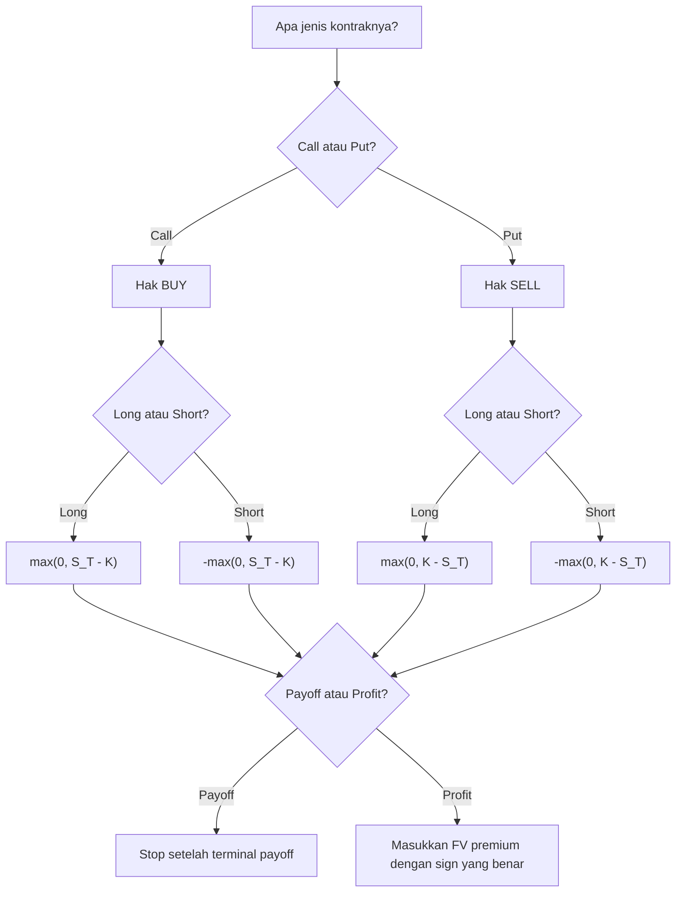

# 📘 6.1 — Options – Call and Put

> [!ABSTRACT] Ringkasan Cepat
> **Topik:** Options – Call and Put  
> **Bobot Parent Topic:** 5–15%  
> **Exam Priority:** Medium  
> **Difficulty:** Medium  
> **Primary Skill:** Mixed — concept + calculation + interpretation  
> **Ref:** McDonald et al., *Derivatives Markets*, Chapter 2.2–2.3; supporting context Chapter 2.1 dan Chapter 3 sesuai scope silabus

## Section 0 — Pemetaan Silabus & Exam Scope

| Field | Isi |
|---|---|
| Topik CF1 | Topik 6 — Produk Derivatif |
| Subtopik | [[6.1 Options – Call and Put]] |
| Learning Outcome | Menghitung *payoff* dan *profit* posisi *long/short call* dan *long/short put*; memahami proteksi terhadap perubahan harga saham; membandingkan harga opsi berdasarkan *strike price* dan *term-to-maturity* sesuai batas yang didukung source |
| Skill Diuji | Identifikasi posisi, piecewise payoff, profit setelah premium, break-even, interpretasi long/short, European vs American |
| Bobot Parent Topic | 5–15% |
| Exam Priority | Medium |
| Prerequisite | TVM sederhana, future value, spot price, konsep long/short |
| Connected Topics | [[6.2 Forwards and Futures]], [[6.3 Option Strategies]], [[1.4 Accumulation and Present Value]] |
| Referensi | McDonald Chapter 2.2–2.3; konteks perbandingan dengan forward dari 2.1; option combinations dari Chapter 3 hanya sebagai koneksi |

> [!IMPORTANT] Scope Boundary
> Inti 6.1 adalah **mekanika kontrak opsi**: call vs put, hak vs kewajiban, long vs short, strike, expiration, exercise style, payoff, profit, break-even, moneyness, serta interpretasi opsi sebagai proteksi.  
> Formula pricing seperti Black–Scholes, Greeks, implied volatility, stochastic processes, dan detailed early-exercise valuation **tidak diperlukan** untuk note ini berdasarkan source/scope yang diberikan. Strategi multi-option seperti spread, collar, straddle, strangle, dan butterfly dibahas khusus pada [[6.3 Option Strategies]].

[CORE CF1] Learning outcome silabus secara eksplisit menuntut kemampuan membedakan **payoff** dari **profit**. Ini adalah salah satu distinction paling penting dalam subtopik ini.

## Section 1 — Intuisi & Big Picture

Forward contract memaksa kedua pihak untuk bertransaksi pada harga yang telah disepakati. Opsi mengubah struktur itu dengan memberikan **hak kepada satu pihak**, bukan kewajiban. Karena hak hanya akan digunakan bila menguntungkan, payoff pemegang opsi memiliki bentuk tidak simetris: sisi yang merugikan dapat “dipotong” pada nol, sedangkan sisi yang menguntungkan tetap terbuka.

**Call option** adalah hak untuk **membeli** underlying pada harga tetap. Jika harga pasar di maturity ternyata jauh di atas harga tetap itu, hak membeli murah menjadi bernilai. Jika harga pasar justru rendah, holder cukup tidak exercise. Karena holder memiliki pilihan sepihak yang menguntungkan ini, ia membayar **option premium** di awal.

**Put option** adalah hak untuk **menjual** underlying pada harga tetap. Ia bernilai ketika harga pasar jatuh di bawah strike: holder tetap dapat menjual pada strike. Karena itu McDonald menggambarkan purchased put sebagai bentuk insurance terhadap penurunan harga. Purchased call juga dapat dipandang sebagai insurance atas biaya pembelian masa depan: jika harga melonjak, call membatasi harga pembelian efektif melalui hak membeli pada strike.

Kesalahan intuitif terbesar adalah menyamakan:

> **“option tidak di-exercise” = “tidak rugi.”**

Itu salah untuk **profit**. Payoff memang nol ketika opsi tidak di-exercise, tetapi premium sudah dibayar. Maka holder masih dapat mengalami kerugian sebesar future value dari premium.

## Section 2 — Definisi & Core Concepts

### Definisi Formal

> [!NOTE] Definisi Formal
> **Call option** memberi pemiliknya hak, tetapi bukan kewajiban, untuk **membeli** underlying asset pada **strike price** tertentu sesuai exercise style kontrak.  
> **Put option** memberi pemiliknya hak, tetapi bukan kewajiban, untuk **menjual** underlying asset pada strike price tertentu sesuai exercise style kontrak.

Hak holder selalu merupakan kewajiban bagi writer jika holder memilih exercise.

### Terminologi Penting

| Istilah / Simbol | Definisi | Intuisi | Exam Note |
|---|---|---|---|
| $S_0$ | Spot price underlying saat ini | Harga underlying sekarang | Jangan tertukar dengan $S_T$ |
| $S_T$ | Spot price underlying pada expiration $T$ | Harga yang menentukan payoff maturity | Variabel utama pada payoff diagram |
| $K$ | Strike / exercise price | Harga transaksi yang dijamin oleh opsi | Call: harga beli; put: harga jual |
| $T$ | Expiration / maturity | Waktu terakhir relevan bagi kontrak | European hanya exercise pada $T$ |
| Premium | Harga opsi saat dibeli | Harga untuk memperoleh hak | Bukan strike price |
| Long option | Membeli/menjadi holder opsi | Membayar premium, memperoleh hak | Long call dan long put sama-sama “long terhadap opsi” |
| Short option | Menjual/menulis opsi | Menerima premium, menanggung kewajiban | Writer = counterparty holder |
| Exercise | Menggunakan hak kontrak | Call: membeli; put: menjual | Exercise hanya jika bermanfaat bagi holder |
| European | Exercise hanya pada expiration | Satu tanggal exercise | Nama tidak terkait geografi |
| American | Exercise kapan saja selama life opsi | Lebih fleksibel | Jangan otomatis terapkan aturan European |
| Bermudan | Exercise hanya pada tanggal/periode tertentu | Di antara European dan American | Supporting context; bukan fokus utama |
| Payoff | Nilai bruto posisi pada expiration | Belum memperhitungkan biaya awal | Untuk holder opsi tidak negatif |
| Profit | Payoff dikurangi biaya posisi yang dinilai pada tanggal profit | Hasil ekonomis bersih | Premium harus dibawa ke expiration bila profit dinilai di $T$ |
| Moneyness | Status opsi relatif terhadap harga underlying dan strike | Apakah exercise “menghasilkan” nilai | ITM ≠ pasti profit positif |

### Exercise Style

Untuk **European option**:

- call: holder boleh membeli underlying pada $T$ dengan membayar $K$;
- put: holder boleh menjual underlying pada $T$ dan menerima $K$.

Untuk **American option**, exercise dapat dilakukan sebelum expiration. Source yang digunakan pada Chapter 2 membangun payoff maturity terutama menggunakan European option karena mekaniknya paling sederhana.

> [!IMPORTANT] European vs American
> Payoff **pada expiration** memiliki bentuk yang sama jika strike dan underlying sama. Perbedaannya adalah **kapan** holder boleh exercise sebelum expiration.

### Payoff Long Call

Long call memberi hak membeli pada $K$.

Jika $S_T>K$, membeli pada $K$ lalu memiliki aset bernilai $S_T$ menghasilkan nilai $S_T-K$.

Jika $S_T\le K$, tidak masuk akal membeli pada $K$ ketika aset bernilai tidak lebih dari $K$, sehingga holder tidak exercise.

$$
\text{Payoff}_{LC}
=
\max(0,S_T-K)
$$

Piecewise:

$$
\text{Payoff}_{LC}
=
\begin{cases}
0, & S_T\le K,\\
S_T-K, & S_T>K.
\end{cases}
$$

### Payoff Short Call

Short call adalah mirror image dari long call.

$$
\text{Payoff}_{SC}
=
-\max(0,S_T-K)
$$

atau:

$$
\text{Payoff}_{SC}
=
\begin{cases}
0, & S_T\le K,\\
K-S_T, & S_T>K.
\end{cases}
$$

Writer menerima premium di awal tetapi wajib menjual underlying pada $K$ jika holder exercise.

### Payoff Long Put

Long put memberi hak menjual pada $K$.

Jika $S_T<K$, holder dapat menjual aset bernilai $S_T$ dengan menerima $K$, sehingga payoff $K-S_T$.

Jika $S_T\ge K$, tidak masuk akal menjual pada $K$ ketika pasar menawarkan minimal $K$.

$$
\text{Payoff}_{LP}
=
\max(0,K-S_T)
$$

Piecewise:

$$
\text{Payoff}_{LP}
=
\begin{cases}
K-S_T, & S_T<K,\\
0, & S_T\ge K.
\end{cases}
$$

### Payoff Short Put

$$
\text{Payoff}_{SP}
=
-\max(0,K-S_T)
$$

atau:

$$
\text{Payoff}_{SP}
=
\begin{cases}
S_T-K, & S_T<K,\\
0, & S_T\ge K.
\end{cases}
$$

Writer put menerima premium tetapi wajib membeli underlying pada $K$ bila holder put exercise.

### Payoff vs Profit

McDonald secara eksplisit membedakan dua diagram:

- **payoff diagram** = gross value pada expiration;
- **profit diagram** = payoff setelah memperhitungkan cost/premium.

Misalkan premium saat $t=0$ adalah $C_0$ untuk call dan $P_0$ untuk put. Jika seluruh profit dibandingkan pada expiration $T$, premium harus diakumulasikan menjadi future value.

Tuliskan:

$$
C_T^{\text{prem}}=\operatorname{FV}_T(C_0)
$$

dan

$$
P_T^{\text{prem}}=\operatorname{FV}_T(P_0).
$$

Jika effective rate selama seluruh horizon adalah $i_T$:

$$
C_T^{\text{prem}}=C_0(1+i_T)
$$

$$
P_T^{\text{prem}}=P_0(1+i_T).
$$

Jika rate adalah effective annual $i$ selama $T$ tahun:

$$
C_T^{\text{prem}}=C_0(1+i)^T
$$

dan analog untuk put.

Maka:

#### Long Call Profit

$$
\Pi_{LC}
=
\max(0,S_T-K)-C_T^{\text{prem}}
$$

#### Short Call Profit

$$
\Pi_{SC}
=
-\max(0,S_T-K)+C_T^{\text{prem}}
$$

#### Long Put Profit

$$
\Pi_{LP}
=
\max(0,K-S_T)-P_T^{\text{prem}}
$$

#### Short Put Profit

$$
\Pi_{SP}
=
-\max(0,K-S_T)+P_T^{\text{prem}}
$$

> [!IMPORTANT] Zero-Sum at the Same Valuation Date
> Untuk satu kontrak yang sama, jika premium dan payoff dinilai pada tanggal yang sama:
>
> $$
> \Pi_{\text{long}}=-\Pi_{\text{short}}.
> $$
>
> Ini merupakan sanity check yang sangat kuat.

### Break-Even

#### Long Call / Short Call

Break-even profit terjadi ketika:

$$
S_T-K-C_T^{\text{prem}}=0
$$

sehingga:

$$
S_T^{BE}
=
K+C_T^{\text{prem}}.
$$

Perhatikan bahwa:

$$
S_T=K
$$

hanya titik ketika **payoff mulai positif**, bukan titik profit nol.

#### Long Put / Short Put

Untuk region $S_T<K$:

$$
K-S_T-P_T^{\text{prem}}=0
$$

maka:

$$
S_T^{BE}
=
K-P_T^{\text{prem}}.
$$

### Maximum Gain dan Maximum Loss

Dengan asumsi harga underlying tidak negatif:

| Posisi | Maximum Loss | Maximum Gain |
|---|---:|---:|
| Long call | $-C_T^{\text{prem}}$ | Tidak terbatas |
| Short call | Tidak terbatas | $C_T^{\text{prem}}$ |
| Long put | $-P_T^{\text{prem}}$ | $K-P_T^{\text{prem}}$ |
| Short put | $P_T^{\text{prem}}-K$ | $P_T^{\text{prem}}$ |

Untuk long put, maximum gain terjadi jika $S_T=0$:

$$
K-0-P_T^{\text{prem}}
=
K-P_T^{\text{prem}}.
$$

### Moneyness

Moneyness menjawab: **jika exercise sekarang dimungkinkan, apakah exercise menghasilkan nilai positif?**

| Posisi opsi | In-the-money | At-the-money | Out-of-the-money |
|---|---|---|---|
| Call | $S>K$ | $S\approx K$ | $S<K$ |
| Put | $S<K$ | $S\approx K$ | $S>K$ |

> [!WARNING] ITM bukan berarti profit positif
> Sebuah call dapat ITM tetapi tetap rugi secara profit apabila $S_T-K$ lebih kecil dari future value premium.

### Pengaruh Strike Price

Dalam exercises Chapter 2, McDonald meminta pembaca menjelaskan secara intuitif mengapa:

- premium call **menurun** ketika strike meningkat;
- premium put **meningkat** ketika strike meningkat,

untuk opsi yang comparable.

Alasannya terlihat langsung dari payoff.

Untuk dua call dengan $K_1<K_2$:

$$
\max(0,S_T-K_1)
\ge
\max(0,S_T-K_2)
$$

untuk setiap $S_T$.

Lower-strike call memberi hak membeli pada harga lebih murah, sehingga haknya tidak lebih buruk di state mana pun.

Untuk dua put dengan $K_1<K_2$:

$$
\max(0,K_1-S_T)
\le
\max(0,K_2-S_T)
$$

untuk setiap $S_T$.

Higher-strike put memberi hak menjual pada harga lebih tinggi.

### Pengaruh Term-to-Maturity — Scope-Safe Interpretation

Silabus meminta kemampuan membandingkan harga opsi berdasarkan *term-to-maturity*. Source Chapter 2 menunjukkan bahwa pasar memiliki opsi dengan berbagai expiration date dan menekankan bahwa exercise style menentukan kapan hak dapat digunakan.

Namun, dari section yang menjadi basis langsung note ini, **tidak aman menghafal aturan universal “semakin panjang maturity pasti semakin mahal” untuk setiap jenis European option tanpa menyatakan asumsi tambahan**. Untuk CF1, fokuskan comparison pada:

1. option dengan maturity berbeda adalah **kontrak yang berbeda**;
2. maturity lebih panjang berarti state harga underlying yang relevan terjadi pada waktu berbeda;
3. exercise flexibility American dan European berbeda;
4. jika soal meminta ranking harga berdasarkan maturity, gunakan assumptions yang diberikan soal/source—jangan menambahkan theorem yang tidak dinyatakan.

> [!DANGER] Jangan overgeneralize
> Strike-price comparison memiliki payoff dominance yang sangat langsung. Term-to-maturity comparison memerlukan perhatian lebih besar terhadap exercise style dan assumptions.

## Section 3 — How It Works

Untuk hampir semua soal 6.1, gunakan alur:

```text
Contract position
↓
Call atau put?
↓
Long atau short?
↓
Strike K dan expiration T
↓
Bandingkan S_T dengan K
↓
Hitung payoff
↓
Bawa premium ke tanggal T bila profit diminta
↓
Hitung profit
↓
Cari break-even / maximum gain-loss bila diminta
↓
Interpretasikan hedge/speculation
```

### Empat Posisi Dasar

Ada dua pertanyaan yang harus dijawab secara berurutan:

**Pertanyaan 1 — Hak apa?**

- Call → hak **buy**
- Put → hak **sell**

**Pertanyaan 2 — Siapa pemilik hak?**

- Long → holder membeli opsi, memegang hak
- Short → writer menjual opsi, menanggung kewajiban

Dari dua pertanyaan itu, semua sign payoff dapat direkonstruksi tanpa menghafal empat formula secara terpisah.

### Derivasi Long Call

Long call exercise jika:

$$
S_T-K>0.
$$

Karena holder boleh memilih tidak exercise:

$$
\text{Payoff}
=
\max(0,S_T-K).
$$

Short call adalah counterparty:

$$
\text{Payoff}_{SC}
=
-\text{Payoff}_{LC}.
$$

### Derivasi Long Put

Long put exercise jika:

$$
K-S_T>0.
$$

Karena holder boleh memilih tidak exercise:

$$
\text{Payoff}_{LP}
=
\max(0,K-S_T).
$$

Short put:

$$
\text{Payoff}_{SP}
=
-\text{Payoff}_{LP}.
$$

> [!TIP] Cara Berpikir
> Jangan hafal “minus di mana”. Tulis payoff **holder** terlebih dahulu dengan fungsi $\max$. Setelah benar, posisi writer tinggal dikalikan $-1$. Baru masukkan premium untuk profit.

### Mental Model Slope

Payoff diagram sebagai fungsi $S_T$:

| Posisi | Region sebelum kink | Kink | Region setelah kink |
|---|---:|---:|---:|
| Long call | slope $0$ | $K$ | slope $+1$ |
| Short call | slope $0$ | $K$ | slope $-1$ |
| Long put | slope $-1$ | $K$ | slope $0$ |
| Short put | slope $+1$ | $K$ | slope $0$ |

Premium hanya **menggeser profit diagram secara vertikal**; premium tidak mengubah kink $K$ atau slope payoff.

> [!DANGER] Jangan Salah Pikir
> 1. **Call = bullish** tidak berarti long call selalu untung jika harga naik. Harga harus naik cukup jauh untuk menutup premium.  
> 2. **Put = bearish** tidak berarti short put bearish. Short put justru memiliki exposure yang menguntungkan ketika underlying naik/tidak jatuh terlalu jauh.  
> 3. **Payoff = 0** bukan berarti **profit = 0**. Holder masih kehilangan premium.  
> 4. **Long put** berarti long terhadap kontrak put, tetapi exposure terhadap underlying bersifat short-like ketika put aktif.  
> 5. Premium dibayar pada $t=0$, sementara payoff biasanya dihitung pada $T$; untuk profit maturity, keduanya harus berada pada tanggal yang sama.

## Section 4 — Worked Examples & Exam Cases

### Case A — Fundamental

**Soal**

Sebuah European call memiliki strike price $K=100$ dan expiration 1 tahun. Harga saham pada expiration adalah $S_T=135$. Premium call pada awal kontrak adalah $12$. Abaikan interest untuk Case A.

Hitung:

1. payoff long call;
2. profit long call;
3. payoff short call;
4. profit short call;
5. break-even price.

> [!SUCCESS] Pembahasan
>
> **1. Identifikasi informasi & unknown**
>
> Call = hak membeli pada $K=100$.  
> Long = holder.  
> Short = writer.
>
> **2. Structure**
>
> Karena:
>
> $$
> S_T=135>K=100,
> $$
>
> call di-exercise.
>
> **3. Rate conversion**
>
> Diabaikan, sehingga future value premium tetap $12$.
>
> **4. Equation / Formula Selection**
>
> $$
> \text{Payoff}_{LC}=\max(0,S_T-K)
> $$
>
> $$
> \Pi_{LC}=\text{Payoff}_{LC}-12
> $$
>
> **5. Calculation**
>
> Long call payoff:
>
> $$
> \max(0,135-100)=35.
> $$
>
> Long call profit:
>
> $$
> 35-12=23.
> $$
>
> Karena short adalah counterparty:
>
> $$
> \text{Payoff}_{SC}=-35
> $$
>
> dan:
>
> $$
> \Pi_{SC}=-23.
> $$
>
> Break-even:
>
> $$
> S_T^{BE}=K+\text{premium}=100+12=112.
> $$
>
> **6. Interpretation**
>
> Pada $S_T=135$, hak membeli pada $100$ bernilai $35$, tetapi keuntungan bersih hanya $23$ karena premium.
>
> **7. Verification**
>
> $$
> \Pi_{LC}+\Pi_{SC}=23-23=0.
> $$
>
> Konsisten.

> [!WARNING] Exam Trap — Case A
> - **Trap:** Menjawab profit long call = $35$.
> - **Mengapa distractor terlihat benar:** $35$ memang nilai exercise/payoff.
> - **Cara menghindari:** Cari kata “profit” → masukkan premium.
> - **Shortcut aman:** payoff dahulu, profit kedua.
> - **Target waktu:** < 1 menit.

### Case B — Exam-Typical

**Soal**

Seorang investor membeli European put 6 bulan dengan strike $K=1{,}000$. Premium saat ini adalah $74.20$. Effective risk-free rate selama 6 bulan adalah $2\%$.

Hitung profit long put pada expiration jika:

1. $S_T=900$;
2. $S_T=1{,}100$;
3. tentukan break-even price pada expiration.

> [!SUCCESS] Pembahasan
>
> **1. Identifikasi informasi & unknown**
>
> Put = hak menjual pada $1{,}000$.  
> Long = membayar premium.
>
> **2. Timeline / Structure**
>
> | Waktu | $0$ | 6 bulan |
> |---:|---:|---:|
> | Premium | $-74.20$ | — |
> | Payoff | — | $\max(0,1000-S_T)$ |
>
> **3. Rate conversion**
>
> Rate $2\%$ sudah effective untuk seluruh 6 bulan:
>
> $$
> P_T^{\text{prem}}
> =
> 74.20(1.02)
> =
> 75.684.
> $$
>
> **4. Equation / Formula Selection**
>
> $$
> \Pi_{LP}
> =
> \max(0,K-S_T)-P_T^{\text{prem}}.
> $$
>
> **5. Calculation**
>
> Jika $S_T=900$:
>
> $$
> \text{Payoff}=1000-900=100.
> $$
>
> $$
> \Pi_{LP}=100-75.684=24.316\approx 24.32.
> $$
>
> Jika $S_T=1{,}100$:
>
> $$
> \text{Payoff}=\max(0,1000-1100)=0.
> $$
>
> $$
> \Pi_{LP}=0-75.684=-75.684\approx -75.68.
> $$
>
> Break-even:
>
> $$
> 1000-S_T-75.684=0.
> $$
>
> $$
> S_T^{BE}=924.316\approx 924.32.
> $$
>
> **6. Interpretation**
>
> Put baru menghasilkan profit positif jika harga jatuh cukup jauh **di bawah** strike untuk menutup future value premium.
>
> **7. Verification**
>
> Karena long put maximum loss adalah premium accumulated:
>
> $$
> \Pi_{LP}\ge -75.684.
> $$
>
> Hasil $-75.684$ saat put expire worthless tepat mencapai maximum loss.

> [!WARNING] Exam Trap — Case B
> - **Trap:** Break-even dianggap $S_T=K=1{,}000$.
> - **Mengapa distractor terlihat benar:** $K$ memang titik payoff berubah dari positif ke nol.
> - **Cara menghindari:** Bedakan kink payoff dari zero-profit point.
> - **Shortcut aman:** long put BE = strike − FV premium.
> - **Target waktu:** 1–2 menit.

### Case C — Challenging / Integrated

**Soal**

Sebuah saham memiliki harga saat ini $80$. Tersedia dua European call dengan expiration yang sama:

- Call A: $K_A=70$, premium awal $14$;
- Call B: $K_B=90$, premium awal $5$.

Effective interest rate sampai expiration adalah $4\%$.

Pada expiration harga saham adalah $S_T=100$.

Untuk masing-masing call, hitung payoff dan profit. Kemudian jelaskan mengapa call dengan strike lebih rendah secara intuitif memiliki premium lebih tinggi.

> [!SUCCESS] Pembahasan
>
> **1. Identifikasi**
>
> Kedua posisi adalah long call dan memiliki underlying serta maturity sama. Yang berbeda adalah strike dan premium.
>
> **2. Timeline / Structure**
>
> Premium dibayar sekarang, payoff pada expiration.
>
> **3. Accumulated premium**
>
> Call A:
>
> $$
> C_{A,T}^{\text{prem}}
> =
> 14(1.04)
> =
> 14.56.
> $$
>
> Call B:
>
> $$
> C_{B,T}^{\text{prem}}
> =
> 5(1.04)
> =
> 5.20.
> $$
>
> **4. Payoff**
>
> Call A:
>
> $$
> \max(0,100-70)=30.
> $$
>
> Call B:
>
> $$
> \max(0,100-90)=10.
> $$
>
> **5. Profit**
>
> $$
> \Pi_A=30-14.56=15.44.
> $$
>
> $$
> \Pi_B=10-5.20=4.80.
> $$
>
> **6. Mengapa lower strike call lebih mahal?**
>
> Untuk setiap possible $S_T$:
>
> $$
> \max(0,S_T-70)
> \ge
> \max(0,S_T-90).
> $$
>
> Call A memberi holder hak membeli pada harga yang lebih murah. Hak tersebut tidak pernah lebih buruk daripada Call B pada expiration.
>
> **7. Verification**
>
> Lower strike menghasilkan payoff yang weakly lebih besar pada seluruh state. Premium awal yang lebih tinggi konsisten dengan economic value yang lebih besar.

> [!WARNING] Exam Trap — Case C
> - **Trap:** Menyimpulkan call B “lebih murah jadi lebih menguntungkan”.
> - **Mengapa distractor terlihat benar:** Premium nominal B memang lebih kecil.
> - **Cara menghindari:** Profit bergantung pada **payoff relatif terhadap premium**, bukan premium saja.
> - **Shortcut aman:** Saat comparing strikes, gambar kink: call dengan strike lebih rendah mulai payoff lebih cepat.
> - **Target waktu:** 2 menit.

### Case D — Long/Short Sign Trap

**Soal**

Sebuah European put memiliki $K=50$, premium awal $3$, dan interest diabaikan. Hitung profit **short put** jika $S_T=42$.

> [!SUCCESS] Pembahasan
>
> Holder put memperoleh:
>
> $$
> \max(0,50-42)=8.
> $$
>
> Writer menanggung payoff lawannya:
>
> $$
> -8.
> $$
>
> Writer sebelumnya menerima premium $3$:
>
> $$
> \Pi_{SP}
> =
> -8+3
> =
> -5.
> $$
>
> Jadi profit short put adalah:
>
> $$
> \boxed{-5}.
> $$

> [!WARNING] Exam Trap — Case D
> Jangan membaca “short” lalu otomatis menulis $K-S_T$ tanpa tanda minus. Tulis holder payoff terlebih dahulu; baru negasikan.

## Section 5 — Verification & Sanity Check

> [!CHECK] Sanity Check
> 1. **Long option payoff tidak negatif.** Holder memiliki hak untuk tidak exercise.
> 2. **Long dan short payoff harus saling berlawanan.**
>
> $$
> \text{Payoff}_{long}
> +
> \text{Payoff}_{short}
> =
> 0.
> $$
>
> 3. **Long dan short profit kontrak yang sama juga saling berlawanan** bila dinilai pada tanggal yang sama.
> 4. **Long call:** saat $S_T$ naik sangat tinggi, profit harus naik tanpa batas.
> 5. **Long put:** saat $S_T$ naik di atas strike, payoff harus tetap nol dan loss dibatasi premium.
> 6. **Kink payoff selalu di $S_T=K$.** Break-even profit biasanya bukan di $K$.
> 7. **Premium hanya menggeser diagram profit**, bukan mengubah bentuk payoff.
> 8. **Strike effect:** lower-strike call weakly dominates higher-strike call payoff; higher-strike put weakly dominates lower-strike put payoff.

### Metode Alternatif — Piecewise vs Max Function

Contoh long call dapat ditulis:

$$
\max(0,S_T-K)
$$

atau:

$$
\begin{cases}
0, & S_T\le K,\\
S_T-K, & S_T>K.
\end{cases}
$$

**Max function** biasanya lebih cepat untuk perhitungan satu titik.

**Piecewise form** biasanya lebih berguna untuk:

- menggambar payoff diagram;
- mencari slope;
- mencari break-even;
- menggabungkan beberapa opsi pada [[6.3 Option Strategies]].

## Section 6 — Connections & Mental Model

### Call, Put, dan Forward

[[6.2 Forwards and Futures]] penting sebagai pembanding.

Forward:

- long forward = **obligation to buy**;
- short forward = **obligation to sell**.

Option:

- long call = **right to buy**;
- long put = **right to sell**.

Perbedaan “obligation” vs “right” menjelaskan mengapa:

- standard forward umumnya tidak memerlukan premium awal dalam framing Chapter 2;
- option holder membayar premium;
- payoff option memiliki floor nol bagi holder;
- writer menerima premium sebagai kompensasi atas kewajiban kontinjennya.

### Options sebagai Insurance

McDonald menekankan mental model:

- long put mengasuransikan asset/long exposure terhadap **penurunan harga**;
- long call dapat mengasuransikan rencana pembelian/short-like exposure terhadap **kenaikan harga**;
- written option secara ekonomi menyerupai **menjual insurance**.

Ini membantu mengingat arah payoff:

| Risiko yang ingin dilindungi | Opsi natural | Mengapa |
|---|---|---|
| Takut harga aset yang dimiliki jatuh | Long put | Hak menjual pada floor $K$ |
| Takut harga aset yang ingin dibeli nanti melonjak | Long call | Hak membeli pada cap $K$ |

### Hubungan Visual ↔ Rumus

#### Long Call

$$
\max(0,S_T-K)
$$

- horizontal di bawah $K$ → no exercise;
- kink di $K$;
- slope $+1$ di atas $K$.

#### Long Put

$$
\max(0,K-S_T)
$$

- slope $-1$ di bawah $K$;
- kink di $K$;
- horizontal di atas $K$.

Short positions adalah reflection terhadap horizontal axis pada payoff diagram.

### Connection ke [[6.3 Option Strategies]]

Semua strategy payoff dibangun dari penjumlahan posisi dasar.

Secara matematis:

$$
\text{Portfolio Payoff}
=
\sum_j \text{Payoff}_j.
$$

Karena itu, bila empat payoff dasar di 6.1 sudah otomatis, spread/collar/straddle menjadi jauh lebih mudah.

## Section 7 — Exam Traps & Misconceptions

### Timing Trap

> [!BUG] Timing Trap
> Premium dibayar pada $t=0$, payoff diterima/dibayar pada $T$. Jika soal meminta **profit at expiration**, jangan langsung:
>
> $$
> \text{profit}
> =
> \text{payoff}
> -
> \text{premium}_0.
> $$
>
> Jika interest relevan, yang konsisten adalah:
>
> $$
> \text{profit at }T
> =
> \text{payoff at }T
> -
> \operatorname{FV}_T(\text{premium}_0).
> $$

### Rate / Frequency Trap

> [!BUG] Rate & Frequency Trap
> Jika premium harus diakumulasikan selama 6 bulan dan diberikan **annual effective rate** $i$, gunakan:
>
> $$
> (1+i)^{1/2},
> $$
>
> bukan otomatis:
>
> $$
> 1+\frac{i}{2}.
> $$
>
> Jika soal justru memberi effective rate **untuk 6 bulan**, gunakan rate itu langsung.

### Formula / Notation Trap

> [!BUG] Formula Trap
> Empat payoff dasar:
>
> $$
> LC=\max(0,S_T-K)
> $$
>
> $$
> SC=-\max(0,S_T-K)
> $$
>
> $$
> LP=\max(0,K-S_T)
> $$
>
> $$
> SP=-\max(0,K-S_T)
> $$
>
> Cara paling aman: tentukan dulu **call = buy**, **put = sell**, lalu negasikan untuk writer.

### Calculation Trap

> [!BUG] Calculation Trap
> Misal long call, $K=100$, premium FV $=8$, dan $S_T=105$.
>
> **Salah**
>
> $$
> \Pi=105-100=5.
> $$
>
> Ini hanya payoff.
>
> **Benar**
>
> $$
> \Pi
> =
> \max(0,105-100)-8
> =
> -3.
> $$
>
> Opsi ITM tetapi investasi masih rugi.

### Interpretation Trap

> [!BUG] Interpretation Trap
> - Long call = right to buy, bukan obligation to buy.
> - Long put = right to sell, bukan obligation to sell.
> - Short call = writer mungkin wajib **sell**.
> - Short put = writer mungkin wajib **buy**.
> - “Long put” bukan berarti bullish terhadap underlying; long merujuk pada kepemilikan kontrak opsi.

### Strike Price Trap

> [!BUG] Strike Trap
> Untuk call, strike yang lebih **rendah** meningkatkan hak holder.  
> Untuk put, strike yang lebih **tinggi** meningkatkan hak holder.
>
> Jangan menggunakan satu arah relationship untuk call dan put sekaligus.

### Term-to-Maturity Trap

> [!BUG] Maturity Trap
> Jangan menghafal ranking maturity tanpa memeriksa:
>
> - European atau American;
> - assumptions yang diberikan;
> - underlying/dividend context jika dinyatakan;
> - apakah yang dibandingkan benar-benar otherwise identical.
>
> Source yang menjadi basis 6.1 tidak memberi lisensi untuk membuat aturan universal tanpa syarat.

### Red Flags

> [!CAUTION] Red Flags

| Keyword / Condition | Apa yang Harus Dipikirkan |
|---|---|
| “right to buy” | Call |
| “right to sell” | Put |
| “long call” | Holder; payoff $\max(0,S_T-K)$ |
| “short call” / “written call” | Writer; negasi long-call payoff |
| “long put” | Holder; payoff $\max(0,K-S_T)$ |
| “short put” / “written put” | Writer; negasi long-put payoff |
| “payoff” | Jangan kurangi premium |
| “profit” | Masukkan premium/cost |
| “profit at expiration” | Samakan timing premium ke $T$ |
| “break-even” | Set profit $=0$, bukan payoff $=0$ |
| “European” | Exercise hanya saat expiration |
| “American” | Exercise dapat sebelum expiration |
| “in-the-money” | Positive exercise value, belum tentu positive profit |
| “lower strike call” | Hak beli lebih murah → lebih valuable |
| “higher strike put” | Hak jual lebih mahal → lebih valuable |

## Section 8 — Executive Summary

### Must Remember

> [!SUMMARY] Must Remember
> 1. **Call = right to buy. Put = right to sell.**
> 2. **Long = holder/pembeli opsi; short = writer/penjual opsi.**
> 3. Long call payoff:
>
> $$
> \max(0,S_T-K).
> $$
>
> 4. Long put payoff:
>
> $$
> \max(0,K-S_T).
> $$
>
> 5. Short payoff = negative dari corresponding long payoff.
> 6. **Payoff tidak memasukkan premium; profit memasukkan premium.**
> 7. Jika profit dihitung di expiration, premium juga harus dinilai di expiration.
> 8. Long call break-even:
>
> $$
> K+\operatorname{FV}(\text{call premium}).
> $$
>
> 9. Long put break-even:
>
> $$
> K-\operatorname{FV}(\text{put premium}).
> $$
>
> 10. ITM tidak sama dengan positive profit.
> 11. Lower strike → call lebih valuable; higher strike → put lebih valuable, ceteris paribus.
> 12. European dan American berbeda pada **exercise timing**, bukan arti call/put itu sendiri.

### Formula Map / Comparison Table

| Posisi | Payoff at $T$ | Profit at $T$ | Max Loss | Max Gain |
|---|---|---|---|---|
| Long Call | $\max(0,S_T-K)$ | $\max(0,S_T-K)-C_T^{prem}$ | $-C_T^{prem}$ | Unlimited |
| Short Call | $-\max(0,S_T-K)$ | $-\max(0,S_T-K)+C_T^{prem}$ | Unlimited | $C_T^{prem}$ |
| Long Put | $\max(0,K-S_T)$ | $\max(0,K-S_T)-P_T^{prem}$ | $-P_T^{prem}$ | $K-P_T^{prem}$ |
| Short Put | $-\max(0,K-S_T)$ | $-\max(0,K-S_T)+P_T^{prem}$ | $P_T^{prem}-K$ | $P_T^{prem}$ |

### Trigger Keywords

| Jika soal mengatakan... | Pikirkan... |
|---|---|
| “holder has right to buy” | Long call |
| “holder has right to sell” | Long put |
| “writer must sell if exercised” | Short call |
| “writer must buy if exercised” | Short put |
| “option expires worthless” | Payoff $=0$, profit holder mungkin negatif |
| “premium paid today” + “profit at maturity” | Accumulate premium |
| “strike below current price” untuk call | Call cenderung ITM pada titik evaluasi |
| “strike above current price” untuk put | Put cenderung ITM pada titik evaluasi |
| “compare strikes” | Call: lower $K$ stronger; Put: higher $K$ stronger |

### Kapan Digunakan

Gunakan payoff formulas ketika:

- terminal stock/index price $S_T$ diketahui atau diskenariokan;
- diminta payoff posisi individual;
- diminta profit setelah premium;
- diminta break-even;
- diminta maximum gain/loss;
- akan membangun option strategy.

### Kapan TIDAK Boleh Digunakan

Jangan menggunakan payoff maturity sebagai pengganti **option price sebelum maturity**. Nilai opsi sebelum expiration tidak sama dengan terminal payoff karena masih terdapat waktu hingga exercise dan source note ini tidak membangun model pricing seperti Black–Scholes.

Jangan menggunakan formula long call untuk forward. Forward memiliki obligation dan tidak memakai fungsi $\max$.

Jangan menganggap:

$$
\text{ITM}
\Rightarrow
\text{profit}>0.
$$

Implikasi tersebut salah.

### Quick Decision Tree



## Section 9 — Active Recall Check

1. Tanpa melihat formula, jelaskan mengapa long call payoff menggunakan $\max(0,S_T-K)$ dan bukan sekadar $S_T-K$.
2. Apa perbedaan economically antara strike price dan option premium?
3. Sebuah put memiliki $K=80$ dan $S_T=65$. Susun formula payoff untuk long put dan short put tanpa menghitung angkanya.
4. Sebuah call expire out-of-the-money. Apakah profit long call pasti nol? Jelaskan tanpa memberi contoh numerik.
5. Jika call premium dibayar hari ini tetapi profit diminta pada expiration, mengapa premium perlu diakumulasikan?
6. Tulis equation untuk break-even long call pada expiration.
7. Tulis equation untuk break-even long put pada expiration.
8. Mengapa lower-strike call memiliki payoff yang weakly lebih tinggi daripada otherwise-identical higher-strike call?
9. Mengapa higher-strike put memiliki payoff yang weakly lebih tinggi daripada otherwise-identical lower-strike put?
10. Jelaskan perbedaan “long put” sebagai posisi terhadap **option contract** dan exposure-nya terhadap **underlying price**.
11. Apakah in-the-money menjamin profit positif? Jelaskan.
12. Sebutkan perbedaan utama European dan American option yang relevan untuk exercise timing.

## Section 10 — Exam Pattern Map

[TEXTBOOK-BASED EXPECTATION]

| Narasi Soal | Keyword | Konsep | Formula/Rule | Langkah | Trap | Shortcut |
|---|---|---|---|---|---|---|
| Diberi $S_T$, $K$, ditanya payoff | “payoff”, “expiration” | Terminal option value | Call: $\max(0,S_T-K)$; Put: $\max(0,K-S_T)$ | Tentukan call/put → long/short → substitute | Masukkan premium padahal hanya payoff | Payoff dulu tanpa premium |
| Diberi premium + interest + $S_T$ | “profit at expiration” | Profit vs payoff | Payoff $\mp/\pm$ FV premium | Accumulate premium → payoff → combine | Mengurangkan premium $t=0$ langsung dari payoff $T$ | Samakan valuation date |
| Ditanya writer | “written”, “seller”, “short” | Counterparty sign | Short payoff = $-$ long payoff | Tulis holder formula → negasikan | Salah arah buy/sell | Holder-first method |
| Ditanya BE | “break-even” | Zero-profit condition | Call $K+C_T^{prem}$; Put $K-P_T^{prem}$ | Set profit $=0$ di active region | Menggunakan $S_T=K$ | Kink ≠ BE |
| Compare strike call | “same maturity, different strike” | Payoff dominance | Lower $K$ call lebih valuable | Bandingkan payoff state-by-state | Arah relationship terbalik | Call = hak beli → lebih murah lebih baik |
| Compare strike put | “same maturity, different strike” | Payoff dominance | Higher $K$ put lebih valuable | Bandingkan payoff state-by-state | Mengikuti rule call | Put = hak jual → lebih tinggi lebih baik |
| Moneyness | “ITM/ATM/OTM” | Immediate exercise value | Call ITM jika $S>K$; put ITM jika $S<K$ | Bandingkan spot vs strike | Menyamakan ITM dengan profit | Moneyness lihat exercise value, bukan premium |
| European vs American | “exercise only at expiration / anytime” | Exercise style | European = at $T$; American = during life | Identifikasi hak exercise | Mengira istilah geografis | Fokus pada timing |

## Source Traceability

| Materi | Sumber |
|---|---|
| Definisi call, strike, exercise, expiration, European/American/Bermudan | McDonald, Chapter 2.2 |
| Purchased call payoff dan profit | McDonald, Chapter 2.2, Eq. 2.3–2.4 |
| Written call payoff dan profit | McDonald, Chapter 2.2, Eq. 2.5–2.6 |
| Definisi dan mechanics put | McDonald, Chapter 2.3 |
| Purchased put payoff dan profit | McDonald, Chapter 2.3, Eq. 2.7–2.8 |
| Written put payoff dan profit | McDonald, Chapter 2.3, Eq. 2.9–2.10 |
| Moneyness | McDonald, Chapter 2.3–2.4 transition |
| Maximum gain/loss structure | McDonald, Chapter 2.4 summary table, supporting context |
| Payoff vs profit diagrams dan FV premium | McDonald, Chapter 2.2–2.3 |
| Option as insurance intuition | McDonald, Chapter 2 summary/supporting discussion |
| Strike-price premium comparison | McDonald, Chapter 2 problems 2.13–2.14; supported by payoff dominance |
| Term-to-maturity comparison boundary | Silabus CF1 learning outcome + McDonald Chapter 2 option terminology/market contracts; no unsupported universal pricing theorem added |
| Connection to option combinations | McDonald, Chapter 3, reserved for [[6.3 Option Strategies]] |

---

> [!QUOTE] Follow-up Options
> 1. *"Uji saya dengan soal Active Recall dari topik ini"*
> 2. *"Buat 10 soal exam-style calculation untuk topik ini"*
> 3. *"Jelaskan hubungan topik ini dengan topik CF1 terkait"*

*📖 Ref: McDonald et al., Derivatives Markets, Chapter 2.2–2.3 (supporting context Chapter 2.1 & 3) | 🗓️ 2026-08-25 | #CF1 #MatematikaKeuangan*
