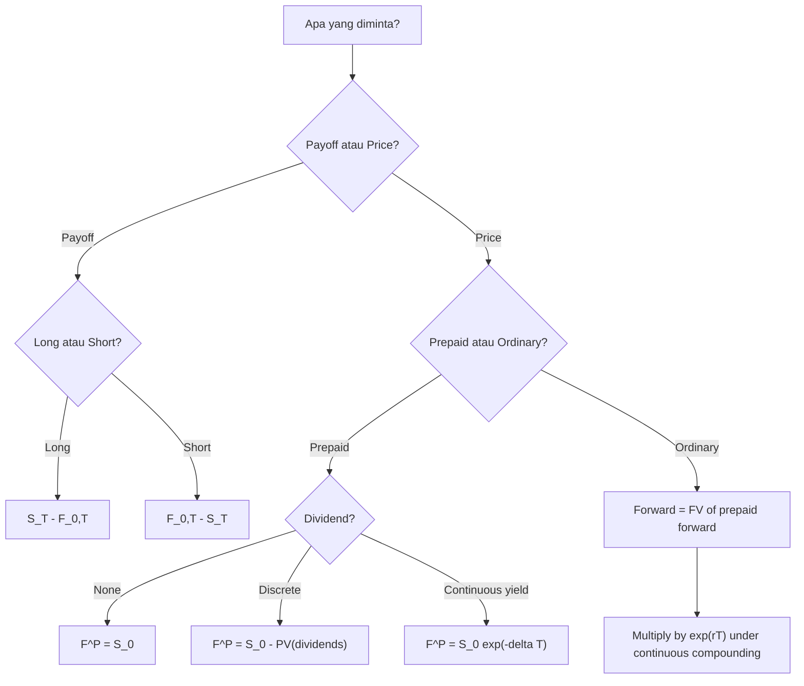

# 📘 6.2 — Forwards and Futures

> [!ABSTRACT] Ringkasan Cepat
> **Topik:** Forwards and Futures  
> **Bobot Parent Topic:** 5–15%  
> **Exam Priority:** Medium  
> **Difficulty:** Medium  
> **Primary Skill:** Mixed — concept + calculation + no-arbitrage reasoning  
> **Ref:** McDonald et al., *Derivatives Markets*, Chapter 2.1 dan Chapter 5.1–5.4

## Section 0 — Pemetaan Silabus & Exam Scope

| Field | Isi |
|---|---|
| Topik CF1 | Topik 6 — Produk Derivatif |
| Subtopik | [[6.2 Forwards and Futures]] |
| Learning Outcome | Menjelaskan karakteristik forward dan futures serta menentukan payoff, profit, harga forward, dan prepaid forward pada saham tanpa dividen, dividen kontinu, dan dividen diskrit. |
| Skill Diuji | Long/short payoff, prepaid forward, cost-of-carry, dividend adjustment, no-arbitrage, forward vs futures mechanics, margin/marking-to-market |
| Bobot Parent Topic | 5–15% |
| Exam Priority | Medium |
| Prerequisite | Spot price, future value/present value, continuous compounding, long/short |
| Connected Topics | [[6.1 Options – Call and Put]], [[6.3 Option Strategies]], [[1.4 Accumulation and Present Value]], [[3.1 Spot Rates and Forward Rates]] |
| Referensi | McDonald Chapter 2.1; Chapter 5.1–5.4 sesuai silabus CF1 |

> [!IMPORTANT] Scope Boundary
> [CORE CF1] Inti note ini adalah **forward/futures pada saham atau indeks**, termasuk payoff/profit, prepaid forward, forward price untuk no dividend, discrete dividend, dan continuous dividend, serta mechanics dasar futures.  
> Materi Chapter 5 tentang currency forwards, Eurodollar futures, cross-hedging, basis risk, detailed index arbitrage implementation, tax appendix, dan appendix mathematical equivalence forward–futures bukan materi inti 6.2 kecuali digunakan sebagai supporting intuition.  
> Forward rate dalam term structure [[3.1 Spot Rates and Forward Rates]] adalah konsep berbeda dari **forward contract price** di sini.

## Section 1 — Intuisi & Big Picture

Forward contract memisahkan dua hal yang pada transaksi spot biasanya terjadi hampir bersamaan:

1. **kesepakatan harga dibuat sekarang**;
2. **pembayaran dan delivery dilakukan nanti**.

Dengan forward, buyer dan seller menetapkan hari ini harga yang akan dipakai pada waktu $T$. Tidak ada hak untuk “jalan keluar” hanya karena hasil akhirnya tidak menguntungkan. Kedua pihak memiliki **obligation**.

Jika harga underlying pada maturity lebih tinggi daripada harga kontrak, pihak long diuntungkan karena ia berhak—dan wajib—membeli pada harga kontrak yang lebih murah. Jika harga underlying lebih rendah, pihak long tetap harus membeli pada harga kontrak sehingga rugi.

Kontrak futures secara ekonomi sangat mirip forward, tetapi berbeda secara institusional: futures umumnya diperdagangkan di exchange, distandardisasi, menggunakan margin, dan keuntungan/kerugian diselesaikan secara berkala melalui **marking to market**.

### Big Idea Pricing

Harga forward bukan tebakan sederhana tentang harga saham di masa depan.

Harga forward berasal dari **no-arbitrage**:

> membeli saham sekarang dan membiayainya harus secara ekonomi konsisten dengan membeli saham melalui forward untuk delivery di masa depan.

Jika underlying memberi dividend, pemegang saham fisik memperoleh dividend tersebut sedangkan long forward tidak. Karena itu dividend menurunkan fair forward price relatif terhadap no-dividend case.

## Section 2 — Definisi & Core Concepts

### Forward Contract

> [!NOTE] Definisi Formal
> Forward contract menetapkan hari ini syarat transaksi untuk membeli atau menjual underlying asset pada waktu tertentu di masa depan dengan harga yang disepakati saat kontrak dibuat.

Kontrak menentukan:

- jenis dan jumlah underlying;
- delivery/settlement date;
- delivery logistics bila physical settlement;
- contractual forward price;
- obligation buyer untuk membeli dan seller untuk menjual.

### Long dan Short Forward

- **Long forward** = pihak yang setuju membeli underlying pada maturity.
- **Short forward** = pihak yang setuju menjual underlying pada maturity.

Misalkan:

- $F_{0,T}$ = forward price yang disepakati pada $t=0$ untuk delivery pada $T$;
- $S_T$ = spot price underlying pada maturity.

#### Long Forward Payoff

$$
\text{Payoff}_{LF}
=
S_T-F_{0,T}.
$$

#### Short Forward Payoff

$$
\text{Payoff}_{SF}
=
F_{0,T}-S_T.
$$

Karena standard forward pada inception memiliki zero initial premium dalam framing McDonald:

$$
\text{Profit at }T
=
\text{Payoff at }T.
$$

> [!IMPORTANT] Forward vs Option
> Forward menghasilkan payoff linear dan dapat negatif bagi long maupun short.  
> Long option memiliki hak untuk tidak exercise sehingga payoff holder memiliki floor nol sebelum premium.

### Zero-Sum Relationship

Untuk kontrak yang sama:

$$
\text{Payoff}_{LF}
+
\text{Payoff}_{SF}
=
0.
$$

Jika long untung $x$, short rugi $x$.

### Physical Settlement vs Cash Settlement

**Physical settlement**:

- long membayar contractual price;
- short menyerahkan underlying.

**Cash settlement**:

- tidak ada delivery underlying;
- hanya net gain/loss yang ditransfer.

Contoh bila:

$$
F_{0,T}=1{,}020
$$

dan:

$$
S_T=1{,}040,
$$

maka long menerima:

$$
1{,}040-1{,}020=20.
$$

Cash settlement menghasilkan economic result yang sama seperti membeli underlying pada $1{,}020$ lalu langsung menjualnya pada $1{,}040$.

### Funded vs Unfunded Position

McDonald membandingkan:

- membeli saham sekarang = **funded**;
- masuk long forward = **unfunded**, karena pembayaran utama ditunda sampai maturity.

Untuk membandingkan dua posisi secara adil, initial investment harus disamakan dengan borrowing/lending.

Ini menjadi dasar no-arbitrage forward pricing.

## Section 3 — Prepaid Forward

### Apa Itu Prepaid Forward?

Prepaid forward adalah kontrak untuk menerima underlying di waktu $T$, tetapi **pembayarannya dilakukan sekarang**.

Notation:

$$
F^P_{0,T}
$$

= prepaid forward price pada $t=0$ untuk delivery di $T$.

Perbedaan kunci:

| Contract | Payment | Delivery |
|---|---|---|
| Spot purchase | Sekarang | Sekarang |
| Prepaid forward | Sekarang | Nanti |
| Forward | Nanti | Nanti |

### No Dividend

Jika saham tidak membayar dividend selama horizon, membayar saham sekarang dan menerima saham sekarang tidak memberi cash-flow tambahan dibanding membayar sekarang dan menerima saham nanti, selain possession timing yang tidak menghasilkan income dalam model ini.

Maka:

$$
\boxed{
F^P_{0,T}=S_0
}
$$

untuk non-dividend-paying stock.

### Discrete Dividends

Jika saham akan membayar dividend diskrit selama horizon, holder saham fisik hari ini akan menerima dividend tersebut. Holder prepaid forward belum memiliki saham sampai $T$, sehingga ia tidak menerima dividend.

Maka prepaid forward price harus mengurangi present value seluruh dividend yang hilang:

$$
\boxed{
F^P_{0,T}
=
S_0-\operatorname{PV}_0(\text{dividends})
}
$$

Jika dividend yang diketahui adalah $D_i$ pada waktu $t_i$ dan continuously compounded risk-free rate yang sesuai adalah $r_i$:

$$
\operatorname{PV}_0(\text{dividends})
=
\sum_i D_i e^{-r_i t_i}.
$$

Dengan satu common continuously compounded rate $r$:

$$
\boxed{
F^P_{0,T}
=
S_0-\sum_i D_i e^{-rt_i}
}
$$

### Continuous Dividend Yield

Jika underlying membayar continuous dividend yield $\delta$, McDonald menggunakan:

$$
\boxed{
F^P_{0,T}
=
S_0e^{-\delta T}
}
$$

Intuisinya: investor yang menunda ownership sampai $T$ tidak memperoleh dividend stream selama horizon. Faktor $e^{-\delta T}$ mencerminkan nilai saham tanpa right to intervening dividends.

> [!WARNING] Symbol Collision
> Pada derivatives note ini, $\delta$ berarti **continuous dividend yield**, bukan force of interest seperti pada Topik 1.

## Section 4 — Forward Pricing

### Core Relationship

Perbedaan prepaid forward dan ordinary forward hanya **timing pembayaran**.

Prepaid forward dibayar sekarang. Forward dibayar pada $T$.

Karena ordinary forward menunda pembayaran, fair forward price adalah future value dari prepaid forward price:

$$
\boxed{
F_{0,T}
=
\operatorname{FV}_T(F^P_{0,T})
}
$$

Jika risk-free rate continuously compounded adalah $r$:

$$
\boxed{
F_{0,T}
=
F^P_{0,T}e^{rT}
}
$$

### Case 1 — No Dividend

Karena:

$$
F^P_{0,T}=S_0,
$$

maka:

$$
\boxed{
F_{0,T}
=
S_0e^{rT}
}
$$

### Case 2 — Discrete Dividends

Dengan dividend diskrit:

$$
F^P_{0,T}
=
S_0-\operatorname{PV}_0(\text{dividends}).
$$

Maka:

$$
\boxed{
F_{0,T}
=
\left[
S_0-\operatorname{PV}_0(\text{dividends})
\right]e^{rT}
}
$$

Dengan known dividends $D_i$:

$$
\boxed{
F_{0,T}
=
\left[
S_0-\sum_i D_i e^{-rt_i}
\right]e^{rT}
}
$$

### Case 3 — Continuous Dividend Yield

Dengan:

$$
F^P_{0,T}=S_0e^{-\delta T},
$$

maka:

$$
F_{0,T}
=
S_0e^{-\delta T}e^{rT}
$$

sehingga:

$$
\boxed{
F_{0,T}
=
S_0e^{(r-\delta)T}
}
$$

Ini adalah salah satu formula terpenting di Topik 6.

### Interpretation — Cost of Carry

Untuk continuous dividend yield:

$$
F_{0,T}
=
S_0e^{(r-\delta)T}.
$$

- $r$ = financing/opportunity cost of holding the asset;
- $\delta$ = benefit/income from holding the asset;
- net carry = $r-\delta$.

Karena dividend adalah benefit of holding spot:

> **semakin tinggi dividend yield, semakin rendah fair forward price**, ceteris paribus.

Karena financing cost menaikkan biaya carry:

> **semakin tinggi risk-free rate, semakin tinggi fair forward price**, ceteris paribus.

### Forward Premium

McDonald mendefinisikan:

$$
\text{Forward premium}
=
\frac{F_{0,T}}{S_0}.
$$

Untuk continuous dividends:

$$
\frac{F_{0,T}}{S_0}
=
e^{(r-\delta)T}.
$$

Annualized continuously compounded forward premium:

$$
\frac{1}{T}
\ln\left(\frac{F_{0,T}}{S_0}\right)
=
r-\delta.
$$

## Section 5 — No-Arbitrage Reasoning

### Synthetic Forward — No Dividend

Bandingkan dua cara memiliki satu unit saham pada $T$.

#### Strategy A — Long Forward

- $t=0$: zero initial premium;
- $T$: bayar $F_{0,T}$ dan menerima saham.

#### Strategy B — Borrow and Buy Spot

- $t=0$: pinjam $S_0$, beli satu saham;
- $T$: masih punya saham;
- repay borrowing:

$$
S_0e^{rT}.
$$

Karena kedua strategy menghasilkan satu saham pada $T$ dan tidak memerlukan net initial investment, no-arbitrage memerlukan:

$$
\boxed{
F_{0,T}
=
S_0e^{rT}
}
$$

untuk no-dividend stock.

### Jika Forward Overpriced

Misalkan market forward price:

$$
F_{0,T}^{mkt}
>
F_{0,T}^{fair}.
$$

Secara konsep:

- beli synthetic cheap side;
- jual expensive forward side.

Untuk no-dividend stock:

1. borrow $S_0$;
2. buy stock;
3. short overpriced forward;
4. pada $T$, deliver stock ke forward;
5. terima forward price;
6. repay loan.

Guaranteed maturity profit:

$$
F_{0,T}^{mkt}-S_0e^{rT}>0.
$$

### Jika Forward Underpriced

Jika:

$$
F_{0,T}^{mkt}
<
F_{0,T}^{fair},
$$

reverse cash-and-carry logic digunakan:

- short underlying;
- invest proceeds;
- long cheap forward;
- gunakan stock yang diterima dari forward untuk menutup short.

Detail implementation dapat bergantung pada short-selling assumptions, tetapi exam logic utamanya:

> market forward di bawah synthetic forward → long forward, short synthetic equivalent.

> [!TIP] Arbitrage Mental Rule
> **Buy cheap, sell expensive** antara market forward dan synthetic forward yang memiliki terminal cash flow identik.

## Section 6 — Forward Price vs Future Spot Price

> [!DANGER] Important Distinction
> **Forward price bukan forecast mekanis dari future spot price.**

Fair forward price ditentukan oleh no-arbitrage relation berdasarkan:

- current spot;
- financing rate;
- dividend/carry benefit;
- maturity.

McDonald menjelaskan bahwa expected stock return mencakup compensation for time dan risk premium, sedangkan no-arbitrage forward pricing tidak memasukkan expected return/beta sebagai input langsung.

Karena itu:

$$
F_{0,T}
\neq
E[S_T]
$$

secara umum.

Dalam contoh reasoning McDonald, jika underlying memiliki positive risk premium, expected future spot dapat berada di atas forward price.

> [!WARNING] Exam Trap
> Jika pernyataan mengatakan “high-beta stock harus memiliki higher forward price karena lebih berisiko,” curigai distractor. Beta/expected return bukan input cost-of-carry formula.

## Section 7 — Futures Contracts

### Definisi dan Similarity

Futures contract juga menciptakan obligation untuk membeli/menjual underlying pada harga yang ditentukan untuk future date.

Pada level economic exposure:

- long futures untung ketika futures/underlying price naik;
- short futures untung ketika turun.

Namun futures berbeda dari forward pada mechanics kontraknya.

### Forward vs Futures

| Feature | Forward | Futures |
|---|---|---|
| Trading arrangement | Umumnya bilateral/OTC | Exchange-traded |
| Standardization | Dapat customized | Standardized |
| Initial premium | Umumnya zero | Umumnya zero |
| Settlement of gains/losses | Umumnya maturity | Periodic/daily marking to market |
| Margin | Tidak inherent dalam simple forward model | Margin required |
| Credit risk | Counterparty bilateral | Mitigated melalui clearing/margin |
| Liquidity | Dapat lebih rendah | Umumnya lebih tinggi untuk active contracts |
| Contract terms | Flexible | Exchange-specified |

### Margin

Margin bukan “harga pembelian” futures.

Margin adalah collateral/performance bond untuk melindungi terhadap default.

Jika notional exposure besar, hanya sebagian nilai tersebut ditempatkan sebagai initial margin. Karena itu perubahan kecil futures price dapat menghasilkan perubahan besar relatif terhadap margin balance.

### Marking to Market

Futures gain/loss diselesaikan secara berkala.

Untuk long futures dengan contract multiplier $M$ dan price bergerak dari $F_{t-1}$ ke $F_t$:

$$
\text{MTM gain}
=
M(F_t-F_{t-1}).
$$

- jika futures price naik → long menerima gain;
- jika turun → long membayar loss.

Short menerima kebalikannya.

### Maintenance Margin dan Margin Call

Jika margin balance turun di bawah minimum yang ditentukan, trader dapat menerima **margin call** dan harus menambah dana.

Source menjelaskan maintenance margin sebagai minimum margin balance yang harus dipertahankan; jika tambahan dana tidak diberikan, broker dapat menutup posisi.

### Why Futures and Forward Prices Can Differ

Jika interest rates deterministic/non-random, McDonald menunjukkan forward dan futures prices dapat sama.

Jika interest rates berubah secara random, marking-to-market membuat timing gain/loss penting:

- jika futures gains terjadi ketika interest rates tinggi, gains dapat diinvestasikan pada rate tinggi;
- jika losses terjadi ketika rates tinggi, financing losses lebih mahal.

Karena itu theoretical futures-forward difference dapat muncul dari correlation antara futures price changes dan interest rates.

Namun McDonald juga menekankan bahwa secara empiris forward dan futures prices sering sangat dekat, terutama untuk short-lived contracts.

> [!IMPORTANT] CF1 Practical Treatment
> Untuk banyak soal dasar CF1, forward dan futures dapat diperlakukan hampir sama pada payoff/pricing level **jika soal tidak menekankan marking-to-market atau stochastic interest-rate difference**.

## Section 8 — Worked Examples & Exam Cases

### Case A — Fundamental Forward Payoff

**Soal**

Sebuah saham memiliki forward price 6 bulan sebesar $105$. Pada expiration, spot price adalah $118$.

Hitung payoff:

1. long forward;
2. short forward.

> [!SUCCESS] Pembahasan
>
> Long:
>
> $$
> \text{Payoff}_{LF}
> =
> S_T-F_{0,T}
> =
> 118-105
> =
> 13.
> $$
>
> Short:
>
> $$
> \text{Payoff}_{SF}
> =
> 105-118
> =
> -13.
> $$
>
> Verification:
>
> $$
> 13+(-13)=0.
> $$

> [!WARNING] Exam Trap — Case A
> Forward tidak memakai fungsi $\max$. Long tetap harus settle meskipun payoff negatif.

### Case B — No-Dividend Forward Pricing

**Soal**

Sebuah non-dividend-paying stock memiliki:

$$
S_0=500.
$$

Risk-free rate continuously compounded:

$$
r=6\%.
$$

Maturity:

$$
T=0.75.
$$

Tentukan prepaid forward dan forward price.

> [!SUCCESS] Pembahasan
>
> Karena tidak ada dividend:
>
> $$
> F^P_{0,T}=S_0=500.
> $$
>
> Ordinary forward price:
>
> $$
> F_{0,T}
> =
> 500e^{0.06(0.75)}.
> $$
>
> $$
> F_{0,T}
> =
> 500e^{0.045}
> \approx
> 523.01.
> $$
>
> Jadi:
>
> $$
> \boxed{F^P_{0,T}=500}
> $$
>
> dan:
>
> $$
> \boxed{F_{0,T}\approx 523.01}.
> $$
>
> Interpretation: forward lebih tinggi dari spot karena buyer menunda pembayaran dan financing cost positif.

### Case C — Continuous Dividend Yield

**Soal**

Diketahui:

$$
S_0=1{,}200,
$$

$$
r=5\%,
$$

$$
\delta=2\%,
$$

semuanya continuously compounded per year, dan:

$$
T=1.5.
$$

Tentukan fair forward price.

> [!SUCCESS] Pembahasan
>
> Formula:
>
> $$
> F_{0,T}
> =
> S_0e^{(r-\delta)T}.
> $$
>
> Substitute:
>
> $$
> F_{0,T}
> =
> 1{,}200e^{(0.05-0.02)(1.5)}.
> $$
>
> $$
> =
> 1{,}200e^{0.045}
> \approx
> 1{,}255.23.
> $$
>
> Jadi:
>
> $$
> \boxed{F_{0,T}\approx 1{,}255.23}.
> $$
>
> Sanity check:
>
> net carry:
>
> $$
> r-\delta=3\%>0.
> $$
>
> Maka forward price seharusnya di atas spot. Hasil konsisten.

> [!WARNING] Exam Trap — Case C
> Dividend yield **dikurangkan** dari financing rate. Holder forward tidak menerima dividend sebelum delivery.

### Case D — Discrete Dividend

**Soal**

Diketahui:

$$
S_0=100.
$$

Saham akan membayar dividend $4$ pada waktu $t=0.5$ tahun. Forward maturity $T=1$ tahun. Risk-free rate continuously compounded:

$$
r=5\%.
$$

Tentukan prepaid forward dan ordinary forward price.

> [!SUCCESS] Pembahasan
>
> Present value dividend:
>
> $$
> PV(D)
> =
> 4e^{-0.05(0.5)}.
> $$
>
> $$
> PV(D)
> \approx
> 3.9012.
> $$
>
> Prepaid forward:
>
> $$
> F^P_{0,1}
> =
> 100-3.9012
> =
> 96.0988.
> $$
>
> Ordinary forward:
>
> $$
> F_{0,1}
> =
> 96.0988e^{0.05}
> \approx
> 101.03.
> $$
>
> Jadi:
>
> $$
> \boxed{
> F^P_{0,1}\approx 96.10
> }
> $$
>
> dan:
>
> $$
> \boxed{
> F_{0,1}\approx 101.03
> }.
> $$
>
> Interpretation: tanpa dividend, forward price akan:
>
> $$
> 100e^{0.05}\approx 105.13.
> $$
>
> Dividend menurunkan fair forward price karena physical stock holder menerima $4$ sedangkan long forward tidak.

### Case E — Reverse Engineer Dividend Effect

**Soal**

Dua stock identik dalam semua hal kecuali continuous dividend yield:

- Stock A: $\delta_A=1\%$;
- Stock B: $\delta_B=4\%$.

Keduanya memiliki same $S_0$, $r$, dan $T$.

Mana yang memiliki forward price lebih tinggi?

> [!SUCCESS] Pembahasan
>
> $$
> F_{0,T}=S_0e^{(r-\delta)T}.
> $$
>
> Karena:
>
> $$
> \delta_A<\delta_B,
> $$
>
> maka:
>
> $$
> r-\delta_A>r-\delta_B.
> $$
>
> Sehingga:
>
> $$
> \boxed{
> F_A>F_B
> }.
> $$
>
> Lower dividend yield → higher forward price.

### Case F — Futures Mark-to-Market

**Soal**

Seorang investor long futures contract dengan multiplier $250$. Futures settlement price berubah dari $1{,}100$ menjadi $1{,}086$ selama satu settlement interval.

Hitung mark-to-market gain/loss long position.

> [!SUCCESS] Pembahasan
>
> $$
> \Delta F
> =
> 1{,}086-1{,}100
> =
> -14.
> $$
>
> Maka:
>
> $$
> \text{MTM gain}
> =
> 250(-14)
> =
> -3{,}500.
> $$
>
> Long kehilangan:
>
> $$
> \boxed{3{,}500}.
> $$
>
> Short memperoleh jumlah yang sama.

## Section 9 — Verification & Sanity Checks

> [!CHECK] Sanity Check
> 1. Long forward payoff harus naik satu-for-satu terhadap $S_T$:
>
> $$
> S_T-F_{0,T}.
> $$
>
> 2. Short harus exact negative dari long.
> 3. Standard forward inception value dalam simple McDonald setup adalah zero; jangan masukkan option-like premium.
> 4. No dividend + positive rate:
>
> $$
> F_{0,T}>S_0.
> $$
>
> 5. Continuous dividend:
>
> $$
> F_{0,T}=S_0e^{(r-\delta)T}.
> $$
>
> Jika $\delta$ naik, $F_{0,T}$ harus turun.
> 6. Jika:
>
> $$
> r=\delta,
> $$
>
> maka:
>
> $$
> F_{0,T}=S_0.
> $$
>
> 7. Jika discrete dividends ditambahkan, fair forward harus turun dibanding no-dividend case.
> 8. Prepaid forward harus lebih rendah dari spot bila ada positive dividends.
> 9. Futures margin bukan contract price; ia collateral.
> 10. MTM long futures positif jika futures price naik.

## Section 10 — Exam Traps & Misconceptions

### Forward Rate vs Forward Price

> [!BUG] Concept Trap
> [[3.1 Spot Rates and Forward Rates]] membahas **forward interest rate**.
>
> Di sini:
>
> $$
> F_{0,T}
> $$
>
> adalah **forward contract price untuk underlying asset**.
>
> Keduanya memakai kata “forward” tetapi objek matematikanya berbeda.

### Payoff vs Price

> [!BUG] Formula Trap
> Forward price:
>
> $$
> F_{0,T}=S_0e^{(r-\delta)T}
> $$
>
> bukan payoff.
>
> Long payoff:
>
> $$
> S_T-F_{0,T}.
> $$

### Sign Trap

> [!BUG] Sign Trap
> - Long forward: $S_T-F_{0,T}$.
> - Short forward: $F_{0,T}-S_T$.
>
> Mental rule:
>
> **Long wants future spot high. Short wants future spot low.**

### Dividend Trap

> [!BUG] Dividend Trap
> Salah:
>
> $$
> F_{0,T}=S_0e^{(r+\delta)T}.
> $$
>
> Benar:
>
> $$
> F_{0,T}=S_0e^{(r-\delta)T}.
> $$
>
> Dividend adalah benefit of owning spot, bukan cost tambahan.

### Rate Basis Trap

> [!BUG] Rate Trap
> Formula:
>
> $$
> S_0e^{rT}
> $$
>
> menggunakan continuously compounded $r$ dalam convention McDonald.
>
> Jika soal memberi annual effective rate $i$, jangan langsung menulis:
>
> $$
> e^{iT}.
> $$
>
> Harus samakan basis terlebih dahulu atau gunakan accumulation factor yang sesuai dengan rate quotation.

### Discrete Dividend Timing Trap

> [!BUG] Timing Trap
> Dividend $D_i$ dibayar pada $t_i$, sehingga:
>
> $$
> PV_0(D_i)=D_ie^{-rt_i}.
> $$
>
> Jangan discount semua dividend dengan exponent $T$ kecuali seluruh dividend memang dibayar pada $T$.

### Expected Return / Beta Trap

> [!BUG] Concept Trap
> Fair forward price bukan:
>
> $$
> S_0e^{E[R]T}
> $$
>
> dan beta tidak menggantikan $r$ dalam cost-of-carry formula.
>
> Forward pricing menggunakan no-arbitrage, bukan expected return pricing.

### Futures Margin Trap

> [!BUG] Futures Trap
> Margin bukan premium seperti option.
>
> Futures contract tetap dianggap zero-cost contract secara ekonomi, sementara margin adalah collateral yang dapat dikembalikan, subject to gains/losses.

### Futures vs Forward Equality Trap

> [!BUG] Precision Trap
> Jangan mengatakan forward dan futures **selalu** identik.
>
> Source menyatakan:
>
> - deterministic interest rates → harga dapat sama;
> - random rates + marking-to-market → theoretical difference dapat muncul;
> - empirically sering sangat dekat.

## Section 11 — Red Flags

> [!CAUTION] Red Flags

| Keyword / Condition | Pikirkan |
|---|---|
| “buy at future date at fixed price” | Long forward |
| “sell at future date at fixed price” | Short forward |
| “no initial premium” | Standard forward/futures |
| “prepaid forward” | Pay now, receive asset later |
| “no dividend” | $F^P_{0,T}=S_0$ |
| “continuous dividend yield” | $F^P_{0,T}=S_0e^{-\delta T}$ |
| “forward price” | FV of prepaid forward |
| “known discrete dividends” | Subtract PV dividends first |
| “cash settlement” | Pay net payoff only |
| “cost of carry” | financing cost minus holding benefits |
| “dividend yield increases” | forward price decreases |
| “risk-free rate increases” | forward price increases |
| “beta / expected stock return” | Usually distractor for no-arbitrage pricing |
| “margin” | Collateral, not premium |
| “mark to market” | Periodic settlement of futures gains/losses |
| “maintenance margin” | Minimum balance before margin call |
| “forward vs futures” | Check settlement mechanics and interest-rate uncertainty |

## Section 12 — Executive Summary

> [!SUMMARY] Must Remember
> 1. Forward = **obligation**, bukan right.
> 2. Long forward:
>
> $$
> \boxed{
> S_T-F_{0,T}
> }
> $$
>
> 3. Short forward:
>
> $$
> \boxed{
> F_{0,T}-S_T
> }
> $$
>
> 4. Standard forward memiliki zero initial premium dalam basic model.
> 5. Prepaid forward = pay now, receive underlying later.
> 6. No dividend:
>
> $$
> \boxed{
> F^P_{0,T}=S_0
> }
> $$
>
> 7. Discrete dividends:
>
> $$
> \boxed{
> F^P_{0,T}
> =
> S_0-\operatorname{PV}(\text{dividends})
> }
> $$
>
> 8. Continuous dividend yield:
>
> $$
> \boxed{
> F^P_{0,T}
> =
> S_0e^{-\delta T}
> }
> $$
>
> 9. Forward price:
>
> $$
> \boxed{
> F_{0,T}
> =
> F^P_{0,T}e^{rT}
> }
> $$
>
> 10. No dividend:
>
> $$
> \boxed{
> F_{0,T}=S_0e^{rT}
> }
> $$
>
> 11. Continuous dividend:
>
> $$
> \boxed{
> F_{0,T}=S_0e^{(r-\delta)T}
> }
> $$
>
> 12. Dividend menurunkan fair forward price.
> 13. Beta/expected return bukan input langsung no-arbitrage forward pricing.
> 14. Futures mirip forward, tetapi futures menggunakan margin dan marking to market.
> 15. Margin bukan premium dan bukan purchase price.
> 16. Forward dan futures prices tidak harus mathematically identical bila interest rates random, tetapi sering sangat dekat.

### Formula Map

| Case | Prepaid Forward | Ordinary Forward |
|---|---|---|
| No dividend | $F^P_{0,T}=S_0$ | $F_{0,T}=S_0e^{rT}$ |
| Discrete dividends | $F^P_{0,T}=S_0-PV(D)$ | $F_{0,T}=[S_0-PV(D)]e^{rT}$ |
| Continuous dividend yield | $F^P_{0,T}=S_0e^{-\delta T}$ | $F_{0,T}=S_0e^{(r-\delta)T}$ |

### Payoff Map

| Position | Payoff at $T$ |
|---|---|
| Long Forward | $S_T-F_{0,T}$ |
| Short Forward | $F_{0,T}-S_T$ |

### Quick Decision Tree

## Section 13 — Active Recall Check

1. Mengapa forward contract berbeda secara fundamental dari call option meskipun keduanya dapat memberi exposure terhadap kenaikan harga?
2. Tulis payoff long dan short forward tanpa melihat formula.
3. Mengapa payoff forward dan profit forward sama dalam basic McDonald setup?
4. Apa perbedaan spot purchase, prepaid forward, dan ordinary forward dari sisi timing payment dan delivery?
5. Mengapa prepaid forward pada non-dividend stock sama dengan spot price?
6. Mengapa dividend harus dikurangkan dari prepaid forward price?
7. Turunkan formula $F_{0,T}=S_0e^{rT}$ menggunakan synthetic forward reasoning.
8. Turunkan formula $F_{0,T}=S_0e^{(r-\delta)T}$ dari prepaid forward.
9. Jika dividend yield naik dengan $S_0,r,T$ tetap, apa yang terjadi pada forward price dan mengapa?
10. Jika risk-free rate naik dengan $S_0,\delta,T$ tetap, apa yang terjadi pada forward price?
11. Mengapa beta saham bukan input fair forward price?
12. Apa fungsi initial margin pada futures?
13. Apa arti marking to market?
14. Kapan margin call dapat terjadi?
15. Mengapa futures dan forward prices dapat berbeda ketika interest rates random?
16. Apa perbedaan forward contract price dengan forward interest rate di Topik 3?

## Section 14 — Exam Pattern Map

[TEXTBOOK-BASED EXPECTATION + PAST-EXAM EVIDENCE WHERE NOTED]

| Narasi Soal | Keyword | Konsep | Formula/Rule | Langkah | Trap | Shortcut |
|---|---|---|---|---|---|---|
| $S_T$ dan contracted forward price diketahui | “long/short forward payoff” | Terminal payoff | $S_T-F_{0,T}$ atau kebalikannya | identifikasi side → subtract | memakai max seperti option | forward = linear |
| No-dividend stock | “forward price”, “no dividend” | Cost of carry | $S_0e^{rT}$ | check rate basis → exponent | memakai expected return | spot × financing |
| Continuous dividend | “dividend yield $\delta$” | Net carry | $S_0e^{(r-\delta)T}$ | identify $r,\delta,T$ → compute | plus dividend | dividend lowers forward |
| Discrete dividends | “dividend at month/year...” | Prepaid forward | $S_0-PV(D)$ then FV | discount each dividend by its own timing → subtract → accumulate | discount dividend to wrong time | PV dividends first |
| Prepaid forward | “pay now, delivery later” | Prepaid pricing | $F^P_{0,T}$ formulas | identify dividend form | confuse with ordinary forward | prepaid = ordinary forward discounted |
| Arbitrage | “market forward differs from theoretical” | Cash-and-carry | compare market vs synthetic | find fair price → buy cheap/sell expensive | direction reversed | overpriced forward → short forward |
| Futures mechanics | “margin, settlement” | MTM | multiplier × price change | compute $\Delta F$ → apply long/short sign | margin treated as premium | long wins on price rise |
| Conceptual statement | “higher dividend increases futures price” | Dividend effect | FALSE under cost-of-carry | inspect sign of $\delta$ | intuitive but wrong | dividend is benefit of spot |
| Conceptual statement | “higher beta raises futures price” | No-arbitrage pricing | FALSE | separate risk premium from carry | CAPM contamination | beta not in formula |
| CF1 May-2026 pattern | true/false statements on dividend, beta, long futures profit | Combined concepts | $F_{0,T}=S_0e^{(r-\delta)T}$; long payoff $S_T-F_{0,T}$ | test each statement independently | mixing prediction and pricing | inspect formula inputs first |

## Source Traceability

| Materi | Sumber |
|---|---|
| Forward definition, long/short, expiration, underlying, zero initial premium | McDonald Chapter 2.1 |
| Long/short forward payoff | McDonald Chapter 2.1, Eq. 2.1–2.2 |
| Funded vs unfunded comparison | McDonald Chapter 2.1 |
| Cash settlement and counterparty risk | McDonald Chapter 2.1 |
| Prepaid forward concept | McDonald Chapter 5.2 |
| No-dividend prepaid forward | McDonald Chapter 5.2 |
| Discrete-dividend prepaid forward | McDonald Chapter 5.2 |
| Continuous-dividend prepaid forward | McDonald Chapter 5.2 |
| Forward = FV(prepaid forward) | McDonald Chapter 5.3, Eq. 5.5 |
| Continuous-dividend forward price $S_0e^{(r-\delta)T}$ | McDonald Chapter 5.3, Eq. 5.6 |
| Forward premium | McDonald Chapter 5.3 |
| Forward price vs expected future spot / risk premium distinction | McDonald Chapter 5.3 |
| Futures margin, maintenance margin, margin call, marking-to-market | McDonald Chapter 5.4 |
| Forward vs futures price distinction under stochastic rates | McDonald Chapter 5.4 |
| Scope dan learning outcome | Silabus CF1 Topik 6 |
| Past-exam emphasis: dividend effect, beta distractor, long futures payoff | CF1 May 2026 discussion available in project files |

---

> [!QUOTE] Follow-up Options
> 1. *"Uji saya dengan soal Active Recall dari topik ini"*
> 2. *"Buat 10 soal exam-style calculation untuk topik ini"*
> 3. *"Jelaskan hubungan topik ini dengan topik CF1 terkait"*

*📖 Ref: McDonald et al., Derivatives Markets, Chapter 2.1 & 5.1–5.4 | 🗓️ 2026-08-25 | #CF1 #MatematikaKeuangan*
