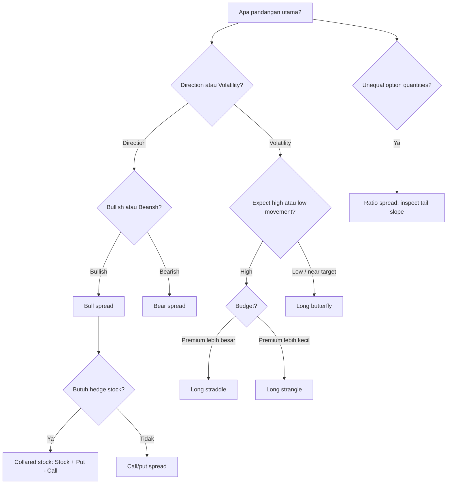

# 📘 6.3 — Option Strategies

> [!ABSTRACT] Ringkasan Cepat
> **Topik:** Option Strategies  
> **Bobot Parent Topic:** 5–15%  
> **Exam Priority:** Medium  
> **Difficulty:** Medium–Calculation Intensive  
> **Primary Skill:** Menyusun payoff/profit beberapa posisi opsi, membaca bentuk diagram, dan menjelaskan tujuan strategi  
> **Ref:** McDonald et al., *Derivatives Markets*, Chapter 3

## Section 0 — Pemetaan Silabus & Exam Scope

| Field | Isi |
|---|---|
| Topik CF1 | Topik 6 — Produk Derivatif |
| Subtopik | [[6.3 Option Strategies]] |
| Learning Outcome | Menjelaskan manfaat strategi opsi berupa option spreads (*bull*, *bear*, *ratio*), *collar*, *straddle*, *strangle*, dan *butterfly spread* untuk manajemen risiko atau spekulasi. |
| Skill Diuji | Menggabungkan payoff long/short options, membuat piecewise payoff, menghitung profit setelah net premium, mengidentifikasi bullish/bearish/volatility view, serta membaca capped/floored outcome |
| Bobot Parent Topic | 5–15% |
| Exam Priority | Medium |
| Prerequisite | [[6.1 Options – Call and Put]] |
| Connected Topics | [[6.1 Options – Call and Put]], [[6.2 Forwards and Futures]] |
| Referensi | McDonald Chapter 3, terutama §3.3 *Spreads and Collars* dan §3.4 *Speculating on Volatility* |

> [!IMPORTANT] Scope Boundary
> [CORE CF1] Note ini fokus pada strategi yang disebut eksplisit oleh silabus: **bull spread, bear spread, ratio spread, collar, straddle, strangle, dan butterfly spread**.  
> McDonald Chapter 3 juga membahas put-call parity, insured positions, covered calls, box spreads, asymmetric butterflies, dan beberapa equivalent positions. Konsep-konsep tersebut hanya dipakai sebagai supporting context bila membantu memahami strategi inti.  
> Detailed option pricing model dan Black–Scholes tidak dijadikan materi inti 6.3.

## Section 1 — Intuisi & Big Picture

Strategi opsi dibangun dari ide yang sangat sederhana:

> **Payoff suatu portfolio adalah jumlah payoff semua komponennya.**

Jika portfolio berisi beberapa posisi opsi:

$$
\text{Portfolio Payoff}
=
\sum_j \text{Payoff}_j.
$$

Jika profit dinilai pada expiration:

$$
\text{Portfolio Profit}
=
\text{Portfolio Payoff}
-
\operatorname{FV}_T(\text{net premium paid at }0).
$$

Jika net premium justru diterima di awal, future value net premium **ditambahkan** ke payoff.

Karena setiap call/put memiliki kink pada strike tertentu, menambah dan mengurangi beberapa opsi berarti kita sedang membangun piecewise-linear payoff baru.

McDonald menekankan trade-off utama:

> **Biaya dapat diturunkan dengan mengorbankan sebagian payoff.**

Contoh paling jelas adalah bull spread:

- membeli call memberi upside;
- menjual call dengan strike lebih tinggi memberi premium;
- premium yang diterima mengurangi cost;
- sebagai gantinya, upside di atas strike tinggi menjadi capped.

Strategi dapat dikelompokkan menjadi dua besar:

### Directional Strategies

Digunakan bila investor memiliki pandangan arah harga.

- bull spread → moderate bullish;
- bear spread → moderate bearish;
- collared stock → bullish exposure dengan floor dan cap;
- ratio spread → directional exposure dengan payoff yang dapat berubah arah karena jumlah option long dan short tidak sama.

### Volatility Strategies

Digunakan bila investor lebih peduli pada **besar pergerakan** daripada arah.

- long straddle → berharap pergerakan besar;
- long strangle → berharap pergerakan sangat besar dengan premium lebih murah;
- butterfly → berharap harga tetap dekat area tertentu / low volatility, tetapi dengan downside yang dibatasi.

## Section 2 — Building Blocks

### Empat Payoff Dasar

Dari [[6.1 Options – Call and Put]]:

$$
LC(K)=\max(0,S_T-K)
$$

$$
SC(K)=-\max(0,S_T-K)
$$

$$
LP(K)=\max(0,K-S_T)
$$

$$
SP(K)=-\max(0,K-S_T)
$$

Untuk strategy dengan multiple strikes, beri label:

$$
K_1<K_2<K_3.
$$

### Rule 1 — Tulis Setiap Leg

Jangan langsung menghafal final piecewise payoff.

Misalnya bull call spread:

- long call $K_1$;
- short call $K_2$.

Tulis:

$$
\max(0,S_T-K_1)
-
\max(0,S_T-K_2).
$$

Baru pecah berdasarkan regions:

1. $S_T\le K_1$;
2. $K_1<S_T<K_2$;
3. $S_T\ge K_2$.

### Rule 2 — Kink Berasal dari Strike

Jika terdapat strikes:

$$
K_1<K_2<K_3,
$$

maka region piecewise selalu dibagi pada strike tersebut.

### Rule 3 — Profit ≠ Payoff

Jika net premium awal adalah $P_0^{net}$, dengan convention:

- positif = net premium **dibayar**;
- negatif = net premium **diterima**,

maka:

$$
\Pi_T
=
\text{Payoff}_T
-
\operatorname{FV}_T(P_0^{net}).
$$

Jika interest diabaikan:

$$
\Pi_T
=
\text{Payoff}_T-P_0^{net}.
$$

> [!WARNING] Sign Convention
> Untuk menghindari kebingungan, cara paling aman adalah membuat daftar:
>
> - premium paid → cash outflow;
> - premium received → cash inflow;
>
> lalu jumlahkan semua initial cash flow sebelum dibawa ke expiration.

## Section 3 — Bull Spread

### Definisi

McDonald mendefinisikan **option spread** sebagai posisi hanya dengan calls atau hanya dengan puts, dengan sebagian opsi dibeli dan sebagian ditulis.

Bull spread adalah strategi yang memperoleh keuntungan ketika underlying naik, tetapi upside sengaja dibatasi untuk mengurangi biaya.

### Bull Call Spread

Ambil:

$$
K_1<K_2.
$$

Strategy:

- **buy call** strike $K_1$;
- **sell call** strike $K_2$.

Payoff:

$$
\boxed{
\text{Payoff}_{Bull}
=
\max(0,S_T-K_1)
-
\max(0,S_T-K_2)
}
$$

Piecewise:

$$
\text{Payoff}_{Bull}
=
\begin{cases}
0, & S_T\le K_1,\\
S_T-K_1, & K_1<S_T<K_2,\\
K_2-K_1, & S_T\ge K_2.
\end{cases}
$$

### Bentuk Payoff

- di bawah $K_1$ → flat $0$;
- antara strikes → slope $+1$;
- di atas $K_2$ → capped pada:

$$
K_2-K_1.
$$

### Economic Logic

Dibanding membeli call $K_1$ saja:

- short call $K_2$ memberikan premium;
- initial cost menjadi lebih murah;
- investor menyerahkan profit di atas $K_2$.

Jadi bull spread cocok bila investor:

> bullish, tetapi tidak mengharapkan kenaikan ekstrem.

### Bull Spread Menggunakan Put

McDonald menunjukkan bull spread juga dapat dibentuk dengan puts:

- **buy lower-strike put** $K_1$;
- **sell higher-strike put** $K_2$.

Dengan premium/financing yang sesuai, profit diagram dapat ekuivalen dengan bull call spread.

Untuk CF1, mechanics leg-by-leg tetap harus ditulis agar tidak tertukar.

## Section 4 — Bear Spread

Bear spread adalah kebalikan bull spread.

Dengan calls:

- **sell call** strike $K_1$;
- **buy call** strike $K_2$;

dengan:

$$
K_1<K_2.
$$

Payoff:

$$
\boxed{
\text{Payoff}_{Bear}
=
-\max(0,S_T-K_1)
+
\max(0,S_T-K_2)
}
$$

Piecewise:

$$
\text{Payoff}_{Bear}
=
\begin{cases}
0, & S_T\le K_1,\\
-(S_T-K_1), & K_1<S_T<K_2,\\
-(K_2-K_1), & S_T\ge K_2.
\end{cases}
$$

Profit diagram bear spread adalah kebalikan dari corresponding bull spread jika posisi setiap leg benar-benar direverse.

### Economic Logic

Bear spread cocok bila investor:

> bearish, tetapi bersedia membatasi maximum profit untuk membatasi cost/risk.

### Quick Memory

| View | Low Strike | High Strike |
|---|---|---|
| Bull Call Spread | Buy call | Sell call |
| Bear Call Spread | Sell call | Buy call |

> [!TIP] Shortcut
> Untuk call spread:
>
> **Bull = buy low strike.**  
> **Bear = sell low strike.**

## Section 5 — Ratio Spread

### Definisi

Menurut McDonald, ratio spread dibentuk dengan:

- membeli $m$ options pada satu strike;
- menjual $n$ options pada strike lain;

dengan:

- same option type;
- same underlying;
- same expiration;
- tetapi:

$$
m\ne n.
$$

Contoh yang disebut textbook:

- buy 1 low-strike call;
- sell 2 higher-strike calls.

### Generic Payoff

Untuk ratio call spread:

- long $m$ calls pada $K_1$;
- short $n$ calls pada $K_2$;

dengan $K_1<K_2$:

$$
\text{Payoff}
=
m\max(0,S_T-K_1)
-
n\max(0,S_T-K_2).
$$

Untuk contoh $m=1$, $n=2$:

$$
\text{Payoff}
=
\max(0,S_T-K_1)
-
2\max(0,S_T-K_2).
$$

Piecewise:

$$
\text{Payoff}
=
\begin{cases}
0, & S_T\le K_1,\\
S_T-K_1, & K_1<S_T<K_2,\\
S_T-K_1-2(S_T-K_2), & S_T\ge K_2.
\end{cases}
$$

Region terakhir menyederhana menjadi:

$$
2K_2-K_1-S_T.
$$

Jadi setelah $K_2$, slope berubah menjadi:

$$
1-2=-1.
$$

Artinya strategy yang semula untung ketika harga naik akhirnya **mulai kehilangan payoff** jika harga naik terlalu jauh.

### Mengapa Menarik?

McDonald menekankan bahwa karena jumlah option long dan short berbeda, ratio spread dapat disusun dengan **zero premium**.

Tetapi tidak ada free lunch:

> biaya awal yang kecil atau nol diperoleh dengan menerima adverse payoff pada region tertentu.

Untuk contoh 1-by-2 call ratio spread, upside ekstrem dapat menjadi berbahaya karena terdapat satu extra naked short call secara net.

> [!DANGER] Ratio Spread Trap
> Jangan menganggap semua “bullish-looking” spread memiliki capped downside dan capped upside.  
> Jika jumlah short options melebihi long options, tail payoff dapat berubah slope dan bahkan menjadi unbounded loss.

## Section 6 — Collar

### Definisi Collar

McDonald mendefinisikan purchased collar sebagai:

- **buy put** pada lower strike $K_P$;
- **sell call** pada higher strike $K_C$;

dengan:

$$
K_P<K_C,
$$

same underlying dan same expiration.

Collar width:

$$
\boxed{
K_C-K_P
}
$$

Payoff collar saja:

$$
\text{Payoff}_{Collar}
=
\max(0,K_P-S_T)
-
\max(0,S_T-K_C).
$$

Piecewise:

$$
\text{Payoff}_{Collar}
=
\begin{cases}
K_P-S_T, & S_T<K_P,\\
0, & K_P\le S_T\le K_C,\\
K_C-S_T, & S_T>K_C.
\end{cases}
$$

McDonald mencatat collar itu sendiri menyerupai **short forward dengan dead zone** di antara dua strikes:

- harga turun → put menghasilkan gain;
- harga berada di antara strikes → kedua opsi expire worthless;
- harga naik di atas call strike → written call menghasilkan loss.

### Collared Stock

Dalam risk management, penggunaan paling natural adalah:

- own stock;
- buy put $K_P$;
- sell call $K_C$.

Total payoff:

$$
S_T
+
\max(0,K_P-S_T)
-
\max(0,S_T-K_C).
$$

Piecewise:

$$
\boxed{
\text{Collared Stock Payoff}
=
\begin{cases}
K_P, & S_T<K_P,\\
S_T, & K_P\le S_T\le K_C,\\
K_C, & S_T>K_C.
\end{cases}
}
$$

Ini menghasilkan:

- **floor** pada $K_P$;
- exposure normal di antara strikes;
- **cap** pada $K_C$.

### Tujuan

Investor membeli put untuk insurance terhadap downside.

Biaya insurance kemudian dikurangi dengan menjual call.

Trade-off:

> downside dilindungi, tetapi upside di atas call strike dikorbankan.

### Zero-Cost Collar

Jika premium received dari written call sama dengan premium paid untuk put:

$$
C_0=P_0,
$$

maka net option premium adalah nol.

Ini disebut **zero-cost collar**.

> [!IMPORTANT] Zero Cost ≠ No Economic Trade-Off
> Tidak membayar net premium bukan berarti protection gratis. Investor tetap menyerahkan upside di atas strike call.

### Collar vs Bull Spread

McDonald menunjukkan collared stock dapat memiliki profit diagram yang identik dengan bull spread, walaupun transaksinya berbeda:

- bull spread = kombinasi dua options;
- collared stock = stock + put + written call.

## Section 7 — Straddle

### Purchased / Long Straddle

Long straddle:

- buy call strike $K$;
- buy put strike $K$;
- same expiration.

Payoff:

$$
\boxed{
\text{Payoff}_{Straddle}
=
\max(0,S_T-K)
+
\max(0,K-S_T)
}
$$

Karena salah satu dari dua terms aktif:

$$
\boxed{
\text{Payoff}_{Straddle}
=
|S_T-K|
}
$$

Piecewise:

$$
\text{Payoff}_{Straddle}
=
\begin{cases}
K-S_T, & S_T<K,\\
S_T-K, & S_T\ge K.
\end{cases}
$$

### Interpretation

Long straddle tidak terlalu peduli arah.

Investor menginginkan:

> **pergerakan besar ke atas atau ke bawah.**

McDonald menyebutnya bet bahwa volatility akan tinggi relatif terhadap volatility yang sudah tercermin dalam option prices.

### Cost

Straddle mahal karena membeli dua options.

Jika call premium $C_0$ dan put premium $P_0$, net premium:

$$
C_0+P_0.
$$

Jika interest diabaikan:

$$
\Pi_T
=
|S_T-K|
-
(C_0+P_0).
$$

Break-even:

$$
\boxed{
S_T^{BE,Lower}
=
K-(C_0+P_0)
}
$$

$$
\boxed{
S_T^{BE,Upper}
=
K+(C_0+P_0)
}
$$

Jika interest relevan, gunakan future value total premium.

### Written Straddle

Reverse semua legs:

- sell call $K$;
- sell put $K$.

Profit diagram adalah exact opposite long straddle.

Interpretasi:

> bet bahwa realized movement akan kecil / volatility lebih rendah dari yang priced by market.

Maximum profit terjadi dekat strike, tetapi large move dapat menghasilkan large losses.

Untuk upside:

$$
\text{short call loss}
$$

dapat terus membesar ketika $S_T$ naik.

> [!DANGER] Written Straddle
> Premium income terlihat menarik, tetapi tail risk besar. Jangan hanya melihat maximum profit.

## Section 8 — Strangle

### Long Strangle

Untuk menurunkan biaya straddle, McDonald menggunakan out-of-the-money options:

- buy put pada lower strike $K_P$;
- buy call pada higher strike $K_C$;

dengan:

$$
K_P<K_C.
$$

Payoff:

$$
\boxed{
\text{Payoff}_{Strangle}
=
\max(0,K_P-S_T)
+
\max(0,S_T-K_C)
}
$$

Piecewise:

$$
\text{Payoff}_{Strangle}
=
\begin{cases}
K_P-S_T, & S_T<K_P,\\
0, & K_P\le S_T\le K_C,\\
S_T-K_C, & S_T>K_C.
\end{cases}
$$

### Straddle vs Strangle

| Feature | Straddle | Strangle |
|---|---|---|
| Put strike | $K$ | Lower $K_P$ |
| Call strike | $K$ | Higher $K_C$ |
| Initial premium | Lebih tinggi | Lebih rendah |
| Movement needed for profit | Lebih kecil | Lebih besar |
| View | High volatility | Very large movement / high volatility |
| Central payoff region | Point/minimal around $K$ | Flat zero-payoff region $[K_P,K_C]$ |

McDonald menekankan trade-off:

> Strangle mengurangi maximum premium loss, tetapi membutuhkan price move yang lebih besar untuk menghasilkan profit.

### Break-Even

Jika future value net premium adalah $Q_T$:

Lower:

$$
\boxed{
S_T^{BE,L}
=
K_P-Q_T
}
$$

Upper:

$$
\boxed{
S_T^{BE,U}
=
K_C+Q_T
}
$$

## Section 9 — Butterfly Spread

### Intuisi

McDonald membangun butterfly sebagai **insured written straddle**.

Mulai dari:

- sell at-the-money call;
- sell at-the-money put;

lalu lindungi tails dengan:

- buy out-of-the-money put;
- buy out-of-the-money call.

Hasilnya adalah posisi yang memperoleh benefit jika underlying berakhir dekat middle strike, tetapi tail losses dibatasi.

### Standard Symmetric Butterfly

Ambil:

$$
K_1<K_2<K_3
$$

dan untuk symmetric butterfly:

$$
K_2-K_1
=
K_3-K_2.
$$

Dengan calls, true butterfly dapat dibentuk sebagai:

- buy 1 call $K_1$;
- sell 2 calls $K_2$;
- buy 1 call $K_3$.

Payoff:

$$
\boxed{
B_T
=
\max(0,S_T-K_1)
-
2\max(0,S_T-K_2)
+
\max(0,S_T-K_3)
}
$$

Piecewise:

$$
B_T
=
\begin{cases}
0, & S_T\le K_1,\\
S_T-K_1, & K_1<S_T\le K_2,\\
K_3-S_T, & K_2<S_T<K_3,\\
0, & S_T\ge K_3,
\end{cases}
$$

untuk equal-width strikes.

Maximum payoff terjadi di middle strike:

$$
S_T=K_2.
$$

Maximum payoff:

$$
\boxed{
K_2-K_1
=
K_3-K_2
}
$$

### Economic View

Butterfly cocok bila investor mengharapkan:

> harga underlying berakhir dekat middle strike / volatility relatif rendah.

Dibanding written straddle:

- maximum profit lebih rendah karena membeli tail insurance;
- extreme losses dibatasi;
- payoff membentuk “tent” atau “butterfly”.

### Alternative Construction

McDonald menjelaskan butterfly dapat dipandang sebagai:

- buy $K_1$–$K_2$ bull spread;
- buy $K_2$–$K_3$ bear spread.

Textbook juga membedakan “true butterfly” yang dibangun solely dengan calls atau solely dengan puts dari **iron butterfly**, yang dibangun dengan selling straddle + buying strangle.

[CF1 SUPPORTING CONTEXT] Untuk ujian, yang paling penting adalah mengenali payoff shape dan leg structure; terminology iron butterfly bukan learning outcome eksplisit.

## Section 10 — Formula & Shape Map

| Strategy | Legs | View | Tail Behavior |
|---|---|---|---|
| Bull Call Spread | $+C(K_1)-C(K_2)$ | Moderately bullish | Upside capped |
| Bear Call Spread | $-C(K_1)+C(K_2)$ | Moderately bearish | Downside/upside bounded by spread |
| Ratio Call Spread | $mC(K_1)-nC(K_2)$, $m\ne n$ | Directional / tailored | Tail slope depends on $m-n$ |
| Purchased Collar | $+P(K_P)-C(K_C)$ | Short-like option overlay | Positive below $K_P$, negative above $K_C$ |
| Collared Stock | $S+P(K_P)-C(K_C)$ | Protected long | Floor $K_P$, cap $K_C$ |
| Long Straddle | $+C(K)+P(K)$ | High volatility | Gains both tails |
| Short Straddle | $-C(K)-P(K)$ | Low volatility | Large tail risk |
| Long Strangle | $+P(K_P)+C(K_C)$ | High volatility, cheaper | Needs larger move |
| Butterfly | $+C(K_1)-2C(K_2)+C(K_3)$ | Low volatility / target range | Tail losses bounded |

## Section 11 — Worked Examples & Exam Cases

### Case A — Bull Spread Textbook Pattern

McDonald Table 3.4 memberi option premiums:

| Strike | Call Premium | Put Premium |
|---:|---:|---:|
| $35$ | $6.13$ | $0.44$ |
| $40$ | $2.78$ | $1.99$ |
| $45$ | $0.97$ | $5.08$ |

Dalam Example 3.2:

- buy 40-call for $2.78$;
- sell 45-call for $0.97$.

Net initial cost:

$$
2.78-0.97=1.81.
$$

Textbook menggunakan 3-month future value:

$$
1.81(1.0833)^{0.25}
\approx
1.85.
$$

Payoff:

$$
\max(0,S_T-40)-\max(0,S_T-45).
$$

Profit:

$$
\Pi_T
=
\text{Payoff}-1.85.
$$

At $S_T=42.5$:

$$
\text{Payoff}
=
2.5-0
=
2.5.
$$

$$
\Pi_T
=
2.5-1.85
=
0.65.
$$

At $S_T\ge45$ payoff capped:

$$
45-40=5.
$$

Maximum profit:

$$
5-1.85=3.15.
$$

Maximum loss:

$$
-1.85.
$$

> [!WARNING] Exam Trap — Bull Spread
> Maximum payoff bukan unlimited walaupun strategy mengandung long call. Written higher-strike call memotong upside.

### Case B — Bull Spread Break-Even

Misalkan:

- long call $K_1=250$, premium $40$;
- short call $K_2=400$, premium received $25$;
- interest diabaikan.

Net premium:

$$
40-25=15.
$$

Payoff:

$$
\max(0,S_T-250)-\max(0,S_T-400).
$$

Untuk:

$$
250<S_T<400,
$$

profit:

$$
S_T-250-15.
$$

Break-even:

$$
S_T=265.
$$

Maximum profit:

$$
(400-250)-15
=
135.
$$

Jika:

$$
S_T=500,
$$

payoff tetap:

$$
150,
$$

maka:

$$
\boxed{
\Pi_T=135
}.
$$

> [!TIP] Exam Shortcut
> Bull call spread:
>
> $$
> \text{Max payoff}=K_2-K_1.
> $$
>
> $$
> \text{Max profit}=(K_2-K_1)-\text{net premium}.
> $$

### Case C — Collared Stock

Investor owns stock dan membangun:

- long stock;
- long put $K_P=90$;
- short call $K_C=120$.

Abaikan premium untuk payoff-only question.

Total payoff:

$$
S_T+\max(0,90-S_T)-\max(0,S_T-120).
$$

Jika:

$$
S_T=70,
$$

$$
70+(90-70)-0
=
90.
$$

Jika:

$$
S_T=105,
$$

$$
105+0-0
=
105.
$$

Jika:

$$
S_T=150,
$$

$$
150+0-(150-120)
=
120.
$$

Jadi:

$$
\boxed{
\text{Payoff}
=
\begin{cases}
90, & S_T<90,\\
S_T, & 90\le S_T\le120,\\
120, & S_T>120.
\end{cases}
}
$$

Interpretasi:

- downside floor $90$;
- upside cap $120$.

### Case D — Long Straddle

Call dan put memiliki strike:

$$
K=100.
$$

Total premium awal:

$$
12.
$$

Interest diabaikan.

Profit:

$$
|S_T-100|-12.
$$

Break-even:

$$
100-12=88
$$

dan:

$$
100+12=112.
$$

Jika:

$$
S_T=75,
$$

profit:

$$
|75-100|-12
=
25-12
=
13.
$$

Jika:

$$
S_T=104,
$$

profit:

$$
4-12
=
-8.
$$

> [!WARNING] Interpretation
> Long straddle tidak cukup hanya “harga bergerak”. Pergerakan harus **cukup besar untuk menutup dua premium**.

### Case E — Long Strangle

Buy:

- put $K_P=90$;
- call $K_C=110$.

Total premium:

$$
8.
$$

Interest diabaikan.

Profit:

$$
\max(0,90-S_T)
+
\max(0,S_T-110)
-8.
$$

Break-even:

$$
90-8=82
$$

dan:

$$
110+8=118.
$$

Di antara:

$$
90\le S_T\le110,
$$

kedua options expire worthless dan loss:

$$
-8.
$$

### Case F — Butterfly

Build:

- long call $K_1=90$;
- short 2 calls $K_2=100$;
- long call $K_3=110$.

Payoff:

$$
\max(0,S_T-90)
-
2\max(0,S_T-100)
+
\max(0,S_T-110).
$$

At $S_T=95$:

$$
5-0+0=5.
$$

At $S_T=100$:

$$
10-0+0=10.
$$

At $S_T=105$:

$$
15-2(5)+0=5.
$$

At $S_T=120$:

$$
30-2(20)+10=0.
$$

Payoff peaks at:

$$
S_T=100,
$$

sebesar:

$$
10.
$$

Bentuknya triangular/tent-shaped.

### Case G — Ratio Spread Sign Change

Build:

- long 1 call $K_1=100$;
- short 2 calls $K_2=120$.

Ignore premiums.

For:

$$
100<S_T<120,
$$

payoff:

$$
S_T-100.
$$

For:

$$
S_T>120,
$$

payoff:

$$
(S_T-100)-2(S_T-120)
$$

$$
=
140-S_T.
$$

Maka payoff kembali menjadi nol saat:

$$
S_T=140.
$$

Di atas $140$, payoff negatif dan terus turun.

> [!DANGER] Exam Insight
> Ratio spread dapat memiliki **second break-even** dan tail loss karena jumlah short options lebih banyak daripada long options.

## Section 12 — Verification & Sanity Check

> [!CHECK] Sanity Check
> 1. Portfolio payoff harus sama dengan sum of leg payoffs.
> 2. Setiap perubahan slope harus terjadi pada strike yang ada dalam strategy.
> 3. Bull call spread:
>
> $$
> \text{slope}: 0\rightarrow+1\rightarrow0.
> $$
>
> 4. Bear call spread:
>
> $$
> \text{slope}: 0\rightarrow-1\rightarrow0.
> $$
>
> 5. Long straddle:
>
> $$
> \text{slope}: -1\rightarrow+1
> $$
>
> pada strike.
> 6. Long strangle memiliki flat region di antara strikes.
> 7. Symmetric butterfly:
>
> $$
> 0\rightarrow+1\rightarrow-1\rightarrow0.
> $$
>
> 8. Collared stock harus memiliki:
>    - floor;
>    - linear middle;
>    - cap.
> 9. Jika strategy “cheaper” daripada alternative, tanyakan payoff apa yang dikorbankan.
> 10. Jika net premium = zero, payoff economics masih dapat sangat asymmetric.

## Section 13 — Exam Traps & Misconceptions

### Trap 1 — Long/Short Leg Reversal

> [!BUG] Bull Spread Trap
> Bull call spread:
>
> $$
> +C(K_1)-C(K_2),
> \qquad K_1<K_2.
> $$
>
> Bukan sebaliknya.

Mental rule:

> **Bull call = buy cheaper exercise price.**

### Trap 2 — Payoff vs Profit

> [!BUG] Premium Trap
> Strategy payoff diperoleh dengan menjumlahkan terminal option payoffs.
>
> Strategy profit harus memasukkan **net premium** pada valuation date yang sama.

### Trap 3 — Ignoring Interest on Premium

Jika premium dibayar sekarang dan profit diminta pada maturity:

$$
\text{profit}
=
\text{payoff}
-
FV(\text{net premium}).
$$

McDonald Example 3.2 secara eksplisit membawa net premium $1.81$ menjadi $1.85$ pada expiration.

### Trap 4 — Bull Spread Unlimited Upside

False.

Bull call spread payoff capped pada:

$$
K_2-K_1.
$$

### Trap 5 — Collar = Buy Put + Buy Call

False untuk purchased collar yang didefinisikan McDonald.

Purchased collar:

$$
+P(K_P)-C(K_C).
$$

Untuk **collared stock**, tambahkan long stock.

### Trap 6 — Zero-Cost Collar = No Risk

False.

Zero-cost hanya berarti:

$$
\text{premium paid}
=
\text{premium received}.
$$

Investor tetap memiliki floor/cap dan opportunity cost.

### Trap 7 — Straddle vs Strangle

Straddle:

- same strike;
- higher premium;
- narrower move needed.

Strangle:

- lower-strike put + higher-strike call;
- lower premium;
- larger move needed.

### Trap 8 — Butterfly = High-Volatility Bet

False untuk long butterfly standar.

Long butterfly memperoleh maximum payoff ketika:

$$
S_T
$$

berada dekat middle strike.

Ia lebih cocok dengan low-volatility / target-range view.

### Trap 9 — Ratio Spread Selalu Limited Risk

False.

Tail slope ditentukan oleh jumlah net option units.

Untuk 1-by-2 call ratio spread:

$$
\text{tail slope}=1-2=-1.
$$

Jadi upside extreme dapat menghasilkan increasing loss.

### Trap 10 — Mencampur Option Type

Spread dalam definisi McDonald menggunakan only calls atau only puts.

Collar, straddle, strangle justru menggabungkan call dan put.

## Section 14 — Red Flags

> [!CAUTION] Red Flags

| Keyword / Narasi | Pikirkan |
|---|---|
| “buy low-strike call, sell high-strike call” | Bull spread |
| “sell low-strike call, buy high-strike call” | Bear spread |
| “unequal numbers of options” | Ratio spread |
| “zero premium using unequal quantities” | Ratio spread candidate |
| “buy put, sell higher-strike call” | Collar |
| “own stock + put + written call” | Collared stock |
| “floor and cap” | Collar/collared stock |
| “buy call and put, same strike” | Long straddle |
| “sell call and put, same strike” | Written straddle |
| “buy OTM put + OTM call” | Strangle |
| “expect large move, direction unknown” | Long straddle / strangle |
| “expect low volatility” | Short straddle or long butterfly |
| “buy low strike, sell 2 middle, buy high strike” | Butterfly |
| “tent-shaped payoff” | Butterfly |
| “premium paid today, profit at expiration” | Accumulate net premium |
| “capped upside” | Spread/collar |
| “large tail loss” | Written straddle / certain ratio spreads |

## Section 15 — Executive Summary

> [!SUMMARY] Must Remember
> 1. Strategy payoff = sum of leg payoffs.
> 2. Profit = payoff adjusted for net premium at same valuation date.
> 3. **Bull call spread:**
>
> $$
> \boxed{
> +C(K_1)-C(K_2),\quad K_1<K_2
> }
> $$
>
> 4. Bull spread = bullish dengan upside capped.
> 5. Bear spread = reverse bull spread.
> 6. Ratio spread memakai unequal quantities:
>
> $$
> m\ne n.
> $$
>
> Tail risk harus diperiksa dari net slope.
> 7. Collar:
>
> $$
> \boxed{
> +P(K_P)-C(K_C),\quad K_P<K_C
> }
> $$
>
> 8. Collared stock:
>
> $$
> \boxed{
> S+P(K_P)-C(K_C)
> }
> $$
>
> menghasilkan floor dan cap.
> 9. Zero-cost collar berarti net option premium $=0$, bukan risk $=0$.
> 10. Long straddle:
>
> $$
> \boxed{
> +C(K)+P(K)
> }
> $$
>
> = bet on large movement/high volatility.
> 11. Long strangle:
>
> $$
> \boxed{
> +P(K_P)+C(K_C)
> }
> $$
>
> lebih murah tetapi membutuhkan movement lebih besar.
> 12. Butterfly:
>
> $$
> \boxed{
> +C(K_1)-2C(K_2)+C(K_3)
> }
> $$
>
> dengan equally spaced strikes untuk symmetric butterfly.
> 13. Long butterfly mendapat maximum payoff dekat middle strike.
> 14. Written straddle memiliki tail risk besar.
> 15. Cara paling aman menyelesaikan soal adalah **leg-by-leg → regions → payoff → premium → profit**.

### Strategy Comparison

| Strategy | Market View | Cost Character | Main Benefit | Main Sacrifice |
|---|---|---|---|---|
| Bull Spread | Moderate bullish | Lower than naked long call | Cheaper bullish exposure | Capped upside |
| Bear Spread | Moderate bearish | Controlled | Bearish exposure with bounded structure | Capped benefit |
| Ratio Spread | Tailored directional | Bisa zero premium | Flexible payoff | Potential dangerous tail |
| Collared Stock | Own asset, want protection | Put partly funded by call | Downside floor | Upside cap |
| Long Straddle | Large move either direction | High | Profit from either tail | Expensive if price stays near strike |
| Long Strangle | Very large move | Lower than straddle | Cheaper volatility bet | Needs bigger move |
| Long Butterfly | Low volatility / target price | Limited | Bounded risk, peak near middle strike | Limited maximum profit |

### Quick Decision Tree

## Section 16 — Active Recall Check

1. Jelaskan mengapa bull spread lebih murah daripada long call biasa.
2. Tuliskan bull call spread menggunakan $K_1<K_2$.
3. Berapa maximum payoff bull call spread?
4. Mengapa bear spread disebut opposite dari bull spread?
5. Apa defining characteristic ratio spread?
6. Mengapa ratio spread dapat dibuat zero premium?
7. Apa risiko 1-by-2 call ratio spread jika stock price naik sangat tinggi?
8. Apa dua legs pada purchased collar?
9. Apa tiga komponen collared stock?
10. Tunjukkan secara piecewise mengapa collared stock memiliki floor dan cap.
11. Apa arti zero-cost collar?
12. Mengapa long straddle merupakan bet pada volatility?
13. Mengapa strangle lebih murah daripada straddle?
14. Apa trade-off premium strangle yang lebih murah?
15. Tulis payoff long straddle sebagai absolute value.
16. Tulis standard call butterfly dengan strikes $K_1<K_2<K_3$.
17. Di mana maximum payoff symmetric butterfly terjadi?
18. Mengapa butterfly dapat dianggap insured written straddle?
19. Mengapa written straddle memiliki dangerous tail risk?
20. Bagaimana interest pada option premiums dapat mengubah break-even strategy?

## Section 17 — Exam Pattern Map

[TEXTBOOK-BASED EXPECTATION]

| Narasi Soal | Keyword | Konsep | Setup | Trap | Shortcut |
|---|---|---|---|---|---|
| Beli call rendah, jual call tinggi | “bull spread” | Directional spread | $+C(K_1)-C(K_2)$ | strike order terbalik | bull = buy low strike |
| Jual call rendah, beli call tinggi | “bear spread” | Reverse spread | $-C(K_1)+C(K_2)$ | disebut bull karena ada long call | inspect net slope |
| Premium dua options berbeda | “profit at expiration” | Net premium | payoff − FV(net premium) | hanya subtract initial premium | value date consistency |
| Unequal counts | “buy 1, sell 2” | Ratio spread | coefficient tiap payoff | lupa multiplicity | write coefficients first |
| Stock + put + short call | “protect downside, fund put” | Collared stock | $S+P-C$ | collar saja vs collared stock | stock adds slope +1 |
| Same strike call + put | “large movement” | Straddle | $|S_T-K|$ | memilih berdasarkan direction | volatility, not direction |
| OTM put + OTM call | “cheaper than straddle” | Strangle | two different strikes | same strike | strangle has gap |
| 1:-2:1 calls | “tent-shaped” | Butterfly | $C_1-2C_2+C_3$ | sign middle wrong | middle = short twice |
| Asked max payoff butterfly | equal-width strikes | Peak payoff | $K_2-K_1$ | using $K_3-K_1$ | one wing width |
| Zero-cost strategy | “net premium zero” | Financing trade-off | premium inflows = outflows | assume no risk | inspect terminal payoff |
| Strategy purpose | “moderately bullish” | Bull spread | capped upside | choose straddle | direction vs volatility |
| Strategy purpose | “expect low volatility with bounded tail risk” | Butterfly | tent payoff | written straddle | butterfly = insured short-vol view |

## Source Traceability

| Materi | Sumber |
|---|---|
| Scope Topik 6.3 & strategy list | Silabus CF1 / Prompt Summary Materi Exam CF1 v2 |
| Option spread definition | McDonald Chapter 3 §3.3 |
| Bull spread construction and motivation | McDonald Chapter 3 §3.3, Example 3.2 |
| Bull spread using puts | McDonald Chapter 3 §3.3 |
| Bear spread as opposite bull spread | McDonald Chapter 3 §3.3 |
| Ratio spread definition and zero-premium possibility | McDonald Chapter 3 §3.3 |
| Collar definition and collar width | McDonald Chapter 3 §3.3 |
| Collared stock as insurance strategy | McDonald Chapter 3 §3.3, Example 3.5 |
| Zero-cost collar concept | McDonald Chapter 3 §3.3 |
| Straddle definition and volatility interpretation | McDonald Chapter 3 §3.4 |
| Strangle as lower-premium alternative requiring larger move | McDonald Chapter 3 §3.4 |
| Written straddle as low-volatility view with large tail risk | McDonald Chapter 3 §3.4 |
| Butterfly as insured written straddle | McDonald Chapter 3 §3.4 |
| Butterfly construction as bull spread + bear spread | McDonald Chapter 3 §3.4 |
| Premium future-value treatment in spread profit | McDonald Chapter 3, Example 3.2 |
| Numerical option premiums $35/40/45$ strikes | McDonald Table 3.4 |

> [!NOTE] Source Boundary
> Note ini menggunakan **Silabus CF1 sebagai scope authority** dan **McDonald Chapter 3 sebagai textbook authority**. Box spreads, tax applications, detailed put-call parity equivalences, asymmetric butterflies, dan later-chapter pricing theory tidak dijadikan materi inti. Formula piecewise pada note ini dibentuk langsung dari leg payoffs yang didefinisikan McDonald dan digunakan untuk membuat payoff/profit diagrams pada Chapter 3.

---

> [!QUOTE] Follow-up Options
> 1. *"Uji saya dengan soal Active Recall Topik 6"*
> 2. *"Buat formula sheet Topik 6 dari 6.1–6.3"*
> 3. *"Buat 10 soal exam-style option strategies untuk CF1"*

*📖 Ref: McDonald et al., Derivatives Markets, Chapter 3 §§3.3–3.4 | 🗓️ 2026-08-25 | #CF1 #MatematikaKeuangan*
