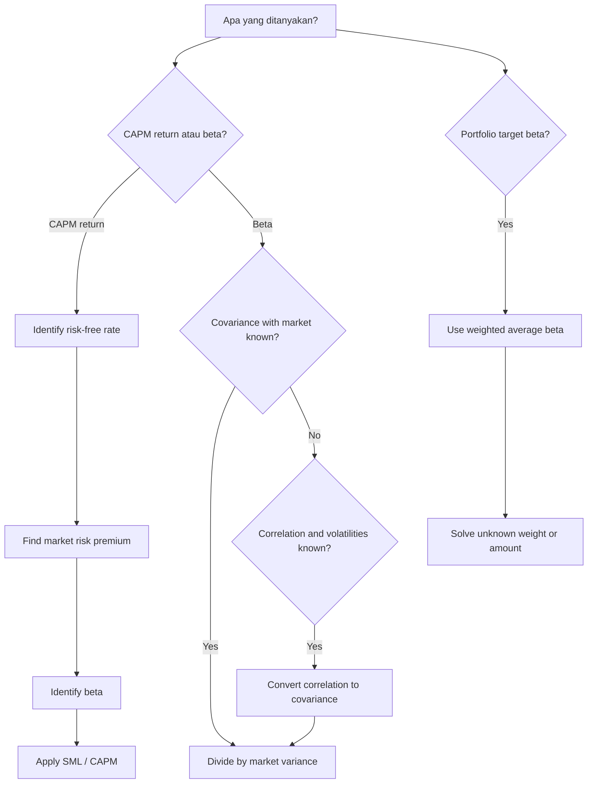

# 📘 7.1 — CAPM and Factor Models

> [!ABSTRACT] Ringkasan Cepat
> **Topik:** CAPM and Factor Models  
> **Bobot Parent Topic:** 5–15%  
> **Exam Priority:** Medium  
> **Difficulty:** Mixed  
> **Primary Skill:** Mixed — concept + calculation + interpretation  
> **Ref:** Ross, Westerfield & Jordan, *Fundamentals of Corporate Finance*, Chapters 12–13

## Section 0 — Pemetaan Silabus & Exam Scope

| Field | Isi |
|---|---|
| Topik CF1 | Topik 7 — Matematika Keuangan untuk Portofolio |
| Subtopik | [[7.1 CAPM and Factor Models]] |
| Learning Outcome | Menjelaskan sifat dan asumsi CAPM serta *factor model* pada return sekuritas; menghitung expected return aset, portofolio, atau proyek menggunakan CAPM, *single-factor*, dan *multi-factor*. |
| Skill Diuji | Systematic vs unsystematic risk, diversification logic, beta, portfolio beta, market risk premium, SML, CAPM expected/required return, relative pricing interpretation |
| Bobot Parent Topic | 5–15% |
| Exam Priority | Medium |
| Prerequisite | Expected return, variance, covariance, correlation, portfolio weights, diversification |
| Connected Topics | [[7.2 Mean-Variance Portfolio Theory]] |
| Referensi | Silabus CF1 Topik 7; Ross et al. Chapters 12–13 |

> [!IMPORTANT] Scope Boundary
> [CORE CF1] Silabus secara eksplisit memasukkan **beta, SML, CAPM, single-factor model, dan multi-factor model**. Ross Chapters 12–13 yang tersedia mendukung secara kuat return–risk trade-off, diversification, systematic/unsystematic risk, beta, reward-to-risk ratio, SML, CAPM, dan portfolio beta.
>
> **Source gap:** pada file Ross yang tersedia, explicit mathematical specification untuk *single-factor* dan *multi-factor model* tidak ditemukan secara memadai. Karena source-boundary prompt melarang menambahkan formula dari general knowledge, note ini **tidak mengarang formula factor model**. Bagian factor model karena itu dibatasi pada scope silabus dan hubungan konseptual yang dapat ditarik dengan aman dari systematic-risk framework Ross. Jika tersedia source resmi tambahan yang secara eksplisit memuat factor-model equations, bagian tersebut dapat dilengkapi.

---

## Section 1 — Intuisi & Big Picture

Mengapa dua aset dengan total volatility yang berbeda tidak selalu harus menawarkan expected return yang berbeda secara proporsional?

Jawaban Ross adalah bahwa investor dapat menghilangkan sebagian risiko hanya dengan **diversification**. Jika suatu risiko dapat dihilangkan hampir tanpa biaya melalui pembentukan portofolio besar, pasar tidak perlu memberikan extra expected return hanya karena investor memilih memegang risiko tersebut.

Karena itu, total risk dipecah menjadi:

1. **systematic risk** — risiko yang berasal dari faktor luas dan mempengaruhi banyak aset;
2. **unsystematic risk** — risiko spesifik perusahaan atau kelompok kecil aset.

Diversification mengurangi unsystematic risk, tetapi tidak menghilangkan systematic risk. Maka, dalam risk-return pricing:

> **yang dihargai pasar bukan total standard deviation aset, melainkan systematic risk yang tetap bertahan setelah diversification.**

Ross menggunakan **beta** untuk mengukur seberapa besar systematic risk suatu aset relatif terhadap pasar. Dari sini muncul **Security Market Line (SML)** dan **Capital Asset Pricing Model (CAPM)**.

Alur mental:

```text
Total return uncertainty
        ↓
Systematic + unsystematic risk
        ↓
Diversification removes much of unsystematic risk
        ↓
Only systematic risk is rewarded
        ↓
Measure systematic risk with beta
        ↓
Market risk premium × beta
        ↓
Required / expected return via CAPM
```

---

## Section 2 — Definisi & Core Concepts

### 2.1 Return, Expected Return, dan Unexpected Return

Ross memulai risk analysis dengan membedakan return yang diharapkan dari realisasi aktual.

Secara konseptual:

$$
R = E[R] + U,
$$

dengan:

- $R$ = realized return;
- $E[R]$ = expected return;
- $U$ = unexpected component.

Risk muncul karena actual return dapat berbeda dari expected return akibat kejadian yang tidak diantisipasi.

> [!IMPORTANT] Expected vs Realized
> CAPM berbicara tentang **expected/required return**, bukan menjamin realized return periode berikutnya.

---

### 2.2 Systematic Risk dan Unsystematic Risk

**Systematic risk** (*market risk*) berasal dari unexpected events yang berdampak luas pada banyak securities.

Contoh konseptual:

- perubahan kondisi ekonomi;
- perubahan tingkat bunga secara luas;
- perubahan inflasi atau aktivitas bisnis secara agregat.

**Unsystematic risk** (*unique / asset-specific risk*) berasal dari kejadian yang terutama mempengaruhi satu perusahaan atau kelompok kecil perusahaan.

Contoh konseptual:

- masalah produk tertentu;
- pergantian manajemen;
- kejadian operasional spesifik perusahaan.

Ross menekankan:

> **Unsystematic risk dapat sangat dikurangi melalui diversification, sedangkan systematic risk tidak.**

---

### 2.3 Principle of Diversification

Ketika jumlah securities dalam portofolio bertambah, asset-specific positive dan negative surprises cenderung saling mengimbangi.

Karena itu:

- standard deviation portofolio turun ketika diversification bertambah;
- penurunan tersebut tidak berlanjut sampai nol;
- residual risk yang tidak hilang adalah systematic risk.

> [!DANGER] Jangan Salah Pikir
> Diversification **tidak berarti semua risiko hilang**. Ia terutama mengurangi unsystematic risk.

---

### 2.4 Systematic Risk Principle

Ross merumuskan economic logic berikut:

> Expected reward untuk menanggung risiko bergantung pada **systematic risk**, bukan total risk.

Ini adalah jembatan utama menuju beta dan CAPM.

Aset dengan standard deviation tinggi tetapi sebagian besar risikonya diversifiable belum tentu memiliki required return sangat tinggi.

Sebaliknya, aset yang sangat sensitif terhadap market-wide movements dapat memiliki required return tinggi walaupun sebagian total volatility-nya tidak ekstrem.

---

### 2.5 Beta

Beta mengukur systematic risk suatu aset relatif terhadap market portfolio.

Secara covariance form:

$$
\boxed{
\beta_i
=
\frac{\operatorname{Cov}(R_i,R_M)}
{\operatorname{Var}(R_M)}
}
$$

dengan:

- $R_i$ = return aset $i$;
- $R_M$ = market return;
- $\operatorname{Cov}(R_i,R_M)$ = covariance aset dengan market;
- $\operatorname{Var}(R_M)=\sigma_M^2$ = variance market.

### Interpretasi Beta

| Beta | Interpretasi |
|---:|---|
| $\beta_i=1$ | systematic risk sama dengan market |
| $\beta_i>1$ | lebih sensitif terhadap market dibanding average asset |
| $0<\beta_i<1$ | systematic risk positif tetapi di bawah market |
| $\beta_i=0$ | tidak memiliki exposure linear terhadap market risk |
| $\beta_i<0$ | cenderung bergerak berlawanan terhadap market dalam systematic-risk sense |

Market portfolio sendiri memiliki:

$$
\boxed{\beta_M=1}
$$

dan risk-free asset memiliki:

$$
\boxed{\beta_f=0}.
$$

---

### 2.6 Portfolio Beta

Beta portofolio adalah weighted average beta masing-masing aset:

$$
\boxed{
\beta_p
=
\sum_{i=1}^{n}w_i\beta_i
}
$$

dengan:

$$
\sum_{i=1}^{n} w_i=1
$$

untuk standard fully invested portfolio.

Jika investasi dinyatakan dalam rupiah/dollar amount $W_i$ dan total wealth $W$:

$$
w_i=\frac{W_i}{W},
$$

sehingga:

$$
\boxed{
W\beta_p
=
\sum_i W_i\beta_i
}
$$

Bentuk terakhir sangat berguna ketika soal memberikan nilai investasi langsung.

> [!TIP] Cara Berpikir
> Jika target adalah “portfolio risk sama dengan market”, terjemahkan segera menjadi:
>
> $$
> \beta_p=1.
> $$
>
> Jangan langsung memakai standard deviation kecuali soal memang mendefinisikan “risk” sebagai volatility.

---

### 2.7 Market Risk Premium

Market risk premium adalah expected excess return market atas risk-free rate:

$$
\boxed{
E[R_M]-R_f
}
$$

Ini adalah reward yang ditawarkan market untuk menanggung **average amount of systematic risk**, yaitu beta 1.

---

### 2.8 Reward-to-Risk Ratio

Untuk aset $i$:

$$
\boxed{
\frac{E[R_i]-R_f}{\beta_i}
}
$$

Ross menunjukkan bahwa dalam market yang berfungsi konsisten, aset dengan systematic risk yang berbeda harus menawarkan reward-to-risk ratio yang sama.

Untuk market:

$$
\frac{E[R_M]-R_f}{\beta_M}
=
E[R_M]-R_f,
$$

karena $\beta_M=1$.

Maka:

$$
\frac{E[R_i]-R_f}{\beta_i}
=
E[R_M]-R_f.
$$

Rearrange:

$$
E[R_i]-R_f
=
\beta_i\left(E[R_M]-R_f\right).
$$

Inilah dasar langsung CAPM.

---

### 2.9 Security Market Line (SML)

**Security Market Line** adalah garis yang menghubungkan:

- horizontal axis: $\beta$;
- vertical axis: expected return.

Equation:

$$
\boxed{
E[R_i]
=
R_f
+
\beta_i\left(E[R_M]-R_f\right)
}
$$

Properties:

- intercept = $R_f$;
- slope = market risk premium $E[R_M]-R_f$;
- market portfolio berada di $\beta=1$ dan $E[R]=E[R_M]$.

Ross Figure 13.4 menekankan bahwa SML memiliki positive slope selama market risk premium positif.

---

### 2.10 Capital Asset Pricing Model (CAPM)

CAPM adalah equation dari SML:

$$
\boxed{
E[R_i]
=
R_f
+
\beta_i\left(E[R_M]-R_f\right)
}
$$

Expected return terdiri dari tiga economic blocks:

1. **Pure time value of money**
   $$
   R_f
   $$

2. **Reward per unit average systematic risk**
   $$
   E[R_M]-R_f
   $$

3. **Amount of systematic risk**
   $$
   \beta_i
   $$

Maka risk premium aset:

$$
\boxed{
E[R_i]-R_f
=
\beta_i\left(E[R_M]-R_f\right)
}
$$

CAPM berlaku pada individual asset maupun portfolio jika beta portfolio diketahui.

---

### 2.11 SML dan Relative Pricing

Jika suatu aset menawarkan expected return berbeda dari return yang required oleh SML untuk beta-nya, Ross menggunakan reward-to-risk logic untuk membandingkan valuation.

Secara konseptual:

- expected return **terlalu rendah** untuk beta tertentu → price relatif terlalu tinggi;
- expected return **terlalu tinggi** untuk beta tertentu → price relatif terlalu rendah.

Ini bukan pernyataan bahwa harga pasti bergerak pada tanggal tertentu. Ini adalah equilibrium / relative-pricing interpretation.

---

### 2.12 Factor Models — Scope yang Dapat Didukung

Silabus CF1 memasukkan:

- *single-factor model*;
- *multi-factor model*;
- expected return dengan factor exposure.

Namun explicit factor-model equation tidak muncul secara memadai dalam Ross Chapters 12–13 file yang tersedia.

Yang dapat ditarik dengan aman dari Ross adalah structural idea:

> return risk dapat dibedakan menurut common/systematic influences dan asset-specific influences; systematic exposure-lah yang relevan bagi required return.

CAPM sendiri dapat dipahami sebagai model yang memakai **market systematic risk** sebagai benchmark utama melalui beta.

> [!CAUTION] Source Limitation
> Jangan menghafal generic multifactor equation dari note ini karena **tidak disediakan** tanpa textbook support. Jika ujian CF1 benar-benar mengharuskan numerical multi-factor calculation, formula harus diambil dari source resmi tambahan / edisi yang secara eksplisit memuatnya.

---

## Section 3 — How It Works

### 3.1 CAPM Calculation Flow

```text
Identify Rf
    ↓
Identify market expected return E[RM]
    ↓
Compute market risk premium
    ↓
Identify / calculate beta
    ↓
Multiply beta × market risk premium
    ↓
Add Rf
    ↓
Interpret expected / required return
```

Formula:

$$
E[R_i]
=
R_f+\beta_i(E[R_M]-R_f).
$$

---

### 3.2 Jika Beta Belum Diberikan

Gunakan:

$$
\beta_i
=
\frac{\operatorname{Cov}(R_i,R_M)}
{\operatorname{Var}(R_M)}.
$$

Jika covariance harus dihitung dari correlation:

$$
\boxed{
\operatorname{Cov}(R_i,R_M)
=
\rho_{iM}\sigma_i\sigma_M
}
$$

sehingga:

$$
\boxed{
\beta_i
=
\rho_{iM}\frac{\sigma_i}{\sigma_M}
}
$$

> [!IMPORTANT] Distinction
> $\sigma_i$ sendiri **bukan beta**. Beta memasukkan bagaimana aset bergerak **bersama market**.

---

### 3.3 Jika Market Portfolio Dibentuk dari Beberapa Aset

Misalkan:

$$
R_M=w_AR_A+w_BR_B.
$$

Maka:

$$
\operatorname{Cov}(R_A,R_M)
=
w_A\operatorname{Var}(R_A)
+
w_B\operatorname{Cov}(R_A,R_B),
$$

dan:

$$
\operatorname{Cov}(R_B,R_M)
=
w_A\operatorname{Cov}(R_A,R_B)
+
w_B\operatorname{Var}(R_B).
$$

Variance market:

$$
\operatorname{Var}(R_M)
=
w_A^2\sigma_A^2
+w_B^2\sigma_B^2
+2w_Aw_B\operatorname{Cov}(R_A,R_B).
$$

Setelah itu:

$$
\beta_A
=
\frac{\operatorname{Cov}(R_A,R_M)}
{\operatorname{Var}(R_M)},
$$

$$
\beta_B
=
\frac{\operatorname{Cov}(R_B,R_M)}
{\operatorname{Var}(R_M)}.
$$

Ini adalah pola integrated yang menghubungkan [[7.2 Mean-Variance Portfolio Theory]] dengan CAPM.

---

### 3.4 Portfolio Target Beta

Jika target beta diberikan:

$$
\beta_p=\sum_iw_i\beta_i.
$$

Unknown weight dapat diisolasi langsung.

Jika ada risk-free asset:

$$
\beta_f=0,
$$

sehingga risk-free allocation tidak menambah dollar beta, tetapi tetap mempengaruhi denominator total portfolio wealth.

---

> [!TIP] Cara Berpikir
> Untuk CAPM, tanyakan selalu:
>
> **“Apa systematic-risk exposure yang sedang dihargai?”**
>
> Jika beta sudah diketahui, jangan terseret menghitung variance individual yang tidak diperlukan.

> [!DANGER] Jangan Salah Pikir
> 1. Jangan gunakan standard deviation sebagai pengganti beta.
> 2. Jangan memasukkan unsystematic risk ke CAPM risk premium.
> 3. Jangan lupa bahwa market risk premium adalah **selisih** $E[R_M]-R_f$, bukan $E[R_M]$.
> 4. Jangan menganggap $\beta=1$ berarti return selalu sama dengan market pada setiap period.
> 5. Jangan menganggap CAPM adalah forecast realized return yang pasti.

---

## Section 4 — Worked Examples & Exam Cases

### Case A — Fundamental CAPM

**Situation**

Risk-free rate:

$$
R_f=4\%.
$$

Market risk premium:

$$
E[R_M]-R_f=8.6\%.
$$

Sebuah stock memiliki:

$$
\beta=1.3.
$$

Cari expected return menurut CAPM.

**Model**

$$
E[R_i]
=
R_f+\beta_i(E[R_M]-R_f).
$$

**Calculation**

$$
E[R_i]
=
4\%+1.3(8.6\%).
$$

Risk premium stock:

$$
1.3(8.6\%)=11.18\%.
$$

Maka:

$$
\boxed{
E[R_i]=15.18\%
}
$$

Jika beta menjadi $2.6$, risk premium juga menjadi dua kali:

$$
2.6(8.6\%)=22.36\%.
$$

Maka:

$$
E[R_i]
=
4\%+22.36\%
=
\boxed{26.36\%}.
$$

**Meaning**

CAPM linear dalam beta. Jika $R_f$ dan market risk premium tetap, menggandakan beta menggandakan **risk premium**, bukan menggandakan total expected return.

**Check**

Karena $\beta=1.3>1$, expected return harus berada di atas market return jika market risk premium positif.

---

### Case B — Compare Two Securities via SML

Suppose:

| Security | Beta | Expected Return |
|---|---:|---:|
| A | $1.3$ | $14\%$ |
| B | $0.8$ | $10\%$ |

Risk-free rate:

$$
R_f=6\%.
$$

Hitung reward-to-risk ratio.

Untuk A:

$$
\frac{14\%-6\%}{1.3}
=
\frac{8\%}{1.3}
\approx 6.15\%.
$$

Untuk B:

$$
\frac{10\%-6\%}{0.8}
=
\frac{4\%}{0.8}
=
5\%.
$$

Karena B memberikan reward per unit beta lebih rendah, Ross menginterpretasikannya sebagai expected return yang insufficient relatif terhadap systematic risk-nya.

Dengan relative-pricing language:

- B relatif **overvalued** terhadap A;
- atau A relatif **undervalued** terhadap B.

> [!IMPORTANT] Exam Interpretation
> Jangan berhenti di angka ratio. Pertanyaan dapat meminta implikasi valuation.

---

### Case C — Beta dari Covariance Structure

Misalkan market terdiri dari:

$$
M=0.5A+0.5B,
$$

dengan:

$$
\sigma_A=20\%,\qquad
\sigma_B=40\%,\qquad
\rho_{AB}=0.75.
$$

#### Step 1 — Covariance A dan B

$$
\operatorname{Cov}(A,B)
=
\rho_{AB}\sigma_A\sigma_B
$$

$$
=
0.75(0.20)(0.40)
=
0.06.
$$

#### Step 2 — Market Variance

$$
\begin{aligned}
\operatorname{Var}(M)
={}&
(0.5)^2(0.20)^2
+
(0.5)^2(0.40)^2\\
&+
2(0.5)(0.5)(0.06).
\end{aligned}
$$

$$
=
0.01+0.04+0.03
=
0.08.
$$

#### Step 3 — Covariance Asset dengan Market

Untuk A:

$$
\operatorname{Cov}(A,M)
=
0.5\operatorname{Var}(A)
+
0.5\operatorname{Cov}(A,B)
$$

$$
=
0.5(0.04)+0.5(0.06)
=
0.05.
$$

Maka:

$$
\boxed{
\beta_A=\frac{0.05}{0.08}=0.625
}
$$

Untuk B:

$$
\operatorname{Cov}(B,M)
=
0.5\operatorname{Cov}(A,B)
+
0.5\operatorname{Var}(B)
$$

$$
=
0.5(0.06)+0.5(0.16)
=
0.11.
$$

Maka:

$$
\boxed{
\beta_B=\frac{0.11}{0.08}=1.375
}
$$

**Check**

Karena market adalah 50%-50% A dan B:

$$
0.5\beta_A+0.5\beta_B
=
0.5(0.625)+0.5(1.375)
=
1.
$$

Ini harus terjadi karena beta market terhadap dirinya sendiri adalah 1.

---

### Case D — Portfolio Beta Target dengan Risk-Free Asset

Total portfolio wealth:

$$
W=1{,}000{,}000.
$$

Target:

$$
\beta_p=1.
$$

Suppose:

- $W_A=200{,}000,\ \beta_A=0.7$;
- $W_B=250{,}000,\ \beta_B=1.1$;
- asset C memiliki $\beta_C=1.6$;
- sisanya dapat ditempatkan pada risk-free asset dengan $\beta_f=0$.

Target dollar beta:

$$
W\beta_p
=
1{,}000{,}000.
$$

Contribution A:

$$
200{,}000(0.7)=140{,}000.
$$

Contribution B:

$$
250{,}000(1.1)=275{,}000.
$$

Jika amount pada C adalah $W_C$:

$$
140{,}000+275{,}000+1.6W_C
=
1{,}000{,}000.
$$

Maka:

$$
1.6W_C=585{,}000,
$$

$$
W_C=365{,}625.
$$

Risk-free allocation:

$$
W_f
=
1{,}000{,}000
-200{,}000
-250{,}000
-365{,}625
$$

$$
=
\boxed{184{,}375}.
$$

**Check**

Risk-free allocation boleh positif karena beta target dapat dicapai tanpa seluruh wealth ditempatkan di risky assets.

---

## Section 5 — Verification & Sanity Check

> [!CHECK] Sanity Check
> 1. Market portfolio harus memiliki $\beta_M=1$.
> 2. Risk-free asset harus memiliki $\beta_f=0$ dalam CAPM framework.
> 3. Jika market risk premium positif, SML harus upward sloping.
> 4. Jika $\beta_i>1$, risk premium aset harus lebih besar daripada market risk premium.
> 5. Portfolio beta harus merupakan weighted average component betas.
> 6. Jika seluruh portfolio adalah market portfolio, weighted beta harus kembali ke 1.
> 7. Beta dihitung dari covariance dengan market, bukan dari variance aset saja.

### Metode Alternatif — CAPM Difference Shortcut

Jika ditanya selisih expected return dua aset:

$$
E[R_B]-E[R_A]
$$

dan keduanya mengikuti CAPM:

$$
E[R_B]
=
R_f+\beta_B(E[R_M]-R_f),
$$

$$
E[R_A]
=
R_f+\beta_A(E[R_M]-R_f).
$$

Subtract:

$$
\boxed{
E[R_B]-E[R_A]
=
(\beta_B-\beta_A)
(E[R_M]-R_f)
}
$$

Risk-free rate **cancel** sebagai intercept.

Ini lebih cepat daripada menghitung kedua expected returns satu per satu.

---

## Section 6 — Connections & Mental Model

### Connection ke [[7.2 Mean-Variance Portfolio Theory]]

```text
Variance + covariance + correlation
        ↓
Portfolio diversification
        ↓
Separate diversifiable vs nondiversifiable risk
        ↓
Systematic risk remains
        ↓
Beta measures exposure to market systematic risk
        ↓
CAPM prices that exposure
```

Mean-variance tools membantu menjelaskan **bagaimana risk portfolio dibentuk**.

CAPM menjawab pertanyaan berbeda:

> **berapa expected/required return yang sesuai untuk systematic risk tersebut?**

### Covariance ↔ Beta

Portfolio theory:

$$
\operatorname{Cov}(R_i,R_M)
$$

mengukur co-movement dalam return units.

CAPM menormalisasi covariance tersebut terhadap market variance:

$$
\beta_i
=
\frac{\operatorname{Cov}(R_i,R_M)}
{\operatorname{Var}(R_M)}.
$$

Jadi beta dapat dibaca sebagai **relative systematic sensitivity**.

### SML vs Portfolio Risk Graph

SML menggunakan:

- x-axis = beta;
- y-axis = expected return.

Jangan menyamakan ini dengan graph yang menggunakan:

- x-axis = standard deviation;
- y-axis = expected return.

Graph standard-deviation/expected-return belongs terutama ke [[7.2 Mean-Variance Portfolio Theory]].

---

## Section 7 — Exam Traps & Misconceptions

### Risk Metric Trap

> [!BUG] Risk Metric Trap
> CAPM menggunakan **beta**, bukan standard deviation, sebagai risk measure yang menentukan expected risk premium.

**Salah**

$$
E[R_i]
=
R_f+\sigma_i(E[R_M]-R_f).
$$

**Benar**

$$
E[R_i]
=
R_f+\beta_i(E[R_M]-R_f).
$$

---

### Market Premium Trap

> [!BUG] Formula Trap
> Jangan memasukkan $E[R_M]$ langsung sebagai premium.

**Salah**

$$
E[R_i]=R_f+\beta_iE[R_M].
$$

**Benar**

$$
E[R_i]
=
R_f+\beta_i(E[R_M]-R_f).
$$

---

### Covariance / Correlation Trap

> [!BUG] Calculation Trap
> Correlation bukan covariance.

$$
\operatorname{Cov}(R_i,R_j)
=
\rho_{ij}\sigma_i\sigma_j.
$$

Jika soal memberi $\rho$, $\sigma_i$, dan $\sigma_j$, hitung covariance dulu sebelum masuk portfolio variance atau beta formula.

---

### Total Risk Trap

> [!BUG] Interpretation Trap
> Aset dengan standard deviation paling besar belum tentu memiliki systematic risk paling besar.

Yang menentukan systematic risk adalah beta, yang bergantung pada covariance dengan market.

---

### Beta = Return Trap

> [!BUG] Interpretation Trap
> $\beta=1.4$ tidak berarti return aset selalu $1.4$ kali market return.

Beta adalah **systematic sensitivity measure**, bukan deterministic multiplier setiap periode.

---

### SML Pricing Trap

> [!BUG] Interpretation Trap
> Aset di bawah SML bukan berarti “akan pasti turun besok”. Ross menggunakan SML untuk equilibrium / relative-pricing logic: expected return terlalu rendah untuk systematic risk-nya, sehingga price relatif terlalu tinggi.

---

### Factor Model Trap

> [!BUG] Source Trap
> Silabus menyebut single- dan multi-factor model, tetapi source Ross yang tersedia tidak menyediakan explicit formula yang cukup. Jangan mengisi formula dari ingatan/general knowledge dan menganggapnya official CF1 note.

---

### Red Flags

> [!CAUTION] Red Flags

| Keyword / Condition | Apa yang Harus Dipikirkan |
|---|---|
| “systematic risk” | beta |
| “market risk” | systematic / nondiversifiable risk |
| “unique / firm-specific risk” | unsystematic, diversifiable |
| “equally as risky as market” dalam CAPM context | target $\beta_p=1$ |
| “risk-free asset” | $\beta=0$ |
| “market portfolio” | $\beta_M=1$ |
| “market risk premium” | $E[R_M]-R_f$ |
| “required / expected return using CAPM” | SML equation |
| “portfolio beta” | weighted average beta |
| “correlation” | convert to covariance if beta/variance calculation needs it |
| “overvalued / undervalued relative to SML” | compare expected return with required return |
| “single-factor / multi-factor” | check official formula source before calculation |

---

## Section 8 — Executive Summary

### Must Remember

> [!SUMMARY] Must Remember
> - Total risk terdiri dari systematic dan unsystematic risk.
> - Diversification mengurangi unsystematic risk, bukan systematic risk.
> - Karena diversifiable risk dapat dieliminasi, hanya systematic risk yang memperoleh risk premium dalam Ross framework.
> - Beta mengukur systematic risk relatif terhadap market:
>
> $$
> \beta_i
> =
> \frac{\operatorname{Cov}(R_i,R_M)}
> {\operatorname{Var}(R_M)}.
> $$
>
> - Market beta adalah $1$; risk-free beta adalah $0$.
> - Portfolio beta adalah weighted average:
>
> $$
> \beta_p=\sum_iw_i\beta_i.
> $$
>
> - Market risk premium:
>
> $$
> E[R_M]-R_f.
> $$
>
> - CAPM / SML:
>
> $$
> E[R_i]
> =
> R_f+\beta_i(E[R_M]-R_f).
> $$
>
> - SML intercept = $R_f$; slope = market risk premium.
> - Standard deviation mengukur total volatility; beta mengukur systematic exposure.
> - Silabus memasukkan single-/multi-factor model, tetapi explicit equations tidak cukup didukung oleh supplied Ross source; jangan menambahkan formula tanpa source resmi.

### Formula Map

| Kondisi | Formula / Rule | Common Trap |
|---|---|---|
| Beta dari covariance | $\beta_i=\operatorname{Cov}(R_i,R_M)/\operatorname{Var}(R_M)$ | pakai $\sigma_i$ langsung |
| Covariance dari correlation | $\operatorname{Cov}_{ij}=\rho_{ij}\sigma_i\sigma_j$ | anggap $\rho$ sebagai covariance |
| Portfolio beta | $\beta_p=\sum w_i\beta_i$ | weights tidak sum 1 / salah basis |
| Dollar beta | $W\beta_p=\sum W_i\beta_i$ | lupa risk-free beta 0 |
| Market risk premium | $E[R_M]-R_f$ | pakai $E[R_M]$ |
| CAPM | $E[R_i]=R_f+\beta_i(E[R_M]-R_f)$ | market premium salah |
| Difference in CAPM returns | $(\beta_B-\beta_A)(E[R_M]-R_f)$ | hitung dua return penuh tanpa perlu |

### Trigger Keywords

| Jika soal mengatakan... | Pikirkan... |
|---|---|
| “beta” | systematic risk |
| “market portfolio” | beta 1 |
| “risk-free” | beta 0 |
| “same risk as market” | portfolio beta 1 |
| “required return” | CAPM / SML |
| “reward-to-risk ratio” | excess return per beta |
| “relative overvaluation” | compare reward-to-beta / SML |
| “covariance with market” | beta numerator |
| “correlation with market” | convert to covariance |
| “diversifiable” | unsystematic risk |
| “cannot be diversified away” | systematic risk |

### Kapan Digunakan

Gunakan CAPM ketika soal:

- memberikan beta atau data yang memungkinkan beta dihitung;
- memberikan $R_f$ dan expected market return / market risk premium;
- meminta expected/required return aset, portfolio, atau project;
- meminta relative pricing berdasarkan SML;
- meminta target portfolio beta.

### Kapan TIDAK Boleh Digunakan

Jangan menggunakan CAPM secara mekanis jika:

- soal meminta total volatility / standard deviation, bukan systematic risk;
- beta tidak tersedia dan tidak dapat diperoleh dari market covariance data;
- soal khusus meminta mean-variance optimal portfolio — gunakan [[7.2 Mean-Variance Portfolio Theory]];
- soal meminta explicit multifactor calculation tetapi formula/factor definitions belum diberikan dalam source resmi yang sedang dipakai.

### Quick Decision Tree



---

## Section 9 — Active Recall Check

1. Apa perbedaan systematic risk dan unsystematic risk?
2. Mengapa unsystematic risk tidak seharusnya menentukan risk premium dalam Ross framework?
3. Tulis formula beta dalam terms of covariance dan market variance.
4. Apa interpretasi $\beta=1$, $\beta>1$, dan $\beta<1$?
5. Mengapa risk-free asset memiliki beta 0?
6. Tulis formula portfolio beta.
7. Tulis CAPM dan identifikasi tiga economic components-nya.
8. Apa slope dan intercept SML?
9. Jika market risk premium naik sementara beta dan $R_f$ tetap, apa yang terjadi pada required return aset?
10. Jika beta dua aset diketahui, susun formula langsung untuk $E[R_B]-E[R_A]$ tanpa menghitung dua return secara terpisah.
11. Jika hanya $\rho_{iM}$, $\sigma_i$, dan $\sigma_M$ yang diketahui, susun formula beta.
12. Mengapa standard deviation tinggi tidak otomatis berarti beta tinggi?
13. Jika portfolio memiliki target $\beta_p=1$, apa arti ekonominya?
14. Bagaimana risk-free allocation mempengaruhi portfolio beta?
15. Apa arti aset yang expected return-nya berada di bawah SML?
16. Mengapa beta bukan multiplier deterministic antara realized asset return dan market return?
17. Bagaimana diversification menjadi jembatan logika dari total risk menuju CAPM?
18. Apa source limitation untuk explicit multi-factor equation pada note ini?

---

## Section 10 — Exam Pattern Map

[TEXTBOOK-BASED EXPECTATION]

| Narasi Soal | Keyword | Konsep | Formula/Rule | Langkah | Trap | Shortcut |
|---|---|---|---|---|---|---|
| $R_f$, market return, beta diketahui | “CAPM”, “required return” | SML | $R_f+\beta(E[R_M]-R_f)$ | premium → scale beta → add $R_f$ | pakai market return sebagai premium | compute premium first |
| Covariance dengan market diketahui | “beta” | systematic risk | $\operatorname{Cov}/\operatorname{Var}(M)$ | identify numerator/denominator | pakai asset variance | beta = co-movement / market variance |
| Correlation dan volatilities diketahui | “beta” | correlation → covariance | $\rho\sigma_i\sigma_M/\sigma_M^2$ | covariance → beta | $\rho$ dianggap beta | simplify to $\rho\sigma_i/\sigma_M$ |
| Market dibentuk dari 2 assets | “market portfolio” | covariance expansion | $\operatorname{Cov}(A,M)$ and $\operatorname{Var}(M)$ | build covariance blocks → beta | covariance term hilang | verify weighted betas = 1 |
| Portfolio target risk sama market | “equally as risky as market” | portfolio beta | $\sum w_i\beta_i=1$ | convert amounts to weights / dollar beta | pakai portfolio SD | target beta = 1 |
| Ada risk-free asset | “risk-free allocation” | beta zero | $W\beta_p=\sum W_i\beta_i$ | solve risky amount → residual cash | memberi beta 1 pada risk-free | beta RF = 0 |
| Dua securities dibandingkan | “overvalued relative” | reward-to-risk | $(E[R]-R_f)/\beta$ | compute both ratios | compare raw returns | compare return per unit beta |
| Difference expected returns | “difference” | linear CAPM | $(\beta_B-\beta_A)$ × MRP | subtract betas first | $R_f$ tidak dicancel | use CAPM difference shortcut |
| Conceptual risk question | “diversifiable” / “systematic” | diversification | unique risk washes out | identify risk type | total SD = priced risk | only systematic risk rewarded |
| Explicit multi-factor numerical setup | “factor betas” | factor model | **formula must be supplied by official source/problem** | identify factor premiums and exposures | invent generic equation | preserve source specification |

---

## Source Traceability

| Materi | Sumber |
|---|---|
| Scope Topik 7.1, beta, SML, single-/multi-factor models | Silabus CF1 — Topik 7 |
| Historical risk-return motivation | Ross et al., Chapter 12 |
| Expected vs unexpected return framework | Ross et al., Chapter 13 |
| Systematic vs unsystematic risk | Ross et al., Chapter 13 |
| Diversification principle | Ross et al., Chapter 13 |
| Systematic risk principle | Ross et al., Chapter 13 |
| Beta as relative systematic risk measure | Ross et al., Chapter 13 |
| Portfolio beta as weighted average | Ross et al., Chapter 13 |
| Reward-to-risk ratio | Ross et al., Chapter 13 |
| Security Market Line | Ross et al., Chapter 13 |
| CAPM equation and interpretation | Ross et al., Chapter 13 |
| CAPM numerical example with $R_f=4\%$, MRP $=8.6\%$, beta $1.3$ | Ross et al., Example 13.8 |
| Relative valuation using reward-to-risk ratio | Ross et al., Chapter 13 SML discussion |
| Portfolio beta exercises and risk-free allocation patterns | Ross et al., Chapter 13 end-of-chapter problems |
| Explicit single-/multi-factor equation | **Not sufficiently supported by supplied Ross Chapters 12–13 file; syllabus establishes scope but not equation** |

---

> [!QUOTE] Follow-up Options
> 1. *"Continue chapter 7.2"*
> 2. *"Uji saya dengan soal Active Recall dari CAPM"*
> 3. *"Buat 10 soal exam-style CAPM dan beta untuk CF1"*

*📖 Ref: Ross, Westerfield & Jordan, Chapters 12–13 | 🗓️ 2026-08-25 | #CF1 #MatematikaKeuangan*
