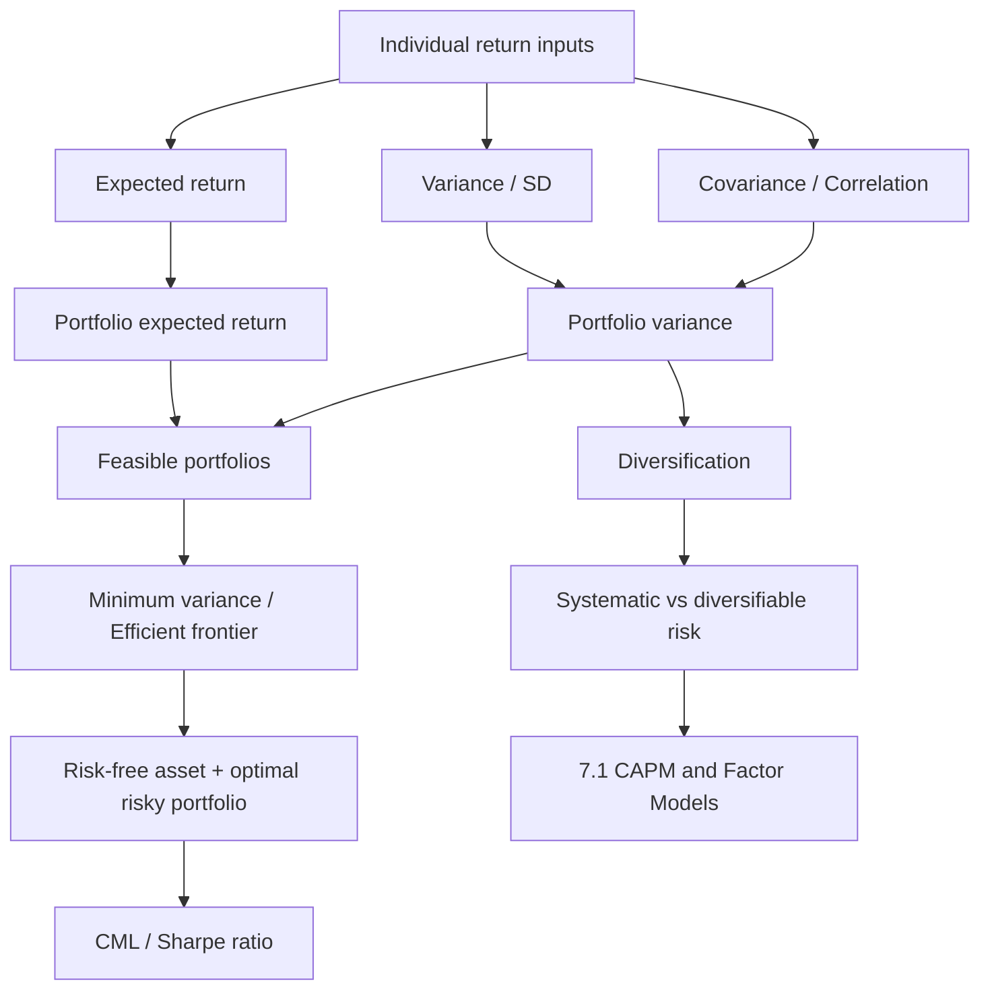

# 📘 7.2 — Mean-Variance Portfolio Theory

> [!ABSTRACT] Ringkasan Cepat
> **Topik:** Mean-Variance Portfolio Theory  
> **Bobot Parent Topic:** 5–15%  
> **Exam Priority:** Medium  
> **Difficulty:** Medium–Calculation Intensive  
> **Primary Skill:** menghitung expected return dan risiko portofolio, membaca peran covariance/correlation, memahami diversification, serta menentukan portfolio dengan risiko minimum untuk target return tertentu.  
> **Ref:** Ross, Westerfield & Jordan, *Fundamentals of Corporate Finance*, Chapters 12–13.
>
> Inti paling penting:
>
> $$
> E[R_p]=\sum_i w_iE[R_i]
> $$
>
> tetapi risiko **tidak** sekadar weighted average standard deviation. Untuk dua aset:
>
> $$
> \sigma_p^2
> =
> w_1^2\sigma_1^2
> +
> w_2^2\sigma_2^2
> +
> 2w_1w_2\rho_{12}\sigma_1\sigma_2.
> $$
>
> Diversification bekerja melalui **covariance/correlation**: expected return tetap linear terhadap bobot, sedangkan variance dapat turun karena aset tidak bergerak sempurna bersama.

## Section 0 — Pemetaan Silabus & Exam Scope

| Field | Isi |
|---|---|
| Topik CF1 | Topik 7 — Matematika Keuangan untuk Portofolio |
| Subtopik | [[7.2 Mean-Variance Portfolio Theory]] |
| Learning Outcome | Menghitung risiko dan expected return portofolio berdasarkan volatilitas dan korelasi antar-aset; menjelaskan asumsi teori portofolio mean-variance dan menghitung portofolio optimal. |
| Skill Diuji | Portfolio weights; expected return; variance/standard deviation; covariance/correlation; diversification; constrained minimum-variance portfolio; interpretation risk-return |
| Bobot Parent Topic | 5–15% |
| Exam Priority | Medium |
| Prerequisite | Expected return, variance, standard deviation, covariance, correlation |
| Connected Topics | [[7.1 CAPM and Factor Models]] |
| Referensi | Silabus CF1 Topik 7; Ross, Westerfield & Jordan Chapters 12–13 |

> [!IMPORTANT] Scope Boundary
> Silabus CF1 secara eksplisit menempatkan **efficient frontier, CML, diversification, dan Sharpe ratio** di subtopik ini serta meminta kemampuan menghitung portfolio optimal. Ross Chapters 12–13 sangat kuat untuk fondasi **risk-return, portfolio weights, expected return, portfolio risk, diversification, systematic vs diversifiable risk, beta, dan SML**.
>
> Namun pada source Ross yang tersedia, pembahasan formal lengkap mengenai **efficient frontier, Capital Market Line (CML), Sharpe ratio, dan closed-form mean-variance optimization** tidak muncul sejelas portfolio-return/diversification mechanics. Karena itu:
>
> - konsep tersebut tetap dicantumkan karena **eksplisit berada dalam silabus CF1**;
> - bagian optimization difokuskan pada struktur matematis yang diperlukan untuk memenuhi learning outcome;
> - formula advanced yang tidak didukung langsung oleh Ross diberi label `[SYLLABUS-REQUIRED / MATHEMATICAL EXTENSION]`;
> - jangan mencampurkan CML dengan SML dari [[7.1 CAPM and Factor Models]].

## Section 1 — Intuisi & Big Picture

Mean-variance portfolio theory memandang pilihan portofolio melalui dua angka utama:

1. **Mean** = expected return, yaitu imbal hasil rata-rata yang diharapkan.
2. **Variance** = ukuran ketidakpastian return; biasanya dilaporkan sebagai standard deviation.

Investor tidak hanya bertanya:

> “Aset mana expected return-nya paling tinggi?”

tetapi:

> “Untuk expected return tertentu, kombinasi aset mana yang memberi risiko paling rendah?”

Inilah inti portfolio optimization.

Hal paling penting secara matematis:

- expected return portofolio hanya bergantung pada **weights** dan expected return tiap aset;
- portfolio risk bergantung pada:
  - weights;
  - individual variances;
  - **bagaimana aset bergerak bersama**, yaitu covariance/correlation.

Karena itu dua aset yang masing-masing berisiko tinggi masih dapat membentuk portofolio yang jauh lebih stabil jika pergerakannya tidak sangat searah.

Ross menekankan prinsip diversification: ketika jumlah aset meningkat, sebagian risiko individual dapat dieliminasi. Risiko yang dapat dihilangkan disebut **diversifiable risk**, sedangkan bagian yang tetap bertahan pada portfolio luas disebut **nondiversifiable/systematic risk**.

## Section 2 — Building Blocks: Return dan Risk

### 2.1 Expected Return Satu Aset

Jika return aset $i$ memiliki kemungkinan hasil $R_{i,s}$ pada state $s$ dengan probabilitas $p_s$:

$$
E[R_i]
=
\sum_s p_sR_{i,s}.
$$

Interpretasi:

> expected return adalah probability-weighted average dari seluruh possible returns.

### 2.2 Variance

Variance mengukur squared deviation return dari expected return:

$$
\sigma_i^2
=
\operatorname{Var}(R_i)
=
\sum_s p_s\left(R_{i,s}-E[R_i]\right)^2.
$$

### 2.3 Standard Deviation

$$
\sigma_i
=
\sqrt{\sigma_i^2}.
$$

> [!IMPORTANT] Variance vs Standard Deviation
> - variance memakai squared-return units;
> - standard deviation kembali ke unit return;
> - jika soal meminta “risiko dalam persen”, biasanya target akhirnya adalah $\sigma$, bukan $\sigma^2$.

### 2.4 Portfolio Weights

Jika nilai yang ditempatkan pada aset $i$ adalah $V_i$ dan total portfolio value adalah:

$$
V=\sum_iV_i,
$$

maka:

$$
w_i=\frac{V_i}{V}.
$$

Untuk fully invested portfolio:

$$
\sum_iw_i=1.
$$

Ross mendefinisikan portfolio weight sebagai persentase total nilai portfolio yang ditempatkan pada masing-masing aset.

> [!BUG] Weight Trap
> Jangan menggunakan expected return sebagai weight. Weight berasal dari **proporsi nilai investasi**.

## Section 3 — Expected Return Portofolio

Portfolio return pada suatu periode:

$$
R_p
=
\sum_iw_iR_i.
$$

Karena expectation bersifat linear:

$$
\boxed{
E[R_p]
=
\sum_iw_iE[R_i]
}
$$

Untuk dua aset:

$$
E[R_p]
=
w_AE[R_A]
+
w_BE[R_B].
$$

Jika seluruh dana hanya berada pada dua aset:

$$
w_B=1-w_A.
$$

Maka:

$$
E[R_p]
=
w_AE[R_A]
+
(1-w_A)E[R_B].
$$

### Example A — Expected Return Portofolio

Diketahui:

$$
w_A=0.4,\qquad
w_B=0.6,
$$

$$
E[R_A]=18\%,\qquad
E[R_B]=10\%.
$$

Maka:

$$
E[R_p]
=
0.4(0.18)+0.6(0.10)
=
0.132.
$$

Jadi:

$$
\boxed{E[R_p]=13.2\%}
$$

> [!CHECK] Sanity Check
> Karena seluruh weight positif dan menjumlah ke 1, expected return harus berada di antara $10\%$ dan $18\%$. Nilai $13.2\%$ masuk akal.

## Section 4 — Covariance dan Correlation

Expected return tidak cukup untuk mengukur manfaat diversification. Kita perlu mengetahui bagaimana dua return bergerak bersama.

### 4.1 Covariance

$$
\operatorname{Cov}(R_A,R_B)
=
E\left[
(R_A-E[R_A])(R_B-E[R_B])
\right].
$$

Interpretasi:

- covariance $>0$ → cenderung bergerak searah;
- covariance $<0$ → cenderung bergerak berlawanan;
- covariance dekat 0 → hubungan linear lemah.

### 4.2 Correlation

Correlation menstandardisasi covariance:

$$
\boxed{
\rho_{AB}
=
\frac{\operatorname{Cov}(R_A,R_B)}
{\sigma_A\sigma_B}
}
$$

sehingga:

$$
-1\le\rho_{AB}\le1.
$$

Maka:

$$
\boxed{
\operatorname{Cov}(R_A,R_B)
=
\rho_{AB}\sigma_A\sigma_B
}
$$

> [!IMPORTANT] Covariance vs Correlation
> Covariance mempunyai scale yang bergantung pada volatility kedua aset. Correlation tidak memiliki unit dan selalu berada antara $-1$ dan $1$.

## Section 5 — Portfolio Variance: Dua Aset

Untuk:

$$
R_p=w_AR_A+w_BR_B,
$$

variance-nya:

$$
\operatorname{Var}(R_p)
=
\operatorname{Var}(w_AR_A+w_BR_B).
$$

Dengan property variance:

$$
\boxed{
\sigma_p^2
=
w_A^2\sigma_A^2
+
w_B^2\sigma_B^2
+
2w_Aw_B\operatorname{Cov}(R_A,R_B)
}
$$

Karena:

$$
\operatorname{Cov}(R_A,R_B)
=
\rho_{AB}\sigma_A\sigma_B,
$$

maka:

$$
\boxed{
\sigma_p^2
=
w_A^2\sigma_A^2
+
w_B^2\sigma_B^2
+
2w_Aw_B\rho_{AB}\sigma_A\sigma_B
}
$$

Dan:

$$
\boxed{
\sigma_p=\sqrt{\sigma_p^2}
}
$$

### Mengapa Ada Cross Term?

Jika hanya memakai:

$$
w_A^2\sigma_A^2+w_B^2\sigma_B^2,
$$

kita seolah menganggap kedua aset tidak memiliki co-movement.

Cross term:

$$
2w_Aw_B\operatorname{Cov}(R_A,R_B)
$$

menangkap hubungan antar-return.

Itulah mathematical engine dari diversification.

## Section 6 — Worked Example: Dua Aset

Diketahui:

$$
w_A=0.4,\qquad
w_B=0.6,
$$

$$
\sigma_A=20\%=0.20,
$$

$$
\sigma_B=30\%=0.30,
$$

$$
\rho_{AB}=0.25.
$$

### Langkah 1 — Covariance

$$
\operatorname{Cov}(A,B)
=
(0.25)(0.20)(0.30)
=
0.015.
$$

### Langkah 2 — Variance Portofolio

$$
\sigma_p^2
=
(0.4)^2(0.20)^2
+
(0.6)^2(0.30)^2
+
2(0.4)(0.6)(0.015).
$$

Komponen:

$$
(0.4)^2(0.20)^2=0.0064,
$$

$$
(0.6)^2(0.30)^2=0.0324,
$$

$$
2(0.4)(0.6)(0.015)=0.0072.
$$

Sehingga:

$$
\sigma_p^2
=
0.046.
$$

### Langkah 3 — Standard Deviation

$$
\sigma_p
=
\sqrt{0.046}
\approx
0.2145.
$$

Jadi:

$$
\boxed{\sigma_p\approx21.45\%}
$$

> [!CHECK] Sanity Check
> Dengan correlation hanya $0.25$, diversification menghasilkan portfolio volatility di bawah volatility aset B sebesar $30\%$. Nilai ini masuk akal.

## Section 7 — Correlation dan Diversification

Untuk weights dan volatilities yang tetap:

$$
\sigma_p^2
=
w_A^2\sigma_A^2
+
w_B^2\sigma_B^2
+
2w_Aw_B\rho_{AB}\sigma_A\sigma_B.
$$

Satu-satunya bagian yang berubah terhadap $\rho_{AB}$ adalah cross term.

Karena itu:

> **Semakin rendah correlation, semakin besar potensi pengurangan portfolio variance.**

### Case 1 — Perfect Positive Correlation: $\rho=1$

$$
\sigma_p
=
w_A\sigma_A+w_B\sigma_B
$$

untuk positive weights.

Tidak ada diversification benefit yang berasal dari co-movement.

### Case 2 — Imperfect Positive Correlation: $0<\rho<1$

Masih ada diversification benefit.

### Case 3 — Zero Correlation: $\rho=0$

$$
\sigma_p^2
=
w_A^2\sigma_A^2+w_B^2\sigma_B^2.
$$

Cross term hilang.

### Case 4 — Negative Correlation

Cross term negatif sehingga variance turun lebih jauh.

### Case 5 — Perfect Negative Correlation: $\rho=-1$

Secara teoritis, untuk weights tertentu dapat diperoleh:

$$
\sigma_p=0.
$$

Syaratnya:

$$
w_A\sigma_A=w_B\sigma_B.
$$

Dengan:

$$
w_A+w_B=1,
$$

maka:

$$
w_A
=
\frac{\sigma_B}{\sigma_A+\sigma_B},
\qquad
w_B
=
\frac{\sigma_A}{\sigma_A+\sigma_B}.
$$

> [!WARNING] Interpretation
> Portfolio berisiko nol dari dua risky assets hanya mungkin pada perfect negative correlation dengan weights yang tepat. Jangan menganggap correlation “rendah” otomatis membuat variance nol.

## Section 8 — Multi-Asset Portfolio

Untuk $n$ aset:

$$
R_p
=
\sum_{i=1}^{n}w_iR_i.
$$

Expected return:

$$
\boxed{
E[R_p]
=
\sum_{i=1}^{n}w_iE[R_i]
}
$$

Variance:

$$
\boxed{
\sigma_p^2
=
\sum_{i=1}^{n}
\sum_{j=1}^{n}
w_iw_j
\operatorname{Cov}(R_i,R_j)
}
$$

Dengan covariance matrix $\Sigma$ dan weight vector $\mathbf w$:

$$
\boxed{
\sigma_p^2
=
\mathbf w^\top\Sigma\mathbf w
}
$$

Struktur covariance matrix:

$$
\Sigma
=
\begin{pmatrix}
\sigma_1^2 & \operatorname{Cov}_{12} & \cdots \\
\operatorname{Cov}_{21} & \sigma_2^2 & \cdots \\
\vdots & \vdots & \ddots
\end{pmatrix}.
$$

Diagonal adalah variances:

$$
\Sigma_{ii}=\sigma_i^2.
$$

Off-diagonal adalah covariances:

$$
\Sigma_{ij}
=
\operatorname{Cov}(R_i,R_j).
$$

> [!BUG] Matrix Reading Trap
> Jika diagonal tabel adalah $0.36$, standard deviation aset tersebut adalah:
>
> $$
> \sqrt{0.36}=0.60=60\%,
> $$
>
> bukan $36\%$.

## Section 9 — Diversification Principle dari Ross

Ross menunjukkan bahwa ketika lebih banyak saham ditambahkan ke portfolio, standard deviation portfolio menurun.

Mental model:

```text
Total risk
├── Diversifiable / idiosyncratic risk
│   └── dapat dikurangi melalui portfolio formation
└── Nondiversifiable / systematic risk
    └── tetap bertahan meskipun portfolio sangat luas
```

Benefit diversification paling besar terjadi pada penambahan aset awal. Setelah portfolio sudah cukup luas, tambahan aset baru memberi penurunan risk yang semakin kecil.

> [!IMPORTANT] Core Insight
> Diversification bukan “menghilangkan semua risk”. Diversification terutama mengurangi firm-specific/idiosyncratic risk.

Hubungan dengan [[7.1 CAPM and Factor Models]]:

> CAPM kemudian memberi harga terutama pada **systematic risk**, bukan total standalone volatility.

## Section 10 — Mean-Variance Optimality

Dalam kerangka mean-variance, investor membandingkan portfolio berdasarkan:

$$
\left(E[R_p],\sigma_p^2\right)
$$

atau:

$$
\left(E[R_p],\sigma_p\right).
$$

Portfolio $A$ mendominasi portfolio $B$ jika:

- $A$ memiliki expected return lebih tinggi dengan risiko sama; atau
- $A$ memiliki risiko lebih rendah dengan expected return sama.

Portfolio yang didominasi tidak rasional dipilih oleh mean-variance investor.

### Minimum-Variance Problem

Untuk target expected return $\mu^\*$:

$$
\min_{\mathbf w}
\quad
\mathbf w^\top\Sigma\mathbf w
$$

dengan constraints:

$$
\mathbf 1^\top\mathbf w=1,
$$

$$
\boldsymbol\mu^\top\mathbf w=\mu^\*.
$$

di mana:

- $\mathbf w$ = vector portfolio weights;
- $\Sigma$ = covariance matrix;
- $\boldsymbol\mu$ = vector expected returns;
- $\mu^\*$ = target portfolio expected return.

> [!IMPORTANT] [SYLLABUS-REQUIRED / MATHEMATICAL EXTENSION]
> Silabus meminta “menghitung portofolio optimal”. Ross source yang tersedia memberi fondasi portfolio risk-return dan diversification tetapi tidak menyajikan constrained optimization formal secara lengkap. Struktur minimization di atas adalah mathematical formulation yang diperlukan untuk memenuhi learning outcome tersebut. Gunakan metode algebra/Lagrange sesuai kompleksitas soal, bukan formula matrix yang dihafalkan tanpa memahami constraints.

## Section 11 — Dua Aset: Minimum-Variance Portfolio Tanpa Target Return

Untuk dua aset dengan:

$$
w_B=1-w_A,
$$

portfolio variance:

$$
\sigma_p^2
=
w_A^2\sigma_A^2
+
(1-w_A)^2\sigma_B^2
+
2w_A(1-w_A)\sigma_{AB},
$$

dengan:

$$
\sigma_{AB}
=
\operatorname{Cov}(R_A,R_B).
$$

Diferensiasikan terhadap $w_A$ dan set sama dengan nol:

$$
\frac{d\sigma_p^2}{dw_A}=0.
$$

Hasil:

$$
\boxed{
w_A^{GMV}
=
\frac{\sigma_B^2-\sigma_{AB}}
{\sigma_A^2+\sigma_B^2-2\sigma_{AB}}
}
$$

dan:

$$
\boxed{
w_B^{GMV}
=
1-w_A^{GMV}
}
$$

atau dengan correlation:

$$
w_A^{GMV}
=
\frac{\sigma_B^2-\rho_{AB}\sigma_A\sigma_B}
{\sigma_A^2+\sigma_B^2-2\rho_{AB}\sigma_A\sigma_B}.
$$

> [!CHECK] Sanity Check
> Setelah mendapatkan weights:
>
> 1. cek $w_A+w_B=1$;
> 2. hitung kembali $\sigma_p^2$;
> 3. pastikan variance tidak negatif;
> 4. jika short selling tidak diperbolehkan, weight negatif tidak admissible.

## Section 12 — Target Return pada Dua Aset

Jika hanya ada dua aset dan target expected return $\mu^\*$ diberikan:

$$
w_AE[R_A]+w_BE[R_B]=\mu^\*,
$$

$$
w_A+w_B=1.
$$

Substitusi:

$$
w_AE[R_A]+(1-w_A)E[R_B]=\mu^\*.
$$

Sehingga:

$$
\boxed{
w_A
=
\frac{\mu^\*-E[R_B]}
{E[R_A]-E[R_B]}
}
$$

dan:

$$
w_B=1-w_A.
$$

Setelah weights ditemukan, masukkan ke formula portfolio variance.

> [!TIP] Shortcut Exam
> Untuk **dua aset** dengan target return, tidak perlu Lagrange. Dua linear constraints langsung menentukan kedua weights.

## Section 13 — Tiga Aset atau Lebih: Cara Berpikir Optimization

Untuk tiga aset dengan target return:

$$
w_A+w_B+w_C=1,
$$

$$
w_A\mu_A+w_B\mu_B+w_C\mu_C=\mu^\*.
$$

Karena ada tiga unknown tetapi hanya dua constraints, masih ada satu degree of freedom. Gunakan salah satu weight sebagai parameter, substitusikan dua constraints, lalu tulis portfolio variance sebagai fungsi satu variable.

Alur exam-friendly:

1. gunakan full-investment constraint;
2. gunakan target-return constraint;
3. ekspresikan dua weights dalam fungsi satu weight;
4. substitusi ke:
   $$
   \sigma_p^2=\mathbf w^\top\Sigma\mathbf w;
   $$
5. hasilnya quadratic function;
6. minimalkan quadratic tersebut;
7. hitung standard deviation dari minimum variance.

### Template

Misalnya dari constraints diperoleh:

$$
w_B=a+bw_C,
$$

$$
w_A=c+dw_C.
$$

Kemudian:

$$
\sigma_p^2
=
Aw_C^2+Bw_C+C.
$$

Minimum terjadi pada:

$$
\boxed{
w_C^\*=-\frac{B}{2A}
}
$$

jika:

$$
A>0.
$$

Lalu recover $w_A^\*$ dan $w_B^\*$.

> [!TIP] Exam Efficiency
> Untuk 3-asset numerical question, pendekatan “reduce to one variable → quadratic minimum” sering lebih transparan daripada langsung memakai matrix inverse atau Lagrange multipliers.

## Section 14 — Efficient Frontier

> [!IMPORTANT] [SYLLABUS-REQUIRED]
> **Efficient frontier** adalah kumpulan portfolio yang memberikan **maximum expected return untuk suatu tingkat risk**, atau ekuivalen **minimum risk untuk suatu expected return**.

Dalam plot:

- sumbu horizontal: $\sigma_p$;
- sumbu vertikal: $E[R_p]$.

Tidak semua feasible portfolios efisien. Bagian efficient frontier adalah boundary terbaik dari opportunity set.

Konsep dominance:

- portfolio di bawah frontier dapat diperbaiki;
- portfolio pada frontier tidak dapat meningkatkan return tanpa meningkatkan risk;
- tidak dapat menurunkan risk tanpa menurunkan return.

### Global Minimum-Variance Portfolio

Titik paling kiri dari feasible risky-asset set adalah **global minimum-variance portfolio (GMV)**.

GMV meminimalkan:

$$
\sigma_p^2
$$

tanpa menetapkan target expected return tertentu, selain:

$$
\sum_iw_i=1.
$$

## Section 15 — Risk-Free Asset, CML, dan Sharpe Ratio

> [!IMPORTANT] [SYLLABUS-REQUIRED / SOURCE BOUNDARY]
> Silabus secara eksplisit mencantumkan **CML** dan **Sharpe ratio**. Ross Chapters 12–13 source yang tersedia lebih menekankan risk premium, diversification, beta, reward-to-risk berdasarkan beta, dan SML. Karena itu bagian ini dibatasi pada definisi dan relation yang diperlukan agar tidak mencampurkan konsep dengan SML.

### Sharpe Ratio

Sharpe ratio mengukur excess expected return per unit **total volatility**:

$$
\boxed{
\text{Sharpe Ratio}
=
\frac{E[R_p]-R_f}{\sigma_p}
}
$$

Semakin tinggi Sharpe ratio, semakin besar expected excess return yang diperoleh per unit total risk.

### Capital Market Line

Jika risk-free asset tersedia dan investor dapat mengombinasikannya dengan suatu optimal risky portfolio $M$, kombinasi tersebut memiliki:

$$
E[R_c]
=
R_f+y(E[R_M]-R_f),
$$

dan karena risk-free asset memiliki zero variance:

$$
\sigma_c
=
|y|\sigma_M.
$$

Untuk $y\ge0$:

$$
y=\frac{\sigma_c}{\sigma_M}.
$$

Maka:

$$
\boxed{
E[R_c]
=
R_f
+
\frac{E[R_M]-R_f}{\sigma_M}
\sigma_c
}
$$

Slope:

$$
\boxed{
\frac{E[R_M]-R_f}{\sigma_M}
}
$$

adalah Sharpe ratio dari risky portfolio $M$.

### CML vs SML

| CML | SML |
|---|---|
| Risk measure: $\sigma$ | Risk measure: $\beta$ |
| Berlaku untuk efficient portfolios dari risk-free + optimal risky portfolio | Pricing relation untuk individual securities dan portfolios dalam CAPM |
| Slope = Sharpe ratio | Slope = market risk premium |
| Topik 7.2 | [[7.1 CAPM and Factor Models]] |

> [!BUG] CML vs SML Trap
> Jangan memakai standard deviation pada SML dan jangan memakai beta pada CML.

## Section 16 — Worked Example: Correlation Effect

Dua aset memiliki:

$$
\sigma_A=20\%,
\qquad
\sigma_B=20\%,
$$

dan:

$$
w_A=w_B=0.5.
$$

### Jika $\rho=1$

$$
\sigma_p^2
=
0.25(0.04)+0.25(0.04)+2(0.5)(0.5)(1)(0.2)(0.2).
$$

$$
\sigma_p^2=0.04.
$$

$$
\sigma_p=20\%.
$$

Tidak ada reduction.

### Jika $\rho=0$

$$
\sigma_p^2
=
0.01+0.01
=
0.02.
$$

$$
\sigma_p
=
14.14\%.
$$

### Jika $\rho=-1$

$$
\sigma_p^2
=
0.
$$

$$
\sigma_p=0.
$$

> [!SUCCESS] Core Lesson
> Expected return portofolio tidak berubah ketika hanya correlation yang berubah, tetapi portfolio risk dapat berubah drastis.

## Section 17 — Verification & Sanity Check

> [!CHECK] Sanity Check 1 — Weights
>
> $$
> \sum_iw_i=1
> $$
>
> untuk fully invested portfolio.

> [!CHECK] Sanity Check 2 — Target Return
>
> Setelah memperoleh optimal weights, masukkan kembali ke:
>
> $$
> E[R_p]=\sum_iw_iE[R_i].
> $$
>
> Harus tepat memenuhi target.

> [!CHECK] Sanity Check 3 — Variance
>
> $$
> \sigma_p^2\ge0.
> $$
>
> Variance negatif berarti ada kesalahan algebra/input.

> [!CHECK] Sanity Check 4 — Correlation
>
> $$
> -1\le\rho_{ij}\le1.
> $$
>
> Jika hasil correlation di luar interval ini, cek apakah input sebenarnya covariance.

> [!CHECK] Sanity Check 5 — Diversification
> Menurunkan correlation tidak mengubah expected return jika weights dan individual expected returns tetap. Yang berubah adalah variance.

> [!CHECK] Sanity Check 6 — Matrix
> Covariance matrix harus symmetric:
>
> $$
> \operatorname{Cov}(R_i,R_j)
> =
> \operatorname{Cov}(R_j,R_i).
> $$

## Section 18 — Exam Traps & Misconceptions

### Variance vs Standard Deviation

> [!BUG] Calculation Trap
> Soal meminta standard deviation tetapi perhitungan berhenti pada variance.
>
> **Salah:**
>
> $$
> \sigma_p=0.119.
> $$
>
> padahal $0.119$ adalah variance.
>
> **Benar:**
>
> $$
> \sigma_p=\sqrt{0.119}.
> $$

### Covariance Table vs Correlation Table

> [!BUG] Input Trap
> Angka diagonal covariance matrix adalah variance, bukan correlation.
>
> Correlation matrix selalu mempunyai diagonal:
>
> $$
> 1.
> $$

### Expected Return vs Risk

> [!BUG] Concept Trap
> Diversification tidak secara mekanis meningkatkan expected return.
>
> $$
> E[R_p]
> =
> \sum_iw_iE[R_i]
> $$
>
> tetap hanya weighted average.

### Missing Cross Terms

> [!BUG] Formula Trap
>
> Untuk dua aset:
>
> $$
> \sigma_p^2
> \ne
> w_A^2\sigma_A^2+w_B^2\sigma_B^2
> $$
>
> kecuali covariance memang nol.

### Double Counting Covariance

> [!BUG] Matrix Trap
> Jika menghitung manual:
>
> $$
> 2w_Aw_B\operatorname{Cov}_{AB}
> $$
>
> sudah memasukkan pasangan $AB$ dan $BA$.
>
> Jangan mengalikan dua kali lagi.

### Constraint Trap

> [!BUG] Optimization Trap
> Portfolio “minimum variance” tanpa constraint berbeda dari “minimum variance untuk target return $16\%$”.
>
> Baca objective dan constraints terlebih dahulu.

### Short-Selling Trap

> [!BUG] Feasibility Trap
> Jika tidak ada larangan short selling, weight negatif secara matematis mungkin diperbolehkan.
>
> Jika soal mensyaratkan:
>
> $$
> w_i\ge0,
> $$
>
> solusi unconstrained dengan weight negatif tidak admissible.

### CML vs SML

> [!BUG] Conceptual Trap
> - CML → total risk $\sigma$;
> - SML → systematic risk $\beta$.

## Section 19 — Connections & Mental Model



Hubungan utama:

- [[7.2 Mean-Variance Portfolio Theory]] → [[7.1 CAPM and Factor Models]]  
  Mean-variance menjelaskan bagaimana investor membentuk portfolio berdasarkan return dan risk. CAPM kemudian menghubungkan equilibrium expected return dengan **systematic risk**.

- Variance/covariance → diversification  
  Covariance adalah alasan mathematically mengapa portfolio volatility tidak sekadar average volatility.

- Diversification → CAPM  
  Setelah idiosyncratic risk dapat di-diversify, market tidak harus memberi premium untuk risk tersebut.

## Section 20 — Formula Map

| Konsep | Formula |
|---|---|
| Expected return asset | $E[R_i]=\sum_sp_sR_{i,s}$ |
| Variance asset | $\sigma_i^2=\sum_sp_s(R_{i,s}-E[R_i])^2$ |
| Standard deviation | $\sigma_i=\sqrt{\sigma_i^2}$ |
| Portfolio weight | $w_i=V_i/\sum_jV_j$ |
| Portfolio expected return | $E[R_p]=\sum_iw_iE[R_i]$ |
| Covariance from correlation | $\operatorname{Cov}_{ij}=\rho_{ij}\sigma_i\sigma_j$ |
| Two-asset variance | $\sigma_p^2=w_A^2\sigma_A^2+w_B^2\sigma_B^2+2w_Aw_B\rho_{AB}\sigma_A\sigma_B$ |
| Multi-asset variance | $\sigma_p^2=\mathbf w^\top\Sigma\mathbf w$ |
| Fully invested | $\mathbf 1^\top\mathbf w=1$ |
| Target return | $\boldsymbol\mu^\top\mathbf w=\mu^\*$ |
| Two-asset target-return weight | $w_A=(\mu^\*-\mu_B)/(\mu_A-\mu_B)$ |
| Two-asset GMV weight | $w_A^{GMV}=(\sigma_B^2-\sigma_{AB})/(\sigma_A^2+\sigma_B^2-2\sigma_{AB})$ |
| Sharpe ratio | $(E[R_p]-R_f)/\sigma_p$ |
| CML | $E[R_c]=R_f+\dfrac{E[R_M]-R_f}{\sigma_M}\sigma_c$ |

## Section 21 — Quick Decision Tree

```text
Apa yang diminta?

1. Expected return portfolio?
   → langsung weighted average.

2. Risk dua aset?
   → cari covariance jika perlu
   → gunakan 2-asset variance
   → square root jika diminta SD.

3. Risk multi-asset?
   → baca covariance matrix
   → hitung w'Σw.

4. Target return dua aset?
   → solve 2 linear equations
   → weights langsung determined
   → hitung variance.

5. Target return ≥ 3 aset + minimum risk?
   → gunakan constraints untuk reduce dimensions
   → bentuk variance quadratic
   → minimize.

6. Ditanya diversification?
   → fokus pada covariance/correlation.

7. Ditanya efficient frontier?
   → minimum risk untuk setiap target return.

8. Ditanya CML/Sharpe?
   → total risk = standard deviation, bukan beta.
```

## Section 22 — Active Recall

1. Apa perbedaan variance dan standard deviation?
2. Apa arti portfolio weight?
3. Mengapa weights fully invested portfolio menjumlah ke 1?
4. Tulis formula expected return portfolio.
5. Apakah expected return dipengaruhi correlation?
6. Definisikan covariance.
7. Bagaimana covariance terkait correlation?
8. Apa interval valid untuk correlation?
9. Tulis formula variance dua aset.
10. Mengapa ada cross term?
11. Apa yang terjadi jika $\rho=1$?
12. Apa yang terjadi jika $\rho=0$?
13. Apa yang terjadi jika $\rho=-1$?
14. Kapan dua risky assets dapat membentuk zero-variance portfolio?
15. Bagaimana membaca diagonal covariance matrix?
16. Tulis formula multi-asset portfolio variance.
17. Apa arti diversification?
18. Bedakan diversifiable dan nondiversifiable risk.
19. Mengapa expected return tetap weighted average walaupun risk turun?
20. Apa objective global minimum-variance portfolio?
21. Apa constraints minimum variance dengan target return?
22. Untuk dua aset dengan target return, mengapa tidak perlu Lagrange?
23. Bagaimana cara exam-friendly menyelesaikan 3-asset constrained minimum variance?
24. Apa arti efficient frontier?
25. Apa arti dominance dalam mean-variance space?
26. Apa beda CML dan SML?
27. Tulis Sharpe ratio.
28. Apa risk measure pada Sharpe ratio?
29. Apa slope CML?
30. Mengapa covariance matrix harus symmetric?

## Section 23 — Exam Pattern Map

| Narasi Soal | Keyword | Konsep | Setup | Trap | Shortcut |
|---|---|---|---|---|---|
| Nilai investasi tiap aset diberikan | “portfolio weight” | Weight | $w_i=V_i/V$ | expected return dianggap weight | hitung total value dulu |
| Expected returns + weights | “expected portfolio return” | Linear expectation | $\sum w_iE[R_i]$ | memasukkan correlation | correlation tidak masuk mean |
| SD + correlation | “portfolio risk” | Covariance | $\rho\sigma_A\sigma_B$ | langsung pakai $\rho$ sebagai covariance | compute covariance first |
| Covariance matrix | “risk of portfolio” | Quadratic form | $w^\top\Sigma w$ | diagonal dianggap SD | diagonal = variance |
| Dua aset + target return | “expected return = x%” | Weight constraint | solve 2 equations | memakai optimizer | direct algebra |
| Tiga aset + target return + smallest risk | “minimum standard deviation” | Constrained MV | constraints → one variable → quadratic | stop di variance | square root at end |
| Correlation turun | “diversification” | Risk reduction | cross term falls | expected return ikut turun | mean unchanged |
| Perfect correlation | $\rho=1$ | No correlation benefit | weighted SD | menyangka tetap diversify | no curvature benefit |
| Perfect negative | $\rho=-1$ | Strong diversification | solve hedge weights | otomatis zero risk | weights must match vol |
| Efficient portfolio | “best risk-return” | Dominance | frontier | semua feasible efficient | only boundary |
| Risk-free + risky portfolio | “CML” | Total-risk tradeoff | slope = Sharpe | pakai beta | CML uses $\sigma$ |
| CAPM/SML wording | “beta” | Systematic risk | see [[7.1]] | gunakan Sharpe/CML | beta → SML |

## Source Traceability

| Materi | Sumber |
|---|---|
| Scope Topik 7.2, efficient frontier, CML, diversification, Sharpe ratio | Silabus CF1 — Topik 7 |
| Learning outcome portfolio risk/return dan portfolio optimal | Silabus CF1 — Topik 7 |
| Expected return sebagai probability-weighted average | Ross Chapter 13 |
| Portfolio weight dan expected portfolio return | Ross Chapter 13 §Portfolios |
| Portfolio risk tidak memiliki hubungan sederhana dengan standalone SD | Ross Chapter 13 |
| Diversification dan penurunan portfolio SD ketika jumlah saham bertambah | Ross Chapter 13, Principle of Diversification |
| Diversifiable vs nondiversifiable risk | Ross Chapter 13 |
| Historical risk-return intuition | Ross Chapter 12 |
| Two-asset variance/correlation emphasis | Prompt Summary Materi Exam CF1 v2 + scope learning outcome |
| Multi-asset covariance formulation | Prompt Summary Materi Exam CF1 v2 + mathematical extension consistent with syllabus |
| Efficient frontier, CML, Sharpe ratio | Explicit syllabus labels; Ross source tersedia tidak memberi formal treatment lengkap |
| Constrained minimum-variance optimization | Syllabus learning outcome “menghitung portofolio optimal”; mathematical extension needed for calculation |

> [!NOTE] Source Boundary
> Note ini memprioritaskan silabus CF1 sebagai scope authority. Ross Chapters 12–13 menjadi authority untuk portfolio-return, risk, diversification, dan systematic-risk intuition. Formal efficient-frontier/CML/Sharpe/optimization detail ditambahkan hanya sejauh diperlukan oleh wording silabus dan diberi label source-boundary ketika textbook yang tersedia tidak memberikan treatment formal yang setara.

---

> [!QUOTE] Follow-up Options
> 1. *"Uji saya dengan soal Active Recall dari topik ini"*
> 2. *"Buat 10 soal exam-style portfolio variance & minimum variance"*
> 3. *"Continue ke review gabungan Topik 7.1–7.2"*

*📖 Ref: Ross, Westerfield & Jordan Chapters 12–13; Silabus CF1 Topik 7 | 🗓️ 2026-08-25 | #CF1 #MatematikaKeuangan #Portfolio*
