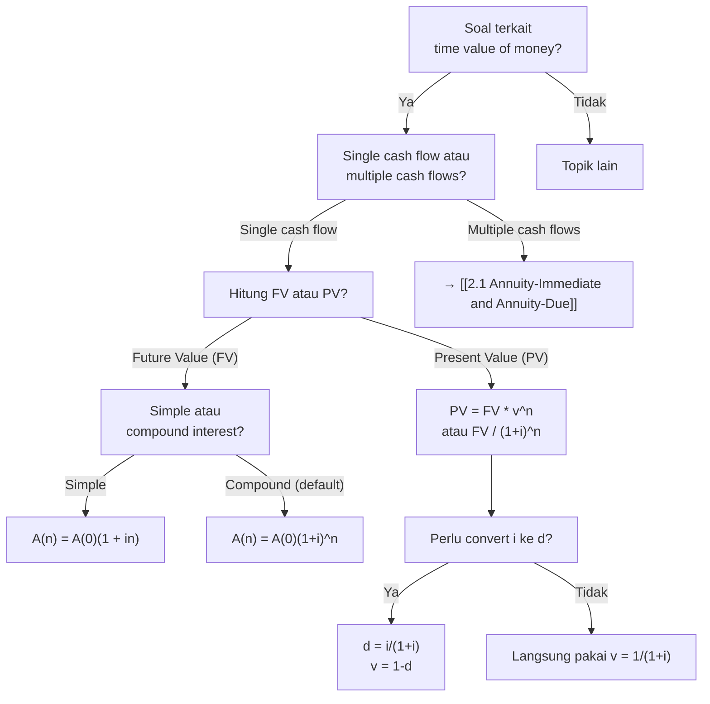

# 📘 1.1 — Interest Rates and Discount Rates

> [!ABSTRACT] Ringkasan Cepat
> **Topik:** Interest Rates & Discount Rates | **Bobot:** ~10–20% | **Difficulty:** Easy
> **Ref:** Vaaler Bab 1–2, Kellison Bab 1–2 | **Prereq:** None (foundational)

## Section 0 — Pemetaan Topik

| Topik CF1 | Sub-topik ID | Skill Diuji | Bobot | Difficulty | Prerequisite | Connected Topics | Referensi |
|-----------|--------------|-------------|-------|------------|--------------|------------------|-----------|
| Topik 1: Nilai Waktu dari Uang | 1.1 | Menghitung simple vs compound interest; memahami discount rate $d$ dan discount factor $v$; konversi antara interest rate dan discount rate; menghitung accumulation factor dan present value factor; memahami hubungan $i$, $d$, dan $v$ | 10–20% | Easy | None | [[1.2 Effective, Nominal, and Force of Interest]], [[1.4 Accumulation and Present Value]], [[2.1 Annuity-Immediate and Annuity-Due]] | Vaaler 1–2, Kellison 1–2 |

## Section 1 — Intuisi

Bayangkan kamu meminjamkan Rp 10 juta ke teman selama satu tahun. Di akhir tahun, teman kamu harus bayar lebih dari Rp 10 juta—katakanlah Rp 11 juta. Selisih Rp 1 juta ini adalah **bunga** (interest), kompensasi karena kamu tidak bisa pakai uang itu selama setahun. **Interest rate** adalah persentase bunga terhadap principal: $1.000.000 / 10.000.000 = 10\%$ per tahun.

Sekarang flip perspektifnya: jika kamu tahu akan terima Rp 11 juta setahun lagi, berapa nilai uang itu **hari ini**? Jawabannya bukan Rp 11 juta—karena uang di masa depan kurang berharga dari uang hari ini (time value of money). Dengan interest rate 10%, nilai sekarang (present value) adalah Rp 10 juta. Proses menghitung nilai sekarang dari nilai masa depan disebut **discounting**, dan rate yang digunakan disebut **discount rate**.

**Discount factor** ($v$) adalah multiplier untuk convert future value ke present value: $v = 1/(1+i)$. Jika $i = 10\%$, maka $v = 1/1.1 \approx 0.909$. Artinya, Rp 1 di masa depan (1 tahun lagi) setara dengan Rp 0.909 hari ini. Konsep ini adalah fondasi **semua** matematika keuangan—dari pricing obligasi, valuing anuitas, sampai menghitung NPV proyek investasi.

Perbedaan **simple interest** vs **compound interest** seperti perbedaan bunga yang "ditarik setiap tahun" vs "dibiarkan mengendap dan berbunga lagi". Simple interest hanya menghitung bunga dari principal awal. Compound interest menghitung bunga dari principal **plus** bunga yang sudah terakumulasi—ini adalah "bunga berbunga" yang membuat investasi tumbuh eksponensial, bukan linear.

## Section 2 — Definisi Formal

> [!NOTE] Definisi Matematis
> **Interest Rate (Effective Annual Rate):**
> $$
> i = \frac{\text{Interest Earned in 1 Year}}{\text{Principal at Start of Year}}
> $$
>
> **Accumulation Factor (1 period):**
> $$
> a(1) = 1 + i
> $$
>
> **Discount Rate:**
> $$
> d = \frac{\text{Interest Earned in 1 Year}}{\text{Accumulated Value at End of Year}}
> $$
>
> **Discount Factor:**
> $$
> v = \frac{1}{1+i} = 1 - d
> $$
>
> **Fundamental Relationship:**
> $$
> i = \frac{d}{1-d}, \quad d = \frac{i}{1+i}, \quad v = \frac{1}{1+i} = 1-d
> $$

### Variabel & Parameter

| Simbol | Makna | Unit / Range |
|--------|-------|--------------|
| $i$ | Interest rate (effective per period) | Decimal atau persen, $i > -1$ |
| $d$ | Discount rate (effective per period) | Decimal atau persen, $0 < d < 1$ |
| $v$ | Discount factor (present value factor) | Decimal, $0 < v < 1$ |
| $A(t)$ | Accumulated value di waktu $t$ | Mata uang |
| $A(0)$ | Principal (initial investment) | Mata uang |
| $I$ | Total interest earned | Mata uang |
| $n$ | Number of periods | Integer, $n \geq 0$ |

### Rumus Utama

$$
A(n) = A(0) (1+i)^n
$$
**Label:** Accumulation dengan compound interest (future value dari principal $A(0)$ setelah $n$ periods).

$$
A(0) = A(n) v^n = \frac{A(n)}{(1+i)^n}
$$
**Label:** Present value dari future value $A(n)$ (discounting).

$$
v = \frac{1}{1+i} = 1 - d
$$
**Label:** Discount factor dalam bentuk interest rate atau discount rate.

$$
d = \frac{i}{1+i} = iv
$$
**Label:** Discount rate dari interest rate (atau $d = iv$).

$$
i = \frac{d}{1-d} = \frac{d}{v}
$$
**Label:** Interest rate dari discount rate.

$$
I_{\text{simple}} = A(0) \cdot i \cdot n
$$
**Label:** Simple interest untuk $n$ periods (linear growth).

$$
A_{\text{simple}}(n) = A(0)(1 + in)
$$
**Label:** Accumulated value dengan simple interest.

### Asumsi Eksplisit

- **Compound Interest (default):** Bunga yang earned di-reinvest dan menghasilkan bunga lagi, kecuali explisit disebutkan simple interest.
- **Constant Interest Rate:** Rate $i$ konstan selama periode, kecuali disebutkan varying rates.
- **No Transaction Costs:** Tidak ada fees, taxes, atau friction dalam investasi/pinjaman.
- **Discrete Time Periods:** Interest accrues di akhir setiap discrete period (annual, semiannual, dll.), bukan continuous.

## Section 3 — Jembatan Logika

> [!TIP] Dari Time Diagram ke Equation of Value
> **Interest rate $i$** muncul dari perspektif **investor/lender**: "Berapa persen return yang saya dapat dari principal yang saya invest?"
> 
> Jika invest $A(0) = 100$ dan dapat $A(1) = 110$ setelah 1 tahun:
> $$
> i = \frac{A(1) - A(0)}{A(0)} = \frac{110 - 100}{100} = 0.10 \quad (10\%)
> $$
>
> **Discount rate $d$** muncul dari perspektif **borrower** yang bayar di muka (discount): "Berapa persen dari amount yang harus saya bayar di akhir yang bisa saya 'potong' jika bayar sekarang?"
>
> Jika harus bayar $A(1) = 110$ di akhir tahun, tetapi bisa bayar $A(0) = 100$ sekarang (discount $10$):
> $$
> d = \frac{A(1) - A(0)}{A(1)} = \frac{110 - 100}{110} = \frac{10}{110} \approx 0.0909 \quad (9.09\%)
> $$
>
> **Discount factor $v$** adalah "berapa nilai sekarang dari $1$ di masa depan":
> $$
> v = \frac{A(0)}{A(1)} = \frac{100}{110} = \frac{1}{1.10} \approx 0.909
> $$
>
> **Makna ekonomi:** $v$ adalah "exchange rate" antara uang hari ini dan uang 1 period ke depan.

> [!IMPORTANT] Focal Date
> Focal date adalah titik waktu di mana kita evaluate semua cash flows. Untuk present value, focal date di $t=0$. Untuk future value, focal date di $t=n$. Semua cash flows harus di-discount atau di-accumulate ke focal date yang sama sebelum dijumlahkan.

**Derivasi Hubungan $i$, $d$, dan $v$:**

Mulai dari definisi:
$$
v = \frac{1}{1+i}
$$

Kalikan kedua sisi dengan $(1+i)$:
$$
v(1+i) = 1
$$

Expand:
$$
v + vi = 1
$$

Rearrange:
$$
vi = 1 - v
$$

Dari definisi discount rate:
$$
d = 1 - v
$$

Substitute:
$$
vi = d
$$

Jadi:
$$
d = iv
$$

Dari $d = iv$ dan $v = 1/(1+i)$:
$$
d = i \cdot \frac{1}{1+i} = \frac{i}{1+i}
$$

Solve untuk $i$:
$$
d(1+i) = i
$$
$$
d + di = i
$$
$$
d = i - di = i(1-d)
$$
$$
i = \frac{d}{1-d}
$$

Verify dengan $v = 1-d$:
$$
i = \frac{d}{v}
$$

**Simple vs Compound Interest:**

**Simple interest** (linear):
$$
A(n) = A(0)(1 + in)
$$

Interest di tahun ke-$k$ selalu $A(0) \cdot i$ (konstan).

**Compound interest** (exponential):
$$
A(n) = A(0)(1+i)^n
$$

Interest di tahun ke-$k$ adalah $A(k-1) \cdot i$ (meningkat setiap tahun karena base meningkat).

Untuk $n=1$, keduanya sama. Untuk $n>1$, compound > simple (karena bunga berbunga).

> [!DANGER] Dilarang
> 1. **Mencampur simple dan compound interest tanpa justifikasi:** Default adalah compound kecuali soal explisit menyebut simple interest.
> 2. **Menggunakan $d$ dan $i$ secara interchangeable:** Mereka berbeda! $d < i$ selalu (untuk $i > 0$).
> 3. **Lupa bahwa $v < 1$:** Discount factor selalu kurang dari 1 (uang masa depan kurang berharga dari uang sekarang).

## Section 4 — Contoh Soal

### Soal A — Fundamental

Kamu invest Rp 5.000.000 di deposito dengan interest rate 8% per tahun (compound annually). Hitunglah:
(a) Accumulated value setelah 3 tahun
(b) Total interest earned
(c) Discount rate $d$ yang equivalent dengan interest rate 8%
(d) Discount factor $v$

**Data yang diberikan:**
- Principal $A(0) = 5.000.000$
- Interest rate $i = 0.08$ (8%)
- Time $n = 3$ tahun

> [!SUCCESS] Solusi Soal A
>
>**1. Identifikasi Variabel**
>- $A(0) = 5.000.000$
>- $i = 0.08$
>- $n = 3$
>- Dicari: (a) $A(3)$, (b) $I$, (c) $d$, (d) $v$
>
>**2. Time Diagram**
>```
>t=0                t=1              t=2              t=3
>|------------------|----------------|----------------|
>A(0)=5,000,000                                    A(3)=?
>
>Compound interest: setiap tahun multiply dengan (1+i)
>```
>
>**3. Equation of Value** *(pada Focal Date $t = 3$)*
>
>Accumulation:
>$$
>A(3) = A(0) (1+i)^3
>$$
>
>Interest:
>$$
>I = A(3) - A(0)
>$$
>
>Discount rate:
>$$
>d = \frac{i}{1+i}
>$$
>
>Discount factor:
>$$
>v = \frac{1}{1+i}
>$$
>
>**4. Eksekusi Aljabar**
>
>**(a) Accumulated Value:**
>
>$$
>A(3) = 5.000.000 \times (1.08)^3
>$$
>
>Hitung $(1.08)^3$:
>$$
>(1.08)^3 = 1.08 \times 1.08 \times 1.08 = 1.259712
>$$
>
>$$
>A(3) = 5.000.000 \times 1.259712 = 6.298.560
>$$
>
>Accumulated value = **Rp 6.298.560**
>
>**(b) Total Interest:**
>
>$$
>I = 6.298.560 - 5.000.000 = 1.298.560
>$$
>
>Total interest = **Rp 1.298.560**
>
>**(c) Discount Rate:**
>
>$$
>d = \frac{0.08}{1.08} = 0.074074 \approx 7.41\%
>$$
>
>**(d) Discount Factor:**
>
>$$
>v = \frac{1}{1.08} = 0.925926 \approx 0.926
>$$
>
>**5. Verification**
>
>Cek $v = 1 - d$:
>$$
>1 - 0.074074 = 0.925926 \quad \checkmark
>$$
>
>Cek $d = iv$:
>$$
>0.08 \times 0.925926 = 0.074074 \quad \checkmark
>$$
>
>Logika finansial: Dengan interest rate 8%, uang tumbuh dari Rp 5 juta ke Rp 6.3 juta dalam 3 tahun (compound). Discount rate 7.41% < interest rate 8% karena denominator berbeda (end value vs start value).

> [!WARNING] Exam Tips — Soal A
> **Target waktu:** 2.5–3 menit. **Common trap:** Lupa pangkat $n=3$ di $(1+i)^n$—hanya pakai $(1+i)$ atau $1+3i$ (simple interest). **Shortcut:** Untuk verify, cek bahwa $d < i$ selalu.

---

### Soal B — Exam-Typical

Sebuah pinjaman sebesar Rp 10.000.000 harus dilunasi dengan pembayaran Rp 12.500.000 setelah 2 tahun. Hitunglah:
(a) Interest rate $i$ per tahun (compound annually)
(b) Jika menggunakan simple interest, berapa interest rate yang equivalent?
(c) Present value dari Rp 12.500.000 (2 tahun dari sekarang) jika discount rate $d = 10\%$ per tahun

**Data yang diberikan:**
- Principal $A(0) = 10.000.000$
- Future value $A(2) = 12.500.000$
- Time $n = 2$ tahun

> [!SUCCESS] Solusi Soal B
>
>**1. Identifikasi Variabel**
>- $A(0) = 10.000.000$
>- $A(2) = 12.500.000$
>- $n = 2$
>- Dicari: (a) $i$ (compound), (b) $i_{\text{simple}}$, (c) PV dengan $d = 0.10$
>
>**2. Time Diagram**
>```
>t=0                              t=2
>|--------------------------------|
>A(0)=10,000,000            A(2)=12,500,000
>
>Compound: A(2) = A(0)(1+i)^2
>Simple: A(2) = A(0)(1 + 2i)
>```
>
>**3. Equation of Value**
>
>**(a) Compound interest:**
>$$
>A(2) = A(0)(1+i)^2
>$$
>
>**(b) Simple interest:**
>$$
>A(2) = A(0)(1 + ni)
>$$
>
>**(c) Present value dengan discount rate:**
>$$
>PV = A(2) \times v^2 = A(2) \times (1-d)^2
>$$
>
>**4. Eksekusi Aljabar**
>
>**(a) Compound Interest Rate:**
>
>$$
>12.500.000 = 10.000.000 (1+i)^2
>$$
>
>$$
>(1+i)^2 = \frac{12.500.000}{10.000.000} = 1.25
>$$
>
>$$
>1+i = \sqrt{1.25} = 1.118034
>$$
>
>$$
>i = 1.118034 - 1 = 0.118034 \approx 11.80\%
>$$
>
>**(b) Simple Interest Rate:**
>
>$$
>12.500.000 = 10.000.000 (1 + 2i_{\text{simple}})
>$$
>
>$$
>1 + 2i_{\text{simple}} = 1.25
>$$
>
>$$
>2i_{\text{simple}} = 0.25
>$$
>
>$$
>i_{\text{simple}} = 0.125 = 12.5\%
>$$
>
>**(c) Present Value dengan $d = 10\%$:**
>
>Discount factor:
>$$
>v = 1 - d = 1 - 0.10 = 0.90
>$$
>
>Present value:
>$$
>PV = 12.500.000 \times (0.90)^2 = 12.500.000 \times 0.81 = 10.125.000
>$$
>
>**5. Verification**
>
>Cek compound: $(1.118034)^2 = 1.25$ ✓
>
>Cek simple: $1 + 2(0.125) = 1.25$ ✓
>
>Logika finansial: Compound rate (11.80%) < simple rate (12.5%) untuk same growth karena compound benefit dari reinvestment. Present value dengan $d=10\%$ adalah Rp 10.125 juta, sedikit lebih tinggi dari principal Rp 10 juta karena discount rate (10%) < implied interest rate (~11.8%).

> [!WARNING] Exam Tips — Soal B
> **Target waktu:** 3.5–4 menit. **Common trap:** Lupa square root saat solve $(1+i)^2 = 1.25$—langsung pakai $1+i = 1.25$. **Shortcut:** Simple interest rate selalu > compound rate untuk same FV (karena no compounding benefit).

---

### Soal C — Challenging

Kamu punya dua pilihan investasi:
- **Option A:** Invest Rp 8.000.000 sekarang, terima Rp 10.000.000 setelah 2 tahun
- **Option B:** Invest Rp 8.000.000 sekarang, terima Rp 9.500.000 setelah 18 bulan

Asumsikan compound interest. Hitunglah:
(a) Effective annual interest rate untuk Option A
(b) Effective annual interest rate untuk Option B (hint: 18 bulan = 1.5 tahun)
(c) Jika discount rate yang kamu gunakan untuk evaluate investments adalah $d = 12\%$ per tahun, mana option yang lebih baik berdasarkan present value?

**Data yang diberikan:**
- Option A: $A(0) = 8.000.000$, $A(2) = 10.000.000$, $n = 2$ tahun
- Option B: $A(0) = 8.000.000$, $A(1.5) = 9.500.000$, $n = 1.5$ tahun
- Discount rate untuk comparison: $d = 0.12$

> [!SUCCESS] Solusi Soal C
>
>**1. Identifikasi Variabel**
>- Option A: $A_A(0) = 8.000.000$, $A_A(2) = 10.000.000$, $n_A = 2$
>- Option B: $A_B(0) = 8.000.000$, $A_B(1.5) = 9.500.000$, $n_B = 1.5$
>- $d = 0.12$
>- Dicari: (a) $i_A$, (b) $i_B$, (c) Which option better by PV
>
>**2. Time Diagram**
>```
>Option A:
>t=0                              t=2
>|--------------------------------|
>8,000,000                   10,000,000
>
>Option B:
>t=0                    t=1.5
>|----------------------|
>8,000,000          9,500,000
>```
>
>**3. Equation of Value**
>
>Option A:
>$$
>A_A(2) = A_A(0)(1+i_A)^2
>$$
>
>Option B:
>$$
>A_B(1.5) = A_B(0)(1+i_B)^{1.5}
>$$
>
>Present value comparison (dengan $v = 1-d$):
>$$
>PV_A = A_A(2) \times v^2
>$$
>$$
>PV_B = A_B(1.5) \times v^{1.5}
>$$
>
>**4. Eksekusi Aljabar**
>
>**(a) Interest Rate Option A:**
>
>$$
>10.000.000 = 8.000.000 (1+i_A)^2
>$$
>
>$$
>(1+i_A)^2 = \frac{10.000.000}{8.000.000} = 1.25
>$$
>
>$$
>1+i_A = \sqrt{1.25} = 1.118034
>$$
>
>$$
>i_A = 0.118034 \approx 11.80\%
>$$
>
>**(b) Interest Rate Option B:**
>
>$$
>9.500.000 = 8.000.000 (1+i_B)^{1.5}
>$$
>
>$$
>(1+i_B)^{1.5} = \frac{9.500.000}{8.000.000} = 1.1875
>$$
>
>$$
>1+i_B = (1.1875)^{1/1.5} = (1.1875)^{2/3}
>$$
>
>Hitung $(1.1875)^{2/3}$:
>$$
>(1.1875)^{2/3} = \left[(1.1875)^2\right]^{1/3} = (1.41015625)^{1/3} \approx 1.1213
>$$
>
>$$
>i_B = 1.1213 - 1 = 0.1213 \approx 12.13\%
>$$
>
>**(c) Present Value Comparison:**
>
>Discount factor dengan $d = 0.12$:
>$$
>v = 1 - 0.12 = 0.88
>$$
>
>Present value Option A:
>$$
>PV_A = 10.000.000 \times (0.88)^2 = 10.000.000 \times 0.7744 = 7.744.000
>$$
>
>Present value Option B:
>$$
>PV_B = 9.500.000 \times (0.88)^{1.5}
>$$
>
>Hitung $(0.88)^{1.5}$:
>$$
>(0.88)^{1.5} = 0.88 \times \sqrt{0.88} = 0.88 \times 0.9381 = 0.8255
>$$
>
>$$
>PV_B = 9.500.000 \times 0.8255 = 7.842.250
>$$
>
>**Comparison:** $PV_B = 7.842.250 > PV_A = 7.744.000$
>
>**Option B lebih baik** (higher present value).
>
>**5. Verification**
>
>Cek Option A: $(1.118034)^2 = 1.25$ ✓
>
>Cek Option B: $(1.1213)^{1.5} \approx 1.1875$ ✓
>
>Logika finansial: Option B punya interest rate lebih tinggi (12.13% vs 11.80%) dan maturity lebih pendek (18 bulan vs 24 bulan). Dengan discount rate 12%, Option B lebih valuable karena dapat uang lebih cepat (less discounting) meskipun total amount lebih kecil (Rp 9.5 juta vs Rp 10 juta).

> [!WARNING] Exam Tips — Soal C
> **Target waktu:** 5–6 menit. **Common trap:** Lupa fractional exponent untuk 18 bulan (1.5 tahun)—pakai integer 2. **Shortcut:** Untuk compare options dengan different maturities, MUST discount ke same focal date (t=0).

## Section 5 — Verifikasi & Sanity Check

> [!CHECK] Relationship Checks
> 1. **$d < i$ selalu** (untuk $i > 0$): Discount rate lebih kecil dari interest rate karena denominator berbeda.
> 2. **$0 < v < 1$ selalu** (untuk $i > 0$): Discount factor antara 0 dan 1 (uang masa depan kurang berharga).
> 3. **$d = iv$**: Discount rate adalah interest rate dikali discount factor.

> [!CHECK] Accumulation Bounds
> 1. **Compound > Simple** (untuk $n > 1$): $(1+i)^n > 1 + ni$ jika $i > 0$ dan $n > 1$.
> 2. **Accumulation factor > 1** (untuk $i > 0$): $(1+i)^n > 1$ untuk semua $n \geq 0$.

> [!CHECK] Present Value Logic
> 1. **PV < FV** (untuk $i > 0$): Present value selalu lebih kecil dari future value.
> 2. **Higher discount rate → Lower PV**: Jika $d$ naik, $v$ turun, maka PV turun.

### Metode Alternatif

**Menggunakan Logaritma untuk Solve Exponent:**

Jika $(1+i)^n = k$, solve untuk $i$:
$$
\ln(1+i)^n = \ln k
$$
$$
n \ln(1+i) = \ln k
$$
$$
\ln(1+i) = \frac{\ln k}{n}
$$
$$
1+i = e^{\ln k / n} = k^{1/n}
$$
$$
i = k^{1/n} - 1
$$

**Effective Rate dari Discount Rate:**

Jika hanya tahu $d$, hitung $i$ langsung:
$$
i = \frac{d}{1-d}
$$

Atau dari $v = 1-d$:
$$
i = \frac{1}{v} - 1 = \frac{1}{1-d} - 1
$$

## Section 6 — Visualisasi Mental

**Accumulation Function $A(t)$ vs Time:**

Grafik dengan **sumbu X = time $t$**, **sumbu Y = accumulated value $A(t)$**.

**Simple interest:** Garis lurus dengan slope $A(0) \cdot i$. Linear growth.
$$
A(t) = A(0)(1 + it)
$$

**Compound interest:** Kurva eksponensial. Slope meningkat seiring waktu (accelerating growth).
$$
A(t) = A(0)(1+i)^t
$$

**Key points:**
- Di $t=0$: Kedua kurva start di $A(0)$
- Di $t=1$: Kedua kurva sama di $A(0)(1+i)$
- Untuk $t>1$: Compound curve di atas simple line (compound > simple)

**Discount Factor $v$ vs Interest Rate $i$:**

Grafik dengan **sumbu X = interest rate $i$**, **sumbu Y = discount factor $v = 1/(1+i)$**.

Kurva **hyperbola** menurun:
- Saat $i \to 0$: $v \to 1$ (no discounting)
- Saat $i \to \infty$: $v \to 0$ (extreme discounting, future value worthless)
- Slope negatif: Higher interest rate → lower discount factor

### Hubungan Visual ↔ Rumus

**Slope simple interest line:**
$$
\frac{dA}{dt} = A(0) \cdot i \quad \text{(constant)}
$$

**Slope compound interest curve:**
$$
\frac{dA}{dt} = A(0) \cdot i \cdot (1+i)^t = A(t) \cdot i \quad \text{(proportional to current value)}
$$

Compound interest slope meningkat karena base $A(t)$ meningkat setiap periode.

## Section 7 — Jebakan Umum

> [!BUG] Kesalahan Unit Waktu
> **Contoh Salah:** Interest rate 12% per tahun, time 6 bulan. Menghitung $A = A(0)(1.12)^6$ (menggunakan 6 langsung instead of 0.5 tahun).
>
> **Benar:** Convert dulu ke tahun: $n = 6/12 = 0.5$. Maka $A = A(0)(1.12)^{0.5}$.

> [!BUG] Kesalahan Konseptual
> 1. **Simple vs compound confusion:** Default adalah **compound** kecuali soal explisit menyebut simple interest.
> 2. **$d = i$ (salah!):** Discount rate $\neq$ interest rate. Selalu $d < i$ untuk $i > 0$.
> 3. **Discount factor > 1:** Impossible. $v = 1/(1+i) < 1$ selalu (untuk $i > 0$).
> 4. **Negative interest rate:** Jarang di CF1, tetapi possible (deflation). Jika $i < 0$, maka $v > 1$ (future value < present value).

> [!BUG] Kesalahan Interpretasi Soal
> **Ambiguitas:** Soal mengatakan "interest rate 10%" tanpa jelas per tahun atau per periode.
>
> **Klarifikasi:** Default adalah **per tahun** (annual) kecuali disebutkan "per month," "per quarter," dll.

> [!CAUTION] Red Flags
> - **"Simple interest":** Trigger untuk menggunakan $A(n) = A(0)(1+in)$, bukan $(1+i)^n$.
> - **"Discount $X$ from face value":** Ini bisa berarti discount rate atau discount amount. Periksa konteks.
> - **"Effective rate":** Biasanya berarti compound (vs nominal rate yang akan dibahas di topik 1.2).
> - **Fractional periods:** Jika $n$ bukan integer (e.g., 1.5 tahun), gunakan fractional exponent: $(1+i)^{1.5}$.

## Section 8 — Ringkasan Eksekutif

> [!SUMMARY] Must-Remember
> 1. **Accumulation (compound):**
>    $$
>    A(n) = A(0)(1+i)^n
>    $$
> 2. **Discount factor:**
>    $$
>    v = \frac{1}{1+i} = 1 - d
>    $$
> 3. **Relationship $i$ and $d$:**
>    $$
>    d = \frac{i}{1+i}, \quad i = \frac{d}{1-d}
>    $$
> 4. **Simple interest:**
>    $$
>    A(n) = A(0)(1 + in)
>    $$
> 5. **Present value:**
>    $$
>    PV = FV \times v^n = \frac{FV}{(1+i)^n}
>    $$

### Kapan Digunakan

- **Trigger keywords:** "interest rate," "discount rate," "accumulate," "present value," "future value," "compound," "simple interest," "discount factor."
- **Tipe skenario soal:**
  - Hitung accumulated value dari principal dengan interest rate.
  - Hitung present value dari future amount.
  - Convert antara interest rate dan discount rate.
  - Compare simple vs compound interest.
  - Solve untuk unknown rate given PV dan FV.

### Kapan TIDAK Boleh Digunakan

- **Jika rate berubah setiap periode:** Topik ini assume constant rate. Varying rates dibahas di [[1.4 Accumulation and Present Value]] dan [[2.6 Varying Interest Rates]].
- **Jika compounding frequency bukan annual:** Topik ini untuk effective annual rate. Nominal rates dan conversion dibahas di [[1.2 Effective, Nominal, and Force of Interest]].
- **Jika involve anuitas (multiple cash flows):** Gunakan annuity formulas di [[2.1 Annuity-Immediate and Annuity-Due]].

### Quick Decision Tree



---

> [!QUOTE] Follow-up Options
> 1. *"Berikan contoh soal variasi dengan fractional periods"*
> 2. *"Jelaskan hubungan [[1.1 Interest Rates and Discount Rates]] dengan [[1.2 Effective, Nominal, and Force of Interest]]"*
> 3. *"Buat flashcard 1-halaman untuk topik ini"*

*📖 Ref: Vaaler Bab 1–2, Kellison Bab 1–2 | 🗓️ 2026-02-17 | #CF1 #InterestRate #DiscountRate #TimeValue*
