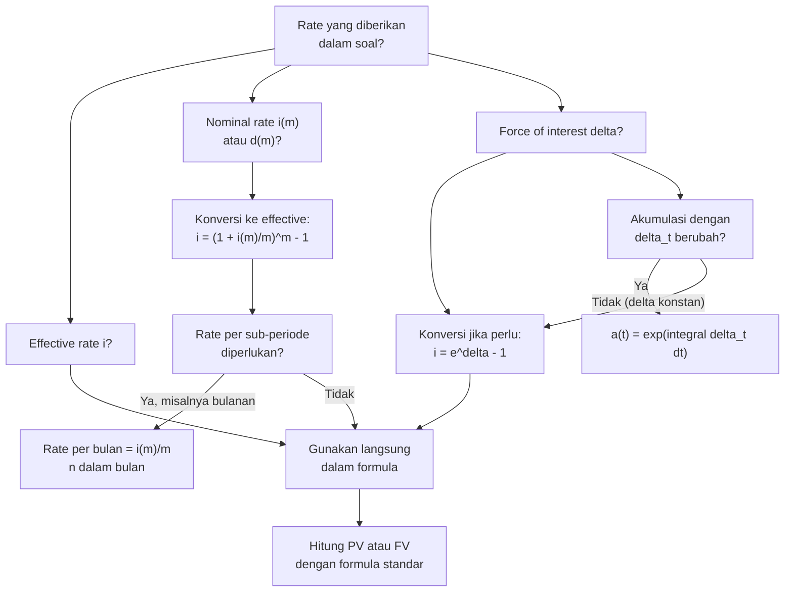

# 📘 1.2 — Effective, Nominal, and Force of Interest

> [!ABSTRACT] Ringkasan Cepat
> **Topik:** Effective, Nominal, and Force of Interest | **Bobot:** ~10–20% | **Difficulty:** Medium
> **Ref:** Vaaler Bab 1–2, Kellison Bab 1–2 | **Prereq:** [[1.1 Interest Rates and Discount Rates]]

## Section 0 — Pemetaan Topik

| Topik CF1 | Sub-topik ID | Skill Diuji | Bobot | Difficulty | Prerequisite | Connected Topics | Referensi |
|-----------|--------------|-------------|-------|------------|--------------|------------------|-----------|
| Topik 1: Nilai Waktu dari Uang | 1.2 | Mengkonversi antara $i$, $i^{(m)}$, $d$, $d^{(m)}$, dan $\delta$; menghitung AV/PV menggunakan force of interest; solve unknown rate dari equation of value; membandingkan instrumen dengan compounding berbeda | 10–20% | Medium | [[1.1 Interest Rates and Discount Rates]] | [[1.3 Cash Flow Equations and Inflation]], [[1.4 Accumulation and Present Value]], [[2.4 Continuous Annuities]], [[5.1 Bond Pricing]], [[5.3 Yield Rate and Coupon Calculations]] | Vaaler Bab 1–2, Kellison Bab 1–2 |

## Section 1 — Intuisi

Bayangkan dua bank menawarkan produk tabungan: Bank A menawarkan bunga **12% per tahun**, sementara Bank B menawarkan **1% per bulan**. Keduanya terdengar sama, tetapi kenyataannya Bank B memberikan lebih banyak karena bunganya dihitung dan dikompoundkan setiap bulan—bunga dari bulan Januari sudah mulai berbunga lagi di bulan Februari. Di sinilah perbedaan antara **nominal rate** dan **effective rate** menjadi krusial: nominal rate adalah "label" yang diiklankan, sementara effective rate adalah "kenyataan" yang kita rasakan setelah memperhitungkan frekuensi compounding.

Lebih jauh lagi, bayangkan sebuah investasi yang bunganya dihitung dan dikompoundkan **setiap detik**—atau bahkan **secara kontinu** tanpa henti. Semakin sering bunga dikompoundkan, semakin besar hasil akhirnya (walaupun dengan diminishing returns). Batas ekstrem dari proses ini adalah **force of interest** ($\delta$): tingkat bunga kontinu yang menggambarkan laju pertumbuhan investasi pada setiap momen. Konsep ini sangat penting dalam matematika aktuaria karena banyak model teoritis menggunakan compounding kontinu untuk kemudahan matematis.

Kemampuan untuk mengkonversi antara berbagai representasi rate ini—$i$, $i^{(m)}$, $d$, $d^{(m)}$, dan $\delta$—adalah keahlian inti dalam CF1. Hampir semua topik berikutnya (anuitas, obligasi, pinjaman) bergantung pada pemilihan rate yang tepat sesuai dengan frekuensi pembayaran. Soal yang tampak sulit seringkali hanya membutuhkan konversi rate yang benar sebelum mengaplikasikan formula standar.

## Section 2 — Definisi Formal

> [!NOTE] Definisi Matematis
> **Suku Bunga Efektif** $i$: bunga yang diperoleh per unit investasi dalam **satu periode**, dengan compounding terjadi sekali per periode.
>
> **Akumulasi selama 1 periode:**
> $$
> a(1) = 1 + i
> $$
>
> **Suku Bunga Nominal** $i^{(m)}$: bunga tahunan yang dikompoundkan sebanyak $m$ kali per tahun. Rate per sub-periode adalah $i^{(m)}/m$.
>
> **Akumulasi selama 1 tahun:**
> $$
> \left(1 + \frac{i^{(m)}}{m}\right)^m = 1 + i
> $$
>
> **Force of Interest** $\delta$: limit dari nominal rate saat $m \to \infty$ (compounding kontinu).
>
> **Akumulasi selama 1 tahun:**
> $$
> e^{\delta} = 1 + i \quad \Longleftrightarrow \quad \delta = \ln(1+i)
> $$
>
> **Tingkat Diskonto Nominal** $d^{(m)}$: tingkat diskonto tahunan yang dikompoundkan $m$ kali per tahun.
> $$
> \left(1 - \frac{d^{(m)}}{m}\right)^m = 1 - d = v
> $$

### Variabel & Parameter

| Simbol | Makna | Satuan / Catatan |
|--------|-------|-----------------|
| $i$ | Suku bunga efektif per periode | Decimal; $i > 0$ |
| $i^{(m)}$ | Suku bunga nominal, compounded $m$-thly | Dibaca: "i upper m"; harus dibagi $m$ untuk rate per sub-periode |
| $m$ | Frekuensi compounding per periode | Integer positif: $m = 1, 2, 4, 12, 52, 365, \ldots$ |
| $d$ | Tingkat diskonto efektif $= 1 - v = i/(1+i)$ | Decimal; $0 < d < 1$ |
| $d^{(m)}$ | Tingkat diskonto nominal, compounded $m$-thly | Analog dari $i^{(m)}$ untuk diskonto |
| $\delta$ | Force of interest (compounding kontinu) | Dalam interest theory; $\delta = \ln(1+i)$ |
| $v$ | Faktor diskonto $= 1/(1+i) = 1 - d$ | $0 < v < 1$ |
| $e$ | Bilangan Euler $\approx 2.71828$ | Basis logaritma natural |

### Rumus Utama

**Konversi antara $i$ dan $i^{(m)}$:**
$$
i = \left(1 + \frac{i^{(m)}}{m}\right)^m - 1
$$
$$
i^{(m)} = m\left[(1+i)^{1/m} - 1\right]
$$
**Label:** Dua arah konversi: dari nominal ke efektif, dan dari efektif ke nominal. Gunakan yang pertama jika $i^{(m)}$ diketahui; gunakan yang kedua jika $i$ diketahui.

**Konversi antara $i$ dan $\delta$:**
$$
\delta = \ln(1+i) \qquad \Longleftrightarrow \qquad i = e^{\delta} - 1
$$
**Label:** Force of interest adalah logaritma natural dari faktor akumulasi tahunan.

**Konversi antara $d$ dan $i$:**
$$
d = \frac{i}{1+i} = 1 - v = iv
$$
**Label:** Tingkat diskonto efektif selalu lebih kecil dari suku bunga efektif: $d < i$.

**Konversi antara $d^{(m)}$ dan $i$ (atau $d$):**
$$
\left(1 - \frac{d^{(m)}}{m}\right)^m = v = \frac{1}{1+i}
$$
$$
d^{(m)} = m\left[1 - v^{1/m}\right] = m\left[1 - (1+i)^{-1/m}\right]
$$
**Label:** Konversi tingkat diskonto nominal ke efektif.

**Akumulasi dengan force of interest konstan:**
$$
a(t) = e^{\delta t}
$$
**Label:** Faktor akumulasi dari $t=0$ ke $t=t$ dengan compounding kontinu rate $\delta$.

**Akumulasi dengan force of interest yang berubah:**
$$
a(t) = e^{\int_0^t \delta_s \, ds}
$$
**Label:** Generalisasi untuk $\delta_t$ yang merupakan fungsi waktu $t$.

**Urutan besaran rate (untuk $i > 0$):**
$$
d < d^{(2)} < d^{(3)} < \cdots < \delta < \cdots < i^{(3)} < i^{(2)} < i
$$
**Label:** Semakin sering compounding, rate nominal semakin mendekati $\delta$; $\delta$ selalu berada di antara $d$ dan $i$.

**Hubungan $i^{(m)}$, $d^{(m)}$, dan $\delta$:**
$$
\frac{i^{(m)}}{m} - \frac{d^{(m)}}{m} = \frac{i^{(m)}}{m} \cdot \frac{d^{(m)}}{m}
$$
$$
\lim_{m \to \infty} i^{(m)} = \lim_{m \to \infty} d^{(m)} = \delta
$$
**Label:** Saat $m \to \infty$, baik $i^{(m)}$ maupun $d^{(m)}$ konvergen ke $\delta$.

### Asumsi Eksplisit

- **Constant Rate:** $i$ (atau $\delta$) konstan sepanjang periode, kecuali dinyatakan $\delta_t$ berubah terhadap $t$.
- **Annual Basis:** Semua rate di sini dinyatakan per tahun kecuali konteks menentukan lain.
- **Positive Rate:** $i > 0$, sehingga $\delta > 0$, $d > 0$, dan semua konversi terdefinisi.
- **Integer $m$:** Frekuensi compounding $m$ adalah bilangan bulat positif (dalam praktik CF1).
- **Frictionless Market:** Tidak ada biaya transaksi atau pajak; konversi rate bersifat ekuivalen murni.

## Section 3 — Jembatan Logika

> [!TIP] Dari Time Diagram ke Equation of Value
> Prinsip dasarnya selalu sama: **1 unit investasi selama 1 tahun harus menghasilkan nilai akumulasi yang sama**, tidak peduli cara rate dinyatakan. Inilah yang disebut *ekuivalensi*.
>
> - Jika investasi tumbuh dengan efektif rate $i$: nilai akhir $= 1 + i$.
> - Jika dikompoundkan $m$ kali per tahun dengan rate $i^{(m)}/m$ per sub-periode: nilai akhir $= \left(1 + i^{(m)}/m\right)^m$.
> - Jika dikompoundkan kontinu dengan force $\delta$: nilai akhir $= e^{\delta}$.
>
> Ketiganya harus sama: $(1 + i^{(m)}/m)^m = e^\delta = 1 + i$. Persamaan inilah yang menjadi sumber semua rumus konversi.

> [!IMPORTANT] Focal Date
> Untuk soal konversi rate, focal date tidak diperlukan secara eksplisit—namun pastikan kamu selalu bekerja dalam **unit waktu yang sama**. Jika rate dinyatakan per tahun tetapi pembayaran bulanan, konversi dulu ke rate per bulan sebelum menghitung PV atau FV.

**Derivasi $i = (1 + i^{(m)}/m)^m - 1$:**

Misalkan investasi sebesar 1 unit dikompoundkan $m$ kali per tahun pada rate $i^{(m)}/m$ per sub-periode. Setelah 1 tahun (= $m$ sub-periode):

$$
\text{AV} = 1 \cdot \left(1 + \frac{i^{(m)}}{m}\right)^m
$$

Agar ekuivalen dengan effective rate $i$ per tahun:

$$
\left(1 + \frac{i^{(m)}}{m}\right)^m = 1 + i
$$

Menyelesaikan untuk $i$:

$$
i = \left(1 + \frac{i^{(m)}}{m}\right)^m - 1
$$

Menyelesaikan untuk $i^{(m)}$:

$$
(1+i)^{1/m} = 1 + \frac{i^{(m)}}{m} \implies i^{(m)} = m\left[(1+i)^{1/m} - 1\right]
$$

**Derivasi $\delta = \ln(1+i)$:**

Force of interest adalah limit nominal rate saat $m \to \infty$:

$$
\delta = \lim_{m \to \infty} i^{(m)} = \lim_{m \to \infty} m\left[(1+i)^{1/m} - 1\right]
$$

Substitusi $h = 1/m$, maka $m \to \infty$ ekuivalen dengan $h \to 0$:

$$
\delta = \lim_{h \to 0} \frac{(1+i)^h - 1}{h} = \frac{d}{dh}(1+i)^h \bigg|_{h=0} = (1+i)^0 \cdot \ln(1+i) = \ln(1+i)
$$

Ini juga bisa ditulis sebagai:

$$
e^\delta = 1 + i \implies a(t) = (1+i)^t = e^{\delta t}
$$

**Derivasi urutan $d < \delta < i$:**

Dari $d = i \cdot v = i/(1+i)$ dan $i > 0$: jelas $d < i$. Untuk $\delta$: gunakan $e^x > 1 + x$ untuk $x \neq 0$. Dengan $x = \delta$: $e^\delta > 1 + \delta$, artinya $1 + i > 1 + \delta$, jadi $\delta < i$. Dengan argumen serupa, $\delta > d$.

> [!DANGER] Dilarang
> 1. **Dilarang menambahkan nominal rates langsung:** $i^{(4)}_A + i^{(12)}_B \neq i^{(4+12)}_{A+B}$. Konversi ke efektif dulu sebelum membandingkan atau menggabungkan.
> 2. **Dilarang menggunakan $i^{(m)}$ langsung sebagai rate per tahun:** $i^{(12)} = 12\%$ berarti $1\%$ per bulan, bukan $12\%$ per tahun efektif. Harus dihitung $(1.01)^{12} - 1 \approx 12.68\%$.
> 3. **Dilarang mengasumsikan $\delta = i$ atau $\delta \approx i$ untuk soal numerik:** Selisih antara $\delta$ dan $i$ selalu ada dan bisa signifikan di soal CF1. Selalu hitung eksplisit.

## Section 4 — Contoh Soal

### Soal A — Fundamental

Sebuah bank menawarkan deposito dengan nominal rate $i^{(12)} = 9\%$ per tahun, dikompoundkan bulanan. Hitung: (a) suku bunga efektif tahunan $i$, dan (b) force of interest $\delta$ yang ekuivalen.

> [!SUCCESS] Solusi Soal A
>
> **1. Identifikasi Variabel**
> - Nominal rate: $i^{(12)} = 0.09$ per tahun
> - Frekuensi compounding: $m = 12$ (bulanan)
> - Rate per bulan: $i^{(12)}/12 = 0.09/12 = 0.0075$
> - Cari: $i$ (efektif tahunan) dan $\delta$ (force of interest)
>
> **2. Time Diagram**
> Investasi 1 unit di $t = 0$. Setelah 12 sub-periode (1 tahun), nilai tumbuh ke $t = 1$. Setiap bulan dikalikan faktor $(1 + 0.0075)$.
>
> **3. Equation of Value** *(Focal Date $t = 1$ tahun)*
>
> Ekuivalensi akumulasi:
> $$
> (1 + i) = \left(1 + \frac{i^{(12)}}{12}\right)^{12}
> $$
>
> **4. Eksekusi Aljabar**
>
> **(a) Efektif rate $i$:**
> $$
> 1 + i = \left(1 + \frac{0.09}{12}\right)^{12} = (1.0075)^{12}
> $$
> $$
> (1.0075)^{12} = 1.093807\ldots
> $$
> $$
> i = 1.093807 - 1 = 0.093807 \approx 9.3807\%
> $$
>
> **(b) Force of interest $\delta$:**
> $$
> \delta = \ln(1 + i) = \ln(1.093807)
> $$
> $$
> \delta = 0.08961 \approx 8.961\%
> $$
>
> **5. Verification**
>
> Logika finansial: $d < \delta < i^{(m)} < i$ harus terpenuhi. Kita punya $d = i/(1+i) = 0.093807/1.093807 \approx 8.576\% < \delta = 8.961\% < i^{(12)} = 9\% < i = 9.3807\%$. ✓ Urutan tepat.

> [!WARNING] Exam Tips — Soal A
> - **Target waktu:** 2–3 menit.
> - **Common trap:** Langsung menulis $i = 9\%$ (mengira nominal = efektif). Selalu cek apakah ada superscript $(m)$ pada rate yang diberikan.
> - **Shortcut $\delta$:** Jika $i$ sudah dihitung, $\delta = \ln(1+i)$ langsung. Tidak perlu ulang dari $i^{(m)}$.

---

### Soal B — Exam-Typical

Seorang investor menerima dua penawaran investasi: (X) depositkan uang selama 5 tahun pada $\delta = 7\%$ per tahun (force of interest), atau (Y) depositkan pada $i^{(4)} = 7.1\%$ per tahun, dikompoundkan kuartalan. Manakah investasi yang memberikan akumulasi lebih besar setelah 5 tahun? Buktikan dengan menghitung effective annual rate dari masing-masing.

> [!SUCCESS] Solusi Soal B
>
> **1. Identifikasi Variabel**
> - Investasi X: $\delta_X = 0.07$ (force of interest)
> - Investasi Y: $i^{(4)}_Y = 0.071$, $m = 4$ (kuartalan)
> - Horizon: $t = 5$ tahun
> - Cari: Effective annual rate masing-masing, lalu bandingkan
>
> **2. Time Diagram**
> Kedua investasi dimulai di $t = 0$, dievaluasi di $t = 5$. Investasi X: pertumbuhan kontinu. Investasi Y: dikompoundkan setiap 3 bulan (20 kali selama 5 tahun).
>
> **3. Equation of Value** *(Focal Date $t = 1$ tahun, untuk mendapat effective annual rate)*
>
> Investasi X:
> $$
> 1 + i_X = e^{\delta_X}
> $$
> Investasi Y:
> $$
> 1 + i_Y = \left(1 + \frac{i^{(4)}_Y}{4}\right)^4
> $$
>
> **4. Eksekusi Aljabar**
>
> **Effective rate dari Investasi X:**
> $$
> 1 + i_X = e^{0.07} = 1.072508\ldots
> $$
> $$
> i_X = 7.2508\%
> $$
>
> **Effective rate dari Investasi Y:**
> $$
> 1 + i_Y = \left(1 + \frac{0.071}{4}\right)^4 = (1.01775)^4
> $$
> $$
> (1.01775)^4 = 1.072929\ldots
> $$
> $$
> i_Y = 7.2929\%
> $$
>
> **Perbandingan:**
> $$
> i_Y = 7.2929\% > i_X = 7.2508\%
> $$
>
> Investasi Y memberikan akumulasi lebih besar.
>
> **Verifikasi dengan AV selama 5 tahun (per unit investasi):**
> $$
> \text{AV}_X = e^{0.07 \times 5} = e^{0.35} = 1.41907\ldots
> $$
> $$
> \text{AV}_Y = (1.01775)^{20} = 1.42118\ldots
> $$
>
> Konfirmasi: $\text{AV}_Y > \text{AV}_X$. ✓
>
> **5. Verification**
>
> Meskipun $\delta_X = 7\% < i^{(4)}_Y = 7.1\%$, kita tidak bisa langsung membandingkan keduanya karena basis berbeda (kontinu vs kuartalan). Setelah konversi ke effective rate, perbedaan $\approx 0.04\%$ per tahun—kecil tapi signifikan untuk horizon panjang. Pendekatan yang benar adalah selalu konversi ke basis yang sama dulu. ✓

> [!WARNING] Exam Tips — Soal B
> - **Target waktu:** 4–5 menit.
> - **Common trap:** Langsung membandingkan $\delta = 7\%$ dengan $i^{(4)} = 7.1\%$ dan menyimpulkan Y lebih baik karena angkanya lebih besar. Perbandingan langsung antar rate dengan basis berbeda **tidak valid**. Selalu konversi ke effective rate yang sama.
> - **Shortcut:** Bandingkan AV per unit saja tanpa hitung $i$ efektif secara eksplisit, langsung $e^{0.35}$ vs $(1.01775)^{20}$.

---

### Soal C — Challenging

Force of interest pada tahun ke-$t$ diberikan sebagai $\delta_t = 0.04 + 0.006t$ untuk $0 \leq t \leq 5$, dan $\delta_t = 0.07$ untuk $t > 5$ (konstan). Hitung present value di $t = 0$ dari pembayaran sebesar Rp 10.000.000 yang jatuh tempo di $t = 8$.

> [!SUCCESS] Solusi Soal C
>
> **1. Identifikasi Variabel**
> - Force of interest: $\delta_t = 0.04 + 0.006t$ untuk $0 \leq t \leq 5$; $\delta_t = 0.07$ untuk $t > 5$
> - Pembayaran: $X = 10{,}000{,}000$ di $t = 8$
> - Cari: $PV$ di $t = 0$
>
> **2. Time Diagram**
> Cash flow tunggal sebesar Rp 10.000.000 di $t = 8$. Discount kembali ke $t = 0$ melalui dua zona force of interest: zona $[0, 5]$ dengan rate berubah, dan zona $[5, 8]$ dengan rate konstan $0.07$.
>
> **3. Equation of Value** *(Focal Date $t = 0$)*
>
> $$
> PV = 10{,}000{,}000 \times v(0, 8) = 10{,}000{,}000 \times e^{-\int_0^8 \delta_t \, dt}
> $$
>
> Karena $\delta_t$ berbeda untuk dua interval:
> $$
> \int_0^8 \delta_t \, dt = \int_0^5 (0.04 + 0.006t)\, dt + \int_5^8 0.07 \, dt
> $$
>
> **4. Eksekusi Aljabar**
>
> **Integral pada $[0, 5]$:**
> $$
> \int_0^5 (0.04 + 0.006t)\, dt = \left[0.04t + \frac{0.006t^2}{2}\right]_0^5
> $$
> $$
> = \left[0.04t + 0.003t^2\right]_0^5 = 0.04(5) + 0.003(25) - 0
> $$
> $$
> = 0.200 + 0.075 = 0.275
> $$
>
> **Integral pada $[5, 8]$:**
> $$
> \int_5^8 0.07 \, dt = 0.07 \times (8 - 5) = 0.07 \times 3 = 0.210
> $$
>
> **Total integral:**
> $$
> \int_0^8 \delta_t \, dt = 0.275 + 0.210 = 0.485
> $$
>
> **Faktor diskonto:**
> $$
> v(0, 8) = e^{-0.485} = 0.61578\ldots
> $$
>
> **Present Value:**
> $$
> PV = 10{,}000{,}000 \times 0.61578 = 6{,}157{,}800 \text{ (Rp)}
> $$
>
> **5. Verification**
>
> Cek kewajaran: discount selama 8 tahun dengan average rate sekitar $0.485/8 = 6.06\%$ per tahun. Faktor diskonto $e^{-0.485} \approx 0.616$, artinya nilai sekarang sekitar 61.6% dari nilai nominal. Untuk 8 tahun pada sekitar 6%, ini masuk akal (cek: $e^{-0.06 \times 8} = e^{-0.48} \approx 0.619$—sangat dekat). ✓

> [!WARNING] Exam Tips — Soal C
> - **Target waktu:** 6–8 menit.
> - **Common trap 1:** Lupa memisahkan integral menjadi dua zona dan mengintegralkan $\delta_t = 0.04 + 0.006t$ untuk seluruh $[0, 8]$. Selalu perhatikan domain masing-masing fungsi $\delta_t$.
> - **Common trap 2:** Menggunakan $e^{+\int \delta_t \, dt}$ (tanda positif) untuk mencari PV—ini memberikan AV, bukan PV. Untuk discount, gunakan $e^{-\int}$.
> - **Shortcut konseptual:** Tulis $v(0,8) = v(0,5) \times v(5,8)$ dan hitung dua faktor terpisah: $e^{-0.275} \times e^{-0.210}$. Berguna jika satu bagian sudah dihitung sebelumnya.

## Section 5 — Verifikasi & Sanity Check

> [!CHECK] Urutan Rate (Inequality Check)
> 1. Untuk $i > 0$, selalu berlaku: $d < d^{(2)} < d^{(4)} < \cdots < \delta < \cdots < i^{(4)} < i^{(2)} < i$.
> 2. **Jika $\delta \geq i$:** Ada kesalahan konversi. Force of interest selalu **lebih kecil** dari efektif rate.
> 3. **Jika $i^{(m)} \geq i$ untuk $m \geq 2$:** Ada kesalahan. Nominal rate selalu lebih kecil dari efektif rate (untuk $m \geq 2$).

> [!CHECK] Konsistensi Akumulasi
> 1. Untuk semua representasi rate yang **ekuivalen**, akumulasi 1 unit selama 1 tahun harus sama persis: $(1 + i^{(m)}/m)^m = e^\delta = 1 + i$.
> 2. **Limit check:** Saat $i \to 0$, semua rate konvergen: $i \approx i^{(m)} \approx d \approx d^{(m)} \approx \delta$ (first-order approximation).
> 3. **Monotonisitas $i^{(m)}$ terhadap $m$:** Semakin besar $m$, semakin kecil $i^{(m)}$ (untuk $i$ efektif tetap). Jika $i^{(4)} > i^{(2)}$ dengan $i$ yang sama, ada error.

> [!CHECK] Akumulasi dengan $\delta_t$ Bervariasi
> 1. **Cek dimensi integral:** $\int_0^t \delta_s \, ds$ harus berdimensi "pure number" (tidak ada satuan waktu tersisa). Jika $\delta_s = as + b$, maka $\int_0^t \delta_s \, ds = at^2/2 + bt$.
> 2. **Cek nilai wajar:** $a(t) = e^{\int_0^t \delta_s \, ds}$ harus $\geq 1$ untuk semua $t \geq 0$ (investasi tidak bisa menyusut jika $\delta \geq 0$).
> 3. **Cek boundary:** $a(0) = e^0 = 1$ selalu berlaku.

### Metode Alternatif

**Konversi via Logaritma Natural (alternatif untuk cek):**

Jika diketahui $a(t) = e^{\delta t}$, maka:
$$
\delta = \frac{\ln a(t)}{t}
$$

Berguna untuk mencari $\delta$ jika hanya diketahui nilai akumulasi pada waktu tertentu.

**Pendekatan via $i^{(m)}$ untuk $m$ besar:**

$$
i^{(m)} \approx \delta + \frac{\delta^2}{2m} \quad \text{(untuk }m\text{ besar)}
$$

Approximation ini berguna untuk cross-check, tetapi **jangan gunakan di soal numerik CF1** — selalu gunakan rumus eksak.

## Section 6 — Visualisasi Mental

**Grafik $i^{(m)}$ sebagai fungsi $m$ (dengan $i$ efektif tetap):**

Bayangkan grafik dengan **sumbu X = frekuensi compounding $m$** (mulai dari $m=1$ sampai $m=\infty$) dan **sumbu Y = nilai nominal rate $i^{(m)}$** yang ekuivalen.

- Kurva **monoton menurun** dan **concave** terhadap $m$.
- Di $m = 1$: $i^{(1)} = i$ (efektif rate = nominal rate).
- Saat $m \to \infty$: $i^{(m)} \to \delta = \ln(1+i)$ sebagai asymptote bawah.
- Contoh konkret: jika $i = 10\%$, maka $i^{(2)} \approx 9.76\%$, $i^{(4)} \approx 9.65\%$, $i^{(12)} \approx 9.57\%$, $\delta \approx 9.53\%$.

Interpretasi: **semakin sering dikompoundkan, bank harus menawarkan nominal rate yang lebih rendah untuk memberikan hasil yang sama**.

**Diagram "Rate Ladder" (visualisasi urutan):**

Bayangkan tangga vertikal dengan rung dari bawah ke atas:

```
↑ TINGGI
i        ← Effective rate (kompoundkan 1x/tahun)
i^(2)    ← Nominal, semiannual compounding
i^(4)    ← Nominal, quarterly compounding
i^(12)   ← Nominal, monthly compounding
i^(365)  ← Nominal, daily compounding
δ        ← Force of interest (limit, compounding kontinu)
─────────  (garis tengah)
d^(365)  ← Discount, daily
d^(12)   ← Discount, monthly
d^(4)    ← Discount, quarterly
d^(2)    ← Discount, semiannual
d        ← Effective discount rate (1x/tahun)
↓ RENDAH
```

Tangga ini simetris di sekitar $\delta$—semua rate menuju $\delta$ saat $m \to \infty$.

**Akumulasi $a(t) = e^{\delta t}$ vs $a(t) = (1+i)^t$:**

Kedua kurva **identik** jika $\delta = \ln(1+i)$—ini adalah dua cara menuliskan fungsi yang sama. Kurva exponential, selalu di atas 1 untuk $t > 0$, dan meningkat semakin curam (convex).

### Hubungan Visual ↔ Rumus

**Tiap "rung" di tangga = satu konversi aljabar:**
$$
i = \left(1 + \frac{i^{(m)}}{m}\right)^m - 1 \quad \longleftrightarrow \quad \text{naik satu rung}
$$

**Batas bawah tangga = limit saat $m \to \infty$:**
$$
\lim_{m \to \infty} i^{(m)} = \delta \quad \longleftrightarrow \quad \text{rung paling bawah grup interest}
$$

**Simetri $i^{(m)}$ dan $d^{(m)}$ terhadap $\delta$:**
$$
\frac{i^{(m)}}{m} \cdot \frac{d^{(m)}}{m} = \frac{i^{(m)} - d^{(m)}}{m} \quad \longleftrightarrow \quad \text{refleksi simetris di sekitar }\delta
$$

## Section 7 — Jebakan Umum

> [!BUG] Kesalahan Unit Waktu
> **Contoh Salah:** Soal menyebut $i^{(12)} = 6\%$ dan menghitung AV selama 10 tahun dengan $a(10) = (1 + 0.06)^{10}$. Ini salah karena $0.06$ bukan rate per tahun efektif.
>
> **Benar:** Dua langkah: (1) konversi $i = (1 + 0.06/12)^{12} - 1 = (1.005)^{12} - 1 \approx 6.1678\%$, lalu (2) $a(10) = (1.061678)^{10}$. Atau langsung: $a(10) = (1.005)^{120}$.

> [!BUG] Kesalahan Konseptual
> 1. **Nominal rate dianggap efektif:** Menulis $i = i^{(m)}$ tanpa konversi. Ingat: $i > i^{(m)}$ untuk $m \geq 2$.
> 2. **Force of interest dianggap sama dengan efektif rate:** $\delta \neq i$; selalu $\delta = \ln(1+i) < i$.
> 3. **Salah arah konversi $d^{(m)}$:** $d^{(m)} = m[1 - v^{1/m}]$, bukan $m[(1+i)^{1/m} - 1]$ (itu $i^{(m)}$).
> 4. **Lupa bahwa $\delta_t$ berubah terhadap waktu memerlukan integral, bukan perkalian:** Jika $\delta_t$ bukan konstan, $a(t) = e^{\int_0^t \delta_s \, ds}$, **bukan** $e^{\delta_t \cdot t}$.

> [!BUG] Kesalahan Interpretasi Soal
> **Ambiguitas "annual rate":** Frasa "annual interest rate of 8%" tanpa keterangan tambahan biasanya berarti effective annual rate $i = 8\%$. Namun "annual rate of 8%, compounded quarterly" berarti $i^{(4)} = 8\%$ — keduanya sangat berbeda.
>
> **Ambiguitas "convertible":** Kata *"convertible"* dalam frasa "8% convertible semiannually" berarti **dikompoundkan semiannually**, bukan dikonversi ke rate lain. Artinya $i^{(2)} = 8\%$, rate per 6 bulan $= 4\%$.

> [!CAUTION] Red Flags
> - **Superscript $(m)$ pada rate:** Trigger wajib konversi sebelum digunakan dalam formula anuitas atau obligasi. Contoh: $i^{(2)}$, $i^{(12)}$, $d^{(4)}$.
> - **Kata "force of interest" atau "continuously compounded":** Gunakan $e^{\delta t}$ untuk akumulasi, bukan $(1+i)^t$ secara langsung (walaupun ekuivalen jika $\delta = \ln(1+i)$).
> - **Rate berubah antar periode:** Jika $\delta_t$ bervariasi, selalu pisahkan integral per zona. Jangan gabung menjadi satu rata-rata.
> - **Soal minta "equivalent rate":** Kata "equivalent" = ekuivalen = sama efektif ratenya. Wajib konversi ke basis yang diminta.
> - **Membandingkan dua instrumen dengan $m$ berbeda:** Selalu konversi keduanya ke effective annual rate sebelum membandingkan.

## Section 8 — Ringkasan Eksekutif

> [!SUMMARY] Must-Remember
> 1. **Konversi nominal ke efektif:**
>    $$
>    i = \left(1 + \frac{i^{(m)}}{m}\right)^m - 1
>    $$
> 2. **Konversi efektif ke nominal:**
>    $$
>    i^{(m)} = m\left[(1+i)^{1/m} - 1\right]
>    $$
> 3. **Hubungan efektif dan force of interest:**
>    $$
>    \delta = \ln(1+i) \qquad \Longleftrightarrow \qquad i = e^{\delta} - 1
>    $$
> 4. **Akumulasi dengan force of interest bervariasi:**
>    $$
>    a(t) = e^{\int_0^t \delta_s \, ds}
>    $$
> 5. **Urutan wajib hafal:**
>    $$
>    d < d^{(m)} < \delta < i^{(m)} < i \quad \text{untuk } m \geq 2, \; i > 0
>    $$

### Kapan Digunakan

- **Trigger keywords:** "nominal rate," "compounded monthly/quarterly/semiannually," "force of interest," "continuously compounded," "equivalent rate," "convertible $m$-thly."
- **Tipe skenario soal:**
  - Konversi dari $i^{(m)}$ ke $i$ (atau sebaliknya) untuk menyamakan basis sebelum hitung anuitas.
  - Menentukan apakah dua investasi ekuivalen atau mana yang lebih menguntungkan.
  - Menghitung AV/PV dengan $\delta_t$ yang berubah terhadap waktu (melibatkan integral).
  - Soal obligasi atau pinjaman dengan frekuensi coupon berbeda dari frekuensi compounding.

### Kapan TIDAK Boleh Digunakan

- **Jika $m = 1$ dan rate sudah efektif:** Tidak perlu konversi—langsung gunakan $i$ dalam formula.
- **Jika soal tidak melibatkan multiple compounding periods:** Misalnya investasi sederhana (simple interest), tidak ada compounding, tidak ada formula nominal rate yang relevan.
- **Untuk simple interest:** Simple interest tidak menggunakan $i^{(m)}$ atau $\delta$—formula akumulasinya adalah $a(t) = 1 + it$, bukan $(1+i)^t$.

### Quick Decision Tree



---

> [!QUOTE] Follow-up Options
> 1. *"Berikan contoh soal konversi antara $i^{(m)}$ dan $d^{(m)}$ secara bersamaan"*
> 2. *"Jelaskan hubungan [[1.2 Effective, Nominal, and Force of Interest]] dengan [[2.4 Continuous Annuities]]"*
> 3. *"Buat flashcard 1-halaman untuk semua rumus konversi rate"*

*📖 Ref: Vaaler Bab 1–2, Kellison Bab 1–2 | 🗓️ 2026-02-19 | #CF1 #InterestTheory #NominalRate #EffectiveRate #ForceOfInterest*
