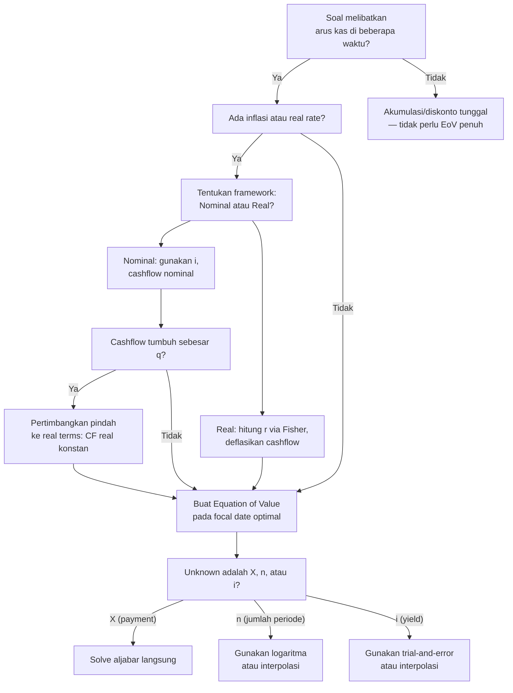

# 📘 1.3 — Cash Flow Equations and Inflation

> [!ABSTRACT] Ringkasan Cepat
> **Topik:** Cash Flow Equations and Inflation | **Bobot:** ~10–20% | **Difficulty:** Medium
> **Ref:** Vaaler Bab 1–2, Kellison Bab 1–2 | **Prereq:** [[1.1 Interest Rates and Discount Rates]], [[1.2 Effective, Nominal, and Force of Interest]], [[1.4 Accumulation and Present Value]]

## Section 0 — Pemetaan Topik

| Topik CF1 | Sub-topik ID | Skill Diuji | Bobot | Difficulty | Prerequisite | Connected Topics | Referensi |
|-----------|--------------|-------------|-------|------------|--------------|------------------|-----------|
| Topik 1: Nilai Waktu dari Uang | 1.3 | Menyusun equation of value dari arus kas ganda; memilih focal date yang tepat; mengkonversi antara nominal rate, real rate, dan inflation rate via Fisher equation; menghitung PV/FV arus kas dengan inflasi; solve unknown ($n$, $i$, atau payment) dari equation of value | 10–20% | Medium | [[1.1 Interest Rates and Discount Rates]], [[1.2 Effective, Nominal, and Force of Interest]], [[1.4 Accumulation and Present Value]] | [[1.5 NPV, IRR, DWRR, TWRR]], [[2.1 Annuity-Immediate and Annuity-Due]], [[2.3 Varying Annuities]], [[4.2 Amortization Method]], [[5.1 Bond Pricing]] | Vaaler Bab 1–2, Kellison Bab 1–2 |

## Section 1 — Intuisi

Setiap transaksi keuangan—pinjaman, investasi, obligasi—melibatkan uang yang berpindah di **waktu yang berbeda**. Prinsip fundamental matematika keuangan menyatakan bahwa uang hanya bisa dibandingkan jika diukur pada **titik waktu yang sama**. Equation of value adalah "jembatan" yang memungkinkan kita memindahkan semua arus kas ke satu titik waktu tunggal, lalu menyeimbangkannya. Bayangkan seorang peminjam yang menerima pinjaman hari ini dan berjanji membayar cicilan selama 5 tahun—equation of value menyatakan bahwa nilai sekarang dari semua yang diterima harus sama dengan nilai sekarang dari semua yang dibayar. Inilah prinsip no-arbitrage paling dasar dalam matematika keuangan.

Inflasi menambahkan lapisan kompleksitas yang sangat penting: uang hari ini tidak hanya lebih berharga karena bisa diinvestasikan (nilai waktu uang), tetapi juga karena daya belinya akan tergerus seiring waktu. Ketika bunga tabungan kamu 7% per tahun tetapi inflasi 5% per tahun, daya beli tabungan kamu sebenarnya hanya tumbuh sekitar 2% per tahun—bukan 7%. Inilah perbedaan antara **nominal rate** (angka yang tertulis di buku tabungan) dan **real rate** (pertumbuhan daya beli sesungguhnya). **Fisher equation** adalah rumus yang menghubungkan keduanya secara presisi.

Di ujian CF1, kedua konsep ini sering muncul bersamaan: soal memberikan arus kas yang nilainya tumbuh mengikuti inflasi, lalu meminta kita menghitung present value menggunakan discount rate tertentu. Kuncinya adalah memilih apakah akan bekerja dalam **nominal terms** (gunakan nominal rate, arus kas nominal) atau **real terms** (gunakan real rate, arus kas real)—keduanya memberikan jawaban yang sama jika dilakukan konsisten. Satu langkah yang salah dalam memilih pasangan rate-cashflow ini adalah sumber kesalahan paling umum di topik ini.

## Section 2 — Definisi Formal

> [!NOTE] Definisi Matematis
> **Equation of Value:** Persamaan yang menyatakan keseimbangan nilai semua arus kas pada satu **focal date** $t^*$.
>
> $$
> \sum_{k} C_k^{+} \cdot a(t^*, t_k^{+}) = \sum_{j} C_j^{-} \cdot a(t^*, t_j^{-})
> $$
>
> di mana $C_k^{+}$ adalah arus kas masuk di waktu $t_k^{+}$, $C_j^{-}$ adalah arus kas keluar di waktu $t_j^{-}$, dan $a(t^*, t)$ adalah faktor nilai dari waktu $t$ ke $t^*$ (bisa akumulasi jika $t^* > t$, atau diskonto jika $t^* < t$).
>
> **Fisher Equation (Exact):**
> $$
> (1 + i) = (1 + r)(1 + q)
> $$
>
> **Fisher Equation (Approximate):**
> $$
> i \approx r + q
> $$
>
> di mana $i$ = nominal interest rate, $r$ = real interest rate, $q$ = inflation rate (semua per periode yang sama).

### Variabel & Parameter

| Simbol | Makna | Catatan |
|--------|-------|---------|
| $C_k$ | Arus kas (cash flow) pada waktu $t_k$ | Positif = masuk, negatif = keluar |
| $t^*$ | Focal date (titik acuan equation of value) | Pilihan bebas; tidak mengubah hasil |
| $a(t_1, t_2)$ | Faktor akumulasi dari $t_1$ ke $t_2$ | $= (1+i)^{t_2 - t_1}$ jika rate konstan |
| $v^t$ | Faktor diskonto $= (1+i)^{-t}$ | Untuk memindahkan kas dari $t$ ke $t=0$ |
| $i$ | Nominal interest rate (efektif per periode) | Mencerminkan pertumbuhan uang nominal |
| $r$ | Real interest rate (efektif per periode) | Mencerminkan pertumbuhan daya beli |
| $q$ | Inflation rate (efektif per periode) | Laju kenaikan harga barang & jasa |
| $P_t$ | Indeks harga pada waktu $t$ | $P_t = P_0 (1+q)^t$ jika inflasi konstan $q$ |
| $C_t^{\text{nom}}$ | Arus kas nominal pada waktu $t$ | Nilai dalam mata uang pada waktu $t$ |
| $C_t^{\text{real}}$ | Arus kas real pada waktu $t$ | Nilai dalam daya beli waktu $t=0$ |

### Rumus Utama

**Equation of Value pada focal date $t^* = 0$:**
$$
\sum_{k} C_k \cdot v^{t_k} = 0
$$
**Label:** Bentuk paling umum — semua arus kas (positif dan negatif) didiskonto ke $t=0$ harus berjumlah nol (konsisten dengan konvensi: arus kas masuk positif, keluar negatif).

**Equation of Value pada focal date $t^* = n$ (FV basis):**
$$
\sum_{k} C_k \cdot (1+i)^{n - t_k} = 0
$$
**Label:** Semua arus kas diakumulasikan ke $t = n$; berguna jika soal meminta nilai di akhir horizon.

**Faktor akumulasi standar:**
$$
a(t) = (1+i)^t \quad \text{(compound interest)}
$$
$$
a(t) = 1 + it \quad \text{(simple interest — hanya untuk periode tunggal pendek)}
$$
**Label:** Untuk CF1, selalu gunakan compound interest kecuali soal secara eksplisit menyebut "simple interest."

**Fisher Equation (exact):**
$$
(1+i) = (1+r)(1+q) \implies r = \frac{1+i}{1+q} - 1
$$
**Label:** Hubungan eksak antara nominal rate $i$, real rate $r$, dan inflation rate $q$. Selalu gunakan versi eksak ini di soal numerik.

**Fisher Equation (approximate — hanya untuk intuisi):**
$$
i \approx r + q
$$
**Label:** Hanya valid jika $r$ dan $q$ sama-sama kecil (< 5%). Jangan gunakan untuk soal numerik CF1.

**Konversi arus kas nominal ke real:**
$$
C_t^{\text{real}} = \frac{C_t^{\text{nom}}}{(1+q)^t}
$$
**Label:** Arus kas real adalah arus kas nominal yang "deflasikan" oleh indeks harga.

**Present value arus kas nominal (discounted at nominal rate $i$):**
$$
PV = \sum_t C_t^{\text{nom}} \cdot v_i^t = \sum_t C_t^{\text{nom}} \cdot \frac{1}{(1+i)^t}
$$

**Present value arus kas real (discounted at real rate $r$):**
$$
PV = \sum_t C_t^{\text{real}} \cdot v_r^t = \sum_t C_t^{\text{real}} \cdot \frac{1}{(1+r)^t}
$$

**Label untuk dua rumus terakhir:** Kedua pendekatan menghasilkan PV yang **identik** jika Fisher equation terpenuhi dan konversi dilakukan konsisten.

**Arus kas nominal yang tumbuh dengan inflasi:**
$$
C_t^{\text{nom}} = C_0 \cdot (1+q)^t
$$
**Label:** Arus kas yang nilainya tumbuh tepat sebesar inflasi memiliki nilai **real yang konstan** = $C_0$.

### Asumsi Eksplisit

- **Compound Interest:** Semua akumulasi dan diskonto menggunakan bunga majemuk, kecuali disebutkan simple interest.
- **Constant Rates:** $i$, $r$, dan $q$ konstan sepanjang horizon, kecuali soal menyebut variasi per periode.
- **Fisher Equation Holds:** Hubungan $(1+i) = (1+r)(1+q)$ diasumsikan berlaku—artinya nominal rate sudah mengandung kompensasi inflasi.
- **Frictionless Market:** Tidak ada biaya transaksi, pajak, atau default risk.
- **Focal Date Independence:** Pilihan focal date tidak mempengaruhi solusi—hanya mengubah bentuk persamaan.

## Section 3 — Jembatan Logika

> [!TIP] Dari Time Diagram ke Equation of Value
> Langkah sistematis membangun equation of value:
>
> **Langkah 1 — Gambar time diagram:** Tandai semua arus kas (masuk dan keluar) pada garis waktu dari $t=0$ hingga $t=n$. Arus kas masuk di atas garis, keluar di bawah.
>
> **Langkah 2 — Pilih focal date $t^*$:** Paling sering $t^* = 0$ (basis PV) atau $t^* = n$ (basis FV). Pilih yang paling menyederhanakan aljabar.
>
> **Langkah 3 — Pindahkan semua kas ke $t^*$:** Kas di $t_k < t^*$ dikalikan $(1+i)^{t^* - t_k}$ (akumulasi). Kas di $t_k > t^*$ dikalikan $v^{t_k - t^*} = (1+i)^{-(t_k - t^*)}$ (diskonto).
>
> **Langkah 4 — Seimbangkan:** Jumlah semua nilai pada $t^*$ = 0, atau: nilai masuk = nilai keluar.

> [!IMPORTANT] Focal Date
> Focal date $t^*$ boleh dipilih **di mana saja** pada garis waktu—hasil akhir (unknown yang dicari) **tidak berubah**. Secara matematis, mengubah focal date hanya mengalikan seluruh persamaan dengan $(1+i)^k$ untuk suatu $k$—ini tidak mengubah solusi. Dalam praktik ujian, pilih $t^* = 0$ jika soal minta PV, $t^* = n$ jika minta FV, atau titik di mana paling banyak arus kas berkumpul untuk meminimalisir istilah dalam persamaan.

**Derivasi prinsip kesetaraan focal date:**

Misalkan equation of value pada $t^* = 0$ adalah:
$$
\sum_k C_k \cdot v^{t_k} = 0
$$

Pada $t^* = T$, kalikan seluruh persamaan dengan $(1+i)^T$:
$$
\sum_k C_k \cdot v^{t_k} \cdot (1+i)^T = 0 \implies \sum_k C_k \cdot (1+i)^{T - t_k} = 0
$$

Ini adalah equation of value yang sama tetapi pada focal date $T$. Karena $(1+i)^T \neq 0$, kedua persamaan memiliki solusi yang identik. Q.E.D.

**Derivasi Fisher Equation:**

Misalkan seseorang menginvestasikan 1 unit uang. Ada dua cara mengukur pertumbuhan nyata setelah 1 tahun:

*Cara 1 — Nominal terms:* Investasi tumbuh menjadi $(1+i)$ unit uang nominal.

*Cara 2 — Real terms:* Daya beli 1 unit uang di $t=0$ adalah $1/P_0$. Setelah 1 tahun, investasi nominal menjadi $(1+i)$, dan harga-harga naik jadi $P_1 = P_0(1+q)$. Daya beli nyata di $t=1$ adalah $(1+i)/P_1 = (1+i)/[P_0(1+q)]$. Pertumbuhan **real** adalah:

$$
1 + r = \frac{(1+i)/P_1}{1/P_0} = \frac{(1+i) \cdot P_0}{P_0 \cdot (1+q)} = \frac{1+i}{1+q}
$$

Sehingga:
$$
(1+r)(1+q) = 1+i
$$

**Derivasi ekuivalensi PV nominal vs PV real:**

Untuk arus kas nominal yang tumbuh dengan inflasi $C_t^{\text{nom}} = C_0(1+q)^t$:

$$
PV = \sum_t \frac{C_0(1+q)^t}{(1+i)^t} = \sum_t C_0 \left(\frac{1+q}{1+i}\right)^t = \sum_t \frac{C_0}{(1+r)^t} = \sum_t C_t^{\text{real}} \cdot v_r^t
$$

di mana langkah terakhir menggunakan $C_t^{\text{real}} = C_0$ (konstan) dan $1/(1+r) = (1+q)/(1+i)$. PV nominal = PV real. ✓

> [!DANGER] Dilarang
> 1. **Dilarang mencampurkan nominal cash flows dengan real discount rate (atau sebaliknya):** Jika arus kas dalam nominal terms, discount dengan $i$ (nominal). Jika arus kas dalam real terms, discount dengan $r$ (real). Mencampurkan keduanya menghasilkan angka yang salah secara sistematis.
> 2. **Dilarang menggunakan Fisher approximate ($i \approx r + q$) dalam soal numerik:** Gunakan selalu $(1+i) = (1+r)(1+q)$ — versi eksak. Approximate hanya untuk intuisi cepat.
> 3. **Dilarang memindahkan arus kas antar waktu tanpa faktor akumulasi/diskonto:** Rp 1.000.000 di $t = 3$ **tidak sama** dengan Rp 1.000.000 di $t = 0$. Setiap perpindahan waktu harus dikalikan faktor yang tepat.

## Section 4 — Contoh Soal

### Soal A — Fundamental

Seseorang meminjam Rp 50.000.000 hari ini ($t = 0$) dan berjanji untuk membayar Rp 20.000.000 dua tahun dari sekarang ($t = 2$) serta satu pembayaran lump-sum $X$ empat tahun dari sekarang ($t = 4$). Jika suku bunga efektif tahunan adalah $i = 8\%$, tentukan nilai $X$.

> [!SUCCESS] Solusi Soal A
>
> **1. Identifikasi Variabel**
> - Arus kas masuk (dari sudut pandang peminjam): Rp 50.000.000 di $t = 0$
> - Arus kas keluar: Rp 20.000.000 di $t = 2$; $X$ di $t = 4$
> - Suku bunga efektif: $i = 8\% = 0.08$ per tahun
> - Faktor diskonto: $v = 1/1.08$
> - Cari: $X$
>
> **2. Time Diagram**
> ```
> t=0          t=2          t=4
>  |------------|------------|
> +50.000.000  -20.000.000   -X
> ```
> Arus kas positif (masuk ke peminjam) di $t=0$; arus kas negatif (keluar dari peminjam) di $t=2$ dan $t=4$.
>
> **3. Equation of Value** *(Focal Date $t = 0$)*
>
> Nilai masuk = Nilai keluar (semua di-diskonto ke $t=0$):
> $$
> 50{,}000{,}000 = 20{,}000{,}000 \cdot v^2 + X \cdot v^4
> $$
>
> **4. Eksekusi Aljabar**
>
> $$
> 50{,}000{,}000 = 20{,}000{,}000 \cdot (1.08)^{-2} + X \cdot (1.08)^{-4}
> $$
> $$
> 50{,}000{,}000 = 20{,}000{,}000 \times 0.857339 + X \times 0.735030
> $$
> $$
> 50{,}000{,}000 = 17{,}146{,}776 + 0.735030 \cdot X
> $$
> $$
> 0.735030 \cdot X = 50{,}000{,}000 - 17{,}146{,}776 = 32{,}853{,}224
> $$
> $$
> X = \frac{32{,}853{,}224}{0.735030} = 44{,}696{,}olean \approx \mathbf{Rp\ 44{,}697{,}000}
> $$
>
> Lebih presisi:
> $$
> X = \frac{50{,}000{,}000 - 20{,}000{,}000 \cdot (1.08)^{-2}}{(1.08)^{-4}}
> $$
> $$
> = \left[50{,}000{,}000 - 20{,}000{,}000 \cdot (1.08)^{-2}\right] \cdot (1.08)^{4}
> $$
> $$
> = 50{,}000{,}000 \cdot (1.08)^{4} - 20{,}000{,}000 \cdot (1.08)^{2}
> $$
> $$
> = 50{,}000{,}000 \times 1.360489 - 20{,}000{,}000 \times 1.166400
> $$
> $$
> = 68{,}024{,}450 - 23{,}328{,}000 = \mathbf{44{,}696{,}450}
> $$
>
> (Catatan: cara kedua menggunakan focal date $t=4$ — hasil sama. ✓)
>
> **5. Verification**
>
> Logika finansial: jika peminjam tidak membayar sama sekali di $t=2$, pembayaran tunggal di $t=4$ akan menjadi $50{,}000{,}000 \times (1.08)^4 = 68{,}024{,}450$. Dengan adanya pembayaran $20.000.000$ di $t=2$, pembayaran di $t=4$ berkurang sebesar $20{,}000{,}000 \times (1.08)^2 = 23{,}328{,}000$. Sehingga $X = 68{,}024{,}450 - 23{,}328{,}000 = 44{,}696{,}450$. ✓ Konsisten.

> [!WARNING] Exam Tips — Soal A
> - **Target waktu:** 3–4 menit.
> - **Common trap:** Lupa mendiskonto pembayaran di $t=2$ — menulis $50.000.000 = 20.000.000 + X \cdot v^4$ (salah). Setiap arus kas **harus** dipindahkan ke focal date.
> - **Shortcut:** Pilih focal date di $t = 4$ untuk menghindari $v^4$ di denominator — persamaan menjadi $50.000.000 \cdot (1.08)^4 = 20.000.000 \cdot (1.08)^2 + X$, langsung solve untuk $X$ tanpa pembagian.

---

### Soal B — Exam-Typical

Seorang karyawan berencana menabung untuk pensiun. Inflasi saat ini $q = 4\%$ per tahun, dan nominal interest rate tabungan $i = 9\%$ per tahun. Ia ingin memiliki daya beli senilai Rp 500.000.000 (dalam nilai uang hari ini, $t = 0$) pada waktu pensiun 20 tahun dari sekarang ($t = 20$). Berapa nominal lump-sum yang harus ia depositkan hari ini untuk mencapai target tersebut?

> [!SUCCESS] Solusi Soal B
>
> **1. Identifikasi Variabel**
> - Inflation rate: $q = 0.04$ per tahun
> - Nominal interest rate: $i = 0.09$ per tahun
> - Real interest rate: $r = ?$ (hitung via Fisher)
> - Target daya beli di $t = 20$: Rp 500.000.000 (dalam nilai uang $t = 0$)
> - Horizon: $n = 20$ tahun
> - Cari: Deposit nominal $D$ di $t = 0$
>
> **2. Time Diagram**
> ```
> t=0              t=20
>  |----------------|
>  -D           Target real = 500.000.000
>               Target nominal = 500.000.000 × (1.04)^20
> ```
>
> **3. Equation of Value**
>
> *Pendekatan 1 — Nominal terms:*
>
> Target nominal di $t = 20$ adalah nilai riil Rp 500.000.000 yang telah "diinflasikan":
> $$
> C_{20}^{\text{nom}} = 500{,}000{,}000 \times (1+q)^{20} = 500{,}000{,}000 \times (1.04)^{20}
> $$
>
> Deposit $D$ harus tumbuh secara nominal selama 20 tahun untuk mencapai ini:
> $$
> D \cdot (1+i)^{20} = 500{,}000{,}000 \cdot (1+q)^{20}
> $$
>
> *Pendekatan 2 — Real terms (ekuivalen):*
>
> Real rate: $(1+r) = (1+i)/(1+q) = 1.09/1.04$
>
> Deposit $D$ dalam real terms harus tumbuh ke Rp 500.000.000 (real):
> $$
> D \cdot (1+r)^{20} = 500{,}000{,}000
> $$
>
> **4. Eksekusi Aljabar**
>
> **Real rate (Fisher exact):**
> $$
> 1 + r = \frac{1.09}{1.04} = 1.048077 \implies r = 4.8077\%
> $$
>
> **Menggunakan Pendekatan 2 (real terms) — lebih ringkas:**
> $$
> D = \frac{500{,}000{,}000}{(1+r)^{20}} = \frac{500{,}000{,}000}{(1.048077)^{20}}
> $$
> $$
> (1.048077)^{20} = 2.55927\ldots
> $$
> $$
> D = \frac{500{,}000{,}000}{2.55927} = \mathbf{195{,}367{,}000} \approx \text{Rp } 195{,}367{,}000
> $$
>
> **Verifikasi dengan Pendekatan 1 (nominal):**
> $$
> D = \frac{500{,}000{,}000 \times (1.04)^{20}}{(1.09)^{20}}
> $$
> $$
> (1.04)^{20} = 2.19112, \quad (1.09)^{20} = 5.60441
> $$
> $$
> D = \frac{500{,}000{,}000 \times 2.19112}{5.60441} = \frac{1{,}095{,}562{,}000}{5.60441} = 195{,}475\ldots \approx \text{Rp } 195{,}475{,}000
> $$
>
> (Selisih kecil karena pembulatan intermediate.) ✓ Kedua pendekatan konsisten.
>
> **5. Verification**
>
> Jika tidak ada inflasi ($q = 0$), deposit yang diperlukan adalah $500{,}000{,}000 / (1.09)^{20} = 89{,}224{,}000$. Dengan adanya inflasi $4\%$, target nominal meningkat drastis, sehingga deposit yang diperlukan juga jauh lebih besar (Rp 195 juta vs Rp 89 juta). Ini masuk akal secara ekonomi — inflasi "menggerogoti" daya beli target, sehingga butuh lebih banyak uang untuk mencapainya. ✓

> [!WARNING] Exam Tips — Soal B
> - **Target waktu:** 5–6 menit.
> - **Common trap 1:** Mendiskonto target real dengan nominal rate $i = 9\%$ — ini mencampurkan real cashflow dengan nominal rate. Hasilnya akan salah.
> - **Common trap 2:** Menggunakan Fisher approximate $r \approx i - q = 5\%$ alih-alih exact $r = (1.09/1.04) - 1 = 4.8077\%$. Di soal 20-tahun, selisih ini berdampak signifikan.
> - **Shortcut:** Pendekatan real-terms lebih pendek karena cashflow real konstan (= Rp 500 juta) dan langsung bisa didiskonto dengan $r$ — tidak perlu menghitung $(1.04)^{20}$ secara terpisah.

---

### Soal C — Challenging

Sebuah investasi memerlukan pembayaran awal Rp 100.000.000 di $t = 0$. Sebagai imbalannya, investor menerima pembayaran **tahunan** selama 5 tahun, di mana pembayaran pertama sebesar Rp 20.000.000 di $t = 1$ dan **setiap pembayaran berikutnya tumbuh sebesar inflasi** $q = 3\%$ per tahun (yaitu pembayaran di $t = k$ adalah $20{,}000{,}000 \times (1.03)^{k-1}$). Nominal interest rate adalah $i = 10\%$ per tahun.

(a) Hitung NPV investasi ini pada $t = 0$.
(b) Tentukan apakah investasi ini menguntungkan, dan verifikasi jawaban (a) dengan pendekatan real-terms.

> [!SUCCESS] Solusi Soal C
>
> **1. Identifikasi Variabel**
> - Initial outlay: $C_0 = -100{,}000{,}000$ di $t = 0$
> - Cash inflows: $C_k = 20{,}000{,}000 \times (1.03)^{k-1}$ di $t = k$, untuk $k = 1, 2, 3, 4, 5$
> - Nominal rate: $i = 0.10$
> - Inflation rate: $q = 0.03$
> - Real rate: $r = (1.10/1.03) - 1 = 6.7961\%$
> - Cari: NPV di $t = 0$; dan verifikasi via real-terms
>
> **2. Time Diagram**
> ```
> t=0      t=1       t=2          t=3              t=4                  t=5
>  |--------|---------|------------|-----------------|--------------------|---------
> -100 jt  +20 jt   +20(1.03)   +20(1.03)²       +20(1.03)³          +20(1.03)⁴
>          = 20      = 20.6       = 21.218          = 21.855            = 22.510 (jt)
> ```
>
> **3. Equation of Value** *(Focal Date $t = 0$, NPV basis)*
>
> $$
> NPV = -100{,}000{,}000 + \sum_{k=1}^{5} \frac{20{,}000{,}000 \times (1.03)^{k-1}}{(1.10)^k}
> $$
>
> **4. Eksekusi Aljabar**
>
> **Pendekatan A — Nominal terms (deret geometri):**
>
> Faktorkan:
> $$
> NPV = -100{,}000{,}000 + \frac{20{,}000{,}000}{1.10} \sum_{k=1}^{5} \left(\frac{1.03}{1.10}\right)^{k-1}
> $$
>
> Misalkan $\rho = 1.03/1.10 = 0.936364$. Ini adalah deret geometri dengan 5 suku, rasio $\rho$:
>
> $$
> \sum_{k=1}^{5} \rho^{k-1} = \frac{1 - \rho^5}{1 - \rho} = \frac{1 - (0.936364)^5}{1 - 0.936364}
> $$
> $$
> (0.936364)^5 = 0.717684
> $$
> $$
> \sum = \frac{1 - 0.717684}{0.063636} = \frac{0.282316}{0.063636} = 4.43680
> $$
>
> Sehingga:
> $$
> NPV = -100{,}000{,}000 + \frac{20{,}000{,}000}{1.10} \times 4.43680
> $$
> $$
> = -100{,}000{,}000 + 18{,}181{,}818 \times 4.43680
> $$
> $$
> = -100{,}000{,}000 + 80{,}669{,}100
> $$
> $$
> \boxed{NPV = -19{,}330{,}900 \approx -\text{Rp } 19{,}331{,}000}
> $$
>
> NPV negatif → investasi **tidak menguntungkan** pada $i = 10\%$.
>
> **Pendekatan B — Real-terms (verifikasi):**
>
> Arus kas real: $C_k^{\text{real}} = C_k^{\text{nom}} / (1+q)^k = 20{,}000{,}000 \times (1.03)^{k-1} / (1.03)^k = 20{,}000{,}000 / 1.03 = 19{,}417{,}476$ (konstan untuk semua $k$).
>
> Real rate: $r = 1.10/1.03 - 1 = 0.067961$
>
> PV arus kas real = anuitas-immediate dengan payment $= 19{,}417{,}476$, $n=5$, $i = r = 6.7961\%$:
> $$
> PV^{\text{real}} = 19{,}417{,}476 \times a_{\overline{5}|6.7961\%}
> $$
> $$
> a_{\overline{5}|6.7961\%} = \frac{1 - (1.067961)^{-5}}{0.067961}
> $$
> $$
> (1.067961)^5 = 1.39401, \quad (1.067961)^{-5} = 0.71738
> $$
> $$
> a_{\overline{5}|} = \frac{1 - 0.71738}{0.067961} = \frac{0.28262}{0.067961} = 4.15875
> $$
> $$
> PV^{\text{real}} = 19{,}417{,}476 \times 4.15875 = 80{,}763{,}000
> $$
>
> $$
> NPV = -100{,}000{,}000 + 80{,}763{,}000 = -19{,}237{,}000
> $$
>
> (Selisih kecil ~Rp 94 ribu dari pembulatan intermediate.) ✓ Kedua pendekatan konsisten — NPV negatif dikonfirmasi.
>
> **5. Verification**
>
> Cek kewajaran: total nominal inflow = $20{,}000{,}000 \times (1 + 1.03 + 1.03^2 + 1.03^3 + 1.03^4) = 20{,}000{,}000 \times 5.3091 = 106{,}182{,}000$. Undiscounted inflow melebihi outflow (Rp 100 juta), namun setelah didiskonto dengan $10\%$ selama 5 tahun nilai nominal tersebut menyusut drastis — sehingga NPV negatif masuk akal untuk investasi yang returnnya hanya setingkat inflasi ($3\%$) sementara required rate-nya $10\%$. ✓

> [!WARNING] Exam Tips — Soal C
> - **Target waktu:** 8–10 menit.
> - **Common trap 1:** Mencoba mendiskonto setiap arus kas satu per satu ($k=1$ sampai $k=5$) tanpa mengenali struktur deret geometri. Kenali pola $(1+q)^{k-1}/(1+i)^k$ dan faktorkan menjadi deret geometri dengan rasio $(1+q)/(1+i)$.
> - **Common trap 2:** Menggunakan $i^{(m)}$ annuity formula (anuitas biasa) untuk arus kas yang tumbuh — ini bukan level annuity. Harus gunakan geometric series atau pendekatan real-terms.
> - **Shortcut real-terms:** Kenali bahwa arus kas yang tumbuh tepat sebesar inflasi memiliki nilai **real yang konstan**. Konversi ke real terms + gunakan $a_{\overline{n}|r}$ sering jauh lebih cepat daripada deret geometri nominal.
> - **Kode soal:** Frasa "tumbuh sesuai inflasi" atau "inflation-indexed payments" adalah trigger langsung untuk pendekatan real-terms.

## Section 5 — Verifikasi & Sanity Check

> [!CHECK] Konsistensi Focal Date
> 1. **Invariansi:** Equation of value pada dua focal date berbeda harus menghasilkan solusi yang **identik**. Jika tidak, ada kesalahan dalam memindahkan salah satu cash flow.
> 2. **Cara cek:** Selesaikan dengan $t^* = 0$, lalu verifikasi dengan $t^* = n$. Hubungkan: nilai di $t^*=n$ = nilai di $t^*=0$ dikali $(1+i)^n$.
> 3. **Boundary check:** Jika semua arus kas pada satu sisi (misalnya semua inflow lebih besar dari outflow tanpa diskonto), NPV > 0 hanya jika horizon cukup pendek atau rate cukup rendah.

> [!CHECK] Fisher Equation Cross-Check
> 1. **Urutan:** Selalu berlaku $r < i$ jika $q > 0$. Jika dihitung $r > i$, ada kesalahan (real rate tidak bisa melebihi nominal rate jika inflasi positif).
> 2. **Cek approx vs exact:** Nilai $(1+r)(1+q) - 1$ harus sama persis dengan $i$. Jika tidak, ada error aritmetika.
> 3. **Limit $q = 0$:** Jika inflasi nol, $r = i$ — real rate sama dengan nominal rate.

> [!CHECK] NPV Sign dan Kelayakan Investasi
> 1. **NPV > 0:** Investasi menguntungkan (return melebihi required rate $i$).
> 2. **NPV = 0:** Return investasi tepat sama dengan $i$ (IRR = $i$).
> 3. **NPV < 0:** Investasi tidak menguntungkan pada rate $i$ yang digunakan.
> 4. **Sanity check NPV:** Jika total undiscounted inflows < total outflows, pasti NPV < 0 tanpa perlu hitung.

> [!CHECK] Konsistensi Nominal vs Real
> 1. PV nominal (discounted at $i$) harus sama dengan PV real (discounted at $r$) jika konversi dilakukan benar.
> 2. Selisih yang besar antara dua pendekatan mengindikasikan kesalahan pasangan rate-cashflow.
> 3. Untuk arus kas yang tumbuh tepat $q$ per periode: nilai real-nya **konstan** = nilai di $t=0$.

### Metode Alternatif

**Metode Trial-and-Error untuk Soal Unknown $i$:**

Jika equation of value berbentuk $\sum_k C_k \cdot v^{t_k} = 0$ dan unknown adalah $i$, gunakan interpolasi linear (Bracket & Interpolate):

$$
i \approx i_1 + (i_2 - i_1) \cdot \frac{|f(i_1)|}{|f(i_1)| + |f(i_2)|}
$$

di mana $f(i) = \sum_k C_k \cdot (1+i)^{-t_k}$, $f(i_1) > 0$, dan $f(i_2) < 0$.

**Metode Gross-Up untuk Target Real:**

Daripada mengkonversi semua cashflow ke nominal, langsung "gross up" target real dengan $(1+q)^n$ untuk mendapat target nominal, lalu diskonto dengan nominal rate:

$$
D = \frac{\text{Target Real} \times (1+q)^n}{(1+i)^n} = \text{Target Real} \times \left(\frac{1+q}{1+i}\right)^n = \text{Target Real} \times v_r^n
$$

## Section 6 — Visualisasi Mental

**Time Diagram sebagai "Timbangan Waktu":**

Bayangkan garis waktu horizontal dengan "timbangan" tepat di focal date $t^*$. Semua arus kas digantungkan pada timbangan ini — yang di kiri $t^*$ ditarik ke kanan (dikalikan faktor akumulasi), yang di kanan ditarik ke kiri (dikalikan faktor diskonto). Equation of value terpenuhi jika timbangan seimbang: total berat kiri = total berat kanan. Memindahkan titik keseimbangan (focal date) menggeser seluruh timbangan — nilainya berubah proporsional tapi keseimbangan tetap terjaga.

**Grafik NPV vs Discount Rate $i$:**

Bayangkan grafik dengan **sumbu X = discount rate $i$** dan **sumbu Y = NPV**. Untuk proyek konvensional (outflow awal, inflow kemudian):

- Kurva **monoton menurun** terhadap $i$ — semakin tinggi rate, semakin kecil NPV.
- Kurva memotong **sumbu X** tepat di titik $i = IRR$ (Internal Rate of Return) — titik di mana NPV = 0.
- Kurva memotong **sumbu Y** di $NPV(0) =$ total undiscounted cash flows.
- Kurva **cembung** (convex) terhadap sumbu X — ini mencerminkan konveksitas PV terhadap rate (lihat [[3.4 Convexity]]).

Grafik ini langsung menjawab: "Apakah investasi layak pada rate $i$ tertentu?" — jawab ya jika titik $i$ berada di sebelah kiri IRR (NPV > 0).

**Diagram Fisher Triangle:**

Tiga variabel $i$, $r$, $q$ membentuk "segitiga" hubungan:
- Sisi kanan: $i \to r$ (deflasikan dengan $q$): $r = (1+i)/(1+q) - 1$
- Sisi kiri: $r \to i$ (inflasikan dengan $q$): $i = (1+r)(1+q) - 1$
- Sisi bawah: $i \to q$ (jika $r$ diketahui): $q = (1+i)/(1+r) - 1$

Setiap sudut segitiga bisa dicari jika dua sisi lainnya diketahui.

### Hubungan Visual ↔ Rumus

**Setiap "batang" di time diagram = satu suku dalam equation of value:**
$$
\text{Equation of Value} = \sum_k \underbrace{C_k \cdot v^{t_k}}_{\text{batang ke-}k\text{ di-diskonto ke }t=0}
$$

**Kurva NPV vs $i$ mencerminkan convexity dari fungsi $v^t$:**
$$
NPV(i) = \sum_k C_k (1+i)^{-t_k} \quad \longrightarrow \quad \frac{d^2 NPV}{di^2} > 0 \text{ (convex)}
$$

**Fisher triangle — tiga variabel, dua derajat kebebasan:**
$$
(1+i) = (1+r)(1+q) \quad \longleftrightarrow \quad \text{satu persamaan, tiga variabel: ketahui dua, cari satu}
$$

## Section 7 — Jebakan Umum

> [!BUG] Kesalahan Unit Waktu
> **Contoh Salah:** Soal menyebut inflasi $3\%$ per tahun dan pembayaran per kuartal — lalu langsung menggunakan $q = 3\%$ dalam perhitungan per kuartal tanpa konversi.
>
> **Benar:** Konversi semua rate ke unit yang sama sebelum masuk ke equation of value. Inflasi per kuartal: $(1 + q_{\text{quarterly}}) = (1.03)^{1/4}$, bukan $0.03/4$.

> [!BUG] Kesalahan Konseptual
> 1. **Mencampur nominal cashflow dengan real rate (atau sebaliknya):** Pasangan yang benar adalah {nominal CFs, nominal rate $i$} atau {real CFs, real rate $r$}. Tidak boleh dicampur.
> 2. **Menggunakan Fisher approximate di soal numerik:** $r \approx i - q$ menghasilkan error yang signifikan kecuali rate sangat kecil. Selalu gunakan $(1+r) = (1+i)/(1+q)$.
> 3. **Salah interpretasi "grows with inflation":** Arus kas yang tumbuh sebesar inflasi memiliki **nilai real konstan**, bukan nilai nominal konstan. Banyak kandidat terbalik.
> 4. **Double-counting inflasi:** Jika sudah menggunakan real rate $r$ untuk mendiskonto, jangan gunakan lagi $(1+q)^t$ untuk mengkonversi cashflow — itu sudah termasuk dalam pemilihan $r$.

> [!BUG] Kesalahan Interpretasi Soal
> **Ambiguitas "nilai Rp X tahun depan":** Ini bisa berarti (a) nominal Rp X di $t=1$, atau (b) daya beli Rp X dalam nilai hari ini (= nominal $X \times (1+q)$ di $t=1$). Baca konteks soal dengan seksama — apakah angka dinyatakan dalam "nilai saat ini" atau "nilai nominal saat pembayaran."
>
> **Ambiguitas "real rate":** Beberapa soal menyebut "rate" tanpa kualifikasi — asumsi default dalam CF1 adalah **nominal effective rate** kecuali disebutkan "real" secara eksplisit.

> [!CAUTION] Red Flags
> - **Kata "inflasi" atau "inflation rate $q$" muncul dalam soal:** Trigger wajib Fisher equation. Tentukan apakah soal bekerja dalam nominal atau real terms sebelum mulai hitung.
> - **Arus kas yang "tumbuh" per periode:** Bedakan pertumbuhan karena inflasi ($q$) vs pertumbuhan geometris lain. Jika pertumbuhannya adalah $q$, langsung konversi ke real terms.
> - **Dua atau lebih pembayaran di waktu berbeda:** Wajib equation of value — jangan pernah menjumlahkan nominal values dari waktu berbeda tanpa faktor diskonto/akumulasi.
> - **Soal minta "equivalent payment" atau "replacement payment":** Selalu gunakan equation of value; pembayaran pengganti harus memiliki nilai yang sama pada focal date yang sama.
> - **Unknown berupa $n$ (jumlah periode):** Equation of value akan menghasilkan persamaan eksponensial — selesaikan dengan $\ln$ atau interpolasi; tidak bisa diselesaikan aljabar biasa.

## Section 8 — Ringkasan Eksekutif

> [!SUMMARY] Must-Remember
> 1. **Equation of Value pada $t = 0$ (PV basis):**
>    $$
>    \sum_k C_k \cdot v^{t_k} = 0, \quad v = \frac{1}{1+i}
>    $$
> 2. **Fisher Equation (SELALU gunakan versi exact):**
>    $$
>    (1+i) = (1+r)(1+q) \implies r = \frac{1+i}{1+q} - 1
>    $$
> 3. **Konversi arus kas nominal → real:**
>    $$
>    C_t^{\text{real}} = \frac{C_t^{\text{nom}}}{(1+q)^t}
>    $$
> 4. **Ekuivalensi nominal vs real (wajib konsisten):**
>    $$
>    \sum_t \frac{C_t^{\text{nom}}}{(1+i)^t} = \sum_t \frac{C_t^{\text{real}}}{(1+r)^t}
>    $$
> 5. **Arus kas tumbuh sebesar inflasi → nilai real konstan:**
>    $$
>    C_t^{\text{nom}} = C_0(1+q)^t \implies C_t^{\text{real}} = C_0 \quad \forall\, t
>    $$

### Kapan Digunakan

- **Trigger keywords:** "equation of value," "equivalent payments," "NPV," "inflasi," "real rate," "daya beli," "grows with inflation," "inflation-indexed," "replacement payment."
- **Tipe skenario soal:**
  - Menentukan unknown payment $X$ dari serangkaian arus kas (equation of value).
  - Membandingkan dua opsi pembayaran dengan timing berbeda.
  - Menghitung deposit/investasi yang diperlukan untuk mencapai target real di masa depan.
  - Menghitung NPV proyek dengan arus kas yang tumbuh mengikuti inflasi.
  - Menentukan real rate dari nominal rate dan inflasi, atau sebaliknya.

### Kapan TIDAK Boleh Digunakan

- **Jika tidak ada multiple timing:** Transaksi tunggal di satu waktu tidak memerlukan equation of value — cukup formula akumulasi/diskonto tunggal.
- **Jika rate bukan compound interest:** Untuk simple interest, $a(t) = 1 + it$ dan persamaannya berbeda (tidak menggunakan $v^t$).
- **Fisher equation tidak relevan jika soal tidak menyebut inflasi:** Jangan memperkenalkan $q$ jika soal hanya bekerja dalam nominal terms.

### Quick Decision Tree



---

> [!QUOTE] Follow-up Options
> 1. *"Berikan contoh soal equation of value dengan multiple unknowns dan changing interest rates"*
> 2. *"Jelaskan hubungan [[1.3 Cash Flow Equations and Inflation]] dengan [[1.5 NPV, IRR, DWRR, TWRR]]"*
> 3. *"Buat flashcard 1-halaman untuk Fisher equation dan teknik equation of value"*

*📖 Ref: Vaaler Bab 1–2, Kellison Bab 1–2 | 🗓️ 2026-02-20 | #CF1 #CashFlow #EquationOfValue #Inflation #FisherEquation #RealRate*
