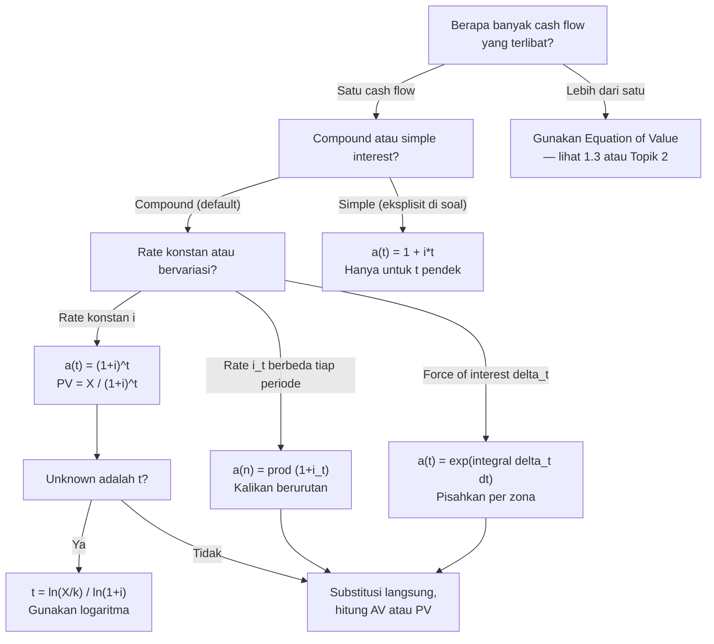

# 📘 1.4 — Accumulation and Present Value

> [!ABSTRACT] Ringkasan Cepat
> **Topik:** Accumulation and Present Value | **Bobot:** ~10–20% | **Difficulty:** Medium
> **Ref:** Vaaler Bab 1–2, Kellison Bab 1–2 | **Prereq:** [[1.1 Interest Rates and Discount Rates]], [[1.2 Effective, Nominal, and Force of Interest]]

## Section 0 — Pemetaan Topik

| Topik CF1 | Sub-topik ID | Skill Diuji | Bobot | Difficulty | Prerequisite | Connected Topics | Referensi |
|-----------|--------------|-------------|-------|------------|--------------|------------------|-----------|
| Topik 1: Nilai Waktu dari Uang | 1.4 | Menghitung AV dan PV untuk investasi tunggal dengan bunga konstan maupun variabel per periode; membangun dan menginterpretasi accumulation function $a(t)$; menghitung PV/AV dengan force of interest yang berubah; membedakan compound vs simple interest; menerapkan discount function $v(t)$ | 10–20% | Medium | [[1.1 Interest Rates and Discount Rates]], [[1.2 Effective, Nominal, and Force of Interest]] | [[1.3 Cash Flow Equations and Inflation]], [[1.5 NPV, IRR, DWRR, TWRR]], [[2.4 Continuous Annuities]], [[2.6 Varying Interest Rates]], [[3.1 Spot Rates and Forward Rates]] |  Vaaler Bab 1–2, Kellison Bab 1–2 |

## Section 1 — Intuisi

Bayangkan seseorang menyimpan uang di bank. Pertanyaan paling fundamental adalah: jika kamu menyimpan Rp 1 hari ini, berapa nilainya $t$ tahun dari sekarang? Jawaban atas pertanyaan ini adalah **accumulation function** $a(t)$ — sebuah fungsi yang merangkum seluruh mekanisme pertumbuhan investasi dari waktu ke waktu. Tidak peduli apakah bank menerapkan bunga sederhana, bunga majemuk, atau bahkan tingkat bunga yang berubah-ubah setiap tahunnya — $a(t)$ selalu bisa menjawab pertanyaan tersebut secara presisi.

Konsep kebalikannya adalah **present value (PV)**: jika seseorang berjanji membayar Rp 1 kepada kamu $t$ tahun dari sekarang, berapa nilainya hari ini? Ini adalah pertanyaan tentang **discount function** $v(t) = 1/a(t)$ — seberapa besar kita "menghukum" uang di masa depan karena harus menunggu. Semakin tinggi suku bunga dan semakin jauh jangka waktunya, semakin kecil nilai sekarang dari uang masa depan tersebut. Intuisi ini adalah fondasi dari seluruh matematika keuangan.

Yang membuat topik ini kaya adalah variasi mekanisme pertumbuhan. Dalam kenyataan, suku bunga sering berubah — bank mengubah rate-nya, instrumen berbeda punya tenor berbeda, dan obligasi pemerintah memiliki spot rate yang berbeda untuk setiap maturitas. Topik 1.4 mengajarkan cara menangani semua skenario ini secara sistematis: dari kasus paling sederhana (compound interest konstan) hingga yang paling umum (force of interest yang berubah sebagai fungsi waktu). Penguasaan topik ini adalah prasyarat langsung untuk [[2.6 Varying Interest Rates]], [[3.1 Spot Rates and Forward Rates]], dan seluruh bab obligasi.

## Section 2 — Definisi Formal

> [!NOTE] Definisi Matematis
> **Accumulation Function** $a(t)$: nilai akumulasi pada waktu $t$ dari investasi sebesar **1 unit** yang ditanamkan pada $t = 0$.
>
> Syarat wajib accumulation function yang valid:
> $$
> a(0) = 1, \quad a(t) > 0 \; \forall\, t \geq 0, \quad a(t) \text{ non-decreasing untuk } i \geq 0
> $$
>
> **Amount Function** $A(t)$: nilai akumulasi dari investasi awal sebesar $k$ unit:
> $$
> A(t) = k \cdot a(t)
> $$
>
> **Present Value** dari 1 unit yang jatuh tempo di $t$:
> $$
> PV = v(t) = \frac{1}{a(t)}
> $$
>
> **Present Value** dari jumlah $X$ yang jatuh tempo di $t$:
> $$
> PV = X \cdot v(t) = \frac{X}{a(t)}
> $$

### Variabel & Parameter

| Simbol | Makna | Catatan |
|--------|-------|---------|
| $a(t)$ | Accumulation function (dari $t=0$ ke $t$) | Selalu $a(0)=1$ |
| $A(t)$ | Amount function untuk investasi awal $k$ | $A(t) = k \cdot a(t)$ |
| $v(t)$ | Discount function $= 1/a(t)$ | Faktor diskonto dari $t$ ke $t=0$ |
| $k$ | Jumlah investasi awal (principal) | Unit moneter |
| $i_t$ | Suku bunga efektif untuk periode $[t-1,\, t]$ | Bisa berbeda tiap periode |
| $i$ | Suku bunga efektif konstan per periode | Kasus khusus $i_t = i$ untuk semua $t$ |
| $\delta_t$ | Force of interest pada waktu $t$ (kontinu) | Bisa berupa fungsi $t$ |
| $\delta$ | Force of interest konstan | Kasus khusus $\delta_t = \delta$ |
| $t$ | Waktu dalam tahun | Bisa non-integer untuk compound interest |
| $n$ | Jumlah periode diskret | Integer positif |

### Rumus Utama

**Compound Interest — accumulation function:**
$$
a(t) = (1+i)^t
$$
**Label:** Kasus paling umum dalam CF1. Berlaku untuk $t$ non-integer. Bunga dikompoundkan secara kontinu dalam waktu.

**Simple Interest — accumulation function:**
$$
a(t) = 1 + it
$$
**Label:** Hanya berlaku untuk $t \geq 0$. Tidak ada compounding antar-periode — bunga dihitung hanya atas pokok awal. Digunakan untuk periode sangat pendek atau instrumen pasar uang.

**Compound interest — future value (FV) dan present value (PV):**
$$
FV = k \cdot (1+i)^t, \qquad PV = \frac{k}{(1+i)^t} = k \cdot v^t
$$

**Accumulation dengan suku bunga berbeda per periode diskret:**
$$
a(n) = \prod_{t=1}^{n}(1 + i_t) = (1+i_1)(1+i_2)\cdots(1+i_n)
$$
**Label:** Jika suku bunga berubah setiap periode, faktor akumulasi adalah **perkalian** (bukan penjumlahan) faktor per periode. Digunakan dalam [[2.6 Varying Interest Rates]] dan [[3.1 Spot Rates and Forward Rates]].

**Present Value dengan suku bunga berbeda per periode:**
$$
v(n) = \frac{1}{a(n)} = \prod_{t=1}^{n} \frac{1}{1+i_t} = \frac{1}{(1+i_1)(1+i_2)\cdots(1+i_n)}
$$

**Accumulation dengan force of interest konstan $\delta$:**
$$
a(t) = e^{\delta t}
$$

**Accumulation dengan force of interest yang berubah $\delta_s$:**
$$
a(t) = e^{\int_0^t \delta_s \, ds}
$$
**Label:** Bentuk paling umum. Jika $\delta_s = \delta$ konstan, ini mereduksi ke $e^{\delta t}$.

**Hubungan antara $a(t)$ dan $\delta_t$:**
$$
\delta_t = \frac{a'(t)}{a(t)} = \frac{d}{dt} \ln a(t)
$$
**Label:** Force of interest adalah laju pertumbuhan relatif (instantaneous rate of return) dari accumulation function. Ini adalah definisi paling general dari $\delta_t$.

**Faktor akumulasi dari $t_1$ ke $t_2$ (bukan dari $0$):**
$$
a(t_1, t_2) = \frac{a(t_2)}{a(t_1)} = e^{\int_{t_1}^{t_2} \delta_s \, ds}
$$
**Label:** Untuk memindahkan nilai dari waktu $t_1$ ke $t_2$, gunakan **rasio** accumulation function, bukan $a(t_2)$ saja.

**PV investasi tunggal $X$ yang jatuh tempo di waktu $t$ (konteks umum):**
$$
PV = \frac{X}{a(t)} = X \cdot e^{-\int_0^t \delta_s \, ds}
$$

### Asumsi Eksplisit

- **Compound Interest Default:** Kecuali soal menyebut "simple interest," selalu gunakan compound interest.
- **Non-negative Interest Rate:** $i \geq 0$ (dan umumnya $i > 0$), sehingga $a(t)$ non-decreasing.
- **Investasi Awal Tunggal:** Topik ini fokus pada satu cash flow awal di $t=0$, bukan serangkaian pembayaran (lihat [[2.1 Annuity-Immediate and Annuity-Due]]).
- **Tidak Ada Biaya atau Pajak:** Frictionless market.
- **Konsistensi Unit Waktu:** $i_t$, $\delta_t$, dan $t$ harus dalam unit yang sama.

## Section 3 — Jembatan Logika

> [!TIP] Dari Time Diagram ke Equation of Value
> Setiap kalkulasi AV/PV berakar dari satu prinsip sederhana: **memindahkan nilai uang sepanjang garis waktu membutuhkan faktor yang tepat**.
>
> - Memindahkan **maju** (dari $t_1$ ke $t_2 > t_1$): **kalikan** dengan $a(t_1, t_2) = a(t_2)/a(t_1)$.
> - Memindahkan **mundur** (dari $t_2$ ke $t_1 < t_2$): **bagi** dengan $a(t_1, t_2)$, atau kalikan $v(t_1, t_2) = a(t_1)/a(t_2)$.
>
> Untuk compound interest konstan: $a(t_1, t_2) = (1+i)^{t_2 - t_1}$. Untuk varying rates: $a(t_1, t_2) = \prod_{s=t_1+1}^{t_2}(1+i_s)$. Untuk force of interest: $a(t_1, t_2) = e^{\int_{t_1}^{t_2}\delta_s\,ds}$.

> [!IMPORTANT] Focal Date dan Faktor Akumulasi Partial
> Ketika menghitung PV atau AV dengan suku bunga yang berbeda per periode, **jangan gunakan** $a(t) = (1+i)^t$ dengan rata-rata $i$. Suku bunga berbeda harus dikalikan secara **berurutan**. Misalnya, untuk menghitung AV di akhir tahun ke-3 dengan $i_1 = 5\%$, $i_2 = 6\%$, $i_3 = 7\%$:
> $$
> a(3) = (1.05)(1.06)(1.07) = 1.190931
> $$
> Bukan $(1+\bar{i})^3$ dengan $\bar{i} = (5\%+6\%+7\%)/3 = 6\%$, yang memberikan $(1.06)^3 = 1.191016$ — nilai yang hampir sama tapi secara prinsip salah.

**Derivasi $a(t) = (1+i)^t$ dari definisi compound interest:**

Pada compound interest, bunga per periode dihitung atas **nilai akumulasi saat itu** (bukan atas pokok awal saja). Jika nilai pada awal periode $k$ adalah $A_{k-1}$, maka di akhir periode $k$:
$$
A_k = A_{k-1}(1+i)
$$
Dengan $A_0 = k$ (investasi awal), iterasi menghasilkan:
$$
A_n = k(1+i)^n \implies a(n) = (1+i)^n
$$
Untuk waktu kontinu, sama saja: $a(t) = (1+i)^t$ (ekstensi natural dari $a(n)$ ke non-integer $t$).

**Derivasi hubungan $\delta_t = a'(t)/a(t)$:**

Force of interest $\delta_t$ didefinisikan sebagai laju pertumbuhan instan (instantaneous rate of return) dari 1 unit investasi. Secara formal:
$$
\delta_t = \lim_{h \to 0} \frac{a(t+h) - a(t)}{h \cdot a(t)} = \frac{a'(t)}{a(t)}
$$
Ini adalah derivative logaritmik dari $a(t)$:
$$
\delta_t = \frac{d}{dt} \ln a(t)
$$
Mengintegralkan kedua sisi dari $0$ ke $t$:
$$
\int_0^t \delta_s \, ds = \ln a(t) - \ln a(0) = \ln a(t)
$$
(karena $a(0) = 1$, sehingga $\ln a(0) = 0$). Eksponensiasikan:
$$
a(t) = e^{\int_0^t \delta_s \, ds}
$$
Derivasi ini menghubungkan force of interest (konsep diferensial) dengan accumulation function (konsep integral) secara lengkap.

**Mengapa simple interest $\neq$ compound interest untuk $t > 1$:**

Untuk $t = 1$: keduanya sama — $a(1) = 1 + i$ untuk keduanya.

Untuk $t > 1$: compound interest $> $ simple interest, karena:
$$
(1+i)^t > 1 + it \quad \forall\, t > 1, \; i > 0
$$
(Ini mengikuti dari konveksitas fungsi $(1+i)^t$ terhadap $t$, atau dari AM-GM inequality.)

Untuk $0 < t < 1$: simple interest $>$ compound interest (berguna untuk interpolasi jangka pendek).

> [!DANGER] Dilarang
> 1. **Dilarang menggunakan rata-rata suku bunga dalam perkalian:** Jika $i_1 = 4\%$ dan $i_2 = 6\%$, maka $a(2) = (1.04)(1.06) = 1.1024$, bukan $(1.05)^2 = 1.1025$. Perbedaannya kecil tetapi secara prinsip selalu salah.
> 2. **Dilarang menggunakan $a(t_2)$ saja untuk memindahkan nilai dari $t_1 \neq 0$:** Selalu gunakan $a(t_2)/a(t_1)$ sebagai faktor akumulasi dari $t_1$ ke $t_2$. Menggunakan $a(t_2)$ saja berarti mendiskonto semua the way back ke $t=0$, yang tidak tepat.
> 3. **Dilarang menggunakan simple interest untuk horizon lebih dari 1 periode dalam CF1 kecuali soal menyatakan secara eksplisit:** Semua formula standar di CF1 (anuitas, obligasi, amortisasi) menggunakan compound interest.

## Section 4 — Contoh Soal

### Soal A — Fundamental

Seseorang menginvestasikan Rp 8.000.000 pada $t = 0$. Suku bunga efektif tahunan adalah $i = 7.5\%$ (compound). Hitung: (a) nilai akumulasi pada $t = 10$ tahun, (b) present value di $t = 0$ dari Rp 15.000.000 yang jatuh tempo di $t = 8$ tahun, dan (c) berapa lama waktu yang diperlukan agar investasi awal Rp 8.000.000 tumbuh menjadi Rp 20.000.000?

> [!SUCCESS] Solusi Soal A
>
> **1. Identifikasi Variabel**
> - Investasi awal: $k = 8{,}000{,}000$
> - Suku bunga efektif: $i = 0.075$ per tahun (compound)
> - $v = 1/1.075$
> - Bagian (a): cari $A(10)$
> - Bagian (b): cari PV dari $X = 15{,}000{,}000$ di $t = 8$
> - Bagian (c): cari $t$ sehingga $A(t) = 20{,}000{,}000$
>
> **2. Time Diagram**
> ```
> t=0          t=8      t=10
>  |------------|--------|
> -8.000.000  15.000.000  A(10) = ?
>  PV(b) ←    ↓
> ```
>
> **3. Equation of Value**
>
> (a) $A(10) = k \cdot a(10) = 8{,}000{,}000 \times (1.075)^{10}$
>
> (b) $PV = 15{,}000{,}000 \times v^8 = 15{,}000{,}000 \times (1.075)^{-8}$
>
> (c) $8{,}000{,}000 \times (1.075)^t = 20{,}000{,}000$
>
> **4. Eksekusi Aljabar**
>
> **(a) AV pada $t = 10$:**
> $$
> A(10) = 8{,}000{,}000 \times (1.075)^{10}
> $$
> $$
> (1.075)^{10} = 2.06103\ldots
> $$
> $$
> A(10) = 8{,}000{,}000 \times 2.06103 = \mathbf{16{,}488{,}240}
> $$
>
> **(b) PV dari Rp 15.000.000 di $t = 8$:**
> $$
> PV = 15{,}000{,}000 \times (1.075)^{-8}
> $$
> $$
> (1.075)^{-8} = \frac{1}{(1.075)^8} = \frac{1}{1.78348} = 0.56069
> $$
> $$
> PV = 15{,}000{,}000 \times 0.56069 = \mathbf{8{,}410{,}350}
> $$
>
> **(c) Waktu untuk tumbuh ke Rp 20.000.000:**
> $$
> (1.075)^t = \frac{20{,}000{,}000}{8{,}000{,}000} = 2.5
> $$
> $$
> t \cdot \ln(1.075) = \ln(2.5)
> $$
> $$
> t = \frac{\ln(2.5)}{\ln(1.075)} = \frac{0.91629}{0.07232} = \mathbf{12.673 \text{ tahun}}
> $$
>
> **5. Verification**
>
> (a) Cek kewajaran: $8{,}000{,}000 \times 2 = 16{,}000{,}000$ sesuai doubling time $\approx 70/7.5 = 9.33$ tahun (Rule of 70). Pada $t=10$ (> doubling time), nilai $>$ Rp 16 juta. ✓
>
> (b) Cek: PV harus lebih kecil dari nilai nominalnnya (Rp 15 juta). Rp 8.410.350 $<$ 15.000.000. ✓
>
> (c) Cek: $(1.075)^{12.673} \approx e^{12.673 \times 0.07232} = e^{0.91629} = 2.5$. Maka $A = 8{,}000{,}000 \times 2.5 = 20{,}000{,}000$. ✓

> [!WARNING] Exam Tips — Soal A
> - **Target waktu:** 3–4 menit.
> - **Common trap (c):** Mencoba menyelesaikan $(1.075)^t = 2.5$ dengan aljabar linear — tidak bisa. Wajib gunakan logaritma: $t = \ln(2.5)/\ln(1.075)$.
> - **Shortcut Rule of 70:** Untuk estimasi kasar doubling time: $t_{double} \approx 70/i_{\%}$. Tidak untuk jawaban final, hanya untuk sanity check.
> - **Kalkulator:** Pastikan mode kalkulator dalam **desimal**, bukan persen, saat memasukkan $i = 0.075$.

---

### Soal B — Exam-Typical

Sebuah investasi tumbuh dengan suku bunga efektif tahunan yang **berbeda setiap tahun**: $i_1 = 5\%$, $i_2 = 7\%$, $i_3 = 4\%$, $i_4 = 8\%$, $i_5 = 6\%$.

(a) Hitung nilai akumulasi dari Rp 10.000.000 yang diinvestasikan pada $t = 0$ setelah 5 tahun.

(b) Seorang investor berbeda menempatkan Rp 10.000.000 pada $t = 0$ dalam instrumen yang memberikan compound interest konstan $i = 6\%$ per tahun selama 5 tahun. Bandingkan hasilnya. Manakah yang lebih menguntungkan, dan mengapa hasilnya tidak sama meskipun rata-rata rate kedua instrumen tampak identik?

> [!SUCCESS] Solusi Soal B
>
> **1. Identifikasi Variabel**
> - Investasi awal: $k = 10{,}000{,}000$
> - Suku bunga per tahun: $i_1=0.05$, $i_2=0.07$, $i_3=0.04$, $i_4=0.08$, $i_5=0.06$
> - Instrumen pembanding: $i = 6\%$ konstan selama 5 tahun
> - Cari: $A(5)$ untuk keduanya dan bandingkan
>
> **2. Time Diagram**
> ```
> t=0     t=1      t=2      t=3      t=4      t=5
>  |-------|--------|--------|--------|--------|
>  k    ×(1.05)  ×(1.07)  ×(1.04)  ×(1.08)  ×(1.06)
> ```
>
> **3. Equation of Value**
>
> Instrumen A (varying):
> $$
> A_A(5) = 10{,}000{,}000 \times (1+i_1)(1+i_2)(1+i_3)(1+i_4)(1+i_5)
> $$
>
> Instrumen B (konstan):
> $$
> A_B(5) = 10{,}000{,}000 \times (1.06)^5
> $$
>
> **4. Eksekusi Aljabar**
>
> **Instrumen A:**
> $$
> a_A(5) = (1.05)(1.07)(1.04)(1.08)(1.06)
> $$
>
> Hitung bertahap:
> $$
> (1.05)(1.07) = 1.1235
> $$
> $$
> 1.1235 \times 1.04 = 1.16844
> $$
> $$
> 1.16844 \times 1.08 = 1.261915
> $$
> $$
> 1.261915 \times 1.06 = 1.337630
> $$
>
> $$
> A_A(5) = 10{,}000{,}000 \times 1.337630 = \mathbf{13{,}376{,}300}
> $$
>
> **Instrumen B:**
> $$
> a_B(5) = (1.06)^5 = 1.338226
> $$
> $$
> A_B(5) = 10{,}000{,}000 \times 1.338226 = \mathbf{13{,}382{,}260}
> $$
>
> **Perbandingan:**
> $$
> A_B(5) - A_A(5) = 13{,}382{,}260 - 13{,}376{,}300 = \mathbf{5{,}960} \text{ (Rp)}
> $$
>
> Instrumen B (konstan 6%) lebih unggul tipis: Rp 5.960 lebih tinggi.
>
> **Mengapa tidak sama meskipun rata-rata rate = 6%?**
>
> Rata-rata aritmetika $\bar{i} = (5+7+4+8+6)/5 = 30/5 = 6\%$. Namun, accumulation function menggunakan **produk** faktor-faktor, bukan jumlah. Yang relevan adalah **geometric mean** rate $\bar{i}_G$:
> $$
> (1 + \bar{i}_G)^5 = (1.05)(1.07)(1.04)(1.08)(1.06) = 1.337630
> $$
> $$
> \bar{i}_G = (1.337630)^{1/5} - 1 = 1.059874 - 1 = 5.9874\%
> $$
>
> Geometric mean $5.9874\% < 6\%$ (arithmetic mean) — selalu berlaku $\bar{i}_G \leq \bar{i}$ dengan kesetaraan hanya jika semua rate sama (AM-GM inequality). Sehingga instrumen dengan rate konstan $= \bar{i}$ selalu **lebih menguntungkan atau sama** dibanding instrumen dengan rate bervariasi yang rata-ratanya sama.
>
> **5. Verification**
>
> Cek: geometric mean harus $\leq$ arithmetic mean. $5.9874\% \leq 6\%$. ✓
> Cek: $A_B \geq A_A$. $13{,}382{,}260 \geq 13{,}376{,}300$. ✓
> Selisih kecil (Rp 5.960 dari Rp 10 juta = 0.06%) — wajar karena variasi rate-nya tidak terlalu besar.

> [!WARNING] Exam Tips — Soal B
> - **Target waktu:** 5–6 menit.
> - **Common trap:** Mengira rate rata-rata aritmetika 6% → $a(5) = (1.06)^5$ untuk instrumen A. Ini salah. Varying rates harus **dikalikan** satu per satu, bukan dirata-ratakan dulu.
> - **Insight penting (sering diuji):** "Compound interest rate of $i$ for all periods" selalu menghasilkan AV $\geq$ "varying rates yang rata-ratanya $i$" karena $\bar{i}_G \leq \bar{i}$ (AM-GM). Ini adalah properti konveksitas fungsi eksponensial.
> - **Hitung bertahap:** Untuk menghindari kesalahan perkalian panjang, kalikan dua faktor per langkah dan catat hasilnya.

---

### Soal C — Challenging

Force of interest diberikan sebagai:
$$
\delta_t = \begin{cases} 0.05 + 0.01t & 0 \leq t \leq 4 \\ 0.09 - 0.005(t-4) & 4 < t \leq 8 \end{cases}
$$

(a) Hitung accumulation function $a(8)$ — nilai akumulasi dari 1 unit yang diinvestasikan di $t = 0$ hingga $t = 8$.

(b) Hitung present value di $t = 0$ dari Rp 25.000.000 yang jatuh tempo di $t = 8$.

(c) Tentukan force of interest ekuivalen konstan $\delta^*$ yang memberikan akumulasi yang sama selama 8 tahun.

> [!SUCCESS] Solusi Soal C
>
> **1. Identifikasi Variabel**
> - Force of interest: piecewise linear, dua zona: $[0,4]$ dan $(4,8]$
> - Di $t=0$: $\delta_0 = 0.05 + 0.01(0) = 0.05$
> - Di $t=4$: $\delta_4 = 0.05 + 0.01(4) = 0.09$ (dari zona 1); dan $0.09 - 0.005(4-4) = 0.09$ (dari zona 2) — kontinu di $t=4$. ✓
> - Di $t=8$: $\delta_8 = 0.09 - 0.005(8-4) = 0.09 - 0.020 = 0.07$
> - Cari: $a(8)$, PV, dan $\delta^*$
>
> **2. Time Diagram**
> ```
> t=0    t=4              t=8
>  |------|----------------|
>  δ tumbuh               δ menyusut
>  0.05 → 0.09            0.09 → 0.07
>
> AV = ?                  PV = 25.000.000
> ↑ akumulasi             ↓ diskonto ke t=0
> ```
>
> **3. Equation of Value**
>
> **(a) Accumulation function:**
> $$
> a(8) = e^{\int_0^8 \delta_t \, dt} = e^{\int_0^4 \delta_t \, dt + \int_4^8 \delta_t \, dt}
> $$
>
> **(b) Present value:**
> $$
> PV = \frac{25{,}000{,}000}{a(8)} = 25{,}000{,}000 \times e^{-\int_0^8 \delta_t\,dt}
> $$
>
> **(c) Force of interest ekuivalen:**
> $$
> e^{\delta^* \times 8} = a(8) \implies \delta^* = \frac{\ln a(8)}{8} = \frac{\int_0^8 \delta_t\,dt}{8}
> $$
>
> **4. Eksekusi Aljabar**
>
> **Integral zona 1: $\int_0^4 (0.05 + 0.01t)\,dt$**
> $$
> = \left[0.05t + \frac{0.01t^2}{2}\right]_0^4 = \left[0.05t + 0.005t^2\right]_0^4
> $$
> $$
> = 0.05(4) + 0.005(16) = 0.20 + 0.08 = 0.28
> $$
>
> **Integral zona 2: $\int_4^8 \left[0.09 - 0.005(t-4)\right]dt$**
>
> Substitusi $u = t - 4$, $du = dt$; batas: $u=0$ sampai $u=4$:
> $$
> \int_0^4 (0.09 - 0.005u)\,du = \left[0.09u - \frac{0.005u^2}{2}\right]_0^4
> $$
> $$
> = \left[0.09u - 0.0025u^2\right]_0^4 = 0.09(4) - 0.0025(16) = 0.36 - 0.04 = 0.32
> $$
>
> **Total integral:**
> $$
> \int_0^8 \delta_t\,dt = 0.28 + 0.32 = 0.60
> $$
>
> **(a) Accumulation function:**
> $$
> a(8) = e^{0.60} = 1.82212\ldots \approx \mathbf{1.8221}
> $$
>
> **(b) Present Value:**
> $$
> PV = \frac{25{,}000{,}000}{1.82212} = 25{,}000{,}000 \times 0.54881 = \mathbf{13{,}720{,}250}
> $$
>
> **(c) Force of interest ekuivalen konstan:**
> $$
> \delta^* = \frac{\int_0^8 \delta_t\,dt}{8} = \frac{0.60}{8} = \mathbf{0.075} = 7.5\% \text{ per tahun}
> $$
>
> Verifikasi: $e^{0.075 \times 8} = e^{0.60} = 1.8221 = a(8)$. ✓
>
> Ekuivalensi dengan effective annual rate: $i^* = e^{0.075} - 1 = 7.789\%$.
>
> **5. Verification**
>
> Cek kewajaran $\delta^*$: force of interest bergerak dari 5% ke 9% lalu turun ke 7%. Rata-rata sederhana $\approx (5+9+7)/3 \approx 7\%$ — $\delta^* = 7.5\%$ sedikit lebih tinggi karena periode rate tinggi (zona naik) sama panjangnya dengan zona turun, dan rata-ratanya 7.5% dari masing-masing zona. ✓
>
> Cek PV: $1.8221 \times 13{,}720{,}250 \approx 25{,}000{,}000$. ✓
>
> Cek kontinuitas $\delta_t$ di $t=4$: Zona 1: $\delta_4 = 0.05 + 0.04 = 0.09$. Zona 2: $\delta_{4^+} = 0.09 - 0 = 0.09$. Kontinu. ✓ (Penting untuk memastikan fungsi force of interest well-defined.)

> [!WARNING] Exam Tips — Soal C
> - **Target waktu:** 8–10 menit.
> - **Common trap 1:** Lupa memisahkan integral menjadi dua zona dan mengintegralkan satu fungsi tunggal untuk seluruh $[0,8]$. Selalu periksa titik-titik breakpoint fungsi $\delta_t$.
> - **Common trap 2:** Keliru arah diskonto — menggunakan $e^{+0.60}$ (akumulasi) sebagai faktor PV. Untuk PV, gunakan $e^{-\int \delta}$.
> - **Insight bagian (c):** Force of interest konstan ekuivalen $\delta^*$ adalah **rata-rata integral** dari $\delta_t$ — yaitu $\delta^* = \frac{1}{T}\int_0^T \delta_t\,dt$. Ini adalah "time-weighted average" force of interest.
> - **Substitusi $u = t - t_0$:** Selalu lakukan substitusi variabel jika batas integral tidak mulai dari 0 — ini menghindari kesalahan tanda dan batas.

## Section 5 — Verifikasi & Sanity Check

> [!CHECK] Properti Wajib Accumulation Function
> 1. **$a(0) = 1$ selalu:** Jika nilai $a(0) \neq 1$, ada kesalahan definisi atau substitusi.
> 2. **$a(t)$ non-decreasing untuk $i \geq 0$:** Jika $a(t_2) < a(t_1)$ untuk $t_2 > t_1$ dengan $i \geq 0$, ada kesalahan.
> 3. **Konsistensi dengan force of interest:** Selalu cek $\delta_t = a'(t)/a(t)$ — jika $\delta_t$ berubah tanda, $a(t)$ mungkin non-monoton.

> [!CHECK] Konsistensi AV dan PV
> 1. **PV < nilai nominal** (untuk $i > 0$ dan $t > 0$): $PV = X/a(t) < X$. Jika PV $\geq$ nilai nominal, ada error.
> 2. **AV > investasi awal** (untuk $i > 0$ dan $t > 0$): $A(t) = k \cdot a(t) > k$.
> 3. **Round-trip check:** $PV \times a(t) = X$. Akumulasikan kembali PV selama $t$ tahun harus menghasilkan $X$.

> [!CHECK] Varying Rates
> 1. **Perkalian, bukan penjumlahan:** $a(n) = \prod(1+i_t)$, bukan $\sum(1+i_t)$.
> 2. **Geometric mean $\leq$ arithmetic mean:** $\bar{i}_G \leq \bar{i}$. Jika dihitung sebaliknya, ada error.
> 3. **Partial accumulation:** Untuk memindahkan dari $t_1$ ke $t_2$: gunakan $a(t_2)/a(t_1)$, **bukan** $a(t_2-t_1)$ (ini hanya valid jika rate konstan).

> [!CHECK] Force of Interest
> 1. **Cek integral:** $\int_0^t \delta_s\,ds$ harus bernilai positif untuk $\delta_s > 0$ — artinya $a(t) > 1$. ✓
> 2. **Cek kontinuitas:** Jika $\delta_t$ piecewise, pastikan tidak ada diskontinuitas yang "tidak masuk akal" (dalam soal CF1, $\delta_t$ biasanya kontinu atau piecewise dengan batas yang jelas).
> 3. **$\delta^*$ sebagai rata-rata:** Force of interest konstan ekuivalen $= \frac{1}{T}\int_0^T \delta_t\,dt$ — selalu bisa dicek dengan membagi total integral dengan panjang interval.

### Metode Alternatif

**Accumulation Factor Decomposition:**

Untuk varying rates, faktor akumulasi dari $t=0$ ke $t=n$ bisa didekomposisi menjadi produk faktor-faktor partial:
$$
a(n) = a(0, t_1) \cdot a(t_1, t_2) \cdot a(t_2, n)
$$
di mana $a(t_j, t_{j+1}) = (1+i_{j+1})$ untuk compound interest diskret per tahun.

**"Rule of 70 / 72" untuk estimasi doubling time:**

$$
t_{double} \approx \frac{70}{i_{\%}} \quad \text{(Rule of 70)} \qquad \text{atau} \qquad t_{double} \approx \frac{72}{i_{\%}} \quad \text{(Rule of 72)}
$$

Rule of 72 sedikit lebih akurat untuk $i$ di kisaran 6–10%. Hanya untuk estimasi cepat — tidak untuk jawaban final.

**Logaritma Natural untuk Solve $t$:**

Jika unknown adalah $t$ dalam persamaan $(1+i)^t = k$:
$$
t = \frac{\ln k}{\ln(1+i)} = \frac{\ln k}{\delta}
$$

## Section 6 — Visualisasi Mental

**Grafik $a(t)$ untuk Berbagai Mekanisme Bunga:**

Bayangkan grafik dengan **sumbu X = waktu $t$** dan **sumbu Y = $a(t)$** (nilai akumulasi dari 1 unit). Semua kurva berawal dari titik yang sama: $(0, 1)$.

- **Compound interest** $a(t) = (1+i)^t$: Kurva **exponential** — cembung ke atas (convex), semakin curam seiring waktu. Ini adalah kurva default CF1.
- **Simple interest** $a(t) = 1+it$: Kurva **linear** — garis lurus dengan kemiringan $i$. Untuk $t < 1$: berada di atas kurva compound. Untuk $t > 1$: berada di bawah kurva compound.
- **Force of interest bervariasi** $a(t) = e^{\int_0^t \delta_s\,ds}$: Bentuk kurva bergantung pada $\delta_t$. Jika $\delta_t$ meningkat terhadap $t$, kurva semakin curam (super-exponential). Jika $\delta_t$ menurun, kurva melambat.

**Titik kritis:** Untuk $i = 10\%$, kurva compound dan simple bersilangan tepat di $t=1$ (keduanya memberikan $a(1) = 1.1$). Setelah $t=1$, compound selalu di atas simple.

**Grafik $v(t) = 1/a(t)$ (Discount Function):**

Sumbu X = $t$, sumbu Y = $v(t)$. Ini adalah cerminan (inverse) dari $a(t)$:
- Kurva mulai dari $(0, 1)$ dan **monoton menurun** mendekati nol saat $t \to \infty$.
- Kurva **concave** (cekung ke atas) untuk compound interest.
- Semakin tinggi $i$, kurva $v(t)$ semakin cepat turun — menggambarkan "hukuman" lebih berat untuk menunggu.

**Grafik $\delta_t$ vs $t$ (Force of Interest):**

Untuk Soal C: grafik $\delta_t$ berbentuk **trapesium** — naik linear dari 5% ke 9% pada $[0,4]$, lalu turun linear dari 9% ke 7% pada $[4,8]$. Area di bawah kurva $\delta_t$ vs $t$ adalah $\int_0^8 \delta_t\,dt = 0.60$ — langsung terbaca sebagai $\ln a(8)$.

### Hubungan Visual ↔ Rumus

**Area di bawah kurva $\delta_t$ = logaritma dari faktor akumulasi:**
$$
\text{Area} = \int_0^t \delta_s\,ds = \ln a(t) \quad \longleftrightarrow \quad a(t) = e^{\text{Area}}
$$

**Kemiringan kurva $a(t)$ di titik $t$ = $\delta_t \times a(t)$:**
$$
a'(t) = \delta_t \cdot a(t) \quad \longleftrightarrow \quad \delta_t = \frac{a'(t)}{a(t)}
$$

**Jarak vertikal antara kurva compound dan simple = keuntungan compounding:**
$$
(1+i)^t - (1+it) > 0 \quad \text{untuk } t > 1 \quad \longleftrightarrow \quad \text{convexity of }(1+i)^t
$$

## Section 7 — Jebakan Umum

> [!BUG] Kesalahan Unit Waktu
> **Contoh Salah:** Rate tahunan $i = 12\%$, investasi dihitung selama 18 bulan. Menggunakan $a(18) = (1.12)^{18}$ — salah karena $t$ harus dalam **tahun** jika $i$ per tahun.
>
> **Benar:** $t = 18 \text{ bulan} = 1.5 \text{ tahun}$. Maka $a(1.5) = (1.12)^{1.5} = 1.1849\ldots$. Atau konversi $i$ ke bulanan dulu: $i_{\text{bulan}} = (1.12)^{1/12} - 1$, lalu $a(18) = (1+i_{\text{bulan}})^{18}$.

> [!BUG] Kesalahan Konseptual
> 1. **Menggunakan $a(t_2)$ bukan $a(t_2)/a(t_1)$ untuk perpindahan dari $t_1 \neq 0$:** Faktor akumulasi dari $t_1$ ke $t_2$ adalah selalu $a(t_2)/a(t_1)$. Hanya jika $t_1 = 0$ kita bisa menggunakan $a(t_2)$ secara langsung.
> 2. **Mencampurkan simple dan compound interest dalam satu soal:** Jika soal tidak menyebut jenis bunga, default selalu **compound**. Jangan gunakan simple interest formula untuk horizon > 1 periode.
> 3. **Mengasumsikan $a(t_1 + t_2) = a(t_1) \times a(t_2)$ hanya untuk compound interest konstan:** Untuk varying rates, ini tidak berlaku kecuali rate kebetulan sama di kedua interval.
> 4. **Salah tanda eksponensial untuk PV:** $PV = X \cdot e^{-\int\delta\,dt}$ (tanda **negatif** di eksponen). Menggunakan tanda positif memberikan AV, bukan PV.

> [!BUG] Kesalahan Interpretasi Soal
> **Ambiguitas "nilai sekarang" vs "nilai pada $t=0$":** Keduanya sama jika focal date adalah $t=0$. Namun jika soal menyebut "nilai sekarang pada $t=3$" (mis. refinancing), artinya PV dihitung di $t=3$, bukan $t=0$.
>
> **Ambiguitas "effective rate" vs "nominal rate":** Frasa "bunga 12% per tahun" tanpa keterangan = **effective** $i=12\%$. "Bunga 12% per tahun dikompoundkan bulanan" = **nominal** $i^{(12)} = 12\%$ → efektif $= (1.01)^{12}-1 \neq 12\%$.

> [!CAUTION] Red Flags
> - **Kata "simple interest":** Ganti formula ke $a(t) = 1 + it$. Jangan gunakan $(1+i)^t$.
> - **Suku bunga berbeda per periode:** Trigger perkalian bertahap $(1+i_1)(1+i_2)\cdots$ — bukan pangkat rata-rata.
> - **"Force of interest $\delta_t$" sebagai fungsi $t$:** Trigger integral $\int \delta_t\,dt$. Pisahkan berdasarkan zona fungsi.
> - **Unknown adalah $t$ (waktu):** Trigger logaritma — $t = \ln(\cdot)/\ln(1+i)$. Tidak bisa diselesaikan aljabar biasa.
> - **"Equivalent constant rate":** Jika soal minta rate konstan yang ekuivalen dengan skenario varying, cari geometric mean (untuk rate diskret) atau rata-rata integral (untuk force of interest).

## Section 8 — Ringkasan Eksekutif

> [!SUMMARY] Must-Remember
> 1. **Accumulation function — compound interest:**
>    $$
>    a(t) = (1+i)^t, \qquad A(t) = k \cdot (1+i)^t
>    $$
> 2. **Present value — compound interest:**
>    $$
>    PV = \frac{X}{(1+i)^t} = X \cdot v^t
>    $$
> 3. **Varying rates per periode — kalikan berurutan:**
>    $$
>    a(n) = (1+i_1)(1+i_2)\cdots(1+i_n)
>    $$
> 4. **Accumulation dengan force of interest:**
>    $$
>    a(t) = e^{\int_0^t \delta_s\,ds}, \qquad \delta_t = \frac{a'(t)}{a(t)}
>    $$
> 5. **Faktor akumulasi partial (dari $t_1$ ke $t_2$):**
>    $$
>    a(t_1, t_2) = \frac{a(t_2)}{a(t_1)} = e^{\int_{t_1}^{t_2}\delta_s\,ds}
>    $$

### Kapan Digunakan

- **Trigger keywords:** "invested at $t=0$," "lump-sum investment," "grows at rate $i$," "accumulates to," "present value of single payment," "varying interest rates," "force of interest $\delta_t$," "how long until."
- **Tipe skenario soal:**
  - Menghitung AV atau PV dari investasi tunggal (satu cash flow).
  - Menentukan waktu $t$ yang diperlukan untuk mencapai target nilai.
  - Menghitung accumulation dengan rate berbeda per tahun.
  - Menghitung PV/AV dengan force of interest berupa fungsi $t$.
  - Menentukan "equivalent constant rate" dari skenario rate bervariasi.

### Kapan TIDAK Boleh Digunakan

- **Jika ada serangkaian pembayaran periodik:** Gunakan [[2.1 Annuity-Immediate and Annuity-Due]] — topik 1.4 hanya untuk cash flow tunggal.
- **Jika soal minta yield dari serangkaian cash flows (tidak tunggal):** Gunakan [[1.5 NPV, IRR, DWRR, TWRR]].
- **Untuk simple interest dengan $t$ fraksional non-trivial:** Gunakan $a(t) = 1 + it$ — bukan $(1+i)^t$ (walaupun secara teknis compound interest bisa untuk non-integer $t$, simple interest kadang dipakai untuk periode kurang dari 1 tahun di instrumen tertentu).

### Quick Decision Tree



---

> [!QUOTE] Follow-up Options
> 1. *"Berikan contoh soal accumulation dengan simple interest untuk periode fraksional kurang dari 1 tahun"*
> 2. *"Jelaskan hubungan [[1.4 Accumulation and Present Value]] dengan [[3.1 Spot Rates and Forward Rates]] melalui konsep forward accumulation factor"*
> 3. *"Buat flashcard 1-halaman untuk semua varian accumulation function dan kondisi penggunaannya"*

*📖 Ref: Vaaler Bab 1–2, Kellison Bab 1–2 | 🗓️ 2026-02-20 | #CF1 #AccumulationFunction #PresentValue #FutureValue #VariableInterest #ForceOfInterest*
