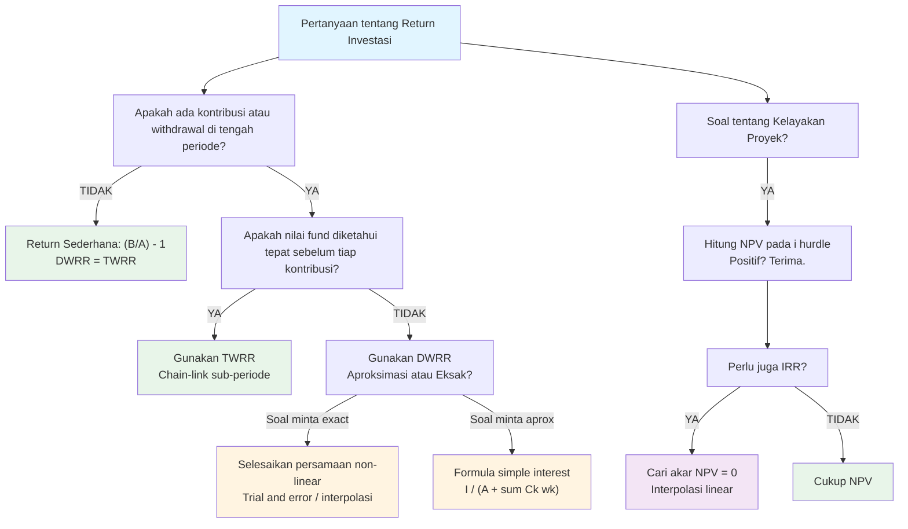

# 📘 1.5 — NPV, IRR, DWRR, dan TWRR

> [!ABSTRACT] Ringkasan Cepat
> **Topik:** Ukuran Imbal Hasil Investasi | **Bobot:** ~10–20% | **Difficulty:** Hard
> **Ref:** Vaaler Bab 1–2 / Kellison Bab 1–2, 11 | **Prereq:** [[Topik 1 — Nilai Waktu dari Uang]]

---

## Section 0 — Pemetaan Topik

| Field | Detail |
|-------|--------|
| **Topik CF1** | Topik 1 — Nilai Waktu dari Uang |
| **Sub-topik ID** | 1.5 — NPV, IRR, DWRR, TWRR |
| **Skill Diuji** | Calculate / Evaluate / Compare |
| **Bobot** | 10–20% |
| **Difficulty** | Hard |
| **Prerequisite** | [[Topik 1 — TVM Dasar]] · [[Topik 1.2 — Discount dan Accumulation Function]] |
| **Connected Topics** | [[Topik 2 — Anuitas dan Nilai Arus Kas]] · [[Topik 4 — Pengembalian Pinjaman]] |
| **Referensi** | Vaaler & Daniel (2009) Bab 1–2; Kellison (2006) Bab 1–2, Bab 11 |

---

## Section 1 — Intuisi

Bayangkan Anda seorang investor yang sedang memilih antara dua proyek: membuka kafe atau membeli ruko untuk disewakan. Keduanya membutuhkan modal awal dan menjanjikan arus kas di masa depan — tapi bagaimana Anda tahu mana yang lebih menguntungkan?

**NPV** adalah cara termudah: terjemahkan semua uang masa depan ke nilai hari ini (karena Rp 1 tahun depan tidak sama nilainya dengan Rp 1 sekarang), lalu kurangi modal awal. Kalau hasilnya positif, proyek itu menguntungkan. Kalau negatif, lupakan saja.

**IRR** adalah pertanyaan baliknya: "Pada suku bunga berapa semua arus kas masuk dan keluar menjadi impas?" Ini seperti mencari "yield" dari suatu investasi — dan Anda membandingkannya dengan biaya modal Anda. Kalau IRR lebih tinggi dari biaya modal, proyek layak jalan.

**DWRR (Dollar-Weighted Rate of Return)** adalah cara seorang *investor nyata* mengukur kinerjanya. Ia peduli pada *kapan* ia memasukkan atau menarik uangnya, karena timing itu memengaruhi hasilnya secara langsung. Inilah yang digunakan investor ritel untuk mengevaluasi apakah keputusan timing mereka bagus.

**TWRR (Time-Weighted Rate of Return)** adalah cara seorang *manajer investasi* diukur kinerjanya oleh klien. Manajer tidak bisa mengendalikan kapan klien memasukkan atau menarik dana — jadi hasil mereka harus diukur terlepas dari timing investasi. TWRR "menghapus" efek timing dan hanya mengukur kemampuan memilih aset.

Keempat ukuran ini saling melengkapi: NPV dan IRR untuk *keputusan* proyek, DWRR untuk *pengalaman investor*, TWRR untuk *kemampuan manajer*.

---

## Section 2 — Definisi Formal

> [!NOTE] Definisi Matematis — Net Present Value
> $$NPV(i) = \sum_{t=0}^{n} C_t \cdot v^t = \sum_{t=0}^{n} \frac{C_t}{(1+i)^t}$$
> di mana $C_t > 0$ berarti arus kas **masuk** (inflow) dan $C_t < 0$ berarti arus kas **keluar** (outflow).

**Variabel & Parameter:**

| Simbol | Makna |
|--------|-------|
| $C_t$ | Arus kas netto pada waktu $t$ (negatif = pengeluaran) |
| $i$ | Suku bunga diskonto efektif per periode |
| $v = \frac{1}{1+i}$ | Faktor diskonto |
| $n$ | Horizon waktu investasi |
| $NPV(i)$ | Net Present Value — fungsi dari $i$ |
| $IRR$ | Internal Rate of Return — nilai $i^*$ yang membuat $NPV = 0$ |
| $A$ | Nilai aset (fund) pada awal periode DWRR/TWRR |
| $B$ | Nilai aset pada akhir periode |
| $C_k$ | Kontribusi bersih (net contribution) pada waktu $t_k$ |
| $w_k$ | Bobot waktu kontribusi: $w_k = 1 - t_k$ (untuk DWRR) |

---

### Rumus Utama

**1. Net Present Value (NPV):**

$$NPV(i) = -C_0 + \sum_{t=1}^{n} \frac{C_t}{(1+i)^t}$$

di mana $C_0 > 0$ adalah investasi awal (sebagai nilai absolut).

**Aturan Keputusan NPV:**

$$\text{Terima proyek jika } NPV(i_{hurdle}) > 0$$

---

**2. Internal Rate of Return (IRR):**

$i^*$ adalah solusi dari:

$$NPV(i^*) = 0 \iff \sum_{t=0}^{n} C_t \cdot (1+i^*)^{-t} = 0$$

Atau ekuivalen dalam bentuk akumulasi (focal date $t = n$):

$$\sum_{t=0}^{n} C_t \cdot (1+i^*)^{n-t} = 0$$

**Aturan Keputusan IRR:**

$$\text{Terima proyek jika } IRR > i_{hurdle}$$

---

**3. Dollar-Weighted Rate of Return (DWRR):**

Metode eksak — selesaikan $i$ dari persamaan:

$$A(1+i) + \sum_{k} C_k (1+i)^{1-t_k} = B$$

Metode aproksimasi (Simple Interest — digunakan ketika soal tidak meminta eksak):

$$i_{DW} \approx \frac{I}{A + \sum_{k} C_k (1 - t_k)}$$

di mana:
- $I = B - A - \sum_k C_k$ adalah total *income* (perubahan nilai dikurangi kontribusi netto)
- $t_k$ = waktu kontribusi $C_k$ dalam satuan periode (antara 0 dan 1)
- $w_k = 1 - t_k$ = bobot waktu tersisa

---

**4. Time-Weighted Rate of Return (TWRR):**

$$1 + i_{TW} = \prod_{k=0}^{m-1} \left(\frac{B_k}{A_k + C_k}\right)$$

atau ekuivalen:

$$1 + i_{TW} = \frac{B_0'}{A_0} \cdot \frac{B_1'}{A_1} \cdots \frac{B_{m-1}'}{A_{m-1}}$$

di mana:
- $A_k$ = nilai fund **sesaat sebelum** kontribusi ke-$k$
- $C_k$ = kontribusi pada waktu $t_k$ (positif = deposit, negatif = withdrawal)
- $B_k$ = nilai fund **sesaat sebelum** kontribusi ke-$(k+1)$
- Sub-periode: dari $t_k$ sampai $t_{k+1}$

**Return sub-periode ke-$k$:**

$$r_k = \frac{B_k}{A_k + C_k} - 1$$

sehingga:

$$1 + i_{TW} = \prod_{k=0}^{m-1} (1 + r_k)$$

---

**Asumsi Eksplisit:**

- NPV & IRR: arus kas terjadi di **akhir periode** (kecuali dinyatakan lain)
- DWRR aproksimasi: asumsi **simple interest** untuk kontribusi dalam periode
- TWRR: nilai fund diketahui **tepat pada** saat setiap kontribusi/penarikan
- Semua suku bunga adalah **efektif per periode** kecuali dinyatakan lain

---

## Section 3 — Jembatan Logika

> [!TIP] Dari Time Diagram ke Equation of Value
>
> **Untuk NPV:** Setiap arus kas $C_t$ dipindahkan ke $t = 0$ dengan dikalikan faktor $v^t = (1+i)^{-t}$. NPV adalah jumlah aljabar seluruh arus kas yang sudah "ditranslasi" ke focal date yang sama. Ini adalah **equation of value di $t = 0$**.
>
> **Untuk IRR:** Anda membalik pertanyaannya — bukan "berapa nilai sekarang?" tapi "pada $i$ berapa NPV = 0?" Secara geometri, IRR adalah **akar** dari fungsi $NPV(i)$ yang merupakan polinomial dalam $v = \frac{1}{1+i}$.
>
> **Untuk DWRR:** Pikirkan seperti loan equation. Anda "meminjam" dana awal $A$, ada arus kas masuk $C_k$ di tengah, dan hasilnya adalah $B$ di akhir. Selesaikan suku bunga yang membuat semua konsisten — ini adalah **interest rate yang dialami investor**, termasuk dampak timing-nya.
>
> **Untuk TWRR:** Pisahkan periode menjadi sub-periode tanpa kontribusi. Di tiap sub-periode, hitung return bersih. Lalu **rangkaikan** (chain-link) semua return sub-periode dengan perkalian. Ini menghilangkan efek *kapan* uang masuk/keluar karena setiap sub-periode dihitung secara proporsional terhadap dana yang ada **saat itu**.

> [!IMPORTANT] Focal Date
> **NPV & IRR:** Focal Date di $t = 0$. Semua cash flow didiskon ke $t = 0$ dengan faktor $v^t$.
> **DWRR eksak:** Focal Date di $t = 1$ (akhir periode). Semua kontribusi diakumulasikan ke $t = 1$.
> **TWRR:** Tidak ada focal date tunggal — setiap sub-periode dievaluasi **relatif terhadap dirinya sendiri**, lalu hasilnya dikalikan berantai.

> [!IMPORTANT] Perbedaan Fundamental DWRR vs TWRR
>
> | Aspek | DWRR | TWRR |
> |-------|------|------|
> | **Dipengaruhi timing?** | **Ya** — sensitif terhadap kapan $C_k$ terjadi | **Tidak** — timing dieliminasi |
> | **Mengukur siapa?** | Pengalaman **investor** | Kemampuan **manajer dana** |
> | **Data yang dibutuhkan** | $A$, $B$, semua $C_k$ dan $t_k$ | $A$, $B$, nilai fund **tepat sebelum** tiap $C_k$ |
> | **Standar industri** | Akun ritel, KPR | Reksa dana, fund manager benchmark |

> [!DANGER] DILARANG
> - Mengasumsikan DWRR = TWRR — mereka hanya sama jika tidak ada kontribusi/penarikan di tengah periode
> - Menggunakan metode aproksimasi DWRR ketika soal meminta solusi eksak
> - Melupakan tanda negatif pada $C_0$ (investasi awal) saat menghitung NPV

---

## Section 4 — Contoh Soal

---

### Soal A — Fundamental (~30% difficulty)

Seorang investor mempertimbangkan proyek dengan arus kas berikut (dalam jutaan Rupiah):

| Waktu | 0 | 1 | 2 | 3 |
|-------|---|---|---|---|
| Arus Kas | $-100$ | $+40$ | $+50$ | $+30$ |

Hitunglah NPV proyek ini pada suku bunga $i = 10\%$ per tahun, dan tentukan apakah proyek layak diterima. Berapa pula nilai pendekatan IRR menggunakan interpolasi antara $i = 10\%$ dan $i = 15\%$?

> [!SUCCESS] Solusi Soal A
>
> **1. Identifikasi Variabel**
> - $C_0 = -100$, $C_1 = 40$, $C_2 = 50$, $C_3 = 30$ (dalam juta Rupiah)
> - $i = 10\%$ per tahun (efektif)
> - $v = \frac{1}{1.10}$
> - $n = 3$ tahun
>
> **2. Time Diagram**
> $$t: \quad 0 \qquad\qquad 1 \qquad\qquad 2 \qquad\qquad 3$$
> $$CF: \quad -100 \qquad\quad +40 \qquad\quad +50 \qquad\quad +30$$
>
> **3. Equation of Value** *(Focal Date: $t = 0$)*
>
> $$NPV(0.10) = C_0 + C_1 v + C_2 v^2 + C_3 v^3$$
>
> **4. Eksekusi Aljabar**
>
> $$NPV(0.10) = -100 + \frac{40}{1.10} + \frac{50}{(1.10)^2} + \frac{30}{(1.10)^3}$$
>
> $$= -100 + 36.3636 + 41.3223 + 22.5394$$
>
> $$= \boxed{0.2253 \text{ juta Rupiah}}$$
>
> Karena $NPV > 0$, proyek **layak diterima**.
>
> **Estimasi IRR via Interpolasi Linear:**
>
> Hitung $NPV(0.15)$:
> $$NPV(0.15) = -100 + \frac{40}{1.15} + \frac{50}{(1.15)^2} + \frac{30}{(1.15)^3}$$
> $$= -100 + 34.7826 + 37.8072 + 19.7256 = -7.6846$$
>
> Interpolasi linear antara $i = 10\%$ dan $i = 15\%$:
>
> $$IRR \approx 0.10 + \frac{0.2253}{0.2253 + 7.6846} \times (0.15 - 0.10)$$
>
> $$= 0.10 + \frac{0.2253}{7.9099} \times 0.05 = 0.10 + 0.001424$$
>
> $$IRR \approx \boxed{10.14\%}$$
>
> **5. Verification**
> - $NPV$ hampir nol di $i = 10\%$ → wajar bahwa $IRR \approx 10.14\%$, sangat dekat dengan $10\%$
> - $NPV(10\%) > 0$ dan $NPV(15\%) < 0$ → IRR pasti berada di antara $10\%$ dan $15\%$ ✓
> - Nilai $NPV$ sangat kecil di $10\%$, jadi IRR sangat dekat $10\%$ ✓

> [!WARNING] Exam Tips — Soal A
> - ⏱️ **Target waktu:** ~4 menit
> - ⚠️ **Common Trap:** Lupa negatifkan $C_0$. NPV bukan $\sum_{t=1}^{3}$ saja — investasi awal **harus** masuk sebagai arus kas keluar di $t = 0$
> - 🔑 **Shortcut Interpolasi:** Selalu cek bahwa satu nilai NPV positif dan satu negatif sebelum interpolasi. Jika keduanya positif atau negatif, rentang harus diperlebar

---

### Soal B — Exam-Typical (~60% difficulty)

Sebuah rekening investasi memiliki nilai awal $A = 1{,}000$ pada awal tahun. Pada pertengahan tahun ($t = 0.5$), pemilik menyetor tambahan $C = 200$. Pada akhir tahun, nilai rekening adalah $B = 1{,}320$.

**(a)** Hitunglah DWRR menggunakan **metode aproksimasi** (simple interest).

**(b)** Hitunglah TWRR, diketahui bahwa nilai rekening **tepat sebelum** setoran adalah $1{,}060$.

> [!SUCCESS] Solusi Soal B
>
> **Identifikasi Variabel:**
> - $A = 1{,}000$ (nilai awal, $t = 0$)
> - $C_1 = 200$ pada $t_1 = 0.5$
> - $B = 1{,}320$ (nilai akhir, $t = 1$)
> - Nilai fund tepat sebelum setoran: $A_1 = 1{,}060$
>
> ---
>
> **(a) DWRR — Metode Aproksimasi**
>
> **Total income (net growth):**
>
> $$I = B - A - C_1 = 1{,}320 - 1{,}000 - 200 = 120$$
>
> **Denominator (modal rata-rata tertimbang):**
>
> $$w_1 = 1 - t_1 = 1 - 0.5 = 0.5$$
>
> $$\text{Denominator} = A + C_1 \cdot w_1 = 1{,}000 + 200 \times 0.5 = 1{,}100$$
>
> **DWRR:**
>
> $$i_{DW} \approx \frac{I}{\text{Denominator}} = \frac{120}{1{,}100} = \boxed{10.91\%}$$
>
> ---
>
> **(b) TWRR — Chain-Linking**
>
> **Sub-periode 1:** $t = 0$ sampai $t = 0.5$
>
> - Awal sub-periode: $A_0 = 1{,}000$
> - Akhir sub-periode (sebelum setoran): $B_0 = 1{,}060$
>
> $$1 + r_1 = \frac{B_0}{A_0} = \frac{1{,}060}{1{,}000} = 1.060$$
>
> **Sub-periode 2:** $t = 0.5$ sampai $t = 1$
>
> - Awal sub-periode (setelah setoran): $A_1 = 1{,}060 + 200 = 1{,}260$
> - Akhir sub-periode: $B_1 = 1{,}320$
>
> $$1 + r_2 = \frac{B_1}{A_1} = \frac{1{,}320}{1{,}260} = 1.04762$$
>
> **Chain-link TWRR:**
>
> $$1 + i_{TW} = (1 + r_1)(1 + r_2) = 1.060 \times 1.04762 = 1.11047$$
>
> $$i_{TW} = \boxed{11.05\%}$$
>
> ---
>
> **Perbandingan:**
>
> | Metode | Hasil |
> |--------|-------|
> | DWRR (aprox) | $10.91\%$ |
> | TWRR | $11.05\%$ |
>
> TWRR > DWRR mengindikasikan bahwa **setoran masuk pada saat return rendah** (sub-periode pertama lebih baik, sub-periode kedua lebih rendah), sehingga dari perspektif investor, timing memperburuk hasil relatif terhadap kemampuan manajer.
>
> **5. Verification**
> - $I = 120$ positif → kedua metode harus menghasilkan return positif ✓
> - TWRR dan DWRR berbeda, sebagaimana diharapkan saat ada kontribusi ✓

> [!WARNING] Exam Tips — Soal B
> - ⏱️ **Target waktu:** ~6 menit
> - ⚠️ **Common Trap #1 — TWRR:** Denominator sub-periode 2 adalah $A_1 + C_1 = 1{,}060 + 200 = 1{,}260$, **bukan** $1{,}060$. Setoran ditambahkan ke nilai fund yang ada
> - ⚠️ **Common Trap #2 — DWRR:** $I$ dihitung sebagai $B - A - \sum C_k$, **bukan** $B - A$. Lupa mengurangkan kontribusi adalah kesalahan paling umum
> - 🔑 **Shortcut Interpretasi:** TWRR > DWRR jika kontribusi besar masuk saat return rendah, dan sebaliknya. Ini berguna untuk quick sanity check

---

### Soal C — Challenging (~90% difficulty)

Seorang manajer reksa dana mencatat aktivitas berikut selama satu tahun:

| Waktu | Kejadian | Nilai Fund |
|-------|----------|------------|
| $t = 0$ | Awal | $10{,}000$ |
| $t = 0.25$ | Tepat sebelum withdrawal | $10{,}500$ |
| $t = 0.25$ | Withdrawal $-2{,}000$ | — |
| $t = 0.75$ | Tepat sebelum deposit | $9{,}000$ |
| $t = 0.75$ | Deposit $+3{,}000$ | — |
| $t = 1$ | Akhir | $13{,}200$ |

**(a)** Hitunglah TWRR tahunan.

**(b)** Hitunglah DWRR menggunakan metode aproksimasi.

**(c)** Diskusikan implikasi perbedaan antara keduanya dari perspektif evaluasi kinerja manajer.

> [!SUCCESS] Solusi Soal C
>
> **Identifikasi Variabel:**
> - $A = 10{,}000$
> - $C_1 = -2{,}000$ pada $t_1 = 0.25$ (withdrawal)
> - $C_2 = +3{,}000$ pada $t_2 = 0.75$ (deposit)
> - $B = 13{,}200$
>
> ---
>
> **(a) TWRR — Tiga Sub-periode**
>
> **Sub-periode 1:** $t = 0$ hingga $t = 0.25$
>
> $$1 + r_1 = \frac{10{,}500}{10{,}000} = 1.0500$$
>
> **Sub-periode 2:** $t = 0.25$ hingga $t = 0.75$
>
> Fund setelah withdrawal: $10{,}500 - 2{,}000 = 8{,}500$
>
> Fund tepat sebelum deposit: $9{,}000$
>
> $$1 + r_2 = \frac{9{,}000}{8{,}500} = 1.05882$$
>
> **Sub-periode 3:** $t = 0.75$ hingga $t = 1$
>
> Fund setelah deposit: $9{,}000 + 3{,}000 = 12{,}000$
>
> Fund akhir: $13{,}200$
>
> $$1 + r_3 = \frac{13{,}200}{12{,}000} = 1.1000$$
>
> **Chain-link TWRR:**
>
> $$1 + i_{TW} = r_1 \times r_2 \times r_3 = 1.0500 \times 1.05882 \times 1.1000$$
>
> $$= 1.0500 \times 1.05882 \times 1.1000 = 1.22257$$
>
> $$i_{TW} = \boxed{22.26\%}$$
>
> ---
>
> **(b) DWRR — Metode Aproksimasi**
>
> **Total income:**
>
> $$I = B - A - C_1 - C_2 = 13{,}200 - 10{,}000 - (-2{,}000) - 3{,}000 = 2{,}200$$
>
> **Bobot waktu:**
>
> $$w_1 = 1 - t_1 = 1 - 0.25 = 0.75 \quad \text{(withdrawal, jadi negatif)}$$
>
> $$w_2 = 1 - t_2 = 1 - 0.75 = 0.25 \quad \text{(deposit, jadi positif)}$$
>
> **Denominator:**
>
> $$\text{Denom} = A + C_1 w_1 + C_2 w_2 = 10{,}000 + (-2{,}000)(0.75) + (3{,}000)(0.25)$$
>
> $$= 10{,}000 - 1{,}500 + 750 = 9{,}250$$
>
> **DWRR:**
>
> $$i_{DW} \approx \frac{2{,}200}{9{,}250} = \boxed{23.78\%}$$
>
> ---
>
> **(c) Interpretasi Perbedaan**
>
> | Metode | Hasil |
> |--------|-------|
> | TWRR | $22.26\%$ |
> | DWRR | $23.78\%$ |
>
> DWRR > TWRR berarti **timing kontribusi investor menguntungkan**:
>
> - Withdrawal $-2{,}000$ di $t = 0.25$: investor menarik dana **setelah** sub-periode pertama yang menghasilkan $+5\%$, sehingga ia menghindari risiko di sub-periode selanjutnya dengan modal yang lebih kecil
> - Deposit $+3{,}000$ di $t = 0.75$: investor memasukkan dana tepat sebelum sub-periode ketiga yang menghasilkan $+10\%$, sehingga ia "menangkap" return besar
>
> Dari perspektif evaluasi:
> - **TWRR (22.26%)** mencerminkan kemampuan murni manajer memilih aset — terlepas dari keputusan investor
> - **DWRR (23.78%)** mencerminkan bahwa investor secara kebetulan (atau dengan timing cerdas) mendapat hasil lebih baik dari kemampuan manajer sendiri
> - Dalam standar pelaporan reksa dana, **TWRR adalah standar yang benar** untuk membandingkan kinerja antar manajer
>
> **5. Verification**
> - Tiga sub-periode semuanya positif: 5%, 5.88%, 10% → total chain-linked harus > 5% ✓
> - DWRR > TWRR konsisten dengan interpretasi timing menguntungkan investor ✓
> - $I = 2{,}200$ positif (fund tumbuh setelah dikurangi kontribusi netto) ✓

> [!WARNING] Exam Tips — Soal C
> - ⏱️ **Target waktu:** ~10 menit
> - ⚠️ **Common Trap #1:** Pada DWRR, withdrawal harus masuk sebagai $C_1 = -2{,}000$ (negatif!). Banyak kandidat memakainya sebagai positif, mengacaukan $I$ dan denominator
> - ⚠️ **Common Trap #2:** Pada TWRR sub-periode 2, denominatornya adalah $10{,}500 - 2{,}000 = 8{,}500$ (nilai sesudah withdrawal), **bukan** $10{,}500$
> - ⚠️ **Common Trap #3:** Menghitung $I = B - A = 3{,}200$ (salah besar!) — harus dikurangi semua kontribusi netto
> - 🔑 **Mnemonik TWRR:** "Nilai Akhir Sub-periode **SEBELUM** perubahan" ÷ "Nilai Awal Sub-periode **SESUDAH** perubahan sebelumnya" — selalu bagi dengan nilai fund yang *siap diinvestasikan*

---

## Section 5 — Verifikasi & Sanity Check

> [!CHECK] Logic Check — NPV & IRR
> - $NPV(0) = \sum C_t$ = jumlah undiscounted cash flow (batas atas NPV)
> - $NPV(i) \to -C_0 < 0$ saat $i \to \infty$ (untuk investasi konvensional)
> - Untuk proyek **konvensional** (satu sign change dalam arus kas): IRR unik
> - Untuk proyek **non-konvensional**: bisa ada multiple IRR — gunakan NPV sebagai gantinya
> - $NPV$ menurun monoton dalam $i$ (untuk proyek konvensional) → cek IRR dengan interpolasi cukup akurat jika rentang tidak terlalu lebar

> [!CHECK] Logic Check — DWRR vs TWRR
> - Jika **tidak ada** kontribusi/withdrawal: DWRR = TWRR = $\frac{B}{A} - 1$
> - Kontribusi besar masuk **sebelum** periode return tinggi: DWRR > TWRR
> - Kontribusi besar masuk **sebelum** periode return rendah: DWRR < TWRR
> - TWRR **selalu konsisten** dengan geometric linking — tidak terpengaruh timing
> - Untuk evaluasi manajer: selalu gunakan TWRR

> [!CHECK] Logic Check — DWRR Aproksimasi
> - Aproksimasi valid ketika kontribusi **kecil** relatif terhadap fund size
> - Semakin jauh $t_k$ dari 0.5, semakin signifikan efek timing — aproksimasi kurang akurat
> - Jika soal menyebut "dollar-weighted" tanpa kata "exact": **gunakan aproksimasi**
> - Jika soal menyebut "solve for $i$" atau "exact": **selesaikan persamaan non-linear**

**Metode Alternatif — IRR:**

Untuk polinomial derajat rendah ($n \leq 2$), IRR bisa diselesaikan secara analitik. Contoh untuk $n = 2$:

$$-C_0 + C_1 v + C_2 v^2 = 0$$

Ini adalah kuadrat dalam $v$ — selesaikan dengan rumus kuadrat, lalu $i = \frac{1}{v} - 1$.

Untuk $n \geq 3$: **interpolasi linear** adalah metode standar CF1. Interpolasi lebih akurat jika dua titik dipilih dekat dengan akar (rentang kecil, misal 2–3%).

---

## Section 6 — Visualisasi Mental

**Grafik $NPV(i)$ sebagai Fungsi Suku Bunga:**

Bayangkan kurva yang berawal dari $NPV(0) = \sum C_t$ (positif untuk proyek layak) di sumbu Y, kemudian **menurun ke kanan** secara konveks, memotong sumbu X di satu titik — itulah IRR. Untuk $i <$ IRR, kurva berada di atas sumbu X (NPV positif, terima proyek). Untuk $i >$ IRR, kurva berada di bawah sumbu X (NPV negatif, tolak proyek).

**Hubungan Visual ↔ Rumus:**
- Titik potong sumbu Y: $NPV(0) = \sum C_t$ — ini adalah total undiscounted profit
- Titik potong sumbu X: $i = IRR$ — ini adalah akar persamaan $NPV(i) = 0$
- Kemiringan kurva di IRR proporsional dengan **Macaulay Duration** aset (topik terkait: [[Topik 5 — Model Penentuan Harga Obligasi]])

---

**Diagram Timeline TWRR — Konsep Sub-periode:**

Pikirkan timeline sebagai **rantai** dengan sambungan di setiap titik kontribusi:

$$\underbrace{[t_0 \to t_1]}_{r_1} \xrightarrow{C_1} \underbrace{[t_1 \to t_2]}_{r_2} \xrightarrow{C_2} \underbrace{[t_2 \to t_3]}_{r_3}$$

Setiap sambungan "memotong" dan "menyambung kembali" dengan fund size yang baru. Return tiap sub-rantai adalah murni kinerja manajer. Perkalian berantai adalah konsekuensi logika bunga majemuk: return dikalikan, bukan dijumlahkan.

**Hubungan Visual ↔ Rumus:**
- Tiap segmen rantai = satu faktor $(1 + r_k)$ dalam produk TWRR
- Sambungan kontribusi = titik di mana denominator "direset" dengan fund size baru
- Panjang rantai keseluruhan = $(1 + i_{TW})$ — return manajer murni selama setahun

---

## Section 7 — Jebakan Umum

> [!BUG] Kesalahan Tanda pada Kontribusi — The #1 DWRR Killer
> - ✗ Memperlakukan withdrawal sebagai positif dalam formula DWRR
> - ✓ Withdrawal = $C_k < 0$ (uang **keluar** dari fund)
> - Konsekuensi: $I = B - A - \sum C_k$ — jika $C_k$ withdrawal negatif, maka $-C_k$ menjadi **positif**, mengurangi $I$ lebih kecil dari kelihatannya

> [!BUG] Kesalahan Denominator TWRR Sub-periode
> - ✗ Menggunakan nilai fund **sebelum** kontribusi sebagai pembagi
> - ✓ Pembagi sub-periode $k$ adalah nilai fund **setelah** kontribusi pada $t_{k-1}$
> - Formula: $1 + r_k = \frac{\text{Nilai tepat SEBELUM kontribusi } t_k}{\text{Nilai tepat SESUDAH kontribusi } t_{k-1}}$

> [!BUG] Multiple IRR — Proyek Non-Konvensional
> - Terjadi ketika arus kas berganti tanda lebih dari sekali (e.g., $-, +, -, +$)
> - Descartes' Rule of Signs: jumlah IRR positif $\leq$ jumlah pergantian tanda
> - ✗ Jangan laporkan satu IRR untuk proyek non-konvensional tanpa analisis
> - ✓ Gunakan NPV sebagai ukuran keputusan utama jika ada multiple IRR

> [!BUG] Aproksimasi vs Eksak DWRR
> - ✗ Menggunakan aproksimasi padahal soal meminta nilai eksak (solve for $i$)
> - ✓ Baca soal: "approximate" atau "simple interest" → aproksimasi; "find $i$" atau "exact" → selesaikan persamaan
> - Metode eksak: $A(1+i) + C_1(1+i)^{1-t_1} + \ldots = B$ — ini adalah persamaan non-linear, selesaikan dengan trial-and-error atau interpolasi

> [!CAUTION] Red Flags — Kata Kunci Waspada
> - **"Dollar-weighted"** → DWRR. Pastikan tanda kontribusi benar
> - **"Time-weighted"** → TWRR. Pastikan nilai fund tersedia tepat sebelum tiap kontribusi
> - **"Fund value just before/just after"** → sinyal TWRR; perhatikan timing "before" vs "after"
> - **"Hurdle rate" / "cost of capital"** → bandingkan IRR dengan nilai ini
> - **"Multiple sign changes"** → waspada multiple IRR, pertimbangkan beralih ke NPV
> - **"Yield on the investment"** → bisa IRR atau DWRR — baca konteks

---

## Section 8 — Ringkasan Eksekutif

> [!SUMMARY] Must-Remember
> 1. $NPV(i) = \sum_{t=0}^{n} C_t \cdot v^t$, terima jika $NPV > 0$; IRR adalah $i^*$ dengan $NPV(i^*) = 0$
> 2. $i_{DW} \approx \dfrac{B - A - \sum C_k}{A + \sum C_k(1-t_k)}$ — sensitif terhadap timing investor
> 3. $1 + i_{TW} = \prod_{k=1}^{m}(1 + r_k)$ — chain-link return sub-periode, eliminasi timing
> 4. TWRR = standar evaluasi **manajer**; DWRR = pengalaman **investor**
> 5. DWRR = TWRR hanya jika **tidak ada** kontribusi atau withdrawal di tengah periode

**Kapan Digunakan:**

- 🔑 **Trigger keywords NPV/IRR:** "proyek layak", "accept or reject", "cost of capital", "yield of investment"
- 🔑 **Trigger keywords DWRR:** "dollar-weighted", "investor's return", "net return on account"
- 🔑 **Trigger keywords TWRR:** "time-weighted", "fund manager performance", "chain-linked return"
- 📋 **Scenario types:** Perbandingan proyek, evaluasi kinerja reksa dana, analisis akun investasi dengan top-up/penarikan berkala

**Kapan TIDAK Boleh Digunakan:**

- IRR sebagai satu-satunya kriteria: **jangan** untuk proyek mutually exclusive dengan skala berbeda — gunakan NPV incremental
- DWRR aproksimasi: **jangan** ketika kontribusi besar terjadi di awal atau akhir periode (bobot ekstrim menghasilkan aproksimasi buruk)
- TWRR: **jangan** ketika nilai fund tidak diketahui tepat pada titik kontribusi — gunakan DWRR sebagai gantinya

**Quick Decision Tree:**

---

> [!QUOTE] Follow-up Options
> 1. *"Berikan contoh soal variasi DWRR eksak — misal: solve for exact i dengan 3 kontribusi"*
> 2. *"Jelaskan hubungan [[NPV dan IRR]] dengan [[Topik 5 — Model Penentuan Harga Obligasi]] (yield to maturity sebagai IRR obligasi)"*
> 3. *"Buat flashcard 1-halaman untuk DWRR vs TWRR — tabel perbandingan dan formula cepat"*
> 4. *"Jelaskan kasus Multiple IRR dan bagaimana Modified IRR (MIRR) menanganinya [BEYOND CF1]"*

*📖 Referensi: Vaaler & Daniel (2009) Bab 1–2; Kellison (2006) Bab 1–2, Bab 11 | 🗓️ Dibuat: 2026-02-17 | #CF1 #NilaiWaktuUang #NPV #IRR #DWRR #TWRR*
