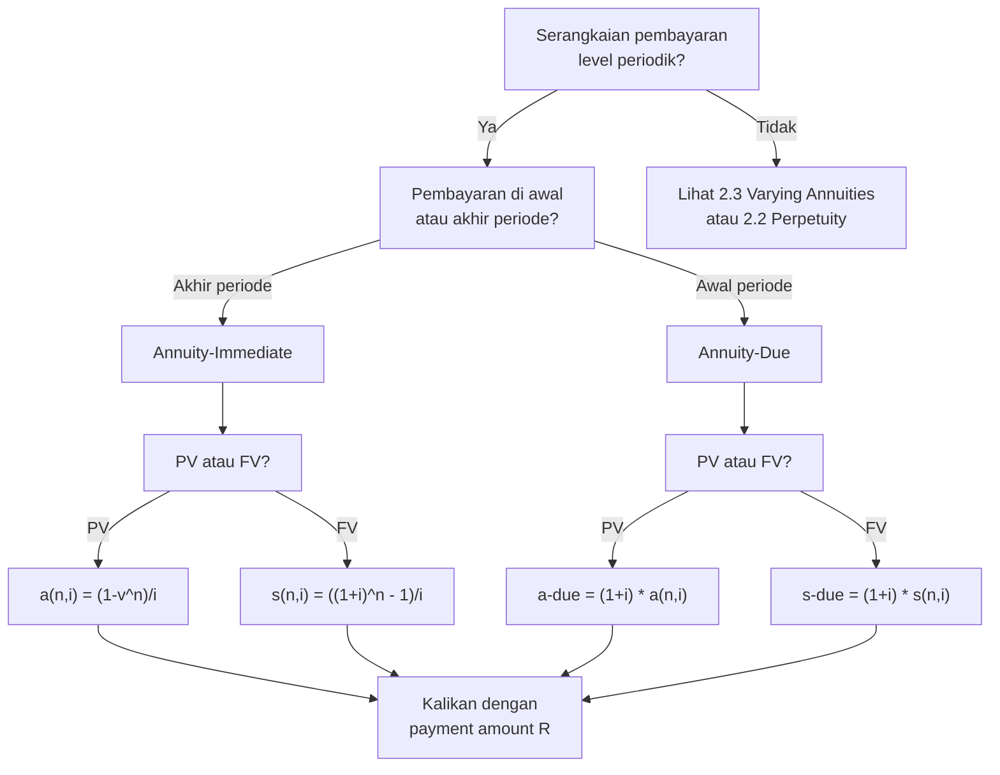

# 📘 2.1 — Annuity-Immediate and Annuity-Due

> [!ABSTRACT] Ringkasan Cepat
> **Topik:** Annuity-Immediate and Annuity-Due | **Bobot:** ~20–30% | **Difficulty:** Medium
> **Ref:** Vaaler Bab 3–4, Kellison Bab 3–4 | **Prereq:** [[1.1 Interest Rates and Discount Rates]], [[1.4 Accumulation and Present Value]]

## Section 0 — Pemetaan Topik

| Topik CF1 | Sub-topik ID | Skill Diuji | Bobot | Difficulty | Prerequisite | Connected Topics | Referensi |
|-----------|--------------|-------------|-------|------------|--------------|------------------|-----------|
| Topik 2: Anuitas dan Nilai Arus Kas | 2.1 | Menghitung $a_{\overline{n}\|}$, $\ddot{a}_{\overline{n}\|}$, $s_{\overline{n}\|}$, $\ddot{s}_{\overline{n}\|}$; hubungan antar keempat simbol; solve unknown $n$, $i$, atau payment; aplikasi pada pinjaman, tabungan, dan obligasi | 20–30% | Medium | [[1.1 Interest Rates and Discount Rates]], [[1.4 Accumulation and Present Value]] | [[2.2 Perpetuity]], [[2.3 Varying Annuities]], [[2.5 Deferred Annuities]], [[4.2 Amortization Method]], [[5.1 Bond Pricing]] | Vaaler Bab 3–4, Kellison Bab 3–4 |

## Section 1 — Intuisi

Bayangkan kamu menabung Rp 1.000.000 setiap bulan selama 5 tahun untuk membeli rumah. Pertanyaan pertama: berapa total nilai tabungan kamu di akhir tahun ke-5 (termasuk bunga)? Pertanyaan kedua: berapa nilai sekarang dari seluruh rencana tabungan itu? Dua pertanyaan ini adalah inti dari konsep **anuitas**—serangkaian pembayaran yang sama besar, dibuat secara periodik, dan kita ingin tahu nilai totalnya baik di masa depan maupun di masa kini.

Perbedaan antara **annuity-immediate** dan **annuity-due** terletak pada *kapan* pembayaran pertama dilakukan. Jika kamu membayar cicilan KPR di **akhir setiap bulan** (seperti kebanyakan cicilan bank), itu adalah annuity-immediate. Jika kamu membayar sewa apartemen di **awal setiap bulan** (seperti kebanyakan kontrak sewa), itu adalah annuity-due. Perbedaan satu periode ini terlihat kecil, tetapi berdampak signifikan pada nilai present value dan future value—karena uang yang diterima lebih awal punya lebih banyak waktu untuk berbunga.

Keempat simbol anuitas—$a_{\overline{n}|}$, $\ddot{a}_{\overline{n}|}$, $s_{\overline{n}|}$, $\ddot{s}_{\overline{n}|}$—adalah fondasi dari hampir semua kalkulasi keuangan di CF1. Obligasi menggunakan $a_{\overline{n}|}$ untuk menghitung PV coupon stream. Pinjaman menggunakan $a_{\overline{n}|}$ untuk menentukan cicilan bulanan. Tabungan pensiun menggunakan $s_{\overline{n}|}$ untuk menghitung akumulasi. Menguasai keempat simbol ini—dan hubungan di antara mereka—adalah kunci untuk menyelesaikan soal-soal Topik 2 dengan cepat dan akurat.

## Section 2 — Definisi Formal

> [!NOTE] Definisi Matematis
> **Annuity-Immediate:** $n$ pembayaran sebesar 1 unit, masing-masing di **akhir** periode 1, 2, ..., $n$.
>
> **Present Value (PV):**
> $$
> a_{\overline{n}|i} = v + v^2 + \cdots + v^n = \frac{1 - v^n}{i}
> $$
>
> **Future Value (FV) di $t = n$:**
> $$
> s_{\overline{n}|i} = 1 + (1+i) + \cdots + (1+i)^{n-1} = \frac{(1+i)^n - 1}{i}
> $$
>
> **Annuity-Due:** $n$ pembayaran sebesar 1 unit, masing-masing di **awal** periode 1, 2, ..., $n$ (yaitu di $t = 0, 1, \ldots, n-1$).
>
> **Present Value (PV):**
> $$
> \ddot{a}_{\overline{n}|i} = 1 + v + v^2 + \cdots + v^{n-1} = \frac{1 - v^n}{d}
> $$
>
> **Future Value (FV) di $t = n$:**
> $$
> \ddot{s}_{\overline{n}|i} = (1+i) + (1+i)^2 + \cdots + (1+i)^n = \frac{(1+i)^n - 1}{d}
> $$

### Variabel & Parameter

| Simbol | Makna | Catatan |
|--------|-------|---------|
| $n$ | Jumlah periode pembayaran | Integer positif |
| $i$ | Suku bunga efektif per periode | Decimal, $i > 0$ |
| $d$ | Tingkat diskonto efektif $= i/(1+i) = 1 - v$ | Decimal |
| $v$ | Faktor diskonto $= 1/(1+i)$ | $0 < v < 1$ |
| $a_{\overline{n}\|i}$ | PV annuity-immediate (pembayaran di akhir periode) | Dibaca: "a angle n at i" |
| $s_{\overline{n}\|i}$ | FV annuity-immediate di $t = n$ | Dibaca: "s angle n at i" |
| $\ddot{a}_{\overline{n}\|i}$ | PV annuity-due (pembayaran di awal periode) | Dibaca: "a-double-dot angle n at i" |
| $\ddot{s}_{\overline{n}\|i}$ | FV annuity-due di $t = n$ | Dibaca: "s-double-dot angle n at i" |

### Rumus Utama

$$
a_{\overline{n}|i} = \frac{1 - v^n}{i}
$$
**Label:** PV annuity-immediate — present value dari $n$ pembayaran unit di akhir setiap periode.

$$
s_{\overline{n}|i} = \frac{(1+i)^n - 1}{i}
$$
**Label:** FV annuity-immediate — accumulated value di $t=n$ dari $n$ pembayaran unit di akhir setiap periode.

$$
\ddot{a}_{\overline{n}|i} = \frac{1 - v^n}{d} = (1+i) \cdot a_{\overline{n}|i}
$$
**Label:** PV annuity-due — present value dari $n$ pembayaran unit di awal setiap periode.

$$
\ddot{s}_{\overline{n}|i} = \frac{(1+i)^n - 1}{d} = (1+i) \cdot s_{\overline{n}|i}
$$
**Label:** FV annuity-due — accumulated value di $t=n$ dari $n$ pembayaran unit di awal setiap periode.

**Hubungan Kritis antara Simbol:**

$$
\ddot{a}_{\overline{n}|i} = (1+i) \cdot a_{\overline{n}|i}
$$
$$
\ddot{s}_{\overline{n}|i} = (1+i) \cdot s_{\overline{n}|i}
$$
$$
s_{\overline{n}|i} = a_{\overline{n}|i} \cdot (1+i)^n
$$
$$
\ddot{s}_{\overline{n}|i} = \ddot{a}_{\overline{n}|i} \cdot (1+i)^n
$$
$$
\frac{1}{a_{\overline{n}|i}} = \frac{1}{s_{\overline{n}|i}} + i
$$

**Label:** Relasi antar keempat simbol—annuity-due selalu $(1+i)$ kali annuity-immediate; FV adalah PV dikalikan $(1+i)^n$.

### Asumsi Eksplisit

- **Constant Interest Rate:** $i$ konstan selama seluruh $n$ periode.
- **Level Payments:** Setiap pembayaran sama besar (1 unit dalam notasi standar; kalikan dengan $R$ untuk pembayaran $R$).
- **End-of-Period (Immediate):** Pembayaran pertama di $t=1$ untuk annuity-immediate.
- **Beginning-of-Period (Due):** Pembayaran pertama di $t=0$ untuk annuity-due.
- **No Default:** Semua pembayaran dilakukan sesuai jadwal.

## Section 3 — Jembatan Logika

> [!TIP] Dari Time Diagram ke Equation of Value
> **Annuity-Immediate:** Pembayaran di $t=1, 2, \ldots, n$. Setiap pembayaran 1 unit di-discount ke $t=0$:
> - Pembayaran di $t=1$: PV $= v^1$
> - Pembayaran di $t=2$: PV $= v^2$
> - ...
> - Pembayaran di $t=n$: PV $= v^n$
>
> Total PV $= v + v^2 + \cdots + v^n$ — ini adalah **deret geometri** dengan rasio $v$ dan $n$ suku.
>
> **Annuity-Due:** Pembayaran di $t=0, 1, \ldots, n-1$. Pembayaran pertama di $t=0$ tidak perlu di-discount (PV $= 1$). Sisanya sama seperti annuity-immediate tetapi "dimajukan" satu periode. Sehingga $\ddot{a}_{\overline{n}|} = (1+i) \cdot a_{\overline{n}|}$—annuity-due selalu lebih besar karena pembayaran lebih awal.

> [!IMPORTANT] Focal Date
> - **PV ($a$ dan $\ddot{a}$):** Focal date di $t=0$ (satu periode **sebelum** pembayaran pertama untuk annuity-immediate; **tepat saat** pembayaran pertama untuk annuity-due).
> - **FV ($s$ dan $\ddot{s}$):** Focal date di $t=n$ (tepat saat pembayaran terakhir untuk annuity-immediate; satu periode **setelah** pembayaran terakhir untuk annuity-due).

**Derivasi $a_{\overline{n}|i}$ dari Deret Geometri:**

$$
a_{\overline{n}|i} = v + v^2 + \cdots + v^n = v \cdot \frac{1 - v^n}{1 - v}
$$

Gunakan $v = 1/(1+i)$ dan $1 - v = d = i \cdot v$:

$$
a_{\overline{n}|i} = v \cdot \frac{1 - v^n}{i \cdot v} = \frac{1 - v^n}{i}
$$

**Derivasi $s_{\overline{n}|i}$ dari Deret Geometri:**

$$
s_{\overline{n}|i} = 1 + (1+i) + (1+i)^2 + \cdots + (1+i)^{n-1}
$$

Deret geometri dengan rasio $(1+i)$ dan $n$ suku:

$$
s_{\overline{n}|i} = \frac{(1+i)^n - 1}{(1+i) - 1} = \frac{(1+i)^n - 1}{i}
$$

**Hubungan FV dan PV:**

$$
s_{\overline{n}|i} = a_{\overline{n}|i} \cdot (1+i)^n
$$

Ini masuk akal: PV di-accumulate selama $n$ periode menghasilkan FV.

**Derivasi $\ddot{a}$ dari $a$:**

Annuity-due = annuity-immediate dimajukan 1 periode:

$$
\ddot{a}_{\overline{n}|i} = (1+i) \cdot a_{\overline{n}|i} = \frac{1-v^n}{d}
$$

karena $d = i \cdot v = i/(1+i)$, sehingga $i = d(1+i)$ dan $\frac{1-v^n}{i} \cdot (1+i) = \frac{1-v^n}{d}$.

> [!DANGER] Dilarang
> 1. **Menulis $a_{\overline{n}|} = (1-v^n)/d$ (SALAH untuk annuity-immediate):** Formula dengan $d$ di denominator adalah untuk **annuity-due** ($\ddot{a}$), bukan annuity-immediate ($a$). Annuity-immediate menggunakan $i$ di denominator.
> 2. **Mengasumsikan FV annuity-due di $t=n$ sama dengan FV annuity-immediate:** $\ddot{s}_{\overline{n}|} = (1+i) \cdot s_{\overline{n}|}$ — annuity-due FV lebih besar karena pembayaran terakhir masih berbunga satu periode ekstra.
> 3. **Menggunakan $a_{\overline{n}|}$ untuk pembayaran di awal periode:** Jika soal menyebut "pembayaran di awal periode" atau "beginning of period," gunakan $\ddot{a}_{\overline{n}|}$, bukan $a_{\overline{n}|}$.

## Section 4 — Contoh Soal

### Soal A — Fundamental

Seorang investor akan menerima pembayaran sebesar Rp 500.000 setiap akhir tahun selama 8 tahun. Suku bunga efektif adalah 6% per tahun. Hitunglah:
(a) Present value dari seluruh pembayaran (di $t=0$)
(b) Future value dari seluruh pembayaran (di $t=8$)

**Data yang diberikan:**
- Pembayaran $R = 500.000$ per tahun, di akhir setiap tahun (annuity-immediate)
- $n = 8$ tahun
- $i = 6\%$ per tahun efektif

> [!SUCCESS] Solusi Soal A
> 
> **1. Identifikasi Variabel**
> - $R = 500.000$, $n = 8$, $i = 0.06$
> - $v = 1/1.06$
> - Dicari: $PV = R \cdot a_{\overline{8}|0.06}$ dan $FV = R \cdot s_{\overline{8}|0.06}$
> 
> **2. Time Diagram**
> ```
> t=0      t=1      t=2      ...     t=7      t=8
> |--------|--------|--------|--------|--------|
> PV=?     500k     500k     ...     500k     500k
>                                             FV=?
> ```
> Pembayaran di akhir setiap tahun → annuity-immediate.
> 
> **3. Equation of Value** *(pada Focal Date $t = 0$ untuk PV, $t = 8$ untuk FV)*
> 
> $$
> PV = R \cdot a_{\overline{8}|0.06}
> $$
> 
> $$
> FV = R \cdot s_{\overline{8}|0.06}
> $$
> 
> **4. Eksekusi Aljabar**
> 
> **(a) PV:**
> 
> $$
> v^8 = (1.06)^{-8} = 1/(1.59385) = 0.627412
> $$
> 
> $$
> a_{\overline{8}|0.06} = \frac{1 - 0.627412}{0.06} = \frac{0.372588}{0.06} = 6.20979
> $$
> 
> $$
> PV = 500.000 \times 6.20979 = 3.104.895
> $$
> 
> **(b) FV:**
> 
> $$
> s_{\overline{8}|0.06} = \frac{(1.06)^8 - 1}{0.06} = \frac{1.59385 - 1}{0.06} = \frac{0.59385}{0.06} = 9.89747
> $$
> 
> $$
> FV = 500.000 \times 9.89747 = 4.948.735
> $$
> 
> **Verify relationship:**
> 
> $$
> FV = PV \times (1.06)^8 = 3.104.895 \times 1.59385 = 4.948.735 \quad \checkmark
> $$
> 
> **5. Verification**
> 
> Cek tanpa bunga: $8 \times 500.000 = 4.000.000$. PV harus $< 4.000.000$ ✓ ($3.104.895 < 4.000.000$). FV harus $> 4.000.000$ ✓ ($4.948.735 > 4.000.000$).
> 
> Logika finansial: PV Rp 3.1M adalah jumlah yang, jika diinvestasikan hari ini pada 6%, akan cukup untuk membayar 8 kali Rp 500.000 di akhir setiap tahun. FV Rp 4.95M adalah total akumulasi jika setiap pembayaran Rp 500.000 diinvestasikan pada 6%.

> [!WARNING] Exam Tips — Soal A
> **Target waktu:** 2–3 menit. **Common trap:** Lupa mengalikan $a_{\overline{n}|}$ dengan payment amount $R$—$a_{\overline{n}|}$ adalah PV untuk pembayaran 1 unit, bukan $R$ unit. **Shortcut:** $FV = PV \times (1+i)^n$ lebih cepat daripada menghitung $s_{\overline{n}|}$ terpisah.

---

### Soal B — Exam-Typical

Sebuah pinjaman sebesar Rp 50.000.000 akan dilunasi dengan 12 pembayaran bulanan yang sama besar, dibayar di **awal** setiap bulan (annuity-due). Suku bunga pinjaman adalah 12% per tahun nominal, convertible monthly (1% per bulan). Hitunglah besar setiap pembayaran bulanan.

**Data yang diberikan:**
- Pinjaman $L = 50.000.000$
- $n = 12$ bulan
- $i_{\text{monthly}} = 12\%/12 = 1\% = 0.01$ per bulan
- Pembayaran di **awal** setiap bulan → annuity-due
- Dicari: $R$ (payment per bulan)

> [!SUCCESS] Solusi Soal B
> 
> **1. Identifikasi Variabel**
> - $L = 50.000.000$, $n = 12$, $i = 0.01$ per bulan
> - $d = i/(1+i) = 0.01/1.01 = 0.009901$
> - $v = 1/1.01$
> - Dicari: $R$ sehingga $L = R \cdot \ddot{a}_{\overline{12}|0.01}$
> 
> **2. Time Diagram**
> ```
> t=0       t=1       t=2       ...      t=11      t=12
> |---------|---------|---------|---------|---------|
> L=50M     
> R         R         R         ...      R
> (awal)    (awal)    (awal)             (awal)
> ```
> Pembayaran di awal setiap bulan → annuity-due. Pembayaran pertama di $t=0$, terakhir di $t=11$.
> 
> **3. Equation of Value** *(pada Focal Date $t = 0$)*
> 
> $$
> L = R \cdot \ddot{a}_{\overline{12}|0.01}
> $$
> 
> $$
> R = \frac{L}{\ddot{a}_{\overline{12}|0.01}}
> $$
> 
> **4. Eksekusi Aljabar**
> 
> **Hitung $a_{\overline{12}|0.01}$ terlebih dahulu:**
> 
> $$
> v^{12} = (1.01)^{-12} = 1/(1.12683) = 0.887449
> $$
> 
> $$
> a_{\overline{12}|0.01} = \frac{1 - 0.887449}{0.01} = \frac{0.112551}{0.01} = 11.2551
> $$
> 
> **Hitung $\ddot{a}_{\overline{12}|0.01}$:**
> 
> $$
> \ddot{a}_{\overline{12}|0.01} = (1+i) \cdot a_{\overline{12}|0.01} = 1.01 \times 11.2551 = 11.3677
> $$
> 
> **Solve $R$:**
> 
> $$
> R = \frac{50.000.000}{11.3677} = 4.398.050
> $$
> 
> **5. Verification**
> 
> Cek tanpa bunga: $12 \times 4.398.050 = 52.776.600 > 50.000.000$ ✓ (total bayar lebih dari pinjaman karena bunga)
> 
> Cek annuity-due vs immediate: Jika annuity-immediate, $R = 50.000.000/11.2551 = 4.442.000$ (lebih besar). Annuity-due lebih kecil karena pembayaran lebih awal → bunga lebih sedikit. ✓
> 
> Logika finansial: Karena pembayaran dilakukan di awal bulan, setiap pembayaran "bekerja" lebih lama untuk melunasi pinjaman. Sehingga cicilan annuity-due (Rp 4.398.050) lebih kecil dari cicilan annuity-immediate (Rp 4.442.000).

> [!WARNING] Exam Tips — Soal B
> **Target waktu:** 3–4 menit. **Common trap:** Menggunakan $a_{\overline{12}|}$ (annuity-immediate) padahal soal menyebut "awal bulan" (annuity-due). **Shortcut:** $\ddot{a}_{\overline{n}|} = (1+i) \cdot a_{\overline{n}|}$ — hitung $a$ dulu, lalu kalikan $(1+i)$.

---

### Soal C — Challenging

Seorang karyawan berencana menabung Rp 2.000.000 setiap awal bulan selama $n$ bulan. Tujuannya adalah mengumpulkan Rp 100.000.000 tepat di akhir bulan ke-$n$ (yaitu satu bulan setelah setoran terakhir). Suku bunga tabungan adalah 0.5% per bulan efektif. Tentukan nilai $n$ minimum (integer) yang diperlukan.

**Data yang diberikan:**
- Setoran $R = 2.000.000$ per bulan, di **awal** setiap bulan (annuity-due)
- Target FV $= 100.000.000$ di akhir bulan ke-$n$ (satu bulan setelah setoran terakhir)
- $i = 0.5\% = 0.005$ per bulan
- Dicari: $n$ minimum (integer)

> [!SUCCESS] Solusi Soal C
> 
> **1. Identifikasi Variabel**
> - $R = 2.000.000$, $i = 0.005$, Target $= 100.000.000$
> - Setoran di awal bulan → annuity-due
> - FV diukur satu bulan setelah setoran terakhir (di $t=n$, jika setoran terakhir di $t=n-1$)
> - Ini adalah **FV annuity-due** dievaluasi di $t=n$: $\ddot{s}_{\overline{n}|0.005}$
> 
> **2. Time Diagram**
> ```
> t=0       t=1       t=2       ...    t=n-1     t=n
> |---------|---------|---------|-------|---------|
> 2M        2M        2M        ...    2M        ← FV = 100M
> (setoran) (setoran) (setoran)       (setoran)
> ```
> Setoran terakhir di $t=n-1$ (awal bulan ke-$n$). FV dihitung di $t=n$.
> 
> **3. Equation of Value** *(pada Focal Date $t = n$)*
> 
> $$
> R \cdot \ddot{s}_{\overline{n}|0.005} = 100.000.000
> $$
> 
> $$
> \ddot{s}_{\overline{n}|0.005} = \frac{100.000.000}{2.000.000} = 50
> $$
> 
> $$
> \frac{(1.005)^n - 1}{d} = 50
> $$
> 
> di mana $d = 0.005/1.005 = 0.004975$.
> 
> **4. Eksekusi Aljabar**
> 
> $$
> (1.005)^n - 1 = 50 \times 0.004975 = 0.24876
> $$
> 
> $$
> (1.005)^n = 1.24876
> $$
> 
> $$
> n = \frac{\ln(1.24876)}{\ln(1.005)} = \frac{0.22218}{0.004988} = 44.55
> $$
> 
> Karena $n$ harus integer dan kita butuh FV $\geq 100.000.000$:
> 
> **Verify $n = 44$:**
> 
> $$
> (1.005)^{44} = e^{44 \times 0.004988} = e^{0.21947} = 1.24537
> $$
> 
> $$
> \ddot{s}_{\overline{44}|0.005} = \frac{1.24537 - 1}{0.004975} = \frac{0.24537}{0.004975} = 49.32
> $$
> 
> $$
> FV(n=44) = 2.000.000 \times 49.32 = 98.640.000 < 100.000.000 \quad \text{(belum cukup)}
> $$
> 
> **Verify $n = 45$:**
> 
> $$
> (1.005)^{45} = 1.24537 \times 1.005 = 1.25160
> $$
> 
> $$
> \ddot{s}_{\overline{45}|0.005} = \frac{1.25160 - 1}{0.004975} = \frac{0.25160}{0.004975} = 50.57
> $$
> 
> $$
> FV(n=45) = 2.000.000 \times 50.57 = 101.140.000 > 100.000.000 \quad \checkmark
> $$
> 
> **Minimum $n = 45$ bulan**
> 
> **5. Verification**
> 
> Cek tanpa bunga: $100.000.000 / 2.000.000 = 50$ setoran. Dengan bunga, butuh lebih sedikit → $n = 45 < 50$ ✓
> 
> Cek $n=44$ tidak cukup: $98.640.000 < 100.000.000$ ✓
> 
> Logika finansial: Karyawan butuh 45 bulan setoran Rp 2M/bulan (di awal bulan) untuk mencapai Rp 100M di akhir bulan ke-45. Total setoran = $45 \times 2.000.000 = 90.000.000$; bunga yang diperoleh = $101.140.000 - 90.000.000 = 11.140.000$.
> 
> [!WARNING] Exam Tips — Soal C
> **Target waktu:** 5–6 menit. **Common trap:** Menggunakan $s_{\overline{n}|}$ (annuity-immediate FV) padahal setoran di awal bulan → harus $\ddot{s}_{\overline{n}|}$. **Shortcut:** Solve $n$ dari logaritma, lalu round **up** (karena butuh FV $\geq$ target).

## Section 5 — Verifikasi & Sanity Check

> [!CHECK] Batas Nilai Annuity
> 1. **$a_{\overline{n}|} < n$:** PV annuity selalu lebih kecil dari jumlah pembayaran (karena discounting).
> 2. **$s_{\overline{n}|} > n$:** FV annuity selalu lebih besar dari jumlah pembayaran (karena accumulation).
> 3. **$\ddot{a}_{\overline{n}|} > a_{\overline{n}|}$:** Annuity-due PV selalu lebih besar (pembayaran lebih awal).
> 4. **$\ddot{s}_{\overline{n}|} > s_{\overline{n}|}$:** Annuity-due FV selalu lebih besar.

> [!CHECK] Hubungan PV dan FV
> 1. **$s_{\overline{n}|} = a_{\overline{n}|} \cdot (1+i)^n$:** FV = PV × accumulation factor.
> 2. **$\frac{1}{a_{\overline{n}|}} = \frac{1}{s_{\overline{n}|}} + i$:** Useful untuk verify payment calculations.
> 3. **Limit check:** Saat $i \to 0$, $a_{\overline{n}|} \to n$ dan $s_{\overline{n}|} \to n$ (no interest, PV = FV = total payments).

> [!CHECK] Annuity-Due vs Annuity-Immediate
> 1. **$\ddot{a}_{\overline{n}|} = (1+i) \cdot a_{\overline{n}|}$:** Selalu bisa verify dengan multiply.
> 2. **$\ddot{a}_{\overline{n}|} = 1 + a_{\overline{n-1}|}$:** Annuity-due = immediate payment + PV of $(n-1)$-period annuity-immediate.
> 3. **$s_{\overline{n}|} = \ddot{s}_{\overline{n-1}|} + 1$:** FV annuity-immediate = FV of $(n-1)$-period annuity-due + 1.

### Metode Alternatif

**Recursive/Prospective Method:**

$$
a_{\overline{n}|} = 1 \cdot v + a_{\overline{n-1}|} \cdot v = v(1 + a_{\overline{n-1}|})
$$

Berguna untuk build up annuity values secara iteratif.

**Annuity-Due sebagai Annuity-Immediate + 1 Payment:**

$$
\ddot{a}_{\overline{n}|} = 1 + a_{\overline{n-1}|}
$$

Interpretasi: annuity-due adalah pembayaran sekarang (1 unit di $t=0$) plus annuity-immediate $(n-1)$ periode.

## Section 6 — Visualisasi Mental

**Time Diagram Perbandingan Annuity-Immediate vs Annuity-Due:**

```
Annuity-Immediate (n=4):
t=0    t=1    t=2    t=3    t=4
|------|------|------|------|
       [1]    [1]    [1]    [1]   ← pembayaran di akhir periode
PV →   ↑      ↑      ↑      ↑
       v      v²     v³     v⁴

Annuity-Due (n=4):
t=0    t=1    t=2    t=3    t=4
|------|------|------|------|
[1]    [1]    [1]    [1]          ← pembayaran di awal periode
PV →   ↑      ↑      ↑      ↑
       1      v      v²     v³
```

**PV vs $n$ curve:**

Grafik dengan **sumbu X = $n$** (jumlah periode), **sumbu Y = $a_{\overline{n}|}$**.

- Kurva **meningkat** dan **concave** (diminishing returns)
- Saat $n \to \infty$: $a_{\overline{n}|} \to 1/i$ (perpetuity value)
- Semakin tinggi $i$, kurva semakin rendah (higher discount rate → lower PV)

**FV vs $n$ curve:**

Grafik dengan **sumbu X = $n$**, **sumbu Y = $s_{\overline{n}|}$**.

- Kurva **meningkat** dan **convex** (accelerating growth)
- Semakin tinggi $i$, kurva semakin curam (higher rate → faster accumulation)

### Hubungan Visual ↔ Rumus

**Setiap batang di time diagram = satu suku dalam deret geometri:**

$$
a_{\overline{n}|} = \underbrace{v}_{\text{t=1}} + \underbrace{v^2}_{\text{t=2}} + \cdots + \underbrace{v^n}_{\text{t=n}}
$$

**Perpindahan dari PV ke FV = geser semua cash flows ke kanan $n$ periode:**

$$
s_{\overline{n}|} = a_{\overline{n}|} \times (1+i)^n
$$

**Perpindahan dari annuity-immediate ke annuity-due = geser semua cash flows ke kiri 1 periode:**

$$
\ddot{a}_{\overline{n}|} = a_{\overline{n}|} \times (1+i)
$$

## Section 7 — Jebakan Umum

> [!BUG] Kesalahan Unit Waktu
> **Contoh Salah:** Pinjaman 5 tahun dengan cicilan bulanan. Menggunakan $n = 5$ (years) dan $i = 6\%$ (annual) instead of $n = 60$ (months) dan $i = 0.5\%$ (monthly).
>
> **Benar:** Konversi semua ke unit yang sama. Jika cicilan bulanan, gunakan $n$ dalam bulan dan $i$ per bulan. Jika annual rate nominal convertible monthly: $i_{\text{monthly}} = i^{(12)}/12$.

> [!BUG] Kesalahan Konseptual
> 1. **Annuity-immediate vs annuity-due:** "Pembayaran di akhir bulan" = annuity-immediate ($a$). "Pembayaran di awal bulan" = annuity-due ($\ddot{a}$). Jangan tertukar.
> 2. **FV annuity-due timing:** $\ddot{s}_{\overline{n}|}$ dievaluasi di $t=n$ (satu periode SETELAH pembayaran terakhir di $t=n-1$). Bukan di $t=n-1$.
> 3. **$a_{\overline{n}|}$ sudah include semua $n$ pembayaran:** Tidak perlu tambah 1 atau kurangi 1 dari $n$.
> 4. **$s_{\overline{n}|}$ bukan $a_{\overline{n}|} \times (1+i)^{n+1}$:** $s_{\overline{n}|} = a_{\overline{n}|} \times (1+i)^n$, bukan $(1+i)^{n+1}$.

> [!BUG] Kesalahan Interpretasi Soal
> **Ambiguitas:** "Pembayaran pertama satu tahun dari sekarang" = annuity-immediate (pembayaran di akhir periode pertama). "Pembayaran pertama sekarang" = annuity-due.
>
> **Ambiguitas FV:** "Nilai di akhir tahun ke-$n$" bisa berarti tepat setelah pembayaran terakhir (annuity-immediate FV = $s_{\overline{n}|}$) atau satu periode setelah pembayaran terakhir (annuity-due FV = $\ddot{s}_{\overline{n}|}$). Baca soal dengan teliti.

> [!CAUTION] Red Flags
> - **"Pembayaran di awal periode/bulan/tahun":** Trigger untuk annuity-due ($\ddot{a}$ atau $\ddot{s}$).
> - **"Pembayaran di akhir periode/bulan/tahun":** Trigger untuk annuity-immediate ($a$ atau $s$).
> - **"Nominal rate convertible monthly":** Bagi dengan 12 untuk monthly rate sebelum gunakan formula.
> - **"Nilai sekarang" vs "nilai di masa depan":** Tentukan apakah soal minta PV ($a$ atau $\ddot{a}$) atau FV ($s$ atau $\ddot{s}$).

## Section 8 — Ringkasan Eksekutif

> [!SUMMARY] Must-Remember
> 1. **PV annuity-immediate:**
>    $$
>    a_{\overline{n}|i} = \frac{1 - v^n}{i}
>    $$
> 2. **FV annuity-immediate:**
>    $$
>    s_{\overline{n}|i} = \frac{(1+i)^n - 1}{i}
>    $$
> 3. **Annuity-due = $(1+i)$ × annuity-immediate:**
>    $$
>    \ddot{a}_{\overline{n}|i} = (1+i) \cdot a_{\overline{n}|i}, \quad \ddot{s}_{\overline{n}|i} = (1+i) \cdot s_{\overline{n}|i}
>    $$
> 4. **FV = PV × accumulation:**
>    $$
>    s_{\overline{n}|i} = a_{\overline{n}|i} \cdot (1+i)^n
>    $$
> 5. **Perpetuity limit:**
>    $$
>    a_{\overline{\infty}|i} = \frac{1}{i}, \quad \ddot{a}_{\overline{\infty}|i} = \frac{1}{d}
>    $$

### Kapan Digunakan

- **Trigger keywords:** "pembayaran periodik," "cicilan," "setoran rutin," "annuity," "present value of payments," "accumulated value of deposits."
- **Tipe skenario soal:**
  - Hitung PV atau FV dari serangkaian pembayaran level.
  - Hitung besar pembayaran $R$ dari PV atau FV yang diketahui.
  - Hitung $n$ (jumlah periode) dari PV, FV, dan $R$ yang diketahui.
  - Hitung $i$ (yield) dari PV, FV, dan $R$ (membutuhkan interpolation).
  - Aplikasi: cicilan pinjaman, tabungan pensiun, PV coupon stream obligasi.

### Kapan TIDAK Boleh Digunakan

- **Jika pembayaran tidak level:** Gunakan [[2.3 Varying Annuities]] (geometric atau arithmetic).
- **Jika ada jeda sebelum pembayaran pertama:** Gunakan [[2.5 Deferred Annuities]] ($_{m|}a_{\overline{n}|}$).
- **Jika pembayaran berlangsung selamanya:** Gunakan [[2.2 Perpetuity]] ($a_{\overline{\infty}|}$).
- **Jika pembayaran lebih sering dari compounding:** Gunakan annuity payable $m$-thly [BEYOND CF1 jika $m \neq 1$].

### Quick Decision Tree



---

> [!QUOTE] Follow-up Options
> 1. *"Berikan contoh soal variasi annuity dengan nominal rate convertible quarterly"*
> 2. *"Jelaskan hubungan [[2.1 Annuity-Immediate and Annuity-Due]] dengan [[4.2 Amortization Method]]"*
> 3. *"Buat flashcard 1-halaman untuk topik ini"*

*📖 Ref: Vaaler Bab 3–4, Kellison Bab 3–4 | 🗓️ 2026-02-18 | #CF1 #Annuity #AnnuityImmediate #AnnuityDue #PresentValue #FutureValue*
