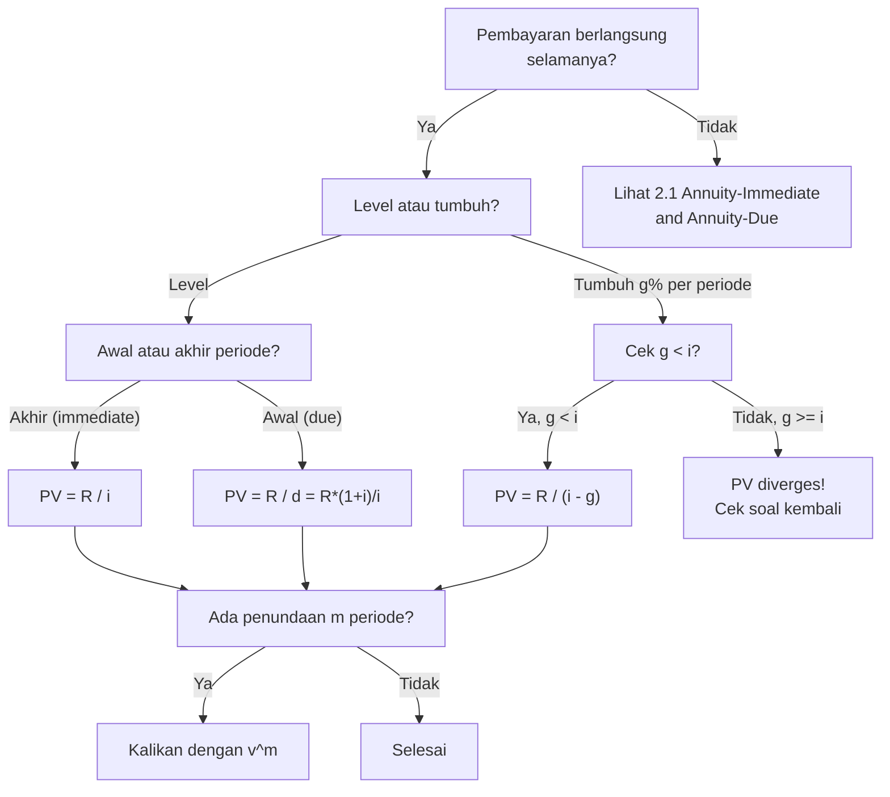

# 📘 2.2 — Perpetuity

> [!ABSTRACT] Ringkasan Cepat
> **Topik:** Perpetuity | **Bobot:** ~20–30% | **Difficulty:** Medium
> **Ref:** Vaaler Bab 3–4, Kellison Bab 3–4 | **Prereq:** [[2.1 Annuity-Immediate and Annuity-Due]], [[1.1 Interest Rates and Discount Rates]]

## Section 0 — Pemetaan Topik

| Topik CF1 | Sub-topik ID | Skill Diuji | Bobot | Difficulty | Prerequisite | Connected Topics | Referensi |
|-----------|--------------|-------------|-------|------------|--------------|------------------|-----------|
| Topik 2: Anuitas dan Nilai Arus Kas | 2.2 | Menghitung PV perpetuity-immediate $a_{\overline{\infty}\|}$; PV perpetuity-due $\ddot{a}_{\overline{\infty}\|}$; PV growing perpetuity; memahami limit dari annuity; aplikasi pada saham preferen, endowment, dan real estate | 20–30% | Medium | [[2.1 Annuity-Immediate and Annuity-Due]], [[1.1 Interest Rates and Discount Rates]] | [[2.1 Annuity-Immediate and Annuity-Due]], [[2.3 Varying Annuities]], [[2.5 Deferred Annuities]], [[7.1 CAPM and Factor Models]] | Vaaler Bab 3–4, Kellison Bab 3–4 |

## Section 1 — Intuisi

Bayangkan sebuah yayasan beasiswa yang ingin memberikan beasiswa Rp 10.000.000 setiap tahun **selamanya**—bukan hanya 10 atau 20 tahun, tetapi tanpa batas waktu. Berapa modal awal yang harus disiapkan yayasan itu hari ini agar beasiswa bisa terus dibayarkan selamanya? Ini adalah pertanyaan tentang **perpetuity**—anuitas yang tidak pernah berakhir. Jawabannya mengejutkan: meskipun pembayaran berlangsung selamanya, nilai sekarangnya *terbatas* dan bisa dihitung dengan formula sederhana.

Mengapa nilai sekarang perpetuity bisa terbatas? Karena setiap pembayaran di masa depan yang semakin jauh nilainya semakin kecil ketika di-discount ke hari ini. Pembayaran di tahun ke-100 atau ke-1000 nilainya mendekati nol dalam nilai sekarang. Sehingga meskipun ada tak hingga pembayaran, jumlah PV-nya konvergen ke nilai yang terbatas—seperti deret geometri tak hingga yang konvergen. Inilah keindahan matematika keuangan: tak hingga pembayaran, tetapi nilai sekarang yang finite.

Perpetuity sangat relevan dalam dunia nyata. **Saham preferen** yang membayar dividen tetap selamanya adalah contoh perpetuity. **Obligasi konsol** (consol bond) yang pernah diterbitkan pemerintah Inggris adalah perpetuity klasik. **Endowment fund** universitas dirancang sebagai perpetuity—hanya bunga yang digunakan, pokok tetap utuh. Di ujian CF1, perpetuity sering muncul sebagai bagian dari soal yang lebih kompleks, misalnya deferred perpetuity atau growing perpetuity untuk valuasi aset yang tumbuh.

## Section 2 — Definisi Formal

> [!NOTE] Definisi Matematis
> **Perpetuity-Immediate:** Pembayaran 1 unit di akhir setiap periode, selamanya ($n \to \infty$).
>
> $$
> a_{\overline{\infty}|i} = \lim_{n \to \infty} a_{\overline{n}|i} = \lim_{n \to \infty} \frac{1 - v^n}{i} = \frac{1}{i}
> $$
>
> **Perpetuity-Due:** Pembayaran 1 unit di awal setiap periode, selamanya.
>
> $$
> \ddot{a}_{\overline{\infty}|i} = \lim_{n \to \infty} \ddot{a}_{\overline{n}|i} = \frac{1}{d} = \frac{1+i}{i}
> $$
>
> **Growing Perpetuity-Immediate:** Pembayaran pertama 1 unit di $t=1$, tumbuh dengan rate $g$ per periode selamanya.
>
> $$
> PV_{\text{growing}} = \frac{1}{i - g}, \quad g < i
> $$

### Variabel & Parameter

| Simbol | Makna | Catatan |
|--------|-------|---------|
| $i$ | Suku bunga efektif per periode | $i > 0$ |
| $d$ | Tingkat diskonto efektif $= i/(1+i)$ | $d = 1 - v$ |
| $v$ | Faktor diskonto $= 1/(1+i)$ | $0 < v < 1$ |
| $a_{\overline{\infty}\|i}$ | PV perpetuity-immediate | $= 1/i$ |
| $\ddot{a}_{\overline{\infty}\|i}$ | PV perpetuity-due | $= 1/d = (1+i)/i$ |
| $g$ | Growth rate per periode (growing perpetuity) | $g < i$ (syarat konvergensi) |
| $R$ | Payment amount per periode | Kalikan dengan $a_{\overline{\infty}|}$ untuk PV |
| $m$ | Deferral period (deferred perpetuity) | Jumlah periode penundaan |

### Rumus Utama

$$
a_{\overline{\infty}|i} = \frac{1}{i}
$$
**Label:** PV perpetuity-immediate — pembayaran 1 unit di akhir setiap periode selamanya.

$$
\ddot{a}_{\overline{\infty}|i} = \frac{1}{d} = \frac{1+i}{i}
$$
**Label:** PV perpetuity-due — pembayaran 1 unit di awal setiap periode selamanya.

$$
\ddot{a}_{\overline{\infty}|i} = 1 + a_{\overline{\infty}|i}
$$
**Label:** Hubungan perpetuity-due dan immediate — due lebih besar sebesar 1 (pembayaran sekarang).

$$
_{m|}a_{\overline{\infty}|i} = v^m \cdot a_{\overline{\infty}|i} = \frac{v^m}{i}
$$
**Label:** PV deferred perpetuity-immediate — ditunda $m$ periode.

$$
PV_{\text{growing perp}} = \frac{R}{i - g}
$$
**Label:** PV growing perpetuity — pembayaran pertama $R$ di $t=1$, tumbuh $g$ per periode, $g < i$.

### Asumsi Eksplisit

- **Constant Interest Rate:** $i$ konstan dan positif selama seluruh periode tak hingga.
- **Convergence Condition:** Untuk growing perpetuity, wajib $g < i$ agar deret konvergen.
- **Level Payments (basic):** Untuk perpetuity biasa, setiap pembayaran sama besar.
- **No Default:** Pembayaran berlangsung selamanya tanpa gangguan.

## Section 3 — Jembatan Logika

> [!TIP] Dari Time Diagram ke Equation of Value
> Perpetuity-immediate adalah deret geometri tak hingga:
> $$
> a_{\overline{\infty}|i} = v + v^2 + v^3 + \cdots
> $$
> Ini adalah deret geometri dengan suku pertama $v$ dan rasio $v$ (di mana $|v| < 1$ karena $i > 0$). Deret geometri tak hingga konvergen ke:
> $$
> a_{\overline{\infty}|i} = \frac{v}{1 - v}
> $$
> Substitusi $v = 1/(1+i)$ dan $1 - v = i/(1+i)$:
> $$
> a_{\overline{\infty}|i} = \frac{1/(1+i)}{i/(1+i)} = \frac{1}{i}
> $$
>
> **Intuisi ekonomi:** Modal $1/i$ yang diinvestasikan pada rate $i$ menghasilkan bunga $i \times (1/i) = 1$ per periode selamanya—persis sama dengan pembayaran perpetuity. Pokok tidak pernah tersentuh.

> [!IMPORTANT] Focal Date
> PV perpetuity-immediate dievaluasi di $t=0$ (satu periode **sebelum** pembayaran pertama di $t=1$).
> PV perpetuity-due dievaluasi di $t=0$ (tepat **saat** pembayaran pertama di $t=0$).
> Deferred perpetuity: PV dievaluasi di $t=0$, tetapi pembayaran pertama di $t=m+1$.

**Derivasi Growing Perpetuity:**

Pembayaran: $R$ di $t=1$, $R(1+g)$ di $t=2$, $R(1+g)^2$ di $t=3$, ...

$$
PV = R \cdot v + R(1+g) \cdot v^2 + R(1+g)^2 \cdot v^3 + \cdots
$$

$$
PV = R \cdot v \cdot \left[1 + (1+g)v + (1+g)^2 v^2 + \cdots\right]
$$

Deret geometri dengan rasio $(1+g)v = (1+g)/(1+i)$. Konvergen jika $g < i$:

$$
PV = R \cdot v \cdot \frac{1}{1 - (1+g)v} = R \cdot \frac{1/(1+i)}{1 - (1+g)/(1+i)}
$$

$$
= R \cdot \frac{1/(1+i)}{(1+i-1-g)/(1+i)} = R \cdot \frac{1}{i - g}
$$

$$
\boxed{PV_{\text{growing perp}} = \frac{R}{i - g}}
$$

**Limit dari Annuity:**

Saat $n \to \infty$, $v^n = (1+i)^{-n} \to 0$ karena $i > 0$:

$$
a_{\overline{n}|i} = \frac{1 - v^n}{i} \xrightarrow{n \to \infty} \frac{1 - 0}{i} = \frac{1}{i} = a_{\overline{\infty}|i}
$$

> [!DANGER] Dilarang
> 1. **Menggunakan $a_{\overline{\infty}|} = 1/i$ untuk perpetuity-due:** Perpetuity-due menggunakan $1/d$, bukan $1/i$. Selisihnya adalah 1 unit (pembayaran di $t=0$).
> 2. **Growing perpetuity dengan $g \geq i$:** Jika $g \geq i$, deret diverges dan PV = $\infty$ (tidak terdefinisi). Selalu verifikasi $g < i$ sebelum menggunakan formula.
> 3. **Deferred perpetuity: lupa faktor $v^m$:** PV deferred perpetuity $= v^m / i$, bukan $1/i$. Penundaan $m$ periode mengurangi PV sebesar faktor $v^m$.

## Section 4 — Contoh Soal

### Soal A — Fundamental

Sebuah yayasan beasiswa menerima donasi sebesar Rp 200.000.000 hari ini. Yayasan ingin menggunakan hanya bunga dari donasi ini untuk memberikan beasiswa setiap akhir tahun selamanya. Jika suku bunga investasi adalah 5% per tahun efektif, hitunglah:
(a) Besar beasiswa yang bisa diberikan setiap tahun
(b) PV dari seluruh beasiswa jika beasiswa pertama diberikan di **awal** tahun pertama (perpetuity-due)

**Data yang diberikan:**
- Modal awal $= 200.000.000$
- $i = 5\% = 0.05$ per tahun efektif
- (a) Pembayaran di akhir tahun → perpetuity-immediate
- (b) Pembayaran di awal tahun → perpetuity-due

> [!SUCCESS] Solusi Soal A
> 
> **1. Identifikasi Variabel**
> - Modal $= 200.000.000$, $i = 0.05$
> - $d = 0.05/1.05 = 0.047619$
> - (a) $a_{\overline{\infty}|0.05} = 1/0.05 = 20$
> - (b) $\ddot{a}_{\overline{\infty}|0.05} = 1/d = 1/0.047619 = 21$
> 
> **2. Time Diagram**
> ```
> (a) Perpetuity-Immediate:
> t=0         t=1      t=2      t=3      ...
> |-----------|--------|--------|--------|
> 200,000,000  R        R        R       → ∞
> 
> (b) Perpetuity-Due:
> t=0         t=1      t=2      t=3      ...
> |-----------|--------|--------|--------|
> R           R        R        R       → ∞
> ```
> 
> **3. Equation of Value** *(pada Focal Date $t = 0$)*
> 
> **(a):** $200.000.000 = R \cdot a_{\overline{\infty}|0.05} = R \cdot \frac{1}{0.05}$
> 
> **(b):** $PV = R \cdot \ddot{a}_{\overline{\infty}|0.05} = R \cdot \frac{1}{d}$
> 
> **4. Eksekusi Aljabar**
> 
> **(a) Besar beasiswa (perpetuity-immediate):**
> 
> $$
> R = 200.000.000 \times 0.05 = 10.000.000
> $$
> 
> Beasiswa = **Rp 10.000.000 per tahun**
> 
> **(b) PV jika perpetuity-due dengan $R = 10.000.000$:**
> 
> $$
> PV = 10.000.000 \times \ddot{a}_{\overline{\infty}|0.05} = 10.000.000 \times \frac{1}{0.047619}
> $$
> 
> $$
> PV = 10.000.000 \times 21 = 210.000.000
> $$
> 
> **5. Verification**
> 
> **(a):** Bunga per tahun $= 200.000.000 \times 0.05 = 10.000.000$ = besar beasiswa ✓ (pokok utuh)
> 
> **(b):** $\ddot{a}_{\overline{\infty}|} = 1 + a_{\overline{\infty}|} = 1 + 20 = 21$ → $PV = 10.000.000 \times 21 = 210.000.000$ ✓
> 
> Logika finansial: Perpetuity-due lebih mahal (Rp 210M vs Rp 200M) karena pembayaran pertama dilakukan sekarang—tidak perlu menunggu satu tahun.
> 
> [!WARNING] Exam Tips — Soal A
> **Target waktu:** 2–3 menit. **Common trap:** Menggunakan $1/i$ untuk perpetuity-due. Ingat: perpetuity-due $= 1/d = (1+i)/i$. **Shortcut:** $\ddot{a}_{\overline{\infty}|} = 1 + a_{\overline{\infty}|}$ — tambahkan 1 (pembayaran sekarang).

---

### Soal B — Exam-Typical

Sebuah properti komersial akan menghasilkan pendapatan sewa Rp 5.000.000 per bulan, dibayar di akhir setiap bulan, selamanya. Namun, pembayaran pertama baru akan dimulai **3 tahun (36 bulan) dari sekarang**. Suku bunga adalah 6% per tahun nominal, convertible monthly (0.5% per bulan). Hitunglah nilai sekarang dari seluruh pendapatan sewa.

**Data yang diberikan:**
- $R = 5.000.000$ per bulan, di akhir bulan
- Pembayaran pertama di $t = 37$ (bulan ke-37, yaitu 36 bulan penundaan)
- $i_{\text{monthly}} = 6\%/12 = 0.5\% = 0.005$ per bulan
- Dicari: PV di $t=0$

> [!SUCCESS] Solusi Soal B
> 
> **1. Identifikasi Variabel**
> - $R = 5.000.000$, $i = 0.005$ per bulan, $m = 36$ bulan (deferral)
> - $v = 1/1.005$
> - $a_{\overline{\infty}|0.005} = 1/0.005 = 200$
> - Dicari: $PV = R \cdot {}_{36|}a_{\overline{\infty}|0.005}$
> 
> **2. Time Diagram**
> ```
> t=0    ...    t=36    t=37    t=38    t=39    ...
> |------|------|--------|--------|--------|--------|
> PV=?   (no    5M       5M       5M       5M    → ∞
>        payment)
>        ←36 months→ ← perpetuity-immediate starts here
> ```
> 
> Pembayaran pertama di $t=37$ → ini adalah perpetuity-immediate yang dimulai di $t=36$ (PV perpetuity di $t=36$), lalu di-discount 36 bulan ke $t=0$.
> 
> **3. Equation of Value** *(pada Focal Date $t = 0$)*
> 
> $$
> PV = R \cdot {}_{36|}a_{\overline{\infty}|0.005} = R \cdot v^{36} \cdot a_{\overline{\infty}|0.005}
> $$
> 
> $$
> PV = R \cdot \frac{v^{36}}{i}
> $$
> 
> **4. Eksekusi Aljabar**
> 
> $$
> v^{36} = (1.005)^{-36} = 1/(1.005)^{36}
> $$
> 
> $(1.005)^{36}$: menggunakan $(1.005)^{12} = 1.06168$ (annual effective rate), sehingga $(1.005)^{36} = (1.06168)^3$:
> 
> $$
> (1.06168)^3 = 1.06168 \times 1.06168 \times 1.06168
> $$
> $$
> = 1.12716 \times 1.06168 = 1.19668
> $$
> 
> $$
> v^{36} = 1/1.19668 = 0.83567
> $$
> 
> $$
> a_{\overline{\infty}|0.005} = 1/0.005 = 200
> $$
> 
> $$
> PV = 5.000.000 \times 0.83567 \times 200 = 5.000.000 \times 167.134
> $$
> 
> $$
> PV = 835.670.000
> $$
> 
> **5. Verification**
> 
> Cek tanpa deferral: $PV_{\text{no deferral}} = 5.000.000 / 0.005 = 1.000.000.000$
> 
> Dengan deferral 36 bulan: $PV = 1.000.000.000 \times v^{36} = 1.000.000.000 \times 0.83567 = 835.670.000$ ✓
> 
> Logika finansial: Penundaan 36 bulan mengurangi PV dari Rp 1M menjadi Rp 835.67M (turun ~16.4%). Semakin lama penundaan, semakin kecil PV.
> 
> [!WARNING] Exam Tips — Soal B
> **Target waktu:** 3–4 menit. **Common trap:** Mengasumsikan pembayaran pertama di $t=36$ (bukan $t=37$). Jika pembayaran pertama di $t=37$, maka PV perpetuity dihitung di $t=36$, lalu di-discount 36 periode ke $t=0$. **Shortcut:** $PV = R \cdot v^m / i$ — langsung tanpa hitung PV perpetuity di $t=m$ terpisah.

---

### Soal C — Challenging

Sebuah perusahaan properti memiliki gedung yang menghasilkan pendapatan sewa Rp 120.000.000 per tahun (dibayar di akhir tahun). Pendapatan sewa diperkirakan tumbuh 3% per tahun selamanya. Suku bunga diskonto adalah 8% per tahun efektif. Perusahaan juga memiliki kewajiban membayar biaya pemeliharaan Rp 20.000.000 per tahun (di akhir tahun) selamanya, tanpa pertumbuhan.

Hitunglah nilai bersih (net present value) dari properti ini, yaitu PV pendapatan sewa dikurangi PV biaya pemeliharaan.

**Data yang diberikan:**
- Pendapatan sewa: $R_1 = 120.000.000$, tumbuh $g = 3\%$ per tahun, di akhir tahun
- Biaya pemeliharaan: $R_2 = 20.000.000$ per tahun, level, di akhir tahun
- $i = 8\% = 0.08$ per tahun efektif
- Dicari: $NPV = PV_{\text{sewa}} - PV_{\text{biaya}}$

> [!SUCCESS] Solusi Soal C
> 
> **1. Identifikasi Variabel**
> - $R_1 = 120.000.000$, $g = 0.03$, $i = 0.08$
> - $R_2 = 20.000.000$, level perpetuity
> - $i - g = 0.08 - 0.03 = 0.05$ (spread untuk growing perpetuity)
> 
> **2. Time Diagram**
> ```
> t=0      t=1         t=2              t=3              ...
> |--------|-----------|-----------------|-----------------|
>          120M        120M×1.03        120M×1.03²       → ∞  (sewa, growing)
>          -20M        -20M             -20M              → ∞  (biaya, level)
>          ─────────────────────────────────────────────
>          100M        103.6M           107.71M           → ∞  (net)
> ```
> 
> **3. Equation of Value** *(pada Focal Date $t = 0$)*
> 
> $$
> PV_{\text{sewa}} = \frac{R_1}{i - g}
> $$
> 
> $$
> PV_{\text{biaya}} = \frac{R_2}{i} = R_2 \cdot a_{\overline{\infty}|i}
> $$
> 
> $$
> NPV = PV_{\text{sewa}} - PV_{\text{biaya}}
> $$
> 
> **4. Eksekusi Aljabar**
> 
> **PV pendapatan sewa (growing perpetuity):**
> 
> $$
> PV_{\text{sewa}} = \frac{120.000.000}{0.08 - 0.03} = \frac{120.000.000}{0.05} = 2.400.000.000
> $$
> 
> **PV biaya pemeliharaan (level perpetuity):**
> 
> $$
> PV_{\text{biaya}} = \frac{20.000.000}{0.08} = 250.000.000
> $$
> 
> **Net Present Value:**
> 
> $$
> NPV = 2.400.000.000 - 250.000.000 = 2.150.000.000
> $$
> 
> **Nilai bersih properti = Rp 2.150.000.000**
> 
> **5. Verification**
> 
> Cek growing perpetuity: $g = 3\% < i = 8\%$ ✓ (syarat konvergensi terpenuhi)
> 
> Cek magnitude: Tanpa pertumbuhan, $PV_{\text{sewa}} = 120M/0.08 = 1.500M$. Dengan pertumbuhan 3%, $PV = 2.400M$ (lebih besar) ✓
> 
> Cek net: $NPV = 2.400M - 250M = 2.150M$ — ini adalah harga wajar properti jika investor menginginkan return 8%.
> 
> Logika finansial: Pertumbuhan sewa 3% meningkatkan nilai properti dari Rp 1.5M (tanpa growth) menjadi Rp 2.4M—kenaikan 60%! Ini menunjukkan betapa sensitifnya growing perpetuity terhadap asumsi growth rate.

> [!WARNING] Exam Tips — Soal C
> **Target waktu:** 4–5 menit. **Common trap:** Menggunakan $g = 3\%$ sebagai $i$ dalam formula level perpetuity untuk sewa—sewa adalah *growing* perpetuity, bukan level. **Shortcut:** Jika soal minta net PV dari dua perpetuity, hitung masing-masing terpisah lalu kurangi—jangan coba gabungkan dalam satu formula.

## Section 5 — Verifikasi & Sanity Check

> [!CHECK] Batas Nilai Perpetuity
> 1. **$a_{\overline{\infty}|} > a_{\overline{n}|}$ untuk semua $n$ terbatas:** Perpetuity selalu lebih besar dari annuity $n$ periode.
> 2. **$a_{\overline{\infty}|} = 1/i$:** Jika $i = 5\%$, maka $a_{\overline{\infty}|} = 20$. Cek: $20 \times 5\% = 1$ (bunga = pembayaran) ✓
> 3. **$\ddot{a}_{\overline{\infty}|} = a_{\overline{\infty}|} + 1$:** Perpetuity-due selalu lebih besar tepat 1 unit dari perpetuity-immediate.

> [!CHECK] Growing Perpetuity
> 1. **Syarat $g < i$:** Jika $g \geq i$, formula tidak valid (PV = $\infty$). Selalu cek ini pertama.
> 2. **Limit check:** Saat $g \to 0$, $PV_{\text{growing}} = R/(i-0) = R/i$ = level perpetuity ✓
> 3. **Sensitivity:** Kenaikan $g$ atau penurunan $i$ meningkatkan PV secara dramatis (denominator $i-g$ mengecil).

> [!CHECK] Deferred Perpetuity
> 1. **$_{m|}a_{\overline{\infty}|} = v^m / i$:** Semakin besar $m$, semakin kecil PV (lebih banyak discounting).
> 2. **Timing check:** Jika pembayaran pertama di $t = m+1$, maka deferral period $= m$ (bukan $m+1$).

### Metode Alternatif

**Perpetuity sebagai Limit Annuity:**

$$
a_{\overline{\infty}|i} = \lim_{n \to \infty} a_{\overline{n}|i} = \lim_{n \to \infty} \frac{1 - v^n}{i} = \frac{1}{i}
$$

Berguna untuk verify: hitung $a_{\overline{100}|}$ dan bandingkan dengan $1/i$—harusnya sangat dekat.

**Deferred Perpetuity via Annuity Difference:**

$$
_{m|}a_{\overline{\infty}|} = a_{\overline{\infty}|} - a_{\overline{m}|} = \frac{1}{i} - a_{\overline{m}|i}
$$

Interpretasi: PV dari semua pembayaran (perpetuity) dikurangi PV dari $m$ pembayaran pertama = PV dari pembayaran mulai $t=m+1$.

## Section 6 — Visualisasi Mental

**PV Annuity vs $n$ — Konvergensi ke Perpetuity:**

Grafik dengan **sumbu X = $n$** (jumlah periode), **sumbu Y = $a_{\overline{n}|}$**.

- Kurva **meningkat dan concave**, mendekati garis horizontal $y = 1/i$ (perpetuity value) secara asimptotik
- Semakin tinggi $i$, garis horizontal $1/i$ semakin rendah
- Untuk $i = 5\%$: perpetuity value $= 20$. Pada $n=10$: $a_{\overline{10}|} = 7.72$. Pada $n=30$: $a_{\overline{30}|} = 15.37$. Pada $n=100$: $a_{\overline{100}|} \approx 19.85 \approx 20$
- **Insight:** Untuk $n$ besar (misal $n > 50$ dengan $i = 5\%$), annuity ≈ perpetuity—perbedaannya kecil

**Growing Perpetuity — Sensitivitas terhadap $g$:**

Grafik dengan **sumbu X = growth rate $g$** (dari 0 ke $i$), **sumbu Y = $PV = R/(i-g)$**.

- Kurva **meningkat secara hiperbolik**, mendekati $\infty$ saat $g \to i$
- Di $g = 0$: $PV = R/i$ (level perpetuity)
- Di $g = i/2$: $PV = 2R/i$ (dua kali level perpetuity)
- Saat $g \to i$: $PV \to \infty$ (diverges)

### Hubungan Visual ↔ Rumus

**Asimptot horizontal $= 1/i$:**

$$
\lim_{n \to \infty} a_{\overline{n}|i} = \frac{1}{i} = a_{\overline{\infty}|i}
$$

**Jarak dari kurva ke asimptot $= v^n/i$:**

$$
a_{\overline{\infty}|i} - a_{\overline{n}|i} = \frac{1}{i} - \frac{1-v^n}{i} = \frac{v^n}{i} = {}_{n|}a_{\overline{\infty}|i}
$$

Ini adalah PV dari deferred perpetuity mulai $t=n+1$—persis selisih antara perpetuity dan $n$-period annuity.

## Section 7 — Jebakan Umum

> [!BUG] Kesalahan Unit Waktu
> **Contoh Salah:** Perpetuity dengan pembayaran bulanan, $i = 6\%$ annual. Menggunakan $a_{\overline{\infty}|} = 1/0.06$ (annual rate) untuk pembayaran bulanan.
>
> **Benar:** Konversi ke monthly rate terlebih dahulu: $i_{\text{monthly}} = 0.5\%$, lalu $a_{\overline{\infty}|} = 1/0.005 = 200$. Atau: PV per bulan $= R/i_{\text{monthly}}$.

> [!BUG] Kesalahan Konseptual
> 1. **$a_{\overline{\infty}|} = 1/i$ untuk perpetuity-due (SALAH):** Perpetuity-due $= 1/d$, bukan $1/i$. Selisihnya signifikan: jika $i=5\%$, $1/i = 20$ tetapi $1/d = 21$.
> 2. **Growing perpetuity dengan $g > i$ (SALAH):** Formula $R/(i-g)$ hanya valid jika $g < i$. Jika $g \geq i$, PV tidak terdefinisi (diverges).
> 3. **Deferred perpetuity: timing pembayaran pertama:** Jika pembayaran pertama di $t=m+1$, gunakan $v^m/i$ (bukan $v^{m+1}/i$). Perpetuity-immediate: pembayaran pertama satu periode setelah focal date.
> 4. **FV perpetuity tidak terdefinisi:** Perpetuity tidak punya FV (karena $n \to \infty$, FV $\to \infty$). Hanya PV yang terdefinisi.

> [!BUG] Kesalahan Interpretasi Soal
> **Ambiguitas:** "Pembayaran selamanya mulai tahun depan" = perpetuity-immediate ($1/i$). "Pembayaran selamanya mulai sekarang" = perpetuity-due ($1/d$).
>
> **Ambiguitas deferred:** "Pembayaran pertama 5 tahun dari sekarang" → deferral $m = 4$ (bukan 5) untuk perpetuity-immediate, karena pembayaran pertama di $t=5$ berarti PV perpetuity di $t=4$, lalu di-discount 4 tahun.

> [!CAUTION] Red Flags
> - **"Selamanya" atau "forever" atau "in perpetuity":** Trigger untuk perpetuity formula ($1/i$ atau $1/d$).
> - **"Tumbuh X% per tahun selamanya":** Trigger untuk growing perpetuity $R/(i-g)$. Cek $g < i$.
> - **"Pembayaran pertama N tahun dari sekarang":** Trigger untuk deferred perpetuity. Hati-hati timing.
> - **"Saham preferen" atau "dividen tetap selamanya":** Perpetuity-immediate dengan $R = $ dividen per periode.

## Section 8 — Ringkasan Eksekutif

> [!SUMMARY] Must-Remember
> 1. **PV perpetuity-immediate:**
>    $$
>    a_{\overline{\infty}|i} = \frac{1}{i}
>    $$
> 2. **PV perpetuity-due:**
>    $$
>    \ddot{a}_{\overline{\infty}|i} = \frac{1}{d} = \frac{1+i}{i} = 1 + a_{\overline{\infty}|i}
>    $$
> 3. **PV deferred perpetuity-immediate (deferral $m$ periode):**
>    $$
>    {}_{m|}a_{\overline{\infty}|i} = \frac{v^m}{i}
>    $$
> 4. **PV growing perpetuity (pembayaran pertama $R$, tumbuh $g < i$):**
>    $$
>    PV = \frac{R}{i - g}
>    $$
> 5. **Annuity vs Perpetuity:**
>    $$
>    a_{\overline{\infty}|i} - a_{\overline{n}|i} = \frac{v^n}{i} = {}_{n|}a_{\overline{\infty}|i}
>    $$

### Kapan Digunakan

- **Trigger keywords:** "selamanya," "forever," "in perpetuity," "tanpa batas waktu," "dividen tetap selamanya," "endowment fund."
- **Tipe skenario soal:**
  - Hitung PV dari pembayaran level selamanya (perpetuity-immediate atau due).
  - Hitung PV dari pembayaran yang tumbuh selamanya (growing perpetuity).
  - Hitung PV dari deferred perpetuity (pembayaran mulai $m$ periode dari sekarang).
  - Valuasi saham preferen (dividen tetap selamanya).
  - Hitung modal awal yang diperlukan untuk endowment fund.

### Kapan TIDAK Boleh Digunakan

- **Jika pembayaran terbatas ($n$ periode):** Gunakan [[2.1 Annuity-Immediate and Annuity-Due]].
- **Jika pembayaran tidak level dan tidak growing geometrically:** Gunakan [[2.3 Varying Annuities]].
- **Jika $g \geq i$ untuk growing perpetuity:** Formula tidak valid—PV diverges.
- **Jika diminta FV perpetuity:** FV perpetuity tidak terdefinisi (infinite).

### Quick Decision Tree



---

> [!QUOTE] Follow-up Options
> 1. *"Berikan contoh soal variasi deferred growing perpetuity"*
> 2. *"Jelaskan hubungan [[2.2 Perpetuity]] dengan [[2.1 Annuity-Immediate and Annuity-Due]]"*
> 3. *"Buat flashcard 1-halaman untuk topik ini"*

*📖 Ref: Vaaler Bab 3–4, Kellison Bab 3–4 | 🗓️ 2026-02-18 | #CF1 #Perpetuity #GrowingPerpetuity #PresentValue*
