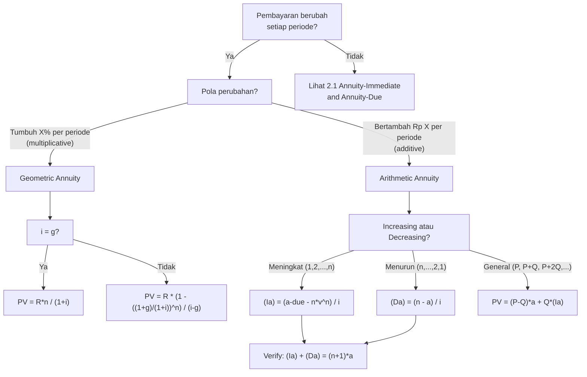

# 📘 2.3 — Varying Annuities

> [!ABSTRACT] Ringkasan Cepat
> **Topik:** Varying Annuities | **Bobot:** ~20–30% | **Difficulty:** Hard
> **Ref:** Vaaler Bab 3–4, Kellison Bab 3–4 | **Prereq:** [[2.1 Annuity-Immediate and Annuity-Due]], [[2.2 Perpetuity]]

## Section 0 — Pemetaan Topik

| Topik CF1 | Sub-topik ID | Skill Diuji | Bobot | Difficulty | Prerequisite | Connected Topics | Referensi |
|-----------|--------------|-------------|-------|------------|--------------|------------------|-----------|
| Topik 2: Anuitas dan Nilai Arus Kas | 2.3 | Menghitung PV/FV geometric annuity (tumbuh rate $g$); menghitung PV/FV arithmetic increasing annuity $(Ia)_{\overline{n}\|}$; menghitung PV/FV arithmetic decreasing annuity $(Da)_{\overline{n}\|}$; identitas $(Ia) + (Da) = (n+1)a$; aplikasi pada dividen tumbuh, kenaikan gaji, dan cicilan bertahap | 20–30% | Hard | [[2.1 Annuity-Immediate and Annuity-Due]], [[2.2 Perpetuity]] | [[2.2 Perpetuity]], [[2.4 Continuous Annuities]], [[2.5 Deferred Annuities]], [[5.1 Bond Pricing]] | Vaaler Bab 3–4, Kellison Bab 3–4 |

## Section 1 — Intuisi

Bayangkan seorang karyawan yang mendapat kenaikan gaji 5% setiap tahun. Jika kita ingin menghitung nilai sekarang dari seluruh gaji yang akan diterima selama 10 tahun ke depan, kita tidak bisa menggunakan formula annuity biasa—karena setiap pembayaran berbeda besarnya. Inilah yang dimaksud **varying annuity**: serangkaian pembayaran yang berubah secara sistematis dari satu periode ke periode berikutnya. Ada dua pola perubahan yang paling umum: **geometrik** (tumbuh dengan persentase tetap, seperti kenaikan gaji 5% per tahun) dan **aritmatika** (bertambah dengan jumlah tetap, seperti cicilan yang naik Rp 100.000 setiap bulan).

Untuk **geometric varying annuity**, kuncinya adalah menyadari bahwa setiap pembayaran adalah PV dari deret geometri dengan dua rasio yang "bersaing": rasio pertumbuhan $(1+g)$ dan rasio diskonto $v = 1/(1+i)$. Hasilnya adalah formula yang mirip dengan annuity biasa, tetapi dengan $i$ diganti oleh "net rate" $(i-g)/(1+g)$. Untuk **arithmetic varying annuity**, kita menggunakan notasi aktuaria khusus $(Ia)_{\overline{n}|}$ (increasing) dan $(Da)_{\overline{n}|}$ (decreasing), yang diturunkan dengan teknik "annuity of annuities" yang elegan.

Di ujian CF1, soal varying annuity sering muncul dalam konteks: (1) valuasi saham dengan dividen tumbuh konstan, (2) pinjaman dengan cicilan yang meningkat secara aritmatika, atau (3) proyek investasi dengan cash flow yang berubah. Kemampuan mengenali pola perubahan (geometrik vs aritmatika) dan memilih formula yang tepat adalah kunci untuk menyelesaikan soal-soal ini dengan efisien.

## Section 2 — Definisi Formal

> [!NOTE] Definisi Matematis
> **Geometric Annuity-Immediate:** Pembayaran pertama $R$ di $t=1$, tumbuh dengan rate $g$ per periode, selama $n$ periode.
>
> $$
> PV_{\text{geo}} = R \cdot \frac{1 - \left(\frac{1+g}{1+i}\right)^n}{i - g}, \quad i \neq g
> $$
>
> Jika $i = g$: $PV_{\text{geo}} = R \cdot n \cdot v = \frac{Rn}{1+i}$
>
> **Arithmetic Increasing Annuity-Immediate** $(Ia)_{\overline{n}|i}$: Pembayaran $1, 2, 3, \ldots, n$ di $t = 1, 2, \ldots, n$.
>
> $$
> (Ia)_{\overline{n}|i} = \frac{\ddot{a}_{\overline{n}|i} - n v^n}{i}
> $$
>
> **Arithmetic Decreasing Annuity-Immediate** $(Da)_{\overline{n}|i}$ : Pembayaran $n, n-1, \ldots, 1$ di $t = 1, 2, \ldots, n$.
>
> $$
> (Da)_{\overline{n}|i} = \frac{n - a_{\overline{n}|i}}{i} \cdot i = n \cdot a_{\overline{n}|i} - (Ia)_{\overline{n}|i} \cdot \frac{i}{i}
> $$
>
> Atau lebih sederhana:
> $$
> (Da)_{\overline{n}|i} = \frac{n - a_{\overline{n}|i}}{i}
> $$

### Variabel & Parameter

| Simbol | Makna | Catatan |
|--------|-------|---------|
| $n$ | Jumlah periode pembayaran | Integer positif |
| $i$ | Suku bunga efektif per periode | Decimal |
| $g$ | Growth rate per periode (geometric) | $g \neq i$ untuk formula standar |
| $v$ | Faktor diskonto $= 1/(1+i)$ | |
| $R$ | Pembayaran pertama (geometric) | Kalikan PV factor dengan $R$ |
| $Q$ | Increment per periode (arithmetic) | Kalikan $(Ia)$ dengan $Q$ |
| $(Ia)_{\overline{n}\|i}$ | PV increasing annuity (1, 2, ..., n) | Notasi aktuaria standar |
| $(Da)_{\overline{n}\|i}$ | PV decreasing annuity (n, n-1, ..., 1) | Notasi aktuaria standar |
| $(Is)_{\overline{n}\|i}$ | FV increasing annuity | $= (Ia)_{\overline{n}|} \cdot (1+i)^n$ |
| $(Ds)_{\overline{n}\|i}$ | FV decreasing annuity | $= (Da)_{\overline{n}|} \cdot (1+i)^n$ |

### Rumus Utama

**Geometric Annuity ($i \neq g$):**

$$
PV_{\text{geo}} = R \cdot \frac{1 - \left(\frac{1+g}{1+i}\right)^n}{i - g}
$$
**Label:** PV geometric annuity-immediate — pembayaran pertama $R$, tumbuh $g$ per periode.

$$
PV_{\text{geo}} = \frac{R}{1+g} \cdot a_{\overline{n}|i^*}, \quad \text{di mana } i^* = \frac{i-g}{1+g}
$$
**Label:** Alternatif — ubah ke annuity biasa dengan "net rate" $i^* = (i-g)/(1+g)$.

**Arithmetic Increasing Annuity:**

$$
(Ia)_{\overline{n}|i} = \frac{\ddot{a}_{\overline{n}|i} - n v^n}{i}
$$
**Label:** PV increasing annuity — pembayaran $1, 2, \ldots, n$.

$$
(Ia)_{\overline{n}|i} = \frac{a_{\overline{n}|i} - n v^n}{i} \cdot (1+i) = \frac{\ddot{a}_{\overline{n}|i} - nv^n}{i}
$$

**Arithmetic Decreasing Annuity:**

$$
(Da)_{\overline{n}|i} = \frac{n - a_{\overline{n}|i}}{i}
$$
**Label:** PV decreasing annuity — pembayaran $n, n-1, \ldots, 1$.

**Identitas Kritis:**

$$
(Ia)_{\overline{n}|i} + (Da)_{\overline{n}|i} = (n+1) \cdot a_{\overline{n}|i}
$$
**Label:** Hubungan increasing + decreasing = $(n+1)$ kali annuity biasa.

**General Arithmetic Annuity** (pembayaran pertama $P$, increment $Q$ per periode):

$$
PV = P \cdot a_{\overline{n}|i} + Q \cdot (Ia)_{\overline{n}|i}
$$
**Label:** Dekomposisi menjadi level annuity plus increasing annuity.

### Asumsi Eksplisit

- **Constant Interest Rate:** $i$ konstan selama seluruh $n$ periode.
- **Geometric:** Pertumbuhan $g$ konstan setiap periode (multiplicative).
- **Arithmetic:** Increment $Q$ konstan setiap periode (additive).
- **Annuity-Immediate:** Pembayaran di akhir setiap periode (kecuali dinyatakan lain).

## Section 3 — Jembatan Logika

> [!TIP] Dari Time Diagram ke Equation of Value
> **Geometric Annuity:** Pembayaran di $t=1, 2, \ldots, n$ adalah $R, R(1+g), R(1+g)^2, \ldots, R(1+g)^{n-1}$.
>
> PV $= R \cdot v + R(1+g) \cdot v^2 + R(1+g)^2 \cdot v^3 + \cdots + R(1+g)^{n-1} \cdot v^n$
>
> $= R \cdot v \cdot \left[1 + (1+g)v + (1+g)^2 v^2 + \cdots + (1+g)^{n-1} v^{n-1}\right]$
>
> Ini adalah deret geometri dengan rasio $\rho = (1+g)v = (1+g)/(1+i)$ dan $n$ suku.
>
> **Arithmetic Increasing Annuity:** Pembayaran $1, 2, 3, \ldots, n$ bisa dipandang sebagai **"annuity of annuities"**:
> - Pembayaran 1 di $t=1, 2, \ldots, n$ (annuity $n$ periode)
> - Pembayaran 1 di $t=2, 3, \ldots, n$ (annuity $n-1$ periode, dimulai $t=2$)
> - Pembayaran 1 di $t=3, 4, \ldots, n$ (annuity $n-2$ periode, dimulai $t=3$)
> - ...
> - Pembayaran 1 di $t=n$ (annuity 1 periode)
>
> Jumlah PV dari semua ini menghasilkan $(Ia)_{\overline{n}|}$.

> [!IMPORTANT] Focal Date
> Semua formula PV dievaluasi di $t=0$ (satu periode sebelum pembayaran pertama untuk annuity-immediate). FV dievaluasi di $t=n$.

**Derivasi Geometric Annuity:**

$$
PV = R \cdot v \cdot \frac{1 - \rho^n}{1 - \rho}, \quad \rho = \frac{1+g}{1+i}
$$

$$
= R \cdot \frac{1}{1+i} \cdot \frac{1 - \left(\frac{1+g}{1+i}\right)^n}{1 - \frac{1+g}{1+i}}
$$

$$
= R \cdot \frac{1}{1+i} \cdot \frac{1 - \left(\frac{1+g}{1+i}\right)^n}{\frac{i-g}{1+i}}
$$

$$
= R \cdot \frac{1 - \left(\frac{1+g}{1+i}\right)^n}{i - g}
$$

**Derivasi $(Ia)_{\overline{n}|}$ via "Annuity of Annuities":**

$$
(Ia)_{\overline{n}|} = a_{\overline{n}|} + v \cdot a_{\overline{n-1}|} + v^2 \cdot a_{\overline{n-2}|} + \cdots + v^{n-1} \cdot a_{\overline{1}|}
$$

Gunakan $a_{\overline{k}|} = (1 - v^k)/i$:

$$
(Ia)_{\overline{n}|} = \frac{1}{i} \sum_{k=1}^{n} v^{n-k}(1 - v^k) = \frac{1}{i}\left[\sum_{k=1}^{n} v^{n-k} - \sum_{k=1}^{n} v^n\right]
$$

$$
= \frac{1}{i}\left[\frac{v^0 - v^n}{1-v} \cdot v^0 \cdot \frac{1}{1} - n v^n\right]
$$

Setelah simplifikasi (menggunakan $\ddot{a}_{\overline{n}|} = (1-v^n)/d$):

$$
\boxed{(Ia)_{\overline{n}|i} = \frac{\ddot{a}_{\overline{n}|i} - n v^n}{i}}
$$

**Derivasi Identitas $(Ia) + (Da) = (n+1)a$:**

Pembayaran increasing: $1, 2, 3, \ldots, n$

Pembayaran decreasing: $n, n-1, n-2, \ldots, 1$

Jumlah tiap periode: $(1+n), (2+n-1), (3+n-2), \ldots = (n+1), (n+1), \ldots, (n+1)$

Jadi jumlah = level annuity dengan pembayaran $(n+1)$:

$$
(Ia)_{\overline{n}|} + (Da)_{\overline{n}|} = (n+1) \cdot a_{\overline{n}|}
$$

> [!DANGER] Dilarang
> 1. **Menggunakan formula geometric annuity saat $i = g$:** Jika $i = g$, formula $R/(i-g)$ menghasilkan pembagian dengan nol. Gunakan kasus khusus: $PV = Rn/(1+i)$.
> 2. **Mengasumsikan $(Ia)_{\overline{n}|}$ adalah $n \cdot a_{\overline{n}|}$:** $(Ia)_{\overline{n}|} \neq n \cdot a_{\overline{n}|}$. Formula yang benar adalah $(\ddot{a}_{\overline{n}|} - nv^n)/i$.
> 3. **Lupa bahwa general arithmetic annuity butuh dua komponen:** Jika pembayaran pertama $P \neq 0$ dan increment $Q \neq 0$, gunakan $PV = P \cdot a_{\overline{n}|} + Q \cdot (Ia)_{\overline{n}|}$. Jangan hanya gunakan $(Ia)$ saja.

## Section 4 — Contoh Soal

### Soal A — Fundamental

Sebuah investasi akan menghasilkan cash flow sebesar Rp 1.000.000 di akhir tahun pertama, dan meningkat 4% setiap tahun selama total 6 tahun. Suku bunga diskonto adalah 9% per tahun efektif. Hitunglah present value dari seluruh cash flow.

**Data yang diberikan:**
- $R = 1.000.000$ (pembayaran pertama, di $t=1$)
- $g = 4\% = 0.04$ per tahun (geometric growth)
- $i = 9\% = 0.09$ per tahun efektif
- $n = 6$ tahun

> [!SUCCESS] Solusi Soal A
> 
> **1. Identifikasi Variabel**
> - $R = 1.000.000$, $g = 0.04$, $i = 0.09$, $n = 6$
> - $i - g = 0.09 - 0.04 = 0.05$
> - $\rho = (1+g)/(1+i) = 1.04/1.09 = 0.954128$
> 
> **2. Time Diagram**
> ```
> t=0      t=1       t=2         t=3           ...    t=6
> |--------|---------|-----------|-------------|-------|
>          1,000,000  1,040,000   1,081,600    ...    1,000,000×(1.04)^5
>                                                     = 1,216,653
> ```
> 
> **3. Equation of Value** *(pada Focal Date $t = 0$)*
> 
> $$
> PV = R \cdot \frac{1 - \left(\frac{1+g}{1+i}\right)^n}{i - g}
> $$
> 
> **4. Eksekusi Aljabar**
> 
> $$
> \rho^6 = \left(\frac{1.04}{1.09}\right)^6 = (0.954128)^6
> $$
> 
> $(0.954128)^2 = 0.910360$
> 
> $(0.954128)^3 = 0.868553$
> 
> $(0.954128)^6 = (0.868553)^2 = 0.754384$
> 
> $$
> PV = 1.000.000 \times \frac{1 - 0.754384}{0.09 - 0.04} = 1.000.000 \times \frac{0.245616}{0.05}
> $$
> 
> $$
> PV = 1.000.000 \times 4.91232 = 4.912.320
> $$
> 
> **5. Verification**
> 
> Cek tanpa pertumbuhan (level annuity): $a_{\overline{6}|0.09} = (1 - (1.09)^{-6})/0.09$. $(1.09)^6 = 1.67710$, $v^6 = 0.59627$, $a_{\overline{6}|} = (1-0.59627)/0.09 = 4.48592$. PV level $= 1.000.000 \times 4.48592 = 4.485.920$.
> 
> Dengan pertumbuhan 4%: PV $= 4.912.320 > 4.485.920$ ✓ (pertumbuhan meningkatkan PV)
> 
> Cek growing perpetuity limit: $R/(i-g) = 1.000.000/0.05 = 20.000.000$. PV annuity $4.912.320 < 20.000.000$ ✓

> [!WARNING] Exam Tips — Soal A
> **Target waktu:** 3–4 menit. **Common trap:** Menggunakan $g$ sebagai annual rate tetapi $i$ sebagai monthly rate (unit mismatch). **Shortcut:** Alternatif formula $PV = (R/1+g) \cdot a_{\overline{n}|i^*}$ dengan $i^* = (i-g)/(1+g) = 0.05/1.04 = 4.808\%$—hitung $a_{\overline{6}|4.808\%}$ lalu kalikan $R/(1+g)$.

---

### Soal B — Exam-Typical

Sebuah pinjaman dilunasi dengan 8 pembayaran tahunan. Pembayaran pertama sebesar Rp 3.000.000 di akhir tahun pertama, dan setiap pembayaran berikutnya **bertambah Rp 500.000** dari pembayaran sebelumnya (arithmetic increasing). Suku bunga pinjaman adalah 7% per tahun efektif. Hitunglah nilai pinjaman awal (PV dari seluruh pembayaran).

**Data yang diberikan:**
- Pembayaran: $3.000.000, 3.500.000, 4.000.000, \ldots, 6.500.000$ (di $t=1, 2, \ldots, 8$)
- $P = 3.000.000$ (pembayaran pertama), $Q = 500.000$ (increment)
- $n = 8$, $i = 0.07$

> [!SUCCESS] Solusi Soal B
> 
> **1. Identifikasi Variabel**
> - Pembayaran di $t=k$: $3.000.000 + (k-1) \times 500.000 = 2.500.000 + 500.000k$
> - Dekomposisi: $P = 2.500.000$ (level component), $Q = 500.000$ (increment)
> - Alternatif dekomposisi: $P' = 3.000.000$, $Q = 500.000$, tapi pembayaran ke-$k$ = $P' + (k-1)Q$
> 
> Gunakan: $PV = P' \cdot a_{\overline{n}|} + Q \cdot (Ia)_{\overline{n}|} - Q \cdot a_{\overline{n}|}$
> 
> Atau lebih langsung: pembayaran ke-$k$ = $2.500.000 + 500.000 \cdot k$
> 
> $$
> PV = 2.500.000 \cdot a_{\overline{8}|0.07} + 500.000 \cdot (Ia)_{\overline{8}|0.07}
> $$
> 
> **2. Time Diagram**
> ```
> t=0    t=1      t=2      t=3      ...    t=8
> |------|--------|--------|--------|-------|
>        3,000k   3,500k   4,000k   ...   6,500k
>        = 2,500k  = 2,500k  = 2,500k       = 2,500k  (level part)
>        + 500k   + 1,000k + 1,500k       + 4,000k  (increasing part)
> ```
> 
> **3. Equation of Value** *(pada Focal Date $t = 0$)*
> 
> $$
> PV = 2.500.000 \cdot a_{\overline{8}|0.07} + 500.000 \cdot (Ia)_{\overline{8}|0.07}
> $$
> 
> $$
> (Ia)_{\overline{8}|0.07} = \frac{\ddot{a}_{\overline{8}|0.07} - 8 v^8}{0.07}
> $$
> 
> **4. Eksekusi Aljabar**
> 
> **Hitung $a_{\overline{8}|0.07}$:**
> 
> $$
> v^8 = (1.07)^{-8} = 1/(1.71819) = 0.582009
> $$
> 
> $$
> a_{\overline{8}|0.07} = \frac{1 - 0.582009}{0.07} = \frac{0.417991}{0.07} = 5.97130
> $$
> 
> **Hitung $\ddot{a}_{\overline{8}|0.07}$:**
> 
> $$
> \ddot{a}_{\overline{8}|0.07} = (1.07) \times 5.97130 = 6.38929
> $$
> 
> **Hitung $(Ia)_{\overline{8}|0.07}$:**
> 
> $$
> (Ia)_{\overline{8}|0.07} = \frac{6.38929 - 8 \times 0.582009}{0.07} = \frac{6.38929 - 4.65607}{0.07} = \frac{1.73322}{0.07} = 24.7603
> $$
> 
> **Hitung PV:**
> 
> $$
> PV = 2.500.000 \times 5.97130 + 500.000 \times 24.7603
> $$
> 
> $$
> = 14.928.250 + 12.380.150 = 27.308.400
> $$
> 
> **5. Verification**
> 
> Cek tanpa increment (level annuity): $PV_{\text{level}} = 3.000.000 \times 5.97130 = 17.913.900$. Dengan increment, PV lebih besar ✓ ($27.308.400 > 17.913.900$).
> 
> Cek total payments: $\sum_{k=1}^{8} (2.500.000 + 500.000k) = 8 \times 2.500.000 + 500.000 \times (1+2+\cdots+8) = 20.000.000 + 500.000 \times 36 = 38.000.000$. PV $= 27.308.400 < 38.000.000$ ✓ (discounting)

> [!WARNING] Exam Tips — Soal B
> **Target waktu:** 4–5 menit. **Common trap:** Dekomposisi salah—pembayaran ke-$k$ adalah $P + (k-1)Q$, bukan $P + kQ$. Jika dekomposisi $P + kQ$, gunakan $PV = P \cdot a_{\overline{n}|} + Q \cdot (Ia)_{\overline{n}|}$ dengan $P$ yang disesuaikan. **Shortcut:** Dekomposisi menjadi level $+$ increasing selalu lebih mudah daripada menghitung PV tiap pembayaran satu per satu.

---

### Soal C — Challenging

Sebuah proyek investasi menghasilkan cash flow berikut: Rp 10.000.000 di $t=1$, Rp 9.000.000 di $t=2$, Rp 8.000.000 di $t=3$, ..., Rp 1.000.000 di $t=10$ (arithmetic decreasing). Setelah itu, proyek menghasilkan Rp 500.000 per tahun selamanya, mulai $t=11$.

Suku bunga adalah 6% per tahun efektif. Hitunglah PV total dari seluruh cash flow proyek.

**Data yang diberikan:**
- Fase 1 ($t=1$ s.d. $t=10$): Pembayaran $10M, 9M, 8M, \ldots, 1M$ (arithmetic decreasing, $n=10$, $Q=-1M$)
- Fase 2 ($t=11, 12, \ldots$): Perpetuity $500.000$ per tahun
- $i = 6\% = 0.06$

> [!SUCCESS] Solusi Soal C
> 
> **1. Identifikasi Variabel**
> - Fase 1: Pembayaran ke-$k$ = $10.000.000 - (k-1) \times 1.000.000 = (11-k) \times 1.000.000$
> - Ini adalah decreasing annuity: pembayaran $10, 9, 8, \ldots, 1$ (dalam jutaan)
> - $n = 10$, $i = 0.06$
> - Fase 2: Perpetuity $R = 500.000$, mulai $t=11$ (deferred 10 periode)
> 
> **2. Time Diagram**
> ```
> t=0    t=1    t=2    t=3    ...  t=10   t=11   t=12   ...
> |------|------|------|------|-----|------|------|------|
>        10M    9M     8M    ...   1M     500k   500k   → ∞
>        ←── Decreasing Annuity ──→ ←── Deferred Perpetuity ──→
> ```
> 
> **3. Equation of Value** *(pada Focal Date $t = 0$)*
> 
> $$
> PV = 1.000.000 \cdot (Da)_{\overline{10}|0.06} + 500.000 \cdot {}_{10|}a_{\overline{\infty}|0.06}
> $$
> 
> $$
> (Da)_{\overline{10}|0.06} = \frac{10 - a_{\overline{10}|0.06}}{0.06}
> $$
> 
> $$
> {}_{10|}a_{\overline{\infty}|0.06} = \frac{v^{10}}{0.06}
> $$
> 
> **4. Eksekusi Aljabar**
> 
> **Hitung $a_{\overline{10}|0.06}$:**
> 
> $$
> v^{10} = (1.06)^{-10} = 1/(1.79085) = 0.558395
> $$
> 
> $$
> a_{\overline{10}|0.06} = \frac{1 - 0.558395}{0.06} = \frac{0.441605}{0.06} = 7.36009
> $$
> 
> **Hitung $(Da)_{\overline{10}|0.06}$:**
> 
> $$
> (Da)_{\overline{10}|0.06} = \frac{10 - 7.36009}{0.06} = \frac{2.63991}{0.06} = 43.9985
> $$
> 
> **PV Fase 1:**
> 
> $$
> PV_1 = 1.000.000 \times 43.9985 = 43.998.500
> $$
> 
> **Hitung deferred perpetuity:**
> 
> $$
> {}_{10|}a_{\overline{\infty}|0.06} = \frac{v^{10}}{0.06} = \frac{0.558395}{0.06} = 9.30658
> $$
> 
> **PV Fase 2:**
> 
> $$
> PV_2 = 500.000 \times 9.30658 = 4.653.290
> $$
> 
> **Total PV:**
> 
> $$
> PV_{\text{total}} = 43.998.500 + 4.653.290 = 48.651.790
> $$
> 
> **5. Verification**
> 
> Cek identitas $(Ia) + (Da) = (n+1) \cdot a_{\overline{n}|}$:
> 
> $(Ia)_{\overline{10}|0.06} = (\ddot{a}_{\overline{10}|} - 10v^{10})/0.06$
> 
> $\ddot{a}_{\overline{10}|} = 1.06 \times 7.36009 = 7.80169$
> 
> $(Ia)_{\overline{10}|} = (7.80169 - 10 \times 0.558395)/0.06 = (7.80169 - 5.58395)/0.06 = 2.21774/0.06 = 36.9623$
> 
> $(Ia) + (Da) = 36.9623 + 43.9985 = 80.9608$
> 
> $(n+1) \cdot a_{\overline{n}|} = 11 \times 7.36009 = 80.9610$ ✓ (rounding)
> 
> Cek deferred perpetuity: $PV_2 = 500.000/0.06 \times v^{10} = 8.333.333 \times 0.558395 = 4.653.292$ ✓
> 
> [!WARNING] Exam Tips — Soal C
> **Target waktu:** 6–7 menit. **Common trap:** Lupa bahwa deferred perpetuity mulai $t=11$ berarti deferral $m=10$ (bukan $m=11$). Pembayaran pertama di $t=11$ → PV perpetuity di $t=10$ → di-discount 10 periode ke $t=0$. **Shortcut:** Gunakan identitas $(Ia) + (Da) = (n+1)a$ untuk verify $(Da)$ setelah menghitung $(Ia)$.

## Section 5 — Verifikasi & Sanity Check

> [!CHECK] Geometric Annuity
> 1. **Cek limit $n \to \infty$:** Jika $g < i$, geometric annuity → growing perpetuity $R/(i-g)$. Annuity PV harus $< R/(i-g)$.
> 2. **Cek $g = 0$:** Geometric annuity dengan $g=0$ harus sama dengan level annuity $R \cdot a_{\overline{n}|}$.
> 3. **Cek $g > 0$:** PV geometric annuity $>$ PV level annuity (pertumbuhan meningkatkan nilai).

> [!CHECK] Arithmetic Annuity
> 1. **Identitas:** $(Ia)_{\overline{n}|} + (Da)_{\overline{n}|} = (n+1) \cdot a_{\overline{n}|}$ — gunakan untuk cross-check.
> 2. **Batas bawah:** $(Ia)_{\overline{n}|} > a_{\overline{n}|}$ (karena pembayaran rata-rata $> 1$).
> 3. **Cek $n=1$:** $(Ia)_{\overline{1}|} = v$ (hanya satu pembayaran sebesar 1 di $t=1$). $(Da)_{\overline{1}|} = v$ juga.

### Metode Alternatif

**Geometric Annuity via Net Rate:**

$$
PV_{\text{geo}} = \frac{R}{1+g} \cdot a_{\overline{n}|i^*}, \quad i^* = \frac{i-g}{1+g}
$$

Ubah masalah menjadi level annuity dengan rate $i^*$—berguna jika tabel annuity tersedia.

**$(Ia)$ via Summation:**

$$
(Ia)_{\overline{n}|} = \sum_{k=1}^{n} k \cdot v^k = v \cdot \frac{d}{dv}\left[\sum_{k=1}^{n} v^k\right]
$$

Berguna untuk derivasi, bukan untuk kalkulasi exam.

**$(Da)$ dari Identitas:**

$$
(Da)_{\overline{n}|} = (n+1) \cdot a_{\overline{n}|} - (Ia)_{\overline{n}|}
$$

Jika sudah hitung $(Ia)$, gunakan identitas untuk dapat $(Da)$ tanpa formula terpisah.

## Section 6 — Visualisasi Mental

**Geometric Annuity — Cash Flow Diagram:**

Grafik dengan **sumbu X = waktu $t$**, **sumbu Y = pembayaran $R_t$**.

- Kurva **exponential increasing** jika $g > 0$: setiap batang lebih tinggi dari sebelumnya dengan faktor $(1+g)$
- Kurva **exponential decreasing** jika $g < 0$: setiap batang lebih rendah
- Semakin besar $g$, semakin curam kenaikan

**Arithmetic Increasing Annuity — Staircase Pattern:**

Grafik dengan **sumbu X = waktu $t$**, **sumbu Y = pembayaran $R_t$**.

- Pola **tangga naik linear**: pembayaran $1, 2, 3, \ldots, n$
- Bisa dipandang sebagai $n$ level annuities yang di-defer:
  - Annuity $n$ periode mulai $t=1$
  - Annuity $n-1$ periode mulai $t=2$
  - ...
  - Annuity 1 periode mulai $t=n$

**Decomposition View:**

Setiap general arithmetic annuity bisa divisualisasikan sebagai superposisi:
- **Level component** (persegi panjang): $P \cdot a_{\overline{n}|}$
- **Increasing component** (segitiga): $Q \cdot (Ia)_{\overline{n}|}$

### Hubungan Visual ↔ Rumus

**Geometric annuity formula = level annuity dengan "adjusted rate":**

$$
PV_{\text{geo}} = \frac{R}{1+g} \cdot a_{\overline{n}|i^*}
$$

Secara visual: "compress" setiap cash flow dengan faktor $1/(1+g)$ dan gunakan rate $i^*$.

**$(Ia)$ = area segitiga di bawah staircase:**

$$
(Ia)_{\overline{n}|} = \sum_{k=1}^{n} k \cdot v^k
$$

Setiap "step" ke-$k$ berkontribusi $k \cdot v^k$ ke total PV.

## Section 7 — Jebakan Umum

> [!BUG] Kesalahan Unit Waktu
> **Contoh Salah:** Geometric annuity dengan $g = 3\%$ per tahun, $i = 6\%$ per tahun, tetapi $n = 24$ bulan. Menggunakan $n = 24$ dengan $g$ dan $i$ tahunan.
>
> **Benar:** Konversi semua ke unit yang sama. Jika $n$ dalam bulan, konversi $i$ dan $g$ ke monthly: $i_{\text{monthly}} = (1.06)^{1/12} - 1$, $g_{\text{monthly}} = (1.03)^{1/12} - 1$.

> [!BUG] Kesalahan Konseptual
> 1. **Geometric annuity dengan $i = g$:** Formula $R/(i-g)$ menghasilkan $0/0$. Gunakan kasus khusus: $PV = Rn/(1+i)$.
> 2. **$(Ia)_{\overline{n}|}$ = pembayaran $0, 1, 2, \ldots, n-1$ (SALAH):** $(Ia)_{\overline{n}|}$ adalah pembayaran $1, 2, 3, \ldots, n$ di $t=1, 2, \ldots, n$. Pembayaran pertama adalah 1, bukan 0.
> 3. **General arithmetic: dekomposisi salah:** Jika pembayaran ke-$k$ adalah $P + (k-1)Q$, dekomposisi adalah $PV = (P-Q) \cdot a_{\overline{n}|} + Q \cdot (Ia)_{\overline{n}|}$. Atau: $PV = P \cdot a_{\overline{n}|} + Q \cdot [(Ia)_{\overline{n}|} - a_{\overline{n}|}]$.
> 4. **$(Da)_{\overline{n}|}$ = pembayaran $n, n-1, \ldots, 0$ (SALAH):** $(Da)_{\overline{n}|}$ berakhir di 1, bukan 0. Pembayaran terakhir di $t=n$ adalah 1.

> [!BUG] Kesalahan Interpretasi Soal
> **Ambiguitas:** "Meningkat 5% per tahun" bisa berarti geometric ($\times 1.05$) atau arithmetic ($+ 5\%$ dari nilai awal). Baca konteks: "meningkat 5%" biasanya geometric; "bertambah Rp X" biasanya arithmetic.
>
> **Ambiguitas pembayaran pertama:** Untuk geometric annuity, apakah $R$ adalah pembayaran pertama atau pembayaran "sebelum pertumbuhan"? Selalu identifikasi nilai di $t=1$ secara eksplisit.

> [!CAUTION] Red Flags
> - **"Tumbuh X% per tahun":** Trigger untuk geometric annuity. Cek apakah $g < i$ (untuk konvergensi jika $n \to \infty$).
> - **"Bertambah Rp X per periode":** Trigger untuk arithmetic annuity. Identifikasi $P$ (pembayaran pertama) dan $Q$ (increment).
> - **"Menurun Rp X per periode":** Trigger untuk arithmetic decreasing. Gunakan $(Da)$ atau dekomposisi dengan $Q < 0$.
> - **"Pembayaran pertama sama dengan $i = g$":** Trigger untuk kasus khusus geometric annuity.

## Section 8 — Ringkasan Eksekutif

> [!SUMMARY] Must-Remember
> 1. **PV geometric annuity ($i \neq g$):**
>    $$
>    PV = R \cdot \frac{1 - \left(\frac{1+g}{1+i}\right)^n}{i - g}
>    $$
> 2. **PV arithmetic increasing annuity:**
>    $$
>    (Ia)_{\overline{n}|i} = \frac{\ddot{a}_{\overline{n}|i} - n v^n}{i}
>    $$
> 3. **PV arithmetic decreasing annuity:**
>    $$
>    (Da)_{\overline{n}|i} = \frac{n - a_{\overline{n}|i}}{i}
>    $$
> 4. **Identitas kritis:**
>    $$
>    (Ia)_{\overline{n}|i} + (Da)_{\overline{n}|i} = (n+1) \cdot a_{\overline{n}|i}
>    $$
> 5. **General arithmetic annuity** (pembayaran ke-$k$ = $P + (k-1)Q$):
>    $$
>    PV = (P - Q) \cdot a_{\overline{n}|i} + Q \cdot (Ia)_{\overline{n}|i}
>    $$

### Kapan Digunakan

- **Trigger keywords:** "tumbuh X% per tahun" (geometric), "bertambah Rp X per periode" (arithmetic), "kenaikan gaji," "dividen tumbuh," "cicilan bertahap."
- **Tipe skenario soal:**
  - Valuasi saham dengan dividen tumbuh konstan (geometric).
  - Pinjaman dengan cicilan meningkat/menurun secara aritmatika.
  - Proyek investasi dengan cash flow yang berubah secara sistematis.
  - Kombinasi varying annuity + deferred perpetuity.

### Kapan TIDAK Boleh Digunakan

- **Jika pembayaran level (konstan):** Gunakan [[2.1 Annuity-Immediate and Annuity-Due]].
- **Jika pembayaran tidak mengikuti pola geometrik atau aritmatika:** Hitung PV tiap cash flow secara individual.
- **Jika $g \geq i$ untuk geometric annuity dengan $n \to \infty$:** Tidak konvergen—cek apakah soal memang $n$ terbatas.

### Quick Decision Tree



---

> [!QUOTE] Follow-up Options
> 1. *"Berikan contoh soal variasi geometric annuity dengan $i = g$"*
> 2. *"Jelaskan hubungan [[2.3 Varying Annuities]] dengan [[2.2 Perpetuity]] (growing perpetuity)"*
> 3. *"Buat flashcard 1-halaman untuk topik ini"*

*📖 Ref: Vaaler Bab 3–4, Kellison Bab 3–4 | 🗓️ 2026-02-18 | #CF1 #VaryingAnnuity #GeometricAnnuity #ArithmeticAnnuity*
