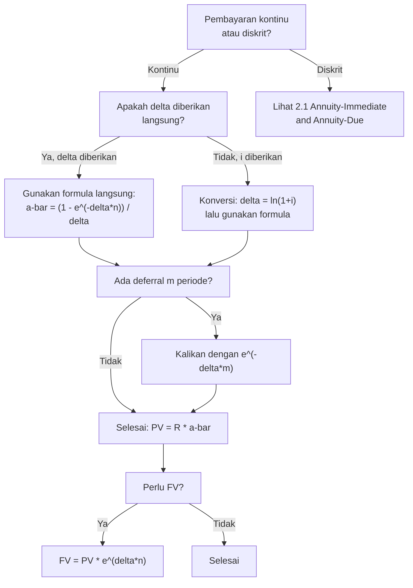

# 📘 2.4 — Continuous Annuities

> [!ABSTRACT] Ringkasan Cepat
> **Topik:** Continuous Annuities | **Bobot:** ~20–30% | **Difficulty:** Hard
> **Ref:** Vaaler Bab 3–4, Kellison Bab 3–4 | **Prereq:** [[2.1 Annuity-Immediate and Annuity-Due]], [[1.2 Effective, Nominal, and Force of Interest]]

## Section 0 — Pemetaan Topik

| Topik CF1 | Sub-topik ID | Skill Diuji | Bobot | Difficulty | Prerequisite | Connected Topics | Referensi |
|-----------|--------------|-------------|-------|------------|--------------|------------------|-----------|
| Topik 2: Anuitas dan Nilai Arus Kas | 2.4 | Menghitung $\bar{a}_{\overline{n}\|}$ dan $\bar{s}_{\overline{n}\|}$; memahami hubungan dengan $\delta$ (force of interest); konversi dari discrete ke continuous; menghitung PV/FV anuitas kontinu dengan force of interest konstan maupun variabel; identitas $\bar{a}_{\overline{n}\|} = a_{\overline{n}\|} \cdot \delta/i$ | 20–30% | Hard | [[2.1 Annuity-Immediate and Annuity-Due]], [[1.2 Effective, Nominal, and Force of Interest]] | [[2.1 Annuity-Immediate and Annuity-Due]], [[2.2 Perpetuity]], [[2.3 Varying Annuities]], [[1.2 Effective, Nominal, and Force of Interest]] | Vaaler Bab 3–4, Kellison Bab 3–4 |

## Section 1 — Intuisi

Bayangkan sebuah pompa air yang mengalirkan air secara terus-menerus—bukan setetes demi setetes di akhir setiap jam, melainkan mengalir tanpa henti setiap detik. Inilah analogi dari **continuous annuity**: aliran pembayaran yang berlangsung secara kontinu, bukan dalam cicilan diskrit. Dalam dunia nyata, pendapatan dari bisnis yang beroperasi setiap hari, atau biaya operasional yang terus berjalan, bisa dimodelkan sebagai anuitas kontinu. Meskipun dalam praktik pembayaran selalu diskrit, model kontinu memberikan formula yang lebih elegan dan sering digunakan sebagai aproksimasi untuk pembayaran yang sangat sering (misalnya harian atau per jam).

Kunci untuk memahami anuitas kontinu adalah konsep **force of interest** ($\delta$)—suku bunga kontinu yang menjadi "kecepatan" pertumbuhan uang setiap saat. Hubungan antara suku bunga efektif $i$ dan force of interest $\delta$ adalah $e^\delta = 1+i$, sehingga $\delta = \ln(1+i)$. Faktor diskonto kontinu untuk waktu $t$ adalah $e^{-\delta t}$, yang menggantikan $v^t = (1+i)^{-t}$ dalam formula diskrit. Semakin tinggi $\delta$, semakin cepat uang tumbuh, dan semakin kecil nilai sekarang dari pembayaran di masa depan.

Di ujian CF1, soal continuous annuity biasanya muncul dalam dua bentuk: (1) menghitung $\bar{a}_{\overline{n}|}$ atau $\bar{s}_{\overline{n}|}$ secara langsung dari $\delta$ atau $i$, dan (2) menggunakan identitas konversi $\bar{a}_{\overline{n}|} = (i/\delta) \cdot a_{\overline{n}|}$ untuk mengubah masalah kontinu ke diskrit atau sebaliknya. Topik ini juga menjadi fondasi untuk memahami [[3.3 Duration (Macaulay and Modified)]] dan model aktuaria lanjutan.

## Section 2 — Definisi Formal

> [!NOTE] Definisi Matematis
> **Continuous Annuity-Immediate** $\bar{a}_{\overline{n}|}$ : PV dari aliran pembayaran kontinu sebesar 1 per unit waktu selama $n$ periode, dengan force of interest konstan $\delta$.
>
> $$
> \bar{a}_{\overline{n}|\delta} = \int_0^n e^{-\delta t} \, dt = \frac{1 - e^{-\delta n}}{\delta}
> $$
>
> **Continuous Annuity FV** $\bar{s}_{\overline{n}|}$: FV dari aliran pembayaran kontinu sebesar 1 per unit waktu selama $n$ periode.
>
> $$
> \bar{s}_{\overline{n}|\delta} = \int_0^n e^{\delta(n-t)} \, dt = \frac{e^{\delta n} - 1}{\delta}
> $$

### Variabel & Parameter

| Simbol | Makna | Catatan |
|--------|-------|---------|
| $\delta$ | Force of interest (kontinu) — **bukan** dividend yield | $\delta = \ln(1+i)$; konteks: Topik 1–5 |
| $i$ | Suku bunga efektif per periode | $e^\delta = 1+i$ |
| $v$ | Faktor diskonto $= e^{-\delta} = 1/(1+i)$ | |
| $n$ | Durasi anuitas (kontinu, bisa non-integer) | |
| $\bar{a}_{\overline{n}\|\delta}$ | PV continuous annuity | $= (1-e^{-\delta n})/\delta$ |
| $\bar{s}_{\overline{n}\|\delta}$ | FV continuous annuity | $= (e^{\delta n}-1)/\delta$ |
| $\bar{a}_{\overline{\infty}\|}$ | PV continuous perpetuity | $= 1/\delta$ |
| $\rho(t)$ | Payment rate per unit time at time $t$ | Untuk varying continuous annuity |

### Rumus Utama

$$
\bar{a}_{\overline{n}|\delta} = \frac{1 - e^{-\delta n}}{\delta} = \frac{1 - v^n}{\delta}
$$
**Label:** PV continuous annuity — integral dari faktor diskonto kontinu $e^{-\delta t}$ dari $0$ ke $n$.

$$
\bar{s}_{\overline{n}|\delta} = \frac{e^{\delta n} - 1}{\delta} = \frac{(1+i)^n - 1}{\delta}
$$
**Label:** FV continuous annuity — integral dari faktor akumulasi $e^{\delta(n-t)}$ dari $0$ ke $n$.

$$
\bar{s}_{\overline{n}|} = \bar{a}_{\overline{n}|} \cdot e^{\delta n} = \bar{a}_{\overline{n}|} \cdot (1+i)^n
$$
**Label:** Hubungan FV dan PV — FV = PV dikali faktor akumulasi.

$$
\bar{a}_{\overline{n}|} = \frac{i}{\delta} \cdot a_{\overline{n}|}
$$
**Label:** Konversi discrete ke continuous — PV kontinu = PV diskrit dikali faktor $i/\delta$.

$$
\bar{a}_{\overline{n}|} = \frac{d}{\delta} \cdot \ddot{a}_{\overline{n}|}
$$
**Label:** Konversi dari annuity-due ke continuous — menggunakan $d = i \cdot v$.

$$
\bar{a}_{\overline{\infty}|\delta} = \frac{1}{\delta}
$$
**Label:** PV continuous perpetuity — limit $\bar{a}_{\overline{n}|}$ saat $n \to \infty$.

### Asumsi Eksplisit

- **Force of interest konstan:** $\delta$ konstan selama seluruh periode $n$ (kecuali dinyatakan $\delta_t$ variabel).
- **Payment rate konstan:** Pembayaran 1 per unit waktu secara kontinu (kecuali varying continuous annuity).
- **Continuous compounding:** Akumulasi menggunakan $e^{\delta t}$, bukan $(1+i)^t$ diskrit.

## Section 3 — Jembatan Logika

> [!TIP] Dari Time Diagram ke Equation of Value
> Dalam anuitas diskrit, kita menjumlahkan PV dari $n$ pembayaran di waktu $t = 1, 2, \ldots, n$:
> $$
> a_{\overline{n}|i} = \sum_{t=1}^{n} v^t
> $$
> Dalam anuitas kontinu, pembayaran terjadi setiap saat $t \in [0, n]$ dengan rate 1 per unit waktu. Alih-alih menjumlahkan, kita **mengintegralkan**:
> $$
> \bar{a}_{\overline{n}|\delta} = \int_0^n e^{-\delta t} \, dt
> $$
> Setiap elemen $e^{-\delta t} \, dt$ adalah PV dari pembayaran infinitesimal $dt$ yang terjadi pada waktu $t$, di-discount dengan faktor $e^{-\delta t}$.

> [!IMPORTANT] Focal Date
> $\bar{a}_{\overline{n}|}$ dievaluasi di $t=0$ (awal aliran pembayaran). $\bar{s}_{\overline{n}|}$ dievaluasi di $t=n$ (akhir aliran pembayaran). Tidak ada perbedaan "immediate vs due" dalam anuitas kontinu—pembayaran berlangsung sepanjang interval $[0, n]$.

**Derivasi $\bar{a}_{\overline{n}|}$:**

$$
\bar{a}_{\overline{n}|\delta} = \int_0^n e^{-\delta t} \, dt = \left[\frac{e^{-\delta t}}{-\delta}\right]_0^n = \frac{e^{-\delta \cdot 0} - e^{-\delta n}}{\delta} = \frac{1 - e^{-\delta n}}{\delta}
$$

Karena $e^{-\delta n} = (e^{-\delta})^n = v^n$:

$$
\bar{a}_{\overline{n}|\delta} = \frac{1 - v^n}{\delta}
$$

**Derivasi Identitas Konversi $\bar{a}_{\overline{n}|} = (i/\delta) \cdot a_{\overline{n}|}$:**

$$
a_{\overline{n}|i} = \frac{1 - v^n}{i}, \qquad \bar{a}_{\overline{n}|\delta} = \frac{1 - v^n}{\delta}
$$

Pembilang sama! Sehingga:

$$
\frac{\bar{a}_{\overline{n}|\delta}}{a_{\overline{n}|i}} = \frac{(1-v^n)/\delta}{(1-v^n)/i} = \frac{i}{\delta}
$$

$$
\boxed{\bar{a}_{\overline{n}|} = \frac{i}{\delta} \cdot a_{\overline{n}|}}
$$

Karena $\delta = \ln(1+i) < i$ (untuk $i > 0$), maka $i/\delta > 1$, sehingga $\bar{a}_{\overline{n}|} > a_{\overline{n}|}$. Ini masuk akal: anuitas kontinu membayar lebih awal (sepanjang periode) dibanding anuitas-immediate yang membayar di akhir.

**Derivasi $\bar{a}_{\overline{\infty}|}$:**

$$
\bar{a}_{\overline{\infty}|\delta} = \lim_{n \to \infty} \frac{1 - e^{-\delta n}}{\delta} = \frac{1 - 0}{\delta} = \frac{1}{\delta}
$$

> [!DANGER] Dilarang
> 1. **Menggunakan $i$ sebagai pengganti $\delta$ dalam formula $\bar{a}_{\overline{n}|}$:** Formula $\bar{a}_{\overline{n}|} = (1-v^n)/\delta$ menggunakan $\delta$, bukan $i$. Menggunakan $i$ akan menghasilkan $a_{\overline{n}|}$ (diskrit), bukan $\bar{a}_{\overline{n}|}$ (kontinu).
> 2. **Lupa konversi $\delta = \ln(1+i)$:** Jika soal memberikan $i$ (efektif), harus konversi ke $\delta$ sebelum menggunakan formula kontinu. $\delta \neq i$.
> 3. **Mengasumsikan $\bar{a}_{\overline{n}|} < a_{\overline{n}|}$:** Karena $\delta < i$, maka $i/\delta > 1$, sehingga $\bar{a}_{\overline{n}|} > a_{\overline{n}|}$ selalu. Anuitas kontinu lebih besar karena pembayaran dimulai lebih awal.

## Section 4 — Contoh Soal

### Soal A — Fundamental

Sebuah proyek menghasilkan pendapatan secara kontinu sebesar Rp 6.000.000 per tahun selama 5 tahun. Force of interest adalah $\delta = 8\%$ per tahun. Hitunglah:
(a) Present value dari seluruh pendapatan proyek ($\bar{a}_{\overline{5}|0.08}$)
(b) Future value dari seluruh pendapatan proyek ($\bar{s}_{\overline{5}|0.08}$)

**Data yang diberikan:**
- Payment rate $= 6.000.000$ per tahun (kontinu)
- $\delta = 0.08$ per tahun (force of interest)
- $n = 5$ tahun

> [!SUCCESS] Solusi Soal A
> 
> **1. Identifikasi Variabel**
> - $\delta = 0.08$, $n = 5$, payment rate $R = 6.000.000$
> - $e^{-\delta n} = e^{-0.08 \times 5} = e^{-0.4}$
> - $e^{-0.4} = 0.67032$
> 
> **2. Time Diagram**
> ```
> t=0 ──────────────────────────────── t=5
>      ←── kontinu, rate 6M/tahun ───→
> PV=?                                FV=?
> ```
> Aliran kontinu: setiap infinitesimal $dt$ menghasilkan $6.000.000 \, dt$ yang di-discount ke $t=0$.
> 
> **3. Equation of Value** *(pada Focal Date $t = 0$ untuk PV, $t = 5$ untuk FV)*
> 
> $$
> PV = 6.000.000 \times \bar{a}_{\overline{5}|0.08} = 6.000.000 \times \frac{1 - e^{-0.4}}{0.08}
> $$
> 
> $$
> FV = 6.000.000 \times \bar{s}_{\overline{5}|0.08} = 6.000.000 \times \frac{e^{0.4} - 1}{0.08}
> $$
> 
> **4. Eksekusi Aljabar**
> 
> **(a) PV:**
> 
> $$
> \bar{a}_{\overline{5}|0.08} = \frac{1 - 0.67032}{0.08} = \frac{0.32968}{0.08} = 4.1210
> $$
> 
> $$
> PV = 6.000.000 \times 4.1210 = 24.726.000
> $$
> 
> **(b) FV:**
> 
> $$
> e^{0.4} = 1/0.67032 = 1.49182
> $$
> 
> $$
> \bar{s}_{\overline{5}|0.08} = \frac{1.49182 - 1}{0.08} = \frac{0.49182}{0.08} = 6.1478
> $$
> 
> $$
> FV = 6.000.000 \times 6.1478 = 36.886.800
> $$
> 
> **5. Verification**
> 
> Cek hubungan FV = PV $\times e^{\delta n}$:
> 
> $$
> FV = 24.726.000 \times e^{0.4} = 24.726.000 \times 1.49182 = 36.886.800 \checkmark
> $$
> 
> Cek batas: $PV < 6.000.000 \times 5 = 30.000.000$ (total undiscounted) ✓

> [!WARNING] Exam Tips — Soal A
> **Target waktu:** 2–3 menit. **Common trap:** Menggunakan $i$ alih-alih $\delta$ dalam formula. Jika soal memberi $\delta$ langsung, gunakan langsung. **Shortcut:** $\bar{s}_{\overline{n}|} = \bar{a}_{\overline{n}|} \times e^{\delta n}$ — hitung PV dulu, lalu kalikan $e^{\delta n}$.

---

### Soal B — Exam-Typical

Sebuah mesin industri menghasilkan pendapatan kontinu selama 8 tahun. Suku bunga efektif tahunan adalah $i = 10\%$. Hitunglah present value dari pendapatan sebesar Rp 12.000.000 per tahun secara kontinu, menggunakan:
(a) Formula langsung $\bar{a}_{\overline{8}|\delta}$
(b) Identitas konversi $\bar{a}_{\overline{n}|} = (i/\delta) \cdot a_{\overline{n}|}$

Verifikasi bahwa kedua metode menghasilkan jawaban yang sama.

**Data yang diberikan:**
- Payment rate $= 12.000.000$ per tahun (kontinu)
- $i = 10\% = 0.10$ per tahun efektif
- $n = 8$ tahun
- $\delta = \ln(1.10) = 0.09531$ per tahun

> [!SUCCESS] Solusi Soal B
> 
> **1. Identifikasi Variabel**
> - $i = 0.10$, $\delta = \ln(1.10) = 0.09531$, $n = 8$
> - $v^8 = (1.10)^{-8} = 1/(1.10)^8$
> - $(1.10)^8 = 2.14359$, sehingga $v^8 = 0.46651$
> 
> **2. Time Diagram**
> ```
> t=0 ──────────────────────────────── t=8
>      ←── kontinu, rate 12M/tahun ──→
> PV=?
> ```
> 
> **3. Equation of Value** *(pada Focal Date $t = 0$)*
> 
> **(a) Formula langsung:**
> $$
> PV = 12.000.000 \times \bar{a}_{\overline{8}|\delta} = 12.000.000 \times \frac{1 - v^8}{\delta}
> $$
> 
> **(b) Via konversi:**
> $$
> PV = 12.000.000 \times \frac{i}{\delta} \times a_{\overline{8}|i}
> $$
> 
> **4. Eksekusi Aljabar**
> 
> **(a) Formula langsung:**
> 
> $$
> \bar{a}_{\overline{8}|0.09531} = \frac{1 - 0.46651}{0.09531} = \frac{0.53349}{0.09531} = 5.5974
> $$
> 
> $$
> PV_a = 12.000.000 \times 5.5974 = 67.168.800
> $$
> 
> **(b) Via konversi:**
> 
> $$
> a_{\overline{8}|0.10} = \frac{1 - 0.46651}{0.10} = \frac{0.53349}{0.10} = 5.3349
> $$
> 
> $$
> \frac{i}{\delta} = \frac{0.10}{0.09531} = 1.04921
> $$
> 
> $$
> \bar{a}_{\overline{8}|} = 1.04921 \times 5.3349 = 5.5974
> $$
> 
> $$
> PV_b = 12.000.000 \times 5.5974 = 67.168.800 \checkmark
> $$
> 
> **5. Verification**
> 
> Kedua metode identik ✓. Cek: $\bar{a}_{\overline{8}|} = 5.5974 > a_{\overline{8}|} = 5.3349$ ✓ (kontinu lebih besar dari diskrit).
> 
> Rasio: $\bar{a}/a = 5.5974/5.3349 = 1.04921 = i/\delta$ ✓

> [!WARNING] Exam Tips — Soal B
> **Target waktu:** 3–4 menit. **Common trap:** Lupa menghitung $\delta = \ln(1+i)$ saat soal memberi $i$ efektif. **Shortcut:** Metode (b) lebih cepat jika tabel $a_{\overline{n}|}$ tersedia—cukup kalikan dengan $i/\delta$.

---

### Soal C — Challenging

Sebuah dana pensiun menerima kontribusi kontinu selama 10 tahun pertama, kemudian membayar manfaat kontinu selama 15 tahun berikutnya. Kontribusi sebesar Rp 8.000.000 per tahun (kontinu, $t = 0$ s.d. $t = 10$). Manfaat sebesar Rp $X$ per tahun (kontinu, $t = 10$ s.d. $t = 25$). Force of interest $\delta = 6\%$ per tahun konstan.

Hitunglah $X$ agar nilai sekarang kontribusi sama dengan nilai sekarang manfaat (equation of value di $t = 0$).

**Data yang diberikan:**
- Kontribusi: $8.000.000$ per tahun kontinu, $t \in [0, 10]$
- Manfaat: $X$ per tahun kontinu, $t \in [10, 25]$
- $\delta = 0.06$

> [!SUCCESS] Solusi Soal C
> 
> **1. Identifikasi Variabel**
> - $\delta = 0.06$, kontribusi rate $= 8.000.000$, manfaat rate $= X$
> - $e^{-0.06 \times 10} = e^{-0.6} = 0.54881$
> - $e^{-0.06 \times 25} = e^{-1.5} = 0.22313$
> - $\bar{a}_{\overline{10}|0.06}$: PV kontribusi
> - ${}_{10|}\bar{a}_{\overline{15}|0.06}$: PV manfaat (deferred 10 tahun, durasi 15 tahun)
> 
> **2. Time Diagram**
> ```
> t=0 ──────── t=10 ──────────────── t=25
>      8M/thn         X/thn
>      kontinu        kontinu
> PV₁ (kontribusi)   PV₂ (manfaat, deferred)
> ```
> 
> **3. Equation of Value** *(pada Focal Date $t = 0$)*
> 
> $$
> 8.000.000 \times \bar{a}_{\overline{10}|0.06} = X \times {}_{10|}\bar{a}_{\overline{15}|0.06}
> $$
> 
> Di mana:
> $$
> {}_{10|}\bar{a}_{\overline{15}|0.06} = e^{-\delta \times 10} \times \bar{a}_{\overline{15}|0.06}
> $$
> 
> **4. Eksekusi Aljabar**
> 
> **Hitung $\bar{a}_{\overline{10}|0.06}$:**
> 
> $$
> \bar{a}_{\overline{10}|0.06} = \frac{1 - e^{-0.6}}{0.06} = \frac{1 - 0.54881}{0.06} = \frac{0.45119}{0.06} = 7.5198
> $$
> 
> **Hitung $\bar{a}_{\overline{15}|0.06}$:**
> 
> $$
> e^{-0.06 \times 15} = e^{-0.9} = 0.40657
> $$
> 
> $$
> \bar{a}_{\overline{15}|0.06} = \frac{1 - 0.40657}{0.06} = \frac{0.59343}{0.06} = 9.8905
> $$
> 
> **Hitung ${}_{10|}\bar{a}_{\overline{15}|0.06}$:**
> 
> $$
> {}_{10|}\bar{a}_{\overline{15}|0.06} = e^{-0.6} \times 9.8905 = 0.54881 \times 9.8905 = 5.4280
> $$
> 
> **Solve $X$:**
> 
> $$
> 8.000.000 \times 7.5198 = X \times 5.4280
> $$
> 
> $$
> 60.158.400 = X \times 5.4280
> $$
> 
> $$
> X = \frac{60.158.400}{5.4280} = 11.082.000
> $$
> 
> **Manfaat per tahun = Rp 11.082.000**
> 
> **5. Verification**
> 
> PV kontribusi $= 8.000.000 \times 7.5198 = 60.158.400$
> 
> PV manfaat $= 11.082.000 \times 5.4280 = 60.161.000 \approx 60.158.400$ ✓ (rounding)
> 
> Cek logika: Manfaat ($X = 11.08M$) $>$ kontribusi ($8M$) karena manfaat dimulai lebih lambat (deferred 10 tahun) sehingga PV-nya lebih kecil per unit, membutuhkan rate yang lebih tinggi untuk menyeimbangkan.

> [!WARNING] Exam Tips — Soal C
> **Target waktu:** 6–7 menit. **Common trap:** Menghitung PV manfaat di $t=10$ (bukan $t=0$). PV di $t=10$ adalah $X \times \bar{a}_{\overline{15}|}$, tapi harus di-discount lagi ke $t=0$ dengan $e^{-\delta \times 10}$. **Shortcut:** ${}_{m|}\bar{a}_{\overline{n}|} = e^{-\delta m} \times \bar{a}_{\overline{n}|}$ — selalu kalikan dengan faktor diskonto $e^{-\delta m}$ untuk deferral.

## Section 5 — Verifikasi & Sanity Check

> [!CHECK] Batas Nilai Continuous Annuity
> 1. **$\bar{a}_{\overline{n}|} > a_{\overline{n}|}$ selalu:** Karena $\delta < i$, maka $i/\delta > 1$. Anuitas kontinu selalu lebih besar dari anuitas-immediate diskrit.
> 2. **$\bar{a}_{\overline{n}|} < \ddot{a}_{\overline{n}|}$ selalu:** Anuitas-due (bayar di awal) lebih besar dari kontinu. Urutan: $a_{\overline{n}|} < \bar{a}_{\overline{n}|} < \ddot{a}_{\overline{n}|}$.
> 3. **Limit:** $\bar{a}_{\overline{\infty}|} = 1/\delta$ (continuous perpetuity).

> [!CHECK] Konversi dan Konsistensi
> 1. **Cek $\delta = \ln(1+i)$:** Jika $i = 10\%$, maka $\delta = 0.09531 < 0.10 = i$ ✓
> 2. **Cek $i/\delta > 1$:** Selalu true untuk $i > 0$. Jika $i/\delta < 1$, ada kesalahan konversi.
> 3. **Cek FV = PV $\times e^{\delta n}$:** Selalu berlaku untuk anuitas kontinu.

### Metode Alternatif

**Konversi via $m$-thly annuity:**

Saat $m \to \infty$, anuitas $m$-thly konvergen ke anuitas kontinu:

$$
\lim_{m \to \infty} a^{(m)}_{\overline{n}|} = \bar{a}_{\overline{n}|}
$$

$$
a^{(m)}_{\overline{n}|} = \frac{i}{i^{(m)}} \cdot a_{\overline{n}|} \xrightarrow{m \to \infty} \frac{i}{\delta} \cdot a_{\overline{n}|} = \bar{a}_{\overline{n}|}
$$

Ini menunjukkan bahwa $\bar{a}_{\overline{n}|}$ adalah limit alami dari anuitas diskrit saat frekuensi pembayaran $\to \infty$.

**Deferred Continuous Annuity:**

$$
{}_{m|}\bar{a}_{\overline{n}|\delta} = e^{-\delta m} \cdot \bar{a}_{\overline{n}|\delta} = \frac{e^{-\delta m} - e^{-\delta(m+n)}}{\delta}
$$

## Section 6 — Visualisasi Mental

**Continuous vs Discrete Annuity — Perbandingan PV:**

Grafik dengan **sumbu X = waktu $t$**, **sumbu Y = PV dari pembayaran di waktu $t$**.

- **Anuitas-immediate diskrit:** Titik-titik di $t = 1, 2, \ldots, n$, masing-masing dengan tinggi $v^t$.
- **Anuitas kontinu:** Kurva kontinu $e^{-\delta t}$ dari $t=0$ ke $t=n$. Area di bawah kurva = $\bar{a}_{\overline{n}|}$.
- **Anuitas-due diskrit:** Titik-titik di $t = 0, 1, \ldots, n-1$, masing-masing dengan tinggi $v^t$.

Urutan area: $a_{\overline{n}|}$ (titik di akhir) $<$ $\bar{a}_{\overline{n}|}$ (area kontinu) $<$ $\ddot{a}_{\overline{n}|}$ (titik di awal).

**Kurva Diskonto Kontinu $e^{-\delta t}$:**

Grafik dengan **sumbu X = waktu $t$**, **sumbu Y = $e^{-\delta t}$**.

- Kurva **exponential decreasing** dari 1 (di $t=0$) menuju 0 (saat $t \to \infty$).
- Semakin besar $\delta$, semakin curam penurunan kurva (discounting lebih agresif).
- Area di bawah kurva dari $0$ ke $n$ = $\bar{a}_{\overline{n}|}$.

### Hubungan Visual ↔ Rumus

**Area di bawah kurva = integral = $\bar{a}_{\overline{n}|}$:**

$$
\bar{a}_{\overline{n}|} = \int_0^n e^{-\delta t} \, dt = \text{Area di bawah } e^{-\delta t} \text{ dari } 0 \text{ ke } n
$$

**Selisih area = deferred annuity:**

$$
{}_{m|}\bar{a}_{\overline{n}|} = \int_m^{m+n} e^{-\delta t} \, dt = \text{Area dari } m \text{ ke } m+n
$$

## Section 7 — Jebakan Umum

> [!BUG] Kesalahan Unit Waktu
> **Contoh Salah:** Soal memberi $i = 12\%$ per tahun, $n = 24$ bulan. Menggunakan $\delta = \ln(1.12)$ (annual) dengan $n = 24$ (bulan).
>
> **Benar:** Konsistensi unit wajib. Pilih satu: (a) $\delta_{\text{annual}} = \ln(1.12) = 0.1133$, $n = 2$ tahun; atau (b) $\delta_{\text{monthly}} = \ln(1.12)/12 = 0.009439$, $n = 24$ bulan.

> [!BUG] Kesalahan Konseptual
> 1. **$\delta = i$ (SALAH):** $\delta = \ln(1+i) \neq i$. Selalu $\delta < i$ untuk $i > 0$. Menggunakan $i$ sebagai $\delta$ menghasilkan $\bar{a}_{\overline{n}|} = a_{\overline{n}|}$ (salah).
> 2. **$\bar{a}_{\overline{n}|} < a_{\overline{n}|}$ (SALAH):** Karena $\delta < i$, maka $(1-v^n)/\delta > (1-v^n)/i$, sehingga $\bar{a}_{\overline{n}|} > a_{\overline{n}|}$.
> 3. **Lupa faktor $e^{-\delta m}$ untuk deferred continuous annuity:** ${}_{m|}\bar{a}_{\overline{n}|} = e^{-\delta m} \cdot \bar{a}_{\overline{n}|}$, bukan $\bar{a}_{\overline{n}|}$ saja.
> 4. **Menggunakan $v^m = (1+i)^{-m}$ sebagai faktor deferral:** Untuk anuitas kontinu, faktor deferral adalah $e^{-\delta m}$. Namun karena $e^{-\delta} = v$, maka $e^{-\delta m} = v^m$ — keduanya identik! Ini tidak salah, tapi pastikan konsisten.

> [!BUG] Kesalahan Interpretasi Soal
> **Ambiguitas:** "Pembayaran kontinu" vs "pembayaran sangat sering (monthly/daily)." Jika soal menyebut "kontinu," gunakan $\bar{a}_{\overline{n}|}$ dengan $\delta$. Jika "monthly," gunakan $a^{(12)}_{\overline{n}|}$ dengan $i^{(12)}$.
>
> **Ambiguitas $\delta$:** Dalam konteks Topik 6 (Derivatives), $\delta$ berarti dividend yield. Dalam Topik 1–5, $\delta$ adalah force of interest. Selalu cek konteks soal.

> [!CAUTION] Red Flags
> - **"Kontinu" atau "continuously":** Trigger untuk $\bar{a}_{\overline{n}|}$ dan $\delta$. Konversi $i$ ke $\delta$ terlebih dahulu.
> - **"Force of interest $\delta$":** Soal sudah memberi $\delta$ langsung—gunakan langsung dalam formula.
> - **"Effective annual rate $i$":** Harus konversi ke $\delta = \ln(1+i)$ sebelum menggunakan formula kontinu.
> - **Soal minta perbandingan discrete vs continuous:** Gunakan identitas $\bar{a}_{\overline{n}|} = (i/\delta) \cdot a_{\overline{n}|}$.

## Section 8 — Ringkasan Eksekutif

> [!SUMMARY] Must-Remember
> 1. **PV continuous annuity:**
>    $$
>    \bar{a}_{\overline{n}|\delta} = \frac{1 - e^{-\delta n}}{\delta} = \frac{1 - v^n}{\delta}
>    $$
> 2. **FV continuous annuity:**
>    $$
>    \bar{s}_{\overline{n}|\delta} = \frac{e^{\delta n} - 1}{\delta}
>    $$
> 3. **Konversi discrete ke continuous:**
>    $$
>    \bar{a}_{\overline{n}|} = \frac{i}{\delta} \cdot a_{\overline{n}|}, \qquad \delta = \ln(1+i)
>    $$
> 4. **Deferred continuous annuity:**
>    $$
>    {}_{m|}\bar{a}_{\overline{n}|\delta} = e^{-\delta m} \cdot \bar{a}_{\overline{n}|\delta}
>    $$
> 5. **Continuous perpetuity:**
>    $$
>    \bar{a}_{\overline{\infty}|\delta} = \frac{1}{\delta}
>    $$

### Kapan Digunakan

- **Trigger keywords:** "kontinu," "continuously," "force of interest $\delta$," "aliran kontinu," "pendapatan terus-menerus."
- **Tipe skenario soal:**
  - Hitung PV/FV dari aliran pendapatan kontinu (proyek, mesin, bisnis).
  - Konversi antara anuitas diskrit dan kontinu.
  - Equation of value dengan campuran kontribusi dan manfaat kontinu.
  - Soal yang memberi $\delta$ langsung (bukan $i$).

### Kapan TIDAK Boleh Digunakan

- **Jika pembayaran diskrit (bulanan, tahunan, dll.):** Gunakan [[2.1 Annuity-Immediate and Annuity-Due]] atau anuitas $m$-thly dari [[1.2 Effective, Nominal, and Force of Interest]].
- **Jika $\delta$ variabel ($\delta_t$):** Formula standar tidak berlaku; gunakan integral $\int_0^n \exp\left(-\int_0^t \delta_s \, ds\right) dt$ [BEYOND CF1].

### Quick Decision Tree



---

> [!QUOTE] Follow-up Options
> 1. *"Berikan contoh soal varying continuous annuity dengan payment rate berubah"*
> 2. *"Jelaskan hubungan [[2.4 Continuous Annuities]] dengan [[1.2 Effective, Nominal, and Force of Interest]]"*
> 3. *"Buat flashcard 1-halaman untuk topik ini"*

*📖 Ref: Vaaler Bab 3–4, Kellison Bab 3–4 | 🗓️ 2026-02-18 | #CF1 #ContinuousAnnuity #ForceOfInterest #Delta*
