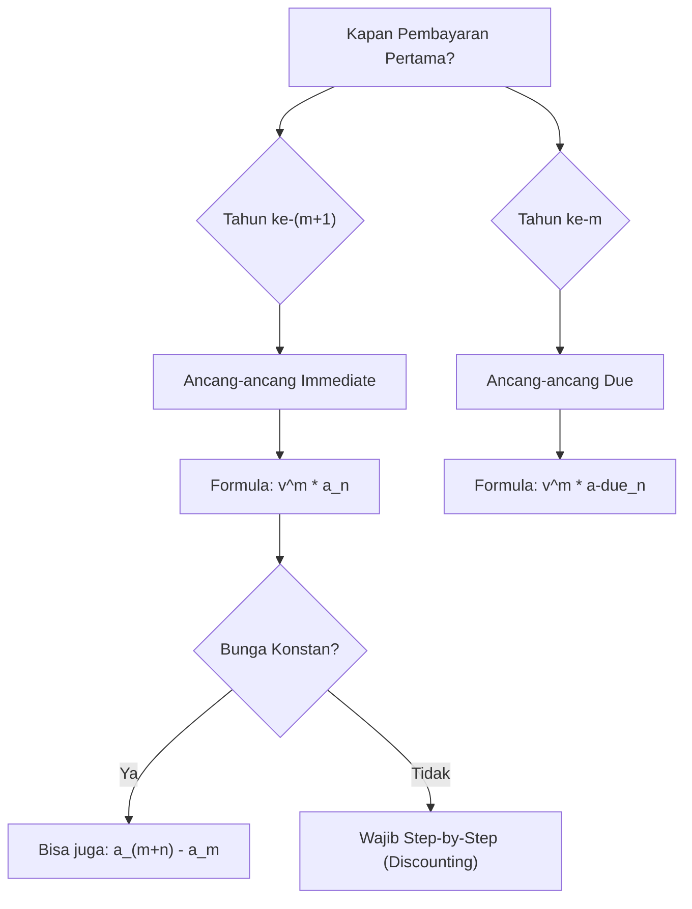

# 📘 2.5 — Deferred Annuities

> [!ABSTRACT] Ringkasan Cepat
> **Topik:** Deferred Annuities | **Bobot:** ~20–30% | **Difficulty:** Medium
> **Ref:** Vaaler Bab 3–4, Kellison Bab 3–4 | **Prereq:** [[2.1 Annuity-Immediate and Annuity-Due]], [[2.2 Perpetuity]]

## Section 0 — Pemetaan Topik

| Topik CF1                           | Sub-topik ID | Skill Diuji                                                                                                                                                                                                  | Bobot  | Difficulty | Prerequisite                              | Connected Topics                                                       | Referensi                        |
| ----------------------------------- | ------------ | ------------------------------------------------------------------------------------------------------------------------------------------------------------------------------------------------------------ | ------ | ---------- | ----------------------------------------- | ---------------------------------------------------------------------- | -------------------------------- |
| Topik 2: Anuitas dan Nilai Arus Kas | 2.5          | Menghitung PV/FV dari anuitas yang ditunda ($_{m}a_{\overline{n}}$, $_{m}\ddot{a}_{\overline{n}}$); memahami metode "discounting back" vs "selisih anuitas"; aplikasi pada dana pensiun dan asuransi dwiguna | 20–30% | Medium     | [[2.1 Annuity-Immediate and Annuity-Due]] | [[2.2 Perpetuity]], [[2.4 Continuous Annuities]], [[5.1 Bond Pricing]] | Vaaler Bab 3–4, Kellison Bab 3–4 |

## Section 1 — Intuisi

Bayangkan Anda membeli polis asuransi pensiun hari ini (usia 30), tetapi pembayarannya baru akan dimulai saat Anda pensiun nanti (usia 60). Selama 30 tahun pertama ("periode penundaan"), uang Anda hanya "duduk diam" (atau lebih tepatnya, berbunga) tanpa ada pembayaran keluar. Baru setelah periode itu selesai, aliran pembayaran anuitas dimulai. Inilah konsep **deferred annuity**: anuitas yang waktu mulainya digeser ke masa depan.

Secara matematis, menghitung nilai sekarang (PV) dari deferred annuity hanyalah masalah dua langkah sederhana: (1) hitung nilai anuitas seolah-olah dimulai tepat saat periode pembayaran bermula, lalu (2) bawa nilai tersebut mundur (discount) melewati periode penundaan ke hari ini. Alternatifnya, Anda bisa membayangkannya sebagai "selisih": anuitas jangka panjang (mulai hari ini sampai akhir pembayaran pensiun) *dikurangi* anuitas jangka pendek (selama masa tunggu). Kedua cara pandang ini valid dan sering diuji di CF1.

Dalam ujian, jebakan paling umum adalah salah menentukan "kapan" anuitas itu sebenarnya dimulai. Apakah "ditunda 5 tahun" berarti pembayaran pertama di akhir tahun ke-5 atau akhir tahun ke-6? Memahami definisi presisi simbol $_{m|}a_{\overline{n}|}$ sangat krusial untuk menghindari kesalahan "off-by-one" yang fatal.

## Section 2 — Definisi Formal

> [!NOTE] Definisi Matematis
> **Deferred Annuity-Immediate** $_{m|}a_{\overline{n}|}$: PV dari anuitas $n$ periode yang pembayarannya dimulai $m$ periode dari sekarang. Pembayaran pertama terjadi di $t = m+1$.
>
> $$
> _{m|}a_{\overline{n}|} = v^m \cdot a_{\overline{n}|} = a_{\overline{m+n}|} - a_{\overline{m}|}
> $$
>
> **Deferred Annuity-Due** $_{m|}\ddot{a}_{\overline{n}|}$: Pembayaran pertama terjadi di $t = m$.
>
> $$
> _{m|}\ddot{a}_{\overline{n}|} = v^m \cdot \ddot{a}_{\overline{n}|} = \ddot{a}_{\overline{m+n}|} - \ddot{a}_{\overline{m}|}
> $$

### Variabel & Parameter

| Simbol | Makna | Catatan |
|--------|-------|---------|
| $m$ | Periode penundaan (deferral period) | Tidak ada pembayaran selama $t \in (0, m]$ untuk immediate |
| $n$ | Durasi pembayaran anuitas | Jumlah total pembayaran |
| $_{m|}a_{\overline{n}\|}$ | PV deferred annuity-immediate | Pembayaran pertama di $t=m+1$ |
| $_{m|}\ddot{a}_{\overline{n}\|}$ | PV deferred annuity-due | Pembayaran pertama di $t=m$ |
| $v^m$ | Faktor diskonto selama masa tunggu | Kunci dari metode discounting |
| $a_{\overline{m+n}\|}$ | Anuitas penuh (tunggu + bayar) | Komponen metode selisih |

### Rumus Utama

$$
_{m|}a_{\overline{n}|} = v^m \cdot a_{\overline{n}|}
$$
**Label:** Metode Discounting (Standard) — Hitung PV anuitas di $t=m$, lalu diskontokan $m$ periode ke $t=0$.

$$
_{m|}a_{\overline{n}|} = a_{\overline{m+n}|} - a_{\overline{m}|}
$$
**Label:** Metode Selisih (Difference) — PV anuitas jangka panjang ($m+n$) dikurangi PV anuitas masa tunggu ($m$).

$$
FV = _{m|}a_{\overline{n}|} \cdot (1+i)^{m+n} = s_{\overline{n}|}
$$
**Label:** FV di akhir kontrak ($t=m+n$) — sama dengan $s_{\overline{n}|}$, karena penundaan di awal tidak mempengaruhi nilai akhir dari pembayaran yang sama.

### Asumsi Eksplisit

- **Suku bunga konstan:** $i$ berlaku sama baik selama periode penundaan $m$ maupun periode pembayaran $n$. (Jika $i$ berbeda, metode selisih $a_{\overline{m+n}|} - a_{\overline{m}|}$ **TIDAK** boleh digunakan; harus pakai metode discounting).
- **Kepastian Pembayaran:** Tidak ada risiko gagal bayar atau kematian (kecuali dalam konteks *Life Contingencies* - Exam A6).

## Section 3 — Jembatan Logika

> [!TIP] Dari Time Diagram ke Equation of Value
> Bayangkan *Deferred Annuity-Immediate*:
>
> $$
> \begin{array}{ccccccc}
> t=0 & \cdots & m & m+1 & m+2 & \cdots & m+n \\
> \downarrow & & \downarrow & \downarrow & \downarrow & & \downarrow \\
> PV=? & \text{No Pay} & \text{No Pay} & 1 & 1 & \cdots & 1
> \end{array}
> $$
>
> **Cara Pandang 1 (Discounting):**
> Kelompok pembayaran $1, \dots, 1$ dari $m+1$ sampai $m+n$ adalah sebuah *Annuity-Immediate* biasa jika kita berdiri di $t=m$. Nilainya di $t=m$ adalah $a_{\overline{n}|}$.
> Untuk mendapatkan nilai di $t=0$, kita tarik nilai $a_{\overline{n}|}$ ini mundur sejauh $m$ periode:
> $$ PV = v^m \cdot a_{\overline{n}|} $$
>
> **Cara Pandang 2 (Selisih):**
> Bayangkan anuitas penuh dari $t=1$ sampai $t=m+n$ (sebesar $a_{\overline{m+n}|}$).
> Tapi kita tidak menerima pembayaran dari $t=1$ sampai $t=m$ (sebesar $a_{\overline{m}|}$).
> Jadi, kurangkan saja bagian yang "hilang" itu:
> $$ PV = a_{\overline{m+n}|} - a_{\overline{m}|} $$

> [!IMPORTANT] Focal Date
> Perhati-hati dengan **Deferred Annuity-Due**.
> Simbol $_{m|}\ddot{a}_{\overline{n}|}$ berarti pembayaran pertama di $t=m$.
> PV di $t=0$ adalah $v^m \cdot \ddot{a}_{\overline{n}|}$.
>
> Bandingkan dengan **Deferred Annuity-Immediate**:
> Simbol $_{m|}a_{\overline{n}|}$ berarti pembayaran pertama di $t=m+1$.
> PV di $t=0$ adalah $v^m \cdot a_{\overline{n}|}$.
>
> Ingat: Faktor diskonto $v^m$ selalu menarik nilai dari $t=m$ ke $t=0$. Pertanyaannya adalah apakah $t=m$ itu satu periode *sebelum* pembayaran pertama (immediate) atau tepat *saat* pembayaran pertama (due).

> [!DANGER] Dilarang
> 1. **Salah timing pembayaran pertama:** $_{m|}a_{\overline{n}|}$ bayar pertama di $t=m+1$, BUKAN $t=m$. Jika bayar di $t=m$, itu adalah $_{m|}\ddot{a}_{\overline{n}|}$ atau $_{m-1|}a_{\overline{n}|}$.
> 2. **Metode selisih saat bunga berubah:** Jika $i_1$ untuk masa tunggu dan $i_2$ untuk masa bayar, rumus $a_{\overline{m+n}|} - a_{\overline{m}|}$ **SALAH TOTAL**. Anda wajib menggunakan metode discounting: $v_{i_1}^m \cdot a_{\overline{n}|i_2}$.

## Section 4 — Contoh Soal

### Soal A — Fundamental

Seorang investor ingin menerima Rp 10.000.000 setiap akhir tahun selama 20 tahun. Uang ini diinginkan mulai diterima **5 tahun dari sekarang** (pembayaran pertama di akhir tahun ke-5 dari hari ini).
Asumsi suku bunga efektif 6% per tahun. Berapa dana yang harus disiapkan hari ini?

**Analisis Timing:**
- "Mulai 5 tahun dari sekarang" (akhir tahun ke-5) $\rightarrow$ Pembayaran pertama di $t=5$.
- Kita mencari PV di $t=0$.

> [!SUCCESS] Solusi Soal A
> 
> **1. Identifikasi Variabel**
> - Pembayaran $R = 10.000.000$.
> - Durasi $n = 20$.
> - Pembayaran pertama di $t=5$.
> - Ini bisa dipandang sebagai **Deferred Annuity-Immediate** dengan deferral $m=4$, karena annuity-immediate membayar di akhir periode pertama setelah "start". Jika start di $t=4$, bayar pertama di $t=5$.
> - Atau: **Deferred Annuity-Due** dengan deferral $m=5$.
> - Mari gunakan pendekatan standar: "Annuity-due yang ditunda 5 tahun" ($_{5|}\ddot{a}_{\overline{20}|}$) atau "Annuity-immediate yang ditunda 4 tahun" ($_{4|}a_{\overline{20}|}$). Keduanya valid dan ekuivalen.
> - Mari pakai $_{4|}a_{\overline{20}|}$ agar konsisten dengan rumus umum $_{m|}a_{\overline{n}|}$ di mana $1^\text{st}$ payment adalah di $m+1$.
> - Jadi: $m=4$, $n=20$, $i=6\%$.
> 
> **2. Time Diagram**
> ```
> t=0   1   2   3   4      5       6           24
>  |----|---|---|---|------|-------|--...------|
>  PV   -   -   -   -     10M     10M         10M
>                       (1st)               (20th)
> ```
> Perhatikan: Pembayaran ke-1 di $t=5$, pembayaran ke-20 di $t=24$.
> 
> **3. Equation of Value**
> $$ PV = 10.000.000 \cdot _{4|}a_{\overline{20}|6\%} = 10.000.000 \cdot v^4 \cdot a_{\overline{20}|6\%} $$
> 
> **4. Eksekusi Aljabar**
> $$ a_{\overline{20}|6\%} = \frac{1 - (1.06)^{-20}}{0.06} = \frac{1 - 0.31180}{0.06} = 11.4699 $$
> $$ v^4 = (1.06)^{-4} = 0.79209 $$
> $$ PV = 10.000.000 \cdot (0.79209) \cdot (11.4699) $$
> $$ PV = 10.000.000 \cdot 9.0853 = 90.853.000 $$
> 
> **5. Verification**
> Metode Selisih:
> Pembayaran terjadi di $t=5, \dots, 24$.
> Ini sama dengan anuitas $a_{\overline{24}|}$ dikurangi $a_{\overline{4}|}$.
> $a_{\overline{24}|} = 12.5504$.
> $a_{\overline{4}|} = 3.4651$.
> $12.5504 - 3.4651 = 9.0853$.
> $9.0853 \cdot 10M = 90.853.000$. Cocok. ✓

> [!WARNING] Exam Tips — Soal A
> **Jebakan:** Mengira "mulai 5 tahun dari sekarang" sebagai $m=5$ untuk immediate annuity. Jika Anda pakai $m=5$, pembayaran pertama akan dianggap di $t=6$. Selalu gambar time diagram! Jika bayar pertama di $t=5$, maka untuk immediate annuity ($1^\text{st}$ pay at $t=1$), kita harus geser "titik nol" ke $t=4$. Jadi $m=4$.

---

### Soal B — Exam-Typical (Variasi Bunga)

Sebuah dana pensiun menawarkan skema berikut: nasabah menabung sebesar $X$ hari ini. Dana tersebut diinvestasikan dengan bunga **8%** selama 10 tahun pertama (masa tunggu). Setelah itu, dana akan dikonversi menjadi anuitas yang membayar Rp 50.000.000 setiap akhir tahun selama 15 tahun.
Namun, mulai tahun ke-11 ke depan, estimasi bunga turun menjadi **5%**.
Hitung $X$.

**Data:**
- $t=0$ s.d. $t=10$: Masa tunggu, $i_1 = 8\%$.
- $t=11$ s.d. $t=25$: Masa bayar, $i_2 = 5\%$.
- Pembayaran: Rp 50M di $t=11, 12, \dots, 25$.

> [!SUCCESS] Solusi Soal B
> 
> **1. Identifikasi Variabel**
> - Deferral $m=10$ tahun.
> - Durasi bayar $n=15$ tahun.
> - $i_{defer} = 8\%$, $i_{pay} = 5\%$.
> - Pembayaran pertama $t=11$, jadi ini adalah Deferred Annuity-Immediate yang "standar" (PV anuitas di $t=10$, lalu diskon ke $t=0$).
> 
> **2. Time Diagram**
> ```
> i=8%           i=5%
> t=0 -------- t=10 -------- t=25
>  |            |      50M ... 50M
>  X            |------ a_15 ----|
> ```
> 
> **3. Equation of Value**
> Nilai anuitas harus dinilai di $t=10$ menggunakan bunga periode pembayaran ($5\%$).
> Lalu nilai tersebut didiskontokan ke $t=0$ menggunakan bunga periode tunggu ($8\%$).
> 
> $$ X = v_{8\%}^{10} \cdot (50.000.000 \cdot a_{\overline{15}|5\%}) $$
> 
> **4. Eksekusi Aljabar**
> Hitung PV anuitas di $t=10$:
> $$ a_{\overline{15}|5\%} = \frac{1 - (1.05)^{-15}}{0.05} = \frac{1 - 0.48102}{0.05} = 10.3797 $$
> $$ PV_{10} = 50.000.000 \cdot 10.3797 = 518.985.000 $$
> 
> Diskon ke $t=0$:
> $$ X = PV_{10} \cdot (1.08)^{-10} $$
> $$ (1.08)^{-10} = 0.46319 $$
> $$ X = 518.985.000 \cdot 0.46319 = 240.390.000 $$
> 
> **5. Verification**
> Apakah masuk akal?
> Total payout = $50M \times 15 = 750M$.
> $X$ sekitar $1/3$ dari total payout.
> Efek bunga majemuk tinggi (8%) di awal dan durasi panjang (25 tahun total) membuat diskon sangat signifikan. Jawaban masuk akal.

> [!WARNING] Exam Tips — Soal B
> **Jebakan Fatal:** Menggunakan metode selisih $a_{\overline{25}|} - a_{\overline{10}|}$ di sini **SALAH BESAR** karena $i$ berubah. Anda tidak bisa mengurangkan anuitas dengan suku bunga berbeda. Wajib step-by-step: hitung nilai di "perbatasan" ($t=10$), lalu tarik mundur.

---

### Soal C — Challenging (Solving for Deferral Period)

Budi memiliki uang Rp 500.000.000 hari ini. Ia ingin membeli anuitas yang membayar Rp 100.000.000 per tahun selama 10 kali pembayaran. Bunga efektif konstan 6%.
Karena dana Rp 500jt belum cukup untuk membeli anuitas tersebut *sekarang*, ia harus menginvestasikan uangnya dulu sampai cukup.
Berapa tahun **bulat** minimal Budi harus menunggu sebelum pembayaran anuitas pertama bisa diterima?
(Asumsi: Anuitas-immediate, pembayaran pertama di akhir tahun ke-$k$. Cari $k$).

> [!SUCCESS] Solusi Soal C
> 
> **1. Identifikasi Variabel**
> - Modal Saat Ini ($PV_{avail}$) = 500.000.000.
> - Target Anuitas: $R = 100.000.000$, $n = 10$, $i = 6\%$.
> - Misal $m$ adalah periode penundaan sebelum *start* anuitas.
> - Pembayaran pertama akan terjadi di $t = m+1$.
> - Persamaan dasarnya: $500M = _{m|}a_{\overline{10}|}$.
> 
> **2. Equation of Value**
> $$ 500.000.000 = 100.000.000 \cdot v^m \cdot a_{\overline{10}|6\%} $$
> 
> **3. Eksekusi Aljabar**
> Hitung harga anuitas "spot" (seandainya dimulai sekarang):
> $$ a_{\overline{10}|6\%} = \frac{1 - (1.06)^{-10}}{0.06} = \frac{1 - 0.55839}{0.06} = 7.3601 $$
> Harga Target = $100.000.000 \cdot 7.3601 = 736.010.000$.
> 
> Sekarang cari $m$ agar PV dari harga target ini sama dengan 500jt:
> $$ 500.000.000 = v^m \cdot 736.010.000 $$
> $$ v^m = \frac{500}{736.01} = 0.67934 $$
> $$ (1.06)^{-m} = 0.67934 $$
> $$ -m \cdot \ln(1.06) = \ln(0.67934) $$
> $$ -m \cdot (0.05827) = -0.38666 $$
> $$ m = \frac{0.38666}{0.05827} \approx 6.635 \text{ tahun} $$
> 
> **Interpretasi:**
> - Budi butuh waktu 6.635 tahun agar uangnya tumbuh cukup.
> - Pembayaran anuitas harus dimulai *setelah* uang cukup.
> - Jika $m=6$, uang belum cukup.
> - Jadi $m$ harus minimal **7 tahun** (integer).
> - Perhatikan definisi: Jika $m=7$, ini adalah deferred annuity dengan masa tunggu 7 tahun. Pembayaran pertama di $t = 7+1 = 8$.
> 
> **Konklusi Soal:**
> Soal minta "berapa tahun dia harus menunggu sebelum pembayaran pertama".
> Pembayaran pertama di $t = m+1 = 8$.
> Jadi dia menunggu 8 tahun untuk pembayaran pertama.
> 
> *Alternatif interpretasi soal:* "Berapa lama periode deferral $m$?" Jawabannya $m=7$.
> Mari asumsikan yang ditanya adalah "pembayaran pertama di tahun ke berapa". Tahun ke-8.
> 
> **5. Verification**
> Cek jika $m=7$:
> $PV_{req} = v^7 \cdot 736.01M = (0.66506) \cdot 736.01M = 489.49M$.
> Modal 500M > 489.49M. Cukup! (Sisa uang dikembalikan atau jadi bonus).
> 
> Cek jika $m=6$:
> $PV_{req} = v^6 \cdot 736.01M = (0.70496) \cdot 736.01M = 518.86M$.
> Modal 500M < 518.86M. Tidak Cukup.
> 
> Jawabannya: Deferral period minimum $m=7$. Pembayaran pertama di akhir tahun ke-8.

> [!WARNING] Exam Tips — Soal C
> **Logika Pembulatan:** Pada kasus akumulasi seperti ini, $m$ biasanya harus dibulatkan ke **atas** (periode berikutnya) agar dana *cukup*. Pembulatan ke bawah berarti dana kurang. Hati-hati membaca pertanyaan: "waiting period" ($m$) vs "time of first payment" ($m+1$).

## Section 5 — Verifikasi & Sanity Check

> [!CHECK] Cek Sederhana
> 1.  **Nilai Deferred < Nilai Immediate:** Pastikan $_{m|}a_{\overline{n}|} < a_{\overline{n}|}$ (untuk $m>0, i>0$). Penundaan harus mengurangi nilai sekarang.
> 2.  **Hubungan m dan n:** Jika $m=0$, rumus harus kembali ke rumus anuitas biasa ($a_{\overline{n}|}$).
>     - Formula: $v^0 \cdot a_{\overline{n}|} = a_{\overline{n}|}$. Benar.
> 3.  **Metode Selisih (Khusus Bunga Konstan):** Hitung $a_{\overline{m+n}|} - a_{\overline{m}|}$ dan $v^m \cdot a_{\overline{n}|}$. Hasil harus identik.

## Section 6 — Visualisasi Mental

**Blok Bangunan (Building Blocks):**
Bayangkan grafik batang arus kas.
- **Anuitas Penuh ($m+n$):** Batang tinggi 1 dari $t=1$ sampai $t=m+n$.
- **Anuitas Pengurang ($m$):** Batang tinggi 1 dari $t=1$ sampai $t=m$.
- **Deferred Annuity:** Jika Anda "memotong" anuitas pengurang dari anuitas penuh, yang tersisa adalah batang-batang dari $t=m+1$ sampai $t=m+n$. Inilah visualisasi metode selisih.

**Garis Waktu Geser (Sliding Timeline):**
Bayangkan blok anuitas $a_{\overline{n}|}$ sebagai sebuah benda fisik.
- Jika diletakkan di $t=1 \dots n$, nilainya di $t=0$ adalah $a_{\overline{n}|}$.
- Jika kita "mendorong" benda ini ke kanan sejauh $m$ tahun, nilainya menyusut karena "dilihat dari jauh" (perspektif $t=0$). Faktor penyusutannya adalah kacamata diskon $v^m$.

### Hubungan Visual ↔ Rumus
$$ \underbrace{ \bullet \ \bullet \ \bullet }_{ \text{Kosong } (m) } \ \underbrace{ \mathbf{1} \ \mathbf{1} \ \cdots \ \mathbf{1} }_{ \text{Isi } (n) } $$
Visual di atas menunjukkan $m$ periode kosong diikuti $n$ periode pembayaran.

## Section 7 — Jebakan Umum

> [!BUG] Off-by-One Error pada "m"
> **Soal:** "Pembayaran pertama 6 tahun dari sekarang".
> **Salah:** Asumsi $m=6$ untuk *immediate annuity*. Ini akan membuat pembayaran pertama di $t=7$.
> **Benar:** Untuk immediate annuity, $1^\text{st}$ payment normalnya di $t=1$. Agar pindah ke $t=6$, harus geser 5 tahun. Jadi $m=5$.
> **Tips:** Tulis $t_{\text{first payment}}$. Rumusnya: $t_{\text{first}} = m+1$ (untuk immediate). Jadi $6 = m+1 \rightarrow m=5$.

> [!BUG] Bunga Berubah
> Seperti di Soal B. Menggunakan metode selisih $a_{\overline{m+n}|} - a_{\overline{m}|}$ saat $i$ berubah dari periode tunggu ke periode bayar. Ini kesalahan fatal karena dua anuitas itu didiskon dengan rate berbeda secara keseluruhan, padahal realitanya rate hanya berubah setelah $t=m$. Selalu gunakan metode *discounting back*.

> [!CAUTION] Red Flags
> - Kata-kata "mulai akhir tahun ke-X" vs "mulai awal tahun ke-X".
> - Kata-kata "ditunda X tahun" (ambigu). Klarifikasi dengan menggambar timeline: kapan tepatnya pembayaran pertama?
> - Perubahan suku bunga di tengah jalan. Stop pakai rumus selisih, pakai rumus *step-by-step*.

## Section 8 — Ringkasan Eksekutif

> [!SUMMARY] Must-Remember
> 1.  **Rumus Utama:**
>     $$ _{m|}a_{\overline{n}|} = v^m \cdot a_{\overline{n}|} $$
> 2.  **Rumus Selisih (Hanya Bunga Konstan):**
>     $$ _{m|}a_{\overline{n}|} = a_{\overline{m+n}|} - a_{\overline{m}|} $$
> 3.  **Timing (Immediate):**
>     Deferral $m$ berarti pembayaran pertama di $t = m+1$.
> 4.  **Timing (Due):**
>     Deferral $m$ berarti pembayaran pertama di $t = m$.

### Kapan Digunakan
- **Dana Pensiun:** Menabung sekarang, terima nanti.
- **Grace Period Loan:** Pinjaman di mana cicilan pokok+bunga baru mulai dibayar setelah beberapa tahun.
- **Valuasi Proyek:** Arus kas proyek yang baru menghasilkan profit setelah fase konstruksi selesai.

### Kapan TIDAK Boleh Digunakan
- Jika arus kas dimulai segera ($m=0$). Gunakan rumus dasar.
- Jika arus kas asimetris atau bukan level annuity.

### Quick Decision Tree


---

> [!QUOTE] Follow-up Options
> 1.  *"Bagaimana jika anuitasnya bertumbuh (deferred geometric annuity)?"*
> 2.  *"Contoh soal anuitas ditunda dengan frekuensi bulanan ($m$-thly)."*
> 3.  *"Hubungan rumus ini dengan continuous annuity yang ditunda."*

*📖 Ref: Vaaler Bab 3–4, Kellison Bab 3–4 | 🗓️ 2026-02-18 | #CF1 #DeferredAnnuity #PensionMath*
