# 📘 2.6 — Varying Interest Rates

> [!ABSTRACT] Ringkasan Cepat
> **Topik:** Varying Interest Rates | **Bobot:** ~20–30% | **Difficulty:** Hard
> **Ref:** Vaaler Bab 3–4, Kellison Bab 3–4 | **Prereq:** [[2.1 Annuity-Immediate and Annuity-Due]], [[1.2 Effective, Nominal, and Force of Interest]], [[1.4 Accumulation and Present Value]]

## Section 0 — Pemetaan Topik

| Topik CF1 | Sub-topik ID | Skill Diuji | Bobot | Difficulty | Prerequisite | Connected Topics | Referensi |
|-----------|--------------|-------------|-------|------------|--------------|------------------|-----------|
| Topik 2: Anuitas dan Nilai Arus Kas | 2.6 | Menghitung PV dan FV anuitas saat suku bunga berbeda tiap periode; menyusun accumulation factor gabungan; menghitung PV anuitas dengan rate yang berubah setelah periode tertentu; interpretasi soal yang menyebut rate berbeda per sub-interval | 20–30% | Hard | [[2.1 Annuity-Immediate and Annuity-Due]], [[1.2 Effective, Nominal, and Force of Interest]], [[1.4 Accumulation and Present Value]] | [[2.3 Varying Annuities]], [[2.5 Deferred Annuities]], [[3.1 Spot Rates and Forward Rates]], [[5.1 Bond Pricing]] | Vaaler Bab 3–4, Kellison Bab 3–4 |

## Section 1 — Intuisi

Bayangkan kamu menyimpan dana pensiun selama 30 tahun. Pada 10 tahun pertama, bunga tabungan 8% per tahun karena kebijakan moneter yang longgar. Kemudian terjadi krisis: Bank Sentral menaikkan suku bunga, dan 10 tahun berikutnya kamu mendapat 12% per tahun. Lalu di 10 tahun terakhir, bunga kembali turun menjadi 6%. Berapa total akumulasi tabungan kamu? Jelas, kamu tidak bisa menggunakan satu formula $s_{\overline{30}|i}$ dengan satu nilai $i$ — karena $i$ berubah-ubah. Inilah essensi dari **Varying Interest Rates**: suku bunga tidak selalu konstan sepanjang masa investasi, dan kita perlu cara sistematis untuk menghitung PV dan FV dalam kondisi ini.

Intuisi dasarnya sederhana: setiap pembayaran atau arus kas di-discount (atau di-accumulate) menggunakan suku bunga yang **berlaku pada periode bersangkutan**. Uang Rp 1.000 yang kamu terima pada akhir tahun ke-15 harus di-discount melewati periode tahun 15→14 dengan rate tahun ke-15, lalu melewati tahun 14→13 dengan rate tahun ke-14, dan seterusnya. Tidak bisa semua dikalikan satu faktor diskonto yang seragam. Proses ini adalah perkalian beruntun dari faktor-faktor diskonto tiap periode — seperti mengalikan $v_1 \times v_2 \times \cdots \times v_{15}$ di mana setiap $v_k = 1/(1+i_k)$.

Dalam konteks ujian CF1, soal-soal topik ini menguji kemampuanmu untuk: (1) mengenali bahwa rate berubah-ubah, (2) memilah arus kas ke sub-interval yang tepat, dan (3) menyusun accumulation atau discount factor yang benar untuk tiap arus kas. Ini adalah topik yang sering dikombinasikan dengan [[2.5 Deferred Annuities]] dan merupakan fondasi penting untuk memahami [[3.1 Spot Rates and Forward Rates]] di Topik 3.

## Section 2 — Definisi Formal

> [!NOTE] Definisi Matematis
>
> Misalkan suku bunga efektif pada periode ke-$k$ (yaitu dari $t = k-1$ ke $t = k$) adalah $i_k$, untuk $k = 1, 2, \ldots, n$.
>
> **Accumulation Factor dari $t=0$ ke $t=n$:**
> $$
> A(0, n) = \prod_{k=1}^{n}(1 + i_k) = (1+i_1)(1+i_2)\cdots(1+i_n)
> $$
>
> **Discount Factor dari $t=n$ ke $t=0$:**
> $$
> \frac{1}{A(0,n)} = \prod_{k=1}^{n} v_k = v_1 \cdot v_2 \cdots v_n, \quad v_k = \frac{1}{1+i_k}
> $$
>
> **Present Value dari anuitas-immediate** dengan payment $R$ per periode dan rate $i_k$ pada periode $k$:
> $$
> PV = \sum_{t=1}^{n} R \cdot \left(\prod_{k=1}^{t} v_k\right) = R \sum_{t=1}^{n} \frac{1}{\prod_{k=1}^{t}(1+i_k)}
> $$
>
> **Future Value** (dievaluasi di $t=n$):
> $$
> FV = \sum_{t=1}^{n} R \cdot \prod_{k=t+1}^{n}(1+i_k)
> $$
> (pembayaran di $t$ di-accumulate ke $t=n$ menggunakan rate periode $t+1, t+2, \ldots, n$)

### Variabel & Parameter

| Simbol | Makna | Catatan |
|--------|-------|---------|
| $i_k$ | Suku bunga efektif pada periode ke-$k$ (dari $t=k-1$ ke $t=k$) | Dapat berbeda untuk setiap $k$ |
| $v_k$ | Faktor diskonto periode ke-$k$ $= 1/(1+i_k)$ | Berbeda tiap periode |
| $n$ | Jumlah total periode | Integer positif |
| $R$ | Besar pembayaran per periode (bisa level atau varying) | Bila level, sama untuk semua $t$ |
| $A(0,n)$ | Accumulation factor dari $t=0$ ke $t=n$ | $= \prod_{k=1}^n (1+i_k)$ |
| $A(t_1, t_2)$ | Accumulation factor dari $t_1$ ke $t_2$ | $= \prod_{k=t_1+1}^{t_2}(1+i_k)$ |
| $PV$ | Present value seluruh arus kas (di $t=0$) | Focal date $t=0$ |
| $FV$ | Future value seluruh arus kas (di $t=n$) | Focal date $t=n$ |

### Rumus Utama

**Accumulation factor antar dua titik waktu:**
$$
A(t_1, t_2) = \prod_{k=t_1+1}^{t_2}(1+i_k), \quad 0 \le t_1 < t_2 \le n
$$
*Label:* Mengukur pertumbuhan 1 unit uang dari $t_1$ ke $t_2$ dengan rate berbeda tiap periode dalam rentang tersebut.

**Hubungan accumulation factor:**
$$
A(0, n) = A(0, m) \cdot A(m, n), \quad \text{untuk } 0 < m < n
$$
*Label:* Sifat perkalian — bisa "memecah" accumulation factor di titik mana pun.

**PV pembayaran tunggal $R$ yang jatuh di $t=k$:**
$$
PV_k = R \cdot \frac{1}{A(0,k)} = \frac{R}{\prod_{j=1}^{k}(1+i_j)}
$$
*Label:* Dasar dari semua kalkulasi PV dengan varying rates — discount tiap cash flow secara terpisah.

**PV anuitas-immediate level ($R$ per periode) dengan $i_k$ berbeda tiap periode:**
$$
PV = R \cdot \sum_{t=1}^{n} \frac{1}{\prod_{k=1}^{t}(1+i_k)}
$$
*Label:* Tidak ada formula tertutup sederhana — harus dihitung term by term, kecuali untuk struktur khusus (misalnya, rate konstan per blok periode).

**FV anuitas-immediate level pada $t=n$:**
$$
FV = R \cdot \sum_{t=1}^{n} \prod_{k=t+1}^{n}(1+i_k)
$$
*Label:* Pembayaran di $t$ di-accumulate ke $t=n$ menggunakan rate periode setelah $t$.

**Hubungan PV dan FV:**
$$
FV = PV \cdot A(0,n) = PV \cdot \prod_{k=1}^{n}(1+i_k)
$$
*Label:* Relasi universal — selalu berlaku berapapun struktur $i_k$.

**Kasus khusus: dua tingkat rate, blok pertama $m$ periode dengan $i$, blok kedua $(n-m)$ periode dengan $j$:**
$$
PV = R \cdot a_{\overline{m}|i} + R \cdot a_{\overline{n-m}|j} \cdot v_i^m
$$
di mana $v_i = 1/(1+i)$.

*Label:* Pendekatan blok — hitung PV tiap blok anuitas normal lalu discount blok kedua ke $t=0$.

### Asumsi Eksplisit

- **Rate per periode diketahui:** Setiap $i_k$ dinyatakan eksplisit atau dapat diturunkan dari informasi nominal yang diberikan.
- **Effective rate per periode:** $i_k$ adalah suku bunga efektif; jika diberikan nominal, konversi terlebih dahulu.
- **Level payments:** Pembayaran $R$ sama untuk semua periode (kecuali digabungkan dengan [[2.3 Varying Annuities]]).
- **Timing annuity-immediate:** Pembayaran di akhir setiap periode (kecuali dinyatakan annuity-due).
- **No-default:** Semua pembayaran terjadi sesuai jadwal.

## Section 3 — Jembatan Logika

> [!TIP] Dari Time Diagram ke Equation of Value
> Dalam kasus konstan, kita bisa merangkum $v + v^2 + \cdots + v^n$ menjadi $a_{\overline{n}|i}$ karena setiap faktor diskonto identik. Ketika $i_k$ berbeda tiap periode, **setiap term dalam penjumlahan harus dihitung secara eksplisit** karena faktor diskonto dari $t=k$ ke $t=0$ adalah produk dari faktor diskonto individual yang berbeda:
>
> $$PV = R\left[\frac{1}{1+i_1} + \frac{1}{(1+i_1)(1+i_2)} + \cdots + \frac{1}{\prod_{k=1}^n(1+i_k)}\right]$$
>
> Setiap suku dalam tanda kurung mewakili satu arus kas. Tidak ada simplifikasi menjadi formula tertutup seperti $(1-v^n)/i$ karena tidak ada $v$ tunggal yang berlaku untuk semua periode.

> [!IMPORTANT] Focal Date
> - **Untuk PV:** Focal date di $t=0$. Setiap pembayaran di $t=k$ di-discount ke $t=0$ melalui perkalian $v_1 \cdot v_2 \cdots v_k$.
> - **Untuk FV:** Focal date di $t=n$. Setiap pembayaran di $t=k$ di-accumulate ke $t=n$ melalui perkalian $(1+i_{k+1})(1+i_{k+2})\cdots(1+i_n)$.
> - **Konsistensi:** FV $= PV \times A(0,n)$ selalu berlaku, terlepas dari struktur $i_k$.
> - **Strategi pemilihan focal date:** Pilih focal date yang meminimalkan jumlah faktor yang harus dikalikan. Jika soal bertanya PV, pilih $t=0$; jika FV, pilih $t=n$.

**Derivasi dari Prinsip Dasar — Mengapa Produk, Bukan Pangkat:**

Dalam kasus konstan, $A(0,n) = (1+i)^n$ karena setiap periode identik dan kita tinggal mengangkat $(1+i)$ ke pangkat $n$.

Dalam kasus varying, periode 1 mengakumulasi dengan $i_1$, periode 2 dengan $i_2$, dst. Maka akumulasi dari $t=0$ ke $t=3$ (misalnya) adalah:

$$
A(0,3) = (1+i_1) \cdot (1+i_2) \cdot (1+i_3)
$$

Ini bukan $(1+i)^3$ kecuali $i_1 = i_2 = i_3 = i$. Secara umum:

$$
A(0,n) = \prod_{k=1}^{n}(1+i_k)
$$

**Kasus Khusus Penting — Dua Blok Rate:**

Jika $i_k = i$ untuk $k = 1, \ldots, m$ dan $i_k = j$ untuk $k = m+1, \ldots, n$, maka:

$$
A(0,n) = (1+i)^m \cdot (1+j)^{n-m}
$$

PV anuitas-immediate level dengan $n$ pembayaran:

$$
PV = R \cdot a_{\overline{m}|i} + R \cdot v_i^m \cdot a_{\overline{n-m}|j}
$$

**Justifikasi:** $m$ pembayaran pertama membentuk annuity-immediate biasa di rate $i$. Kemudian $(n-m)$ pembayaran berikutnya, jika dievaluasi pada $t=m$, membentuk annuity-immediate biasa di rate $j$ dengan nilai $R \cdot a_{\overline{n-m}|j}$. Untuk memindahkan nilai ini ke $t=0$, kalikan dengan $v_i^m = 1/(1+i)^m$.

> [!DANGER] Dilarang
> 1. **Dilarang menggunakan rata-rata $i$ sebagai pengganti.** Menggunakan $\bar{i} = (m \cdot i + (n-m) \cdot j)/n$ dalam formula $a_{\overline{n}|\bar{i}}$ **tidak menghasilkan jawaban yang benar**. PV bukan fungsi linear dari rate.
> 2. **Dilarang mencampur unit waktu rate dan payment.** Jika pembayaran bulanan, $i_k$ harus rate per bulan. Jika rate diberikan secara tahunan, konversi dulu sebelum digunakan.
> 3. **Dilarang mengasumsikan simetri discount dan accumulation factor yang berbeda.** $A(0,m) \cdot A(m,n) = A(0,n)$ benar, tetapi $A(t,0) \ne 1/A(0,t)$ hanya jika rate-nya berasal dari period yang sama — pastikan arah waktu konsisten.

## Section 4 — Contoh Soal

### Soal A — Fundamental

Sebuah investasi menghasilkan arus kas berikut: Rp 500.000 pada akhir tahun ke-1, Rp 500.000 pada akhir tahun ke-2, dan Rp 500.000 pada akhir tahun ke-3. Suku bunga efektif per tahun adalah 8% pada tahun ke-1, 10% pada tahun ke-2, dan 12% pada tahun ke-3. Hitung **present value** seluruh arus kas di $t = 0$.

> [!SUCCESS] Solusi Soal A
>
> **1. Identifikasi Variabel**
> - $R = 500{,}000$ (pembayaran di akhir tahun ke-1, 2, 3)
> - $i_1 = 0.08$, $i_2 = 0.10$, $i_3 = 0.12$
> - Focal date: $t = 0$
> - $n = 3$ pembayaran
>
> **2. Time Diagram**
>
> ```
> t=0        t=1          t=2          t=3
>  |----------|------------|------------|
>             [500.000]    [500.000]    [500.000]
>   ← i₁=8% →← i₂=10% →← i₃=12% →
> ```
>
> **3. Equation of Value** *(Focal Date $t = 0$)*
>
> $$PV = \frac{R}{1+i_1} + \frac{R}{(1+i_1)(1+i_2)} + \frac{R}{(1+i_1)(1+i_2)(1+i_3)}$$
>
> **4. Eksekusi Aljabar**
>
> Hitung discount factor kumulatif:
>
> $$\frac{1}{1+i_1} = \frac{1}{1.08} = 0.925926$$
>
> $$\frac{1}{(1+i_1)(1+i_2)} = \frac{1}{1.08 \times 1.10} = \frac{1}{1.188} = 0.841751$$
>
> $$\frac{1}{(1+i_1)(1+i_2)(1+i_3)} = \frac{1}{1.08 \times 1.10 \times 1.12} = \frac{1}{1.33056} = 0.751563$$
>
> Maka:
>
> $$PV = 500{,}000 \times (0.925926 + 0.841751 + 0.751563)$$
>
> $$PV = 500{,}000 \times 2.519240$$
>
> $$\boxed{PV = Rp\; 1{,}259{,}620}$$
>
> **5. Verification**
>
> Jika rate konstan 10% (rata-rata kasar), $a_{\overline{3}|10\%} = 2.4869$, sehingga PV ≈ Rp 1.243.450. Hasil kita Rp 1.259.620 lebih besar — masuk akal karena rate tahun pertama (8%) lebih rendah dari rata-rata, membuat discount untuk pembayaran terdekat lebih kecil sehingga PV lebih besar. ✓

> [!WARNING] Exam Tips — Soal A
> - **Target waktu:** 3–4 menit. Soal ini "hanya" tiga term, jadi hitung satu per satu tanpa formula khusus.
> - **Common trap:** Menggunakan $(1+\bar{i})^t$ di mana $\bar{i} = (8\%+10\%+12\%)/3 = 10\%$ — ini salah dan tidak memberikan jawaban yang benar.
> - **Shortcut:** Bangun tabel kumulatif: hitung $A(0,1)$, lalu $A(0,2) = A(0,1) \times (1+i_2)$, lalu $A(0,3) = A(0,2) \times (1+i_3)$. Invert untuk discount factor.

---

### Soal B — Exam-Typical

Dana pensiun menerima setoran Rp 2.000.000 per tahun di akhir setiap tahun selama 10 tahun. Suku bunga efektif adalah 6% per tahun untuk tahun ke-1 sampai ke-4, dan 9% per tahun untuk tahun ke-5 sampai ke-10. Hitung **present value** dari seluruh arus kas setoran tersebut di $t=0$.

> [!SUCCESS] Solusi Soal B
>
> **1. Identifikasi Variabel**
> - $R = 2{,}000{,}000$
> - $i = 6\%$ untuk periode $k = 1, 2, 3, 4$ (Blok I)
> - $j = 9\%$ untuk periode $k = 5, 6, \ldots, 10$ (Blok II)
> - $m = 4$ (jumlah periode Blok I), $n - m = 6$ (jumlah periode Blok II)
> - Focal date: $t = 0$
>
> **2. Time Diagram**
>
> ```
> t=0    t=1...t=4              t=5...t=10
>  |---[i=6%]---|--------[i=9%]---------|
>       [R][R][R][R]     [R][R][R][R][R][R]
>       ← Blok I, 4 pmt →← Blok II, 6 pmt →
> ```
>
> **3. Equation of Value** *(Focal Date $t = 0$)*
>
> $$PV = R \cdot a_{\overline{4}|6\%} + R \cdot a_{\overline{6}|9\%} \cdot v_{6\%}^{4}$$
>
> **4. Eksekusi Aljabar**
>
> Hitung $a_{\overline{4}|6\%}$:
>
> $$a_{\overline{4}|6\%} = \frac{1 - (1.06)^{-4}}{0.06} = \frac{1 - 0.792094}{0.06} = \frac{0.207906}{0.06} = 3.465106$$
>
> Hitung $a_{\overline{6}|9\%}$:
>
> $$a_{\overline{6}|9\%} = \frac{1 - (1.09)^{-6}}{0.09} = \frac{1 - 0.596267}{0.09} = \frac{0.403733}{0.09} = 4.485922$$
>
> Hitung $v_{6\%}^{4} = (1.06)^{-4} = 0.792094$
>
> Gabungkan:
>
> $$PV = 2{,}000{,}000 \times \left[3.465106 + 4.485922 \times 0.792094\right]$$
>
> $$= 2{,}000{,}000 \times \left[3.465106 + 3.553139\right]$$
>
> $$= 2{,}000{,}000 \times 7.018245$$
>
> $$\boxed{PV = Rp\; 14{,}036{,}490}$$
>
> **5. Verification**
>
> Jika rate konstan 6% untuk semua 10 tahun: $a_{\overline{10}|6\%} = 7.360087$, PV ≈ Rp 14.720.174. Dengan rate 9% di paruh kedua (rate lebih tinggi → discount lebih besar → PV lebih kecil), hasil Rp 14.036.490 < Rp 14.720.174. Arah ini benar. ✓

> [!WARNING] Exam Tips — Soal B
> - **Target waktu:** 5–7 menit. Ini adalah struktur paling umum yang diujikan untuk topik ini.
> - **Common trap #1:** Mendiscount blok kedua menggunakan $v_{9\%}^4$ alih-alih $v_{6\%}^4$. PV blok kedua di $t=4$ dihitung dengan rate 9%, tetapi untuk memindahkannya dari $t=4$ ke $t=0$, harus menggunakan rate yang berlaku di periode $t=0$ hingga $t=4$, yaitu 6%.
> - **Common trap #2:** Menganggap $R \cdot a_{\overline{6}|9\%}$ sudah berada di $t=0$. Padahal nilai ini berada di $t=4$ (satu periode sebelum pembayaran pertama Blok II di $t=5$), jadi harus di-discount 4 periode dengan rate 6%.
> - **Shortcut mnemonic:** "Nilai anuitas blok berikutnya selalu berada di satu periode SEBELUM pembayaran pertama blok itu."

---

### Soal C — Challenging

Seorang individu menerima pembayaran sebesar Rp 1.000.000 per tahun di akhir setiap tahun selama 8 tahun. Suku bunga efektif adalah 5% per tahun untuk tahun ke-1 sampai ke-3, 8% per tahun untuk tahun ke-4 sampai ke-6, dan 6% per tahun untuk tahun ke-7 sampai ke-8. Hitung **future value** dari seluruh arus kas tersebut di $t = 8$.

> [!SUCCESS] Solusi Soal C
>
> **1. Identifikasi Variabel**
> - $R = 1{,}000{,}000$
> - $i_1 = i_2 = i_3 = 5\%$; $i_4 = i_5 = i_6 = 8\%$; $i_7 = i_8 = 6\%$
> - Focal date: $t = 8$
> - Tiga blok: Blok I ($t=1,2,3$), Blok II ($t=4,5,6$), Blok III ($t=7,8$)
>
> **2. Time Diagram**
>
> ```
> t=0  t=1 t=2 t=3  t=4 t=5 t=6  t=7 t=8
>  |--[5%]--|----[8%]----|---[6%]--|
>     [R][R][R]  [R][R][R]   [R][R]
>     ←Blok I→  ←Blok II→  ←Blok III→
>                                    ↑ FV di sini
> ```
>
> **3. Equation of Value** *(Focal Date $t = 8$)*
>
> Strategi: accumulate setiap blok ke $t=8$ secara terpisah.
>
> $$FV = R \cdot s_{\overline{3}|5\%} \cdot A(3,8) + R \cdot s_{\overline{3}|8\%} \cdot A(6,8) + R \cdot s_{\overline{2}|6\%}$$
>
> di mana:
> $$A(3,8) = (1.08)^3 \cdot (1.06)^2, \quad A(6,8) = (1.06)^2$$
>
> **4. Eksekusi Aljabar**
>
> **Blok I** — FV di $t=3$, lalu accumulate ke $t=8$:
>
> $$s_{\overline{3}|5\%} = \frac{(1.05)^3 - 1}{0.05} = \frac{1.157625 - 1}{0.05} = 3.152500$$
>
> $$A(3,8) = (1.08)^3 \times (1.06)^2 = 1.259712 \times 1.123600 = 1.415282$$
>
> $$FV_{\text{Blok I}} = 1{,}000{,}000 \times 3.152500 \times 1.415282 = 1{,}000{,}000 \times 4.461727 = 4{,}461{,}727$$
>
> **Blok II** — FV di $t=6$, lalu accumulate ke $t=8$:
>
> $$s_{\overline{3}|8\%} = \frac{(1.08)^3 - 1}{0.08} = \frac{1.259712 - 1}{0.08} = 3.246400$$
>
> $$A(6,8) = (1.06)^2 = 1.123600$$
>
> $$FV_{\text{Blok II}} = 1{,}000{,}000 \times 3.246400 \times 1.123600 = 1{,}000{,}000 \times 3.647372 = 3{,}647{,}372$$
>
> **Blok III** — FV langsung di $t=8$:
>
> $$s_{\overline{2}|6\%} = \frac{(1.06)^2 - 1}{0.06} = \frac{1.123600 - 1}{0.06} = 2.060000$$
>
> $$FV_{\text{Blok III}} = 1{,}000{,}000 \times 2.060000 = 2{,}060{,}000$$
>
> **Total FV:**
>
> $$FV = 4{,}461{,}727 + 3{,}647{,}372 + 2{,}060{,}000$$
>
> $$\boxed{FV = Rp\; 10{,}169{,}099}$$
>
> **5. Verification**
>
> Dengan 8 pembayaran Rp 1.000.000 dan rate sekitar 6%–8%, FV total Rp 10.169.099 ≈ 10.17× satu pembayaran. Untuk perbandingan, $s_{\overline{8}|7\%} = 10.2598$ (rate rata-rata kasar 7%), FV ≈ Rp 10.259.800. Hasil kita sedikit lebih rendah karena rate awal 5% lebih rendah dan pembayaran awal punya lebih banyak periode untuk tumbuh — rate rendah di awal mengurangi kontribusi blok pertama. Urutan magnitudo masuk akal. ✓

> [!WARNING] Exam Tips — Soal C
> - **Target waktu:** 8–10 menit. Soal tiga blok dengan FV memerlukan akurasi kalkulasi yang tinggi.
> - **Common trap #1:** Menggunakan $A(3,8) = (1.08)^5$ (asumsikan semua 5 periode pakai 8%) — ini salah. Dari $t=3$ ke $t=8$, hanya periode ke-4, 5, 6 yang menggunakan 8%, sedangkan periode ke-7, 8 menggunakan 6%.
> - **Common trap #2:** FV blok menggunakan $a_{\overline{\cdot}|}$ (bukan $s_{\overline{\cdot}|}$) lalu di-accumulate — ini akan double-count. FV blok = $R \cdot s_{\overline{m}|i_{\text{blok}}}$ sudah berada di akhir blok tersebut, langsung bisa di-accumulate ke $t=n$.
> - **Shortcut:** Bangun FV blok per blok dari kanan ke kiri: mulai Blok III (paling kanan, tidak perlu accumulate lebih lanjut), lalu Blok II, lalu Blok I. Ini mengurangi risiko salah menghitung jumlah periode accumulation.

## Section 5 — Verifikasi & Sanity Check

> [!CHECK] Arah dan Magnitudo FV/PV
> 1. **FV selalu ≥ jumlah semua pembayaran:** Jika $i_k > 0$ untuk semua $k$, maka $FV > n \times R$. Jika tidak, ada kesalahan tanda atau rate.
> 2. **PV selalu ≤ jumlah semua pembayaran:** Jika $i_k > 0$, maka $PV < n \times R$. Jika PV ≥ $n \times R$, periksa apakah faktor diskonto sudah kurang dari 1.
> 3. **Rate lebih tinggi → PV lebih rendah, FV lebih tinggi:** Jika kamu meningkatkan salah satu $i_k$, PV harus turun dan FV harus naik.

> [!CHECK] Konsistensi PV dan FV
> 1. **$FV = PV \times A(0,n)$:** Setelah menghitung PV dan FV secara terpisah, verifikasi dengan $A(0,n) = \prod_{k=1}^n (1+i_k)$.
> 2. **Dekomposisi blok konsisten:** $PV_{\text{total}} = PV_{\text{Blok I}} + PV_{\text{Blok II}} + \ldots$ harus sama dengan hasil hitungan langsung.

> [!CHECK] Limit Case
> 1. **Jika semua $i_k = i$ (konstan):** Hasilnya harus sama persis dengan $R \cdot a_{\overline{n}|i}$ atau $R \cdot s_{\overline{n}|i}$. Gunakan ini sebagai self-test implementasi rumus.
> 2. **Jika $n = 1$:** $PV = R/(1+i_1)$ dan $FV = R$. Trivial, tetapi berguna untuk verifikasi arah.

### Metode Alternatif

**Metode Iteratif (Prospektif dari Kanan):**

Untuk PV, mulai dari pembayaran terakhir dan akumulasikan mundur:

$$
PV = \frac{1}{1+i_1}\left(R + \frac{1}{1+i_2}\left(R + \frac{1}{1+i_3}\left(R + \cdots\right)\right)\right)
$$

Ini setara dengan algoritma Horner — berguna untuk kalkulasi manual berurutan dan mengurangi kesalahan perkalian.

**Metode Tabel Akumulatif:**

Bangun tabel dengan kolom: $t$, $i_t$, $A(0,t)$, $1/A(0,t)$, $R/A(0,t)$. Jumlahkan kolom terakhir untuk PV. Ini lebih sistematis dan mengurangi kesalahan.

## Section 6 — Visualisasi Mental

**Time Diagram dengan Blok Rate:**

Bayangkan garis waktu dari $t=0$ ke $t=n$ terbagi menjadi segmen-segmen dengan warna berbeda, masing-masing melambangkan suku bunga yang berlaku. Di setiap titik waktu, ada satu batang vertikal yang mewakili pembayaran. Untuk menghitung PV setiap batang, kamu harus "menarik" batang tersebut ke kiri melalui setiap segmen warna yang dilewatinya — setiap segmen mereduksi nilai batang sesuai faktor diskonto segmen itu.

Sumbu X adalah waktu ($t = 0$ hingga $t = n$). Tidak ada sumbu Y tunggal yang bermakna dalam diagram ini — setiap cash flow adalah titik tersendiri. Yang penting adalah lebar segmen (berapa periode tiap rate berlaku) dan tinggi batang (besar pembayaran).

**Kurva Discount Factor Kumulatif $1/A(0,t)$ vs $t$:**

Jika kita plot $1/A(0,t)$ sebagai fungsi $t$:
- Kurva selalu **menurun** karena setiap periode menambah satu faktor diskonto $< 1$.
- Kemiringan penurunan berubah di titik transisi rate: jika rate naik (misalnya dari 5% ke 10%), kurva menurun **lebih curam** setelah titik tersebut.
- Jika rate turun, kurva menurun **lebih landai**.
- Dalam kasus konstan, kurva adalah fungsi eksponensial $v^t$ yang halus dan menurun.

**Kurva Accumulation Factor $A(0,t)$ vs $t$:**

Sebaliknya, $A(0,t)$ adalah kurva **naik** yang mengubah kemiringan di setiap titik transisi rate:
- Kemiringan lebih curam saat rate tinggi.
- Kemiringan lebih landai saat rate rendah.
- Kurva tetap kontinu tetapi tidak mulus — ada "patahan" kemiringan di setiap titik transisi.

### Hubungan Visual ↔ Rumus

**Luas di bawah batang = kontribusi PV tiap pembayaran:**

$$PV_t = R \cdot \frac{1}{A(0,t)}$$

Nilai $1/A(0,t)$ adalah tinggi kurva discount factor kumulatif di titik $t$. Mengalikan dengan $R$ memberikan kontribusi PV pembayaran di $t$.

**Patahan kemiringan = pergantian rate:**

Setiap "siku" pada kurva $A(0,t)$ atau $1/A(0,t)$ berkorespondensi langsung dengan titik $t$ di mana $i_k$ berubah nilainya. Ini membantu mengidentifikasi apakah kamu sudah menggunakan rate yang benar untuk setiap segmen.

## Section 7 — Jebakan Umum

> [!BUG] Kesalahan Unit Waktu
> **Kesalahan:** Soal menyebut rate 6% per tahun untuk Blok I dan pembayaran bulanan. Kandidat menggunakan $i_k = 6\%$ langsung dalam formula.
>
> **Benar:** Konversi ke rate per bulan terlebih dahulu: $i_{\text{monthly}} = (1.06)^{1/12} - 1 \approx 0.4868\%$ per bulan. Kemudian gunakan ini sebagai $i_k$ untuk setiap periode bulan. Jangan pernah mencampur frekuensi rate dan frekuensi pembayaran tanpa konversi.

> [!BUG] Kesalahan Konseptual
> 1. **Menggunakan rate rata-rata:** $\bar{i} = \sum_k i_k / n$ tidak menghasilkan PV yang benar. PV bukan fungsi linear dari $i_k$. Rata-rata hanya memberikan aproksimasi kasar, bukan jawaban ujian.
> 2. **Accumulation factor blok yang salah:** Untuk mendiscount nilai blok II dari $t=m$ ke $t=0$, gunakan rate yang berlaku di periode $1$ sampai $m$ (yaitu rate Blok I), **bukan** rate Blok II. Kesalahan ini sangat umum.
> 3. **Posisi nilai annuity blok di garis waktu:** $R \cdot a_{\overline{m}|i}$ berada di $t=0$ (satu periode sebelum pembayaran pertama). $R \cdot a_{\overline{k}|j}$ untuk blok mulai dari $t=m+1$ berada di $t=m$ (bukan $t=m+1$ dan bukan $t=0$).
> 4. **FV blok bukan PV × accumulation factor yang salah:** $FV = PV \times A(0,n)$ menggunakan $A(0,n)$ yang benar, yaitu produk semua $(1+i_k)$ dari $k=1$ sampai $n$ — bukan hanya rate akhir atau rate rata-rata.

> [!BUG] Kesalahan Interpretasi Soal
> **Ambiguitas 1:** "Rate berubah menjadi 9% setelah tahun ke-4." Ini berarti $i_5 = 9\%$ (yaitu $i_k = 9\%$ mulai dari periode yang **dimulai** pada $t=4$). Pastikan apakah rate baru berlaku mulai akhir tahun ke-4 atau awal tahun ke-5 — keduanya sama, tetapi cara penomoran periode bisa membingungkan.
>
> **Ambiguitas 2:** "Selama 4 tahun pertama rate adalah 6%, kemudian 8%." Jika ada $n=7$ pembayaran, maka 4 pembayaran pertama di-discount/accumulate dengan 6%, dan 3 pembayaran berikutnya dengan 8% — bukan "4 tahun pertama bernilai sesuatu dan sisanya bernilai sesuatu lain" tanpa mengacu pada jumlah pembayaran.

> [!CAUTION] Red Flags
> - **"Interest rate changes after year X":** Wajib split menjadi dua atau lebih blok. Jangan gunakan satu formula $a_{\overline{n}|i}$ konstan.
> - **"Different rates for different periods":** Baca jumlah periodenya masing-masing dengan saksama, pastikan total periodenya = $n$.
> - **Soal meminta FV dengan tiga blok rate:** Sangat rentan salah pada $A(t_1, t_2)$ — tuliskan secara eksplisit mana saja periode yang masuk ke dalam setiap accumulation factor.
> - **Rate dinyatakan nominal:** Selalu konversi ke effective rate per periode pembayaran sebelum melakukan kalkulasi apapun.
> - **"Nilai ekuivalen pada $t = m$ (bukan 0 atau n)":** Pilih focal date di $t=m$ dan discount/accumulate semua arus kas ke sana.

## Section 8 — Ringkasan Eksekutif

> [!SUMMARY] Must-Remember
> 1. **Accumulation factor kumulatif:**
>    $$A(0,n) = \prod_{k=1}^{n}(1+i_k)$$
> 2. **PV satu pembayaran $R$ di $t=k$:**
>    $$PV_k = \frac{R}{\prod_{j=1}^{k}(1+i_j)}$$
> 3. **PV total anuitas-immediate:**
>    $$PV = R \sum_{t=1}^{n} \frac{1}{\prod_{k=1}^{t}(1+i_k)}$$
> 4. **Strategi dua blok (rate $i$ untuk $m$ periode, rate $j$ untuk $n-m$ periode):**
>    $$PV = R \cdot a_{\overline{m}|i} + R \cdot a_{\overline{n-m}|j} \cdot (1+i)^{-m}$$
> 5. **Hubungan universal PV dan FV:**
>    $$FV = PV \cdot \prod_{k=1}^{n}(1+i_k)$$

### Kapan Digunakan

- **Trigger keywords:** "rate berubah setelah tahun ke-$X$," "suku bunga berbeda per periode," "two different interest rates," "rate pada tahun pertama ... dan tahun berikutnya ...," "varying rate."
- **Tipe skenario soal:**
  - Hitung PV atau FV anuitas ketika rate berubah di satu titik (dua blok).
  - Hitung PV atau FV dengan tiga atau lebih blok rate.
  - Soal gabungan: varying rate + unknown payment atau unknown $n$.
  - Soal yang menyamar sebagai soal [[3.1 Spot Rates and Forward Rates]]: sebenarnya menghitung PV dengan spot rates berbeda tiap maturity, yang ekuivalen dengan varying rates.

### Kapan TIDAK Boleh Digunakan

- **Jika rate konstan sepanjang anuitas:** Gunakan langsung $a_{\overline{n}|i}$ atau $s_{\overline{n}|i}$ dari [[2.1 Annuity-Immediate and Annuity-Due]].
- **Jika yang berubah adalah besar pembayaran, bukan rate:** Gunakan [[2.3 Varying Annuities]] (geometric atau arithmetic).
- **Jika rate berubah secara kontinu:** Gunakan [[2.4 Continuous Annuities]] dengan force of interest $\delta(t)$ yang merupakan fungsi waktu `[BEYOND CF1]`.

### Quick Decision Tree

```mermaid
graph TD
    A["Apakah suku bunga konstan sepanjang anuitas?"] -->|"Ya"| B["Gunakan formula standard&#10;a(n,i) atau s(n,i)"]
    A -->|"Tidak, berubah per periode/blok"| C["Berapa banyak blok rate yang berbeda?"]
    C -->|"2 blok"| D["Split jadi 2 bagian ➜ lihat Formula 1"]
    C -->|"3+ blok atau tiap periode beda"| E["Hitung term by term ➜ lihat Formula 2"]
    D --> F["Soal tanya PV atau FV?"]
    E --> F
    F -->|"PV"| G["Discount ke t=0 ➜ lihat Formula 3"]
    F -->|"FV"| H["Accumulate ke t=n ➜ lihat Formula 4"]
    H --> I["Verifikasi ➜ lihat Formula 5"]
    G --> I
```




---

> **Legenda Formula**

**Formula 1 — Split 2 blok:**
$$PV = R \cdot a_{\overline{m}|i} + R \cdot a_{\overline{n-m}|j} \cdot v_i^m$$

**Formula 2 — Term by term:**
$$PV = \sum_{t} \frac{R}{A(0,t)}$$

**Formula 3 — Discount ke t=0:**
$$PV = \sum_{t} \frac{R_t}{A(0,t)}$$

**Formula 4 — Accumulate ke t=n:**
$$FV = \sum_{t} R_t \cdot A(t,n)$$

**Formula 5 — Verifikasi:**
$$FV = PV \cdot A(0,n)$$


---

> [!QUOTE] Follow-up Options
> 1. *"Berikan contoh soal variasi di mana rate dinyatakan sebagai nominal convertible semiannually, bukan effective annual"*
> 2. *"Jelaskan hubungan [[2.6 Varying Interest Rates]] dengan [[3.1 Spot Rates and Forward Rates]]"*
> 3. *"Buat flashcard 1-halaman untuk topik ini"*

*📖 Ref: Vaaler Bab 3–4, Kellison Bab 3–4 | 🗓️ 2026-02-19 | #CF1 #Annuity #VaryingInterest #PresentValue #FutureValue*
