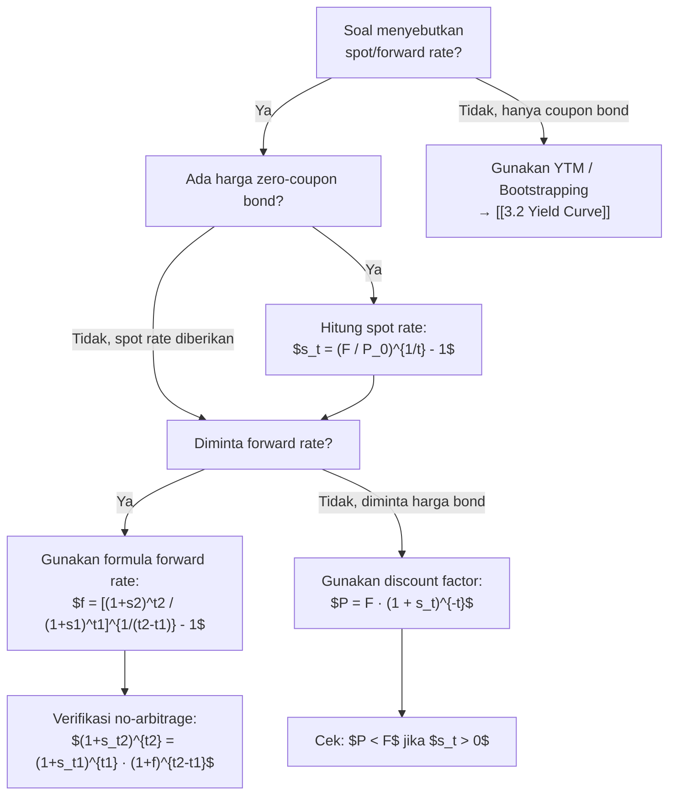

# 📘 3.1 — Spot Rates and Forward Rates

> [!ABSTRACT] Ringkasan Cepat
> **Topik:** Spot Rates & Forward Rates | **Bobot:** ~20–30% | **Difficulty:** Medium
> **Ref:** Vaaler Bab 8.3 & 9, Kellison Bab 10–11 | **Prereq:** [[1.2 Effective, Nominal, and Force of Interest]], [[1.4 Accumulation and Present Value]]

## Section 0 — Pemetaan Topik

| Topik CF1 | Sub-topik ID | Skill Diuji | Bobot | Difficulty | Prerequisite | Connected Topics | Referensi |
|-----------|--------------|-------------|-------|------------|--------------|------------------|-----------|
| Topik 3: Struktur Jangka Waktu | 3.1 | Menghitung spot rate dari harga zero-coupon bond; menghitung forward rate dari spot rates; memahami argumen no-arbitrage; bootstrapping yield curve | 20–30% | Medium | [[1.2 Effective, Nominal, and Force of Interest]] | [[3.2 Yield Curve]], [[5.1 Bond Pricing]], [[6.2 Forwards and Futures]] | Vaaler 8.3, 9.1–9.3; Kellison 10.1–10.3 |

## Section 1 — Intuisi

Bayangkan kamu ingin membeli rumah seharga Rp 500 juta, tetapi kamu baru bisa membayar **lima tahun** dari sekarang. Bank menawarkan dua skema: (1) kamu mengunci harga hari ini dengan kontrak forward seharga Rp 430 juta yang dibayar sekaligus di tahun ke-5, atau (2) kamu menabung uangmu hari ini dengan bunga pasar **yang berbeda-beda** untuk setiap jangka waktu—bunga untuk 1 tahun, 2 tahun, hingga 5 tahun semuanya berbeda.

**Spot rate** adalah suku bunga efektif dari **hari ini** hingga suatu waktu tertentu di masa depan, tanpa ada pembayaran di antaranya. Ini seperti kamu meminjamkan uang sekarang dan mendapat kembali **sekali** di masa depan—tidak ada kupon, tidak ada cicilan. Spot rate 5-tahun berbeda dengan spot rate 1-tahun karena risiko, ekspektasi inflasi, dan preferensi likuiditas investor berbeda untuk jangka waktu yang berbeda.

**Forward rate** adalah suku bunga yang **dikunci hari ini** untuk periode pinjaman yang **dimulai di masa depan**. Misalnya, forward rate dari tahun ke-2 hingga tahun ke-5 adalah suku bunga yang kamu sepakati hari ini untuk meminjam uang mulai tahun ke-2 dan mengembalikannya di tahun ke-5. Ini bukan "prediksi" tingkat bunga masa depan, tetapi lebih mirip harga kontrak yang menjamin tidak ada peluang arbitrase—tidak ada cara untuk mengambil untung tanpa risiko dengan memanfaatkan perbedaan suku bunga di berbagai jangka waktu.

Hubungan antara spot rate dan forward rate adalah fondasi pasar obligasi dan derivatif suku bunga. Tanpa pemahaman ini, investor tidak bisa menilai apakah suatu obligasi murah atau mahal, atau apakah strategi reinvestment mereka optimal.

## Section 2 — Definisi Formal

> [!NOTE] Definisi Matematis
> **Spot Rate $s_t$:** Suku bunga efektif per tahun untuk investasi zero-coupon dari waktu $0$ hingga waktu $t$.
> $$
> (1 + s_t)^t = \frac{F_t}{P_0}
> $$
> di mana $P_0$ adalah harga hari ini untuk zero-coupon bond dengan face value $F_t$ yang jatuh tempo di waktu $t$.
>
> **Forward Rate $f_{t_1, t_2}$:** Suku bunga efektif per tahun (dikunci di waktu $0$) untuk periode dari waktu $t_1$ hingga $t_2$, dengan $t_2 > t_1$.
> $$
> (1 + s_{t_2})^{t_2} = (1 + s_{t_1})^{t_1} \cdot (1 + f_{t_1, t_2})^{t_2 - t_1}
> $$

### Variabel & Parameter

| Simbol | Makna | Unit / Range |
|--------|-------|--------------|
| $s_t$ | Spot rate untuk maturity $t$ | Effective annual rate, $s_t > 0$ |
| $f_{t_1, t_2}$ | Forward rate dari waktu $t_1$ ke $t_2$ | Effective annual rate |
| $t$ | Waktu jatuh tempo (years) | $t \in \mathbb{R}^+$ |
| $P(0, t)$ | Harga di waktu $0$ untuk zero-coupon bond maturity $t$ dengan face value $1$ | $0 < P(0, t) \leq 1$ |
| $v_t = (1 + s_t)^{-t}$ | Discount factor dari waktu $t$ ke waktu $0$ | $0 < v_t < 1$ |
| $\delta_t$ | Continuously compounded spot rate | $\delta_t = \ln(1 + s_t)$ |

### Rumus Utama

$$
s_t = \left( \frac{1}{P(0, t)} \right)^{1/t} - 1
$$
**Label:** Spot rate dari harga zero-coupon bond dengan face value $1$.

$$
f_{t_1, t_2} = \left[ \frac{(1 + s_{t_2})^{t_2}}{(1 + s_{t_1})^{t_1}} \right]^{1/(t_2 - t_1)} - 1
$$
**Label:** Forward rate dari spot rates, bentuk umum untuk arbitrary maturities.

$$
f_{n, n+1} = \frac{(1 + s_{n+1})^{n+1}}{(1 + s_n)^n} - 1
$$
**Label:** One-period forward rate dari tahun $n$ ke $n+1$ (kasus khusus paling sering diuji).

$$
P(0, t_2) = P(0, t_1) \cdot P(t_1, t_2)
$$
**Label:** No-arbitrage pricing: harga zero-coupon bond $t_2$ sama dengan produk harga sampai $t_1$ dan harga forward dari $t_1$ ke $t_2$.

$$
P(t_1, t_2) = (1 + f_{t_1, t_2})^{-(t_2 - t_1)}
$$
**Label:** Discount factor forward (forward price of future zero-coupon bond).

### Asumsi Eksplisit

- **Frictionless Market:** Tidak ada biaya transaksi, pajak, atau spread bid-ask. Investor bisa borrow dan lend pada rate yang sama.
- **No Default Risk:** Semua bond adalah risk-free (pemerintah dengan rating AAA atau bank sentral).
- **Divisibility & Liquidity:** Investor dapat membeli bond dalam jumlah fraksional; semua maturities tersedia dan likuid.
- **No Arbitrage:** Tidak ada strategi tanpa risiko yang memberikan profit positif tanpa modal awal.
- **Same Compounding Convention:** Semua rates menggunakan effective annual rates kecuali dinyatakan lain.

## Section 3 — Jembatan Logika

> [!TIP] Dari Time Diagram ke Equation of Value
> Spot rate $s_t$ muncul dari **definisi present value**: jika kita diskon $1$ yang diterima di waktu $t$ ke waktu $0$, kita gunakan faktor diskon $(1 + s_t)^{-t}$. Ini mengasumsikan satu lump sum di masa depan tanpa intermediate cash flow. Spot rate **bukan** rata-rata dari suku bunga pendek, tetapi rate efektif total dari $0$ hingga $t$.
>
> Forward rate $f_{t_1, t_2}$ adalah **suku bunga implisit** yang menyeimbangkan dua strategi investasi:
> - **Strategi A:** Investasi langsung dari $0$ ke $t_2$ dengan rate $s_{t_2}$.
> - **Strategi B:** Investasi dari $0$ ke $t_1$ dengan rate $s_{t_1}$, kemudian **reinvestasi otomatis** (dikunci hari ini) dari $t_1$ ke $t_2$ dengan rate $f_{t_1, t_2}$.
>
> Karena no-arbitrage, hasil akhir kedua strategi harus identik. Ini adalah **equation of value** pada focal date $t_2$:
> $$
> (1 + s_{t_2})^{t_2} = (1 + s_{t_1})^{t_1} \cdot (1 + f_{t_1, t_2})^{t_2 - t_1}
> $$
> Suku $v^t = (1 + s_t)^{-t}$ muncul karena kita perlu membawa semua nilai ke waktu yang sama (biasanya $t = 0$).

> [!IMPORTANT] Focal Date
> Focal date dipilih di $t = 0$ (hari ini) untuk pricing, atau di $t = t_2$ (maturity terakhir) untuk derivasi forward rate. Pemilihan tidak mengubah hasil karena relasi no-arbitrage berlaku di semua waktu.

**Derivasi Forward Rate dari Spot Rates:**

Kita mulai dari **no-arbitrage principle**. Misalkan investor memiliki dua cara mencapai cash flow di waktu $t_2$:

1. Investasi langsung $1$ hari ini dengan spot rate $s_{t_2}$ sampai waktu $t_2$:
   $$
   FV_{t_2}^{(\text{direct})} = (1 + s_{t_2})^{t_2}
   $$

2. Investasi $1$ hari ini dengan spot rate $s_{t_1}$ sampai waktu $t_1$, lalu **kontrak forward** hari ini untuk reinvestasi dari $t_1$ ke $t_2$ dengan rate $f_{t_1, t_2}$:
   $$
   FV_{t_2}^{(\text{rolled})} = (1 + s_{t_1})^{t_1} \cdot (1 + f_{t_1, t_2})^{t_2 - t_1}
   $$

**No-arbitrage** mensyaratkan kedua strategi memberikan hasil sama:
$$
(1 + s_{t_2})^{t_2} = (1 + s_{t_1})^{t_1} \cdot (1 + f_{t_1, t_2})^{t_2 - t_1}
$$

Isolasi $f_{t_1, t_2}$:
$$
(1 + f_{t_1, t_2})^{t_2 - t_1} = \frac{(1 + s_{t_2})^{t_2}}{(1 + s_{t_1})^{t_1}}
$$

$$
1 + f_{t_1, t_2} = \left[ \frac{(1 + s_{t_2})^{t_2}}{(1 + s_{t_1})^{t_1}} \right]^{\frac{1}{t_2 - t_1}}
$$

$$
f_{t_1, t_2} = \left[ \frac{(1 + s_{t_2})^{t_2}}{(1 + s_{t_1})^{t_1}} \right]^{\frac{1}{t_2 - t_1}} - 1
$$

**Interpretasi No-Arbitrage:**

Jika $f_{t_1, t_2}$ lebih tinggi dari nilai formula di atas, investor bisa:
- **Short** zero-coupon bond maturity $t_2$
- **Long** zero-coupon bond maturity $t_1$ dan **kontrak forward** dari $t_1$ ke $t_2$
- Profit tanpa risiko (arbitrase).

Sebaliknya jika $f_{t_1, t_2}$ terlalu rendah. Pasar akan menyesuaikan harga hingga relasi ini dipulihkan.

> [!DANGER] Dilarang
> 1. **Menggunakan forward rate sebagai prediksi:** $f_{2,5}$ adalah rate yang dikunci hari ini untuk kontrak dari tahun 2 ke 5, BUKAN ramalan market rate di tahun 2.
> 2. **Mencampur compounding frequencies tanpa konversi:** Jika spot rates diberikan semiannual, forward rate harus dihitung dengan consistent basis atau dikonversi terlebih dahulu.
> 3. **Mengabaikan directionality:** $f_{t_1, t_2} \neq f_{t_2, t_1}$. Forward rate memiliki arah waktu eksplisit yang tidak boleh dibalik.

## Section 4 — Contoh Soal

### Soal A — Fundamental

Harga zero-coupon bond dengan face value $1000$ dan maturity 3 tahun adalah $863.84$. Hitunglah spot rate 3-tahun ($s_3$) dalam effective annual rate.

**Data yang diberikan:**
- Face value $F = 1000$
- Harga saat ini $P_0 = 863.84$
- Maturity $t = 3$ tahun

> [!SUCCESS] Solusi Soal A
> 
> **1. Identifikasi Variabel**
> - $F = 1000$
> - $P_0 = 863.84$
> - $t = 3$
> - Dicari: $s_3$
> 
> **2. Time Diagram**
> ```
> t=0                        t=3
> |--------------------------|
> P₀ = 863.84            F = 1000
> (dibayar)             (diterima)
> ```
> Cash flow tunggal: bayar $863.84$ hari ini, terima $1000$ di tahun ke-3.
> 
> **3. Equation of Value** *(pada Focal Date $t = 0$)*
> $$
> P_0 = F \cdot (1 + s_3)^{-3}
> $$
> atau ekivalen dengan:
> $$
> F = P_0 \cdot (1 + s_3)^3
> $$
> 
> **4. Eksekusi Aljabar**
> $$
> (1 + s_3)^3 = \frac{F}{P_0} = \frac{1000}{863.84} = 1.157625
> $$
> 
> $$
> 1 + s_3 = (1.157625)^{1/3} = 1.05
> $$
> 
> $$
> s_3 = 1.05 - 1 = 0.05 = 5\%
> $$
> 
> **5. Verification**
> Cek: $863.84 \times (1.05)^3 = 863.84 \times 1.157625 = 1000.00$ ✓
> 
> Logika finansial: Spot rate 5% untuk 3 tahun adalah wajar untuk risk-free bond di pasar normal. Discount factor $v_3 = 0.86384$ juga masuk akal.

> [!WARNING] Exam Tips — Soal A
> **Target waktu:** 1–1.5 menit. **Common trap:** Lupa konversi dari decimal ke persen atau salah eksponen (misal $1/3$ ditulis $3$). **Shortcut:** Jika harga dan face value dalam rasio sederhana (misal $800/1000 = 0.8$), coba faktorkan eksponen terlebih dahulu.

---

### Soal B — Exam-Typical

Spot rate untuk 2 tahun adalah 4% dan spot rate untuk 5 tahun adalah 6%. Hitunglah forward rate dari tahun ke-2 hingga tahun ke-5 ($f_{2,5}$).

**Data yang diberikan:**
- $s_2 = 4\% = 0.04$
- $s_5 = 6\% = 0.06$
- Dicari: $f_{2,5}$

> [!SUCCESS] Solusi Soal B
> 
> **1. Identifikasi Variabel**
> - $s_2 = 0.04$
> - $s_5 = 0.06$
> - $t_1 = 2$, $t_2 = 5$
> - Dicari: $f_{2,5}$
> 
> **2. Time Diagram**
> ```
> t=0        t=2                    t=5
> |----------|---------------------|
>    s₂=4%         f₂,₅=?
> |--------------------------------|
>            s₅=6%
> ```
> Dua strategi investasi dari $t=0$ ke $t=5$ harus equivalent.
> 
> **3. Equation of Value** *(pada Focal Date $t = 5$)*
> $$
> (1 + s_5)^5 = (1 + s_2)^2 \cdot (1 + f_{2,5})^{5-2}
> $$
> 
> **4. Eksekusi Aljabar**
> $$
> (1.06)^5 = (1.04)^2 \cdot (1 + f_{2,5})^3
> $$
> 
> Hitung $(1.06)^5$:
> $$
> (1.06)^5 = 1.3382255776
> $$
> 
> Hitung $(1.04)^2$:
> $$
> (1.04)^2 = 1.0816
> $$
> 
> Substitusi:
> $$
> 1.3382255776 = 1.0816 \cdot (1 + f_{2,5})^3
> $$
> 
> $$
> (1 + f_{2,5})^3 = \frac{1.3382255776}{1.0816} = 1.237338976
> $$
> 
> $$
> 1 + f_{2,5} = (1.237338976)^{1/3} = 1.0736
> $$
> 
> $$
> f_{2,5} = 0.0736 = 7.36\%
> $$
> 
> **5. Verification**
> Cek no-arbitrage:
> - Investasi langsung 5 tahun: $(1.06)^5 = 1.338226$
> - Investasi 2 tahun lalu forward 3 tahun: $(1.04)^2 \times (1.0736)^3 = 1.0816 \times 1.237339 = 1.338226$ ✓
> 
> Logika finansial: Forward rate $f_{2,5} = 7.36\% > s_5 = 6\%$ menunjukkan **upward-sloping yield curve**. Pasar mengharapkan kenaikan suku bunga di masa depan (atau menuntut premium untuk jangka panjang).

> [!WARNING] Exam Tips — Soal B
> **Target waktu:** 2.5–3 menit. **Common trap:** Salah menentukan eksponen: $(t_2 - t_1) = 3$ bukan $5$. **Shortcut:** Jika kalkulator memiliki fungsi root, langsung gunakan $(x)^{1/3}$ daripada trial-error.

---

### Soal C — Challenging

Harga zero-coupon bond dengan face value $100$ untuk maturity 1, 2, dan 3 tahun masing-masing adalah $95.24$, $89.00$, dan $81.63$. Hitunglah:
(a) Spot rate untuk setiap maturity ($s_1, s_2, s_3$)
(b) One-year forward rate dari tahun ke-1 hingga tahun ke-2 ($f_{1,2}$)
(c) One-year forward rate dari tahun ke-2 hingga tahun ke-3 ($f_{2,3}$)

**Data yang diberikan:**
- $P(0, 1) = 95.24$, $P(0, 2) = 89.00$, $P(0, 3) = 81.63$
- Face value semua bond = $100$

> [!SUCCESS] Solusi Soal C
> 
> **1. Identifikasi Variabel**
> - $P(0,1) = 95.24$, $P(0,2) = 89.00$, $P(0,3) = 81.63$
> - $F = 100$ untuk semua
> - Dicari: $s_1, s_2, s_3, f_{1,2}, f_{2,3}$
> 
> **2. Time Diagram**
> ```
> t=0       t=1        t=2        t=3
> |---------|----------|----------|
> P(0,1)      100
>   =95.24
> |-------------------|
> P(0,2) = 89.00         100
> |--------------------------------|
> P(0,3) = 81.63                      100
> ```
> 
> **3. Equation of Value** *(pada Focal Date $t = 0$)*
> 
> Untuk spot rates:
> $$
> P(0, t) = F \cdot (1 + s_t)^{-t} \implies s_t = \left( \frac{F}{P(0,t)} \right)^{1/t} - 1
> $$
> 
> Untuk forward rates:
> $$
> f_{n, n+1} = \frac{(1 + s_{n+1})^{n+1}}{(1 + s_n)^n} - 1
> $$
> 
> **4. Eksekusi Aljabar**
> 
> **(a) Hitung Spot Rates:**
> 
> $$
> s_1 = \frac{100}{95.24} - 1 = 1.05 - 1 = 0.05 = 5\%
> $$
> 
> $$
> s_2 = \left( \frac{100}{89.00} \right)^{1/2} - 1 = (1.123595)^{0.5} - 1 = 1.06 - 1 = 0.06 = 6\%
> $$
> 
> $$
> s_3 = \left( \frac{100}{81.63} \right)^{1/3} - 1 = (1.225075)^{1/3} - 1 = 1.07 - 1 = 0.07 = 7\%
> $$
> 
> **(b) Hitung $f_{1,2}$:**
> 
> $$
> f_{1,2} = \frac{(1 + s_2)^2}{(1 + s_1)^1} - 1 = \frac{(1.06)^2}{1.05} - 1
> $$
> 
> $$
> = \frac{1.1236}{1.05} - 1 = 1.070095 - 1 = 0.070095 = 7.01\%
> $$
> 
> **(c) Hitung $f_{2,3}$:**
> 
> $$
> f_{2,3} = \frac{(1 + s_3)^3}{(1 + s_2)^2} - 1 = \frac{(1.07)^3}{(1.06)^2} - 1
> $$
> 
> $$
> = \frac{1.225043}{1.1236} - 1 = 1.090095 - 1 = 0.090095 = 9.01\%
> $$
> 
> **5. Verification**
> 
> Cek consistency untuk $s_3$:
> $$
> (1 + s_3)^3 = (1 + s_1) \cdot (1 + f_{1,2}) \cdot (1 + f_{2,3})
> $$
> $$
> (1.07)^3 = 1.05 \times 1.0701 \times 1.0901 = 1.225043 \quad \checkmark
> $$
> 
> Logika finansial: Yield curve upward-sloping ($s_1 < s_2 < s_3$) menunjukkan ekspektasi kenaikan suku bunga atau liquidity premium. Forward rates ($f_{1,2} = 7.01\%$, $f_{2,3} = 9.01\%$) meningkat lebih tajam dibandingkan spot rates, konsisten dengan kurva yang semakin curam.

> [!WARNING] Exam Tips — Soal C
> **Target waktu:** 4–5 menit. **Common trap:** Lupa bahwa $f_{1,2}$ menggunakan annual rate untuk satu periode, bukan total. **Shortcut:** Spot rates dari zero prices bisa dihitung parallel; forward rates baru dihitung setelah semua spot rates tersedia.

## Section 5 — Verifikasi & Sanity Check

> [!CHECK] Konsistensi No-Arbitrage
> 1. **Spot rate monotonicity (opsional):** Dalam normal yield curve, $s_1 < s_2 < s_3 < \ldots$. Jika tidak, cek apakah inverted curve atau U-shaped curve memang sesuai konteks soal.
> 2. **Forward ≥ Spot untuk upward curve:** Jika $s_{t_2} > s_{t_1}$, maka $f_{t_1, t_2} > s_{t_2}$ (forward rate "overshoot" spot rate jangka panjang). Jika $s_{t_2} < s_{t_1}$ (inverted), maka $f_{t_1, t_2} < s_{t_2}$.

> [!CHECK] Discount Factor Consistency
> 1. **Relasi harga:** $P(0, t_2) = P(0, t_1) \times P(t_1, t_2)$ di mana $P(t_1, t_2) = (1 + f_{t_1, t_2})^{-(t_2 - t_1)}$.
> 2. **Discount factor range:** $P(0, t)$ harus selalu antara 0 dan 1. Jika $P(0, t) > 1$, discount rate negatif (hanya valid dalam kondisi khusus).

> [!CHECK] Dimensional Analysis
> 1. Spot rate $s_t$ dan forward rate $f_{t_1, t_2}$ harus dalam satuan yang sama (keduanya effective annual atau keduanya nominal dengan $m$ yang sama).
> 2. Waktu $t$ harus dalam tahun jika rate annual. Jika periods bukan tahun (misal semester), konversi konsisten.

### Metode Alternatif

**Menggunakan Natural Logarithm (Continuous Compounding):**

Jika continuously compounded spot rates $\delta_t$ tersedia, forward rate juga bisa dihitung:
$$
\delta_{t_2} \cdot t_2 = \delta_{t_1} \cdot t_1 + \delta_{f, t_1 \to t_2} \cdot (t_2 - t_1)
$$
$$
\delta_{f, t_1 \to t_2} = \frac{\delta_{t_2} \cdot t_2 - \delta_{t_1} \cdot t_1}{t_2 - t_1}
$$

Konversi dari effective ke continuous:
$$
\delta_t = \ln(1 + s_t)
$$

Metode ini lebih sederhana algebraically tetapi jarang digunakan di CF1 kecuali topik force of interest ditekankan.

## Section 6 — Visualisasi Mental

**Yield Curve (Term Structure):**

Bayangkan grafik dengan **sumbu X = maturity** (tahun) dan **sumbu Y = yield** (%). Setiap titik $(t, s_t)$ adalah spot rate untuk maturity $t$. Bentuk kurva bisa:

- **Normal (upward-sloping):** $s_1 < s_2 < s_3 < \ldots$ — paling umum, mencerminkan liquidity premium atau ekspektasi kenaikan suku bunga.
- **Inverted (downward-sloping):** $s_1 > s_2 > s_3$ — pasar mengharapkan penurunan suku bunga (sering sinyal resesi).
- **Flat:** $s_t$ konstan untuk semua $t$ — rare, terjadi di transisi ekonomi.
- **Humped:** Spot rate naik lalu turun — ekspektasi perubahan kebijakan jangka menengah.

**Forward Rate Curve:**

Plot $(t_1, f_{t_1, t_1+1})$ untuk semua $t_1$. Jika yield curve upward-sloping, forward curve akan berada **di atas** spot curve. Jika inverted, forward curve di bawah spot curve. Forward curve lebih volatil karena merepresentasikan ekspektasi **marginal** (perubahan dari periode $t_1$ ke $t_1+1$), bukan rate kumulatif.

**Interpretasi Slope:**

- **Steepening curve:** $f_{t_1, t_2}$ meningkat tajam — pasar mengharapkan kenaikan suku bunga agresif di masa depan.
- **Flattening curve:** $f_{t_1, t_2}$ mendekati $s_{t_2}$ — ekspektasi perubahan suku bunga melemah.

**Titik Kritis:**

- **Crossover point:** Jika spot curve berubah dari upward ke inverted, forward rate akan **negatif** atau mendekati nol di maturitas transisi (rare tetapi pernah terjadi di ECB/BoJ).

### Hubungan Visual ↔ Rumus

Slope spot curve antara $t_1$ dan $t_2$ adalah:
$$
\text{Slope} = \frac{s_{t_2} - s_{t_1}}{t_2 - t_1}
$$

Jika slope positif (upward curve), maka:
$$
f_{t_1, t_2} > s_{t_2}
$$

Secara visual: forward rate "overshoot" spot rate untuk mengkompensasi investor yang memilih investasi pendek lalu reinvestasi dibanding investasi panjang langsung. Semakin curam slope, semakin besar selisih $f_{t_1, t_2} - s_{t_2}$.

## Section 7 — Jebakan Umum

> [!BUG] Kesalahan Unit Waktu
> **Contoh Salah:** Spot rate diberikan semiannual ($i^{(2)} = 6\%$ artinya $3\%$ per semester), tetapi maturity dalam tahun ($t = 2$ tahun $= 4$ semester). Menggunakan $(1.03)^2$ instead of $(1.03)^4$.
>
> **Benar:** Konversi dulu ke effective annual:
> $$
> i_{\text{annual}} = \left(1 + \frac{0.06}{2}\right)^2 - 1 = (1.03)^2 - 1 = 6.09\%
> $$
> Atau gunakan consistent periods: $t = 4$ semesters, rate per semester $3\%$.

> [!BUG] Kesalahan Konseptual
> 1. **Mengartikan forward rate sebagai prediksi market rate:** $f_{2,5}$ adalah **kontrak rate** hari ini untuk investasi dari tahun 2 ke 5, bukan forecasted spot rate di tahun 2. Jika kamu bisa borrow/lend di $f_{2,5}$ di tahun 2, mungkin actual market rate berbeda—tetapi rate yang dikunci adalah $f_{2,5}$.
> 2. **Menganggap forward rate selalu > spot rate:** Hanya benar jika yield curve upward-sloping. Jika inverted, $f_{t_1, t_2} < s_{t_1}$.
> 3. **Lupa bahwa $P(0, t)$ adalah harga per $1$ face value:** Jika soal memberikan harga untuk $100$ face, bagi dengan 100 terlebih dahulu sebelum menghitung $s_t$.
> 4. **Menggunakan simple interest untuk spot rate:** Spot rate adalah **effective compound rate**, bukan simple. $(1 + s_t)^t$ bukan $1 + s_t \cdot t$.

> [!BUG] Kesalahan Interpretasi Soal
> **Ambiguitas:** Soal mengatakan "forward rate for year 3" tanpa jelas apakah ini $f_{2,3}$ (dari tahun 2 ke 3) atau $f_{0,3}$ (forward kontrak hari ini untuk investasi 3-tahun yang dimulai hari ini—yang sebenarnya adalah $s_3$).
>
> **Klarifikasi:** Jika konteks adalah "forward rate starting in year 2 for a one-year period," maka $f_{2,3}$. Jika "forward rate for maturity 3," bisa ambigu—tanyakan atau lihat konteks.

> [!CAUTION] Red Flags
> - **"Yield to maturity" vs "spot rate":** YTM adalah internal rate of return dari bond dengan kupon; spot rate adalah untuk zero-coupon bond. Jangan samakan!
> - **"Nominal rate" tanpa frekuensi:** Jika soal bilang "nominal rate 6%," tanya convertible berapa kali per tahun ($m = ?$).
> - **"Forward rate for $n$ years":** Apakah ini $f_{0,n}$ (yang tidak masuk akal karena itu spot rate), atau $f_{k, k+n}$ untuk $k$ tertentu? Perlu klarifikasi.
> - **Zero-coupon bond price > face value:** Hanya valid jika discount rate negatif (rare). Cek ulang angka soal.

## Section 8 — Ringkasan Eksekutif

> [!SUMMARY] Must-Remember
> 1. **Spot rate dari harga zero-coupon bond:**
>    $$
>    s_t = \left( \frac{F}{P(0,t)} \right)^{1/t} - 1
>    $$
> 2. **Forward rate dari spot rates (general):**
>    $$
>    f_{t_1, t_2} = \left[ \frac{(1 + s_{t_2})^{t_2}}{(1 + s_{t_1})^{t_1}} \right]^{1/(t_2 - t_1)} - 1
>    $$
> 3. **One-period forward rate:**
>    $$
>    f_{n, n+1} = \frac{(1 + s_{n+1})^{n+1}}{(1 + s_n)^n} - 1
>    $$
> 4. **No-arbitrage pricing:**
>    $$
>    (1 + s_{t_2})^{t_2} = (1 + s_{t_1})^{t_1} \cdot (1 + f_{t_1, t_2})^{t_2 - t_1}
>    $$
> 5. **Discount factor decomposition:**
>    $$
>    P(0, t_2) = P(0, t_1) \cdot (1 + f_{t_1, t_2})^{-(t_2 - t_1)}
>    $$

### Kapan Digunakan

- **Trigger keywords:** "zero-coupon bond," "spot rate," "forward rate," "yield curve," "term structure," "bootstrapping."
- **Tipe skenario soal:**
  - Diberikan harga zero-coupon bond beberapa maturities → hitung spot rates lalu forward rates.
  - Diberikan spot rates → hitung harga bond atau forward rates.
  - Arbitrage detection: dua strategi investasi harus memberikan hasil sama.
  - Immunization atau liability matching: perlu forward rates untuk menghitung reinvestment return.

### Kapan TIDAK Boleh Digunakan

- **Coupon-bearing bonds:** Tidak bisa langsung pakai formula spot rate. Harus bootstrap dari harga coupon bond atau gunakan YTM (topik 3.2 dan 5.1).
- **Berbeda compounding convention:** Jika spot rate diberikan continuous ($\delta$) tetapi forward rate diminta effective annual, konversi dulu.
- **Prediksi actual future rates:** Forward rate adalah **kontrak rate** hari ini, bukan prediksi unbiased future spot rate (kecuali di pure expectations theory—beyond CF1).

### Quick Decision Tree



---

> [!QUOTE] Follow-up Options
> 1. *"Berikan contoh soal variasi bootstrapping yield curve dari coupon bonds"*
> 2. *"Jelaskan hubungan [[3.1 Spot Rates and Forward Rates]] dengan [[5.1 Bond Pricing]]"*
> 3. *"Buat flashcard 1-halaman untuk topik ini"*

*📖 Ref: Vaaler Bab 8.3 & 9, Kellison Bab 10–11 | 🗓️ 2026-02-17 | #CF1 #SpotRate #ForwardRate #YieldCurve*
