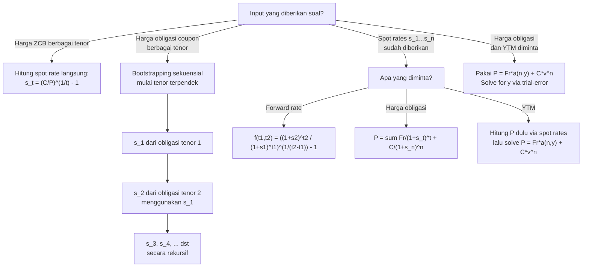

# 📘 3.2 — Yield Curve

> [!ABSTRACT] Ringkasan Cepat
> **Topik:** Yield Curve (Kurva Imbal Hasil) | **Bobot:** ~20–30% | **Difficulty:** Hard
> **Ref:** Vaaler Bab 8.3 & 9, Kellison Bab 10–11 | **Prereq:** [[3.1 Spot Rates and Forward Rates]], [[5.1 Bond Pricing]], [[2.1 Annuity-Immediate and Annuity-Due]]

## Section 0 — Pemetaan Topik

| Topik CF1 | Sub-topik ID | Skill Diuji | Bobot | Difficulty | Prerequisite | Connected Topics | Referensi |
|-----------|--------------|-------------|-------|------------|--------------|------------------|-----------|
| Topik 3: Struktur Jangka Waktu Suku Bunga | 3.2 | Membaca dan menginterpretasikan bentuk yield curve; menghitung YTM dari harga obligasi; bootstrapping spot rates dari harga obligasi coupon; menurunkan forward rates dari spot rates; memilih teori yang tepat untuk menjelaskan bentuk kurva yang diberikan | 20–30% | Hard | [[3.1 Spot Rates and Forward Rates]], [[5.1 Bond Pricing]], [[2.1 Annuity-Immediate and Annuity-Due]] | [[3.3 Duration (Macaulay and Modified)]], [[3.4 Convexity]], [[3.5 Immunization]], [[5.2 Book Value, Premium and Discount Amortization]], [[5.3 Yield Rate and Coupon Calculations]] | Vaaler Bab 8.3 & 9, Kellison Bab 10–11 |

## Section 1 — Intuisi

Bayangkan kamu meminjamkan uang kepada seseorang. Jika dipinjam selama 1 bulan, kamu mungkin mau meminjamkan dengan bunga rendah—risikonya kecil dan kamu tidak harus menunggu lama. Tapi jika dipinjam selama 30 tahun, kamu akan menuntut bunga yang lebih tinggi: ada ketidakpastian inflasi, risiko kredit, dan kamu "mengunci" uangmu lebih lama. Fenomena ini—bahwa suku bunga yang tepat bergantung pada lamanya pinjaman—adalah inti dari **struktur jangka waktu suku bunga** (*term structure of interest rates*). **Yield curve** adalah representasi visualnya: grafik yang memetakan suku bunga terhadap tenor (jangka waktu hingga jatuh tempo).

Yield curve bukan sekadar grafik akademis. Ia adalah peta navigasi bagi investor obligasi, bankir sentral, dan manajer risiko. Ketika yield curve **naik** (kurva normal/upward-sloping), pasar mengharapkan pertumbuhan ekonomi dan inflasi ke depan—kondisi "sehat". Ketika yield curve **datar** atau **terbalik** (inverted), ini sering dianggap sebagai sinyal resesi yang akan datang, karena pasar mengantisipasi pemotongan suku bunga di masa depan. Dalam konteks CF1, kamu perlu memahami tiga hal: bagaimana *membaca* dan menginterpretasikan kurva, bagaimana *menghitung* spot rate yang tidak tersedia langsung menggunakan metode **bootstrapping**, dan bagaimana *menurunkan* forward rate dari spot rate berdasarkan prinsip no-arbitrage.

Konsep kunci yang sering dikacaukan adalah perbedaan antara **spot rate**, **forward rate**, dan **yield to maturity (YTM)**. Spot rate $s_t$ adalah suku bunga untuk investasi zero-coupon dari hari ini hingga waktu $t$—ini adalah "bahasa dasar" kurva. YTM adalah satu suku bunga tunggal yang menyamakan PV semua arus kas obligasi dengan harganya—ini adalah "rata-rata tertimbang" dari spot rates, dan hanya sama dengan spot rate untuk zero-coupon bond. Bootstrapping adalah teknik untuk "mengungkap" spot rates tersembunyi dari harga obligasi coupon yang dapat diamati di pasar.

## Section 2 — Definisi Formal

> [!NOTE] Definisi Matematis
> **Yield to Maturity (YTM):** Untuk obligasi dengan harga $P$, face value $F$, redemption value $C$, coupon $Fr$ per periode selama $n$ periode, YTM adalah nilai $y$ yang memenuhi:
>
> $$
> P = Fr \cdot a_{\overline{n}|y} + C \cdot v_y^n
> $$
>
> di mana $v_y = \frac{1}{1+y}$.
>
> **Spot Rate (Zero Rate):** $s_t$ adalah suku bunga efektif per periode untuk investasi zero-coupon yang bermula sekarang ($t=0$) dan jatuh tempo pada waktu $t$. Faktor akumulasi adalah $(1+s_t)^t$ dan faktor diskonto adalah $v_{s_t}^t = \frac{1}{(1+s_t)^t}$.
>
> **Forward Rate:** $f_{t_1, t_2}$ adalah suku bunga efektif per periode yang disepakati sekarang untuk periode mendatang dari $t_1$ ke $t_2$, didefinisikan oleh kondisi no-arbitrage:
>
> $$
> (1+s_{t_2})^{t_2} = (1+s_{t_1})^{t_1} \cdot (1+f_{t_1,t_2})^{t_2 - t_1}
> $$
>
> **Harga Obligasi menggunakan Spot Rates:**
>
> $$
> P = \sum_{t=1}^{n} \frac{Fr}{(1+s_t)^t} + \frac{C}{(1+s_n)^n}
> $$

### Variabel & Parameter

| Simbol | Makna | Catatan |
|--------|-------|---------|
| $s_t$ | Spot rate untuk maturity $t$ | Efektif per periode; berbeda untuk setiap $t$ |
| $f_{t_1, t_2}$ | Forward rate dari waktu $t_1$ ke $t_2$ | Diimplied dari spot rates |
| $y$ atau $i$ | Yield to Maturity (YTM) | Satu rate tunggal; rata-rata tertimbang spot rates |
| $P$ | Harga pasar obligasi | Harga bersih (clean) atau kotor (dirty) sesuai konteks |
| $F$ | Face value / par value obligasi | |
| $C$ | Redemption value | Seringkali $C = F$ kecuali disebutkan lain |
| $r$ | Coupon rate per periode | Sehingga coupon = $Fr$ per periode |
| $n$ | Jumlah periode hingga jatuh tempo (tenor/maturity) | |
| $v_y$ | Faktor diskonto pada YTM: $\frac{1}{1+y}$ | |
| $v_{s_t}$ | Faktor diskonto pada spot rate $s_t$: $\frac{1}{(1+s_t)^t}$ | |

### Rumus Utama

$$
P = Fr \cdot a_{\overline{n}|y} + C \cdot v_y^n
$$
**Label:** Harga obligasi menggunakan YTM — satu suku bunga tunggal mendiskontokan semua arus kas.

$$
P = \sum_{t=1}^{n} \frac{Fr}{(1+s_t)^t} + \frac{C}{(1+s_n)^n}
$$
**Label:** Harga obligasi menggunakan spot rates — setiap arus kas didiskontokan dengan spot rate yang sesuai untuk tenornya.

$$
(1+s_t)^t = (1+s_{t-1})^{t-1} \cdot (1+f_{t-1,t})
$$
**Label:** Relasi rekursif spot rate dan one-year forward rate — dasar bootstrapping.

$$
(1+f_{t_1, t_2})^{t_2 - t_1} = \frac{(1+s_{t_2})^{t_2}}{(1+s_{t_1})^{t_1}}
$$
**Label:** Forward rate dari spot rates — no-arbitrage condition untuk periode $[t_1, t_2]$.

$$
\text{Bootstrapping: } s_n = \left( \frac{C + Fr}{ P_n - Fr \cdot \sum_{t=1}^{n-1} \frac{1}{(1+s_t)^t} } \right)^{1/n} - 1
$$
**Label:** Formula bootstrapping untuk $s_n$ — diturunkan dari persamaan harga obligasi dengan mengisolasi diskonto pada $t=n$.

### Asumsi Eksplisit

- **Frictionless market:** Tidak ada biaya transaksi, pajak, atau batasan short-selling.
- **No-arbitrage:** Tidak ada kesempatan profit tanpa risiko; dasar dari semua hubungan spot-forward.
- **Pembayaran coupon tepat waktu dan pasti:** Tidak ada risiko default dalam derivasi formula.
- **Spot rates tersedia untuk semua tenor integer:** Untuk bootstrapping, diperlukan urutan obligasi yang matang pada setiap periode $t = 1, 2, \ldots, n$.
- **Reinvestment pada spot rates:** Harga obligasi menggunakan spot rates mengasumsikan setiap arus kas direinvestasikan pada rate yang sesuai.

## Section 3 — Jembatan Logika

> [!TIP] Dari Time Diagram ke Equation of Value
> Ketika kita memegang obligasi coupon yang jatuh tempo dalam $n$ tahun, kita menerima arus kas di $t = 1, 2, \ldots, n$. Setiap arus kas di waktu $t$ "tinggal" selama $t$ tahun sebelum terealisasi. Karena suku bunga pasar berbeda untuk setiap tenor, arus kas di $t=1$ harus didiskontokan dengan $s_1$, arus kas di $t=2$ dengan $s_2$, dan seterusnya. Hasil penjumlahannya adalah harga "adil" (fair value) obligasi tersebut berdasarkan kurva spot.
>
> YTM adalah jalan pintas: satu angka $y$ yang, jika digunakan untuk mendiskontokan semua arus kas, menghasilkan harga pasar yang sama. Secara matematis, $y$ adalah "internal rate of return" dari obligasi. Ini bukan spot rate manapun—melainkan rata-rata tertimbang geometrik dari spot rates, dengan arus kas sebagai bobotnya.

> [!IMPORTANT] Focal Date
> - **Harga obligasi (PV):** Focal date di $t=0$ (hari ini). Semua arus kas masa depan didiskontokan ke sini.
> - **Accumulated value (FV):** Focal date di $t=n$ (tanggal jatuh tempo). Digunakan dalam perbandingan total return.
> - **Bootstrapping:** Focal date berubah secara rekursif — pada iterasi ke-$n$, arus kas $t=1, \ldots, n-1$ sudah diketahui nilainya (menggunakan $s_1, \ldots, s_{n-1}$), sehingga kita bisa mengisolasi $s_n$ dari persamaan harga.

**Derivasi Hubungan Spot-Forward dari No-Arbitrage:**

Misalkan investor punya dua strategi untuk berinvestasi selama 2 tahun:

- **Strategi A:** Investasikan 1 unit selama 2 tahun pada spot rate $s_2$. Nilai akhir: $(1+s_2)^2$.
- **Strategi B:** Investasikan 1 unit selama 1 tahun pada $s_1$, lalu lock-in forward rate $f_{1,2}$ untuk tahun kedua. Nilai akhir: $(1+s_1)(1+f_{1,2})$.

No-arbitrage mensyaratkan kedua strategi menghasilkan nilai yang sama:

$$
(1+s_2)^2 = (1+s_1)(1+f_{1,2})
$$

Isolasi $f_{1,2}$:

$$
f_{1,2} = \frac{(1+s_2)^2}{(1+s_1)} - 1
$$

Generalisasi untuk periode $[t_1, t_2]$:

$$
(1+f_{t_1,t_2})^{t_2-t_1} = \frac{(1+s_{t_2})^{t_2}}{(1+s_{t_1})^{t_1}}
$$

**Derivasi Prosedur Bootstrapping:**

Diberikan obligasi coupon dengan harga pasar $P_n$, coupon $Fr$, jatuh tempo $n$, dan spot rates $s_1, s_2, \ldots, s_{n-1}$ sudah diketahui:

$$
P_n = \frac{Fr}{(1+s_1)^1} + \frac{Fr}{(1+s_2)^2} + \cdots + \frac{Fr}{(1+s_{n-1})^{n-1}} + \frac{Fr + C}{(1+s_n)^n}
$$

Isolasi suku yang mengandung $s_n$:

$$
\frac{Fr + C}{(1+s_n)^n} = P_n - Fr \sum_{t=1}^{n-1} \frac{1}{(1+s_t)^t}
$$

Definisikan $X = P_n - Fr \displaystyle\sum_{t=1}^{n-1} \frac{1}{(1+s_t)^t}$, maka:

$$
(1+s_n)^n = \frac{Fr + C}{X} \implies s_n = \left(\frac{Fr + C}{X}\right)^{1/n} - 1
$$

> [!DANGER] Dilarang
> 1. **Dilarang** menggunakan YTM sebagai proxy spot rate dalam persamaan harga yang menggunakan struktur term yang tidak flat—YTM hanya valid sebagai satu angka ringkasan, bukan sebagai spot rate individual.
> 2. **Dilarang** membalik urutan bootstrapping—$s_n$ hanya bisa dihitung setelah $s_1, s_2, \ldots, s_{n-1}$ semuanya diketahui; tidak bisa "lompat" ke tenor yang lebih panjang tanpa menyelesaikan yang lebih pendek terlebih dahulu.
> 3. **Dilarang** menyamakan forward rate $f_{t_1, t_2}$ dengan spot rate $s_{t_2}$—forward rate adalah rate untuk periode mendatang $[t_1, t_2]$, bukan dari hari ini ke $t_2$.

## Section 4 — Contoh Soal

### Soal A — Fundamental

Sebuah zero-coupon bond jatuh tempo dalam 1 tahun dijual seharga 95,238 per 100 face value. Zero-coupon bond lain jatuh tempo dalam 2 tahun dijual seharga 89,000 per 100 face value. Hitunglah: (a) spot rate $s_1$, (b) spot rate $s_2$, dan (c) forward rate $f_{1,2}$ untuk tahun kedua.

> [!SUCCESS] Solusi Soal A
>
> **1. Identifikasi Variabel**
> - Zero-coupon bond 1-tahun: $P_1 = 95{,}238$, $C_1 = 100$, $n_1 = 1$
> - Zero-coupon bond 2-tahun: $P_2 = 89{,}000$, $C_2 = 100$, $n_2 = 2$
> - $s_1, s_2, f_{1,2}$ = yang dicari
>
> **2. Time Diagram**
>
> ```
> Bond 1 (ZCB, n=1):
> t=0          t=1
> |------------|
> 95.238       100
>
> Bond 2 (ZCB, n=2):
> t=0          t=1          t=2
> |------------|------------|
> 89.000                   100
> ```
>
> **3. Equation of Value** *(Focal Date $t = 0$)*
>
> Untuk zero-coupon bond: $P = \dfrac{C}{(1+s_t)^t}$
>
> $$
> 95{,}238 = \frac{100}{(1+s_1)^1}, \qquad 89{,}000 = \frac{100}{(1+s_2)^2}
> $$
>
> Forward rate:
> $$
> (1 + f_{1,2}) = \frac{(1+s_2)^2}{(1+s_1)^1}
> $$
>
> **4. Eksekusi Aljabar**
>
> **(a) Spot rate $s_1$:**
> $$
> 1 + s_1 = \frac{100}{95{,}238} = 1{,}05000 \implies s_1 = 5{,}000\%
> $$
>
> **(b) Spot rate $s_2$:**
> $$
> (1+s_2)^2 = \frac{100}{89{,}000} = 1{,}12360
> $$
> $$
> 1 + s_2 = \sqrt{1{,}12360} = 1{,}06000 \implies s_2 = 6{,}000\%
> $$
>
> **(c) Forward rate $f_{1,2}$:**
> $$
> 1 + f_{1,2} = \frac{(1+s_2)^2}{(1+s_1)} = \frac{1{,}12360}{1{,}05000} = 1{,}07010
> $$
> $$
> f_{1,2} = 7{,}010\%
> $$
>
> **5. Verification**
>
> Cek logika: $s_1 = 5\% < s_2 = 6\%$—yield curve upward-sloping (normal). Forward rate $f_{1,2} = 7{,}010\% > s_2 = 6\%$—ini konsisten karena dalam kurva normal, forward rates selalu lebih tinggi dari spot rates, karena mereka harus "menarik" rata-rata ke atas. ✓
>
> Cek numerik alternatif: $(1+s_1)(1+f_{1,2}) = 1{,}05 \times 1{,}07010 = 1{,}12361 \approx (1+s_2)^2 = 1{,}12360$ ✓

> [!WARNING] Exam Tips — Soal A
> - **Target waktu:** 3–4 menit.
> - **Common trap:** Lupa bahwa untuk ZCB, $P = C \cdot v^n$ — tidak ada coupon. Jangan tambahkan coupon payments yang tidak ada.
> - **Shortcut:** Untuk ZCB, $(1+s_t) = (C/P)^{1/t}$ — langsung inversi dan pangkat $1/t$.

---

### Soal B — Exam-Typical

Diketahui harga obligasi berikut, semua dengan face value 100 dan redemption value 100, pembayaran coupon tahunan di akhir setiap tahun:

| Obligasi | Tenor ($n$) | Coupon Rate ($r$) | Harga ($P$) |
|----------|-------------|-------------------|-------------|
| A | 1 tahun | 5% | 99,524 |
| B | 2 tahun | 6% | 100,000 |
| C | 3 tahun | 7% | 101,476 |

Dengan metode bootstrapping, tentukan spot rates $s_1$, $s_2$, dan $s_3$.

> [!SUCCESS] Solusi Soal B
>
> **1. Identifikasi Variabel**
> - Obligasi A: $P_A = 99{,}524$, $Fr_A = 5$, $C = 100$, $n = 1$
> - Obligasi B: $P_B = 100{,}000$, $Fr_B = 6$, $C = 100$, $n = 2$
> - Obligasi C: $P_C = 101{,}476$, $Fr_C = 7$, $C = 100$, $n = 3$
> - $s_1, s_2, s_3$ = yang dicari melalui bootstrapping
>
> **2. Time Diagram**
>
> ```
> Obligasi A (n=1): t=0 → 99.524; t=1 → 105
> Obligasi B (n=2): t=0 → 100.000; t=1 → 6; t=2 → 106
> Obligasi C (n=3): t=0 → 101.476; t=1 → 7; t=2 → 7; t=3 → 107
> ```
>
> **3. Equation of Value** *(Focal Date $t = 0$)*
>
> $$
> P_A = \frac{105}{(1+s_1)}, \qquad P_B = \frac{6}{(1+s_1)} + \frac{106}{(1+s_2)^2}, \qquad P_C = \frac{7}{(1+s_1)} + \frac{7}{(1+s_2)^2} + \frac{107}{(1+s_3)^3}
> $$
>
> **4. Eksekusi Aljabar**
>
> **Langkah 1 — Hitung $s_1$ dari Obligasi A:**
>
> $$
> 99{,}524 = \frac{105}{1+s_1} \implies 1+s_1 = \frac{105}{99{,}524} = 1{,}05500 \implies s_1 = 5{,}500\%
> $$
>
> **Langkah 2 — Hitung $s_2$ dari Obligasi B:**
>
> Substitusi $s_1 = 5{,}5\%$:
> $$
> 100{,}000 = \frac{6}{1{,}055} + \frac{106}{(1+s_2)^2}
> $$
> $$
> 100{,}000 = 5{,}6872 + \frac{106}{(1+s_2)^2}
> $$
> $$
> \frac{106}{(1+s_2)^2} = 100{,}000 - 5{,}6872 = 94{,}3128
> $$
> $$
> (1+s_2)^2 = \frac{106}{94{,}3128} = 1{,}12395 \implies 1+s_2 = 1{,}06010 \implies s_2 = 6{,}010\%
> $$
>
> **Langkah 3 — Hitung $s_3$ dari Obligasi C:**
>
> Substitusi $s_1 = 5{,}5\%$ dan $s_2 = 6{,}010\%$:
> $$
> 101{,}476 = \frac{7}{1{,}055} + \frac{7}{(1{,}06010)^2} + \frac{107}{(1+s_3)^3}
> $$
> $$
> 101{,}476 = 6{,}6351 + 6{,}2296 + \frac{107}{(1+s_3)^3}
> $$
> $$
> \frac{107}{(1+s_3)^3} = 101{,}476 - 12{,}8647 = 88{,}6113
> $$
> $$
> (1+s_3)^3 = \frac{107}{88{,}6113} = 1{,}20756 \implies 1+s_3 = (1{,}20756)^{1/3} = 1{,}06498 \implies s_3 = 6{,}498\%
> $$
>
> **5. Verification**
>
> Kurva spot: $s_1 = 5{,}500\% < s_2 = 6{,}010\% < s_3 = 6{,}498\%$ — upward-sloping (normal). Kenaikan bertahap (bukan lompatan ekstrem) konsisten dengan pasar obligasi yang wajar. ✓
>
> Cek: Substitusikan $s_1, s_2, s_3$ kembali ke persamaan Obligasi C:
> $$
> P_C = \frac{7}{1{,}055} + \frac{7}{1{,}12395} + \frac{107}{1{,}20756} = 6{,}635 + 6{,}228 + 88{,}611 = 101{,}474 \approx 101{,}476 \checkmark
> $$
> (selisih kecil akibat pembulatan intermediate)

> [!WARNING] Exam Tips — Soal B
> - **Target waktu:** 8–10 menit.
> - **Common trap 1:** Menggunakan YTM Obligasi B sebagai $s_2$. YTM $\neq$ spot rate kecuali untuk ZCB. YTM Obligasi B adalah rate tunggal yang me-discount semua CF, bukan rate spesifik untuk $t=2$.
> - **Common trap 2:** Menggunakan nilai $6/1{,}05$ untuk coupon $t=1$ di langkah Obligasi B, tanpa memperbarui dengan $s_1$ yang baru dihitung. Selalu gunakan $s_1$ yang sudah dihitung di langkah sebelumnya.
> - **Shortcut:** Kerjakan secara sekuensial — selesaikan obligasi tenor 1, lalu 2, lalu 3. Jangan coba selesaikan paralel.

---

### Soal C — Challenging

Spot rates saat ini adalah: $s_1 = 4\%$, $s_2 = 5\%$, $s_3 = 6\%$. Seorang investor mempertimbangkan dua strategi investasi selama 3 tahun dengan modal awal 1.000.000:

- **Strategi I:** Investasikan 3 tahun pada $s_3$.
- **Strategi II:** Investasikan 1 tahun pada $s_1$, kemudian reinvestasikan 2 tahun pada forward rate $f_{1,3}$ yang di-lock sekarang.

(a) Tunjukkan bahwa kedua strategi memberikan nilai akhir yang sama (no-arbitrage). (b) Sebuah obligasi coupon 3-tahun dengan face value 1.000, coupon rate 5% per tahun (dibayar tahunan di akhir tahun), dan redemption value 1.000 mempunyai harga berapa berdasarkan kurva spot di atas? (c) Hitunglah YTM obligasi tersebut. (d) Apakah YTM sama dengan $s_3$? Jelaskan mengapa.

> [!SUCCESS] Solusi Soal C
>
> **1. Identifikasi Variabel**
> - Spot rates: $s_1 = 4\% = 0{,}04$; $s_2 = 5\% = 0{,}05$; $s_3 = 6\% = 0{,}06$
> - Modal awal: 1.000.000
> - Obligasi: $F = C = 1{,}000$; $r = 5\%$; $Fr = 50$ per tahun; $n = 3$
> - Dicari: $f_{1,3}$, $P$, $y$ (YTM)
>
> **2. Time Diagram**
>
> ```
> Obligasi coupon (n=3):
> t=0        t=1        t=2        t=3
> |----------|----------|----------|
> -P         50         50         1.050
>
> Strategi I:
> t=0        t=3
> 1.000.000 → ? (grow at s_3 = 6% p.a.)
>
> Strategi II:
> t=0   t=1   t=3
> 1M → lock f_{1,3} → reinvest 2 years
> ```
>
> **3. Equation of Value** *(berbagai focal dates)*
>
> **(a)** No-arbitrage: $(1+s_3)^3 = (1+s_1)(1+f_{1,3})^2$
>
> **(b)** Harga menggunakan spot rates (focal date $t=0$):
> $$
> P = \frac{50}{(1+s_1)^1} + \frac{50}{(1+s_2)^2} + \frac{1{,}050}{(1+s_3)^3}
> $$
>
> **(c)** YTM: $P = 50 \cdot a_{\overline{3}|y} + 1{,}000 \cdot v_y^3$
>
> **4. Eksekusi Aljabar**
>
> **(a) Forward rate $f_{1,3}$ dan verifikasi no-arbitrage:**
>
> $$
> (1+f_{1,3})^2 = \frac{(1+s_3)^3}{(1+s_1)} = \frac{(1{,}06)^3}{1{,}04} = \frac{1{,}19102}{1{,}04} = 1{,}14521
> $$
> $$
> f_{1,3} = \sqrt{1{,}14521} - 1 = 1{,}07014 - 1 = 7{,}014\%
> $$
>
> **Verifikasi Strategi I vs Strategi II:**
>
> - Strategi I: $1{,}000{,}000 \times (1{,}06)^3 = 1{,}000{,}000 \times 1{,}19102 = 1{,}191{,}016$
> - Strategi II: $1{,}000{,}000 \times (1{,}04) \times (1{,}07014)^2 = 1{,}040{,}000 \times 1{,}14521 = 1{,}191{,}018$
>
> Kedua strategi menghasilkan $\approx 1{,}191{,}016$ (selisih kecil akibat pembulatan). Terbukti no-arbitrage. ✓
>
> **(b) Harga Obligasi menggunakan Spot Rates:**
>
> $$
> P = \frac{50}{1{,}04} + \frac{50}{(1{,}05)^2} + \frac{1{,}050}{(1{,}06)^3}
> $$
> $$
> P = \frac{50}{1{,}04} + \frac{50}{1{,}10250} + \frac{1{,}050}{1{,}19102}
> $$
> $$
> P = 48{,}077 + 45{,}351 + 881{,}601 = 975{,}029
> $$
>
> Obligasi dijual **di bawah par** ($P < F = 1{,}000$), karena coupon rate $r = 5\% < s_3 = 6\%$ (spot rate untuk tenor terpanjang). ✓
>
> **(c) YTM — gunakan persamaan $P = 50 \cdot a_{\overline{3}|y} + 1{,}000 \cdot v_y^3$:**
>
> Substitusi $P = 975{,}029$:
> $$
> 975{,}029 = 50 \cdot \frac{1 - v_y^3}{y} + 1{,}000 \cdot v_y^3
> $$
>
> Coba $y = 5{,}9\%$:
> $$
> v^3 = (1{,}059)^{-3} = 0{,}84290, \quad a_{\overline{3}|5{,}9\%} = \frac{1-0{,}84290}{0{,}059} = 2{,}6627
> $$
> $$
> P = 50 \times 2{,}6627 + 1{,}000 \times 0{,}84290 = 133{,}135 + 842{,}900 = 976{,}035
> $$
>
> Coba $y = 5{,}95\%$:
> $$
> v^3 = (1{,}0595)^{-3} = 0{,}84164, \quad a_{\overline{3}|5{,}95\%} = \frac{1-0{,}84164}{0{,}0595} = 2{,}6615
> $$
> $$
> P = 50 \times 2{,}6615 + 1{,}000 \times 0{,}84164 = 133{,}075 + 841{,}640 = 974{,}715
> $$
>
> Interpolasi linear antara $y = 5{,}90\%$ ($P = 976{,}035$) dan $y = 5{,}95\%$ ($P = 974{,}715$):
>
> $$
> y \approx 5{,}90\% + \frac{976{,}035 - 975{,}029}{976{,}035 - 974{,}715} \times 0{,}05\% = 5{,}90\% + \frac{1{,}006}{1{,}320} \times 0{,}05\% \approx 5{,}938\%
> $$
>
> **(d) Apakah YTM $\approx 5{,}938\%$ sama dengan $s_3 = 6{,}00\%$?**
>
> **Tidak.** YTM $\approx 5{,}94\% \neq s_3 = 6{,}00\%$. Karena obligasi ini membayar coupon di $t=1$ dan $t=2$ — bukan hanya di $t=3$ — YTM merupakan *rata-rata tertimbang* dari $s_1, s_2, s_3$ dengan bobot sesuai besar arus kas. Coupon $t=1$ dan $t=2$ mendapat bobot dari spot rates yang lebih rendah ($4\%$ dan $5\%$), sehingga YTM *tertarik ke bawah* dari $s_3 = 6\%$. Hanya zero-coupon bond dengan satu arus kas di $t=3$ yang YTM-nya sama persis dengan $s_3$.
>
> **5. Verification**
>
> - $P = 975{,}029 < 1{,}000$ ✓ karena kurva upward-sloping dan coupon rate $< s_3$.
> - $s_1 = 4\% < y \approx 5{,}94\% < s_3 = 6\%$ ✓ — YTM selalu berada di antara spot rate terpendek dan terpanjang untuk kurva upward-sloping.
> - $y < s_3$ ✓ karena arus kas awal (coupon) didiskontokan pada rates yang lebih rendah, mengurangi YTM rata-rata.

> [!WARNING] Exam Tips — Soal C
> - **Target waktu:** 12–15 menit.
> - **Common trap:** Mengasumsikan $\text{YTM} = s_3$ untuk obligasi coupon. Ini hanya benar untuk ZCB. Soal bagian (d) secara eksplisit menguji pemahaman ini.
> - **Shortcut interpolasi:** Selalu bracket $y$ dengan dua nilai percobaan yang mengapit jawaban di atas dan bawah, lalu lakukan interpolasi linear. Gunakan $P_{\text{target}}$ sebagai patokan.
> - **Trap forward rate:** $f_{1,3}$ adalah rate untuk periode $[t=1, t=3]$ berdurasi 2 tahun — jangan keliru dengan $f_{1,2}$ (periode berdurasi 1 tahun). Eksponen di sisi kanan harus $t_2 - t_1 = 3 - 1 = 2$.

## Section 5 — Verifikasi & Sanity Check

> [!CHECK] Konsistensi Arah Kurva dan Besaran Angka
> 1. **Upward-sloping curve:** $s_1 < s_2 < s_3 < \ldots$ → forward rates harus lebih tinggi dari semua spot rates. $f_{t,t+1} > s_{t+1}$ untuk kurva normal.
> 2. **Inverted curve:** $s_1 > s_2 > s_3$ → forward rates lebih rendah dari spot rates. Jika soal memberikan kurva terbalik namun forward rate Anda positif-naik, ada kesalahan.
> 3. **Flat curve:** $s_1 = s_2 = s_n = i$ → $f_{t_1, t_2} = i$ untuk semua periode; YTM = $i$ untuk semua obligasi.

> [!CHECK] Konsistensi Harga Obligasi dan Coupon vs Spot Rate
> 1. **$r < s_n$** (coupon rate lebih kecil dari $s_n$): Obligasi harus dijual **di bawah par** ($P < C$). Jika Anda mendapatkan $P > C$, ada kesalahan.
> 2. **$r > s_n$**: Obligasi dijual **di atas par** ($P > C$).
> 3. **$r = s_n$**: Untuk kurva flat, $P = C$ persis. Untuk kurva tidak flat, ini bukan jaminan $P = C$ karena coupon awal menerima rate yang berbeda.

> [!CHECK] Konsistensi Bootstrapping
> 1. **Akumulasi faktor harus $> 1$:** $(1+s_t)^t > 1$ untuk $s_t > 0$ dan $t > 0$.
> 2. **Residual PV harus positif:** Nilai $X = P_n - Fr \sum_{t=1}^{n-1} \frac{1}{(1+s_t)^t}$ dalam bootstrapping harus positif. Jika negatif, ada input yang salah.
> 3. **Konsistensi iterasi:** Setelah menghitung $s_n$, substitusi kembali semua $s_1, \ldots, s_n$ ke persamaan harga obligasi ke-$n$. Hasil harus cocok dengan $P_n$ yang diberikan (toleransi pembulatan).

### Metode Alternatif

**YTM via Trial-and-Error dengan Bracket yang Lebih Baik:**

Untuk obligasi di bawah par ($P < C$): mulai dari $y > r$ sebagai tebakan pertama. Untuk obligasi di atas par: mulai dari $y < r$. Ini mempercepat konvergensi interpolasi.

**Harga Obligasi menggunakan Spot Rates vs YTM — Cross-check:**

Hitung harga menggunakan spot rates terlebih dahulu, lalu gunakan harga tersebut untuk mencari YTM. Hasilnya harus satu angka yang berada di antara $s_1$ dan $s_n$ (untuk kurva upward-sloping).

**Forward Rate Rekursif:**

$$
f_{t-1, t} = \frac{(1+s_t)^t}{(1+s_{t-1})^{t-1}} - 1
$$

Ini adalah forward rate satu periode — mudah dihitung secara rekursif dan berguna untuk verifikasi.

## Section 6 — Visualisasi Mental

**Yield Curve — Grafik Utama:**

Grafik dengan **sumbu X = Tenor/Maturity** ($t$ dalam tahun, dari 0 hingga 30 tahun) dan **sumbu Y = Yield/Rate** (dalam persen per tahun). Setiap titik pada kurva merepresentasikan spot rate $s_t$ untuk tenor $t$.

Tiga bentuk kurva yang paling penting dalam CF1:

- **Normal (upward-sloping):** Kurva naik dari kiri ke kanan dengan laju yang semakin melambat (concave dari atas). Titik kritis: inflection point di mana slope melambat — biasanya antara 5–10 tahun. Interpretasi: pasar mengharapkan pertumbuhan ekonomi; investor jangka panjang menuntut *liquidity premium*.
- **Inverted (downward-sloping):** Kurva turun dari kiri ke kanan. Rate jangka pendek lebih tinggi dari rate jangka panjang. Interpretasi: pasar mengantisipasi penurunan suku bunga (dan perlambatan ekonomi). Historis merupakan sinyal resesi.
- **Flat:** Kurva hampir horizontal — semua spot rates hampir sama. Biasanya terjadi sebagai transisi antara normal dan inverted.

**Hubungan Spot Rate vs Forward Rate pada Kurva Normal:**

Pada plot yang sama, gambarkan forward rate satu periode $f_{t-1,t}$ sebagai titik-titik di atas kurva spot. Forward rates selalu **di atas** kurva spot ketika kurva upward-sloping, dan **di bawah** ketika inverted. Ini adalah konsekuensi matematis dari relasi no-arbitrage.

**YTM sebagai "rata-rata" spot rates:**

Untuk obligasi coupon, YTM dapat divisualisasikan sebagai satu angka yang memotong antara $s_1$ dan $s_n$ pada grafik. Obligasi dengan coupon lebih besar akan memiliki YTM yang "lebih dekat" ke $s_1$ (karena lebih banyak CF di awal yang menggunakan rate rendah).

### Hubungan Visual ↔ Rumus

**Setiap titik di yield curve = satu spot rate dalam formula harga:**

$$
P = \underbrace{\frac{Fr}{(1+s_1)}}_{\text{titik } t=1} + \underbrace{\frac{Fr}{(1+s_2)^2}}_{\text{titik } t=2} + \cdots + \underbrace{\frac{Fr + C}{(1+s_n)^n}}_{\text{titik } t=n}
$$

**Kemiringan kurva antara dua titik ↔ forward rate:**

Jika $s_1 < s_2$ (kurva naik dari $t=1$ ke $t=2$), maka $f_{1,2} > s_2$ — forward rate selalu "mendorong" kurva ke atas di depannya.

$$
f_{1,2} = \frac{(1+s_2)^2}{(1+s_1)} - 1 > s_2 \quad \text{ketika } s_2 > s_1
$$

**Bootstrapping = mengungkap satu titik kurva per iterasi:**

Setiap iterasi bootstrapping menambahkan satu titik baru ke kurva spot, bergerak dari kiri (tenor pendek) ke kanan (tenor panjang).

## Section 7 — Jebakan Umum

> [!BUG] Kesalahan Unit Waktu
> **Contoh Salah:** Spot rate $s_2 = 6\%$ per tahun, namun obligasi membayar coupon semianual. Menggunakan langsung $(1+0{,}06)^2$ untuk mendiskontokan coupon yang terjadi di $t = 0{,}5$ dan $t = 1{,}5$.
>
> **Benar:** Konversi spot rate ke basis semianual terlebih dahulu: $s_{0.5} = (1{,}06)^{0{,}5} - 1 = 2{,}956\%$ per 6 bulan, kemudian gunakan $\frac{CF}{(1+s_{0{,}5})^1}$ untuk coupon di $t = 0{,}5$ tahun (= 1 periode semianual). Konsistensi unit adalah mutlak.

> [!BUG] Kesalahan Konseptual
> 1. **YTM $\neq$ Spot Rate:** YTM adalah rata-rata tertimbang dari semua spot rates yang relevan, bukan spot rate untuk maturity obligasi tersebut. Hanya ZCB yang YTM = spot rate.
> 2. **Forward Rate $\neq$ Spot Rate masa depan yang terealisasi:** $f_{1,2}$ adalah rate yang di-*implied* oleh spot rates saat ini; ini bukan prediksi tentang berapa $s_1$ yang akan berlaku tahun depan. Di bawah *Expectations Theory*, keduanya sama—tapi ini asumsi teoritis, bukan fakta.
> 3. **Bootstrapping memerlukan obligasi dengan tenor berurutan:** Tidak bisa langsung bootstrap $s_3$ jika $s_2$ belum diketahui. Jika data yang tersedia adalah obligasi tenor 1 dan 3 (melompat tenor 2), bootstrapping tidak bisa diaplikasikan secara langsung tanpa interpolasi.
> 4. **Kurva spot bukan kurva YTM:** Yield curve yang sering ditampilkan di media adalah yield curve berbasis YTM (par yield curve atau YTM curve), bukan spot rate curve. Dalam CF1, pastikan Anda tahu yang mana yang diminta soal.

> [!BUG] Kesalahan Interpretasi Soal
> **"Yield curve" dalam soal CF1 bisa merujuk ke:**
> - Kurva spot rate (zero curve) — jika diberikan nilai $s_t$ langsung
> - Kurva YTM — jika diberikan harga obligasi coupon di berbagai tenor
> - Par yield curve — jika diberikan coupon rate obligasi yang dijual at par
>
> Baca soal dengan seksama: jika diberikan harga obligasi coupon, gunakan bootstrapping untuk mendapatkan spot rates. Jika langsung diberikan $s_t$, pakai langsung. Jangan campurkan keduanya.

> [!CAUTION] Red Flags
> - **"Zero-coupon bond":** Harga langsung memberikan spot rate — gunakan $P = C/(1+s_t)^t$, tidak perlu bootstrapping.
> - **"Coupon bond pada beberapa tenor berbeda":** Trigger untuk bootstrapping secara sekuensial, mulai dari tenor terpendek.
> - **"Forward rate untuk periode...":** Pastikan baca $[t_1, t_2]$ dengan benar — eksponen adalah $t_2 - t_1$, bukan $t_2$.
> - **"Par yield" atau "obligasi dijual at par":** Jika obligasi dijual at par ($P = F = C$), maka YTM = coupon rate $r$. Ini bisa digunakan untuk segera mengidentifikasi YTM tanpa perhitungan.
> - **Kurva inverted dalam soal:** Waspadai—forward rates akan lebih *rendah* dari spot rates, kebalikan dari intuisi kurva normal. Jangan asumsikan forward rate selalu lebih tinggi.

## Section 8 — Ringkasan Eksekutif

> [!SUMMARY] Must-Remember
> 1. **Harga obligasi menggunakan spot rates:**
>    $$
>    P = \sum_{t=1}^{n} \frac{Fr}{(1+s_t)^t} + \frac{C}{(1+s_n)^n}
>    $$
> 2. **YTM: satu rate yang menyamakan PV dan harga pasar:**
>    $$
>    P = Fr \cdot a_{\overline{n}|y} + C \cdot v_y^n
>    $$
> 3. **Forward rate dari spot rates (no-arbitrage):**
>    $$
>    (1+f_{t_1,t_2})^{t_2-t_1} = \frac{(1+s_{t_2})^{t_2}}{(1+s_{t_1})^{t_1}}
>    $$
> 4. **Bootstrapping — isolasi $s_n$:**
>    $$
>    s_n = \left(\frac{Fr + C}{P_n - Fr \displaystyle\sum_{t=1}^{n-1}(1+s_t)^{-t}}\right)^{1/n} - 1
>    $$
> 5. **YTM untuk obligasi coupon selalu berada di antara $s_1$ dan $s_n$ (kurva normal):**
>    $$
>    s_1 < y < s_n \quad \text{(upward-sloping curve, discount bond)}
>    $$

### Kapan Digunakan

- **Trigger keywords:** "spot rate," "zero-coupon yield," "term structure," "bootstrapping," "forward rate," "yield to maturity," "kurva imbal hasil," "harga obligasi menggunakan struktur suku bunga."
- **Tipe skenario soal:**
  - Hitung spot rate dari harga ZCB.
  - Bootstrap spot rates dari sekumpulan harga obligasi coupon dengan tenor berbeda.
  - Hitung forward rate dari dua spot rates.
  - Hitung harga obligasi coupon menggunakan spot rate curve.
  - Hitung YTM dari harga obligasi yang diberikan.
  - Interpretasikan bentuk yield curve dan hubungannya dengan forward rates.

### Kapan TIDAK Boleh Digunakan

- **Jika suku bunga flat (satu rate untuk semua tenor):** Gunakan formula YTM standar $P = Fr \cdot a_{\overline{n}|i} + C \cdot v^n$ dari [[5.1 Bond Pricing]] langsung — tidak perlu spot rates.
- **Jika soal hanya tentang harga satu obligasi dengan YTM yang diberikan:** Tidak perlu spot rate curve — gunakan saja $a_{\overline{n}|y}$ dan $v_y^n$.
- **Untuk kalkulasi durasi dan konveksitas:** Meskipun berhubungan, teknik ini ada di [[3.3 Duration (Macaulay and Modified)]] dan [[3.4 Convexity]] — tidak cukup hanya dengan yield curve.

### Quick Decision Tree



---

> [!QUOTE] Follow-up Options
> 1. *"Berikan contoh soal bootstrapping dengan par yield curve (semua obligasi dijual at par)"*
> 2. *"Jelaskan hubungan [[3.2 Yield Curve]] dengan [[3.3 Duration (Macaulay and Modified)]] — bagaimana yield curve shift mempengaruhi harga obligasi?"*
> 3. *"Buat flashcard 1-halaman untuk topik ini"*

*📖 Ref: Vaaler Bab 8.3 & 9, Kellison Bab 10–11 | 🗓️ 2026-02-19 | #CF1 #YieldCurve #SpotRate #ForwardRate #Bootstrapping #YTM #TermStructure*
