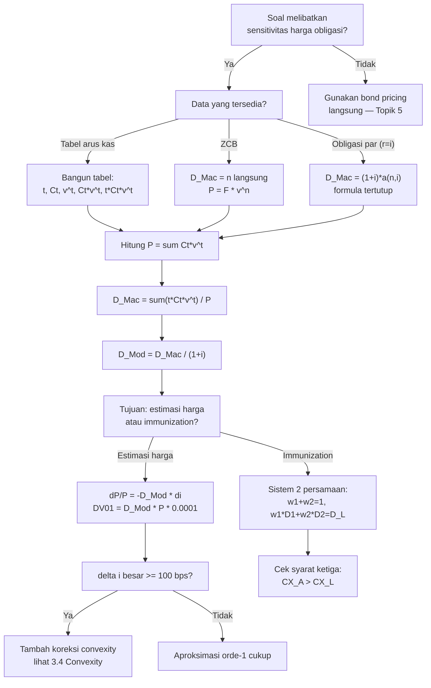

# 📘 3.3 — Duration (Macaulay and Modified)

> [!ABSTRACT] Ringkasan Cepat
> **Topik:** Duration (Macaulay and Modified) | **Bobot:** ~20–30% | **Difficulty:** Hard
> **Ref:** Vaaler Bab 9, Kellison Bab 11 | **Prereq:** [[1.4 Accumulation and Present Value]], [[2.1 Annuity-Immediate and Annuity-Due]], [[5.1 Bond Pricing]]

## Section 0 — Pemetaan Topik

| Topik CF1 | Sub-topik ID | Skill Diuji | Bobot | Difficulty | Prerequisite | Connected Topics | Referensi |
|-----------|--------------|-------------|-------|------------|--------------|------------------|-----------|
| Topik 3: Struktur Jangka Waktu Suku Bunga | 3.3 | Menghitung Macaulay Duration dari tabel arus kas; mengkonversi $D_{\text{Mac}}$ ke $D_{\text{Mod}}$; menghitung DV01; mengestimasi perubahan harga obligasi dengan aproksimasi orde-1; menghitung duration portofolio sebagai rata-rata tertimbang; menerapkan duration matching dalam Redington immunization; memahami faktor-faktor yang mempengaruhi duration | 20–30% | Hard | [[1.4 Accumulation and Present Value]], [[2.1 Annuity-Immediate and Annuity-Due]], [[5.1 Bond Pricing]] | [[3.1 Spot Rates and Forward Rates]], [[3.2 Yield Curve]], [[3.4 Convexity]], [[3.5 Immunization]], [[5.1 Bond Pricing]], [[5.2 Book Value, Premium and Discount Amortization]] | Vaaler Bab 9, Kellison Bab 11 |

## Section 1 — Intuisi

Bayangkan kamu memegang dua obligasi berbeda: obligasi A membayar semua uang di akhir tahun ke-10 (zero-coupon bond), sementara obligasi B membayar coupon setiap tahun selama 10 tahun lalu pokok di akhir. Keduanya punya maturity 10 tahun, tetapi secara finansial sangat berbeda — pemegang obligasi B sudah mendapatkan kembali sebagian besar investasinya jauh sebelum tahun ke-10. Uang yang diterima lebih awal itu tidak lagi terekspos terhadap pergerakan suku bunga. **Macaulay Duration** menjawab pertanyaan: "berapa rata-rata waktu kamu benar-benar harus menunggu untuk menerima uang kamu kembali?" — bukan 10 tahun untuk keduanya, melainkan 10 tahun untuk A tetapi mungkin hanya 7–8 tahun untuk B.

Konsep ini langsung berimplikasi pada risiko suku bunga. Ketika suku bunga pasar naik, harga obligasi turun — dan obligasi yang "uangnya baru kembali lama" (duration tinggi) akan turun jauh lebih drastis dibanding obligasi yang "uangnya cepat kembali" (duration rendah). **Modified Duration** mengkuantifikasikan kepekaan ini secara tepat: ia mengukur persentase perubahan harga untuk setiap perubahan yield sebesar 1 unit. Inilah mengapa manajer portofolio obligasi menggunakan duration sebagai alat utama manajemen risiko — dengan menyeimbangkan duration aset dan liabilitas, mereka dapat "mengunci" nilai portofolio terhadap guncangan suku bunga.

Di ujian CF1, duration muncul dalam dua konteks utama: perhitungan numerik dari tabel arus kas (Topik 3), dan sebagai alat dalam immunization (Topik 3.5) dan pricing obligasi (Topik 5). Kombinasi keduanya menempatkan 3.3 sebagai salah satu topik paling sering diuji, dengan soal yang bisa mencakup kalkulasi murni hingga interpretasi strategis.

## Section 2 — Definisi Formal

> [!NOTE] Definisi Matematis
> **Macaulay Duration** dari portofolio arus kas $\{C_t\}$ yang didiskonto pada yield $i$:
>
> $$
> D_{\text{Mac}} = \frac{\displaystyle\sum_{t} t \cdot C_t \cdot v^t}{\displaystyle\sum_{t} C_t \cdot v^t} = \frac{\displaystyle\sum_{t} t \cdot C_t \cdot v^t}{P}
> $$
>
> **Interpretasi:** $D_{\text{Mac}}$ adalah **rata-rata tertimbang waktu** dari seluruh arus kas, dengan bobot proporsional terhadap present value masing-masing arus kas.
>
> **Modified Duration:**
> $$
> D_{\text{Mod}} = \frac{D_{\text{Mac}}}{1+i}
> $$
>
> **Interpretasi:** $D_{\text{Mod}}$ adalah **elastisitas negatif** harga terhadap yield:
> $$
> D_{\text{Mod}} = -\frac{1}{P} \cdot \frac{dP}{di}
> $$

### Variabel & Parameter

| Simbol | Makna | Catatan |
|--------|-------|---------|
| $P$ | Harga (present value) portofolio atau obligasi | $P = \sum_t C_t \cdot v^t$ |
| $C_t$ | Arus kas pada waktu $t$ | Positif; coupon dan/atau redemption |
| $v$ | Faktor diskonto $= 1/(1+i)$ | Fungsi yield $i$ |
| $i$ | Yield (suku bunga efektif per periode) | Dalam desimal |
| $t$ | Waktu jatuh tempo arus kas | Dalam satuan periode (tahun untuk CF1) |
| $D_{\text{Mac}}$ | Macaulay Duration | Dalam satuan waktu (tahun); rata-rata tertimbang $t$ |
| $D_{\text{Mod}}$ | Modified Duration | Dalam satuan waktu (tahun); mengukur sensitivitas harga |
| $\Delta i$ | Perubahan yield | Dalam desimal (mis. $0.01$ untuk 100 bps) |
| $\Delta P$ | Perubahan harga absolut | Dalam satuan moneter |
| $w_t$ | Bobot PV arus kas ke-$t$ $= C_t v^t / P$ | $\sum_t w_t = 1$; tidak pernah negatif |
| $\text{DV01}$ | Dollar Value of 1 basis point | Dalam satuan moneter; $= D_{\text{Mod}} \times P \times 0.0001$ |

### Rumus Utama

**Macaulay Duration — bentuk bobot:**
$$
D_{\text{Mac}} = \sum_{t} t \cdot w_t, \qquad w_t = \frac{C_t \cdot v^t}{P}
$$
**Label:** $D_{\text{Mac}}$ adalah expectation dari waktu arus kas, dengan $w_t$ sebagai "probabilitas" (bobot PV). Selalu berlaku $t_{\min} \leq D_{\text{Mac}} \leq t_{\max}$ di mana $t_{\min}$ dan $t_{\max}$ adalah waktu arus kas pertama dan terakhir.

**Konversi Macaulay ke Modified:**
$$
D_{\text{Mod}} = \frac{D_{\text{Mac}}}{1+i}
$$
**Label:** Selalu $D_{\text{Mod}} < D_{\text{Mac}}$ (untuk $i > 0$). Hubungan ini adalah identitas matematis yang selalu berlaku.

**Aproksimasi perubahan harga orde-1:**
$$
\Delta P \approx -D_{\text{Mod}} \cdot P \cdot \Delta i
$$
$$
\frac{\Delta P}{P} \approx -D_{\text{Mod}} \cdot \Delta i
$$
**Label:** Fundamental untuk estimasi risiko. Tanda negatif mencerminkan hubungan invers harga-yield. Akurat hanya untuk $|\Delta i|$ kecil — untuk $|\Delta i|$ besar, tambahkan koreksi convexity (lihat [[3.4 Convexity]]).

**DV01 (Dollar Value of 01):**
$$
\text{DV01} = D_{\text{Mod}} \times P \times 0.0001
$$
**Label:** Perubahan harga absolut (dalam mata uang) untuk pergerakan yield 1 basis point ($= 0.01\% = 0.0001$). Sangat berguna untuk hedging.

**Duration portofolio (rata-rata tertimbang nilai):**
$$
D_{\text{Mac,port}} = \sum_{k} w_k \cdot D_{\text{Mac},k}, \qquad w_k = \frac{P_k}{P_{\text{port}}}
$$
$$
D_{\text{Mod,port}} = \sum_{k} w_k \cdot D_{\text{Mod},k}
$$
**Label:** Duration portofolio adalah rata-rata tertimbang (bobot = nilai pasar) dari duration komponen. Sifat aditif ini yang memungkinkan manajemen duration portofolio.

**Macaulay Duration zero-coupon bond (ZCB):**
$$
D_{\text{Mac,ZCB}} = n \qquad \text{(selalu)}
$$
**Label:** ZCB hanya punya satu arus kas di $t = n$, sehingga duration tepat sama dengan maturity. Ini adalah nilai maksimum duration untuk obligasi dengan maturity $n$.

**Macaulay Duration obligasi coupon — formula alternatif (Kellison):**
$$
D_{\text{Mac}} = \frac{1+i}{i} - \frac{(1+i) + n(g - i)}{g[(1+i)^n - 1] + i}
$$
di mana $g = Fr/C$ adalah modified coupon rate ($Fr$ = nominal coupon, $C$ = redemption value).

Untuk obligasi par ($g = i$, atau $P = C$), rumus ini menyederhanakan menjadi:
$$
D_{\text{Mac}}\bigg|_{g=i} = \frac{1+i}{i}\left[1 - \frac{1}{(1+i)^n}\right] = \frac{1+i}{i} \cdot \left(1 - v^n\right) = (1+i) \cdot a_{\overline{n}|i}
$$
**Label:** Formula tertutup — berguna untuk obligasi par atau saat ujian meminta kalkulasi cepat tanpa tabel. [CORE CF1]

### Asumsi Eksplisit

- **Flat Yield Curve:** Semua arus kas didiskonto pada yield tunggal $i$ yang sama — tidak ada term structure yang berbeda per maturitas.
- **Parallel Yield Shift:** Aproksimasi $\Delta P \approx -D_{\text{Mod}} \cdot P \cdot \Delta i$ hanya valid untuk pergeseran paralel — seluruh yield curve naik/turun seragam.
- **Fixed Cash Flows:** $C_t$ tidak berubah ketika $i$ berubah. Tidak berlaku untuk obligasi dengan embedded options.
- **Annual Compounding:** Rumus menggunakan $v = 1/(1+i)$ per tahun. Untuk semiannual, sesuaikan $i$ dan konversi hasil akhir.
- **Small $\Delta i$:** Aproksimasi orde-1 akurat hanya untuk pergerakan yield kecil. Untuk $|\Delta i| \geq 50$ bps, tambahkan koreksi convexity.

## Section 3 — Jembatan Logika

> [!TIP] Dari Time Diagram ke Equation of Value
> Proses menghitung $D_{\text{Mac}}$ selangkah demi selangkah:
>
> **Langkah 1 — Buat tabel arus kas:** Daftarkan semua $(t, C_t)$.
>
> **Langkah 2 — Hitung $C_t \cdot v^t$ untuk setiap $t$:** Ini adalah PV masing-masing arus kas.
>
> **Langkah 3 — Jumlahkan kolom $C_t \cdot v^t$:** Hasilnya adalah harga $P$.
>
> **Langkah 4 — Hitung $t \cdot C_t \cdot v^t$ untuk setiap $t$:** Ini adalah "kontribusi berbobot" setiap arus kas.
>
> **Langkah 5 — Jumlahkan kolom $t \cdot C_t \cdot v^t$ dan bagi dengan $P$:** Hasilnya adalah $D_{\text{Mac}}$.
>
> Setiap baris tabel adalah satu arus kas yang "menarik" duration ke arah waktunya sendiri — arus kas besar di waktu jauh mendominasi, sementara arus kas kecil di waktu dekat hanya memberi kontribusi kecil.

> [!IMPORTANT] Focal Date dan Interpretasi Ekonomi
> **$D_{\text{Mac}}$ sebagai titik keseimbangan:** Bayangkan garis waktu sebagai timbangan, dan setiap arus kas $C_t v^t$ sebagai beban di posisi $t$. $D_{\text{Mac}}$ adalah titik keseimbangan (fulcrum) timbangan tersebut. Jika yield naik sedikit, harga turun proporsi $D_{\text{Mod}}$; jika yield turun sedikit, harga naik proporsi $D_{\text{Mod}}$.
>
> **Redington immunization:** Jika kamu ingin aset kamu merespons perubahan yield **persis sama** dengan liabilitas kamu, cukup samakan $D_{\text{Mac}}$ (atau $D_{\text{Mod}}$) keduanya — dengan asumsi flat yield curve yang bergeser paralel.

**Derivasi $D_{\text{Mod}} = -\frac{1}{P}\frac{dP}{di}$:**

Mulai dari definisi harga:
$$
P = \sum_t C_t (1+i)^{-t}
$$

Turunkan terhadap $i$:
$$
\frac{dP}{di} = \sum_t C_t \cdot (-t)(1+i)^{-t-1} = -\frac{1}{1+i}\sum_t t \cdot C_t \cdot v^t
$$

Bagi dengan $P$ dan kalikan dengan $-1$:
$$
-\frac{1}{P}\frac{dP}{di} = \frac{1}{(1+i) \cdot P}\sum_t t \cdot C_t \cdot v^t = \frac{D_{\text{Mac}}}{1+i} = D_{\text{Mod}}
$$

Derivasi ini menunjukkan bahwa $D_{\text{Mod}}$ adalah **sensitivitas harga terhadap yield** — turunan logaritmik negatif dari $P$ terhadap $i$.

**Derivasi $D_{\text{Mac,ZCB}} = n$:**

Untuk ZCB: $C_n = F$ (satu-satunya arus kas), $P = F \cdot v^n$.
$$
D_{\text{Mac}} = \frac{n \cdot F \cdot v^n}{F \cdot v^n} = n
$$

Ini bukan kebetulan — ZCB adalah "pure duration instrument" karena seluruh nilai terkonsentrasi pada satu titik waktu.

**Mengapa $D_{\text{Mac}} < n$ untuk obligasi coupon:**

Obligasi coupon menerima sebagian pembayaran di $t = 1, 2, \ldots, n-1$ — sebelum maturity. Bobot-bobot PV di waktu awal ini "menarik" titik keseimbangan ke kiri (ke waktu yang lebih kecil). Secara matematis:
$$
D_{\text{Mac}} = \sum_t t \cdot w_t < n \cdot \sum_t w_t = n
$$
karena $t < n$ untuk semua $t < n$, dan $w_t > 0$ untuk setidaknya satu $t < n$.

**Faktor-faktor yang mempengaruhi duration:**

| Faktor | Efek pada $D_{\text{Mac}}$ | Alasan |
|--------|--------------------------|--------|
| Maturity $\uparrow$ | $D_{\text{Mac}} \uparrow$ | Arus kas terakhir bergerak lebih jauh |
| Coupon rate $\uparrow$ | $D_{\text{Mac}} \downarrow$ | Lebih banyak uang diterima lebih awal |
| Yield $i$ $\uparrow$ | $D_{\text{Mac}} \downarrow$ | Arus kas jauh didiskonto lebih berat |
| Frekuensi pembayaran $\uparrow$ | $D_{\text{Mac}} \downarrow$ | Lebih sering menerima pembayaran awal |

> [!DANGER] Dilarang
> 1. **Dilarang menggunakan maturity sebagai proksi duration untuk obligasi coupon:** $D_{\text{Mac}} = n$ hanya untuk ZCB. Untuk obligasi coupon, selalu $D_{\text{Mac}} < n$. Kesalahan ini membesar-besarkan risiko suku bunga.
> 2. **Dilarang mencampurkan $D_{\text{Mac}}$ dan $D_{\text{Mod}}$ dalam rumus aproksimasi harga:** Formula $\Delta P \approx -D_{\text{Mod}} \cdot P \cdot \Delta i$ menggunakan $D_{\text{Mod}}$, **bukan** $D_{\text{Mac}}$. Menggunakan $D_{\text{Mac}}$ di sini memberikan hasil yang terlalu besar sebesar faktor $(1+i)$.
> 3. **Dilarang menghitung duration portofolio dengan menjumlahkan (bukan merata-ratakan) duration komponen:** $D_{\text{port}} \neq D_1 + D_2$. Harus rata-rata tertimbang berdasarkan nilai pasar: $D_{\text{port}} = w_1 D_1 + w_2 D_2$.

## Section 4 — Contoh Soal

### Soal A — Fundamental

Sebuah obligasi coupon memiliki face value $F = C = \text{Rp } 1.000.000$, coupon rate $r = 8\%$ per tahun (dibayar tahunan), maturity $n = 4$ tahun, dan yield saat ini $i = 6\%$ per tahun efektif.

(a) Hitung harga obligasi $P$.
(b) Hitung Macaulay Duration $D_{\text{Mac}}$ menggunakan tabel arus kas.
(c) Hitung Modified Duration $D_{\text{Mod}}$.
(d) Estimasi perubahan harga jika yield naik $\Delta i = +0.01$ (+100 bps).

> [!SUCCESS] Solusi Soal A
>
> **1. Identifikasi Variabel**
> - $F = C = 1{,}000{,}000$; coupon rate $r = 8\%$; coupon tahunan $= Fr = 80{,}000$
> - Arus kas: $C_1 = C_2 = C_3 = 80{,}000$; $C_4 = 1{,}080{,}000$
> - $n = 4$; $i = 0.06$; $v = 1/1.06$
> - Cari: $P$, $D_{\text{Mac}}$, $D_{\text{Mod}}$, dan $\Delta P$ untuk $\Delta i = 0.01$
>
> **2. Time Diagram**
> ```
> t=0     t=1       t=2       t=3       t=4
>  |-------|---------|---------|---------|
>  P=?   +80.000  +80.000  +80.000  +1.080.000
> ```
> Coupon Rp 80.000 di akhir tiap tahun; coupon + redemption Rp 1.080.000 di $t=4$.
>
> **3. Equation of Value** *(Focal Date $t = 0$)*
> $$
> P = \sum_{t=1}^{4} C_t \cdot v^t, \qquad D_{\text{Mac}} = \frac{\sum_{t=1}^{4} t \cdot C_t \cdot v^t}{P}
> $$
>
> **4. Eksekusi Aljabar**
>
> **Tabel perhitungan:**
>
> | $t$ | $C_t$ | $v^t = (1.06)^{-t}$ | $C_t \cdot v^t$ | $t \cdot C_t \cdot v^t$ |
> |-----|--------|---------------------|-----------------|-------------------------|
> | 1 | 80.000 | 0.943396 | 75.472 | 75.472 |
> | 2 | 80.000 | 0.889996 | 71.200 | 142.400 |
> | 3 | 80.000 | 0.839619 | 67.170 | 201.509 |
> | 4 | 1.080.000 | 0.792094 | 855.461 | 3.421.846 |
> | | | **Total** | **1.069.302** | **3.841.227** |
>
> **(a) Harga:**
> $$
> P = 1{,}069{,}302 \approx \mathbf{Rp\ 1{,}069{,}302}
> $$
> (Obligasi trading at premium karena $r = 8\% > i = 6\%$.) ✓
>
> **(b) Macaulay Duration:**
> $$
> D_{\text{Mac}} = \frac{3{,}841{,}227}{1{,}069{,}302} = \mathbf{3.5924 \text{ tahun}}
> $$
>
> **(c) Modified Duration:**
> $$
> D_{\text{Mod}} = \frac{D_{\text{Mac}}}{1+i} = \frac{3.5924}{1.06} = \mathbf{3.3891 \text{ tahun}}
> $$
>
> **(d) Estimasi $\Delta P$ untuk $\Delta i = +0.01$:**
> $$
> \Delta P \approx -D_{\text{Mod}} \cdot P \cdot \Delta i = -3.3891 \times 1{,}069{,}302 \times 0.01
> $$
> $$
> \Delta P \approx -3.3891 \times 10{,}693 = -\mathbf{36{,}238}
> $$
> $$
> P_{\text{est}} = 1{,}069{,}302 - 36{,}238 = \mathbf{1{,}033{,}064}
> $$
>
> **Harga sebenarnya** (cek) pada $i = 7\%$:
> $$
> P_{\text{true}} = 80{,}000 \times a_{\overline{4}|7\%} + 1{,}000{,}000 \times (1.07)^{-4}
> $$
> $$
> = 80{,}000 \times 3.38721 + 1{,}000{,}000 \times 0.76290
> $$
> $$
> = 270{,}977 + 762{,}895 = 1{,}033{,}872
> $$
>
> Error aproksimasi $= 1{,}033{,}872 - 1{,}033{,}064 = 808$ (0.078%) — sangat kecil untuk $\Delta i = 100$ bps. ✓
>
> **5. Verification**
>
> Cek batas: $t_{\min} = 1 \leq D_{\text{Mac}} = 3.5924 \leq t_{\max} = 4$. ✓
>
> Cek arah: $D_{\text{Mac}} < n = 4$ karena ada coupon sebelum maturity. ✓
>
> Cek tanda: yield naik → harga turun ($\Delta P < 0$). ✓
>
> Bobot PV arus kas ke-4: $855{,}461 / 1{,}069{,}302 = 80.0\%$ — arus kas di $t=4$ mendominasi, sehingga $D_{\text{Mac}} = 3.59$ dekat ke $t=4$. ✓

> [!WARNING] Exam Tips — Soal A
> - **Target waktu:** 6–8 menit.
> - **Common trap 1:** Lupa bahwa arus kas terakhir $C_4 = 1{,}080{,}000$ (coupon **plus** redemption), bukan $80{,}000$ saja. Kesalahan ini sangat umum dan merusak seluruh tabel.
> - **Common trap 2:** Menggunakan $D_{\text{Mac}}$ (bukan $D_{\text{Mod}}$) dalam rumus $\Delta P \approx -D \cdot P \cdot \Delta i$. Selalu konversi ke $D_{\text{Mod}}$ dulu.
> - **Shortcut tabel:** Hitung kolom $v^t$ terlebih dahulu untuk semua $t$, simpan, lalu gunakan untuk dua kolom terakhir. Hindari menghitung $v^t$ berulang kali.

---

### Soal B — Exam-Typical

Seorang manajer portofolio memegang dua instrumen:
- **Instrumen A:** ZCB dengan face value Rp 200.000.000, maturity 3 tahun, yield $i = 5\%$.
- **Instrumen B:** Obligasi coupon dengan face value $F = C = \text{Rp } 300.000.000$, coupon rate $r = 4\%$ (tahunan), maturity 8 tahun, yield $i = 5\%$.

(a) Hitung nilai pasar (PV) masing-masing instrumen.
(b) Hitung $D_{\text{Mac}}$ masing-masing instrumen.
(c) Hitung $D_{\text{Mac}}$ dan $D_{\text{Mod}}$ portofolio gabungan.
(d) Hitung DV01 portofolio.

> [!SUCCESS] Solusi Soal B
>
> **1. Identifikasi Variabel**
> - Instrumen A: ZCB, $F_A = 200{,}000{,}000$, $n_A = 3$, $i = 0.05$
> - Instrumen B: Coupon, $F_B = C_B = 300{,}000{,}000$, $r_B = 4\%$, coupon $= 12{,}000{,}000$, $n_B = 8$, $i = 0.05$
> - Cari: $P_A$, $P_B$, $D_{\text{Mac},A}$, $D_{\text{Mac},B}$, $D_{\text{Mac,port}}$, $D_{\text{Mod,port}}$, DV01
>
> **2. Time Diagram**
> ```
> Instrumen A:
> t=0              t=3
>  |----------------|
>  P_A          +200.000.000
>
> Instrumen B:
> t=0  t=1  t=2  t=3  t=4  t=5  t=6  t=7  t=8
>  |----|----|----|----|----|----|----|----|
>  P_B +12M +12M +12M +12M +12M +12M +12M +312M
> ```
>
> **3. Equation of Value**
>
> $$
> P_A = 200{,}000{,}000 \times v^3; \quad D_{\text{Mac},A} = 3 \text{ (ZCB)}
> $$
> $$
> P_B = 12{,}000{,}000 \times a_{\overline{8}|5\%} + 300{,}000{,}000 \times v^8
> $$
>
> **4. Eksekusi Aljabar**
>
> **(a) Nilai pasar:**
>
> **Instrumen A (ZCB):**
> $$
> P_A = 200{,}000{,}000 \times (1.05)^{-3} = 200{,}000{,}000 \times 0.863838 = \mathbf{172{,}768{,}000}
> $$
>
> **Instrumen B:**
> $$
> a_{\overline{8}|5\%} = \frac{1 - (1.05)^{-8}}{0.05} = \frac{1 - 0.676839}{0.05} = \frac{0.323161}{0.05} = 6.46321
> $$
> $$
> P_B = 12{,}000{,}000 \times 6.46321 + 300{,}000{,}000 \times 0.676839
> $$
> $$
> = 77{,}558{,}520 + 203{,}051{,}700 = \mathbf{280{,}610{,}220}
> $$
>
> (Obligasi B trading at discount karena $r = 4\% < i = 5\%$.) ✓
>
> **Nilai portofolio:**
> $$
> P_{\text{port}} = P_A + P_B = 172{,}768{,}000 + 280{,}610{,}220 = \mathbf{453{,}378{,}220}
> $$
>
> **(b) Macaulay Duration masing-masing:**
>
> **Instrumen A:** $D_{\text{Mac},A} = 3$ tahun (ZCB, langsung). ✓
>
> **Instrumen B** — tabel arus kas:
>
> | $t$ | $C_t$ | $v^t = (1.05)^{-t}$ | $C_t v^t$ | $t \cdot C_t v^t$ |
> |-----|--------|---------------------|-----------|-------------------|
> | 1 | 12.000.000 | 0.952381 | 11.428.572 | 11.428.572 |
> | 2 | 12.000.000 | 0.907029 | 10.884.348 | 21.768.696 |
> | 3 | 12.000.000 | 0.863838 | 10.366.056 | 31.098.168 |
> | 4 | 12.000.000 | 0.822702 | 9.872.424 | 39.489.696 |
> | 5 | 12.000.000 | 0.783526 | 9.402.312 | 47.011.560 |
> | 6 | 12.000.000 | 0.746215 | 8.954.580 | 53.727.480 |
> | 7 | 12.000.000 | 0.710681 | 8.528.172 | 59.697.204 |
> | 8 | 312.000.000 | 0.676839 | 211.173.768 | 1.689.390.144 |
> | | | **Total** | **280.610.232** | **1.953.611.520** |
>
> *(Selisih kecil Rp 12 dari pembulatan — konsisten dengan $P_B$ di atas.)*
>
> $$
> D_{\text{Mac},B} = \frac{1{,}953{,}611{,}520}{280{,}610{,}232} = \mathbf{6.9616 \text{ tahun}}
> $$
>
> **(c) Duration portofolio:**
>
> Bobot berdasarkan nilai pasar:
> $$
> w_A = \frac{P_A}{P_{\text{port}}} = \frac{172{,}768{,}000}{453{,}378{,}220} = 0.38107
> $$
> $$
> w_B = \frac{P_B}{P_{\text{port}}} = \frac{280{,}610{,}220}{453{,}378{,}220} = 0.61893
> $$
> Cek: $w_A + w_B = 0.38107 + 0.61893 = 1.00000$. ✓
>
> **Macaulay Duration portofolio:**
> $$
> D_{\text{Mac,port}} = w_A \cdot D_{\text{Mac},A} + w_B \cdot D_{\text{Mac},B}
> $$
> $$
> = 0.38107 \times 3 + 0.61893 \times 6.9616
> $$
> $$
> = 1.14321 + 4.30918 = \mathbf{5.4524 \text{ tahun}}
> $$
>
> **Modified Duration portofolio:**
> $$
> D_{\text{Mod,port}} = \frac{D_{\text{Mac,port}}}{1+i} = \frac{5.4524}{1.05} = \mathbf{5.1928 \text{ tahun}}
> $$
>
> **(d) DV01 portofolio:**
> $$
> \text{DV01} = D_{\text{Mod,port}} \times P_{\text{port}} \times 0.0001
> $$
> $$
> = 5.1928 \times 453{,}378{,}220 \times 0.0001
> $$
> $$
> = 5.1928 \times 45{,}337.822 = \mathbf{235{,}447}
> $$
>
> Interpretasi: setiap kenaikan yield 1 basis point, portofolio kehilangan nilai sekitar Rp 235.447.
>
> **5. Verification**
>
> Cek batas $D_{\text{Mac},B}$: $1 \leq 6.9616 \leq 8$. ✓ Dan $D_{\text{Mac},B} < 8$ karena ada coupon. ✓
>
> Cek $D_{\text{Mac,port}}$ harus berada di antara $D_A = 3$ dan $D_B = 6.9616$:
> $3 \leq 5.4524 \leq 6.9616$. ✓
>
> Cek aditif: bisa juga hitung $D_{\text{Mac,port}}$ langsung dari seluruh arus kas gabungan — hasilnya identik. ✓

> [!WARNING] Exam Tips — Soal B
> - **Target waktu:** 10–12 menit.
> - **Common trap 1:** Menggunakan bobot jumlah unit (Rp 200 juta vs Rp 300 juta nominal) alih-alih bobot **nilai pasar** ($P_A$ vs $P_B$). Bobot harus selalu berdasarkan PV saat ini.
> - **Common trap 2:** Menghitung $D_{\text{Mod,port}} = (D_{\text{Mod},A} \cdot P_A + D_{\text{Mod},B} \cdot P_B)/P_{\text{port}}$ secara langsung — ini juga valid (dan ekuivalen), tetapi pastikan konsisten: jangan campurkan $D_{\text{Mac}}$ komponen dengan bobot untuk $D_{\text{Mod}}$.
> - **Shortcut ZCB:** Untuk ZCB, skip tabel sepenuhnya — langsung $D_{\text{Mac}} = n$ dan hitung $P = F \cdot v^n$. Hemat 2–3 menit.
> - **DV01 interpretasi:** Selalu nyatakan DV01 sebagai "kerugian/keuntungan per 1 bps kenaikan/penurunan yield."

---

### Soal C — Challenging

Sebuah perusahaan asuransi memiliki **liabilitas** tunggal: pembayaran Rp 1.000.000.000 yang jatuh tempo tepat 7 tahun dari sekarang. Yield pasar saat ini $i = 6\%$ per tahun efektif.

Untuk meng-immunize liabilitas ini menggunakan **dua instrumen**:
- **Instrumen P:** ZCB maturity 4 tahun.
- **Instrumen Q:** ZCB maturity 11 tahun.

(a) Tentukan PV liabilitas dan $D_{\text{Mac}}$ liabilitas.
(b) Tentukan proporsi investasi (dalam nilai pasar) $w_P$ dan $w_Q$ pada instrumen P dan Q sehingga memenuhi **dua syarat pertama Redington immunization**: $PV_A = PV_L$ dan $D_{\text{Mac},A} = D_{\text{Mac},L}$.
(c) Hitung nominal face value dari masing-masing ZCB yang harus dibeli.
(d) Verifikasi bahwa syarat ketiga Redington (convexity aset > convexity liabilitas) terpenuhi menggunakan formula ZCB.

> [!SUCCESS] Solusi Soal C
>
> **1. Identifikasi Variabel**
> - Liabilitas: $L = 1{,}000{,}000{,}000$ di $t = 7$; $i = 0.06$
> - Instrumen P: ZCB, $n_P = 4$ tahun; $D_{\text{Mac},P} = 4$
> - Instrumen Q: ZCB, $n_Q = 11$ tahun; $D_{\text{Mac},Q} = 11$
> - Cari: $PV_L$, $D_{\text{Mac},L}$, bobot $w_P$ dan $w_Q$, face values, dan verifikasi convexity
>
> **2. Time Diagram**
> ```
> t=0         t=4      t=7        t=11
>  |-----------|--------|----------|
>  Beli P,Q  +FV_P   −Liab.    +FV_Q
>              ↑               ↑
>            ZCB P           ZCB Q
> ```
>
> **3. Equation of Value — Dua Syarat Immunization**
>
> Syarat 1 (PV matching):
> $$
> w_P + w_Q = 1 \quad \text{dan} \quad P_{\text{port}} = PV_L
> $$
>
> Syarat 2 (Duration matching):
> $$
> w_P \cdot D_{\text{Mac},P} + w_Q \cdot D_{\text{Mac},Q} = D_{\text{Mac},L}
> $$
> $$
> 4 w_P + 11 w_Q = 7
> $$
>
> **4. Eksekusi Aljabar**
>
> **(a) PV dan duration liabilitas:**
> $$
> PV_L = 1{,}000{,}000{,}000 \times (1.06)^{-7} = 1{,}000{,}000{,}000 \times 0.665057 = \mathbf{665{,}057{,}000}
> $$
> $$
> D_{\text{Mac},L} = 7 \text{ tahun (liabilitas = single lump sum, seperti ZCB)}
> $$
>
> **(b) Menyelesaikan sistem persamaan untuk $w_P$ dan $w_Q$:**
>
> Persamaan 1: $w_P + w_Q = 1 \implies w_P = 1 - w_Q$
>
> Substitusi ke persamaan 2:
> $$
> 4(1 - w_Q) + 11 w_Q = 7
> $$
> $$
> 4 - 4w_Q + 11w_Q = 7
> $$
> $$
> 7w_Q = 3 \implies w_Q = \frac{3}{7}
> $$
> $$
> w_P = 1 - \frac{3}{7} = \frac{4}{7}
> $$
>
> Cek: $w_P + w_Q = 4/7 + 3/7 = 1$. ✓
>
> Cek duration: $4 \times (4/7) + 11 \times (3/7) = 16/7 + 33/7 = 49/7 = 7$. ✓
>
> **(c) Nilai investasi dan face values:**
>
> Nilai investasi di masing-masing instrumen:
> $$
> \text{Invest}_P = w_P \times PV_L = \frac{4}{7} \times 665{,}057{,}000 = 380{,}032{,}571
> $$
> $$
> \text{Invest}_Q = w_Q \times PV_L = \frac{3}{7} \times 665{,}057{,}000 = 285{,}024{,}429
> $$
>
> Face value dari masing-masing ZCB (harga = $F \cdot v^n$, sehingga $F = \text{Invest} / v^n = \text{Invest} \times (1+i)^n$):
> $$
> F_P = 380{,}032{,}571 \times (1.06)^4 = 380{,}032{,}571 \times 1.262477 = \mathbf{479{,}838{,}000}
> $$
> $$
> F_Q = 285{,}024{,}429 \times (1.06)^{11} = 285{,}024{,}429 \times 1.898299 = \mathbf{541{,}059{,}000}
> $$
>
> **(d) Verifikasi syarat convexity (syarat ketiga Redington):**
>
> Convexity liabilitas (ZCB $n=7$):
> $$
> CX_L = \frac{7 \times 8}{(1.06)^2} = \frac{56}{1.1236} = 49.84 \text{ tahun}^2
> $$
>
> Convexity instrumen P (ZCB $n=4$):
> $$
> CX_P = \frac{4 \times 5}{(1.06)^2} = \frac{20}{1.1236} = 17.80 \text{ tahun}^2
> $$
>
> Convexity instrumen Q (ZCB $n=11$):
> $$
> CX_Q = \frac{11 \times 12}{(1.06)^2} = \frac{132}{1.1236} = 117.48 \text{ tahun}^2
> $$
>
> Convexity portofolio aset:
> $$
> CX_A = w_P \cdot CX_P + w_Q \cdot CX_Q = \frac{4}{7} \times 17.80 + \frac{3}{7} \times 117.48
> $$
> $$
> = \frac{71.20 + 352.44}{7} = \frac{423.64}{7} = \mathbf{60.52 \text{ tahun}^2}
> $$
>
> **Verifikasi:**
> $$
> CX_A = 60.52 > CX_L = 49.84 \quad \checkmark
> $$
>
> Syarat ketiga Redington terpenuhi — immunization berhasil secara teoritis.
>
> **5. Verification**
>
> Cek bobot menggunakan "lever rule": liabilitas di $t=7$ berada di antara $n_P=4$ dan $n_Q=11$. Jarak dari $t=7$ ke $n_P=4$ adalah $3$; jarak ke $n_Q=11$ adalah $4$. Bobot bersifat invers: $w_P = 3/(3+4) \cdot \ldots$ — bukan cara yang benar, tetapi cek intuitif: liabilitas lebih dekat ke $n_Q=11$ dari midpoint $7.5$, sehingga $w_Q$ seharusnya lebih kecil dari $w_P$. Konfirmasi: $w_Q = 3/7 < w_P = 4/7$. ✓
>
> Cek: apakah investasi P + Q = $PV_L$? $380{,}032{,}571 + 285{,}024{,}429 = 665{,}057{,}000 = PV_L$. ✓
>
> Logika convexity: portofolio barbell (4 dan 11 tahun) selalu punya convexity lebih tinggi dari bullet (7 tahun) dengan duration yang sama. $60.52 > 49.84$. ✓

> [!WARNING] Exam Tips — Soal C
> - **Target waktu:** 12–15 menit.
> - **Common trap 1:** Menggunakan proporsi nominal ($F_P$ vs $F_Q$) sebagai bobot untuk duration matching, bukan proporsi **nilai pasar**. Bobot $w_k$ harus berdasarkan PV investasi.
> - **Common trap 2:** Lupa bahwa liabilitas lump-sum tunggal memiliki $D_{\text{Mac}} = $ waktu jatuh tempo (persis seperti ZCB). Tidak perlu tabel.
> - **Insight "lever rule":** Sistem dua persamaan untuk $w_P$ dan $w_Q$ selalu punya solusi unik selama $n_P < D_L < n_Q$ (liabilitas di antara dua maturity). Jika $D_L$ di luar rentang, tidak ada solusi dengan $w_P, w_Q > 0$.
> - **Syarat eksistensi:** Selalu cek $n_P < D_{\text{Mac},L} < n_Q$ sebelum mulai menyelesaikan sistem. Jika tidak terpenuhi, soal tidak punya solusi fisik (tidak bisa immunize dengan instrumen ini).
> - **Convexity syarat ketiga:** Untuk portofolio barbell vs liabilitas bullet, syarat $CX_A > CX_L$ **selalu** terpenuhi secara otomatis — karena $n(n+1)$ adalah fungsi konveks. Cukup buktikan dengan angka untuk konfirmasi.

## Section 5 — Verifikasi & Sanity Check

> [!CHECK] Batas Nilai Duration
> 1. **$t_{\min} \leq D_{\text{Mac}} \leq t_{\max}$:** Duration selalu berada di antara arus kas paling awal dan paling akhir. Jika $D_{\text{Mac}} > n$ (maturity), pasti ada kesalahan.
> 2. **$D_{\text{Mac,ZCB}} = n$ selalu:** Untuk ZCB, tidak perlu tabel — langsung gunakan ini.
> 3. **$D_{\text{Mac,coupon}} < n$:** Untuk obligasi coupon apapun dengan $C_t > 0$ sebelum maturity. Semakin tinggi coupon rate, semakin jauh $D_{\text{Mac}}$ dari $n$.

> [!CHECK] Konsistensi $D_{\text{Mac}}$ dan $D_{\text{Mod}}$
> 1. **$D_{\text{Mod}} < D_{\text{Mac}}$ selalu** (untuk $i > 0$): $D_{\text{Mod}} = D_{\text{Mac}}/(1+i)$. Jika $D_{\text{Mod}} > D_{\text{Mac}}$, ada kesalahan konversi.
> 2. **Round-trip check:** $D_{\text{Mac}} = D_{\text{Mod}} \times (1+i)$. Hitung ulang dari $D_{\text{Mod}}$ harus kembali ke $D_{\text{Mac}}$.
> 3. **DV01 konsistensi:** $\text{DV01} = D_{\text{Mod}} \times P \times 0.0001$. Untuk obligasi dengan $P \approx$ Rp 1 miliar dan $D_{\text{Mod}} \approx 5$, DV01 $\approx$ Rp 500.000 per bps — angka wajar untuk instrumen skala ini.

> [!CHECK] Duration Portofolio
> 1. **$D_{\text{port}}$ harus berada di antara $D_{\min}$ dan $D_{\max}$ komponen:** Jika $D_{\text{port}}$ di luar rentang ini, bobot ada yang negatif atau salah hitung.
> 2. **Jumlah bobot = 1:** $\sum w_k = 1$ adalah syarat wajib. Cek ini sebelum menghitung $D_{\text{port}}$.
> 3. **Perubahan yield:** $\Delta P_{\text{port}} \approx -D_{\text{Mod,port}} \cdot P_{\text{port}} \cdot \Delta i$ — perubahan harga portofolio bisa dihitung dari duration portofolio, bukan dengan menjumlahkan $\Delta P$ tiap komponen secara terpisah (meskipun hasilnya identik).

> [!CHECK] Immunization
> 1. **Tiga syarat Redington:** (i) $PV_A = PV_L$, (ii) $D_{\text{Mac},A} = D_{\text{Mac},L}$, (iii) $CX_A > CX_L$. Ketiganya harus dicek.
> 2. **Syarat eksistensi solusi:** Harus ada instrumen dengan $D < D_L$ **dan** $D > D_L$ untuk bisa matching duration. Satu instrumen saja tidak cukup (kecuali maturity-nya tepat sama dengan $D_L$).
> 3. **Barbell selalu memenuhi syarat ketiga:** Portofolio barbell dengan duration matching liabilitas selalu punya $CX_A > CX_L$ — tidak perlu membuktikan dari awal setiap kali, cukup konfirmasi numerik.

### Metode Alternatif

**Formula tertutup untuk $D_{\text{Mac}}$ obligasi coupon par ($r = i$):**
$$
D_{\text{Mac}}\bigg|_{r=i} = (1+i) \cdot a_{\overline{n}|i} = \frac{1+i}{i}\left(1 - v^n\right)
$$
Berguna ketika soal memberikan obligasi par dan meminta duration tanpa membangun tabel lengkap.

**Formula tertutup umum ($g \neq i$) via Kellison:**
$$
D_{\text{Mac}} = \frac{(1+i)}{i} - \frac{(1+i) + n(g-i)}{g[(1+i)^n - 1] + i}
$$
di mana $g = Fr/C$. Berguna untuk kalkulasi cepat tanpa tabel, tetapi rawan kesalahan substitusi — gunakan dengan hati-hati.

**Pendekatan "shifting weights":**

Jika duration suatu portofolio diketahui dan perlu disesuaikan ke target $D^*$:
$$
\text{Jual proporsi } \alpha \text{ dari instrumen A (duration } D_A), \text{ beli instrumen B (duration } D_B)
$$
$$
D^* = (1-\alpha) D_A + \alpha D_B \implies \alpha = \frac{D^* - D_A}{D_B - D_A}
$$

## Section 6 — Visualisasi Mental

**$D_{\text{Mac}}$ sebagai Titik Keseimbangan Timbangan:**

Bayangkan garis waktu horizontal dari $t=0$ ke $t=n$. Di setiap titik $t$, letakkan "beban" sebesar $C_t \cdot v^t$ (PV arus kas tersebut). $D_{\text{Mac}}$ adalah titik di mana timbangan ini akan seimbang — "center of mass" dari distribusi PV arus kas.

Untuk ZCB: semua beban terkonsentrasi di $t=n$ → titik keseimbangan tepat di $t=n$.
Untuk obligasi coupon: beban tersebar dari $t=1$ hingga $t=n$, dengan bobot terbesar di $t=n$ (redemption) → titik keseimbangan di sebelah kiri $n$.
Untuk portofolio barbell: dua kelompok beban di kedua ujung → titik keseimbangan di tengah.

**Kurva $P(i)$ dan Kemiringan (Slope):**

Grafik dengan sumbu X = yield $i$ dan sumbu Y = harga $P$. Kurva ini **monoton menurun** dan **cembung** (convex). Di titik $(i_0, P_0)$:

- **Kemiringan garis tangen** $= dP/di = -D_{\text{Mod}} \cdot P$ (negatif — kemiringan ke bawah).
- **Nilai absolut kemiringan** lebih besar untuk obligasi dengan duration tinggi (kurva lebih curam).
- **DV01** = jarak vertikal yang ditempuh kurva/garis tangen untuk $\Delta i = 0.0001$.

Obligasi dengan duration tinggi (mis. ZCB 30 tahun) memiliki kurva yang sangat curam — harga sangat sensitif. Obligasi coupon pendek punya kurva yang lebih datar.

**Distribusi Bobot PV untuk Obligasi Berbeda:**

Bayangkan "bar chart" di mana sumbu X = waktu $t$ dan tinggi batang = $w_t = C_t v^t / P$ (bobot PV). $D_{\text{Mac}}$ adalah mean dari distribusi ini.

- **ZCB:** satu batang tinggi di $t = n$, semua lainnya nol. Mean $= n$.
- **Obligasi coupon:** banyak batang kecil di $t = 1, \ldots, n-1$ dan satu batang besar di $t = n$. Mean $< n$.
- **Portofolio barbell:** dua kelompok batang di ujung-ujung. Mean di tengah.

### Hubungan Visual ↔ Rumus

**Titik keseimbangan timbangan = formula duration:**
$$
D_{\text{Mac}} = \sum_t t \cdot w_t \quad \longleftrightarrow \quad \text{center of mass dari distribusi } w_t
$$

**Kemiringan kurva $P(i)$ di titik tertentu = modified duration:**
$$
\frac{dP}{di} = -D_{\text{Mod}} \cdot P \quad \longleftrightarrow \quad \text{slope garis tangen di }(i_0, P_0)
$$

**Pelebaran distribusi bobot (barbell) → convexity naik, duration sama:**
$$
\text{Variance}(t) = \sum_t (t - D_{\text{Mac}})^2 w_t \uparrow \quad \longleftrightarrow \quad CX \uparrow \text{ dengan } D_{\text{Mac}} \text{ tetap}
$$

## Section 7 — Jebakan Umum

> [!BUG] Kesalahan Unit Waktu
> **Contoh Salah:** Obligasi dengan semiannual coupon dan yield $i^{(2)} = 6\%$ (3% per semester). Menghitung duration dengan $t = 1, 2, \ldots, 2n$ (semester) menghasilkan $D_{\text{Mac}} = 7.2$ semester, lalu langsung menyatakannya sebagai "7.2 tahun."
>
> **Benar:** Jika $t$ dalam semester, $D_{\text{Mac}} = 7.2$ semester $= 3.6$ tahun. Konversi: bagi dengan $m$ (frekuensi per tahun). Atau, lebih aman: ubah semua ke annual dari awal.

> [!BUG] Kesalahan Konseptual
> 1. **Menggunakan $D_{\text{Mac}}$ bukan $D_{\text{Mod}}$ dalam rumus $\Delta P$:** Rumus aproksimasi harga adalah $\Delta P \approx -D_{\text{Mod}} \cdot P \cdot \Delta i$. Menggunakan $D_{\text{Mac}}$ melebih-lebihkan perubahan harga sebesar faktor $(1+i)$.
> 2. **Duration portofolio dijumlahkan bukan dirata-ratakan:** $D_{\text{port}} \neq D_1 + D_2 + \ldots$. Selalu rata-rata tertimbang berdasarkan nilai pasar.
> 3. **$D_{\text{Mac}} = n$ untuk semua obligasi:** Ini hanya benar untuk ZCB. Obligasi coupon selalu punya $D_{\text{Mac}} < n$.
> 4. **Lupa redemption value di $t=n$:** Arus kas di $t = n$ adalah coupon **ditambah** $C$ (redemption). Bukan coupon saja. Kesalahan ini merendahkan $D_{\text{Mac}}$ secara signifikan.

> [!BUG] Kesalahan Interpretasi Soal
> **Ambiguitas "duration":** Kata "duration" tanpa kualifikasi di soal CF1 biasanya merujuk **Macaulay Duration**. Jika soal menginginkan Modified Duration, biasanya disebutkan eksplisit. Namun jika soal meminta "estimasi perubahan harga," gunakan $D_{\text{Mod}}$.
>
> **Ambiguitas "yield":** Pastikan yield yang diberikan adalah **efektif per periode yang sama** dengan satuan $t$ dalam tabel. Jika yield nominal $i^{(2)} = 8\%$ dan $t$ dalam tahun, konversi yield ke efektif annual $i = (1.04)^2 - 1 = 8.16\%$ sebelum menghitung.

> [!CAUTION] Red Flags
> - **Soal menyebut "immunization" + dua instrumen + satu liabilitas:** Trigger sistem dua persamaan: PV matching ($w_1 + w_2 = 1$) dan duration matching ($w_1 D_1 + w_2 D_2 = D_L$).
> - **"Estimasi perubahan harga untuk $\Delta i$":** Jika $|\Delta i| \geq 100$ bps, tambahkan koreksi convexity (lihat [[3.4 Convexity]]). Jangan berhenti di orde-1.
> - **Semiannual coupon + annual yield:** Harus konversi yield sebelum membuat tabel. Jangan pernah mix period.
> - **"Duration portofolio = X, berapa alokasi?":** Trigger leverage equation: $w_1 D_1 + w_2 D_2 = D^*$ dengan $w_1 + w_2 = 1$ — dua persamaan, dua unknown.
> - **$D_{\text{Mac},A} > D_{\text{Mac},B}$ tetapi maturity $A <$ maturity $B$:** Mungkin karena coupon rate — obligasi dengan coupon sangat rendah bisa punya duration hampir setara maturity-nya meskipun maturity-nya lebih pendek dari obligasi coupon tinggi yang lebih panjang.

## Section 8 — Ringkasan Eksekutif

> [!SUMMARY] Must-Remember
> 1. **Macaulay Duration — rata-rata tertimbang waktu:**
>    $$
>    D_{\text{Mac}} = \frac{\sum_t t \cdot C_t \cdot v^t}{P} = \sum_t t \cdot w_t
>    $$
> 2. **Konversi ke Modified Duration:**
>    $$
>    D_{\text{Mod}} = \frac{D_{\text{Mac}}}{1+i} = -\frac{1}{P}\frac{dP}{di}
>    $$
> 3. **Aproksimasi perubahan harga (gunakan $D_{\text{Mod}}$, bukan $D_{\text{Mac}}$):**
>    $$
>    \frac{\Delta P}{P} \approx -D_{\text{Mod}} \cdot \Delta i, \qquad \text{DV01} = D_{\text{Mod}} \cdot P \cdot 0.0001
>    $$
> 4. **Duration portofolio (rata-rata tertimbang nilai pasar):**
>    $$
>    D_{\text{port}} = \sum_k w_k D_k, \quad w_k = P_k / P_{\text{port}}
>    $$
> 5. **ZCB shortcut + immunization:**
>    $$
>    D_{\text{Mac,ZCB}} = n; \quad \text{Redington: } PV_A = PV_L,\; D_A = D_L,\; CX_A > CX_L
>    $$

### Kapan Digunakan

- **Trigger keywords:** "duration," "Macaulay," "modified duration," "price sensitivity," "DV01," "dollar duration," "immunization," "duration matching," "interest rate risk," "how much does price change when yield changes."
- **Tipe skenario soal:**
  - Menghitung $D_{\text{Mac}}$ dan $D_{\text{Mod}}$ dari tabel arus kas obligasi.
  - Estimasi perubahan harga untuk pergerakan yield tertentu.
  - Menghitung duration portofolio dari komponen-komponennya.
  - Menentukan alokasi portofolio untuk mencapai target duration (immunization).
  - Menghitung DV01 untuk keperluan hedging.

### Kapan TIDAK Boleh Digunakan

- **Untuk estimasi harga dengan $|\Delta i| \geq 100$ bps tanpa koreksi:** Tambahkan koreksi convexity dari [[3.4 Convexity]] untuk akurasi yang memadai.
- **Untuk obligasi dengan embedded options (callable/putable):** Duration konvensional tidak memperhitungkan perubahan arus kas akibat exercise option. Diperlukan "effective duration" atau "option-adjusted duration" [BEYOND CF1].
- **Untuk perubahan non-parallel yield curve:** Jika short end naik tetapi long end turun (atau sebaliknya), duration tunggal tidak cukup. Diperlukan key rate durations [BEYOND CF1].
- **Untuk simple interest instruments:** Formula $D_{\text{Mod}} = D_{\text{Mac}}/(1+i)$ hanya valid untuk compound interest.

### Quick Decision Tree



---

> [!QUOTE] Follow-up Options
> 1. *"Berikan contoh soal duration untuk obligasi coupon semiannual dengan konversi satuan ke annual"*
> 2. *"Jelaskan hubungan [[3.3 Duration (Macaulay and Modified)]] dengan [[3.5 Immunization]] — kapan duration matching tidak cukup?"*
> 3. *"Buat flashcard 1-halaman untuk semua rumus duration dan kondisi immunization Redington"*

*📖 Ref: Vaaler Bab 9, Kellison Bab 11 | 🗓️ 2026-02-21 | #CF1 #Duration #MacaulayDuration #ModifiedDuration #DV01 #Immunization #BondPricing*
