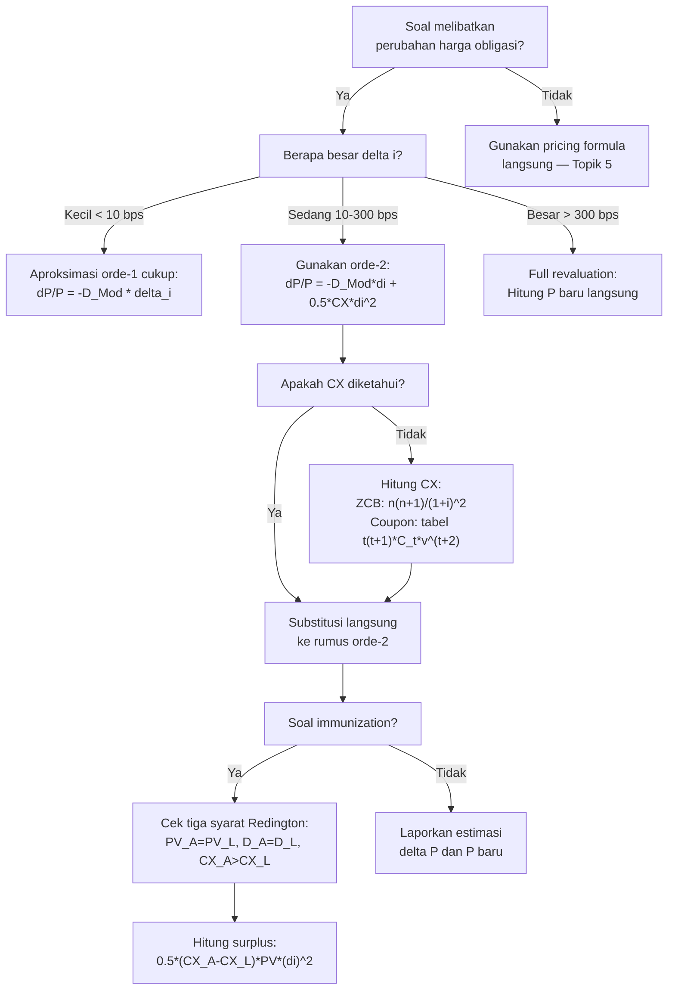

# 📘 3.4 — Convexity

> [!ABSTRACT] Ringkasan Cepat
> **Topik:** Convexity | **Bobot:** ~20–30% | **Difficulty:** Hard
> **Ref:** Vaaler Bab 9, Kellison Bab 11 | **Prereq:** [[1.4 Accumulation and Present Value]], [[2.1 Annuity-Immediate and Annuity-Due]], [[3.3 Duration (Macaulay and Modified)]], [[5.1 Bond Pricing]]

## Section 0 — Pemetaan Topik

| Topik CF1 | Sub-topik ID | Skill Diuji | Bobot | Difficulty | Prerequisite | Connected Topics | Referensi |
|-----------|--------------|-------------|-------|------------|--------------|------------------|-----------|
| Topik 3: Struktur Jangka Waktu Suku Bunga | 3.4 | Menghitung convexity portofolio arus kas dan obligasi; menerapkan aproksimasi orde-2 Taylor untuk estimasi perubahan harga; menjelaskan mengapa convexity positif selalu menguntungkan; menghitung convexity-adjusted price change; membedakan peran duration (orde-1) dan convexity (orde-2) dalam lindung nilai; mengetahui kondisi immunization yang diperluas | 20–30% | Hard | [[1.4 Accumulation and Present Value]], [[2.1 Annuity-Immediate and Annuity-Due]], [[3.3 Duration (Macaulay and Modified)]], [[5.1 Bond Pricing]] | [[3.3 Duration (Macaulay and Modified)]], [[3.5 Immunization]], [[5.1 Bond Pricing]], [[5.2 Book Value, Premium and Discount Amortization]] | Vaaler Bab 9, Kellison Bab 11 |

## Section 1 — Intuisi

Bayangkan kamu memegang sebuah obligasi dan suku bunga pasar bergerak. Kamu sudah belajar dari [[3.3 Duration (Macaulay and Modified)]] bahwa **modified duration** memberikan estimasi linear seberapa besar harga obligasi berubah ketika yield berubah satu unit kecil. Tapi "linear" adalah kata kuncinya — dunia nyata tidak linear. Kurva harga-yield obligasi **tidak** berbentuk garis lurus; ia melengkung. Convexity mengukur kelengkungan (curvature) kurva tersebut, dan koreksi orde-2 ini menjadi krusial ketika pergerakan yield cukup besar.

Analogi yang tepat: bayangkan kamu memperkirakan bentuk bukit hanya dari kemiringan di satu titik (itu adalah duration). Jika berjalan hanya selangkah kecil, perkiraan kemiringan cukup akurat. Tapi jika berjalan jauh, kamu akan menemukan bahwa bukit itu melengkung — dan perkiraan linier semakin meleset. Convexity adalah koreksi yang memperhitungkan "betapa cepatnya kemiringan itu berubah" (derivative kedua). Dengan menambahkan koreksi convexity ke estimasi duration, kita mendapatkan aproksimasi perubahan harga yang jauh lebih akurat.

Yang membuat convexity menarik secara finansial adalah properti **convexity positif selalu menguntungkan pemegang obligasi**: ketika yield naik, harga turun lebih sedikit dari yang diperkirakan duration semata; ketika yield turun, harga naik lebih banyak dari perkiraan duration. Artinya obligasi dengan convexity lebih tinggi selalu lebih bernilai, ceteris paribus. Pemahaman ini adalah fondasi dari strategi [[3.5 Immunization]] yang lebih canggih, di mana convexity adalah syarat ketiga yang memastikan portofolio terlindungi dari pergerakan yield dalam skala besar.

## Section 2 — Definisi Formal

> [!NOTE] Definisi Matematis
> **Convexity** ($CX$ atau $C$) dari portofolio arus kas $\{C_t\}$ dengan yield $i$ didefinisikan sebagai:
>
> $$
> CX = \frac{1}{P} \cdot \frac{d^2P}{di^2}
> $$
>
> di mana $P = P(i) = \sum_{t} C_t \cdot v^t$ adalah present value portofolio sebagai fungsi dari yield $i$.
>
> **Bentuk komputasional eksplisit** (dalam satuan tahun²):
> $$
> CX = \frac{\displaystyle\sum_{t} t(t+1) \cdot C_t \cdot v^{t+2}}{\displaystyle\sum_{t} C_t \cdot v^t} = \frac{\displaystyle\sum_{t} t(t+1) \cdot C_t \cdot v^{t+2}}{P}
> $$
>
> **Aproksimasi perubahan harga orde-2 (Taylor expansion):**
> $$
> \frac{\Delta P}{P} \approx -D_{\text{Mod}} \cdot \Delta i + \frac{1}{2} \cdot CX \cdot (\Delta i)^2
> $$
>
> di mana $\Delta i = i_{\text{baru}} - i_{\text{lama}}$ dan $D_{\text{Mod}}$ adalah modified duration.

### Variabel & Parameter

| Simbol | Makna | Catatan |
|--------|-------|---------|
| $P(i)$ | Harga (present value) portofolio sebagai fungsi yield $i$ | Selalu positif; fungsi konveks terhadap $i$ |
| $C_t$ | Arus kas pada waktu $t$ | Positif untuk penerimaan (coupon, redemption) |
| $v$ | Faktor diskonto $= 1/(1+i)$ | Fungsi $i$ |
| $D_{\text{Mac}}$ | Macaulay Duration | Dalam satuan waktu (tahun) |
| $D_{\text{Mod}}$ | Modified Duration $= D_{\text{Mac}}/(1+i)$ | Dalam satuan tahun; elastisitas harga terhadap $(1+i)$ |
| $CX$ | Convexity | Dalam satuan tahun²; selalu positif untuk fixed-income |
| $\Delta i$ | Perubahan yield ($i_{\text{baru}} - i_{\text{lama}}$) | Dalam desimal (mis. $0.01$ untuk 100 bps) |
| $\Delta P$ | Perubahan harga absolut ($P_{\text{baru}} - P_{\text{lama}}$) | Positif jika yield turun |
| $\Delta P / P$ | Perubahan harga relatif (persentase) | Tanpa satuan |
| $t$ | Waktu jatuh tempo arus kas | Dalam tahun |

### Rumus Utama

**Convexity — definisi via turunan kedua:**
$$
CX = \frac{1}{P} \cdot \frac{d^2P}{di^2}
$$
**Label:** Definisi fundamental. Convexity adalah turunan kedua dari $P(i)$, dinormalisasi oleh harga. Selalu positif untuk portofolio arus kas positif.

**Convexity — formula komputasional:**
$$
CX = \frac{1}{P} \sum_{t} \frac{t(t+1)}{(1+i)^{t+2}} \cdot C_t
$$
**Label:** Bentuk yang langsung bisa dihitung. Perhatikan: bobot setiap arus kas adalah $t(t+1) \cdot v^{t+2}$, berbeda dari duration yang menggunakan $t \cdot v^t$.

**Hubungan convexity dengan Macaulay Duration:**

Untuk obligasi dengan $n$ arus kas identik (coupon $Fr$ setiap periode dan redemption $C$ di $t=n$), convexity dapat ditulis sebagai:
$$
CX = \frac{1}{(1+i)^2}\left[\frac{\sum_t t(t+1) \cdot C_t \cdot v^t}{P}\right]
$$

Untuk **zero-coupon bond** dengan maturity $n$:
$$
CX_{\text{ZCB}} = \frac{n(n+1)}{(1+i)^2}
$$
**Label:** Zero-coupon bond memiliki convexity paling tinggi di antara semua obligasi dengan maturity yang sama — karena seluruh arus kas terkonsentrasi di $t=n$.

**Aproksimasi perubahan harga — orde pertama (duration saja):**
$$
\frac{\Delta P}{P} \approx -D_{\text{Mod}} \cdot \Delta i
$$

**Aproksimasi perubahan harga — orde kedua (duration + convexity):**
$$
\frac{\Delta P}{P} \approx -D_{\text{Mod}} \cdot \Delta i + \frac{1}{2} \cdot CX \cdot (\Delta i)^2
$$
**Label:** Suku orde-2 selalu **positif** (karena $CX > 0$ dan $(\Delta i)^2 > 0$). Artinya harga sebenarnya selalu **lebih tinggi** dari estimasi linear (duration saja), baik ketika yield naik maupun ketika yield turun.

**Perubahan harga absolut — orde kedua:**
$$
\Delta P \approx -D_{\text{Mod}} \cdot P \cdot \Delta i + \frac{1}{2} \cdot CX \cdot P \cdot (\Delta i)^2
$$

**Convexity portofolio (kombinasi aset):**
$$
CX_{\text{port}} = \frac{\sum_k P_k \cdot CX_k}{\sum_k P_k} = \sum_k w_k \cdot CX_k
$$
di mana $w_k = P_k / P_{\text{port}}$ adalah bobot berdasarkan nilai pasar aset ke-$k$.
**Label:** Convexity portofolio adalah rata-rata tertimbang (berdasarkan nilai) dari convexity masing-masing komponen. Identik dengan sifat aditif duration.

**Syarat Redington Immunization (diperluas dengan convexity):**

Selain dua syarat durasi, syarat ketiga immunization Redington adalah:
$$
CX_A > CX_L
$$
di mana $CX_A$ = convexity aset dan $CX_L$ = convexity liabilitas.
**Label:** Convexity aset harus **melebihi** convexity liabilitas — ini memastikan surplus portofolio bersifat convex terhadap perubahan yield (selalu non-negatif untuk perubahan yield berapapun).

### Asumsi Eksplisit

- **Parallel Yield Shift:** Semua arus kas didiskonto dengan yield tunggal $i$ yang bergerak seragam — **flat yield curve** yang bergeser paralel. Convexity standar tidak berlaku untuk perubahan bentuk kurva.
- **Flat Yield Curve:** $P(i)$ dihitung pada satu yield $i$ yang sama untuk semua maturitas.
- **Fixed Cash Flows:** Arus kas $C_t$ tidak berubah ketika $i$ berubah (tidak ada embedded options). Obligasi callable memiliki **negative convexity** pada yield rendah — di luar asumsi ini.
- **Small to Moderate $\Delta i$:** Aproksimasi Taylor semakin tidak akurat untuk pergerakan yield yang sangat besar ($|\Delta i| > 200$ bps).
- **Annual Compounding:** Rumus di sini menggunakan $v = 1/(1+i)$ per tahun. Untuk semiannual compounding (standar obligasi korporat/pemerintah), ada faktor penyesuaian.

## Section 3 — Jembatan Logika

> [!TIP] Dari Time Diagram ke Equation of Value
> Kita mulai dari harga sebagai fungsi yield:
> $$
> P(i) = \sum_{t=1}^{n} C_t \cdot (1+i)^{-t}
> $$
>
> Turunkan terhadap $i$:
> $$
> \frac{dP}{di} = \sum_{t=1}^{n} C_t \cdot (-t)(1+i)^{-t-1} = -\frac{1}{1+i}\sum_{t=1}^{n} t \cdot C_t \cdot v^t
> $$
>
> Dari sini, modified duration muncul: $D_{\text{Mod}} = -\frac{1}{P}\frac{dP}{di}$. Sekarang turunkan lagi terhadap $i$ untuk mendapat turunan kedua:
> $$
> \frac{d^2P}{di^2} = \sum_{t=1}^{n} C_t \cdot t(t+1)(1+i)^{-t-2} = \sum_{t=1}^{n} \frac{t(t+1) \cdot C_t}{(1+i)^{t+2}}
> $$
>
> Normalisasi dengan $P$: ini adalah **convexity**. Struktur $t(t+1)$ muncul alami dari aturan turunan pangkat: $\frac{d^2}{di^2}(1+i)^{-t} = t(t+1)(1+i)^{-t-2}$.

> [!IMPORTANT] Focal Date dan Makna Geometri
> **Geometri kurva $P$ vs $i$:** Karena $d^2P/di^2 > 0$ untuk semua $i > 0$ dan $C_t > 0$, kurva harga-yield **selalu cembung ke atas** (convex). Ini berarti:
> - Garis tangen (approx. duration) selalu berada **di bawah** kurva $P(i)$ yang sebenarnya.
> - Selisih antara harga sebenarnya dan estimasi linear = suku convexity $\frac{1}{2} CX \cdot P \cdot (\Delta i)^2 \geq 0$.
> - Semakin besar $\Delta i$, semakin signifikan suku convexity ini.
>
> **Implikasi trading:** Dua obligasi dengan duration yang sama tetapi convexity berbeda tidaklah ekuivalen. Obligasi dengan convexity lebih tinggi lebih "untung" di kedua arah pergerakan yield. Pasar biasanya mem-pricing obligasi high-convexity dengan yield lebih rendah (harga lebih mahal) sebagai kompensasi.

**Derivasi lengkap formula convexity dari Taylor expansion:**

Ekspansi Taylor orde-2 dari $P(i + \Delta i)$ di sekitar $i$:
$$
P(i + \Delta i) = P(i) + \frac{dP}{di}\Delta i + \frac{1}{2}\frac{d^2P}{di^2}(\Delta i)^2 + O\left((\Delta i)^3\right)
$$

Kurangi $P(i)$ di kedua sisi dan bagi dengan $P(i)$:
$$
\frac{\Delta P}{P} = \frac{1}{P}\frac{dP}{di}\Delta i + \frac{1}{2}\frac{1}{P}\frac{d^2P}{di^2}(\Delta i)^2 + O\left((\Delta i)^3\right)
$$

Substitusi $\frac{1}{P}\frac{dP}{di} = -D_{\text{Mod}}$ dan $\frac{1}{P}\frac{d^2P}{di^2} = CX$:
$$
\frac{\Delta P}{P} \approx -D_{\text{Mod}} \cdot \Delta i + \frac{1}{2} \cdot CX \cdot (\Delta i)^2
$$

**Derivasi $CX$ untuk zero-coupon bond:**

Untuk ZCB dengan face value $F$ dan maturity $n$: $P = F \cdot v^n = F(1+i)^{-n}$.

$$
\frac{dP}{di} = -nF(1+i)^{-n-1}, \qquad \frac{d^2P}{di^2} = n(n+1)F(1+i)^{-n-2}
$$

$$
CX = \frac{1}{P} \cdot \frac{d^2P}{di^2} = \frac{n(n+1)F(1+i)^{-n-2}}{F(1+i)^{-n}} = \frac{n(n+1)}{(1+i)^2}
$$

Untuk ZCB, $D_{\text{Mac}} = n$ dan $D_{\text{Mod}} = n/(1+i)$. Perhatikan bahwa:
$$
CX_{\text{ZCB}} = \frac{n(n+1)}{(1+i)^2} = D_{\text{Mod}} \cdot \frac{n+1}{1+i} = D_{\text{Mac}} \cdot \frac{D_{\text{Mac}}+1}{(1+i)^2}
$$

Ini menunjukkan bahwa convexity ZCB sepenuhnya ditentukan oleh maturity $n$ dan yield $i$ — tidak ada parameter lain.

**Mengapa convexity selalu positif untuk fixed-income?**

Untuk portofolio dengan $C_t \geq 0$ (tidak ada short position):
$$
CX = \frac{1}{P}\sum_t t(t+1) \cdot C_t \cdot v^{t+2}
$$

Setiap suku dalam penjumlahan: $t > 0$, $t+1 > 0$, $C_t \geq 0$, $v^{t+2} > 0$. Maka setiap suku $\geq 0$, dan setidaknya satu suku $> 0$ (karena ada setidaknya satu $C_t > 0$). Sehingga $CX > 0$. Q.E.D.

> [!DANGER] Dilarang
> 1. **Dilarang menghitung convexity dengan bobot $t \cdot v^t$ saja (bobot duration):** Convexity menggunakan $t(t+1) \cdot v^{t+2}$, bukan $t \cdot v^t$. Faktor tambahan $(t+1)/(1+i)^2$ adalah sumber kesalahan paling umum.
> 2. **Dilarang mengabaikan faktor $1/2$ dalam suku convexity:** Aproksimasi orde-2 adalah $\frac{1}{2} CX (\Delta i)^2$, bukan $CX (\Delta i)^2$. Faktor $1/2$ berasal dari ekspansi Taylor dan tidak boleh dihilangkan.
> 3. **Dilarang menyimpulkan bahwa duration saja sudah cukup untuk $|\Delta i|$ besar:** Untuk perubahan yield $\geq 50$ bps, suku convexity bisa mencapai 5–20% dari estimasi perubahan harga — tidak bisa diabaikan. Selalu tambahkan koreksi convexity jika soal memberikan pergerakan yield yang signifikan.

## Section 4 — Contoh Soal

### Soal A — Fundamental

Sebuah obligasi zero-coupon (ZCB) memiliki face value Rp 100.000.000, jatuh tempo dalam $n = 10$ tahun, dan diperdagangkan pada yield $i = 8\%$ per tahun efektif.

(a) Hitung harga obligasi $P$.
(b) Hitung modified duration $D_{\text{Mod}}$.
(c) Hitung convexity $CX$.
(d) Estimasi perubahan harga (dalam persen) jika yield turun $\Delta i = -0.01$ (turun 100 bps), menggunakan: (i) aproksimasi orde-1 (duration saja), dan (ii) aproksimasi orde-2 (duration + convexity). Bandingkan dengan harga sebenarnya.

> [!SUCCESS] Solusi Soal A
>
> **1. Identifikasi Variabel**
> - Face value: $F = 100{,}000{,}000$
> - Maturity: $n = 10$ tahun
> - Yield: $i = 0.08$, sehingga $v = 1/1.08$
> - Tipe: Zero-coupon bond — satu-satunya arus kas adalah $C_{10} = F$ di $t = 10$
> - Cari: $P$, $D_{\text{Mod}}$, $CX$, dan perubahan harga untuk $\Delta i = -0.01$
>
> **2. Time Diagram**
> ```
> t=0                                          t=10
>  |---------------------------------------------|
>  P = ?                              C₁₀ = 100.000.000
> ```
> Satu arus kas tunggal di $t = 10$. Tidak ada coupon.
>
> **3. Equation of Value** *(Focal Date $t = 0$)*
>
> $$
> P = F \cdot v^{10} = 100{,}000{,}000 \times (1.08)^{-10}
> $$
> $$
> D_{\text{Mac}} = 10, \quad D_{\text{Mod}} = \frac{10}{1.08}
> $$
> $$
> CX = \frac{n(n+1)}{(1+i)^2} = \frac{10 \times 11}{(1.08)^2}
> $$
>
> **4. Eksekusi Aljabar**
>
> **(a) Harga:**
> $$
> (1.08)^{10} = 2.158925, \quad v^{10} = 0.463193
> $$
> $$
> P = 100{,}000{,}000 \times 0.463193 = \mathbf{46{,}319{,}300}
> $$
>
> **(b) Modified Duration:**
> $$
> D_{\text{Mac}} = 10 \text{ tahun (untuk ZCB, selalu = maturity)}
> $$
> $$
> D_{\text{Mod}} = \frac{10}{1.08} = \mathbf{9.2593 \text{ tahun}}
> $$
>
> **(c) Convexity:**
> $$
> CX = \frac{10 \times 11}{(1.08)^2} = \frac{110}{1.1664} = \mathbf{94.3073 \text{ tahun}^2}
> $$
>
> **(d) Estimasi perubahan harga untuk $\Delta i = -0.01$:**
>
> **Aproksimasi orde-1 (duration saja):**
> $$
> \frac{\Delta P}{P} \approx -D_{\text{Mod}} \cdot \Delta i = -9.2593 \times (-0.01) = +0.092593
> $$
> $$
> \Delta P_1 \approx +0.092593 \times 46{,}319{,}300 = +\mathbf{4{,}288{,}800}
> $$
> $$
> P_{\text{est,1}} = 46{,}319{,}300 + 4{,}288{,}800 = \mathbf{50{,}608{,}100}
> $$
>
> **Aproksimasi orde-2 (duration + convexity):**
> $$
> \frac{\Delta P}{P} \approx -9.2593 \times (-0.01) + \frac{1}{2} \times 94.3073 \times (-0.01)^2
> $$
> $$
> = 0.092593 + \frac{1}{2} \times 94.3073 \times 0.0001
> $$
> $$
> = 0.092593 + 0.004715 = 0.097308
> $$
> $$
> \Delta P_2 \approx 0.097308 \times 46{,}319{,}300 = +\mathbf{4{,}507{,}200}
> $$
> $$
> P_{\text{est,2}} = 46{,}319{,}300 + 4{,}507{,}200 = \mathbf{50{,}826{,}500}
> $$
>
> **Harga sebenarnya** (yield baru $= 0.07$):
> $$
> P_{\text{true}} = 100{,}000{,}000 \times (1.07)^{-10} = 100{,}000{,}000 \times 0.508349 = \mathbf{50{,}834{,}900}
> $$
>
> **Perbandingan:**
>
> | Metode | Estimasi Harga | Error vs Harga Sebenarnya |
> |--------|---------------|---------------------------|
> | Harga sebenarnya | Rp 50.834.900 | — |
> | Orde-1 (duration) | Rp 50.608.100 | −Rp 226.800 (−0.45%) |
> | Orde-2 (+ convexity) | Rp 50.826.500 | −Rp 8.400 (−0.02%) |
>
> **5. Verification**
>
> Koreksi convexity mengurangi error dari Rp 226.800 menjadi hanya Rp 8.400 — peningkatan akurasi ~27 kali lipat. Ini membuktikan nilai koreksi convexity untuk pergerakan yield 100 bps. ✓
>
> Cek arah: yield turun → harga naik (hubungan invers). Estimasi orde-1 memberikan kenaikan; orde-2 memberikan kenaikan lebih besar. Harga sebenarnya bahkan lebih tinggi — konsisten dengan convexity positif (kurva selalu di atas garis tangen). ✓

> [!WARNING] Exam Tips — Soal A
> - **Target waktu:** 6–8 menit.
> - **Common trap:** Untuk ZCB, $D_{\text{Mac}} = n$ (bukan harus dihitung ulang). Langsung gunakan formula $CX = n(n+1)/(1+i)^2$.
> - **Shortcut konversi bps:** $\Delta i = -100 \text{ bps} = -0.01$ dalam desimal. Jangan lupa konversi sebelum substitusi.
> - **Urutan langkah:** Selalu hitung $P$ dan $D_{\text{Mod}}$ dulu sebelum $CX$, karena $CX$ memerlukan keduanya sebagai konteks.

---

### Soal B — Exam-Typical

Sebuah obligasi coupon memiliki spesifikasi: face value $F = C = \text{Rp } 100{,}000{,}000$, coupon rate $r = 6\%$ per tahun (dibayar tahunan), maturity $n = 5$ tahun, dan yield saat ini $i = 8\%$ per tahun efektif.

(a) Hitung harga obligasi $P$.
(b) Hitung convexity $CX$ menggunakan formula komputasional $\displaystyle CX = \frac{\sum_t t(t+1) \cdot C_t \cdot v^{t+2}}{P}$.
(c) Seorang manajer portofolio menggunakan modified duration $D_{\text{Mod}} = 4.1002$ tahun (sudah diberikan). Estimasi perubahan harga jika yield naik $\Delta i = +0.02$ (+200 bps), dengan dan tanpa koreksi convexity.

> [!SUCCESS] Solusi Soal B
>
> **1. Identifikasi Variabel**
> - $F = C = 100{,}000{,}000$; coupon rate $r = 6\%$; coupon per tahun $= Fr = 6{,}000{,}000$
> - Arus kas: $C_1 = C_2 = C_3 = C_4 = 6{,}000{,}000$; $C_5 = 106{,}000{,}000$ (coupon + redemption)
> - $n = 5$, $i = 0.08$, $v = 1/1.08$, $D_{\text{Mod}} = 4.1002$ tahun (diberikan)
> - Cari: $P$, $CX$, dan estimasi $\Delta P/P$ untuk $\Delta i = +0.02$
>
> **2. Time Diagram**
> ```
> t=0    t=1     t=2     t=3     t=4     t=5
>  |------|-------|-------|-------|-------|
>  P=?   +6M    +6M    +6M    +6M   +106M
> ```
> Coupon Rp 6 juta di akhir tiap tahun; redemption Rp 100 juta di $t=5$.
>
> **3. Equation of Value** *(Focal Date $t = 0$)*
>
> $$
> P = \sum_{t=1}^{4} 6{,}000{,}000 \cdot v^t + 106{,}000{,}000 \cdot v^5
> $$
>
> $$
> CX = \frac{\displaystyle\sum_{t=1}^{5} t(t+1) \cdot C_t \cdot v^{t+2}}{P}
> $$
>
> **4. Eksekusi Aljabar**
>
> **Faktor diskonto yang diperlukan:**
>
> | $t$ | $v^t = (1.08)^{-t}$ | $v^{t+2} = v^t \cdot v^2$ |
> |-----|---------------------|--------------------------|
> | 1 | 0.925926 | $0.925926 / 1.1664 = 0.793832$ |
> | 2 | 0.857339 | $0.857339 / 1.1664 = 0.734992$ |
> | 3 | 0.793832 | $0.793832 / 1.1664 = 0.680583$ |
> | 4 | 0.735030 | $0.735030 / 1.1664 = 0.630170$ |
> | 5 | 0.680583 | $0.680583 / 1.1664 = 0.583490$ |
>
> *(Catatan: $v^2 = 1/(1.08)^2 = 1/1.1664 = 0.857339$, sehingga $v^{t+2} = v^t \times v^2 = v^t \times 0.857339$)*
>
> Lebih mudah: $v^{t+2} = (1.08)^{-(t+2)}$.
>
> **Harga $P$:**
> $$
> P = 6{,}000{,}000 \times a_{\overline{5}|8\%} + 100{,}000{,}000 \times v^5
> $$
> $$
> a_{\overline{5}|8\%} = \frac{1 - (1.08)^{-5}}{0.08} = \frac{1 - 0.680583}{0.08} = \frac{0.319417}{0.08} = 3.99271
> $$
> $$
> P = 6{,}000{,}000 \times 3.99271 + 100{,}000{,}000 \times 0.680583
> $$
> $$
> = 23{,}956{,}260 + 68{,}058{,}300 = \mathbf{92{,}014{,}560}
> $$
>
> (Obligasi trading at discount karena $r = 6\% < i = 8\%$.) ✓
>
> **Tabel perhitungan convexity — kolom $t(t+1) \cdot C_t \cdot v^{t+2}$:**
>
> | $t$ | $C_t$ | $t(t+1)$ | $v^{t+2}$ | $t(t+1) \cdot C_t \cdot v^{t+2}$ |
> |-----|--------|-----------|-----------|-----------------------------------|
> | 1 | 6.000.000 | 2 | $(1.08)^{-3} = 0.793832$ | $2 \times 6{,}000{,}000 \times 0.793832 = 9{,}525{,}984$ |
> | 2 | 6.000.000 | 6 | $(1.08)^{-4} = 0.735030$ | $6 \times 6{,}000{,}000 \times 0.735030 = 26{,}461{,}080$ |
> | 3 | 6.000.000 | 12 | $(1.08)^{-5} = 0.680583$ | $12 \times 6{,}000{,}000 \times 0.680583 = 48{,}995{,}976$ |
> | 4 | 6.000.000 | 20 | $(1.08)^{-6} = 0.630170$ | $20 \times 6{,}000{,}000 \times 0.630170 = 75{,}620{,}400$ |
> | 5 | 106.000.000 | 30 | $(1.08)^{-7} = 0.583490$ | $30 \times 106{,}000{,}000 \times 0.583490 = 1{,}855{,}497{,}000$ |
> | | | | **Total:** | **2{,}016{,}100{,}440** |
>
> $$
> CX = \frac{2{,}016{,}100{,}440}{92{,}014{,}560} = \mathbf{21.909 \text{ tahun}^2}
> $$
>
> **(c) Estimasi $\Delta P / P$ untuk $\Delta i = +0.02$:**
>
> **Hanya duration:**
> $$
> \frac{\Delta P}{P} \approx -D_{\text{Mod}} \cdot \Delta i = -4.1002 \times 0.02 = -0.082004
> $$
> $$
> \Delta P_1 \approx -0.082004 \times 92{,}014{,}560 = -\mathbf{7{,}546{,}000}
> $$
>
> **Duration + convexity:**
> $$
> \frac{\Delta P}{P} \approx -4.1002 \times 0.02 + \frac{1}{2} \times 21.909 \times (0.02)^2
> $$
> $$
> = -0.082004 + \frac{1}{2} \times 21.909 \times 0.0004
> $$
> $$
> = -0.082004 + 0.004382 = -0.077622
> $$
> $$
> \Delta P_2 \approx -0.077622 \times 92{,}014{,}560 = -\mathbf{7{,}143{,}000}
> $$
>
> **Harga sebenarnya** (yield baru $= 10\%$):
> $$
> P_{\text{true}} = 6{,}000{,}000 \times a_{\overline{5}|10\%} + 100{,}000{,}000 \times (1.10)^{-5}
> $$
> $$
> = 6{,}000{,}000 \times 3.79079 + 100{,}000{,}000 \times 0.620921
> $$
> $$
> = 22{,}744{,}740 + 62{,}092{,}100 = 84{,}836{,}840
> $$
> $$
> \Delta P_{\text{true}} = 84{,}836{,}840 - 92{,}014{,}560 = -7{,}177{,}720
> $$
>
> **Perbandingan:**
>
> | Metode | $\Delta P$ Estimasi | Error |
> |--------|--------------------|----|
> | Harga sebenarnya | −Rp 7.177.720 | — |
> | Duration saja | −Rp 7.546.000 | +Rp 368.280 (over-estimate penurunan) |
> | Duration + Convexity | −Rp 7.143.000 | −Rp 34.720 (under-estimate penurunan) |
>
> **5. Verification**
>
> Koreksi convexity mengurangi error dari Rp 368.280 menjadi Rp 34.720 — peningkatan akurasi >10 kali lipat. ✓
>
> Arah koreksi convexity selalu **mengurangi** dampak negatif yield naik (dan menambah dampak positif yield turun) — konsisten dengan convexity positif. ✓
>
> Cek: $P_{\text{true}} > P + \Delta P_{\text{est,2}}$? Rp 84.836.840 vs Rp 84.871.560. Harga sebenarnya **sedikit di atas** estimasi orde-2 — ini benar karena ada suku orde-3 positif yang diabaikan. ✓

> [!WARNING] Exam Tips — Soal B
> - **Target waktu:** 10–12 menit.
> - **Common trap 1:** Kolom $v^{t+2}$ sering dihitung salah. Ingat: $v^{t+2} = (1+i)^{-(t+2)}$, **bukan** $v^t \cdot 2$. Gunakan tabel faktor diskonto.
> - **Common trap 2:** Lupa mengalikan dengan payment $C_t$ sebelum menjumlahkan. Setiap baris tabel harus $t(t+1) \times C_t \times v^{t+2}$ — tiga faktor, bukan dua.
> - **Shortcut tabel:** Hitung kolom $v^{t+2}$ terlebih dahulu untuk semua $t$, lalu kalikan. Hindari menghitung $v^{t+2}$ per baris secara terpisah — risiko salah pangkat tinggi.
> - **Saturasi orde-2:** Suku convexity $= \frac{1}{2} \times 21.909 \times 0.0004 = 0.438\%$ — signifikan untuk pergerakan 200 bps. Untuk pergerakan 50 bps, suku ini hanya $0.027\%$ — lebih bisa diabaikan.

---

### Soal C — Challenging

Seorang manajer aset-liabilitas memiliki **liabilitas** tunggal senilai Rp 500.000.000 yang jatuh tempo 6 tahun dari sekarang. Untuk membiayai liabilitas ini, ia mempertimbangkan dua portofolio aset (semua instrumen ZCB, yield $i = 7\%$):

- **Portofolio X:** 100% ZCB maturity 6 tahun.
- **Portofolio Y:** 50% (berdasarkan nilai) ZCB maturity 2 tahun + 50% ZCB maturity 10 tahun.

(a) Verifikasi bahwa kedua portofolio memiliki **PV yang sama** dan **Macaulay Duration yang sama** (yaitu $D_{\text{Mac}} = 6$ tahun) — sehingga keduanya memenuhi dua syarat pertama Redington immunization.

(b) Hitung convexity masing-masing portofolio.

(c) Tentukan portofolio mana yang **lebih baik** untuk immunization dan jelaskan alasannya.

(d) Jika yield bergerak dari $7\%$ ke $9\%$ ($\Delta i = +0.02$), estimasi surplus nilai ($PV_A - PV_L$) untuk portofolio Y menggunakan aproksimasi orde-2. Tunjukkan bahwa surplus tetap positif — bukti bahwa immunization berhasil.

> [!SUCCESS] Solusi Soal C
>
> **1. Identifikasi Variabel**
> - Liabilitas: $L = 500{,}000{,}000$ di $t = 6$; yield $i = 0.07$, $v = 1/1.07$
> - $PV_L = 500{,}000{,}000 \times (1.07)^{-6}$
> - Portofolio X: ZCB tunggal $n_X = 6$ tahun
> - Portofolio Y: 50% ZCB $n_1 = 2$ tahun + 50% ZCB $n_2 = 10$ tahun (berdasarkan nilai pasar)
> - Cari: verifikasi duration, hitung $CX_X$ dan $CX_Y$, bandingkan, dan estimasi surplus
>
> **2. Time Diagram**
> ```
> Liabilitas:
> t=0                    t=6
>  |----------------------|
>                     −500.000.000
>
> Portofolio X:
> t=0             t=6
>  |---------------|
>  PV_X        +AV_X (= 500.000.000 sesuai target)
>
> Portofolio Y:
> t=0    t=2           t=6    t=10
>  |------|-------------|------|
>  PV_Y +AV₂(50%)              +AV₁₀(50%)
> ```
>
> **3. Equation of Value dan Perhitungan**
>
> **PV Liabilitas:**
> $$
> PV_L = 500{,}000{,}000 \times (1.07)^{-6} = 500{,}000{,}000 \times 0.666342 = 333{,}171{,}000
> $$
>
> **4. Eksekusi Aljabar**
>
> **(a) Verifikasi Portofolio X:**
>
> Portofolio X adalah ZCB tunggal $n=6$ tahun. Untuk memiliki $PV = PV_L = 333{,}171{,}000$:
> $$
> PV_X = 333{,}171{,}000 \quad \checkmark \quad \text{(ditetapkan sama)}
> $$
> $$
> D_{\text{Mac},X} = 6 \text{ tahun (ZCB, selalu = maturity)} \quad \checkmark
> $$
>
> **Verifikasi Portofolio Y:**
>
> Masing-masing komponen ZCB memiliki nilai pasar $= 50\% \times 333{,}171{,}000 = 166{,}585{,}500$.
>
> $D_{\text{Mac}}$ ZCB 2 tahun $= 2$; $D_{\text{Mac}}$ ZCB 10 tahun $= 10$.
>
> Duration portofolio Y (rata-rata tertimbang berdasarkan nilai):
> $$
> D_{\text{Mac},Y} = 0.5 \times 2 + 0.5 \times 10 = 1 + 5 = \mathbf{6 \text{ tahun}} \quad \checkmark
> $$
>
> Kedua portofolio memiliki $PV = 333{,}171{,}000$ dan $D_{\text{Mac}} = 6$ tahun. ✓
>
> **(b) Convexity masing-masing portofolio:**
>
> **Convexity Portofolio X** (ZCB $n=6$):
> $$
> CX_X = \frac{6 \times 7}{(1.07)^2} = \frac{42}{1.1449} = \mathbf{36.69 \text{ tahun}^2}
> $$
>
> **Convexity Portofolio Y:**
>
> Convexity ZCB 2 tahun:
> $$
> CX_2 = \frac{2 \times 3}{(1.07)^2} = \frac{6}{1.1449} = 5.241 \text{ tahun}^2
> $$
>
> Convexity ZCB 10 tahun:
> $$
> CX_{10} = \frac{10 \times 11}{(1.07)^2} = \frac{110}{1.1449} = 96.087 \text{ tahun}^2
> $$
>
> Convexity portofolio Y (rata-rata tertimbang):
> $$
> CX_Y = 0.5 \times 5.241 + 0.5 \times 96.087 = 2.621 + 48.044 = \mathbf{50.66 \text{ tahun}^2}
> $$
>
> **(c) Perbandingan dan kesimpulan:**
>
> $$
> CX_Y = 50.66 > CX_X = 36.69
> $$
>
> **Portofolio Y lebih baik untuk immunization** karena memiliki convexity yang lebih tinggi ($CX_Y > CX_L = CX_X$). Dengan duration yang sama, convexity lebih tinggi berarti:
> - Ketika yield naik, nilai portofolio Y turun **lebih sedikit** dibanding liabilitas.
> - Ketika yield turun, nilai portofolio Y naik **lebih banyak** dibanding liabilitas.
> - Dalam kedua kasus, surplus $PV_A - PV_L \geq 0$ — portofolio ter-immunize.
>
> **(d) Estimasi surplus untuk $\Delta i = +0.02$:**
>
> $D_{\text{Mod}} = D_{\text{Mac}}/(1+i) = 6/1.07 = 5.6075$ tahun (sama untuk keduanya).
>
> **Perubahan $PV_L$:**
> $$
> \frac{\Delta PV_L}{PV_L} \approx -5.6075 \times 0.02 + \frac{1}{2} \times CX_L \times (0.02)^2
> $$
>
> $CX_L = CX_X = 36.69$ (liabilitas adalah equivalent ZCB 6 tahun):
> $$
> = -0.11215 + \frac{1}{2} \times 36.69 \times 0.0004 = -0.11215 + 0.007338 = -0.104812
> $$
> $$
> \Delta PV_L \approx -0.104812 \times 333{,}171{,}000 = -34{,}929{,}000
> $$
> $$
> PV_L^{\text{baru}} \approx 333{,}171{,}000 - 34{,}929{,}000 = 298{,}242{,}000
> $$
>
> **Perubahan $PV_Y$:**
> $$
> \frac{\Delta PV_Y}{PV_Y} \approx -5.6075 \times 0.02 + \frac{1}{2} \times 50.66 \times (0.02)^2
> $$
> $$
> = -0.11215 + \frac{1}{2} \times 50.66 \times 0.0004 = -0.11215 + 0.010132 = -0.102018
> $$
> $$
> \Delta PV_Y \approx -0.102018 \times 333{,}171{,}000 = -33{,}998{,}000
> $$
> $$
> PV_Y^{\text{baru}} \approx 333{,}171{,}000 - 33{,}998{,}000 = 299{,}173{,}000
> $$
>
> **Estimasi surplus setelah perubahan yield:**
> $$
> \text{Surplus} = PV_Y^{\text{baru}} - PV_L^{\text{baru}} \approx 299{,}173{,}000 - 298{,}242{,}000 = \mathbf{+931{,}000}
> $$
>
> Surplus **positif** → immunization berhasil. ✓
>
> **5. Verification**
>
> Sumber surplus: perbedaan convexity $CX_Y - CX_L = 50.66 - 36.69 = 13.97$ tahun². Kontribusi perbedaan convexity ke surplus:
> $$
> \Delta \text{Surplus} \approx \frac{1}{2}(CX_Y - CX_L) \times PV \times (\Delta i)^2 = \frac{1}{2} \times 13.97 \times 333{,}171{,}000 \times 0.0004
> $$
> $$
> = 0.5 \times 13.97 \times 133{,}268 \approx 931{,}000 \quad \checkmark
> $$
>
> Surplus $\approx Rp 931.000$ dari pergerakan yield 200 bps — kecil tapi positif. Semakin besar perbedaan convexity, semakin besar perlindungan. ✓

> [!WARNING] Exam Tips — Soal C
> - **Target waktu:** 12–15 menit.
> - **Common trap 1:** Menghitung convexity portofolio Y dengan menjumlahkan (bukan rata-rata tertimbang) convexity komponennya. Rumusnya $CX_Y = w_1 CX_1 + w_2 CX_2$ dengan $w_k$ berdasarkan **nilai pasar**, bukan jumlah unit.
> - **Common trap 2:** Menggunakan $CX_L = 0$ (liabilitas sebagai "satu titik") — liabilitas ZCB tunggal di $t=6$ memiliki convexity $= 6 \times 7 / (1.07)^2 = 36.69$, bukan nol.
> - **Insight inti:** Perbedaan convexity $CX_A - CX_L > 0$ adalah **sumber surplus immunization**. Surplus $\approx \frac{1}{2}(CX_A - CX_L) \times PV \times (\Delta i)^2$. Rumus ini sangat berguna untuk estimasi cepat.
> - **Redington dalam satu kalimat:** "Samakan PV, samakan duration, maksimalkan perbedaan convexity (aset > liabilitas)."

## Section 5 — Verifikasi & Sanity Check

> [!CHECK] Tanda dan Besaran Convexity
> 1. **$CX > 0$ selalu** untuk portofolio dengan cash flows positif (long-only). Jika dihitung negatif, ada kesalahan perhitungan.
> 2. **$CX_{\text{ZCB}} = n(n+1)/(1+i)^2$:** Untuk ZCB, cek dengan rumus ini sebelum pakai formula umum — lebih cepat dan mudah diverifikasi.
> 3. **Convexity $\propto n^2$ untuk ZCB:** Obligasi jangka panjang punya convexity jauh lebih besar. ZCB 10 tahun punya convexity $\approx$ 2.8× lebih besar dari ZCB 6 tahun (bukan 10/6 × lebih besar, melainkan sekitar $(10×11)/(6×7)$ lebih besar).

> [!CHECK] Konsistensi Aproksimasi
> 1. **Suku convexity selalu positif:** $\frac{1}{2} CX (\Delta i)^2 > 0$, sehingga koreksi convexity **selalu mengurangi** kerugian (yield naik) atau **menambah** keuntungan (yield turun). Jika suku ini negatif di kalkulasi kamu, ada kesalahan.
> 2. **Aproksimasi orde-2 > orde-1 ketika yield naik (penurunan harga lebih sedikit):** $|\Delta P_{\text{orde-2}}| < |\Delta P_{\text{orde-1}}|$ untuk yield naik. Jika sebaliknya, ada error.
> 3. **Harga sebenarnya $\geq$ estimasi orde-2 $\geq$ estimasi orde-1** (untuk yield naik, urutannya: harga sebenarnya paling sedikit turun, diikuti estimasi orde-2, lalu estimasi orde-1 yang paling banyak estimasi penurunannya). Ini adalah konsekuensi dari suku orde-3 positif yang diabaikan.

> [!CHECK] Convexity Portofolio
> 1. **Rata-rata tertimbang:** $CX_{\text{port}} = \sum w_k CX_k$. Verifikasi bobot $\sum w_k = 1$.
> 2. **"Barbell > Bullet" untuk convexity:** Portofolio barbell (campuran obligasi pendek + panjang) selalu memiliki convexity lebih tinggi dari portofolio bullet (maturity tunggal di tengah) dengan duration yang sama — konsekuensi konveksitas fungsi $n(n+1)/(1+i)^2$ terhadap $n$.
> 3. **Syarat immunization Redington:** $PV_A = PV_L$, $D_A = D_L$, $CX_A > CX_L$. Tiga syarat ini wajib dipenuhi semuanya.

### Metode Alternatif

**Formula Convexity via Duration Orde-2:**

Untuk obligasi coupon reguler dengan $n$ periode, convexity bisa ditulis sebagai:
$$
CX = \frac{1}{P(1+i)^2}\left[\sum_t t^2 \cdot C_t \cdot v^t + \sum_t t \cdot C_t \cdot v^t\right] = \frac{D_{\text{Mac}}^{(2)} + D_{\text{Mac}}}{(1+i)^2}
$$
di mana $D_{\text{Mac}}^{(2)} = \frac{1}{P}\sum_t t^2 C_t v^t$ adalah "duration kuadrat" (second moment of time).

Ini berguna untuk menghitung convexity secara iteratif jika $D_{\text{Mac}}$ sudah diketahui.

**Estimasi surplus immunization (rumus cepat):**
$$
\text{Surplus} \approx \frac{1}{2}(CX_A - CX_L) \times PV \times (\Delta i)^2
$$
Gunakan untuk memperkirakan besarnya perlindungan immunization tanpa menghitung ulang semua PV.

## Section 6 — Visualisasi Mental

**Kurva Harga-Yield $P(i)$ dan Garis Tangen:**

Bayangkan grafik dengan **sumbu X = yield $i$** (dari $0\%$ hingga $20\%$) dan **sumbu Y = harga $P$** (dalam Rp atau per unit). Kurva $P(i)$ berbentuk **hiperbola yang melengkung ke atas** (konveks):

- Di yield rendah: kurva sangat curam (harga sangat sensitif terhadap perubahan yield).
- Di yield tinggi: kurva menjadi lebih datar (harga kurang sensitif).
- Titik saat ini $(i_0, P_0)$: titik di mana kita berdiri. Garis tangen di titik ini memiliki kemiringan $-D_{\text{Mod}} \times P$ (negatif — harga turun jika yield naik).

**Tiga lapisan aproksimasi:**

Pada titik $(i_0, P_0)$, tiga kurva/garis melewati titik yang sama:
1. **Kurva sebenarnya** $P(i)$ — selalu di atas kedua aproksimasi.
2. **Aproksimasi orde-2** (parabola) — mendekati kurva sebenarnya jauh lebih baik.
3. **Aproksimasi orde-1** (garis lurus, duration saja) — selisih dengan kurva sebenarnya semakin besar untuk $|\Delta i|$ besar.

**Grafik convexity vs maturity untuk ZCB:**

Sumbu X = maturity $n$, sumbu Y = $CX = n(n+1)/(1+i)^2$. Kurva ini berbentuk **parabola** — convexity meningkat dengan $n^2$. Ini menjelaskan mengapa obligasi panjang memiliki convexity yang jauh lebih tinggi dari obligasi pendek, dan mengapa strategi barbell (campuran sangat pendek + sangat panjang) menghasilkan convexity tinggi.

**Diagram Barbell vs Bullet:**

Portofolio X (bullet, duration = 6): satu titik di garis waktu pada $t = 6$.
Portofolio Y (barbell, duration = 6): dua titik pada $t = 2$ dan $t = 10$, simetris di sekitar $t = 6$.

Convexity barbell selalu lebih besar karena fungsi $n(n+1)$ adalah konveks terhadap $n$: rata-rata dari $f(2)$ dan $f(10)$ lebih besar dari $f(6)$.

### Hubungan Visual ↔ Rumus

**Kelengkungan kurva $P(i)$ = convexity:**
$$
\text{Curvature} \approx \frac{d^2P/di^2}{P} = CX \quad \longleftrightarrow \quad \text{semakin cembung kurva, semakin besar } CX
$$

**Jarak vertikal kurva sebenarnya di atas garis tangen = suku convexity:**
$$
P(i + \Delta i) - \left[P(i) - D_{\text{Mod}} \cdot P \cdot \Delta i\right] \approx \frac{1}{2} CX \cdot P \cdot (\Delta i)^2 \geq 0
$$

**Barbell menggeser titik-titik arus kas "menjauhi pusat" → convexity naik:**
$$
CX_{\text{barbell}} = 0.5 \cdot CX_2 + 0.5 \cdot CX_{10} > CX_6 = CX_{\text{bullet}}
$$
karena $f(n) = n(n+1)$ adalah convex: $0.5 f(2) + 0.5 f(10) > f(6)$, yaitu $0.5(6) + 0.5(110) = 58 > 42$.

## Section 7 — Jebakan Umum

> [!BUG] Kesalahan Unit Waktu
> **Contoh Salah:** Obligasi dengan semiannual coupons, menghitung $CX$ dengan $t = 1, 2, 3, \ldots$ (dalam setengah-tahun) tetapi melaporkan hasilnya sebagai "tahun²" tanpa konversi. Convexity dalam satuan setengah-tahun harus dibagi 4 untuk konversi ke tahun² ($CX_{\text{annual}} = CX_{\text{semi}}/4$).
>
> **Benar:** Selalu nyatakan satuan $t$ di awal. Jika menghitung dengan periode semiannual, konversi hasil akhir: $CX_{\text{annual}} = CX_{\text{periods}} / m^2$ di mana $m$ = jumlah periode per tahun.

> [!BUG] Kesalahan Konseptual
> 1. **Bobot $t \cdot v^t$ (bukan $t(t+1) \cdot v^{t+2}$) untuk convexity:** Bobot $t \cdot v^t$ adalah bobot untuk **Macaulay duration**, bukan convexity. Convexity memerlukan $t(t+1) \cdot v^{t+2}$ — ada dua faktor tambahan: $(t+1)$ dari differensial kedua dan $v^2$ dari $(1+i)^{-2}$.
> 2. **Lupa faktor $1/2$ dalam suku convexity:** Aproksimasi orde-2 Taylor memiliki $\frac{1}{2!} = \frac{1}{2}$ di depan suku kuadrat. Menghilangkan faktor ini melebih-lebihkan koreksi convexity sebanyak 2×.
> 3. **Convexity sebagai "koreksi yang opsional":** Untuk pergerakan yield $\geq 100$ bps, suku convexity bisa mencapai 50% dari suku duration — tidak bisa diabaikan. Soal CF1 yang memberi $\Delta i$ besar **pasti** mengharapkan koreksi convexity.
> 4. **Convexity portofolio dijumlahkan (bukan rata-rata tertimbang):** $CX_{\text{port}} \neq CX_1 + CX_2$. Harus rata-rata tertimbang berdasarkan nilai: $CX_{\text{port}} = w_1 CX_1 + w_2 CX_2$.

> [!BUG] Kesalahan Interpretasi Soal
> **Ambiguitas "convexity advantage":** Soal yang menanyakan "mengapa portofolio barbell lebih baik untuk immunization?" menghendaki jawaban tentang **convexity lebih tinggi** dengan duration yang sama — bukan tentang yield atau coupon.
>
> **Ambiguitas satuan:** "Convexity = 50" berarti 50 **tahun²** jika dihitung dengan annual compounding dan $t$ dalam tahun. Beberapa soal menyebut "convexity per 100 bps" atau dalam basis points — baca satuan dengan cermat.

> [!CAUTION] Red Flags
> - **$\Delta i$ besar ($\geq 100$ bps) dalam soal estimasi harga:** Trigger koreksi convexity wajib. Jangan berhenti di aproksimasi duration saja.
> - **Kata "immunization" dan "convexity" dalam satu soal:** Trigger tiga syarat Redington: $PV_A = PV_L$, $D_A = D_L$, $CX_A > CX_L$.
> - **Perbandingan portofolio "barbell vs bullet" dengan duration sama:** Jawaban selalu: barbell memiliki convexity lebih tinggi → lebih baik untuk immunization.
> - **ZCB dalam portofolio:** Gunakan langsung $CX_{\text{ZCB}} = n(n+1)/(1+i)^2$ — tidak perlu tabel panjang.
> - **Suku convexity hasilkan angka lebih besar dari suku duration untuk $\Delta i$ kecil:** Jika $\frac{1}{2}CX(\Delta i)^2 > D_{\text{Mod}} \cdot \Delta i$, kemungkinan ada salah input $\Delta i$ (lupa konversi bps ke desimal, mis. menulis $\Delta i = 1$ alih-alih $0.01$).

## Section 8 — Ringkasan Eksekutif

> [!SUMMARY] Must-Remember
> 1. **Definisi convexity:**
>    $$
>    CX = \frac{1}{P} \cdot \frac{d^2P}{di^2} = \frac{\displaystyle\sum_t t(t+1) \cdot C_t \cdot v^{t+2}}{P}
>    $$
> 2. **Aproksimasi perubahan harga orde-2:**
>    $$
>    \frac{\Delta P}{P} \approx -D_{\text{Mod}} \cdot \Delta i + \frac{1}{2} \cdot CX \cdot (\Delta i)^2
>    $$
> 3. **Convexity zero-coupon bond (rumus cepat):**
>    $$
>    CX_{\text{ZCB}} = \frac{n(n+1)}{(1+i)^2}
>    $$
> 4. **Convexity portofolio (rata-rata tertimbang nilai):**
>    $$
>    CX_{\text{port}} = \sum_k w_k \cdot CX_k, \qquad w_k = \frac{P_k}{P_{\text{port}}}
>    $$
> 5. **Syarat ketiga Redington immunization:**
>    $$
>    CX_A > CX_L \quad \Longleftrightarrow \quad \text{Surplus} \approx \tfrac{1}{2}(CX_A - CX_L) \cdot PV \cdot (\Delta i)^2 > 0
>    $$

### Kapan Digunakan

- **Trigger keywords:** "convexity," "curvature," "second-order approximation," "Taylor expansion," "price change for large yield move," "immunization," "barbell vs bullet," "error in duration approximation."
- **Tipe skenario soal:**
  - Menghitung convexity obligasi atau portofolio dari tabel arus kas.
  - Estimasi perubahan harga dengan koreksi orde-2 (diberikan $D_{\text{Mod}}$ dan $\Delta i$ besar).
  - Membandingkan dua portofolio yang memiliki duration sama untuk tujuan immunization.
  - Menentukan apakah syarat ketiga Redington terpenuhi.
  - Menghitung surplus immunization setelah perubahan yield.

### Kapan TIDAK Boleh Digunakan

- **Jika $\Delta i$ sangat kecil ($< 10$ bps):** Suku convexity $\frac{1}{2}CX(\Delta i)^2$ sangat kecil — aproksimasi duration saja sudah cukup akurat.
- **Untuk obligasi dengan embedded options (callable/putable):** Obligasi callable dapat memiliki **negative convexity** pada yield rendah (harga naik lebih lambat saat yield turun karena risiko call). Rumus convexity standar tidak berlaku.
- **Untuk perubahan yield yang sangat besar ($|\Delta i| > 300$ bps):** Bahkan aproksimasi orde-2 mulai tidak akurat — diperlukan full revaluation (hitung ulang $P$ di yield baru).
- **Jika soal hanya meminta estimasi perubahan harga untuk $\Delta i$ kecil dan sudah memberikan $D_{\text{Mod}}$:** Gunakan aproksimasi orde-1 saja kecuali soal secara eksplisit meminta convexity adjustment.

### Quick Decision Tree



---

> [!QUOTE] Follow-up Options
> 1. *"Berikan contoh soal convexity untuk obligasi coupon semiannual dengan konversi satuan ke annual"*
> 2. *"Jelaskan hubungan [[3.4 Convexity]] dengan [[3.5 Immunization]] — kapan orde-2 tidak lagi cukup untuk full immunization?"*
> 3. *"Buat flashcard 1-halaman untuk semua rumus convexity dan kondisi Redington immunization"*

*📖 Ref: Vaaler Bab 9, Kellison Bab 11 | 🗓️ 2026-02-20 | #CF1 #Convexity #Duration #BondPricing #Immunization #TaylorExpansion*
