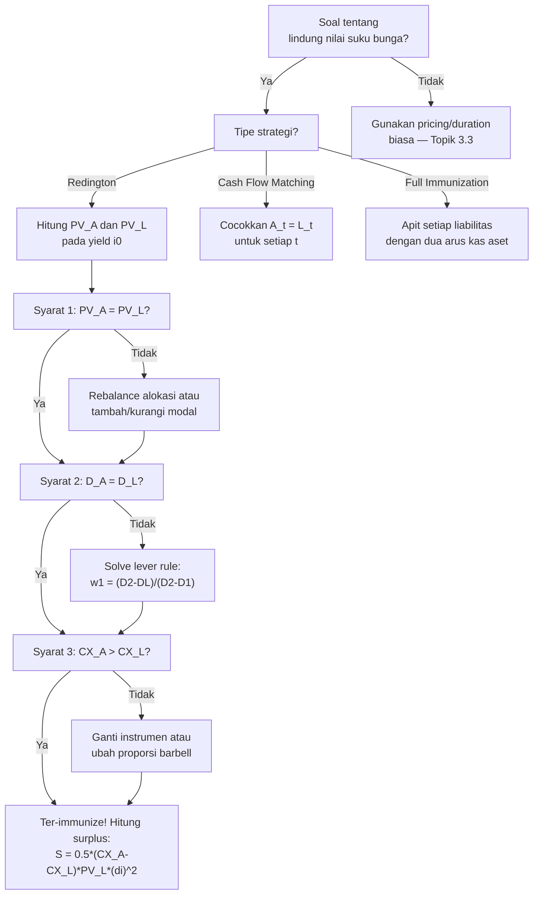

# 📘 3.5 — Immunization

> [!ABSTRACT] Ringkasan Cepat
> **Topik:** Immunization | **Bobot:** ~20–30% | **Difficulty:** Hard
> **Ref:** Vaaler Bab 9, Kellison Bab 11 | **Prereq:** [[1.4 Accumulation and Present Value]], [[2.1 Annuity-Immediate and Annuity-Due]], [[3.3 Duration (Macaulay and Modified)]], [[3.4 Convexity]], [[5.1 Bond Pricing]]

## Section 0 — Pemetaan Topik

| Topik CF1 | Sub-topik ID | Skill Diuji | Bobot | Difficulty | Prerequisite | Connected Topics | Referensi |
|-----------|--------------|-------------|-------|------------|--------------|------------------|-----------|
| Topik 3: Struktur Jangka Waktu Suku Bunga | 3.5 | Menerapkan tiga syarat Redington immunization; memverifikasi apakah suatu portofolio ter-immunize; membangun portofolio immunizing dari dua instrumen; menghitung surplus setelah pergeseran yield; membedakan Redington vs full immunization; memahami prinsip cash flow matching; menjelaskan keterbatasan immunization dalam praktik | 20–30% | Hard | [[1.4 Accumulation and Present Value]], [[2.1 Annuity-Immediate and Annuity-Due]], [[3.3 Duration (Macaulay and Modified)]], [[3.4 Convexity]], [[5.1 Bond Pricing]] | [[3.3 Duration (Macaulay and Modified)]], [[3.4 Convexity]], [[3.1 Spot Rates and Forward Rates]], [[5.1 Bond Pricing]] | Vaaler Bab 9, Kellison Bab 11 |

## Section 1 — Intuisi

Bayangkan sebuah perusahaan asuransi jiwa yang menjanjikan membayar Rp 10 miliar kepada nasabahnya 15 tahun dari sekarang. Perusahaan itu menginvestasikan premi yang diterima hari ini dalam obligasi. Masalahnya: jika suku bunga naik, nilai obligasi turun — dan uang yang terkumpul mungkin tidak cukup untuk membayar klaim. Sebaliknya, jika suku bunga turun, dana yang terkumpul dari reinvestasi coupon juga lebih kecil. Dalam kedua kasus, ada risiko bahwa **nilai aset tidak cukup menutup nilai liabilitas**. Immunization adalah strategi untuk menghilangkan risiko ini — atau setidaknya memastikan bahwa nilai aset *selalu* ≥ nilai liabilitas, tidak peduli ke mana suku bunga bergerak.

**Redington Immunization** (Frank Redington, 1952) adalah solusi elegan: jika kamu menyusun portofolio aset sedemikian rupa sehingga (1) nilai sekarang aset = nilai sekarang liabilitas, (2) durasi aset = durasi liabilitas, dan (3) konveksitas aset > konveksitas liabilitas — maka untuk pergeseran yield yang *kecil*, nilai surplus (aset minus liabilitas) akan *selalu naik* atau tetap nol. Kondisi (1) dan (2) memastikan bahwa titik awal surplus = 0 dan kemiringan awal kurva surplus = 0. Kondisi (3) memastikan kurva surplus melengkung ke *atas* — seperti mangkuk terbalik yang selalu positif di sekitar titik awal.

**Full Immunization** melangkah lebih jauh: dengan mengapit setiap liabilitas di antara dua arus kas aset (satu sebelum, satu sesudah), surplus dijamin non-negatif untuk *semua* pergeseran yield, bukan hanya yang kecil. Sedangkan **Cash Flow Matching** adalah pendekatan paling konservatif: cocokkan setiap arus kas aset dengan setiap arus kas liabilitas secara eksak, sehingga tidak ada risiko suku bunga sama sekali. Di CF1, ketiga pendekatan ini diuji — dengan penekanan terbesar pada Redington karena paling kaya secara matematis.

## Section 2 — Definisi Formal

> [!NOTE] Definisi Matematis
> **Surplus** portofolio pada yield $i$:
> $$
> S(i) = PV_A(i) - PV_L(i) = \sum_t A_t v^t - \sum_t L_t v^t
> $$
> di mana $A_t$ = arus kas aset pada waktu $t$, $L_t$ = arus kas liabilitas pada waktu $t$, $v = 1/(1+i)$.
>
> **Redington Immunization** terpenuhi jika dan hanya jika ketiga syarat berikut dipenuhi pada yield awal $i_0$:
>
> **Syarat 1 — PV Matching:**
> $$
> S(i_0) = 0 \quad \Longleftrightarrow \quad PV_A(i_0) = PV_L(i_0)
> $$
>
> **Syarat 2 — Duration Matching:**
> $$
> \frac{dS}{di}\bigg|_{i=i_0} = 0 \quad \Longleftrightarrow \quad D_{\text{Mac},A}(i_0) = D_{\text{Mac},L}(i_0)
> $$
>
> **Syarat 3 — Convexity Condition:**
> $$
> \frac{d^2S}{di^2}\bigg|_{i=i_0} > 0 \quad \Longleftrightarrow \quad CX_A(i_0) > CX_L(i_0)
> $$
>
> Jika ketiga syarat terpenuhi, maka untuk pergeseran yield kecil $|\Delta i|$:
> $$
> S(i_0 + \Delta i) \approx \frac{1}{2}(CX_A - CX_L) \cdot PV_L \cdot (\Delta i)^2 \geq 0
> $$

### Variabel & Parameter

| Simbol | Makna | Catatan |
|--------|-------|---------|
| $S(i)$ | Surplus = $PV_A(i) - PV_L(i)$ | Tujuan immunization: $S(i) \geq 0$ untuk semua $i$ |
| $PV_A(i)$ | Present value aset pada yield $i$ | Fungsi menurun terhadap $i$ |
| $PV_L(i)$ | Present value liabilitas pada yield $i$ | Fungsi menurun terhadap $i$ |
| $A_t$ | Arus kas aset pada waktu $t$ | $A_t \geq 0$ untuk long-only portfolio |
| $L_t$ | Arus kas liabilitas pada waktu $t$ | $L_t \geq 0$; pembayaran yang harus dipenuhi |
| $i_0$ | Yield awal (saat immunization dibangun) | Titik di mana tiga syarat dievaluasi |
| $\Delta i$ | Pergeseran yield $= i - i_0$ | Dianggap seragam (parallel shift) |
| $D_{\text{Mac},A}$ | Macaulay Duration aset | Dalam tahun |
| $D_{\text{Mac},L}$ | Macaulay Duration liabilitas | Dalam tahun |
| $CX_A$ | Convexity aset | Dalam tahun² |
| $CX_L$ | Convexity liabilitas | Dalam tahun² |
| $w_k$ | Bobot nilai pasar instrumen ke-$k$ | $w_k = PV_k / PV_A$; $\sum w_k = 1$ |

### Rumus Utama

**Surplus setelah pergeseran yield (aproksimasi Taylor orde-2):**
$$
S(i_0 + \Delta i) \approx S(i_0) + \frac{dS}{di}\Delta i + \frac{1}{2}\frac{d^2S}{di^2}(\Delta i)^2
$$
Jika syarat Redington terpenuhi: $S(i_0) = 0$, $dS/di = 0$, sehingga:
$$
S(i_0 + \Delta i) \approx \frac{1}{2} \cdot (CX_A - CX_L) \cdot PV_L \cdot (\Delta i)^2
$$
**Label:** Surplus bersifat kuadratik terhadap $\Delta i$ — selalu non-negatif selama $CX_A > CX_L$.

**Syarat duration matching — sistem dua instrumen:**

Jika portofolio terdiri dari dua instrumen dengan duration $D_1$ dan $D_2$ ($D_1 < D_L < D_2$):
$$
w_1 + w_2 = 1
$$
$$
w_1 D_1 + w_2 D_2 = D_L
$$
Solusi:
$$
w_1 = \frac{D_2 - D_L}{D_2 - D_1}, \qquad w_2 = \frac{D_L - D_1}{D_2 - D_1}
$$
**Label:** "Lever rule" — bobot berbanding terbalik dengan jarak dari target duration.

**Convexity surplus — formula cepat:**
$$
CX_A - CX_L = \sum_k w_k CX_k - CX_L
$$
Untuk dua ZCB dengan maturity $n_1$ dan $n_2$ vs liabilitas ZCB dengan maturity $n_L$:
$$
CX_A - CX_L = \frac{w_1 n_1(n_1+1) + w_2 n_2(n_2+1) - n_L(n_L+1)}{(1+i)^2}
$$
**Label:** Selalu positif untuk portofolio barbell ($n_1 < n_L < n_2$) karena $n(n+1)$ adalah fungsi konveks.

**Full Immunization — syarat per pasang liabilitas:**

Untuk setiap liabilitas $L_s$ pada waktu $s$, terdapat dua arus kas aset $A_{t_1}$ pada $t_1 < s$ dan $A_{t_2}$ pada $t_2 > s$ yang memenuhi:
$$
A_{t_1} v^{t_1} + A_{t_2} v^{t_2} = L_s v^s \qquad \text{(PV matching)}
$$
$$
t_1 \cdot A_{t_1} v^{t_1} + t_2 \cdot A_{t_2} v^{t_2} = s \cdot L_s v^s \qquad \text{(duration matching)}
$$
**Label:** Full immunization menjamin $S \geq 0$ untuk *semua* $\Delta i$, bukan hanya $\Delta i$ kecil.

**Cash Flow Matching:**
$$
A_t \geq L_t \quad \forall\, t, \qquad \text{atau lebih presisi:} \quad A_t = L_t \quad \forall\, t
$$
**Label:** Tidak ada risiko suku bunga sama sekali — aset dan liabilitas cocok persis di setiap periode.

### Asumsi Eksplisit

- **Flat Yield Curve:** Semua arus kas didiskonto pada yield tunggal $i$ yang bergerak secara seragam.
- **Parallel Yield Shift:** Pergeseran $\Delta i$ seragam untuk semua maturitas — tidak berlaku untuk perubahan bentuk kurva.
- **Sekali Rebalancing:** Immunization dibangun sekali dan diasumsikan bertahan. Dalam praktik, perlu rebalancing periodik karena duration berubah seiring waktu dan pergerakan yield.
- **Fixed Cash Flows:** Arus kas aset tidak berubah ketika $i$ berubah (tidak ada embedded options).
- **Small $\Delta i$ untuk Redington:** Aproksimasi orde-2 hanya akurat untuk $|\Delta i|$ kecil hingga sedang. Full immunization tidak memiliki batasan ini.
- **$PV_A = PV_L$ pada $i_0$:** Redington dimulai dari surplus nol. Jika $PV_A > PV_L$ awal, syarat menjadi lebih longgar.

## Section 3 — Jembatan Logika

> [!TIP] Dari Time Diagram ke Equation of Value
> Cara paling intuitif untuk memahami immunization adalah melalui fungsi surplus $S(i)$:
>
> Pada yield $i_0$ awal, dengan tiga syarat Redington terpenuhi, profil $S(i)$ terlihat seperti **parabola dengan minimum di $i_0$** dengan nilai minimum $S(i_0) = 0$. Karena parabola ini terbuka ke atas (syarat 3: $d^2S/di^2 > 0$), maka $S(i) \geq 0$ di sekitar $i_0$.
>
> Visualisasi ketiga syarat secara geometri:
> - **Syarat 1** ($S(i_0) = 0$): kurva surplus melewati titik nol di $i_0$.
> - **Syarat 2** ($dS/di = 0$): kurva surplus memiliki kemiringan nol di $i_0$ — titik stasioner.
> - **Syarat 3** ($d^2S/di^2 > 0$): titik stasioner ini adalah **minimum** — bukan maksimum.
>
> Kombinasi: minimum lokal dengan nilai tepat nol → seluruh kurva surplus berada di atas atau tepat pada nol di sekitar $i_0$.

> [!IMPORTANT] Focal Date — Pilihan Yield Awal $i_0$
> Tiga syarat Redington dievaluasi pada **yield awal $i_0$ yang spesifik**. Immunization yang dibangun pada $i_0 = 6\%$ tidak otomatis valid jika yield kemudian bergerak jauh ke 10% dan manajer tidak melakukan rebalancing. Inilah keterbatasan utama Redington — ia hanya menjamin surplus non-negatif untuk pergeseran *kecil* di sekitar $i_0$. Untuk pergeseran besar, diperlukan full immunization atau rebalancing periodik.

**Derivasi tiga syarat dari ekspansi Taylor:**

Ekspansi $S(i)$ di sekitar $i_0$:
$$
S(i_0 + \Delta i) = S(i_0) + S'(i_0)\Delta i + \frac{1}{2}S''(i_0)(\Delta i)^2 + O((\Delta i)^3)
$$

Untuk $S(i_0 + \Delta i) \geq 0$ di sekitar $i_0$:
- Jika $S(i_0) > 0$: sudah aman untuk $\Delta i$ kecil, tetapi buang modal yang tak perlu.
- Jika $S(i_0) = 0$ dan $S'(i_0) \neq 0$: surplus negatif untuk salah satu arah $\Delta i$ (linear term dominan). Buruk.
- Jika $S(i_0) = 0$ dan $S'(i_0) = 0$ dan $S''(i_0) > 0$: surplus $\approx \frac{1}{2}S''(i_0)(\Delta i)^2 \geq 0$. ✓

Tiga syarat Redington adalah kondisi **minimal** yang memastikan skenario ketiga.

**Menurunkan ekuivalensi Syarat 2 dengan duration matching:**

$$
S'(i) = \frac{d}{di}[PV_A - PV_L] = \frac{dPV_A}{di} - \frac{dPV_L}{di}
$$

Dari definisi Modified Duration:
$$
\frac{dPV_A}{di} = -D_{\text{Mod},A} \cdot PV_A, \qquad \frac{dPV_L}{di} = -D_{\text{Mod},L} \cdot PV_L
$$

Dengan $PV_A = PV_L$ (Syarat 1):
$$
S'(i_0) = -D_{\text{Mod},A} \cdot PV_A + D_{\text{Mod},L} \cdot PV_L = PV_L(D_{\text{Mod},L} - D_{\text{Mod},A})
$$

Agar $S'(i_0) = 0$: $D_{\text{Mod},A} = D_{\text{Mod},L}$, yang ekuivalen dengan $D_{\text{Mac},A} = D_{\text{Mac},L}$ (karena keduanya dibagi $(1+i)$ yang sama).

**Menurunkan ekuivalensi Syarat 3 dengan convexity:**

$$
S''(i) = \frac{d^2PV_A}{di^2} - \frac{d^2PV_L}{di^2} = CX_A \cdot PV_A - CX_L \cdot PV_L
$$

Dengan $PV_A = PV_L$:
$$
S''(i_0) = (CX_A - CX_L) \cdot PV_L
$$

Agar $S''(i_0) > 0$: $CX_A > CX_L$. Q.E.D.

**Mengapa barbell selalu punya $CX_A > CX_L$ vs bullet:**

Untuk portofolio barbell ZCB ($n_1 < n_L < n_2$) vs liabilitas ZCB ($n_L$), dengan duration matching $w_1 n_1 + w_2 n_2 = n_L$:

$$
CX_A - CX_L = \frac{w_1 n_1(n_1+1) + w_2 n_2(n_2+1) - n_L(n_L+1)}{(1+i)^2}
$$

Definisikan $f(n) = n(n+1)$. Karena $f$ adalah fungsi **konveks** terhadap $n$ (turunan kedua $f''(n) = 2 > 0$):
$$
w_1 f(n_1) + w_2 f(n_2) > f(w_1 n_1 + w_2 n_2) = f(n_L)
$$
(Jensen's inequality untuk fungsi konveks.) Sehingga $CX_A > CX_L$ selalu berlaku. Q.E.D.

> [!DANGER] Dilarang
> 1. **Dilarang menyimpulkan bahwa dua syarat (PV + duration) sudah cukup untuk immunization:** Tanpa syarat ketiga ($CX_A > CX_L$), surplus bisa bergerak ke arah mana saja — termasuk negatif — untuk $\Delta i$ kecil sekalipun. Syarat convexity adalah yang memastikan arah curvature.
> 2. **Dilarang mengasumsikan Redington immunization bertahan selamanya tanpa rebalancing:** Duration dan convexity berubah seiring waktu (time passage) dan seiring pergerakan yield. Immunization harus di-rebalance secara periodik agar tiga syarat terus terpenuhi.
> 3. **Dilarang menerapkan Redington untuk pergeseran yield sangat besar ($|\Delta i| > 200$ bps) tanpa konfirmasi:** Redington hanya akurat secara lokal (Taylor orde-2). Untuk pergeseran besar, hitung ulang $S(i_{\text{baru}})$ secara eksak atau gunakan full immunization.

## Section 4 — Contoh Soal

### Soal A — Fundamental

Sebuah perusahaan memiliki satu liabilitas: membayar Rp 500.000.000 tepat 5 tahun dari sekarang. Yield pasar saat ini $i_0 = 7\%$ per tahun efektif.

Perusahaan mempertimbangkan dua portofolio aset:

- **Portofolio I:** ZCB tunggal maturity 5 tahun, face value $F_I$ dipilih sehingga $PV_I = PV_L$.
- **Portofolio II:** 40% (nilai) pada ZCB maturity 2 tahun + 60% (nilai) pada ZCB maturity 9 tahun.

(a) Hitung $PV_L$ dan $D_{\text{Mac},L}$.
(b) Untuk masing-masing portofolio, verifikasi tiga syarat Redington immunization.
(c) Portofolio mana yang lebih baik untuk immunization, dan mengapa?

> [!SUCCESS] Solusi Soal A
>
> **1. Identifikasi Variabel**
> - Liabilitas: $L = 500{,}000{,}000$ di $t = 5$; $i_0 = 0.07$; $v = 1/1.07$
> - Portofolio I: ZCB tunggal $n_I = 5$; $w = 1$ (100%)
> - Portofolio II: $w_2 = 0.40$ (ZCB $n=2$) + $w_9 = 0.60$ (ZCB $n=9$)
> - Cari: $PV_L$, $D_{\text{Mac},L}$, verifikasi tiga syarat untuk keduanya
>
> **2. Time Diagram**
> ```
> Liabilitas:
> t=0                    t=5
>  |----------------------|
>                     −500.000.000
>
> Portofolio I:
> t=0             t=5
>  |---------------|
>  PV_I         +F_I
>
> Portofolio II:
> t=0    t=2              t=5    t=9
>  |------|---------------|------|
>  PV_II +40% nilai           +60% nilai
> ```
>
> **3. Equation of Value** *(Focal Date $t = 0$)*
>
> $$
> PV_L = 500{,}000{,}000 \times (1.07)^{-5}
> $$
> $$
> D_{\text{Mac},L} = 5 \text{ (liabilitas tunggal = efektif ZCB)}
> $$
>
> **4. Eksekusi Aljabar**
>
> **(a) PV dan duration liabilitas:**
> $$
> PV_L = 500{,}000{,}000 \times (1.07)^{-5} = 500{,}000{,}000 \times 0.712986 = \mathbf{356{,}493{,}000}
> $$
> $$
> D_{\text{Mac},L} = 5 \text{ tahun}, \quad CX_L = \frac{5 \times 6}{(1.07)^2} = \frac{30}{1.1449} = 26.20 \text{ tahun}^2
> $$
>
> **(b) Verifikasi Portofolio I:**
>
> **Syarat 1:** $PV_I = PV_L = 356{,}493{,}000$ ✓ (didesain demikian; face value $F_I = 356{,}493{,}000 \times (1.07)^5 = 500{,}000{,}000$)
>
> **Syarat 2:** $D_{\text{Mac},I} = 5$ (ZCB maturity 5 tahun) $= D_{\text{Mac},L} = 5$. ✓
>
> **Syarat 3:**
> $$
> CX_I = \frac{5 \times 6}{(1.07)^2} = 26.20 \text{ tahun}^2 = CX_L
> $$
> $$
> CX_I = CX_L \implies CX_I \not> CX_L \quad \text{✗ GAGAL}
> $$
>
> Portofolio I **tidak memenuhi** syarat ketiga Redington. Portofolio ini memiliki surplus nol untuk semua pergeseran yield (karena aset dan liabilitas adalah instrumen yang identik), tetapi secara teknis tidak ter-immunize karena tidak ada "bantalan" convexity.
>
> **(b) Verifikasi Portofolio II:**
>
> **Syarat 1:** $PV_{II} = PV_L$ ✓ (didesain demikian — bobot 40% + 60% merujuk ke proporsi dari $PV_L$)
>
> **Syarat 2 — Duration:**
> $$
> D_{\text{Mac},II} = w_2 \cdot D_2 + w_9 \cdot D_9 = 0.40 \times 2 + 0.60 \times 9 = 0.80 + 5.40 = 6.20 \neq 5
> $$
> $$
> D_{\text{Mac},II} = 6.20 \neq D_{\text{Mac},L} = 5 \quad \text{✗ GAGAL}
> $$
>
> Portofolio II dengan bobot 40/60 **tidak memenuhi** syarat duration matching.
>
> **Menentukan bobot yang benar untuk Portofolio II:**
>
> Sistem persamaan:
> $$
> w_2 + w_9 = 1
> $$
> $$
> 2w_2 + 9w_9 = 5
> $$
>
> Dari persamaan pertama: $w_2 = 1 - w_9$. Substitusi:
> $$
> 2(1 - w_9) + 9w_9 = 5 \implies 2 + 7w_9 = 5 \implies w_9 = \frac{3}{7} \approx 0.4286
> $$
> $$
> w_2 = 1 - \frac{3}{7} = \frac{4}{7} \approx 0.5714
> $$
>
> Cek: $\frac{4}{7} \times 2 + \frac{3}{7} \times 9 = \frac{8}{7} + \frac{27}{7} = \frac{35}{7} = 5$. ✓
>
> **Syarat 3 dengan bobot yang benar:**
> $$
> CX_2 = \frac{2 \times 3}{(1.07)^2} = \frac{6}{1.1449} = 5.24 \text{ tahun}^2
> $$
> $$
> CX_9 = \frac{9 \times 10}{(1.07)^2} = \frac{90}{1.1449} = 78.60 \text{ tahun}^2
> $$
> $$
> CX_{II} = \frac{4}{7} \times 5.24 + \frac{3}{7} \times 78.60 = 2.994 + 33.686 = 36.68 \text{ tahun}^2
> $$
> $$
> CX_{II} = 36.68 > CX_L = 26.20 \quad \checkmark
> $$
>
> Portofolio II dengan bobot $w_2 = 4/7$, $w_9 = 3/7$ **memenuhi ketiga syarat Redington**. ✓
>
> **(c) Perbandingan:**
>
> Portofolio I (ZCB maturity = maturity liabilitas): memenuhi dua syarat pertama tetapi **gagal syarat ketiga** karena $CX_I = CX_L$. Tidak ada "bantalan" convexity — surplus tetap nol untuk semua $\Delta i$ (bukan non-negatif).
>
> Portofolio II dengan bobot yang benar: memenuhi **ketiga syarat** — ter-immunize untuk pergeseran yield kecil.
>
> **5. Verification**
>
> Estimasi surplus untuk $\Delta i = +0.01$ menggunakan Portofolio II (bobot benar):
> $$
> S(\Delta i = 0.01) \approx \frac{1}{2}(CX_{II} - CX_L) \cdot PV_L \cdot (0.01)^2
> $$
> $$
> = \frac{1}{2} \times (36.68 - 26.20) \times 356{,}493{,}000 \times 0.0001
> $$
> $$
> = \frac{1}{2} \times 10.48 \times 35{,}649 = \mathbf{186{,}800}
> $$
>
> Surplus positif Rp 186.800 untuk pergeseran 100 bps — kecil tetapi positif. ✓ Immunization berhasil.

> [!WARNING] Exam Tips — Soal A
> - **Target waktu:** 8–10 menit.
> - **Common trap 1:** Langsung menerima bobot 40/60 yang diberikan soal tanpa memverifikasi duration matching. Selalu cek Syarat 2 secara eksplisit — soal CF1 sering memberikan bobot yang sengaja salah sebagai jebakan.
> - **Common trap 2:** Menyimpulkan Portofolio I (ZCB maturity cocok) adalah immunizing yang sempurna. Memang Syarat 1 dan 2 terpenuhi, tetapi $CX_I = CX_L$ berarti Syarat 3 **tidak** terpenuhi secara ketat. Surplus memang nol untuk semua $i$, tetapi ini bukan karena immunization — hanya karena instrumen identik.
> - **Shortcut lever rule:** $w_2 = (D_2 - D_L)/(D_2 - D_1)$? Tidak — lever rule adalah $w_1 = (D_2 - D_L)/(D_2 - D_1)$ dan $w_2 = (D_L - D_1)/(D_2 - D_1)$. Perhatikan indeks — instrumen "jauh" mendapat bobot lebih kecil.

---

### Soal B — Exam-Typical

Sebuah dana pensiun memiliki liabilitas berikut: Rp 200.000.000 pada $t = 3$ dan Rp 500.000.000 pada $t = 8$. Yield pasar saat ini $i_0 = 6\%$ per tahun efektif.

Dana tersebut akan di-immunize menggunakan dua ZCB:
- **ZCB Alpha:** maturity 1 tahun
- **ZCB Beta:** maturity 12 tahun

(a) Hitung $PV_L$ total dan $D_{\text{Mac},L}$ dari portofolio liabilitas.
(b) Tentukan bobot nilai pasar $w_\alpha$ dan $w_\beta$ sehingga memenuhi Syarat 1 dan 2.
(c) Hitung $CX_A$ dan verifikasi Syarat 3.
(d) Estimasi surplus jika yield turun ke $i = 4\%$ ($\Delta i = -0.02$).

> [!SUCCESS] Solusi Soal B
>
> **1. Identifikasi Variabel**
> - Liabilitas: $L_3 = 200{,}000{,}000$ di $t=3$; $L_8 = 500{,}000{,}000$ di $t=8$; $i_0 = 0.06$
> - ZCB Alpha: $n_\alpha = 1$; $D_{\text{Mac},\alpha} = 1$
> - ZCB Beta: $n_\beta = 12$; $D_{\text{Mac},\beta} = 12$
> - Cari: $PV_L$, $D_{\text{Mac},L}$, bobot, $CX_A$, dan estimasi surplus untuk $\Delta i = -0.02$
>
> **2. Time Diagram**
> ```
> t=0   t=1      t=3           t=8        t=12
>  |----|--------|-------------|----------|
>       +A_α   −200M         −500M      +A_β
>  PV_A                                        ← invest hari ini
> ```
>
> **3. Equation of Value**
>
> $$
> PV_L = L_3 \cdot v^3 + L_8 \cdot v^8 = 200{,}000{,}000 \times (1.06)^{-3} + 500{,}000{,}000 \times (1.06)^{-8}
> $$
>
> $$
> D_{\text{Mac},L} = \frac{3 \cdot L_3 v^3 + 8 \cdot L_8 v^8}{PV_L}
> $$
>
> **4. Eksekusi Aljabar**
>
> **(a) PV dan duration liabilitas:**
>
> $$
> L_3 v^3 = 200{,}000{,}000 \times (1.06)^{-3} = 200{,}000{,}000 \times 0.839619 = 167{,}923{,}800
> $$
> $$
> L_8 v^8 = 500{,}000{,}000 \times (1.06)^{-8} = 500{,}000{,}000 \times 0.627412 = 313{,}706{,}000
> $$
> $$
> PV_L = 167{,}923{,}800 + 313{,}706{,}000 = \mathbf{481{,}629{,}800}
> $$
>
> Bobot PV liabilitas:
> $$
> \tilde{w}_3 = \frac{167{,}923{,}800}{481{,}629{,}800} = 0.34867, \quad \tilde{w}_8 = \frac{313{,}706{,}000}{481{,}629{,}800} = 0.65133
> $$
>
> $$
> D_{\text{Mac},L} = 3 \times 0.34867 + 8 \times 0.65133 = 1.04601 + 5.21064 = \mathbf{6.2566 \text{ tahun}}
> $$
>
> Convexity liabilitas:
> $$
> CX_L = \frac{3(4) \cdot 167{,}923{,}800 + 8(9) \cdot 313{,}706{,}000}{(1.06)^2 \times 481{,}629{,}800}
> $$
> $$
> = \frac{12 \times 167{,}923{,}800 + 72 \times 313{,}706{,}000}{1.1236 \times 481{,}629{,}800}
> $$
> $$
> = \frac{2{,}015{,}085{,}600 + 22{,}586{,}832{,}000}{54{,}112{,}556{,}280}
> $$
> $$
> = \frac{24{,}601{,}917{,}600}{54{,}112{,}556{,}280} = \mathbf{45.46 \text{ tahun}^2}
> $$
>
> **(b) Bobot untuk immunization (Syarat 1 dan 2):**
>
> Sistem persamaan:
> $$
> w_\alpha + w_\beta = 1
> $$
> $$
> 1 \cdot w_\alpha + 12 \cdot w_\beta = 6.2566
> $$
>
> Dari persamaan pertama: $w_\alpha = 1 - w_\beta$. Substitusi:
> $$
> (1 - w_\beta) + 12w_\beta = 6.2566
> $$
> $$
> 1 + 11w_\beta = 6.2566
> $$
> $$
> w_\beta = \frac{5.2566}{11} = 0.47787
> $$
> $$
> w_\alpha = 1 - 0.47787 = 0.52213
> $$
>
> Cek duration: $1 \times 0.52213 + 12 \times 0.47787 = 0.52213 + 5.73444 = 6.25657 \approx 6.2566$. ✓
>
> Nilai investasi masing-masing ZCB:
> $$
> \text{Invest}_\alpha = 0.52213 \times 481{,}629{,}800 = \mathbf{251{,}521{,}000}
> $$
> $$
> \text{Invest}_\beta = 0.47787 \times 481{,}629{,}800 = \mathbf{230{,}108{,}800}
> $$
>
> **(c) Convexity aset (Syarat 3):**
>
> $$
> CX_\alpha = \frac{1 \times 2}{(1.06)^2} = \frac{2}{1.1236} = 1.780 \text{ tahun}^2
> $$
> $$
> CX_\beta = \frac{12 \times 13}{(1.06)^2} = \frac{156}{1.1236} = 138.84 \text{ tahun}^2
> $$
>
> $$
> CX_A = w_\alpha \cdot CX_\alpha + w_\beta \cdot CX_\beta
> $$
> $$
> = 0.52213 \times 1.780 + 0.47787 \times 138.84
> $$
> $$
> = 0.929 + 66.321 = \mathbf{67.25 \text{ tahun}^2}
> $$
>
> $$
> CX_A = 67.25 > CX_L = 45.46 \quad \checkmark
> $$
>
> Syarat 3 terpenuhi. Semua tiga syarat Redington terpenuhi. ✓
>
> **(d) Estimasi surplus untuk $\Delta i = -0.02$:**
>
> $$
> S(\Delta i = -0.02) \approx \frac{1}{2}(CX_A - CX_L) \cdot PV_L \cdot (\Delta i)^2
> $$
> $$
> = \frac{1}{2} \times (67.25 - 45.46) \times 481{,}629{,}800 \times (0.02)^2
> $$
> $$
> = \frac{1}{2} \times 21.79 \times 481{,}629{,}800 \times 0.0004
> $$
> $$
> = \frac{1}{2} \times 21.79 \times 192{,}651.92
> $$
> $$
> = \frac{1}{2} \times 4{,}198{,}863 = \mathbf{2{,}099{,}432} \approx \text{Rp } 2{,}099{,}000
> $$
>
> Surplus positif ≈ Rp 2.099.000 untuk penurunan yield 200 bps. Immunization berhasil. ✓
>
> **5. Verification**
>
> Cek eksistensi solusi: $n_\alpha = 1 < D_{\text{Mac},L} = 6.2566 < n_\beta = 12$. ✓ Solusi fisik ada.
>
> Cek bobot positif: $w_\alpha = 0.522 > 0$ dan $w_\beta = 0.478 > 0$. ✓
>
> Cek surplus positif: $\Delta i < 0$ → kedua aset dan liabilitas naik nilainya, tetapi aset naik lebih banyak karena $CX_A > CX_L$. Surplus positif. ✓
>
> Cek intuitif besaran surplus: Rp 2 juta dari portofolio Rp 481 juta dengan $\Delta i = 2\%$ adalah wajar (≈ 0.04% dari nilai portofolio — kecil tetapi positif, sesuai ekspektasi Redington untuk pergeseran moderat).

> [!WARNING] Exam Tips — Soal B
> - **Target waktu:** 12–15 menit.
> - **Common trap 1:** Menghitung $D_{\text{Mac},L}$ dengan rata-rata maturity liabilitas ($= (3+8)/2 = 5.5$) — salah. Harus rata-rata tertimbang **berdasarkan PV** masing-masing liabilitas.
> - **Common trap 2:** Menggunakan bobot nominal liabilitas ($L_3/(L_3+L_8) = 200/700 = 28.6\%$) sebagai bobot duration — juga salah. Bobot duration harus berbasis **PV pada yield $i_0$**.
> - **Common trap 3:** Menghitung $CX_L$ hanya dari salah satu liabilitas. Untuk portofolio liabilitas ganda, $CX_L$ juga harus rata-rata tertimbang PV.
> - **Shortcut surplus:** Untuk estimasi cepat, gunakan $S \approx \frac{1}{2}(CX_A - CX_L) \cdot PV_L \cdot (\Delta i)^2$. Tiga angka yang harus dihafal: perbedaan convexity, nilai PV liabilitas, dan kuadrat pergeseran yield.

---

### Soal C — Challenging

Seorang manajer ALM sedang mengevaluasi apakah portofolio berikut sudah ter-immunize terhadap liabilitas tunggal Rp 1.000.000.000 yang jatuh tempo 10 tahun dari sekarang. Yield pasar $i_0 = 5\%$.

**Portofolio aset yang dipegang:**
- **Aset 1:** Obligasi coupon, $F = C = \text{Rp } 400.000.000$, $r = 8\%$ (tahunan), maturity 7 tahun. $D_{\text{Mac},1} = 5.5348$ tahun, $P_1 = 479{,}025{,}600$ (sudah diberikan).
- **Aset 2:** ZCB, face value Rp 700.000.000, maturity 14 tahun. $P_2 = 700{,}000{,}000 \times (1.05)^{-14}$.

(a) Hitung $PV_L$ dan verifikasi apakah Syarat 1 terpenuhi.
(b) Hitung $D_{\text{Mac},A}$ portofolio dan verifikasi apakah Syarat 2 terpenuhi.
(c) Hitung $CX_A$ dan $CX_L$, lalu verifikasi Syarat 3.
(d) Jika salah satu syarat tidak terpenuhi, tentukan perubahan minimal pada alokasi aset untuk memperbaikinya — tanpa menambah modal baru (Syarat 1 harus tetap terpenuhi).

> [!SUCCESS] Solusi Soal C
>
> **1. Identifikasi Variabel**
> - Liabilitas: $L = 1{,}000{,}000{,}000$ di $t=10$; $i_0 = 0.05$; $v = 1/1.05$
> - Aset 1: Obligasi coupon 7 tahun; $P_1 = 479{,}025{,}600$; $D_{\text{Mac},1} = 5.5348$ (diberikan)
> - Aset 2: ZCB maturity 14; $D_{\text{Mac},2} = 14$
> - Cari: $PV_L$, cek tiga syarat, koreksi jika perlu
>
> **2. Time Diagram**
> ```
> t=0  t=1...t=7  t=10   t=14
>  |----|--------|--------|
>       Aset1    −Liab.   Aset2
>       coupon+C          ZCB
>  P_A = P_1+P_2
> ```
>
> **3. Equation of Value**
>
> $$
> PV_L = 1{,}000{,}000{,}000 \times (1.05)^{-10}
> $$
>
> $$
> P_2 = 700{,}000{,}000 \times (1.05)^{-14}
> $$
>
> **4. Eksekusi Aljabar**
>
> **(a) Syarat 1 — PV Matching:**
>
> $$
> PV_L = 1{,}000{,}000{,}000 \times (1.05)^{-10} = 1{,}000{,}000{,}000 \times 0.613913 = \mathbf{613{,}913{,}000}
> $$
>
> $$
> P_2 = 700{,}000{,}000 \times (1.05)^{-14} = 700{,}000{,}000 \times 0.505068 = \mathbf{353{,}547{,}600}
> $$
>
> $$
> PV_A = P_1 + P_2 = 479{,}025{,}600 + 353{,}547{,}600 = \mathbf{832{,}573{,}200}
> $$
>
> $$
> PV_A = 832{,}573{,}200 \neq PV_L = 613{,}913{,}000 \quad \text{✗ GAGAL — Syarat 1 tidak terpenuhi}
> $$
>
> Surplus awal: $S_0 = PV_A - PV_L = 832{,}573{,}200 - 613{,}913{,}000 = +218{,}660{,}200$ (surplus positif).
>
> **(b) Syarat 2 — Duration Matching:**
>
> Bobot berdasarkan nilai pasar:
> $$
> w_1 = \frac{479{,}025{,}600}{832{,}573{,}200} = 0.57540
> $$
> $$
> w_2 = \frac{353{,}547{,}600}{832{,}573{,}200} = 0.42460
> $$
>
> Duration portofolio aset:
> $$
> D_{\text{Mac},A} = w_1 \cdot D_{\text{Mac},1} + w_2 \cdot D_{\text{Mac},2}
> $$
> $$
> = 0.57540 \times 5.5348 + 0.42460 \times 14
> $$
> $$
> = 3.1853 + 5.9444 = \mathbf{9.1297 \text{ tahun}}
> $$
>
> $$
> D_{\text{Mac},A} = 9.1297 \neq D_{\text{Mac},L} = 10 \quad \text{✗ GAGAL — Syarat 2 tidak terpenuhi}
> $$
>
> **(c) Syarat 3 — Convexity:**
>
> $$
> CX_L = \frac{10 \times 11}{(1.05)^2} = \frac{110}{1.1025} = 99.77 \text{ tahun}^2
> $$
>
> Untuk Aset 1 (obligasi coupon), convexity dihitung via tabel. Namun soal hanya meminta cek — gunakan estimasi dengan formula pendekatan. Untuk obligasi par-ish (atau estimasi kasar), $CX \approx D_{\text{Mac}}(D_{\text{Mac}}+1)/(1+i)^2$:
>
> Estimasi $CX_1 \approx \frac{5.5348 \times 6.5348}{(1.05)^2} = \frac{36.162}{1.1025} = 32.80$ tahun² (estimasi)
>
> $$
> CX_2 = \frac{14 \times 15}{(1.05)^2} = \frac{210}{1.1025} = 190.48 \text{ tahun}^2
> $$
>
> $$
> CX_A = w_1 \cdot CX_1 + w_2 \cdot CX_2 \approx 0.57540 \times 32.80 + 0.42460 \times 190.48
> $$
> $$
> \approx 18.87 + 80.88 = \mathbf{99.75 \text{ tahun}^2}
> $$
>
> $$
> CX_A \approx 99.75 \approx CX_L = 99.77 \quad \text{⚠ Syarat 3 tidak terpenuhi secara ketat ($CX_A \not> CX_L$)}
> $$
>
> **Ringkasan evaluasi:**
>
> | Syarat | Kondisi | Status |
> |--------|---------|--------|
> | 1: $PV_A = PV_L$ | $832{,}573{,}200 \neq 613{,}913{,}000$ | ✗ GAGAL |
> | 2: $D_A = D_L$ | $9.1297 \neq 10$ | ✗ GAGAL |
> | 3: $CX_A > CX_L$ | $99.75 \approx 99.77$ | ⚠ Marginal |
>
> **(d) Koreksi alokasi aset:**
>
> Masalah utama: $PV_A > PV_L$ (kelebihan modal) dan $D_A < D_L$ (duration terlalu rendah). Solusi: **jual sebagian Aset 1 (duration rendah) dan gunakan hasilnya untuk membeli lebih banyak Aset 2 (duration tinggi)**, atau kembalikan kelebihan modal.
>
> **Pendekatan: kurangi Aset 1 hingga $PV_A = PV_L$ dan $D_A = D_L$.**
>
> Misalkan portofolio baru terdiri dari $x$ unit nilai Aset 1 dan $y$ unit nilai Aset 2, dengan:
> $$
> x + y = PV_L = 613{,}913{,}000
> $$
> $$
> 5.5348x + 14y = 10 \times 613{,}913{,}000 = 6{,}139{,}130{,}000
> $$
>
> Dari persamaan pertama: $x = 613{,}913{,}000 - y$. Substitusi:
> $$
> 5.5348(613{,}913{,}000 - y) + 14y = 6{,}139{,}130{,}000
> $$
> $$
> 3{,}399{,}157{,}000 - 5.5348y + 14y = 6{,}139{,}130{,}000
> $$
> $$
> 8.4652y = 2{,}739{,}973{,}000
> $$
> $$
> y = \frac{2{,}739{,}973{,}000}{8.4652} = 323{,}706{,}000
> $$
> $$
> x = 613{,}913{,}000 - 323{,}706{,}000 = 290{,}207{,}000
> $$
>
> Portofolio baru: Rp 290.207.000 di Aset 1, Rp 323.706.000 di Aset 2.
>
> Bobot baru: $w_1' = 290{,}207/613{,}913 = 0.4726$; $w_2' = 323{,}706/613{,}913 = 0.5274$.
>
> Cek duration: $0.4726 \times 5.5348 + 0.5274 \times 14 = 2.615 + 7.384 = 9.999 \approx 10$. ✓
>
> **5. Verification**
>
> Langkah rebalancing: jual $479{,}025{,}600 - 290{,}207{,}000 = 188{,}818{,}600$ dari Aset 1, dan jual $353{,}547{,}600 - 323{,}706{,}000 = 29{,}841{,}600$ dari Aset 2 (kelebihan ini dikembalikan sebagai dividen/modal karena $PV_A > PV_L$ sebelumnya).
>
> Total dana yang dikeluarkan dari portofolio: $188{,}818{,}600 + 29{,}841{,}600 = 218{,}660{,}200 = S_0$. ✓ Konsisten dengan surplus awal.

> [!WARNING] Exam Tips — Soal C
> - **Target waktu:** 15–18 menit.
> - **Common trap 1:** Menyimpulkan bahwa karena $PV_A > PV_L$ (surplus positif), portofolio "aman." Surplus positif tidak berarti ter-immunize — harus cek tiga syarat. Surplus bisa menjadi negatif jika yield bergerak dan duration tidak matched.
> - **Common trap 2:** Menggunakan estimasi $CX_1 \approx D_{\text{Mac}}(D_{\text{Mac}}+1)/(1+i)^2$ untuk obligasi coupon. Ini hanya valid untuk ZCB. Untuk obligasi coupon, perlu tabel lengkap atau rumus khusus. Dalam soal ini, gunakan estimasi ini hanya untuk cek kasar.
> - **Strategi koreksi:** Ketika $PV_A > PV_L$ dan $D_A < D_L$, solusinya selalu: kurangi aset dengan duration rendah, tambah aset dengan duration tinggi, kembalikan kelebihan. Sistem dua persamaan akan memberikan alokasi yang tepat.
> - **Pesan kunci:** Immunization bukan kondisi "sekali dan selesai" — harus dimonitor dan di-rebalance. Soal tipe ini sangat populer di CF1 untuk menguji pemahaman konseptual, bukan hanya kalkulasi.

## Section 5 — Verifikasi & Sanity Check

> [!CHECK] Tiga Syarat Redington — Checklist
> 1. **Syarat 1:** Hitung $PV_A$ dan $PV_L$ secara eksak pada $i_0$. Bandingkan — harus identik (bukan hanya "hampir sama"). Selisih menunjukkan surplus awal yang harus dijelaskan.
> 2. **Syarat 2:** Hitung $D_{\text{Mac},A}$ sebagai rata-rata tertimbang PV dari duration komponen. Bandingkan dengan $D_{\text{Mac},L}$. Toleransi sangat kecil di soal CF1.
> 3. **Syarat 3:** Hitung $CX_A$ dan $CX_L$. Harus $CX_A > CX_L$ (bukan $\geq$). Untuk barbell vs bullet, ini selalu terpenuhi secara otomatis — tetapi selalu konfirmasi numerik.

> [!CHECK] Eksistensi Solusi Immunization Dua Instrumen
> 1. **Syarat eksistensi:** $D_1 < D_L < D_2$ — liabilitas harus berada di *antara* duration dua instrumen. Jika tidak, tidak ada solusi dengan $w_1, w_2 > 0$.
> 2. **Bobot harus positif:** $w_1 = (D_2 - D_L)/(D_2 - D_1) > 0$ dan $w_2 = (D_L - D_1)/(D_2 - D_1) > 0$. Ini otomatis terpenuhi jika syarat eksistensi terpenuhi.
> 3. **Cek jumlah bobot:** $w_1 + w_2 = 1$ selalu. Jika tidak, ada error aritmetika.

> [!CHECK] Konsistensi Estimasi Surplus
> 1. **Tanda surplus selalu non-negatif** (untuk Redington): $S(\Delta i) \approx \frac{1}{2}(CX_A - CX_L) \cdot PV_L \cdot (\Delta i)^2 \geq 0$. Jika hitung surplus negatif, ada error.
> 2. **Surplus simetris terhadap $\Delta i$:** $S(+\Delta i) \approx S(-\Delta i)$ dalam aproksimasi orde-2 — karena hanya bergantung pada $(\Delta i)^2$.
> 3. **Surplus bertambah dengan $|\Delta i|$:** Semakin besar pergeseran yield, semakin besar surplus (convexity advantage bertambah). Bukan berkurang.

### Metode Alternatif

**Cash Flow Matching — Alternatif tanpa risiko suku bunga:**

Untuk setiap liabilitas $L_t$ pada waktu $t$, beli ZCB dengan face value $= L_t$ dan maturity $= t$. Tidak perlu menghitung duration atau convexity — arus kas cocok secara langsung. Kelebihan: nol risiko suku bunga. Kekurangan: memerlukan instrumen yang tersedia di setiap maturity yang dibutuhkan, dan biasanya lebih mahal (tidak bisa memanfaatkan yield curve).

**Redington dengan $PV_A > PV_L$ (Surplus Awal Positif):**

Jika $S_0 = PV_A - PV_L > 0$, Redington masih bisa diterapkan dengan syarat yang sedikit berbeda:
$$
\frac{dS}{di}\bigg|_{i_0} = 0 \quad \text{dan} \quad \frac{d^2S}{di^2}\bigg|_{i_0} \geq 0
$$
Syarat 1 tidak lagi $PV_A = PV_L$ tetapi cukup $PV_A \geq PV_L$. Dalam praktik, manajer sering mengizinkan sedikit surplus awal sebagai "bantal" keamanan.

**Full Immunization — Penjaminan untuk semua $\Delta i$:**

Untuk setiap liabilitas tunggal $L_s$ di $t = s$, pilih aset $A_{t_1}$ (di $t_1 < s$) dan $A_{t_2}$ (di $t_2 > s$) yang memenuhi:
$$
A_{t_1} v^{t_1} + A_{t_2} v^{t_2} = L_s v^s
$$
$$
t_1 A_{t_1} v^{t_1} + t_2 A_{t_2} v^{t_2} = s \cdot L_s v^s
$$
Surplus $S(i) \geq 0$ untuk **semua** $i > 0$, bukan hanya $i$ dekat $i_0$.

## Section 6 — Visualisasi Mental

**Kurva Surplus $S(i)$ — Profil Immunization:**

Bayangkan grafik dengan sumbu X = yield $i$ dan sumbu Y = surplus $S = PV_A - PV_L$.

Untuk portofolio yang memenuhi tiga syarat Redington:
- Kurva $S(i)$ melewati titik $(i_0, 0)$ — Syarat 1.
- Kurva $S(i)$ memiliki kemiringan nol di $i_0$ (tangent horizontal) — Syarat 2.
- Kurva $S(i)$ melengkung ke **atas** di $i_0$ (cekungan ke atas, seperti mangkuk) — Syarat 3.

Kombinasi tiga kondisi ini berarti $i_0$ adalah **minimum lokal** dari $S(i)$ dengan nilai minimum = 0. Karena kurva melengkung ke atas, $S(i) \geq 0$ untuk semua $i$ dekat $i_0$.

**Perbedaan profil tiga strategi:**

- **Redington:** $S(i)$ berbentuk parabola ke atas, menyentuh sumbu X hanya di $i_0$. Aman untuk $\Delta i$ kecil.
- **Full Immunization:** $S(i) \geq 0$ untuk **semua** $i > 0$ — kurva seluruhnya di atas sumbu X.
- **Cash Flow Matching:** $S(i) = 0$ untuk semua $i$ — garis horizontal tepat di sumbu X (nol risiko, nol surplus).
- **Tidak ter-immunize (duration mismatch):** $S(i)$ adalah garis miring yang bisa negatif di salah satu sisi — berbahaya.

**Diagram "Timbangan Duration":**

Garis waktu horizontal. Liabilitas sebagai beban di $t = s$. Portofolio barbell menempatkan dua beban aset di $t_1 < s$ dan $t_2 > s$. Syarat 2 (duration matching) adalah kondisi keseimbangan timbangan. Syarat 3 (convexity) adalah kondisi bahwa "jepit" dari kedua sisi lebih lebar dari lebar liabilitas.

**Mengapa $CX_A > CX_L$ untuk barbell:**

Grafik $f(n) = n(n+1)$ vs $n$ — parabola ke atas (konveks). Barbell mengambil dua titik di $n_1$ dan $n_2$ dan rata-rata weightednya. Karena parabola konveks, rata-rata dua titik selalu di **atas** nilai parabola di rata-rata argumen ($n_L$). Ini adalah Jensen's inequality secara visual.

### Hubungan Visual ↔ Rumus

**Parabola $S(i)$ minimum di $i_0$ = tiga kondisi Taylor:**
$$
S(i_0) = 0,\quad S'(i_0) = 0,\quad S''(i_0) > 0 \quad \longleftrightarrow \quad \text{Tiga Syarat Redington}
$$

**Ketinggian parabola surplus = perbedaan convexity:**
$$
S(i_0 + \Delta i) \approx \frac{1}{2}(CX_A - CX_L) \cdot PV_L \cdot (\Delta i)^2 \quad \longleftrightarrow \quad \text{"curvature advantage" barbell}
$$

**Jensen's inequality untuk $f(n) = n(n+1)$:**
$$
w_1 f(n_1) + w_2 f(n_2) \geq f(w_1 n_1 + w_2 n_2) \quad \longleftrightarrow \quad CX_A \geq CX_L \text{ untuk barbell}
$$

## Section 7 — Jebakan Umum

> [!BUG] Kesalahan Unit Waktu
> **Contoh Salah:** Soal memberikan liabilitas dalam bulan ($t = 36$ bulan, $t = 96$ bulan) dengan yield tahunan 6%. Menghitung $D_{\text{Mac},L}$ dalam bulan lalu langsung membandingkan dengan duration aset yang dihitung dalam tahun.
>
> **Benar:** Konversi semua ke satuan yang sama sebelum membandingkan duration. Jika $t$ dalam bulan dan $i$ tahunan, konversi $i$ ke bulanan: $i_{\text{bulan}} = (1.06)^{1/12} - 1$, **atau** konversi $t$ ke tahun ($t/12$). Pilih satu, konsisten.

> [!BUG] Kesalahan Konseptual
> 1. **Dua syarat dianggap cukup (PV + duration tanpa convexity):** Tanpa Syarat 3, surplus bisa negatif. Contoh: jika $CX_A = CX_L$, surplus ≈ 0 untuk semua $\Delta i$ kecil — terdengar aman, tetapi suku orde-3 bisa membuat surplus negatif untuk $\Delta i$ besar.
> 2. **Menggunakan bobot nominal (face value) bukan bobot nilai pasar:** Bobot untuk duration dan convexity portofolio selalu berdasarkan **present value** saat ini, bukan face value atau nominal.
> 3. **Mengira immunization tidak perlu rebalancing:** Duration berubah seiring waktu karena: (a) berlalunya waktu (maturity berkurang), (b) perubahan yield (mempengaruhi $D_{\text{Mac}}$ melalui bobot PV). Immunization hanya berlaku saat itu juga — perlu monitoring dan rebalancing.
> 4. **Tidak mengecek syarat eksistensi $D_1 < D_L < D_2$:** Jika liabilitas di luar rentang duration instrumen yang tersedia, tidak ada solusi valid. Jangan langsung solve sistem persamaan tanpa cek ini.

> [!BUG] Kesalahan Interpretasi Soal
> **Ambiguitas "immunized":** "Portofolio ini ter-immunize" berarti ketiga syarat Redington terpenuhi *pada yield saat ini*. Tidak berarti ter-immunize selamanya atau untuk semua pergeseran yield. Selalu tambahkan kualifikasi: "ter-immunize terhadap pergeseran yield kecil pada $i_0 = X\%$."
>
> **Ambiguitas "duration matching":** Beberapa soal menggunakan "duration matching" untuk merujuk hanya pada Syarat 2 (bukan seluruh Redington). Baca konteks — jika soal juga menyebut "immunization," tiga syarat diperlukan. Jika hanya minta "duration matching," mungkin hanya Syarat 1 dan 2.

> [!CAUTION] Red Flags
> - **Soal menyebut "immunize" + dua instrumen + satu atau lebih liabilitas:** Trigger tiga langkah: (1) hitung $PV_L$ dan $D_{\text{Mac},L}$, (2) solve sistem dua persamaan untuk bobot, (3) verifikasi $CX_A > CX_L$.
> - **Bobot diberikan langsung di soal:** Jangan langsung percaya — verifikasi bahwa bobot tersebut memenuhi duration matching. Soal CF1 sering memberikan bobot yang sengaja salah.
> - **"Apakah portofolio ini ter-immunize?":** Harus cek ketiga syarat secara eksplisit. Tidak cukup cek satu atau dua saja.
> - **$PV_A > PV_L$:** Surplus positif awal tidak otomatis berarti ter-immunize. Masih harus cek Syarat 2 dan 3.
> - **ZCB tunggal dengan maturity = maturity liabilitas:** Memenuhi Syarat 1 dan 2 otomatis, **tetapi gagal Syarat 3** karena $CX_A = CX_L$. Ini adalah jebakan klasik CF1.

## Section 8 — Ringkasan Eksekutif

> [!SUMMARY] Must-Remember
> 1. **Tiga syarat Redington (pada yield $i_0$):**
>    $$
>    PV_A = PV_L, \quad D_{\text{Mac},A} = D_{\text{Mac},L}, \quad CX_A > CX_L
>    $$
> 2. **Surplus setelah pergeseran yield (aproksimasi):**
>    $$
>    S(i_0 + \Delta i) \approx \frac{1}{2}(CX_A - CX_L) \cdot PV_L \cdot (\Delta i)^2 \geq 0
>    $$
> 3. **Bobot dua instrumen — lever rule:**
>    $$
>    w_1 = \frac{D_2 - D_L}{D_2 - D_1}, \quad w_2 = \frac{D_L - D_1}{D_2 - D_1}, \quad (D_1 < D_L < D_2)
>    $$
> 4. **Convexity ZCB shortcut (untuk verifikasi Syarat 3):**
>    $$
>    CX_{\text{ZCB},n} = \frac{n(n+1)}{(1+i)^2}; \quad CX_{\text{barbell}} > CX_{\text{bullet}} \text{ selalu}
>    $$
> 5. **Syarat eksistensi solusi immunization:**
>    $$
>    D_1 < D_{\text{Mac},L} < D_2 \quad \text{(liabilitas harus berada di antara duration dua instrumen)}
>    $$

### Kapan Digunakan

- **Trigger keywords:** "immunization," "immunize," "Redington," "duration matching," "asset-liability management," "ALM," "protect against interest rate risk," "surplus," "cash flow matching," "full immunization."
- **Tipe skenario soal:**
  - Verifikasi apakah suatu portofolio memenuhi tiga syarat Redington.
  - Menentukan alokasi dua instrumen untuk meng-immunize liabilitas.
  - Menghitung surplus setelah pergeseran yield.
  - Membandingkan Redington vs full immunization vs cash flow matching.
  - Menghitung berapa rebalancing diperlukan jika kondisi berubah.

### Kapan TIDAK Boleh Digunakan

- **Untuk obligasi dengan embedded options:** Durasi konvensional tidak tepat; perlu effective duration.
- **Untuk pergeseran yield non-paralel (perubahan bentuk kurva):** Redington standar tidak berlaku; perlu key rate duration analysis [BEYOND CF1].
- **Untuk jangka panjang tanpa rebalancing:** Immunization hanya instantaneous — berlaku saat dibangun. Untuk horizon panjang, asumsi "sekali-selamanya" tidak valid.
- **Jika $PV_A < PV_L$ sejak awal:** Tidak mungkin ter-immunize tanpa tambahan modal. Syarat 1 ($PV_A = PV_L$) adalah prasyarat.

### Quick Decision Tree



---

> [!QUOTE] Follow-up Options
> 1. *"Berikan contoh soal full immunization untuk liabilitas tunggal dengan dua aset yang mengapit waktu liabilitas"*
> 2. *"Jelaskan mengapa [[3.5 Immunization]] memerlukan rebalancing periodik — bagaimana duration berubah seiring waktu?"*
> 3. *"Buat flashcard 1-halaman untuk tiga syarat Redington, lever rule, dan formula surplus"*

*📖 Ref: Vaaler Bab 9, Kellison Bab 11 | 🗓️ 2026-02-21 | #CF1 #Immunization #Redington #FullImmunization #CashFlowMatching #Duration #Convexity #Surplus #ALM*
