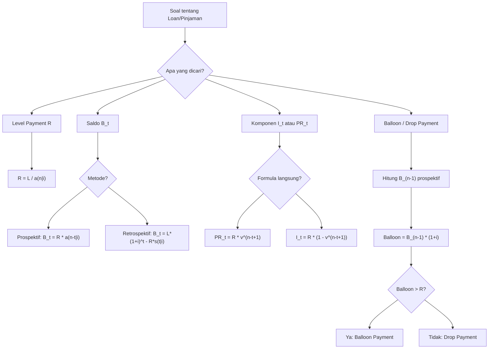

# 📘 4.1 — Loan Terminology

> [!ABSTRACT] Ringkasan Cepat
> **Topik:** Terminologi Dasar Pinjaman | **Bobot:** ~5–15% | **Difficulty:** Medium
> **Ref:** Vaaler & Daniel Bab 5 / Kellison Bab 5 | **Prereq:** [[Nilai Waktu dari Uang]] · [[Anuitas dan Nilai Arus Kas]]

---

## Section 0 — Pemetaan Topik

| Atribut | Detail |
|---------|--------|
| **Topik CF1** | Topik 4 — Pengembalian Pinjaman |
| **Sub-topik ID** | 4.1 |
| **Skill Diuji** | Mengidentifikasi komponen pembayaran (bunga vs pokok); menghitung saldo pinjaman prospektif & retrospektif; menentukan balloon/drop payment |
| **Bobot** | 5–15% |
| **Difficulty** | Medium |
| **Prerequisite** | [[Nilai Waktu dari Uang]] · [[Anuitas dan Nilai Arus Kas]] |
| **Connected Topics** | [[Amortization Method]] (4.2) · [[Sinking Fund Method]] (4.3) · [[Model Penentuan Harga Obligasi]] (5.1) |
| **Referensi** | Vaaler & Daniel (2009) Bab 5; Kellison (2006) Bab 5 |

---

## Section 1 — Intuisi

Bayangkan Anda mengambil KPR (Kredit Pemilikan Rumah) sebesar Rp 500 juta dari bank untuk membeli rumah. Bank tidak meminjamkan uang secara cuma-cuma — mereka membebankan bunga setiap bulan atas saldo yang masih terutang. Setiap kali Anda membayar cicilan bulanan, sebagian uang itu dipakai untuk "membayar jasa" bank (bunga), dan sisanya baru mengurangi utang pokok Anda. Inilah inti dari terminologi pinjaman: memahami persis berapa dari setiap pembayaran yang merupakan bunga, berapa yang merupakan pengurangan pokok, dan berapa saldo utang yang tersisa setelah setiap pembayaran.

Konsep ini terlihat sederhana, tetapi banyak nuansa yang membuat soal ujian menjadi tricky. Misalnya: apakah pembayaran pertama terjadi satu bulan setelah pinjaman diambil, atau langsung pada hari pinjaman diberikan? Berapa sisa utang jika Anda ingin melunasi lebih awal? Bagaimana jika cicilan terakhir tidak sama besar dengan cicilan-cicilan sebelumnya (disebut balloon atau drop payment)? Semua pertanyaan ini memerlukan pemahaman mendalam tentang terminology yang digunakan secara konsisten dalam dunia aktuaria.

Yang membuat topik ini sangat penting dalam exam CF1 adalah bahwa terminologi pinjaman menjadi fondasi untuk dua metode pelunasan utama — metode amortisasi dan metode sinking fund — yang akan dibahas di sub-topik 4.2 dan 4.3. Tanpa memahami apa itu saldo prospektif, saldo retrospektif, komponen bunga, dan komponen pokok, mustahil untuk mengerjakan jadwal amortisasi secara benar dan efisien.

---

## Section 2 — Definisi Formal

> [!NOTE] Definisi Matematis — Persamaan Dasar Pinjaman
>
> Jika pinjaman sebesar $L$ diambil pada waktu $t = 0$ dengan suku bunga efektif $i$ per periode, dan dibayar dengan $n$ pembayaran sebesar $R$ per periode (annuity-immediate), maka persamaan nilainya adalah:
>
> $$L = R \cdot a_{\overline{n}|i}$$
>
> di mana $a_{\overline{n}|i} = \dfrac{1 - v^n}{i}$ dan $v = \dfrac{1}{1+i}$.

### Variabel & Parameter

| Simbol | Makna |
|--------|-------|
| $L$ | Jumlah pinjaman awal (loan amount / principal) |
| $i$ | Suku bunga efektif per periode |
| $n$ | Jumlah total pembayaran |
| $R$ | Jumlah setiap pembayaran periodik (level payment) |
| $I_t$ | Komponen bunga pada pembayaran ke-$t$ |
| $PR_t$ | Komponen pokok (principal repaid) pada pembayaran ke-$t$ |
| $B_t$ | Saldo pinjaman (outstanding loan balance) setelah pembayaran ke-$t$ |
| $B_t^{(p)}$ | Saldo prospektif pada waktu $t$ |
| $B_t^{(r)}$ | Saldo retrospektif pada waktu $t$ |

### Rumus Utama

**Komponen Bunga pada Pembayaran ke-$t$:**
$$I_t = i \cdot B_{t-1}$$
Bunga pada periode $t$ adalah suku bunga dikali saldo yang masih terutang di awal periode tersebut.

**Komponen Pokok pada Pembayaran ke-$t$:**
$$PR_t = R - I_t = R - i \cdot B_{t-1}$$
Sisa dari pembayaran setelah dikurangi bunga adalah pengurangan pokok.

**Hubungan Rekursif Saldo:**
$$B_t = B_{t-1}(1+i) - R$$
Saldo baru = saldo lama yang diakumulasi bunga, dikurangi pembayaran.

**Saldo Prospektif (Prospective Method):**
$$B_t^{(p)} = R \cdot a_{\overline{n-t}|i}$$
Saldo pada waktu $t$ adalah nilai sekarang dari semua sisa pembayaran yang akan datang, dievaluasi pada waktu $t$.

**Saldo Retrospektif (Retrospective Method):**
$$B_t^{(r)} = L(1+i)^t - R \cdot s_{\overline{t}|i}$$
Saldo pada waktu $t$ adalah nilai yang terakumulasi dari pinjaman awal dikurangi nilai yang terakumulasi dari semua pembayaran yang sudah dilakukan.

**Komponen Pokok — Formula Langsung:**
$$PR_t = R \cdot v^{n-t+1}$$
Komponen pokok pada pembayaran ke-$t$ adalah nilai sekarang dari satu unit yang dibayar $n - t + 1$ periode ke depan.

**Komponen Bunga — Formula Langsung:**
$$I_t = R(1 - v^{n-t+1})$$
Komponen bunga adalah sisa dari $R$ setelah dikurangi komponen pokok.

**Balloon Payment** (pembayaran terakhir lebih besar dari level payment):
$$\text{Balloon} = B_{n-1}(1+i)$$
ketika tidak ada pembayaran $R$ pada periode terakhir, atau lebih umumnya:
$$\text{Balloon} = B_{n'-1}(1+i)$$
di mana $n'$ adalah periode pembayaran terakhir yang dimodifikasi.

**Drop Payment** (pembayaran terakhir lebih kecil dari level payment):
$$\text{Drop} = B_{n'-1}(1+i) \quad \text{jika } B_{n'-1}(1+i) < R$$

### Asumsi Eksplisit

- Pinjaman diberikan pada $t = 0$; pembayaran pertama pada $t = 1$ (annuity-immediate / end-of-period).
- Suku bunga $i$ adalah efektif per periode dan konstan sepanjang masa pinjaman.
- Semua pembayaran $R$ memiliki besaran yang sama (level payment), kecuali dinyatakan lain.
- Tidak ada biaya transaksi, denda keterlambatan, atau komponen non-bunga lain.
- Saldo pinjaman tidak pernah negatif (peminjam tidak "over-bayar" dalam pengertian negatif).

---

## Section 3 — Jembatan Logika

> [!TIP] Dari Time Diagram ke Equation of Value
>
> Bayangkan garis waktu dengan pinjaman $L$ mengalir ke peminjam pada $t=0$, dan pembayaran $R$ mengalir kembali ke pemberi pinjaman pada $t = 1, 2, \ldots, n$. Dari sudut pandang pemberi pinjaman, mereka "menginvestasikan" $L$ dan menerima kembali anuitas sebesar $R$ selama $n$ periode. Persamaan keseimbangan adalah:
>
> $$L = R \cdot a_{\overline{n}|i}$$
>
> Setiap faktor $v^t$ dalam $a_{\overline{n}|i}$ mendiskonto pembayaran $R$ di waktu $t$ kembali ke $t=0$. Penjumlahan dari seluruh nilai sekarang inilah yang harus sama dengan $L$ agar tidak ada arbitrase.

> [!IMPORTANT] Focal Date
>
> - Untuk **equation of value awal** (menentukan $R$ dari $L$): focal date di $t = 0$.
> - Untuk **saldo prospektif** $B_t^{(p)}$: focal date di $t$ (evaluasi nilai sekarang pembayaran yang tersisa).
> - Untuk **saldo retrospektif** $B_t^{(r)}$: focal date di $t$ (akumulasi nilai masa lalu).
>
> Kedua metode (prospektif dan retrospektif) **selalu menghasilkan nilai yang sama** karena keduanya merupakan transformasi dari persamaan awal yang sama.

**Derivasi Saldo Prospektif:**

Setelah pembayaran ke-$t$, masih ada $n - t$ pembayaran tersisa, masing-masing sebesar $R$, pada waktu $t+1, t+2, \ldots, n$. Nilai sekarang dari semua pembayaran ini, dievaluasi pada waktu $t$, adalah:

$$B_t^{(p)} = R \cdot v + R \cdot v^2 + \cdots + R \cdot v^{n-t} = R \cdot a_{\overline{n-t}|i}$$

**Derivasi Saldo Retrospektif:**

Mulai dari $L$ pada $t=0$. Setelah $t$ periode tanpa pembayaran, saldo menjadi $L(1+i)^t$. Tetapi ada $t$ pembayaran masing-masing $R$ yang sudah dilakukan, dengan nilai akumulasinya pada waktu $t$ adalah $R \cdot s_{\overline{t}|i}$. Maka:

$$B_t^{(r)} = L(1+i)^t - R \cdot s_{\overline{t}|i}$$

**Ekuivalensi kedua metode** (verifikasi):

Substitusi $L = R \cdot a_{\overline{n}|i}$ ke dalam $B_t^{(r)}$:

$$B_t^{(r)} = R \cdot a_{\overline{n}|i} \cdot (1+i)^t - R \cdot s_{\overline{t}|i}$$

$$= R \left[ a_{\overline{n}|i} \cdot (1+i)^t - s_{\overline{t}|i} \right]$$

Gunakan identitas $a_{\overline{n}|i} \cdot (1+i)^t = s_{\overline{t}|i} + a_{\overline{n-t}|i} \cdot \dfrac{(1+i)^t}{(1+i)^t}$... lebih simpel: gunakan $a_{\overline{n}|} \cdot (1+i)^t = s_{\overline{t}|} + (1+i)^t a_{\overline{n}|}$, atau langsung:

$$a_{\overline{n}|}(1+i)^t - s_{\overline{t}|} = \frac{1-v^n}{i}(1+i)^t - \frac{(1+i)^t - 1}{i} = \frac{(1+i)^t - v^{n-t} \cdot (1+i)^t - (1+i)^t + 1}{i} = \frac{1 - v^{n-t}}{i} = a_{\overline{n-t}|}$$

Jadi terbukti $B_t^{(r)} = R \cdot a_{\overline{n-t}|} = B_t^{(p)}$. ✓

> [!DANGER] Dilarang
>
> 1. **Dilarang** menggunakan formula $B_t = R \cdot a_{\overline{n-t}|}$ tanpa memastikan bahwa pembayaran $R$ adalah **level payment** dan $t$ pembayaran pertama sudah dilakukan penuh. Jika ada balloon/drop, formula prospektif berbeda.
> 2. **Dilarang** mencampur periode waktu berbeda tanpa konversi rate yang tepat — misalnya menggunakan rate tahunan langsung pada pinjaman dengan siklus pembayaran bulanan tanpa konversi $i_{monthly} = (1+i_{annual})^{1/12} - 1$.
> 3. **Dilarang** mengasumsikan bahwa komponen pokok selalu sama di setiap periode — dalam metode amortisasi standar, $PR_t$ bertumbuh secara geometris seiring waktu karena saldo berkurang dan bunga berkurang pula.

---

## Section 4 — Contoh Soal

### Soal A — Fundamental

Seseorang meminjam **Rp 10.000.000** dari bank dengan suku bunga efektif **6% per tahun**. Pinjaman akan dilunasi dengan **5 pembayaran tahunan yang sama besar**, dengan pembayaran pertama terjadi **1 tahun** setelah pinjaman diterima. Tentukan: (a) besarnya setiap pembayaran $R$, (b) komponen bunga dan komponen pokok dari pembayaran **ke-3**, dan (c) saldo pinjaman setelah pembayaran **ke-3**.

> [!SUCCESS] Solusi Soal A
>
> **1. Identifikasi Variabel**
> - $L = 10{.}000{.}000$
> - $i = 6\% = 0{,}06$ per tahun (efektif)
> - $n = 5$ pembayaran tahunan
> - Tipe: annuity-immediate (pembayaran di akhir periode)
> - Cari: $R$, $I_3$, $PR_3$, $B_3$
>
> **2. Time Diagram**
>
> ```
> t=0         t=1    t=2    t=3    t=4    t=5
>  |           |      |      |      |      |
> L=10jt      R      R      R      R      R
> ```
> Pinjaman masuk di $t=0$; lima pembayaran $R$ keluar di $t = 1, 2, 3, 4, 5$.
>
> **3. Equation of Value** *(Focal Date $t = 0$)*
>
> $$L = R \cdot a_{\overline{5}|6\%}$$
>
> **4. Eksekusi Aljabar**
>
> $$a_{\overline{5}|6\%} = \frac{1 - (1{,}06)^{-5}}{0{,}06} = \frac{1 - 0{,}74726}{0{,}06} = \frac{0{,}25274}{0{,}06} = 4{,}21236$$
>
> $$R = \frac{10{.}000{.}000}{4{,}21236} = 2{.}373.964 \approx 2{.}373{.}964$$
>
> Saldo setelah pembayaran ke-2 (diperlukan untuk $I_3$):
> $$B_2^{(p)} = R \cdot a_{\overline{3}|6\%} = 2{.}373{.}964 \times \frac{1-(1{,}06)^{-3}}{0{,}06}$$
> $$= 2{.}373{.}964 \times 2{,}67301 = 6{.}345{.}388$$
>
> Komponen bunga pembayaran ke-3:
> $$I_3 = i \cdot B_2 = 0{,}06 \times 6{.}345{.}388 = 380{.}723$$
>
> Komponen pokok pembayaran ke-3:
> $$PR_3 = R - I_3 = 2{.}373{.}964 - 380{.}723 = 1{.}993{.}241$$
>
> Saldo setelah pembayaran ke-3 (metode prospektif):
> $$B_3^{(p)} = R \cdot a_{\overline{2}|6\%} = 2{.}373{.}964 \times \frac{1-(1{,}06)^{-2}}{0{,}06}$$
> $$= 2{.}373{.}964 \times 1{,}83339 = 4{.}352{.}147$$
>
> **Verifikasi:** $B_3 = B_2(1+i) - R = 6{.}345{.}388 \times 1{,}06 - 2{.}373{.}964 = 6{.}726{.}111 - 2{.}373{.}964 = 4{.}352{.}147$ ✓
>
> **5. Verification**
>
> - $B_3 = 4{.}352{.}147 < B_2 = 6{.}345{.}388$: saldo menurun setiap periode ✓
> - $PR_3 > PR_1$ (komponen pokok bertambah seiring waktu dalam amortisasi standar): wajar karena bunga berkurang ✓
> - $I_3 + PR_3 = 380{.}723 + 1{.}993{.}241 = 2{.}373{.}964 = R$ ✓

> [!WARNING] Exam Tips — Soal A
>
> **Target waktu:** 4–5 menit
>
> **Common trap:** Salah menghitung $a_{\overline{3}|}$ vs $a_{\overline{2}|}$ saat mencari $B_2$. Ingat: setelah pembayaran ke-$t$, **sisa pembayaran adalah $n - t$**, jadi $B_t^{(p)} = R \cdot a_{\overline{n-t}|}$.
>
> **Shortcut:** Untuk verifikasi cepat, gunakan $B_t^{(r)} = L(1+i)^t - R \cdot s_{\overline{t}|}$ dan bandingkan dengan $B_t^{(p)}$. Jika sama, perhitungan benar.

---

### Soal B — Exam-Typical

Seorang debitur meminjam **Rp 50.000.000** dengan suku bunga nominal **8% per tahun convertible quarterly** (compounding per kuartal). Pinjaman akan dilunasi dengan pembayaran **bulanan** selama **3 tahun** (36 pembayaran), dengan pembayaran pertama **1 bulan** setelah pinjaman diterima. Tentukan: (a) suku bunga efektif per bulan, (b) besarnya level payment $R$, dan (c) saldo pinjaman setelah pembayaran ke-**18** menggunakan metode **prospektif**.

> [!SUCCESS] Solusi Soal B
>
> **1. Identifikasi Variabel**
> - $L = 50{.}000{.}000$
> - Nominal rate: $i^{(4)} = 8\%$ per tahun → rate per kuartal $= 8\%/4 = 2\%$ per kuartal
> - Pembayaran: bulanan selama 36 bulan
> - Frequency mismatch: rate dinyatakan kuartalan, pembayaran bulanan
>
> **2. Time Diagram**
>
> ```
> t=0(bulan)   t=1   t=2   ...   t=18  ...   t=36
>     |          |     |           |            |
> L=50jt        R     R            R            R
> ```
>
> **3. Equation of Value** *(Focal Date $t = 0$ bulan)*
>
> $$L = R \cdot a_{\overline{36}|i_{monthly}}$$
>
> **4. Eksekusi Aljabar**
>
> Konversi rate ke bulanan menggunakan ekuivalensi efektif:
>
> $$i_{quarterly} = 2\% = 0{,}02 \text{ per kuartal}$$
>
> 1 kuartal = 3 bulan, sehingga:
> $$1 + i_{monthly} = (1 + i_{quarterly})^{1/3} = (1{,}02)^{1/3}$$
> $$i_{monthly} = (1{,}02)^{1/3} - 1 = 1{,}006623 - 1 = 0{,}6623\% \text{ per bulan}$$
>
> Hitung $a_{\overline{36}|0{,}6623\%}$:
> $$a_{\overline{36}|0{,}6623\%} = \frac{1 - (1{,}006623)^{-36}}{0{,}006623} = \frac{1 - (1{,}006623)^{-36}}{0{,}006623}$$
>
> $$(1{,}006623)^{36} = (1{,}02)^{12} = 1{,}26824$$
>
> $$a_{\overline{36}|} = \frac{1 - 1/1{,}26824}{0{,}006623} = \frac{1 - 0{,}78853}{0{,}006623} = \frac{0{,}21147}{0{,}006623} = 31{,}933$$
>
> $$R = \frac{50{.}000{.}000}{31{,}933} = 1{.}565{.}681$$
>
> Saldo setelah pembayaran ke-18 (prospektif, sisa 18 pembayaran):
> $$B_{18}^{(p)} = R \cdot a_{\overline{18}|0{,}6623\%}$$
> $$(1{,}006623)^{18} = (1{,}02)^6 = 1{,}12616$$
> $$a_{\overline{18}|} = \frac{1 - 1/1{,}12616}{0{,}006623} = \frac{0{,}11205}{0{,}006623} = 16{,}921$$
> $$B_{18}^{(p)} = 1{.}565{.}681 \times 16{,}921 = 26{.}492{.}000 \approx 26{.}492{.}000$$
>
> **5. Verification**
>
> - Setelah 18 bulan (tepat setengah masa pinjaman), saldo adalah $\approx 26{,}5$ juta dari pinjaman awal $50$ juta. Saldo ini **lebih dari** setengah pinjaman awal ($25$ juta) — ini wajar karena pada awal pinjaman, sebagian besar pembayaran adalah bunga, sehingga pokok berkurang lebih lambat dari garis lurus. ✓
> - $B_{18} < L = 50{.}000{.}000$ ✓

> [!WARNING] Exam Tips — Soal B
>
> **Target waktu:** 6–8 menit
>
> **Common trap #1 — Frequency Mismatch:** Soal memberikan rate nominal per tahun convertible quarterly, tetapi pembayaran bulanan. Jangan langsung bagi $8\%$ dengan 12 untuk mendapat rate bulanan! Rate nominal $i^{(m)}$ hanya bisa dibagi $m$ untuk mendapat rate per periode-nya (bukan per periode lain). Harus konversi melalui ekuivalensi efektif: $(1+i_{monthly})^3 = 1{,}02$.
>
> **Common trap #2:** $(1{,}02)^{12}$ bukan sama dengan $1 + 12 \times 0{,}02 = 1{,}24$. Selalu hitung secara eksponensial.
>
> **Shortcut:** Manfaatkan $(1{,}02)^{12} = (1{,}02)^{12}$ yang bisa dihitung bertahap: $(1{,}02)^2 = 1{,}0404$; $(1{,}04)^2 \approx 1{,}0816$... atau lebih efisien: $(1{,}02)^{12} \approx 1{,}2682$ (hafalkan untuk ujian).

---

### Soal C — Challenging

Seorang peminjam mengambil pinjaman sebesar **Rp 30.000.000** pada $t = 0$ dengan suku bunga efektif **5% per tahun**. Disepakati bahwa peminjam akan membayar **8 pembayaran tahunan sebesar Rp 4.000.000** (dengan pembayaran pertama 1 tahun kemudian), kemudian melunasi **sisa saldo** dengan satu pembayaran penuh pada akhir tahun ke-**9**. Tentukan: (a) apakah saldo setelah 8 pembayaran masih ada, (b) besarnya pembayaran pelunasan pada $t = 9$ (ini adalah **balloon payment**), dan (c) verifikasi dengan metode retrospektif.

> [!SUCCESS] Solusi Soal C
>
> **1. Identifikasi Variabel**
> - $L = 30{.}000{.}000$
> - $i = 5\% = 0{,}05$
> - 8 pembayaran sebesar $R = 4{.}000{.}000$ pada $t = 1, 2, \ldots, 8$
> - Satu pembayaran **balloon** $X$ pada $t = 9$
> - Perlu cek apakah level payment $R$ cukup untuk menutup bunga (jika tidak, saldo bisa naik!)
>
> **2. Time Diagram**
>
> ```
> t=0      t=1   t=2  ... t=8      t=9
>  |         |     |        |        |
> 30jt     4jt   4jt      4jt       X
> ```
>
> **3. Equation of Value** *(Focal Date $t = 0$)*
>
> $$30{.}000{.}000 = 4{.}000{.}000 \cdot a_{\overline{8}|5\%} + X \cdot v^9$$
>
> **4. Eksekusi Aljabar**
>
> Pertama, cek apakah $R = 4{.}000{.}000$ setidaknya menutup bunga tahun pertama:
> $$I_1 = 0{,}05 \times 30{.}000{.}000 = 1{.}500{.}000 < 4{.}000{.}000 = R \checkmark$$
>
> Saldo berkurang (bukan bertambah), jadi balloon payment akan ada dan positif.
>
> Hitung $a_{\overline{8}|5\%}$:
> $$a_{\overline{8}|5\%} = \frac{1 - (1{,}05)^{-8}}{0{,}05}$$
> $$(1{,}05)^8 = 1{,}47746 \implies (1{,}05)^{-8} = 0{,}67684$$
> $$a_{\overline{8}|} = \frac{1 - 0{,}67684}{0{,}05} = \frac{0{,}32316}{0{,}05} = 6{,}46321$$
>
> Substitusi ke equation of value:
> $$30{.}000{.}000 = 4{.}000{.}000 \times 6{,}46321 + X \cdot v^9$$
> $$30{.}000{.}000 = 25{.}852{.}840 + X \cdot v^9$$
> $$X \cdot v^9 = 4{.}147{.}160$$
>
> $$(1{,}05)^9 = 1{,}47746 \times 1{,}05 = 1{,}55133$$
>
> $$X = 4{.}147{.}160 \times 1{,}55133 = 6{.}434{.}374$$
>
> **Verifikasi dengan Metode Prospektif / Retrospektif:**
>
> Saldo setelah 8 pembayaran (prospektif: sisa 0 pembayaran reguler, balloon di $t=9$):
> $$B_8^{(p)} = X \cdot v^1 = \frac{6{.}434{.}374}{1{,}05} = 6{.}128{.}928$$
>
> Saldo retrospektif setelah 8 pembayaran:
> $$B_8^{(r)} = 30{.}000{.}000 \times (1{,}05)^8 - 4{.}000{.}000 \times s_{\overline{8}|5\%}$$
> $$s_{\overline{8}|} = a_{\overline{8}|} \times (1{,}05)^8 = 6{,}46321 \times 1{,}47746 = 9{,}54911$$
> $$B_8^{(r)} = 30{.}000{.}000 \times 1{,}47746 - 4{.}000{.}000 \times 9{,}54911$$
> $$= 44{.}323{.}800 - 38{.}196{.}440 = 6{.}127{.}360 \approx 6{.}128{.}928$$
>
> (Selisih kecil akibat pembulatan; hasil konsisten) ✓
>
> Balloon payment: $X = B_8 \times (1{,}05) = 6{.}128{.}928 \times 1{,}05 = 6{.}435{.}374 \approx 6{.}434{.}374$ ✓
>
> **5. Verification**
>
> - Balloon payment $X = 6{.}434{.}374 > R = 4{.}000{.}000$: ini memang balloon (lebih besar dari level payment). ✓
> - Jika dijumlah: nilai sekarang 8 pembayaran reguler + balloon = $25{.}852{.}840 + 4{.}147{.}160 = 30{.}000{.}000$ ✓
> - $B_8 > 0$: masuk akal karena $R = 4{.}000{.}000$ lebih kecil dari level payment yang diperlukan untuk melunasi dalam 8 tahun ($R_{full} = 30{.}000{.}000 / a_{\overline{8}|} = 4{.}641{.}298$). ✓

> [!WARNING] Exam Tips — Soal C
>
> **Target waktu:** 8–10 menit
>
> **Common trap #1 — Arah Pembayaran vs Pelunasan:** Jika soal menyatakan "pembayaran $R$ lebih kecil dari yang diperlukan untuk melunasi dalam $n$ tahun", maka **saldo pada akhir periode normal masih positif** → ada balloon. Jika $R$ lebih besar, maka akan ada **drop payment** (lebih kecil dari $R$).
>
> **Common trap #2 — Focal Date Balloon:** Balloon $X$ harus dikalikan $v^9$ (bukan $v^8$) dalam equation of value di $t=0$, karena balloon terjadi di $t = 9$.
>
> **Shortcut:** Temukan $B_8$ terlebih dahulu menggunakan metode prospektif atau retrospektif, lalu hitung $X = B_8 \times (1+i)$. Ini lebih cepat dan menghindari kesalahan aljabar langsung dari persamaan panjang.

---

## Section 5 — Verifikasi & Sanity Check

> [!CHECK] Cek Saldo Monoton Menurun
>
> Dalam amortisasi dengan level payment di mana $R > I_1$ (pembayaran lebih besar dari bunga awal):
> - $B_0 = L > B_1 > B_2 > \cdots > B_n = 0$
> - Jika saldo pada suatu periode lebih besar dari periode sebelumnya, ada kesalahan hitung atau $R < i \cdot B_{t-1}$ (underpayment).

> [!CHECK] Cek Penjumlahan Komponen
>
> Untuk setiap periode $t$:
> $$I_t + PR_t = R \quad \text{(selalu tepat, tanpa pembulatan)}$$
> Jika $I_t + PR_t \neq R$, ada kesalahan dalam perhitungan salah satu komponen.

> [!CHECK] Cek Prospektif = Retrospektif
>
> Selalu berlaku: $B_t^{(p)} = B_t^{(r)}$
>
> Verifikasi cepat: hitung dengan kedua metode dan bandingkan. Jika berbeda (lebih dari selisih pembulatan), periksa:
> - Apakah $i$ yang sama digunakan di kedua metode?
> - Apakah $s_{\overline{t}|}$ dihitung dengan benar ($s_{\overline{t}|} = a_{\overline{t}|} \times (1+i)^t$)?

> [!CHECK] Cek Total Pembayaran vs Total Pokok + Bunga
>
> Total seluruh pembayaran = $n \times R$
>
> Total bunga yang dibayar = $n \times R - L$
>
> Nilai ini harus positif dan masuk akal (semakin panjang tenor, semakin besar total bunga). Sebagai cross-check kasar: total bunga $\approx L \times i \times (n/2)$ untuk pinjaman sederhana.

### Metode Alternatif

**Metode Tabel Amortisasi:** Bangun tabel dengan kolom $(t, B_{t-1}, I_t, PR_t, B_t)$ untuk setiap periode. Berguna untuk menemukan nilai di periode tertentu tanpa formula langsung, tetapi memakan waktu untuk $n$ besar.

**Formula Komponen Langsung:** Untuk soal yang hanya menanyakan $I_t$ atau $PR_t$ tanpa membangun seluruh tabel, gunakan:
$$PR_t = R \cdot v^{n-t+1} \qquad I_t = R(1 - v^{n-t+1})$$
Ini jauh lebih cepat daripada rekursi, terutama untuk $t$ besar.

---

## Section 6 — Visualisasi Mental

**Grafik 1 — Dekomposisi Pembayaran Sepanjang Waktu**

Bayangkan sebuah diagram batang horizontal untuk setiap periode $t = 1$ sampai $n$. Setiap batang memiliki tinggi total $R$ (konstan). Batang ini terbagi menjadi dua bagian:
- Bagian bawah (biru): komponen bunga $I_t$ — *menurun* dari kiri ke kanan
- Bagian atas (oranye): komponen pokok $PR_t$ — *meningkat* dari kiri ke kanan

Pada $t = 1$: bagian biru sangat besar (bunga banyak karena saldo masih penuh), bagian oranye kecil.
Pada $t = n$: bagian oranye hampir memenuhi seluruh batang (hampir semua pembayaran adalah pokok).

Titik kritis: titik di mana $I_t = PR_t$, yaitu ketika $R \cdot v^{n-t+1} = R/2$, atau $v^{n-t+1} = 1/2$, sehingga $t^* = n - \frac{\ln 2}{\ln(1+i)} + 1$.

**Grafik 2 — Kurva Saldo Pinjaman**

Sumbu X: waktu $t$ dari 0 hingga $n$. Sumbu Y: saldo pinjaman $B_t$.

Kurva dimulai dari $B_0 = L$ di sudut kiri atas dan menurun secara **cembung ke bawah** (convex) hingga mencapai $B_n = 0$ di sudut kanan bawah. Kurva ini bukan garis lurus — penurunannya lambat di awal (karena sebagian besar pembayaran adalah bunga) dan semakin cepat di akhir (karena saldo kecil → bunga kecil → pokok besar).

### Hubungan Visual ↔ Rumus

| Elemen Visual                   | Komponen Rumus                                   |
| ------------------------------- | ------------------------------------------------ |
| Tinggi total batang (konstan)   | $R$ — level payment                              |
| Bagian biru periode $t$         | $I_t = R(1 - v^{n-t+1})$                         |
| Bagian oranye periode $t$       | $PR_t = R \cdot v^{n-t+1}$                       |
| Tinggi kurva saldo di waktu $t$ | $B_t = R \cdot a_{\overline{n-t}\|i}$            |
| Kelengkungan kurva saldo        | Faktor $(1+i)^t$ dalam akumulasi, geometri deret |
| Titik $t^*$ (bunga = pokok)     | Perpotongan dua komponen: $v^{n-t^*+1} = 0{,}5$  |

---

## Section 7 — Jebakan Umum

> [!BUG] Kesalahan Unit Waktu
>
> **Salah:** Menggunakan rate tahunan $i = 8\%$ langsung untuk pinjaman dengan pembayaran bulanan tanpa konversi.
> - Salah: $i_{monthly} = 8\%/12 = 0{,}667\%$ → **Ini hanya benar jika soal menyatakan $i^{(12)} = 8\%$ (nominal compounded monthly)**
>
> **Benar:** Jika $i_{eff,annual} = 8\%$, maka $i_{monthly} = (1{,}08)^{1/12} - 1 = 0{,}6434\%$.
> Jika $i^{(12)} = 8\%$, maka $i_{monthly} = 8\%/12 = 0{,}667\%$.
>
> **Aturan:** Selalu identifikasi dulu apakah rate yang diberikan adalah **efektif** atau **nominal**, dan apa **frekuensi compounding-nya**, sebelum melakukan konversi.

> [!BUG] Kesalahan Konseptual
>
> **1. Salah mengidentifikasi focal date saldo retrospektif.**
> Banyak kandidat menggunakan: $B_t^{(r)} = L(1+i)^t - R \cdot s_{\overline{t}|}$ tetapi salah menghitung $s_{\overline{t}|}$ dengan menggunakan periode yang salah. Ingat: $s_{\overline{t}|}$ adalah nilai akumulasi dari $t$ pembayaran yang sudah dilakukan, dievaluasi tepat pada $t$.
>
> **2. Mengasumsikan balloon = pembayaran terakhir selalu lebih besar dari $R$.**
> Balloon memang selalu lebih besar dari $R$, tetapi **drop payment** adalah ketika pembayaran terakhir lebih kecil. Keduanya bisa terjadi: jika level payment $R$ tidak membagi habis pinjaman secara persis dalam $n$ periode, maka periode terakhir akan menghasilkan balloon (jika $n$ diambil lebih kecil dari yang diperlukan) atau drop (jika $n$ diambil lebih besar).
>
> **3. Lupa bahwa $B_n = 0$ hanya berlaku jika $R$ adalah exact level payment.**
> Jika $R$ dibulatkan (misalnya ke rupiah terdekat), maka $B_n$ mungkin sedikit negatif atau positif, bukan nol persis.
>
> **4. Salah menghitung $n - t$ vs $n - t + 1$ dalam formula komponen langsung.**
> $PR_t = R \cdot v^{n-t+1}$, bukan $R \cdot v^{n-t}$. Perbedaan satu periode ini sering menjebak.

> [!BUG] Kesalahan Interpretasi Soal
>
> **"Saldo setelah pembayaran ke-$t$"** vs **"saldo sebelum pembayaran ke-$t$":**
> - Saldo setelah pembayaran ke-$t$ = $B_t$
> - Saldo sebelum pembayaran ke-$t$ = $B_{t-1}(1+i) = B_{t-1} + I_t$
>
> **"Pembayaran pertama 1 tahun kemudian"** = annuity-immediate ($B_t = R \cdot a_{\overline{n-t}|}$)
> **"Pembayaran pertama sekarang"** = annuity-due → formula saldo berbeda!
>
> **"Berapa total bunga yang dibayar?"** Bukan menjumlah semua $I_t$ secara manual, tetapi langsung: Total Bunga $= nR - L$ (untuk level payment). Jauh lebih efisien.

> [!CAUTION] Red Flags
>
> - **Kata "balloon"** → identifikasi apakah $n$ pembayaran sudah cukup menutup pinjaman atau belum. Hitung terlebih dahulu $B_{n-1}(1+i)$ dan bandingkan dengan $R$.
> - **Rate nominal tanpa menyebut frekuensi compounding** → tanyakan atau asumsi berdasarkan konteks (biasanya semiannual untuk obligasi, monthly untuk KPR).
> - **Pembayaran tidak seragam (non-level)** → formula prospektif $B_t = R \cdot a_{\overline{n-t}|}$ tidak berlaku; harus PV dari cash flow individual.
> - **"Outstanding balance" atau "unpaid balance"** → keduanya mengacu pada $B_t$, bukan total pembayaran masa depan.
> - **Tanda negatif pada saldo** → artinya terjadi overpayment; periksa apakah $R$ terlalu besar atau $n$ terlalu banyak.

---

## Section 8 — Ringkasan Eksekutif

> [!SUMMARY] Must-Remember
>
> 1. **Level Payment dari Pinjaman:**
>    $$R = \frac{L}{a_{\overline{n}|i}}$$
>
> 2. **Saldo Prospektif (paling sering digunakan di exam):**
>    $$B_t = R \cdot a_{\overline{n-t}|i}$$
>
> 3. **Saldo Retrospektif (verifikasi):**
>    $$B_t = L(1+i)^t - R \cdot s_{\overline{t}|i}$$
>
> 4. **Komponen Bunga dan Pokok (formula langsung — HEMAT WAKTU):**
>    $$I_t = R\left(1 - v^{n-t+1}\right), \qquad PR_t = R \cdot v^{n-t+1}$$
>
> 5. **Balloon Payment:**
>    $$\text{Balloon} = B_{n'}(1+i) \quad \text{di mana } n' \text{ adalah periode terakhir sebelum balloon}$$

### Kapan Digunakan

- Soal menanyakan **berapa cicilan** untuk melunasi pinjaman → gunakan $R = L / a_{\overline{n}|}$
- Soal menanyakan **saldo pada periode tertentu** → gunakan prospektif $B_t = R \cdot a_{\overline{n-t}|}$
- Soal menanyakan **berapa komponen bunga/pokok** pada pembayaran tertentu → gunakan formula langsung $I_t$ dan $PR_t$
- Soal menyebut **"balloon" atau "drop" payment** → hitung $B_{n-1}$ terlebih dahulu, lalu akumulasi satu periode
- Soal meminta **verifikasi** atau memberikan dua informasi berbeda → gunakan metode retrospektif

### Kapan TIDAK Boleh Digunakan

- **Jika pembayaran tidak sama besar (non-level):** formula $B_t = R \cdot a_{\overline{n-t}|}$ tidak berlaku. Harus hitung PV dari setiap cash flow secara terpisah.
- **Jika suku bunga berubah di tengah masa pinjaman:** saldo prospektif harus dihitung dengan mendiskonto tiap pembayaran menggunakan rate yang berlaku pada periode masing-masing, bukan satu $a_{\overline{n-t}|}$ sederhana.
- **Jika ada masa tenggang (grace period):** saldo pada akhir grace period perlu dihitung dulu sebelum menerapkan formula anuitas.
- **Jika pinjaman menggunakan annuity-due (pembayaran di awal periode):** formula $B_t = R \cdot a_{\overline{n-t}|}$ harus diganti dengan formula annuity-due yang sesuai.

### Quick Decision Tree



---

> [!QUOTE] Follow-up Options
> 1. *"Berikan contoh soal variasi balloon vs drop payment dengan rate berubah di tengah masa pinjaman"*
> 2. *"Jelaskan hubungan [[Loan Terminology]] dengan [[Amortization Method]] (4.2) dan bagaimana jadwal amortisasi dibangun"*
> 3. *"Buat flashcard 1-halaman untuk topik 4.1 ini"*

*📖 Ref: Vaaler & Daniel (2009) Bab 5 / Kellison (2006) Bab 5 | 🗓️ 2025-02-19 | #CF1 #LoanTerminology #Amortization*
