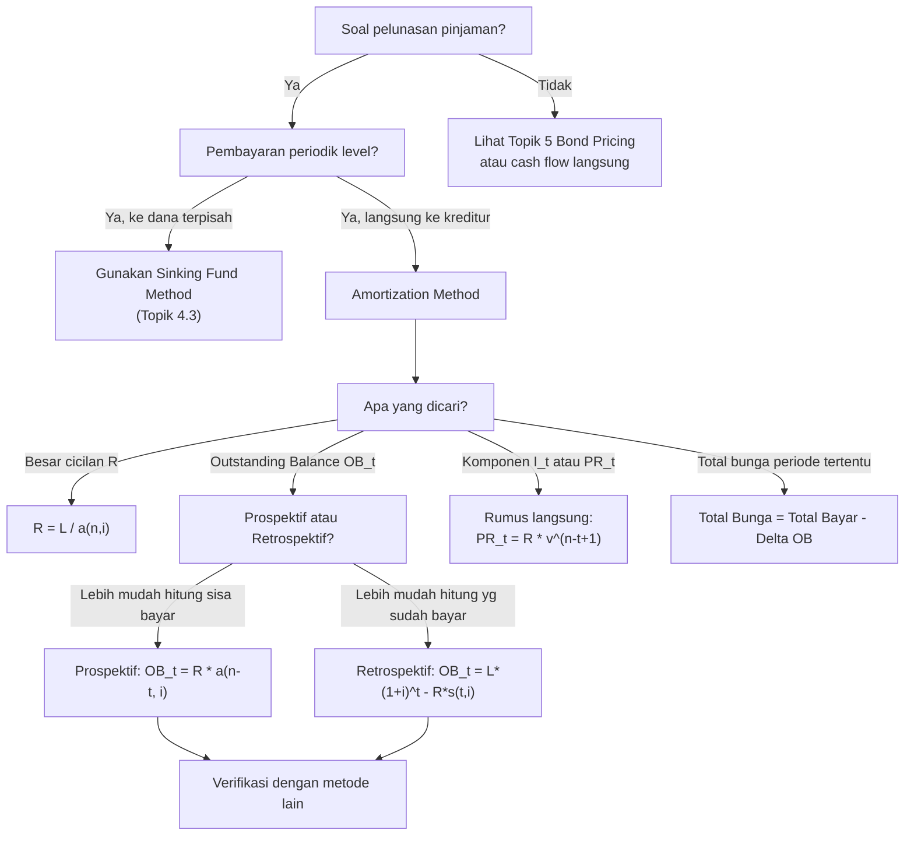

# 📘 4.2 — Amortization Method

> [!ABSTRACT] Ringkasan Cepat
> **Topik:** Amortization Method | **Bobot:** ~5–15% | **Difficulty:** Calculation-Intensive
> **Ref:** Vaaler Bab 5, Kellison Bab 5 | **Prereq:** [[2.1 Annuity-Immediate and Annuity-Due]], [[1.1 Interest Rates and Discount Rates]], [[4.1 Loan Terminology]]

## Section 0 — Pemetaan Topik

| Topik CF1                      | Sub-topik ID | Skill Diuji                                                                                                                                                                                                                                                | Bobot | Difficulty            | Prerequisite                                                                                                   | Connected Topics                                                                                                                                                        | Referensi                    |
| ------------------------------ | ------------ | ---------------------------------------------------------------------------------------------------------------------------------------------------------------------------------------------------------------------------------------------------------- | ----- | --------------------- | -------------------------------------------------------------------------------------------------------------- | ----------------------------------------------------------------------------------------------------------------------------------------------------------------------- | ---------------------------- |
| Topik 4: Pengembalian Pinjaman | 4.2          | Menyusun jadwal amortisasi; menghitung porsi bunga dan pokok per periode; menghitung outstanding balance (OB) dengan metode prospektif dan retrospektif; menghitung total bunga yang dibayar; balloon/drop payment; pinjaman dengan pembayaran tidak level | 5–15% | Calculation-Intensive | [[2.1 Annuity-Immediate and Annuity-Due]], [[1.1 Interest Rates and Discount Rates]], [[4.1 Loan Terminology]] | [[4.3 Sinking Fund Method]], [[2.1 Annuity-Immediate and Annuity-Due]], [[5.2 Book Value, Premium and Discount Amortization]], [[3.3 Duration (Macaulay and Modified)]] | Vaaler Bab 5, Kellison Bab 5 |

## Section 1 — Intuisi

Bayangkan kamu meminjam uang dari bank untuk membeli mobil seharga Rp 200.000.000. Bank menyetujui pinjaman dengan cicilan bulanan selama 3 tahun. Setiap bulan kamu membayar jumlah yang sama, misalnya Rp 6.500.000. Tapi apakah seluruh Rp 6.500.000 itu langsung mengurangi hutang pokok kamu? Tidak. Sebagian digunakan untuk **membayar bunga** (biaya meminjam uang selama sebulan), dan sisanya baru mengurangi **saldo pokok** (outstanding balance). Di bulan pertama, saldo masih sangat besar sehingga porsi bunganya besar dan porsi pokok kecil. Seiring berjalannya waktu, saldo mengecil, bunga yang dibayar ikut mengecil, dan semakin banyak cicilan yang "nyangkut" ke pengurangan pokok. Inilah inti dari **metode amortisasi**.

Konsep ini bukan hanya tentang cicilan mobil atau KPR. Setiap kali kita melihat obligasi, pembiayaan korporat, atau bahkan kartu kredit—logika amortisasinya sama: setiap pembayaran mencakup komponen bunga dan komponen pokok, dengan proporsi yang berubah seiring waktu. Bagi aktuaris, memahami struktur ini secara matematis adalah kunci karena memungkinkan kita menghitung **berapa saldo pinjaman setelah $t$ pembayaran** tanpa harus melakukan perhitungan per baris dari awal.

Kekuatan metode amortisasi terletak pada dua pendekatan pintar: **metode prospektif** (lihat ke depan—OB = PV sisa pembayaran) dan **metode retrospektif** (lihat ke belakang—OB = nilai akumulasi pinjaman awal dikurangi akumulasi pembayaran yang sudah dilakukan). Kedua metode ini **selalu menghasilkan jawaban yang sama** — ini bisa digunakan sebagai cek kebenaran yang sangat kuat di exam.

## Section 2 — Definisi Formal

> [!NOTE] Definisi Matematis
> **Amortization Method:** Metode pelunasan pinjaman di mana setiap pembayaran periodik mencakup dua komponen: (1) bunga atas saldo yang belum dibayar, dan (2) pengurangan saldo pokok (principal repayment).
>
> Untuk pinjaman $L$ dengan $n$ pembayaran level sebesar $R$ per periode pada suku bunga efektif $i$ per periode:
>
> $$
> L = R \cdot a_{\overline{n}|i}
> $$
>
> Sehingga besar pembayaran level:
>
> $$
> R = \frac{L}{a_{\overline{n}|i}}
> $$
>
> **Outstanding Balance (OB) setelah $t$ pembayaran — Metode Prospektif:**
>
> $$
> OB_t^{\text{pro}} = R \cdot a_{\overline{n-t}|i}
> $$
>
> **Outstanding Balance (OB) setelah $t$ pembayaran — Metode Retrospektif:**
>
> $$
> OB_t^{\text{retro}} = L \cdot (1+i)^t - R \cdot s_{\overline{t}|i}
> $$

### Variabel & Parameter

| Simbol | Makna | Catatan |
|--------|-------|---------|
| $L$ | Jumlah pinjaman awal (loan amount) | Sama dengan $OB_0$ |
| $n$ | Jumlah total pembayaran | Integer positif |
| $R$ | Besar pembayaran level per periode | $R = L / a_{\overline{n}\|i}$ |
| $i$ | Suku bunga efektif per periode | Decimal, $i > 0$ |
| $t$ | Periode ke-$t$ (setelah $t$ pembayaran dilakukan) | $0 \leq t \leq n$ |
| $OB_t$ | Outstanding balance setelah pembayaran ke-$t$ | $OB_0 = L$, $OB_n = 0$ |
| $I_t$ | Komponen bunga pada pembayaran ke-$t$ | $I_t = i \cdot OB_{t-1}$ |
| $PR_t$ | Komponen pokok (principal repayment) pada pembayaran ke-$t$ | $PR_t = R - I_t$ |

### Rumus Utama

$$
R = \frac{L}{a_{\overline{n}|i}} = \frac{L \cdot i}{1 - v^n}
$$
**Label:** Besar pembayaran level — diturunkan dari persamaan $L = R \cdot a_{\overline{n}|i}$.

$$
I_t = i \cdot OB_{t-1} = R \cdot (1 - v^{n-t+1})
$$
**Label:** Komponen bunga pada pembayaran ke-$t$ — bunga adalah $i$ dikalikan saldo periode sebelumnya. Formulasi kedua menggunakan rumus langsung tanpa menghitung $OB_{t-1}$ terlebih dahulu.

$$
PR_t = R - I_t = R \cdot v^{n-t+1}
$$
**Label:** Komponen pokok (principal repayment) pada pembayaran ke-$t$ — bagian dari pembayaran yang mengurangi saldo.

$$
OB_t = OB_{t-1} \cdot (1+i) - R
$$
**Label:** Rekursi saldo — saldo baru = (saldo lama diakumulasi 1 periode) dikurangi pembayaran.

$$
OB_t^{\text{pro}} = R \cdot a_{\overline{n-t}|i}
$$
**Label:** OB metode prospektif — nilai sekarang dari $n-t$ sisa pembayaran.

$$
OB_t^{\text{retro}} = L \cdot (1+i)^t - R \cdot s_{\overline{t}|i}
$$
**Label:** OB metode retrospektif — akumulasi pinjaman awal dikurangi akumulasi pembayaran yang telah dilakukan.

$$
PR_t = PR_1 \cdot (1+i)^{t-1}
$$
**Label:** Pertumbuhan komponen pokok — komponen pokok tumbuh dengan faktor $(1+i)$ setiap periode.

$$
\sum_{t=1}^{n} PR_t = L \quad \text{dan} \quad \sum_{t=1}^{n} I_t = nR - L
$$
**Label:** Total pokok = pinjaman awal; total bunga = total pembayaran dikurangi pinjaman awal.

### Asumsi Eksplisit

- **Level Payments:** Setiap pembayaran $R$ sama besar (kecuali jika ada balloon/drop payment).
- **End-of-Period (Immediate):** Pembayaran pertama di $t=1$ (annuity-immediate).
- **Constant Interest Rate:** $i$ konstan selama seluruh $n$ periode.
- **Fully Amortizing:** $OB_n = 0$ — pinjaman lunas setelah pembayaran ke-$n$.
- **No Prepayment Penalty:** Tidak ada penalti pelunasan lebih awal (kecuali soal menyatakan lain).

## Section 3 — Jembatan Logika

> [!TIP] Dari Time Diagram ke Equation of Value
> Bayangkan pinjaman $L$ diterima di $t=0$. Sebagai kompensasi, peminjam berjanji membayar $R$ di $t=1, 2, \ldots, n$. Focal date di $t=0$, equation of value menghasilkan $L = R \cdot a_{\overline{n}|i}$.
>
> Kini, setelah $t$ pembayaran dilakukan, kita ingin tahu OB. Dengan **metode prospektif**, kita berdiri di titik waktu $t$ dan melihat ke depan: peminjam masih berhutang $(n-t)$ pembayaran lagi. Nilai sekarang (pada $t$) dari sisa kewajiban itu adalah $R \cdot a_{\overline{n-t}|i}$. Inilah $OB_t$.
>
> Dengan **metode retrospektif**, kita berdiri di $t$ dan melihat ke belakang: pinjaman $L$ telah tumbuh menjadi $L(1+i)^t$, tetapi $t$ pembayaran senilai $R$ telah dilakukan dan terakumulasi menjadi $R \cdot s_{\overline{t}|i}$. Selisihnya adalah saldo yang tersisa.

> [!IMPORTANT] Focal Date
> - **Equation awal:** Focal date di $t=0$ menghasilkan $L = R \cdot a_{\overline{n}|i}$.
> - **Metode Prospektif:** Focal date di $t$ — pandang ke depan, PV sisa pembayaran.
> - **Metode Retrospektif:** Focal date di $t$ — pandang ke belakang, akumulasi pinjaman dikurangi akumulasi pembayaran.
> - **Kedua metode WAJIB menghasilkan nilai yang sama** — gunakan ini sebagai sanity check.

**Derivasi $I_t$ dan $PR_t$ tanpa jadwal amortisasi lengkap:**

Dari metode prospektif: $OB_{t-1} = R \cdot a_{\overline{n-t+1}|i}$

Komponen bunga:
$$
I_t = i \cdot OB_{t-1} = i \cdot R \cdot a_{\overline{n-t+1}|i} = i \cdot R \cdot \frac{1 - v^{n-t+1}}{i} = R(1 - v^{n-t+1})
$$

Komponen pokok:
$$
PR_t = R - I_t = R - R(1 - v^{n-t+1}) = R \cdot v^{n-t+1}
$$

**Derivasi pertumbuhan $PR_t$:**

$$
PR_{t+1} = R \cdot v^{n-t} = R \cdot v^{n-t+1} \cdot (1+i) = PR_t \cdot (1+i)
$$

Artinya, komponen pokok pada periode berikutnya selalu lebih besar sebesar faktor $(1+i)$. Ini masuk akal: setiap periode, saldo mengecil sehingga bunga mengecil, dan lebih banyak dari $R$ yang "bebas" untuk melunasi pokok.

**Bukti ekivalensi Prospektif = Retrospektif:**

$$
L(1+i)^t - R \cdot s_{\overline{t}|i} = R \cdot a_{\overline{n}|i} \cdot (1+i)^t - R \cdot s_{\overline{t}|i}
$$

$$
= R \left[ a_{\overline{n}|i} \cdot (1+i)^t - s_{\overline{t}|i} \right]
$$

$$
= R \left[ \frac{1-v^n}{i} \cdot (1+i)^t - \frac{(1+i)^t - 1}{i} \right]
$$

$$
= R \cdot \frac{(1+i)^t - v^n(1+i)^t - (1+i)^t + 1}{i} = R \cdot \frac{1 - v^{n-t}}{i} = R \cdot a_{\overline{n-t}|i}
$$

Terbukti: Metode Retrospektif $= R \cdot a_{\overline{n-t}|i} =$ Metode Prospektif. $\blacksquare$

> [!DANGER] Dilarang
> 1. **Jangan gunakan $OB_t = L - t \cdot PR$** — komponen pokok $PR_t$ tidak konstan; ia tumbuh dengan $(1+i)$ setiap periode. Rumus ini hanya valid untuk pinjaman dengan bunga sederhana, bukan bunga majemuk.
> 2. **Jangan gunakan metode prospektif dengan $n$ total, bukan $n-t$ sisa** — $OB_t = R \cdot a_{\overline{n}|i}$ adalah **salah**; yang benar adalah $OB_t = R \cdot a_{\overline{n-t}|i}$.
> 3. **Jangan lupa bahwa $I_t$ dan $PR_t$ berubah setiap periode** — menghitung $I_t$ dengan mengalikan $i$ dengan $L$ (bukan $OB_{t-1}$) adalah kesalahan fatal yang mengabaikan amortisasi.

## Section 4 — Contoh Soal

### Soal A — Fundamental

Sebuah pinjaman sebesar Rp 10.000.000 dilunasi dengan 4 pembayaran tahunan yang sama besar. Suku bunga efektif adalah $8\%$ per tahun. Hitunglah: (a) besar setiap pembayaran $R$, (b) jadwal amortisasi lengkap (komponen bunga dan pokok untuk setiap pembayaran), dan (c) verifikasi bahwa total pokok $= L$.

> [!SUCCESS] Solusi Soal A
>
> **1. Identifikasi Variabel**
> - $L = 10{.}000{.}000$
> - $n = 4$ tahun
> - $i = 8\% = 0{,}08$ per tahun
> - $v = 1/1{,}08$
> - $R = ?$
>
> **2. Time Diagram**
>
> ```
> t=0          t=1        t=2        t=3        t=4
> |------------|----------|----------|----------|
> L=10.000.000  [R]        [R]        [R]        [R]
> ```
> Pinjaman diterima di $t=0$; empat pembayaran level di $t=1,2,3,4$ (annuity-immediate).
>
> **3. Equation of Value** *(pada Focal Date $t=0$)*
>
> $$
> L = R \cdot a_{\overline{4}|8\%}
> $$
>
> **4. Eksekusi Aljabar**
>
> $$
> a_{\overline{4}|8\%} = \frac{1 - (1{,}08)^{-4}}{0{,}08} = \frac{1 - 0{,}73503}{0{,}08} = \frac{0{,}26497}{0{,}08} = 3{,}31213
> $$
>
> $$
> R = \frac{10{.}000{.}000}{3{,}31213} = 3{.}019{.}208
> $$
>
> Jadwal amortisasi:
>
> | $t$ | $OB_{t-1}$ | $I_t = 0{,}08 \times OB_{t-1}$ | $PR_t = R - I_t$ | $OB_t = OB_{t-1} - PR_t$ |
> |-----|------------|-------------------------------|-----------------|--------------------------|
> | 1 | 10.000.000 | 800.000 | 2.219.208 | 7.780.792 |
> | 2 | 7.780.792 | 622.463 | 2.396.745 | 5.384.047 |
> | 3 | 5.384.047 | 430.724 | 2.588.484 | 2.795.563 |
> | 4 | 2.795.563 | 223.645 | 2.795.563 | 0 |
> | **Total** | | **2.076.832** | **10.000.000** | |
>
> *(nilai dibulatkan; small rounding differences mungkin terjadi)*
>
> **5. Verification**
>
> - Total pokok $= 2{.}219{.}208 + 2{.}396{.}745 + 2{.}588{.}484 + 2{.}795{.}563 \approx 10{.}000{.}000$ ✓
> - Total pembayaran $= 4 \times 3{.}019{.}208 = 12{.}076{.}832$; total bunga $= 12{.}076{.}832 - 10{.}000{.}000 = 2{.}076{.}832$ ✓
> - $OB_4 = 0$ ✓ (pinjaman lunas)
> - $PR_2 / PR_1 = 2{.}396{.}745 / 2{.}219{.}208 \approx 1{,}08$ ✓ (komponen pokok tumbuh dengan faktor $1{+}i$)

> [!WARNING] Exam Tips — Soal A
> - **Target waktu:** 4–5 menit. Jika diminta jadwal lengkap, susun tabel secara sistematis.
> - **Common trap:** Membulatkan $R$ terlalu awal akan mengakibatkan $OB_n \neq 0$. Sebaiknya simpan nilai $R$ dengan presisi penuh selama perhitungan, baru bulatkan di akhir.
> - **Shortcut:** Jika soal hanya meminta $I_t$ atau $PR_t$ untuk satu periode tertentu (bukan jadwal lengkap), gunakan rumus langsung $PR_t = R \cdot v^{n-t+1}$ dan $I_t = R(1 - v^{n-t+1})$ — jauh lebih cepat daripada menyusun tabel.

### Soal B — Exam-Typical

Seorang nasabah meminjam Rp 50.000.000 yang akan dilunasi dengan cicilan bulanan selama 5 tahun. Suku bunga nominal adalah $9\%$ per tahun *convertible monthly*. Tentukan: (a) besar cicilan bulanan $R$, (b) outstanding balance setelah cicilan ke-36 menggunakan **kedua** metode (prospektif dan retrospektif), dan (c) total bunga yang dibayar selama 3 tahun pertama.

> [!SUCCESS] Solusi Soal B
>
> **1. Identifikasi Variabel**
> - $L = 50{.}000{.}000$
> - Total pembayaran $n = 5 \times 12 = 60$ bulan
> - Suku bunga nominal $= 9\%$ *convertible monthly*, sehingga $i_{\text{bulanan}} = 9\%/12 = 0{,}75\% = 0{,}0075$ per bulan
> - $v = 1/1{,}0075$
> - $t = 36$ (setelah cicilan ke-36)
>
> **2. Time Diagram**
>
> ```
> t=0         t=1  t=2 ... t=36      t=37 ... t=60
> |-----------|----|----|---|---------|---------|
> L=50.000.000 [R] [R] ... [R]       [R] ...  [R]
>                          ^
>                        OB_36 = ?
> ```
>
> **3. Equation of Value** *(pada Focal Date $t=0$ untuk mencari $R$)*
>
> $$
> L = R \cdot a_{\overline{60}|0{,}75\%}
> $$
>
> **4. Eksekusi Aljabar**
>
> Hitung $a_{\overline{60}|0{,}0075}$:
>
> $$
> a_{\overline{60}|0{,}0075} = \frac{1 - (1{,}0075)^{-60}}{0{,}0075}
> $$
>
> $(1{,}0075)^{60} = e^{60 \ln 1{,}0075} \approx e^{60 \times 0{,}007472} \approx e^{0{,}44832} \approx 1{,}56568$
>
> $$
> a_{\overline{60}|0{,}0075} = \frac{1 - 1/1{,}56568}{0{,}0075} = \frac{1 - 0{,}63870}{0{,}0075} = \frac{0{,}36130}{0{,}0075} = 48{,}1733
> $$
>
> $$
> R = \frac{50{.}000{.}000}{48{,}1733} = 1{.}037{.}965 \text{ (per bulan)}
> $$
>
> **OB setelah cicilan ke-36 — Metode Prospektif:**
>
> Sisa pembayaran $= 60 - 36 = 24$ bulan.
>
> $$
> OB_{36}^{\text{pro}} = R \cdot a_{\overline{24}|0{,}0075}
> $$
>
> $$
> a_{\overline{24}|0{,}0075} = \frac{1 - (1{,}0075)^{-24}}{0{,}0075}
> $$
>
> $(1{,}0075)^{24} \approx 1{,}19641$, sehingga $(1{,}0075)^{-24} \approx 0{,}83583$
>
> $$
> a_{\overline{24}|0{,}0075} = \frac{1 - 0{,}83583}{0{,}0075} = \frac{0{,}16417}{0{,}0075} = 21{,}8893
> $$
>
> $$
> OB_{36}^{\text{pro}} = 1{.}037{.}965 \times 21{,}8893 = 22{.}720{.}600
> $$
>
> **OB setelah cicilan ke-36 — Metode Retrospektif:**
>
> $$
> OB_{36}^{\text{retro}} = L \cdot (1{,}0075)^{36} - R \cdot s_{\overline{36}|0{,}0075}
> $$
>
> $(1{,}0075)^{36} \approx 1{,}30865$
>
> $$
> s_{\overline{36}|0{,}0075} = \frac{(1{,}0075)^{36} - 1}{0{,}0075} = \frac{1{,}30865 - 1}{0{,}0075} = \frac{0{,}30865}{0{,}0075} = 41{,}1533
> $$
>
> $$
> OB_{36}^{\text{retro}} = 50{.}000{.}000 \times 1{,}30865 - 1{.}037{.}965 \times 41{,}1533
> $$
>
> $$
> = 65{.}432{.}500 - 42{.}714{.}900 = 22{.}717{.}600
> $$
>
> *(perbedaan kecil akibat pembulatan intermediate)*. Kedua metode menghasilkan nilai yang sangat dekat: $OB_{36} \approx 22{.}720{.}000$ ✓
>
> **Total bunga selama 3 tahun pertama (cicilan 1–36):**
>
> Total pembayaran selama 36 bulan $= 36 \times R = 36 \times 1{.}037{.}965 = 37{.}366{.}740$
>
> Total pokok yang dilunasi $= L - OB_{36} = 50{.}000{.}000 - 22{.}720{.}000 = 27{.}280{.}000$
>
> Total bunga selama 3 tahun pertama:
>
> $$
> \text{Total Bunga} = \text{Total Pembayaran} - \text{Total Pokok} = 37{.}366{.}740 - 27{.}280{.}000 = 10{.}086{.}740
> $$
>
> **5. Verification**
>
> - $OB_{36}^{\text{pro}} \approx OB_{36}^{\text{retro}}$ ✓ (perbedaan hanya akibat pembulatan)
> - $OB_{36} < L/2 = 25{.}000{.}000$: masuk akal karena setelah lebih dari setengah masa pinjaman (36 dari 60 bulan), saldo harus di bawah setengah pinjaman awal.
> - Total bunga $> 0$ dan $< nR - L = 60 \times 1{.}037{.}965 - 50{.}000{.}000 = 12{.}277{.}900$: proporsi bunga 3 tahun pertama $\approx 82\%$ dari total bunga, masuk akal karena bunga lebih besar di awal pinjaman.

> [!WARNING] Exam Tips — Soal B
> - **Target waktu:** 6–8 menit.
> - **Common trap #1:** Menggunakan $i = 9\%$ (annual) langsung tanpa membagi 12. **Wajib** konversi ke rate per periode pembayaran.
> - **Common trap #2:** Menghitung total bunga dengan $36 \times I_1$ (anggap bunga konstan). Ini salah — bunga berubah setiap periode. Gunakan: Total Bunga = Total Pembayaran − Total Pokok.
> - **Shortcut verifikasi:** Setelah mendapat $OB_{36}$ dengan prospektif, hitung ulang dengan retrospektif. Jika sama (dengan toleransi pembulatan), jawaban benar.

### Soal C — Challenging

Sebuah pinjaman dilunasi dengan 20 pembayaran tahunan level pada suku bunga efektif $i$ per tahun. Diketahui bahwa komponen bunga pada pembayaran ke-**6** adalah 3 kali komponen pokok pada pembayaran ke-**16**. Tentukan suku bunga efektif $i$.

> [!SUCCESS] Solusi Soal C
>
> **1. Identifikasi Variabel**
> - $n = 20$, $R = 1$ (WLOG; karena rasio, nilai $R$ tidak mempengaruhi)
> - $I_6 = 3 \cdot PR_{16}$
> - Cari: $i$
>
> **2. Time Diagram**
>
> ```
> t=0    t=1 ... t=5  [t=6]  t=7 ... t=15  [t=16]  t=17...t=20
> |------|----|---|----|----|---|-----|----|---------|
>                  ↑                   ↑
>                  I_6 diketahui       PR_16 diketahui
> ```
>
> **3. Equation of Value** *(ekspresi $I_t$ dan $PR_t$ dalam $v$)*
>
> Menggunakan rumus langsung:
>
> $$
> I_t = R \cdot (1 - v^{n-t+1}), \quad PR_t = R \cdot v^{n-t+1}
> $$
>
> **4. Eksekusi Aljabar**
>
> Untuk $t=6$ dan $n=20$: $\quad n - t + 1 = 20 - 6 + 1 = 15$
>
> $$
> I_6 = 1 - v^{15}
> $$
>
> Untuk $t=16$ dan $n=20$: $\quad n - t + 1 = 20 - 16 + 1 = 5$
>
> $$
> PR_{16} = v^5
> $$
>
> Substitusi kondisi $I_6 = 3 \cdot PR_{16}$:
>
> $$
> 1 - v^{15} = 3v^5
> $$
>
> Misalkan $x = v^5$, sehingga $v^{15} = x^3$:
>
> $$
> 1 - x^3 = 3x
> $$
>
> $$
> x^3 + 3x - 1 = 0
> $$
>
> Ini adalah persamaan kubik. Gunakan trial: coba $x = 0{,}3$:
>
> $$
> (0{,}3)^3 + 3(0{,}3) - 1 = 0{,}027 + 0{,}9 - 1 = -0{,}073 < 0
> $$
>
> Coba $x = 0{,}32$:
>
> $$
> (0{,}32)^3 + 3(0{,}32) - 1 = 0{,}03277 + 0{,}96 - 1 = -0{,}00723 < 0
> $$
>
> Coba $x = 0{,}325$:
>
> $$
> (0{,}325)^3 + 3(0{,}325) - 1 = 0{,}03441 + 0{,}975 - 1 = 0{,}00941 > 0
> $$
>
> Interpolasi linear antara $x = 0{,}32$ dan $x = 0{,}325$:
>
> $$
> x \approx 0{,}32 + 0{,}005 \times \frac{0{,}00723}{0{,}00723 + 0{,}00941} = 0{,}32 + 0{,}005 \times 0{,}4344 \approx 0{,}3222
> $$
>
> Sehingga $v^5 \approx 0{,}3222$, maka:
>
> $$
> v \approx (0{,}3222)^{1/5}
> $$
>
> $$
> \ln v \approx \frac{\ln 0{,}3222}{5} = \frac{-1{,}1335}{5} = -0{,}22670
> $$
>
> $$
> v \approx e^{-0{,}22670} \approx 0{,}7980
> $$
>
> $$
> i = \frac{1}{v} - 1 = \frac{1}{0{,}7980} - 1 \approx 0{,}2531 = 25{,}31\%
> $$
>
> **Verifikasi:** Cek $I_6 = 3 \cdot PR_{16}$ dengan $i \approx 25{,}31\%$, $v \approx 0{,}7980$:
>
> $v^5 \approx 0{,}3222$; $v^{15} \approx (0{,}3222)^3 \approx 0{,}03348$
>
> $I_6 = 1 - 0{,}03348 = 0{,}9665$; $PR_{16} = 0{,}3222$; $3 \times 0{,}3222 = 0{,}9666$ ✓
>
> **5. Verification**
>
> - $i \approx 25\%$ terasa tinggi tetapi konsisten: $I_6 \gg PR_{16}$ hanya masuk akal jika bunga sangat tinggi (saldo masih besar setelah 5 pembayaran, sehingga bunga pada $t=6$ masih dominan).
> - Substitusi kembali membuktikan kondisi soal terpenuhi.

> [!WARNING] Exam Tips — Soal C
> - **Target waktu:** 8–10 menit.
> - **Common trap:** Mencoba menyusun jadwal amortisasi penuh untuk $n=20$ periode — sangat tidak efisien. Gunakan rumus langsung $PR_t = R \cdot v^{n-t+1}$ dan $I_t = R(1 - v^{n-t+1})$.
> - **Kunci:** Substitusi $x = v^5$ untuk menyederhanakan persamaan menjadi kubik. Bila tidak menemukan akar rasional, gunakan interpolasi linear.
> - **Red flag:** Soal yang melibatkan dua periode berbeda ($I_t$ vs $PR_s$) hampir selalu bisa diselesaikan dengan dua ekspresi dalam $v$, lalu eliminasi $R$.

## Section 5 — Verifikasi & Sanity Check

> [!CHECK] Konsistensi Jadwal Amortisasi
> 1. **$OB_n = 0$:** Saldo di periode terakhir harus nol. Jika tidak, ada kesalahan pada $R$ atau perhitungan.
> 2. **$\sum PR_t = L$:** Jumlah semua komponen pokok harus sama persis dengan pinjaman awal.
> 3. **$\sum I_t = nR - L$:** Total bunga = total pembayaran dikurangi pokok awal.

> [!CHECK] Prospektif = Retrospektif
> 1. **Identitas:** $R \cdot a_{\overline{n-t}|i} = L(1+i)^t - R \cdot s_{\overline{t}|i}$ harus berlaku untuk setiap $t$.
> 2. **Cek batas:** $OB_0 = L$ dan $OB_n = 0$ — wajib dicek jika ada keraguan pada setup soal.
> 3. **Monoton menurun:** $OB_t$ harus terus berkurang setiap periode (untuk pinjaman level dengan $i > 0$).

> [!CHECK] Komponen Bunga vs Pokok
> 1. **$PR_t$ meningkat setiap periode:** $PR_{t+1} = PR_t \cdot (1+i) > PR_t$ — komponen pokok selalu tumbuh.
> 2. **$I_t$ menurun setiap periode:** $I_{t+1} < I_t$ — komponen bunga selalu mengecil.
> 3. **$PR_t + I_t = R$ untuk setiap $t$:** Total kedua komponen harus selalu sama dengan pembayaran periodik.

> [!CHECK] Batas Logis
> 1. **$OB_t < L$ untuk $t \geq 1$:** Saldo tidak pernah melebihi pinjaman awal (untuk pinjaman biasa).
> 2. **$I_1 = i \cdot L$:** Bunga di periode pertama adalah suku bunga dikalikan pinjaman penuh — cek mudah.
> 3. **$PR_1 = R - iL$:** Komponen pokok pertama = pembayaran dikurangi bunga pertama.

### Metode Alternatif

**Menghitung OB Menggunakan Rekursi:**

Untuk menghitung $OB_t$ step-by-step (berguna jika $n$ kecil):

$$
OB_t = OB_{t-1} \cdot (1+i) - R
$$

dengan $OB_0 = L$. Ini ekuivalen dengan kedua metode, hanya lebih lambat untuk $t$ besar.

**Menghitung $\sum_{t=k}^{m} I_t$ (total bunga selama periode $k$ sampai $m$):**

$$
\sum_{t=k}^{m} I_t = (m-k+1) \cdot R - (OB_{k-1} - OB_m)
$$

Total pembayaran dikurangi selisih saldo — jauh lebih cepat daripada menjumlahkan $I_t$ satu per satu.

## Section 6 — Visualisasi Mental

**Dekomposisi Pembayaran per Periode:**

Bayangkan sebuah **diagram batang bertumpuk** (stacked bar chart). Sumbu X adalah nomor periode $t = 1, 2, \ldots, n$. Sumbu Y adalah besar pembayaran $R$ (tinggi total setiap batang sama). Setiap batang terbagi dua: bagian **bawah** (warna merah) adalah komponen bunga $I_t$, bagian **atas** (warna hijau) adalah komponen pokok $PR_t$.

- Di $t=1$: batang merah sangat tinggi (bunga besar), batang hijau tipis (pokok kecil).
- Seiring bertambahnya $t$: batang merah semakin pendek, batang hijau semakin tinggi.
- Di $t=n$: hampir seluruh batang berwarna hijau — hampir semua pembayaran adalah pokok.

Bentuk perubahan ini **eksponensial**, bukan linear — karena $PR_t = R \cdot v^{n-t+1}$ yang merupakan fungsi geometrik.

**Grafik Outstanding Balance:**

Sumbu X = $t$ (waktu). Sumbu Y = $OB_t$ (saldo). Kurva dimulai di $(0, L)$ dan berakhir di $(n, 0)$.

- Bentuk kurva: **concave ke atas (cembung)** — OB turun lambat di awal, lalu semakin cepat.
- Titik kritis: Di mana $I_t = PR_t$, yaitu saat $R \cdot v^{n-t+1} = R(1 - v^{n-t+1})$, atau $v^{n-t+1} = 0{,}5$, yaitu $t^* = n + 1 - \frac{\ln 2}{\ln(1+i)}$. Sebelum $t^*$, bunga > pokok; setelah $t^*$, pokok > bunga.

### Hubungan Visual ↔ Rumus

**Setiap titik pada kurva OB = nilai metode prospektif:**

$$
OB_t = R \cdot a_{\overline{n-t}|i} = R \cdot \frac{1 - v^{n-t}}{i}
$$

Saat $t$ naik, $n-t$ mengecil, $a_{\overline{n-t}|}$ mengecil, $OB_t$ turun — sesuai visualisasi kurva menurun.

**Area di bawah kurva OB (secara diskret) $\propto$ total bunga yang dibayar:**

$$
\sum_{t=1}^{n} I_t = i \cdot \sum_{t=0}^{n-1} OB_t
$$

Semakin "besar" area di bawah kurva OB (yaitu semakin lambat OB turun), semakin besar total bunga — secara visual sangat intuitif.

## Section 7 — Jebakan Umum

> [!BUG] Kesalahan Unit Waktu
> **Contoh Salah:** Pinjaman dengan cicilan bulanan, suku bunga nominal $12\%$ per tahun. Menggunakan $i = 12\%$ dan $n$ dalam tahun.
>
> **Benar:** Konversi ke unit yang sesuai dengan frekuensi pembayaran. Cicilan bulanan → $i_{\text{bulanan}} = 12\%/12 = 1\%$ per bulan, dan $n$ dalam jumlah bulan. Aturan emas: **unit $i$ harus sama dengan unit satu periode pembayaran**.

> [!BUG] Kesalahan Konseptual
> 1. **$PR_t$ dianggap konstan:** Ini hanya benar untuk metode sinking fund, bukan amortisasi. Dalam amortisasi, $PR_t = R \cdot v^{n-t+1}$ berubah setiap periode.
> 2. **Metode prospektif menggunakan $n$ bukan $n-t$:** $OB_t = R \cdot a_{\overline{n}|i}$ adalah **salah** (itu adalah pinjaman awal $L$). Yang benar: $OB_t = R \cdot a_{\overline{n-t}|i}$ dengan $n-t$ = jumlah sisa pembayaran.
> 3. **Lupa bahwa $I_t = i \cdot OB_{t-1}$, bukan $i \cdot L$:** Mengalikan $i$ dengan pinjaman awal (bukan saldo sebelumnya) mengabaikan seluruh mekanisme amortisasi.
> 4. **Balloon payment dianggap sama dengan $R$:** Balloon payment adalah sisa saldo terakhir yang mungkin berbeda dari $R$. Hitung $OB_{n-1}$ terlebih dahulu, lalu tambahkan bunga satu periode.

> [!BUG] Kesalahan Interpretasi Soal
> **Ambiguitas "pembayaran ke-$t$" vs "setelah $t$ tahun":**
> - "Besar bunga pada pembayaran ke-6" → gunakan $I_6 = i \cdot OB_5$ (saldo **sebelum** pembayaran ke-6).
> - "Saldo setelah pembayaran ke-6" → gunakan $OB_6 = R \cdot a_{\overline{n-6}|i}$ (metode prospektif).
>
> **Ambiguitas "saldo setelah $t$ tahun":** Pastikan apakah $t$ tahun sudah termasuk pembayaran ke-$t$ atau belum. "Saldo tepat setelah pembayaran ke-$t$" → $OB_t$. "Saldo tepat sebelum pembayaran ke-$(t+1)$" → $OB_t \cdot (1+i)$ (saldo sudah diakumulasi tapi belum dipotong pembayaran).

> [!CAUTION] Red Flags
> - **"Komponen bunga / pokok pada pembayaran ke-$t$":** Trigger untuk rumus langsung $I_t = R(1 - v^{n-t+1})$ dan $PR_t = R \cdot v^{n-t+1}$ — jangan susun jadwal lengkap.
> - **"Outstanding balance setelah pembayaran ke-$t$":** Gunakan metode prospektif (lebih cepat) atau retrospektif (jika prospektif tidak praktis). Selalu verifikasi dengan metode kedua.
> - **"Total bunga yang dibayar selama periode $t_1$ sampai $t_2$":** Gunakan: Total Bunga $= (t_2 - t_1 + 1) \cdot R - (OB_{t_1 - 1} - OB_{t_2})$.
> - **"Balloon payment":** Artinya pembayaran terakhir berbeda dari $R$. Hitung $OB_{n-1}$ dulu, lalu balloon $= OB_{n-1}(1+i)$.
> - **Nominal rate, bukan effective:** Wajib bagi dengan frekuensi compounding sebelum masuk ke rumus anuitas.

## Section 8 — Ringkasan Eksekutif

> [!SUMMARY] Must-Remember
> 1. **Besar pembayaran level:**
>    $$
>    R = \frac{L}{a_{\overline{n}|i}} = \frac{L \cdot i}{1 - v^n}
>    $$
> 2. **Outstanding Balance — Prospektif:**
>    $$
>    OB_t = R \cdot a_{\overline{n-t}|i}
>    $$
> 3. **Outstanding Balance — Retrospektif:**
>    $$
>    OB_t = L(1+i)^t - R \cdot s_{\overline{t}|i}
>    $$
> 4. **Komponen pokok dan bunga (langsung, tanpa jadwal):**
>    $$
>    PR_t = R \cdot v^{n-t+1}, \quad I_t = R(1 - v^{n-t+1})
>    $$
> 5. **Pertumbuhan komponen pokok dan total:**
>    $$
>    PR_{t+1} = PR_t \cdot (1+i), \quad \sum_{t=1}^{n} PR_t = L, \quad \sum_{t=1}^{n} I_t = nR - L
>    $$

### Kapan Digunakan

- **Trigger keywords:** "jadwal amortisasi," "cicilan," "saldo pinjaman," "komponen bunga/pokok," "outstanding balance," "berapa bunga yang dibayar."
- **Tipe skenario soal:**
  - Susun jadwal amortisasi lengkap untuk $n$ kecil (4–5 periode).
  - Hitung $OB_t$ untuk $t$ tertentu tanpa menyusun jadwal.
  - Hitung $I_t$ atau $PR_t$ untuk periode tertentu langsung.
  - Hitung total bunga selama rentang waktu tertentu.
  - Tentukan $i$ atau $n$ yang tidak diketahui dari kondisi yang melibatkan $I_t$ atau $PR_t$.

### Kapan TIDAK Boleh Digunakan

- **Jika peminjam menyetor ke dana terpisah (sinking fund):** Gunakan [[4.3 Sinking Fund Method]] — bunga dibayar terpisah, pokok dilunasi sekaligus dari sinking fund.
- **Jika pembayaran tidak level dan bukan balloon:** Gunakan pendekatan cash flow langsung dengan PV tiap arus kas.
- **Jika suku bunga berubah per periode:** Rumus standar $OB_t = R \cdot a_{\overline{n-t}|i}$ tidak berlaku — harus hitung ulang $R$ dan jadwal baru setiap kali rate berubah (lihat [[2.6 Varying Interest Rates]]).
- **Jika soal meminta harga obligasi (bukan pinjaman):** Gunakan [[5.1 Bond Pricing]] meskipun konsepnya analog; notasi dan interpretasinya berbeda.

### Quick Decision Tree



---

> [!QUOTE] Follow-up Options
> 1. *"Berikan contoh soal amortisasi dengan balloon payment dan drop payment"*
> 2. *"Jelaskan hubungan [[4.2 Amortization Method]] dengan [[4.3 Sinking Fund Method]] dan kapan masing-masing digunakan"*
> 3. *"Buat flashcard 1-halaman untuk rumus-rumus kunci amortisasi"*

*📖 Ref: Vaaler Bab 5, Kellison Bab 5 | 🗓️ 2026-02-19 | #CF1 #Amortization #LoanRepayment #AmortizationSchedule*
