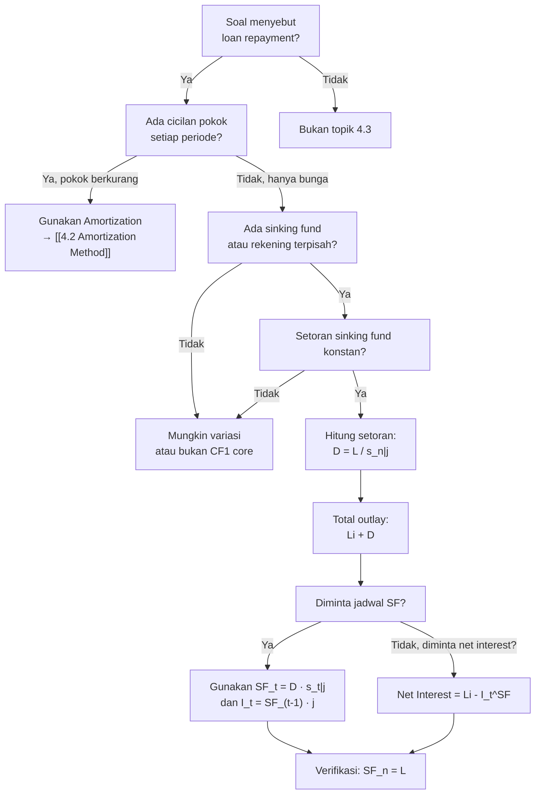

# 📘 4.3 — Sinking Fund Method

> [!ABSTRACT] Ringkasan Cepat
> **Topik:** Sinking Fund Method | **Bobot:** ~5–15% | **Difficulty:** Medium
> **Ref:** Vaaler Bab 5, Kellison Bab 5 | **Prereq:** [[2.1 Annuity-Immediate and Annuity-Due]], [[4.2 Amortization Method]]

## Section 0 — Pemetaan Topik

| Topik CF1 | Sub-topik ID | Skill Diuji | Bobot | Difficulty | Prerequisite | Connected Topics | Referensi |
|-----------|--------------|-------------|-------|------------|--------------|------------------|-----------|
| Topik 4: Pengembalian Pinjaman | 4.3 | Menghitung setoran sinking fund; membuat jadwal akumulasi sinking fund; membandingkan biaya total sinking fund vs amortisasi; menghitung net interest dan gross interest | 5–15% | Medium | [[2.1 Annuity-Immediate and Annuity-Due]], [[4.2 Amortization Method]] | [[4.1 Loan Terminology]], [[2.3 Varying Annuities]], [[5.2 Book Value, Premium and Discount Amortization]] | Vaaler 5.4–5.5; Kellison 5.5–5.6 |

## Section 1 — Intuisi

Bayangkan perusahaan kamu meminjam Rp 1 miliar dari bank untuk membangun pabrik. Bank menuntut bunga 10% per tahun, tetapi **tidak mengharuskan cicilan pokok**—kamu hanya perlu membayar bunga setiap tahun, dan di akhir 5 tahun, kamu harus melunasi **seluruh pokok Rp 1 miliar sekaligus**. Ini disebut **bullet loan** atau interest-only loan.

Tentu saja, melunasi Rp 1 miliar di akhir tahun ke-5 itu menakutkan. Solusinya? Kamu membuka rekening tabungan terpisah (sinking fund) di bank lain yang memberikan bunga 6% per tahun, dan setiap tahun kamu menyetor sejumlah uang tetap ke rekening itu. Setelah 5 tahun, tabunganmu (plus bunga majemuk) akan terkumpul **tepat Rp 1 miliar**, siap untuk melunasi pinjaman.

**Sinking fund method** adalah strategi pelunasan pinjaman di mana:
1. Kamu membayar **bunga saja** kepada pemberi pinjaman setiap periode (tidak ada cicilan pokok).
2. Kamu menyisihkan uang ke rekening terpisah (sinking fund) yang menghasilkan bunga, sehingga akumulasinya di akhir periode sama dengan pokok pinjaman.

Ini berbeda dengan **amortisasi**, di mana setiap pembayaran langsung mengurangi pokok pinjaman. Sinking fund memisahkan fungsi "bayar bunga" dan "siapkan dana pelunasan". Metode ini populer di obligasi korporat dan municipal bonds, di mana emiten ingin fleksibilitas cash flow tetapi tetap menjamin kemampuan membayar pokok di maturity.

Pertanyaan kunci: apakah sinking fund lebih murah atau lebih mahal daripada amortisasi? Jawabannya bergantung pada **perbedaan antara suku bunga pinjaman dan suku bunga sinking fund**. Jika sinking fund memberikan bunga lebih tinggi dari bunga pinjaman (jarang terjadi!), sinking fund lebih murah. Biasanya suku bunga sinking fund lebih rendah, sehingga total biaya sinking fund lebih besar.

## Section 2 — Definisi Formal

> [!NOTE] Definisi Matematis
> **Sinking Fund Method:** Metode pelunasan pinjaman di mana peminjam membayar **hanya bunga** kepada pemberi pinjaman setiap periode, dan secara paralel melakukan **setoran periodik** ke rekening sinking fund yang menghasilkan bunga, sehingga akumulasi sinking fund di akhir periode sama dengan pokok pinjaman.
>
> **Setoran Sinking Fund per Periode:**
> $$
> D = \frac{L}{s_{\overline{n}|j}}
> $$
> di mana $L$ adalah pokok pinjaman, $j$ adalah suku bunga sinking fund per periode, $n$ adalah jumlah periode.
>
> **Total Pembayaran per Periode (Outlay):**
> $$
> \text{Outlay} = Li + D = Li + \frac{L}{s_{\overline{n}|j}}
> $$
> di mana $i$ adalah suku bunga pinjaman per periode.

### Variabel & Parameter

| Simbol | Makna | Unit / Range |
|--------|-------|--------------|
| $L$ | Pokok pinjaman (loan principal) | Mata uang, $L > 0$ |
| $n$ | Jumlah periode pinjaman | Integer, $n \geq 1$ |
| $i$ | Suku bunga pinjaman per periode (loan rate) | Effective rate, $i > 0$ |
| $j$ | Suku bunga sinking fund per periode (sinking fund rate) | Effective rate, $j \geq 0$ |
| $D$ | Setoran sinking fund per periode (deposit) | Mata uang |
| $s_{\overline{n}\|j}$ | Accumulated value of annuity-immediate $n$ periode pada rate $j$ | Faktor akumulasi |
| $\text{Outlay}_t$ | Total pembayaran pada periode $t$ | Mata uang |
| $SF_t$ | Saldo sinking fund setelah setoran periode $t$ | Mata uang, $SF_n = L$ |
| $I_t^{SF}$ | Bunga yang didapat sinking fund pada periode $t$ | Mata uang |

### Rumus Utama

$$
D = \frac{L}{s_{\overline{n}|j}} = L \cdot \frac{j}{(1+j)^n - 1}
$$
**Label:** Setoran sinking fund per periode (annuity-immediate, karena setoran di akhir periode).

$$
\text{Total Outlay per Periode} = Li + D
$$
**Label:** Pembayaran total per periode = bunga pinjaman + setoran sinking fund.

$$
SF_t = D \cdot s_{\overline{t}|j}
$$
**Label:** Saldo sinking fund setelah setoran ke-$t$ (accumulated value dari $t$ setoran).

$$
I_t^{SF} = SF_{t-1} \cdot j
$$
**Label:** Bunga yang didapat sinking fund pada periode $t$ (bunga atas saldo periode sebelumnya).

$$
\text{Net Interest}_t = Li - I_t^{SF}
$$
**Label:** Net interest pada periode $t$ = bunga pinjaman dibayar **minus** bunga yang didapat dari sinking fund.

$$
\text{Equivalent Amortization Rate } i^* : \quad L \cdot \frac{1}{a_{\overline{n}|i^*}} = Li + D
$$
**Label:** Suku bunga ekuivalen jika pembayaran sinking fund diinterpretasikan sebagai pembayaran amortisasi (jarang digunakan di CF1, tetapi penting untuk perbandingan).

### Asumsi Eksplisit

- **Interest-Only Loan:** Pokok pinjaman $L$ **tidak** berkurang selama periode pinjaman; seluruh pokok dilunasi di akhir periode $n$.
- **Equal Periodic Deposits:** Setoran sinking fund $D$ adalah konstan setiap periode (annuity-immediate).
- **Sinking Fund Earns Interest:** Dana di sinking fund menghasilkan bunga efektif $j$ per periode, reinvested secara otomatis.
- **No Withdrawals from Sinking Fund:** Tidak ada penarikan dari sinking fund sebelum periode $n$.
- **Loan Interest Paid Every Period:** Bunga pinjaman $Li$ dibayar penuh setiap periode (tidak ada kapitalisasi bunga pinjaman).

## Section 3 — Jembatan Logika

> [!TIP] Dari Time Diagram ke Equation of Value
> Sinking fund method memisahkan dua cash flow stream:
> 1. **Kepada pemberi pinjaman:** Bunga $Li$ setiap periode dari $t=1$ hingga $t=n$, plus pokok $L$ di $t=n$.
> 2. **Ke sinking fund:** Setoran $D$ setiap periode dari $t=1$ hingga $t=n$, yang terakumulasi menjadi $L$ di $t=n$ untuk membayar pokok.
>
> Mengapa setoran sinking fund adalah $D = L / s_{\overline{n}|j}$? Karena kita butuh **accumulated value dari annuity-immediate sebesar $L$** di waktu $n$:
> $$
> D \cdot s_{\overline{n}|j} = L \quad \Rightarrow \quad D = \frac{L}{s_{\overline{n}|j}}
> $$
> Faktor $s_{\overline{n}|j} = \frac{(1+j)^n - 1}{j}$ adalah accumulated value dari annuity $1$ per periode pada rate $j$.
>
> **Makna ekonomi:** Setoran $D$ lebih kecil dari pembayaran amortisasi (jika $j > 0$), karena bunga majemuk di sinking fund membantu akumulasi. Semakin tinggi $j$, semakin kecil $D$ yang dibutuhkan.

> [!IMPORTANT] Focal Date
> Focal date dipilih di $t = n$ untuk equation of value sinking fund: accumulated value dari setoran harus sama dengan pokok $L$. Untuk analisis biaya total, focal date bisa di $t=0$ (present value) atau $t=n$ (future value).

**Derivasi Setoran Sinking Fund:**

Kita ingin akumulasi sinking fund di akhir periode $n$ sama dengan pokok pinjaman $L$. Setoran $D$ dilakukan di akhir setiap periode (annuity-immediate), dengan suku bunga $j$.

Accumulated value dari annuity-immediate $n$ periode:
$$
FV = D \cdot s_{\overline{n}|j}
$$

Kita syaratkan $FV = L$:
$$
D \cdot s_{\overline{n}|j} = L
$$

Isolasi $D$:
$$
D = \frac{L}{s_{\overline{n}|j}}
$$

Substitusi rumus $s_{\overline{n}|j} = \frac{(1+j)^n - 1}{j}$:
$$
D = L \cdot \frac{j}{(1+j)^n - 1}
$$

**Perbandingan dengan Amortisasi:**

Dalam amortization method, pembayaran per periode adalah:
$$
P_{\text{amort}} = \frac{L}{a_{\overline{n}|i}}
$$

Dalam sinking fund method, total outlay per periode adalah:
$$
\text{Outlay}_{\text{SF}} = Li + D = Li + \frac{L}{s_{\overline{n}|j}}
$$

**Kondisi equivalence:**

Jika $i = j$, maka:
$$
Li + \frac{L}{s_{\overline{n}|i}} = L \left( i + \frac{i}{(1+i)^n - 1} \right) = L \cdot \frac{i(1+i)^n - i + i}{(1+i)^n - 1} = L \cdot \frac{i(1+i)^n}{(1+i)^n - 1}
$$

Dan pembayaran amortisasi:
$$
\frac{L}{a_{\overline{n}|i}} = L \cdot \frac{i}{1 - (1+i)^{-n}} = L \cdot \frac{i(1+i)^n}{(1+i)^n - 1}
$$

Jadi **jika $i = j$, sinking fund method dan amortization method memiliki pembayaran per periode yang sama**.

Jika $j < i$ (sinking fund rate lebih rendah dari loan rate, kasus umum), maka $\text{Outlay}_{\text{SF}} > P_{\text{amort}}$—sinking fund lebih mahal.

Jika $j > i$ (sinking fund rate lebih tinggi, jarang), maka $\text{Outlay}_{\text{SF}} < P_{\text{amort}}$—sinking fund lebih murah.

> [!DANGER] Dilarang
> 1. **Menganggap setoran sinking fund mengurangi pokok pinjaman:** Setoran masuk ke rekening terpisah, **bukan** dibayarkan ke pemberi pinjaman. Pokok pinjaman tetap $L$ sampai periode $n$.
> 2. **Menggunakan suku bunga pinjaman $i$ untuk menghitung setoran sinking fund:** Setoran harus dihitung dengan suku bunga sinking fund $j$. Mixing rates adalah kesalahan fatal.
> 3. **Lupa bahwa bunga pinjaman $Li$ dibayar setiap periode:** Total outlay bukan hanya $D$, tetapi $Li + D$.

## Section 4 — Contoh Soal

### Soal A — Fundamental

Sebuah pinjaman sebesar $10{,}000$ harus dilunasi dalam 5 tahun dengan sinking fund method. Suku bunga pinjaman adalah $8\%$ effective annual, dan sinking fund menghasilkan bunga $6\%$ effective annual. Setoran sinking fund dilakukan di akhir setiap tahun. Hitunglah:
(a) Setoran sinking fund per tahun
(b) Total pembayaran per tahun (outlay)

**Data yang diberikan:**
- Pokok pinjaman $L = 10{,}000$
- Suku bunga pinjaman $i = 8\% = 0.08$
- Suku bunga sinking fund $j = 6\% = 0.06$
- Periode $n = 5$ tahun

> [!SUCCESS] Solusi Soal A
> 
> **1. Identifikasi Variabel**
> - $L = 10{,}000$
> - $i = 0.08$
> - $j = 0.06$
> - $n = 5$
> - Dicari: $D$ dan $\text{Outlay}$
> 
**2. Time Diagram**
> ```
> t=0    t=1    t=2    t=3    t=4    t=5
> |------|------|------|------|------|
> Pinjaman L=10,000 diterima di t=0
> 
> Kepada Lender:
>        800    800    800    800   10,800
>        (bunga Li setiap tahun, plus pokok di t=5)
> 
> Ke Sinking Fund:
>        D      D      D      D      D
>        (setoran konstan, akumulasi → 10,000 di t=5)
> ```
> 
> **3. Equation of Value** *(pada Focal Date $t = 5$)*
> 
> Accumulated value dari setoran sinking fund harus sama dengan pokok:
> $$
> D \cdot s_{\overline{5}|0.06} = 10{,}000
> $$
> 
> Total outlay per tahun:
> $$
> \text{Outlay} = Li + D
> $$
> 
> **4. Eksekusi Aljabar**
> 
> Hitung $s_{\overline{5}|0.06}$:
> $$
> s_{\overline{5}|0.06} = \frac{(1.06)^5 - 1}{0.06}
> $$
> 
> Hitung $(1.06)^5$:
> $$
> (1.06)^5 = 1.3382255776
> $$
> 
> $$
> s_{\overline{5}|0.06} = \frac{1.3382255776 - 1}{0.06} = \frac{0.3382255776}{0.06} = 5.637092960
> $$
> 
> **(a) Setoran sinking fund:**
> $$
> D = \frac{10{,}000}{5.637092960} = 1{,}773.96
> $$
> 
> **(b) Total outlay per tahun:**
> 
> Bunga pinjaman per tahun:
> $$
> Li = 10{,}000 \times 0.08 = 800
> $$
> 
> Total outlay:
> $$
> \text{Outlay} = 800 + 1{,}773.96 = 2{,}573.96
> $$
> 
> **5. Verification**
> 
> Cek akumulasi sinking fund:
> $$
> 1{,}773.96 \times 5.637092960 \approx 10{,}000 \quad \checkmark
> $$
> 
> Logika finansial: Setoran sinking fund $1{,}773.96$ per tahun, plus bunga majemuk 6%, akan terkumpul menjadi $10{,}000$ di tahun ke-5. Total outlay $2{,}573.96$ mencakup bunga pinjaman $800$ plus setoran sinking fund.

> [!WARNING] Exam Tips — Soal A
> **Target waktu:** 2–2.5 menit. **Common trap:** Lupa menambahkan bunga pinjaman $Li$ ke total outlay—hanya menulis $D$ sebagai jawaban. **Shortcut:** Jika $s_{\overline{n}|j}$ tersedia di tabel, gunakan langsung tanpa hitung manual.

---

### Soal B — Exam-Typical

Untuk pinjaman di Soal A, buatlah jadwal sinking fund untuk 2 tahun pertama. Tampilkan: periode, bunga sinking fund, setoran, dan saldo sinking fund.

**Data yang diberikan:**
- Dari Soal A: $L = 10{,}000$, $j = 0.06$, $D = 1{,}773.96$

> [!SUCCESS] Solusi Soal B
> 
> **1. Identifikasi Variabel**
> - $D = 1{,}773.96$
> - $j = 0.06$
> - Periode: $t = 1, 2$
> 
> **2. Time Diagram**
> ```
> t=0    t=1           t=2
> |------|------------|
> SF₀=0  D→SF₁        D→SF₂
>        ↓            ↓
>      SF₁ earns    SF₂ earns
>      interest j   interest j
> ```
> 
> **3. Equation of Value** *(pada Each Period End)*
> 
> Saldo sinking fund setelah setoran periode $t$:
> $$
> SF_t = SF_{t-1}(1+j) + D
> $$
> 
> Bunga sinking fund periode $t$:
> $$
> I_t^{SF} = SF_{t-1} \cdot j
> $$
> 
> **4. Eksekusi Aljabar**
> 
> **Periode 1:**
> - Saldo awal: $SF_0 = 0$
> - Bunga: $I_1^{SF} = 0 \times 0.06 = 0$
> - Setoran: $D = 1{,}773.96$
> - Saldo akhir: $SF_1 = 0 + 1{,}773.96 = 1{,}773.96$
> 
> **Periode 2:**
> - Saldo awal: $SF_1 = 1{,}773.96$
> - Bunga: $I_2^{SF} = 1{,}773.96 \times 0.06 = 106.44$
> - Setoran: $D = 1{,}773.96$
> - Saldo akhir: $SF_2 = 1{,}773.96 + 106.44 + 1{,}773.96 = 3{,}654.36$
> 
> Alternatif untuk $SF_2$ menggunakan rumus:
> $$
> SF_2 = D \cdot s_{\overline{2}|0.06} = 1{,}773.96 \times \frac{(1.06)^2 - 1}{0.06} = 1{,}773.96 \times 2.06 = 3{,}654.36 \quad \checkmark
> $$
> 
> **Tabel Jadwal Sinking Fund:**
> 
>
>
> | Periode ($t$) | Saldo Awal ($SF_{t-1}$) | Bunga SF ($I_t^{SF}$) | Setoran ($D$) | Saldo Akhir ($SF_t$) |
> |---------------|-------------------------|-----------------------|---------------|----------------------|
> | 1 | $0.00$ | $0.00$ | $1{,}773.96$ | $1{,}773.96$ |
> | 2 | $1{,}773.96$ | $106.44$ | $1{,}773.96$ | $3{,}654.36$ |
> 
> **5. Verification**
> 
> Cek $SF_2$ dengan formula:
> $$
> SF_2 = 1{,}773.96 \times s_{\overline{2}|0.06} = 1{,}773.96 \times 2.06 = 3{,}654.36 \quad \checkmark
> $$
> 
> Logika finansial: Saldo sinking fund meningkat setiap periode karena setoran ditambah bunga majemuk. Di periode 1, tidak ada bunga karena saldo awal nol. Di periode 2, bunga $106.44$ adalah 6% dari saldo akhir periode 1.

> [!WARNING] Exam Tips — Soal B
> **Target waktu:** 3–3.5 menit untuk 2 periode. **Common trap:** Lupa menambahkan bunga sebelum menambahkan setoran—urutan hitung harus: saldo awal → bunga → tambah setoran → saldo akhir. **Shortcut:** Gunakan rumus $SF_t = D \cdot s_{\overline{t}|j}$ untuk verifikasi cepat.

---

### Soal C — Challenging

Sebuah pinjaman sebesar $50{,}000$ akan dilunasi dalam 10 tahun. Suku bunga pinjaman adalah $7\%$ effective annual. Jika sinking fund method digunakan dengan sinking fund rate $5\%$, hitunglah:
(a) Total pembayaran per tahun
(b) Net interest pada tahun ke-3
(c) Berapa suku bunga amortisasi ekuivalen jika pembayaran yang sama ($\text{Outlay}$) diinterpretasikan sebagai amortisasi?

**Data yang diberikan:**
- $L = 50{,}000$
- $i = 0.07$ (loan rate)
- $j = 0.05$ (sinking fund rate)
- $n = 10$

> [!SUCCESS] Solusi Soal C
> 
> **1. Identifikasi Variabel**
> - $L = 50{,}000$
> - $i = 0.07$
> - $j = 0.05$
> - $n = 10$
> - Dicari: (a) Outlay, (b) Net interest tahun 3, (c) $i^*$ (amortization equivalent rate)
> 
> **2. Time Diagram**
> ```
> t=0                                      t=10
> |----------------------------------------|
> L=50,000                       Lunasi 50,000
> 
> Bunga pinjaman: 3,500 per tahun (Li)
> Setoran SF: D per tahun (akumulasi → 50,000)
> ```
> 
> **3. Equation of Value** *(pada Focal Date $t = 10$)*
> 
> Setoran sinking fund:
> $$
> D = \frac{L}{s_{\overline{10}|0.05}}
> $$
> 
> Total outlay:
> $$
> \text{Outlay} = Li + D
> $$
> 
> Net interest tahun $t$:
> $$
> \text{Net Interest}_t = Li - I_t^{SF}
> $$
> 
> Amortization equivalent rate $i^*$ memenuhi:
> $$
> \frac{L}{a_{\overline{10}|i^*}} = \text{Outlay}
> $$
> 
> **4. Eksekusi Aljabar**
> 
> **(a) Total Pembayaran per Tahun:**
> 
> Hitung $s_{\overline{10}|0.05}$:
> $$
> s_{\overline{10}|0.05} = \frac{(1.05)^{10} - 1}{0.05}
> $$
> 
> Hitung $(1.05)^{10}$:
> $$
> (1.05)^{10} = 1.628894627
> $$
> 
> $$
> s_{\overline{10}|0.05} = \frac{1.628894627 - 1}{0.05} = \frac{0.628894627}{0.05} = 12.57789254
> $$
> 
> Setoran sinking fund:
> $$
> D = \frac{50{,}000}{12.57789254} = 3{,}975.06
> $$
> 
> Bunga pinjaman per tahun:
> $$
> Li = 50{,}000 \times 0.07 = 3{,}500
> $$
> 
> Total outlay:
> $$
> \text{Outlay} = 3{,}500 + 3{,}975.06 = 7{,}475.06
> $$
> 
> **(b) Net Interest Tahun 3:**
> 
> Hitung saldo sinking fund di akhir tahun 2:
> $$
> SF_2 = D \cdot s_{\overline{2}|0.05} = 3{,}975.06 \times \frac{(1.05)^2 - 1}{0.05}
> $$
> 
> $$
> (1.05)^2 = 1.1025
> $$
> 
> $$
> s_{\overline{2}|0.05} = \frac{1.1025 - 1}{0.05} = \frac{0.1025}{0.05} = 2.05
> $$
> 
> $$
> SF_2 = 3{,}975.06 \times 2.05 = 8{,}148.87
> $$
> 
> Bunga sinking fund tahun 3:
> $$
> I_3^{SF} = SF_2 \times 0.05 = 8{,}148.87 \times 0.05 = 407.44
> $$
> 
> Net interest tahun 3:
> $$
> \text{Net Interest}_3 = 3{,}500 - 407.44 = 3{,}092.56
> $$
> 
> **(c) Suku Bunga Amortisasi Ekuivalen:**
> 
> Kita cari $i^*$ sehingga:
> $$
> \frac{L}{a_{\overline{10}|i^*}} = 7{,}475.06
> $$
> 
> $$
> a_{\overline{10}|i^*} = \frac{50{,}000}{7{,}475.06} = 6.688963
> $$
> 
> Dari tabel atau trial-error, kita cari $i^*$ sehingga $a_{\overline{10}|i^*} = 6.688963$.
> 
> **Trial $i^* = 0.08$ (8%):**
> $$
> a_{\overline{10}|0.08} = \frac{1 - (1.08)^{-10}}{0.08} = \frac{1 - 0.463193}{0.08} = \frac{0.536807}{0.08} = 6.710088
> $$
> 
> **Trial $i^* = 0.085$ (8.5%):**
> $$
> a_{\overline{10}|0.085} = \frac{1 - (1.085)^{-10}}{0.085}
> $$
> 
> Hitung $(1.085)^{10} = 2.267699$, sehingga $(1.085)^{-10} = 0.441079$:
> $$
> a_{\overline{10}|0.085} = \frac{1 - 0.441079}{0.085} = \frac{0.558921}{0.085} = 6.575541
> $$
> 
> Karena $a_{\overline{10}|0.08} = 6.710 > 6.689$ dan $a_{\overline{10}|0.085} = 6.576 < 6.689$, maka $i^*$ berada antara 8% dan 8.5%. Dengan interpolasi linear:
> 
> $$
> i^* \approx 0.08 + \frac{6.710 - 6.689}{6.710 - 6.576} \times 0.005 = 0.08 + \frac{0.021}{0.134} \times 0.005 = 0.08 + 0.00078 \approx 0.0808 = 8.08\%
> $$
> 
> **5. Verification**
> 
> Cek total outlay dengan amortisasi pada $i^* = 8.08\%$:
> $$
> P = \frac{50{,}000}{a_{\overline{10}|0.0808}} \approx \frac{50{,}000}{6.689} = 7{,}475 \quad \checkmark
> $$
> 
> Logika finansial: Total outlay $7{,}475.06$ per tahun dengan sinking fund method ekuivalen dengan amortisasi pada suku bunga sekitar 8.08%, yang lebih tinggi dari loan rate 7% karena sinking fund rate 5% < loan rate 7%. Sinking fund method lebih mahal dalam kasus ini.
> 
> Net interest tahun 3 sebesar $3{,}092.56$ lebih rendah dari bunga pinjaman $3{,}500$ karena sinking fund sudah mulai menghasilkan bunga (efek "subsidi" dari sinking fund).
> 
> [!WARNING] Exam Tips — Soal C
> **Target waktu:** 5–6 menit. **Common trap:** Untuk net interest, lupa bahwa bunga SF dihitung dari saldo **akhir periode sebelumnya**, bukan periode sekarang. **Shortcut:** Untuk equivalent rate, gunakan tabel atau interpolasi linear jika presisi 0.1% cukup.

## Section 5 — Verifikasi & Sanity Check

> [!CHECK] Konsistensi Akumulasi
> 1. **Saldo akhir sinking fund harus sama dengan pokok:** $SF_n = L$. Jika tidak, cek apakah setoran $D$ dihitung salah atau suku bunga berbeda.
> 2. **Saldo sinking fund monoton naik:** $SF_1 < SF_2 < \ldots < SF_n = L$. Jika turun, ada kesalahan perhitungan.

> [!CHECK] Perbandingan Sinking Fund vs Amortisasi
> 1. **Jika $j = i$:** Total outlay sinking fund = pembayaran amortisasi. Jika tidak sama, cek rumus.
> 2. **Jika $j < i$ (kasus umum):** Total outlay sinking fund > pembayaran amortisasi. Ini karena sinking fund rate lebih rendah, sehingga setoran $D$ lebih besar.
> 3. **Jika $j > i$ (rare):** Total outlay sinking fund < pembayaran amortisasi.

> [!CHECK] Net Interest
> 1. **Net interest periode awal:** Mendekati bunga pinjaman $Li$ (karena saldo sinking fund masih kecil, bunga SF negligible).
> 2. **Net interest periode akhir:** Lebih rendah dari $Li$ (karena saldo sinking fund sudah besar, bunga SF signifikan).
> 3. **Net interest total $n$ periode:** Jumlah net interest sama dengan total bunga yang dibayar **net** setelah dikurangi bunga yang didapat dari sinking fund.

### Metode Alternatif

**Menggunakan Sinking Fund Due (Annuity-Due):**

Jika setoran sinking fund dilakukan di **awal periode** (annuity-due), rumus setoran menjadi:
$$
D = \frac{L}{\ddot{s}_{\overline{n}|j}}
$$

Total outlay tetap $Li + D$, tetapi nilai $D$ berbeda karena setoran lebih awal menghasilkan bunga lebih lama.

**Perbandingan:**
- Annuity-immediate (end-of-period): $D = L / s_{\overline{n}|j}$
- Annuity-due (beginning-of-period): $D = L / \ddot{s}_{\overline{n}|j}$

Karena $\ddot{s}_{\overline{n}|j} = s_{\overline{n}|j} \times (1+j) > s_{\overline{n}|j}$, maka $D_{\text{due}} < D_{\text{immediate}}$ (setoran lebih kecil jika dibayar di awal periode).

Di CF1, default adalah annuity-immediate kecuali soal eksplisit menyatakan "beginning-of-period" atau "annuity-due".

## Section 6 — Visualisasi Mental

**Grafik Saldo Sinking Fund vs Waktu:**

Bayangkan grafik dengan **sumbu X = periode $t$** (dari 0 hingga $n$) dan **sumbu Y = saldo sinking fund $SF_t$**. Kurva dimulai dari $(0, 0)$ dan naik secara **konveks** (kurva melengkung ke atas) hingga $(n, L)$.

- **Konveksitas:** Kemiringan kurva (slope) meningkat seiring waktu karena bunga majemuk. Di periode awal, saldo kecil sehingga pertumbuhan lambat. Di periode akhir, saldo besar sehingga bunga signifikan dan pertumbuhan cepat.
- **Garis pembanding:** Jika tidak ada bunga ($j = 0$), kurva akan linear dari $(0, 0)$ ke $(n, L)$. Dengan bunga positif, kurva berada **di atas** garis linear di periode tengah dan akhir.

**Grafik Net Interest vs Waktu:**

Grafik dengan **sumbu X = periode $t$** dan **sumbu Y = net interest $\text{NI}_t$**. Kurva dimulai dari nilai tinggi mendekati $Li$ di $t=1$ dan turun secara **konveks** (melengkung ke bawah) hingga nilai rendah di $t=n$.

- **Periode 1:** $\text{NI}_1 = Li - 0 = Li$ (saldo SF nol, bunga SF nol).
- **Periode $n$:** $\text{NI}_n = Li - I_n^{SF}$, di mana $I_n^{SF}$ signifikan karena $SF_{n-1}$ mendekati $L$.
- **Interpretasi:** Net interest menurun karena sinking fund "menghasilkan kembali" sebagian bunga pinjaman.

**Perbandingan Sinking Fund vs Amortisasi (Bar Chart):**

Untuk setiap periode $t$, bandingkan dua komponen:
- **Sinking fund:** Batang terdiri dari $Li$ (bunga pinjaman, konstan) + $D$ (setoran, konstan).
- **Amortisasi:** Batang terdiri dari bunga (menurun) + pokok (meningkat), total konstan.

Tinggi total batang berbeda jika $i \neq j$.

### Hubungan Visual ↔ Rumus

Slope kurva saldo sinking fund pada periode $t$ adalah:
$$
\text{Slope}_t = D + I_t^{SF} = D + SF_{t-1} \cdot j
$$

Ini adalah **pertambahan saldo** di periode $t$. Slope meningkat seiring $t$ karena $SF_{t-1}$ meningkat.

Kurva $SF_t = D \cdot s_{\overline{t}|j}$ adalah kurva eksponensial (karena $s_{\overline{t}|j}$ melibatkan $(1+j)^t$). Konveksitas visual mencerminkan efek compound interest.

## Section 7 — Jebakan Umum

> [!BUG] Kesalahan Unit Waktu
> **Contoh Salah:** Suku bunga pinjaman diberikan $8\%$ **semiannual** ($i^{(2)} = 0.08$ artinya $4\%$ per semester), tetapi periode dinyatakan dalam tahun ($n = 5$ tahun $= 10$ semesters). Menghitung bunga pinjaman sebagai $L \times 0.08$ per tahun instead of $L \times 0.04$ per semester.
>
> **Benar:** Konversi dulu ke periode konsisten. Jika $n = 10$ semesters, bunga per semester adalah $Li = L \times 0.04$, dan setoran sinking fund menggunakan $j$ per semester.

> [!BUG] Kesalahan Konseptual
> 1. **Menganggap setoran sinking fund mengurangi pokok pinjaman:** Setoran masuk ke **rekening terpisah**, pokok pinjaman tetap $L$ sampai akhir. Ini bukan amortisasi!
> 2. **Menggunakan suku bunga pinjaman $i$ untuk menghitung $D$:** Setoran dihitung dengan $D = L / s_{\overline{n}|j}$, menggunakan **sinking fund rate $j$**, bukan loan rate $i$.
> 3. **Lupa bahwa total outlay termasuk bunga pinjaman:** Hanya menulis $D$ sebagai pembayaran total, padahal total outlay adalah $Li + D$.
> 4. **Menganggap net interest konstan setiap periode:** Net interest **menurun** seiring waktu karena bunga sinking fund meningkat.

> [!BUG] Kesalahan Interpretasi Soal
> **Ambiguitas:** Soal mengatakan "sinking fund with annual deposits" tanpa jelas apakah annuity-immediate atau annuity-due.
>
> **Klarifikasi:** Default CF1 adalah **annuity-immediate** (setoran di akhir periode) kecuali eksplisit disebutkan "beginning-of-year" atau "annuity-due".

> [!CAUTION] Red Flags
> - **"Interest-only loan" atau "bullet loan":** Ini trigger untuk sinking fund method. Jika tidak ada cicilan pokok, kemungkinan besar sinking fund digunakan.
> - **"Sinking fund rate berbeda dari loan rate":** Ini kasus umum. Jangan asumsikan $i = j$ kecuali eksplisit diberikan.
> - **"Net interest":** Ini bukan bunga pinjaman, tetapi bunga pinjaman **minus** bunga sinking fund. Harus ada komponen sinking fund.
> - **"Equivalent amortization rate":** Ini rate hipotetis $i^*$ sehingga pembayaran amortisasi sama dengan outlay sinking fund. Perlu trial-error atau interpolasi.

## Section 8 — Ringkasan Eksekutif

> [!SUMMARY] Must-Remember
> 1. **Setoran sinking fund (annuity-immediate):**
>    $$
>    D = \frac{L}{s_{\overline{n}|j}} = L \cdot \frac{j}{(1+j)^n - 1}
>    $$
> 2. **Total pembayaran per periode:**
>    $$
>    \text{Outlay} = Li + D
>    $$
> 3. **Saldo sinking fund setelah periode $t$:**
>    $$
>    SF_t = D \cdot s_{\overline{t}|j}
>    $$
> 4. **Bunga sinking fund periode $t$:**
>    $$
>    I_t^{SF} = SF_{t-1} \cdot j
>    $$
> 5. **Net interest periode $t$:**
>    $$
>    \text{Net Interest}_t = Li - I_t^{SF}
>    $$

### Kapan Digunakan

- **Trigger keywords:** "sinking fund," "interest-only loan," "bullet loan," "setoran ke rekening terpisah," "akumulasi untuk melunasi pokok."
- **Tipe skenario soal:**
  - Diberikan loan amount, loan rate, sinking fund rate, dan periode → hitung setoran dan total outlay.
  - Buat jadwal sinking fund: saldo, bunga, setoran.
  - Bandingkan biaya total sinking fund vs amortisasi (jika $i \neq j$).
  - Hitung net interest untuk periode tertentu.
  - Cari equivalent amortization rate.

### Kapan TIDAK Boleh Digunakan

- **Jika pokok pinjaman dicicil setiap periode:** Ini amortisasi, bukan sinking fund. Sinking fund hanya untuk interest-only loans.
- **Jika setoran langsung ke pemberi pinjaman:** Ini amortisasi. Sinking fund adalah rekening terpisah yang dikontrol peminjam.
- **Jika tidak ada bunga sinking fund ($j = 0$):** Bisa dihitung tetapi jarang. Setoran menjadi $D = L / n$ (simple division, bukan annuity).

### Quick Decision Tree



---

> [!QUOTE] Follow-up Options
> 1. *"Berikan contoh soal variasi sinking fund dengan annuity-due"*
> 2. *"Jelaskan hubungan [[4.3 Sinking Fund Method]] dengan [[4.2 Amortization Method]]"*
> 3. *"Buat flashcard 1-halaman untuk topik ini"*

*📖 Ref: Vaaler Bab 5, Kellison Bab 5 | 🗓️ 2026-02-17 | #CF1 #SinkingFund #LoanRepayment*
