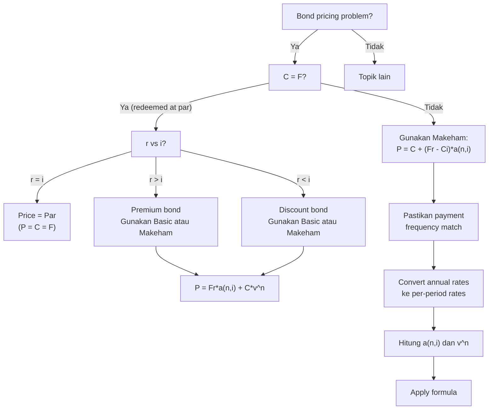

# 📘 5.1 — Bond Pricing

> [!ABSTRACT] Ringkasan Cepat
> **Topik:** Bond Pricing | **Bobot:** ~10–20% | **Difficulty:** Medium
> **Ref:** Vaaler Bab 6, Kellison Bab 6 | **Prereq:** [[1.1 Interest Rates and Discount Rates]], [[2.1 Annuity-Immediate and Annuity-Due]]

## Section 0 — Pemetaan Topik

| Topik CF1 | Sub-topik ID | Skill Diuji | Bobot | Difficulty | Prerequisite | Connected Topics | Referensi |
|-----------|--------------|-------------|-------|------------|--------------|------------------|-----------|
| Topik 5: Model Penentuan Harga Obligasi | 5.1 | Menghitung fair price obligasi dengan coupon; memahami premium vs discount bonds; menggunakan Basic Formula dan Makeham Formula; menghitung price dengan berbagai payment frequency; memahami hubungan coupon rate, yield, dan price | 10–20% | Medium | [[1.1 Interest Rates and Discount Rates]], [[2.1 Annuity-Immediate and Annuity-Due]] | [[5.2 Book Value, Premium and Discount Amortization]], [[5.3 Yield Rate and Coupon Calculations]], [[3.3 Duration (Macaulay and Modified)]] | Vaaler 6, Kellison 6 |

## Section 1 — Intuisi

Bayangkan pemerintah atau perusahaan butuh pinjam uang Rp 100 miliar untuk 10 tahun. Daripada pinjam ke satu bank, mereka menerbitkan **obligasi** (bond): surat utang yang bisa diperdagangkan. Investor yang beli obligasi ini adalah "pemberi pinjaman"—mereka bayar harga tertentu hari ini, terima pembayaran berkala (coupon), dan di akhir periode dapat kembali nilai nominal (face value).

**Bond pricing** menjawab pertanyaan kritis: "Berapa harga fair obligasi ini hari ini?" Jawabannya bergantung pada tiga faktor utama: (1) **coupon rate** (berapa besar pembayaran berkala), (2) **yield rate** atau required return investor (opportunity cost), dan (3) **time to maturity** (berapa lama sampai jatuh tempo). Jika coupon rate lebih tinggi dari yield yang investor minta, obligasi dijual di atas par (premium). Jika sebaliknya, dijual di bawah par (discount).

Intuisi paling penting: **obligasi adalah bundle dari dua cash flow streams**—(1) anuitas coupon payments, dan (2) lump sum redemption value di akhir. Present value obligasi adalah sum dari PV kedua komponen ini. Jika market interest rates naik setelah obligasi diterbitkan, PV turun (obligasi existing jadi kurang menarik karena ada alternatif dengan yield lebih tinggi), sehingga harga obligasi turun. Sebaliknya jika rates turun, harga naik—ini adalah **inverse relationship** antara interest rates dan bond prices.

Formula pricing obligasi di CF1 ada dua bentuk: **Basic Formula** (menjumlahkan PV semua coupon individual + PV redemption) dan **Makeham Formula** (shortcut elegant yang memisahkan redemption value dan "modified coupon"). Keduanya mathematically equivalent, tetapi Makeham sering lebih efisien untuk soal exam karena mengurangi computational steps.

## Section 2 — Definisi Formal

> [!NOTE] Definisi Matematis
> **Bond Price (Basic Formula):**
> $$
> P = Fr \cdot a_{\overline{n}|i} + C \cdot v^n
> $$
> di mana $Fr$ adalah coupon payment per period, $a_{\overline{n}|i}$ adalah PV annuity-immediate factor, $C$ adalah redemption value, dan $v^n$ adalah discount factor untuk $n$ periods.
>
> **Makeham Formula:**
> $$
> P = C + (Fr - Ci) \cdot a_{\overline{n}|i}
> $$
> atau equivalently:
> $$
> P = C \cdot v^n + (Fr - Ci) \cdot a_{\overline{n}|i}
> $$
>
> **Modified Coupon Rate $g$:**
> $$
> Fr = Cg \quad \Rightarrow \quad P = C \left[ g \cdot a_{\overline{n}|i} + v^n \right]
> $$

### Variabel & Parameter

| Simbol | Makna | Unit / Range |
|--------|-------|--------------|
| $P$ | Bond price (fair value hari ini) | Mata uang |
| $F$ | Face value (par value) | Mata uang |
| $C$ | Redemption value (amount paid at maturity) | Mata uang, biasanya $C = F$ |
| $r$ | Coupon rate per period | Decimal, dihitung dari $F$ |
| $Fr$ | Coupon payment per period | Mata uang |
| $i$ | Yield rate (required return per period) | Decimal |
| $n$ | Number of coupon periods until maturity | Integer, $n \geq 1$ |
| $v$ | Discount factor $= 1/(1+i)$ | $0 < v < 1$ |
| $a_{\overline{n}\|i}$ | PV annuity-immediate factor | $(1 - v^n)/i$ |
| $g$ | Modified coupon rate: $Fr = Cg$ | Decimal |

### Rumus Utama

$$
P = Fr \cdot a_{\overline{n}|i} + C \cdot v^n
$$
**Label:** Basic bond pricing formula (PV of coupons + PV of redemption).

$$
a_{\overline{n}|i} = \frac{1 - v^n}{i}
$$
**Label:** Annuity-immediate factor untuk coupon stream.

$$
P = C + (Fr - Ci) \cdot a_{\overline{n}|i}
$$
**Label:** Makeham Formula (algebraic rearrangement, useful saat $C \neq F$).

$$
P = C \left[ g \cdot a_{\overline{n}|i} + v^n \right]
$$
**Label:** Bond price dalam bentuk modified coupon rate $g$ (dengan $Fr = Cg$).

**Premium, Par, Discount:**
$$
\begin{cases}
P > C & \Leftrightarrow & r > i & \text{(Premium)} \\
P = C & \Leftrightarrow & r = i & \text{(Par)} \\
P < C & \Leftrightarrow & r < i & \text{(Discount)}
\end{cases}
$$
**Label:** Relationship antara coupon rate, yield, dan price.

### Asumsi Eksplisit

- **Discrete Coupon Payments:** Coupon dibayar di akhir setiap period (annuity-immediate), bukan continuous atau beginning-of-period.
- **Constant Yield Rate:** Yield $i$ konstan selama life of bond (flat term structure).
- **No Default Risk:** Issuer pasti bayar semua coupons dan redemption value (risk-free or investment-grade).
- **No Transaction Costs:** Investor bisa buy/sell bonds tanpa fees atau taxes.
- **Reinvestment at Yield:** Coupon payments bisa di-reinvest di rate $i$ (implicit dalam annuity formula).

## Section 3 — Jembatan Logika

> [!TIP] Dari Time Diagram ke Equation of Value
> Bond menghasilkan dua tipe cash flows:
> 1. **Coupon payments:** $Fr$ di $t=1, 2, \ldots, n$ (annuity-immediate)
> 2. **Redemption value:** $C$ di $t=n$ (lump sum)
>
> **Time diagram:**
> ```
> t=0         t=1      t=2            t=n-1    t=n
> |-----------|--------|--...---------|--------|
> P (price)   Fr       Fr             Fr       Fr + C
> ```
>
> Present value di $t=0$:
> - PV of coupons: $Fr \cdot v + Fr \cdot v^2 + \cdots + Fr \cdot v^n = Fr \cdot a_{\overline{n}|i}$
> - PV of redemption: $C \cdot v^n$
>
> Total: $P = Fr \cdot a_{\overline{n}|i} + C \cdot v^n$ (Basic Formula)
>
> **Makna ekonomi $Fr \cdot a_{\overline{n}|i}$:** Nilai sekarang dari stream coupon payments (anuitas).
>
> **Makna ekonomi $C \cdot v^n$:** Nilai sekarang dari lump sum redemption (discounted principal).

> [!IMPORTANT] Focal Date
> Focal date dipilih di $t=0$ (hari ini, saat bond dibeli). Semua future cash flows di-discount ke $t=0$ menggunakan yield rate $i$.

**Derivasi Makeham Formula dari Basic Formula:**

Mulai dari Basic Formula:
$$
P = Fr \cdot a_{\overline{n}|i} + C \cdot v^n
$$

Tambah dan kurangi $C \cdot a_{\overline{n}|i}$:
$$
P = Fr \cdot a_{\overline{n}|i} + C \cdot v^n + C \cdot a_{\overline{n}|i} - C \cdot a_{\overline{n}|i}
$$

Regroup:
$$
P = (Fr \cdot a_{\overline{n}|i} + C \cdot a_{\overline{n}|i}) + C \cdot v^n - C \cdot a_{\overline{n}|i}
$$

Factor out $a_{\overline{n}|i}$:
$$
P = (Fr + C) \cdot a_{\overline{n}|i} + C \cdot v^n - C \cdot a_{\overline{n}|i}
$$

Wait, let me redo this more carefully. The standard derivation:

Start:
$$
P = Fr \cdot a_{\overline{n}|i} + C \cdot v^n
$$

Add and subtract $Ci \cdot a_{\overline{n}|i}$:
$$
P = Fr \cdot a_{\overline{n}|i} - Ci \cdot a_{\overline{n}|i} + Ci \cdot a_{\overline{n}|i} + C \cdot v^n
$$

Factor first two terms:
$$
P = (Fr - Ci) \cdot a_{\overline{n}|i} + Ci \cdot a_{\overline{n}|i} + C \cdot v^n
$$

Use identity $a_{\overline{n}|i} = \frac{1 - v^n}{i}$, so $i \cdot a_{\overline{n}|i} = 1 - v^n$:
$$
Ci \cdot a_{\overline{n}|i} = C(1 - v^n) = C - C \cdot v^n
$$

Substitute:
$$
P = (Fr - Ci) \cdot a_{\overline{n}|i} + C - C \cdot v^n + C \cdot v^n
$$

The $C \cdot v^n$ terms cancel:
$$
P = C + (Fr - Ci) \cdot a_{\overline{n}|i}
$$

**This is Makeham Formula!**

**Intuisi Makeham:**
- $C$ adalah redemption value di akhir (tetapi evaluated at $t=0$, ini seperti "base price")
- $(Fr - Ci)$ adalah "excess coupon"—selisih antara actual coupon $Fr$ dan "theoretical coupon if bond priced at par" which would be $Ci$
- $a_{\overline{n}|i}$ mengkonversi excess coupon stream ke present value

**Premium vs Discount Analysis:**

Jika $r > i$: $Fr > Ci \Rightarrow Fr - Ci > 0 \Rightarrow P > C$ (Premium)

Jika $r = i$: $Fr = Ci \Rightarrow Fr - Ci = 0 \Rightarrow P = C$ (Par)

Jif $r < i$: $Fr < Ci \Rightarrow Fr - Ci < 0 \Rightarrow P < C$ (Discount)

> [!DANGER] Dilarang
> 1. **Confusing $F$ (face value) dengan $C$ (redemption value):** Biasanya sama ($C = F$), tetapi bisa berbeda. Always check soal!
> 2. **Menggunakan $r$ sebagai discount rate:** $r$ adalah coupon rate (determines cash flow), $i$ adalah yield rate (determines discounting). Mereka berbeda!
> 3. **Lupa bahwa coupon dihitung dari $F$, bukan $C$:** Coupon payment $= Fr$ (based on face value), meskipun redeemed di $C$.

## Section 4 — Contoh Soal

### Soal A — Fundamental

Obligasi dengan face value Rp 1.000.000 dan coupon rate 8% per tahun (dibayar annually) akan mature dalam 5 tahun. Redemption value sama dengan face value. Jika yield rate yang required investor adalah 10% per tahun, hitunglah:
(a) Harga obligasi menggunakan Basic Formula
(b) Harga obligasi menggunakan Makeham Formula
(c) Apakah obligasi dijual premium, par, atau discount?

**Data yang diberikan:**
- Face value $F = 1.000.000$
- Coupon rate $r = 0.08$ (annually)
- $n = 5$ years
- Redemption value $C = F = 1.000.000$
- Yield rate $i = 0.10$

> [!SUCCESS] Solusi Soal A
> 
> **1. Identifikasi Variabel**
> - $F = 1.000.000$
> - $r = 0.08$
> - Coupon payment: $Fr = 1.000.000 \times 0.08 = 80.000$ per tahun
> - $C = 1.000.000$
> - $i = 0.10$
> - $n = 5$
> - $v = 1/(1.10) = 0.909091$
> - Dicari: (a) $P$ (Basic), (b) $P$ (Makeham), (c) Premium/Par/Discount
> 
> **2. Time Diagram**
> ```
> t=0         t=1       t=2       t=3       t=4       t=5
> |-----------|---------|---------|---------|---------|
> P=?         80,000    80,000    80,000    80,000    80,000 + 1,000,000
> ```
> 
> **3. Equation of Value** *(pada Focal Date $t = 0$)*
> 
> **(a) Basic Formula:**
> $$
> P = Fr \cdot a_{\overline{5}|0.10} + C \cdot v^5
> $$
> 
> **(b) Makeham Formula:**
> $$
> P = C + (Fr - Ci) \cdot a_{\overline{5}|0.10}
> $$
> 
> **4. Eksekusi Aljabar**
> 
> Hitung annuity factor:
> $$
> a_{\overline{5}|0.10} = \frac{1 - v^5}{i} = \frac{1 - (1.10)^{-5}}{0.10}
> $$
> 
> $$
> v^5 = (1.10)^{-5} = \frac{1}{1.61051} \approx 0.620921
> $$
> 
> $$
> a_{\overline{5}|0.10} = \frac{1 - 0.620921}{0.10} = \frac{0.379079}{0.10} = 3.79079
> $$
> 
> **(a) Basic Formula:**
> 
> $$
> P = 80.000 \times 3.79079 + 1.000.000 \times 0.620921
> $$
> 
> $$
> P = 303.263 + 620.921 = 924.184
> $$
> 
> Harga obligasi = **Rp 924.184**
> 
> **(b) Makeham Formula:**
> 
> $$
> Ci = 1.000.000 \times 0.10 = 100.000
> $$
> 
> $$
> Fr - Ci = 80.000 - 100.000 = -20.000
> $$
> 
> $$
> P = 1.000.000 + (-20.000) \times 3.79079
> $$
> 
> $$
> P = 1.000.000 - 75.816 = 924.184
> $$
> 
> **Same answer!** Rp 924.184 ✓
> 
> **(c) Premium/Par/Discount:**
> 
> $P = 924.184 < C = 1.000.000$
> 
> **Discount bond** (karena $r = 8\% < i = 10\%$)
> 
> **5. Verification**
> 
> Cek coupon vs yield: $r = 8\% < i = 10\%$ → expect discount ✓
> 
> Cek kedua formula: Basic dan Makeham give same price ✓
> 
> Logika finansial: Obligasi membayar coupon 8% tetapi investor require 10% yield. Karena coupon terlalu rendah, investor hanya mau beli jika harga di bawah par (discount). Mereka bayar Rp 924.184, terima Rp 80k per tahun selama 5 tahun + Rp 1 juta di akhir, yang memberikan total return 10% per tahun.
> 
> [!WARNING] Exam Tips — Soal A
> **Target waktu:** 3–4 menit. **Common trap:** Lupa hitung $a_{\overline{n}|i}$ dengan benar—pakai formula salah atau round terlalu cepat. **Shortcut:** Use financial calculator atau memorize annuity factors untuk common $n$ dan $i$.

---

### Soal B — Exam-Typical

Obligasi dengan face value Rp 5.000.000, coupon rate 6% (paid semiannually), maturity 10 tahun. Redemption value 105% of face value (Rp 5.250.000). Yield rate 7% per tahun (convertible semiannually). Hitunglah harga obligasi.

**Data yang diberikan:**
- $F = 5.000.000$
- $r = 0.06$ per tahun, paid semiannually → $r_{\text{semi}} = 0.06/2 = 0.03$ per semester
- $n = 10$ years = 20 semesters
- $C = 1.05 \times F = 5.250.000$
- $i = 0.07$ per tahun, convertible semiannually → $i_{\text{semi}} = 0.07/2 = 0.035$ per semester

> [!SUCCESS] Solusi Soal B
> 
> **1. Identifikasi Variabel**
> - $F = 5.000.000$
> - Coupon rate per period: $r = 0.03$ (semiannual)
> - Coupon payment: $Fr = 5.000.000 \times 0.03 = 150.000$ per semester
> - $C = 5.250.000$
> - Yield per period: $i = 0.035$ (semiannual)
> - Number of periods: $n = 20$ semesters
> - $v = 1/(1.035) \approx 0.966184$
> - Dicari: $P$
> 
> **2. Time Diagram**
> ```
> t=0    t=1    t=2         t=19     t=20 (semesters)
> |------|------|--...------|--------|
> P=?    150k   150k        150k     150k + 5.25M
> ```
> 
> **3. Equation of Value** *(pada Focal Date $t = 0$)*
> 
> Gunakan Makeham Formula (lebih efisien karena $C \neq F$):
> $$
> P = C + (Fr - Ci) \cdot a_{\overline{20}|0.035}
> $$
> 
> **4. Eksekusi Aljabar**
> 
> Hitung annuity factor:
> $$
> v^{20} = (1.035)^{-20}
> $$
> 
> Gunakan logaritma atau calculator:
> $$
> (1.035)^{20} = 1.98979
> $$
> $$
> v^{20} = 1 / 1.98979 \approx 0.502566
> $$
> 
> $$
> a_{\overline{20}|0.035} = \frac{1 - 0.502566}{0.035} = \frac{0.497434}{0.035} = 14.21240
> $$
> 
> Hitung excess coupon:
> $$
> Ci = 5.250.000 \times 0.035 = 183.750
> $$
> 
> $$
> Fr - Ci = 150.000 - 183.750 = -33.750
> $$
> 
> Apply Makeham:
> $$
> P = 5.250.000 + (-33.750) \times 14.21240
> $$
> 
> $$
> P = 5.250.000 - 479.669 = 4.770.331
> $$
> 
> Harga obligasi = **Rp 4.770.331**
> 
> **5. Verification**
> 
> Cek coupon vs yield: $r_{\text{semi}} = 3\% < i_{\text{semi}} = 3.5\%$ → expect $P < C$ (discount) ✓
> 
> Actual: $P = 4.770.331 < C = 5.250.000$ ✓
> 
> Logika finansial: Meskipun redemption value premium (Rp 5.25M > Rp 5M), coupon rate (3% semi) lebih rendah dari yield required (3.5% semi), jadi obligasi tetap traded at discount terhadap redemption value. Investor bayar Rp 4.77M, terima Rp 150k setiap semester + Rp 5.25M di akhir, total yield 7% per tahun.
> 
> [!WARNING] Exam Tips — Soal B
> **Target waktu:** 4–5 menit. **Common trap:** Lupa convert annual rates ke semiannual (atau frekuensi lain)—pakai $r$ dan $i$ annual langsung padahal payments semiannual. **Shortcut:** Jika $C \neq F$, Makeham Formula lebih clean daripada Basic.

---

### Soal C — Challenging

Dua obligasi dengan characteristics identik kecuali coupon rates:
- **Bond X:** Face value Rp 10.000.000, coupon rate 9% annually, maturity 8 tahun
- **Bond Y:** Face value Rp 10.000.000, coupon rate 11% annually, maturity 8 tahun
- Keduanya redeemed at par. Yield rate market saat ini 10% annually.

Hitunglah:
(a) Harga Bond X dan Bond Y
(b) Selisih harga antara kedua obligasi
(c) Jika yield rate turun dari 10% menjadi 9%, berapa persen kenaikan harga masing-masing obligasi?

**Data yang diberikan:**
- Bond X: $F = 10.000.000$, $r_X = 0.09$, $n = 8$, $C = F$, $i = 0.10$
- Bond Y: $F = 10.000.000$, $r_Y = 0.11$, $n = 8$, $C = F$, $i = 0.10$

> [!SUCCESS] Solusi Soal C
> 
> **1. Identifikasi Variabel**
> - Bond X: $Fr_X = 10.000.000 \times 0.09 = 900.000$
> - Bond Y: $Fr_Y = 10.000.000 \times 0.11 = 1.100.000$
> - $C = 10.000.000$ (both)
> - $n = 8$ (both)
> - Initial yield $i = 0.10$
> - New yield $i' = 0.09$
> - Dicari: (a) $P_X, P_Y$, (b) $P_Y - P_X$, (c) % change saat yield turun
> 
> **2. Time Diagram**
> 
> Bond X dan Y sama struktur, beda coupon amount saja.
> 
> **3. Equation of Value** *(pada Focal Date $t = 0$)*
> 
> Gunakan Makeham Formula:
> $$
> P = C + (Fr - Ci) \cdot a_{\overline{8}|i}
> $$
> 
> **4. Eksekusi Aljabar**
> 
> **(a) Initial Prices (at $i = 0.10$):**
> 
> Hitung annuity factor:
> $$
> v^8 = (1.10)^{-8} = 1/(2.14359) \approx 0.466507
> $$
> 
> $$
> a_{\overline{8}|0.10} = \frac{1 - 0.466507}{0.10} = \frac{0.533493}{0.10} = 5.33493
> $$
> 
> **Bond X:**
> $$
> Ci = 10.000.000 \times 0.10 = 1.000.000
> $$
> $$
> Fr_X - Ci = 900.000 - 1.000.000 = -100.000
> $$
> $$
> P_X = 10.000.000 + (-100.000) \times 5.33493
> $$
> $$
> P_X = 10.000.000 - 533.493 = 9.466.507
> $$
> 
> **Bond Y:**
> $$
> Fr_Y - Ci = 1.100.000 - 1.000.000 = 100.000
> $$
> $$
> P_Y = 10.000.000 + 100.000 \times 5.33493
> $$
> $$
> P_Y = 10.000.000 + 533.493 = 10.533.493
> $$
> 
> **(b) Price Difference:**
> $$
> P_Y - P_X = 10.533.493 - 9.466.507 = 1.066.986
> $$
> 
> Selisih = **Rp 1.066.986**
> 
> **(c) Price Change saat Yield turun ke 9%:**
> 
> Hitung new annuity factor at $i' = 0.09$:
> $$
> v'^8 = (1.09)^{-8} = 1/(1.99256) \approx 0.501866
> $$
> 
> $$
> a_{\overline{8}|0.09} = \frac{1 - 0.501866}{0.09} = \frac{0.498134}{0.09} = 5.53482
> $$
> 
> **Bond X at $i' = 0.09$:**
> $$
> Ci' = 10.000.000 \times 0.09 = 900.000
> $$
> $$
> Fr_X - Ci' = 900.000 - 900.000 = 0
> $$
> $$
> P_X' = 10.000.000 + 0 = 10.000.000
> $$
> 
> **Bond X price change:**
> $$
> \frac{P_X' - P_X}{P_X} = \frac{10.000.000 - 9.466.507}{9.466.507} = \frac{533.493}{9.466.507} \approx 0.0564 \quad (5.64\%)
> $$
> 
> **Bond Y at $i' = 0.09$:**
> $$
> Fr_Y - Ci' = 1.100.000 - 900.000 = 200.000
> $$
> $$
> P_Y' = 10.000.000 + 200.000 \times 5.53482
> $$
> $$
> P_Y' = 10.000.000 + 1.106.964 = 11.106.964
> $$
> 
> **Bond Y price change:**
> $$
> \frac{P_Y' - P_Y}{P_Y} = \frac{11.106.964 - 10.533.493}{10.533.493} = \frac{573.471}{10.533.493} \approx 0.0544 \quad (5.44\%)
> $$
> 
> **5. Verification**
> 
> Cek Bond X: at $i=9\%$, coupon rate = yield rate → price = par (Rp 10M) ✓
> 
> Cek symmetry: Bond X discount, Bond Y premium, selisih symmetric around par.
> 
> Logika finansial: Saat yield turun, bond prices naik (inverse relationship). Bond X naik 5.64% (dari discount ke par), Bond Y naik 5.44% (premium makin besar). Persentase kenaikan hampir sama karena duration effect similar untuk bonds dengan maturity sama.
> 
> [!WARNING] Exam Tips — Soal C
> **Target waktu:** 6–7 menit. **Common trap:** Recalculate $a_{\overline{n}|i}$ untuk setiap bond padahal $n$ dan $i$ sama—waste time. Calculate once, use for both. **Shortcut:** Jika coupon rate = yield rate, price automatically = par (no calculation needed).

## Section 5 — Verifikasi & Sanity Check

> [!CHECK] Premium/Par/Discount Logic
> 1. **If $r > i$:** Bond sells at premium ($P > C$) karena coupon "terlalu tinggi" dibanding market yield.
> 2. **If $r = i$:** Bond sells at par ($P = C$) karena coupon exactly matches required yield.
> 3. **If $r < i$:** Bond sells at discount ($P < C$) karena coupon "terlalu rendah" dibanding market yield.

> [!CHECK] Formula Equivalence
> 1. **Basic = Makeham:** Kedua formula harus give same answer untuk input sama.
> 2. **At maturity ($t=n$):** Bond price converges to redemption value $C$ regardless of initial premium/discount.

> [!CHECK] Boundary Cases
> 1. **Zero-coupon bond ($r=0$):** $P = C \cdot v^n$ (hanya redemption value, no coupons).
> 2. **Perpetual bond ($n \to \infty$):** $P = Fr/i$ (only coupon stream, redemption value → 0).
> 3. **As $i \to 0$:** $P \to Fr \cdot n + C$ (no discounting, sum of all cash flows).

### Metode Alternatif

**PV Each Coupon Individually (tanpa annuity formula):**
$$
P = Fr \cdot v + Fr \cdot v^2 + \cdots + Fr \cdot v^n + C \cdot v^n
$$

Useful jika $n$ kecil atau jika yield rate berubah tiap period.

**Modified Coupon Approach:**

Jika $Fr = Cg$ (define modified coupon rate $g$):
$$
P = C \left[ g \cdot a_{\overline{n}|i} + v^n \right]
$$

Useful saat $C$ adalah convenient round number.

**Price Change Formula (duration approximation - [[3.3 Duration (Macaulay and Modified)]]):**
$$
\frac{\Delta P}{P} \approx -D_{\text{Mod}} \cdot \Delta i
$$

Rough estimate untuk small yield changes (not exact, but exam-relevant).

## Section 6 — Visualisasi Mental

**Bond Price vs Yield Curve:**

Grafik dengan **sumbu X = yield rate $i$**, **sumbu Y = bond price $P$**.

Kurva **convex** (melengkung ke atas), menurun:
- **Left side (low $i$):** High bond prices (steep slope)
- **Right side (high $i$):** Low bond prices (flatter slope)
- **Crossover point:** At $i = r$, price = par ($P = C$)

**Key features:**
- **Inverse relationship:** Higher yield → lower price
- **Convexity:** Curvature indicates that price increase when yield drops > price decrease when yield rises (by same magnitude)
- **Asymptotic:** As $i \to \infty$, $P \to 0$. As $i \to 0$, $P \to Fr \cdot n + C$.

**Premium/Discount over Time:**

Grafik dengan **sumbu X = time to maturity**, **sumbu Y = bond price**.

**Premium bond ($r > i$):**
- Starts above par
- Price declines over time (amortizes down)
- Converges to $C$ at maturity

**Discount bond ($r < i$):**
- Starts below par
- Price increases over time (accretes up)
- Converges to $C$ at maturity

**Par bond ($r = i$):**
- Stays at par throughout life

### Hubungan Visual ↔ Rumus

**Slope of price-yield curve:**
$$
\frac{dP}{di} = -Fr \cdot \frac{d a_{\overline{n}|i}}{di} - C \cdot n \cdot v^{n+1}
$$

Negative slope confirms inverse relationship.

**Curvature (convexity):**
$$
\frac{d^2P}{di^2} > 0
$$

Positive convexity berarti price increases accelerate when yields drop, price decreases decelerate when yields rise.

## Section 7 — Jebakan Umum

> [!BUG] Kesalahan Unit Waktu
> **Contoh Salah:** Bond pays coupons semiannually, maturity 5 years. Menggunakan $n=5$ instead of $n=10$ periods.
>
> **Benar:** Convert years ke number of coupon periods: semiannual → $n = 5 \times 2 = 10$ periods. Convert annual rates ke per-period rates: $r_{\text{semi}} = r_{\text{annual}}/2$, $i_{\text{semi}} = i_{\text{annual}}/2$.

> [!BUG] Kesalahan Konseptual
> 1. **Coupon rate = yield rate (SALAH jika $P \neq C$):** $r = i$ hanya berarti $P = C$ (par). Jika soal bilang $P \neq C$, maka $r \neq i$.
> 2. **Face value = redemption value (not always!):** Default adalah $C = F$, tetapi beberapa bonds redeemed at premium ($C > F$) atau discount ($C < F$). Always check.
> 3. **Makeham Formula hanya untuk $C = F$ (SALAH):** Makeham works untuk any $C$, tidak harus = $F$.
> 4. **Price increases over time (SALAH untuk premium bonds):** Premium bonds amortize down to par. Discount bonds accrete up to par.

> [!BUG] Kesalahan Interpretasi Soal
> **Ambiguitas:** "Coupon rate 8%" tanpa jelas annually atau per period.
>
> **Klarifikasi:** Default adalah **annual coupon rate**. Jika payments semiannual, coupon per period = annual rate / 2.

> [!CAUTION] Red Flags
> - **"Convertible semiannually/quarterly":** Ini tentang yield rate $i$, bukan coupon. Convert $i_{\text{annual}}$ ke per-period rate.
> - **"Redeemed at $X\%$ of par":** Redemption value $C = X\% \times F$, tidak selalu = $F$.
> - **"Callable bond":** [BEYOND CF1] Issuer bisa redeem early. Standard CF1 assume no call provision.
> - **"Yield to maturity" vs "current yield":** YTM adalah $i$ di formula pricing. Current yield = $Fr/P$ (different concept, simpler).

## Section 8 — Ringkasan Eksekutif

> [!SUMMARY] Must-Remember
> 1. **Basic Formula:**
>    $$
>    P = Fr \cdot a_{\overline{n}|i} + C \cdot v^n
>    $$
> 2. **Makeham Formula:**
>    $$
>    P = C + (Fr - Ci) \cdot a_{\overline{n}|i}
>    $$
> 3. **Premium/Par/Discount:**
>    $$
>    r > i \Rightarrow P > C \quad (\text{Premium})
>    $$
>    $$
>    r = i \Rightarrow P = C \quad (\text{Par})
>    $$
>    $$
>    r < i \Rightarrow P < C \quad (\text{Discount})
>    $$
> 4. **Annuity factor:**
>    $$
>    a_{\overline{n}|i} = \frac{1 - v^n}{i}
>    $$
> 5. **Inverse price-yield relationship:** Higher $i$ → Lower $P$ (convex curve).

### Kapan Digunakan

- **Trigger keywords:** "bond price," "fair value," "coupon," "yield to maturity," "face value," "redemption value," "premium," "discount," "par."
- **Tipe skenario soal:**
  - Calculate fair price given coupon rate, yield, maturity.
  - Determine if bond sells at premium, par, or discount.
  - Compare prices dengan different coupon rates atau yields.
  - Analyze effect of yield changes on price.
  - Semiannual atau quarterly coupon payments (frequency mismatch).

### Kapan TIDAK Boleh Digunakan

- **Jika yield rate berubah tiap period:** Need varying interest rate methods ([[2.6 Varying Interest Rates]]).
- **Jika bond callable atau putable:** Standard formula assume held to maturity. Callable/putable bonds need option-adjusted pricing [BEYOND CF1].
- **Jika default risk significant:** Formula assume risk-free atau investment-grade. High-yield (junk) bonds need credit spread adjustment [BEYOND CF1].

### Quick Decision Tree



---

> [!QUOTE] Follow-up Options
> 1. *"Berikan contoh soal variasi dengan quarterly coupon payments"*
> 2. *"Jelaskan hubungan [[5.1 Bond Pricing]] dengan [[5.2 Book Value, Premium and Discount Amortization]]"*
> 3. *"Buat flashcard 1-halaman untuk topik ini"*

*📖 Ref: Vaaler Bab 6, Kellison Bab 6 | 🗓️ 2026-02-17 | #CF1 #BondPricing #Premium #Discount #Makeham*
