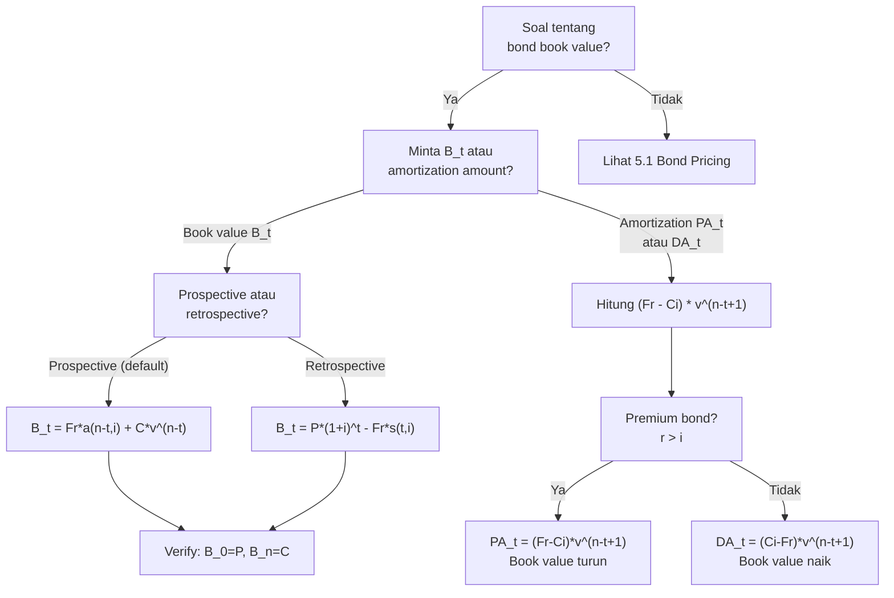

# 📘 5.2 — Book Value, Premium and Discount Amortization

> [!ABSTRACT] Ringkasan Cepat
> **Topik:** Book Value, Premium and Discount Amortization | **Bobot:** ~10–20% | **Difficulty:** Medium
> **Ref:** Vaaler Bab 6, Kellison Bab 6 | **Prereq:** [[5.1 Bond Pricing]], [[4.2 Amortization Method]]

## Section 0 — Pemetaan Topik

| Topik CF1 | Sub-topik ID | Skill Diuji | Bobot | Difficulty | Prerequisite | Connected Topics | Referensi |
|-----------|--------------|-------------|-------|------------|--------------|------------------|-----------|
| Topik 5: Model Penentuan Harga Obligasi | 5.2 | Menghitung book value $B_t$ pada waktu $t$ (prospektif & retrospektif); menyusun amortization schedule; menghitung amortization of premium dan accumulation of discount; memahami write-up vs write-down; menghitung interest earned vs coupon received | 10–20% | Medium | [[5.1 Bond Pricing]], [[4.2 Amortization Method]] | [[5.1 Bond Pricing]], [[5.3 Yield Rate and Coupon Calculations]], [[4.2 Amortization Method]] | Vaaler 6, Kellison 6 |

## Section 1 — Intuisi

Bayangkan kamu membeli obligasi premium seharga Rp 1.050.000 (di atas par Rp 1.000.000). Kamu tahu bahwa di akhir masa obligasi, kamu hanya akan menerima Rp 1.000.000 (redemption value). Artinya, kamu akan "rugi" Rp 50.000 dibanding harga beli—tetapi ini sudah diperhitungkan karena coupon yang kamu terima lebih besar dari yield yang kamu minta. **Book value** adalah cara untuk melacak bagaimana nilai obligasi ini bergerak dari harga beli (Rp 1.050.000) menuju redemption value (Rp 1.000.000) secara bertahap selama masa obligasi.

Untuk **premium bond** ($P > C$), book value *turun* setiap periode—proses ini disebut **amortization of premium** (write-down). Setiap periode, sebagian coupon yang diterima bukan "bunga murni" melainkan pengembalian sebagian premium yang sudah dibayar di awal. Untuk **discount bond** ($P < C$), book value *naik* setiap periode—proses ini disebut **accumulation of discount** (write-up). Setiap periode, bunga yang "seharusnya" diterima lebih besar dari coupon aktual, dan selisihnya ditambahkan ke book value.

Konsep ini penting karena dalam akuntansi dan pelaporan keuangan, nilai obligasi di neraca tidak dicatat sebagai harga beli tetap, melainkan sebagai **book value yang bergerak** mendekati redemption value. Ini juga relevan untuk menghitung **interest earned** (yield × book value) vs **coupon received** (fixed amount), dan selisihnya adalah amortization/accumulation amount. Di ujian CF1, soal sering meminta book value pada periode tertentu tanpa harus menyusun seluruh jadwal—di sinilah formula prospektif dan retrospektif sangat berguna.

## Section 2 — Definisi Formal

> [!NOTE] Definisi Matematis
> **Book Value pada waktu $t$ (Prospective Method):**
> $$
> B_t = Fr \cdot a_{\overline{n-t}|i} + C \cdot v^{n-t}
> $$
> (PV dari sisa coupon payments + PV redemption, dihitung dari $t$ ke $n$)
>
> **Book Value pada waktu $t$ (Retrospective Method):**
> $$
> B_t = P \cdot (1+i)^t - Fr \cdot s_{\overline{t}|i}
> $$
> (Accumulated price minus accumulated coupons paid so far)
>
> **Amortization of Premium per period $t$:**
> $$
> PA_t = (Fr - Ci) \cdot v^{n-t+1}
> $$
>
> **Accumulation of Discount per period $t$:**
> $$
> DA_t = (Ci - Fr) \cdot v^{n-t+1}
> $$

### Variabel & Parameter

| Simbol | Makna | Unit / Range |
|--------|-------|--------------|
| $B_t$ | Book value pada waktu $t$ | Mata uang |
| $P$ | Initial bond price ($= B_0$) | Mata uang |
| $C$ | Redemption value | Mata uang |
| $F$ | Face value | Mata uang |
| $r$ | Coupon rate per period | Decimal |
| $Fr$ | Coupon payment per period | Mata uang |
| $i$ | Yield rate per period | Decimal |
| $n$ | Total number of periods | Integer |
| $t$ | Current period (time elapsed) | Integer, $0 \leq t \leq n$ |
| $n-t$ | Remaining periods from $t$ | Integer |
| $I_t$ | Interest earned in period $t$ | Mata uang |
| $PA_t$ | Premium amortized in period $t$ | Mata uang (for premium bonds) |
| $DA_t$ | Discount accumulated in period $t$ | Mata uang (for discount bonds) |

### Rumus Utama

$$
B_t = Fr \cdot a_{\overline{n-t}|i} + C \cdot v^{n-t}
$$
**Label:** Prospective book value (PV of remaining cash flows from time $t$).

$$
B_t = P \cdot (1+i)^t - Fr \cdot s_{\overline{t}|i}
$$
**Label:** Retrospective book value (accumulated price minus accumulated coupons).

$$
I_t = i \cdot B_{t-1}
$$
**Label:** Interest earned in period $t$ (yield × beginning book value).

$$
PA_t = Fr - I_t = Fr - i \cdot B_{t-1} = (Fr - Ci) \cdot v^{n-t+1}
$$
**Label:** Premium amortized in period $t$ (coupon exceeds interest earned).

$$
DA_t = I_t - Fr = i \cdot B_{t-1} - Fr = (Ci - Fr) \cdot v^{n-t+1}
$$
**Label:** Discount accumulated in period $t$ (interest earned exceeds coupon).

$$
B_t = B_{t-1} - PA_t \quad \text{(premium bond)}
$$
$$
B_t = B_{t-1} + DA_t \quad \text{(discount bond)}
$$
**Label:** Recursive book value update (write-down for premium, write-up for discount).

### Asumsi Eksplisit

- **Constant Yield Rate:** Yield $i$ konstan selama life of bond.
- **Flat Term Structure:** Tidak ada perubahan market rates setelah bond dibeli.
- **Coupon Payments on Schedule:** Semua coupons dibayar tepat waktu, tidak ada default.
- **Prospective = Retrospective:** Kedua metode memberikan hasil yang sama untuk semua $t$.

## Section 3 — Jembatan Logika

> [!TIP] Dari Time Diagram ke Equation of Value
> **Prospective method** melihat ke depan: book value di $t$ adalah PV dari semua cash flows yang masih akan datang (dari $t$ sampai $n$). Ini persis seperti pricing formula di [[5.1 Bond Pricing]], tetapi dengan $n$ diganti $n-t$ (sisa periode).
>
> **Retrospective method** melihat ke belakang: book value di $t$ adalah berapa yang sudah "terakumulasi" dari harga awal $P$, dikurangi coupon yang sudah diterima. Analoginya sama dengan outstanding loan balance di [[4.2 Amortization Method]].
>
> **Makna ekonomi $I_t = i \cdot B_{t-1}$:** Investor "seharusnya" mendapat bunga sebesar $i \times B_{t-1}$ dari investasi senilai $B_{t-1}$. Coupon yang diterima adalah $Fr$ (fixed). Selisihnya adalah amortization/accumulation:
> - Premium bond: $Fr > I_t$ → kelebihan coupon mengurangi book value (write-down)
> - Discount bond: $Fr < I_t$ → kekurangan coupon ditambahkan ke book value (write-up)

> [!IMPORTANT] Focal Date
> Prospective method: focal date di $t$ (sekarang), melihat ke depan ke $n$.
> Retrospective method: focal date di $t$ (sekarang), melihat ke belakang dari $0$.
> Keduanya harus memberikan $B_t$ yang sama—ini adalah sanity check penting.

**Derivasi Formula Amortization $PA_t = (Fr - Ci) \cdot v^{n-t+1}$:**

Dari definisi:
$$
PA_t = Fr - I_t = Fr - i \cdot B_{t-1}
$$

Substitusi $B_{t-1}$ dengan prospective formula:
$$
B_{t-1} = Fr \cdot a_{\overline{n-t+1}|i} + C \cdot v^{n-t+1}
$$

Maka:
$$
I_t = i \cdot B_{t-1} = i \cdot Fr \cdot a_{\overline{n-t+1}|i} + i \cdot C \cdot v^{n-t+1}
$$

Gunakan identity $i \cdot a_{\overline{k}|i} = 1 - v^k$:
$$
I_t = Fr(1 - v^{n-t+1}) + Ci \cdot v^{n-t+1}
$$

Maka:
$$
PA_t = Fr - I_t = Fr - Fr(1 - v^{n-t+1}) - Ci \cdot v^{n-t+1}
$$
$$
PA_t = Fr \cdot v^{n-t+1} - Ci \cdot v^{n-t+1}
$$
$$
\boxed{PA_t = (Fr - Ci) \cdot v^{n-t+1}}
$$

**Key insight:** $PA_t$ adalah geometric sequence dengan ratio $(1+i)$:
$$
PA_t = PA_1 \cdot (1+i)^{t-1}
$$

Ini berarti amortization amount **meningkat** setiap periode (untuk premium bonds).

**Equivalence of Prospective and Retrospective:**

Prospective: $B_t = Fr \cdot a_{\overline{n-t}|i} + C \cdot v^{n-t}$

Retrospective: $B_t = P(1+i)^t - Fr \cdot s_{\overline{t}|i}$

Keduanya equal karena $P = Fr \cdot a_{\overline{n}|i} + C \cdot v^n$ (pricing formula), dan:
$$
P(1+i)^t = Fr \cdot a_{\overline{n}|i}(1+i)^t + C \cdot v^{n-t}
$$
$$
Fr \cdot s_{\overline{t}|i} = Fr \cdot a_{\overline{n}|i}(1+i)^t - Fr \cdot a_{\overline{n-t}|i}
$$

Subtracting gives the prospective formula.

> [!DANGER] Dilarang
> 1. **Menggunakan $n$ instead of $n-t$ dalam prospective formula:** Book value di $t$ menggunakan **sisa** periode $n-t$, bukan total $n$.
> 2. **Mengasumsikan amortization amount konstan:** $PA_t$ adalah geometric (meningkat), bukan arithmetic (konstan seperti loan amortization).
> 3. **Mencampur premium amortization dengan discount accumulation:** Premium bond: book value turun ($B_t < B_{t-1}$). Discount bond: book value naik ($B_t > B_{t-1}$). Jangan balik.

## Section 4 — Contoh Soal

### Soal A — Fundamental

Obligasi dengan face value Rp 1.000.000, coupon rate 9% annually, maturity 4 tahun, redeemed at par. Yield rate 7% annually. Hitunglah:
(a) Harga obligasi (book value di $t=0$)
(b) Book value di $t=2$ menggunakan prospective method
(c) Amortization of premium di period 3 ($PA_3$)

**Data yang diberikan:**
- $F = C = 1.000.000$
- $r = 0.09$, $Fr = 90.000$
- $i = 0.07$
- $n = 4$

> [!SUCCESS] Solusi Soal A
> 
> **1. Identifikasi Variabel**
> - $Fr = 90.000$, $Ci = 1.000.000 \times 0.07 = 70.000$
> - $Fr - Ci = 90.000 - 70.000 = 20.000$ (positive → premium bond)
> - $v = 1/1.07$, $n = 4$
> 
> **2. Time Diagram**
> ```
> t=0      t=1      t=2      t=3      t=4
> |--------|--------|--------|--------|
> P=B_0    90k      90k      90k      90k + 1,000k
>          ↑        ↑        ↑        ↑
>      Interest earned < Coupon received (premium amortized each period)
> ```
> 
> **3. Equation of Value** *(pada Focal Date $t = 0$ dan $t = 2$)*
> 
> $$
> B_0 = Fr \cdot a_{\overline{4}|0.07} + C \cdot v^4
> $$
> 
> $$
> B_2 = Fr \cdot a_{\overline{2}|0.07} + C \cdot v^2
> $$
> 
> $$
> PA_3 = (Fr - Ci) \cdot v^{n-3+1} = (Fr - Ci) \cdot v^2
> $$
> 
> **4. Eksekusi Aljabar**
> 
> **(a) Initial Price $B_0$:**
> 
> $$
> v^4 = (1.07)^{-4} = 1/(1.3108) = 0.762895
> $$
> 
> $$
> a_{\overline{4}|0.07} = \frac{1 - 0.762895}{0.07} = \frac{0.237105}{0.07} = 3.38721
> $$
> 
> $$
> B_0 = 90.000 \times 3.38721 + 1.000.000 \times 0.762895
> $$
> $$
> B_0 = 304.849 + 762.895 = 1.067.744
> $$
> 
> **(b) Book Value at $t=2$ (Prospective):**
> 
> Remaining periods: $n - t = 4 - 2 = 2$
> 
> $$
> v^2 = (1.07)^{-2} = 1/(1.1449) = 0.873439
> $$
> 
> $$
> a_{\overline{2}|0.07} = \frac{1 - 0.873439}{0.07} = \frac{0.126561}{0.07} = 1.80801
> $$
> 
> $$
> B_2 = 90.000 \times 1.80801 + 1.000.000 \times 0.873439
> $$
> $$
> B_2 = 162.721 + 873.439 = 1.036.160
> $$
> 
> **(c) Premium Amortized in Period 3:**
> 
> $$
> PA_3 = (Fr - Ci) \cdot v^{n-3+1} = 20.000 \times v^2
> $$
> $$
> PA_3 = 20.000 \times 0.873439 = 17.469
> $$
> 
> **5. Verification**
> 
> Cek premium: $B_0 = 1.067.744 > C = 1.000.000$ ✓ (premium bond)
> 
> Cek monotone decrease: $B_0 > B_2 > C$ → $1.067.744 > 1.036.160 > 1.000.000$ ✓
> 
> Logika finansial: Obligasi premium (coupon 9% > yield 7%). Book value turun dari Rp 1.067.744 ke Rp 1.036.160 setelah 2 tahun. Di period 3, amortization Rp 17.469 (coupon Rp 90.000 dikurangi interest earned $0.07 \times B_2 = 0.07 \times 1.036.160 = 72.531$, selisih $= 17.469$) ✓

> [!WARNING] Exam Tips — Soal A
> **Target waktu:** 3–4 menit. **Common trap:** Menggunakan $n=4$ instead of $n-t=2$ dalam prospective formula untuk $B_2$. **Shortcut:** Untuk $PA_t$, gunakan formula langsung $(Fr - Ci) \cdot v^{n-t+1}$ tanpa hitung $B_{t-1}$ terlebih dahulu.

---

### Soal B — Exam-Typical

Obligasi dengan face value Rp 2.000.000, coupon rate 5% annually, maturity 6 tahun, redeemed at par. Yield rate 8% annually. Susunlah amortization schedule lengkap untuk seluruh 6 periode, dan verifikasi bahwa total accumulation of discount sama dengan total discount $(C - P)$.

**Data yang diberikan:**
- $F = C = 2.000.000$
- $r = 0.05$, $Fr = 100.000$
- $i = 0.08$
- $n = 6$

> [!SUCCESS] Solusi Soal B
> 
> **1. Identifikasi Variabel**
> - $Fr = 100.000$, $Ci = 2.000.000 \times 0.08 = 160.000$
> - $Fr - Ci = 100.000 - 160.000 = -60.000$ (negative → discount bond)
> - $DA_t = (Ci - Fr) \cdot v^{n-t+1} = 60.000 \cdot v^{n-t+1}$
> 
> **2. Time Diagram**
> ```
> t=0      t=1      t=2      t=3      t=4      t=5      t=6
> |--------|--------|--------|--------|--------|--------|
> B_0      100k     100k     100k     100k     100k     100k + 2,000k
>          ↑        ↑        ↑        ↑        ↑        ↑
>      Interest earned > Coupon received (discount accumulated each period)
> ```
> 
> **3. Equation of Value** *(pada Focal Date $t = 0$)*
> 
> $$
> B_0 = Fr \cdot a_{\overline{6}|0.08} + C \cdot v^6
> $$
> 
> $$
> DA_t = 60.000 \cdot v^{7-t}
> $$
> 
> $$
> B_t = B_{t-1} + DA_t
> $$
> 
> **4. Eksekusi Aljabar**
> 
> **Initial Price:**
> 
> $$
> v^6 = (1.08)^{-6} = 1/(1.58687) = 0.630170
> $$
> 
> $$
> a_{\overline{6}|0.08} = \frac{1 - 0.630170}{0.08} = \frac{0.369830}{0.08} = 4.62288
> $$
> 
> $$
> B_0 = 100.000 \times 4.62288 + 2.000.000 \times 0.630170
> $$
> $$
> B_0 = 462.288 + 1.260.340 = 1.722.628
> $$
> 
> Total discount: $C - B_0 = 2.000.000 - 1.722.628 = 277.372$
> 
> **Accumulation amounts** $DA_t = 60.000 \cdot v^{7-t}$:
> 
> 
> 
> | $t$ | $v^{7-t}$ | $DA_t = 60.000 \cdot v^{7-t}$ |
> |-----|-----------|-------------------------------|
> | 1 | $v^6 = 0.630170$ | $37.810$ |
> | 2 | $v^5 = 0.680583$ | $40.835$ |
> | 3 | $v^4 = 0.735030$ | $44.102$ |
> | 4 | $v^3 = 0.793832$ | $47.630$ |
> | 5 | $v^2 = 0.857339$ | $51.440$ |
> | 6 | $v^1 = 0.925926$ | $55.556$ |
> | **Total** | | **$277.373$** |
> 
> **Full Amortization Schedule:**
> 
> 
> 
> | $t$ | $B_{t-1}$ | $I_t = 0.08 \times B_{t-1}$ | Coupon $Fr$ | $DA_t$ | $B_t$ |
> |-----|-----------|--------------------------|-------------|--------|--------|
> | 1 | 1.722.628 | 137.810 | 100.000 | 37.810 | 1.760.438 |
> | 2 | 1.760.438 | 140.835 | 100.000 | 40.835 | 1.801.273 |
> | 3 | 1.801.273 | 144.102 | 100.000 | 44.102 | 1.845.375 |
> | 4 | 1.845.375 | 147.630 | 100.000 | 47.630 | 1.893.005 |
> | 5 | 1.893.005 | 151.440 | 100.000 | 51.440 | 1.944.445 |
> | 6 | 1.944.445 | 155.556 | 100.000 | 55.556 | 2.000.001 |
> 
> (Rounding error Rp 1 karena pembulatan intermediate calculations)
> 
> **5. Verification**
> 
> Total $DA_t = 277.373 \approx C - B_0 = 277.372$ ✓ (rounding)
> 
> $B_6 \approx C = 2.000.000$ ✓ (book value converges to redemption)
> 
> $I_t > Fr$ setiap periode ✓ (discount bond: interest earned > coupon)
> 
> Logika finansial: Discount bond (coupon 5% < yield 8%). Investor bayar Rp 1.722.628, terima coupon Rp 100.000/tahun (lebih kecil dari interest "seharusnya"), dan selisihnya ditambahkan ke book value. Di akhir, book value = Rp 2.000.000 = redemption value.
> 
> [!WARNING] Exam Tips — Soal B
> **Target waktu:** 5–6 menit. **Common trap:** Lupa bahwa $DA_t$ adalah geometric sequence yang **meningkat** (bukan konstan). **Shortcut:** Hitung $DA_1$ dan $DA_n$ saja untuk verify total: $\sum DA_t = (C - P)$.

---

### Soal C — Challenging

Obligasi dengan face value Rp 5.000.000, coupon rate 10% semiannually (5% per semester), maturity 5 tahun (10 semesters), redeemed at 102% of face value ($C = 5.100.000$). Yield rate 8% per tahun convertible semiannually (4% per semester).

Hitunglah:
(a) Harga obligasi $B_0$
(b) Book value di $t=4$ (setelah 4 semester = 2 tahun) menggunakan **retrospective method**
(c) Amortization of premium di semester ke-7 ($PA_7$)

**Data yang diberikan:**
- $F = 5.000.000$, $C = 5.100.000$ (redemption at premium)
- Coupon rate per semester: $r_{\text{semi}} = 0.05$
- $Fr = 5.000.000 \times 0.05 = 250.000$ per semester
- Yield per semester: $i = 0.04$
- $n = 10$ semesters

> [!SUCCESS] Solusi Soal C
> 
> **1. Identifikasi Variabel**
> - $Fr = 250.000$
> - $Ci = 5.100.000 \times 0.04 = 204.000$
> - $Fr - Ci = 250.000 - 204.000 = 46.000$ (positive → premium bond)
> - $v = 1/1.04$
> 
> **2. Time Diagram**
> ```
> t=0    t=1    t=2    t=3    t=4    ...  t=10 (semesters)
> |------|------|------|------|------|-----|
> B_0    250k   250k   250k   250k        250k + 5,100k
> ```
> 
> **3. Equation of Value**
> 
> **(a) Pricing:**
> $$
> B_0 = Fr \cdot a_{\overline{10}|0.04} + C \cdot v^{10}
> $$
> 
> **(b) Retrospective at $t=4$:**
> $$
> B_4 = B_0 \cdot (1.04)^4 - Fr \cdot s_{\overline{4}|0.04}
> $$
> 
> **(c) Premium amortized at $t=7$:**
> $$
> PA_7 = (Fr - Ci) \cdot v^{n-7+1} = 46.000 \cdot v^4
> $$
> 
> **4. Eksekusi Aljabar**
> 
> **(a) Initial Price:**
> 
> $$
> v^{10} = (1.04)^{-10} = 1/(1.48024) = 0.675564
> $$
> 
> $$
> a_{\overline{10}|0.04} = \frac{1 - 0.675564}{0.04} = \frac{0.324436}{0.04} = 8.11090
> $$
> 
> $$
> B_0 = 250.000 \times 8.11090 + 5.100.000 \times 0.675564
> $$
> $$
> B_0 = 2.027.725 + 3.445.376 = 5.473.101
> $$
> 
> **(b) Book Value at $t=4$ (Retrospective):**
> 
> $$
> (1.04)^4 = 1.16986
> $$
> 
> $$
> s_{\overline{4}|0.04} = \frac{(1.04)^4 - 1}{0.04} = \frac{0.16986}{0.04} = 4.24646
> $$
> 
> $$
> B_4 = 5.473.101 \times 1.16986 - 250.000 \times 4.24646
> $$
> $$
> B_4 = 6.402.760 - 1.061.615 = 5.341.145
> $$
> 
> **Verify with Prospective:**
> 
> Remaining periods: $n - t = 10 - 4 = 6$
> 
> $$
> v^6 = (1.04)^{-6} = 1/(1.26532) = 0.790315
> $$
> 
> $$
> a_{\overline{6}|0.04} = \frac{1 - 0.790315}{0.04} = \frac{0.209685}{0.04} = 5.24214
> $$
> 
> $$
> B_4^{\text{prospective}} = 250.000 \times 5.24214 + 5.100.000 \times 0.790315
> $$
> $$
> = 1.310.535 + 4.030.607 = 5.341.142
> $$
> 
> Prospective ≈ Retrospective ✓ (Rp 3 rounding difference)
> 
> **(c) Premium Amortized at $t=7$:**
> 
> $$
> PA_7 = 46.000 \times v^{10-7+1} = 46.000 \times v^4
> $$
> 
> $$
> v^4 = (1.04)^{-4} = 1/(1.16986) = 0.854804
> $$
> 
> $$
> PA_7 = 46.000 \times 0.854804 = 39.321
> $$
> 
> **5. Verification**
> 
> Cek premium: $B_0 = 5.473.101 > C = 5.100.000$ ✓
> 
> Cek $PA_7$: Interest earned at $t=7$ = $i \times B_6$. Coupon = 250.000. $PA_7 = 250.000 - I_7 = 39.321$ → $I_7 = 210.679$. Verify: $B_6 = B_0 - \sum_{t=1}^{6} PA_t$. Since $PA_t$ geometric, this is consistent ✓
> 
> Logika finansial: Meskipun redemption value (Rp 5.1M) lebih tinggi dari face value (Rp 5M), obligasi tetap premium karena harga beli (Rp 5.473.101) jauh di atas redemption value. Coupon 5% per semester > yield 4% per semester. Book value turun dari Rp 5.473.101 ke Rp 5.341.145 setelah 4 semester, dan akan terus turun ke Rp 5.100.000 di maturity.

> [!WARNING] Exam Tips — Soal C
> **Target waktu:** 6–7 menit. **Common trap:** Menggunakan $F$ instead of $C$ dalam $Ci$ calculation—coupon dihitung dari $F$, tetapi $Ci$ menggunakan $C$ (redemption value). **Shortcut:** Verify $B_t$ dengan kedua metode (prospective dan retrospective) sebagai sanity check.

## Section 5 — Verifikasi & Sanity Check

> [!CHECK] Book Value Convergence
> 1. **$B_0 = P$ (initial price):** Book value di $t=0$ harus sama dengan harga beli.
> 2. **$B_n = C$ (redemption value):** Book value di $t=n$ harus sama dengan redemption value.
> 3. **Monotone:** Premium bond: $B_0 > B_1 > \cdots > B_n = C$. Discount bond: $B_0 < B_1 < \cdots < B_n = C$.

> [!CHECK] Amortization Totals
> 1. **Total premium amortized = $P - C$:** $\sum_{t=1}^{n} PA_t = P - C$ (for premium bonds).
> 2. **Total discount accumulated = $C - P$:** $\sum_{t=1}^{n} DA_t = C - P$ (for discount bonds).
> 3. **Geometric check:** $PA_t / PA_{t-1} = (1+i)$ — amortization amounts grow at yield rate.

> [!CHECK] Prospective = Retrospective
> 1. Kedua metode harus memberikan $B_t$ yang sama untuk semua $t$.
> 2. Jika berbeda, ada calculation error—recheck $a_{\overline{n-t}|i}$ vs $s_{\overline{t}|i}$.

### Metode Alternatif

**Recursive Method (dari schedule):**

$$
B_t = B_{t-1} \cdot (1+i) - Fr
$$

Ini adalah cara paling direct untuk build schedule row by row.

**Shortcut untuk $B_t$ tanpa full schedule:**

Gunakan prospective formula langsung:
$$
B_t = Fr \cdot a_{\overline{n-t}|i} + C \cdot v^{n-t}
$$

Atau equivalently:
$$
B_t = C + (Fr - Ci) \cdot a_{\overline{n-t}|i}
$$

(Makeham form—lebih efisien jika $C \neq F$)

**Amortization Amount Shortcut:**

$$
PA_t = PA_1 \cdot (1+i)^{t-1}
$$

Hitung $PA_1 = (Fr - Ci) \cdot v^n$, lalu scale up untuk $t > 1$.

## Section 6 — Visualisasi Mental

**Book Value vs Time:**

Grafik dengan **sumbu X = time period $t$** (dari 0 ke $n$), **sumbu Y = book value $B_t$**.

**Premium bond ($r > i$):**
- Mulai di $B_0 = P > C$ (di atas redemption value)
- Kurva **menurun** secara smooth (convex shape)
- Berakhir tepat di $B_n = C$
- Slope makin curam (amortization amount meningkat setiap periode)

**Discount bond ($r < i$):**
- Mulai di $B_0 = P < C$ (di bawah redemption value)
- Kurva **meningkat** secara smooth (concave shape)
- Berakhir tepat di $B_n = C$
- Slope makin curam (accumulation amount meningkat setiap periode)

**Par bond ($r = i$):**
- Garis horizontal di $B_t = C$ untuk semua $t$

**Amortization Amount vs Time:**

Grafik dengan **sumbu X = period $t$**, **sumbu Y = $PA_t$ atau $DA_t$**.

Bentuk **exponential increasing** (karena geometric sequence dengan ratio $(1+i)$):
- $PA_1$ atau $DA_1$ adalah nilai terkecil
- $PA_n$ atau $DA_n$ adalah nilai terbesar
- Setiap periode naik sebesar faktor $(1+i)$

### Hubungan Visual ↔ Rumus

**Slope book value curve:**
$$
B_t - B_{t-1} = -PA_t \quad \text{(premium, negative slope)}
$$
$$
B_t - B_{t-1} = +DA_t \quad \text{(discount, positive slope)}
$$

Karena $PA_t$ dan $DA_t$ meningkat, slope book value curve makin curam mendekati maturity.

**Area under amortization curve:**
$$
\sum_{t=1}^{n} PA_t = P - C \quad \text{(total premium amortized)}
$$

## Section 7 — Jebakan Umum

> [!BUG] Kesalahan Unit Waktu
> **Contoh Salah:** Bond semiannual, $t=4$ semesters. Menghitung $B_4$ dengan $n-t = 10-4 = 6$ tetapi menggunakan annual annuity factor $a_{\overline{6}|0.08}$ instead of semiannual $a_{\overline{6}|0.04}$.
>
> **Benar:** Semua calculations dalam **per-period units**. Jika semiannual, gunakan $i_{\text{semi}}$ dan $n_{\text{semi}}$ konsisten.

> [!BUG] Kesalahan Konseptual
> 1. **$PA_t$ konstan (SALAH):** Amortization amount adalah **geometric sequence** (meningkat), bukan arithmetic (konstan). Hanya loan amortization yang punya interest component yang berubah; bond amortization punya pattern berbeda.
> 2. **$Ci$ menggunakan $F$ instead of $C$:** $Ci$ dalam formula $PA_t = (Fr - Ci) \cdot v^{n-t+1}$ menggunakan **redemption value $C$**, bukan face value $F$.
> 3. **Prospective formula menggunakan $n$ instead of $n-t$:** Di $t=3$ dengan $n=10$, gunakan $a_{\overline{7}|i}$ (sisa 7 periode), bukan $a_{\overline{10}|i}$.
> 4. **Discount bond book value turun (SALAH):** Discount bond book value **naik** (write-up) menuju redemption value.

> [!BUG] Kesalahan Interpretasi Soal
> **Ambiguitas:** "Amortization of bond" bisa berarti amortization of premium (untuk premium bonds) atau accumulation of discount (untuk discount bonds).
>
> **Klarifikasi:** Selalu check apakah $r > i$ (premium, write-down) atau $r < i$ (discount, write-up) sebelum setup formula.

> [!CAUTION] Red Flags
> - **"Book value at time $t$":** Trigger untuk prospective formula dengan $n-t$ remaining periods.
> - **"Amortization in period $t$":** Trigger untuk $PA_t = (Fr - Ci) \cdot v^{n-t+1}$.
> - **"Redeemed at premium/discount":** $C \neq F$—gunakan $C$ (bukan $F$) dalam semua formulas.
> - **"Retrospective method":** Trigger untuk $B_t = P(1+i)^t - Fr \cdot s_{\overline{t}|i}$.

## Section 8 — Ringkasan Eksekutif

> [!SUMMARY] Must-Remember
> 1. **Prospective book value:**
>    $$
>    B_t = Fr \cdot a_{\overline{n-t}|i} + C \cdot v^{n-t}
>    $$
> 2. **Retrospective book value:**
>    $$
>    B_t = P \cdot (1+i)^t - Fr \cdot s_{\overline{t}|i}
>    $$
> 3. **Amortization of premium (period $t$):**
>    $$
>    PA_t = (Fr - Ci) \cdot v^{n-t+1}
>    $$
> 4. **Accumulation of discount (period $t$):**
>    $$
>    DA_t = (Ci - Fr) \cdot v^{n-t+1}
>    $$
> 5. **Interest earned vs coupon:**
>    $$
>    I_t = i \cdot B_{t-1}, \quad PA_t = Fr - I_t, \quad DA_t = I_t - Fr
>    $$

### Kapan Digunakan

- **Trigger keywords:** "book value," "amortization of premium," "accumulation of discount," "write-up," "write-down," "interest earned," "amortization schedule," "outstanding bond value."
- **Tipe skenario soal:**
  - Hitung $B_t$ pada periode tertentu (prospective atau retrospective).
  - Hitung $PA_t$ atau $DA_t$ untuk periode tertentu.
  - Susun amortization schedule lengkap.
  - Verify total amortization = $|P - C|$.
  - Hitung interest earned vs coupon received.

### Kapan TIDAK Boleh Digunakan

- **Jika soal hanya tanya harga obligasi (tidak book value):** Gunakan [[5.1 Bond Pricing]] saja.
- **Jika yield rate berubah setelah pembelian:** Standard formula assume constant yield. Mark-to-market revaluation butuh repricing dengan new yield.
- **Jika bond callable:** Book value schedule berubah jika bond di-call early [BEYOND CF1].

### Quick Decision Tree



---

> [!QUOTE] Follow-up Options
> 1. *"Berikan contoh soal variasi dengan quarterly coupon dan amortization schedule"*
> 2. *"Jelaskan hubungan [[5.2 Book Value, Premium and Discount Amortization]] dengan [[4.2 Amortization Method]]"*
> 3. *"Buat flashcard 1-halaman untuk topik ini"*

*📖 Ref: Vaaler Bab 6, Kellison Bab 6 | 🗓️ 2026-02-18 | #CF1 #BondBookValue #Amortization #Premium #Discount*
