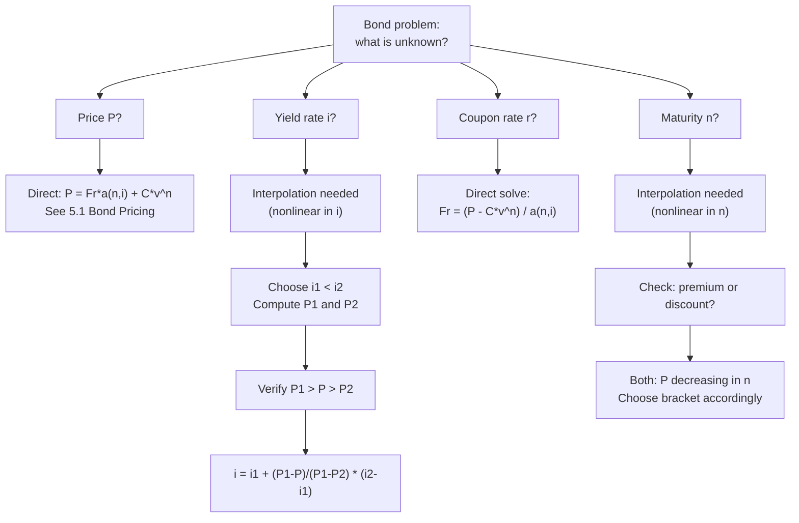

# 📘 5.3 — Yield Rate and Coupon Calculations

> [!ABSTRACT] Ringkasan Cepat
> **Topik:** Yield Rate and Coupon Calculations | **Bobot:** ~10–20% | **Difficulty:** Calculation-Intensive
> **Ref:** Vaaler Bab 6, Kellison Bab 6 | **Prereq:** [[5.1 Bond Pricing]], [[5.2 Book Value, Premium and Discount Amortization]]

## Section 0 — Pemetaan Topik

| Topik CF1 | Sub-topik ID | Skill Diuji | Bobot | Difficulty | Prerequisite | Connected Topics | Referensi |
|-----------|--------------|-------------|-------|------------|--------------|------------------|-----------|
| Topik 5: Model Penentuan Harga Obligasi | 5.3 | Menghitung yield rate (YTM) dari harga obligasi yang diketahui; menghitung coupon rate yang diperlukan untuk mencapai harga tertentu; menghitung maturity $n$ dari harga dan coupon; interpolasi linear untuk solve yield; memahami current yield vs YTM | 10–20% | Calculation-Intensive | [[5.1 Bond Pricing]], [[5.2 Book Value, Premium and Discount Amortization]] | [[5.1 Bond Pricing]], [[3.2 Yield Curve]], [[3.3 Duration (Macaulay and Modified)]] | Vaaler 6, Kellison 6 |

## Section 1 — Intuisi

Bayangkan kamu menemukan obligasi di pasar sekunder yang dijual seharga Rp 950.000, padahal face value-nya Rp 1.000.000 dan coupon rate-nya 8% per tahun dengan maturity 5 tahun. Pertanyaan alami: "Berapa return sesungguhnya yang akan saya dapatkan jika beli obligasi ini hari ini?" Ini adalah pertanyaan tentang **Yield to Maturity (YTM)**—return efektif yang memperhitungkan harga beli, semua coupon yang akan diterima, dan redemption value di akhir.

YTM berbeda dari coupon rate karena YTM memperhitungkan **capital gain atau loss**. Jika beli obligasi di bawah par (discount), kamu akan mendapat capital gain saat redemption—sehingga YTM lebih tinggi dari coupon rate. Sebaliknya, jika beli di atas par (premium), ada capital loss, sehingga YTM lebih rendah dari coupon rate. Inilah mengapa obligasi dengan coupon rate sama bisa punya YTM berbeda tergantung harga pasar.

Masalah **inverse problem** ini—mencari $i$ dari $P$ yang diketahui—tidak punya solusi closed-form algebrais. Berbeda dengan mencari $P$ dari $i$ (langsung substitusi), mencari $i$ dari $P$ membutuhkan **iterasi atau interpolasi**. Di ujian CF1, metode yang paling umum adalah **linear interpolation** antara dua trial rates. Selain YTM, soal CF1 juga menguji kemampuan mencari coupon rate $r$ yang membuat harga obligasi mencapai nilai tertentu (ini punya solusi langsung karena $r$ muncul linear dalam pricing formula), dan kadang mencari maturity $n$ (yang juga membutuhkan iterasi atau logaritma).

## Section 2 — Definisi Formal

> [!NOTE] Definisi Matematis
> **Yield to Maturity (YTM)** adalah rate $i$ yang memenuhi persamaan pricing:
> $$
> P = Fr \cdot a_{\overline{n}|i} + C \cdot v^n
> $$
> di mana $P$, $F$, $r$, $C$, $n$ semua diketahui, dan $i$ adalah unknown.
>
> **Linear Interpolation untuk YTM:**
> $$
> i \approx i_1 + \frac{P_1 - P}{P_1 - P_2} \cdot (i_2 - i_1)
> $$
> di mana $i_1 < i < i_2$ adalah dua trial rates, $P_1 = f(i_1) > P > P_2 = f(i_2)$.
>
> **Coupon Rate dari Target Price:**
> $$
> r = \frac{P - C \cdot v^n}{F \cdot a_{\overline{n}|i}}
> $$
> (linear dalam $r$, solvable directly)

### Variabel & Parameter

| Simbol | Makna | Unit / Range |
|--------|-------|--------------|
| $P$ | Bond price (known, market price) | Mata uang |
| $F$ | Face value | Mata uang |
| $C$ | Redemption value | Mata uang |
| $r$ | Coupon rate per period | Decimal (unknown or known) |
| $Fr$ | Coupon payment per period | Mata uang |
| $i$ | Yield rate / YTM (unknown or known) | Decimal |
| $n$ | Number of periods to maturity | Integer (unknown or known) |
| $v$ | Discount factor $= 1/(1+i)$ | $0 < v < 1$ |
| $a_{\overline{n}\|i}$ | PV annuity-immediate factor | $(1-v^n)/i$ |
| $i_1, i_2$ | Trial rates for interpolation | $i_1 < i_{\text{true}} < i_2$ |
| $P_1, P_2$ | Bond prices at trial rates | $P_1 > P > P_2$ (since $P$ decreasing in $i$) |

### Rumus Utama

$$
P = Fr \cdot a_{\overline{n}|i} + C \cdot v^n
$$
**Label:** Pricing equation — the fundamental equation to solve for unknown parameter.

$$
i \approx i_1 + \frac{P_1 - P}{P_1 - P_2} \cdot (i_2 - i_1)
$$
**Label:** Linear interpolation for YTM (approximate, valid when $i_2 - i_1$ small).

$$
r = \frac{P - C \cdot v^n}{F \cdot a_{\overline{n}|i}}
$$
**Label:** Coupon rate given price, yield, and maturity (direct solution).

$$
Fr = \frac{P - C \cdot v^n}{a_{\overline{n}|i}}
$$
**Label:** Coupon payment given price, yield, and maturity (direct solution).

$$
\text{Current Yield} = \frac{Fr}{P}
$$
**Label:** Current yield (simpler measure, ignores capital gain/loss and time value).

### Asumsi Eksplisit

- **Constant Yield:** YTM diasumsikan konstan selama life of bond (flat term structure).
- **Coupons Reinvested at YTM:** Implicit assumption bahwa coupon payments di-reinvest di rate $i$ (YTM).
- **No Default:** Issuer membayar semua cash flows sesuai jadwal.
- **Linear Interpolation Accuracy:** Interpolasi linear adalah approximation—semakin kecil interval $[i_1, i_2]$, semakin akurat.

## Section 3 — Jembatan Logika

> [!TIP] Dari Time Diagram ke Equation of Value
> Pricing equation $P = Fr \cdot a_{\overline{n}|i} + C \cdot v^n$ adalah **nonlinear dalam $i$** karena $a_{\overline{n}|i}$ dan $v^n$ keduanya bergantung pada $i$ secara nonlinear.
>
> **Mengapa tidak ada solusi algebrais untuk $i$?**
> Substitusi $a_{\overline{n}|i} = (1-v^n)/i$ menghasilkan:
> $$
> P = Fr \cdot \frac{1 - v^n}{i} + C \cdot v^n
> $$
> Dengan $v = 1/(1+i)$, ini adalah polynomial equation derajat $n+1$ dalam $v$ (atau $i$). Untuk $n \geq 5$, tidak ada formula closed-form (Abel-Ruffini theorem). Solusi numerik diperlukan.
>
> **Mengapa $r$ punya solusi langsung?**
> $r$ muncul **linear** dalam pricing equation:
> $$
> P = Fr \cdot a_{\overline{n}|i} + C \cdot v^n
> $$
> Jika $i$ dan $n$ diketahui, $a_{\overline{n}|i}$ dan $v^n$ adalah konstanta. Solve untuk $Fr$:
> $$
> Fr = \frac{P - C \cdot v^n}{a_{\overline{n}|i}}
> $$
> Lalu $r = Fr/F$.

> [!IMPORTANT] Focal Date
> Focal date di $t=0$ (saat pembelian). Semua cash flows di-discount ke $t=0$ menggunakan yield $i$ yang dicari.

**Derivasi Interpolation Formula:**

Pricing function $f(i) = Fr \cdot a_{\overline{n}|i} + C \cdot v^n$ adalah **strictly decreasing** dalam $i$ (karena higher discount rate → lower PV).

Jika $P_1 = f(i_1) > P > P_2 = f(i_2)$ dengan $i_1 < i_2$, maka true $i$ berada di antara $i_1$ dan $i_2$.

Linear interpolation mengasumsikan $f$ linear di interval $[i_1, i_2]$:
$$
\frac{i - i_1}{i_2 - i_1} \approx \frac{f(i_1) - P}{f(i_1) - f(i_2)} = \frac{P_1 - P}{P_1 - P_2}
$$

Solve untuk $i$:
$$
i \approx i_1 + \frac{P_1 - P}{P_1 - P_2} \cdot (i_2 - i_1)
$$

**Intuisi:** Kita interpolate secara proporsional. Jika $P$ lebih dekat ke $P_1$, maka $i$ lebih dekat ke $i_1$.

**Monotonicity of Bond Price:**

$$
\frac{dP}{di} = -Fr \cdot \frac{d a_{\overline{n}|i}}{di} - C \cdot n \cdot v^{n+1} < 0
$$

Karena $dP/di < 0$, fungsi $P(i)$ strictly decreasing. Ini menjamin:
- $i_1 < i_{\text{true}} \Leftrightarrow P_1 > P$
- $i_2 > i_{\text{true}} \Leftrightarrow P_2 < P$

> [!DANGER] Dilarang
> 1. **Menggunakan current yield sebagai YTM:** Current yield $= Fr/P$ mengabaikan capital gain/loss dan time value. Selalu berbeda dari YTM kecuali $P = C$.
> 2. **Interpolasi dengan interval terlalu besar:** Jika $|i_2 - i_1| > 2\%$, error interpolasi bisa signifikan. Gunakan interval $\leq 1\%$ untuk akurasi exam.
> 3. **Lupa bahwa $P$ decreasing dalam $i$:** Jika trial rate $i_1$ menghasilkan $P_1 < P$ (bukan $P_1 > P$), maka $i_1$ terlalu tinggi—turunkan trial rate.

## Section 4 — Contoh Soal

### Soal A — Fundamental

Obligasi dengan face value Rp 1.000.000, coupon rate 8% annually, maturity 5 tahun, redeemed at par. Obligasi dijual seharga Rp 960.000. Hitunglah:
(a) Apakah YTM lebih besar atau lebih kecil dari 8%?
(b) Gunakan trial rates $i_1 = 9\%$ dan $i_2 = 10\%$ untuk estimate YTM dengan linear interpolation.

**Data yang diberikan:**
- $F = C = 1.000.000$
- $r = 0.08$, $Fr = 80.000$
- $n = 5$
- $P = 960.000$ (market price)

> [!SUCCESS] Solusi Soal A
> 
> **1. Identifikasi Variabel**
> - $Fr = 80.000$, $C = 1.000.000$, $n = 5$
> - $P = 960.000$ (given, market price)
> - Trial rates: $i_1 = 0.09$, $i_2 = 0.10$
> - Dicari: $i$ (YTM)
> 
> **2. Time Diagram**
> ```
> t=0         t=1       t=2       t=3       t=4       t=5
> |-----------|---------|---------|---------|---------|
> P=960,000   80,000    80,000    80,000    80,000    80,000 + 1,000,000
> 
> Investor bayar 960,000 < par → discount → YTM > coupon rate
> ```
> 
> **3. Equation of Value** *(pada Focal Date $t = 0$)*
> 
> $$
> 960.000 = 80.000 \cdot a_{\overline{5}|i} + 1.000.000 \cdot v^5
> $$
> 
> Interpolation:
> $$
> i \approx i_1 + \frac{P_1 - P}{P_1 - P_2} \cdot (i_2 - i_1)
> $$
> 
> **4. Eksekusi Aljabar**
> 
> **(a) Direction of YTM:**
> 
> $P = 960.000 < C = 1.000.000$ → discount bond → $r < i$ → YTM $> 8\%$ ✓
> 
> **(b) Compute $P_1$ at $i_1 = 9\%$:**
> 
> $$
> v_1^5 = (1.09)^{-5} = 1/(1.53862) = 0.649931
> $$
> $$
> a_{\overline{5}|0.09} = \frac{1 - 0.649931}{0.09} = \frac{0.350069}{0.09} = 3.88967
> $$
> $$
> P_1 = 80.000 \times 3.88967 + 1.000.000 \times 0.649931
> $$
> $$
> P_1 = 311.174 + 649.931 = 961.105
> $$
> 
> **Compute $P_2$ at $i_2 = 10\%$:**
> 
> $$
> v_2^5 = (1.10)^{-5} = 0.620921
> $$
> $$
> a_{\overline{5}|0.10} = \frac{1 - 0.620921}{0.10} = 3.79079
> $$
> $$
> P_2 = 80.000 \times 3.79079 + 1.000.000 \times 0.620921
> $$
> $$
> P_2 = 303.263 + 620.921 = 924.184
> $$
> 
> **Verify bracket:** $P_1 = 961.105 > P = 960.000 > P_2 = 924.184$ ✓
> 
> **Linear Interpolation:**
> 
> $$
> i \approx 0.09 + \frac{961.105 - 960.000}{961.105 - 924.184} \times (0.10 - 0.09)
> $$
> 
> $$
> i \approx 0.09 + \frac{1.105}{36.921} \times 0.01
> $$
> 
> $$
> i \approx 0.09 + 0.02993 \times 0.01 = 0.09 + 0.000299 \approx 0.09030
> $$
> 
> **YTM $\approx 9.03\%$ per tahun**
> 
> **5. Verification**
> 
> Cek direction: YTM $9.03\% > r = 8\%$ ✓ (discount bond)
> 
> Cek bracket: $P(9\%) = 961.105 > 960.000 > P(10\%) = 924.184$ ✓
> 
> Logika finansial: Investor bayar Rp 960.000 untuk obligasi yang bayar Rp 80.000/tahun + Rp 1.000.000 di akhir. Capital gain Rp 40.000 (dari 960k ke 1000k) plus coupon stream memberikan total return ~9.03% per tahun.
> 
> [!WARNING] Exam Tips — Soal A
> **Target waktu:** 4–5 menit. **Common trap:** Salah arah interpolation—ingat $P$ decreasing dalam $i$, jadi $P_1 > P$ harus correspond ke $i_1 < i$. **Shortcut:** Jika $P$ sangat dekat ke $P_1$, YTM ≈ $i_1$ (no need for full interpolation).

---

### Soal B — Exam-Typical

Obligasi dengan face value Rp 2.000.000, maturity 8 tahun, redeemed at par, yield rate 7% annually. Investor ingin membeli obligasi ini seharga tepat Rp 2.100.000 (premium). Hitunglah coupon rate $r$ (annual) yang harus dimiliki obligasi agar harga tersebut terpenuhi.

**Data yang diberikan:**
- $F = C = 2.000.000$
- $n = 8$
- $i = 0.07$
- Target $P = 2.100.000$
- Dicari: $r$ (coupon rate)

> [!SUCCESS] Solusi Soal B
> 
> **1. Identifikasi Variabel**
> - $F = C = 2.000.000$
> - $i = 0.07$, $n = 8$
> - $P = 2.100.000$
> - Unknown: $r$ (dan $Fr = F \cdot r$)
> 
> **2. Time Diagram**
> ```
> t=0         t=1       ...       t=8
> |-----------|---------|---------|
> 2,100,000   Fr        ...       Fr + 2,000,000
> 
> P > C → premium bond → r > i = 7%
> ```
> 
> **3. Equation of Value** *(pada Focal Date $t = 0$)*
> 
> $$
> P = Fr \cdot a_{\overline{8}|0.07} + C \cdot v^8
> $$
> 
> Solve untuk $Fr$:
> $$
> Fr = \frac{P - C \cdot v^8}{a_{\overline{8}|0.07}}
> $$
> 
> **4. Eksekusi Aljabar**
> 
> Hitung annuity factor dan discount factor:
> 
> $$
> v^8 = (1.07)^{-8} = 1/(1.71819) = 0.582009
> $$
> 
> $$
> a_{\overline{8}|0.07} = \frac{1 - 0.582009}{0.07} = \frac{0.417991}{0.07} = 5.97130
> $$
> 
> Hitung $C \cdot v^8$:
> $$
> C \cdot v^8 = 2.000.000 \times 0.582009 = 1.164.018
> $$
> 
> Solve $Fr$:
> $$
> Fr = \frac{2.100.000 - 1.164.018}{5.97130} = \frac{935.982}{5.97130} = 156.749
> $$
> 
> Coupon rate:
> $$
> r = \frac{Fr}{F} = \frac{156.749}{2.000.000} = 0.078375 \approx 7.84\%
> $$
> 
> **5. Verification**
> 
> Cek direction: $r = 7.84\% > i = 7\%$ → premium bond ✓ (consistent dengan $P > C$)
> 
> Verify price:
> $$
> P = 156.749 \times 5.97130 + 2.000.000 \times 0.582009
> $$
> $$
> = 935.982 + 1.164.018 = 2.100.000 \quad \checkmark
> $$
> 
> Logika finansial: Untuk obligasi dijual premium (Rp 2.1M > par Rp 2M), coupon rate harus lebih tinggi dari yield (7.84% > 7%). Investor mau bayar lebih karena coupon yang diterima lebih besar dari "fair" coupon.

> [!WARNING] Exam Tips — Soal B
> **Target waktu:** 3–4 menit. **Common trap:** Mencoba solve $r$ dengan interpolation (tidak perlu—$r$ adalah linear!). **Shortcut:** Gunakan Makeham form: $P = C + (Fr - Ci) \cdot a_{\overline{n}|i}$ → $Fr = Ci + (P-C)/a_{\overline{n}|i}$.

---

### Soal C — Challenging

Obligasi dengan face value Rp 3.000.000, coupon rate 6% annually, redeemed at par. Obligasi dijual seharga Rp 2.750.000. Yield rate yang diinginkan investor adalah 8% annually.

(a) Berapa maturity $n$ yang diperlukan agar harga obligasi tepat Rp 2.750.000 pada yield 8%?
(b) Gunakan trial values $n_1 = 8$ dan $n_2 = 10$ untuk estimate $n$ dengan interpolation.
(c) Jika maturity harus integer, pilih $n = 8$ atau $n = 10$? Jelaskan.

**Data yang diberikan:**
- $F = C = 3.000.000$
- $r = 0.06$, $Fr = 180.000$
- $i = 0.08$
- Target $P = 2.750.000$
- Dicari: $n$

> [!SUCCESS] Solusi Soal C
> 
> **1. Identifikasi Variabel**
> - $Fr = 180.000$, $C = 3.000.000$, $i = 0.08$
> - $P = 2.750.000$
> - Trial values: $n_1 = 8$, $n_2 = 10$
> - Unknown: $n$
> 
> **2. Time Diagram**
> ```
> t=0         t=1       ...       t=n
> |-----------|---------|---------|
> 2,750,000   180,000   ...       180,000 + 3,000,000
> 
> P < C → discount bond → r < i ✓ (6% < 8%)
> Longer maturity → lower price (more discounting of redemption)
> ```
> 
> **3. Equation of Value** *(pada Focal Date $t = 0$)*
> 
> $$
> 2.750.000 = 180.000 \cdot a_{\overline{n}|0.08} + 3.000.000 \cdot v^n
> $$
> 
> Interpolation in $n$:
> $$
> n \approx n_1 + \frac{P - P_1}{P_2 - P_1} \cdot (n_2 - n_1)
> $$
> 
> Note: For discount bonds, $P$ is **increasing** in $n$ (longer maturity → more coupons received, but also more discounting of redemption; net effect for discount bonds: price increases with $n$).
> 
> **4. Eksekusi Aljabar**
> 
> **Compute $P_1$ at $n_1 = 8$:**
> 
> $$
> v^8 = (1.08)^{-8} = 1/(1.85093) = 0.540269
> $$
> $$
> a_{\overline{8}|0.08} = \frac{1 - 0.540269}{0.08} = \frac{0.459731}{0.08} = 5.74664
> $$
> $$
> P_1 = 180.000 \times 5.74664 + 3.000.000 \times 0.540269
> $$
> $$
> P_1 = 1.034.395 + 1.620.807 = 2.655.202
> $$
> 
> **Compute $P_2$ at $n_2 = 10$:**
> 
> $$
> v^{10} = (1.08)^{-10} = 1/(2.15892) = 0.463193
> $$
> $$
> a_{\overline{10}|0.08} = \frac{1 - 0.463193}{0.08} = \frac{0.536807}{0.08} = 6.71009
> $$
> $$
> P_2 = 180.000 \times 6.71009 + 3.000.000 \times 0.463193
> $$
> $$
> P_2 = 1.207.816 + 1.389.579 = 2.597.395
> $$
> 
> **Check direction:** For discount bonds, as $n$ increases, price **decreases** (redemption value discounted more heavily). So $P_1 > P_2$, and we need $P = 2.750.000 > P_1 = 2.655.202$. This means $n < n_1 = 8$.
> 
> Let's try $n_1 = 5$ and $n_2 = 8$:
> 
> **Compute $P$ at $n = 5$:**
> $$
> v^5 = (1.08)^{-5} = 0.680583
> $$
> $$
> a_{\overline{5}|0.08} = \frac{1 - 0.680583}{0.08} = 3.99271
> $$
> $$
> P(n=5) = 180.000 \times 3.99271 + 3.000.000 \times 0.680583
> $$
> $$
> = 718.688 + 2.041.749 = 2.760.437
> $$
> 
> **Verify bracket:** $P(n=5) = 2.760.437 > P = 2.750.000 > P(n=8) = 2.655.202$ ✓
> 
> **Linear Interpolation:**
> 
> $$
> n \approx 5 + \frac{2.750.000 - 2.760.437}{2.655.202 - 2.760.437} \times (8 - 5)
> $$
> 
> $$
> n \approx 5 + \frac{-10.437}{-105.235} \times 3 = 5 + 0.09919 \times 3 = 5 + 0.298 \approx 5.30
> $$
> 
> **True $n \approx 5.3$ years** (non-integer, so we must choose integer)
> 
> **(c) Integer Maturity Choice:**
> 
> - $n = 5$: $P(5) = 2.760.437 > 2.750.000$ (obligasi lebih mahal dari target)
> - $n = 6$: Compute to confirm
> 
> $$
> v^6 = (1.08)^{-6} = 0.630170
> $$
> $$
> a_{\overline{6}|0.08} = \frac{1 - 0.630170}{0.08} = 4.62288
> $$
> $$
> P(6) = 180.000 \times 4.62288 + 3.000.000 \times 0.630170 = 831.918 + 1.890.510 = 2.722.428
> $$
> 
> $P(6) = 2.722.428 < 2.750.000$
> 
> Jika investor ingin harga **tidak melebihi** Rp 2.750.000, pilih **$n = 6$** (harga Rp 2.722.428 < target).
> 
> Jika investor ingin harga **tidak kurang dari** Rp 2.750.000, pilih **$n = 5$** (harga Rp 2.760.437 > target).
> 
> **5. Verification**
> 
> Cek discount: $r = 6\% < i = 8\%$ → discount bond ✓
> 
> Cek monotonicity: $P(5) > P(6) > P(8)$ → price decreasing in $n$ for discount bond ✓
> 
> Logika finansial: Untuk discount bond (coupon < yield), semakin panjang maturity, semakin lama investor harus menunggu redemption value yang "mengkompensasi" coupon yang terlalu kecil. Sehingga harga turun seiring maturity meningkat.

> [!WARNING] Exam Tips — Soal C
> **Target waktu:** 6–7 menit. **Common trap:** Mengasumsikan harga selalu naik dengan maturity—untuk discount bonds, harga TURUN dengan maturity (opposite dari premium bonds). **Shortcut:** Cek dulu apakah premium atau discount untuk tentukan arah monotonicity sebelum interpolasi.

## Section 5 — Verifikasi & Sanity Check

> [!CHECK] YTM Direction
> 1. **Discount bond ($P < C$):** YTM $> r$ (coupon rate). Capital gain compensates low coupon.
> 2. **Premium bond ($P > C$):** YTM $< r$ (coupon rate). Capital loss offsets high coupon.
> 3. **Par bond ($P = C$):** YTM $= r$ exactly.

> [!CHECK] Interpolation Bracket
> 1. **Verify bracket:** $P_1 > P > P_2$ dengan $i_1 < i_2$ (karena $P$ decreasing in $i$).
> 2. **Interpolated $i$ in range:** $i_1 < i_{\text{interpolated}} < i_2$ always.
> 3. **Accuracy check:** Substitute interpolated $i$ back into pricing formula—should give $P$ close to target.

> [!CHECK] Coupon Rate Calculation
> 1. **Direction check:** If $P > C$, then $r > i$ (premium). If $P < C$, then $r < i$ (discount).
> 2. **Verify:** Substitute computed $r$ back into $P = Fr \cdot a_{\overline{n}|i} + C \cdot v^n$—should recover target $P$.

### Metode Alternatif

**Makeham Form untuk Solve Coupon:**

$$
P = C + (Fr - Ci) \cdot a_{\overline{n}|i}
$$

Solve untuk $Fr$:
$$
Fr = Ci + \frac{P - C}{a_{\overline{n}|i}}
$$

Lebih efisien karena langsung isolate $Fr$.

**Newton-Raphson untuk YTM [BEYOND CF1]:**

$$
i_{k+1} = i_k - \frac{f(i_k)}{f'(i_k)}
$$

di mana $f(i) = P(i) - P_{\text{target}}$ dan $f'(i) = dP/di$. Converges faster than interpolation but requires calculus.

**Approximate YTM Formula [Shortcut]:**

$$
i \approx \frac{Fr + (C - P)/n}{(P + C)/2}
$$

Rough approximation: (annual coupon + annual capital gain/loss) / (average of price and redemption). Useful for quick sanity check, not for exact answer.

## Section 6 — Visualisasi Mental

**Bond Price vs Yield (P-i curve):**

Grafik dengan **sumbu X = yield rate $i$**, **sumbu Y = bond price $P$**.

Kurva **convex, strictly decreasing**:
- Saat $i = r$ (coupon rate): $P = C$ (par)
- Saat $i < r$: $P > C$ (premium)
- Saat $i > r$: $P < C$ (discount)

**Interpolation visualization:**
- Plot dua titik $(i_1, P_1)$ dan $(i_2, P_2)$ pada kurva
- Tarik garis lurus (chord) antara dua titik
- Interpolated $i$ adalah titik di mana chord memotong horizontal line $P = P_{\text{target}}$
- True $i$ adalah titik di mana kurva memotong $P = P_{\text{target}}$
- Karena kurva convex, interpolated $i$ sedikit **underestimate** true $i$ (chord di bawah kurva)

**Bond Price vs Maturity (P-n curve):**

Grafik dengan **sumbu X = maturity $n$**, **sumbu Y = bond price $P$**.

- **Premium bond ($r > i$):** Kurva **menurun** dari $P_0 > C$ menuju $C$ saat $n \to \infty$
- **Discount bond ($r < i$):** Kurva **menurun** dari $P_0 < C$ menuju... wait, actually for discount bonds, as $n$ increases, price decreases toward $C$ from below
- **Par bond:** Horizontal line di $P = C$

Untuk discount bond: semakin panjang maturity, semakin banyak "kerugian" dari coupon yang terlalu kecil, sehingga harga semakin rendah.

### Hubungan Visual ↔ Rumus

**Slope P-i curve:**
$$
\frac{dP}{di} = -\frac{d}{di}\left[Fr \cdot a_{\overline{n}|i} + C \cdot v^n\right] < 0
$$

Negative slope → interpolation dengan $P_1 > P > P_2$ corresponds ke $i_1 < i < i_2$.

**Convexity of P-i curve:**
$$
\frac{d^2P}{di^2} > 0
$$

Positive convexity → linear interpolation **underestimates** true $i$ (chord below curve).

## Section 7 — Jebakan Umum

> [!BUG] Kesalahan Unit Waktu
> **Contoh Salah:** Obligasi semiannual, maturity 5 tahun. Menggunakan $n = 5$ (years) instead of $n = 10$ (semesters) dalam interpolation.
>
> **Benar:** Semua calculations dalam **per-period units**. YTM per semester × 2 = annual YTM (nominal, convertible semiannually).

> [!BUG] Kesalahan Konseptual
> 1. **Current yield = YTM (SALAH):** Current yield $= Fr/P$ hanya memperhitungkan coupon, bukan capital gain/loss atau time value. YTM selalu berbeda dari current yield kecuali $P = C$.
> 2. **Interpolation exact (SALAH):** Linear interpolation adalah **approximation** karena P-i curve nonlinear (convex). Semakin besar interval, semakin besar error.
> 3. **Maturity solve sama dengan yield solve:** Untuk discount bonds, $P$ **decreasing** dalam $n$ (longer maturity → lower price). Untuk premium bonds, $P$ juga decreasing dalam $n$. Jangan asumsikan P increasing dalam $n$.
> 4. **Coupon rate solve butuh iterasi (SALAH):** Coupon rate $r$ muncul linear dalam pricing equation—solve langsung tanpa iterasi.

> [!BUG] Kesalahan Interpretasi Soal
> **Ambiguitas:** "Yield" bisa berarti YTM, current yield, atau yield per period (jika semiannual).
>
> **Klarifikasi:** Di CF1, "yield rate" atau "yield to maturity" = $i$ dalam pricing formula. "Current yield" = $Fr/P$ (simpler, different concept). Selalu check konteks soal.

> [!CAUTION] Red Flags
> - **"Find the yield rate":** Trigger untuk interpolation. Setup bracket $[i_1, i_2]$ dengan $P_1 > P > P_2$.
> - **"Find the coupon rate":** Direct solve—$r$ adalah linear. Gunakan $Fr = (P - C \cdot v^n)/a_{\overline{n}|i}$.
> - **"Find the maturity":** Interpolation dalam $n$. Cek dulu arah monotonicity (premium vs discount).
> - **"Nominal yield convertible semiannually":** YTM per semester × 2, bukan YTM per semester.

## Section 8 — Ringkasan Eksekutif

> [!SUMMARY] Must-Remember
> 1. **Pricing equation (fundamental):**
>    $$
>    P = Fr \cdot a_{\overline{n}|i} + C \cdot v^n
>    $$
> 2. **Linear interpolation for YTM:**
>    $$
>    i \approx i_1 + \frac{P_1 - P}{P_1 - P_2} \cdot (i_2 - i_1), \quad P_1 > P > P_2, \; i_1 < i_2
>    $$
> 3. **Coupon rate (direct solve):**
>    $$
>    Fr = \frac{P - C \cdot v^n}{a_{\overline{n}|i}}, \quad r = \frac{Fr}{F}
>    $$
> 4. **YTM direction:**
>    $$
>    P < C \Rightarrow i > r \quad (\text{discount}), \quad P > C \Rightarrow i < r \quad (\text{premium})
>    $$
> 5. **Approximate YTM (quick check):**
>    $$
>    i \approx \frac{Fr + (C-P)/n}{(P+C)/2}
>    $$

### Kapan Digunakan

- **Trigger keywords:** "find the yield," "yield to maturity," "what coupon rate," "find the maturity," "interpolation," "what rate of return."
- **Tipe skenario soal:**
  - Hitung YTM dari market price (interpolation).
  - Hitung coupon rate untuk achieve target price (direct solve).
  - Hitung maturity untuk achieve target price (interpolation in $n$).
  - Compare YTM vs current yield.
  - Determine if bond is premium/discount/par from YTM vs coupon rate.

### Kapan TIDAK Boleh Digunakan

- **Jika harga obligasi yang dicari (bukan yield):** Gunakan [[5.1 Bond Pricing]] langsung—tidak perlu interpolation.
- **Jika book value di periode tertentu yang dicari:** Gunakan [[5.2 Book Value, Premium and Discount Amortization]].
- **Jika yield curve tidak flat:** Standard YTM assume flat term structure. Spot rate pricing dibahas di [[3.1 Spot Rates and Forward Rates]].

### Quick Decision Tree



---

> [!QUOTE] Follow-up Options
> 1. *"Berikan contoh soal variasi YTM dengan semiannual coupons"*
> 2. *"Jelaskan hubungan [[5.3 Yield Rate and Coupon Calculations]] dengan [[3.2 Yield Curve]]"*
> 3. *"Buat flashcard 1-halaman untuk topik ini"*

*📖 Ref: Vaaler Bab 6, Kellison Bab 6 | 🗓️ 2026-02-18 | #CF1 #YieldRate #YTM #CouponRate #Interpolation*
