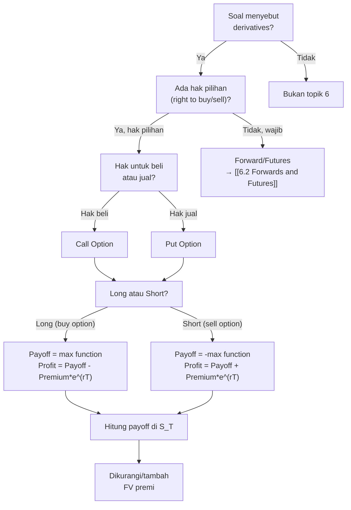

# 📘 6.1 — Options – Call and Put

> [!ABSTRACT] Ringkasan Cepat
> **Topik:** Options (Call & Put) | **Bobot:** ~5–15% | **Difficulty:** Medium
> **Ref:** McDonald Bab 2.1–2.3, 3 | **Prereq:** [[1.2 Effective, Nominal, and Force of Interest]], [[1.4 Accumulation and Present Value]]

## Section 0 — Pemetaan Topik

| Topik CF1 | Sub-topik ID | Skill Diuji | Bobot | Difficulty | Prerequisite | Connected Topics | Referensi |
|-----------|--------------|-------------|-------|------------|--------------|------------------|-----------|
| Topik 6: Produk Derivatif | 6.1 | Menghitung payoff dan profit call/put option; membedakan long vs short position; memahami European vs American options; menghitung breakeven price; interpretasi option moneyness | 5–15% | Medium | [[1.2 Effective, Nominal, and Force of Interest]] | [[6.2 Forwards and Futures]], [[6.3 Option Strategies]], [[3.1 Spot Rates and Forward Rates]] | McDonald 2.1–2.3, 3.1–3.3 |

## Section 1 — Intuisi

Bayangkan kamu ingin membeli saham perusahaan teknologi yang sekarang harganya Rp 100.000 per lembar, tetapi kamu khawatir harga akan turun drastis bulan depan. Atau sebaliknya: kamu yakin harga akan naik ke Rp 150.000, tetapi kamu tidak punya uang cukup untuk membeli sahamnya sekarang. **Option** memberikan solusi untuk kedua situasi ini.

**Call option** adalah kontrak yang memberi kamu **hak** (bukan kewajiban) untuk **membeli** aset pada harga tertentu (strike price) di masa depan. Jika harga saham naik, kamu bisa beli dengan harga murah yang sudah dikunci. Jika harga turun, kamu bisa tidak jadi beli—kamu hanya kehilangan premi yang dibayarkan di awal untuk membeli option itu. Ini seperti membayar uang muka untuk "memesan" saham dengan harga tetap, tetapi kamu boleh batalkan pesanan jika ternyata harga pasar lebih murah.

**Put option** adalah kebalikannya: kontrak yang memberi kamu hak untuk **menjual** aset pada harga tertentu di masa depan. Jika kamu punya saham dan khawatir harganya akan anjlok, kamu beli put option sebagai "asuransi"—jika harga benar-benar turun, kamu tetap bisa jual sahammu di harga tinggi yang sudah dikunci. Jika harga naik, kamu senang karena nilai investasimu naik, dan kamu cukup tidak eksekusi put option-nya (hanya kehilangan premi).

Bedanya dengan **forward/futures** adalah: di forward kamu **wajib** beli/jual di harga yang disepakati, tidak ada pilihan. Di option, kamu **bisa** beli/jual (call/put) jika menguntungkan, atau tidak jadi jika rugi. Fleksibilitas ini memiliki harga: kamu bayar **premi** di awal. Penjual option (short position) mendapat premi ini sebagai kompensasi risiko bahwa mereka mungkin harus jual/beli aset dengan harga tidak menguntungkan.

Option adalah fondasi strategi hedging dan spekulasi di pasar keuangan modern. Tanpa pemahaman payoff structure options, kamu tidak bisa memahami strategi kompleks seperti collar, straddle, atau butterfly spread yang sering muncul di ujian CF1.

## Section 2 — Definisi Formal

> [!NOTE] Definisi Matematis
> **Call Option:** Kontrak derivatif yang memberikan **pemegang (long position)** hak untuk **membeli** aset underlying pada harga strike $K$ di waktu maturity $T$ (European) atau kapan saja sampai $T$ (American).
>
> **Payoff Call Option di Maturity:**
> $$
> \text{Payoff}_{\text{call}} = \max(S_T - K, 0)
> $$
>
> **Put Option:** Kontrak derivatif yang memberikan **pemegang (long position)** hak untuk **menjual** aset underlying pada harga strike $K$ di waktu maturity $T$ (European) atau kapan saja sampai $T$ (American).
>
> **Payoff Put Option di Maturity:**
> $$
> \text{Payoff}_{\text{put}} = \max(K - S_T, 0)
> $$
>
> **Profit = Payoff - Present Value of Premium:**
> $$
> \text{Profit}_{\text{call}} = \max(S_T - K, 0) - C_0 e^{rT}
> $$
> $$
> \text{Profit}_{\text{put}} = \max(K - S_T, 0) - P_0 e^{rT}
> $$
> di mana $C_0$ adalah premi call di waktu 0, $P_0$ adalah premi put di waktu 0, $r$ adalah risk-free rate (continuously compounded).

### Variabel & Parameter

| Simbol | Makna | Unit / Range |
|--------|-------|--------------|
| $S_0$ | Harga spot aset underlying saat ini (waktu 0) | Mata uang, $S_0 > 0$ |
| $S_T$ | Harga spot aset underlying di maturity $T$ | Mata uang, $S_T \geq 0$ |
| $K$ | Strike price (exercise price) | Mata uang, $K > 0$ |
| $T$ | Time to maturity (tahun) | $T > 0$ |
| $C_0$ atau $C$ | Premi call option di waktu 0 | Mata uang, $C_0 \geq 0$ |
| $P_0$ atau $P$ | Premi put option di waktu 0 | Mata uang, $P_0 \geq 0$ |
| $r$ | Risk-free rate (continuously compounded) | Decimal, $r \geq 0$ |
| $\delta$ | Dividend yield (continuously compounded) | Decimal, $\delta \geq 0$ |
| $\text{Payoff}$ | Nilai kontrak di maturity (sebelum dikurangi premi) | Mata uang |
| $\text{Profit}$ | Keuntungan bersih (payoff minus future value premi) | Mata uang, bisa negatif |

### Rumus Utama

$$
\text{Payoff Long Call} = \max(S_T - K, 0) = \begin{cases} S_T - K & \text{if } S_T > K \\ 0 & \text{if } S_T \leq K \end{cases}
$$
**Label:** Payoff call option untuk pemegang (long call) di maturity $T$.

$$
\text{Payoff Short Call} = -\max(S_T - K, 0) = \min(K - S_T, 0)
$$
**Label:** Payoff call option untuk penjual (short call) di maturity $T$ (negatif dari long call).

$$
\text{Payoff Long Put} = \max(K - S_T, 0) = \begin{cases} K - S_T & \text{if } S_T < K \\ 0 & \text{if } S_T \geq K \end{cases}
$$
**Label:** Payoff put option untuk pemegang (long put) di maturity $T$.

$$
\text{Payoff Short Put} = -\max(K - S_T, 0) = \min(S_T - K, 0)
$$
**Label:** Payoff put option untuk penjual (short put) di maturity $T$ (negatif dari long put).

$$
\text{Profit Long Call} = \max(S_T - K, 0) - C_0 e^{rT}
$$
**Label:** Profit long call, di mana $C_0 e^{rT}$ adalah future value premi call.

$$
\text{Profit Long Put} = \max(K - S_T, 0) - P_0 e^{rT}
$$
**Label:** Profit long put, di mana $P_0 e^{rT}$ adalah future value premi put.

$$
\text{Breakeven}_{\text{call}} : \quad S_T = K + C_0 e^{rT}
$$
**Label:** Harga aset di mana profit long call = 0.

$$
\text{Breakeven}_{\text{put}} : \quad S_T = K - P_0 e^{rT}
$$
**Label:** Harga aset di mana profit long put = 0.

### Asumsi Eksplisit

- **No Arbitrage:** Pasar efisien, tidak ada peluang profit tanpa risiko tanpa modal.
- **Frictionless Market:** Tidak ada biaya transaksi, pajak, atau spread bid-ask.
- **Continuous Trading:** Aset underlying dapat diperdagangkan kapan saja.
- **Known and Constant Risk-Free Rate:** $r$ diketahui dan konstan selama periode option.
- **No Counterparty Risk:** Penjual option akan memenuhi kewajiban jika option di-exercise.

## Section 3 — Jembatan Logika

> [!TIP] Dari Time Diagram ke Equation of Value
> Payoff option muncul dari **hak pilihan rasional** pemegang option. Di maturity $T$, pemegang call option akan membandingkan:
> - **Exercise option:** Beli aset di harga $K$, dapat aset senilai $S_T$. Net: $S_T - K$.
> - **Tidak exercise:** Tidak dapat apa-apa. Net: $0$.
>
> Pemegang akan pilih aksi yang memberikan nilai lebih tinggi: $\max(S_T - K, 0)$.
>
> Mengapa $\max$ bukan hanya $S_T - K$? Karena jika $S_T < K$, exercise berarti beli aset mahal (bayar $K$, dapat aset cuma senilai $S_T < K$)—lebih baik tidak exercise (kehilangan $0$ daripada kehilangan $K - S_T$).
>
> **Profit** adalah payoff dikurangi **future value** premi yang dibayarkan di waktu 0. Mengapa future value? Karena premi $C_0$ dibayar di $t=0$, sedangkan payoff diterima di $t=T$. Untuk membandingkan di waktu yang sama (focal date $T$), kita compound premi dengan risk-free rate: $C_0 e^{rT}$.
>
> **Makna ekonomi $\max$ function:** Ini adalah **asymmetry** option—keuntungan unlimited (jika $S_T$ naik terus untuk call), kerugian terbatas pada premi. Ini berbeda dengan forward (profit/loss symmetric).

> [!IMPORTANT] Focal Date
> Focal date untuk payoff adalah $t = T$ (maturity). Untuk profit, kita juga gunakan $t = T$ sehingga premi di-compound dari $t=0$ ke $t=T$ dengan $e^{rT}$.

**Derivasi Payoff Call Option:**

Di waktu $T$ (maturity), pemegang call option memiliki hak untuk membeli aset di harga $K$. Jika dia exercise, dia bayar $K$ dan terima aset senilai $S_T$. Net cash flow dari exercise:
$$
\text{Net dari exercise} = S_T - K
$$

Tetapi hak ini **opsional**. Jika $S_T < K$, exercise berarti rugi $(S_T - K < 0)$. Pemegang rasional akan **tidak exercise**, sehingga net = 0.

Jadi, pemegang akan:
- Exercise jika $S_T > K$, mendapat $S_T - K > 0$
- Tidak exercise jika $S_T \leq K$, mendapat $0$

Payoff:
$$
\text{Payoff}_{\text{call}} = \max(S_T - K, 0)
$$

**Derivasi Payoff Put Option:**

Di waktu $T$, pemegang put option memiliki hak untuk menjual aset di harga $K$. Jika dia exercise, dia serahkan aset senilai $S_T$ dan terima $K$. Net cash flow dari exercise:
$$
\text{Net dari exercise} = K - S_T
$$

Jika $K < S_T$, exercise berarti rugi (jual aset senilai $S_T$ hanya dapat $K < S_T$). Pemegang akan tidak exercise, net = 0.

Jadi, pemegang akan:
- Exercise jika $S_T < K$, mendapat $K - S_T > 0$
- Tidak exercise jika $S_T \geq K$, mendapat $0$

Payoff:
$$
\text{Payoff}_{\text{put}} = \max(K - S_T, 0)
$$

**Argumen No-Arbitrage untuk Bounds:**

**Lower bound call option (European, no dividend):**
Portofolio A: Long call + cash $Ke^{-rT}$ (invest di risk-free)
Portofolio B: Long stock

Di $t = T$:
- Portofolio A: $\max(S_T - K, 0) + K = \max(S_T, K)$
- Portofolio B: $S_T$

Karena $\max(S_T, K) \geq S_T$ untuk semua $S_T$, maka di $t=0$:
$$
C_0 + Ke^{-rT} \geq S_0 \quad \Rightarrow \quad C_0 \geq S_0 - Ke^{-rT}
$$

Jika $C_0 < S_0 - Ke^{-rT}$, ada arbitrase: beli call, jual stock, invest premi+hasil short stock di risk-free rate → profit tanpa risiko.

**Put-Call Parity (no dividend, European):**
$$
C_0 - P_0 = S_0 - Ke^{-rT}
$$

Derivasi: Bandingkan dua portofolio di $t=T$:
- Portofolio A: Long call + cash $K$ (dari invest $Ke^{-rT}$ di $t=0$)
- Portofolio B: Long put + long stock

Payoff Portofolio A di $t=T$: $\max(S_T - K, 0) + K = \max(S_T, K)$
Payoff Portofolio B di $t=T$: $\max(K - S_T, 0) + S_T = \max(K, S_T)$

Kedua portofolio identik di $t=T$, maka harus sama harga di $t=0$:
$$
C_0 + Ke^{-rT} = P_0 + S_0 \quad \Rightarrow \quad C_0 - P_0 = S_0 - Ke^{-rT}
$$

> [!DANGER] Dilarang
> 1. **Menggunakan $S_T - K$ tanpa $\max$ untuk payoff:** Payoff option tidak pernah negatif untuk pemegang (long). Harus selalu $\max(\ldots, 0)$.
> 2. **Mencampur payoff dan profit:** Payoff adalah nilai kontrak di maturity sebelum memperhitungkan premi. Profit adalah payoff minus cost (premi).
> 3. **Lupa sign untuk short position:** Short call payoff = $-\max(S_T - K, 0)$, bukan $\max(K - S_T, 0)$. Short put payoff = $-\max(K - S_T, 0)$.

## Section 4 — Contoh Soal

### Soal A — Fundamental

Kamu membeli European call option untuk saham XYZ dengan strike price $K = 50$  dan maturity 6 bulan. Kamu membayar premi $C_0 = 3$ per option. Risk-free rate adalah $r = 4\%$ per tahun (continuously compounded). Jika harga saham di maturity adalah $S_T = 58$, hitunglah:
(a) Payoff call option
(b) Profit dari strategi ini

**Data yang diberikan:**
- Strike price $K = 50$
- Premi call $C_0 = 3$
- Time to maturity $T = 0.5$ tahun
- Risk-free rate $r = 0.04$ (continuously compounded)
- Harga aset di maturity $S_T = 58$

> [!SUCCESS] Solusi Soal A
> 
> **1. Identifikasi Variabel**
> - $K = 50$
> - $C_0 = 3$
> - $T = 0.5$
> - $r = 0.04$
> - $S_T = 58$
> - Dicari: Payoff dan Profit
> 
> **2. Time Diagram**
> ```
> t=0                           t=0.5 (maturity)
> |------------------------------|
> Bayar premi C₀=3          S_T=58, K=50
>                           Exercise call: beli di K=50
>                           Market value: S_T=58
>                           Payoff = 58 - 50 = 8
> ```
> 
> **3. Equation of Value** *(pada Focal Date $t = T = 0.5$)*
> 
> Payoff call:
> $$
> \text{Payoff} = \max(S_T - K, 0)
> $$
> 
> Profit (di focal date $T$):
> $$
> \text{Profit} = \text{Payoff} - C_0 e^{rT}
> $$
> 
> **4. Eksekusi Aljabar**
> 
> **(a) Payoff:**
> 
> Karena $S_T = 58 > K = 50$, option akan di-exercise:
> $$
> \text{Payoff} = S_T - K = 58 - 50 = 8
> $$
> 
> **(b) Profit:**
> 
> Hitung future value premi:
> $$
> C_0 e^{rT} = 3 \times e^{0.04 \times 0.5} = 3 \times e^{0.02}
> $$
> 
> Hitung $e^{0.02}$:
> $$
> e^{0.02} \approx 1.020201
> $$
> 
> $$
> C_0 e^{rT} = 3 \times 1.020201 = 3.060603
> $$
> 
> Profit:
> $$
> \text{Profit} = 8 - 3.060603 = 4.939397 \approx 4.94
> $$
> 
> **5. Verification**
> 
> Cek kondisi exercise: $S_T = 58 > K = 50$ ✓, jadi memang exercise.
> 
> Logika finansial: Kamu beli aset di $K = 50$ (via exercise call), langsung bisa jual di pasar dengan harga $S_T = 58$, mendapat $8$ gross. Setelah dikurangi future value premi $3.06$, net profit sekitar $4.94$.
> 
> [!WARNING] Exam Tips — Soal A
> **Target waktu:** 2–2.5 menit. **Common trap:** Lupa compound premi dengan $e^{rT}$—langsung kurangi $C_0$ dari payoff tanpa time value adjustment. **Shortcut:** Jika $T$ kecil dan $r$ kecil, $e^{rT} \approx 1 + rT$ (Taylor approximation) untuk estimasi cepat.

---

### Soal B — Exam-Typical

Kamu menjual (short) European put option untuk saham ABC dengan strike price $K = 100$ dan maturity 1 tahun. Kamu menerima premi $P_0 = 6$. Risk-free rate adalah $r = 5\%$ per tahun (continuously compounded). Jika harga saham di maturity adalah $S_T = 92$, hitunglah:
(a) Payoff posisi short put
(b) Profit dari strategi ini

**Data yang diberikan:**
- Strike price $K = 100$
- Premi put $P_0 = 6$ (diterima karena short put)
- Time to maturity $T = 1$ tahun
- Risk-free rate $r = 0.05$
- Harga aset di maturity $S_T = 92$

> [!SUCCESS] Solusi Soal B
> 
> **1. Identifikasi Variabel**
> - $K = 100$
> - $P_0 = 6$
> - $T = 1$
> - $r = 0.05$
> - $S_T = 92$
> - Posisi: **Short put**
> - Dicari: Payoff dan Profit
> 
> **2. Time Diagram**
> ```
> t=0                                t=1 (maturity)
> |----------------------------------|
> Terima premi P₀=6             S_T=92, K=100
>                               Long put holder akan exercise
>                               (jual aset di K=100 padahal market=92)
>                               
> Short put wajib beli di K=100:
> Payoff short = -(K - S_T) = -(100 - 92) = -8
> ```
> 
> **3. Equation of Value** *(pada Focal Date $t = T = 1$)*
> 
> Payoff short put (negatif dari long put):
> $$
> \text{Payoff}_{\text{short put}} = -\max(K - S_T, 0)
> $$
> 
> Profit (di focal date $T$):
> $$
> \text{Profit} = \text{Payoff} + P_0 e^{rT}
> $$
> (Plus karena premi diterima, bukan dibayar)
> 
> **4. Eksekusi Aljabar**
> 
> **(a) Payoff:**
> 
> Karena $S_T = 92 < K = 100$, pemegang long put akan exercise. Short put wajib beli aset di $K = 100$ (padahal market value hanya $S_T = 92$).
> 
> Payoff long put: $K - S_T = 100 - 92 = 8$
> 
> Payoff short put (negatif dari long):
> $$
> \text{Payoff}_{\text{short put}} = -(100 - 92) = -8
> $$
> 
> Atau dengan formula:
> $$
> \text{Payoff}_{\text{short put}} = -\max(100 - 92, 0) = -\max(8, 0) = -8
> $$
> 
> **(b) Profit:**
> 
> Hitung future value premi yang diterima:
> $$
> P_0 e^{rT} = 6 \times e^{0.05 \times 1} = 6 \times e^{0.05}
> $$
> 
> Hitung $e^{0.05}$:
> $$
> e^{0.05} \approx 1.051271
> $$
> 
> $$
> P_0 e^{rT} = 6 \times 1.051271 = 6.307626
> $$
> 
> Profit:
> $$
> \text{Profit} = -8 + 6.307626 = -1.692374 \approx -1.69
> $$
> 
> **5. Verification**
> 
> Cek kondisi exercise: $S_T = 92 < K = 100$ ✓, jadi pemegang long put akan exercise.
> 
> Logika finansial: Kamu (short put) wajib beli aset di $K = 100$, padahal market value hanya $92$. Kamu rugi $8$ di payoff. Tetapi kamu sudah terima premi $6$ di awal, yang tumbuh jadi $6.31$ di maturity. Net profit: $-8 + 6.31 = -1.69$ (rugi).

> [!WARNING] Exam Tips — Soal B
> **Target waktu:** 2.5–3 menit. **Common trap:** Lupa bahwa short position payoff adalah **negatif** dari long payoff. Juga, premi untuk short adalah income (plus), bukan cost (minus). **Shortcut:** Short option profit = premi diterima - payoff yang dibayar.

---

### Soal C — Challenging

Kamu membeli European call option dengan strike $K = 80$, premi $C_0 = 5$, dan maturity 9 bulan. Risk-free rate $r = 6\%$ (continuously compounded). Pada saat yang sama, kamu membeli European put option dengan strike yang sama $K = 80$, premi $P_0 = 4$, dan maturity yang sama. Strategi ini disebut **straddle**.

Hitunglah:
(a) Total profit jika harga aset di maturity $S_T = 95$
(b) Total profit jika harga aset di maturity $S_T = 70$
(c) Harga breakeven atas dan bawah (dua nilai $S_T$ di mana profit = 0)

**Data yang diberikan:**
- Strike price call dan put: $K = 80$
- Premi call: $C_0 = 5$
- Premi put: $P_0 = 4$
- Time to maturity: $T = 0.75$ tahun
- Risk-free rate: $r = 0.06$

> [!SUCCESS] Solusi Soal C
> 
> **1. Identifikasi Variabel**
> - $K = 80$
> - $C_0 = 5$
> - $P_0 = 4$
> - $T = 0.75$
> - $r = 0.06$
> - Strategi: Long call + Long put (straddle)
> - Dicari: Profit di $S_T = 95$ dan $S_T = 70$, breakeven prices
> 
> **2. Time Diagram**
> ```
> t=0                                       t=0.75
> |-------------------------------------------|
> Bayar C₀=5 + P₀=4 = 9 total          S_T = ?
> 
> Payoff straddle = Payoff call + Payoff put
>                 = max(S_T - 80, 0) + max(80 - S_T, 0)
> ```
> 
> **3. Equation of Value** *(pada Focal Date $t = T = 0.75$)*
> 
> Payoff total:
> $$
> \text{Payoff}_{\text{total}} = \max(S_T - K, 0) + \max(K - S_T, 0)
> $$
> 
> Profit total:
> $$
> \text{Profit} = \text{Payoff}_{\text{total}} - (C_0 + P_0) e^{rT}
> $$
> 
> Breakeven: $\text{Profit} = 0$
> 
> **4. Eksekusi Aljabar**
> 
> Hitung total future value premi:
> $$
> (C_0 + P_0) e^{rT} = (5 + 4) \times e^{0.06 \times 0.75} = 9 \times e^{0.045}
> $$
> 
> Hitung $e^{0.045}$:
> $$
> e^{0.045} \approx 1.046028
> $$
> 
> $$
> (C_0 + P_0) e^{rT} = 9 \times 1.046028 = 9.414252
> $$
> 
> **(a) Profit jika $S_T = 95$:**
> 
> Payoff call: $\max(95 - 80, 0) = 15$
> Payoff put: $\max(80 - 95, 0) = 0$
> Total payoff: $15 + 0 = 15$
> 
> Profit:
> $$
> \text{Profit} = 15 - 9.414252 = 5.585748 \approx 5.59
> $$
> 
> **(b) Profit jika $S_T = 70$:**
> 
> Payoff call: $\max(70 - 80, 0) = 0$
> Payoff put: $\max(80 - 70, 0) = 10$
> Total payoff: $0 + 10 = 10$
> 
> Profit:
> $$
> \text{Profit} = 10 - 9.414252 = 0.585748 \approx 0.59
> $$
> 
> **(c) Breakeven Prices:**
> 
> Straddle payoff:
> $$
> \text{Payoff} = \max(S_T - 80, 0) + \max(80 - S_T, 0) = |S_T - 80|
> $$
> 
> Karena $\text{Payoff} = |S_T - 80|$, maka:
> - Jika $S_T > 80$: Payoff = $S_T - 80$
> - Jika $S_T < 80$: Payoff = $80 - S_T$
> 
> Set profit = 0:
> $$
> |S_T - 80| = 9.414252
> $$
> 
> **Breakeven atas** ($S_T > 80$):
> $$
> S_T - 80 = 9.414252 \quad \Rightarrow \quad S_T = 89.414252 \approx 89.41
> $$
> 
> **Breakeven bawah** ($S_T < 80$):
> $$
> 80 - S_T = 9.414252 \quad \Rightarrow \quad S_T = 70.585748 \approx 70.59
> $$
> 
> **5. Verification**
> 
> Cek breakeven atas ($S_T = 89.41$):
> Payoff call = $89.41 - 80 = 9.41$, Payoff put = 0. Total payoff = $9.41$.
> Profit = $9.41 - 9.41 = 0$ ✓
> 
> Cek breakeven bawah ($S_T = 70.59$):
> Payoff call = 0, Payoff put = $80 - 70.59 = 9.41$. Total payoff = $9.41$.
> Profit = $9.41 - 9.41 = 0$ ✓
> 
> Logika finansial: Straddle menguntungkan jika harga bergerak jauh dari strike (volatilitas tinggi), baik naik atau turun. Di $S_T = 95$ (naik 15 dari strike), profit $5.59$. Di $S_T = 70$ (turun 10 dari strike), profit $\$0.59$. Breakeven di $\pm  9.41$ dari strike.

> [!WARNING] Exam Tips — Soal C
> **Target waktu:** 4–5 menit. **Common trap:** Lupa bahwa straddle payoff adalah $|S_T - K|$, sehingga ada **dua** breakeven (atas dan bawah). **Shortcut:** Untuk straddle, breakeven adalah $K \pm$ (total premi future value).

## Section 5 — Verifikasi & Sanity Check

> [!CHECK] Bounds Payoff
> 1. **Payoff long option tidak pernah negatif:** $\text{Payoff}_{\text{call}} \geq 0$, $\text{Payoff}_{\text{put}} \geq 0$.
> 2. **Payoff long call unlimited upside:** Jika $S_T \to \infty$, $\text{Payoff}_{\text{call}} \to \infty$. Maximum loss = premi.
> 3. **Payoff long put bounded:** Maximum payoff put = $K$ (jika $S_T = 0$). Maximum loss = premi.

> [!CHECK] Moneyness
> 1. **Call option:**
>    - In-the-money (ITM): $S_0 > K$ (exercise sekarang menguntungkan)
>    - At-the-money (ATM): $S_0 = K$
>    - Out-of-the-money (OTM): $S_0 < K$ (exercise sekarang rugi)
> 2. **Put option:**
>    - ITM: $S_0 < K$
>    - ATM: $S_0 = K$
>    - OTM: $S_0 > K$

> [!CHECK] Put-Call Parity (European, no dividend)
> $$
> C_0 - P_0 = S_0 - Ke^{-rT}
> $$
> Jika relasi ini dilanggar, ada arbitrase. Cek konsistensi premi call dan put untuk strike dan maturity yang sama.

### Metode Alternatif

**Menggunakan Effective Rate (bukan Continuous):**

Jika risk-free rate diberikan sebagai effective annual rate $i$ (bukan continuous $r$), maka future value premi:
$$
\text{FV Premi} = C_0 (1+i)^T
$$

Konversi antara continuous dan effective:
$$
e^{rT} = (1+i)^T \quad \Rightarrow \quad r = \ln(1+i)
$$

**Payoff dengan Dividend:**

Jika aset membayar dividen dengan yield $\delta$ (continuously compounded), harga spot di maturity akan adjusted. Untuk European option, formula dasarnya sama, tetapi dalam pricing (bukan payoff), $S_0$ di-replace dengan $S_0 e^{-\delta T}$ (present value aset setelah dividen).

Di CF1, biasanya option dianggap **no dividend** kecuali eksplisit dinyatakan.

## Section 6 — Visualisasi Mental

**Payoff Diagram — Long Call:**

Bayangkan grafik dengan **sumbu X = harga aset $S_T$** dan **sumbu Y = payoff**. Kurva long call:
- Untuk $S_T \leq K$: Payoff = 0 (garis horizontal di $y=0$).
- Untuk $S_T > K$: Payoff = $S_T - K$ (garis lurus dengan slope +1, dimulai dari titik $(K, 0)$).
- **Kink point** (titik tajam) di $S_T = K$.

Interpretasi: Jika harga aset di bawah strike, option tidak di-exercise (payoff flat di 0). Jika harga di atas strike, setiap kenaikan $1$ di $S_T$ menambah payoff $1$ (slope 1).

**Profit Diagram — Long Call:**

Sama dengan payoff diagram, tetapi **shift down** sebesar $C_0 e^{rT}$ (future value premi). Kurva:
- Untuk $S_T \leq K$: Profit = $-C_0 e^{rT}$ (garis horizontal di $y = -C_0 e^{rT}$, maximum loss).
- Untuk $S_T > K$: Profit = $S_T - K - C_0 e^{rT}$ (garis lurus slope +1).
- **Breakeven** di $S_T = K + C_0 e^{rT}$ (interseksi dengan sumbu X, profit = 0).

**Payoff Diagram — Long Put:**

- Untuk $S_T \geq K$: Payoff = 0.
- Untuk $S_T < K$: Payoff = $K - S_T$ (garis lurus dengan slope -1, dimulai dari titik $(K, 0)$ dan naik ke kiri).
- **Maximum payoff** = $K$ (jika $S_T = 0$).

Interpretasi: Jika harga aset di atas strike, option tidak di-exercise. Jika harga di bawah strike, setiap penurunan $\$1$ di $S_T$ menambah payoff $\$1$.

**Profit Diagram — Long Put:**

Payoff diagram shift down sebesar $P_0 e^{rT}$. Breakeven di $S_T = K - P_0 e^{rT}$.

**Kombinasi — Straddle (Long Call + Long Put, same K):**

Payoff diagram adalah **V-shape**:
- Vertex di $S_T = K$ (payoff = 0 jika tepat di strike).
- Slope -1 untuk $S_T < K$ (put dominan).
- Slope +1 untuk $S_T > K$ (call dominan).
- Payoff = $|S_T - K|$.

Profit diagram: V-shape shift down. Breakeven di dua titik: $K + (C_0 + P_0)e^{rT}$ dan $K - (C_0 + P_0)e^{rT}$.

### Hubungan Visual ↔ Rumus

Slope payoff diagram long call untuk $S_T > K$ adalah $+1$ karena:
$$
\frac{d}{dS_T} (S_T - K) = 1
$$

Slope payoff diagram long put untuk $S_T < K$ adalah $-1$ karena:
$$
\frac{d}{dS_T} (K - S_T) = -1
$$

Kink point di $S_T = K$ adalah titik di mana $\max$ function "switch" antara 0 dan linear term.

## Section 7 — Jebakan Umum

> [!BUG] Kesalahan Unit Waktu
> **Contoh Salah:** Risk-free rate diberikan $r = 6\%$ per tahun (continuously compounded), maturity $T = 9$ bulan. Menghitung $e^{rT}$ dengan $T = 9$ instead of $T = 0.75$.
>
> **Benar:** Konversi dulu ke tahun: $T = 9/12 = 0.75$ tahun. Maka $e^{rT} = e^{0.06 \times 0.75} = e^{0.045}$.

> [!BUG] Kesalahan Konseptual
> 1. **Payoff = Profit:** Payoff adalah nilai kontrak di maturity **sebelum** memperhitungkan premi. Profit = payoff - cost (atau + income jika short).
> 2. **Lupa compound premi:** Premi dibayar di $t=0$, payoff di $t=T$. Untuk membandingkan, compound premi dengan $e^{rT}$ (jika continuous) atau $(1+i)^T$ (jika effective).
> 3. **Short payoff bukan "opposite formula":** Short call payoff bukan $\max(K - S_T, 0)$ (itu put!). Short call = $-\max(S_T - K, 0) = \min(K - S_T, 0)$.
> 4. **Exercise decision hanya di maturity untuk European:** European option hanya bisa di-exercise di $T$, bukan sebelumnya. American bisa kapan saja, tetapi di CF1 fokus European kecuali eksplisit disebutkan American.

> [!BUG] Kesalahan Interpretasi Soal
> **Ambiguitas:** Soal mengatakan "you buy a put option with premium $\$5$" tanpa jelas apakah ini European atau American.
>
> **Klarifikasi:** Default CF1 adalah **European** option kecuali disebutkan American. Untuk European, exercise hanya di maturity $T$.

> [!CAUTION] Red Flags
> - **"Option intrinsic value":** Ini adalah $\max(S_0 - K, 0)$ untuk call (atau $\max(K - S_0, 0)$ untuk put) di waktu $t=0$, bukan di maturity. Berbeda dengan payoff di $T$.
> - **"Premi option":** Jika soal tidak berikan premi, mungkin hanya diminta payoff (bukan profit). Atau soal minta hitung premi dengan model (Black-Scholes—beyond CF1 scope).
> - **"At-the-money forward":** Strike $K$ sama dengan forward price $F_{0,T}$, bukan spot $S_0$. Jika ada dividen atau cost of carry, $F_{0,T} \neq S_0$.
> - **"American option":** Early exercise mungkin optimal untuk American put (terutama deep in-the-money). Analisis berbeda dari European.

## Section 8 — Ringkasan Eksekutif

> [!SUMMARY] Must-Remember
> 1. **Payoff long call:**
>    $$
>    \max(S_T - K, 0)
>    $$
> 2. **Payoff long put:**
>    $$
>    \max(K - S_T, 0)
>    $$
> 3. **Profit long call:**
>    $$
>    \max(S_T - K, 0) - C_0 e^{rT}
>    $$
> 4. **Profit long put:**
>    $$
>    \max(K - S_T, 0) - P_0 e^{rT}
>    $$
> 5. **Put-Call Parity (European, no dividend):**
>    $$
>    C_0 - P_0 = S_0 - Ke^{-rT}
>    $$

### Kapan Digunakan

- **Trigger keywords:** "option," "call," "put," "strike price," "exercise," "payoff," "profit," "long," "short," "European," "American."
- **Tipe skenario soal:**
  - Hitung payoff/profit given $S_T$, $K$, premi, $r$, $T$.
  - Tentukan breakeven price.
  - Bandingkan profit long vs short position.
  - Analisis strategi kombinasi (straddle, strangle—topik 6.3).
  - Verifikasi put-call parity.

### Kapan TIDAK Boleh Digunakan

- **Jika kontrak wajib (obliga tory):** Itu forward/futures (topik 6.2), bukan option. Option adalah hak (right), bukan kewajiban.
- **Jika diminta pricing option (hitung premi $C_0$ atau $P_0$):** Perlu model seperti Black-Scholes atau binomial—beyond CF1 scope. CF1 biasanya berikan premi, minta hitung payoff/profit.
- **Jika path-dependent:** Option eksotik seperti Asian option atau barrier option—beyond CF1.

### Quick Decision Tree



---

> [!QUOTE] Follow-up Options
> 1. *"Berikan contoh soal variasi American option dengan early exercise"*
> 2. *"Jelaskan hubungan [[6.1 Options – Call and Put]] dengan [[6.3 Option Strategies]]"*
> 3. *"Buat flashcard 1-halaman untuk topik ini"*

*📖 Ref: McDonald Bab 2.1–2.3, 3 | 🗓️ 2026-02-17 | #CF1 #Options #Derivatives*
