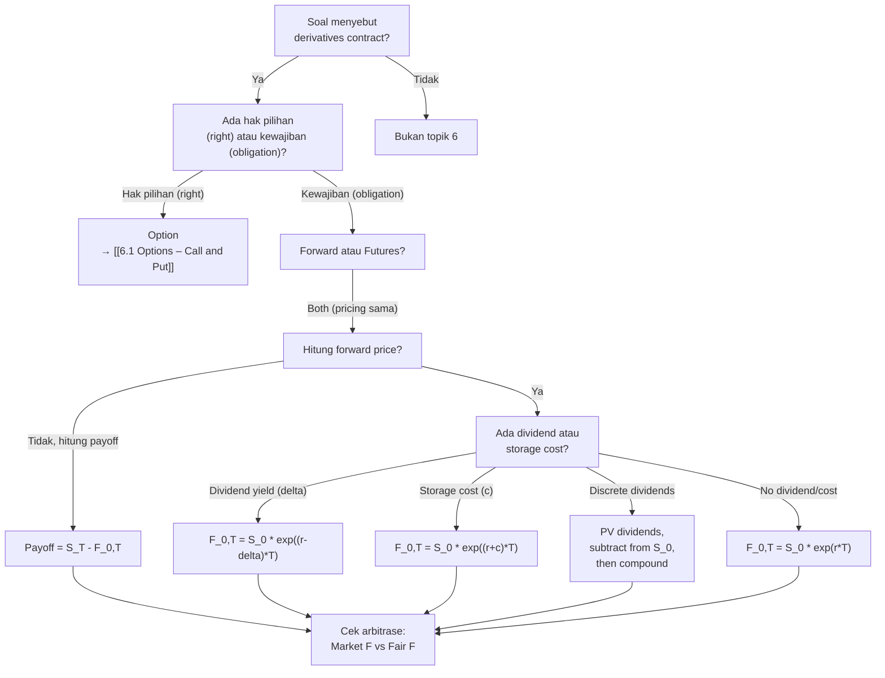

# 📘 6.2 — Forwards and Futures

> [!ABSTRACT] Ringkasan Cepat
> **Topik:** Forwards & Futures | **Bobot:** ~5–15% | **Difficulty:** Medium
> **Ref:** McDonald Bab 2.1–2.3, 5.1–5.2 | **Prereq:** [[1.2 Effective, Nominal, and Force of Interest]], [[3.1 Spot Rates and Forward Rates]]

## Section 0 — Pemetaan Topik

| Topik CF1 | Sub-topik ID | Skill Diuji | Bobot | Difficulty | Prerequisite | Connected Topics | Referensi |
|-----------|--------------|-------------|-------|------------|--------------|------------------|-----------|
| Topik 6: Produk Derivatif | 6.2 | Menghitung forward price dan prepaid forward price; memahami cost of carry; menghitung payoff dan profit forward contract; membedakan forward vs futures; argumen no-arbitrage pricing | 5–15% | Medium | [[1.2 Effective, Nominal, and Force of Interest]], [[3.1 Spot Rates and Forward Rates]] | [[6.1 Options – Call and Put]], [[5.1 Bond Pricing]], [[3.2 Yield Curve]] | McDonald 2.1–2.3, 5.1–5.2 |

## Section 1 — Intuisi

Bayangkan kamu adalah petani kopi yang akan panen tiga bulan lagi. Kamu khawatir harga kopi akan turun drastis saat panen tiba—mungkin dari Rp 50.000 per kg sekarang menjadi Rp 35.000 per kg. Atau sebaliknya: kamu adalah pemilik kafe yang butuh 1 ton kopi tiga bulan lagi, dan kamu khawatir harga akan melonjak ke Rp 70.000 per kg. Kalian berdua ingin **kepastian harga** hari ini untuk transaksi di masa depan.

**Forward contract** adalah kesepakatan mengikat antara dua pihak untuk membeli/menjual aset pada harga tertentu (forward price) di waktu tertentu di masa depan. Berbeda dengan option di mana pemegang punya **hak pilihan**, forward adalah **kewajiban wajib**—kedua pihak harus execute kontrak di maturity, tidak ada pilihan untuk batalkan.

Petani kopi (short forward) sepakat menjual 1 ton kopi di Rp 48.000 per kg tiga bulan lagi. Pemilik kafe (long forward) sepakat membeli di harga itu. Di hari maturity, tidak peduli harga pasar Rp 35.000 atau Rp 70.000, transaksi tetap terjadi di Rp 48.000. Petani dapat kepastian revenue, kafe dapat kepastian cost.

**Forward price** ($F_{0,T}$) adalah harga yang disepakati hari ini untuk transaksi di waktu $T$, dihitung dengan prinsip **no-arbitrage**: tidak boleh ada peluang profit tanpa risiko dengan membandingkan strategi "beli spot sekarang + hold sampai $T$" vs "beli via forward contract". Jika forward price terlalu tinggi atau rendah dari nilai fair (yang di-derived dari cost of carry), investor bisa arbitrase.

**Futures contract** serupa dengan forward, tetapi diperdagangkan di bursa (exchange-traded) dengan standardisasi, margin requirement, dan **daily settlement** (mark-to-market setiap hari). Di CF1, fokus utama adalah forward pricing dengan no-arbitrage, dan perbedaan konseptual forward vs futures.

## Section 2 — Definisi Formal

> [!NOTE] Definisi Matematis
> **Forward Contract:** Kontrak derivatif yang mewajibkan pemegang (long position) untuk **membeli** aset underlying pada harga forward $F_{0,T}$ di waktu maturity $T$, dan mewajibkan counterparty (short position) untuk **menjual** aset tersebut di harga yang sama.
>
> **Forward Price (no dividend, no income):**
> $$
> F_{0,T} = S_0 e^{rT}
> $$
> di mana $S_0$ adalah harga spot saat ini, $r$ adalah risk-free rate (continuously compounded), $T$ adalah time to maturity.
>
> **Prepaid Forward Price:**
> $$
> F^P_{0,T} = S_0
> $$
> Harga di waktu $0$ untuk kontrak yang mengharuskan pembayaran di $t=0$ dan delivery aset di $t=T$.
>
> **Payoff Long Forward di Maturity:**
> $$
> \text{Payoff}_{\text{long}} = S_T - F_{0,T}
> $$
>
> **Forward Price dengan Dividend Yield (continuous):**
> $$
> F_{0,T} = S_0 e^{(r - \delta)T}
> $$
> di mana $\delta$ adalah dividend yield (continuously compounded).

### Variabel & Parameter

| Simbol | Makna | Unit / Range |
|--------|-------|--------------|
| $S_0$ | Harga spot aset underlying saat ini (waktu 0) | Mata uang, $S_0 > 0$ |
| $S_T$ | Harga spot aset underlying di maturity $T$ | Mata uang, $S_T \geq 0$ |
| $F_{0,T}$ | Forward price untuk kontrak dari waktu 0 ke waktu $T$ | Mata uang |
| $F^P_{0,T}$ | Prepaid forward price | Mata uang |
| $T$ | Time to maturity (tahun) | $T > 0$ |
| $r$ | Risk-free rate (continuously compounded) | Decimal, $r \geq 0$ |
| $\delta$ | Dividend yield atau income yield (continuously compounded) | Decimal, $\delta \geq 0$ |
| $\text{Payoff}$ | Nilai kontrak di maturity | Mata uang, bisa positif atau negatif |
| $V_t$ | Nilai forward contract di waktu $t$ (mark-to-market) | Mata uang |

### Rumus Utama

$$
F_{0,T} = S_0 e^{rT}
$$
**Label:** Forward price untuk aset tanpa income/dividend (no-arbitrage pricing).

$$
F^P_{0,T} = S_0 e^{-\delta T}
$$
**Label:** Prepaid forward price untuk aset dengan dividend yield $\delta$ (present value dari aset di waktu $T$, dikurangi dividen yang akan diterima).

$$
F_{0,T} = F^P_{0,T} \cdot e^{rT}
$$
**Label:** Relasi antara forward price dan prepaid forward price.

$$
F_{0,T} = S_0 e^{(r - \delta)T}
$$
**Label:** Forward price dengan dividend yield (cost of carry model).

$$
\text{Payoff Long Forward} = S_T - F_{0,T}
$$
**Label:** Payoff untuk long forward contract di maturity (bisa positif atau negatif, tidak ada $\max$ seperti option).

$$
\text{Payoff Short Forward} = F_{0,T} - S_T
$$
**Label:** Payoff untuk short forward contract di maturity (negatif dari long).

$$
V_t = S_t - F_{0,T} e^{-r(T-t)}
$$
**Label:** Nilai (mark-to-market) long forward contract di waktu $t$ sebelum maturity (present value selisih spot dan forward).

### Asumsi Eksplisit

- **No Arbitrage:** Pasar efisien, tidak ada peluang profit tanpa risiko tanpa modal.
- **Frictionless Market:** Tidak ada biaya transaksi, pajak, atau spread bid-ask.
- **Continuous Trading:** Aset underlying dapat diperdagangkan kapan saja.
- **Known and Constant Risk-Free Rate:** $r$ diketahui dan konstan selama periode forward.
- **No Counterparty Risk:** Kedua pihak akan memenuhi kewajiban di maturity (atau ada mekanisme collateral/margin).
- **Perfectly Divisible Assets:** Aset dapat diperdagangkan dalam jumlah fraksional.

## Section 3 — Jembatan Logika

> [!TIP] Dari Time Diagram ke Equation of Value
> Forward price muncul dari **argumen no-arbitrage** dengan membandingkan dua strategi:
> 
> **Strategi A (Cash-and-Carry):**
> - Di $t=0$: Beli aset spot dengan harga $S_0$ (borrow uang di risk-free rate $r$).
> - Di $t=T$: Punya aset senilai $S_T$, harus bayar hutang $S_0 e^{rT}$.
> - Net cash flow di $t=T$: $S_T - S_0 e^{rT}$.
>
> **Strategi B (Long Forward):**
> - Di $t=0$: Enter long forward contract (tidak ada cash flow di $t=0$, karena forward biasanya zero initial cost).
> - Di $t=T$: Bayar forward price $F_{0,T}$, terima aset senilai $S_T$.
> - Net cash flow di $t=T$: $S_T - F_{0,T}$.
>
> Karena kedua strategi memberikan hasil identik di $t=T$ (sama-sama punya aset senilai $S_T$), maka **cost** harus sama (no-arbitrage):
> $$
> F_{0,T} = S_0 e^{rT}
> $$
>
> **Makna ekonomi $e^{rT}$:** Ini adalah **cost of carry**—biaya untuk "carry" aset dari $t=0$ ke $t=T$. Biaya ini adalah opportunity cost dari dana yang diinvestasikan (bisa dapat bunga $r$ jika ditaruh di risk-free asset).
>
> **Prepaid forward** adalah kontrak di mana pembayaran dilakukan di $t=0$, tetapi delivery aset di $t=T$. Harganya harus sama dengan present value aset di waktu $T$:
> $$
> F^P_{0,T} = S_0 e^{-\delta T}
> $$
> Di mana $\delta$ adalah income yield (dividen, storage cost, convenience yield, dll.).

> [!IMPORTANT] Focal Date
> Focal date untuk derivasi forward price adalah $t = T$ (maturity), di mana kita bandingkan payoff dari strategi cash-and-carry vs long forward. Untuk mark-to-market value di $t < T$, focal date di waktu $t$ dengan discount back dari $T$.

**Derivasi Forward Price (No Dividend):**

Kita bandingkan dua portfolio di waktu $T$:

**Portfolio A (Cash-and-Carry):**
- Di $t=0$: Borrow $S_0$ dengan rate $r$, gunakan untuk beli aset spot.
- Di $t=T$: Punya aset senilai $S_T$, hutang tumbuh menjadi $S_0 e^{rT}$.
- Net value di $t=T$: $S_T - S_0 e^{rT}$.

**Portfolio B (Synthetic Forward):**
- Di $t=0$: Enter long forward contract dengan forward price $F_{0,T}$ (zero initial cost).
- Di $t=T$: Bayar $F_{0,T}$, terima aset senilai $S_T$.
- Net value di $t=T$: $S_T - F_{0,T}$.

Karena kedua portfolio memberikan aset yang sama di $t=T$ (keduanya punya aset senilai $S_T$ dan obligasi negatif), dan Portfolio A memerlukan borrow $S_0$ di $t=0$, maka Portfolio B (forward) harus memberikan hasil sama:

Set net value sama:
$$
S_T - F_{0,T} = S_T - S_0 e^{rT}
$$

Solusi:
$$
F_{0,T} = S_0 e^{rT}
$$

**Argumen No-Arbitrage:**

Jika $F_{0,T} > S_0 e^{rT}$, investor bisa:
- **Arbitrage strategy:** Beli spot di $S_0$ (borrow dana dengan rate $r$), short forward di $F_{0,T}$.
- Di $t=T$: Deliver aset ke forward (terima $F_{0,T}$), bayar hutang $S_0 e^{rT}$.
- Profit tanpa risiko: $F_{0,T} - S_0 e^{rT} > 0$.

Jika $F_{0,T} < S_0 e^{rT}$, investor bisa:
- **Reverse arbitrage:** Short spot (jual aset dengan harga $S_0$, invest di risk-free rate $r$), long forward di $F_{0,T}$.
- Di $t=T$: Terima dari investasi $S_0 e^{rT}$, bayar forward $F_{0,T}$, terima kembali aset.
- Profit tanpa risiko: $S_0 e^{rT} - F_{0,T} > 0$.

Pasar akan menyesuaikan hingga $F_{0,T} = S_0 e^{rT}$ (no-arbitrage condition).

**Forward Price dengan Dividend:**

Jika aset membayar dividen dengan yield $\delta$ (continuously compounded), pemegang spot asset akan menerima dividen selama periode $[0, T]$. Ini mengurangi cost of carry.

Adjust cash-and-carry:
- Di $t=0$: Beli aset di $S_0$ (borrow).
- Selama $[0, T]$: Terima dividen dengan PV total $S_0 (1 - e^{-\delta T})$ (approximate untuk small $\delta T$).
- Di $t=T$: Punya aset senilai $S_T$, hutang $S_0 e^{rT}$, tapi sudah terima dividen.

Net cost sebenarnya:
$$
F_{0,T} = S_0 e^{rT} - \text{PV dividen}
$$

Dengan continuous dividend yield $\delta$:
$$
F_{0,T} = S_0 e^{(r - \delta)T}
$$

> [!DANGER] Dilarang
> 1. **Menggunakan $S_T$ untuk menghitung $F_{0,T}$:** Forward price dihitung dari $S_0$ (spot hari ini), bukan $S_T$ (harga masa depan yang belum diketahui).
> 2. **Lupa bahwa forward payoff bisa negatif:** Tidak seperti option, payoff forward adalah $S_T - F_{0,T}$, bisa negatif jika $S_T < F_{0,T}$. Tidak ada $\max(\ldots, 0)$.
> 3. **Mencampur effective rate dan continuous rate:** $F_{0,T} = S_0 e^{rT}$ menggunakan **continuous rate** $r$. Jika rate diberikan effective, harus convert dulu: $r = \ln(1+i)$.

## Section 4 — Contoh Soal

### Soal A — Fundamental

Harga spot saham XYZ saat ini adalah $S_0 = 100$. Risk-free rate adalah $r = 5\%$ per tahun (continuously compounded). Saham tidak membayar dividen. Hitunglah:
(a) Forward price untuk kontrak 6 bulan
(b) Payoff long forward jika harga spot di maturity adalah $S_T = 110$

**Data yang diberikan:**
- Harga spot $S_0 = 100$
- Risk-free rate $r = 0.05$ (continuously compounded)
- Time to maturity $T = 0.5$ tahun
- Tidak ada dividen

> [!SUCCESS] Solusi Soal A
> 
> **1. Identifikasi Variabel**
> - $S_0 = 100$
> - $r = 0.05$
> - $T = 0.5$
> - $\delta = 0$ (no dividend)
> - Dicari: (a) $F_{0,T}$, (b) Payoff jika $S_T = 110$
> 
> **2. Time Diagram**
> ```
> t=0                           t=0.5 (maturity)
> |------------------------------|
> S₀=100                    S_T=110 (actual spot)
>                           F₀,T=? (forward price)
>                           
> Long forward: wajib beli di F₀,T
> Payoff = S_T - F₀,T
> ```
> 
> **3. Equation of Value** *(pada Focal Date $t = T$)*
> 
> Forward price (no dividend):
> $$
> F_{0,T} = S_0 e^{rT}
> $$
> 
> Payoff long forward:
> $$
> \text{Payoff} = S_T - F_{0,T}
> $$
> 
> **4. Eksekusi Aljabar**
> 
> **(a) Forward Price:**
> 
> $$
> F_{0,T} = 100 \times e^{0.05 \times 0.5} = 100 \times e^{0.025}
> $$
> 
> Hitung $e^{0.025}$:
> $$
> e^{0.025} \approx 1.025315
> $$
> 
> $$
> F_{0,T} = 100 \times 1.025315 = 102.5315 \approx 102.53
> $$
> 
> **(b) Payoff jika $S_T = 110$:**
> 
> $$
> \text{Payoff} = S_T - F_{0,T} = 110 - 102.53 = 7.47
> $$
> 
> Payoff long forward = $7.47$ (profit karena spot di maturity lebih tinggi dari forward price).
> 
> **5. Verification**
> 
> Cek no-arbitrage: Jika investor beli spot di $t=0$ dengan borrow $100$ di rate 5%, di $t=0.5$ hutang jadi $102.53$. Jika dia punya aset senilai $110$, net = $110 - 102.53 = 7.47$ ✓, sama dengan payoff long forward.
> 
> Logika finansial: Forward price $102.53$ adalah spot $100$ plus cost of carry (bunga 5% selama 6 bulan). Karena spot di maturity naik ke $110$, pemegang long forward untung $7.47$ (beli di $102.53$, nilai pasar $110$).
> 
> [!WARNING] Exam Tips — Soal A
> **Target waktu:** 2–2.5 menit. **Common trap:** Lupa bahwa $T = 0.5$ tahun (bukan 6 bulan langsung dalam rumus). **Shortcut:** Untuk $rT$ kecil, $e^{rT} \approx 1 + rT$ (Taylor approximation) untuk estimasi cepat. Di sini: $e^{0.025} \approx 1.025$.

---

### Soal B — Exam-Typical

Harga spot emas saat ini adalah $S_0 = 1{,}800$ per ons. Risk-free rate adalah $r = 3\%$ per tahun (continuously compounded). Storage cost untuk emas adalah $c = 1\%$ per tahun (continuously compounded, diperlakukan seperti negative dividend). Hitunglah:
(a) Forward price untuk kontrak 1 tahun
(b) Jika forward price aktual di pasar adalah $1{,}850$, apakah ada peluang arbitrase? Jelaskan strategi arbitrase jika ada.

**Data yang diberikan:**
- Harga spot emas $S_0 = 1{,}800$
- Risk-free rate $r = 0.03$
- Storage cost $c = 0.01$ (treated as negative dividend: $\delta = -0.01$)
- Time to maturity $T = 1$ tahun

> [!SUCCESS] Solusi Soal B
> 
> **1. Identifikasi Variabel**
> - $S_0 = 1{,}800$
> - $r = 0.03$
> - $c = 0.01$ (storage cost, sehingga effective rate $r + c = 0.04$)
> - $T = 1$
> - Dicari: (a) Fair forward price $F_{0,T}$, (b) Arbitrase jika market $F = 1{,}850$
> 
> **2. Time Diagram**
> ```
> t=0                                t=1
> |----------------------------------|
> S₀=1,800                     Deliver emas
> Borrow 1,800               Bayar hutang + storage
> di rate r                   
> ```
> 
> **3. Equation of Value** *(pada Focal Date $t = T = 1$)*
> 
> Forward price dengan storage cost:
> $$
> F_{0,T} = S_0 e^{(r + c)T}
> $$
> 
> Argumen no-arbitrage: Jika $F_{\text{market}} > F_{0,T}$ atau $F_{\text{market}} < F_{0,T}$, ada arbitrase.
> 
> **4. Eksekusi Aljabar**
> 
> **(a) Fair Forward Price:**
> 
> $$
> F_{0,T} = 1{,}800 \times e^{(0.03 + 0.01) \times 1} = 1{,}800 \times e^{0.04}
> $$
> 
> Hitung $e^{0.04}$:
> $$
> e^{0.04} \approx 1.040811
> $$
> 
> $$
> F_{0,T} = 1{,}800 \times 1.040811 = 1{,}873.46
> $$
> 
> Fair forward price: $1{,}873.46$
> 
> **(b) Arbitrase Analysis:**
> 
> Market forward price: $1{,}850$
> Fair forward price: $1{,}873.46$
> 
> Karena $F_{\text{market}} = 1{,}850 < F_{0,T} = 1{,}873.46$, forward **underpriced** (terlalu murah).
> 
> **Strategi Arbitrase:**
> 1. **Long forward** di $1{,}850$ (kontrak untuk beli emas di maturity).
> 2. **Short spot:** Jual emas sekarang di $S_0 = 1{,}800$ (atau pinjam emas dan jual).
> 3. **Invest** hasil $1{,}800$ di risk-free rate $r = 3\%$.
> 4. **Save storage cost** $c = 1\%$ karena tidak pegang emas fisik.
> 
> Di $t=1$:
> - Investasi tumbuh menjadi: $1{,}800 \times e^{0.03} = 1{,}854.67$
> - Beli emas via forward di: $1{,}850$
> - Kembalikan emas yang dipinjam (atau keep jika pure short).
> - Profit: $1{,}854.67 - 1{,}850 = 4.67$ per ons (plus penghematan storage $1{,}800 \times (e^{0.01} - 1) \approx 18$).
> 
> Lebih teliti:
> Net profit = $(S_0 e^{r} - F_{\text{market}}) = 1{,}800 \times e^{0.03} - 1{,}850 = 1{,}854.67 - 1{,}850 = 4.67$ (simplified, ignoring storage saving yang sudah termasuk di fair price).
> 
> Sebenarnya, profit adalah:
> $$
> \text{Profit} = F_{0,T} - F_{\text{market}} = 1{,}873.46 - 1{,}850 = 23.46
> $$
> 
> **5. Verification**
> 
> Cek fair forward: $1{,}800 \times e^{0.04} = 1{,}873.46$ ✓
> 
> Logika finansial: Jika kamu short spot dan invest, setelah bayar storage cost equivalent, kamu butuh payoff $1{,}873.46$ di maturity untuk breakeven. Karena forward market hanya $1{,}850$, kamu bisa lock profit $23.46$ per ons tanpa risiko.

> [!WARNING] Exam Tips — Soal B
> **Target waktu:** 3.5–4 menit. **Common trap:** Storage cost adalah **penambahan** ke rate (cost of carry), bukan pengurangan. Dividen adalah pengurangan ($r - \delta$), storage adalah penambahan ($r + c$). **Shortcut:** Jika forward market price $\neq$ fair price, cek apakah over/underpriced, lalu tentukan long/short strategi.

---

### Soal C — Challenging

Harga spot saham ABC adalah $S_0 = 50$. Risk-free rate adalah $r = 6\%$ per tahun (continuously compounded). Saham membayar dividen $2$ pada $t = 0.25$ tahun (3 bulan) dan $2$ pada $t = 0.5$ tahun (6 bulan). Hitunglah forward price untuk kontrak 9 bulan ($T = 0.75$ tahun).

**Data yang diberikan:**
- $S_0 = 50$
- $r = 0.06$
- Dividen: $D_1 = 2$ di $t_1 = 0.25$, $D_2 = 2$ di $t_2 = 0.5$
- $T = 0.75$ tahun

> [!SUCCESS] Solusi Soal C
> 
> **1. Identifikasi Variabel**
> - $S_0 = 50$
> - $r = 0.06$
> - $D_1 = 2$ di $t_1 = 0.25$
> - $D_2 = 2$ di $t_2 = 0.5$
> - $T = 0.75$
> - Dicari: $F_{0,T}$
> 
> **2. Time Diagram**
> ```
> t=0      t=0.25    t=0.5              t=0.75
> |---------|---------|------------------|
> S₀=50     D₁=2      D₂=2         Deliver saham
>                                  di forward price F₀,T
> ```
> 
> **3. Equation of Value** *(pada Focal Date $t = T = 0.75$)*
> 
> Forward price dengan discrete dividends:
> $$
> F_{0,T} = \left( S_0 - \text{PV}_0(\text{dividends}) \right) e^{rT}
> $$
> 
> di mana:
> $$
> \text{PV}_0(\text{dividends}) = D_1 e^{-r t_1} + D_2 e^{-r t_2}
> $$
> 
> **4. Eksekusi Aljabar**
> 
> Hitung present value dividen di $t=0$:
> 
> $$
> \text{PV}_0(D_1) = 2 \times e^{-0.06 \times 0.25} = 2 \times e^{-0.015}
> $$
> 
> Hitung $e^{-0.015}$:
> $$
> e^{-0.015} \approx 0.985112
> $$
> 
> $$
> \text{PV}_0(D_1) = 2 \times 0.985112 = 1.970224
> $$
> 
> $$
> \text{PV}_0(D_2) = 2 \times e^{-0.06 \times 0.5} = 2 \times e^{-0.03}
> $$
> 
> Hitung $e^{-0.03}$:
> $$
> e^{-0.03} \approx 0.970446
> $$
> 
> $$
> \text{PV}_0(D_2) = 2 \times 0.970446 = 1.940892
> $$
> 
> Total PV dividen:
> $$
> \text{PV}_0(\text{dividends}) = 1.970224 + 1.940892 = 3.911116
> $$
> 
> Harga spot setelah dikurangi PV dividen:
> $$
> S_0^* = S_0 - \text{PV}_0(\text{dividends}) = 50 - 3.911116 = 46.088884
> $$
> 
> Forward price:
> $$
> F_{0,T} = S_0^* \times e^{rT} = 46.088884 \times e^{0.06 \times 0.75}
> $$
> 
> Hitung $e^{0.045}$:
> $$
> e^{0.045} \approx 1.046028
> $$
> 
> $$
> F_{0,T} = 46.088884 \times 1.046028 = 48.209884 \approx 48.21
> $$
> 
> **5. Verification**
> 
> Cek logika: Spot $50$, dikurangi PV dividen $\approx 3.91$, sisa $\approx 46.09$. Compound dengan rate 6% selama 0.75 tahun: $46.09 \times 1.046 \approx 48.21$ ✓
> 
> Logika finansial: Pemegang spot asset akan terima dividen $2 + 2 = 4$ total selama periode forward. PV dividen ini $\approx 3.91$ di $t=0$. Sisa nilai asset $46.09$ perlu di-compound ke maturity dengan cost of carry. Forward price $48.21$ lebih rendah dari spot $50$ karena dividen mengurangi cost of carry.
> 
> [!WARNING] Exam Tips — Soal C
> **Target waktu:** 5–6 menit. **Common trap:** Lupa discount dividen ke $t=0$ sebelum kurangkan dari $S_0$. Atau salah menghitung eksponen ($t_1 = 0.25$ bukan $0.25/12$). **Shortcut:** Untuk discrete dividends, selalu: (1) PV all dividends, (2) subtract from $S_0$, (3) compound result to maturity.

## Section 5 — Verifikasi & Sanity Check

> [!CHECK] No-Arbitrage Bounds
> 1. **Forward price harus positif:** $F_{0,T} > 0$ jika $S_0 > 0$ dan $r > 0$ (atau $r - \delta > 0$).
> 2. **Forward price vs spot:** Jika no dividend ($\delta = 0$) dan $r > 0$, maka $F_{0,T} > S_0$. Jika dividend yield $\delta > r$, maka $F_{0,T} < S_0$.
> 3. **Prepaid forward:** $F^P_{0,T} \leq S_0$ jika dividend yield $\delta \geq 0$ (asset loses value via dividends).

> [!CHECK] Cost of Carry
> 1. **Total cost of carry:** $r - \delta + c$, di mana $r$ = risk-free rate, $\delta$ = dividend/income yield (negative cost), $c$ = storage/insurance cost (positive cost).
> 2. **Forward price relationship:** $F_{0,T} = S_0 e^{(r - \delta + c)T}$.
> 3. **Jika $r < \delta - c$:** Forward price bisa lebih rendah dari spot (convenience yield atau high dividend).

> [!CHECK] Mark-to-Market Value
> 1. **Value long forward di $t < T$:** $V_t = S_t - F_{0,T} e^{-r(T-t)}$ (present value dari expected payoff).
> 2. **Value di initiation ($t=0$):** $V_0 = 0$ jika $F_{0,T}$ adalah fair forward price.
> 3. **Value di maturity ($t=T$):** $V_T = S_T - F_{0,T}$ (payoff).

### Metode Alternatif

**Menggunakan Effective Rate (bukan Continuous):**

Jika risk-free rate diberikan sebagai effective annual rate $i$ (bukan continuous $r$):
$$
F_{0,T} = S_0 (1+i)^T
$$

Konversi antara continuous dan effective:
$$
e^{rT} = (1+i)^T \quad \Rightarrow \quad r = \ln(1+i)
$$

**Discrete Dividend (alternatif formula):**

Jika dividen diberikan sebagai yield discrete $q$ per periode (bukan continuous $\delta$):
$$
F_{0,T} = S_0 (1 + i)^T - \sum_{k} D_k (1+i)^{T - t_k}
$$

di mana $D_k$ adalah dividen di waktu $t_k$, dan kita compound dividen dari $t_k$ ke $T$ dengan rate $i$.

Di CF1, biasanya continuous rate lebih sering digunakan untuk konsistensi dengan derivatives pricing.

## Section 6 — Visualisasi Mental

**Payoff Diagram — Long Forward:**

Bayangkan grafik dengan **sumbu X = harga spot di maturity $S_T$** dan **sumbu Y = payoff**. Kurva long forward adalah **garis lurus** dengan slope +1, interseksi dengan sumbu X di $S_T = F_{0,T}$:

- Jika $S_T < F_{0,T}$: Payoff negatif (rugi, harus beli di $F_{0,T}$ padahal market value lebih rendah).
- Jika $S_T = F_{0,T}$: Payoff = 0 (breakeven).
- Jika $S_T > F_{0,T}$: Payoff positif (profit, beli di $F_{0,T}$ padahal market value lebih tinggi).

**Tidak ada kink** seperti option—payoff linear untuk semua nilai $S_T$.

**Payoff Diagram — Short Forward:**

Garis lurus dengan slope -1, interseksi dengan sumbu X di $S_T = F_{0,T}$:

- Jika $S_T < F_{0,T}$: Payoff positif (profit, jual di $F_{0,T}$ padahal market value lebih rendah).
- Jika $S_T > F_{0,T}$: Payoff negatif (rugi, jual di $F_{0,T}$ padahal market value lebih tinggi).

**Perbandingan Forward vs Option (Conceptual):**

- **Forward (long call payoff region):** Linear di semua region, tidak ada downside protection. Symmetric risk (profit unlimited, loss unlimited).
- **Option (long call):** Kinked di $S_T = K$, downside protected (max loss = premium), upside unlimited.

**Forward Price Growth Over Time (Conceptual):**

Jika kita plot forward price $F_{t,T}$ untuk different initiation time $t$ (dengan fixed maturity $T$), saat $t \to T$:
$$
F_{t,T} = S_t e^{r(T-t)} \to S_T \quad \text{as } t \to T
$$

Forward price **converges** ke spot price di maturity. Ini adalah properti konsistensi forward pricing.

### Hubungan Visual ↔ Rumus

Slope payoff diagram long forward adalah +1 karena:
$$
\frac{d}{dS_T} (S_T - F_{0,T}) = 1
$$

Tidak ada kink karena tidak ada $\max$ function—payoff adalah fungsi linear dari $S_T$.

Interseksi dengan sumbu X (payoff = 0) terjadi di $S_T = F_{0,T}$, yang adalah **breakeven point**.

## Section 7 — Jebakan Umum

> [!BUG] Kesalahan Unit Waktu
> **Contoh Salah:** Forward maturity 9 bulan, risk-free rate $r = 6\%$ per tahun. Menghitung $F_{0,T} = S_0 e^{0.06 \times 9}$ (menggunakan 9 langsung instead of 0.75).
>
> **Benar:** Konversi dulu ke tahun: $T = 9/12 = 0.75$ tahun. Maka $F_{0,T} = S_0 e^{0.06 \times 0.75} = S_0 e^{0.045}$.

> [!BUG] Kesalahan Konseptual
> 1. **Payoff forward vs option:** Forward payoff adalah $S_T - F_{0,T}$, bukan $\max(S_T - F_{0,T}, 0)$. Forward bisa rugi unlimited, option hanya rugi premi.
> 2. **Storage cost vs dividend:** Storage cost (dan insurance, etc.) adalah **penambahan** ke cost of carry ($r + c$). Dividend adalah **pengurangan** ($r - \delta$). Jangan terbalik!
> 3. **Forward price menggunakan $S_T$:** Forward price dihitung dari $S_0$ (spot hari ini) dengan formula $F_{0,T} = S_0 e^{rT}$. Kita tidak tahu $S_T$ di awal—itu variabel acak.
> 4. **Initial value forward:** Di $t=0$, jika forward price adalah fair price, nilai kontrak = 0 (no cash exchange). Bukan nilai $F_{0,T}$!

> [!BUG] Kesalahan Interpretasi Soal
> **Ambiguitas:** Soal mengatakan "dividend yield 3%" tanpa jelas apakah continuous atau discrete.
>
> **Klarifikasi:** Default CF1 adalah **continuous** ($\delta = 0.03$ per tahun continuously compounded) kecuali eksplisit disebutkan discrete atau "3% per quarter."

> [!CAUTION] Red Flags
> - **"Forward price higher than spot":** Ini normal jika $r > \delta$ (cost of carry positif). Tidak berarti mispriced kecuali melanggar relasi $F_{0,T} = S_0 e^{(r-\delta)T}$.
> - **"Commodity futures":** Bisa ada convenience yield (benefit dari holding fisik komoditas, misal untuk produksi). Ini mengurangi forward price, treated seperti dividend.
> - **"Futures vs forward":** Di CF1, fokus pricing adalah sama (no-arbitrage). Perbedaan utama: futures = exchange-traded, standardized, daily settlement. Forward = OTC, customized, settlement di maturity.
> - **"Discrete dividends":** Harus discount setiap dividen ke $t=0$ dengan $e^{-r t_k}$, lalu kurangkan dari $S_0$ sebelum compound ke $T$.

## Section 8 — Ringkasan Eksekutif

> [!SUMMARY] Must-Remember
> 1. **Forward price (no dividend):**
>    $$
>    F_{0,T} = S_0 e^{rT}
>    $$
> 2. **Forward price dengan dividend yield:**
>    $$
>    F_{0,T} = S_0 e^{(r - \delta)T}
>    $$
> 3. **Prepaid forward price:**
>    $$
>    F^P_{0,T} = S_0 e^{-\delta T}
>    $$
> 4. **Payoff long forward:**
>    $$
>    \text{Payoff} = S_T - F_{0,T}
>    $$
> 5. **Mark-to-market value (long forward at $t < T$):**
>    $$
>    V_t = S_t - F_{0,T} e^{-r(T-t)}
>    $$

### Kapan Digunakan

- **Trigger keywords:** "forward contract," "forward price," "cost of carry," "no-arbitrage," "prepaid forward," "futures," "delivery," "commodity," "storage cost."
- **Tipe skenario soal:**
  - Hitung forward price given $S_0$, $r$, $T$, dividend/storage.
  - Hitung payoff/profit given $S_T$ dan $F_{0,T}$.
  - Identifikasi arbitrase jika forward market price $\neq$ fair price.
  - Compare forward vs futures (conceptual).
  - Calculate mark-to-market value di waktu $t < T$.

### Kapan TIDAK Boleh Digunakan

- **Jika ada hak pilihan (optional exercise):** Itu option (topik 6.1), bukan forward. Forward adalah **kewajiban wajib**.
- **Jika diminta pricing option:** Forward pricing menggunakan no-arbitrage dengan cost of carry. Option pricing perlu model lain (Black-Scholes—beyond CF1 scope).
- **Jika aset tidak tradable atau no market price:** Forward pricing assume aset underlying dapat dibeli/dijual di spot market. Jika tidak (misal cuaca, indeks non-tradable), pricing berbeda.

### Quick Decision Tree



---

> [!QUOTE] Follow-up Options
> 1. *"Berikan contoh soal variasi forward dengan commodity dan convenience yield"*
> 2. *"Jelaskan hubungan [[6.2 Forwards and Futures]] dengan [[3.1 Spot Rates and Forward Rates]]"*
> 3. *"Buat flashcard 1-halaman untuk topik ini"*

*📖 Ref: McDonald Bab 2.1–2.3, 5.1–5.2 | 🗓️ 2026-02-17 | #CF1 #Forwards #Futures #Derivatives*
