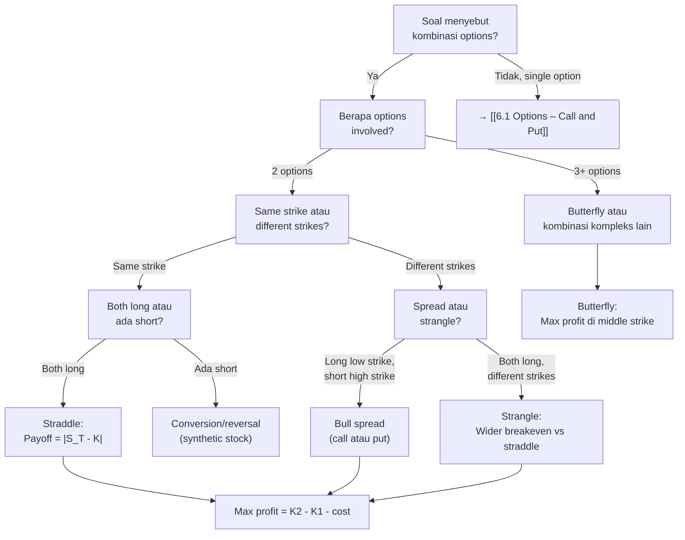

# 📘 6.3 — Option Strategies

> [!ABSTRACT] Ringkasan Cepat
> **Topik:** Option Strategies | **Bobot:** ~5–15% | **Difficulty:** Calculation-Intensive
> **Ref:** McDonald Bab 3, 5.3–5.4 | **Prereq:** [[6.1 Options – Call and Put]]

## Section 0 — Pemetaan Topik

| Topik CF1 | Sub-topik ID | Skill Diuji | Bobot | Difficulty | Prerequisite | Connected Topics | Referensi |
|-----------|--------------|-------------|-------|------------|--------------|------------------|-----------|
| Topik 6: Produk Derivatif | 6.3 | Menghitung payoff dan profit kombinasi options; mengidentifikasi strategi dari payoff diagram; memahami bull/bear spread, straddle, strangle, collar, butterfly; menentukan breakeven points; interpretasi risk-reward profile | 5–15% | Calculation-Intensive | [[6.1 Options – Call and Put]] | [[6.2 Forwards and Futures]], [[5.1 Bond Pricing]] | McDonald 3.1–3.6, 5.3–5.4 |

## Section 1 — Intuisi

Bayangkan kamu adalah investor yang punya pandangan pasar: kamu yakin saham teknologi akan naik dalam 6 bulan ke depan, tetapi tidak yakin seberapa besar kenaikannya. Membeli call option memberikan leverage, tetapi preminya mahal. Atau sebaliknya: kamu khawatir saham yang kamu pegang akan turun, tetapi asuransi penuh (buying put) terlalu mahal. **Option strategies** memberikan solusi dengan mengkombinasikan beberapa positions untuk menciptakan risk-reward profile yang lebih sesuai dengan pandangan dan budget kamu.

**Bull spread** adalah strategi untuk mengambil keuntungan dari kenaikan moderat harga aset dengan biaya lebih rendah dari membeli call biasa. Caranya: beli call dengan strike rendah, jual call dengan strike tinggi. Kamu dapat profit jika harga naik (dari call yang dibeli), tetapi profit kamu dibatasi (cap) oleh call yang dijual. Kompensasinya: premi yang kamu bayar lebih murah karena premi call yang dijual mengurangi cost.

**Straddle** adalah strategi untuk mengambil keuntungan dari **volatilitas tinggi** tanpa perlu prediksi arah. Beli call dan put dengan strike sama. Jika harga bergerak jauh ke atas atau ke bawah, salah satu option akan menghasilkan profit besar yang lebih dari cukup untuk cover premi kedua options. Jika harga tidak bergerak (tetap di strike), kamu rugi total premi—ini adalah bet on volatility, bukan direction.

**Collar** adalah strategi hedging untuk investor yang sudah punya saham dan ingin proteksi downside dengan biaya minimal. Beli put (insurance) dan jual call (untuk financing premi put). Hasilnya: kamu protected dari penurunan besar, tetapi upside potential juga dibatasi. Ini seperti "asuransi dengan deductible"—kamu korbankan upside untuk dapat downside protection murah.

Option strategies adalah fondasi manajemen risiko modern. Tanpa memahami kombinasi ini, kamu tidak bisa merancang hedging atau speculation yang cost-efficient. Di ujian CF1, kamu akan diuji kemampuan menghitung payoff kompleks, mengidentifikasi strategi dari diagram, dan menentukan breakeven.

## Section 2 — Definisi Formal

> [!NOTE] Definisi Matematis
> **Bull Call Spread:** Kombinasi long call strike $K_1$ dan short call strike $K_2$ dengan $K_1 < K_2$.
> $$
> \text{Payoff}_{\text{bull call}} = \max(S_T - K_1, 0) - \max(S_T - K_2, 0)
> $$
>
> **Straddle:** Kombinasi long call dan long put dengan strike sama $K$.
> $$
> \text{Payoff}_{\text{straddle}} = \max(S_T - K, 0) + \max(K - S_T, 0) = |S_T - K|
> $$
>
> **Collar:** Kombinasi long stock, long put strike $K_1$, short call strike $K_2$ dengan $K_1 < S_0 < K_2$.
> $$
> \text{Payoff}_{\text{collar}} = S_T + \max(K_1 - S_T, 0) - \max(S_T - K_2, 0)
> $$
>
> **Butterfly Spread:** Kombinasi long call $K_1$, short 2 calls $K_2$, long call $K_3$ dengan $K_1 < K_2 < K_3$ dan $K_2 - K_1 = K_3 - K_2$.
> $$
> \text{Payoff}_{\text{butterfly}} = \max(S_T - K_1, 0) - 2\max(S_T - K_2, 0) + \max(S_T - K_3, 0)
> $$

### Variabel & Parameter

| Simbol | Makna | Unit / Range |
|--------|-------|--------------|
| $S_0$ | Harga spot aset saat ini | Mata uang, $S_0 > 0$ |
| $S_T$ | Harga spot aset di maturity $T$ | Mata uang, $S_T \geq 0$ |
| $K$, $K_1$, $K_2$, $K_3$ | Strike prices | Mata uang, $K_1 < K_2 < K_3$ |
| $C(K)$ | Premi call option dengan strike $K$ | Mata uang, $C(K) \geq 0$ |
| $P(K)$ | Premi put option dengan strike $K$ | Mata uang, $P(K) \geq 0$ |
| $T$ | Time to maturity | Tahun, $T > 0$ |
| $r$ | Risk-free rate (continuously compounded) | Decimal |
| $\text{Payoff}$ | Total payoff strategi di maturity | Mata uang |
| $\text{Profit}$ | Payoff minus future value premi net | Mata uang |

### Rumus Utama

$$
\text{Payoff Bull Call Spread} = \begin{cases}
0 & \text{if } S_T \leq K_1 \\
S_T - K_1 & \text{if } K_1 < S_T < K_2 \\
K_2 - K_1 & \text{if } S_T \geq K_2
\end{cases}
$$
**Label:** Payoff bull call spread (profit dibatasi pada $K_2 - K_1$, loss dibatasi pada net premi).

$$
\text{Payoff Bear Put Spread} = \begin{cases}
K_2 - K_1 & \text{if } S_T \leq K_1 \\
K_2 - S_T & \text{if } K_1 < S_T < K_2 \\
0 & \text{if } S_T \geq K_2
\end{cases}
$$
**Label:** Payoff bear put spread (profit dari penurunan harga, max profit $K_2 - K_1$).

$$
\text{Payoff Straddle} = |S_T - K|
$$
**Label:** Payoff straddle (V-shape, profit jika harga bergerak jauh dari strike).

$$
\text{Payoff Strangle} = \max(S_T - K_2, 0) + \max(K_1 - S_T, 0)
$$
**Label:** Payoff strangle dengan $K_1 < K_2$ (seperti straddle tetapi strikes berbeda, premi lebih murah).

$$
\text{Payoff Collar} = \begin{cases}
K_1 & \text{if } S_T \leq K_1 \\
S_T & \text{if } K_1 < S_T < K_2 \\
K_2 & \text{if } S_T \geq K_2
\end{cases}
$$
**Label:** Payoff collar (downside protected di $K_1$, upside capped di $K_2$).

$$
\text{Breakeven Straddle} : \quad S_T = K \pm (C + P) e^{rT}
$$
**Label:** Dua breakeven points untuk straddle (strike plus/minus total premi future value).

### Asumsi Eksplisit

- **European Options:** Semua options di-exercise hanya di maturity $T$ (bukan American).
- **Same Maturity:** Semua options dalam strategi punya maturity yang sama.
- **No Transaction Costs:** Tidak ada biaya transaksi atau spread bid-ask.
- **Constant Risk-Free Rate:** Rate $r$ konstan selama periode option.
- **Same Underlying Asset:** Semua options dalam strategi untuk aset yang sama.

## Section 3 — Jembatan Logika

> [!TIP] Dari Time Diagram ke Equation of Value
> Option strategies terbentuk dari **kombinasi linear** payoff individual options. Misalnya bull call spread:
> - **Long call $K_1$:** Payoff = $\max(S_T - K_1, 0)$
> - **Short call $K_2$:** Payoff = $-\max(S_T - K_2, 0)$
> - **Total:** $\max(S_T - K_1, 0) - \max(S_T - K_2, 0)$
>
> Mengapa payoff ini dibatasi pada $K_2 - K_1$? Karena jika $S_T > K_2$:
> - Long call memberikan $S_T - K_1$
> - Short call memberikan $-(S_T - K_2) = K_2 - S_T$
> - Net: $(S_T - K_1) + (K_2 - S_T) = K_2 - K_1$ (konstan, tidak bergantung $S_T$)
>
> **Makna ekonomi:** Kamu korbankan upside unlimited (dari long call) untuk mengurangi cost (dari premi short call). Trade-off: limited profit untuk reduced cost.
>
> **Straddle payoff $|S_T - K|$** muncul karena:
> - Jika $S_T > K$: Call memberikan $S_T - K$, put worthless → total $S_T - K$
> - Jika $S_T < K$: Put memberikan $K - S_T$, call worthless → total $K - S_T$
> - Gabungan: $\max(S_T - K, 0) + \max(K - S_T, 0) = |S_T - K|$

> [!IMPORTANT] Focal Date
> Focal date untuk payoffs adalah $t = T$ (maturity). Untuk profit, compound semua premi net dari $t = 0$ ke $t = T$ dengan $e^{rT}$.

**Derivasi Bull Call Spread Payoff:**

Kita punya dua positions:
1. Long call strike $K_1$ (premi $C_1$): Payoff = $\max(S_T - K_1, 0)$
2. Short call strike $K_2$ (premi $C_2$): Payoff = $-\max(S_T - K_2, 0)$

Total payoff di $t = T$:
$$
\text{Payoff} = \max(S_T - K_1, 0) - \max(S_T - K_2, 0)
$$

**Case analysis:**

**Case 1:** $S_T \leq K_1 < K_2$
- Long call: $\max(S_T - K_1, 0) = 0$
- Short call: $\max(S_T - K_2, 0) = 0$
- Payoff: $0 - 0 = 0$

**Case 2:** $K_1 < S_T < K_2$
- Long call: $S_T - K_1$
- Short call: $0$ (karena $S_T < K_2$)
- Payoff: $S_T - K_1$

**Case 3:** $S_T \geq K_2 > K_1$
- Long call: $S_T - K_1$
- Short call: $S_T - K_2$
- Payoff: $(S_T - K_1) - (S_T - K_2) = K_2 - K_1$

Jadi:
$$
\text{Payoff} = \begin{cases}
0 & S_T \leq K_1 \\
S_T - K_1 & K_1 < S_T < K_2 \\
K_2 - K_1 & S_T \geq K_2
\end{cases}
$$

**Profit analysis:**

Net initial cost (future value):
$$
\text{Cost} = (C_1 - C_2) e^{rT}
$$

Karena $K_1 < K_2$, maka $C_1 > C_2$ (lower strike call lebih mahal). Net cost positif (debit spread).

Profit:
$$
\text{Profit} = \text{Payoff} - (C_1 - C_2) e^{rT}
$$

Maximum profit: $K_2 - K_1 - (C_1 - C_2) e^{rT}$ (achieved jika $S_T \geq K_2$)

Maximum loss: $-(C_1 - C_2) e^{rT}$ (achieved jika $S_T \leq K_1$)

**Breakeven:**

Set profit = 0 di region $K_1 < S_T < K_2$:
$$
S_T - K_1 = (C_1 - C_2) e^{rT}
$$
$$
S_T = K_1 + (C_1 - C_2) e^{rT}
$$

> [!DANGER] Dilarang
> 1. **Mencampur long/short tanpa perhatikan sign:** Short call payoff adalah **negatif** dari long call. Jangan lupa tanda minus!
> 2. **Lupa bahwa net premi harus di-compound:** Total cost adalah $(C_1 - C_2) e^{rT}$, bukan hanya $C_1 - C_2$.
> 3. **Mengasumsikan semua spreads adalah debit:** Bear spread menggunakan puts bisa credit spread (terima net premi) jika struktur berbeda.

## Section 4 — Contoh Soal

### Soal A — Fundamental

Kamu membeli bull call spread untuk saham XYZ: long call strike $K_1 = 50$ dengan premi $C_1 = 6$, short call strike $K_2 = 60$ dengan premi $C_2 = 2$. Maturity 6 bulan, risk-free rate $r = 4\%$ (continuously compounded). Hitunglah:
(a) Net cost strategi ini (di $t=0$)
(b) Maximum profit dan maximum loss
(c) Breakeven price
(d) Profit jika harga di maturity $S_T = 58$

**Data yang diberikan:**
- Long call: $K_1 = 50$, $C_1 = 6$
- Short call: $K_2 = 60$, $C_2 = 2$
- $T = 0.5$ tahun, $r = 0.04$

> [!SUCCESS] Solusi Soal A
> 
> **1. Identifikasi Variabel**
> - $K_1 = 50$, $C_1 = 6$
> - $K_2 = 60$, $C_2 = 2$
> - $T = 0.5$, $r = 0.04$
> - Dicari: (a) Net cost, (b) Max profit/loss, (c) Breakeven, (d) Profit di $S_T = 58$
> 
> **2. Time Diagram**
> ```
> t=0                                t=0.5
> |----------------------------------|
> Bayar: C₁ - C₂ = 6 - 2 = 4     Payoff dari spread
> 
> Long call K₁=50: max(S_T - 50, 0)
> Short call K₂=60: -max(S_T - 60, 0)
> ```
> 
> **3. Equation of Value** *(pada Focal Date $t = T = 0.5$)*
> 
> Payoff:
> $$
> \text{Payoff} = \max(S_T - 50, 0) - \max(S_T - 60, 0)
> $$
> 
> Profit:
> $$
> \text{Profit} = \text{Payoff} - (C_1 - C_2) e^{rT}
> $$
> 
> **4. Eksekusi Aljabar**
> 
> **(a) Net Cost di $t=0$:**
> 
> $$
> \text{Net Cost} = C_1 - C_2 = 6 - 2 = 4
> $$
> 
> Future value net cost:
> $$
> (C_1 - C_2) e^{rT} = 4 \times e^{0.04 \times 0.5} = 4 \times e^{0.02} \approx 4 \times 1.0202 = 4.08
> $$
> 
> **(b) Maximum Profit dan Maximum Loss:**
> 
> Maximum payoff (jika $S_T \geq K_2 = 60$):
> $$
> \text{Max Payoff} = K_2 - K_1 = 60 - 50 = 10
> $$
> 
> Maximum profit:
> $$
> \text{Max Profit} = 10 - 4.08 = 5.92
> $$
> 
> Maximum loss (jika $S_T \leq K_1 = 50$):
> $$
> \text{Max Loss} = 0 - 4.08 = -4.08
> $$
> 
> **(c) Breakeven Price:**
> 
> Set profit = 0 di region $50 < S_T < 60$:
> $$
> (S_T - 50) - 4.08 = 0
> $$
> $$
> S_T = 50 + 4.08 = 54.08
> $$
> 
> **(d) Profit jika $S_T = 58$:**
> 
> Karena $50 < 58 < 60$, kita di region tengah:
> $$
> \text{Payoff} = 58 - 50 = 8
> $$
> 
> Profit:
> $$
> \text{Profit} = 8 - 4.08 = 3.92
> $$
> 
> **5. Verification**
> 
> Cek maksimum profit: $10 - 4.08 = 5.92$ ✓
> Cek breakeven: $54.08 - 50 = 4.08$ = net cost compounded ✓
> 
> Logika finansial: Bull call spread memberikan leveraged exposure ke upside (sampai $60$) dengan cost $4$ saja (vs $6$ untuk naked long call). Maximum profit $5.92$ dicapai jika $S_T \geq 60$. Risk terbatas pada $4.08$ (jauh lebih rendah dari naked call).
> 
> [!WARNING] Exam Tips — Soal A
> **Target waktu:** 3–4 menit. **Common trap:** Lupa compound net premi dengan $e^{rT}$—langsung pakai $C_1 - C_2 = 4$ untuk profit calculation. **Shortcut:** Max profit spread selalu = interval strikes minus net cost, i.e., $(K_2 - K_1) - \text{net cost}$.

---

### Soal B — Exam-Typical

Kamu membeli straddle untuk saham ABC: long call strike $K = 100$ dengan premi $C = 7$, long put strike $K = 100$ dengan premi $P = 5$. Maturity 1 tahun, risk-free rate $r = 5\%$ (continuously compounded). Hitunglah:
(a) Total cost strategi
(b) Dua breakeven prices
(c) Profit jika $S_T = 120$
(d) Profit jika $S_T = 85$

**Data yang diberikan:**
- Long call: $K = 100$, $C = 7$
- Long put: $K = 100$, $P = 5$
- $T = 1$ tahun, $r = 0.05$

> [!SUCCESS] Solusi Soal B
> 
> **1. Identifikasi Variabel**
> - $K = 100$
> - $C = 7$, $P = 5$
> - $T = 1$, $r = 0.05$
> - Dicari: (a) Total cost, (b) Breakevens, (c) Profit di $S_T = 120$, (d) Profit di $S_T = 85$
> 
> **2. Time Diagram**
> ```
> t=0                                  t=1
> |-------------------------------------|
> Bayar: C + P = 7 + 5 = 12       Payoff = |S_T - 100|
> 
> Long call K=100: max(S_T - 100, 0)
> Long put K=100: max(100 - S_T, 0)
> ```
> 
> **3. Equation of Value** *(pada Focal Date $t = T = 1$)*
> 
> Payoff:
> $$
> \text{Payoff} = \max(S_T - 100, 0) + \max(100 - S_T, 0) = |S_T - 100|
> $$
> 
> Profit:
> $$
> \text{Profit} = |S_T - 100| - (C + P) e^{rT}
> $$
> 
> **4. Eksekusi Aljabar**
> 
> **(a) Total Cost di $t=0$:**
> 
> $$
> \text{Total Cost} = C + P = 7 + 5 = 12
> $$
> 
> Future value:
> $$
> (C + P) e^{rT} = 12 \times e^{0.05 \times 1} = 12 \times e^{0.05} \approx 12 \times 1.0513 = 12.62
> $$
> 
> **(b) Breakeven Prices:**
> 
> Set profit = 0:
> $$
> |S_T - 100| = 12.62
> $$
> 
> **Breakeven atas** ($S_T > 100$):
> $$
> S_T - 100 = 12.62 \quad \Rightarrow \quad S_T = 112.62
> $$
> 
> **Breakeven bawah** ($S_T < 100$):
> $$
> 100 - S_T = 12.62 \quad \Rightarrow \quad S_T = 87.38
> $$
> 
> **(c) Profit jika $S_T = 120$:**
> 
> Karena $S_T > K$, call in-the-money, put worthless:
> $$
> \text{Payoff} = 120 - 100 = 20
> $$
> 
> Profit:
> $$
> \text{Profit} = 20 - 12.62 = 7.38
> $$
> 
> **(d) Profit jika $S_T = 85$:**
> 
> Karena $S_T < K$, put in-the-money, call worthless:
> $$
> \text{Payoff} = 100 - 85 = 15
> $$
> 
> Profit:
> $$
> \text{Profit} = 15 - 12.62 = 2.38
> $$
> 
> **5. Verification**
> 
> Cek breakeven atas: $|112.62 - 100| = 12.62$ ✓
> Cek breakeven bawah: $|87.38 - 100| = 12.62$ ✓
> 
> Logika finansial: Straddle menguntungkan jika harga bergerak jauh dari strike. Di $S_T = 120$ (naik $20$ dari strike), profit $7.38$. Di $S_T = 85$ (turun $15$ dari strike), profit $2.38$. Jika harga tetap di $100$, rugi total premi $12.62$.

> [!WARNING] Exam Tips — Soal B
> **Target waktu:** 3.5–4 menit. **Common trap:** Lupa bahwa straddle punya **dua** breakeven—satu di atas, satu di bawah strike. **Shortcut:** Breakeven straddle selalu $K \pm$ (total premi compounded).

---

### Soal C — Challenging

Kamu punya 100 lembar saham DEF yang dibeli di $S_0 = 80$. Untuk hedging, kamu buat collar: beli put strike $K_1 = 75$ dengan premi $P = 3$, jual call strike $K_2 = 90$ dengan premi $C = 2.50$. Maturity 9 bulan, risk-free rate $r = 6\%$ (continuously compounded).

Hitunglah profit total (saham + collar) per lembar jika di maturity:
(a) $S_T = 70$
(b) $S_T = 85$
(c) $S_T = 95$
(d) Tentukan range harga $S_T$ di mana kamu breakeven (total profit = 0)

**Data yang diberikan:**
- Initial stock price $S_0 = 80$
- Long put: $K_1 = 75$, $P = 3$
- Short call: $K_2 = 90$, $C = 2.50$
- $T = 0.75$ tahun, $r = 0.06$

> [!SUCCESS] Solusi Soal C
> 
> **1. Identifikasi Variabel**
> - $S_0 = 80$ (cost saham)
> - $K_1 = 75$, $P = 3$
> - $K_2 = 90$, $C = 2.50$
> - $T = 0.75$, $r = 0.06$
> - Dicari: Profit di $S_T = 70, 85, 95$ dan breakeven range
> 
> **2. Time Diagram**
> ```
> t=0                                       t=0.75
> |------------------------------------------|
> Beli saham: -80                      Nilai saham: S_T
> Bayar put: -3                        Put payoff: max(75 - S_T, 0)
> Terima call: +2.50                   Call payoff: -max(S_T - 90, 0)
> 
> Net awal: -80 - 3 + 2.50 = -80.50
> ```
> 
> **3. Equation of Value** *(pada Focal Date $t = T = 0.75$)*
> 
> Total value di $t = T$:
> $$
> V_T = S_T + \max(75 - S_T, 0) - \max(S_T - 90, 0)
> $$
> 
> Net initial cost (future value):
> $$
> \text{Cost} = [80 + (P - C)] e^{rT} = [80 + 0.50] e^{0.06 \times 0.75}
> $$
> 
> Profit:
> $$
> \text{Profit} = V_T - \text{Cost}
> $$
> 
> **4. Eksekusi Aljabar**
> 
> Hitung future value cost:
> $$
> e^{0.06 \times 0.75} = e^{0.045} \approx 1.046028
> $$
> 
> $$
> \text{Cost} = 80.50 \times 1.046028 \approx 84.21
> $$
> 
> Collar payoff structure:
> $$
> V_T = \begin{cases}
> 75 & \text{if } S_T \leq 75 \\
> S_T & \text{if } 75 < S_T < 90 \\
> 90 & \text{if } S_T \geq 90
> \end{cases}
> $$
> 
> **(a) Profit jika $S_T = 70$:**
> 
> Karena $S_T < K_1$, put exercised:
> $$
> V_T = 75
> $$
> 
> Profit:
> $$
> \text{Profit} = 75 - 84.21 = -9.21
> $$
> 
> **(b) Profit jika $S_T = 85$:**
> 
> Karena $75 < S_T < 90$, neither option exercised:
> $$
> V_T = 85
> $$
> 
> Profit:
> $$
> \text{Profit} = 85 - 84.21 = 0.79
> $$
> 
> **(c) Profit jika $S_T = 95$:**
> 
> Karena $S_T > K_2$, call exercised (kamu wajib jual di $K_2 = 90$):
> $$
> V_T = 90
> $$
> 
> Profit:
> $$
> \text{Profit} = 90 - 84.21 = 5.79
> $$
> 
> **(d) Breakeven Range:**
> 
> Set profit = 0 di region $75 < S_T < 90$:
> $$
> S_T - 84.21 = 0 \quad \Rightarrow \quad S_T = 84.21
> $$
> 
> Jadi breakeven di $S_T = 84.21$.
> 
> **Range profit positif:** $S_T > 84.21$ (sampai capped di $S_T = 90$ dengan max profit $5.79$).
> 
> **Range profit negatif:**
> - Jika $S_T < 84.21$: Rugi, tetapi maximum loss di $S_T \leq 75$ adalah $75 - 84.21 = -9.21$ (protected).
> 
> **5. Verification**
> 
> Cek collar di $S_T = 70$ (worst case):
> Nilai portfolio = $75$ (protected oleh put) vs cost $84.21$ → loss $9.21$ ✓
> 
> Cek collar di $S_T = 95$ (upside capped):
> Nilai portfolio = $90$ (capped oleh short call) vs cost $84.21$ → profit $5.79$ ✓
> 
> Logika finansial: Collar memberikan downside protection (minimum value $75$) dengan mengorbankan upside (maximum value $90$). Net cost option $(P - C) = 0.50$ sangat murah untuk insurance. Maximum loss $9.21$, maximum gain $5.79$.

> [!WARNING] Exam Tips — Soal C
> **Target waktu:** 5–6 menit. **Common trap:** Lupa include initial stock cost di total cost—hanya hitung net option premium. **Shortcut:** Collar value selalu dibatasi antara $K_1$ (floor) dan $K_2$ (cap).

## Section 5 — Verifikasi & Sanity Check

> [!CHECK] Payoff Bounds
> 1. **Bull call spread:** $0 \leq \text{Payoff} \leq K_2 - K_1$. Jika payoff di luar range ini, ada error.
> 2. **Straddle:** Payoff $\geq 0$ untuk semua $S_T$. Minimum payoff = 0 jika $S_T = K$ (extremely rare di maturity).
> 3. **Collar:** $K_1 \leq V_T \leq K_2$ untuk semua $S_T$. Nilai portfolio selalu dibatasi antara strikes.

> [!CHECK] Cost Structure
> 1. **Debit spread:** Net premi dibayar (long options lebih mahal dari short). Bull call spread, bear put spread biasanya debit.
> 2. **Credit spread:** Net premi diterima (short options lebih mahal dari long). Bear call spread, bull put spread biasanya credit.
> 3. **Straddle/Strangle:** Selalu debit (beli semua options).

> [!CHECK] Symmetric Strategies
> 1. **Straddle breakeven:** Dua breakeven symmetric around strike: $K - \text{cost}$ dan $K + \text{cost}$.
> 2. **Butterfly:** Symmetric payoff around middle strike $K_2$, maximum payoff di $S_T = K_2$.
> 3. **Bull spread vs bear spread:** Payoff diagrams adalah mirror image (bullish vs bearish view).

### Metode Alternatif

**Membuat Synthetic Positions:**

**Synthetic Long Stock:**
- Long call + Short put (same strike) = Long stock - $Ke^{-rT}$
- Payoff: $\max(S_T - K, 0) - \max(K - S_T, 0) = S_T - K$

**Synthetic Short Stock:**
- Short call + Long put = Short stock + $Ke^{-rT}$

**Conversion/Reversal Arbitrage [BEYOND CF1]:**

Jika put-call parity dilanggar, bisa construct arbitrage dengan synthetic positions. Di CF1 biasanya tidak diuji arbitrage kompleks ini.

## Section 6 — Visualisasi Mental

**Payoff Diagram — Bull Call Spread:**

Grafik dengan **sumbu X = $S_T$**, **sumbu Y = Payoff**.

Kurva bull call spread:
- Flat di $y = 0$ untuk $S_T \leq K_1$ (kedua calls out-of-money).
- Linear slope +1 dari $(K_1, 0)$ ke $(K_2, K_2 - K_1)$ (long call ITM, short call OTM).
- Flat di $y = K_2 - K_1$ untuk $S_T \geq K_2$ (kedua calls ITM, net payoff constant).

**Kink points:** Di $S_T = K_1$ dan $S_T = K_2$.

**Payoff Diagram — Straddle:**

Kurva **V-shape**:
- Vertex di $(K, 0)$ (kedua options ATM, payoff minimum).
- Slope -1 untuk $S_T < K$ (put paying off, call worthless).
- Slope +1 untuk $S_T > K$ (call paying off, put worthless).

**Interpretasi:** Semakin jauh $S_T$ dari $K$, semakin besar payoff. Strategi menguntungkan dari volatilitas tinggi.

**Payoff Diagram — Collar:**

Kurva **flat-linear-flat**:
- Flat di $y = K_1$ untuk $S_T \leq K_1$ (put protecting downside).
- Linear slope +1 dari $(K_1, K_1)$ ke $(K_2, K_2)$ (holding stock, no options exercised).
- Flat di $y = K_2$ untuk $S_T \geq K_2$ (call capping upside).

**Interpretasi:** Portfolio value dibatasi antara floor $K_1$ dan ceiling $K_2$. Risk dan reward keduanya dibatasi.

**Payoff Diagram — Butterfly Spread:**

Kurva **triangle shape**:
- Flat di $y = 0$ untuk $S_T \leq K_1$ dan $S_T \geq K_3$.
- Linear naik dari $(K_1, 0)$ ke $(K_2, K_2 - K_1)$.
- Linear turun dari $(K_2, K_2 - K_1)$ ke $(K_3, 0)$.

**Peak:** Di $S_T = K_2$ (middle strike), maximum payoff $= K_2 - K_1 = K_3 - K_2$.

**Interpretasi:** Strategi untuk bet on low volatility—profit jika harga tetap di sekitar $K_2$, loss jika bergerak jauh.

### Hubungan Visual ↔ Rumus

**Bull call spread slope:**
- Region $K_1 < S_T < K_2$: Slope +1 karena hanya long call aktif: $\frac{d}{dS_T}(S_T - K_1) = 1$.
- Region $S_T > K_2$: Slope 0 karena kedua calls cancel: $\frac{d}{dS_T}[(S_T - K_1) - (S_T - K_2)] = 0$.

**Straddle V-shape:**
- Slope -1 untuk $S_T < K$: $\frac{d}{dS_T}(K - S_T) = -1$.
- Slope +1 untuk $S_T > K$: $\frac{d}{dS_T}(S_T - K) = 1$.

Kink di $S_T = K$ karena switch dari put dominance ke call dominance.

## Section 7 — Jebakan Umum

> [!BUG] Kesalahan Unit Waktu
> **Contoh Salah:** Maturity 9 bulan, risk-free rate $r = 6\%$ per tahun. Menghitung future value premi dengan $e^{0.06 \times 9}$ (menggunakan 9 langsung instead of 0.75).
>
> **Benar:** Konversi dulu ke tahun: $T = 9/12 = 0.75$. Maka future value = $(C + P) e^{0.06 \times 0.75}$.

> [!BUG] Kesalahan Konseptual
> 1. **Payoff vs Profit:** Payoff adalah nilai strategy di maturity sebelum cost. Profit = payoff - (future value net premi). Jangan lupa compound premi!
> 2. **Long/Short confusion:** Short call payoff adalah $-\max(S_T - K, 0)$, bukan $\max(K - S_T, 0)$ (itu put!).
> 3. **Straddle vs Strangle:** Straddle menggunakan same strike untuk call dan put. Strangle menggunakan different strikes ($K_{\text{put}} < K_{\text{call}}$). Strangle lebih murah tetapi butuh pergerakan lebih besar untuk profitable.
> 4. **Collar require stock ownership:** Collar adalah strategi untuk investor yang **already own stock**. Tanpa stock, collar bukan strategi lengkap.

> [!BUG] Kesalahan Interpretasi Soal
> **Ambiguitas:** Soal mengatakan "bull spread" tanpa jelas apakah menggunakan calls atau puts.
>
> **Klarifikasi:** Default adalah **bull call spread** (long low strike call, short high strike call). Bull put spread juga mungkin (short high strike put, long low strike put), tetapi kurang umum di CF1.

> [!CAUTION] Red Flags
> - **"Net credit received":** Ini berarti strategi adalah **credit spread**—kamu terima premi net (misal bear call spread). Profit calculation berbeda: profit = net premi - payoff (bukan payoff - cost).
> - **"Maximum profit/loss unlimited":** Hanya untuk naked options atau synthetic stock. Semua spreads (bull, bear, butterfly) punya max profit dan max loss yang **terbatas**.
> - **"Two breakeven points":** Trigger untuk straddle, strangle, atau butterfly. Spread (bull/bear) hanya punya satu breakeven.
> - **"Volatility play":** Trigger untuk straddle/strangle (long volatility). Butterfly adalah short volatility (profit jika range-bound).

## Section 8 — Ringkasan Eksekutif

> [!SUMMARY] Must-Remember
> 1. **Bull call spread payoff:**
>    $$
>    \text{Payoff} = \begin{cases} 0 & S_T \leq K_1 \\ S_T - K_1 & K_1 < S_T < K_2 \\ K_2 - K_1 & S_T \geq K_2 \end{cases}
>    $$
> 2. **Straddle payoff:**
>    $$
>    \text{Payoff} = |S_T - K|
>    $$
> 3. **Collar value:**
>    $$
>    V_T = \begin{cases} K_1 & S_T \leq K_1 \\ S_T & K_1 < S_T < K_2 \\ K_2 & S_T \geq K_2 \end{cases}
>    $$
> 4. **Straddle breakeven:**
>    $$
>    S_T = K \pm (C + P) e^{rT}
>    $$
> 5. **Maximum profit spread:**
>    $$
>    \text{Max Profit} = (K_2 - K_1) - \text{Net Cost}
>    $$

### Kapan Digunakan

- **Trigger keywords:** "spread," "straddle," "strangle," "collar," "butterfly," "combination," "multiple options," "hedging," "limited upside/downside."
- **Tipe skenario soal:**
  - Hitung payoff/profit kombinasi options given $S_T$.
  - Identifikasi strategi dari payoff diagram.
  - Tentukan breakeven points (satu atau dua).
  - Compare risk-reward profiles berbagai strategies.
  - Calculate net cost (debit vs credit spread).

### Kapan TIDAK Boleh Digunakan

- **Jika hanya satu option:** Itu topik 6.1 (naked call/put), bukan strategy kombinasi.
- **Jika involve forwards:** Kombinasi option + forward adalah structured product—beyond CF1 scope.
- **Jika exotic options:** Barrier options, Asian options, dll.—beyond CF1.

### Quick Decision Tree



---

> [!QUOTE] Follow-up Options
> 1. *"Berikan contoh soal variasi butterfly spread dengan puts"*
> 2. *"Jelaskan hubungan [[6.3 Option Strategies]] dengan [[6.1 Options – Call and Put]]"*
> 3. *"Buat flashcard 1-halaman untuk topik ini"*

*📖 Ref: McDonald Bab 3, 5.3–5.4 | 🗓️ 2026-02-17 | #CF1 #OptionStrategies #Spreads #Derivatives*
